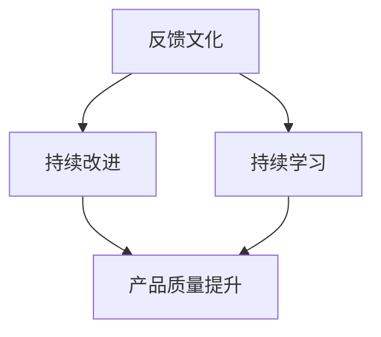
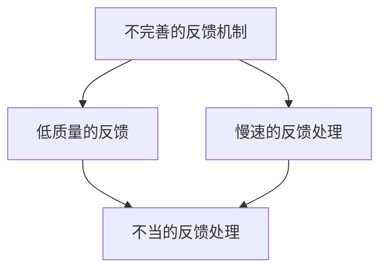
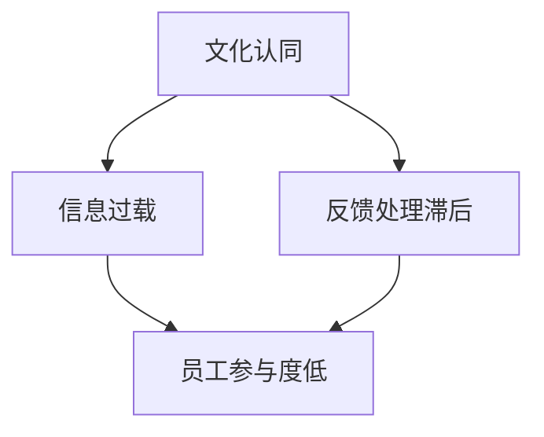

                 

### 文章标题

《建立反馈文化：促进持续改进和学习》

### 关键词

- 反馈文化
- 持续改进
- 学习
- 开放式沟通
- 信任与尊重
- 技术工具与平台
- 评估与持续改进

### 摘要

本文深入探讨了反馈文化在组织内部的作用和重要性，从概念解析到具体实施方法，详细阐述了如何建立一个有效的反馈循环体系。通过分析反馈文化的核心原则、设计反馈流程、技术工具的选择和应用，以及评估与持续改进的策略，本文为IT领域提供了一个全面、实用的指南，以促进组织内部的持续改进和学习。

### 目录

#### 第一部分：引言

## 第1章：为何需要建立反馈文化

### 1.1 反馈文化的概念与重要性

### 1.2 当前组织反馈文化的现状

### 1.3 建立反馈文化的挑战

## 第2章：反馈文化的核心原则

### 2.1 开放式沟通

### 2.2 信任与尊重

### 2.3 反馈的频率与形式

### 2.4 反馈的接收与处理

#### 第二部分：建立反馈文化的方法

## 第3章：创建反馈循环

### 3.1 设计反馈流程

### 3.2 促进反馈沟通

### 3.3 实施反馈机制

### 3.4 跟踪反馈效果

## 第4章：培养反馈习惯

### 4.1 提升反馈技能

### 4.2 培养反馈意识

### 4.3 增强反馈接收能力

### 4.4 反馈教育与培训

## 第5章：技术工具与平台

### 5.1 反馈管理工具

### 5.2 在线反馈平台

### 5.3 数据分析与反馈优化

## 第6章：案例研究与最佳实践

### 6.1 成功案例分享

### 6.2 失败案例反思

### 6.3 行业最佳实践

## 第7章：评估与持续改进

### 7.1 反馈文化评估指标

### 7.2 反馈文化改进策略

### 7.3 持续改进机制

#### 第三部分：附录

## 附录A：反馈文化建立实用指南

### A.1 制定反馈计划

### A.2 实施反馈策略

### A.3 反馈文化评估工具

## 附录B：反馈文化相关资源

### B.1 反馈文化研究论文

### B.2 反馈文化相关书籍

### B.3 反馈文化在线课程与培训

### 第1章：为何需要建立反馈文化

#### 1.1 反馈文化的概念与重要性

反馈文化是一种组织内部通过系统化的方法来收集、处理和利用反馈信息，以促进持续改进和学习的过程。它不仅仅是一种工具或流程，更是一种价值观和文化的体现。在IT领域，反馈文化尤为重要，因为它直接影响到产品的质量、团队的协作效率以及组织的创新能力。

**核心概念与联系：**  
反馈文化（Feedback Culture）与持续改进（Continuous Improvement）和持续学习（Continuous Learning）密切相关。持续改进强调通过不断调整和优化流程、产品和服务来提高质量，而持续学习则强调通过不断学习和适应新技术、新方法来保持竞争力。反馈文化作为连接两者的桥梁，为持续改进和持续学习提供了信息和动力。

**Mermaid流程图：**  


**核心算法原理讲解：**  
反馈文化中的核心算法原理是信息流的循环利用。通过建立一个高效的反馈循环机制，组织可以不断地收集用户反馈、内部评估和外部评价，将这些信息转化为改进的方向和具体的行动方案。

```python
def feedback_loop(feedback):
    # 收集反馈信息
    analyze_feedback(feedback)
    # 制定改进计划
    improvement_plan = create_improvement_plan(feedback)
    # 实施改进计划
    apply_improvement_plan(improvement_plan)
    # 再次收集反馈
    new_feedback = collect_feedback()
    # 返回反馈循环
    return new_feedback
```

**数学模型和公式：**  
在反馈文化的数学模型中，反馈的收集和处理可以通过以下公式表示：

$$
反馈效应 = f(\text{反馈质量}, \text{反馈速度}, \text{处理效率})
$$

其中，反馈质量、反馈速度和处理效率是影响反馈效应的关键因素。

**举例说明：**  
假设一个IT公司想要通过反馈文化来提高其产品的用户体验。公司可以通过以下步骤来实施：

1. **收集反馈：** 通过用户调查、产品评论和客户支持渠道收集用户反馈。
2. **分析反馈：** 分析反馈中的共性问题和痛点，确定改进的方向。
3. **制定改进计划：** 根据分析结果制定具体的改进措施，如优化界面设计、增加新功能等。
4. **实施改进：** 实施改进计划，并确保新的产品版本能够解决用户反馈中的问题。
5. **再次收集反馈：** 发布新版本后，再次收集用户的反馈，评估改进效果。

**项目实战：**  
在一个具体的IT项目中，建立反馈文化的步骤可以如下：

1. **项目启动：** 明确项目目标和预期成果，制定初步的反馈计划。
2. **项目执行：** 在项目执行过程中，定期收集团队成员和用户的反馈。
3. **反馈分析：** 分析反馈，识别问题并提出解决方案。
4. **迭代改进：** 根据反馈结果对项目进行迭代改进。
5. **项目评估：** 在项目结束后，对整个反馈过程进行评估，总结经验教训，为未来的项目提供参考。

#### 1.2 当前组织反馈文化的现状

当前，许多组织已经认识到反馈文化的重要性，但在实际操作中仍然存在许多挑战。以下是一些常见的反馈文化现状：

- **反馈机制不完善：** 许多组织的反馈机制不够系统化，缺乏明确的流程和标准。
- **反馈质量不高：** 反馈往往流于形式，缺乏具体的数据和实例支持，难以转化为有效的改进措施。
- **反馈速度慢：** 反馈信息的传递和处理速度较慢，导致改进措施的及时性不足。
- **反馈处理不当：** 反馈往往被忽视或处理不当，无法激发团队和用户的改进动力。

**图表说明：**  
下图展示了当前组织反馈文化中的常见问题：



#### 1.3 建立反馈文化的挑战

建立反馈文化并非易事，它面临着一系列的挑战。以下是一些主要的挑战及其应对策略：

1. **文化认同：** 组织内部可能缺乏对反馈文化的认同感，认为反馈是一种负担而非机会。
   - **策略：** 通过培训和宣传，提高员工对反馈文化的认识和重视，使其成为组织文化的一部分。

2. **信息过载：** 反馈信息可能会过多，导致难以处理和优先级划分。
   - **策略：** 建立有效的过滤和分类机制，确保反馈信息的质量和效率。

3. **反馈处理滞后：** 反馈的处理速度可能无法跟上反馈的收集速度，导致改进措施延迟。
   - **策略：** 通过自动化工具和流程优化，提高反馈处理的效率。

4. **员工参与度低：** 员工可能不愿意提供反馈或对反馈处理结果感到失望。
   - **策略：** 建立积极的反馈氛围，鼓励员工参与反馈过程，并确保反馈能够得到及时和有效的处理。

**Mermaid流程图：**  


通过以上分析，我们可以看到建立反馈文化的重要性和面临的挑战。在接下来的章节中，我们将详细探讨如何建立反馈文化的核心原则、方法以及技术工具和应用，帮助组织实现持续改进和学习。

