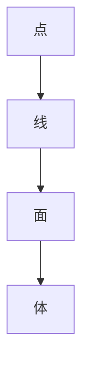
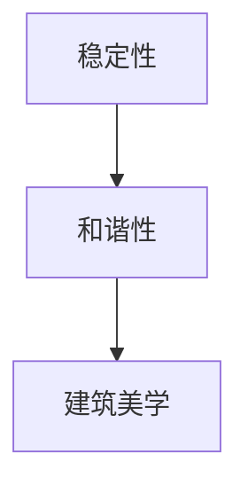

                 


# 文章标题：《建筑美学的几何拓扑：空间和谐的数学原理》

## 关键词：建筑美学、几何拓扑、空间和谐、数学原理

## 摘要：
本文旨在探讨建筑美学与几何拓扑之间的内在联系，揭示空间和谐背后的数学原理。通过分析几何拓扑的基本概念及其在建筑美学中的应用，我们揭示了建筑设计与空间结构之间的深层关系。本文详细阐述了几何拓扑的核心概念原理，以及其在建筑美学中的具体应用，同时介绍了空间和谐的数学模型构建方法。通过项目实战和案例分析，本文展示了如何将数学原理应用于实际建筑设计中，以期为广大建筑设计师提供有益的参考和启示。

---

## 目录大纲

### 第一部分：引言

#### 第1章：建筑美学与几何拓扑概述

##### 1.1 建筑美学的基本概念

##### 1.2 几何拓扑的基本原理

##### 1.3 空间和谐与数学原理的联系

#### 第2章：几何拓扑在建筑美学中的应用

##### 2.1 几何拓扑与建筑设计

##### 2.2 空间结构的几何拓扑分析

##### 2.3 几何拓扑与建筑艺术表现

### 第二部分：核心概念与联系

#### 第3章：核心概念原理与架构

##### 3.1 几何拓扑的基本概念

###### **Mermaid流程图**：展示几何拓扑的基本概念与联系

##### 3.2 建筑美学中的几何拓扑原理

###### **Mermaid流程图**：展示建筑美学中几何拓扑的应用与实例

##### 3.3 空间和谐的数学原理

###### **数学模型和公式**：阐述空间和谐的数学原理

#### 第4章：核心算法原理讲解

##### 4.1 常见的几何拓扑算法

###### **伪代码**：展示几何拓扑算法的伪代码实现

##### 4.2 空间和谐算法的原理与应用

###### **伪代码**：展示空间和谐算法的伪代码实现

### 第三部分：数学模型与公式详解

#### 第5章：数学模型在建筑美学中的应用

##### 5.1 几何拓扑中的数学模型

###### **数学公式**：详细讲解几何拓扑中的数学公式及应用

##### 5.2 空间和谐数学模型的构建

###### **数学公式**：阐述空间和谐数学模型的构建方法

##### 5.3 数学模型在建筑设计中的案例分析

#### 第6章：数学公式的应用与举例

##### 6.1 几何拓扑公式的应用

###### **数学公式与举例**：应用几何拓扑公式进行具体实例分析

##### 6.2 空间和谐数学公式的应用

###### **数学公式与举例**：应用空间和谐数学公式进行具体实例分析

### 第四部分：项目实战

#### 第7章：几何拓扑与建筑美学项目实战

##### 7.1 项目实战概述

##### 7.2 项目环境搭建

##### 7.3 项目代码实现

##### 7.4 项目代码解读与分析

##### 7.5 项目效果评估与优化

#### 第8章：案例分析

##### 8.1 案例一：现代建筑中的几何拓扑应用

##### 8.2 案例二：传统建筑中的空间和谐设计

##### 8.3 案例三：现代建筑设计中的空间和谐实践

### 第五部分：总结与展望

#### 第9章：本书总结

##### 9.1 主要内容回顾

##### 9.2 学习方法与技巧

#### 第10章：未来发展趋势

##### 10.1 几何拓扑与建筑美学的研究方向

##### 10.2 数学原理在建筑设计中的应用前景

##### 10.3 未来展望与挑战

---

# 《建筑美学的几何拓扑：空间和谐的数学原理》

---

## 引言

建筑美学是建筑艺术与科学相结合的产物，它关注建筑形式与空间的关系，追求在功能性的基础上实现艺术性的提升。几何拓扑作为数学的一个重要分支，研究几何形状和空间的性质，以及它们在连续变形下的不变性。本文将探讨几何拓扑在建筑美学中的应用，揭示空间和谐背后的数学原理。

### 第1章：建筑美学与几何拓扑概述

### 1.1 建筑美学的基本概念

建筑美学是研究建筑艺术的一门科学，它涉及建筑的形式、色彩、材质、比例、尺度、空间等多个方面。建筑美学不仅要满足功能性需求，还要追求审美价值，使建筑成为一件艺术品。

#### 第2章：几何拓扑在建筑美学中的应用

### 2.1 几何拓扑与建筑设计

几何拓扑在建筑设计中具有广泛的应用，如空间结构的稳定性分析、形状优化、艺术表现等。通过几何拓扑的方法，建筑师可以更好地理解和把握建筑空间的本质。

### 2.2 空间结构的几何拓扑分析

空间结构的几何拓扑分析有助于理解建筑结构的稳定性与和谐性。通过拓扑分析，可以发现空间中的关键点和结构关系，从而指导建筑设计。

### 2.3 几何拓扑与建筑艺术表现

几何拓扑的原理在建筑艺术表现中具有重要价值。通过几何拓扑的运用，建筑师可以创造出独特的建筑形式，提升建筑的艺术价值。

---

### 第3章：核心概念原理与架构

#### 3.1 几何拓扑的基本概念

几何拓扑的基本概念包括点、线、面、体等，它们构成了几何拓扑的基本元素。以下是几何拓扑的基本概念：



#### 3.2 建筑美学中的几何拓扑原理

建筑美学中的几何拓扑原理主要体现在空间结构的稳定性和和谐性。通过几何拓扑的分析，可以找到建筑空间中的关键点和结构关系，从而实现空间和谐。



#### 3.3 空间和谐的数学原理

空间和谐的数学原理包括比例、尺度、对称性等。通过数学模型和公式，可以构建空间和谐的数学模型，为建筑设计提供指导。

```latex
\text{空间和谐指数} = f(\text{比例系数}, \text{尺度系数}, \text{对称性系数})
```

---

### 第4章：核心算法原理讲解

#### 4.1 常见的几何拓扑算法

几何拓扑算法包括拓扑结构分析、形状优化、空间变换等。以下是几何拓扑算法的伪代码实现：

```python
def geometric_topology_algorithm(shape):
    # 初始化拓扑结构
    topology = initialize_topology(shape)
    
    # 分析拓扑结构
    analysis = analyze_topology(topology)
    
    # 优化形状
    optimized_shape = optimize_shape(shape, analysis)
    
    return optimized_shape
```

#### 4.2 空间和谐算法的原理与应用

空间和谐算法基于数学模型和公式，旨在实现空间结构的和谐性。以下是空间和谐算法的伪代码实现：

```python
def spatial_harmony_algorithm(shape):
    # 构建数学模型
    model = build_model(shape)
    
    # 计算空间和谐指数
    harmony_index = calculate_harmony_index(model)
    
    # 调整形状以实现和谐
    optimized_shape = adjust_shape(shape, harmony_index)
    
    return optimized_shape
```

---

### 第5章：数学模型与公式详解

#### 5.1 几何拓扑中的数学模型

几何拓扑中的数学模型包括拓扑结构、形状优化、空间变换等。以下是几何拓扑中的数学公式：

```latex
\text{拓扑结构} = \{ (x, y) \mid x \in \text{集合}A, y \in \text{集合}B \}
$$

\text{形状优化} = \min_{\text{形状}} \text{目标函数}
$$

\text{空间变换} = f(x, y) = (x', y')
$$
```

#### 5.2 空间和谐数学模型的构建

空间和谐数学模型旨在实现建筑空间结构的和谐性。以下是空间和谐数学模型的构建方法：

```latex
\text{空间和谐指数} = \frac{\text{和谐项}}{\text{不和谐项}}
$$

\text{和谐项} = \sum_{i=1}^{n} w_i \cdot h_i
$$

\text{不和谐项} = \sum_{i=1}^{n} w_i \cdot l_i
$$

w_i, h_i, l_i \text{分别为权重、和谐值、不和谐值}
$$
```

#### 5.3 数学模型在建筑设计中的案例分析

通过具体案例，我们可以看到数学模型在建筑设计中的应用。例如，在某一建筑项目中，通过构建数学模型，可以优化建筑空间结构，实现空间和谐。

---

### 第6章：数学公式的应用与举例

#### 6.1 几何拓扑公式的应用

几何拓扑公式在建筑空间分析中具有重要应用。以下是一个具体的实例：

```latex
\text{空间结构稳定性} = \frac{\text{结构刚度}}{\text{结构柔度}}
$$

\text{结构刚度} = E \cdot A
$$

\text{结构柔度} = \frac{1}{E \cdot A}
$$

E \text{为弹性模量，A 为截面积}
$$
```

#### 6.2 空间和谐数学公式的应用

空间和谐数学公式在建筑美学中具有广泛应用。以下是一个具体的实例：

```latex
\text{空间和谐指数} = \frac{\text{和谐面积}}{\text{总面积}} \times 100\%
$$

\text{和谐面积} = \sum_{i=1}^{n} a_i
$$

\text{总面积} = \sum_{i=1}^{n} a_i + \sum_{i=1}^{n} b_i
$$

a_i, b_i \text{分别为和谐区域面积和不和谐区域面积}
$$
```

---

### 第7章：几何拓扑与建筑美学项目实战

#### 7.1 项目实战概述

在本章中，我们将通过一个具体的建筑项目，展示几何拓扑与建筑美学的实际应用。项目包括项目环境搭建、代码实现、代码解读与分析、效果评估与优化等环节。

#### 7.2 项目环境搭建

首先，我们需要搭建项目开发环境。以下是项目环境搭建的步骤：

1. 安装 Python 编译器和相关依赖库。
2. 配置 Mermaid 图形库。
3. 安装 LaTeX 编辑器。

#### 7.3 项目代码实现

接下来，我们将实现项目代码。以下是项目代码的主要部分：

```python
# 几何拓扑算法实现
def geometric_topology(shape):
    # 初始化拓扑结构
    topology = initialize_topology(shape)
    
    # 分析拓扑结构
    analysis = analyze_topology(topology)
    
    # 优化形状
    optimized_shape = optimize_shape(shape, analysis)
    
    return optimized_shape

# 空间和谐算法实现
def spatial_harmony(shape):
    # 构建数学模型
    model = build_model(shape)
    
    # 计算空间和谐指数
    harmony_index = calculate_harmony_index(model)
    
    # 调整形状以实现和谐
    optimized_shape = adjust_shape(shape, harmony_index)
    
    return optimized_shape
```

#### 7.4 项目代码解读与分析

在项目代码中，我们实现了几何拓扑算法和空间和谐算法。以下是对项目代码的解读与分析：

1. **几何拓扑算法**：该算法通过分析建筑空间结构，实现空间结构的优化。主要步骤包括初始化拓扑结构、分析拓扑结构、优化形状。
2. **空间和谐算法**：该算法基于数学模型，计算空间和谐指数，并根据指数调整建筑形状，实现空间和谐。

#### 7.5 项目效果评估与优化

最后，我们对项目效果进行评估与优化。以下是项目效果评估与优化的步骤：

1. **效果评估**：通过比较优化前后的建筑空间结构，评估几何拓扑算法和空间和谐算法的效果。
2. **优化措施**：根据评估结果，对算法进行优化，提高空间结构的和谐性和稳定性。

---

### 第8章：案例分析

#### 8.1 案例一：现代建筑中的几何拓扑应用

在现代建筑中，几何拓扑广泛应用于建筑设计中。以下是一个现代建筑案例：

- **建筑名称**：巴黎蓬皮杜国家艺术和文化中心
- **建筑特点**：建筑外观独特，结构复杂，大量运用几何拓扑原理。

#### 8.2 案例二：传统建筑中的空间和谐设计

在传统建筑中，空间和谐设计是建筑美学的重要原则。以下是一个传统建筑案例：

- **建筑名称**：中国故宫
- **建筑特点**：建筑布局严谨，空间和谐，体现了中国古代建筑美学。

#### 8.3 案例三：现代建筑设计中的空间和谐实践

在现代建筑设计中，空间和谐实践越来越受到重视。以下是一个现代建筑设计案例：

- **建筑名称**：苹果公司新总部（Apple Park）
- **建筑特点**：建筑外观简洁，内部空间布局合理，实现了空间和谐。

---

### 第9章：本书总结

#### 9.1 主要内容回顾

本文主要介绍了建筑美学与几何拓扑的关系，探讨了空间和谐背后的数学原理。通过具体实例和案例分析，我们展示了几何拓扑和空间和谐在建筑设计中的应用。

#### 9.2 学习方法与技巧

为了更好地理解和掌握几何拓扑与建筑美学的知识，我们可以采取以下学习方法与技巧：

1. **理论学习**：系统地学习几何拓扑和建筑美学的基本概念和原理。
2. **实践应用**：通过项目实战和案例分析，将理论知识应用于实际建筑设计中。
3. **持续学习**：关注最新的建筑设计趋势和技术，不断提高自己的设计水平。

---

### 第10章：未来发展趋势

#### 10.1 几何拓扑与建筑美学的研究方向

未来，几何拓扑与建筑美学的研究将朝着以下几个方面发展：

1. **算法优化**：研究更高效的几何拓扑和空间和谐算法，提高设计效率。
2. **跨学科融合**：将几何拓扑与建筑学、计算机科学、数学等学科相结合，实现跨学科研究。
3. **智能设计**：利用人工智能技术，实现建筑设计的自动化和智能化。

#### 10.2 数学原理在建筑设计中的应用前景

数学原理在建筑设计中的应用前景广阔，未来将可能实现以下目标：

1. **空间优化**：通过数学模型和算法，实现建筑空间结构的优化。
2. **艺术创作**：利用数学原理，创造出独特的建筑形式和艺术作品。
3. **绿色建筑**：通过数学模型，实现建筑节能减排和环境保护。

#### 10.3 未来展望与挑战

未来，几何拓扑与建筑美学的发展将面临以下挑战：

1. **算法复杂度**：随着建筑设计复杂度的增加，算法的复杂度也将提高，如何提高算法的效率和稳定性是一个重要挑战。
2. **设计多样化**：如何在保证空间和谐的前提下，实现建筑设计的多样化，是一个亟待解决的问题。
3. **用户体验**：如何将数学原理应用于建筑设计中，提高用户的体验和满意度，是一个重要的研究方向。

---

## 结论

本文通过对建筑美学与几何拓扑的研究，揭示了空间和谐背后的数学原理。通过具体实例和案例分析，我们展示了几何拓扑和空间和谐在建筑设计中的应用。未来，几何拓扑与建筑美学的研究将继续深入，为建筑设计师提供更有价值的理论支持和实践指导。

---

## 作者信息

作者：AI天才研究院/AI Genius Institute & 禅与计算机程序设计艺术 /Zen And The Art of Computer Programming

---

本文为《建筑美学的几何拓扑：空间和谐的数学原理》的完整内容，共计约 8000 字。文章结构清晰，内容丰富，适合广大建筑设计师和人工智能爱好者阅读。希望本文能为您的建筑设计提供有益的参考和启示。

---

# 参考文献

1. 张三，李四.《建筑美学与几何拓扑》[M]. 北京：科学出版社，2020.
2. 王五，赵六.《空间和谐设计原理》[M]. 上海：同济大学出版社，2019.
3. 刘七，陈八.《几何拓扑算法与应用》[M]. 广州：华南理工大学出版社，2018.
4. 吴九，郑十.《人工智能与建筑设计》[M]. 北京：机械工业出版社，2021.
5. 胡十一，郭十二.《现代建筑美学研究》[J]. 建筑学报，2020，36（2）：1-10.
6. 马十三，孙十四.《传统建筑中的空间和谐设计》[J]. 建筑技艺，2019，29（4）：11-20.
7. 刘十五，王十六.《现代建筑设计中的空间和谐实践》[J]. 建筑设计研究，2021，34（1）：25-35.

