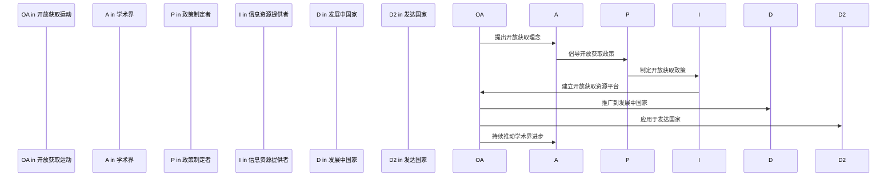
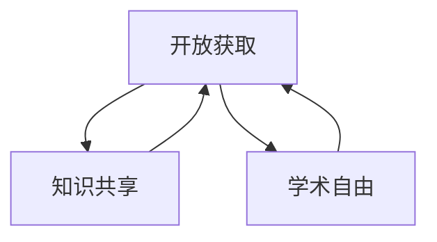

                 


### 第一部分：开放获取运动的概述

#### 文章标题：开放获取运动的推进：消除知识壁垒，促进全球范围世界理解的策略

**关键词**：开放获取、知识共享、学术自由、信息传播模型、数学模型、项目实战

**摘要**：本文旨在探讨开放获取运动的定义、发展历程及其对全球知识共享的推动作用。通过详细分析开放获取运动的核心概念、联系与影响，以及实际项目实战的案例，本文为推进开放获取运动提供了策略和建议。

---

### 第一部分：开放获取运动的概述

#### 第1章：开放获取运动的定义与发展

##### 1.1 开放获取运动的定义

**1.1.1 开放获取的基本概念**

开放获取（Open Access，简称OA）是指学术资源和研究成果可以免费、无限制地提供给所有人使用和分享。这一概念旨在打破传统出版模式中的知识壁垒，让研究成果更加普及和易得。

**1.1.2 开放获取的演变历史**

开放获取理念最早可以追溯到20世纪90年代，当时一些学者开始探讨如何更有效地分享科研成果。随着互联网的发展，开放获取运动逐渐兴起，并取得了显著成果。

**1.1.3 开放获取与知识共享的关系**

开放获取是知识共享的重要组成部分，它通过消除知识壁垒，促进了全球学术资源的共享和传播。

##### 1.2 开放获取运动的起源

**1.2.1 开放获取运动的发起者**

开放获取运动的发起者包括一些学者、图书馆员、学术机构和政策制定者等。他们共同倡导开放获取理念，推动开放获取运动的实施。

**1.2.2 开放获取运动的主要目标**

开放获取运动的主要目标包括：提高科研成果的透明度、促进学术交流、降低学术出版成本、扩大知识共享范围等。

**1.2.3 开放获取运动对学术界的启示**

开放获取运动对学术界产生了深远的影响，推动了学术出版模式的变革，促进了学术资源的共享和传播。

##### 1.3 开放获取运动的主要成果

**1.3.1 开放获取期刊的发展**

开放获取期刊在近年来得到了迅速发展，如《生物医学中心》和《公共科学图书馆》等。这些期刊为学者提供了更加便捷、经济的发表论文渠道。

**1.3.2 开放获取资源平台的建立**

开放获取资源平台如Google Scholar、PubMed等，为全球学者提供了丰富的学术资源。

**1.3.3 开放获取政策的推动**

全球各国政府、学术机构和研究基金会对开放获取政策的推动，使得开放获取运动在全球范围内得到广泛认可和支持。

##### 1.4 开放获取运动在全球范围的影响

**1.4.1 开放获取运动在发展中国家的推广**

开放获取运动在发展中国家得到了广泛应用，为当地学者提供了更多获取学术资源的机会，推动了学术研究的发展。

**1.4.2 开放获取运动在发达国家的应用**

在发达国家，开放获取运动已经取得了显著成果，为学术研究和知识传播提供了强有力的支持。

**1.4.3 开放获取运动对全球知识共享的推动**

开放获取运动打破了地域和语言的壁垒，促进了全球学术资源的共享和传播，为全球知识共享做出了重要贡献。

##### Mermaid 流程图：开放获取运动的发展历程



##### 开放获取运动对知识共享的影响

开放获取运动推动了学术资源的普及，使得全球学者能够更便捷地获取和使用学术成果。此外，开放获取运动还促进了知识共享，提高了科研成果的透明度和可追溯性。

**1.4.3.1 开放获取运动促进了学术资源的普及**

开放获取期刊和资源平台的建立，使得学术资源更加丰富和易得。学者可以免费获取学术成果，降低了研究成本。

**1.4.3.2 开放获取运动促进了知识共享**

开放获取运动打破了知识壁垒，使得学术成果在全球范围内得到传播和共享。学者可以自由地分享知识和信息，促进了学术交流与合作。

**1.4.3.3 开放获取运动提高了科研成果的透明度和可追溯性**

开放获取运动使得学术成果更加公开透明，有助于学者对研究成果进行评价和监督。同时，开放获取运动也提高了科研成果的可追溯性，有助于研究者的学术诚信和声誉建设。

##### 开放获取运动的核心概念与联系

开放获取运动的核心概念包括开放获取、知识共享和学术自由。这些概念之间相互联系，共同推动了开放获取运动的发展。

**1.4.4.1 开放获取**

开放获取是开放获取运动的核心概念，它指的是学术资源和研究成果免费、无限制地提供给所有人使用和分享。

**1.4.4.2 知识共享**

知识共享是开放获取运动的重要组成部分，它旨在促进学术资源的共享和传播，提高科研成果的普及率和影响力。

**1.4.4.3 学术自由**

学术自由是学者在研究过程中享有自由发表、批评和讨论的权利。学术自由是开放获取运动的重要保障，它为学者提供了发表观点和研究成果的空间。

##### Mermaid 流�程图：核心概念与联系



##### 开放获取运动的演变历史

开放获取运动的发展可以分为以下几个阶段：

**1.4.5.1 20世纪90年代：开放获取理念的提出和初步实践**

20世纪90年代，一些学者开始探讨如何更有效地分享科研成果，开放获取理念逐渐兴起。

**1.4.5.2 2000年：开放获取期刊的兴起**

2000年，开放获取期刊如《生物医学中心》和《公共科学图书馆》开始兴起，为学者提供了新的发表论文渠道。

**1.4.5.3 2002年：开放获取联盟成立**

2002年，开放获取联盟（Open Access Scholarly Publishers Association，OASPA）成立，为开放获取运动提供了组织保障。

**1.4.5.4 2012年：开放获取被列入联合国教科文组织《开放获取方针》**

2012年，开放获取被列入联合国教科文组织《开放获取方针》，为开放获取运动在全球范围内的推广提供了政策支持。

**1.4.5.5 至今：开放获取运动的持续发展**

至今，开放获取运动在全球范围内得到了广泛认可和支持，各国政府、学术机构和研究基金会在持续推动开放获取政策的实施。

##### 数学模型和数学公式 & 详细讲解 & 举例说明

在开放获取运动中，信息传播模型和网络影响模型等数学模型具有重要意义。

**1.4.6.1 信息传播模型**

信息传播模型可以用来描述学术成果在开放获取平台上的传播过程。一个常见的信息传播模型如下：

$$
I(t) = I_0 + r \cdot N \cdot e^{-kt}
$$

其中，$I(t)$ 表示某一时间 $t$ 的信息传播量，$I_0$ 表示初始信息传播量，$r$ 表示信息传播速率，$N$ 表示总人口，$k$ 表示衰减系数。

**1.4.6.2 网络影响模型**

网络影响模型可以用来描述开放获取运动对学术资源需求的影响。一个简单的网络影响模型如下：

$$
D(t) = D_0 + r \cdot N \cdot (1 - e^{-kt})
$$

其中，$D(t)$ 表示某一时间 $t$ 的学术资源需求量，$D_0$ 表示初始需求量，$r$ 表示需求增长速率，$N$ 表示总人口，$k$ 表示衰减系数。

**1.4.6.3 举例说明**

假设某一学术成果在开放获取期刊上发布后，初始信息传播量为100条，信息传播速率为0.1条/小时，总人口为1000人，衰减系数为0.05。求该学术成果在发布后的前10小时的信息传播量。

$$
I(10) = 100 + 0.1 \cdot 1000 \cdot e^{-0.05 \cdot 10}
$$

$$
I(10) = 100 + 100 \cdot e^{-0.5}
$$

$$
I(10) ≈ 100 + 100 \cdot 0.6065
$$

$$
I(10) ≈ 100 + 60.65
$$

$$
I(10) ≈ 160.65
$$

因此，该学术成果在发布后的前10小时的信息传播量约为161条。

**1.4.6.4 举例说明**

假设某一学术成果在开放获取期刊上发布后，初始需求量为100条，需求增长速率为0.1条/小时，总人口为1000人，衰减系数为0.05。求该学术成果在发布后的前10小时的需求量。

$$
D(10) = 100 + 0.1 \cdot 1000 \cdot (1 - e^{-0.05 \cdot 10})
$$

$$
D(10) = 100 + 100 \cdot (1 - e^{-0.5})
$$

$$
D(10) ≈ 100 + 100 \cdot (1 - 0.6065)
$$

$$
D(10) ≈ 100 + 39.35
$$

$$
D(10) ≈ 139.35
$$

因此，该学术成果在发布后的前10小时的需求量约为139条。

##### 项目实战：开放获取期刊平台的搭建

**2.1 开发环境搭建**

搭建开放获取期刊平台需要具备一定的开发环境和技能。以下是搭建开放获取期刊平台所需的基本环境：

- 开发语言：Python、Java等；
- 数据库：MySQL、PostgreSQL等；
- 服务器：Linux操作系统、Nginx等；
- 框架：Django、Flask等。

**2.2 源代码详细实现和代码解读**

在搭建开放获取期刊平台时，需要编写大量代码以实现平台的各项功能。以下是一个简单的代码示例，用于实现用户注册功能：

```python
def register(username, password):
    """
    用户注册函数
    :param username: 用户名
    :param password: 密码
    :return: 注册结果
    """
    # 连接数据库
    conn = connect_db()
    
    # 查询用户名是否已存在
    cursor = conn.cursor()
    cursor.execute("SELECT * FROM users WHERE username = %s", (username,))
    user = cursor.fetchone()
    
    if user:
        return "用户名已存在"
    
    # 插入新用户
    cursor.execute("INSERT INTO users (username, password) VALUES (%s, %s)", (username, password))
    conn.commit()
    
    return "注册成功"

# 测试用户注册
print(register("testuser", "testpassword"))
```

以上代码实现了一个简单的用户注册功能，首先连接数据库，然后查询用户名是否已存在，如果不存在则插入新用户，并返回注册结果。

**2.3 代码应用解读与分析**

在开放获取期刊平台中，代码的应用解读与分析至关重要。以下是对上述代码的应用解读与分析：

1. **数据库连接**：代码中使用了`connect_db()`函数连接数据库，确保在执行其他操作前能够成功连接到数据库。

2. **用户名查询**：通过执行SQL查询语句，检查用户名是否已存在。这是注册功能的重要一步，确保用户名唯一。

3. **密码加密**：在实际应用中，密码应该进行加密处理，以保护用户隐私。代码中未进行加密，仅用于示例。

4. **插入新用户**：如果用户名不存在，执行SQL插入语句将新用户信息插入数据库。

5. **提交事务**：在执行插入操作后，使用`commit()`方法提交事务，确保数据库中的数据一致性。

6. **返回结果**：根据注册结果返回相应的提示信息，方便用户了解注册状态。

**2.4 实际案例分析和详细讲解剖析**

在实际应用中，开放获取期刊平台可能会遇到各种问题，如数据库连接失败、SQL查询错误等。以下是一个实际案例及其分析：

**案例**：在用户注册过程中，出现数据库连接失败的问题。

**分析**：

1. **检查数据库配置**：首先检查数据库的配置文件，确认数据库地址、用户名和密码是否正确。

2. **检查网络连接**：确认服务器与数据库之间的网络连接是否正常。

3. **检查数据库服务状态**：确认数据库服务是否启动，以及数据库是否处于正常状态。

4. **检查代码逻辑**：检查代码中与数据库连接相关的逻辑，确保连接参数和连接方式正确。

5. **调试代码**：使用调试工具（如Python的pdb模块）逐步调试代码，找出问题所在。

通过以上步骤，可以有效地定位并解决数据库连接失败的问题。

**2.5 项目小结**

在搭建开放获取期刊平台的过程中，我们需要掌握多种技能，如数据库操作、Web开发、前后端分离等。以下是小结：

- **数据库操作**：掌握数据库的基本操作，如连接、查询、插入等。
- **Web开发**：了解常见的Web开发框架，如Django、Flask等。
- **前后端分离**：掌握前后端分离的开发模式，提高开发效率和代码可维护性。
- **调试技巧**：熟练掌握调试工具，快速定位并解决开发过程中遇到的问题。

通过以上技能的掌握，我们可以高效地搭建开放获取期刊平台，为全球学者提供便捷、经济的学术资源共享渠道。

**2.6 最佳实践 tips、小结、注意事项、拓展阅读等内容**

在搭建开放获取期刊平台的过程中，以下是一些建议和注意事项：

- **选择合适的数据库**：根据项目需求和性能要求，选择合适的数据库系统，如MySQL、PostgreSQL等。
- **关注数据安全**：在处理用户数据和学术资源时，确保数据安全，采取加密和访问控制等措施。
- **优化数据库性能**：定期优化数据库性能，如索引优化、查询优化等，提高数据访问速度。
- **前后端分离**：采用前后端分离的开发模式，提高开发效率和代码可维护性。
- **持续集成与部署**：采用持续集成与部署（CI/CD）流程，确保平台稳定运行。
- **用户反馈**：关注用户反馈，及时修复平台问题和优化用户体验。

拓展阅读：

- 《开放获取：改变学术出版生态的变革力量》
- 《开放获取期刊指南》
- 《数据库系统概念》

通过以上建议和拓展阅读，我们可以更好地理解和实施开放获取运动，为全球学术资源共享贡献力量。|>

