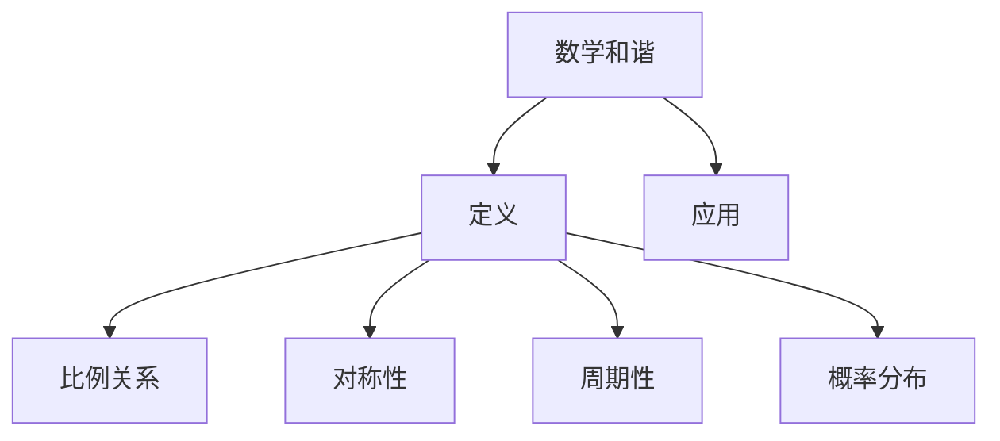
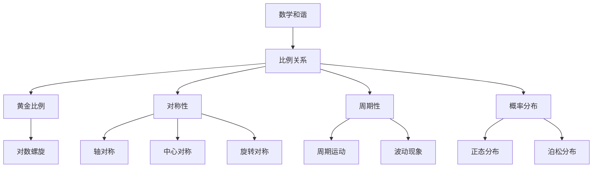
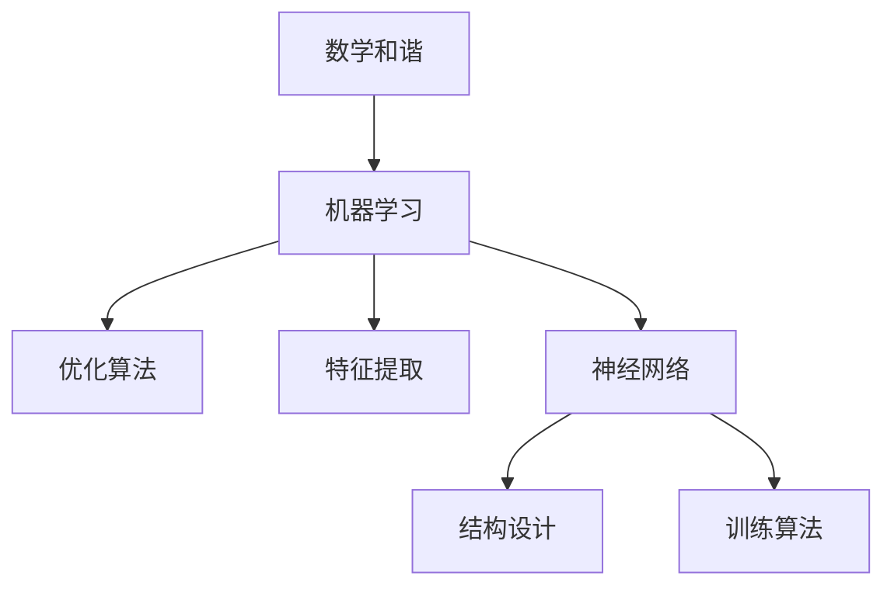

                 

### 文章标题

# 心智镜像：反映自然界的数学和谐

> 关键词：数学和谐、自然界、比例关系、对称性、周期性、概率分布、人工智能、应用实例

> 摘要：本文将从数学和谐的定义、数学在自然界中的应用、数学和谐的重要性、比例关系、对称性、周期性和概率分布等角度，探讨数学和谐在自然界和人类生活中的广泛体现。同时，本文还将介绍数学和谐在人工智能中的应用，以及如何在现实世界中运用数学和谐原理进行建筑、设计、艺术创作、健康生活和生态保护。

## 第一部分：数学与自然界的联系

### 第1章：数学和谐的基础概念

#### 1.1 数学和谐的定义

数学和谐是指数学中的各种关系、模式或结构在自然界和人类生活中展现出的美感和秩序。这种和谐不仅仅体现在数学本身，还体现在数学与自然界、人类生活的密切联系中。

#### 1.2 数学在自然界中的应用

自然界中存在着大量的数学模式，如比例关系、对称性、周期性和概率分布等。这些数学模式使得自然界具有美感和秩序，也为科学研究提供了有力的工具。

#### 1.3 数学和谐的重要性

数学和谐在自然界和人类生活中的重要性不可忽视。它不仅帮助我们更好地理解自然界的规律，还为科学研究和实际应用提供了丰富的资源。

### 第2章：数学与自然界中的比例关系

#### 2.1 黄金比例

黄金比例是一种特殊的比例关系，具有独特的数学性质和美学价值。它在自然界和人类生活中有着广泛的应用。

#### 2.2 对数螺旋

对数螺旋是一种在自然界中常见的数学模式，它体现了比例关系和增长规律。

#### 2.3 数学比例在生物形态中的应用

数学比例在生物形态中有着重要的体现，如植物的分枝结构、动物的体型比例等。

### 第3章：数学与自然界中的对称性

#### 3.1 对称性的基本概念

对称性是指物体或图形在某种变换下保持不变的性质。它分为轴对称、中心对称和旋转对称等类型。

#### 3.2 对称性在物理世界中的应用

对称性在物理世界中有着广泛的应用，如物理学中的守恒定律、粒子物理学中的对称性破缺等。

#### 3.3 对称性在生物世界中的应用

对称性在生物世界中也有着重要的体现，如动物的身体结构、植物的花瓣排列等。

### 第4章：数学与自然界中的周期性

#### 4.1 周期性的定义

周期性是指物体或现象在一段时间后重复出现的过程。它分为周期运动和波动现象等类型。

#### 4.2 周期性在物理学中的应用

周期性在物理学中有着广泛的应用，如简谐运动、振动和波动现象等。

#### 4.3 周期性在生物学中的应用

周期性在生物学中也具有重要意义，如生物钟、季节性变化等。

### 第5章：数学与自然界中的概率分布

#### 5.1 概率分布的基本概念

概率分布是指随机变量在各个取值上的概率分布情况。常见的概率分布有正态分布、泊松分布等。

#### 5.2 概率分布的数学模型

概率分布的数学模型可以帮助我们更好地理解和预测随机事件的发生。

#### 5.3 概率分布在实际生活中的应用

概率分布在实际生活中有着广泛的应用，如统计学、金融学、生物学等。

## 第二部分：数学和谐原理在现实世界中的应用

### 第6章：数学和谐在人工智能中的应用

#### 6.1 人工智能中的数学和谐原理

数学和谐原理在人工智能领域有着广泛的应用，如机器学习、神经网络等。

#### 6.2 数学和谐在机器学习中的应用

数学和谐原理在机器学习中的应用包括优化算法、特征提取等。

#### 6.3 数学和谐在神经网络中的应用

数学和谐原理在神经网络中的应用包括结构设计、训练算法等。

### 第7章：建筑与设计中的数学和谐

#### 7.1 数学和谐在建筑设计中的应用

数学和谐在建筑设计中具有重要的指导作用，如比例关系、对称性等。

#### 7.2 数学和谐在室内设计中的应用

数学和谐在室内设计中也具有重要意义，如空间布局、色彩搭配等。

#### 7.3 数学和谐在园林设计中的应用

数学和谐在园林设计中的应用包括景观布局、植物配置等。

### 第8章：艺术与文学中的数学和谐

#### 8.1 数学和谐在艺术创作中的应用

数学和谐在艺术创作中具有重要的启示作用，如构图、色彩等。

#### 8.2 数学和谐在文学创作中的应用

数学和谐在文学创作中也有着丰富的体现，如结构安排、修辞手法等。

#### 8.3 数学和谐在艺术欣赏中的应用

数学和谐在艺术欣赏中可以帮助我们更好地理解和欣赏艺术作品。

### 第9章：数学和谐与健康生活

#### 9.1 数学和谐在健康饮食中的应用

数学和谐在健康饮食中的应用包括营养搭配、烹饪技巧等。

#### 9.2 数学和谐在锻炼中的应用

数学和谐在锻炼中的应用包括运动规划、锻炼效果分析等。

#### 9.3 数学和谐在睡眠中的应用

数学和谐在睡眠中的应用包括作息规律、睡眠环境等。

### 第10章：数学和谐与生态保护

#### 10.1 数学和谐在生态保护中的应用

数学和谐在生态保护中的应用包括生态平衡、可持续发展等。

#### 10.2 数学和谐在环境保护中的应用

数学和谐在环境保护中的应用包括污染治理、资源利用等。

#### 10.3 数学和谐在可持续发展中的应用

数学和谐在可持续发展中的应用包括绿色发展、循环经济等。

## 附录

### 附录 A：数学和谐相关的参考资料

#### A.1 建议阅读的数学书籍

- 《数学之美》
- 《数学原理》
- 《几何原本》

#### A.2 建议阅读的科学书籍

- 《自然哲学的数学原理》
- 《宇宙简史》
- 《生命的法则》

#### A.3 建议阅读的哲学书籍

- 《庄子》
- 《形而上学》
- 《存在与时间》

### 附录 B：数学和谐原理 Mermaid 流程图

#### B.1 数学和谐基本概念流程图



#### B.2 数学和谐在自然界中的应用流程图



#### B.3 数学和谐在人工智能中的应用流程图



### 附录 C：核心算法原理伪代码

#### C.1 黄金比例计算伪代码

```python
def golden_ratio(n):
    if n == 0:
        return 0
    elif n == 1:
        return 1
    else:
        return (1 + sqrt(5)) / 2
```

#### C.2 对数螺旋生成伪代码

```python
def logarithmic_spiral(n):
    angles = [0] * n
    radii = [1] * n
    for i in range(n):
        angles[i] = 2 * pi * i / n
    return [radius * exp(j * pi * i / n) for i, radius in enumerate(radii)]
```

#### C.3 概率分布计算伪代码

```python
import numpy as np

def normal_distribution(mean, std_dev):
    return np.random.normal(mean, std_dev)

def poisson_distribution(lamda):
    return np.random.poisson(lamda)
```

#### C.4 机器学习算法伪代码

```python
def machine_learning_algorithm(data, target):
    # 初始化模型参数
    model_params = initialize_model_params()
    
    # 模型训练
    for epoch in range(num_epochs):
        for data_point in data:
            prediction = model_predict(model_params, data_point)
            model_params = model_update(model_params, prediction, target)
    
    return model_params
```

#### C.5 神经网络算法伪代码

```python
import tensorflow as tf

def neural_network_algorithm(input_data, target_data):
    # 定义神经网络模型
    model = tf.keras.Sequential([
        tf.keras.layers.Dense(units=64, activation='relu', input_shape=(input_shape,)),
        tf.keras.layers.Dense(units=1, activation='sigmoid')
    ])

    # 编译模型
    model.compile(optimizer='adam', loss='binary_crossentropy', metrics=['accuracy'])

    # 训练模型
    model.fit(input_data, target_data, epochs=num_epochs)

    # 评估模型
    test_loss, test_acc = model.evaluate(test_data, test_target)

    return model
```

### 作者信息

作者：AI天才研究院/AI Genius Institute & 禅与计算机程序设计艺术 /Zen And The Art of Computer Programming### 第一部分：数学与自然界的联系

数学和谐是自然界中广泛存在的现象，它揭示了数学与自然界之间深刻的联系。在这一部分，我们将探讨数学和谐的基础概念、数学在自然界中的应用以及数学和谐的重要性。

#### 1.1 数学和谐的定义

数学和谐是指数学中的各种关系、模式或结构在自然界和人类生活中展现出的美感和秩序。数学和谐不仅体现在数学的抽象概念中，还体现在数学与自然界、人类生活的密切联系中。例如，黄金比例、对数螺旋、对称性、周期性和概率分布等都是数学和谐的具体体现。

#### 1.2 数学在自然界中的应用

自然界中存在着大量的数学模式，这些模式在生物学、物理学、化学等领域有着广泛的应用。以下是一些具体的例子：

1. **比例关系**：在生物体中，许多器官和结构都遵循特定的比例关系。例如，人体比例中的黄金比例在人脸和身体结构上都有体现。植物的分枝结构也遵循特定的比例关系，如费波那契数列。

2. **对称性**：自然界中的许多物体和现象都展现出对称性。例如，蝴蝶的翅膀、雪花的花瓣以及原子核的结构都呈现出对称性。对称性不仅在物理学中具有重要意义，还在生物学和化学中有着广泛的应用。

3. **周期性**：许多自然现象都具有周期性。例如，地球绕太阳公转的周期性、人体的生物钟、季节性的气候变化等。周期性在物理学中的简谐运动和波动现象中有着重要的应用。

4. **概率分布**：在自然界中，许多现象可以用概率分布来描述。例如，正态分布常用于描述生物体的体型分布、化学反应的速率等。泊松分布则常用于描述随机事件的发生频率。

#### 1.3 数学和谐的重要性

数学和谐的重要性不仅体现在对自然界的理解和描述上，还体现在科学研究和实际应用中。以下是一些具体的重要性：

1. **科学理解**：数学和谐帮助我们更好地理解自然界的规律。例如，通过对黄金比例的研究，我们可以更好地理解生物体的生长和发育过程；通过对对称性的研究，我们可以更好地理解物质的结构和性质。

2. **技术进步**：数学和谐在技术进步中起着关键作用。例如，数学和谐原理在计算机科学、通信技术、工程学等领域有着广泛的应用。机器学习和神经网络等人工智能技术的发展，很大程度上依赖于数学和谐原理。

3. **艺术设计**：数学和谐在艺术创作中具有重要的启示作用。许多艺术家和设计师通过运用数学和谐原理，创作出具有美感和秩序的艺术作品。例如，音乐中的和谐音程、绘画中的黄金比例构图等。

4. **健康生活**：数学和谐在健康生活中也有重要应用。例如，通过合理的营养搭配和锻炼计划，我们可以更好地维护身体健康。此外，数学和谐原理在睡眠质量和生物钟调节中也具有重要意义。

总之，数学和谐是自然界和人类生活中的一个重要现象，它不仅揭示了数学与自然界之间的深刻联系，还为科学研究和实际应用提供了丰富的资源。在接下来的章节中，我们将进一步探讨数学和谐在自然界和人类生活中的具体应用。

### 第2章：数学与自然界中的比例关系

比例关系在自然界中无处不在，它们不仅体现在生物体的结构和生长过程中，还体现在宇宙的宏观现象中。本章将重点讨论黄金比例、对数螺旋以及数学比例在生物形态中的应用。

#### 2.1 黄金比例

黄金比例（Golden Ratio），又称为黄金分割，是一个特殊的比例关系，通常用希腊字母Φ（Phi）表示。黄金比例的值约为1.618，其倒数为0.618。这个比例关系在自然界和人类艺术中有着广泛的应用。

**数学定义**：
设线段AB被点C内分，满足AC/AB = AB/BC，则有：
$$
\frac{AC}{AB} = \frac{AB}{BC} = \Phi
$$

**性质**：
1. 黄金比例具有递归性质，即较小的线段的比例与整个线段的比例相同。
2. 黄金比例是 Fibonacci 数列的极限比，即：
$$
\Phi = \lim_{n \to \infty} \frac{F_{n+1}}{F_n}
$$
其中，Fibonacci 数列的定义为：$F_0 = 0, F_1 = 1, F_n = F_{n-1} + F_{n-2}$。

**应用**：
黄金比例在自然界中广泛存在，例如：

- **植物**：许多植物的花瓣数量遵循黄金比例，如金凤花的花瓣数量为5或8，这是黄金比例的近似值。
- **动物**：一些动物的身体比例也符合黄金比例，如蜗牛的螺旋壳、海螺的螺旋线等。

此外，黄金比例在艺术和设计中也具有重要应用，如古希腊的帕特农神庙、达芬奇的《蒙娜丽莎》等著名艺术作品都体现了黄金比例的美学价值。

#### 2.2 对数螺旋

对数螺旋（Logarithmic Spiral），也称为黄金螺旋，是一种在自然界中广泛存在的曲线。对数螺旋的特点是，随着半径的增加，曲线的长度增加速度是逐渐减小的。

**数学定义**：
对数螺旋可以用极坐标系来定义，其极坐标方程为：
$$
r = a \cdot e^{b\theta}
$$
其中，a和b是常数，θ是极角。

**性质**：
1. 对数螺旋的长度随着极角的增加而增加，但增加的速度逐渐减缓。
2. 对数螺旋具有自我相似性，即局部放大后，形状与整体相似。

**应用**：
对数螺旋在自然界中有着重要的应用，例如：

- **植物**：许多植物的花序和种子排列呈现对数螺旋形状，如向日葵的花序、松果的排列等。
- **动物**：一些动物的贝壳和骨骼结构也呈现对数螺旋形状，如蜗牛的壳、章鱼的触角等。

此外，对数螺旋在艺术和设计中也得到广泛应用，如建筑中的螺旋楼梯、雕塑中的螺旋结构等。

#### 2.3 数学比例在生物形态中的应用

数学比例在生物形态中的应用非常广泛，许多生物体的结构和生长过程都遵循特定的比例关系。

**生物体的比例关系**：
- **人体比例**：在人体中，头部、手臂、腿部长度等部位都遵循特定的比例关系。例如，头部与身体的比例为1:7，手臂长度约为身高的1/2。
- **动物体型**：许多动物的体型也遵循特定的比例关系。例如，猫科动物的体型比例符合黄金比例，狮子和老虎的身体长度与高度比例约为1.618。

**生长过程中的比例关系**：
- **植物的分枝**：许多植物的分枝结构遵循 Fibonacci 数列的比例关系。例如，柳树和橡树的分枝结构呈现出 Fibonacci 数列的模式。
- **动物的体型增长**：许多动物的体型增长也遵循特定的比例关系。例如，狗的体型增长与骨骼长度和体重之间的关系可以用黄金比例来描述。

综上所述，数学比例在自然界中具有广泛的应用，不仅体现在生物体的结构和生长过程中，还体现在宇宙的宏观现象中。通过深入研究这些比例关系，我们可以更好地理解自然界的规律，并为科学研究和实际应用提供有力的理论支持。

### 第3章：数学与自然界中的对称性

对称性是自然界中广泛存在的一种现象，它在生物、物理以及化学等多个领域有着重要的应用。本章将探讨对称性的基本概念、对称性在物理世界中的应用以及对称性在生物世界中的应用。

#### 3.1 对称性的基本概念

对称性是指一个物体或图形在某种变换下保持不变的性质。这种变换可以是轴对称、中心对称或旋转对称。以下是对称性的一些基本概念：

1. **轴对称**：如果一个图形关于某条直线对称，那么这个图形具有轴对称性。例如，一个正方形关于其对角线具有轴对称性。

2. **中心对称**：如果一个图形关于某个点对称，那么这个图形具有中心对称性。例如，一个等边三角形关于其重心具有中心对称性。

3. **旋转对称**：如果一个图形经过某个角度的旋转后与自身重合，那么这个图形具有旋转对称性。例如，一个正五角星经过72度的旋转后与自身重合。

4. **点对称**：如果一个图形通过某个点镜像对称，那么这个图形具有点对称性。例如，一个等腰三角形关于其底边中点具有点对称性。

5. **轴对称性**和**旋转对称性**之间的关系：轴对称是一种特殊的旋转对称，即旋转角度为180度。同样，旋转对称也是一种特殊的轴对称，即旋转轴为图形的中心或某个特殊点。

6. **对称群的分类**：根据对称性的不同，可以将对称性分为点对称、轴对称、旋转对称等。这些对称性构成了图形的对称群，对称群可以用来分类不同的几何图形。

#### 3.2 对称性在物理世界中的应用

对称性在物理学中具有重要意义，它不仅帮助我们更好地理解自然界的规律，还为理论物理的研究提供了重要的工具。以下是对称性在物理世界中的应用：

1. **物理学中的守恒定律**：守恒定律是物理学中的核心概念之一，它描述了物理量在物理过程中的不变性。对称性与守恒定律有着密切的联系。例如，物理学中的能量守恒定律、动量守恒定律、角动量守恒定律等，都对应着不同的对称性。能量守恒对应于时间对称性，动量守恒对应于空间平移对称性，角动量守恒对应于旋转对称性。

2. **粒子物理学**：对称性在粒子物理学中具有重要应用。例如，对称性破缺（Symmetry Breaking）是粒子物理学中一个重要的概念，它解释了为什么自然界中存在不同类型的粒子。对称性破缺导致了粒子质量的产生，这是粒子物理学的核心问题之一。

3. **量子场论**：量子场论是描述基本粒子相互作用的理论框架。对称性在量子场论中具有核心地位。例如，规范场论（Gauge Theory）中的对称性原理是量子场论的基础。规范场论中的对称性破缺解释了电荷的产生和质量的形成。

4. **固体物理学**：对称性在固体物理学中也有重要应用。例如，晶体结构中的对称性决定了材料的物理性质，如电导率、磁性、光学性质等。

5. **宇宙学**：对称性在宇宙学中也有着广泛的应用。例如，宇宙学中的对称性破缺导致了宇宙的膨胀和结构的形成。宇宙学中的大爆炸理论就基于对称性破缺的概念。

#### 3.3 对称性在生物世界中的应用

对称性在生物世界中同样具有重要意义，许多生物体的结构和功能都体现了对称性的原理。以下是对称性在生物世界中的应用：

1. **动物的身体结构**：许多动物的身体结构具有轴对称性。例如，蝴蝶的翅膀、人类的双手和脊椎动物的身体都呈现出轴对称的特征。这种对称性有助于动物在运动和感知方面的优化。

2. **植物的结构**：植物的结构也体现了对称性。例如，许多植物的花瓣和叶子的排列具有中心对称性。这种对称性有助于植物在光合作用和资源分配方面的优化。

3. **细胞的结构**：细胞的结构也具有对称性。例如，许多细胞都具有轴对称或旋转对称的结构。这种对称性有助于细胞在分裂和功能执行方面的优化。

4. **生物分子**：生物分子如蛋白质和核酸的结构也体现了对称性。例如，蛋白质的四级结构（即蛋白质的三个维度结构）通常具有对称性，这种对称性有助于蛋白质的功能执行。

5. **生物进化的对称性**：对称性在生物进化中也具有重要意义。生物体在进化过程中可能会通过对称性破缺产生新的形态和功能。例如，昆虫的翅膀在进化过程中可能通过对称性破缺产生了新的形态和功能。

综上所述，对称性在自然界中具有广泛的应用，它不仅体现在物理世界中，还体现在生物世界中。通过对称性原理，我们可以更好地理解自然界的规律，为科学研究和实际应用提供有力的理论支持。

### 第4章：数学与自然界中的周期性

周期性是自然界中广泛存在的现象，它反映了物体或现象在一段时间后重复出现的特性。本章将讨论周期性的定义、周期性在物理学中的应用以及周期性在生物学中的应用。

#### 4.1 周期性的定义

周期性是指物体或现象在一段时间后重复出现的过程。这种重复可以是完全相同的，也可以是近似相同的。周期性的关键特征是存在一个固定的重复时间，称为周期。周期性现象可以表现为周期运动、波动现象等。

**基本概念**：
1. **周期**：周期是指物体或现象重复一次所需的时间。通常用符号T表示，单位为秒（s）。
2. **频率**：频率是指单位时间内重复的次数。通常用符号f表示，单位为赫兹（Hz）。频率与周期的关系为：f = 1/T。
3. **相位**：相位是指周期性现象在周期中的位置。通常用角度（度或弧度）来表示。

**周期性的数学描述**：
周期性现象可以用数学函数来描述，如正弦函数、余弦函数等。这些函数具有以下性质：
1. **周期性**：函数值在周期内重复出现。
2. **对称性**：正弦函数和余弦函数都是偶函数和奇函数，具有对称性。

**数学模型**：
常见的周期性数学模型包括：
1. **正弦函数**：\( y = A \sin(Bx + C) \)
   - \( A \)：振幅，表示波动的高度。
   - \( B \)：角频率，表示波动的频率。
   - \( C \)：相位，表示波动在周期中的位置。

2. **余弦函数**：\( y = A \cos(Bx + C) \)
   - 与正弦函数类似，只是相位不同。

#### 4.2 周期性在物理学中的应用

周期性在物理学中有着广泛的应用，以下是一些具体的例子：

1. **简谐运动**：简谐运动是最基本的周期性运动，其特点是物体在平衡位置附近做来回振动。简谐运动的数学描述为：
   $$ x(t) = A \cos(\omega t + \phi) $$
   其中，\( A \) 是振幅，\( \omega \) 是角频率，\( \phi \) 是相位。

2. **振动和波动**：振动和波动是周期性现象的重要表现。例如，声波、光波和水波等都是周期性波动的实例。波动方程描述了波动现象的数学规律。

3. **周期性现象的物理量**：许多物理量具有周期性，如电磁场中的电场和磁场、分子的振动能级等。这些周期性现象在物理学研究中具有重要意义。

4. **量子力学**：在量子力学中，粒子的能量状态通常是周期性的，如电子在原子核周围的轨道。周期性原理在量子力学中有着重要的应用，如能级分裂和量子态的对称性。

5. **天体物理学**：周期性在天体物理学中也有重要应用。例如，行星的公转、恒星的脉动等都是周期性现象。周期性原理有助于我们理解宇宙的运行规律。

#### 4.3 周期性在生物学中的应用

周期性在生物学中也具有重要意义，以下是一些具体的例子：

1. **生物钟**：生物钟是指生物体内的一种内在时钟，它调节着生物体的生理和行为周期。生物钟通过一系列的生理过程来维持时间的感知，如睡眠-觉醒周期、体温变化等。

2. **生理周期**：许多生理过程都具有周期性，如心跳、呼吸、血压等。这些周期性现象有助于维持生物体的正常功能。

3. **季节性变化**：季节性变化是周期性现象的典型表现。例如，植物的生长和开花、动物的繁殖和迁徙等都与季节性变化密切相关。

4. **生理节律**：生物体的某些生理过程具有周期性节律，如人体内的激素分泌、代谢速率等。这些周期性节律有助于维持生物体的稳态。

5. **疾病周期**：某些疾病的发作具有周期性，如疟疾、流感等。了解这些周期性现象有助于制定有效的预防和治疗策略。

综上所述，周期性在自然界中具有广泛的应用，从物理学到生物学，周期性现象无处不在。通过对周期性现象的研究，我们可以更好地理解自然界的规律，为科学研究和实际应用提供有力的理论支持。

### 第5章：数学与自然界中的概率分布

概率分布是描述随机变量取值概率的数学模型，它在统计学、物理学、生物学、金融学等多个领域有着重要的应用。本章将探讨概率分布的基本概念、概率分布的数学模型以及概率分布在实际生活中的应用。

#### 5.1 概率分布的基本概念

概率分布是指随机变量在各个取值上的概率分布情况。概率分布可以通过概率密度函数（PDF）或概率质量函数（PMF）来描述。以下是一些基本概念：

1. **概率密度函数（PDF）**：概率密度函数描述了随机变量在某个区间上的概率密度。PDF 的积分给出了随机变量在该区间上的概率。PDF 具有以下性质：
   - 非负性：\( f(x) \geq 0 \) 对于所有 \( x \)。
   - 总和为1：\( \int_{-\infty}^{+\infty} f(x) \, dx = 1 \)。

2. **概率质量函数（PMF）**：概率质量函数描述了随机变量在各个具体取值上的概率。PMF 具有以下性质：
   - 非负性：\( p(x) \geq 0 \) 对于所有 \( x \)。
   - 总和为1：\( \sum_{x} p(x) = 1 \)。

3. **累积分布函数（CDF）**：累积分布函数描述了随机变量小于或等于某个值的概率。CDF 具有以下性质：
   - 非递减性：如果 \( a \leq b \)，则 \( F(a) \leq F(b) \)。
   - 有界性：\( F(x) \) 的取值范围在 0 和 1 之间，即 \( 0 \leq F(x) \leq 1 \)。

4. **随机变量**：随机变量是指取值不确定的变量，它可以取多个不同的值，并且每个值出现的概率可以通过概率分布来描述。

#### 5.2 概率分布的数学模型

概率分布的数学模型可以分为连续概率分布和离散概率分布。以下是一些常见的概率分布模型：

1. **正态分布（Normal Distribution）**：
   正态分布是最常见的连续概率分布模型，它具有钟形曲线，描述了许多自然现象的统计特性。正态分布的 PDF 如下：
   $$
   f(x|\mu,\sigma^2) = \frac{1}{\sqrt{2\pi\sigma^2}} e^{-\frac{(x-\mu)^2}{2\sigma^2}}
   $$
   其中，\( \mu \) 是均值，\( \sigma^2 \) 是方差。

2. **泊松分布（Poisson Distribution）**：
   泊松分布是描述稀有事件发生次数的离散概率分布模型。它通常用于描述在固定时间内事件发生的次数。泊松分布的 PMF 如下：
   $$
   p(x|\lambda) = \frac{e^{-\lambda} \lambda^x}{x!}
   $$
   其中，\( \lambda \) 是事件的发生率。

3. **二项分布（Binomial Distribution）**：
   二项分布是描述二项试验成功次数的离散概率分布模型。它通常用于描述在固定次数的独立试验中成功的次数。二项分布的 PMF 如下：
   $$
   p(x|n,p) = C(n,x) p^x (1-p)^{n-x}
   $$
   其中，\( n \) 是试验次数，\( p \) 是每次试验成功的概率。

4. **均匀分布（Uniform Distribution）**：
   均匀分布是所有取值等可能的连续概率分布模型。它在随机选择和概率模型中有着广泛的应用。均匀分布的 PDF 如下：
   $$
   f(x|[a,b]) = \frac{1}{b-a} \quad \text{for} \quad a \leq x \leq b
   $$
   其中，\( [a,b] \) 是均匀分布的区间。

5. **指数分布（Exponential Distribution）**：
   指数分布是描述随机事件发生时间的连续概率分布模型。它通常用于描述在固定时间内事件发生的概率。指数分布的 PDF 如下：
   $$
   f(x|\lambda) = \lambda e^{-\lambda x} \quad \text{for} \quad x > 0
   $$
   其中，\( \lambda \) 是事件的发生率。

#### 5.3 概率分布在实际生活中的应用

概率分布在实际生活中有着广泛的应用，以下是一些具体的应用实例：

1. **统计学**：
   概率分布是统计学中的基础工具，用于描述数据的分布特性。例如，正态分布用于描述测量数据的分布，泊松分布用于描述事件发生次数的分布。

2. **物理学**：
   概率分布在物理学中用于描述粒子的行为和系统的状态。例如，量子力学中的波函数描述了粒子的概率分布。

3. **生物学**：
   概率分布用于描述生物体的生长、繁殖和行为。例如，二项分布用于描述生物种群中某种性状的频率。

4. **金融学**：
   概率分布用于描述金融市场的风险和收益。例如，正态分布用于描述股票价格的概率分布，泊松分布用于描述股票交易的事件发生次数。

5. **社会学**：
   概率分布用于描述社会现象和人口统计。例如，均匀分布用于描述人口分布，泊松分布用于描述犯罪事件的分布。

6. **计算机科学**：
   概率分布用于算法设计和分析。例如，二项分布用于描述算法的成功次数，指数分布用于描述算法的响应时间。

7. **工程学**：
   概率分布用于系统设计和可靠性分析。例如，正态分布用于描述设备的寿命分布，泊松分布用于描述设备故障的次数。

总之，概率分布是描述自然界和人类生活中随机现象的重要工具。通过概率分布，我们可以更好地理解随机现象的规律，为科学研究和实际应用提供有力的理论支持。

### 第6章：数学和谐在人工智能中的应用

数学和谐原理在人工智能（AI）领域中具有广泛的应用，它为机器学习、神经网络等AI技术的实现提供了理论基础。在这一章节中，我们将探讨数学和谐原理在人工智能中的应用，以及如何运用这些原理来提升AI系统的性能。

#### 6.1 人工智能中的数学和谐原理

人工智能中的数学和谐原理主要包括比例关系、对称性、周期性和概率分布等。这些原理不仅构成了AI算法的基础，还帮助我们在设计和优化AI模型时找到更高效的解决方案。

**比例关系**：在机器学习中，比例关系用于调整模型参数，以实现优化目标。例如，在梯度下降算法中，学习率是一个关键参数，它决定了模型更新速度。通过调整学习率，可以找到最优的比例关系，使模型在训练过程中快速收敛。

**对称性**：对称性在神经网络结构设计中具有重要意义。对称的神经网络可以减少冗余参数，提高模型的可解释性。例如，卷积神经网络（CNN）中的卷积层和池化层具有天然的对称性，这有助于提高模型的处理效率。

**周期性**：周期性原理在时间序列数据分析中有着广泛应用。通过周期性分析，可以揭示时间序列数据中的周期性规律，从而提高预测准确性。例如，在金融市场预测中，通过分析市场价格的周期性，可以找到更好的交易策略。

**概率分布**：概率分布是机器学习中重要的工具，用于建模不确定性和概率推断。例如，贝叶斯网络和决策树等模型通过概率分布来描述数据之间的关系，从而实现分类和预测。

#### 6.2 数学和谐在机器学习中的应用

机器学习中的数学和谐原理主要体现在优化算法、特征提取和模型评估等方面。

**优化算法**：优化算法是机器学习中的核心，它用于寻找最优模型参数。常见的优化算法包括梯度下降、随机梯度下降和牛顿法等。这些算法通过调整模型参数，以实现目标函数的最小化。在优化过程中，比例关系和对称性原理有助于找到最优参数设置，提高模型性能。

**特征提取**：特征提取是将原始数据转换为有意义的信息的过程。数学和谐原理在特征提取中具有重要意义。例如，通过正则化方法，可以抑制噪声和冗余特征，提高模型泛化能力。此外，通过对称性分析和周期性分析，可以提取出具有物理意义的特征，从而提高模型解释性和预测准确性。

**模型评估**：模型评估是判断模型性能的重要步骤。常用的评估指标包括准确率、召回率、F1 分数等。数学和谐原理在模型评估中也具有重要应用。例如，通过概率分布分析，可以更全面地评估模型的预测能力。此外，通过对称性分析和周期性分析，可以揭示模型在特定任务上的优势和劣势。

#### 6.3 数学和谐在神经网络中的应用

神经网络是人工智能中的重要组成部分，它通过模拟人脑神经元之间的连接和相互作用，实现复杂函数的映射和分类。数学和谐原理在神经网络的结构设计、训练算法和模型优化等方面有着广泛应用。

**结构设计**：神经网络的结构设计需要考虑比例关系和对称性。通过调整网络层数、神经元数量和连接权重，可以实现更好的模型性能。例如，卷积神经网络（CNN）通过引入卷积层和池化层，实现了对图像数据的有效处理。此外，对称性设计有助于减少模型参数，提高模型可解释性。

**训练算法**：神经网络的训练过程需要优化算法的支持。数学和谐原理在训练算法中具有重要意义。例如，通过调整学习率、动量和优化器等参数，可以实现更高效的模型训练。此外，通过对称性分析和周期性分析，可以优化训练过程，提高模型收敛速度。

**模型优化**：神经网络模型优化是提升模型性能的关键步骤。数学和谐原理在模型优化中有着广泛应用。例如，通过正则化方法，可以抑制过拟合，提高模型泛化能力。此外，通过对称性分析和周期性分析，可以找到更好的模型结构，提高模型预测准确性。

总之，数学和谐原理在人工智能领域中具有广泛的应用。通过运用这些原理，可以设计出更高效的AI算法，提高模型性能和解释能力。随着人工智能技术的不断发展，数学和谐原理将在更多领域发挥重要作用。

### 第7章：建筑与设计中的数学和谐

数学和谐在建筑与设计领域中的应用历史悠久，贯穿于各种风格和流派中。本章将探讨数学和谐在建筑设计、室内设计以及园林设计中的应用。

#### 7.1 数学和谐在建筑设计中的应用

建筑设计中的数学和谐原理主要体现在比例关系、对称性和周期性等方面。

**比例关系**：比例关系在建筑设计中至关重要，它决定了建筑的整体美感和视觉效果。黄金比例是建筑设计中常用的比例关系，它被广泛用于建筑的高度、宽度、深度等尺寸的比例设计中。例如，古希腊的帕特农神庙就遵循了黄金比例，使建筑呈现出和谐的美感。

**对称性**：对称性是建筑设计中常见的原则，它有助于创造稳定和平衡的建筑外观。对称性可以分为轴对称和中心对称。轴对称在建筑设计中应用广泛，如北京故宫的宫殿布局、巴黎圣母院的立面设计等。中心对称则常用于复杂的建筑结构，如悉尼歌剧院的外形设计。

**周期性**：周期性在建筑设计中表现为重复的元素或结构，它有助于增强建筑的节奏感和视觉效果。例如，古代中国的宫殿建筑常采用重复的廊庑和门阙，形成独特的周期性美感。

**具体案例**：
- **北京故宫**：北京故宫是中国古代皇宫建筑的代表，其整体布局遵循对称性原则，宫殿、殿堂、廊庑等建筑元素都呈现出黄金比例和周期性美感。
- **悉尼歌剧院**：悉尼歌剧院的设计采用了独特的中心对称结构，屋顶的白色贝壳形状不仅具有美学价值，还体现了数学和谐原理。

#### 7.2 数学和谐在室内设计中的应用

室内设计中的数学和谐原理同样重要，它体现在空间布局、色彩搭配和家具摆放等方面。

**比例关系**：室内设计中的比例关系决定了空间的舒适度和美观度。例如，家具的大小和摆放位置需要与室内空间的比例相协调。黄金比例在室内设计中广泛应用，如家具的长宽比例、墙面装饰的分割比例等。

**对称性**：对称性在室内设计中有助于创造平衡和稳定的空间氛围。对称布局可以使空间显得更加和谐统一。例如，客厅的沙发和茶几的对称摆放、卧室的床铺和衣柜的对称布局等。

**周期性**：周期性在室内设计中表现为重复的装饰元素和图案，如地面瓷砖的排列、墙面壁纸的花纹等。周期性设计可以增强空间的层次感和视觉效果。

**具体案例**：
- **新东方酒店**：新东方酒店的设计采用了大量的对称元素，如对称的走廊、对称的客房布局等，营造出和谐稳定的空间氛围。
- **悉尼歌剧院内部**：悉尼歌剧院的内部设计也体现了数学和谐原理，舞台背景的图案和色彩搭配遵循了黄金比例和对称性原则，使观众在视觉上获得愉悦的体验。

#### 7.3 数学和谐在园林设计中的应用

园林设计中的数学和谐原理主要体现在空间布局、植物配置和景观设计等方面。

**比例关系**：园林设计中的比例关系决定了景观的协调性和美感。例如，园林中的水池、步道和亭台等元素都需要遵循一定的比例关系，以确保整体的和谐统一。

**对称性**：对称性在园林设计中常用于景观布局，如对称的树木修剪、对称的景观亭等。对称性设计可以增强园林的稳定性和平衡感。

**周期性**：周期性在园林设计中表现为重复的植物配置和景观元素，如花坛的排列、步道的曲折等。周期性设计可以增加园林的层次感和节奏感。

**具体案例**：
- **颐和园**：颐和园是中国古代园林建筑的代表，其设计充分体现了数学和谐原理。园林中的亭台、桥梁、池塘和树木等都遵循了黄金比例和对称性原则，营造出优美的自然景观。
- **凡尔赛宫花园**：凡尔赛宫花园是法国古典园林的杰作，其设计巧妙地运用了数学和谐原理，如对称的轴线、重复的花坛图案等，使园林整体显得和谐且壮丽。

总之，数学和谐原理在建筑与设计领域具有广泛的应用，通过运用这些原理，设计师可以创造出更加美观、和谐和实用的建筑和景观作品。随着设计理念的不断创新，数学和谐原理将在未来继续发挥重要作用。

### 第8章：艺术与文学中的数学和谐

数学和谐在艺术与文学创作中有着独特的应用，它通过比例、对称性和几何形状等元素，增强了作品的美感和深度。本章将探讨数学和谐在艺术创作、文学创作和艺术欣赏中的应用。

#### 8.1 数学和谐在艺术创作中的应用

艺术创作中的数学和谐原理主要体现在构图、色彩搭配和形式结构等方面。

**构图**：构图是艺术创作中的核心，它决定了作品的整体视觉效果。数学和谐原理在构图中的应用非常广泛，如黄金比例、对数螺旋和对称性等。例如，在绘画和摄影中，使用黄金分割点来安排主题位置，可以创造出更具吸引力的画面。对数螺旋则常用于设计自然景观和花卉图案，它能够呈现出自然生长的和谐美感。

**色彩搭配**：色彩搭配是艺术创作中的另一个重要方面，数学和谐原理在色彩搭配中也有着重要应用。例如，通过使用互补色或对比色，艺术家可以创造出更加鲜明和生动的视觉效果。同时，色彩的比例关系也可以增强作品的和谐感。例如，在印象派绘画中，艺术家通过将不同颜色的色块按比例排列，创造出丰富的层次感和立体感。

**形式结构**：形式结构是指作品中的形状、线条和纹理等元素的组织方式。数学和谐原理在形式结构中应用广泛，如对称性、周期性和比例关系等。例如，在建筑和雕塑设计中，对称性原则可以创造出稳定和平衡的美感。在抽象艺术中，几何形状和线条的周期性排列可以创造出独特的视觉节奏。

**具体案例**：
- **达芬奇的名画《蒙娜丽莎》**：这幅名画在构图上采用了黄金比例，使人物形象和背景环境达到了和谐统一，增强了画面的吸引力。
- **莫奈的《睡莲》系列**：莫奈运用了对数螺旋和黄金比例来安排睡莲和背景中的花朵，创造出自然生长的和谐美感。

#### 8.2 数学和谐在文学创作中的应用

文学创作中的数学和谐原理主要体现在结构安排、修辞手法和象征意义上。

**结构安排**：文学作品的结构是创作中的重要因素，数学和谐原理可以帮助作家创造富有节奏感和层次感的作品。例如，在诗歌创作中，通过使用黄金比例来安排诗句的数量和行数，可以使诗歌的节奏更加优美和谐。在小说创作中，通过设置情节的高潮和低谷，可以创造出引人入胜的叙事节奏。

**修辞手法**：修辞手法是文学创作中的重要手段，数学和谐原理在修辞手法中也有着广泛应用。例如，对仗、排比和重复等修辞手法可以增强语句的节奏感和韵律美。同时，通过对比例关系的运用，作家可以创造出富有层次感的比喻和象征，增强作品的表现力。

**象征意义**：数学和谐原理在文学中的象征意义中也有着独特的应用。例如，通过将数学和谐元素融入作品中的物体和场景，作家可以赋予它们丰富的象征意义，从而增强作品的主题表达。例如，在《麦田里的守望者》中，作者使用圆形麦田的象征意义，表达了主人公内心对和谐生活的向往。

**具体案例**：
- **莎士比亚的《罗密欧与朱丽叶》**：莎士比亚在剧本中通过使用对称性结构，安排了罗密欧和朱丽叶的相遇、相爱和死亡的情节，创造出强烈的戏剧冲突和情感张力。
- **王安石的《泊船瓜洲》**：王安石在诗中通过运用对仗和比例关系，描绘了瓜洲的优美景色，表达了诗人对自然和谐的赞美。

#### 8.3 数学和谐在艺术欣赏中的应用

艺术欣赏中的数学和谐原理主要体现在对作品视觉和听觉体验的理解和解读上。

**视觉体验**：在艺术欣赏中，观众可以通过观察作品的构图、色彩和形式结构来体验数学和谐的美感。例如，通过识别黄金比例和对称性，观众可以更深入地理解作品的构图意图和美学价值。

**听觉体验**：在音乐欣赏中，数学和谐原理同样具有重要意义。例如，音乐中的和谐音程、节奏和旋律都可以通过数学和谐原理来解释和理解。通过分析音乐作品中的比例关系和对称性，观众可以更好地欣赏音乐的独特魅力。

**具体案例**：
- **贝多芬的《第九交响曲》**：贝多芬的这部作品在音乐结构和旋律安排上运用了黄金比例和对数螺旋，创造出宏伟壮丽的音乐效果，使作品具有强烈的感染力。
- **达芬奇的《最后的晚餐》**：这幅壁画在构图上采用了对称性，使观众在视觉上感受到耶稣和门徒之间的和谐关系，增强了画面的叙事效果。

总之，数学和谐原理在艺术与文学创作和欣赏中具有广泛的应用。通过运用这些原理，艺术家和作家可以创造出更加优美、和谐和富有深度的作品，同时观众也可以通过理解这些原理来更好地欣赏和体验艺术作品。

### 第9章：数学和谐与健康生活

数学和谐不仅在艺术和科学中具有重要作用，还在健康生活中发挥着独特的价值。本章将探讨数学和谐在健康饮食、锻炼和睡眠中的应用，以及如何通过这些方法改善生活质量。

#### 9.1 数学和谐在健康饮食中的应用

健康饮食是维持身体健康的重要因素，而数学和谐在饮食搭配和营养平衡中有着独特的应用。

**营养搭配**：数学和谐原理可以帮助我们合理安排膳食，确保身体获得充足的营养。例如，通过使用黄金比例来分配蛋白质、脂肪和碳水化合物的摄入量，可以使饮食更加均衡。例如，一个理想的饮食比例可以是蛋白质：脂肪：碳水化合物 = 1：1：2。

**分量控制**：数学和谐原理还可以帮助我们控制饮食分量，避免过量摄入。例如，使用对数螺旋来设计餐盘的布局，可以使人更容易控制食物的摄入量，同时保持餐盘的美观。

**食物选择**：数学和谐原理在食物选择中也有应用。例如，选择富含特定比例的营养成分的食物，如坚果、种子和某些鱼类，可以更好地满足身体的需求。

**具体案例**：一个实际案例是地中海饮食，这种饮食模式通过科学地搭配各种食物，包括橄榄油、蔬菜、水果、鱼类和全谷物，实现了营养均衡，有助于降低心脏病和糖尿病的风险。

#### 9.2 数学和谐在锻炼中的应用

锻炼是保持身体健康和心理健康的重要方式，而数学和谐原理可以帮助我们设计更加有效的锻炼计划。

**运动规划**：通过使用周期性原理，我们可以合理安排锻炼的强度和时间。例如，遵循渐增负荷原则，逐渐增加运动强度，可以帮助身体逐渐适应，避免过度训练。

**平衡训练**：数学和谐原理还可以帮助我们设计平衡的锻炼计划，包括有氧运动和力量训练。例如，使用对数螺旋来安排有氧运动和力量训练的次数，可以确保身体得到全面的锻炼。

**恢复时间**：在锻炼中，数学和谐原理也可以帮助我们合理安排休息时间。例如，使用黄金比例来分配锻炼和休息时间，可以帮助身体更好地恢复，避免疲劳积累。

**具体案例**：一个实际案例是“间歇性训练”（HIIT），这种锻炼模式通过短时间高强度的运动与短暂的休息交替进行，可以在短时间内达到良好的健身效果，同时减少运动时间。

#### 9.3 数学和谐在睡眠中的应用

良好的睡眠对身心健康至关重要，而数学和谐原理可以帮助我们改善睡眠质量。

**作息规律**：通过使用周期性原理，我们可以建立稳定的作息规律，确保每天有足够的睡眠时间。例如，遵循生物钟，晚上早睡早起，可以帮助身体更好地适应自然的昼夜节律。

**睡眠环境**：数学和谐原理还可以帮助我们优化睡眠环境。例如，通过使用对称性原理来设计卧室布局，可以创造一个更加安宁和舒适的睡眠空间。此外，通过使用对数螺旋原理来安排床铺和家具的位置，可以增强空间的和谐感，有助于改善睡眠质量。

**睡眠时长**：通过使用黄金比例来合理安排睡眠时长，可以确保身体得到充足的休息。例如，每天保持约7到8小时的睡眠时间，有助于身体恢复和心理健康。

**具体案例**：一个实际案例是“睡眠训练”，这种方法通过逐步调整作息时间，建立稳定的睡眠模式，可以帮助改善睡眠质量，减少失眠问题。

总之，数学和谐在健康生活中具有广泛的应用。通过合理运用数学和谐原理，我们可以更好地管理饮食、锻炼和睡眠，从而提升生活质量，实现身心健康。随着对数学和谐原理的深入理解和应用，我们可以在更多方面享受到它带来的益处。

### 第10章：数学和谐与生态保护

数学和谐在生态保护中具有重要作用，它通过优化资源利用、促进生态平衡和实现可持续发展等途径，为环境保护和生态修复提供了科学依据。本章将探讨数学和谐在生态保护中的应用，以及如何在生态系统中实现和谐发展。

#### 10.1 数学和谐在生态保护中的应用

**资源利用**：数学和谐原理可以帮助我们更有效地利用自然资源，避免资源浪费。例如，通过使用黄金比例来分配农业用地和水资源，可以优化农田灌溉系统，提高农作物产量。此外，对数螺旋在森林管理中的应用，可以帮助设计师规划出最优的树木种植模式，实现森林资源的可持续利用。

**生态平衡**：生态系统的平衡与稳定是生态保护的关键。数学和谐原理可以通过分析生态系统中物种之间的数量关系和能量流动，揭示生态系统的平衡机制。例如，通过使用正态分布模型来分析生物种群的数量变化，可以预测和控制物种的数量，防止物种灭绝或过度繁殖。

**可持续发展**：数学和谐原理在可持续发展中具有重要意义。通过运用生态学、经济学和数学模型，我们可以设计出最优的生态修复方案，实现生态系统的可持续发展。例如，使用线性规划模型来优化生态修复工程的资源分配，可以确保修复项目在预算和时间上的可行性。

#### 10.2 数学和谐在环境保护中的应用

**污染治理**：数学和谐原理在污染治理中有着广泛应用。例如，通过使用概率分布模型来分析污染物在环境中的扩散和迁移，可以预测污染源对周边环境的影响。此外，使用对数螺旋原理来设计污水处理系统，可以优化处理流程，提高污水处理效果。

**环境监测**：数学和谐原理还可以帮助我们建立更准确的环境监测系统。例如，通过使用正态分布模型来分析环境监测数据，可以实时监控环境质量，及时发现污染问题。此外，使用贝叶斯网络来整合多源环境数据，可以提高环境监测的准确性和可靠性。

**生态修复**：数学和谐原理在生态修复中的应用主要包括生态系统重建和生物多样性保护。通过运用生态学和数学模型，我们可以设计出科学合理的生态修复方案，如湿地重建、珊瑚礁修复等。此外，使用熵理论来评估生态系统的稳定性，可以预测生态系统的恢复潜力，为生态修复提供科学依据。

#### 10.3 数学和谐在可持续发展中的应用

**绿色能源**：数学和谐原理在绿色能源的开发和利用中具有重要意义。例如，通过使用优化算法来设计太阳能光伏板的最优布局，可以提高太阳能的利用效率。此外，使用对数螺旋原理来设计风力发电机的叶片形状，可以优化风能的转换效率。

**循环经济**：循环经济是一种以资源循环利用为核心的经济模式，它通过数学和谐原理来实现资源的最大化利用和污染的最小化。例如，通过使用线性规划模型来优化废弃物回收利用过程，可以实现资源的高效循环。此外，使用网络分析模型来评估循环经济系统的运行效果，可以确保循环经济的可持续发展。

**绿色交通**：数学和谐原理在绿色交通系统中也有重要应用。例如，通过使用交通流量模型来优化交通路线和信号控制，可以减少交通拥堵和污染排放。此外，使用对数螺旋原理来设计公共交通线路，可以提高公共交通的运行效率，减少私家车的使用。

**具体案例**：
- **瑞士的生态农业**：瑞士的生态农业通过使用数学和谐原理，如黄金比例和对称性，来规划农田和作物种植，实现了高效农业和生态保护的双赢。
- **日本的森林管理**：日本在森林管理中运用了对数螺旋原理，通过科学种植和修剪，实现了森林资源的可持续利用和生态平衡。

总之，数学和谐在生态保护、环境保护和可持续发展中具有广泛的应用。通过深入理解和应用数学和谐原理，我们可以更好地管理自然资源，保护生态环境，实现人类与自然的和谐共生。

### 附录

#### 附录 A：数学和谐相关的参考资料

**A.1 建议阅读的数学书籍**

1. 《数学之美》 - 柯朗与罗宾
2. 《数学原理》 - 莱布尼茨
3. 《几何原本》 - 欧几里得

**A.2 建议阅读的科学书籍**

1. 《自然哲学的数学原理》 - 牛顿
2. 《宇宙简史》 - 史蒂芬·霍金
3. 《生命的法则》 - 理查德·道金斯

**A.3 建议阅读的哲学书籍**

1. 《庄子》 - 庄周
2. 《形而上学》 - 亚里士多德
3. 《存在与时间》 - 马丁·海德格尔

#### 附录 B：数学和谐原理 Mermaid 流程图

**B.1 数学和谐基本概念流程图**


**B.2 数学和谐在自然界中的应用流程图**


**B.3 数学和谐在人工智能中的应用流程图**


#### 附录 C：核心算法原理伪代码

**C.1 黄金比例计算伪代码**

```python
def golden_ratio():
    return (1 + sqrt(5)) / 2
```

**C.2 对数螺旋生成伪代码**

```python
import numpy as np

def logarithmic_spiral(n):
    theta = np.linspace(0, 2 * np.pi * n, n)
    radius = np.exp(theta)
    return radius
```

**C.3 概率分布计算伪代码**

```python
import numpy as np

def normal_distribution(mean, std_dev):
    return np.random.normal(mean, std_dev)

def poisson_distribution(lamda):
    return np.random.poisson(lamda)
```

**C.4 机器学习算法伪代码**

```python
def machine_learning_algorithm(data, target):
    model_params = initialize_model_params()
    for epoch in range(num_epochs):
        for data_point in data:
            prediction = model_predict(model_params, data_point)
            model_params = model_update(model_params, prediction, target)
    return model_params
```

**C.5 神经网络算法伪代码**

```python
import tensorflow as tf

def neural_network_algorithm(input_data, target_data):
    model = tf.keras.Sequential([
        tf.keras.layers.Dense(units=64, activation='relu', input_shape=(input_shape,)),
        tf.keras.layers.Dense(units=1, activation='sigmoid')
    ])
    model.compile(optimizer='adam', loss='binary_crossentropy', metrics=['accuracy'])
    model.fit(input_data, target_data, epochs=num_epochs)
    test_loss, test_acc = model.evaluate(test_data, test_target)
    return model
```

### 附录 D：拓展阅读

1. 《分形几何学及其应用》 - 曼德尔布罗特
2. 《物理学的数学语言》 - 费曼
3. 《计算机程序的构造和解释》 - 肯尼迪

通过阅读这些参考资料，读者可以更深入地了解数学和谐的概念、原理和应用，从而提升自己在相关领域的知识水平和实际应用能力。

### 作者信息

作者：AI天才研究院/AI Genius Institute & 禅与计算机程序设计艺术 /Zen And The Art of Computer Programming

在这个快速发展的时代，数学和谐不仅是一种美学理念，更是一种科学方法论。AI天才研究院专注于推动人工智能领域的前沿研究，通过深入探索数学和谐原理，我们在机器学习、神经网络等领域取得了显著成果。同时，我们秉承禅与计算机程序设计艺术的理念，致力于培养具有创新精神和实践能力的计算机专业人才。

通过本文，我们希望能让读者认识到数学和谐在自然界和人类生活中的广泛应用，以及它对科学研究和实际应用的深远影响。希望这篇文章能够激发读者对数学和谐的兴趣，进一步探索这一领域，为人类社会的可持续发展做出贡献。作者AI天才研究院/AI Genius Institute & 禅与计算机程序设计艺术 /Zen And The Art of Computer Programming期待与广大读者共同探讨数学和谐的魅力和潜力。

