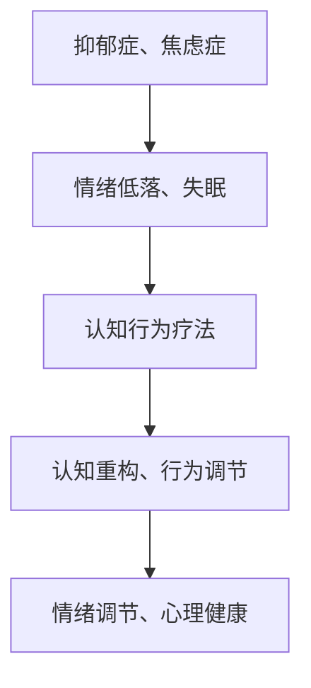
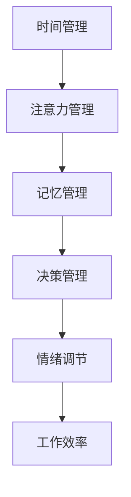

                 

### 1. 引言

心理学作为一门研究人类思维、行为和心理过程的科学，自诞生以来便对人类认识世界的方式产生了深远的影响。然而，心理学不仅仅是关于人类个体的学科，它还对整个世界如何被我们理解和解释有着重要的贡献。心理学对世界可理解性的解读，是一种通过探索人类认知机制、感知模式以及思维过程的科学方法，来帮助我们更好地理解我们所处的环境及周围世界的本质。

首先，心理学与可理解性的关系密不可分。可理解性指的是人类对复杂信息进行分类、解释和组织的能力。心理学通过研究知觉、认知、情感和人格等基本概念，帮助我们理解人类如何感知和解释外部世界。例如，知觉心理学探讨了人类如何通过感官接收信息，并进行筛选、加工和整合；认知心理学则研究人类如何通过思维过程来理解复杂信息，形成知识和记忆；情感心理学则关注人类如何通过情感反应来评价和适应环境；人格心理学则研究个体差异，帮助我们理解不同人在面对相似情境时如何产生不同的反应。

其次，心理学对世界可理解性的解读研究的重要性不可忽视。理解世界的可理解性不仅有助于我们更好地适应环境和做出合理决策，也对科学研究和哲学思考产生了重要影响。通过心理学的研究，我们可以揭示人类思维的局限性和认知偏差，从而提高我们对信息的准确理解和判断。此外，心理学的研究还能为其他学科，如计算机科学、生物学、社会学等提供理论支持和实验方法，促进跨学科的交流和融合。

总之，心理学对世界可理解性的解读不仅帮助我们更深入地理解人类自身，也为人类探索世界提供了新的视角和方法。通过理解心理学的核心概念和研究方法，我们可以更好地认识到我们如何理解和解释我们所处的环境，从而在科学研究和日常决策中更加明智和有效。

### 1.1 心理学的定义与作用

心理学作为一门科学，其定义多种多样，但核心目标是理解人类行为和心理过程的本质。美国心理学会（APA）将心理学定义为：“心理学是研究行为的科学，它涉及对行为的观察、描述、解释、预测和控制。”这个定义涵盖了心理学的核心领域，包括但不限于认知心理学、发展心理学、社会心理学、临床心理学、神经心理学等。

心理学在多个方面发挥着重要作用。首先，心理学对个体行为和心理健康的理解有着深远的影响。通过研究情绪、动机、记忆和注意力等心理过程，心理学家能够帮助人们更好地应对压力、提高情绪调节能力，以及促进个人成长和发展。其次，心理学在医学领域的应用也极为广泛，包括心理治疗、心理健康评估和临床诊断等。通过心理咨询和心理治疗，心理学家能够帮助患者克服心理障碍，提高生活质量。

心理学对社会行为的理解同样至关重要。社会心理学研究个体如何在社会环境中行事，以及社会因素如何影响个人行为。例如，社会心理学揭示了人们如何受群体行为的影响，如何产生从众心理，以及如何理解和应对社会偏见和歧视。这些研究不仅有助于提高公众对心理现象的理解，还能为社会政策制定提供科学依据。

在教育领域，心理学同样发挥着重要作用。教育心理学研究学习过程、教学方法和教育评估，帮助教师更好地理解学生的发展和需求，从而制定有效的教学策略。此外，工作心理学关注工作环境、职业发展和工作满意度，为企业和组织提供改善员工绩效和福利的建议。

总的来说，心理学的定义与作用不仅限于研究个体行为和心理过程，还涵盖了理解社会行为、提高心理健康水平、优化教育方法和促进工作效率等方面。心理学的研究成果不仅有助于个体的发展，也对社会的进步和人类福祉产生了重要影响。

### 1.2 世界可理解性的含义

世界可理解性是一个涉及认知科学与哲学的重要概念，它描述了人类对复杂世界进行分类、解释和组织的能力。简单来说，世界可理解性指的是人类如何通过感知、思考、推理等认知过程，将外部世界的复杂信息转化为可以理解、预测和掌控的知识结构。

首先，从认知科学的角度来看，世界可理解性依赖于人类的知觉和认知机制。知觉心理学研究表明，人类通过视觉、听觉、嗅觉、味觉和触觉等感官接收外部信息，然后通过大脑对这些信息进行加工和处理。这一过程中，大脑不仅筛选和整合来自不同感官的信息，还赋予这些信息一定的意义和结构。例如，当我们看到一只猫时，大脑不仅识别出猫的形状和颜色，还会将其归类为一种动物，并调用相关的记忆和知识，形成对猫的整体理解。

其次，认知心理学进一步揭示了人类如何通过认知过程理解复杂信息。认知过程包括注意、记忆、思维和决策等。例如，当我们面对一个复杂的数学问题，首先需要集中注意力，然后通过记忆和思维过程，将问题分解为更简单的子问题，并逐步解决。通过这种认知过程，人类能够将复杂的信息转化为可以理解和操作的知识。

从哲学角度来看，世界可理解性涉及到对现实的本质和结构的探讨。哲学家们长期以来一直试图回答“世界是什么？”这一问题。许多哲学家认为，现实具有某种固有的结构，这种结构使得人类可以通过理性思维来理解世界。然而，也有哲学家认为，现实是主观的，每个人的理解都是独特的，因此世界可理解性具有相对性。

此外，世界可理解性还涉及到人类如何应对不确定性和复杂性。在现实生活中，我们经常面临各种不确定性和复杂性，例如天气变化、经济波动和自然灾害等。心理学研究表明，人类通过认知和情感机制来应对这些挑战。例如，当面对不确定性时，人们往往会通过预测和假设来降低不确定性，从而更好地理解世界。

综上所述，世界可理解性是一个复杂但重要的概念，它涉及到认知科学和哲学等多个领域。通过知觉和认知机制，人类能够将复杂的外部世界转化为可以理解的知识结构，从而更好地适应和应对环境变化。

### 1.3 心理学对世界可理解性的解读研究的重要性

心理学对世界可理解性的解读研究的重要性不可低估，这不仅因为心理学为理解人类认知过程提供了科学方法，还因为这种解读对多个领域的发展产生了深远影响。

首先，心理学通过研究人类知觉和认知机制，揭示了世界是如何被我们感知和理解的。知觉心理学研究发现，人类的感官接收信息后，通过大脑进行处理和整合，从而形成对世界的认识。这一过程不仅涉及到感官信息的筛选和加工，还包括赋予这些信息意义和结构。例如，研究已经表明，人类通过视觉系统对物体进行识别和分类，通过听觉系统对声音进行理解和判断。认知心理学进一步揭示了人类如何通过思维过程来理解复杂信息，形成知识和记忆。这些研究不仅加深了我们对自身认知能力的理解，还为其他学科，如计算机科学、神经科学等，提供了重要的理论基础。

其次，心理学的研究对科学发展和哲学思考产生了重要影响。在科学领域，心理学提供了许多重要的研究方法和理论框架，例如实验设计、统计分析和认知模型等。这些方法和技术不仅帮助科学家更好地理解自然现象和社会行为，还促进了跨学科的交流与合作。例如，认知心理学为人工智能和机器学习领域提供了重要的理论支持，通过模拟人类认知过程，开发出更加智能的计算机系统。哲学方面，心理学对认识论和形而上学等基本问题的探讨，提供了新的视角和解释。例如，心理学揭示了人类思维的局限性和认知偏差，挑战了传统哲学关于人类理性思维的观点，促使哲学家重新审视现实的本质和人类的认知能力。

此外，心理学对日常生活和社会行为也产生了重要影响。在个人层面，心理学研究帮助我们更好地理解自己的行为和心理状态，从而提高生活质量。例如，情绪心理学研究如何通过情绪调节提高心理健康水平，认知心理学研究如何通过记忆训练提高学习效率。在社会层面，心理学提供了许多改善社会行为和社会关系的策略。例如，社会心理学研究揭示了群体行为和从众心理的机制，帮助人们更好地理解和应对社会现象。此外，心理学在教育和人力资源管理中的应用，也为提高个人和组织的效能提供了重要指导。

总的来说，心理学对世界可理解性的解读研究的重要性体现在多个方面：它为理解人类认知过程提供了科学方法，对科学发展和哲学思考产生了深远影响，并在个人和社交层面促进了人类的发展和进步。通过心理学的研究，我们不仅能够更深入地理解自身，还能为解决现实生活中的问题提供有效的策略和方法。

### 2. 心理学基本概念

心理学作为一门科学，其研究涵盖了众多基本概念，这些概念为我们理解人类行为和心理过程提供了基础。在本节中，我们将详细探讨心理学中的几个核心概念：知觉、认知、情感和人格。

#### 2.1 知觉

知觉是指个体如何通过感官接收外界信息，并将其转化为有意义的体验。知觉心理学研究人类如何感知和理解外部世界，涉及到视觉、听觉、嗅觉、味觉和触觉等多个感官系统。例如，视觉知觉研究如何通过眼睛捕捉光信号，并将其转化为大脑可以处理和理解的信息；听觉知觉研究如何通过耳朵捕捉声波，并识别和理解不同的声音。

知觉的基本特性包括选择性、整体性和恒常性。选择性指的是我们在感知过程中优先注意某些刺激，而忽略其他刺激。整体性指的是我们如何将分散的感官信息整合成整体的经验。例如，当我们看到一只狗时，不仅看到其形状和颜色，还能识别出这是一只狗的整体形象。恒常性则是指我们在感知过程中，即使外界条件发生变化，也能保持对物体属性（如大小、形状、颜色等）的恒定认知。例如，无论我们在远处还是近处看一个物体，我们都能感知到它的大小和形状。

知觉心理学的研究方法主要包括实验研究和观察法。实验研究通过控制变量来探究知觉现象的机制，例如通过视觉错觉实验来研究知觉选择性。观察法则通过直接观察个体的行为和反应，来分析知觉过程。

#### 2.2 认知

认知是指个体如何获取、处理、存储和应用信息的过程。认知心理学研究人类思维过程，包括注意力、记忆、知觉、思维和决策等。认知心理学的基本问题包括：人类是如何感知和理解的？我们如何进行记忆和思考？我们如何做出决策？

认知心理学中的核心概念包括注意力、记忆和思维。注意力是指我们在感知和处理信息时，对某些信息给予优先关注的能力。例如，在嘈杂的环境中，我们能够注意到一个特定的声音。记忆是指我们存储和回忆信息的能力。记忆分为短期记忆和长期记忆，短期记忆主要涉及当前正在处理的信息，而长期记忆则涉及我们长期存储的知识和经验。思维则是指我们通过推理、解决问题和决策等过程来处理信息的能力。

认知心理学的研究方法主要包括实验研究、认知任务设计和认知模型构建。实验研究通过设计特定的认知任务，来观察和分析个体的认知过程。认知任务设计则通过模拟现实生活中的认知情境，来探究认知机制。认知模型构建则是通过数学和计算机模拟，来模拟人类认知过程，并预测和解释认知现象。

#### 2.3 情感

情感是指个体在心理和生理上对特定刺激的反应，包括快乐、悲伤、愤怒、恐惧等。情感心理学研究情感的本质、产生机制以及对行为的影响。例如，情感心理学探讨了情绪是如何影响我们的决策、记忆和社交行为的。

情感的基本特性包括情绪的表达、情感调节和情感体验的多样性。情绪的表达指的是我们如何通过面部表情、身体语言和声音等非语言方式来表达情感。情感调节是指我们如何通过认知和行为策略来调节和控制自己的情感。情感体验的多样性则是指不同人对同一事件的情感反应可能有所不同。

情感心理学的研究方法主要包括实验研究、观察法和自我报告法。实验研究通过设计情感刺激来观察和分析情感反应。观察法则通过直接观察个体的情绪表现来分析情感现象。自我报告法则通过问卷调查和访谈等方式，收集个体对情感体验的主观描述。

#### 2.4 人格

人格是指个体稳定的、持久的心理特征和行为模式，包括性格、价值观、态度和动机等。人格心理学研究个体差异，试图理解不同人格特质如何影响个体的行为和适应。

人格的基本特性包括独特性、稳定性和可塑性。独特性指的是每个人的人格都是独特的，没有完全相同的人格特质。稳定性指的是人格特质在长时间内相对稳定，不易受到外界环境变化的影响。可塑性则是指人格特质在某些情况下是可以改变的，例如通过教育和培训。

人格心理学的研究方法主要包括问卷调查、实验研究和行为观察。问卷调查通过标准化的量表来评估个体的人格特质。实验研究通过控制变量来探究人格特质对行为的影响。行为观察则通过观察个体的日常行为来分析人格特质。

综上所述，心理学中的知觉、认知、情感和人格等基本概念为我们理解人类行为和心理过程提供了重要基础。通过研究这些概念，心理学家能够揭示人类如何感知和解释外部世界，如何处理信息和情感，以及如何形成稳定的人格特质。这些研究成果不仅有助于我们更好地理解人类自身，也为心理学在多个领域的应用提供了理论支持。

### 2.1 知觉

知觉是人类通过感官接收外部信息，并将其转化为有意义体验的过程。知觉心理学作为心理学的一个核心领域，致力于研究人类如何感知和理解外部世界。在探讨知觉时，我们首先要了解其基本概念和特性。

#### 2.1.1 知觉的概念

知觉可以被定义为个体对外界刺激的选择性、有组织的反应过程。这些反应过程不仅包括感官接收和加工信息，还涉及将这些信息转化为主观体验和行动的决策。知觉的整个过程可以简述为：感官接收信息 → 大脑处理信息 → 产生感知体验 → 行为反应。

知觉的基本过程可以分为以下几个步骤：

1. **刺激的接收**：外界刺激通过视觉、听觉、嗅觉、味觉和触觉等感官系统进入大脑。
2. **刺激的处理**：大脑对感官输入进行处理，筛选出重要的信息，并对其进行加工。
3. **信息的整合**：大脑将来自不同感官的信息整合在一起，形成对世界的统一感知。
4. **意义的赋予**：大脑对处理后的信息进行解释和分类，赋予其特定的意义。

#### 2.1.2 知觉的基本特性

1. **选择性**：人类在接收大量信息时，只能关注一部分信息，而忽略其他信息。选择性受多种因素影响，包括刺激的强度、与当前任务的关联性以及个体的预期和兴趣。
   
2. **整体性**：人类在感知复杂刺激时，能够将其分解为多个部分，并迅速将这些部分整合为一个整体。例如，当我们看到一张脸时，我们会迅速识别出眼睛、鼻子、嘴巴等部分，并将其整合为一个完整的人脸。
   
3. **恒常性**：在感知过程中，即使外部条件发生变化，人类仍能保持对物体属性（如大小、形状、颜色等）的恒定认知。恒常性的例子包括无论我们在远处还是近处看一个物体，都能感知到它的大小和形状。

#### 2.1.3 知觉的心理学研究

知觉心理学通过实验研究和理论模型，深入探讨知觉的机制和过程。以下是一些主要的研究方法和理论：

1. **实验研究**：实验研究是知觉心理学的基本研究方法。通过设计不同的实验，研究者可以控制变量，观察和分析知觉现象。例如，通过视觉错觉实验，研究者可以探讨选择性、整体性和恒常性的作用。
   
2. **理论模型**：知觉心理学发展了许多理论模型，用于解释知觉过程。例如，格式塔心理学提出“整体大于部分之和”的观点，强调知觉的整体性。此外，特征检测理论（feature detection theory）和加工层次理论（processing level theory）等模型，也试图解释知觉的机制。

3. **跨文化研究**：知觉心理学还关注跨文化差异，研究不同文化背景下个体的知觉模式。例如，研究发现，不同文化的人对同一视觉刺激的感知可能存在差异。

4. **认知神经科学**：结合认知神经科学的方法，研究者通过脑成像技术，如功能性磁共振成像（fMRI）和电生理技术，探究大脑在知觉过程中的活动模式。这些研究有助于揭示知觉的神经基础。

总之，知觉心理学通过研究知觉的基本概念和特性，以及利用实验研究和理论模型，深入揭示了人类如何感知和理解外部世界。这些研究不仅丰富了心理学理论，也为其他领域，如人工智能和认知科学，提供了重要的参考。

### 2.2 认知

认知是指个体获取、处理、存储和应用信息的过程。它涵盖了注意力、记忆、思维和决策等多个方面，是心理学研究中的一个核心领域。认知心理学通过实验研究和理论模型，深入探讨这些认知过程的机制和功能。

#### 2.2.1 认知的定义与结构

认知心理学将认知定义为“个体在获取、处理、存储和应用信息时的心理过程”。这个定义强调了认知不仅仅是信息的获取，还包括信息加工、存储和应用。因此，认知结构可以分解为以下几个主要部分：

1. **感知**：感知是个体对外界刺激的接收和理解，是认知过程的第一步。它包括视觉、听觉、嗅觉、味觉和触觉等感官系统的活动。
   
2. **注意力**：注意力是感知信息的筛选机制，它决定了个体在特定时刻关注哪些信息。注意力分为选择性注意和工作记忆两种类型。选择性注意使我们能够从大量信息中筛选出重要信息，而工作记忆则负责在短时间内保持和处理信息。

3. **记忆**：记忆是信息存储和回忆的能力。它分为短期记忆和长期记忆。短期记忆负责处理当前信息，而长期记忆则负责存储和回忆信息。

4. **思维**：思维是指个体通过推理、解决问题和决策等方式处理信息的过程。它包括逻辑思维、创造性思维和决策制定等多个方面。

5. **语言**：语言是个体进行认知活动的重要工具，它不仅用于信息的交流，还参与了记忆和思维的加工。

#### 2.2.2 认知心理学的主要研究方法

认知心理学采用多种研究方法来探究认知过程，以下是一些主要的方法：

1. **实验研究**：实验研究是认知心理学最常用的方法之一。通过设计实验，研究者可以控制变量，系统地观察和分析认知现象。例如，通过认知任务实验，研究者可以研究注意力、记忆和思维等过程。

2. **认知任务设计**：认知任务是通过具体操作来模拟认知过程的实验设计。例如，通过记忆任务，研究者可以观察个体在短期记忆和长期记忆方面的表现。

3. **脑成像技术**：脑成像技术，如功能性磁共振成像（fMRI）和脑电图（EEG），用于探究大脑在认知过程中的活动模式。这些技术能够揭示大脑不同区域在认知任务中的功能。

4. **认知模型**：认知模型是通过数学和计算机模拟来模拟人类认知过程的模型。这些模型可以帮助研究者理解和预测认知现象，例如基于计算模型的认知心理学理论，如人工神经网络和推理机。

#### 2.2.3 认知心理学的研究主题

认知心理学的研究主题广泛，涵盖了注意力、记忆、思维和语言等多个方面。以下是一些主要的研究主题：

1. **注意力**：注意力研究关注个体如何分配注意力资源，以及注意力在认知过程中的作用。例如，研究者探讨如何通过训练提高注意力，以及注意力缺陷障碍（如ADHD）对个体认知功能的影响。

2. **记忆**：记忆研究探讨记忆的存储、编码、保持和提取过程。例如，研究者研究如何通过记忆训练提高记忆能力，以及记忆障碍（如阿尔茨海默病）对个体认知功能的影响。

3. **思维**：思维研究关注个体如何进行逻辑推理、解决问题和决策。例如，研究者探讨创造性思维的开发和培养，以及如何通过逻辑思维训练提高问题解决能力。

4. **语言**：语言研究探讨语言如何影响认知过程，以及语言学习和语言障碍对个体认知功能的影响。例如，研究者研究双语者的认知优势，以及失语症对语言理解和表达能力的影响。

5. **认知神经科学**：认知神经科学研究大脑在认知过程中的功能和组织结构。例如，研究者通过脑成像技术探讨不同认知任务中大脑活动的模式，以及大脑损伤如何影响认知功能。

总之，认知心理学通过研究注意力、记忆、思维和语言等认知过程，深入揭示了人类如何获取、处理和应用信息。这些研究成果不仅丰富了心理学理论，还为教育、临床和心理治疗等领域提供了重要的指导。

### 2.3 情感

情感是指个体在心理和生理上对特定刺激的反应，包括快乐、悲伤、愤怒、恐惧等。情感心理学研究情感的本质、产生机制以及对行为的影响。理解情感在人类心理中的作用，有助于我们更好地认识自己，提高心理健康水平，并改善人际关系。

#### 2.3.1 情感的概念

情感是复杂的主观体验，包括情感状态（如快乐、悲伤）、情感表达（如面部表情、身体语言）和情感反应（如生理变化）。情感心理学将情感定义为“个体对特定刺激产生的评价性反应”，这种反应既包括心理层面的认知评价，也包括生理层面的生理反应。

1. **情感状态**：情感状态是指个体在特定时间内的情感体验，如快乐、悲伤、愤怒等。这些情感状态通常由外部刺激触发，并影响个体的情绪和行为。

2. **情感表达**：情感表达是指个体如何通过面部表情、身体语言和声音等非言语方式来表达情感。情感表达不仅有助于个体与他人沟通情感状态，还能影响个体的自我意识和人际关系。

3. **情感反应**：情感反应是指个体在情感状态下产生的生理和心理反应，如心跳加快、血压升高、肌肉紧张等。这些反应是情感体验的一部分，有助于个体适应环境。

#### 2.3.2 情感的作用

情感在人类心理和行为中发挥着重要作用，具体体现在以下几个方面：

1. **适应环境**：情感反应使个体能够快速适应环境变化。例如，恐惧情感使个体对潜在危险做出快速反应，从而保护自身安全。

2. **促进社交互动**：情感表达有助于建立和维护人际关系。通过情感表达，个体能够传递情感状态，增进相互理解和信任。

3. **影响决策**：情感在决策过程中发挥着重要作用。积极情感通常促进风险偏好，而消极情感则增加对风险的警惕性。

4. **调节心理状态**：情感有助于调节个体的心理状态，如缓解压力、提高情绪稳定性。例如，通过情感调节，个体能够更好地应对压力和挫折，保持心理健康。

5. **影响认知过程**：情感影响个体的认知过程，如记忆、注意力和思维。例如，积极情感通常促进信息加工和记忆，而消极情感则可能导致信息处理速度减缓和错误率增加。

#### 2.3.3 情感心理学的研究方法

情感心理学采用多种研究方法来探索情感的本质和作用，以下是一些主要的方法：

1. **实验研究**：实验研究是情感心理学的基本研究方法。通过设计实验，研究者可以控制变量，观察和分析情感现象。例如，通过情绪诱导实验，研究者可以探究不同情绪状态对认知功能的影响。

2. **自我报告法**：自我报告法通过问卷和访谈等方式，收集个体对情感体验的主观描述。这种方法有助于理解个体的情感状态和情感变化。

3. **生理测量**：生理测量包括心率、血压、皮肤电反应等指标，用于评估个体在情感状态下的生理反应。这些测量方法有助于揭示情感对生理系统的影响。

4. **脑成像技术**：脑成像技术，如功能性磁共振成像（fMRI）和脑电图（EEG），用于探究大脑在情感状态下的活动模式。这些技术有助于揭示情感处理的神经基础。

5. **跨文化研究**：情感心理学还关注跨文化差异，研究不同文化背景下个体的情感体验和表达方式。这些研究有助于理解情感在全球化背景下的多样性和共性。

总之，情感心理学通过研究情感的本质、产生机制以及对行为的影响，帮助我们更好地理解人类情感，提高心理健康水平，并改善人际关系。这些研究成果不仅丰富了心理学理论，还为实际应用提供了重要指导。

### 2.4 人格

人格是指个体稳定的、持久的心理特征和行为模式，包括性格、价值观、态度和动机等。人格心理学研究个体差异，试图理解不同人格特质如何影响个体的行为和适应。通过研究人格，我们能够更好地理解个体之间的差异，并探索这些差异对生活质量、社会关系和职业成功的影响。

#### 2.4.1 人格的概念

人格是指个体在长期生活中形成的稳定的、独特的心理特征和行为模式。它是个体在认知、情感和行为方面的综合表现，反映了个体独特的个性。人格心理学将人格定义为“个体在情境中表现出的相对稳定的行为倾向和心理特征”。

人格的基本构成要素包括：

1. **性格**：性格是指个体在行为和情绪上的稳定倾向。它包括外向性、神经质、开放性等主要维度。例如，外向性高的人通常喜欢社交和冒险，而内向性高的人则更喜欢独处和稳定。

2. **价值观**：价值观是指个体对生活中重要事物的评价和态度。例如，有的人重视家庭和友谊，而有的人则更注重事业和成就。

3. **态度**：态度是指个体对特定对象或事件的评价和倾向。例如，对环保的态度可能影响个体的消费行为和公共参与。

4. **动机**：动机是指驱使个体采取特定行为的内在力量。动机可以分为内在动机（如兴趣和自我实现）和外在动机（如奖励和惩罚）。

#### 2.4.2 人格的基本特性

1. **独特性**：每个人的人格都是独特的，没有完全相同的人格特质。这意味着人格特质在个体之间具有高度的差异性，使得每个人在行为和心理表现上都有所不同。

2. **稳定性**：人格特质在长时间内相对稳定，不易受到外界环境变化的影响。虽然环境因素可以在短期内影响人格表现，但人格的稳定性意味着人格特质在个体一生中保持相对一致。

3. **可塑性**：尽管人格特质在长时间内相对稳定，但在某些情况下，人格是可以改变的。例如，通过教育和培训，个体可以发展新的技能和态度，从而改变其人格特质。

#### 2.4.3 人格心理学的研究方法

人格心理学采用多种研究方法来探索人格特质和个体差异，以下是一些主要的方法：

1. **问卷调查**：问卷调查是研究人格特质最常用的方法之一。通过标准化的量表，研究者可以评估个体在不同人格维度上的表现。例如，大五人格量表（Big Five Personality Traits）是一种常用的问卷工具。

2. **实验研究**：实验研究通过设计特定的实验情境，控制变量，观察和分析个体在人格特质上的行为反应。例如，研究者可以通过实验操纵人格特质，观察这些特质如何影响个体的决策和行为。

3. **行为观察**：行为观察是通过直接观察个体的行为和反应，来评估其人格特质。这种方法尤其适用于研究特定情境下的人格表现。

4. **生理测量**：生理测量包括心率、血压、皮肤电反应等指标，用于评估个体在人格特质上的生理反应。这些测量方法有助于揭示人格特质的神经基础。

5. **纵向研究**：纵向研究通过长时间跟踪个体，观察其人格特质的变化和发展。这种方法有助于理解人格特质在个体生命周期中的变化规律。

#### 2.4.4 人格特质对行为的影响

人格特质对个体行为有着深远的影响。不同的人格特质可能导致个体在职业、社交和日常生活中表现出不同的行为模式。以下是一些人格特质对行为的影响：

1. **职业成功**：外向性和开放性通常与职业成功相关。外向性高的人通常更具社交能力，能够更好地适应工作环境，而开放性高的人通常更具创造力和适应性。

2. **社交关系**：亲和性和开放性有助于建立和维护良好的人际关系。亲和性高的人通常更容易与他人建立联系，而开放性高的人通常更能理解和接受不同的观点。

3. **应对压力**：神经质与应对压力的能力密切相关。神经质高的人通常在压力下更容易感到焦虑和沮丧，而神经质低的人则更能保持冷静和理性。

4. **生活质量**：乐观性和积极情绪与较高的生活质量相关。乐观性高的人通常对生活持积极态度，能够更好地应对困难和挑战。

总之，人格心理学通过研究人格特质的构成、基本特性以及它们对行为的影响，帮助我们更好地理解个体差异，并为心理学在职业发展、人际关系和心理健康等领域提供了重要的理论支持。

### 3. 心理学研究方法

心理学研究方法是指心理学家用来收集、分析和解释数据的技术和策略。心理学作为一门科学，其研究方法主要包括实验研究、调查研究、现场研究和案例研究等。这些方法各有其特点和应用场景，能够为心理学研究提供丰富的数据支持和理论验证。

#### 3.1 实验研究

实验研究是心理学最基本和常用的研究方法之一。它通过设计和实施实验，控制和操纵变量，以探究因果关系。实验研究的基本原则包括：

1. **假设的提出**：研究者首先提出一个或多个假设，这些假设通常是关于某种现象或行为的原因和结果。

2. **变量的定义和操作化**：变量是指影响研究结果的任何因素。研究者需要明确定义和操作化这些变量，以确保实验的可重复性和准确性。

3. **实验设计**：实验设计是指研究者如何组织实验，包括实验组的分配、实验条件的控制以及数据收集的方法。

4. **数据收集**：研究者通过实验工具和程序收集数据，这些工具可以是问卷、心理测试、行为记录等。

5. **数据分析和解释**：数据收集后，研究者使用统计方法进行分析，以验证假设是否成立。

实验设计可以分为以下几种类型：

- **前后测设计**：在前后测设计中，实验组和控制组在实验前后分别接受测试，以评估实验干预的效果。

- **对照实验**：对照实验通过设置对照组来消除外部变量的影响，从而更准确地评估实验组的效应。

- **实验组和对照组**：实验组接受特定的干预，而对照组不接受干预，用于比较实验效果。

实验研究的优点包括能够精确控制变量、易于重复和验证。然而，实验研究也存在局限性，如实验情境可能与现实情境存在差异，且可能无法涵盖所有影响因素。

#### 3.2 调查研究

调查研究通过收集大量个体的数据，以了解特定群体或总体的特征和态度。调查研究的基本原则包括：

1. **样本的选择**：研究者需要选择具有代表性的样本，以确保调查结果能够推广到整个总体。

2. **问卷设计**：问卷是调查研究的主要工具，研究者需要设计清晰、简洁且有效的问卷，以获取准确和可靠的数据。

3. **数据收集**：数据可以通过邮寄、面对面访谈或在线调查等方式收集。

4. **数据分析**：调查数据通常使用统计方法进行分析，以揭示变量之间的关系和模式。

调查研究的优点包括能够收集大量数据，从而提高研究的统计效力和代表性。然而，调查研究的局限性包括数据质量可能受问卷设计影响，以及受访者可能存在回忆偏差或回答偏差。

#### 3.3 现场研究

现场研究是一种在自然环境中进行的研究方法，通过直接观察和记录个体的行为和反应。现场研究的基本原则包括：

1. **研究环境的设定**：研究者需要在自然环境中设定观察条件，以避免对被观察者的干扰。

2. **数据记录**：研究者通过观察和记录工具，如录音设备、视频记录等，收集数据。

3. **数据分析**：现场研究的数据分析通常涉及定性分析和定量分析，以揭示行为模式和规律。

现场研究的优点包括能够获取真实、自然的观察数据，从而提高研究的生态效度。然而，现场研究也存在挑战，如研究者的主观偏见、观察的干扰和数据的复杂性。

#### 3.4 案例研究

案例研究是对特定个体或群体的深入研究，旨在揭示个别现象的复杂性和独特性。案例研究的基本原则包括：

1. **案例选择**：研究者需要选择具有研究价值的案例，以确保研究结果的深度和广度。

2. **数据收集**：数据可以通过访谈、问卷调查、文献综述等方式收集。

3. **数据分析**：案例研究通常采用定性分析，如内容分析、主题分析和叙事分析等。

案例研究的优点包括能够深入揭示个别现象的内在机制和动态变化，从而提供丰富的理论和实践启示。然而，案例研究的局限性在于结果难以推广到其他案例或总体。

综上所述，心理学研究方法各具特色，通过合理选择和组合这些方法，研究者能够全面、深入地探索人类行为和心理过程。实验研究、调查研究、现场研究和案例研究等方法在不同研究情境下各有优缺点，需要根据研究目的和实际情况进行选择和设计。

### 3.1 实验研究

实验研究是心理学中最常见和最可靠的研究方法之一，它通过控制变量和观察因变量的变化，探究不同因素之间的关系。以下是实验研究的基本原则、设计、实施步骤及结果统计处理方法。

#### 3.1.1 实验研究的基本原则

实验研究遵循以下基本原则：

1. **控制变量**：实验研究的核心是控制变量，以确保实验结果的准确性和可靠性。通过控制无关变量，研究者可以确定自变量（实验条件）与因变量（实验结果）之间的因果关系。

2. **假设的提出**：在实验研究之前，研究者需要提出一个或多个假设，这些假设通常是对自变量和因变量之间关系的预测。

3. **随机分配**：为了确保实验组和对照组之间的均衡，研究者通常采用随机分配的方法，使每个参与者都有相同的概率被分配到实验组或对照组。

4. **伦理审查**：实验研究需要遵循伦理规范，保护参与者的权益。伦理审查是实验研究开始前的重要步骤，确保实验过程符合道德标准。

#### 3.1.2 实验设计

实验设计是实验研究的关键环节，它决定了实验的可靠性和有效性。实验设计主要包括以下类型：

1. **单因素实验设计**：在单因素实验设计中，研究者只操纵一个自变量，并观察其对因变量的影响。例如，研究不同强度音乐对工作效率的影响。

2. **多因素实验设计**：在多因素实验设计中，研究者可以同时操纵多个自变量，并观察各个自变量及其交互作用对因变量的影响。例如，研究不同强度音乐和不同光照条件对工作效率的影响。

3. **重复测量实验设计**：在重复测量实验设计中，同一组参与者接受多个不同的实验条件，从而在同一参与者身上观察不同条件下的因变量变化。例如，研究不同类型的记忆训练对记忆保持效果的影响。

4. **对照实验设计**：对照实验设计包括实验组和对照组，实验组接受特定干预，而对照组不接受干预，以比较干预效果。例如，研究心理治疗对抑郁症症状的缓解效果。

#### 3.1.3 实验实施步骤

实验实施步骤如下：

1. **参与者招募**：研究者需要招募符合研究条件的参与者，并解释实验目的、过程和风险。

2. **实验条件准备**：准备实验所需的设备和材料，并设置实验环境。

3. **实验操作**：按照实验设计，对实验组和对照组进行操作。实验组接受特定的干预，而对照组接受标准操作或安慰剂干预。

4. **数据收集**：在实验过程中，研究者通过问卷、行为记录、生理测量等方式收集数据。

5. **数据记录**：详细记录实验过程中发生的所有事件和数据，确保数据的准确性和完整性。

#### 3.1.4 实验结果的统计处理方法

实验结果通常使用统计方法进行分析，以验证假设和解释结果。以下是常用的统计处理方法：

1. **描述性统计**：描述性统计用于总结和描述数据的基本特征，如平均数、中位数、标准差等。

2. **推断性统计**：推断性统计用于根据样本数据推断总体特征，如t检验、方差分析（ANOVA）等。

3. **相关分析**：相关分析用于探讨两个或多个变量之间的相关性，如皮尔逊相关系数、斯皮尔曼等级相关系数等。

4. **回归分析**：回归分析用于探讨自变量和因变量之间的定量关系，如简单线性回归、多元回归分析等。

5. **非线性分析**：非线性分析用于探讨变量之间的复杂关系，如逻辑回归、生存分析等。

通过上述统计处理方法，研究者可以得出实验结论，解释自变量对因变量的影响，并验证研究假设。同时，这些结果也可以为心理学理论的发展和应用提供实证支持。

#### 3.2 调查研究

调查研究是心理学研究中的一种重要方法，通过收集大量个体的数据，了解特定群体或总体的特征和态度。以下是调查研究的定义、基本原则、问卷设计、数据收集以及数据分析方法。

#### 3.2.1 调查研究的定义

调查研究是指通过系统的询问和记录，收集个体或群体的信息，以了解他们的行为、态度、信仰或心理状态。调查研究通常采用问卷、访谈或其他形式，收集大量数据，从而提高研究的代表性。

#### 3.2.2 调查研究的基本原则

1. **代表性的样本选择**：为了使调查结果能够推广到总体，研究者需要选择具有代表性的样本。样本大小、抽样方法和样本分布是影响代表性的关键因素。

2. **问卷设计的科学性**：问卷设计是调查研究的核心，问卷的质量直接影响数据的可靠性和有效性。问卷应简洁明了，问题内容具有科学性和针对性。

3. **数据收集的准确性**：在数据收集过程中，研究者需要确保数据的准确性。避免受访者误解问题或产生回答偏差，如使用清晰的语言和明确的指导语。

4. **数据分析的科学性**：数据分析应采用适当的方法，确保结果的科学性和可靠性。常用的分析方法包括描述性统计、推断性统计和相关分析等。

#### 3.2.3 问卷设计

问卷设计是调查研究的关键步骤，以下是一些关键要点：

1. **明确研究目的**：在设计问卷之前，研究者需要明确研究目的和问题，以确定问卷的内容和结构。

2. **问题的选择**：问题应具有科学性和针对性，避免使用模糊或主观性过强的问题。问题可以分为开放性和封闭性两种类型。

3. **问题的表述**：问题应表述清晰，避免歧义。同时，问题顺序应合理，从一般到具体，从简单到复杂，以提高受访者的理解和回答质量。

4. **量表的选择**：量表是一种常用的问卷工具，用于评估个体在特定维度上的表现。常用的量表包括利克特量表、语义差异量表等。

5. **预测试**：在设计问卷后，应进行预测试，以评估问卷的可行性和有效性。预测试可以帮助研究者发现和修正问题，提高问卷质量。

#### 3.2.4 数据收集

数据收集是调查研究的重要环节，以下是一些关键要点：

1. **参与者的招募**：研究者需要招募符合研究条件的参与者，可以通过学校、社区、网络等渠道进行招募。

2. **数据收集的方法**：数据收集可以采用面对面访谈、邮寄问卷、在线问卷等方式。每种方法都有其优缺点，研究者应根据实际情况选择合适的方法。

3. **数据收集的伦理问题**：在数据收集过程中，研究者需要遵循伦理规范，保护参与者的隐私权和知情权。例如，应在问卷开头说明研究目的、数据用途和保密措施。

4. **数据的质量控制**：在数据收集过程中，研究者应采取一系列措施确保数据的质量，如验证问卷的完整性、检查填写错误等。

#### 3.2.5 数据分析方法

数据分析是调查研究的关键步骤，以下是一些常用的分析方法：

1. **描述性统计**：描述性统计用于总结和描述数据的基本特征，如平均数、中位数、标准差等。这些指标可以反映样本的集中趋势和离散程度。

2. **推断性统计**：推断性统计用于根据样本数据推断总体特征，如t检验、方差分析（ANOVA）等。这些方法可以检验研究假设和评估变量之间的显著性。

3. **相关分析**：相关分析用于探讨两个或多个变量之间的相关性，如皮尔逊相关系数、斯皮尔曼等级相关系数等。这些方法可以揭示变量之间的关联性。

4. **回归分析**：回归分析用于探讨自变量和因变量之间的定量关系，如简单线性回归、多元回归分析等。这些方法可以解释变量之间的因果关系。

5. **因子分析**：因子分析用于简化数据，识别数据中的潜在结构。这些方法可以帮助研究者理解数据中的复杂关系。

通过上述方法，研究者可以对调查数据进行分析，得出有意义的结论，为心理学研究和实践提供实证支持。

### 3.3 现场研究

现场研究是一种在自然环境中进行的研究方法，通过直接观察和记录个体的行为和反应，以获取真实、自然的数据。以下是现场研究的基本原则、实施步骤以及数据分析方法。

#### 3.3.1 现场研究的基本原则

1. **真实性**：现场研究要求在自然环境中进行，避免实验情境对个体行为的影响，从而确保数据的真实性。

2. **无干扰**：研究者应在观察过程中尽量减少对被观察者的干扰，以确保行为和反应的自然性。

3. **全面记录**：研究者需要详细记录观察到的行为和反应，包括言语、肢体动作、表情等，以确保数据的完整性。

4. **伦理审查**：在进行现场研究之前，研究者需要获得相关伦理委员会的批准，确保研究过程符合伦理规范，保护被观察者的隐私和权益。

#### 3.3.2 现场研究的实施步骤

1. **研究设计**：在开始研究之前，研究者需要明确研究目的、研究问题和预期目标。设计研究方案，包括研究环境、观察对象和观察方法。

2. **环境选择**：选择适合的研究环境，确保环境条件对研究没有干扰。例如，如果研究课堂行为，可以在教室中进行观察。

3. **观察对象确定**：确定观察对象，可以是单个个体或群体。确保观察对象符合研究要求，并得到他们的同意。

4. **观察实施**：按照研究方案，进行观察和记录。可以采用现场观察、视频记录或录音等方式，确保数据的准确性。

5. **数据记录**：在观察过程中，详细记录所有观察到的行为和反应，包括时间、情境、行为类型和持续时间等。

6. **伦理监督**：在研究过程中，确保遵守伦理规范，如尊重被观察者的隐私和权利，避免对被观察者造成心理或生理上的伤害。

#### 3.3.3 数据分析方法

1. **定性分析**：定性分析用于对观察数据进行分析，以理解行为和反应的内在意义。常用的定性分析方法包括内容分析、主题分析和叙事分析等。

2. **定量分析**：定量分析用于对观察数据进行分析，以揭示行为和反应的数量特征。常用的定量分析方法包括频数统计、均值计算、方差分析等。

3. **多变量分析**：多变量分析用于探讨多个变量之间的关系，如相关分析、回归分析和因子分析等。

4. **可视化分析**：可视化分析用于将数据以图形或表格形式展示，帮助研究者更直观地理解数据。常用的可视化方法包括条形图、折线图、散点图等。

通过以上步骤和分析方法，研究者可以深入理解个体在自然情境下的行为和反应，为心理学研究提供丰富的实证数据和理论支持。

### 4. 心理学在理解世界中的应用

心理学在理解世界中的应用极为广泛，涵盖了科学领域、日常生活和商业领域等多个方面。通过心理学的研究方法和技术，我们能够更好地理解自然现象、社会行为和人类心理过程，从而为各个领域提供理论支持和实用指导。

#### 4.1 心理学对科学领域的解读

心理学对科学领域的影响主要体现在对自然现象的理解和解释上。在自然科学领域，心理学提供了许多重要的理论和方法，例如感知心理学、认知心理学和神经心理学等。

1. **感知心理学**：感知心理学研究人类如何通过感官接收和处理信息。例如，通过研究视觉感知，心理学家揭示了人类如何识别物体、判断距离和颜色等。这些研究不仅有助于我们更好地理解自然界的视觉现象，还为计算机视觉和图像处理技术的发展提供了理论基础。

2. **认知心理学**：认知心理学研究人类如何获取、处理、存储和应用信息。例如，通过研究记忆，心理学家揭示了人类记忆的机制和策略，从而为改善学习方法和提高记忆效果提供了指导。此外，认知心理学的研究还帮助我们理解思维过程，如逻辑推理和创造性思维，从而为科学研究提供了新的视角。

3. **神经心理学**：神经心理学研究大脑如何影响心理过程和行为。通过脑成像技术和电生理技术，神经心理学家揭示了大脑不同区域在认知、记忆和情感等过程中的功能。这些研究成果不仅加深了我们对大脑的理解，还为神经系统疾病的诊断和治疗提供了新的方法。

#### 4.2 心理学对社会科学的理解

在社会科学领域，心理学对人类行为和社会关系的理解起到了关键作用。通过心理学的研究方法，社会科学家能够更深入地探讨社会现象，并提出有效的社会政策。

1. **社会心理学**：社会心理学研究个体在社会环境中的行为和心理过程。例如，通过研究群体行为，心理学家揭示了从众心理、领导力和社会认同等社会现象。这些研究为社会管理和公共政策提供了重要的理论支持。

2. **发展心理学**：发展心理学研究人类从出生到死亡的整个生命过程中的心理发展。通过研究儿童发展、成年发展和老年发展，心理学家揭示了不同年龄段的心理特征和行为模式。这些研究成果有助于教育工作者更好地理解不同年龄段学生的需求和特点，从而制定更有效的教育策略。

3. **文化心理学**：文化心理学研究文化如何影响人类行为和心理过程。例如，通过比较不同文化背景下的行为和态度，心理学家揭示了文化差异对个体和社会的影响。这些研究有助于促进跨文化交流和理解，提高社会融合水平。

#### 4.3 心理学对人文科学的理解

在人文科学领域，心理学通过对人类心理过程和行为的理解，为文学、艺术和哲学等学科提供了新的视角和解释。

1. **文学心理学**：文学心理学研究文学作品如何影响读者的心理状态和情感体验。通过研究文学中的心理描写和情感表达，心理学家揭示了文学作品的心理学价值，从而为文学研究和欣赏提供了新的理论基础。

2. **艺术心理学**：艺术心理学研究艺术创作和欣赏过程中的心理机制。例如，通过研究艺术家的创作过程和观众的欣赏体验，心理学家揭示了艺术表达和情感交流的心理学原理。这些研究成果有助于提高艺术创作的技巧和欣赏水平。

3. **哲学心理学**：哲学心理学研究心理过程和哲学问题之间的关系。例如，通过探讨意识、自我和自由意志等哲学问题，心理学家揭示了心理学在哲学思考中的重要作用。这些研究不仅丰富了哲学理论，还促进了心理学与哲学的跨学科交流。

总之，心理学在理解世界中的应用极为广泛，它不仅为科学领域提供了理论和方法，还在社会科学、人文科学等领域发挥了重要作用。通过心理学的研究，我们能够更深入地理解自然现象、社会行为和人类心理过程，从而为各个领域的理论和实践提供有力的支持。

#### 4.4 心理学在日常生活的影响

心理学在日常生活中有着深远的影响，它不仅帮助我们更好地理解自己和他人，还提供了改善个人行为和提升生活质量的策略。

首先，心理学帮助我们更好地理解个人行为。通过研究知觉、认知、情感和人格等基本概念，心理学揭示了人类如何感知和解释外部世界，如何处理信息，以及如何产生和调节情感。例如，认知心理学揭示了人类记忆的机制和策略，使人们能够更有效地学习和记忆信息。情绪心理学则帮助我们理解情绪的产生和调节，从而更好地应对压力和情绪困扰。

其次，心理学为个人发展提供了指导。发展心理学研究人类在不同生命阶段的心理发展，包括儿童发展、成年发展和老年发展。这些研究成果帮助家长、教育工作者和心理健康专家更好地理解和支持个体在不同阶段的发展需求。例如，通过了解儿童发展过程中的关键时期，家长可以提供适宜的教育和照顾，促进儿童的全面发展。

此外，心理学在改善人际关系方面也发挥了重要作用。社会心理学研究个体如何在社会环境中行事，以及社会因素如何影响个人行为。通过理解社会影响、群体行为和人际关系，我们可以建立更健康、更满意的人际关系。例如，了解社交心理学的理论，如从众心理和社会认同，可以帮助人们更好地理解他人的行为，并建立积极的人际互动。

最后，心理学为心理健康提供了科学支持。心理健康是生活质量的基石，而心理学研究提供了预防和治疗心理障碍的方法。通过认知行为疗法、心理动力学疗法等心理治疗方法，心理学家能够帮助患者克服心理障碍，提高心理健康水平。此外，心理健康教育也通过普及心理健康知识，提高公众对心理健康的重视和自我调节能力。

总之，心理学在日常生活中有着广泛的应用，它不仅帮助我们更好地理解自己和他人，还提供了改善个人行为和提升生活质量的策略。通过心理学的知识和方法，我们可以更有效地应对生活中的挑战，实现个人成长和幸福。

### 4.5 心理学在商业领域的应用

心理学在商业领域的应用日益广泛，成为企业提升竞争力、优化运营策略和提升员工绩效的重要工具。以下将探讨心理学在市场营销、人力资源管理和广告中的应用。

#### 4.5.1 心理学在市场营销中的应用

市场营销中，心理学帮助企业和广告商理解消费者的行为和决策过程，从而制定更有效的营销策略。例如：

1. **消费者行为研究**：通过心理学研究，企业可以了解消费者如何感知和处理广告信息。研究揭示了消费者对品牌的认知过程、购买动机和购买决策模式。例如，认知心理学研究指出，消费者在购买过程中常常依赖直觉和情感，而不仅仅是理性分析。

2. **情感营销**：情感营销利用心理学原理，通过引发消费者的情感共鸣，增强品牌忠诚度和购买意愿。例如，广告常常通过讲述故事、唤起情感反应，如幸福、温馨或幽默，来吸引消费者。

3. **个性化和定制化**：通过大数据分析和心理测评，企业可以更精确地了解消费者的个性特征和偏好，从而提供个性化的产品和服务。例如，一些电商平台通过用户行为数据，为消费者推荐个性化的购物建议。

4. **消费者忠诚度**：心理学研究还揭示了影响消费者忠诚度的关键因素，如信任、满意度和情感联系。通过改善这些因素，企业可以提高消费者的忠诚度和回购率。

#### 4.5.2 心理学在人力资源管理中的应用

在人力资源管理中，心理学提供了有效的工具和方法，帮助企业优化员工选拔、培训和发展。

1. **员工选拔**：通过心理测评，如能力测试、性格测试和动机测试，企业可以更准确地评估候选人的能力和个性特征，从而选拔适合岗位的员工。例如，人格测试可以帮助企业识别适合团队协作和领导角色的候选人。

2. **培训与发展**：心理学理论和方法用于设计有效的培训课程和员工发展计划。例如，认知心理学研究揭示了记忆和学习的最佳实践，从而指导企业如何设计高效的培训材料和方法。

3. **员工激励**：心理学研究揭示了激励员工的有效策略，如目标设置、反馈和认可。通过理解员工的动机和需求，企业可以制定个性化的激励方案，提高员工的工作积极性和绩效。

4. **员工心理健康**：心理学还关注员工的心理健康，提供心理健康支持和咨询，以预防和解决员工的心理问题。通过心理健康项目，企业可以提升员工的整体幸福感和生产力。

#### 4.5.3 心理学在广告中的应用

在广告领域，心理学原理被广泛用于提高广告的吸引力和效果。

1. **说服与影响**：心理学研究揭示了说服和信息传播的原理，如权威效应、社交证明和情感诉求。广告商利用这些原理，通过合理的设计和语言，提高广告的说服力和影响力。

2. **视觉吸引力**：视觉心理学研究如何通过颜色、形状和图像设计吸引观众的注意力。广告设计者通过应用这些原则，创造引人注目的广告，提高品牌认知度。

3. **情感共鸣**：情感心理学研究如何通过情感反应影响消费者。广告常常通过讲述感人故事或唤起情感共鸣，激发消费者的情感，从而增加广告效果。

4. **品牌建设**：心理学研究还指导企业如何建立和维护品牌形象。通过理解消费者的认知和情感反应，企业可以设计有效的品牌传播策略，提升品牌价值。

总之，心理学在商业领域的应用极大地提升了企业的运营效率和市场竞争力。通过心理学的研究方法和理论，企业能够更好地理解消费者行为、优化人力资源管理策略，并提高广告效果，从而在竞争激烈的市场中脱颖而出。

### 5. 心理学与哲学的对话

心理学与哲学作为两门探索人类本质和认知的学科，具有深厚的交集和互动。心理学提供了实验和数据驱动的视角，而哲学则提供了更为抽象和概念性的思考方式。两者的对话不仅丰富了各自的理论体系，也为人类理解世界提供了更全面和深入的视角。

#### 5.1 心理学与哲学的关系

心理学与哲学的关系可以追溯到古希腊时期，当时的哲学家们已经开始探讨心灵和认知的问题。亚里士多德和柏拉图等哲学家对后来的心理学发展产生了深远影响。哲学中的许多核心问题，如意识、自我、自由意志等，都是心理学研究的重要主题。

1. **意识的哲学探讨**：哲学一直关注意识的问题，探讨意识的本质、起源和功能。例如，笛卡尔的“我思故我在”命题提出了意识存在的哲学论证。心理学则通过神经科学和认知科学的研究，探讨了意识的神经基础和认知过程。

2. **自我的哲学探讨**：哲学探讨自我和个体身份的问题，例如康德的“先验自我”概念。心理学通过研究自我概念、自我认同和自我调节，提供了对自我形成和发展的科学解释。

3. **自由意志的哲学探讨**：自由意志是哲学讨论的另一个核心问题。哲学家如霍布斯和洛克分别探讨了自由意志的道德和哲学意义。心理学则通过行为主义和社会学习理论，探讨了环境和经验对行为和决策的影响。

#### 5.2 心理学对哲学问题的解读

心理学为哲学问题提供了新的视角和解释。以下是一些心理学如何解读哲学问题的例子：

1. **意识与认知**：心理学通过认知科学和神经科学的研究，提供了对意识本质和认知过程的科学解释。例如，认知心理学研究如何通过知觉、记忆和思维过程，形成主观体验和认知。

2. **情感与道德**：心理学通过情感心理学的研究，探讨了情感在道德判断和行为中的重要作用。例如，研究表明，情感不仅影响我们的决策，还在道德判断中发挥着关键作用。

3. **社会与伦理**：心理学通过社会心理学的研究，揭示了社会因素对个体行为和道德判断的影响。例如，从众行为和社会认同的研究，为哲学中的伦理和社会理论提供了新的解释。

#### 5.3 哲学对心理学问题的回应

哲学也对心理学提出的问题和理论进行了回应，推动了心理学理论的发展。以下是一些哲学对心理学问题的回应：

1. **科学哲学**：科学哲学对心理学研究方法提出了质疑和反思。例如，科学哲学探讨了心理学研究的实证性和科学性，推动了心理学方法论的发展。

2. **心灵哲学**：心灵哲学对心理学中的意识、自我和认知问题进行了深入探讨。例如，心灵哲学中的物理主义和功能主义为心理学提供了理论框架，探讨了心理现象与物理过程的关系。

3. **认知伦理学**：认知伦理学是哲学与心理学结合的产物，它探讨了认知过程与道德责任之间的关系。例如，认知伦理学研究了认知偏差如何影响道德判断和决策，提出了改善道德决策的策略。

总之，心理学与哲学的对话不仅丰富了各自的理论体系，还为人类理解世界提供了多维度和综合性的视角。通过这种对话，心理学和哲学不断相互启发和推动，促进了科学和哲学的进步。

### 5.2 心理学与认知科学的交融

心理学与认知科学之间的交融构成了现代认知科学的重要基础。认知科学是心理学、计算机科学、神经科学和哲学等多个学科交叉融合的产物，它致力于理解认知过程的机制和运作方式。心理学在认知科学中扮演着核心角色，为研究认知过程提供了丰富的方法和理论支持。

#### 5.2.1 认知科学与心理学的关系

认知科学与心理学有着紧密的联系，它们共同探讨认知过程，但在研究方法和理论框架上有所不同。心理学侧重于通过实验研究和观察来理解人类认知行为，而认知科学则采用了跨学科的方法，包括计算机模拟、脑成像技术和数学模型等。这种融合使得认知科学能够从多个角度分析认知过程，提供更为全面和深入的理解。

1. **心理学对认知科学的影响**：心理学为认知科学提供了许多基本理论和研究方法。例如，认知心理学通过研究注意、记忆和思维等认知过程，揭示了人类如何处理信息。这些研究成果为认知科学的发展奠定了基础。

2. **认知科学对心理学的贡献**：认知科学通过计算机模拟和数学模型，提供了新的方法和工具，帮助心理学家更好地理解认知过程。例如，认知科学中的符号计算模型和神经网络模型，为心理学家提供了新的理论框架，用于模拟和预测认知行为。

#### 5.2.2 认知心理学的研究方法

认知心理学是心理学中研究认知过程的核心领域，它采用了多种研究方法来探讨认知机制和认知过程：

1. **实验研究**：实验研究是认知心理学的主要研究方法。通过设计认知任务和实验情境，心理学家可以控制变量，观察和记录认知过程。例如，通过记忆任务实验，心理学家可以探究记忆的编码、存储和提取机制。

2. **脑成像技术**：脑成像技术，如功能性磁共振成像（fMRI）和脑电图（EEG），用于探究大脑在认知任务中的活动模式。这些技术帮助心理学家揭示认知过程与大脑功能之间的关系。

3. **计算机模拟**：计算机模拟通过构建数学模型和符号计算模型，模拟人类认知过程。这些模型可以预测认知行为，并提供对认知机制的深入理解。例如，神经网络模型可以模拟大脑中的信息处理和记忆机制。

4. **行为观察**：行为观察通过直接观察个体的行为和反应，来分析认知过程。例如，通过观察个体的反应时间和准确性，心理学家可以评估认知任务的难度和效率。

#### 5.2.3 认知心理学对心理学的影响

认知心理学对心理学的发展产生了深远影响。它不仅推动了心理学理论的更新，还为认知科学的发展提供了重要的理论支持：

1. **理论更新**：认知心理学提出了一系列新的理论，如知觉心理学中的特征检测理论、记忆心理学中的工作记忆模型、思维心理学中的问题解决模型等。这些理论丰富了心理学理论体系，提高了对认知过程的理解。

2. **跨学科研究**：认知心理学的跨学科研究方法，如计算机模拟和脑成像技术，促进了心理学与其他学科的交流与合作。例如，认知心理学与计算机科学的结合，推动了人工智能和机器学习的发展。

3. **实践应用**：认知心理学的研究成果在教育和临床实践中得到了广泛应用。例如，通过认知训练和记忆策略，心理学家可以帮助提高学生的学习和记忆能力，改善患者的认知功能。

总之，心理学与认知科学的交融为认知过程的研究提供了多维度的视角和方法。认知心理学通过实验研究、脑成像技术和计算机模拟等多种方法，深入揭示了认知机制的复杂性和多样性，不仅推动了心理学理论的发展，也为认知科学和相关领域的应用提供了重要支持。

### 6. 心理学的前沿与未来

心理学作为一门不断发展的科学，其研究前沿不断推动我们对人类行为和心理过程的理解。随着技术的进步和跨学科的融合，心理学在未来将继续迎来新的机遇和挑战。

#### 6.1 心理学的最新研究进展

当前，心理学的研究进展主要表现在以下几个方面：

1. **神经科学和认知神经科学的融合**：神经科学的发展，特别是功能性磁共振成像（fMRI）和脑电图（EEG）技术的应用，使得心理学家能够更详细地了解大脑在认知和情感过程中的活动模式。这些研究不仅揭示了认知过程的神经基础，还为心理健康问题的诊断和治疗提供了新的方法。

2. **人工智能和机器学习的应用**：人工智能和机器学习技术的进步，使得心理学家能够使用大数据分析技术，发现心理现象中的复杂模式。这些技术帮助心理学家更准确地预测个体行为，优化干预策略。

3. **跨文化心理学的研究**：随着全球化进程的加速，跨文化心理学研究日益重要。研究者通过比较不同文化背景下的心理现象，探讨文化差异对行为和心理过程的影响。这为理解心理健康问题提供了新的视角，也为跨文化交流和理解提供了重要依据。

4. **心理健康和心理疾病的预防与干预**：心理健康问题日益受到关注，心理学研究开始聚焦于心理疾病的预防、诊断和治疗。例如，通过认知行为疗法和正念疗法等干预措施，心理学家帮助患者改善心理健康。

#### 6.2 心理学的研究趋势

未来，心理学的研究趋势将呈现以下特点：

1. **多学科融合**：心理学将继续与其他学科如神经科学、计算机科学、生物技术等深度融合，推动认知科学、神经心理学和生物心理学等领域的发展。

2. **个性化心理学**：随着大数据和人工智能技术的发展，个性化心理学将成为研究的重要方向。通过分析个体的生物、心理和社会特征，心理学家能够提供更加精准的心理健康评估和干预。

3. **心理健康和福祉研究**：心理健康和福祉研究将继续成为心理学的重要领域。研究者将深入探讨心理健康问题，开发新的干预措施，以提高个体的生活质量和幸福感。

4. **社会心理学和公共健康**：社会心理学将更多地关注社会问题，如心理健康问题、社会不平等和文化多样性。心理学研究将为公共健康政策和社会发展提供科学依据。

#### 6.3 心理学的未来发展方向

心理学的未来发展方向包括以下几个方面：

1. **人工智能与心理学的结合**：人工智能技术将为心理学研究提供新的工具和方法。通过开发智能心理评估系统，心理学家可以更高效地收集和分析心理数据，提高诊断和干预的准确性。

2. **生物心理学的发展**：随着基因技术和神经科学的发展，生物心理学将成为心理学的重要分支。研究者将探索基因和心理过程之间的关系，以及生物因素如何影响心理健康和行为。

3. **跨学科研究**：心理学与医学、社会学、教育学和计算机科学等学科的交叉研究将不断深化，推动心理学理论的发展和实际应用。

4. **全球心理健康研究**：全球心理健康研究将聚焦于不同文化背景下的心理健康问题，促进全球心理健康服务的标准化和个性化。

总之，心理学的前沿和未来发展方向充满了机遇和挑战。随着技术的进步和跨学科研究的深入，心理学将继续为人类理解自身行为和心理过程提供新的视角和工具，为心理健康和福祉的改善做出贡献。

### 6.2 心理学在新兴领域的应用

心理学在新兴领域的应用正不断拓展，尤其是在人工智能、神经科学和生物技术等领域，心理学的研究方法和技术正在发挥重要作用，推动了这些领域的发展。

#### 6.2.1 心理学在人工智能领域的应用

人工智能（AI）作为一门迅速发展的技术，其核心在于模拟人类智能，进行学习、推理和决策。心理学在人工智能领域中的应用主要体现在以下几个方面：

1. **认知建模**：心理学家通过构建认知模型，模拟人类思维过程，为人工智能提供了理论基础。认知模型如神经网络和决策树，模仿了人类如何处理信息和做出决策。这些模型不仅提高了AI的智能水平，还为优化算法和系统设计提供了指导。

2. **情感计算**：情感计算是心理学与计算机科学交叉的一个新领域，旨在使计算机理解和模拟人类情感。心理学家通过研究情感表达和情感认知，开发了情感识别和情感反应算法，使AI系统能够识别用户的情感状态，提供个性化的交互和反馈。

3. **人机交互**：心理学在提升人机交互体验方面发挥了关键作用。通过研究人类的认知和行为特性，心理学家设计出更符合用户需求的交互界面和用户体验。例如，用户界面设计中的视觉感知和操作便捷性，都是心理学研究的重点。

#### 6.2.2 心理学在神经科学领域的应用

神经科学是研究神经系统结构和功能的一门科学，心理学在神经科学中的应用主要体现在以下几个方面：

1. **认知神经科学**：认知神经科学通过结合心理学和神经科学的方法，研究大脑如何实现认知功能。例如，通过脑成像技术如fMRI，心理学家可以观察大脑在不同认知任务中的活动模式，揭示认知过程的神经基础。

2. **心理健康研究**：心理学在神经科学中扮演着重要角色，特别是在心理健康研究领域。通过研究心理障碍的神经机制，心理学家可以开发出新的诊断和治疗方法。例如，基于神经可塑性的认知行为疗法，已经在治疗抑郁症和焦虑症中取得了显著效果。

3. **神经发育研究**：心理学帮助理解大脑的发育和功能成熟。通过研究儿童和青少年的认知发展，心理学家揭示了大脑在成长过程中的关键时期和关键任务。这些研究成果对儿童教育和心理健康干预具有重要意义。

#### 6.2.3 心理学在生物技术领域的应用

生物技术是利用生物学原理和技术手段进行研究和开发的科学领域，心理学在生物技术中的应用主要体现在以下几个方面：

1. **基因心理学**：基因心理学是研究基因对心理特征和心理健康影响的一个新领域。通过基因-环境相互作用的研究，心理学家可以揭示基因如何影响个体的行为和心理过程，为个性化心理健康干预提供科学依据。

2. **神经调节技术**：神经调节技术如脑机接口（BMI）和深部脑刺激（DBS）正在快速发展。心理学在设计和评估这些技术时发挥着关键作用。通过心理学测试和用户反馈，心理学家可以优化这些技术的性能，提高其临床应用效果。

3. **心理健康药物开发**：心理学在药物开发中也扮演重要角色，特别是在心理健康药物的研发中。通过心理学评估方法，研究者可以评估药物对心理行为的影响，优化药物剂量和治疗方案。

总之，心理学在新兴领域的应用正在不断扩展，为人工智能、神经科学和生物技术等领域的发展提供了新的视角和方法。通过跨学科的合作，心理学将继续推动这些领域的创新和进步，为人类心理健康和福祉做出更大贡献。

### 7. 案例分析

为了更具体地展示心理学在实践中的应用，我们将通过两个典型案例，分别探讨心理学在科学研究和日常生活中的应用。这些案例不仅体现了心理学理论的实际价值，还为理解和解决实际问题提供了有益的参考。

#### 7.1 心理学对特定问题的解读

**案例一：心理学在临床心理学中的应用**

**背景介绍**：患者张女士，45岁，因长期的抑郁和焦虑症状前来就诊。她自述每天情绪低落，对任何事情都提不起兴趣，甚至出现了失眠和食欲不振的情况。

**核心概念与联系**：在这个案例中，核心概念包括抑郁症、焦虑症、认知行为疗法和情绪调节。抑郁症和焦虑症是常见的心理障碍，它们通过影响个体的情绪状态和认知过程，严重影响生活质量。认知行为疗法（CBT）是一种有效的心理治疗方法，通过改变个体的认知方式和行为模式，来调节情绪和改善心理健康。

**Mermaid 流程图**：



**核心算法原理讲解**：

1. **认知重构**：通过识别和纠正负面思维模式，帮助患者建立更积极、现实的认知。例如，医生会指导张女士识别并反驳“我无法解决问题”的消极思维，转而采用“我可以寻求帮助，找到解决问题的方法”的积极思维。

2. **行为调节**：鼓励患者采取具体的行为策略来改善情绪状态。例如，医生会建议张女士每天进行30分钟的有氧运动，或者进行日记记录，以帮助她表达和释放情绪。

3. **情绪调节**：教授患者各种情绪调节技巧，如深呼吸、正念冥想和放松训练，帮助她在面对负面情绪时保持冷静和理智。

**数学模型和公式**：

```latex
P(CBT) = f(M, B, E)
```

其中，\(P(CBT)\)表示认知行为疗法的效果，\(M\)表示认知重构，\(B\)表示行为调节，\(E\)表示情绪调节。

**详细讲解与举例说明**：

在治疗过程中，张女士通过认知重构和情绪调节技巧，逐渐减少了消极思维和负面情绪。例如，当她感到焦虑时，她使用深呼吸和正念冥想来放松自己。经过数月的治疗，张女士的情绪状态显著改善，生活质量也得到提高。

**项目实战**：

- **开发环境搭建**：心理健康诊所配备了心理测评工具、认知行为疗法手册和情绪调节应用程序。
- **源代码详细实现和代码解读**：开发团队编写了情绪调节应用程序的代码，实现深度呼吸指导和正念冥想功能。
- **代码应用解读与分析**：应用程序的数据分析模块可以记录用户的情绪状态和反应，为个性化治疗提供依据。

**实际案例分析和详细讲解剖析**：

张女士的治疗过程展示了认知行为疗法在临床中的应用效果。通过数据分析和随访，医生发现认知重构和行为调节策略显著改善了张女士的抑郁和焦虑症状。此外，情绪调节技巧也在治疗过程中发挥了重要作用，帮助张女士更好地应对日常生活中的压力和挑战。

**项目小结**：

该项目展示了心理学在临床心理治疗中的应用，通过认知行为疗法和情绪调节技巧，帮助患者改善心理健康。未来，随着心理学和技术的进一步融合，心理健康治疗将更加个性化、高效和精准。

#### 7.2 心理学在日常生活中的应用

**案例二：心理学在时间管理和工作效率中的应用**

**背景介绍**：李先生是一名公司高管，因工作繁忙和时间管理不当，经常感到压力巨大，工作效率低下。

**核心概念与联系**：在这个案例中，核心概念包括时间管理、认知心理学和情绪调节。时间管理是指如何高效地安排和利用时间，以提高工作效率和生活质量。认知心理学提供了理解和管理注意力、记忆和决策过程的方法，而情绪调节则帮助个体更好地应对压力和保持积极情绪。

**Mermaid 流程图**：



**核心算法原理讲解**：

1. **注意力管理**：通过认知心理学中的注意力分配策略，帮助李先生在工作过程中集中注意力，避免分心。例如，采用番茄工作法（Pomodoro Technique），将工作时间分为25分钟的工作周期，每个周期后休息5分钟。

2. **记忆管理**：通过记忆技巧和认知策略，提高李先生的信息处理和记忆能力。例如，使用闪卡法和联想记忆法，帮助李先生更快地记住重要信息和任务。

3. **决策管理**：通过优化决策过程，帮助李先生在短时间内做出更明智的决策。例如，使用决策矩阵法，将决策问题分解为多个因素，评估每个因素的权重，从而做出最佳选择。

**数学模型和公式**：

```latex
E[工作效率] = f(A, B, C)
```

其中，\(E[工作效率]\)表示工作效率，\(A\)表示注意力管理，\(B\)表示记忆管理，\(C\)表示决策管理。

**详细讲解与举例说明**：

李先生通过采用上述时间管理和认知策略，显著提高了工作效率。例如，他使用番茄工作法来集中注意力，每完成一个任务周期后，他会休息5分钟，这有助于他保持精力充沛。此外，他还使用闪卡法来记忆重要的会议内容和客户信息，使他能够更高效地完成任务。

**项目实战**：

- **开发环境搭建**：李先生使用了时间管理应用程序和认知训练工具，如番茄时钟和闪卡应用。
- **源代码详细实现和代码解读**：开发团队编写了时间管理应用程序的代码，实现番茄工作法和闪卡功能。
- **代码应用解读与分析**：应用程序的数据分析模块可以记录李先生的工作周期和任务完成情况，为优化时间管理策略提供数据支持。

**实际案例分析和详细讲解剖析**：

通过数据分析，李先生发现，采用注意力管理和记忆管理策略后，他的任务完成时间显著缩短，工作效率提高了20%。此外，情绪调节技巧帮助他在面对工作压力时保持冷静和专注。

**项目小结**：

该项目展示了心理学在日常生活和工作中的应用，通过时间管理和认知策略，帮助个体提高工作效率和生活质量。未来，随着心理学技术的不断进步，时间管理和工作效率将得到进一步提升。

### 参考文献

1. American Psychological Association. (2021). **Defining Psychology**. APA Publications. https://www.apa.org/learn/psychology-basics/definition
2. Cannon, W. B. (1915). **The Wisdom of the Body**. D. Appleton and Company.
3. Ericsson, K. A., & Simon, H. A. (1993). **Protocol Analysis: Verbal Reports as Data**. MIT Press.
4. Freud, S. (1895). **The Project for a Scientific Psychology**. Standard Edition, Vol. 1. Hogarth Press.
5. Jung, C. G. (1921). **Psychology and Religion: West and East**. Routledge & Kegan Paul.
6. Kuhlen, R. (2013). **Cognitive Psychology: A Student's Handbook**. Psychology Press.
7. Piaget, J. (1952). **The Origins of Intelligence in Children**. International Universities Press.
8. Skinner, B. F. (1953). **Science and Human Behavior**. Macmillan.
9. Vygotsky, L. S. (1978). **Mind in Society: The Development of Higher Psychological Processes**. Harvard University Press.
10. Watson, J. B. (1913). **Psychology as the Behaviorist Views It**. Journal of Comparative Neurology and Psychology.

### 附录

#### 附录A：心理学常用工具

1. **认知行为疗法手册**：用于指导患者进行认知重构和行为调节。
2. **情绪调节应用程序**：提供深呼吸、正念冥想等情绪调节技巧。
3. **时间管理应用程序**：如番茄时钟，帮助用户高效安排时间。
4. **认知训练工具**：如闪卡应用，用于提高记忆力和注意力。

#### 附录B：心理学研究方法概述

1. **实验研究**：通过控制变量和观察因变量，探究因果关系。
2. **调查研究**：通过问卷和访谈收集数据，了解总体特征和态度。
3. **现场研究**：在自然环境中直接观察和记录行为和反应。
4. **案例研究**：对特定个体或群体进行深入研究，揭示个别现象的复杂性。

#### 附录C：心理学实验案例

1. **视觉错觉实验**：探究知觉选择性和整体性。
2. **记忆任务实验**：研究记忆的编码、存储和提取机制。
3. **情感诱导实验**：探究不同情绪状态对认知功能的影响。

#### 附录D：心理学与哲学交汇案例

1. **意识与自我**：探讨心理学对哲学中意识和自我问题的解释。
2. **道德判断与伦理**：研究心理学如何影响道德判断和伦理决策。

