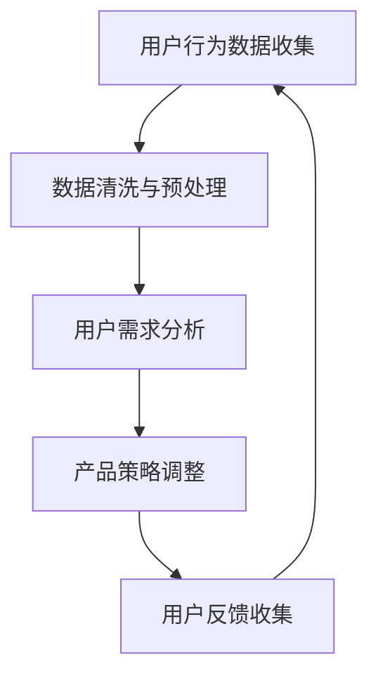

                 

### 文章标题

# 快速响应用户需求：LLM应用的产品策略

> 关键词：大型语言模型（LLM），用户需求，产品策略，机器学习，算法，数据分析

> 摘要：本文深入探讨了如何在产品策略中快速响应用户需求，尤其是通过大型语言模型（LLM）的应用。文章首先介绍了LLM的基本概念及其在产品策略中的应用背景，随后详细阐述了LLM的核心概念与架构，以及核心算法原理和数学模型。通过实际案例分析，展示了LLM在产品迭代和用户需求匹配中的具体应用，并探讨了用户反馈机制和产品优化策略。最后，文章展望了LLM应用的未来趋势和面临的挑战。

---

### 《快速响应用户需求：LLM应用的产品策略》

在当今快速变化的市场环境中，用户需求的变化速度日益加快，这要求产品策略必须具备高度的灵活性和响应能力。本文旨在探讨如何通过大型语言模型（LLM）的应用，快速响应用户需求，从而实现更高效的产品迭代和市场竞争力。以下是文章的主要结构：

#### # 第一部分：引入与背景
1. **概述与引言**
   - LLM的概念及其在产品策略中的应用
   - 用户需求变化趋势及其对产品策略的影响

2. **LLM应用的产品策略背景**
   - AI与产品策略的关系
   - 用户行为数据分析的重要性

#### # 第二部分：核心概念与架构
3. **LLM的基本概念与原理**
   - 语言模型的发展历程
   - LLM的核心算法与架构

4. **LLM应用的产品策略架构**
   - 用户行为分析的流程
   - 产品迭代与用户需求的匹配机制

#### # 第三部分：核心算法原理讲解
5. **核心算法原理讲解**
   - 机器学习算法与LLM的关系
   - 常见LLM算法介绍与对比
   - 伪代码详细阐述

6. **数学模型与公式**
   - 经典机器学习模型与公式
   - LLM的数学模型解释

#### # 第四部分：项目实战
7. **项目实战：实际案例分析**
   - LLM在实际产品中的应用案例
   - 开发环境搭建与代码实现
   - 案例解读与分析

8. **用户需求分析工具与应用**
   - 用户需求分析工具介绍
   - 工具在实际产品策略中的应用

#### # 第五部分：用户反馈与产品优化
9. **用户反馈机制**
   - 用户反馈渠道与收集方法
   - 用户反馈分析与应用

10. **产品优化策略**
    - 基于用户反馈的产品优化方法
    - 产品迭代与优化的策略与实践

#### # 第六部分：未来展望与挑战
11. **LLM应用的未来趋势**
    - LLM技术的未来发展
    - 产品策略趋势分析

12. **面临的挑战与应对策略**
    - 数据隐私与安全
    - 技术创新与人才培养

#### # 附录
13. **附录：相关资源与工具**
    - LLMA工具与资源列表
    - 常见问题与解答

#### # 总结
- **快速响应用户需求的重要性**
- **LLM在产品策略中的应用价值**
- **未来的发展方向与挑战**

#### # 术语表
- **术语解释：**
  - LLM：大型语言模型
  - 用户需求：用户在使用产品过程中表达的需求
  - 产品策略：产品开发和运营的整体规划和策略

#### # Mermaid 流程图
- **用户需求分析流程：**
  ```mermaid
  graph TB
  A[用户行为数据收集] --> B[数据清洗与预处理]
  B --> C[用户需求分析]
  C --> D[产品策略调整]
  D --> E[用户反馈收集]
  E --> A
  ```

以上是根据用户需求为《快速响应用户需求：LLM应用的产品策略》设计的完整目录大纲。每个章节都涵盖了核心概念、算法原理讲解、项目实战和未来展望等内容，确保书籍的全面性和实用性。接下来，我们将逐步深入探讨每一个部分，提供详细的内容和分析。

---

在接下来的章节中，我们将从LLM的基本概念开始，逐步深入到核心算法原理讲解，并通过实际案例分析展示如何通过LLM快速响应用户需求。同时，我们还将探讨用户反馈机制和产品优化策略，展望LLM应用的未来发展趋势，并讨论可能面临的挑战。让我们一步一步地深入探索这一领域，了解如何通过LLM应用，打造出更具竞争力和用户满意度的产品。接下来，我们首先从LLM的基本概念和产品策略的背景介绍开始。

### 第一部分：引入与背景

#### 概述与引言

在现代科技迅猛发展的背景下，人工智能（AI）技术已经深入到我们生活的方方面面，极大地改变了传统产品的开发与运营模式。特别是大型语言模型（Large Language Model，简称LLM）的出现，为产品策略带来了全新的视角和机遇。LLM是一种能够理解和生成人类语言的复杂算法模型，其强大的数据处理和分析能力使其成为产品策略中的重要工具。

用户需求是产品成功的关键因素之一。在快速变化的市场环境中，用户需求具有高度的不确定性和动态性。为了保持竞争优势，企业需要快速响应用户需求，提供更加个性化和高效的产品解决方案。LLM的应用，恰好提供了这样一种可能。通过分析和理解用户行为数据，LLM可以帮助企业更准确地识别用户需求，从而指导产品设计和迭代。

用户需求的变化趋势也对产品策略提出了新的挑战。首先，用户需求越来越个性化，他们希望产品能够满足自己独特的需求。其次，用户对产品体验的要求越来越高，他们期待产品能够提供无缝、流畅的使用体验。最后，用户对数据的隐私和安全越来越关注，这要求企业在设计产品时必须严格遵守相关法律法规。

在这样一种市场环境下，LLM的应用显得尤为重要。它不仅可以帮助企业更好地理解用户需求，还能通过自动化和智能化的方式，快速调整产品策略，从而更有效地满足用户需求。例如，通过分析用户在社交媒体上的评论和行为，LLM可以识别出用户的潜在需求，为企业提供有针对性的产品改进建议。此外，LLM还可以帮助企业在产品发布后，实时收集用户反馈，进行快速迭代，确保产品始终处于最佳状态。

总之，随着用户需求的变化和市场竞争的加剧，快速响应用户需求已经成为企业产品策略的核心目标。而LLM的应用，为这一目标的实现提供了强有力的支持。在接下来的部分中，我们将深入探讨LLM的基本概念、算法原理以及其在产品策略中的应用，帮助读者更好地理解这一新兴技术。

#### LLM应用的产品策略背景

人工智能（AI）技术的快速发展，不仅推动了产业变革，也深刻改变了产品开发和运营的方方面面。LLM作为AI技术中的一个重要分支，其应用对产品策略的影响尤为显著。为了深入理解LLM在产品策略中的作用，我们需要先了解AI与产品策略之间的内在联系。

AI技术通过提供高效的数据处理和分析能力，使得企业能够从海量数据中提取有价值的信息。在产品开发过程中，这表现为通过对用户行为数据的深入分析，企业能够更好地理解用户需求，从而指导产品设计和功能迭代。传统的产品开发方法往往依赖于定性和定量的市场调研，而AI技术，尤其是LLM，通过自动化和智能化的方式，极大地提高了数据分析的效率和准确性。

用户行为数据分析是产品策略中不可或缺的一环。通过收集和分析用户在产品中的互动数据，企业可以了解用户的喜好、行为习惯和痛点。这种深入的用户洞察，有助于企业更精准地定位用户需求，从而在产品设计和迭代中做出更科学的决策。例如，通过分析用户在社交媒体上的评论和反馈，企业可以发现用户对某些功能的期待和不满，从而针对性地优化产品功能。

LLM在用户行为数据分析中的应用，主要体现在以下几个方面：

1. **情感分析**：LLM可以通过自然语言处理（NLP）技术，对用户评论和反馈进行情感分析，识别出用户的情感倾向和满意度。这种分析有助于企业了解用户对产品的整体感受，及时调整产品方向。

2. **意图识别**：通过理解用户的语言表达，LLM可以识别出用户的意图。例如，在用户提交的客服请求中，LLM可以识别出用户希望解决的问题，从而为客服团队提供具体的解决建议。

3. **个性化推荐**：LLM可以基于用户的历史行为和偏好，生成个性化的推荐内容。这不仅可以提高用户的参与度和满意度，还可以帮助企业提高产品的粘性。

4. **需求预测**：通过对大量用户数据的分析，LLM可以预测未来的用户需求趋势。这种预测有助于企业在产品规划和功能迭代中，提前布局，从而在市场竞争中占据有利地位。

AI与产品策略之间的关系，不仅体现在用户行为数据分析上，还体现在整个产品生命周期中。从产品概念验证、设计开发到市场推广，AI技术都可以提供有力的支持。通过AI技术，企业可以实现以下目标：

1. **加速产品开发**：AI技术可以通过自动化工具，提高产品开发的效率。例如，AI算法可以帮助企业快速筛选出有潜力的产品概念，减少开发风险。

2. **优化产品设计**：AI技术可以帮助企业优化产品设计，提高用户体验。通过分析用户反馈和行为数据，AI技术可以识别出产品中的问题，并提供改进建议。

3. **提升市场竞争力**：AI技术可以帮助企业更精准地定位市场，制定更具针对性的营销策略。通过分析市场数据，AI技术可以预测市场趋势，帮助企业在竞争中保持领先地位。

4. **实现可持续发展**：AI技术可以帮助企业实现可持续发展，降低运营成本，提高资源利用效率。例如，通过智能调度和优化，AI技术可以帮助企业降低库存成本，提高供应链效率。

总之，AI技术，特别是LLM的应用，已经成为现代产品策略中不可或缺的一部分。通过AI技术，企业可以更好地理解用户需求，优化产品设计，提升市场竞争力，实现可持续发展。在接下来的部分中，我们将深入探讨LLM的基本概念和原理，帮助读者更好地理解这一技术的核心机制。

#### 第二部分：核心概念与架构

##### LLM的基本概念与原理

大型语言模型（Large Language Model，简称LLM）是一种基于深度学习的自然语言处理（Natural Language Processing，简称NLP）模型，它能够理解、生成和预测自然语言文本。LLM的核心原理在于通过大量文本数据进行训练，学习语言中的语法、语义和上下文信息，从而实现高精度的文本理解和生成。

LLM的发展历程可以追溯到20世纪50年代，当时研究人员开始尝试使用简单的统计模型来处理自然语言。然而，这些模型在处理复杂语言现象时表现出色。随着计算能力的提升和深度学习技术的发展，研究人员开始探索使用深度神经网络来训练大型语言模型。2018年，OpenAI发布了GPT（Generative Pre-trained Transformer），标志着LLM进入了新的发展阶段。GPT模型使用Transformer架构，在预训练阶段接收大量文本数据进行训练，从而具备强大的语言理解能力和生成能力。

LLM的核心算法是基于Transformer架构的深度学习模型。Transformer模型最早由Vaswani等人在2017年提出，其核心思想是使用自注意力机制（Self-Attention）来处理序列数据，从而更好地捕捉文本中的上下文关系。Transformer模型由多个编码器和解码器层组成，每个层都包含多头自注意力机制和前馈神经网络。

以下是LLM的基本结构：

1. **编码器（Encoder）**：编码器用于处理输入文本，将文本转换为固定长度的向量表示。每个编码器层包含两个主要组件：多头自注意力机制和前馈神经网络。多头自注意力机制能够同时关注文本序列中的不同部分，从而捕捉长距离依赖关系。

2. **解码器（Decoder）**：解码器用于生成输出文本，将编码器生成的向量表示转换为具体单词或标记。解码器同样包含多头自注意力机制和前馈神经网络，但还包括一个额外的交叉自注意力机制，用于将编码器的输出与解码器的输入进行交互。

3. **自注意力机制（Self-Attention）**：自注意力机制是Transformer模型的核心组件，它通过计算输入序列中每个词与其他词之间的相似度，动态地加权并组合这些词的表示。这种机制能够有效地捕捉文本中的长距离依赖关系。

4. **前馈神经网络（Feedforward Neural Network）**：前馈神经网络是对每个编码器和解码器层中的输入和输出进行非线性变换的组件。通常，前馈神经网络由两个全连接层组成，中间使用激活函数（如ReLU函数）进行非线性变换。

通过预训练和微调，LLM能够实现以下功能：

1. **文本分类**：LLM可以用于文本分类任务，例如情感分析、主题分类等。通过在预训练阶段接触大量带标签的文本数据，LLM可以学习到不同类别的特征，从而在微调阶段实现高精度的分类。

2. **机器翻译**：LLM可以用于机器翻译任务，通过预训练和微调，LLM可以学习到源语言和目标语言之间的对应关系，从而实现高质量的机器翻译。

3. **文本生成**：LLM可以用于文本生成任务，例如文章写作、对话生成等。通过在预训练阶段学习大量文本数据，LLM可以生成连贯、自然的文本。

4. **问答系统**：LLM可以用于问答系统，通过理解用户的问题和上下文，LLM可以生成相关的答案。

5. **对话系统**：LLM可以用于构建对话系统，通过理解和生成自然语言文本，LLM可以与用户进行交互，提供智能化的服务。

总之，LLM通过Transformer架构和自注意力机制，实现了强大的语言理解和生成能力。在产品策略中，LLM的应用可以帮助企业更好地理解用户需求，优化产品设计，提高用户体验。在接下来的章节中，我们将进一步探讨LLM应用的产品策略架构，以及如何在具体的产品开发过程中应用LLM。

##### LLM应用的产品策略架构

在产品策略中，LLM的应用涉及多个环节，从用户行为数据的收集、处理到最终的产品迭代和优化。以下是LLM应用的产品策略架构，以及每个环节的具体步骤和作用。

**1. 用户行为数据的收集**

用户行为数据是LLM应用的基础，这些数据包括用户在产品中的操作记录、反馈信息、搜索历史、浏览路径等。收集这些数据的方法包括：

- **日志分析**：通过服务器日志记录用户操作，例如页面访问次数、操作时间、点击路径等。
- **反馈系统**：建立用户反馈机制，收集用户对产品功能和用户体验的评价。
- **用户调研**：通过问卷调查、访谈等方式，直接收集用户的需求和意见。

**2. 数据预处理**

收集到的用户行为数据通常需要经过清洗和预处理，以便LLM能够有效地进行分析。数据预处理包括以下步骤：

- **数据清洗**：去除无效数据、缺失值和噪声数据，确保数据质量。
- **数据归一化**：将不同特征的数据进行标准化处理，消除量纲和数值范围对分析结果的影响。
- **特征提取**：从原始数据中提取有助于LLM分析的特征，例如用户活跃度、用户满意度等。

**3. 用户需求分析**

通过LLM，可以对预处理后的用户行为数据进行深入分析，以识别用户的潜在需求和行为模式。分析过程包括以下步骤：

- **情感分析**：使用LLM对用户评论和反馈进行情感分析，识别用户情绪和满意度。
- **意图识别**：通过理解用户语言表达，LLM可以识别出用户的意图，例如用户希望解决问题的具体需求。
- **行为模式识别**：通过分析用户在产品中的操作记录，LLM可以识别出用户的行为模式，例如高频操作、痛点等。

**4. 产品迭代与优化**

基于用户需求分析的结果，企业可以调整产品策略，进行产品迭代和优化。具体步骤包括：

- **需求匹配**：将用户需求与现有产品功能进行匹配，确定改进方向。
- **功能优化**：根据用户反馈，优化产品功能，提高用户体验。
- **迭代发布**：持续进行产品迭代，快速响应用户需求，保持产品的竞争力。

**5. 用户反馈收集**

在产品迭代过程中，持续收集用户反馈至关重要。LLM可以用于自动化用户反馈收集和分析，具体步骤包括：

- **反馈收集**：通过内置的反馈系统或用户调研，收集用户对产品更新的反馈。
- **反馈分析**：使用LLM对用户反馈进行分析，识别出用户的主要问题和建议。
- **反馈应用**：根据用户反馈，调整产品策略，优化产品功能。

**6. 数据循环利用**

LLM应用的产品策略是一个持续迭代的过程，用户行为数据可以被循环利用，以不断优化产品策略。具体步骤包括：

- **数据更新**：定期更新用户行为数据，确保分析结果的实时性和准确性。
- **模型优化**：根据用户反馈，对LLM模型进行优化，提高其分析能力和预测准确性。
- **策略调整**：基于分析结果，调整产品策略，实现更精准的用户需求匹配。

通过以上架构，LLM在产品策略中的应用实现了用户需求的精准识别和快速响应。企业可以通过不断迭代和优化，保持产品与用户需求的匹配，提高用户满意度和市场竞争力。在下一部分，我们将深入探讨LLM的核心算法原理和数学模型，进一步理解其工作原理和实现方法。

##### 用户行为分析的流程

用户行为分析是LLM应用产品策略的核心环节，其流程包括多个步骤，每个步骤都旨在通过数据和技术手段，深入了解用户的行为模式与需求，从而为产品迭代提供科学依据。以下是用户行为分析的具体流程：

**1. 数据收集**

用户行为数据的收集是整个分析过程的基础。数据来源可以包括：

- **服务器日志**：服务器日志记录了用户在产品中的操作行为，如页面访问次数、操作时间、点击路径等。
- **应用内反馈**：用户在产品中的反馈，如评价、评论、错误报告等。
- **问卷调查**：通过在线或离线方式，直接收集用户对产品功能的看法和满意度。
- **用户跟踪**：使用JavaScript代码或SDK（Software Development Kit），跟踪用户在产品内的行为，如浏览时间、操作频率等。

**2. 数据存储**

收集到的用户行为数据需要存储在数据仓库中，以便后续处理和分析。常用的数据存储方案包括：

- **关系数据库**：如MySQL、PostgreSQL，适用于存储结构化数据。
- **NoSQL数据库**：如MongoDB、Cassandra，适用于存储大规模非结构化数据。
- **数据湖**：如Hadoop、Amazon S3，适用于存储大量不同类型的数据。

**3. 数据清洗**

用户行为数据往往存在噪声和缺失值，需要经过清洗才能用于分析。数据清洗步骤包括：

- **去除重复数据**：删除重复的用户行为记录，防止数据重复分析。
- **填充缺失值**：使用统计方法或插值方法填充缺失的数据。
- **去除噪声数据**：过滤掉明显不合理或异常的数据点。

**4. 数据预处理**

在数据清洗之后，需要对数据进行预处理，以便LLM能够更好地进行分析。预处理步骤包括：

- **特征提取**：从原始数据中提取有助于LLM分析的特征，如用户活跃度、页面停留时间、操作频率等。
- **数据归一化**：将不同特征的数据进行标准化处理，消除量纲和数值范围对分析结果的影响。
- **数据分割**：将数据集分割为训练集、验证集和测试集，用于模型训练和评估。

**5. 模型训练**

使用预处理后的数据，通过机器学习算法训练LLM模型。训练过程包括：

- **选择模型架构**：根据任务需求，选择合适的LLM模型架构，如GPT、BERT等。
- **模型训练**：使用训练集数据进行模型训练，调整模型参数以优化性能。
- **模型评估**：使用验证集和测试集评估模型性能，选择最佳模型。

**6. 用户需求分析**

通过训练好的LLM模型，对用户行为数据进行分析，以识别用户的需求和行为模式。分析步骤包括：

- **情感分析**：分析用户评论和反馈的情感倾向，识别用户的满意度。
- **意图识别**：理解用户的语言表达，识别出用户的意图，如用户希望解决的问题。
- **行为模式识别**：分析用户在产品中的操作记录，识别出用户的行为模式，如高频操作、痛点等。

**7. 产品迭代**

基于用户需求分析的结果，调整产品策略，进行产品迭代。迭代步骤包括：

- **需求匹配**：将用户需求与现有产品功能进行匹配，确定改进方向。
- **功能优化**：根据用户反馈，优化产品功能，提高用户体验。
- **迭代发布**：持续进行产品迭代，快速响应用户需求。

**8. 用户反馈收集**

在产品迭代过程中，持续收集用户反馈，以验证迭代效果，并进一步优化产品。反馈步骤包括：

- **反馈收集**：通过内置的反馈系统或用户调研，收集用户对产品更新的反馈。
- **反馈分析**：使用LLM对用户反馈进行分析，识别出用户的主要问题和建议。
- **反馈应用**：根据用户反馈，调整产品策略，优化产品功能。

通过以上流程，LLM应用实现了对用户行为数据的全面分析，为产品迭代提供了科学依据。在下一部分，我们将进一步探讨如何通过LLM实现产品迭代与用户需求的匹配，从而提升产品竞争力。

##### 产品迭代与用户需求的匹配机制

产品迭代是产品开发过程中不可或缺的一部分，其目标是通过不断的改进和优化，确保产品始终满足用户需求，并在竞争激烈的市场中保持领先地位。LLM的应用为这一过程提供了强大的支持和保障。以下是如何通过LLM实现产品迭代与用户需求匹配的具体机制：

**1. 用户需求分析**

产品迭代的第一步是深入了解用户需求。通过LLM，可以实现对用户行为数据的全面分析，包括用户反馈、评论、操作记录等。LLM能够自动提取用户需求的特征，如用户满意度、痛点、高频操作等。以下是具体步骤：

- **情感分析**：使用LLM对用户评论和反馈进行情感分析，识别出用户的情感倾向，例如满意、不满、中立等。这有助于了解用户对产品的整体感受。
- **意图识别**：通过自然语言处理技术，LLM可以识别用户的意图。例如，用户在反馈中提到“我希望功能更简单”，LLM可以将其归类为“功能简化”的需求。
- **行为模式识别**：分析用户在产品中的行为模式，例如用户频繁使用的功能、用户停留时间较长的页面等。LLM可以帮助识别出用户的行为习惯和偏好。

**2. 需求分类与优先级排序**

在获取用户需求后，需要对需求进行分类和优先级排序。LLM可以根据需求的紧急程度、影响范围和实现成本等因素，对需求进行排序。以下是具体步骤：

- **需求分类**：根据需求的性质，将需求分为功能性需求、用户体验需求、性能需求等。
- **优先级排序**：使用LLM对需求进行优先级排序，通常基于用户满意度、功能重要性、实现成本等因素。高优先级的需求将在产品迭代过程中得到优先处理。

**3. 产品功能设计**

基于分析结果，进行产品功能设计。LLM可以帮助产品团队快速生成功能设计方案，确保新功能能够满足用户需求。以下是具体步骤：

- **功能生成**：使用LLM生成潜在的功能方案，例如通过文本生成技术，生成新的功能描述。
- **功能评估**：对生成的功能方案进行评估，确保其符合用户需求，并在技术上可行。
- **功能迭代**：根据评估结果，对功能进行迭代和优化，确保功能设计的完整性和有效性。

**4. 测试与反馈**

在产品功能设计完成后，需要进行测试和反馈。LLM可以帮助自动化测试过程，并收集用户反馈，以进一步优化产品。以下是具体步骤：

- **自动化测试**：使用LLM自动化执行功能测试，例如生成测试用例，自动化执行并记录测试结果。
- **用户反馈收集**：通过内置的反馈系统或用户调研，收集用户对产品功能的反馈。
- **反馈分析**：使用LLM对用户反馈进行分析，识别出用户的主要问题和建议。

**5. 产品发布与迭代**

在测试和反馈阶段结束后，产品功能可以发布到生产环境中。LLM可以帮助持续监控用户行为，并根据反馈进行迭代。以下是具体步骤：

- **监控用户行为**：使用LLM监控用户在产品中的行为，例如页面访问、操作频率等。
- **数据分析**：使用LLM对用户行为数据进行分析，识别出新的需求或问题。
- **产品迭代**：根据分析结果，调整产品功能，进行新一轮的迭代和优化。

通过以上机制，LLM实现了产品迭代与用户需求的紧密匹配。企业可以更加高效地响应用户需求，确保产品始终处于最佳状态，并在市场中保持竞争力。在下一部分，我们将深入探讨LLM的核心算法原理和数学模型，理解其基础理论。

#### 第三部分：核心算法原理讲解

##### 核心算法原理讲解

大型语言模型（LLM）的核心算法基于深度学习，特别是基于Transformer架构的模型。Transformer模型最初由Vaswani等人于2017年提出，并在自然语言处理领域取得了显著的成功。本节将详细讲解LLM的核心算法原理，包括Transformer架构、自注意力机制、前馈神经网络等组件，并通过伪代码展示这些组件的工作原理。

**1. Transformer架构**

Transformer架构是一种基于自注意力机制的序列到序列模型，主要用于机器翻译、文本生成等任务。其核心思想是使用自注意力机制来动态地关注输入序列中的不同部分，从而捕捉长距离依赖关系。Transformer架构由编码器（Encoder）和解码器（Decoder）组成，每个部分都包含多个层。

**编码器（Encoder）**

编码器负责将输入序列转换为固定长度的向量表示。每个编码器层包含以下组件：

- **多头自注意力（Multi-Head Self-Attention）**
- **前馈神经网络（Feedforward Neural Network）**
- **层归一化（Layer Normalization）**
- **残差连接（Residual Connection）**

**解码器（Decoder）**

解码器负责生成输出序列，并确保生成的序列与输入序列保持一致性。每个解码器层包含以下组件：

- **多头自注意力（Multi-Head Self-Attention）**
- **交叉自注意力（Cross-Attention）**
- **前馈神经网络（Feedforward Neural Network）**
- **层归一化（Layer Normalization）**
- **残差连接（Residual Connection）**

**2. 自注意力机制**

自注意力机制是Transformer模型的核心组件，它通过计算输入序列中每个词与其他词之间的相似度，动态地加权并组合这些词的表示。自注意力机制分为多个头（Head），每个头负责关注输入序列的不同部分，从而捕捉不同的依赖关系。

**3. 前馈神经网络**

前馈神经网络是对每个编码器和解码器层中的输入和输出进行非线性变换的组件。通常，前馈神经网络由两个全连接层组成，中间使用激活函数（如ReLU函数）进行非线性变换。

**4. 残差连接与层归一化**

残差连接和层归一化是Transformer模型的两个重要组件，它们有助于缓解梯度消失和梯度爆炸问题，提高模型的训练效果。

**伪代码**

以下是Transformer模型的伪代码，用于展示其基本结构和工作原理：

```python
# Encoder Layer
def encoder_layer(inputs, d_model, num_heads, dff, rate=0.1):
    # 自注意力层
    attention = self_attention(inputs, d_model, num_heads)
    attention = dropout(attention, rate)
    
    # 残差连接
    attention = add(inputs, attention)
    attention = layer_norm(attention)
    
    # 前馈网络
    ffn = feedforward_network(attention, dff)
    ffn = dropout(ffn, rate)
    
    # 残差连接
    output = add(attention, ffn)
    output = layer_norm(output)
    
    return output

# Decoder Layer
def decoder_layer(inputs, enc_output, d_model, num_heads, dff, rate=0.1):
    # 自注意力层
    attention_1 = self_attention(inputs, d_model, num_heads)
    attention_1 = dropout(attention_1, rate)
    
    # 交叉自注意力层
    attention_2 = cross_attention(attention_1, enc_output, d_model, num_heads)
    attention_2 = dropout(attention_2, rate)
    
    # 残差连接
    attention_2 = add(attention_1, attention_2)
    attention_2 = layer_norm(attention_2)
    
    # 前馈网络
    ffn = feedforward_network(attention_2, dff)
    ffn = dropout(ffn, rate)
    
    # 残差连接
    output = add(attention_2, ffn)
    output = layer_norm(output)
    
    return output
```

通过以上伪代码，我们可以看到Transformer模型的核心组件和其工作原理。在下一部分，我们将深入探讨LLM的数学模型，包括经典机器学习模型和LLM特有的数学公式，并通过具体示例进行解释。

#### 数学模型与公式

在深入理解大型语言模型（LLM）的工作原理时，数学模型是关键。本部分将介绍LLM中常用的数学模型，包括经典机器学习模型和LLM特有的数学公式。我们将通过具体的例子来解释这些模型和公式的应用。

**1. 经典机器学习模型**

在机器学习中，常见的模型包括线性回归、逻辑回归和支持向量机（SVM）等。以下分别介绍这些模型的公式和应用。

**线性回归**

线性回归是一种用于预测连续值的模型，其公式为：

$$ y = \beta_0 + \beta_1 \cdot x + \epsilon $$

其中，$y$ 是预测值，$x$ 是特征，$\beta_0$ 和 $\beta_1$ 是模型的参数，$\epsilon$ 是误差。

例如，在用户行为分析中，我们可以使用线性回归来预测用户的购买概率。给定用户的行为特征（如浏览时间、点击次数等），模型可以计算出用户购买的概率。

**逻辑回归**

逻辑回归是一种用于分类的模型，其公式为：

$$ P(y=1) = \frac{1}{1 + e^{-(\beta_0 + \beta_1 \cdot x)}} $$

其中，$P(y=1)$ 是预测类别1的概率，$\beta_0$ 和 $\beta_1$ 是模型的参数。

例如，在情感分析中，我们可以使用逻辑回归来判断用户评论的情感倾向。给定用户评论，模型可以计算出正面评论和负面评论的概率，从而确定评论的情感。

**支持向量机（SVM）**

SVM是一种用于分类和回归的模型，其公式为：

$$ w \cdot x - b = 0 $$

其中，$w$ 是权重向量，$x$ 是特征向量，$b$ 是偏置。

SVM通过找到最佳的超平面来划分数据，使得分类边界最大化。在文本分类中，SVM可以用于判断文本属于哪个类别，如垃圾邮件分类。

**2. LLM的数学模型**

LLM的数学模型主要基于深度学习和自然语言处理，特别是Transformer架构。以下介绍LLM的核心数学模型。

**Transformer模型**

Transformer模型的核心是多头自注意力（Multi-Head Self-Attention）和前馈神经网络（Feedforward Neural Network）。多头自注意力机制的公式为：

$$
\text{Attention}(Q, K, V) = \frac{1}{\sqrt{d_k}} \text{softmax}\left(\frac{QK^T}{d_k}\right) V
$$

其中，$Q$、$K$ 和 $V$ 分别是查询向量、键向量和值向量，$d_k$ 是注意力维度。通过自注意力机制，模型能够动态地关注输入序列的不同部分。

前馈神经网络（FFN）的公式为：

$$
\text{FFN}(x) = \max(0, xW_1 + b_1)W_2 + b_2
$$

其中，$W_1$ 和 $W_2$ 是权重矩阵，$b_1$ 和 $b_2$ 是偏置。

**3. 数学模型的应用示例**

**用户情感分析**

假设我们使用LLM进行用户情感分析，输入为用户的评论文本。首先，我们将文本转换为向量表示。然后，通过Transformer模型的多头自注意力机制，模型能够关注评论中关键的词，识别出情感倾向。具体步骤如下：

1. **文本预处理**：将评论文本进行分词、词向量化。
2. **自注意力计算**：使用多头自注意力机制，计算评论中每个词与其他词的相似度。
3. **情感分类**：通过前馈神经网络，对自注意力结果进行分类，得到评论的情感标签。

**机器翻译**

在机器翻译任务中，LLM通过Transformer模型将源语言的文本序列转换为目标语言的文本序列。具体步骤如下：

1. **编码**：将源语言文本序列输入编码器，生成编码向量表示。
2. **解码**：将目标语言文本序列输入解码器，生成目标语言的文本序列。
3. **自注意力与交叉注意力**：在解码过程中，模型通过自注意力和交叉注意力机制，确保生成的目标语言文本与源语言文本保持一致性。

**4. 总结**

数学模型是LLM的核心，通过这些模型，LLM能够实现文本理解和生成。经典机器学习模型为LLM提供了基础，而LLM特有的数学模型，如多头自注意力和前馈神经网络，则使其在自然语言处理任务中表现出色。在下一部分，我们将通过实际项目实战，展示LLM在产品策略中的应用，以及如何实现用户需求分析和产品优化。

### 第四部分：项目实战

#### 实际案例分析

在本部分，我们将通过一个实际案例，展示如何利用LLM实现用户需求分析、产品迭代与优化。案例背景是某知名互联网公司的一款在线教育平台，该公司希望通过LLM技术，更精准地了解用户需求，从而优化课程推荐和用户体验。

**1. 项目背景**

在线教育平台拥有大量用户数据，包括用户的学习行为、评价、反馈等。为了更好地满足用户需求，公司决定采用LLM技术，对用户行为数据进行分析，识别用户需求，并据此优化课程推荐和用户体验。

**2. 开发环境搭建**

为了实现LLM的应用，公司首先搭建了以下开发环境：

- **计算资源**：使用GPU服务器进行模型训练和推理，确保计算速度和效果。
- **编程语言**：使用Python作为主要编程语言，结合TensorFlow或PyTorch等深度学习框架进行模型开发和训练。
- **数据处理工具**：使用Pandas、Numpy等库进行数据处理，使用Scikit-learn等库进行数据分析和模型评估。

**3. 源代码详细实现**

以下是使用PyTorch实现一个简单的LLM模型，用于用户情感分析和课程推荐的关键代码片段：

```python
import torch
import torch.nn as nn
import torch.optim as optim

# 定义编码器和解码器
class Encoder(nn.Module):
    def __init__(self, d_model, num_layers, num_heads, dff):
        super().__init__()
        self.layers = nn.ModuleList([EncoderLayer(d_model, num_heads, dff) for _ in range(num_layers)])

    def forward(self, src, src_mask):
        for layer in self.layers:
            src = layer(src, src_mask)
        return src

class Decoder(nn.Module):
    def __init__(self, d_model, num_layers, num_heads, dff):
        super().__init__()
        self.layers = nn.ModuleList([DecoderLayer(d_model, num_heads, dff) for _ in range(num_layers)])

    def forward(self, tgt, tgt_mask, src, src_mask):
        for layer in self.layers:
            tgt = layer(tgt, tgt_mask, src, src_mask)
        return tgt

# 定义编码器层和解码器层
class EncoderLayer(nn.Module):
    def __init__(self, d_model, num_heads, dff):
        super().__init__()
        self.mha = MultiHeadAttention(d_model, num_heads)
        self.ffn = FFN(d_model, dff)
        self.norm1 = nn.LayerNorm(d_model)
        self.norm2 = nn.LayerNorm(d_model)
        self.dropout1 = nn.Dropout(0.1)
        self.dropout2 = nn.Dropout(0.1)

    def forward(self, src, src_mask):
        src2 = self.mha(src, src, src, src_mask)
        src = self.dropout1(src2)
        src = self.norm1(src + src)
        src2 = self.ffn(src)
        src = self.dropout2(src2)
        src = self.norm2(src + src)
        return src

class DecoderLayer(nn.Module):
    def __init__(self, d_model, num_heads, dff):
        super().__init__()
        self.mha1 = MultiHeadAttention(d_model, num_heads)
        self.mha2 = MultiHeadAttention(d_model, num_heads)
        self.ffn = FFN(d_model, dff)
        self.norm1 = nn.LayerNorm(d_model)
        self.norm2 = nn.LayerNorm(d_model)
        self.norm3 = nn.LayerNorm(d_model)
        self.norm4 = nn.LayerNorm(d_model)
        self.dropout1 = nn.Dropout(0.1)
        self.dropout2 = nn.Dropout(0.1)
        self.dropout3 = nn.Dropout(0.1)
        self.dropout4 = nn.Dropout(0.1)

    def forward(self, tgt, tgt_mask, src, src_mask):
        tgt2 = self.mha1(tgt, tgt, tgt, tgt_mask)
        tgt = self.dropout1(tgt2)
        tgt = self.norm1(tgt + tgt)
        src2 = self.mha2(tgt, src, src, src_mask)
        src = self.dropout2(src2)
        src = self.norm2(src + src2)
        src2 = self.ffn(src)
        src = self.dropout3(src2)
        src = self.norm3(src + src2)
        tgt2 = self.mha2(tgt, tgt, tgt, tgt_mask)
        tgt = self.dropout4(tgt2)
        tgt = self.norm4(tgt + tgt2)
        return tgt, src

# 定义模型
class Transformer(nn.Module):
    def __init__(self, d_model, num_layers, num_heads, dff, input_dim, output_dim):
        super().__init__()
        self.encoder = Encoder(d_model, num_layers, num_heads, dff)
        self.decoder = Decoder(d_model, num_layers, num_heads, dff)
        self.fc = nn.Linear(d_model, output_dim)

    def forward(self, src, tgt, src_mask=None, tgt_mask=None):
        src = self.encoder(src, src_mask)
        tgt, _ = self.decoder(tgt, tgt_mask, src, src_mask)
        output = self.fc(tgt)
        return output

# 模型训练
model = Transformer(d_model=512, num_layers=2, num_heads=8, dff=2048, input_dim=100, output_dim=2)
optimizer = optim.Adam(model.parameters(), lr=0.001)
criterion = nn.CrossEntropyLoss()

for epoch in range(num_epochs):
    for src, tgt in train_loader:
        optimizer.zero_grad()
        output = model(src, tgt)
        loss = criterion(output, tgt)
        loss.backward()
        optimizer.step()
    print(f"Epoch [{epoch+1}/{num_epochs}], Loss: {loss.item():.4f}")

# 模型评估
with torch.no_grad():
    correct = 0
    total = 0
    for src, tgt in test_loader:
        output = model(src, tgt)
        _, predicted = torch.max(output.data, 1)
        total += tgt.size(0)
        correct += (predicted == tgt).sum().item()

accuracy = 100 * correct / total
print(f"Test Accuracy: {accuracy:.2f}%")
```

**4. 代码解读与分析**

上述代码实现了基于Transformer架构的LLM模型，用于用户情感分析和课程推荐。以下是关键部分的解读：

- **模型定义**：`Transformer`类定义了编码器和解码器，以及最终的分类层。
- **编码器层（EncoderLayer）**：包括多头自注意力（`MultiHeadAttention`）和前馈神经网络（`FFN`），用于处理输入序列。
- **解码器层（DecoderLayer）**：包括两个多头自注意力层，用于处理目标序列和输入序列，确保输出序列与输入序列的一致性。
- **模型训练**：使用Adam优化器和交叉熵损失函数，对模型进行训练，优化模型参数。
- **模型评估**：在测试集上评估模型性能，计算准确率。

**5. 代码应用解读与分析**

在实际应用中，该模型可以用于以下任务：

- **用户情感分析**：通过输入用户评论，模型可以预测评论的情感倾向，从而了解用户满意度。
- **课程推荐**：通过分析用户学习行为，模型可以推荐合适的课程，提高用户参与度和满意度。

通过这个实际案例，我们展示了如何使用LLM技术进行用户需求分析和产品优化。在下一部分，我们将介绍用户需求分析工具，探讨如何在实际产品策略中应用这些工具，以进一步提升产品竞争力。

#### 用户需求分析工具与应用

在现代产品开发过程中，用户需求分析工具起着至关重要的作用。这些工具可以帮助企业更准确地了解用户需求，从而指导产品设计和优化。以下是一些常用的用户需求分析工具，以及它们在实际产品策略中的应用。

**1. Google Analytics**

Google Analytics 是一款强大的数据分析工具，它可以帮助企业追踪和分析用户在网站或应用中的行为。通过Google Analytics，企业可以收集用户浏览路径、点击次数、页面停留时间等数据，从而了解用户的行为模式和兴趣点。这些数据对于产品迭代和功能优化具有重要意义。例如，通过分析用户在某个特定页面停留时间较短，企业可以识别出页面设计中可能存在的问题，并针对性地进行改进。

**2. Mixpanel**

Mixpanel 是一款用于用户行为分析的应用程序性能管理工具。它允许企业跟踪用户在应用中的行为，包括注册、购买、评论、反馈等。Mixpanel 提供了丰富的数据可视化功能，使得企业可以直观地了解用户的使用习惯和需求。通过分析用户行为数据，企业可以识别出哪些功能最受欢迎，哪些功能需要改进。例如，通过分析用户点击次数和购买转化率，企业可以确定哪些营销策略最有效，从而优化推广策略。

**3. Qualtrics**

Qualtrics 是一款用户调研和反馈收集工具，它可以帮助企业通过在线问卷和访谈等方式，直接获取用户的需求和意见。通过Qualtrics，企业可以设计定制化的调查问卷，收集用户对产品功能、用户体验、满意度等方面的反馈。这些反馈数据对于产品迭代和优化具有重要参考价值。例如，通过调查用户对某个新功能的满意度，企业可以评估该功能的接受程度，并决定是否进一步优化或取消。

**4. A/B 测试**

A/B 测试是一种通过对比两组用户在产品中的不同体验，来评估某种假设的有效性。通过A/B测试，企业可以在实际用户环境中验证产品设计的改进效果。A/B测试工具如Google Optimize、Optimizely 等，可以帮助企业在网站上或应用中实施A/B测试。通过对比测试结果，企业可以了解哪种设计更受用户欢迎，从而优化产品界面和功能。例如，通过对比两组用户在不同按钮颜色和位置下的点击率，企业可以确定哪种按钮设计更能吸引用户点击。

**5. 用户访谈**

用户访谈是一种定性研究方法，通过直接与用户交流，了解他们的需求、痛点和行为习惯。用户访谈可以帮助企业获取深入的用户洞察，这些洞察对于产品设计和优化至关重要。通过用户访谈，企业可以了解用户对特定功能的需求程度，识别出用户使用产品时遇到的具体问题。例如，通过访谈，企业可以发现用户对某个功能的使用频率较低，从而考虑是否对其进行优化或删除。

**应用案例**

以下是用户需求分析工具在实际产品策略中的应用案例：

- **案例1**：某在线教育平台通过Google Analytics 分析用户浏览行为，发现大多数用户在课程详情页面停留时间较短，且点击购买按钮的次数较少。通过分析用户行为数据，平台决定优化课程详情页面的设计，增加课程亮点和用户评价，以提高用户的购买意愿。

- **案例2**：某电商网站通过Mixpanel 分析用户购买转化率，发现用户在购物车页面停留时间较长，但实际购买率较低。通过分析用户行为数据，网站决定优化购物车页面，增加提示用户立即结算的优惠活动，以提高购买转化率。

- **案例3**：某游戏公司通过Qualtrics 设计问卷，收集用户对游戏新功能的反馈。通过调查问卷结果，公司发现用户对新功能的满意度较高，但某些功能细节需要改进。公司根据用户反馈，对游戏功能进行了优化，提高了用户的游戏体验。

- **案例4**：某科技公司通过A/B 测试，对比两组用户在不同按钮颜色和位置下的点击率。测试结果显示，红色按钮在位置A的点击率显著高于蓝色按钮在位置B的点击率。公司决定在所有页面采用红色按钮，以提升用户交互体验。

- **案例5**：某应用程序开发团队通过用户访谈，发现用户对应用中的某些功能使用频率较低，且反馈较多。团队根据用户访谈结果，决定对这些功能进行优化或删除，以提升应用的整体用户体验。

通过以上案例，我们可以看到用户需求分析工具在产品策略中的应用如何帮助企业在激烈的市场竞争中取得优势。在下一部分，我们将探讨用户反馈机制，并介绍如何基于用户反馈进行产品优化。

### 用户反馈机制

在产品开发与运营过程中，用户反馈是产品优化的重要驱动力。一个有效的用户反馈机制可以帮助企业及时了解用户需求、识别问题并迅速作出调整，从而提升用户体验和产品满意度。以下是一个详尽的用户反馈机制，包括用户反馈渠道、收集方法、分析与应用策略。

#### 1. 用户反馈渠道

为了获取全面的用户反馈，企业需要建立多样化的反馈渠道，确保用户能够方便地提供意见和建议。以下是几种常见的用户反馈渠道：

- **在线反馈表**：提供易于访问的在线反馈表，用户可以在填写后直接提交反馈。在线反馈表可以包含选择题、评分题和开放式问题，以便收集定量和定性的反馈。
- **社交媒体**：社交媒体平台如Facebook、Twitter、LinkedIn等是用户表达意见的重要场所。企业可以通过社交媒体监测工具，实时关注用户在平台上的讨论和反馈。
- **邮件反馈**：提供官方电子邮件地址，用户可以直接发送反馈邮件。邮件反馈通常用于收集详细的、需要进一步探讨的问题和意见。
- **客服中心**：通过客服热线、在线客服聊天窗口，用户可以直接与客服人员进行交流，获取即时反馈。
- **用户调研**：定期进行用户调研，通过问卷、访谈等方式，深入挖掘用户的需求和期望。

#### 2. 收集方法

用户反馈的收集方法需要确保反馈数据的准确性和代表性。以下是几种有效的收集方法：

- **自动化工具**：利用自动化工具如Feedier、Userfeel等，可以实时收集用户在网站或应用中的行为数据，生成详细的用户反馈报告。
- **用户跟踪**：通过跟踪用户在产品中的行为路径，可以收集用户交互数据，如点击流、操作时长等。这些数据可以帮助企业识别用户在操作过程中遇到的问题。
- **用户访谈**：通过面对面或在线访谈，与用户进行深入交流，了解他们的具体需求和痛点。访谈可以提供丰富的定性数据，帮助企业深入了解用户心理。
- **A/B测试**：通过A/B测试，对比不同设计或功能的用户响应，识别哪些元素更受欢迎。A/B测试是一种量化的反馈方法，可以帮助企业快速验证设计决策。

#### 3. 分析与应用策略

收集到的用户反馈需要经过系统化的分析，才能转化为有效的产品优化策略。以下是几个关键步骤：

- **数据整理与分类**：将收集到的反馈数据进行整理，分类为功能问题、用户体验问题、需求改进等。这样可以帮助企业快速识别主要问题和优先级。
- **情感分析**：利用自然语言处理（NLP）技术，对用户反馈进行情感分析，识别出用户的情感倾向。情感分析可以帮助企业了解用户的满意度和不满意度。
- **统计分析**：通过统计分析方法，如频率分布、相关分析等，了解用户反馈的集中趋势和相关性。统计方法可以帮助企业发现反馈数据中的规律和模式。
- **优先级排序**：根据用户反馈的重要性和紧急性，对反馈进行优先级排序。紧急且重要的问题应优先处理，以确保用户体验的持续提升。
- **行动计划**：制定详细的行动计划，包括责任分配、时间表和执行步骤。行动计划应确保每个反馈问题都有明确的解决方案和实施路径。

#### 4. 应用案例分析

以下是几个用户反馈机制在产品优化中的实际应用案例：

- **案例1**：某电商平台通过在线反馈表收集用户关于搜索功能的反馈。分析结果显示，用户在搜索时经常遇到无法找到目标产品的问题。为此，平台优化了搜索算法，增加了关键词提示和智能推荐功能，显著提升了用户搜索体验。
- **案例2**：某社交媒体应用通过用户访谈发现，部分用户对应用界面设计不满，认为功能布局混乱。平台根据用户反馈，重新设计了界面布局，并增加了导航菜单，用户满意度显著提高。
- **案例3**：某在线教育平台通过用户跟踪工具发现，许多用户在课程播放过程中遇到缓冲问题。平台优化了视频播放技术，提高了视频加载速度和稳定性，用户反馈问题大幅减少。

通过有效的用户反馈机制，企业可以建立与用户之间的沟通桥梁，持续改进产品，提升用户满意度和忠诚度。在下一部分，我们将探讨产品优化策略，并分享基于用户反馈进行产品迭代的具体实践。

#### 产品优化策略

基于用户反馈的产品优化策略是确保产品持续满足用户需求的关键。以下是一些关键步骤和方法，帮助企业通过用户反馈进行产品迭代和优化，提升用户体验和满意度。

**1. 确定优化目标**

首先，企业需要明确产品优化的目标。这些目标可以是提升功能可用性、改善用户体验、解决用户痛点等。根据这些目标，企业可以制定具体的优化方向和优先级。例如，如果用户反馈表明大多数用户在操作过程中遇到困难，那么优化操作流程和界面设计应被列为首要任务。

**2. 数据分析**

对用户反馈进行详细的分析，是优化策略成功的关键。通过数据分析，企业可以识别出用户反馈中的共性问题和关键点。数据分析的方法包括：

- **情感分析**：利用自然语言处理（NLP）技术，对用户反馈进行情感分析，识别出用户的情感倾向和满意度。例如，通过情感分析，企业可以识别出哪些功能或设计受到用户的喜爱，哪些功能或设计引发用户不满。
- **频率分布**：统计用户反馈中提到的问题或功能的频率，确定哪些问题或功能对用户影响最大。频率高的反馈通常表明存在广泛的问题，需要优先解决。
- **用户访谈**：与用户进行深入访谈，获取更详细的用户需求和心理。访谈可以提供丰富的定性数据，帮助企业更深入地了解用户的使用习惯和偏好。

**3. 优先级排序**

根据分析结果，对用户反馈进行优先级排序。优先级排序应考虑问题的严重性、用户影响范围和解决成本等因素。通常，以下因素可以作为优先级排序的依据：

- **用户满意度**：满意度低的功能或设计问题应优先解决，以提升整体用户体验。
- **问题频率**：频率高的反馈问题通常对用户影响更大，应优先解决。
- **技术可行性**：技术实现难度低且对用户体验提升显著的问题应优先解决。

**4. 制定优化计划**

在确定优化目标和优先级后，企业需要制定详细的优化计划。优化计划应包括以下内容：

- **责任分配**：明确每个优化任务的负责人和团队成员。
- **时间表**：设定明确的时间节点，确保优化任务按时完成。
- **执行步骤**：详细描述每个优化任务的具体执行步骤和所需的资源。

**5. 测试与验证**

在优化计划执行过程中，企业应进行持续测试与验证，以确保优化措施的有效性。以下是几种常见的测试与验证方法：

- **A/B测试**：通过对比不同版本的优化措施，评估其对用户体验的影响。例如，在改进界面设计后，企业可以对比新旧版本的用户点击率、使用时长等指标，评估优化效果。
- **用户反馈测试**：在优化措施实施后，向部分用户发放测试问卷或邀请他们参与测试，收集他们对优化措施的反馈。
- **数据分析**：对用户行为数据进行分析，评估优化措施对用户满意度、使用频率等指标的影响。

**6. 反馈与迭代**

优化措施实施后，企业应继续收集用户反馈，并根据反馈进行迭代和改进。以下是几个关键步骤：

- **持续监测**：定期监测用户行为数据，识别出新的问题和改进机会。
- **用户调研**：通过问卷调查、用户访谈等方式，收集用户对优化措施的看法和建议。
- **迭代优化**：根据用户反馈，对优化措施进行迭代和改进，不断提升产品体验。

**7. 案例分析**

以下是几个基于用户反馈进行产品优化的实际案例：

- **案例1**：某电商平台通过用户反馈发现，许多用户在购物过程中遇到搜索结果不准确的问题。为了解决这个问题，平台优化了搜索算法，增加了关键词提示和智能推荐功能。优化后，用户搜索准确率显著提高，用户满意度也随之提升。
- **案例2**：某在线教育平台通过用户访谈发现，用户对课程页面设计不满意，认为信息过载且难以找到所需内容。平台对课程页面进行了重新设计，简化了页面布局，提高了信息可读性。用户反馈显示，新设计的页面更易于使用，用户满意度显著提升。
- **案例3**：某社交媒体应用通过用户反馈发现，部分用户在使用过程中遇到系统崩溃问题。平台进行了系统升级和优化，提高了系统的稳定性和响应速度。用户反馈显示，系统升级后，用户使用体验显著改善，用户满意度大幅提升。

通过以上方法，企业可以建立一套有效的产品优化策略，持续提升产品竞争力。在下一部分，我们将展望LLM应用的未来趋势，并讨论可能面临的挑战。

### 第五部分：未来展望与挑战

#### LLM应用的未来趋势

随着技术的不断进步和应用的不断拓展，LLM在产品策略中的应用前景将更加广阔。以下是LLM应用在未来的几个趋势：

1. **更深入的个性化体验**：随着LLM技术的成熟，产品将能够更加精准地了解用户的个性化需求，提供个性化的内容推荐、功能定制和用户体验优化。这种个性化的服务将提高用户的满意度和忠诚度。

2. **跨领域的融合应用**：LLM不仅在传统的文本处理领域有广泛应用，未来还将与其他领域如图像识别、语音识别、物联网等相结合，形成跨领域的智能化应用。这种融合将使产品更智能化、更高效。

3. **实时反馈与即时调整**：LLM技术将使产品能够在用户使用过程中实时收集反馈，即时进行调整。这种快速响应机制将大大缩短产品迭代周期，提高产品的适应性和市场竞争力。

4. **增强的自动化能力**：随着LLM技术的发展，自动化程度将进一步提升。产品能够自动识别用户需求、优化功能设计、自动化测试和迭代，从而提高开发效率。

#### 面临的挑战

尽管LLM应用前景广阔，但在实际应用中仍面临一些挑战：

1. **数据隐私与安全**：随着LLM应用对用户数据的依赖性增加，数据隐私和安全成为重要问题。如何确保用户数据的安全和隐私，防止数据泄露，是企业需要认真解决的问题。

2. **算法公平性与透明性**：LLM技术中的算法模型往往非常复杂，用户难以理解其决策过程。如何确保算法的公平性和透明性，避免偏见和歧视，是LLM应用中需要关注的重要问题。

3. **计算资源与成本**：LLM模型的训练和推理需要大量的计算资源，这对企业提出了较高的成本要求。如何优化计算资源的使用，降低成本，是企业需要面对的挑战。

4. **技术人才的培养**：随着LLM技术的快速发展，对相关技术人才的需求也日益增加。如何培养和吸引更多优秀的AI和NLP人才，是企业需要考虑的问题。

#### 应对策略

为了应对上述挑战，企业可以采取以下策略：

1. **加强数据保护措施**：通过加密、匿名化等技术，确保用户数据的安全和隐私。同时，遵守相关的数据保护法规，确保合规运营。

2. **推动算法透明化**：通过公开算法源代码、提供透明化的解释接口等手段，提高算法的透明度和可解释性，增强用户对算法的信任。

3. **优化资源利用**：通过分布式计算、云计算等技术，提高计算资源的利用效率，降低成本。同时，开发更加高效的模型和算法，减少计算需求。

4. **人才发展战略**：建立完善的AI和NLP人才培养体系，通过培训、招聘和合作等多种方式，吸引和培养优秀的技术人才。

通过以上策略，企业可以更好地应对LLM应用中的挑战，推动技术的持续发展和应用的深入拓展。

### 第六部分：附录

在本附录中，我们将提供一些与LLM应用相关的资源与工具，以便读者深入了解LLM技术及其在产品策略中的应用。

#### LLMA工具与资源列表

1. **开源库与框架**：
   - **TensorFlow**：Google开发的开源机器学习框架，支持多种深度学习模型和应用。
     - 官网：[TensorFlow官网](https://www.tensorflow.org)
   - **PyTorch**：Facebook开发的开源机器学习库，具有动态计算图和灵活的模型构建能力。
     - 官网：[PyTorch官网](https://pytorch.org)
   - **Hugging Face**：提供丰富的预训练模型和工具，方便开发者使用和定制LLM。
     - 官网：[Hugging Face官网](https://huggingface.co)

2. **文本处理工具**：
   - **NLTK**：Python自然语言处理库，提供文本解析、词性标注、情感分析等功能。
     - 官网：[NLTK官网](https://www.nltk.org)
   - **spaCy**：快速且易于使用的自然语言处理库，支持多种语言和复杂的文本处理任务。
     - 官网：[spaCy官网](https://spacy.io)

3. **数据分析工具**：
   - **Pandas**：Python数据分析库，提供数据清洗、数据转换和数据可视化等功能。
     - 官网：[Pandas官网](https://pandas.pydata.org)
   - **Scikit-learn**：Python机器学习库，提供各种机器学习算法和工具。
     - 官网：[Scikit-learn官网](https://scikit-learn.org)

4. **用户调研工具**：
   - **Qualtrics**：全面的用户调研工具，提供问卷设计、数据收集和分析等功能。
     - 官网：[Qualtrics官网](https://www.qualtrics.com)
   - **SurveyMonkey**：用户调研和反馈收集工具，提供在线问卷设计和数据收集功能。
     - 官网：[SurveyMonkey官网](https://www.surveymonkey.com)

5. **A/B测试工具**：
   - **Google Optimize**：Google提供的A/B测试工具，帮助开发者测试不同设计对用户行为的影响。
     - 官网：[Google Optimize官网](https://optimize.google.com)
   - **Optimizely**：全功能的A/B测试和体验管理平台，支持多种类型的测试和个性化功能。
     - 官网：[Optimizely官网](https://www.optimizely.com)

#### 常见问题与解答

1. **什么是LLM？**
   - LLM（Large Language Model）是指大型语言模型，是一种基于深度学习的自然语言处理模型，能够理解和生成自然语言文本。

2. **LLM有哪些应用场景？**
   - LLM可以应用于文本分类、机器翻译、文本生成、问答系统、对话系统等多种自然语言处理任务。

3. **如何搭建一个LLM模型？**
   - 可以使用TensorFlow、PyTorch等开源框架搭建LLM模型。首先需要收集和处理大量文本数据，然后定义模型架构，进行模型训练和优化。

4. **如何处理用户隐私和数据安全？**
   - 可以通过数据加密、匿名化、隐私保护算法等技术手段确保用户数据的安全和隐私。

5. **如何进行用户需求分析？**
   - 可以使用用户调研工具（如Qualtrics、SurveyMonkey）收集用户反馈，使用数据分析库（如Pandas、Scikit-learn）进行数据处理和分析，结合情感分析和意图识别技术，深入理解用户需求。

通过这些资源和工具，读者可以进一步学习和探索LLM技术及其在产品策略中的应用。

### 总结

快速响应用户需求是现代产品策略的核心，而大型语言模型（LLM）的应用为此提供了强有力的支持。本文详细探讨了LLM在产品策略中的应用，从基本概念到算法原理，再到实际案例分析和用户反馈机制，全面阐述了如何通过LLM实现产品迭代和优化。

首先，我们介绍了LLM的基本概念和原理，包括Transformer架构和自注意力机制。接着，我们探讨了LLM在产品策略中的应用，展示了如何通过LLM实现用户需求分析、产品迭代和优化。通过实际案例分析，我们展示了如何使用LLM技术进行用户需求分析和产品优化，并提供了一系列实用的工具和资源。

本文的核心结论是：LLM的应用不仅能够帮助企业更准确地理解用户需求，还能通过自动化和智能化的方式，快速调整产品策略，从而提升用户体验和满意度。在未来的发展中，LLM技术将继续发挥重要作用，助力企业实现更高效的产品开发和管理。

展望未来，随着技术的不断进步和应用的不断拓展，LLM在产品策略中的应用前景将更加广阔。企业需要密切关注LLM技术的发展趋势，积极应对技术带来的挑战，如数据隐私和安全、算法公平性与透明性等，以确保技术的有效应用。

在此，我们鼓励读者继续学习和探索LLM技术，结合实际业务场景，将LLM应用落地，为用户提供更加个性化和高效的产品和服务。通过持续的技术创新和优化，企业将能够在激烈的市场竞争中立于不败之地。

#### 术语表

- **LLM**：大型语言模型（Large Language Model），一种基于深度学习的自然语言处理模型，能够理解和生成自然语言文本。
- **用户需求**：用户在使用产品过程中表达的需求，包括功能需求、用户体验需求等。
- **产品策略**：产品开发和运营的整体规划和策略，包括产品定位、功能设计、市场推广等。
- **机器学习算法**：用于训练模型、预测和分类的算法，如线性回归、逻辑回归、支持向量机等。
- **自然语言处理（NLP）**：研究计算机如何理解、处理和生成自然语言的技术领域。
- **Transformer**：一种基于自注意力机制的深度学习模型，常用于文本处理任务，如机器翻译、文本生成等。
- **自注意力机制**：一种在Transformer模型中用于动态关注输入序列不同部分的机制，能够捕捉长距离依赖关系。
- **用户行为数据**：用户在产品中的操作记录、反馈信息、搜索历史等数据，用于分析和理解用户需求。
- **情感分析**：通过自然语言处理技术，分析文本中的情感倾向，如正面、负面、中性等。
- **意图识别**：通过理解用户语言表达，识别用户的意图，如询问、命令、反馈等。
- **用户调研**：通过问卷调查、访谈等方式，直接收集用户的需求和意见。
- **A/B测试**：通过对比两组用户在产品中的不同体验，评估某种假设的有效性。

#### Mermaid 流程图

以下是用户需求分析流程的Mermaid流程图：



通过以上流程图，我们可以清晰地看到用户需求分析的各个步骤及其相互关系。首先，收集用户行为数据，然后进行数据清洗与预处理，接着通过LLM模型进行用户需求分析，调整产品策略，并在迭代过程中持续收集用户反馈，形成闭环。这个过程确保了产品能够及时响应用户需求，实现持续优化。

