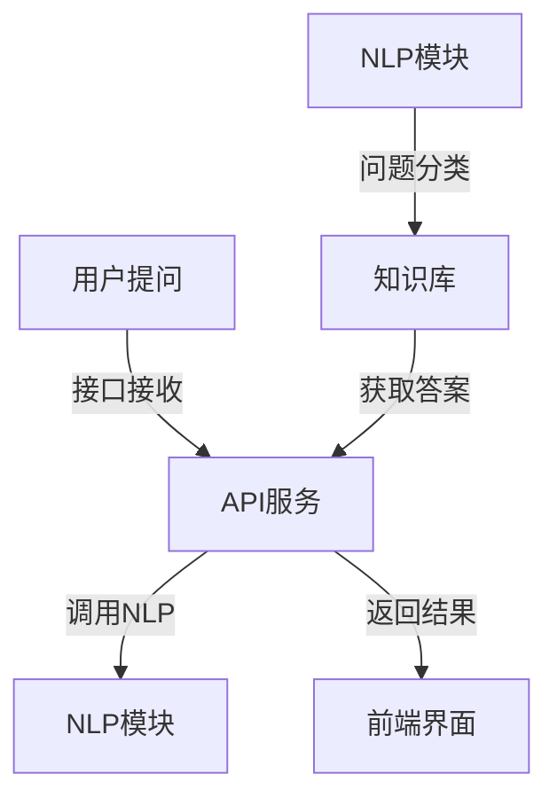
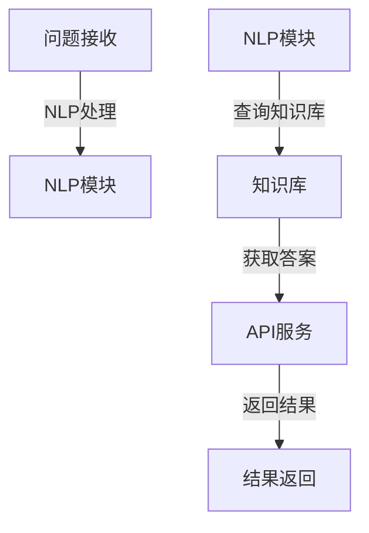
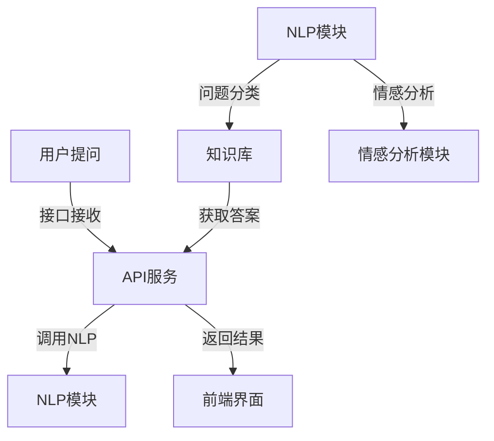
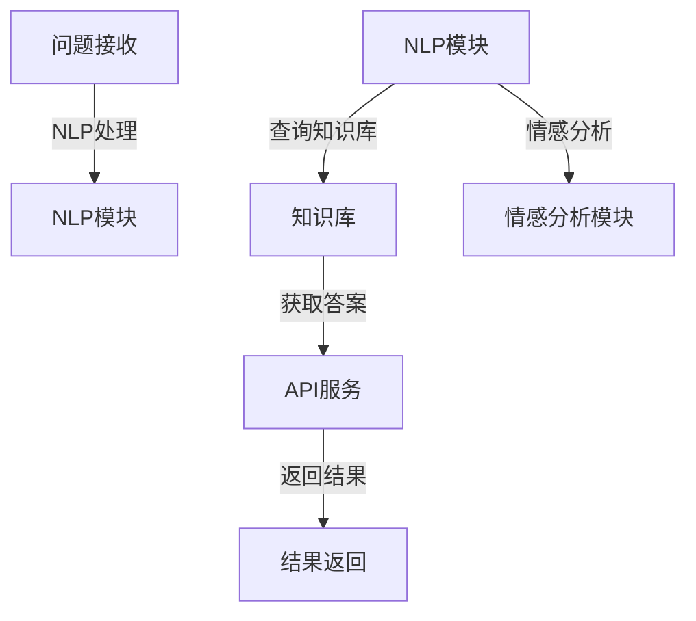

                 


### 文章标题
《快速构建LLM应用的API集成策略》

### 关键词
语言模型，API集成，API设计，安全性保障，性能优化，实时数据流，跨平台集成，智能客服API，智能问答API，API自动化集成，微服务架构，跨模态API集成。

### 摘要
本文深入探讨了快速构建大型语言模型（LLM）应用的关键环节——API集成。通过对LLM应用的发展背景、核心概念与架构、API设计原则、集成策略与实现方法、实战项目解析以及未来趋势的全面分析，为开发者提供了一套系统化的API集成策略。文章旨在帮助读者理解和掌握如何在现有技术基础上高效构建并部署LLM应用，实现高性能、高安全性和高扩展性的API服务。

---

### 第一部分：快速构建LLM应用概述

#### 第1章：快速构建LLM应用的基础

##### 1.1 LLM应用的发展背景

###### 1.1.1 语言模型的发展历程
语言模型（Language Model，简称LM）是自然语言处理（Natural Language Processing，简称NLP）领域的一项核心技术。自20世纪50年代以来，语言模型经历了从规则驱动模型、统计模型到现代深度学习模型的演变。

1. **规则驱动模型**：早期语言模型主要依赖于手工编写的语法规则和词典。例如，1950年代IBM的“AM”模型。
2. **统计模型**：20世纪80年代，基于概率论的统计语言模型开始流行，如N-gram模型。
3. **深度学习模型**：随着计算能力和数据量的提升，深度神经网络在2010年代崛起，带来了如循环神经网络（RNN）、长短期记忆网络（LSTM）和Transformer等革命性进展。

###### 1.1.2 LLM在应用场景中的优势
大型语言模型（LLM）在多个应用场景中展现出显著优势：

1. **文本生成**：能够生成连贯、自然的文本，应用在自动写作、内容创作、自动摘要等领域。
2. **机器翻译**：通过LLM，可以实现高质量的机器翻译，减少人工干预。
3. **问答系统**：LLM在智能问答系统中可以处理复杂的问题，提供精准的答案。
4. **情感分析**：LLM能够理解和分析文本中的情感，应用于客户服务、市场调研等领域。

###### 1.1.3 LLM在API集成中的应用趋势
随着LLM技术的成熟，越来越多的企业和开发者开始将LLM集成到API服务中，以提供智能化的接口。以下是一些重要的趋势：

1. **API自动化集成**：通过自动化工具，开发者可以更快速地将LLM集成到现有系统中。
2. **微服务架构**：LLM作为一个微服务，可以与其他服务解耦，提高系统的灵活性和可扩展性。
3. **跨模态API集成**：将文本、图像、语音等多种模态的信息整合到LLM中，实现更广泛的应用。

##### 1.2 LLM的核心概念与架构

###### 1.2.1 语言模型的基本原理
语言模型的核心任务是预测下一个单词或词组。Transformer架构是目前最流行的LLM模型，它通过自注意力机制（Self-Attention Mechanism）实现高效的信息处理。

1. **嵌入层（Embedding Layer）**：将输入的单词或词组转换为向量表示。
2. **自注意力层（Self-Attention Layer）**：计算输入序列中每个元素的重要性，并加权融合。
3. **前馈神经网络（Feedforward Neural Network）**：在自注意力层之后，对输出进行进一步处理。
4. **输出层（Output Layer）**：生成预测的单词或词组。

###### 1.2.2 LLM的架构详解
LLM的架构通常包括以下几个主要部分：

1. **编码器（Encoder）**：负责处理输入序列，并生成上下文表示。
2. **解码器（Decoder）**：根据编码器的输出和已生成的文本，逐步生成输出序列。
3. **注意力机制（Attention Mechanism）**：实现编码器和解码器之间的信息交互。
4. **优化器（Optimizer）**：用于调整模型参数，以最小化损失函数。

###### 1.2.3 LLM的关键技术点
LLM的技术实现涉及多个关键点：

1. **大数据处理**：大规模的训练数据是LLM性能的重要保障。
2. **并行计算**：利用分布式计算资源，加速模型训练和推理。
3. **模型压缩**：为了提高部署效率，LLM通常需要进行模型压缩和量化。
4. **推理优化**：在实时应用中，LLM的推理速度和效率至关重要。

##### 1.3 LLM应用的API设计原则

###### 1.3.1 API设计的核心要素
设计高质量的API，需要考虑以下几个核心要素：

1. **可扩展性**：API应能够支持不同规模的负载和用户数量。
2. **安全性**：确保数据传输和存储的安全，防止数据泄露和恶意攻击。
3. **兼容性**：API应兼容多种客户端和平台，提供统一的接口。
4. **文档化**：详细且易于理解的文档，帮助开发者快速上手和使用API。

###### 1.3.2 API接口的安全性保障
API接口的安全性是保障数据安全和系统稳定的关键：

1. **身份验证**：使用OAuth、JWT等机制，确保只有授权用户才能访问API。
2. **访问控制**：通过角色分配和权限控制，限制用户对API的访问范围。
3. **数据加密**：使用SSL/TLS等加密协议，保护数据在传输过程中的安全。
4. **审计与监控**：实时监控API的访问日志，及时发现和应对潜在的安全问题。

###### 1.3.3 API性能优化策略
高性能的API是实现高质量服务的必要条件：

1. **负载均衡**：通过负载均衡器，分配请求到多个服务器，提高系统的响应速度。
2. **缓存策略**：利用缓存，减少重复计算和数据查询，提高系统效率。
3. **异步处理**：使用异步编程模型，避免阻塞主线程，提高系统的并发能力。
4. **代码优化**：对API的代码进行优化，减少响应时间和计算复杂度。

---

### 第二部分：LLM应用API集成策略与实现

#### 第2章：LLM应用API集成策略详解

##### 2.1 API集成策略概述

###### 2.1.1 API集成的重要性
API集成是连接不同系统和服务的关键环节，对于实现业务流程自动化和系统互联互通具有重要意义。对于LLM应用而言，API集成可以帮助开发者将复杂的语言模型功能封装成易于使用的接口，便于与其他系统和应用无缝集成。

###### 2.1.2 API集成的主要挑战
在LLM应用的API集成过程中，开发者面临以下主要挑战：

1. **兼容性**：确保API在不同平台和客户端之间的兼容性。
2. **安全性**：保障数据传输和存储的安全，防止潜在的安全漏洞。
3. **性能优化**：在保证功能完整性的前提下，提高API的响应速度和并发处理能力。
4. **可维护性**：设计易于维护和扩展的API架构。

###### 2.1.3 API集成策略的目标
为了克服上述挑战，API集成策略应实现以下目标：

1. **标准化**：制定统一的API规范，提高开发效率和集成效率。
2. **安全性**：采用安全防护措施，确保数据安全和系统稳定。
3. **可扩展性**：设计灵活的架构，支持未来的扩展和升级。
4. **高性能**：通过优化策略，提高系统的响应速度和并发处理能力。

##### 2.2 LLM应用API集成的技术路径

###### 2.2.1 接口设计规范与最佳实践
接口设计是API集成的关键步骤，应遵循以下规范和最佳实践：

1. **RESTful API设计**：采用RESTful架构，提供简洁、易于理解的接口。
2. **接口版本管理**：对API进行版本管理，方便后续的迭代和升级。
3. **参数验证**：对输入参数进行严格的验证，确保数据的有效性和安全性。
4. **错误处理**：明确错误处理机制，提供详细的错误信息和反馈。

###### 2.2.2 API安全性保障机制
保障API的安全性，需要采取一系列安全措施：

1. **身份验证**：使用OAuth、JWT等机制，确保只有授权用户才能访问API。
2. **访问控制**：通过角色分配和权限控制，限制用户对API的访问范围。
3. **数据加密**：使用SSL/TLS等加密协议，保护数据在传输过程中的安全。
4. **安全审计**：实时监控API的访问日志，及时发现和应对潜在的安全问题。

###### 2.2.3 API性能优化技术
高性能的API是实现高质量服务的必要条件，以下是一些性能优化技术：

1. **负载均衡**：通过负载均衡器，分配请求到多个服务器，提高系统的响应速度。
2. **缓存策略**：利用缓存，减少重复计算和数据查询，提高系统效率。
3. **异步处理**：使用异步编程模型，避免阻塞主线程，提高系统的并发能力。
4. **代码优化**：对API的代码进行优化，减少响应时间和计算复杂度。

##### 2.3 LLM应用API集成的典型场景

###### 2.3.1 跨平台API集成
跨平台API集成是将LLM应用与不同平台（如iOS、Android、Web等）的服务进行集成，以满足多样化的应用场景需求。实现跨平台集成，需要考虑以下几个方面：

1. **平台兼容性**：确保API在不同平台上的兼容性，避免出现运行时错误。
2. **代码打包**：将跨平台的代码打包，便于在不同平台上部署和运行。
3. **跨平台框架**：使用如Flutter、React Native等跨平台框架，提高开发效率和一致性。

###### 2.3.2 实时数据流集成
实时数据流集成是将LLM应用与实时数据处理系统（如Kafka、Spark Streaming等）进行集成，以实现实时分析和响应。实现实时数据流集成，需要考虑以下几个方面：

1. **数据格式**：确保实时数据流与LLM应用的输入格式一致。
2. **数据传输**：采用高效的数据传输协议，如HTTP/2、gRPC等，提高数据传输速度。
3. **异步处理**：使用异步处理模型，确保实时数据流的处理效率。

###### 2.3.3 多语言API集成
多语言API集成是将LLM应用与多种编程语言（如Python、Java、JavaScript等）进行集成，以满足不同开发者的需求。实现多语言API集成，需要考虑以下几个方面：

1. **多语言支持**：提供多种语言的SDK或API文档，便于开发者使用。
2. **代码兼容性**：确保不同语言的API调用一致，避免出现兼容性问题。
3. **国际化支持**：支持多语言输入和输出，满足国际化需求。

---

### 第三部分：LLM应用API集成的实现

#### 第3章：LLM应用API集成的实现

##### 3.1 API集成环境搭建

###### 3.1.1 环境准备与工具选择
搭建API集成环境是进行LLM应用开发的第一步，需要准备以下工具和软件：

1. **开发工具**：选择合适的开发工具，如Visual Studio Code、IntelliJ IDEA等。
2. **编程语言**：选择合适的编程语言，如Python、Java等。
3. **依赖管理**：使用依赖管理工具，如Maven、pip等，管理项目依赖。
4. **版本控制**：使用版本控制系统，如Git，进行代码管理。

###### 3.1.2 开发工具链配置
配置开发工具链，确保各个工具之间的协同工作：

1. **环境变量**：配置环境变量，设置开发所需的库和工具路径。
2. **构建工具**：配置构建工具，如Maven或Gradle，自动化构建项目。
3. **测试工具**：配置测试工具，如JUnit或pytest，确保代码质量。
4. **部署工具**：配置部署工具，如Docker或Kubernetes，简化部署流程。

###### 3.1.3 集成测试环境搭建
搭建集成测试环境，确保API集成功能正常：

1. **测试环境**：配置测试环境，包括数据库、缓存等。
2. **测试工具**：配置测试工具，如Postman或JMeter，模拟API调用。
3. **监控工具**：配置监控工具，如Prometheus或Grafana，监控系统性能。
4. **日志工具**：配置日志工具，如ELK（Elasticsearch、Logstash、Kibana），记录和分析日志。

##### 3.2 API接口设计与实现

###### 3.2.1 接口定义与协议选择
接口定义是API设计的重要环节，需要考虑以下方面：

1. **接口名称**：选择简洁、直观的接口名称。
2. **参数定义**：明确接口的输入参数和输出参数。
3. **返回值格式**：定义统一的返回值格式，如JSON或XML。

协议选择方面，常用的协议包括：

1. **HTTP/HTTPS**：适用于Web应用程序，支持各种请求方法（GET、POST、PUT等）。
2. **gRPC**：适用于高性能、低延迟的场景，基于HTTP/2协议。
3. **WebSockets**：适用于实时数据传输，支持双向通信。

###### 3.2.2 API请求处理流程
API请求处理流程包括以下几个阶段：

1. **请求解析**：解析HTTP请求，提取请求方法和参数。
2. **身份验证**：验证用户身份，确保请求的安全性。
3. **参数验证**：验证输入参数的有效性，确保数据的一致性和完整性。
4. **业务逻辑处理**：调用LLM模型，执行业务逻辑处理。
5. **结果返回**：将处理结果封装为响应数据，返回给客户端。

###### 3.2.3 API返回结果解析
解析API返回结果，确保数据的正确性和可读性：

1. **数据验证**：验证返回数据的完整性和正确性，确保业务逻辑的正确执行。
2. **错误处理**：明确错误处理机制，提供详细的错误信息和反馈。
3. **数据转换**：将返回数据转换为适合客户端使用的格式，如JSON。
4. **日志记录**：记录API调用的日志，便于后续的分析和调试。

##### 3.3 API安全性与性能优化

###### 3.3.1 API安全性保障策略
API安全性保障策略包括以下几个方面：

1. **身份验证**：采用OAuth、JWT等机制，确保只有授权用户才能访问API。
2. **访问控制**：通过角色分配和权限控制，限制用户对API的访问范围。
3. **数据加密**：使用SSL/TLS等加密协议，保护数据在传输过程中的安全。
4. **安全审计**：实时监控API的访问日志，及时发现和应对潜在的安全问题。

###### 3.3.2 API性能优化方法
API性能优化方法包括以下几个方面：

1. **负载均衡**：通过负载均衡器，分配请求到多个服务器，提高系统的响应速度。
2. **缓存策略**：利用缓存，减少重复计算和数据查询，提高系统效率。
3. **异步处理**：使用异步编程模型，避免阻塞主线程，提高系统的并发能力。
4. **代码优化**：对API的代码进行优化，减少响应时间和计算复杂度。

###### 3.3.3 性能监控与调优
性能监控与调优是确保API稳定运行的重要环节：

1. **性能指标**：监控系统的性能指标，如响应时间、吞吐量、错误率等。
2. **日志分析**：分析系统日志，识别性能瓶颈和潜在问题。
3. **调优策略**：根据监控和分析结果，调整系统参数和配置，优化性能。
4. **自动化测试**：定期进行自动化测试，验证系统的稳定性和性能。

---

### 第四部分：LLM应用API集成项目实战

#### 第4章：实战项目一：构建智能客服API

##### 4.1 项目需求分析

###### 4.1.1 项目背景
随着人工智能技术的不断发展，智能客服已成为企业提升客户服务质量和效率的重要手段。构建一个智能客服API，可以实现以下目标：

1. **快速响应**：智能客服能够实时响应客户的咨询，提供即时的解决方案。
2. **降低成本**：智能客服替代部分人工客服，降低企业的人力成本。
3. **提高满意度**：智能客服通过准确的回答和个性化的服务，提升客户满意度。

###### 4.1.2 项目目标
构建智能客服API的具体目标包括：

1. **实现自然语言理解**：智能客服能够理解客户的意图和问题，并提供相应的答案。
2. **支持多渠道集成**：智能客服API需要支持与多种渠道（如Web、移动应用、微信等）的集成。
3. **提供完善的接口文档**：为开发者提供详细、易于理解的接口文档，方便集成和使用。

###### 4.1.3 功能需求分析
智能客服API的主要功能需求包括：

1. **问题分类**：根据客户的提问，将其归类到不同的类别，以便智能客服进行针对性的回答。
2. **知识库管理**：维护和管理智能客服的知识库，确保答案的准确性和及时性。
3. **实时聊天**：支持与客户的实时聊天功能，实时响应用户的提问。
4. **语义分析**：通过自然语言处理技术，分析客户的提问，提取关键信息。
5. **情感分析**：分析客户的情感，提供个性化的服务。
6. **自动化回复**：根据预设的规则和场景，自动生成回复，提高响应速度。

##### 4.2 系统架构设计

###### 4.2.1 系统总体架构
智能客服API的系统架构主要包括以下几个部分：

1. **前端界面**：为用户提供交互界面，接收用户提问。
2. **API服务**：处理用户提问，返回相应的答案。
3. **自然语言处理模块**：包括问题分类、语义分析、情感分析等，负责对用户提问进行处理。
4. **知识库**：存储和管理智能客服的知识库，为API服务提供数据支持。
5. **后端服务**：包括数据库、缓存、消息队列等，负责数据的存储和传输。

###### 4.2.2 API接口设计
智能客服API的接口设计主要包括以下几个部分：

1. **输入参数**：包括用户的提问、用户ID等。
2. **输出参数**：包括答案、回答置信度、问题分类等。
3. **接口文档**：详细描述接口的调用方式、参数定义、返回值等。

示例接口定义：
```json
POST /api/ask
{
  "user_id": "123456",
  "question": "什么是人工智能？"
}
```

###### 4.2.3 数据流设计
智能客服API的数据流设计如下：

1. **用户提问**：用户通过前端界面提交问题。
2. **接口接收**：API服务接收用户提问，调用自然语言处理模块进行分析。
3. **问题分类**：自然语言处理模块根据提问进行分类，并查询知识库获取答案。
4. **答案生成**：根据知识库的答案，生成回答，并计算回答置信度。
5. **返回结果**：API服务将答案返回给前端界面，前端界面展示给用户。

数据流图（Mermaid）：


##### 4.3 实现细节与代码解读

###### 4.3.1 API接口实现
以下是一个简单的API接口实现示例（使用Python和Flask框架）：

```python
from flask import Flask, request, jsonify

app = Flask(__name__)

@app.route('/api/ask', methods=['POST'])
def ask():
    user_id = request.form.get('user_id')
    question = request.form.get('question')
    
    # 调用自然语言处理模块
    answer, confidence = nlp_process(question)
    
    # 返回结果
    return jsonify({
        'user_id': user_id,
        'answer': answer,
        'confidence': confidence
    })

def nlp_process(question):
    # 进行自然语言处理，这里简化处理
    answer = "这是一个测试答案"
    confidence = 0.8
    return answer, confidence

if __name__ == '__main__':
    app.run(debug=True)
```

###### 4.3.2 数据处理流程
数据处理流程如下：

1. **问题接收**：API服务接收用户提问。
2. **自然语言处理**：调用自然语言处理模块，对提问进行分类、语义分析等。
3. **知识库查询**：根据提问的结果，查询知识库获取答案。
4. **结果返回**：将答案返回给API服务，并计算回答置信度。

数据处理流程图（Mermaid）：


###### 4.3.3 代码解析与性能优化
代码解析：
- `ask()`函数是API的入口，负责接收用户提问，调用自然语言处理模块，并返回结果。
- `nlp_process()`函数是对提问进行自然语言处理，这里简化为直接返回一个测试答案。

性能优化：
- **异步处理**：为了避免阻塞主线程，可以使用异步处理模型，如使用`asyncio`库。
- **缓存策略**：对于重复的问题，可以使用缓存机制，减少对知识库的查询次数。
- **负载均衡**：使用负载均衡器，如Nginx，将请求分配到多个服务器，提高系统的并发能力。

##### 4.4 项目测试与部署

###### 4.4.1 功能测试与性能测试
功能测试：
- 使用Postman模拟用户提问，验证API接口的正确性和功能完整性。
- 验证问题的分类、语义分析和答案返回等功能的正确性。

性能测试：
- 使用JMeter进行压力测试，模拟大量用户同时访问，评估系统的响应速度和并发处理能力。
- 分析系统的CPU、内存、磁盘等资源使用情况，确保系统在高负载下的稳定性。

###### 4.4.2 项目上线与维护
上线步骤：
1. **打包**：使用Docker打包应用，生成可部署的镜像。
2. **部署**：使用Kubernetes进行部署，实现自动扩缩容。
3. **监控**：使用Prometheus和Grafana监控系统的性能和健康状态。

维护策略：
1. **定期更新**：定期更新知识库，确保答案的准确性和时效性。
2. **错误日志分析**：定期分析错误日志，定位和修复潜在的问题。
3. **性能调优**：根据监控数据，定期进行性能调优，确保系统的高性能和高可用性。

---

#### 第5章：实战项目二：构建智能问答API

##### 5.1 项目需求分析

###### 5.1.1 项目背景
智能问答系统是一种基于人工智能技术的问答服务，通过自然语言处理技术，对用户的提问进行理解和回答。构建一个智能问答API，可以实现以下目标：

1. **快速响应**：智能问答系统能够快速响应用户的提问，提供即时的答案。
2. **丰富知识库**：通过持续的学习和更新，智能问答系统能够不断积累知识，提高回答的准确性。
3. **跨平台部署**：智能问答API可以支持多种平台的集成，如Web、移动应用、微信等。

###### 5.1.2 项目目标
构建智能问答API的具体目标包括：

1. **实现高质量问答**：智能问答系统能够准确理解用户的提问，并提供高质量的答案。
2. **支持多语言**：智能问答API应支持多种语言的输入和输出，满足国际化需求。
3. **提供完善的接口文档**：为开发者提供详细、易于理解的接口文档，方便集成和使用。

###### 5.1.3 功能需求分析
智能问答API的主要功能需求包括：

1. **自然语言理解**：智能问答系统能够理解用户的提问，提取关键信息。
2. **知识库查询**：根据用户的提问，智能问答系统需要从知识库中查询相关的答案。
3. **实时问答**：支持用户与系统的实时问答，提供即时的答案。
4. **多语言支持**：支持多种语言的输入和输出，满足不同用户的需求。
5. **智能推荐**：根据用户的提问历史，智能问答系统可以提供相关的推荐答案。
6. **情感分析**：分析用户的情感，提供个性化的服务。

##### 5.2 系统架构设计

###### 5.2.1 系统总体架构
智能问答API的系统架构主要包括以下几个部分：

1. **前端界面**：为用户提供交互界面，接收用户提问。
2. **API服务**：处理用户提问，返回相应的答案。
3. **自然语言处理模块**：包括自然语言理解、知识库查询、情感分析等，负责对用户提问进行处理。
4. **知识库**：存储和管理智能问答的知识库，为API服务提供数据支持。
5. **后端服务**：包括数据库、缓存、消息队列等，负责数据的存储和传输。

###### 5.2.2 API接口设计
智能问答API的接口设计主要包括以下几个部分：

1. **输入参数**：包括用户的提问、用户ID、语言等。
2. **输出参数**：包括答案、回答置信度、问题分类等。
3. **接口文档**：详细描述接口的调用方式、参数定义、返回值等。

示例接口定义：
```json
POST /api/ask
{
  "user_id": "123456",
  "question": "什么是人工智能？",
  "lang": "zh"
}
```

###### 5.2.3 数据流设计
智能问答API的数据流设计如下：

1. **用户提问**：用户通过前端界面提交问题。
2. **接口接收**：API服务接收用户提问，调用自然语言处理模块进行分析。
3. **自然语言处理**：自然语言处理模块对提问进行分类、语义分析等。
4. **知识库查询**：根据提问的结果，查询知识库获取答案。
5. **情感分析**：分析用户的情感，提供个性化的服务。
6. **结果返回**：API服务将答案返回给前端界面，前端界面展示给用户。

数据流图（Mermaid）：


##### 5.3 实现细节与代码解读

###### 5.3.1 API接口实现
以下是一个简单的API接口实现示例（使用Python和Flask框架）：

```python
from flask import Flask, request, jsonify

app = Flask(__name__)

@app.route('/api/ask', methods=['POST'])
def ask():
    user_id = request.form.get('user_id')
    question = request.form.get('question')
    lang = request.form.get('lang', 'zh')
    
    # 调用自然语言处理模块
    answer, confidence = nlp_process(question, lang)
    
    # 返回结果
    return jsonify({
        'user_id': user_id,
        'answer': answer,
        'confidence': confidence
    })

def nlp_process(question, lang):
    # 进行自然语言处理，这里简化处理
    answer = "这是一个测试答案"
    confidence = 0.8
    return answer, confidence

if __name__ == '__main__':
    app.run(debug=True)
```

###### 5.3.2 数据处理流程
数据处理流程如下：

1. **问题接收**：API服务接收用户提问。
2. **自然语言处理**：调用自然语言处理模块，对提问进行分类、语义分析等。
3. **知识库查询**：根据提问的结果，查询知识库获取答案。
4. **情感分析**：分析用户的情感，提供个性化的服务。
5. **结果返回**：将答案返回给API服务，并计算回答置信度。

数据处理流程图（Mermaid）：


###### 5.3.3 代码解析与性能优化
代码解析：
- `ask()`函数是API的入口，负责接收用户提问，调用自然语言处理模块，并返回结果。
- `nlp_process()`函数是对提问进行自然语言处理，这里简化为直接返回一个测试答案。

性能优化：
- **异步处理**：为了避免阻塞主线程，可以使用异步处理模型，如使用`asyncio`库。
- **缓存策略**：对于重复的问题，可以使用缓存机制，减少对知识库的查询次数。
- **负载均衡**：使用负载均衡器，如Nginx，将请求分配到多个服务器，提高系统的并发能力。

##### 5.4 项目测试与部署

###### 5.4.1 功能测试与性能测试
功能测试：
- 使用Postman模拟用户提问，验证API接口的正确性和功能完整性。
- 验证问题的分类、语义分析和答案返回等功能的正确性。

性能测试：
- 使用JMeter进行压力测试，模拟大量用户同时访问，评估系统的响应速度和并发处理能力。
- 分析系统的CPU、内存、磁盘等资源使用情况，确保系统在高负载下的稳定性。

###### 5.4.2 项目上线与维护
上线步骤：
1. **打包**：使用Docker打包应用，生成可部署的镜像。
2. **部署**：使用Kubernetes进行部署，实现自动扩缩容。
3. **监控**：使用Prometheus和Grafana监控系统的性能和健康状态。

维护策略：
1. **定期更新**：定期更新知识库，确保答案的准确性和时效性。
2. **错误日志分析**：定期分析错误日志，定位和修复潜在的问题。
3. **性能调优**：根据监控数据，定期进行性能调优，确保系统的高性能和高可用性。

---

### 第五部分：LLM应用API集成的未来展望与趋势

#### 第6章：LLM应用API集成的发展趋势

##### 6.1 API集成技术的发展趋势

###### 6.1.1 API自动化集成
随着DevOps、微服务架构的普及，API自动化集成技术逐渐成为趋势。自动化集成工具如Swagger、Postman等，可以帮助开发者快速生成、测试和部署API，提高开发效率和集成效率。

1. **API自动化测试**：通过自动化测试工具，如Selenium、JMeter等，对API进行持续测试，确保API的稳定性和可靠性。
2. **API自动化部署**：使用CI/CD（持续集成/持续部署）工具，如Jenkins、GitLab CI等，实现API的自动化部署和上线。

###### 6.1.2 API微服务架构
微服务架构是将大型应用程序拆分为多个小型、独立的微服务，每个微服务负责特定的业务功能。API微服务架构可以提高系统的灵活性和可扩展性，同时便于管理和维护。

1. **服务解耦**：通过API，实现微服务之间的解耦，降低系统耦合度。
2. **服务治理**：使用服务治理工具，如Kubernetes、Consul等，管理和监控微服务。
3. **服务网格**：采用服务网格技术，如Istio、Linkerd等，提供网络层的服务管理和安全功能。

###### 6.1.3 API智能优化与安全
随着AI技术的进步，API集成也在向智能化方向发展。智能化技术可以帮助优化API的性能和安全，提高系统的可用性和用户体验。

1. **智能性能优化**：利用机器学习算法，实时监控API性能，自动调整系统参数，优化性能。
2. **智能安全防护**：通过AI技术，实现API的安全防护，自动识别和应对潜在的安全威胁。

##### 6.2 LLM应用的未来发展方向

###### 6.2.1 模型定制化与个性化服务
未来的LLM应用将更加注重模型的定制化和个性化服务。通过用户数据和行为分析，可以针对不同用户和场景，定制化地训练模型，提供个性化的服务。

1. **个性化问答**：根据用户的历史提问和偏好，提供个性化的问答服务。
2. **智能推荐**：利用LLM模型，实现个性化内容推荐，提高用户体验。

###### 6.2.2 跨模态API集成
跨模态API集成是将文本、图像、语音等多种模态的信息整合到LLM中，实现更广泛的应用。未来的LLM应用将更加注重跨模态数据处理和融合。

1. **多模态理解**：结合文本、图像、语音等多模态信息，提高LLM的理解能力和准确性。
2. **多模态交互**：支持多模态输入和输出，提供更加自然和丰富的交互体验。

###### 6.2.3 智能API服务的商业模式
智能API服务将成为企业商业模式的创新方向。通过提供高质量的API服务，企业可以创造新的价值和收入来源。

1. **API商业模式创新**：探索基于API的服务模式，如API订阅、API付费等，实现商业模式创新。
2. **API生态系统建设**：构建API生态系统，吸引第三方开发者加入，共同开发和创新。

---

### 第六部分：LLM应用API集成的挑战与解决方案

#### 第7章：LLM应用API集成的挑战与解决方案

##### 7.1 LLM应用API集成的挑战

###### 7.1.1 兼容性问题
在LLM应用API集成过程中，兼容性问题是一个主要的挑战。不同的平台、客户端和语言之间存在差异，可能导致API调用时出现问题。

**解决方案**：
1. **标准化接口**：遵循统一的API设计规范，确保接口的一致性和兼容性。
2. **多语言支持**：提供多种语言的SDK或客户端库，方便不同语言的集成。
3. **动态代理**：使用动态代理技术，在客户端和服务器之间进行适配和转换。

###### 7.1.2 安全性问题
API安全性是保障数据和系统稳定性的关键。在LLM应用API集成过程中，可能面临数据泄露、恶意攻击等安全问题。

**解决方案**：
1. **身份验证**：采用OAuth、JWT等身份验证机制，确保只有授权用户才能访问API。
2. **访问控制**：通过角色分配和权限控制，限制用户对API的访问范围。
3. **数据加密**：使用SSL/TLS等加密协议，保护数据在传输过程中的安全。
4. **安全审计**：实时监控API访问日志，及时发现和应对潜在的安全威胁。

###### 7.1.3 性能优化问题
高性能的API是实现高质量服务的必要条件。在LLM应用API集成过程中，可能面临性能优化问题，如响应速度慢、并发处理能力不足等。

**解决方案**：
1. **负载均衡**：通过负载均衡器，将请求分配到多个服务器，提高系统的响应速度。
2. **缓存策略**：利用缓存，减少重复计算和数据查询，提高系统效率。
3. **异步处理**：使用异步编程模型，避免阻塞主线程，提高系统的并发能力。
4. **代码优化**：对API的代码进行优化，减少响应时间和计算复杂度。

###### 7.1.4 数据一致性问题
在分布式系统中，数据的一致性是保障系统稳定运行的关键。在LLM应用API集成过程中，可能面临数据一致性问题，如数据丢失、数据冲突等。

**解决方案**：
1. **分布式事务**：使用分布式事务管理，确保数据操作的一致性。
2. **版本控制**：对数据进行版本控制，避免数据冲突。
3. **一致性协议**：采用一致性协议，如Paxos、Raft等，保障数据的一致性。

##### 7.2 案例分析与解决策略

###### 7.2.1 案例一：跨平台API集成
背景：
某公司开发了一款基于LLM的智能客服应用，需要将API集成到Web、iOS和Android平台。

挑战：
- **兼容性问题**：Web、iOS和Android平台之间存在差异，导致API调用不一致。
- **性能优化问题**：跨平台集成可能影响应用的性能。

解决方案：
- **标准化接口**：遵循统一的API设计规范，确保接口的一致性和兼容性。
- **多语言支持**：提供多种语言的SDK或客户端库，方便不同语言的集成。
- **性能优化**：采用异步处理模型，提高系统的并发能力；使用缓存策略，减少重复计算。

结果：
通过实施上述解决方案，成功实现了跨平台的API集成，提高了系统的兼容性和性能。

###### 7.2.2 案例二：实时数据流集成
背景：
某公司开发了一款基于LLM的实时问答系统，需要与实时数据处理系统（如Kafka、Spark Streaming等）集成。

挑战：
- **实时数据处理**：实时处理大量数据，保证系统的响应速度和准确性。
- **数据一致性**：在分布式系统中，保证数据的一致性。

解决方案：
- **实时数据处理**：采用分布式计算框架，如Spark Streaming，实时处理数据。
- **分布式事务**：使用分布式事务管理，确保数据操作的一致性。
- **消息队列**：采用消息队列，如Kafka，实现数据的异步传输和处理。

结果：
通过实施上述解决方案，成功实现了实时数据流的集成，提高了系统的实时处理能力和数据一致性。

##### 7.3 小结与未来展望
LLM应用API集成面临着兼容性、安全性、性能优化和数据一致性等多方面的挑战。通过标准化接口、多语言支持、异步处理、分布式事务等解决方案，可以有效应对这些挑战。未来，随着API自动化集成、微服务架构和智能优化技术的发展，LLM应用API集成将更加智能化、高效化，为企业和开发者带来更多价值。

---

作者：AI天才研究院/AI Genius Institute & 禅与计算机程序设计艺术 /Zen And The Art of Computer Programming

