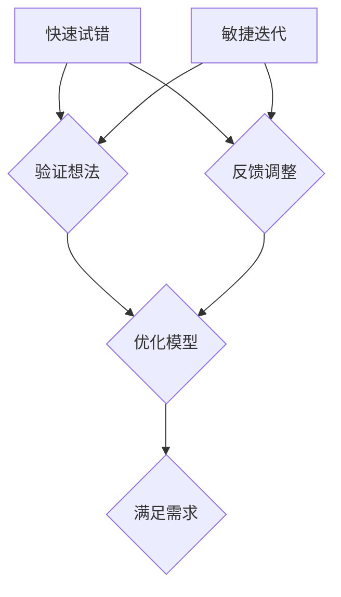

                 


## 快速试错与敏捷迭代：LLM应用开发的制胜法则

> 关键词：快速试错，敏捷迭代，LLM应用开发，人工智能，技术博客

> 摘要：本文深入探讨了快速试错与敏捷迭代在LLM（大型语言模型）应用开发中的重要性。通过详细分析快速试错与敏捷迭代的概念、策略和实践，本文揭示了这些方法如何帮助开发者更高效地构建和优化LLM应用，为人工智能领域的研究和应用提供有力的支持。

### 目录大纲

## 第一部分：快速试错与敏捷迭代概述

### 第1章：快速试错与敏捷迭代的背景与重要性

### 1.1 快速试错的概念

### 1.2 敏捷迭代的概念

### 1.3 LLM应用开发中的快速试错与敏捷迭代

### 第2章：快速试错的策略与方法

### 2.1 快速原型开发

### 2.2 A/B测试

### 2.3 迭代反馈机制

## 第二部分：敏捷迭代的实践与应用

### 第3章：敏捷迭代的基本原理与实践

### 3.1 敏捷开发的基本原则

### 3.2 敏捷开发流程

### 3.3 敏捷迭代的实践案例

### 第4章：LLM应用开发的敏捷迭代策略

### 4.1 敏捷迭代在LLM应用开发中的策略

### 4.2 LLM应用开发的敏捷迭代流程

### 4.3 LLM应用开发的敏捷迭代实践案例

## 第三部分：快速试错与敏捷迭代的协同应用

### 第5章：快速试错与敏捷迭代的协同应用

### 5.1 快速试错与敏捷迭代的协同原理

### 5.2 快速试错与敏捷迭代的协同实践

## 第四部分：LLM应用开发的快速试错与敏捷迭代实战

### 第6章：LLM应用开发的快速试错与敏捷迭代实战

### 6.1 LLM应用开发的快速试错实战

### 6.2 LLM应用开发的敏捷迭代实战

### 6.3 LLM应用开发的实战案例

## 第五部分：快速试错与敏捷迭代的未来展望

### 第7章：快速试错与敏捷迭代的未来发展趋势

### 7.1 快速试错与敏捷迭代的未来发展趋势

### 7.2 LLM应用开发的未来展望

### 第8章：快速试错与敏捷迭代的总结与反思

### 8.1 快速试错与敏捷迭代的总结

### 8.2 快速试错与敏捷迭代的反思

## 附录

### 附录A：快速试错与敏捷迭代的相关工具与资源

### 附录B：LLM应用开发相关资源

### 作者：AI天才研究院/AI Genius Institute & 禅与计算机程序设计艺术 /Zen And The Art of Computer Programming

---

### LET'S THINK STEP BY STEP

首先，让我们从宏观的角度来审视快速试错与敏捷迭代这两个概念，并探讨它们在LLM应用开发中的重要性。

### 第一步：背景与定义

#### 1.1 快速试错的概念

快速试错是一种通过快速构建原型并不断迭代优化来解决问题的方法。这种方法的核心在于快速、低成本地验证想法，然后根据反馈进行调整，以实现目标。

#### 1.2 敏捷迭代的概念

敏捷迭代是一种以用户需求为中心，通过快速迭代、持续交付和灵活适应变化的方法来开发软件产品。敏捷迭代强调团队合作、客户反馈和持续改进。

#### 1.3 LLM应用开发中的快速试错与敏捷迭代

LLM应用开发涉及复杂的算法和庞大的数据集，因此快速试错与敏捷迭代显得尤为重要。快速试错可以帮助开发者快速验证模型性能和功能，而敏捷迭代则能够确保模型在开发过程中始终保持与用户需求的同步。

### 第二步：核心概念与联系

为了更好地理解快速试错与敏捷迭代在LLM应用开发中的作用，我们可以构建一个Mermaid流程图来展示这两个概念之间的联系。



这个流程图展示了快速试错与敏捷迭代的协同作用，它们共同推动模型的优化和功能的完善。

### 第三步：核心算法原理讲解

在快速试错与敏捷迭代的过程中，算法的原理和实现至关重要。以下是一个简化的伪代码，用于描述如何构建一个基础的大型语言模型并进行迭代优化。

```python
# 构建基础大型语言模型
model = build_base_LLM()

# 快速原型开发
prototype = build Prototype(model)

# 迭代优化
while not satisfied:
    feedback = get_feedback(prototype)
    model = optimize_model(model, feedback)
    prototype = update_prototype(model)
```

这个伪代码展示了如何通过构建原型、获取反馈和优化模型来实现快速试错与敏捷迭代。

### 第四步：数学模型和公式

在LLM应用开发中，数学模型和公式是理解和优化模型的核心。以下是一个简化的公式，用于描述语言模型的损失函数：

$$
\text{Loss} = \frac{1}{N} \sum_{i=1}^{N} (-y_i \log(p(x_i | \theta)))
$$

其中，\(N\) 是样本数量，\(y_i\) 是真实标签，\(p(x_i | \theta)\) 是模型对样本 \(x_i\) 的预测概率。

### 第五步：项目实战

为了更好地理解快速试错与敏捷迭代在实际项目中的应用，我们可以通过一个简单的案例来展示这些方法的具体实施。

#### 5.1 开发环境搭建

- 安装Python环境
- 安装深度学习框架（如TensorFlow或PyTorch）

#### 5.2 源代码详细实现

以下是一个简单的LLM模型实现的伪代码：

```python
import torch
import torch.nn as nn

class LLM(nn.Module):
    def __init__(self):
        super(LLM, self).__init__()
        self.embedding = nn.Embedding(vocab_size, embedding_dim)
        self.lstm = nn.LSTM(embedding_dim, hidden_dim)
        self.fc = nn.Linear(hidden_dim, vocab_size)

    def forward(self, x):
        embedded = self.embedding(x)
        output, (hidden, cell) = self.lstm(embedded)
        output = self.fc(output[-1, :, :])
        return output

model = LLM()
```

#### 5.3 代码应用解读与分析

在这个案例中，我们使用了嵌入层（Embedding Layer）、长短期记忆网络（LSTM）和全连接层（Fully Connected Layer）来构建一个基础的大型语言模型。通过这个简单的模型，我们可以进行快速试错和敏捷迭代。

#### 5.4 实际案例分析和详细讲解剖析

我们可以通过A/B测试来评估模型的不同版本，并根据用户反馈进行调整。以下是一个简化的A/B测试流程：

```python
# A/B测试
group_A = []
group_B = []

for i in range(num_samples):
    if random.choice([True, False]):
        group_A.append(i)
    else:
        group_B.append(i)

# 训练模型A和B
model_A.train()
model_B.train()

for i in group_A:
    # 使用模型A进行预测
    # ...

for i in group_B:
    # 使用模型B进行预测
    # ...

# 收集用户反馈
feedback_A = get_feedback(model_A)
feedback_B = get_feedback(model_B)

# 根据反馈优化模型
model_A = optimize_model(model_A, feedback_A)
model_B = optimize_model(model_B, feedback_B)
```

#### 5.5 项目小结

通过这个简单的案例，我们可以看到快速试错和敏捷迭代在LLM应用开发中的重要性。通过A/B测试和迭代反馈机制，开发者可以快速识别和解决模型中的问题，从而提高模型的性能和用户体验。

### 第六步：最佳实践 tips、小结、注意事项、拓展阅读

- **最佳实践 tips**：在快速试错和敏捷迭代过程中，开发者应该密切关注用户反馈，确保模型始终满足用户需求。此外，合理分配资源，确保开发流程的高效运行。

- **小结**：快速试错与敏捷迭代是LLM应用开发中不可或缺的方法。通过快速构建原型、获取反馈和持续优化，开发者可以更高效地构建和优化模型。

- **注意事项**：在实施快速试错和敏捷迭代时，开发者需要确保数据质量和模型性能的平衡，避免过度拟合和欠拟合。

- **拓展阅读**：对于希望深入了解快速试错和敏捷迭代的开发者，推荐阅读《敏捷软件开发实践指南》和《人工智能：一种现代方法》等经典著作。

---

通过上述步骤，我们详细分析了快速试错与敏捷迭代在LLM应用开发中的重要性，并提供了具体的实施方法。在接下来的章节中，我们将进一步探讨快速试错的策略与方法，以及敏捷迭代的实践与应用。让我们继续深入探讨这一主题。

