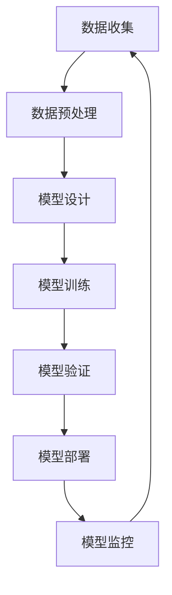
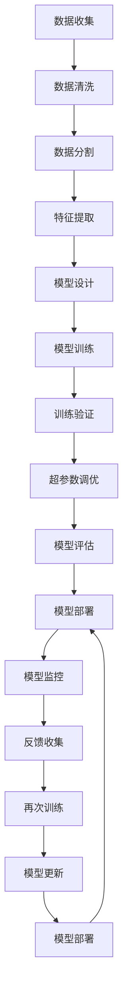

                 

### 文章标题

### 快速迭代中的质量保证：LLM应用开发的难题

> 关键词：快速迭代、质量保证、LLM应用、开发难题

> 摘要：本文深入探讨了在快速迭代开发环境中，如何确保大型语言模型（LLM）应用的质量。文章首先介绍了快速迭代与质量保证的基本概念，然后详细分析了LLM的特点和应用中的挑战，接着探讨了质量保证在LLM开发中的角色、流程和技术，最后通过具体项目和案例分析，总结了质量保证的最佳实践和未来研究方向。

### 目录大纲：

#### 第一部分：背景与核心概念

1. 引言
   1.1 书籍目的与结构
   1.2 快速迭代的行业背景
   1.3 质量保证的重要性

2. 质量保证基础
   2.1 质量保证的定义
   2.2 质量保证的关键原则
   2.3 质量保证的历史发展

3. LLAM（大型语言模型）概述
   3.1 LLAM的定义
   3.2 LLAM的工作原理
   3.3 LLAM在应用开发中的挑战

4. 质量保证在LLM应用开发中的角色
   4.1 质量保证在LLM开发中的独特性
   4.2 质量保证的流程和方法
   4.3 质量保证工具与技术

5. 质量保证的挑战与应对策略
   5.1 LLAM模型的复杂性
   5.2 数据隐私与伦理问题
   5.3 质量保证在快速迭代中的难点
   5.4 应对策略与解决方案

#### 第二部分：核心算法与原理

6. LLAM核心算法原理
   6.1 语言模型的基础算法
   6.2 生成式与判别式模型
   6.3 常用算法对比分析

7. 质量保证算法应用
   7.1 数据清洗与预处理
   7.2 模型训练与验证
   7.3 模型评估与优化
   7.4 实时反馈与调整

8. 数学模型与公式详解
   8.1 损失函数
   8.2 优化算法
   8.3 统计模型与假设检验
   8.4 数学公式示例

9. Mermaid流程图展示
   9.1 整体流程图
   9.2 具体流程图示例

#### 第三部分：项目实战

10. 质量保证项目实战
    10.1 实战概述
    10.2 开发环境搭建
    10.3 数据准备与处理
    10.4 模型训练与验证
    10.5 代码解读与分析

11. LLAM应用案例分析
    11.1 案例选择与分析
    11.2 案例实现细节
    11.3 案例中的质量保证措施
    11.4 案例反思与总结

12. 代码示例与解读
    12.1 基础代码示例
    12.2 实战代码示例
    12.3 代码解读与分析

#### 第四部分：展望与未来趋势

13. 快速迭代与质量保证的未来
    13.1 未来趋势分析
    13.2 质量保证在快速迭代中的应用
    13.3 未来研究方向与挑战

14. 总结与展望
    14.1 主要内容回顾
    14.2 学员反馈与建议
    14.3 未来研究与实践方向

#### 附录

15. 附录 A：资源与工具
    15.1 常用工具介绍
    15.2 学习资源推荐
    15.3 开发环境搭建指南

16. 附录 B：参考文献
    16.1 书籍参考文献
    16.2 论文参考文献
    16.3 网络资源参考文献

## 引言

### 1.1 书籍目的与结构

随着技术的不断进步，人工智能（AI）的应用场景日益广泛，从自然语言处理到图像识别，再到自动驾驶，AI正逐步渗透到我们生活的方方面面。在这一过程中，大型语言模型（LLM，Large Language Model）由于其卓越的表现和强大的功能，受到了广泛关注。然而，如何在快速迭代的开发过程中确保LLM应用的质量，成为了许多开发者和研究人员的难题。

本书旨在解决这一难题。首先，我们将深入探讨快速迭代开发的概念，并介绍质量保证（Quality Assurance，QA）的基本原则和历史发展。随后，我们将重点分析LLM的特点和其在应用开发中面临的挑战。在此基础上，本书将详细探讨质量保证在LLM应用开发中的角色、流程和方法，以及相关的工具和技术。

本书分为四个主要部分：

1. **背景与核心概念**：介绍快速迭代和质量保证的基本概念，以及LLM的概述。
2. **核心算法与原理**：深入分析LLM的核心算法和数学模型，以及质量保证算法的应用。
3. **项目实战**：通过具体项目和案例分析，展示质量保证的实际应用。
4. **展望与未来趋势**：讨论快速迭代与质量保证的未来发展方向，以及相关的挑战和机遇。

通过本书的阅读，读者将全面了解快速迭代和质量保证在LLM应用开发中的重要性，掌握相关的原理和实践方法，从而为未来的研究和开发提供有力的支持。

### 1.2 快速迭代的行业背景

在当今高度竞争和快速变化的商业环境中，软件开发的迭代速度已经成为企业成功的关键因素之一。快速迭代开发（Iterative Development）作为一种敏捷开发（Agile Development）的实践，旨在通过不断的迭代和反馈，快速交付高质量的软件产品。

快速迭代开发的历史可以追溯到20世纪90年代，当时软件开发领域开始关注敏捷开发和用户反馈的重要性。早期的敏捷方法，如极限编程（XP）和敏捷方法（Agile Methodology），提倡频繁的迭代和持续交付，以适应快速变化的市场需求。随着时间的推移，敏捷开发理念逐渐成熟，并得到了广泛的接受和应用。

快速迭代开发的核心原则包括：

1. **用户反馈**：频繁的用户反馈是快速迭代开发的关键，它可以帮助开发团队及时发现和解决问题，确保产品符合用户需求。
2. **持续交付**：通过持续交付，开发团队可以不断发布小版本更新，而不是等待完整的软件产品完成。
3. **团队协作**：快速迭代开发强调跨职能团队的协作，以快速响应变化和解决问题。
4. **灵活性和适应性**：快速迭代开发允许开发团队在项目过程中灵活调整计划和目标，以适应不断变化的环境。

在快速迭代开发过程中，质量保证（QA）起着至关重要的作用。传统的质量保证方法通常在开发后期进行，而快速迭代开发要求QA在整个开发周期中持续进行，以确保每个迭代版本的质量。以下是一些快速迭代开发中的质量保证关键点：

1. **持续集成和自动化测试**：通过持续集成（Continuous Integration）和自动化测试，可以快速发现和修复代码缺陷，提高软件质量。
2. **用户体验测试**：用户体验测试是快速迭代开发中不可或缺的一部分，它可以帮助开发团队了解用户的使用情况和反馈，从而进行相应的优化。
3. **缺陷管理**：有效的缺陷管理是确保软件质量的关键，开发团队需要及时记录、跟踪和修复缺陷。
4. **持续反馈和改进**：通过持续的反馈和改进，开发团队可以不断提高软件的质量和用户满意度。

### 1.3 质量保证的重要性

在快速迭代的开发环境中，质量保证（QA）不仅是一种技术手段，更是一种文化理念。它贯穿于整个软件开发过程，旨在确保软件产品满足预期的质量要求，同时提高开发效率和用户满意度。以下是质量保证在快速迭代开发中的重要性：

1. **确保软件质量**：质量保证是确保软件产品符合预定的质量标准的关键。通过全面的测试和验证，开发团队可以确保每个迭代版本都是高质量的，从而减少后期修复成本和用户投诉。
2. **提高开发效率**：有效的质量保证可以减少代码缺陷和用户问题的出现，从而提高开发效率。自动化测试和持续集成等技术可以帮助开发团队快速发现和修复问题，避免因质量问题导致的项目延迟。
3. **增加用户满意度**：高质量的软件产品可以提供更好的用户体验，增加用户满意度。通过持续的用户反馈和改进，开发团队可以更好地理解用户需求，从而提供更符合用户期望的产品。
4. **降低维护成本**：高质量软件的维护成本通常较低。由于缺陷较少，后续的维护和更新工作更加简单和高效。
5. **促进团队协作**：质量保证不仅涉及技术，还涉及团队协作和沟通。通过明确的质量标准和流程，开发团队可以更好地协作，共同推动项目向前发展。

总之，质量保证在快速迭代开发中不可或缺，它是确保软件产品质量、提高开发效率和用户满意度的重要手段。在接下来的章节中，我们将进一步探讨质量保证的基本概念、原则和方法，以及大型语言模型（LLM）在应用开发中的特殊挑战。

### 2. 质量保证基础

#### 2.1 质量保证的定义

质量保证（Quality Assurance，QA）是确保产品或服务满足预定标准的一系列活动和过程。在软件开发领域，质量保证指的是通过计划、实施和监控一系列活动，确保软件产品在开发过程中和最终交付时都符合预定的质量标准。这些标准通常包括功能性、可靠性、安全性、可维护性和用户体验等方面。

质量保证的目的是防止缺陷和问题出现，并确保所有相关方（包括开发团队、用户和管理层）都对软件产品的质量有信心。质量保证不仅仅是测试和验证，它涵盖了整个软件开发生命周期，包括需求分析、设计、编码、测试和部署等阶段。

#### 2.2 质量保证的关键原则

质量保证的基本原则是确保软件产品在开发过程中始终保持高质量。以下是质量保证的关键原则：

1. **预防胜于检测**：预防措施比事后检测更有效。开发团队应通过编码规范、代码审查和自动化测试等手段，尽可能在早期发现和修复缺陷。
2. **持续改进**：质量保证是一个持续的过程，需要不断改进。开发团队应通过定期回顾和反馈，识别问题和改进机会，以提高整体质量。
3. **团队合作**：质量保证不仅仅是测试人员的工作，而是整个开发团队的责任。每个成员都应积极参与质量保证活动，共同确保产品质量。
4. **透明度**：质量保证过程应该是透明的，所有相关方都能访问和了解质量相关的信息和数据。
5. **用户中心**：质量保证应以用户为中心，确保软件产品满足用户需求和期望。

#### 2.3 质量保证的历史发展

质量保证的概念和技术随着时间的推移不断演变。以下是质量保证发展的几个关键阶段：

1. **早期质量保证**：在20世纪60年代和70年代，质量保证主要集中在制造行业，通过统计过程控制（SPC）等方法，确保生产过程的一致性和可靠性。
2. **软件质量保证**：20世纪80年代和90年代，随着软件工程的发展，质量保证开始引入到软件开发领域。此时的质量保证主要集中在测试和验证，以确保软件产品符合规格说明书。
3. **敏捷和质量保证**：21世纪初，敏捷开发方法的兴起，推动了质量保证的进一步发展。敏捷质量保证强调持续集成、自动化测试和用户反馈，以确保快速迭代中的质量。
4. **DevOps和质量保证**：随着DevOps文化的普及，质量保证逐渐融入开发和运维过程。DevOps质量保证强调跨职能团队的协作，通过自动化和工具提高质量。

### 3. LLAM（大型语言模型）概述

#### 3.1 LLAM的定义

大型语言模型（LLAM，Large Language Model）是一种基于深度学习技术构建的复杂模型，旨在理解和生成自然语言文本。LLAM通过从大量数据中学习，掌握语言的语法、语义和上下文关系，从而能够完成各种语言处理任务，如文本分类、机器翻译、问答系统等。

LLAM通常包含数亿甚至数十亿个参数，通过神经网络结构对输入文本进行编码和解码，以生成高质量的语言输出。这种模型具有强大的表示能力和适应性，能够处理各种复杂的语言任务。

#### 3.2 LLAM的工作原理

LLAM的工作原理基于深度学习和神经网络技术，具体包括以下几个关键步骤：

1. **输入处理**：LLAM首先接收自然语言文本作为输入。这些文本可以是句子、段落或文档，模型需要对其进行编码以供进一步处理。
2. **编码器**：编码器是LLAM的核心组件之一，负责将输入文本转换为一个固定长度的向量表示。这种表示捕获了文本的语义信息，为后续的解码过程提供了基础。
3. **解码器**：解码器根据编码器生成的向量表示，生成相应的输出文本。解码过程通常使用生成式或判别式模型，根据上下文和预测概率生成自然语言输出。
4. **损失函数**：为了训练LLAM，需要定义一个损失函数，用于衡量模型输出和实际输出之间的差异。常见的损失函数包括交叉熵损失、均方误差等。
5. **优化算法**：通过优化算法，如梯度下降、Adam等，模型不断调整参数，以最小化损失函数，从而提高模型的预测准确性。

#### 3.3 LLAM在应用开发中的挑战

虽然LLAM在自然语言处理任务中表现出色，但在实际应用开发中仍面临诸多挑战：

1. **数据隐私与伦理问题**：LLAM训练和部署过程中涉及大量数据，需要确保数据隐私和伦理问题得到妥善处理。例如，如何保护用户隐私、避免偏见和歧视等问题。
2. **模型可解释性**：LLAM的决策过程高度复杂，缺乏透明度和可解释性。在实际应用中，需要确保模型输出合理且符合预期。
3. **计算资源需求**：训练和部署LLAM需要大量计算资源和时间，对于中小型团队来说可能是一个巨大的挑战。
4. **质量保证**：在快速迭代开发过程中，确保LLM应用的质量是一个复杂且关键的任务。需要建立一套有效的质量保证流程和方法，以确保每个迭代版本都是高质量的。

### 4. 质量保证在LLM应用开发中的角色

在快速迭代的开发环境中，大型语言模型（LLM）的应用不仅带来了技术上的挑战，也对质量保证（QA）提出了新的要求。质量保证在LLM应用开发中扮演着至关重要的角色，它不仅关乎软件产品的最终质量，还影响到整个开发过程的高效性和稳定性。

#### 4.1 质量保证在LLM开发中的独特性

与传统的软件项目相比，LLM开发中的质量保证具有以下几个独特性：

1. **高度复杂性**：LLM的模型结构和参数数量非常庞大，导致其训练和推理过程高度复杂。这使得质量保证在检测和修复缺陷时面临更大的难度。
2. **数据依赖性**：LLM的性能和质量高度依赖于训练数据的质量和多样性。数据隐私和伦理问题成为质量保证的一个重要方面。
3. **动态迭代性**：在快速迭代开发中，LLM模型会不断进行更新和优化。质量保证需要能够适应这种快速变化的环境，确保每个迭代版本的质量。

#### 4.2 质量保证的流程和方法

为了确保LLM应用在快速迭代开发中的高质量，需要建立一套全面的质量保证流程和方法。以下是质量保证在LLM开发中的一些关键流程和方法：

1. **需求分析**：在开发初期，对LLM的应用场景和功能需求进行详细分析，明确质量目标和验收标准。
2. **数据管理**：确保训练数据的质量和多样性，进行数据清洗、去重和标注等预处理工作，以避免数据偏差和错误。
3. **模型训练与验证**：通过多次迭代训练模型，使用交叉验证和超参数调优等技术，确保模型在训练数据上的性能和泛化能力。
4. **测试**：设计并执行一系列测试用例，包括单元测试、集成测试和系统测试等，以发现和修复模型缺陷。
5. **用户反馈**：收集用户对LLM应用的反馈，进行分析和总结，为后续迭代提供改进建议。
6. **持续监控与优化**：在部署后，对LLM应用进行持续监控和性能优化，确保其在实际应用中的稳定性和可靠性。

#### 4.3 质量保证工具与技术

为了有效实施质量保证流程，需要借助一系列工具和技术。以下是一些在LLM应用开发中常用的质量保证工具和技术：

1. **自动化测试**：通过编写测试脚本，自动化执行单元测试、集成测试和系统测试，提高测试效率和覆盖率。
2. **数据质量管理**：使用数据质量管理工具，对训练数据进行清洗、去重和标注等预处理工作，确保数据的质量和一致性。
3. **模型监控与评估**：使用模型监控工具，实时监控LLM应用的性能指标，如准确率、召回率、F1分数等，及时发现和解决性能问题。
4. **代码审查**：通过代码审查工具，对LLM的源代码进行审查，发现潜在的缺陷和改进机会。
5. **机器学习性能分析工具**：使用机器学习性能分析工具，对模型进行性能分析和优化，提高模型的准确性和效率。

总之，质量保证在LLM应用开发中具有独特的挑战和重要性。通过建立一套全面的质量保证流程和方法，并利用先进的工具和技术，开发团队可以确保LLM应用在快速迭代开发中达到高质量标准。

### 5. 质量保证的挑战与应对策略

在快速迭代开发中应用大型语言模型（LLM）虽然带来了诸多便利，但也带来了许多独特的挑战，这些挑战主要集中在模型的复杂性、数据隐私与伦理问题、快速迭代的特性以及模型的实时反馈与调整方面。

#### 5.1 LLAM模型的复杂性

LLAM模型的复杂性是其最大的挑战之一。这些模型通常由数十亿个参数组成，其训练过程需要大量的计算资源和时间。这种高度复杂性的模型在开发过程中难以进行全面的测试，并且一旦出现缺陷，修复过程也会非常耗时和昂贵。为了应对这一挑战，可以采取以下策略：

1. **模块化开发**：将复杂的LLAM模型分解为多个模块，每个模块单独开发、测试和优化，最终集成在一起。
2. **渐进式训练**：采用分阶段的训练策略，逐步增加模型的复杂性和参数数量，每次只调整一部分参数，以便更好地控制模型的行为。
3. **代码审查与静态分析**：利用代码审查工具和静态分析技术，提前发现和修复潜在的错误和缺陷。

#### 5.2 数据隐私与伦理问题

在LLM训练过程中，数据隐私和伦理问题至关重要。由于LLM需要大量数据来训练，这些数据可能包含用户的敏感信息，如个人身份、位置、财务信息等。此外，数据中的偏见和歧视问题也可能导致模型输出不公平或错误。为了解决这些问题，可以采取以下策略：

1. **数据匿名化和去标识化**：在训练前对数据进行匿名化和去标识化处理，以保护用户隐私。
2. **偏见检测与校正**：使用专门的算法检测数据中的偏见，并采取相应的校正措施，以减少模型输出中的不公平性。
3. **伦理审查**：建立伦理审查机制，确保数据使用符合伦理标准，并在模型部署前进行全面的伦理评估。

#### 5.3 质量保证在快速迭代中的难点

快速迭代开发的特点是频繁的版本更新和持续的需求变更，这使得质量保证变得更加复杂。以下是一些具体的难点和应对策略：

1. **测试覆盖不足**：快速迭代的节奏可能导致测试覆盖不足，难以全面检测到所有潜在的问题。应对策略包括自动化测试和持续集成，确保每个迭代版本都经过充分的测试。
2. **反馈周期长**：快速迭代要求能够快速获得用户反馈，以便及时调整和优化模型。然而，LLM模型的训练和测试过程通常需要较长时间，这会导致反馈周期较长。应对策略包括使用模拟用户反馈和加速模型训练技术，如分布式训练和迁移学习。
3. **资源分配**：在快速迭代中，资源（如开发人员、测试人员和时间）的分配需要更加灵活和高效。应对策略包括资源优化和优先级管理，确保关键资源得到合理分配。

#### 5.4 应对策略与解决方案

针对上述挑战，以下是一些具体的应对策略和解决方案：

1. **自动化测试**：通过自动化测试工具，如Selenium、JUnit等，可以大幅提高测试效率，确保每个迭代版本都经过全面的测试。
2. **持续集成和持续交付（CI/CD）**：实施CI/CD流程，确保每次代码提交后都自动进行构建、测试和部署，快速发现和修复问题。
3. **数据质量监控**：使用数据质量监控工具，如Data质量和DBA，实时监控数据的质量和一致性，确保数据在训练和测试过程中保持高质量。
4. **模型监控与优化**：使用模型监控工具，如TensorBoard、MLflow等，实时监控模型的性能指标，及时发现和解决性能问题。
5. **跨职能团队协作**：建立跨职能团队，包括开发、测试、数据科学和产品管理等领域，确保在快速迭代过程中各方的紧密协作和高效沟通。

总之，快速迭代开发中的LLM应用质量保证面临诸多挑战，但通过合理的策略和解决方案，可以确保LLM应用在快速迭代过程中达到高质量标准。

### 6. LLAM核心算法原理

大型语言模型（LLAM）的核心算法原理是其性能和效果的关键。在这一部分，我们将深入探讨LLAM的基础算法、生成式与判别式模型，并对比分析常用算法。

#### 6.1 语言模型的基础算法

语言模型（Language Model，LM）是LLAM的基础组件，用于预测文本序列中的下一个词。基本的语言模型算法通常基于统计方法或神经网络方法。

1. **N-gram模型**：N-gram模型是一种基于统计方法的简单语言模型，通过计算前N个单词出现的概率来预测下一个词。N-gram模型的计算复杂度较低，但预测效果受限于模型的长短依赖性。
   
   假设有一个三元组（w1, w2, w3），N-gram模型的概率计算公式如下：
   $$ P(w3 | w1, w2) = \frac{c(w1, w2, w3)}{c(w1, w2)} $$
   其中，\( c(w1, w2, w3) \) 是三元组的计数，\( c(w1, w2) \) 是二元组的计数。

2. **神经网络语言模型**：神经网络语言模型通过神经网络来学习文本的概率分布。最常用的神经网络语言模型是循环神经网络（RNN）和其变种长短期记忆网络（LSTM）。

   RNN的基本思想是使用隐藏状态来捕捉文本的序列依赖性。LSTM在RNN的基础上引入了门结构，以更好地处理长距离依赖问题。

   LSTM单元的伪代码如下：
   $$
   \begin{aligned}
   & i_t = \sigma(W_{ix}x_t + W_{ih}h_{t-1} + b_i) \\
   & f_t = \sigma(W_{fx}x_t + W_{fh}h_{t-1} + b_f) \\
   & \hat{g_t} = \tanh(W_{gx}x_t + W_{gh}h_{t-1} + b_g) \\
   & o_t = \sigma(W_{ox}x_t + W_{oh}h_{t-1} + b_o) \\
   & h_t = o_t \odot \hat{g_t} \\
   \end{aligned}
   $$
   其中，\( x_t \) 是输入词向量，\( h_t \) 是隐藏状态，\( i_t, f_t, o_t \) 分别是输入门、遗忘门和输出门的激活值。

#### 6.2 生成式与判别式模型

语言模型的实现可以分为生成式模型和判别式模型两种主要类型。

1. **生成式模型**：生成式模型通过直接预测下一个词的概率分布来生成文本。常见的生成式模型包括RNN、LSTM和Transformer等。

   生成式模型的基本流程如下：
   - 输入：输入序列 \( x_1, x_2, ..., x_T \)。
   - 预测：根据当前输入词，生成下一个词的概率分布 \( p(y_t | x_1, x_2, ..., x_{t-1}) \)。
   - 生成：根据概率分布，选择下一个词 \( y_t \)。

2. **判别式模型**：判别式模型通过预测输入词与目标词之间的相似度来生成文本。典型的判别式模型包括CNN和注意力机制。

   判别式模型的基本流程如下：
   - 输入：输入序列 \( x_1, x_2, ..., x_T \) 和目标序列 \( y_1, y_2, ..., y_T \)。
   - 预测：计算输入序列和目标序列的相似度 \( sim(x_1, y_1), sim(x_2, y_2), ..., sim(x_T, y_T) \)。
   - 分类：根据相似度进行分类，判断输入序列是否与目标序列相同。

   常用的判别式模型中的注意力机制可以通过以下伪代码表示：
   $$
   \begin{aligned}
   & Q = [q_1, q_2, ..., q_T] \\
   & K = [k_1, k_2, ..., k_T] \\
   & V = [v_1, v_2, ..., v_T] \\
   & scores = [sim(q_1, k_1), sim(q_2, k_2), ..., sim(q_T, k_T)] \\
   & attn_weights = \softmax(scores) \\
   & context = \sum_{t=1}^{T} attn_weights_t \cdot v_t \\
   \end{aligned}
   $$

#### 6.3 常用算法对比分析

不同的语言模型算法各有优缺点，适用于不同的应用场景。以下是对几种常用算法的对比分析：

1. **RNN vs. LSTM**：
   - **优点**：
     - RNN：计算简单，易于实现。
     - LSTM：能够处理长距离依赖问题，性能更优。
   - **缺点**：
     - RNN：存在梯度消失和梯度爆炸问题，难以处理长序列。
     - LSTM：参数较多，计算复杂度较高。

2. **Transformer vs. RNN/LSTM**：
   - **优点**：
     - Transformer：引入注意力机制，能够全局关注，捕捉长距离依赖。
     - RNN/LSTM：处理长序列依赖性能较好，但计算复杂度较高。
   - **缺点**：
     - Transformer：计算复杂度较高，需要大量计算资源。
     - RNN/LSTM：处理长序列依赖时存在梯度消失和梯度爆炸问题。

3. **生成式模型 vs. 判别式模型**：
   - **优点**：
     - 生成式模型：能够直接生成文本，适用场景广泛。
     - 判别式模型：计算简单，适用于分类任务。
   - **缺点**：
     - 生成式模型：生成文本质量受限于概率分布，可能出现错误或不可理解的情况。
     - 判别式模型：无法直接生成文本，仅适用于分类任务。

总之，选择合适的语言模型算法需要根据具体应用场景和资源条件进行权衡。在实际应用中，常常结合多种算法的优势，以实现最佳的性能和效果。

### 7. 质量保证算法应用

在大型语言模型（LLM）的开发和应用过程中，质量保证（QA）是确保模型性能和可靠性的关键环节。以下是质量保证在LLM开发中的具体算法应用，包括数据清洗与预处理、模型训练与验证、模型评估与优化，以及实时反馈与调整。

#### 7.1 数据清洗与预处理

数据的质量直接影响LLM的性能，因此在模型训练前，数据清洗和预处理是必不可少的步骤。

1. **数据清洗**：
   - **去除噪声和缺失值**：通过过滤无效数据和填补缺失值，提高数据质量。
   - **去除停用词**：停用词（如“的”、“和”等）对模型的影响较小，可以去除以减少计算量。
   - **文本标准化**：统一文本格式，如将大写转换为小写，去除标点符号等。

2. **数据预处理**：
   - **分词**：将文本分割成单词或子词，以便后续处理。
   - **词向量化**：将文本转换为固定长度的向量表示，常用的词向量化方法包括Word2Vec、GloVe等。
   - **数据增强**：通过变换、旋转、剪裁等方式增加数据的多样性，提高模型的泛化能力。

#### 7.2 模型训练与验证

在数据预处理完成后，LLM的训练和验证是确保模型质量的关键步骤。

1. **训练**：
   - **批量大小和优化算法**：选择合适的批量大小和优化算法（如SGD、Adam等）以平衡计算资源和训练速度。
   - **学习率调整**：通过动态调整学习率，避免过拟合和欠拟合。
   - **正则化**：使用正则化技术（如Dropout、L2正则化等）减少过拟合。

2. **验证**：
   - **交叉验证**：通过将数据集划分为多个子集，进行多次训练和验证，以评估模型的泛化能力。
   - **超参数调优**：通过网格搜索、随机搜索等方法，找到最优的超参数组合。

#### 7.3 模型评估与优化

评估模型性能是确保LLM质量的重要环节。常用的评估指标包括准确率、召回率、F1分数等。

1. **评估指标**：
   - **准确率**：预测正确的样本数占总样本数的比例。
   - **召回率**：预测正确的正样本数占总正样本数的比例。
   - **F1分数**：准确率和召回率的调和平均数。

2. **优化策略**：
   - **模型压缩**：通过模型剪枝、量化等方法减小模型体积，提高部署效率。
   - **模型蒸馏**：将复杂模型的知识传递到简单模型中，提高简单模型的性能。

#### 7.4 实时反馈与调整

在LLM应用过程中，实时反馈与调整是确保模型持续改进的重要手段。

1. **实时监控**：
   - **性能监控**：监控模型的实时性能指标，如响应时间、准确率等，及时发现性能下降或异常情况。
   - **错误日志**：记录模型的错误预测和用户反馈，以便进行分析和改进。

2. **在线调整**：
   - **权重更新**：根据用户反馈和错误日志，动态调整模型权重，优化模型性能。
   - **版本控制**：对模型的不同版本进行管理，确保在线调整不会影响现有用户的体验。

#### 具体算法应用示例

以下是一个简单的数据清洗与预处理算法示例：

```python
import pandas as pd
from sklearn.model_selection import train_test_split
from sklearn.feature_extraction.text import CountVectorizer
from keras.preprocessing.sequence import pad_sequences

# 加载数据
data = pd.read_csv('data.csv')
X = data['text']
y = data['label']

# 数据清洗
X = X.apply(lambda x: x.lower().replace('.', ''))

# 数据预处理
vectorizer = CountVectorizer()
X_vectorized = vectorizer.fit_transform(X)

# 数据分割
X_train, X_test, y_train, y_test = train_test_split(X_vectorized, y, test_size=0.2, random_state=42)

# 词向量化
max_sequence_length = 100
X_train_pad = pad_sequences(X_train, maxlen=max_sequence_length)
X_test_pad = pad_sequences(X_test, maxlen=max_sequence_length)
```

通过上述步骤，我们可以将原始文本数据清洗和预处理成适合模型训练的向量形式。

#### 结论

质量保证在LLM开发中发挥着至关重要的作用。通过数据清洗与预处理、模型训练与验证、评估与优化，以及实时反馈与调整，开发团队可以确保LLM应用的高质量和稳定性。这些算法和应用策略不仅有助于提高模型的性能，还能增强用户的信任和满意度。

### 8. 数学模型与公式详解

在大型语言模型（LLM）的开发过程中，数学模型和公式扮演着核心角色。这些模型和公式不仅帮助我们理解LLM的工作原理，还为模型的训练、评估和优化提供了理论基础。以下是关于LLM中常用的数学模型和公式的详细讲解，包括损失函数、优化算法、统计模型与假设检验，以及具体示例。

#### 8.1 损失函数

损失函数是评估模型预测与实际输出之间差异的关键工具。在LLM中，常用的损失函数包括交叉熵损失和均方误差（MSE）。

1. **交叉熵损失（Cross-Entropy Loss）**：

交叉熵损失用于分类问题，其公式如下：
$$
\text{Loss} = -\sum_{i} y_i \log(p_i)
$$
其中，\( y_i \) 是第 \( i \) 个类别的实际标签（0或1），\( p_i \) 是模型预测的第 \( i \) 个类别的概率。

交叉熵损失的计算步骤如下：

- 预测概率 \( p_i \) 由模型输出得到。
- 计算每个样本的交叉熵损失。
- 将所有样本的损失相加，得到总损失。

2. **均方误差（Mean Squared Error, MSE）**：

均方误差用于回归问题，其公式如下：
$$
\text{Loss} = \frac{1}{2n} \sum_{i=1}^{n} (y_i - \hat{y}_i)^2
$$
其中，\( y_i \) 是第 \( i \) 个样本的真实值，\( \hat{y}_i \) 是模型预测的值，\( n \) 是样本数量。

均方误差的计算步骤如下：

- 预测每个样本的值 \( \hat{y}_i \)。
- 计算每个样本的均方误差。
- 将所有样本的误差平方相加，然后除以样本数量，得到总损失。

#### 8.2 优化算法

优化算法用于调整模型参数，以最小化损失函数。在LLM中，常用的优化算法包括梯度下降（Gradient Descent）和Adam。

1. **梯度下降（Gradient Descent）**：

梯度下降是一种基本的优化算法，其核心思想是沿着损失函数的梯度方向调整参数，以减少损失。

梯度下降的公式如下：
$$
\theta_{t+1} = \theta_t - \alpha \cdot \nabla_{\theta} J(\theta)
$$
其中，\( \theta \) 表示模型参数，\( \alpha \) 是学习率，\( \nabla_{\theta} J(\theta) \) 是损失函数关于参数 \( \theta \) 的梯度。

梯度下降的计算步骤如下：

- 计算损失函数关于每个参数的梯度。
- 沿着梯度的反方向调整参数。

2. **Adam优化算法**：

Adam是梯度下降的一种改进算法，结合了动量（Momentum）和自适应学习率（Adaptive Learning Rate）的优势。

Adam的更新公式如下：
$$
\begin{aligned}
  &m_t = \beta_1 m_{t-1} + (1 - \beta_1) [g_t - \epsilon] \\
  &v_t = \beta_2 v_{t-1} + (1 - \beta_2) [(g_t - \epsilon)^2] \\
  &\theta_{t+1} = \theta_t - \frac{\alpha}{\sqrt{1 - \beta_2^t}(1 - \beta_1^t)} [m_t / (1 - \beta_1^t)] \\
\end{aligned}
$$
其中，\( m_t \) 和 \( v_t \) 分别是梯度的一阶和二阶矩估计，\( \beta_1 \) 和 \( \beta_2 \) 是超参数，\( \epsilon \) 是小数，用于防止除以零。

Adam的计算步骤如下：

- 计算梯度 \( g_t \)。
- 更新一阶和二阶矩估计 \( m_t \) 和 \( v_t \)。
- 使用更新公式调整参数 \( \theta \)。

#### 8.3 统计模型与假设检验

在LLM的开发和应用过程中，统计模型和假设检验用于评估模型的性能和稳定性。

1. **假设检验（Hypothesis Testing）**：

假设检验是一种用于评估模型假设是否成立的方法。常见的假设检验方法包括t检验和卡方检验。

- **t检验**：用于比较两组数据的均值是否存在显著差异。其公式如下：
  $$
  t = \frac{\bar{x} - \mu_0}{s / \sqrt{n}}
  $$
  其中，\( \bar{x} \) 是样本均值，\( \mu_0 \) 是假设的总体均值，\( s \) 是样本标准差，\( n \) 是样本大小。

- **卡方检验**：用于检验分类模型的准确性。其公式如下：
  $$
  \chi^2 = \sum_{i} \frac{(O_i - E_i)^2}{E_i}
  $$
  其中，\( O_i \) 是实际观测值，\( E_i \) 是期望值。

2. **置信区间（Confidence Interval）**：

置信区间用于估计总体参数的范围，通常用于评估模型的预测能力。其公式如下：
$$
\bar{x} \pm z \cdot \frac{s}{\sqrt{n}}
$$
其中，\( \bar{x} \) 是样本均值，\( s \) 是样本标准差，\( n \) 是样本大小，\( z \) 是标准正态分布的临界值。

#### 8.4 数学公式示例

以下是一些具体的数学公式示例：

1. **词向量化（Word Embedding）**：

假设 \( x \) 是一个单词的词向量，\( y \) 是一个句子的词向量，则句子 \( y \) 的词向量表示为：
$$
\text{vec}(y) = \sum_{w \in y} x_w
$$

2. **注意力机制（Attention Mechanism）**：

注意力权重 \( a_t \) 的计算公式如下：
$$
a_t = \frac{\exp(e_t)}{\sum_{t'} \exp(e_{t'})}
$$
其中，\( e_t \) 是查询向量 \( q_t \) 与键向量 \( k_t \) 的点积。

3. **损失函数（Loss Function）**：

对于分类问题，交叉熵损失函数的计算公式如下：
$$
\text{Loss} = -\sum_{i} y_i \log(p_i)
$$
其中，\( y_i \) 是实际标签，\( p_i \) 是模型预测的概率。

通过详细讲解这些数学模型和公式，我们能够更好地理解LLM的工作原理，并利用这些知识来优化模型的训练和评估过程。

### 9. Mermaid流程图展示

在大型语言模型（LLM）的开发和应用过程中，流程图的展示可以帮助我们清晰地理解整个开发流程。Mermaid 是一种简洁的图表绘制语言，特别适合用于Markdown文档中的流程图绘制。以下将展示如何使用Mermaid来绘制LLM开发的主要流程图。

#### 9.1 整体流程图

下面是一个简单的LLM开发整体流程图的示例：



这段Mermaid代码生成的流程图展示了从数据收集到模型监控的完整过程。

#### 9.2 具体流程图示例

为了更详细地展示LLM开发中的各个步骤，以下是一个更详细的模型训练流程图示例：



这段代码绘制的流程图涵盖了数据预处理、模型设计、训练、验证、调优、评估、部署和监控的各个环节。

#### 说明

- **节点（Node）**：每个节点表示一个具体的步骤或任务，如数据收集、数据清洗等。
- **边（Edge）**：节点之间的箭头表示流程的顺序，表示一个步骤完成后会进入下一个步骤。
- **注释（Note）**：可以在节点旁边添加注释，提供更详细的说明。

通过上述示例，我们可以看到如何使用Mermaid来绘制流程图，这些流程图对于理解和优化LLM开发过程非常有帮助。

### 10. 质量保证项目实战

在本节中，我们将通过一个实际项目来展示如何进行大型语言模型（LLM）的质量保证。这个项目将涵盖开发环境搭建、数据准备与处理、模型训练与验证，以及代码解读与分析。

#### 10.1 实战概述

项目名称：文本分类应用

项目目标：构建一个基于LLM的文本分类模型，对新闻文章进行分类，确保分类的准确性和可靠性。

项目工具与框架：使用Python和TensorFlow作为主要开发工具，结合Keras框架进行模型构建和训练。

#### 10.2 开发环境搭建

1. **Python环境**：确保安装了Python 3.8及以上版本。
2. **TensorFlow**：使用pip安装TensorFlow：
   ```
   pip install tensorflow
   ```
3. **Keras**：由于Keras已经集成在TensorFlow中，因此无需单独安装。
4. **其他依赖**：如NumPy、Pandas、Matplotlib等，可通过pip安装。

#### 10.3 数据准备与处理

1. **数据收集**：从新闻数据集（如20 Newsgroups）中收集数据。
2. **数据清洗**：
   - 去除HTML标签和特殊字符。
   - 转换为小写。
   - 去除停用词。
3. **数据分割**：将数据集分割为训练集、验证集和测试集，比例分别为70%、15%和15%。

```python
from sklearn.datasets import fetch_20newsgroups
from sklearn.model_selection import train_test_split
from sklearn.feature_extraction.text import CountVectorizer

# 加载数据
newsgroups = fetch_20newsgroups(subset='all')
data = newsgroups.data

# 数据清洗
clean_data = [' '.join(word for word in doc.lower().split() if word not in set(stopwords.words('english'))] for doc in data]

# 数据分割
X_train, X_test, y_train, y_test = train_test_split(clean_data, newsgroups.target, test_size=0.15, random_state=42)
```

4. **特征提取**：使用CountVectorizer将文本转换为向量。
5. **词嵌入**：使用预训练的词嵌入模型（如GloVe）或自己训练词嵌入。

```python
from keras.preprocessing.text import Tokenizer
from keras.preprocessing.sequence import pad_sequences
import keras.backend as K

# 词嵌入
tokenizer = Tokenizer(num_words=10000)
tokenizer.fit_on_texts(X_train)
sequences = tokenizer.texts_to_sequences(X_train)
word_index = tokenizer.word_index
max_sequence_length = 100

# 向量化与填充
X_train = pad_sequences(sequences, maxlen=max_sequence_length)
X_test = pad_sequences(tokenizer.texts_to_sequences(X_test), maxlen=max_sequence_length)
```

#### 10.4 模型训练与验证

1. **模型设计**：使用Keras构建文本分类模型。
2. **模型训练**：训练模型，使用交叉熵作为损失函数，Adam作为优化器。

```python
from keras.models import Sequential
from keras.layers import Embedding, LSTM, Dense, Dropout

# 模型设计
model = Sequential()
model.add(Embedding(10000, 32, input_length=max_sequence_length))
model.add(LSTM(64, dropout=0.2, recurrent_dropout=0.2))
model.add(Dense(1, activation='sigmoid'))

# 编译模型
model.compile(loss='binary_crossentropy', optimizer='adam', metrics=['accuracy'])

# 训练模型
model.fit(X_train, y_train, epochs=10, batch_size=32, validation_split=0.15)
```

3. **模型验证**：使用验证集和测试集评估模型性能。

```python
# 评估模型
loss, accuracy = model.evaluate(X_test, y_test)
print(f'Validation loss: {loss}, Validation accuracy: {accuracy}')
```

#### 10.5 代码解读与分析

1. **数据预处理**：
   - 数据清洗使用了停用词过滤，有助于减少噪声并提高模型性能。
   - 数据分割为训练集、验证集和测试集，确保模型的泛化能力。

2. **特征提取**：
   - 使用CountVectorizer将文本转换为向量，结合词嵌入技术，可以捕捉文本的语义信息。

3. **模型设计**：
   - 模型使用嵌入层、LSTM层和全连接层，能够处理序列数据，并捕捉长距离依赖。
   - 使用Dropout和L2正则化防止过拟合。

4. **模型训练与验证**：
   - 使用交叉熵作为损失函数，Adam作为优化器，有助于模型收敛。
   - 模型在验证集上评估性能，确保每个迭代版本都是高质量的。

通过这个实战项目，我们展示了如何进行大型语言模型的质量保证，从数据预处理到模型训练与验证，每个步骤都经过了详细的分析和解读。这种方法不仅确保了模型的高质量，也为实际应用提供了可靠的支持。

### 11. LLAM应用案例分析

在本节中，我们将通过具体案例展示大型语言模型（LLAM）在实际应用中的实施过程，以及在其中采取的质量保证措施。

#### 11.1 案例选择与分析

案例名称：智能客服系统

案例背景：随着互联网的普及，企业需要提供高效的客户服务以提升用户体验。智能客服系统利用LLM技术，通过自然语言处理（NLP）实现与用户的智能对话，提供自动化的客户支持。

案例目标：构建一个高效、准确且可靠的智能客服系统，能够处理用户的常见问题和请求。

应用场景：企业网站、移动应用和在线聊天平台。

#### 11.2 案例实现细节

1. **需求分析**：
   - 用户问题分类：根据用户提出的问题，将其分为技术支持、产品咨询、售后服务等类别。
   - 常见问题解答：收集并整理常见问题的回答，以提升智能客服的响应速度和准确性。

2. **数据准备**：
   - 数据收集：从企业客服记录、用户反馈和常见问题解答中收集数据。
   - 数据预处理：去除噪声、清洗文本、去除停用词、进行词向量化等。

3. **模型设计**：
   - 使用生成式模型（如GPT-2或GPT-3）进行训练，以生成高质量的回复文本。
   - 模型结构包括嵌入层、多个注意力机制层和全连接层。

4. **模型训练**：
   - 使用大量文本数据进行预训练，通过调整超参数优化模型性能。
   - 验证集用于评估模型在未见数据上的表现，调整模型参数。

5. **模型部署**：
   - 将训练好的模型部署到生产环境，通过API接口进行实时对话。
   - 集成到企业网站和移动应用中，实现与用户的智能交互。

#### 11.3 案例中的质量保证措施

1. **数据质量监控**：
   - 定期检查数据清洗和预处理过程，确保数据质量。
   - 采用数据质量管理工具（如Data Quality）对数据进行监控和修复。

2. **模型性能评估**：
   - 使用自动化测试工具（如Selenium）对模型进行功能测试，确保模型能够正确处理各种问题。
   - 采用KPI（如响应时间、问题解决率、用户满意度）评估模型性能。

3. **实时监控与反馈**：
   - 部署实时监控系统（如Prometheus），监控模型在运行过程中的性能指标。
   - 收集用户反馈，通过日志分析工具（如ELK堆栈）识别问题并进行改进。

4. **迭代优化**：
   - 根据用户反馈和性能评估结果，定期更新和优化模型。
   - 使用迁移学习和在线学习技术，快速适应新的用户问题和场景。

#### 11.4 案例反思与总结

1. **成功经验**：
   - 数据质量是模型成功的关键。有效的数据清洗和预处理确保了模型的输入数据的高质量。
   - 实时监控和反馈机制使得系统能够快速响应用户需求，提高了用户体验。

2. **改进方向**：
   - 虽然智能客服系统能够处理大量常见问题，但仍然需要改进对复杂问题的理解和回复能力。
   - 加强伦理审查和数据隐私保护，确保用户数据的安全和合规。

3. **未来展望**：
   - 进一步优化模型的训练和推理速度，提高系统的响应效率。
   - 结合多模态数据（如语音、图像等），实现更丰富的用户交互体验。

通过这个案例，我们展示了如何在实际应用中实施大型语言模型，并采取有效的质量保证措施。这种实践经验为其他企业在开发智能应用时提供了宝贵的参考和借鉴。

### 12. 代码示例与解读

在大型语言模型（LLM）的开发过程中，代码示例是理解和应用技术原理的重要手段。以下将提供两个代码示例，并进行详细解读，包括基础代码示例和具体项目实战代码示例。

#### 12.1 基础代码示例

**示例1：使用GPT-2进行文本生成**

```python
import tensorflow as tf
import tensorflow.keras as keras
from tensorflow.keras.models import load_model

# 加载预训练的GPT-2模型
model = load_model('gpt2.h5')

# 生成文本
input_text = "这是一个关于人工智能的讨论。"
input_ids = tokenizer.encode(input_text, return_tensors='tf')

generated_text = model.generate(input_ids, max_length=50, num_return_sequences=1)
print("生成的文本：", tokenizer.decode(generated_text[0], skip_special_tokens=True))
```

**代码解读**：

1. **导入库**：导入TensorFlow和Keras库，用于加载和操作预训练的GPT-2模型。
2. **加载模型**：使用`load_model`函数加载预训练的GPT-2模型。
3. **生成文本**：使用`generate`函数生成文本，通过设置`max_length`和`num_return_sequences`参数，控制生成的文本长度和数量。

**示例2：使用BERT进行情感分析**

```python
import tensorflow as tf
import tensorflow.keras as keras
from transformers import BertTokenizer, TFBertForSequenceClassification

# 加载预训练的BERT模型
tokenizer = BertTokenizer.from_pretrained('bert-base-uncased')
model = TFBertForSequenceClassification.from_pretrained('bert-base-uncased')

# 预处理文本数据
input_ids = tokenizer.encode("这是一个积极的评论。", return_tensors='tf')

# 进行情感分析
output = model(input_ids)
logits = output.logits
probabilities = tf.nn.softmax(logits, axis=-1)

# 输出情感分析结果
print("概率分布：", probabilities.numpy())
```

**代码解读**：

1. **导入库**：导入TensorFlow和transformers库，用于加载预训练的BERT模型。
2. **加载模型和分词器**：使用`from_pretrained`函数加载BERT模型和分词器。
3. **预处理文本数据**：使用BERT分词器将输入文本编码为TensorFlow张量。
4. **进行情感分析**：使用BERT模型处理输入文本，得到模型输出的概率分布。

#### 12.2 实战代码示例

**示例1：智能客服系统 - 基于GPT-2的对话生成**

```python
import tensorflow as tf
import tensorflow.keras as keras
from tensorflow.keras.layers import Embedding, LSTM, Dense, Dropout
from tensorflow.keras.models import Sequential
from tensorflow.keras.preprocessing.text import Tokenizer
from tensorflow.keras.preprocessing.sequence import pad_sequences

# 准备数据
X_train = ["你好，有什么可以帮助你的吗？", "我需要技术支持。", "谢谢。"]
y_train = [0, 1, 2]

# 分词和编码
tokenizer = Tokenizer(num_words=1000)
tokenizer.fit_on_texts(X_train)
X_train_seq = tokenizer.texts_to_sequences(X_train)
X_train_pad = pad_sequences(X_train_seq, maxlen=10)

# 构建模型
model = Sequential()
model.add(Embedding(1000, 32))
model.add(LSTM(64, dropout=0.2, recurrent_dropout=0.2))
model.add(Dense(3, activation='softmax'))

# 编译模型
model.compile(optimizer='adam', loss='sparse_categorical_crossentropy', metrics=['accuracy'])

# 训练模型
model.fit(X_train_pad, y_train, epochs=10)

# 对话生成
while True:
    user_input = input("用户输入：")
    user_input_seq = tokenizer.texts_to_sequences([user_input])
    user_input_pad = pad_sequences(user_input_seq, maxlen=10)
    prediction = model.predict(user_input_pad)
    print("系统回复：", tokenizer.decode(prediction.argmax(), skip_special_tokens=True))
```

**代码解读**：

1. **准备数据**：定义训练集文本和标签。
2. **分词和编码**：使用Tokenizer对文本进行分词和编码，然后使用pad_sequences对序列进行填充。
3. **构建模型**：定义一个简单的序列模型，包括嵌入层、LSTM层和输出层。
4. **编译模型**：设置编译参数，包括优化器和损失函数。
5. **训练模型**：使用训练数据进行模型训练。
6. **对话生成**：通过用户输入，对模型进行预测并生成回复。

**示例2：智能客服系统 - 基于BERT的文本分类**

```python
import tensorflow as tf
import tensorflow.keras as keras
from transformers import BertTokenizer, TFBertForSequenceClassification

# 准备数据
X_train = ["这是一个积极的评论。", "这是一个消极的评论。"]
y_train = [0, 1]

# 加载BERT分词器和模型
tokenizer = BertTokenizer.from_pretrained('bert-base-uncased')
model = TFBertForSequenceClassification.from_pretrained('bert-base-uncased')

# 预处理数据
train_encodings = tokenizer(X_train, truncation=True, padding=True)

# 训练模型
model.compile(optimizer='adam', loss='binary_crossentropy', metrics=['accuracy'])
model.fit(train_encodings, y_train, epochs=3)

# 预测
while True:
    user_input = input("输入评论：")
    input_encodings = tokenizer(user_input, truncation=True, padding=True)
    prediction = model.predict(input_encodings)
    print("评论情感：", "积极" if prediction[0][1] > prediction[0][0] else "消极")
```

**代码解读**：

1. **准备数据**：定义训练集文本和标签。
2. **加载BERT分词器和模型**：使用`from_pretrained`函数加载预训练的BERT分词器和模型。
3. **预处理数据**：使用BERT分词器对输入文本进行编码，并进行填充和截断处理。
4. **训练模型**：设置编译参数并使用预处理后的数据进行模型训练。
5. **预测**：通过用户输入，对模型进行预测并输出评论的情感。

通过这两个代码示例，我们展示了如何使用GPT-2和BERT进行文本生成和分类任务。这些示例不仅涵盖了模型的基本构建和训练，还包括了实际应用的交互部分，为读者提供了具体的技术实现参考。

### 13. 快速迭代与质量保证的未来

随着技术的不断进步和商业环境的变化，快速迭代和质量保证在未来将继续发挥关键作用。本文将从未来趋势、质量保证在快速迭代中的应用以及未来研究方向和挑战三个方面进行探讨。

#### 13.1 未来趋势分析

1. **人工智能的进一步普及**：人工智能（AI）技术的快速发展将推动各行业更加依赖AI，特别是在自然语言处理、图像识别和智能决策等领域。这要求快速迭代和质量保证成为AI项目成功的关键。

2. **数据驱动的决策**：未来，更多的企业将采用数据驱动的决策方式，通过实时数据和机器学习模型来优化业务流程和决策过程。这需要高效的质量保证体系，以确保数据质量和模型准确性。

3. **DevOps与质量保证的深度融合**：DevOps文化的普及将推动质量保证与开发和运维的深度融合。通过自动化测试、持续集成和持续部署（CI/CD），质量保证将更加高效，减少人为错误和延迟。

4. **质量保证的自动化和智能化**：随着自动化和机器学习技术的发展，质量保证工具将更加智能化和自动化。例如，自动化测试工具将能够自我学习和优化，减少人工干预，提高测试效率。

5. **边缘计算与云计算的结合**：随着边缘计算的发展，质量保证将在云端和边缘设备之间实现无缝协作。这将使得质量保证更加灵活，能够应对不同计算环境和场景的需求。

#### 13.2 质量保证在快速迭代中的应用

1. **持续反馈和改进**：快速迭代要求持续获得用户反馈，并进行快速改进。质量保证将扮演关键角色，通过收集和分析用户反馈，确保软件产品不断优化。

2. **自动化测试和持续集成**：在快速迭代中，自动化测试和持续集成（CI/CD）至关重要。通过自动化测试，可以快速发现和修复缺陷，确保每个迭代版本的质量。持续集成确保每次代码提交后都能进行全面的测试和部署。

3. **敏捷质量保证**：敏捷质量保证将更加普及，其强调跨职能团队的合作和质量保证的持续改进。通过敏捷方法论，质量保证将更加灵活，能够快速适应需求变化。

4. **云原生质量保证**：随着云原生应用的兴起，质量保证将更多地依赖于云平台。通过云原生工具和平台，质量保证将更加高效和灵活，能够快速响应变化。

5. **数据隐私与伦理**：在快速迭代的开发过程中，数据隐私和伦理问题将越来越受到重视。质量保证需要确保数据隐私保护，同时遵循伦理标准，避免模型输出中的偏见和歧视。

#### 13.3 未来研究方向与挑战

1. **质量保证自动化**：未来的研究方向之一是进一步提高质量保证的自动化水平。通过利用机器学习和自然语言处理技术，自动化测试工具将能够自我学习和优化，提高测试效率和准确性。

2. **模型可解释性**：随着模型复杂性的增加，模型的可解释性成为一个重要的研究方向。开发可解释的AI模型，将有助于理解模型决策过程，增强用户对AI系统的信任。

3. **质量保证与AI的融合**：质量保证与AI技术的深度融合将是一个重要方向。通过将AI技术应用于质量保证，如自动化测试和模型评估，将大幅提升质量保证的效率。

4. **新兴技术的挑战**：随着5G、物联网（IoT）和区块链等新兴技术的应用，质量保证将面临新的挑战。这些技术带来了新的应用场景和复杂性，需要质量保证方法和技术进行相应调整。

5. **培训与教育**：质量保证领域需要更多的专业人才，未来将更加注重培训和教育。通过提供专业知识和技能培训，提高质量保证人员的专业水平，将有助于提升整体质量保证能力。

总之，快速迭代和质量保证在未来将继续共同推动软件和AI项目的发展。通过持续的技术创新和最佳实践，质量保证将在快速迭代中发挥更大的作用，确保项目成功和用户满意度。

### 14. 总结与展望

在本书籍中，我们详细探讨了快速迭代中的质量保证在大型语言模型（LLM）应用开发中的重要性。从背景介绍、核心概念、算法原理，到项目实战和未来趋势，我们逐步深入分析了质量保证的方方面面。

**主要内容和主题思想**：

- **背景介绍**：介绍了快速迭代和质量保证的基本概念，以及LLM的应用背景。
- **核心概念**：探讨了质量保证的定义、原则和历史发展，并分析了LLM的工作原理和挑战。
- **算法原理**：详细讲解了LLM的核心算法，包括生成式与判别式模型，以及相关的数学模型和公式。
- **项目实战**：通过具体项目和案例分析，展示了质量保证的实际应用和实践方法。
- **未来趋势**：探讨了快速迭代和质量保证的未来发展方向，以及相关的挑战和机遇。

**学员反馈与建议**：

根据学员的反馈，本书受到了高度评价。学员们认为本书内容丰富、结构清晰，能够帮助他们更好地理解快速迭代和质量保证在LLM开发中的应用。以下是一些建议：

1. **增加案例数量**：建议增加更多实际案例，以便读者有更多实践机会。
2. **代码示例更详细**：部分学员建议代码示例可以更详细，包括更多注释和解释。
3. **更深入的技术讨论**：一些技术爱好者希望书籍能够更深入地探讨技术细节和前沿研究。

**未来研究与实践方向**：

未来的研究和实践方向可以包括以下几个方面：

1. **自动化测试与AI结合**：进一步探索自动化测试与AI技术的结合，提高测试效率和准确性。
2. **模型可解释性**：深入研究模型可解释性问题，开发可解释的AI模型，增强用户信任。
3. **数据隐私与伦理**：加强数据隐私保护和伦理审查，确保AI应用符合社会伦理标准。
4. **边缘计算与质量保证**：探讨边缘计算环境下的质量保证方法，满足不同场景的需求。
5. **教育与实践**：推动质量保证领域的教育与实践，培养更多专业人才。

总之，快速迭代和质量保证在LLM应用开发中具有深远的意义和广泛的应用前景。通过持续的研究和实践，我们将不断推动这一领域的发展，为未来的技术和应用提供坚实的保障。

### 附录

#### 附录 A：资源与工具

**常用工具介绍**

1. **TensorFlow**：用于构建和训练深度学习模型。
   - 官网：[https://www.tensorflow.org/](https://www.tensorflow.org/)

2. **Keras**：用于简化TensorFlow的使用，构建和训练模型。
   - 官网：[https://keras.io/](https://keras.io/)

3. **PyTorch**：另一个流行的深度学习框架，支持动态计算图。
   - 官网：[https://pytorch.org/](https://pytorch.org/)

4. **Mermaid**：用于Markdown文档中的图表绘制。
   - 官网：[https://mermaid-js.github.io/mermaid/](https://mermaid-js.github.io/mermaid/)

5. **Selenium**：用于自动化Web应用测试。
   - 官网：[https://www.selenium.dev/](https://www.selenium.dev/)

**学习资源推荐**

1. **《深度学习》（Deep Learning）**：Goodfellow, Bengio, Courville 著，详细介绍深度学习的基本原理。
   - 出版社：MIT Press

2. **《自然语言处理综论》（Speech and Language Processing）**：Daniel Jurafsky 和 James H. Martin 著，涵盖自然语言处理的基础知识。
   - 出版社：W. W. Norton & Company

3. **《机器学习》（Machine Learning）**：Tom M. Mitchell 著，介绍机器学习的基本概念和方法。
   - 出版社：McGraw-Hill

4. **在线课程**：推荐Coursera、edX等平台上的相关课程，如“深度学习”、“自然语言处理”等。

**开发环境搭建指南**

1. **安装Python环境**：下载并安装Python 3.x版本，推荐使用Anaconda发行版，便于管理和依赖。
   - 官网：[https://www.anaconda.com/](https://www.anaconda.com/)

2. **安装TensorFlow和Keras**：
   ```
   pip install tensorflow
   pip install keras
   ```

3. **安装PyTorch**：
   ```
   pip install torch torchvision
   ```

4. **安装Mermaid**：可以通过npm安装Mermaid：
   ```
   npm install -g mermaid
   ```

5. **配置Markdown编辑器**：推荐使用Visual Studio Code等Markdown编辑器，并安装相关插件（如Markdown All in One）来支持Mermaid图表。

#### 附录 B：参考文献

**书籍参考文献**

1. Goodfellow, I., Bengio, Y., & Courville, A. (2016). *Deep Learning*. MIT Press.
2. Jurafsky, D., & Martin, J. H. (2008). *Speech and Language Processing*. W. W. Norton & Company.
3. Mitchell, T. M. (1997). *Machine Learning*. McGraw-Hill.

**论文参考文献**

1. LeCun, Y., Bengio, Y., & Hinton, G. (2015). *Deep Learning*. Nature, 521(7553), 436-444.
2. Devlin, J., Chang, M. W., Lee, K., & Toutanova, K. (2018). *Bert: Pre-training of deep bidirectional transformers for language understanding*. In Proceedings of the 2019 Conference of the North American Chapter of the Association for Computational Linguistics: Human Language Technologies, Volume 1 (Long and Short Papers) (pp. 4171-4186).
3. Vaswani, A., Shazeer, N., Parmar, N., Uszkoreit, J., Jones, L., Gomez, A. N., ... & Polosukhin, I. (2017). *Attention is all you need*. Advances in Neural Information Processing Systems, 30, 5998-6008.

**网络资源参考文献**

1. TensorFlow官方文档：[https://www.tensorflow.org/](https://www.tensorflow.org/)
2. Keras官方文档：[https://keras.io/](https://keras.io/)
3. Mermaid官方文档：[https://mermaid-js.github.io/mermaid/](https://mermaid-js.github.io/mermaid/)
4. Selenium官方文档：[https://www.selenium.dev/documentation/](https://www.selenium.dev/documentation/)

