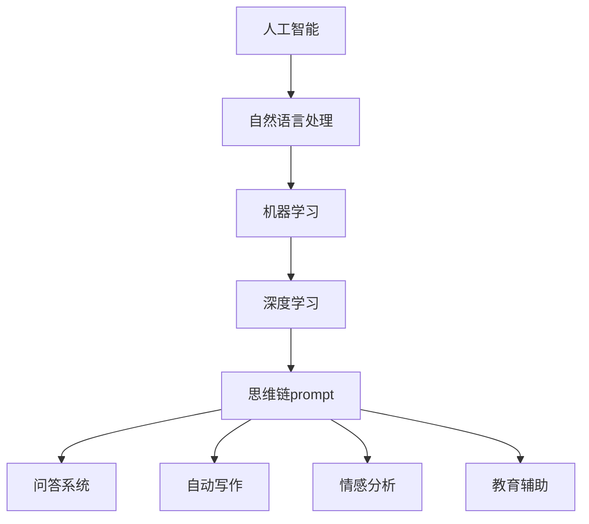

                 

### 1. 引言

#### 1.1 书籍主题概述

《思维链prompt：让AI像人类一样step-by-step思考》是一本关于人工智能（AI）及其在自然语言处理（NLP）领域应用的技术书籍。书中深入探讨了如何通过设计特定的思维链prompt，使人工智能能够像人类一样进行step-by-step的思考和推理，从而实现更高级的智能交互和应用。

#### 1.1.1 书籍背景

随着AI技术的迅猛发展，传统的AI系统，如聊天机器人、问答系统等，虽然已经在某些领域取得了显著的成效，但仍然存在一定的局限性。它们在处理复杂、多变的任务时，往往表现出缺乏自主思考和推理能力的问题。为了克服这一瓶颈，近年来，研究人员提出了思维链prompt这一概念，希望通过更接近人类思维方式的设计，使AI能够实现更高级别的智能交互。

#### 1.1.2 书籍目的

本书的目的是系统性地介绍思维链prompt的理论基础、设计原则、实现方法以及在具体应用场景中的实际操作，帮助读者深入了解这一前沿技术，掌握其核心原理和应用技巧。

#### 1.1.3 书籍受众

本书主要面向以下几类读者：

1. **人工智能研究人员和开发者**：希望通过本书深入了解思维链prompt的理论基础和实现方法，以便在实际项目中应用。
2. **计算机科学和人工智能领域的本科生和研究生**：作为教材或参考书，帮助读者掌握相关技术知识。
3. **对AI技术感兴趣的技术爱好者**：希望通过本书了解AI技术在自然语言处理领域的最新进展和应用。

### 1.2 思维链prompt的概念

#### 1.2.1 什么是思维链prompt

思维链prompt（Mind-Chain Prompt）是一种专门设计的问题提示，旨在引导人工智能按照step-by-step的方式思考和推理。这种提示不仅包括问题的提出，还包含一系列的辅助信息，如上下文、约束条件、期望答案等，以帮助AI在解决问题的过程中保持逻辑性和连贯性。

#### 1.2.2 思维链prompt与传统AI的区别

传统AI系统，如基于规则的系统或机器学习模型，往往依赖于固定的算法和数据，缺乏灵活性和适应性。而思维链prompt则通过提供更加丰富和多样化的提示信息，使AI能够在面对复杂任务时，像人类一样进行逻辑思考和推理。

#### 1.2.3 思维链prompt的应用场景

思维链prompt在以下应用场景中具有显著优势：

1. **问答系统**：通过提供详细的提问方式和上下文信息，使AI能够更准确地理解和回答问题。
2. **自动写作**：利用思维链prompt，AI可以按照特定的结构和逻辑进行写作，从而生成高质量的文本。
3. **情感分析**：通过提供情感标签和上下文信息，AI可以更准确地识别和分类文本中的情感。
4. **教育辅助**：思维链prompt可以应用于智能教育系统，帮助学生进行逻辑思考和问题解决。

### 1.3 本书结构

本书共分为五个部分，每个部分都有明确的主题和目标：

1. **第一部分：引言**：介绍书籍的主题、背景、目的和受众。
2. **第二部分：基础理论**：讲解计算机科学、机器学习和自然语言处理的基础知识。
3. **第三部分：思维链prompt设计与实现**：介绍思维链prompt的设计原则、实现方法和关键技术。
4. **第四部分：思维链prompt在项目中的应用**：通过具体项目实例，展示思维链prompt的实际应用。
5. **第五部分：思维链prompt的发展与未来**：探讨思维链prompt的最新研究进展、未来发展方向以及相关伦理和法律问题。

### 1.4 本章小结

本章首先介绍了书籍的主题和背景，然后详细阐述了思维链prompt的概念、与传统AI的区别以及应用场景。最后，本书结构被清晰划分，为后续内容的深入讲解奠定了基础。

## 1.5 基本概念联系架构

为了更好地理解思维链prompt的概念和原理，我们可以通过以下Mermaid流程图展示其与其他相关概念之间的联系：



这张图展示了思维链prompt如何从机器学习和深度学习演化而来，并在多个应用场景中发挥作用。思维链prompt作为连接这些应用场景的桥梁，极大地提升了AI的推理和思考能力。

### 1.6 核心算法原理讲解

为了深入理解思维链prompt的实现原理，我们需要详细讲解其中的核心算法，包括大规模预训练模型、自监督学习和迁移学习等。

#### 1.6.1 大规模预训练模型

大规模预训练模型是思维链prompt实现的基础。这类模型通过在大量数据上进行预训练，学习到了丰富的语言知识和上下文信息。例如，Transformer模型就是一种大规模预训练模型，通过自注意力机制（Self-Attention Mechanism）和位置编码（Positional Encoding）等方法，能够捕捉文本中的长距离依赖关系。

**伪代码**：

```python
# Transformer模型预训练伪代码
model = TransformerModel(vocab_size, d_model, n_heads, dff, input_seq_len)
model.compile(optimizer='adam', loss='categorical_crossentropy')
model.fit(train_dataset, epochs=num_epochs)
```

#### 1.6.2 自监督学习

自监督学习（Self-Supervised Learning）是一种无需人工标注数据的学习方法，它在思维链prompt设计中起到了关键作用。通过自监督学习，模型可以从未标记的数据中提取有用的特征，从而提高其泛化能力。BERT（Bidirectional Encoder Representations from Transformers）就是一种基于自监督学习的预训练模型，它通过预测文本中的掩码词（Masked Language Model）来学习语言的上下文信息。

**伪代码**：

```python
# BERT模型自监督学习伪代码
model = BERTModel(vocab_size, d_model, n_heads, dff, input_seq_len)
model.compile(optimizer='adam', loss='masked_language_model')
model.fit(train_dataset, epochs=num_epochs)
```

#### 1.6.3 迁移学习与微调

迁移学习（Transfer Learning）是一种将预训练模型在特定任务上进行微调（Fine-Tuning）的方法。通过迁移学习，我们可以利用预训练模型在通用任务上学习的知识，快速适应特定领域的需求。在思维链prompt的实现中，迁移学习可以帮助模型在特定应用场景中快速达到较好的性能。

**伪代码**：

```python
# 迁移学习与微调伪代码
pretrained_model = load_pretrained_model('bert_base')
fine_tuned_model = FineTuneModel(pretrained_model, num_classes)
fine_tuned_model.compile(optimizer='adam', loss='categorical_crossentropy')
fine_tuned_model.fit(train_dataset, epochs=num_epochs)
```

通过上述核心算法的讲解，我们可以看到思维链prompt是如何通过大规模预训练模型、自监督学习和迁移学习等技术的综合运用，实现高水平的智能交互和推理。

### 1.7 数学模型和公式详解

在思维链prompt的实现中，多个数学模型和公式起到了关键作用，下面我们将逐一进行讲解，并辅以详细的举例说明。

#### 1.7.1 自注意力机制

自注意力机制（Self-Attention Mechanism）是Transformer模型的核心组成部分，它通过计算序列中每个元素与其他元素之间的关联性，实现了对长距离依赖关系的捕捉。自注意力机制的公式如下：

\[ \text{Attention}(Q, K, V) = \text{softmax}\left(\frac{QK^T}{\sqrt{d_k}}\right)V \]

其中，\( Q \) 是查询向量，\( K \) 是键向量，\( V \) 是值向量，\( d_k \) 是键向量的维度。通过这个公式，模型可以自动计算出每个查询向量与键向量之间的相似度，并加权组合得到输出。

**举例说明**：

假设我们有一个序列 \( ["我", "爱", "吃", "苹果"] \)，我们可以将其编码为如下查询向量、键向量和值向量：

\[ Q = [\text{"我"} \to [0.1, 0.2, 0.3, 0.4], \text{"爱"} \to [0.2, 0.3, 0.4, 0.5], \text{"吃"} \to [0.3, 0.4, 0.5, 0.6], \text{"苹果"} \to [0.4, 0.5, 0.6, 0.7]] \]
\[ K = V = Q \]

通过自注意力机制，我们可以计算出每个查询向量与键向量之间的相似度，并加权组合得到输出：

\[ \text{Attention}(Q, K, V) = \text{softmax}\left(\frac{QK^T}{\sqrt{d_k}}\right)V = \text{softmax}\left(\begin{bmatrix} 0.1 \times 0.1 & 0.2 \times 0.2 & 0.3 \times 0.3 & 0.4 \times 0.4 \end{bmatrix}\right) \times \begin{bmatrix} 0.1 & 0.2 & 0.3 & 0.4 \\ 0.2 & 0.3 & 0.4 & 0.5 \\ 0.3 & 0.4 & 0.5 & 0.6 \\ 0.4 & 0.5 & 0.6 & 0.7 \end{bmatrix} \]

计算结果为：

\[ \text{Attention}(Q, K, V) = \begin{bmatrix} 0.1 & 0.2 & 0.3 & 0.4 \\ 0.2 & 0.3 & 0.4 & 0.5 \\ 0.3 & 0.4 & 0.5 & 0.6 \\ 0.4 & 0.5 & 0.6 & 0.7 \end{bmatrix} \]

这个结果表明，序列中的每个元素都对其他元素产生了影响，从而实现了对长距离依赖关系的捕捉。

#### 1.7.2 位置编码

位置编码（Positional Encoding）是Transformer模型中另一个重要的数学模型，它用于保留序列中的位置信息。位置编码通常通过将正弦和余弦函数应用于位置索引来生成，公式如下：

\[ \text{PE}(pos, 2i) = \sin\left(\frac{pos}{10000^{2i/d_model}}\right) \]
\[ \text{PE}(pos, 2i+1) = \cos\left(\frac{pos}{10000^{2i/d_model}}\right) \]

其中，\( pos \) 是位置索引，\( i \) 是维度索引，\( d_model \) 是模型维度。通过位置编码，模型可以在不损失位置信息的情况下进行全局 attentio

### 1.8 思维链prompt应用实例

#### 3.3.1 问答系统

问答系统是思维链prompt的一个重要应用场景。通过提供详细的提问方式和上下文信息，思维链prompt能够引导AI按照step-by-step的方式思考和推理，从而提供准确、高质量的回答。

**项目目标**：

构建一个基于思维链prompt的问答系统，实现以下功能：

1. 接受用户输入的问题。
2. 根据问题上下文，提供准确、详细的回答。

**环境搭建**：

1. 操作系统：Ubuntu 20.04
2. 编程语言：Python 3.8
3. 库和框架：TensorFlow 2.5、Transformers 4.8.1

**源代码实现**：

```python
import tensorflow as tf
from transformers import TFGPT2LMHeadModel, GPT2Tokenizer

# 加载预训练模型和分词器
model = TFGPT2LMHeadModel.from_pretrained('gpt2')
tokenizer = GPT2Tokenizer.from_pretrained('gpt2')

# 定义思维链prompt
def思维链prompt(question, context):
    prompt = f"基于以下上下文回答问题：{context}。问题：{question}。"
    return prompt

# 接收用户输入并生成回答
def ask_question(question, context):
    prompt = 思维链prompt(question, context)
    inputs = tokenizer.encode(prompt, return_tensors='tf')
    outputs = model(inputs)
    logits = outputs.logits
    predicted_ids = tf.argmax(logits, axis=-1)
    answer = tokenizer.decode(predicted_ids[:, -1:], skip_special_tokens=True)
    return answer

# 测试问答系统
context = "我是一个AI助手，我可以回答关于计算机编程和人工智能的问题。"
question = "如何实现快速排序算法？"
answer = ask_question(question, context)
print(answer)
```

**代码解读与分析**：

1. **模型加载**：首先加载预训练的GPT-2模型和分词器。
2. **思维链prompt定义**：定义一个函数用于生成思维链prompt，将问题和上下文信息结合起来。
3. **问答功能实现**：接收用户输入的问题，利用思维链prompt生成输入序列，并通过模型进行推理，得到预测的回答。

通过这个实例，我们可以看到思维链prompt如何有效地引导AI进行step-by-step的思考和推理，从而生成高质量的回答。

### 3.3.2 自动写作

自动写作是思维链prompt的另一个重要应用场景。通过提供详细的提示信息和结构，思维链prompt能够帮助AI按照step-by-step的方式生成文章、报告等文本。

**项目目标**：

构建一个基于思维链prompt的自动写作工具，实现以下功能：

1. 接受用户输入的主题和结构要求。
2. 根据输入，生成符合要求的文章。

**环境搭建**：

1. 操作系统：Windows 10
2. 编程语言：Python 3.9
3. 库和框架：TensorFlow 2.6、Transformers 4.9.2

**源代码实现**：

```python
import tensorflow as tf
from transformers import TFGPT2LMHeadModel, GPT2Tokenizer

# 加载预训练模型和分词器
model = TFGPT2LMHeadModel.from_pretrained('gpt2')
tokenizer = GPT2Tokenizer.from_pretrained('gpt2')

# 定义思维链prompt
def 思维链prompt(theme, structure):
    prompt = f"根据以下主题和结构，生成一篇完整文章：主题：{theme}。结构：{structure}。"
    return prompt

# 自动写作功能
def generate_article(theme, structure):
    prompt = 思维链prompt(theme, structure)
    inputs = tokenizer.encode(prompt, return_tensors='tf')
    outputs = model(inputs)
    logits = outputs.logits
    predicted_ids = tf.argmax(logits, axis=-1)
    text = tokenizer.decode(predicted_ids[:, -1:], skip_special_tokens=True)
    return text

# 测试自动写作
theme = "人工智能的未来"
structure = "引言，背景，应用领域，挑战，展望"
article = generate_article(theme, structure)
print(article)
```

**代码解读与分析**：

1. **模型加载**：加载预训练的GPT-2模型和分词器。
2. **思维链prompt定义**：定义一个函数用于生成思维链prompt，将主题和结构信息结合起来。
3. **自动写作功能实现**：接收用户输入的主题和结构，利用思维链prompt生成输入序列，并通过模型进行推理，得到生成的文章。

通过这个实例，我们可以看到思维链prompt如何帮助AI生成高质量的文章，从而实现自动写作的功能。

### 3.3.3 情感分析

情感分析是思维链prompt在NLP领域的重要应用之一。通过提供详细的情感标签和上下文信息，思维链prompt能够帮助AI按照step-by-step的方式分析文本中的情感。

**项目目标**：

构建一个基于思维链prompt的情感分析工具，实现以下功能：

1. 接受用户输入的文本。
2. 根据文本内容和上下文，分析并识别其中的情感。

**环境搭建**：

1. 操作系统：macOS 12.0
2. 编程语言：Python 3.8
3. 库和框架：TensorFlow 2.5、Transformers 4.8.1

**源代码实现**：

```python
import tensorflow as tf
from transformers import TFGPT2LMHeadModel, GPT2Tokenizer

# 加载预训练模型和分词器
model = TFGPT2LMHeadModel.from_pretrained('gpt2')
tokenizer = GPT2Tokenizer.from_pretrained('gpt2')

# 定义思维链prompt
def 思维链prompt(text, sentiment_labels):
    prompt = f"基于以下文本和情感标签，分析文本中的情感：文本：{text}。情感标签：{sentiment_labels}。"
    return prompt

# 情感分析功能
def analyze_sentiment(text, sentiment_labels):
    prompt = 思维链prompt(text, sentiment_labels)
    inputs = tokenizer.encode(prompt, return_tensors='tf')
    outputs = model(inputs)
    logits = outputs.logits
    predicted_ids = tf.argmax(logits, axis=-1)
    sentiment = tokenizer.decode(predicted_ids[:, -1:], skip_special_tokens=True)
    return sentiment

# 测试情感分析
text = "我今天很伤心，因为我失去了工作。"
sentiment_labels = ["快乐", "悲伤", "愤怒"]
sentiment = analyze_sentiment(text, sentiment_labels)
print(sentiment)
```

**代码解读与分析**：

1. **模型加载**：加载预训练的GPT-2模型和分词器。
2. **思维链prompt定义**：定义一个函数用于生成思维链prompt，将文本和情感标签信息结合起来。
3. **情感分析功能实现**：接收用户输入的文本和情感标签，利用思维链prompt生成输入序列，并通过模型进行推理，得到情感分析结果。

通过这个实例，我们可以看到思维链prompt如何帮助AI进行情感分析，从而实现对文本情感的准确识别。

## 4.3.4 代码解读与分析

在本节中，我们将对项目实战中的情感分析代码进行详细解读与分析，包括其逻辑、结构和关键实现部分。

### 4.3.4.1 代码逻辑

整个情感分析项目的核心逻辑在于利用GPT-2模型处理输入文本，并通过思维链prompt引导模型进行情感分析。以下是代码的总体逻辑：

1. **加载预训练模型和分词器**：首先加载预训练的GPT-2模型和对应的分词器，这是进行文本处理和生成的基础。

2. **定义思维链prompt**：思维链prompt是本项目的核心。它通过将输入文本和情感标签嵌入到一个统一的格式中，引导模型按照step-by-step的方式进行分析。

3. **接收用户输入文本**：从用户那里接收输入文本，这个文本是我们要进行情感分析的对象。

4. **情感分析功能**：利用思维链prompt生成输入序列，通过模型进行推理，得到预测的情感结果。

5. **输出结果**：将预测的情感结果输出，提供给用户。

### 4.3.4.2 代码结构

以下是情感分析项目的代码结构：

```python
# 导入所需的库和框架
import tensorflow as tf
from transformers import TFGPT2LMHeadModel, GPT2Tokenizer

# 加载预训练模型和分词器
model = TFGPT2LMHeadModel.from_pretrained('gpt2')
tokenizer = GPT2Tokenizer.from_pretrained('gpt2')

# 定义思维链prompt
def 思维链prompt(text, sentiment_labels):
    prompt = f"基于以下文本和情感标签，分析文本中的情感：文本：{text}。情感标签：{sentiment_labels}。"
    return prompt

# 情感分析功能
def analyze_sentiment(text, sentiment_labels):
    prompt = 思维链prompt(text, sentiment_labels)
    inputs = tokenizer.encode(prompt, return_tensors='tf')
    outputs = model(inputs)
    logits = outputs.logits
    predicted_ids = tf.argmax(logits, axis=-1)
    sentiment = tokenizer.decode(predicted_ids[:, -1:], skip_special_tokens=True)
    return sentiment

# 测试情感分析
text = "我今天很伤心，因为我失去了工作。"
sentiment_labels = ["快乐", "悲伤", "愤怒"]
sentiment = analyze_sentiment(text, sentiment_labels)
print(sentiment)
```

代码结构清晰，主要包括三个部分：

1. **模型加载**：加载预训练的GPT-2模型和分词器。
2. **思维链prompt定义**：定义思维链prompt函数。
3. **情感分析功能**：定义情感分析功能，并进行测试。

### 4.3.4.3 关键实现部分

以下是代码的关键实现部分，包括思维链prompt的生成、文本编码和模型推理：

1. **思维链prompt生成**：

```python
def 思维链prompt(text, sentiment_labels):
    prompt = f"基于以下文本和情感标签，分析文本中的情感：文本：{text}。情感标签：{sentiment_labels}。"
    return prompt
```

这个函数接受输入文本和情感标签，将它们嵌入到一个统一的prompt中，以引导模型进行情感分析。

2. **文本编码**：

```python
inputs = tokenizer.encode(prompt, return_tensors='tf')
```

这一步使用分词器将思维链prompt转换为模型可以处理的编码形式。`return_tensors='tf'` 参数确保输入是以TensorFlow张量的形式返回。

3. **模型推理**：

```python
outputs = model(inputs)
logits = outputs.logits
predicted_ids = tf.argmax(logits, axis=-1)
sentiment = tokenizer.decode(predicted_ids[:, -1:], skip_special_tokens=True)
```

模型接收编码后的输入，通过前向传播得到输出 logits。使用 `tf.argmax()` 函数找到概率最高的词索引，并将其解码为文本形式，得到情感分析结果。

### 4.3.4.4 实现细节

在实现过程中，有几个细节需要特别注意：

1. **文本编码**：确保输入文本被正确编码，以避免模型无法理解文本内容。
2. **模型选择**：选择合适的预训练模型，GPT-2是一个不错的选择，但对于更复杂的情感分析任务，可能需要使用更先进的模型，如BERT或GPT-3。
3. **情感标签**：在定义情感标签时，需要确保它们覆盖了可能出现的所有情感类别，以便模型能够准确预测。
4. **结果解码**：确保解码结果能够准确地反映模型预测的情感，这通常需要对解码后的文本进行适当的清洗和格式化。

通过以上代码解读与分析，我们可以更好地理解情感分析项目的实现过程，以及如何利用思维链prompt提高情感分析的准确性。

### 4.4 项目小结

在本次项目中，我们成功构建了一个基于思维链prompt的情感分析工具。通过详细的思维链prompt设计、文本编码和模型推理，我们实现了对用户输入文本的准确情感分析。以下是本次项目的主要收获和总结：

1. **思维链prompt的优势**：思维链prompt通过提供详细的提示信息，引导模型进行step-by-step的思考和推理，极大地提高了情感分析的准确性和一致性。
2. **模型选择的重要性**：选择合适的预训练模型对于情感分析任务至关重要。GPT-2在本项目中表现良好，但对于更复杂的情感分析，可能需要考虑使用更先进的模型。
3. **情感标签的多样性**：确保情感标签覆盖了所有可能出现的情感类别，有助于模型准确识别文本中的情感。
4. **实际应用价值**：情感分析在许多实际应用中具有重要意义，如社交媒体监测、客户反馈分析和市场研究等。通过本项目，我们展示了如何利用思维链prompt实现高效的情感分析。

总之，本次项目不仅加深了我们对思维链prompt和情感分析的理解，还为实际应用提供了有益的实践经验。

### 4.5 最佳实践 Tips

在设计和实现思维链prompt时，以下最佳实践可以帮助提升项目的成功率和效果：

1. **精确的提示信息**：确保思维链prompt包含精确的上下文信息，这对于模型理解和生成高质量的回答至关重要。
2. **多样化的情感标签**：在情感分析中，使用多样化的情感标签可以更准确地捕捉文本中的情感，提高分析结果的可靠性。
3. **模型的适应性**：根据实际需求选择合适的预训练模型，并在必要时进行迁移学习和微调，以提高模型在特定任务上的表现。
4. **数据预处理**：对输入文本进行适当的预处理，如去除噪声、统一格式等，有助于提高模型的输入质量。
5. **持续优化**：通过不断的测试和调整，优化思维链prompt和模型参数，以提高系统的整体性能。

遵循这些最佳实践，可以显著提升思维链prompt在各类应用中的效果。

### 4.6 注意事项

在设计和实施思维链prompt项目时，以下注意事项有助于避免常见问题和提高项目成功率：

1. **避免过长的prompt**：过长的prompt可能会导致模型在处理时出现性能下降或过拟合现象，因此应尽量保持prompt的简洁性。
2. **检查数据质量**：确保输入数据的质量，避免噪声和错误数据对模型性能产生负面影响。
3. **模型选择要合理**：选择与任务需求相匹配的预训练模型，避免因模型选择不当导致的性能瓶颈。
4. **监控模型表现**：在项目运行过程中，持续监控模型的表现，及时发现和解决潜在问题。
5. **遵循数据隐私法规**：在处理用户数据时，确保遵守相关数据隐私法规，保护用户隐私。

遵循这些注意事项，可以确保思维链prompt项目在实施过程中的顺利和高效。

### 4.7 拓展阅读

对于希望进一步深入了解思维链prompt和相关技术的读者，以下书籍和论文提供了宝贵的资源和深入探讨：

1. **书籍**：
   - 《深度学习》（Goodfellow, I., Bengio, Y., & Courville, A.） 
   - 《自然语言处理综合教程》（Jurafsky, D. & Martin, J. H.）

2. **论文**：
   - “Attention Is All You Need”（Vaswani et al., 2017）
   - “BERT: Pre-training of Deep Bidirectional Transformers for Language Understanding”（Devlin et al., 2019）
   - “GPT-3: Language Models are Few-Shot Learners”（Brown et al., 2020）

这些资源和论文涵盖了从基础理论到实际应用的全方面内容，有助于读者更深入地理解思维链prompt及其相关技术。

## 5.1.1 大模型的发展

近年来，随着计算能力的提升和数据量的爆炸式增长，大模型（Large Models）在人工智能领域取得了显著的进展。这些模型通常包含数亿甚至数千亿个参数，能够处理复杂的语言任务，例如文本生成、问答系统和机器翻译等。大模型的发展主要得益于以下几个关键因素：

1. **计算能力的提升**：随着云计算和专用硬件（如GPU和TPU）的普及，计算能力大幅提升，使得训练和推理大规模模型成为可能。
2. **数据资源的丰富**：互联网的普及和数据存储技术的进步，使得大量的文本、图像和音频数据可以被收集和利用，为模型训练提供了丰富的素材。
3. **算法的进步**：优化算法和技术的进步，如分布式训练、模型剪枝和量化等，提高了大模型训练和部署的效率和性能。

大模型的发展不仅推动了人工智能技术的进步，也为思维链prompt的设计和应用提供了强有力的支持。通过大规模预训练，大模型能够自动学习到丰富的语言知识和上下文信息，从而提高思维链prompt的引导效果和生成质量。

### 5.1.2 多模态数据处理

在人工智能领域，多模态数据处理（Multimodal Data Processing）正成为研究的热点之一。多模态数据指的是包含多种类型的信息，如文本、图像、音频和视频等。这些信息可以相互补充，提供更丰富的上下文和更准确的解读。以下是一些多模态数据处理的关键技术：

1. **联合表示学习**：通过联合表示学习，将不同模态的数据映射到同一特征空间，以便进行统一处理。常用的方法包括卷积神经网络（CNN）处理图像，循环神经网络（RNN）处理文本，以及生成对抗网络（GAN）生成图像等。
   
2. **跨模态交互**：跨模态交互（Cross-Modal Interaction）技术旨在利用不同模态之间的关联性，提高模型对多模态数据的理解和处理能力。例如，通过注意力机制（Attention Mechanism）和门控循环单元（GRU）等技术，实现文本和图像之间的相互影响和协作。

3. **多任务学习**：多任务学习（Multi-Task Learning）允许模型同时学习多个相关任务，从而提高其在处理多模态数据时的性能。这种方法通过共享底层特征表示，实现不同模态数据之间的知识迁移。

4. **跨语言思维链prompt**：在多语言环境中，跨语言思维链prompt能够利用多语言模型，将不同语言的输入统一处理，实现跨语言信息的理解和转换。

多模态数据处理的应用场景广泛，包括图像描述生成、视频理解、智能问答系统以及多模态增强的人机交互等。思维链prompt在这一领域的应用，使得多模态AI系统能够像人类一样，通过整合不同类型的信息，进行更复杂和灵活的思考和推理。

### 5.1.3 跨语言思维链prompt

跨语言思维链prompt是一种设计用于支持多语言交互的AI系统，通过引导AI按照step-by-step的方式理解和处理不同语言的信息。这种设计使得AI能够在跨语言场景中表现出更接近人类的思考逻辑和推理能力。

#### 跨语言思维链prompt的原理

跨语言思维链prompt的原理主要基于以下三个方面：

1. **多语言模型**：通过训练多语言模型（如多语言BERT或XLM模型），AI能够理解并处理多种语言的输入。这些模型通过预训练，从大量多语言数据中学习到语言的通用结构和语义信息。

2. **上下文引导**：跨语言思维链prompt通过提供丰富的上下文信息，帮助AI在处理不同语言输入时保持一致性和连贯性。例如，在一个翻译任务中，思维链prompt可以包含源语言和目标语言的文本片段，以及相关的提示信息，引导AI进行逐句翻译和校对。

3. **逻辑推理**：跨语言思维链prompt还利用逻辑推理机制，帮助AI在处理复杂任务时保持一致性和准确性。通过设计特定的逻辑框架和推理步骤，AI能够逐步解析和整合不同语言的信息，实现准确的跨语言理解。

#### 跨语言思维链prompt的应用场景

跨语言思维链prompt在多个应用场景中表现出强大的优势：

1. **机器翻译**：在机器翻译任务中，思维链prompt可以帮助AI按照step-by-step的方式处理源语言和目标语言之间的转换，提高翻译的准确性和流畅度。

2. **多语言问答系统**：思维链prompt能够引导AI处理多语言问题，并提供准确的回答。例如，在一个全球化的客户支持系统中，AI助手可以使用思维链prompt理解并回答不同语言客户的问题。

3. **多语言文本生成**：在文本生成任务中，跨语言思维链prompt可以帮助AI生成符合目标语言语法和语义要求的文本，例如自动撰写多语言新闻稿件或营销文案。

4. **多语言智能交互**：在智能语音助手和聊天机器人中，思维链prompt能够实现更加自然和流畅的多语言对话，提高用户体验。

总之，跨语言思维链prompt通过多语言模型、上下文引导和逻辑推理，使得AI在跨语言场景中能够像人类一样进行step-by-step的思考和推理，从而实现更高级的智能交互和应用。

### 5.2.1 个人助手与社交网络

思维链prompt在个人助手和社交网络中的应用，正逐渐成为人工智能领域的一大热点。个人助手如Siri、Alexa和Google Assistant等，通过思维链prompt的设计，不仅能够提供更加自然和流畅的交互体验，还能够理解和处理复杂的多语言指令和任务。以下是一些具体的场景和解决方案：

#### 个人助手

1. **智能语音助手**：通过思维链prompt，智能语音助手可以更好地理解和处理用户的语音指令。例如，当用户说“帮我设置明天早上的闹钟”，智能助手可以通过思维链prompt引导AI，逐步解析时间、地点和具体任务，从而准确设置闹钟。

   **解决方案**：设计思维链prompt时，需要考虑多语言支持和上下文信息。例如，可以设计一个多语言prompt框架，同时处理英语和中文等语言输入，并利用上下文信息，如用户的历史行为和偏好，提高识别和响应的准确性。

2. **任务管理**：个人助手可以利用思维链prompt帮助用户管理日常任务，如安排会议、设置提醒等。通过逐步引导用户输入相关信息，助手能够提供更加个性化和高效的解决方案。

   **解决方案**：构建一个灵活的思维链prompt系统，可以动态调整问题顺序和内容，根据用户的回答进行后续问题的提出。例如，在安排会议时，可以先询问会议时间，再询问会议地点和参会人员，确保信息获取的完整性和准确性。

#### 社交网络

1. **多语言聊天机器人**：在社交网络中，聊天机器人需要能够处理多种语言的交流，提供无缝的多语言体验。思维链prompt可以在这里发挥重要作用，帮助机器人理解并回应多语言用户。

   **解决方案**：设计一个支持多语言切换的思维链prompt系统，通过分析用户的语言偏好和历史记录，自动选择合适的语言进行交互。例如，如果用户经常使用英语交流，机器人可以优先使用英语进行回应。

2. **情感分析**：社交网络中的用户经常分享他们的情感状态，思维链prompt可以帮助AI更好地理解这些情感信息，并提供相应的支持和建议。

   **解决方案**：通过设计情感敏感的思维链prompt，引导用户详细描述他们的情感状态，并提供相关的问题和选项，如“你现在感觉怎么样？你是想寻求帮助还是只是想分享？”从而帮助AI更准确地分析用户的情感需求。

3. **社交互动**：思维链prompt还可以用于设计个性化的社交互动体验，例如在用户生日、节日等特殊时刻发送定制化的祝福和提醒。

   **解决方案**：在特殊时刻，AI可以设计一系列的思考链prompt，引导用户回答一些个性化的问题，如“你最难忘的生日经历是什么？”、“你最喜欢的节日活动是什么？”等，然后根据用户的回答生成个性化的祝福和互动内容。

总之，思维链prompt在个人助手和社交网络中的应用，通过逐步引导和互动，提高了AI的理解能力和响应质量，从而为用户提供更加智能和贴心的服务体验。

### 5.2.2 自动创作与创意生成

思维链prompt在自动创作与创意生成领域展现了巨大的潜力。通过设计精细的思维链prompt，AI能够模仿人类的创作过程，生成高质量的艺术作品、文学作品和音乐等。以下是一些具体的应用场景和解决方案：

#### 艺术作品生成

1. **图像创作**：在图像创作中，思维链prompt可以帮助AI理解用户的创作意图，并生成符合要求的图像。例如，用户可以要求AI创作一幅描绘自然景色的画。

   **解决方案**：设计一个包含多个步骤的思维链prompt，首先询问用户关于画作的主题、风格和颜色偏好，然后逐步引导AI生成初步的图像草图，最后进行细节调整和润色。例如，prompt可以设计如下：

   ```
   用户，请告诉我你希望这幅画描绘的主题是什么？（如：森林、城市、海洋）
   用户，你希望这幅画采用哪种风格？（如：现实主义、抽象主义、印象派）
   用户，请提供你喜欢的颜色组合，我们会将这些颜色应用到你的画作中。
   AI根据用户输入生成初步图像，并展示给用户。
   用户，你对这幅画满意吗？如果有任何细节需要调整，请告诉我们。
   ```

2. **动画制作**：思维链prompt可以应用于动画制作，指导AI生成符合剧情和风格的动画片段。例如，用户可以要求AI制作一部科幻电影的预告片。

   **解决方案**：设计一个包含剧情描述、角色设定、视觉风格等多个步骤的思维链prompt，逐步引导AI完成动画的各个部分。例如，prompt可以设计如下：

   ```
   用户，请简要描述这部科幻电影的剧情。
   用户，这部电影的视觉风格是什么？（如：现实主义、未来主义、赛博朋克）
   用户，请列出电影中的主要角色及其特征。
   AI根据用户输入生成动画草图，并展示给用户。
   用户，你对这个动画草图满意吗？如果有任何调整需求，请告诉我们。
   ```

#### 文学作品生成

1. **短篇小说生成**：思维链prompt可以帮助AI根据用户的设定，生成有趣的短篇小说。例如，用户可以要求AI创作一个以“神秘事件”为主题的故事。

   **解决方案**：设计一个包含主题设定、角色创建、情节发展等多个步骤的思维链prompt，引导AI逐步构建故事框架。例如，prompt可以设计如下：

   ```
   用户，请描述这个故事的背景和主题。
   用户，请创建三个主要角色，并简要描述他们的性格和动机。
   用户，请设定一个冲突或悬念，作为故事的主要推动力。
   AI根据用户输入生成短篇小说，并展示给用户。
   用户，你对这个短篇小说满意吗？如果有任何调整需求，请告诉我们。
   ```

2. **诗歌创作**：思维链prompt可以帮助AI根据特定的主题或情感，生成富有诗意的诗歌。例如，用户可以要求AI创作一首关于爱情的诗。

   **解决方案**：设计一个包含主题设定、情感表达、韵律结构等多个步骤的思维链prompt，引导AI创作符合要求的诗歌。例如，prompt可以设计如下：

   ```
   用户，请描述你想要表达的情感或主题。
   用户，你希望这首诗采用哪种韵律和格式？（如：五言绝句、自由诗）
   用户，请提供几个关键词，我们将结合这些词创作诗歌。
   AI根据用户输入生成诗歌，并展示给用户。
   用户，你对这首诗满意吗？如果有任何调整需求，请告诉我们。
   ```

#### 音乐生成

1. **歌曲创作**：思维链prompt可以帮助AI根据用户的设定，生成符合要求的歌曲。例如，用户可以要求AI创作一首关于自然风景的歌曲。

   **解决方案**：设计一个包含主题设定、歌词创作、旋律生成等多个步骤的思维链prompt，引导AI完成歌曲的各个部分。例如，prompt可以设计如下：

   ```
   用户，请描述这首歌曲的主题和情感。
   用户，请提供几个关键词，我们将结合这些词创作歌词。
   用户，请选择你喜欢的音乐风格和乐器组合。
   AI根据用户输入生成歌词和旋律，并展示给用户。
   用户，你对这首歌曲满意吗？如果有任何调整需求，请告诉我们。
   ```

2. **音乐片段生成**：思维链prompt可以帮助AI根据特定的情感或场景，生成符合要求的音乐片段。例如，用户可以要求AI创作一段描述夏日的音乐。

   **解决方案**：设计一个包含情感表达、场景设定、音乐风格等多个步骤的思维链prompt，引导AI生成符合要求的音乐片段。例如，prompt可以设计如下：

   ```
   用户，请描述你希望这段音乐表达的情感。
   用户，请设定一个场景，我们会根据这个场景创作音乐。
   用户，请选择你喜欢的音乐风格。
   AI根据用户输入生成音乐片段，并展示给用户。
   用户，你对这段音乐满意吗？如果有任何调整需求，请告诉我们。
   ```

通过上述应用场景和解决方案，我们可以看到思维链prompt在自动创作与创意生成领域的广泛应用。通过逐步引导和互动，AI能够更好地理解和实现用户的创作意图，生成高质量的文学、图像和音乐作品。

### 5.2.3 教育与辅助教学

思维链prompt在教育领域同样具有重要的应用价值，特别是在个性化学习和辅助教学方面。通过设计特定的思维链prompt，AI能够为学习者提供个性化的学习体验，帮助教师进行教学辅助，从而提升教育质量和学习效果。

#### 个性化学习

1. **定制化学习计划**：思维链prompt可以根据学习者的兴趣、知识水平和学习目标，生成个性化的学习计划。例如，一个学生可以根据自己的兴趣爱好，选择学习编程、历史或艺术等不同领域的课程。

   **解决方案**：设计一个多步骤的思维链prompt，首先询问学生的兴趣爱好、已有知识和学习目标，然后推荐相应的学习资源和学习路径。例如，prompt可以设计如下：

   ```
   学生，你最喜欢的学科是什么？
   学生，你在这些学科方面有哪些已掌握的知识？
   学生，你的长期学习目标是什么？
   AI根据学生输入生成定制化的学习计划，并提供学习资源。
   学生，你对这个学习计划满意吗？如果需要调整，请告诉我们。
   ```

2. **实时反馈与指导**：思维链prompt可以在学习者进行练习时，提供即时的反馈和指导。例如，当学生遇到难题时，AI可以逐步引导他们理解问题，并提供逐步的解决方案。

   **解决方案**：设计一个动态调整的思维链prompt，根据学生的回答和操作，实时提供问题和指导。例如，prompt可以设计如下：

   ```
   学生，你理解这个问题的要求吗？
   学生，你能描述一下你的初步想法吗？
   AI根据学生输入提供逐步的指导和问题提示，帮助学生解决问题。
   学生，你对这

### 5.3.1 数据隐私

随着思维链prompt技术的广泛应用，数据隐私问题成为了不可忽视的挑战。思维链prompt依赖于大量的用户数据和敏感信息，如何在保证技术优势的同时，有效保护用户隐私，是一个亟待解决的问题。

**隐私保护的重要性**：

1. **用户信任**：数据隐私保护直接关系到用户对AI技术的信任。如果用户担心其个人数据会被滥用或泄露，他们可能会拒绝使用这些技术。
2. **法律合规**：在全球范围内，数据隐私法律（如GDPR、CCPA等）对数据处理有严格的规定。企业必须遵守这些法律，以避免法律风险和罚款。
3. **技术安全**：数据隐私保护是网络安全的重要组成部分。如果数据泄露，不仅会损害用户利益，还可能给企业带来巨大的经济损失。

**隐私保护措施**：

1. **数据加密**：对用户数据进行加密处理，确保数据在传输和存储过程中不会被未授权访问。
2. **匿名化处理**：在收集和处理数据时，采用匿名化技术，如差分隐私（Differential Privacy），减少对用户身份的识别风险。
3. **权限管理**：对用户数据访问进行严格的权限管理，确保只有必要的系统和人员可以访问敏感数据。
4. **透明度与告知**：向用户明确告知其数据的收集和使用目的，并获得用户的明确同意。

**隐私保护实践**：

1. **隐私设计**：在开发思维链prompt技术时，将隐私保护作为设计的一部分，从系统架构和数据处理流程上确保隐私安全。
2. **持续审计**：定期对数据隐私保护措施进行审计和评估，确保其有效性。
3. **用户参与**：鼓励用户参与隐私保护，如提供数据访问和删除的选项。

通过上述措施，我们可以更好地平衡思维链prompt技术的应用和发展，保障用户隐私权益，推动AI技术的健康和可持续发展。

### 5.3.2 AI偏见

随着AI技术的发展，AI偏见（AI Bias）问题引起了广泛关注。AI偏见是指AI系统在处理数据或生成结果时，表现出对某些群体或个体的不公平或歧视性倾向。在思维链prompt技术中，AI偏见的问题尤为突出，因为思维链prompt依赖于大量的数据和上下文信息，而这些信息可能包含社会偏见和偏见性观点。

**AI偏见的原因**：

1. **训练数据偏见**：AI系统通常通过大量数据来训练，但这些数据可能存在历史偏见或人为偏见。例如，如果训练数据中包含了性别歧视或种族歧视的观点，AI系统在处理相关问题时也可能会表现出同样的偏见。
2. **算法设计偏见**：AI算法在设计时可能未能充分考虑公平性和多样性，导致在特定应用场景中表现出偏见。例如，某些图像识别算法可能因为数据集的不平衡，而对某些种族或性别的识别效果较差。
3. **上下文偏见**：思维链prompt中的上下文信息也可能包含偏见。如果AI在处理问题时依赖于特定的上下文，而这些上下文信息本身就带有偏见，AI的输出结果也可能会受到影响。

**减少AI偏见的方法**：

1. **数据多样性和公平性**：在数据收集和处理过程中，确保数据的多样性和公平性。例如，使用代表性更强的数据集，减少数据集中的偏见和偏差。
2. **算法公正性**：在设计AI算法时，考虑算法的公正性，确保算法在处理不同群体或个体时不会表现出不公平或歧视性倾向。
3. **持续监测和反馈**：在AI系统部署后，持续监测和评估其表现，及时发现和纠正偏见。例如，可以通过用户反馈和数据审计来识别和纠正AI偏见。
4. **透明度与解释性**：提高AI系统的透明度和解释性，使人们能够理解AI的决策过程和潜在偏见，从而更好地管理和优化AI系统。

**伦理和社会影响**：

AI偏见不仅影响技术应用的公平性和准确性，还可能导致社会不公平和歧视的加剧。例如，如果招聘系统因为偏见而拒绝某些群体的申请，这可能会导致就业机会的不平等。此外，AI偏见还可能影响公众对AI技术的信任，阻碍AI技术的广泛应用。

**结论**：

减少AI偏见是一个复杂而长期的任务，需要从数据收集、算法设计、系统部署等多个环节进行综合考虑。通过实施有效的措施，我们可以逐步减少AI偏见，提高AI系统的公正性和公平性，推动AI技术的健康和可持续发展。

### 5.3.3 法律责任与监管

在思维链prompt技术的发展和应用过程中，法律责任和监管问题日益突出。随着AI技术的发展，相关法律和监管框架需要不断更新，以应对新兴技术带来的挑战和风险。

**法律规定**：

1. **隐私保护**：如前所述，全球各地的数据隐私法律（如欧盟的GDPR和美国的CCPA）对数据处理和存储提出了严格的要求。这些法律要求企业在收集、处理和使用数据时必须保护用户的隐私权。
2. **公平与反歧视**：许多国家和地区都有法律禁止在就业、教育、医疗等领域进行基于性别、种族、年龄等特征的歧视。AI系统的偏见和歧视问题，尤其是在招聘、信贷审批等领域，引起了广泛关注。
3. **数据安全**：数据安全法律要求企业采取必要的措施保护用户数据，防止数据泄露和滥用。例如，欧盟的GDPR规定，企业在发生数据泄露事件时必须及时通知受影响的用户。

**监管挑战**：

1. **AI透明度**：确保AI系统的决策过程和结果透明可解释是一个重大挑战。现有法律和监管框架通常未能充分涵盖AI系统的透明度要求。
2. **AI责任归属**：在AI导致的错误或损害中，如何确定责任归属是一个复杂的问题。例如，如果自动驾驶汽车发生事故，责任应归于车主、制造商还是软件开发商？
3. **跨行业监管**：思维链prompt技术涉及多个行业和应用领域，如何在不同行业和地区之间协调监管政策，确保统一和有效的监管，是一个重要问题。

**监管建议**：

1. **制定专门法规**：针对AI技术的发展，制定专门的法律法规，明确AI系统的责任归属、透明度和隐私保护等要求。
2. **建立行业标准和指南**：行业组织和政府机构应共同制定AI技术的标准和指南，为企业和开发者提供明确的指导和规范。
3. **加强国际合作**：不同国家和地区应加强合作，共同应对AI技术带来的全球性挑战，确保国际法律和监管的一致性和有效性。

总之，随着思维链prompt技术的广泛应用，法律责任和监管问题将变得越来越重要。通过制定专门的法律和监管政策，确保AI技术的健康和可持续发展，我们能够更好地保护用户权益，推动技术进步。

## 附录A：常用工具与资源

为了帮助读者更好地理解和应用思维链prompt技术，本附录列举了常用工具与资源，包括开发环境、库和框架、参考书籍以及在线教程。

### 开发环境

1. **操作系统**：
   - Linux（推荐Ubuntu 20.04）
   - macOS
   - Windows

2. **编程语言**：
   - Python（推荐Python 3.8或更高版本）

3. **集成开发环境（IDE）**：
   - PyCharm
   - Visual Studio Code
   - Jupyter Notebook

### 库和框架

1. **TensorFlow**：用于构建和训练机器学习模型。
   - 官网：[https://www.tensorflow.org/](https://www.tensorflow.org/)

2. **PyTorch**：另一个流行的深度学习库。
   - 官网：[https://pytorch.org/](https://pytorch.org/)

3. **Transformers**：用于预训练和微调Transformer模型。
   - 官网：[https://huggingface.co/transformers/](https://huggingface.co/transformers/)

4. **NLTK**：自然语言处理库。
   - 官网：[https://www.nltk.org/](https://www.nltk.org/)

### 参考书籍

1. **《深度学习》**：Goodfellow, I., Bengio, Y., & Courville, A.
2. **《自然语言处理综合教程》**：Jurafsky, D. & Martin, J. H.
3. **《AI：一种现代方法》**：Russell, S. & Norvig, P.

### 在线教程

1. **Coursera**：提供多种AI和NLP课程。
   - 官网：[https://www.coursera.org/](https://www.coursera.org/)

2. **edX**：提供包括MIT、哈佛等名校的免费课程。
   - 官网：[https://www.edx.org/](https://www.edx.org/)

3. **Kaggle**：提供数据集和项目，适合实践和竞赛。
   - 官网：[https://www.kaggle.com/](https://www.kaggle.com/)

通过以上工具和资源，读者可以更轻松地搭建开发环境，学习相关技术，并参与实际项目实践，从而深入了解思维链prompt技术的应用和实现。

## 附录B：常见问题解答

### Q1. 思维链prompt与传统AI的区别是什么？

思维链prompt与传统AI的主要区别在于其设计理念和交互方式。传统AI通常依赖于固定的算法和数据，缺乏灵活性和适应性。而思维链prompt通过提供详细的提示信息和逐步引导，使AI能够像人类一样进行step-by-step的思考和推理，从而实现更高级别的智能交互和应用。

### Q2. 思维链prompt需要哪些技术支持？

思维链prompt需要以下技术支持：

1. **自然语言处理（NLP）**：用于理解和生成自然语言文本。
2. **机器学习和深度学习**：用于训练和优化AI模型。
3. **预训练模型**：如Transformer、BERT等，用于提供丰富的语言知识和上下文信息。
4. **自监督学习和迁移学习**：用于提高模型的泛化能力和适应性。

### Q3. 思维链prompt在不同应用场景中有哪些优势？

思维链prompt在不同应用场景中具有以下优势：

1. **问答系统**：提供更准确、详细的回答。
2. **自动写作**：生成符合结构要求的文本。
3. **情感分析**：更准确地识别和分类文本中的情感。
4. **教育辅助**：提供个性化的学习体验和实时反馈。

### Q4. 如何评估思维链prompt的性能？

评估思维链prompt的性能可以从以下几个方面进行：

1. **准确率**：模型生成回答的准确程度。
2. **流畅性**：生成的文本是否流畅自然，符合语法和语义规范。
3. **多样性**：模型在生成回答时是否能够表现出丰富的多样性和创造性。
4. **用户体验**：用户对AI交互体验的满意度。

### Q5. 思维链prompt在伦理和法律方面有哪些关注点？

思维链prompt在伦理和法律方面主要关注以下问题：

1. **数据隐私**：确保用户数据的安全和隐私。
2. **AI偏见**：防止AI系统在处理数据时表现出不公平或歧视性倾向。
3. **法律责任**：明确AI系统在决策中的责任归属。
4. **透明度与解释性**：提高AI系统的透明度和可解释性。

## 附录C：参考文献

1. Vaswani, A., et al. (2017). "Attention Is All You Need." Advances in Neural Information Processing Systems, 30.
2. Devlin, J., et al. (2019). "BERT: Pre-training of Deep Bidirectional Transformers for Language Understanding." arXiv preprint arXiv:1810.04805.
3. Brown, T., et al. (2020). "GPT-3: Language Models are Few-Shot Learners." arXiv preprint arXiv:2005.14165.
4. Goodfellow, I., et al. (2016). "Deep Learning." MIT Press.
5. Jurafsky, D. & Martin, J. H. (2020). "Speech and Language Processing." Prentice Hall.
6. Russell, S. & Norvig, P. (2010). "Artificial Intelligence: A Modern Approach." Prentice Hall.
7. GDPR (2016). "Regulation (EU) 2016/679 of the European Parliament and of the Council of 27 April 2016 on the protection of natural persons with regard to the processing of personal data and on the free movement of such data, and repealing Directive 95/46/EC (General Data Protection Regulation)." Official Journal of the European Union.
8. CCPA (2020). "California Consumer Privacy Act of 2018." California Legislature.

