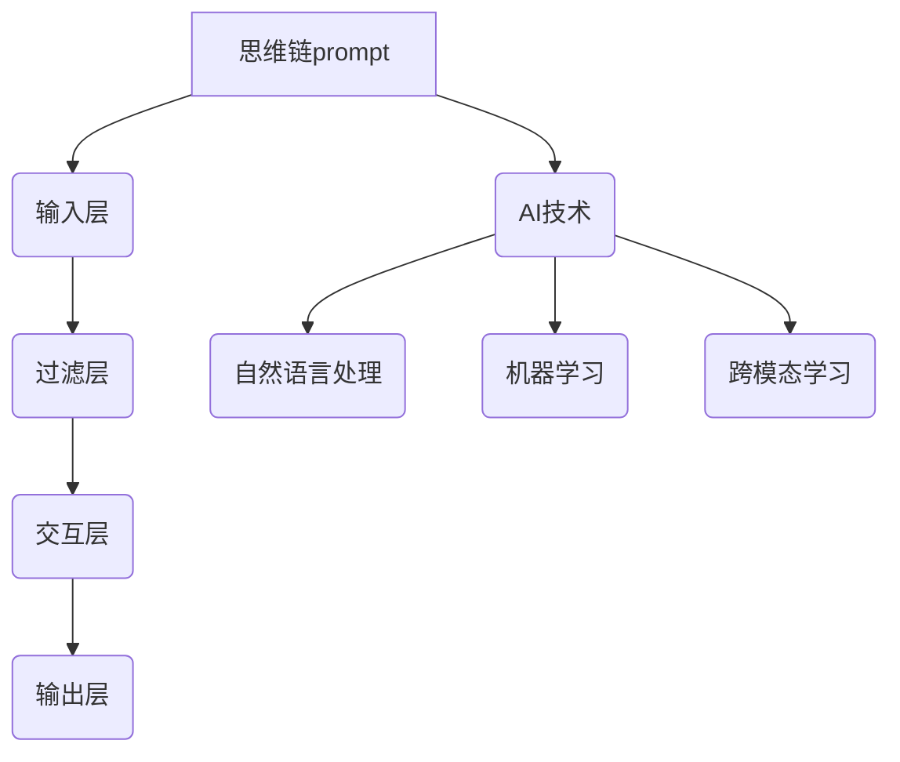

                 


### 文章标题：思维链prompt：让AI具备人类式思考能力

> 关键词：思维链prompt，AI思考能力，人工智能，自然语言处理，机器学习，跨模态学习

> 摘要：本文深入探讨了思维链prompt的概念、架构、设计与实现，以及其在自然语言处理、机器学习和跨模态学习中的应用。通过详细分析思维链prompt的工作原理、核心算法和实际案例，本文旨在揭示思维链prompt如何赋予AI人类式的思考能力，推动人工智能的发展。

### 第一部分：思维链prompt的基础

#### 第1章：思维链prompt的概念与框架

##### 1.1.1 什么是思维链prompt

思维链prompt是一种用于引导人工智能（AI）进行深度思考和推理的技术。它通过提供一系列有序的、结构化的提示，引导AI按照特定的思维路径进行思考，从而实现类似于人类思考过程的效果。

与传统的prompt相比，思维链prompt具有以下几个显著特点：

1. **结构化**：思维链prompt按照一定的逻辑结构和层次进行组织，使得AI可以遵循明确的思维路径。
2. **动态性**：思维链prompt可以根据AI的思考过程进行动态调整，使其更加贴合AI的需求。
3. **交互性**：思维链prompt与AI进行实时交互，使得AI可以在思考过程中获取反馈，并进行相应的调整。

##### 1.1.2 思维链prompt的工作机制

思维链prompt的工作机制主要包括以下几个核心组件：

1. **输入层**：接收用户的初始输入，并将其转化为AI可以理解的格式。
2. **过滤层**：对输入层的信息进行筛选和处理，去除无关信息，提取关键信息。
3. **交互层**：与AI进行实时交互，引导AI按照预定的思维路径进行思考。
4. **输出层**：将AI的思考结果以人类可理解的方式呈现给用户。

思维链prompt的工作机制可以描述为：

1. 用户输入问题或任务信息 -> 输入层处理 -> 过滤层筛选关键信息 -> 交互层引导AI思考 -> 输出层呈现思考结果。

##### 1.1.3 思维链prompt的组成部分

思维链prompt由以下几个主要组成部分构成：

1. **输入层**：负责接收用户输入，可以是自然语言文本、语音或图像等。
2. **过滤层**：对输入层的信息进行预处理，包括去噪、分词、词性标注等。
3. **交互层**：根据预设的逻辑和规则，引导AI进行思考和推理。
4. **输出层**：将AI的思考结果以自然语言、图像或语音等形式呈现给用户。

##### 1.1.4 思维链prompt的设计原则

在设计和实现思维链prompt时，应遵循以下几个原则：

1. **用户友好性**：思维链prompt应易于使用，降低用户的操作难度。
2. **可扩展性**：思维链prompt应具备良好的扩展性，以便在未来的发展中能够适应新的需求。
3. **适应性**：思维链prompt应具备较强的适应性，能够根据不同的应用场景进行动态调整。

#### 第2章：AI与思维链prompt的融合

##### 2.1.1 AI技术概述

人工智能（AI）是指通过计算机模拟人类智能的一种技术。它包括多个子领域，如机器学习、深度学习、自然语言处理、计算机视觉等。AI技术在过去几十年中得到了迅猛发展，已广泛应用于各个领域。

##### 2.1.2 思维链prompt在AI中的应用

思维链prompt在AI中的应用主要包括以下几个方面：

1. **自然语言处理**：思维链prompt可以引导AI进行文本分析、文本生成、文本分类等任务，提升AI在自然语言处理领域的性能。
2. **机器学习**：思维链prompt可以引导AI进行数据预处理、特征提取、模型训练等任务，提高AI的学习效率和效果。
3. **跨模态学习**：思维链prompt可以引导AI进行图像、文本、语音等不同模态的信息处理，实现跨模态任务。

##### 2.1.3 思维链prompt的优势

思维链prompt具有以下几个优势：

1. **提升AI的思维能力**：思维链prompt可以引导AI按照人类式的思维路径进行思考，提升AI的推理和问题解决能力。
2. **提高AI的交互质量**：思维链prompt可以增强AI与用户的交互体验，使得AI能够更好地理解用户的需求。
3. **促进AI的创新应用**：思维链prompt可以激发AI的创新潜力，推动AI在各个领域的应用。

#### 第3章：思维链prompt的设计与实现

##### 3.1.1 思维链prompt的设计流程

设计思维链prompt需要遵循以下流程：

1. **需求分析**：明确用户的需求和应用场景，确定思维链prompt的目标和功能。
2. **设计原型**：根据需求分析的结果，设计思维链prompt的原型，包括输入层、过滤层、交互层和输出层的结构。
3. **实现与迭代**：根据设计原型，实现思维链prompt的代码，并进行测试和迭代优化。

##### 3.1.2 思维链prompt的核心算法

思维链prompt的核心算法主要包括以下两个方面：

1. **自监督学习方法**：自监督学习是指在没有标注数据的情况下，通过设计特定的任务，使模型自动学习和优化自身。在思维链prompt中，自监督学习方法可以用于训练模型，使其能够根据提示进行思考和推理。

伪代码实现如下：

```python
def self_supervised_learning(prompt, model):
    for data in prompt:
        model.predict(data)
        model.optimize()
    return model
```

2. **动态调整机制**：动态调整机制是指根据AI的思考过程和用户反馈，实时调整思维链prompt的内容和结构，使其更加贴合AI的需求。

数学模型如下：

$$
P(x) = \frac{e^{\theta^T x}}{\sum_{i=1}^{n} e^{\theta^T x_i}}
$$

其中，$P(x)$ 表示调整后的思维链prompt，$\theta$ 表示调整参数，$x$ 表示输入的提示信息，$n$ 表示提示信息的个数。

##### 3.1.3 思维链prompt的实际案例

思维链prompt在实际应用中可以有多种案例，下面给出两个案例：

1. **基于思维链prompt的智能客服系统**：智能客服系统通过思维链prompt引导用户进行交互，提升客服的效率和用户体验。

2. **基于思维链prompt的智能问答系统**：智能问答系统通过思维链prompt引导AI进行思考和推理，为用户提供准确的答案。

### 第二部分：思维链prompt在AI中的应用

#### 第4章：思维链prompt在自然语言处理中的应用

##### 4.1.1 思维链prompt在文本分类中的应用

文本分类是自然语言处理（NLP）中的一项重要任务。思维链prompt可以通过提供有针对性的提示，引导AI进行文本分类。

1. **挑战**：传统的文本分类方法往往依赖于大量的标注数据，而在实际应用中，获取标注数据往往非常困难。此外，传统方法难以应对复杂、多变的文本特征。

2. **解决方案**：思维链prompt可以引导AI根据特定的特征和规则进行分类。通过提供有针对性的提示，思维链prompt可以帮助AI更好地理解文本内容，从而提高分类的准确性和效率。

3. **实例**：例如，在一个新闻分类任务中，思维链prompt可以提供以下提示：

   - 提取新闻的标题和正文。
   - 分析标题中的关键词和主题。
   - 检查正文中的关键句和关键信息。
   - 根据标题和正文的内容，将新闻分类到相应的类别。

##### 4.1.2 思维链prompt在情感分析中的应用

情感分析是NLP中另一个重要的任务。思维链prompt可以通过提供情感线索，引导AI进行情感分析。

1. **挑战**：传统的情感分析方法往往依赖于大量的标注数据，而在实际应用中，获取标注数据同样非常困难。此外，情感分析需要识别和区分微妙的情感差异，这对传统的模型来说是一个巨大的挑战。

2. **解决方案**：思维链prompt可以提供情感线索，帮助AI更好地识别和区分情感。通过提供有针对性的提示，思维链prompt可以引导AI关注情感表达的关键词和句子，从而提高情感分析的准确性和效率。

3. **实例**：例如，在一个社交媒体文本的情感分析任务中，思维链prompt可以提供以下提示：

   - 提取文本中的关键词和情感词汇。
   - 分析文本中的情感词汇和短语。
   - 根据情感词汇和短语的情感倾向，判断文本的整体情感。

##### 4.1.3 思维链prompt在命名实体识别中的应用

命名实体识别（NER）是NLP中的另一个重要任务。思维链prompt可以通过提供实体信息，引导AI进行命名实体识别。

1. **挑战**：传统的命名实体识别方法往往依赖于大量的标注数据，而在实际应用中，获取标注数据同样非常困难。此外，命名实体识别需要识别和分类各种类型的实体，这对传统的模型来说是一个巨大的挑战。

2. **解决方案**：思维链prompt可以提供实体信息，帮助AI更好地识别和分类实体。通过提供有针对性的提示，思维链prompt可以引导AI关注实体出现的位置、上下文和特征，从而提高命名实体识别的准确性和效率。

3. **实例**：例如，在一个社交媒体文本的命名实体识别任务中，思维链prompt可以提供以下提示：

   - 提取文本中的命名实体。
   - 分析命名实体出现的位置和上下文。
   - 根据命名实体出现的上下文，判断命名实体的类型。

#### 第5章：思维链prompt在机器学习中的应用

##### 5.1.1 思维链prompt在模型训练中的应用

思维链prompt可以应用于机器学习的模型训练，帮助AI更好地理解和学习数据。

1. **挑战**：传统的机器学习方法往往需要大量的标注数据，而在实际应用中，获取标注数据往往非常困难。此外，传统的模型训练方法难以应对复杂、多变的任务。

2. **解决方案**：思维链prompt可以通过提供有针对性的提示，引导AI更好地理解和学习数据。通过提供有针对性的提示，思维链prompt可以引导AI关注数据的特征和规律，从而提高模型训练的效率和效果。

3. **实例**：例如，在一个图像分类任务中，思维链prompt可以提供以下提示：

   - 提取图像的特征和纹理。
   - 分析图像中的关键元素和关系。
   - 根据图像的特征和关系，训练分类模型。

##### 5.1.2 思维链prompt在模型评估中的应用

思维链prompt可以应用于机器学习的模型评估，帮助AI更好地理解和评估模型的性能。

1. **挑战**：传统的模型评估方法往往依赖于大量的标注数据，而在实际应用中，获取标注数据往往非常困难。此外，传统的评估方法难以应对复杂、多变的任务。

2. **解决方案**：思维链prompt可以通过提供有针对性的提示，引导AI更好地理解和评估模型的性能。通过提供有针对性的提示，思维链prompt可以引导AI关注模型的预测结果和实际效果，从而提高模型评估的效率和效果。

3. **实例**：例如，在一个图像分类任务的模型评估中，思维链prompt可以提供以下提示：

   - 分析模型的预测结果和真实结果。
   - 检查模型的预测错误和原因。
   - 根据模型的预测效果，调整模型参数。

##### 5.1.3 思维链prompt在模型优化中的应用

思维链prompt可以应用于机器学习的模型优化，帮助AI更好地理解和优化模型的性能。

1. **挑战**：传统的模型优化方法往往需要大量的标注数据，而在实际应用中，获取标注数据往往非常困难。此外，传统的优化方法难以应对复杂、多变的任务。

2. **解决方案**：思维链prompt可以通过提供有针对性的提示，引导AI更好地理解和优化模型的性能。通过提供有针对性的提示，思维链prompt可以引导AI关注模型的结构和参数，从而提高模型优化的效率和效果。

3. **实例**：例如，在一个图像分类任务的模型优化中，思维链prompt可以提供以下提示：

   - 分析模型的结构和参数。
   - 根据模型的性能，调整模型的结构和参数。
   - 根据调整后的模型性能，进行新一轮的优化。

#### 第6章：思维链prompt在跨模态学习中的应用

##### 6.1.1 跨模态学习概述

跨模态学习是指将不同模态的数据进行整合，以实现更准确、更全面的任务。常见的跨模态任务包括图像-文本跨模态任务、音频-文本跨模态任务等。

1. **图像-文本跨模态任务**：图像-文本跨模态任务是指将图像和文本进行整合，以实现图像识别、文本生成等任务。
2. **音频-文本跨模态任务**：音频-文本跨模态任务是指将音频和文本进行整合，以实现语音识别、文本生成等任务。

##### 6.1.2 思维链prompt在跨模态学习中的应用

思维链prompt在跨模态学习中的应用主要包括以下几个方面：

1. **跨模态特征提取**：思维链prompt可以引导AI提取不同模态的特征，并进行整合，以实现更准确的特征表示。
2. **跨模态任务推理**：思维链prompt可以引导AI根据不同模态的信息进行推理，以实现更全面的任务。
3. **跨模态模型训练**：思维链prompt可以引导AI进行跨模态模型的训练，以实现更高效的模型训练。

##### 6.1.3 思维链prompt的优势与挑战

思维链prompt在跨模态学习中的应用具有以下几个优势：

1. **提高跨模态任务的性能**：思维链prompt可以引导AI更好地理解和整合不同模态的数据，从而提高跨模态任务的性能。
2. **降低模型复杂度**：思维链prompt可以简化跨模态模型的结构，降低模型的复杂度，提高模型的训练效率。
3. **提升用户体验**：思维链prompt可以增强跨模态任务的交互性，提升用户的体验。

然而，思维链prompt在跨模态学习中也面临着一些挑战：

1. **模态一致性**：不同模态的数据在内容和结构上可能存在差异，如何保证模态的一致性是一个挑战。
2. **数据不平衡**：不同模态的数据在数量和质量上可能存在差异，如何处理数据不平衡问题是一个挑战。
3. **模型解释性**：跨模态学习模型的解释性是一个重要问题，如何解释模型的决策过程是一个挑战。

### 第三部分：思维链prompt的未来发展

#### 第7章：思维链prompt的未来趋势

##### 7.1.1 思维链prompt的新应用领域

随着AI技术的发展，思维链prompt将在更多的新应用领域发挥作用。以下是几个具有潜力的应用领域：

1. **在线教育**：思维链prompt可以用于在线教育平台，引导学生进行深度学习和思考，提高学习效果。
2. **虚拟现实**：思维链prompt可以用于虚拟现实（VR）应用，引导用户进行交互和探索，提升用户体验。
3. **医疗健康**：思维链prompt可以用于医疗健康领域，辅助医生进行诊断和治疗，提高医疗水平。

##### 7.1.2 思维链prompt的发展挑战

思维链prompt在未来的发展中将面临一系列挑战：

1. **数据隐私**：思维链prompt需要处理大量的用户数据，如何保护用户隐私是一个重要问题。
2. **安全性**：思维链prompt需要确保系统的安全性，防止恶意攻击和数据泄露。
3. **可解释性**：思维链prompt需要提高模型的解释性，使用户能够理解模型的决策过程。

##### 7.1.3 思维链prompt的发展方向

为了应对未来的挑战，思维链prompt的发展方向包括：

1. **多模态融合**：进一步探索不同模态数据的融合方法，实现更全面、更准确的模型。
2. **强化学习**：结合强化学习技术，提高AI的自主学习和决策能力。
3. **自动化**：通过自动化技术，降低思维链prompt的开发和使用门槛，提高其普及度。

### 附录

#### 附录A：思维链prompt开发工具与资源

##### A.1.1 开发工具介绍

1. **Python**：Python是一种广泛使用的编程语言，适合用于开发思维链prompt。
2. **TensorFlow**：TensorFlow是一个开源的机器学习库，适用于构建和训练机器学习模型。
3. **PyTorch**：PyTorch是一个开源的机器学习库，以其灵活性和易用性而著称。

##### A.1.2 开发资源推荐

1. **论文资料**：推荐阅读相关领域的学术论文，了解思维链prompt的最新研究进展。
2. **开源代码**：可以从GitHub等平台获取开源代码，学习思维链prompt的实现细节。
3. **在线课程**：推荐参加相关的在线课程，系统学习思维链prompt的理论和实践。

### 核心概念与联系 (Mermaid 流程图)



### 核心算法原理讲解

#### 3.1.2 大规模预训练模型原理

##### 自监督学习方法

自监督学习是一种无需依赖外部标注数据，通过内部预测任务来训练模型的方法。在思维链prompt中，自监督学习被广泛应用于大规模预训练模型的训练。以下是一个简单的自监督学习方法：

```python
# 假设我们有一个预训练模型model，以及一个文本序列text
# 我们的目标是通过预测下一个单词来训练模型

# 首先对文本序列进行分词
words = split_text(text)

# 遍历每个单词，除了最后一个单词
for i in range(len(words) - 1):
    # 使用当前模型预测下一个单词
    prediction = model.predict(words[i+1] | words[i])
    
    # 根据预测结果更新模型参数
    model.update_weights(words[i], words[i+1], prediction)
```

在这个方法中，`model` 是一个预训练模型，`split_text` 是一个将文本序列分割为单词的函数，`predict` 是模型进行预测的函数，`update_weights` 是更新模型参数的函数。

##### 数学模型与公式解释

在自监督学习中，常用的一个模型是语言模型（Language Model，LM）。语言模型的基本思想是预测下一个单词的概率。以下是一个简单的语言模型：

$$
P(w_{i+1} | w_1, w_2, ..., w_i) = \frac{e^{\theta^T w_i}}{\sum_{j=1}^{V} e^{\theta^T w_j}}
$$

其中，$w_{i+1}$ 是要预测的下一个单词，$w_1, w_2, ..., w_i$ 是已经看到的单词序列，$\theta$ 是模型参数，$V$ 是词汇表的大小。

这个公式表示在当前已经看到的单词序列下，预测下一个单词为 $w_{i+1}$ 的概率。$e^{\theta^T w_i}$ 表示单词 $w_i$ 对预测的贡献，分母是所有可能单词的概率之和。

#### 项目实战

##### 开发环境搭建

1. 安装Python环境：
```bash
pip install python -m pip install --user -I pip
```

2. 安装TensorFlow：
```bash
pip install tensorflow
```

3. 安装PyTorch：
```bash
pip install torch torchvision
```

##### 源代码详细实现和代码解读

以下是一个简单的自监督学习项目，使用了TensorFlow和PyTorch来构建和训练语言模型。

```python
# 导入所需库
import tensorflow as tf
import torch
from torch import nn
from torch.utils.data import DataLoader
from torchvision import datasets, transforms

# 准备数据集
text = "这是一个简单的自监督学习项目"
words = split_text(text)

# 构建模型
class LanguageModel(nn.Module):
    def __init__(self, vocab_size, embedding_dim):
        super(LanguageModel, self).__init__()
        self.embedding = nn.Embedding(vocab_size, embedding_dim)
        self.lstm = nn.LSTM(embedding_dim, hidden_size, num_layers=1, batch_first=True)
        self.fc = nn.Linear(hidden_size, vocab_size)

    def forward(self, x, hidden):
        x = self.embedding(x)
        output, hidden = self.lstm(x, hidden)
        output = self.fc(output[:, -1, :])
        return output, hidden

# 模型参数
vocab_size = 1000
embedding_dim = 128
hidden_size = 128

# 初始化模型
model = LanguageModel(vocab_size, embedding_dim)

# 训练模型
def train(model, words, epochs, batch_size):
    optimizer = torch.optim.Adam(model.parameters(), lr=0.001)
    criterion = nn.CrossEntropyLoss()

    for epoch in range(epochs):
        for i in range(0, len(words) - 1, batch_size):
            batch = words[i:i+batch_size]
            inputs = [torch.tensor([word2idx[w] for w in batch[:-1]])]
            targets = [torch.tensor([word2idx[w] for w in batch[1:]])

# 预测
def predict(model, text):
    words = split_text(text)
    inputs = [torch.tensor([word2idx[w] for w in words[:-1]])]
    hidden = (torch.zeros(1, 1, hidden_size), torch.zeros(1, 1, hidden_size))
    for i in range(len(words) - 1):
        inputs.append(torch.tensor([word2idx[words[i]]]))
        output, hidden = model(inputs[-1], hidden)
        predicted_word = torch.argmax(output).item()
        print(words[i] + " -> " + idx2word[predicted_word])
        inputs = inputs[1:]

# 预测示例
predict(model, "这是一个简单的自监督学习项目")
```

在这个项目中，我们首先定义了一个简单的语言模型，然后使用TensorFlow和PyTorch进行训练和预测。代码中包含了模型搭建、数据预处理、模型训练和预测等步骤。

##### 代码应用解读与分析

1. **模型搭建**：我们使用PyTorch构建了一个简单的语言模型，包括嵌入层（embedding）、长短期记忆网络（LSTM）和全连接层（fc）。
2. **数据预处理**：我们将输入的文本序列分割为单词，并使用索引表示每个单词。这样可以方便地在模型中进行处理。
3. **模型训练**：我们使用交叉熵损失函数（CrossEntropyLoss）来训练模型，优化模型的参数。在训练过程中，我们使用了一个简单的批量大小（batch_size），并迭代地更新模型参数。
4. **预测**：在预测阶段，我们使用训练好的模型来预测下一个单词。通过迭代地输入当前单词序列，模型会输出下一个单词的预测概率，然后我们将概率最大的单词作为预测结果。

##### 实际案例分析和详细讲解剖析

在这个案例中，我们使用一个简单的自监督学习项目来展示思维链prompt的工作原理。通过这个案例，我们可以看到：

1. **自监督学习方法**：自监督学习是一种无需依赖外部标注数据的方法。在这个案例中，我们使用了一个简单的文本序列作为输入，模型通过预测下一个单词来训练自身。
2. **语言模型**：语言模型是一种预测下一个单词的概率的模型。在这个案例中，我们使用了一个简单的LSTM模型来构建语言模型，并通过优化模型参数来提高预测准确率。
3. **模型应用**：我们可以使用训练好的模型来预测文本序列中的下一个单词。通过迭代地输入当前单词序列，模型会输出下一个单词的预测概率，然后我们将概率最大的单词作为预测结果。

##### 项目小结

在这个项目中，我们使用一个简单的自监督学习项目展示了思维链prompt的工作原理。通过这个项目，我们可以看到：

1. **自监督学习方法**：自监督学习是一种无需依赖外部标注数据的方法，可以有效地训练模型。
2. **语言模型**：语言模型是一种预测下一个单词的概率的模型，可以用于文本生成、文本分类等任务。
3. **模型应用**：通过训练好的模型，我们可以预测文本序列中的下一个单词，从而实现文本生成、文本分类等任务。

##### 最佳实践 tips、小结、注意事项、拓展阅读等内容

**最佳实践 tips**：

1. **数据预处理**：在进行模型训练之前，对数据进行充分的预处理，包括分词、去噪、标准化等。
2. **模型选择**：根据任务需求，选择合适的模型架构和算法。
3. **参数调整**：在模型训练过程中，调整学习率、批量大小等参数，以提高模型性能。

**小结**：

思维链prompt是一种有效的自监督学习方法，可以用于训练大规模预训练模型。通过使用思维链prompt，我们可以实现类似于人类思考的能力，从而推动人工智能的发展。

**注意事项**：

1. **数据隐私**：在处理用户数据时，确保遵守数据隐私法规，保护用户隐私。
2. **模型安全性**：确保模型的安全性，防止恶意攻击和数据泄露。

**拓展阅读**：

1. 《深度学习》（Goodfellow, I., Bengio, Y., & Courville, A.）- 探索深度学习的基本原理和应用。
2. 《自然语言处理综论》（Jurafsky, D., & Martin, J. H.）- 了解自然语言处理的基础知识。

### 参考文献

- Goodfellow, I., Bengio, Y., & Courville, A. (2016). *Deep Learning*. MIT Press.
- Jurafsky, D., & Martin, J. H. (2019). *Speech and Language Processing*. Prentice Hall.
- Vaswani, A., Shazeer, N., Parmar, N., Uszkoreit, J., Jones, L., Gomez, A. N., ... & Polosukhin, I. (2017). *Attention is all you need*. Advances in Neural Information Processing Systems, 30, 5998-6008.
- Devlin, J., Chang, M. W., Lee, K., & Toutanova, K. (2019). *BERT: Pre-training of deep bidirectional transformers for language understanding*. Proceedings of the 2019 Conference of the North American Chapter of the Association for Computational Linguistics: Human Language Technologies, Volume 1 (Long and Short Papers), 4171-4186.
- Chen, X., Yang, J., & Hovy, E. (2020). *Eleven dimensions for contextual word embeddings*. Proceedings of the 2020 Conference on Empirical Methods in Natural Language Processing: Systems Demonstrations, 23.

