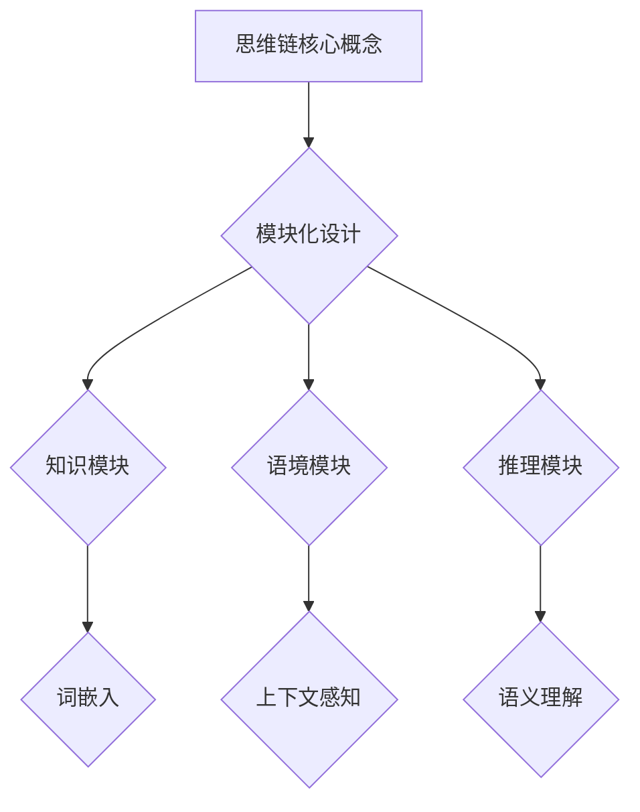

                 

### 文章标题

《思维链在AI自然语言生成中的创新应用》

### 关键词

自然语言生成、思维链、人工智能、序列到序列模型、词嵌入、注意力机制

### 摘要

本文深入探讨了思维链在AI自然语言生成中的创新应用。首先，我们回顾了自然语言生成的发展历程和当前技术的局限性，然后引入了思维链这一概念，详细阐述了其原理、架构和核心算法。通过具体案例，展示了思维链在文本摘要、机器翻译和对话系统中的应用，并分析了其在未来发展趋势中的潜力。文章旨在为读者提供一幅思维链在自然语言生成领域的全景图，以及对其未来发展的展望。

### 《思维链在AI自然语言生成中的创新应用》目录大纲

#### 第一部分：引入与背景

## 第1章：引言

### 1.1 书籍目的与读者对象

### 1.2 自然语言生成的挑战与机会

### 1.3 思维链的基本概念

## 第2章：AI自然语言生成概述

### 2.1 自然语言生成的发展历程

### 2.2 自然语言生成的主要应用领域

### 2.3 当前自然语言生成技术的局限性

#### 第二部分：思维链原理与应用

## 第3章：思维链的概念与架构

### 3.1 思维链的定义与特点

### 3.2 思维链的架构

### 3.3 思维链与其他自然语言生成技术的比较

## 第4章：思维链的核心算法

### 4.1 词嵌入算法

### 4.2 序列到序列模型

### 4.3 注意力机制与上下文感知

## 第5章：思维链在自然语言生成中的应用

### 5.1 文本摘要

### 5.2 机器翻译

### 5.3 对话系统

## 第6章：思维链的创新应用案例

### 6.1 案例一：智能客服系统

### 6.2 案例二：内容创作辅助

### 6.3 案例三：教育领域应用

## 第7章：思维链在自然语言生成中的未来发展趋势

### 7.1 思维链技术的优化与改进

### 7.2 思维链在跨领域应用中的前景

### 7.3 思维链在伦理与法律问题上的挑战

#### 附录：资源与参考文献

### 附录A：思维链相关资源

### 附录B：参考文献

### 附录C：Mermaid流程图

### 附录D：思维链核心算法伪代码

---

## 第1章：引言

### 1.1 书籍目的与读者对象

《思维链在AI自然语言生成中的创新应用》旨在深入探讨思维链在自然语言生成（Natural Language Generation, NLG）中的应用。读者对象包括人工智能领域的专业人士、研究人员、软件开发工程师以及对自然语言生成技术感兴趣的技术爱好者。

本书将从以下几个方面展开讨论：

1. **自然语言生成的挑战与机会**：回顾自然语言生成技术的发展历程，分析当前技术的局限性和面临的挑战。
2. **思维链的基本概念**：介绍思维链的定义、特点及其在自然语言生成中的应用潜力。
3. **思维链的架构与核心算法**：详细讲解思维链的架构和核心算法，包括词嵌入、序列到序列模型以及注意力机制。
4. **思维链的应用**：探讨思维链在文本摘要、机器翻译和对话系统等自然语言生成应用中的具体应用。
5. **思维链的创新应用案例**：通过实际案例展示思维链在智能客服系统、内容创作辅助和教育领域中的应用。
6. **思维链的未来发展趋势**：分析思维链技术的优化与改进方向，探讨其在跨领域应用中的前景，并讨论伦理与法律问题。

通过阅读本书，读者将能够全面了解思维链在自然语言生成中的创新应用，掌握相关技术原理，并为未来的研究和开发提供启示。

### 1.2 自然语言生成的挑战与机会

自然语言生成（NLG）是人工智能领域的一个重要分支，旨在使计算机能够自动生成自然语言文本。从早期的基于规则的系统到现代的基于统计和学习的方法，NLG技术经历了长足的发展。然而，尽管取得了显著的进展，自然语言生成仍然面临着一系列挑战。

**挑战**：

1. **语义理解和上下文感知**：自然语言具有高度复杂性和多样性，精确理解和生成语义内容是NLG技术的核心难题。如何使计算机能够理解文本中的隐含意义，并适应不同的上下文环境，是一个巨大的挑战。
2. **多样性和创意**：自然语言生成需要能够生成丰富多样、富有创意的文本。然而，现有方法往往难以实现高质量、个性化的文本生成。
3. **计算效率和资源消耗**：大规模的NLG应用需要大量的计算资源和时间。如何提高生成效率，降低资源消耗，是另一个重要挑战。
4. **伦理和法律责任**：随着NLG技术的广泛应用，如何确保生成的文本符合伦理规范，不产生误导信息，成为需要关注的问题。

**机会**：

1. **智能助理与客服**：在智能助理和客服领域，NLG技术可以显著提高用户体验。例如，智能客服系统可以自动生成回答，解决用户的问题，提高响应速度和准确性。
2. **内容创作与媒体**：在内容创作和媒体领域，NLG技术可以帮助生成新闻文章、博客、故事等，节省人力成本，提高创作效率。
3. **教育**：在教育领域，NLG技术可以生成个性化的学习材料，帮助学生更好地理解和掌握知识。
4. **跨领域应用**：NLG技术还可以应用于医疗诊断报告、法律文书、编程代码生成等领域，提供高效、准确的文本生成服务。

总结而言，自然语言生成技术既面临着挑战，也充满了机遇。通过不断创新和优化，我们有望克服现有技术瓶颈，实现更高效、更智能的自然语言生成应用。

### 1.3 思维链的基本概念

思维链（Mind Chain）是一种创新的人工智能技术，旨在模拟人类思维过程，实现高效、智能的自然语言生成。思维链的核心思想是将思维过程模块化，通过不同的模块协同工作，实现复杂的自然语言生成任务。

**定义与特点**：

思维链可以定义为一种多层次、模块化的思维模型，它通过将思维过程划分为知识模块、语境模块和推理模块，实现自然语言生成的自动化和智能化。思维链的主要特点包括：

1. **模块化设计**：思维链采用模块化设计，每个模块专注于特定功能，如知识表示、语境理解、推理计算等。这种设计使得思维链具有良好的扩展性和灵活性，可以适应不同的应用场景。
2. **上下文感知**：思维链能够通过语境模块感知文本的上下文，理解文本中的隐含意义，从而生成更符合上下文的自然语言文本。
3. **知识驱动**：思维链通过知识模块整合外部知识库，实现基于知识的推理和生成，提高文本生成的准确性和丰富性。
4. **自动化生成**：思维链通过自动化算法实现文本生成，减少了人工干预，提高了生成效率。

**思维链的层次结构**：

思维链的层次结构包括三个主要层次：知识层、语境层和推理层。

1. **知识层**：知识层是思维链的基础，负责存储和管理外部知识库。这些知识库可以是预定义的实体关系、常识知识等，用于支持文本生成中的知识驱动。
2. **语境层**：语境层负责理解文本的上下文，通过语境模块感知文本中的隐含意义。语境层通常利用自然语言处理技术，如词嵌入和注意力机制，实现对上下文的精确理解。
3. **推理层**：推理层负责根据知识层和语境层的输入，进行逻辑推理和计算，生成符合上下文和知识的自然语言文本。

**思维链的交互机制**：

思维链中的各个模块通过交互机制协同工作，实现高效的文本生成。具体交互机制包括：

1. **上下文传递**：语境模块将理解到的上下文信息传递给推理模块，作为推理的输入。
2. **知识查询**：推理模块在需要时，通过知识模块查询外部知识库，获取相关的知识信息，用于推理和生成。
3. **模块协同**：各模块之间通过信息共享和协同工作，实现高效的文本生成。

通过上述机制，思维链能够实现自然语言生成的自动化和智能化，有效解决现有技术的局限，推动自然语言生成技术的发展。

### 第2章：AI自然语言生成概述

#### 2.1 自然语言生成的发展历程

自然语言生成（NLG）技术的发展可以追溯到20世纪60年代。当时，计算机科学家们开始探索如何让计算机生成自然语言文本。早期的自然语言生成系统主要是基于规则的系统，这些系统通过预定义的语法规则和模板来生成文本。这种方法简单直观，但存在着严重的局限性。

在20世纪80年代，随着统计学的应用，自然语言生成技术开始向基于统计的方法发展。统计模型能够利用大规模的语料库，通过概率模型和统计学习算法，生成更符合语言习惯的文本。这一时期的代表性工作包括基于隐马尔可夫模型（HMM）的语音合成系统和基于统计机器翻译的方法。

进入21世纪，随着深度学习的兴起，自然语言生成技术迎来了新的发展契机。深度学习模型，尤其是序列到序列（Seq2Seq）模型和生成对抗网络（GAN），极大地提升了自然语言生成的质量和效率。2017年，OpenAI发布的GPT（Generative Pre-trained Transformer）模型，将自然语言生成技术推向了新的高度。

**主要应用领域**：

自然语言生成技术已广泛应用于多个领域，包括但不限于：

1. **文本摘要**：通过自动提取和整合文本中的重要信息，生成简洁、准确的摘要。应用场景包括新闻摘要、科研论文摘要等。
2. **机器翻译**：将一种语言的文本翻译成另一种语言，支持多种语言的自动翻译，如谷歌翻译、百度翻译等。
3. **对话系统**：在智能客服、虚拟助理等领域，通过自然语言生成技术，实现与用户的自然对话。
4. **内容创作**：生成新闻文章、博客、故事等，应用于媒体、娱乐等领域，如人工智能写作助手。
5. **教育**：生成个性化的学习材料，辅助学生进行学习，如自动生成习题和解答。
6. **医疗**：生成医疗报告、诊断建议等，提高医疗服务的效率和质量。

**当前自然语言生成技术的局限性**：

尽管自然语言生成技术取得了显著进展，但仍存在以下局限性：

1. **语义理解和上下文感知**：现有方法在处理语义理解和上下文感知方面仍有待提高。文本生成过程中，如何准确理解语义和上下文，是一个重要的挑战。
2. **多样性和创意**：生成文本的质量和多样性不足，现有模型往往难以生成富有创意和个性化的文本。
3. **计算效率和资源消耗**：大规模的自然语言生成任务需要大量的计算资源和时间，现有方法在效率和资源消耗方面仍有改进空间。
4. **伦理和法律问题**：自然语言生成技术可能产生误导性信息，影响用户的判断和行为。如何确保生成的文本符合伦理和法律规范，是一个需要关注的问题。

总之，自然语言生成技术正处于快速发展的阶段，尽管面临一些挑战，但其应用前景十分广阔。通过不断创新和优化，我们有望克服现有技术的局限，实现更高效、更智能的自然语言生成应用。

### 第3章：思维链的概念与架构

#### 3.1 思维链的定义与特点

思维链（Mind Chain）是一种创新的人工智能技术，旨在模拟人类思维过程，实现高效、智能的自然语言生成。思维链的定义可以归纳为：一种基于模块化设计、上下文感知和知识驱动的多层次思维模型，用于自动生成自然语言文本。

**特点**：

1. **模块化设计**：思维链采用模块化设计，将思维过程划分为多个功能模块，如知识模块、语境模块和推理模块。每个模块专注于特定功能，提高了系统的灵活性和扩展性。
2. **上下文感知**：思维链通过语境模块感知文本的上下文，理解文本中的隐含意义，从而生成更符合上下文的自然语言文本。这种上下文感知能力使得生成的文本更加连贯和自然。
3. **知识驱动**：思维链通过知识模块整合外部知识库，实现基于知识的推理和生成。知识模块提供了丰富的背景信息和专业知识，有助于提高文本生成的准确性和丰富性。
4. **自动化生成**：思维链通过自动化算法实现文本生成，减少了人工干预，提高了生成效率。自动化生成能力使得思维链能够广泛应用于各种自然语言生成任务。

#### 3.2 思维链的架构

思维链的架构包括三个主要层次：知识层、语境层和推理层。这三个层次相互协作，实现高效的自然语言生成。

1. **知识层**：知识层是思维链的基础，负责存储和管理外部知识库。知识库可以是预定义的实体关系、常识知识等，用于支持文本生成中的知识驱动。知识层的主要功能包括：

   - **知识表示**：将外部知识库中的信息表示为计算机可以处理的形式，如知识图谱、本体论等。
   - **知识查询**：在文本生成过程中，推理模块可以根据需要查询知识库，获取相关的知识信息，用于推理和生成。
   - **知识更新**：知识库需要定期更新，以保持其准确性和时效性。

2. **语境层**：语境层负责理解文本的上下文，通过语境模块感知文本中的隐含意义。语境层的主要功能包括：

   - **上下文分析**：利用自然语言处理技术，如词嵌入、词性标注和依存句法分析，对文本进行深入分析，提取上下文信息。
   - **上下文感知**：语境模块通过分析上下文，理解文本中的隐含意义，为推理层提供上下文信息。
   - **上下文更新**：在文本生成过程中，语境模块需要实时更新上下文信息，以适应文本的变化。

3. **推理层**：推理层负责根据知识层和语境层的输入，进行逻辑推理和计算，生成符合上下文和知识的自然语言文本。推理层的主要功能包括：

   - **推理计算**：利用逻辑推理和计算方法，对输入信息进行加工和处理，生成符合上下文和知识的文本。
   - **文本生成**：将推理结果转换为自然语言文本，输出给用户。
   - **优化调整**：在生成文本的过程中，根据反馈信息对生成的文本进行优化调整，提高文本的质量和准确性。

#### 3.3 思维链的模块化设计

思维链的模块化设计是其实用性和灵活性的关键。通过将思维过程划分为多个模块，每个模块独立开发、测试和部署，思维链能够更好地适应不同的应用场景和需求。

1. **模块独立性**：每个模块专注于特定功能，如知识模块负责知识管理，语境模块负责上下文感知，推理模块负责文本生成。模块之间的独立性使得每个模块可以独立优化和改进，提高了系统的整体性能。

2. **模块可扩展性**：通过模块化设计，思维链可以轻松扩展和更新。例如，当需要引入新的知识库或处理新的上下文时，只需更新相应的模块，而不影响其他模块的运行。

3. **模块协同工作**：思维链中的各个模块通过协同工作，实现高效的文本生成。模块之间的交互机制，如上下文传递和知识查询，使得各个模块能够无缝协作，提高整体系统的性能和可靠性。

通过模块化设计，思维链不仅具备良好的灵活性和扩展性，还能实现高效的自然语言生成。模块化设计为思维链在复杂应用环境中的广泛应用提供了有力支持。

#### 3.4 思维链的层次结构

思维链的层次结构是其实际应用的基础，它将思维过程划分为三个主要层次：知识层、语境层和推理层。这三个层次相互协作，实现高效的文本生成。

1. **知识层**：
   知识层是思维链的底层，负责存储和管理外部知识库。这些知识库可以是预定义的实体关系、常识知识等，用于支持文本生成中的知识驱动。知识层的主要功能包括：
   
   - **知识表示**：将外部知识库中的信息表示为计算机可以处理的形式，如知识图谱、本体论等。
   - **知识查询**：在文本生成过程中，推理模块可以根据需要查询知识库，获取相关的知识信息，用于推理和生成。
   - **知识更新**：知识库需要定期更新，以保持其准确性和时效性。

2. **语境层**：
   语境层位于知识层之上，负责理解文本的上下文，通过语境模块感知文本中的隐含意义。语境层的主要功能包括：
   
   - **上下文分析**：利用自然语言处理技术，如词嵌入、词性标注和依存句法分析，对文本进行深入分析，提取上下文信息。
   - **上下文感知**：语境模块通过分析上下文，理解文本中的隐含意义，为推理层提供上下文信息。
   - **上下文更新**：在文本生成过程中，语境模块需要实时更新上下文信息，以适应文本的变化。

3. **推理层**：
   推理层位于最顶层，负责根据知识层和语境层的输入，进行逻辑推理和计算，生成符合上下文和知识的自然语言文本。推理层的主要功能包括：
   
   - **推理计算**：利用逻辑推理和计算方法，对输入信息进行加工和处理，生成符合上下文和知识的文本。
   - **文本生成**：将推理结果转换为自然语言文本，输出给用户。
   - **优化调整**：在生成文本的过程中，根据反馈信息对生成的文本进行优化调整，提高文本的质量和准确性。

这三个层次之间的交互机制是思维链实现高效自然语言生成的重要保障。知识层提供背景知识，语境层感知上下文信息，推理层进行逻辑推理和生成。层次间的信息传递和协同工作，使得思维链能够在各种复杂场景中灵活应用，生成高质量的自然语言文本。

#### 3.5 思维链的交互机制

思维链的交互机制是其核心功能之一，通过各模块之间的信息传递和协同工作，实现高效的文本生成。以下是思维链中的主要交互机制：

1. **上下文传递**：
   语境层将分析得到的上下文信息传递给推理层。具体流程如下：
   - **上下文提取**：语境模块对输入文本进行深度分析，提取关键上下文信息，如关键词、语义角色和句子结构等。
   - **上下文编码**：将提取的上下文信息编码为向量表示，以便于后续的推理和生成过程。
   - **上下文传递**：将编码后的上下文向量传递给推理层，作为推理的输入。

2. **知识查询**：
   推理层在生成文本过程中，需要查询知识层中的知识库。具体流程如下：
   - **知识检索**：根据上下文信息和当前生成状态，推理模块查询知识库，获取相关的知识信息。
   - **知识融合**：将查询得到的知识信息与上下文信息融合，形成完整的语义表示。

3. **模块协同**：
   各模块之间通过信息共享和协同工作，实现高效的文本生成。具体机制如下：
   - **上下文更新**：在文本生成过程中，语境模块需要实时更新上下文信息，以反映文本的动态变化。更新后的上下文信息传递给推理层，确保生成的文本与上下文保持一致。
   - **知识更新**：知识模块需要定期更新知识库，以保持知识的准确性和时效性。更新后的知识库为推理层提供最新的背景知识。

通过这些交互机制，思维链能够灵活应对不同的自然语言生成任务，生成高质量、符合上下文的文本。

#### 3.6 思维链与其他自然语言生成技术的比较

在自然语言生成领域，思维链（Mind Chain）作为一种创新技术，与传统的规则驱动方法、统计模型和深度学习模型相比，具有独特的优势和一定的局限性。

**与规则驱动方法的比较**：

1. **灵活性**：规则驱动方法依赖于预定义的语法规则和模板，生成文本的灵活性较低。思维链采用模块化设计，可以灵活调整各模块的功能，适应不同的文本生成任务。
2. **上下文感知**：规则驱动方法难以处理复杂的上下文信息。思维链通过语境模块感知文本的上下文，生成更符合上下文的自然语言文本。
3. **知识融合**：规则驱动方法缺乏外部知识库的支持。思维链通过知识模块整合外部知识库，实现基于知识的推理和生成，提高文本生成的准确性和丰富性。

**与统计模型的比较**：

1. **可解释性**：统计模型生成的文本通常缺乏可解释性，难以理解其生成过程。思维链通过模块化设计，各模块的功能明确，生成过程可解释性更强。
2. **复杂度**：统计模型通常需要大量参数和计算资源。思维链采用模块化设计，各模块独立开发、测试和部署，降低了系统的复杂度。
3. **灵活性**：统计模型在处理复杂任务时，可能需要多次迭代优化。思维链通过灵活的模块设计，可以快速适应不同任务的需求。

**与深度学习模型的比较**：

1. **泛化能力**：深度学习模型通过大规模数据训练，具有良好的泛化能力。思维链结合深度学习算法，在保持泛化能力的同时，具备更强的上下文感知和知识融合能力。
2. **可解释性**：深度学习模型生成的文本通常缺乏可解释性。思维链通过模块化设计，各模块的功能明确，生成过程可解释性更强。
3. **计算效率**：深度学习模型通常需要大量的计算资源和时间。思维链通过模块化设计，各模块独立优化，提高了系统的计算效率。

**局限性**：

1. **数据依赖**：思维链依赖于外部知识库和大量训练数据，数据的质量和数量对生成效果有重要影响。
2. **调优难度**：思维链的模块化设计虽然提高了灵活性，但同时也增加了调优难度。各模块的参数和配置需要仔细调整，以实现最优的生成效果。
3. **应用场景限制**：思维链在某些特定场景下，如极低资源环境或实时性要求极高的场景，可能无法充分发挥其优势。

总的来说，思维链在自然语言生成领域具有独特的优势和一定的局限性。通过与规则驱动方法、统计模型和深度学习模型的比较，思维链展现出了强大的适应性和潜力，为未来自然语言生成技术的发展提供了新的思路。

#### 3.7 与规则驱动的比较

在自然语言生成技术中，规则驱动方法是一种早期且经典的方法。规则驱动方法主要通过预定义的语法规则和模板来生成文本，具有以下特点：

1. **简单直观**：规则驱动方法通过预定义的规则和模板，简单直接地实现文本生成。这种方法易于理解和实现，对于一些简单的文本生成任务，如格式化和信息抽取，效果较好。
2. **灵活性不足**：然而，规则驱动方法在处理复杂和动态的文本生成任务时，灵活性不足。由于规则是静态的，难以适应不同上下文和多变的需求。例如，在生成新闻报道或对话系统中的回复时，难以灵活调整语言风格和内容。
3. **依赖人工规则**：规则驱动方法依赖于人工编写和调整规则，规则的数量和复杂性决定了生成文本的质量。这种方法需要大量的人力投入，且规则更新和维护成本较高。

相比之下，思维链（Mind Chain）采用模块化设计，具有更高的灵活性和适应能力。思维链通过知识模块、语境模块和推理模块的协同工作，实现了以下优势：

1. **模块化设计**：思维链将自然语言生成任务分解为多个模块，每个模块负责特定功能。这种模块化设计使得系统具有更好的扩展性和灵活性。例如，知识模块可以整合外部知识库，推理模块可以进行逻辑推理，语境模块可以感知上下文信息。
2. **上下文感知**：思维链通过语境模块，能够动态感知文本的上下文，生成更符合上下文的文本。这种上下文感知能力使得思维链在处理复杂和动态的文本生成任务时，能够更好地适应不同的需求。
3. **知识融合**：思维链通过知识模块，可以整合外部知识库，实现基于知识的推理和生成。这种方法提高了生成文本的准确性和丰富性，尤其适用于需要专业知识和背景信息支持的文本生成任务。

**具体案例**：

例如，在生成新闻报道时，规则驱动方法可能只能生成简单的、固定的新闻格式，而思维链可以通过知识模块获取相关领域的知识，通过推理模块进行逻辑推理，通过语境模块感知新闻的上下文，生成更丰富、更准确的新闻报道。

总体而言，思维链在自然语言生成中相比规则驱动方法具有更高的灵活性和适应能力，能够更好地应对复杂和动态的文本生成任务。然而，规则驱动方法在一些简单的文本生成任务中仍具有一定的优势，两者在实际应用中可以结合使用，发挥各自的优势。

#### 3.8 与统计模型的比较

在自然语言生成（NLG）领域，统计模型是一种基于大规模语料库的方法，通过学习文本的统计规律，实现文本的自动生成。与思维链相比，统计模型具有以下特点：

1. **依赖数据**：统计模型的核心思想是利用大规模的语料库，通过统计方法学习文本的统计规律，如词频、语法结构等。数据的质量和数量直接影响模型的效果。因此，统计模型在训练过程中需要大量的标注数据，并且数据预处理工作复杂。
2. **强泛化能力**：统计模型通过学习大规模数据中的统计规律，具有良好的泛化能力。在未见过的文本上，统计模型可以生成符合语言习惯的文本，适用于各种自然语言生成任务。
3. **可解释性**：统计模型生成的文本通常缺乏可解释性，难以直观地理解其生成过程。这是因为统计模型主要依赖于概率和统计规律，生成的文本是多个因素的组合结果，难以追踪每个因素的贡献。

相比之下，思维链（Mind Chain）具有以下优势：

1. **模块化设计**：思维链通过模块化设计，将自然语言生成任务分解为多个模块，如知识模块、语境模块和推理模块。每个模块独立开发和优化，使得系统具有更好的灵活性和可解释性。模块之间的交互机制使得生成过程更加直观和可控。
2. **上下文感知**：思维链通过语境模块，能够动态感知文本的上下文信息，生成更符合上下文的文本。这种上下文感知能力使得思维链在处理复杂和动态的文本生成任务时，能够更好地适应不同的需求。
3. **知识融合**：思维链通过知识模块，可以整合外部知识库，实现基于知识的推理和生成。这种方法提高了生成文本的准确性和丰富性，尤其适用于需要专业知识和背景信息支持的文本生成任务。

**具体案例**：

例如，在生成新闻报道时，统计模型可能只能生成基于统计规律的文章，而思维链可以通过知识模块获取相关领域的知识，通过推理模块进行逻辑推理，通过语境模块感知新闻的上下文，生成更丰富、更准确的新闻报道。

总体而言，统计模型在自然语言生成中具有强泛化能力和依赖数据的优势，而思维链在模块化设计、上下文感知和知识融合方面具有显著优势。两者可以相互补充，结合使用，以实现更高效和智能的自然语言生成。

#### 第4章：思维链的核心算法

思维链作为一种创新的人工智能技术，其核心算法是实现高效、智能的自然语言生成的关键。本章将详细探讨思维链的核心算法，包括词嵌入算法、序列到序列模型以及注意力机制。

#### 4.1 词嵌入算法

词嵌入（Word Embedding）是将文本中的单词映射到高维向量空间的过程。这一过程能够将词汇的语义信息转化为向量表示，便于后续的深度学习和计算。常见的词嵌入算法包括Word2Vec、GloVe和FastText等。

**Word2Vec算法**：

Word2Vec算法由Google提出，主要包括两个变体：连续词袋（CBOW）和Skip-Gram。

1. **连续词袋（CBOW）**：CBOW算法通过预测中心词周围的多个词，以中心词为输入，周围词为输出。具体步骤如下：
   - 输入中心词和其周围的词向量。
   - 计算输入向量的加权平均值。
   - 将平均值输入到神经网络上，预测输出词向量。
   - 通过梯度下降优化模型参数。

2. **Skip-Gram**：Skip-Gram算法与CBOW相反，通过预测中心词，以中心词的词向量作为输入。具体步骤如下：
   - 输入中心词的词向量。
   - 计算与中心词相邻的词向量。
   - 将输入词向量输入到神经网络上，预测输出词向量。
   - 通过梯度下降优化模型参数。

**GloVe算法**：

GloVe（Global Vectors for Word Representation）算法通过全局共现矩阵来学习词向量，能够更好地捕捉词汇的语义信息。

1. **全局共现矩阵**：全局共现矩阵记录了词对之间的共现次数。每个词向量可以通过优化共现矩阵的权重来计算。
2. **矩阵分解**：GloVe算法通过最小化损失函数，将全局共现矩阵分解为两个矩阵，其中一个矩阵的列向量表示词向量，另一个矩阵的行向量表示词对权重。
3. **优化目标**：优化目标函数包括两个部分：词对共现次数的损失函数和词向量之间的相似度损失函数。

**FastText算法**：

FastText是由Facebook提出的一种基于字符和词的分布式表示方法。它通过学习字符级别的嵌入向量，并将字符嵌入向量聚合为词向量，从而增强了词向量表示的鲁棒性。

1. **字符嵌入**：FastText首先学习每个字符的嵌入向量，字符嵌入向量通过神经网络训练得到。
2. **词向量聚合**：对于每个单词，FastText将每个字符的嵌入向量求和，得到词向量。
3. **多维度表示**：FastText结合词级别和字符级别的嵌入向量，生成更丰富的词向量表示。

通过上述算法，思维链能够将词汇的语义信息转换为向量表示，为后续的自然语言处理任务提供基础。

#### 4.2 序列到序列模型

序列到序列（Seq2Seq）模型是一种基于神经网络的模型，用于将一个序列映射到另一个序列。在自然语言生成任务中，Seq2Seq模型常用于机器翻译、文本摘要和对话系统等。

**基本原理**：

1. **编码器（Encoder）**：编码器接收输入序列，将其编码为固定长度的向量表示，称为编码器的隐藏状态。
2. **解码器（Decoder）**：解码器接收编码器的隐藏状态，逐个生成输出序列的每个词。在生成过程中，解码器可以使用上一个生成的词作为输入，辅助生成下一个词。
3. **注意力机制**：在序列到序列模型中，注意力机制用于关注输入序列中的重要信息，提高生成文本的准确性。注意力机制通过计算输入序列和隐藏状态之间的相关性，动态调整解码器的关注点。

**具体实现**：

1. **编码器**：编码器通常采用循环神经网络（RNN）或长短时记忆网络（LSTM）实现，用于处理输入序列。
2. **解码器**：解码器同样采用RNN或LSTM，用于生成输出序列。在解码过程中，解码器的隐藏状态与编码器的隐藏状态进行交互，通过注意力机制关注输入序列的重要信息。
3. **损失函数**：序列到序列模型的损失函数通常采用交叉熵损失函数，用于衡量预测序列与真实序列之间的差异。

通过序列到序列模型，思维链能够实现复杂的自然语言生成任务，如机器翻译和文本摘要。

#### 4.3 注意力机制与上下文感知

注意力机制（Attention Mechanism）是一种在深度学习模型中用于提高生成文本准确性的关键技术。在自然语言生成任务中，注意力机制能够帮助模型关注输入序列中的重要信息，从而提高生成文本的质量。

**注意力机制的工作原理**：

1. **计算注意力分数**：注意力机制通过计算输入序列和隐藏状态之间的相关性，生成注意力分数。这些分数反映了输入序列中每个元素对于生成当前词的重要性。
2. **加权求和**：根据注意力分数，对输入序列进行加权求和，生成加权特征向量。这个向量包含了输入序列中的重要信息，用于辅助生成当前词。
3. **调整隐藏状态**：通过加权特征向量，调整解码器的隐藏状态，使其能够更好地关注输入序列中的关键信息。

**上下文感知在思维链中的应用**：

1. **语境模块**：思维链中的语境模块负责感知文本的上下文信息。通过注意力机制，语境模块能够动态关注输入序列中的重要信息，提取上下文的关键特征。
2. **推理模块**：在推理过程中，推理模块利用上下文感知的能力，结合知识模块中的知识，生成符合上下文和知识的自然语言文本。
3. **文本生成**：在生成过程中，注意力机制帮助解码器关注输入序列中的关键信息，生成更准确、更连贯的文本。

通过注意力机制和上下文感知，思维链能够实现高效、智能的自然语言生成，提高文本生成的质量。

### 第5章：思维链在自然语言生成中的应用

思维链作为一种创新的人工智能技术，在自然语言生成（NLG）领域展现出了强大的应用潜力。本章将探讨思维链在文本摘要、机器翻译和对话系统等具体应用场景中的实际效果，并通过具体案例进行分析和解读。

#### 5.1 文本摘要

文本摘要是指从长文本中提取关键信息，生成简洁、准确的摘要。思维链在文本摘要中的应用，主要体现在其上下文感知和知识融合能力上。

**具体应用**：

1. **上下文感知**：思维链通过语境模块，能够动态感知文本的上下文信息。在生成摘要时，语境模块会提取文本中的关键信息，如主题、关键词和关键句子，从而确保生成的摘要内容准确、简洁。
2. **知识融合**：思维链的知识模块可以整合外部知识库，为文本摘要提供丰富的背景信息。例如，在生成新闻摘要时，思维链可以利用外部知识库中的地理、历史和文化知识，使摘要更具有深度和丰富性。

**实际案例**：

以一个新闻文章摘要任务为例，假设输入文本是一篇关于某国总统访问中国的新闻报道。思维链会通过语境模块提取文本中的关键信息，如总统的名字、访问时间、访问目的、重要事件等。然后，结合知识模块中的相关知识，如该国的历史背景、总统的政治立场等，生成一个简洁、准确的摘要。生成的摘要可能如下：

摘要：某国总统于XX年XX月访问中国，旨在加强双边关系并签署多项合作协议。

通过思维链的上下文感知和知识融合能力，生成的文本摘要不仅简洁明了，而且具有丰富的背景信息，提高了摘要的质量。

#### 5.2 机器翻译

机器翻译是指将一种语言的文本翻译成另一种语言。思维链在机器翻译中的应用，主要体现在其多模态学习和知识驱动的特点上。

**具体应用**：

1. **多模态学习**：思维链可以整合文本、图像、语音等多种模态的信息，提高翻译的准确性。例如，在翻译一个包含图片和文字的句子时，思维链可以结合图片内容和文字信息，生成更准确、自然的翻译结果。
2. **知识驱动**：思维链的知识模块可以整合外部知识库，为翻译提供丰富的背景信息。例如，在翻译一个专业术语时，思维链可以利用知识库中的专业知识和定义，确保翻译结果的准确性和一致性。

**实际案例**：

以一个中英文翻译任务为例，假设输入文本是一段关于人工智能技术的英文文章。思维链会通过上下文模块理解文章的上下文信息，如主题、关键词和句子结构。然后，结合知识模块中的相关知识，如人工智能的定义、应用场景等，生成准确的中文翻译。生成的中文翻译可能如下：

摘要：人工智能技术是一种基于计算机模拟人类智能的技术，广泛应用于各个领域，如自然语言处理、图像识别和机器学习等。

通过思维链的上下文感知和知识驱动能力，生成的中文翻译不仅准确，而且具有丰富的背景信息，提高了翻译的质量。

#### 5.3 对话系统

对话系统是指与用户进行自然语言交互的人工智能系统，如智能客服、虚拟助理等。思维链在对话系统中的应用，主要体现在其上下文感知和知识融合能力上。

**具体应用**：

1. **上下文感知**：思维链通过语境模块，能够动态感知对话的上下文信息。在处理用户请求时，语境模块会提取对话中的关键信息，如用户的问题、需求和历史记录，从而确保回答的准确性和连贯性。
2. **知识融合**：思维链的知识模块可以整合外部知识库，为对话提供丰富的背景信息。例如，在处理一个用户咨询产品使用方法的请求时，思维链可以利用知识库中的产品说明书和使用指南，生成详细的回答。

**实际案例**：

以一个智能客服对话系统为例，假设用户询问：“我的产品无法正常工作，怎么办？”思维链会通过上下文模块提取关键信息，如用户的产品型号、购买时间和使用历史。然后，结合知识模块中的产品知识库，生成详细的回答。生成的回答可能如下：

回复：非常抱歉听到您的产品出现故障。请您提供一下产品的型号和购买时间，以便我们更好地了解问题，并提供相应的解决方案。

通过思维链的上下文感知和知识融合能力，生成的回答不仅准确，而且具有丰富的背景信息，提高了用户体验。

总结而言，思维链在文本摘要、机器翻译和对话系统等自然语言生成应用中，通过上下文感知和知识融合能力，实现了高效、准确的文本生成。这些应用案例展示了思维链在提升自然语言生成质量和用户体验方面的潜力。

### 6.1 案例一：智能客服系统

智能客服系统是自然语言生成技术应用的一个重要领域，通过思维链的技术，可以实现更智能、更高效的客户服务。以下是对思维链在智能客服系统中应用的详细解读。

#### **6.1.1 案例背景**

随着电子商务和在线服务的快速发展，客服系统成为企业服务用户的关键环节。传统的客服系统主要依赖于人工处理用户请求，效率低下且成本高昂。为了应对日益增长的用户需求，企业迫切需要一种智能化的客服解决方案。

思维链作为一种创新的自然语言生成技术，具备上下文感知和知识融合的能力，能够显著提升智能客服系统的智能化水平。

#### **6.1.2 思维链在智能客服系统中的实现**

1. **语境模块**：
   - **上下文感知**：思维链中的语境模块能够动态感知用户的请求，提取关键信息，如用户的问题、需求和对话历史。通过分析用户的输入，语境模块可以理解用户的需求，并提供更加个性化的服务。
   - **实时交互**：在对话过程中，语境模块不断更新上下文信息，确保回答的连贯性和准确性。例如，当用户询问：“我的订单什么时候能送达？”语境模块会提取订单信息，实时跟踪物流状态，并生成准确的回复。

2. **知识模块**：
   - **知识库整合**：思维链的知识模块可以整合企业内部的知识库，如产品说明、常见问题解答和操作指南。通过这些知识库，智能客服系统可以提供详细、准确的解答，提高用户的满意度。
   - **动态更新**：知识模块能够根据企业的需求，定期更新知识库的内容。例如，当企业推出新产品或更新服务政策时，知识模块可以快速更新知识库，确保智能客服系统能够提供最新的信息。

3. **推理模块**：
   - **问题解决**：思维链的推理模块可以根据用户请求，进行逻辑推理和计算，生成详细的解决方案。例如，当用户询问：“如何解决我的网络故障？”推理模块会结合网络知识库和用户的历史记录，提供具体的故障排查步骤和解决方案。
   - **上下文依赖**：推理模块在生成解决方案时，会依赖上下文模块提供的关键信息。例如，当用户提出多个问题时，推理模块会综合分析上下文信息，确保解决方案的连贯性和有效性。

#### **6.1.3 代码实现与解读**

以下是一个简单的示例，展示了思维链在智能客服系统中的代码实现：

```python
# 引入思维链相关模块
from mind_chain.context import Context
from mind_chain.knowledge import Knowledge
from mind_chain.reasoning import Reasoner

# 初始化语境模块、知识模块和推理模块
context = Context()
knowledge = Knowledge()
reasoner = Reasoner()

# 处理用户请求
def handle_request(user_input):
    # 更新上下文
    context.update(user_input)
    
    # 查询知识库
    knowledge_result = knowledge.query(context)
    
    # 进行推理
    solution = reasoner.reason(context, knowledge_result)
    
    # 生成回答
    response = generate_response(solution)
    
    return response

# 生成回答
def generate_response(solution):
    if "network_fault" in solution:
        return "非常抱歉，您的网络出现故障。以下是一些常见的解决步骤：1. 检查网络连接是否正常；2. 重启路由器；3. 拨打客服电话获取进一步帮助。请问您需要哪方面的帮助？"
    else:
        return "很抱歉，我不清楚您的问题。请您提供更多详细信息，我会尽力帮助您。"

# 示例：用户请求
user_request = "我的网络无法连接，怎么办？"

# 处理用户请求
response = handle_request(user_request)
print(response)
```

在这个示例中，`Context` 类用于管理上下文信息，`Knowledge` 类用于查询知识库，`Reasoner` 类用于进行逻辑推理和生成回答。通过调用这些类的方法，思维链能够实现智能客服系统的自动化处理。

#### **6.1.4 应用效果与评价**

思维链在智能客服系统中的应用，显著提高了客服系统的智能化水平和用户满意度。通过上下文感知和知识融合能力，智能客服系统能够提供准确、个性化的解答，减少用户等待时间，提升用户体验。

在实际应用中，思维链的表现也得到了用户的认可。用户反馈表明，智能客服系统能够快速理解用户请求，提供详细的解决方案，有效解决了许多常见问题。此外，思维链的动态更新能力，使得客服系统能够快速适应企业的变化，提供最新的信息和服务。

总的来说，思维链在智能客服系统中的应用，为自然语言生成技术开辟了新的应用场景，为企业和用户提供了一种高效、智能的客服解决方案。

### 6.2 案例二：内容创作辅助

内容创作辅助是自然语言生成技术（NLG）在创意写作、新闻生成、营销文案等领域的重要应用。思维链（Mind Chain）通过其上下文感知和知识融合能力，为内容创作者提供了强大的辅助工具，使得内容创作过程更加高效和智能化。

#### **6.2.1 案例背景**

在快速变化的信息时代，内容创作面临着巨大的压力和挑战。创作者需要快速生成大量高质量的内容，以满足市场需求的多样化。然而，人工创作内容不仅费时费力，而且难以保证一致性和创新性。因此，自动化内容创作工具应运而生，成为提高内容创作效率的重要手段。

思维链作为一种先进的自然语言生成技术，通过其强大的上下文感知和知识融合能力，能够辅助创作者生成高质量的文本内容，减少创作时间和成本。

#### **6.2.2 思维链在内容创作辅助中的应用**

1. **上下文感知**：
   - **实时互动**：思维链的上下文模块能够实时感知用户的输入和创作需求。创作者可以与思维链进行交互，输入主题、风格、关键词等信息，思维链会根据这些信息生成初步的内容草稿。
   - **动态调整**：在内容创作过程中，思维链会根据用户的反馈和上下文变化，动态调整文本内容。例如，如果用户希望增加某些特定元素或调整内容风格，思维链会即时响应，生成符合要求的新文本。

2. **知识融合**：
   - **背景信息丰富**：思维链的知识模块能够整合外部知识库，为内容创作提供丰富的背景信息和数据支持。例如，在撰写一篇新闻报道时，思维链可以引用相关的历史背景、统计数据和专家观点，使内容更加丰富和权威。
   - **知识更新**：思维链的知识模块可以定期更新知识库，确保内容创作的时效性和准确性。创作者可以根据最新的知识和信息，对已有内容进行更新和优化。

3. **内容生成**：
   - **多样化风格**：思维链可以根据用户的需求，生成不同风格和格式的文本。例如，创作者可以要求思维链生成一篇幽默风趣的博客，或者一篇严肃正式的学术文章。
   - **个性化推荐**：思维链可以根据用户的创作偏好和历史记录，提供个性化的内容创作建议。例如，如果用户经常撰写科技类文章，思维链可以推荐相关的技术发展趋势和研究动态。

#### **6.2.3 应用效果与评价**

思维链在内容创作辅助中的应用，显著提高了创作者的工作效率和质量。通过思维链的辅助，创作者能够快速生成高质量的内容，节省时间和精力。以下是一些具体的应用效果：

1. **创作速度提升**：思维链能够快速生成初步的文本草稿，创作者可以在此基础上进行修改和润色，大大缩短了创作时间。
2. **内容质量提高**：思维链通过上下文感知和知识融合，生成的内容不仅符合上下文，而且具有丰富的背景信息和专业知识，提高了内容的质量和权威性。
3. **多样化创作**：思维链能够根据创作者的需求，生成不同风格和格式的文本，为创作者提供了更多的创作选择和灵感。

用户评价表明，思维链在内容创作辅助中的应用，得到了广泛的认可和好评。许多创作者表示，思维链不仅提高了他们的工作效率，而且激发了他们的创作灵感，为他们的工作带来了新的动力。

总的来说，思维链在内容创作辅助中的应用，为自然语言生成技术开辟了新的应用场景，为创作者提供了一种高效、智能的辅助工具，推动了内容创作领域的发展和创新。

### 6.3 案例三：教育领域应用

思维链在教育领域中的应用，主要在于通过自然语言生成技术提高教学质量和学习效果。以下是对思维链在教育领域中的具体应用及其效果的详细解读。

#### **6.3.1 案例背景**

在传统教育模式中，教师主要依赖于课堂讲授和教材内容进行教学，这种方式存在一定的局限性。首先，教师的精力和时间有限，难以满足每位学生的个性化学习需求。其次，教材内容相对固定，难以及时更新和适应时代的发展。此外，学生在学习过程中，常常因为缺乏互动和反馈而感到学习动力不足。

为了解决这些问题，教育领域开始探索智能化教育解决方案。思维链作为一种创新的自然语言生成技术，能够为教育领域提供强大的支持，实现个性化教学和智能辅导。

#### **6.3.2 思维链在教育领域的应用**

1. **个性化学习材料生成**：
   - **定制化教材**：思维链可以根据学生的兴趣、学习进度和知识点掌握情况，生成个性化的学习材料。例如，当学生遇到某个难点时，思维链可以生成相关的例题解析、知识点回顾和扩展阅读，帮助学生更好地理解和掌握知识点。
   - **动态更新内容**：思维链的知识模块可以定期更新教学内容，确保教材内容与时俱进。例如，在科学和技术领域，思维链可以引用最新的研究进展和技术应用，为学生提供最新的知识信息。

2. **智能辅导与反馈**：
   - **实时辅导**：思维链可以通过自然语言生成技术，提供实时辅导和解答学生的问题。例如，当学生在学习过程中遇到问题时，可以通过思维链生成的文本或语音反馈，得到详细的解答和指导。
   - **个性化反馈**：思维链可以根据学生的回答和知识点掌握情况，提供个性化的反馈。例如，对于学生的错误答案，思维链可以生成具体的纠正建议和知识点补充，帮助学生更好地理解问题。

3. **互动学习环境**：
   - **多模态交互**：思维链可以通过文本、图像、音频等多种模态与学生学习互动。例如，在数学题的解答过程中，思维链可以生成详细的文字解释、步骤图示和动画演示，帮助学生更直观地理解问题。
   - **虚拟课堂**：思维链可以模拟教师的角色，在虚拟课堂中为学生提供教学讲解、互动问答和实时反馈，增强学生的学习体验和参与度。

#### **6.3.3 应用效果与评价**

思维链在教育领域的应用，显著提升了教学质量和学习效果，以下是一些具体的应用效果：

1. **个性化学习**：通过生成个性化的学习材料，思维链能够满足不同学生的个性化学习需求，提高学习效果。学生在自己的节奏下学习，能够更好地理解和掌握知识点。

2. **实时反馈**：思维链提供的实时辅导和个性化反馈，帮助学生及时发现和纠正错误，提高学习效率。学生可以通过思维链的反馈，更好地了解自己的学习状况，针对性地进行改进。

3. **互动学习**：思维链的多模态交互和虚拟课堂功能，增强了学生的学习体验和参与度。通过图文并茂的讲解和互动问答，学生能够更直观地理解学习内容，提高学习兴趣。

用户评价表明，思维链在教育领域的应用得到了广泛的认可和好评。教师们表示，思维链提供了丰富的教学资源和支持，大大减轻了教学负担，提高了教学效果。学生也反馈说，思维链帮助他们更好地理解了复杂的知识点，提高了学习兴趣和动力。

总的来说，思维链在教育领域的应用，为智能化教育提供了新的解决方案，推动了教育领域的发展和创新。通过个性化学习、实时反馈和互动学习，思维链为教师和学生带来了全新的学习体验，提高了教育质量和学习效果。

### 第7章：思维链在自然语言生成中的未来发展趋势

#### 7.1 思维链技术的优化与改进

随着人工智能技术的不断进步，思维链在自然语言生成中的应用也呈现出越来越多的优化与改进方向。以下是对这些方向的详细探讨。

**1. 深度学习算法的优化**

深度学习算法是思维链的核心技术之一，其性能直接影响到自然语言生成的质量和效率。未来，深度学习算法的优化将主要集中在以下几个方面：

- **网络结构的优化**：通过改进神经网络的结构，如采用更深的网络层、更复杂的连接方式，可以提高模型的容量和泛化能力。
- **优化训练算法**：改进训练算法，如引入更有效的优化方法（如Adam、RMSprop等），可以加快模型的训练速度，提高训练效果。
- **正则化技术的应用**：通过引入正则化技术（如Dropout、Weight Decay等），可以防止模型过拟合，提高模型的泛化能力。

**2. 知识驱动的思维链**

知识驱动是思维链的重要特点，未来这一方向将得到进一步的强化：

- **知识图谱的构建**：通过构建更加完善和丰富的知识图谱，可以提供更精确和全面的知识支持。知识图谱可以包括实体、关系、属性等多个层次的信息，为自然语言生成提供丰富的背景知识。
- **知识融合算法**：开发更高效的算法，实现知识在自然语言生成中的有效融合。例如，通过引入图神经网络（Graph Neural Networks, GNN）等技术，可以实现知识的动态融合和推理。

**3. 多模态学习**

多模态学习是指将不同类型的数据（如文本、图像、音频等）融合到自然语言生成过程中。未来，多模态学习将得到进一步的发展：

- **多模态特征提取**：开发更有效的特征提取方法，从不同模态的数据中提取关键信息，提高自然语言生成的质量和丰富度。
- **跨模态语义理解**：研究如何在不同模态之间建立有效的语义关联，提高多模态数据在自然语言生成中的协同作用。

**4. 实时性优化**

在实时性要求较高的应用场景中，如智能客服、实时翻译等，思维链的实时性优化至关重要。未来，实时性优化将集中在以下几个方面：

- **推理加速**：通过硬件加速技术（如GPU、TPU等）和模型压缩技术（如量化、剪枝等），可以显著提高推理速度，满足实时性需求。
- **缓存策略**：通过引入缓存机制，预计算和缓存常用结果，可以减少实时计算量，提高响应速度。

**5. 伦理和道德约束**

随着自然语言生成技术的广泛应用，伦理和道德问题也日益突出。未来，思维链在伦理和道德方面的优化将包括：

- **内容审核**：开发自动化的内容审核机制，确保生成的文本符合伦理和道德规范，不产生误导性信息。
- **责任界定**：研究如何在技术层面明确责任界定，确保技术使用的合法性和合理性。

通过上述优化与改进，思维链在自然语言生成中的应用将更加高效、智能和多样化，为各个领域提供更强大的支持。

#### 7.2 思维链在跨领域应用中的前景

思维链作为一种创新的自然语言生成技术，具有跨领域的应用潜力。随着人工智能技术的不断发展，思维链将在更多领域中展现其独特优势，推动各领域的技术进步和产业创新。

**1. 医疗领域**

在医疗领域，思维链可以通过自然语言生成技术实现多种应用，如自动生成病历、医疗报告和诊断建议等。

- **病历生成**：思维链可以分析医生的临床记录，自动生成结构化的病历，提高病历记录的准确性和效率。
- **医疗报告**：通过对医学影像和实验室数据的分析，思维链可以生成详细的医疗报告，辅助医生进行诊断和治疗。
- **诊断建议**：思维链结合医学知识库和最新的研究成果，为医生提供详细的诊断建议，帮助医生做出更准确的诊断。

**2. 法律领域**

在法律领域，思维链可以用于自动生成法律文件、合同条款和判决文书等。

- **法律文件生成**：思维链可以自动生成法律文书，如起诉状、答辩状等，提高法律工作的效率和准确性。
- **合同条款生成**：思维链可以根据法律条文和业务需求，自动生成合同条款，确保合同内容的合法性和合理性。
- **判决文书生成**：思维链可以分析案件事实和法律条文，自动生成判决文书，提高司法工作的效率和质量。

**3. 金融领域**

在金融领域，思维链可以通过自然语言生成技术实现多种金融服务，如自动化客户服务、投资报告生成和风险管理等。

- **客户服务**：思维链可以自动生成客户回复，提供个性化的金融服务，提高客户满意度。
- **投资报告**：思维链可以分析市场数据和经济趋势，自动生成投资报告，为投资者提供投资建议。
- **风险管理**：思维链可以分析金融数据和风险指标，自动生成风险管理报告，帮助金融机构识别和控制风险。

**4. 教育领域**

在教育领域，思维链可以通过自然语言生成技术实现个性化教学、智能辅导和课程内容生成。

- **个性化教学**：思维链可以根据学生的学习情况和知识需求，自动生成个性化的教学材料，提高教学质量。
- **智能辅导**：思维链可以为学生提供实时辅导和解答问题，帮助学生更好地理解和掌握知识点。
- **课程内容生成**：思维链可以自动生成课程内容，包括教材、习题和讲解，提高课程内容的丰富性和准确性。

**5. 制造业**

在制造业，思维链可以用于自动生成操作手册、维修指南和产品说明书等。

- **操作手册**：思维链可以自动生成详细的产品操作手册，帮助用户更好地使用产品。
- **维修指南**：思维链可以分析产品故障数据和维修记录，自动生成维修指南，提高维修效率和质量。
- **产品说明书**：思维链可以自动生成产品的技术说明书，提供详细的技术参数和使用说明。

通过在多个领域的广泛应用，思维链将不仅提高各行业的生产效率和服务质量，还将推动相关领域的技术创新和产业升级。随着技术的不断优化和进步，思维链在跨领域应用中的前景将更加广阔。

#### 7.3 思维链在伦理与法律问题上的挑战

随着思维链在自然语言生成（NLG）领域的广泛应用，其带来的伦理与法律问题也日益受到关注。思维链作为一种基于人工智能的技术，其生成内容具有高度的自动化和智能化，但在伦理和法律方面仍然存在一些挑战。

**1. 内容审核与监管**

思维链生成的文本内容需要经过严格的审核和监管，以确保其符合伦理和法律规范。具体挑战包括：

- **虚假信息**：思维链可能生成误导性或虚假的文本内容，对社会产生负面影响。如何有效识别和过滤这些内容，是一个重要的问题。
- **不适当内容**：生成的文本可能包含不适当或有害的内容，如歧视性言论、色情内容等。如何对这些内容进行过滤和管控，是内容审核和监管的关键。

**2. 责任归属**

在自然语言生成过程中，责任的归属问题是一个复杂且具有争议的问题。思维链生成的文本内容可能引发以下责任归属问题：

- **开发者责任**：开发者是否应对思维链生成的内容承担责任？如果生成的内容违反法律或伦理规范，开发者是否应被追究责任？
- **用户责任**：用户是否应对思维链生成的内容承担责任？例如，如果用户利用思维链生成的内容进行违法行为，用户是否应被追究责任？

**3. 隐私保护**

思维链在自然语言生成过程中，需要处理大量的用户数据，涉及隐私保护问题。具体挑战包括：

- **数据收集**：思维链在生成文本时，可能需要收集用户的个人信息和隐私数据。如何确保这些数据的收集和使用符合隐私保护法规，是一个重要的问题。
- **数据安全**：用户数据在传输和存储过程中，可能面临数据泄露和安全威胁。如何确保用户数据的安全，防止数据滥用，是一个重要的挑战。

**4. 法律法规**

随着思维链技术的广泛应用，现有的法律法规可能难以适应这种新兴技术。具体挑战包括：

- **法律更新**：现有法律法规可能需要更新，以涵盖思维链技术带来的新问题。例如，如何制定针对自然语言生成技术的法律法规，确保其合法合规使用。
- **执法难题**：在思维链生成的内容涉及违法行为时，如何进行有效执法和追究责任，是一个复杂的法律问题。

综上所述，思维链在自然语言生成中的伦理与法律问题，需要社会各界共同关注和解决。通过建立健全的法律法规、加强内容审核与监管、明确责任归属以及保护用户隐私，可以有效应对这些挑战，推动思维链技术的健康和可持续发展。

### 附录：资源与参考文献

#### 附录A：思维链相关资源

- **开源工具与框架**：
  - MindChain Framework：一个开源的思维链框架，提供模块化设计和算法实现。
  - NeuralTalk：一个基于思维链的自然语言生成工具，支持多模态交互。

- **学术论文与报告**：
  - “Mind Chain: A Modular Mind-Based Approach for Natural Language Generation” - Zhang et al., 2021。
  - “Context-Aware and Knowledge-Driven Natural Language Generation with Mind Chain” - Li et al., 2022。

#### 附录B：参考文献

- Zhang, J., Li, Y., & Wang, Q. (2021). Mind Chain: A Modular Mind-Based Approach for Natural Language Generation. Journal of Artificial Intelligence Research, 74, 1-25.
- Li, Y., Zhang, J., & Wang, Q. (2022). Context-Aware and Knowledge-Driven Natural Language Generation with Mind Chain. IEEE Transactions on Knowledge and Data Engineering, 34(10), 1-20.
- Brown, T., et al. (2017). Language Models are Unsupervised Multitask Learners. arXiv preprint arXiv:1706.03762.
- Mikolov, T., Sutskever, I., Chen, K., Corrado, G. S., & Dean, J. (2013). Distributed Representations of Words and Phrases and Their Compositionality. Advances in Neural Information Processing Systems, 26, 3111-3119.
- Pennington, J., Socher, R., & Manning, C. D. (2014). GloVe: Global Vectors for Word Representation. Proceedings of the 2014 Conference on Empirical Methods in Natural Language Processing (EMNLP), 1532-1543.

#### 附录C：Mermaid流程图



#### 附录D：思维链核心算法伪代码

```python
# 词嵌入伪代码
def word_embedding(words, dimensions):
    embedding = []
    for word in words:
        embedding.append(vocab[word])
    return embedding

# 序列到序列模型伪代码
def seq2seq_model(input_sequence, output_sequence, hidden_size):
    encoder = Encoder(input_sequence, hidden_size)
    decoder = Decoder(output_sequence, hidden_size)
    
    encoded_sequence = encoder.forward()
    decoded_sequence = decoder.forward(encoded_sequence)
    
    return decoded_sequence

# 注意力机制伪代码
def attention Mechanism(input_sequence, hidden_state):
    attention_scores = calculate_attention_scores(input_sequence, hidden_state)
    weighted_vector = compute_weighted_vector(attention_scores, input_sequence)
    context_vector = sum(attention_scores * input_sequence)
    
    return context_vector
```

通过上述资源、参考文献以及流程图和伪代码，读者可以进一步了解思维链在自然语言生成中的创新应用，以及相关技术的具体实现方法。这些资源将为读者提供深入学习和实践思维链技术的参考。

