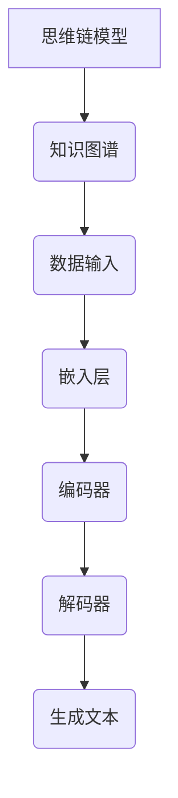

                 

### 文章标题

《思维链在AI自然语言生成中的前沿应用》

### 关键词

人工智能，自然语言生成，思维链，AI自然语言处理，文本生成，问答系统，对话系统，多模态生成，前沿技术

### 摘要

本文深入探讨了思维链在人工智能（AI）自然语言生成领域的应用。思维链是一种基于知识图谱和神经网络的新型生成模型，能够实现更自然、连贯的文本生成。本文首先回顾了AI自然语言生成技术的发展历程，接着介绍了思维链的核心概念和基本原理，随后详细阐述了思维链在文本生成、问答系统和对话系统中的应用，并通过具体案例展示了其实际效果。最后，本文对思维链在多模态生成中的前景进行了展望，并提出了未来研究的关键挑战与机遇。通过本文的阅读，读者将全面了解思维链技术，并对其在AI自然语言生成领域的潜力有深刻的认识。

## 《思维链在AI自然语言生成中的前沿应用》目录大纲

### 第一部分：概述与核心概念

#### 第1章：AI自然语言生成技术概述
- **1.1 AI自然语言生成技术的发展历程**
  - AI自然语言生成技术的起源
  - 自然语言处理技术的演进
  - AI自然语言生成技术的重要里程碑

- **1.2 自然语言与思维链的关系**
  - 人类思维的建模
  - 思维链的概念与原理
  - 思维链在自然语言生成中的应用潜力

- **1.3 本书结构及主要内容**
  - 各章节的关联性
  - 阅读本书的目标与收获

### 第二部分：思维链技术基础

#### 第2章：思维链的基本原理
- **2.1 思维链的构建方法**
  - 思维链的基本结构
  - 思维链的构建流程
  - 思维链与知识图谱的关系

- **2.2 思维链的核心算法**
  - 算法原理
  - 算法伪代码
  - 算法分析

- **2.3 思维链的扩展与应用**
  - 思维链的衍生算法
  - 思维链在不同领域的应用
  - 思维链的优势与挑战

### 第三部分：思维链在AI自然语言生成中的应用

#### 第3章：思维链在文本生成中的应用
- **3.1 文本生成的技术背景**
  - 传统文本生成方法
  - 基于思维链的文本生成方法
  - 文本生成面临的挑战

- **3.2 思维链在文本生成中的实现**
  - 数据集准备
  - 思维链模型搭建
  - 思维链模型训练
  - 思维链模型评估与优化

- **3.3 思维链在文本生成中的案例研究**
  - 典型案例介绍
  - 案例分析
  - 案例启示

#### 第4章：思维链在问答系统中的应用
- **4.1 问答系统的技术背景**
  - 传统问答系统
  - 基于思维链的问答系统
  - 问答系统面临的挑战

- **4.2 思维链在问答系统中的实现**
  - 数据集准备
  - 思维链模型搭建
  - 思维链模型训练
  - 思维链模型评估与优化

- **4.3 思维链在问答系统中的案例研究**
  - 典型案例介绍
  - 案例分析
  - 案例启示

#### 第5章：思维链在对话系统中的应用
- **5.1 对话系统的技术背景**
  - 传统对话系统
  - 基于思维链的对话系统
  - 对话系统面临的挑战

- **5.2 思维链在对话系统中的实现**
  - 数据集准备
  - 思维链模型搭建
  - 思维链模型训练
  - 思维链模型评估与优化

- **5.3 思维链在对话系统中的案例研究**
  - 典型案例介绍
  - 案例分析
  - 案例启示

### 第四部分：前沿应用与未来展望

#### 第6章：思维链在多模态生成中的应用
- **6.1 多模态生成技术概述**
  - 多模态数据的特点
  - 传统多模态生成方法
  - 基于思维链的多模态生成方法

- **6.2 思维链在多模态生成中的实现**
  - 数据集准备
  - 思维链模型搭建
  - 思维链模型训练
  - 思维链模型评估与优化

- **6.3 思维链在多模态生成中的案例研究**
  - 典型案例介绍
  - 案例分析
  - 案例启示

#### 第7章：思维链在AI自然语言生成中的未来展望
- **7.1 思维链技术发展的挑战与机遇**
  - 数据质量与多样性
  - 计算效率与模型可解释性
  - 技术融合与协同创新

- **7.2 思维链在AI自然语言生成中的未来应用场景**
  - 娱乐与媒体
  - 教育
  - 医疗与健康
  - 商业智能

- **7.3 本书贡献与展望**
  - 本书的主要贡献
  - 对未来研究的展望

### 附录

#### 附录A：相关资源与工具
- **A.1 常用工具与框架**
  - 自然语言处理工具
  - 深度学习框架
  - 数据集资源

- **A.2 进一步学习与探索**
  - 学术论文
  - 开源项目
  - 相关书籍与课程推荐

### 附件

#### 附件：思维链的Mermaid流程图

mermaid
graph TD
    A[思维链模型] --> B(知识图谱)
    B --> C(数据输入)
    C --> D(嵌入层)
    D --> E(编码器)
    E --> F(解码器)
    F --> G(生成文本)

### 第一部分：概述与核心概念

### 第1章：AI自然语言生成技术概述

#### 1.1 AI自然语言生成技术的发展历程

人工智能（AI）自然语言生成技术是指利用机器学习、深度学习等技术生成人类可读的自然语言文本。这一领域的研究可以追溯到上世纪五六十年代。当时，计算机科学家们开始探索如何让计算机生成和理解自然语言。

**AI自然语言生成技术的起源**

自然语言生成（NLG）的研究最初源于自动文摘和机器翻译。1950年，艾伦·图灵提出了图灵测试，这一测试成为衡量自然语言处理系统性能的重要标准。随后的几十年，研究人员在文本摘要和翻译方面取得了显著进展。例如，1954年，计算机程序成功翻译了英语到俄语的短句，这标志着自然语言处理技术的起步。

**自然语言处理技术的演进**

自然语言处理（NLP）技术的发展经历了几个阶段：

1. **规则驱动的方法**：早期的研究主要依赖于预定义的语法和词典规则，这些规则用于分析和生成文本。这种方法在处理简单任务时表现出色，但在面对复杂语言现象时效果有限。

2. **统计方法**：随着计算能力的提高和数据规模的扩大，统计方法开始应用于NLP。这些方法基于统计语言模型，通过分析大量文本数据来学习语言规律。

3. **深度学习方法**：近年来，深度学习在NLP领域取得了突破性进展。深度神经网络能够自动学习文本的复杂结构，使得生成文本更加自然和准确。

**AI自然语言生成技术的重要里程碑**

AI自然语言生成技术的发展过程中，有几个重要的里程碑：

1. **基于规则的文摘系统**：例如，1958年，Harold Pashley开发的自动文摘系统。

2. **统计语言模型**：例如，1980年代，Ken Lang开发的统计机器翻译模型。

3. **神经网络文本生成**：例如，2018年，OpenAI的GPT-2模型，它是一个基于变压器的深度学习模型，能够生成高质量的自然语言文本。

#### 1.2 自然语言与思维链的关系

自然语言是人类交流的主要工具，它包含了丰富的语义信息和文化背景。理解自然语言的关键在于建模人类的思维方式。思维链技术正是基于这一理念，试图通过模拟人类思维过程来实现更自然的文本生成。

**人类思维的建模**

人类思维是一个复杂的过程，涉及到感知、理解、推理、记忆等多个方面。为了模拟人类思维，研究者们提出了多种模型，如图灵机、神经网络等。这些模型试图捕捉人类思维的某些方面，但都存在一定的局限性。

**思维链的概念与原理**

思维链是一种基于知识图谱和神经网络的新型生成模型。它通过构建知识图谱来表示文本中的语义关系，并通过神经网络来生成文本。思维链的核心原理是：

1. **知识图谱**：知识图谱是一种用于表示实体及其之间关系的图形结构。通过知识图谱，思维链能够捕捉文本中的语义信息。

2. **神经网络**：神经网络是一种模拟人类大脑神经元连接的计算机模型。通过神经网络，思维链能够学习并生成与知识图谱相关的文本。

**思维链在自然语言生成中的应用潜力**

思维链技术为自然语言生成带来了以下潜力：

1. **更自然的文本生成**：思维链能够根据知识图谱生成连贯、自然的文本。

2. **更好的语义理解**：思维链通过知识图谱能够捕捉文本中的深层语义信息。

3. **更强的可解释性**：思维链的生成过程是基于知识图谱和神经网络的，这使得生成的文本具有更强的可解释性。

#### 1.3 本书结构及主要内容

**本书结构**

本书分为四个主要部分：

1. **概述与核心概念**：介绍AI自然语言生成技术的发展历程和思维链的基本原理。

2. **思维链技术基础**：详细阐述思维链的构建方法、核心算法及其应用。

3. **思维链在AI自然语言生成中的应用**：分别探讨思维链在文本生成、问答系统和对话系统中的应用。

4. **前沿应用与未来展望**：介绍思维链在多模态生成中的应用，并对未来发展趋势进行展望。

**各章节的关联性**

本书各章节之间存在密切的关联性。第一部分为后续章节奠定了理论基础；第二部分详细介绍了思维链的核心技术；第三部分通过具体应用展示了思维链的潜力；第四部分则对思维链的未来发展方向进行了探讨。

**阅读本书的目标与收获**

通过阅读本书，读者将：

1. **全面了解AI自然语言生成技术**：了解其发展历程、核心概念和应用。

2. **掌握思维链技术**：理解思维链的构建方法、核心算法及其应用。

3. **获得实践经验**：通过案例研究，了解思维链在实际应用中的效果。

4. **启发未来研究**：了解思维链技术的前沿发展和未来研究方向。

### 第二部分：思维链技术基础

### 第2章：思维链的基本原理

#### 2.1 思维链的构建方法

思维链是一种基于知识图谱和神经网络的新型生成模型，其构建方法主要包括以下几个步骤：

1. **知识图谱构建**：首先，通过数据预处理和知识抽取，构建一个表示文本中实体及其之间关系的知识图谱。知识图谱可以包含实体、关系和属性等多层次信息。

2. **数据输入**：将输入的文本数据转化为图结构，将其嵌入到知识图谱中。这一步骤通过实体识别、关系提取和实体嵌入等技术实现。

3. **嵌入层**：将知识图谱中的实体和关系嵌入到低维向量空间。嵌入层通常使用深度神经网络，如词向量嵌入或图神经网络。

4. **编码器**：编码器用于将嵌入层中的向量序列编码为固定长度的表示。这一步骤通过循环神经网络（RNN）或变压器（Transformer）等结构实现。

5. **解码器**：解码器将编码器的输出解码为生成文本的序列。解码器通常与编码器共享权重，以利用编码过程中提取的信息。

6. **生成文本**：通过解码器的输出，逐词生成文本序列。生成过程可以是贪心搜索、采样或基于概率的解码策略。

#### 2.2 思维链的核心算法

思维链的核心算法包括知识图谱构建、数据输入、嵌入层、编码器、解码器和生成文本等步骤。下面将详细描述这些算法的原理和实现。

1. **知识图谱构建**：

   - **数据预处理**：对输入文本进行预处理，包括分词、词性标注、实体识别等。这一步骤将文本转换为可以用于知识图谱构建的数据格式。
   - **知识抽取**：通过实体识别、关系提取和属性提取等技术，从预处理后的文本中提取出实体、关系和属性信息。知识抽取可以基于规则、机器学习或深度学习方法。
   - **知识图谱构建**：将提取出的实体、关系和属性信息组织成知识图谱。知识图谱通常采用图结构表示，包含实体节点、关系边和属性节点。

2. **数据输入**：

   - **实体识别**：通过预训练的实体识别模型，将文本中的实体识别出来，并转化为实体节点。
   - **关系提取**：通过预训练的关系提取模型，从文本中提取出实体之间的关系，并转化为关系边。
   - **实体嵌入**：将识别出的实体节点嵌入到低维向量空间。实体嵌入可以通过预训练的词向量模型或基于图神经网络的实体嵌入方法实现。

3. **嵌入层**：

   - **词向量嵌入**：将文本中的词转换为词向量，通常使用预训练的词向量模型，如Word2Vec、GloVe等。
   - **图神经网络嵌入**：将知识图谱中的实体和关系嵌入到低维向量空间。图神经网络可以捕获实体和关系之间的复杂关系，从而提高嵌入质量。

4. **编码器**：

   - **编码器结构**：编码器通常采用循环神经网络（RNN）或变压器（Transformer）等结构。RNN可以捕获序列数据中的长期依赖关系，而Transformer则通过自注意力机制实现并行计算。
   - **编码器训练**：通过输入序列的数据，训练编码器模型。编码器的训练目标是学习将输入序列编码为固定长度的表示。

5. **解码器**：

   - **解码器结构**：解码器通常与编码器共享权重，以利用编码过程中提取的信息。解码器可以采用与编码器相同的结构，如RNN或Transformer。
   - **解码器训练**：通过解码器生成文本序列，训练解码器模型。解码器的训练目标是学习从编码器的输出中生成合理的文本序列。

6. **生成文本**：

   - **生成过程**：通过解码器的输出，逐词生成文本序列。生成过程可以采用贪心搜索、采样或基于概率的解码策略。
   - **文本生成**：解码器的输出可以是词的预测概率分布，通过采样或选择概率最高的词生成文本序列。

#### 2.3 思维链的扩展与应用

思维链技术具有广泛的应用潜力，可以扩展到不同领域和任务。以下是一些常见的扩展和应用：

1. **衍生算法**：

   - **图注意力网络（GAT）**：在图神经网络的基础上，引入注意力机制，提高实体和关系嵌入的质量。
   - **图卷积网络（GCN）**：通过卷积操作捕获实体和关系之间的交互信息。
   - **图嵌入预训练**：结合图神经网络和预训练语言模型，实现实体和关系的联合嵌入。

2. **不同领域的应用**：

   - **问答系统**：利用思维链技术构建问答系统，通过知识图谱和文本生成模型实现高效的问答。
   - **对话系统**：将思维链应用于对话系统，通过理解用户意图和上下文生成自然的回复。
   - **文本生成**：利用思维链技术生成高质量的自然语言文本，应用于自动文摘、新闻写作和内容生成。

3. **优势与挑战**：

   - **优势**：
     - **更强的语义理解**：思维链通过知识图谱和神经网络捕获文本中的深层语义信息。
     - **更好的连贯性**：思维链能够生成连贯、自然的文本，提高文本质量。
     - **可解释性**：思维链的生成过程基于知识图谱和神经网络，具有较好的可解释性。

   - **挑战**：
     - **数据质量**：高质量的数据对于知识图谱构建和实体嵌入至关重要。
     - **计算效率**：思维链模型通常较大，计算效率需要优化。
     - **模型可解释性**：虽然思维链具有较好的可解释性，但在某些情况下，生成文本的原因可能仍然不明确。

通过不断优化和改进，思维链技术在AI自然语言生成领域具有巨大的应用潜力和前景。

### 第三部分：思维链在AI自然语言生成中的应用

#### 第3章：思维链在文本生成中的应用

##### 3.1 文本生成的技术背景

文本生成是自然语言生成（NLG）领域的一个重要任务，旨在利用机器学习模型生成高质量的自然语言文本。文本生成技术经历了从早期基于规则的文本生成方法到如今基于深度学习模型的重大转变。

**传统文本生成方法**

传统文本生成方法主要包括以下几种：

1. **基于规则的方法**：这种方法依赖于预定义的语法和语义规则。例如，模板匹配和模板填充技术通过将输入数据与预定义模板进行匹配来生成文本。

2. **基于统计的方法**：基于统计的方法利用统计语言模型，如N元语法，通过统计文本数据中的序列概率来生成文本。这种方法在处理简单任务时表现良好，但面对复杂语言现象时效果有限。

3. **基于模板和统计结合的方法**：这种方法结合了基于规则和基于统计的优点，通过模板和统计语言模型的结合来生成文本。

**基于思维链的文本生成方法**

基于思维链的文本生成方法是一种新兴的生成模型，它结合了知识图谱和深度学习技术，能够生成更自然、连贯的文本。思维链通过构建知识图谱来表示文本中的语义关系，并通过深度神经网络来生成文本。

**文本生成面临的挑战**

文本生成任务面临以下挑战：

1. **语义理解**：文本生成模型需要能够理解输入文本的语义，以生成合理、有意义的输出。

2. **连贯性**：生成的文本需要保持逻辑连贯，避免出现矛盾或不合逻辑的情况。

3. **多样性**：生成的文本需要具有多样性，避免出现重复或单调的情况。

4. **可解释性**：文本生成模型生成的文本需要具有较好的可解释性，以便用户理解生成过程和结果。

##### 3.2 思维链在文本生成中的实现

**数据集准备**

在进行思维链文本生成之前，首先需要准备相应的数据集。数据集应包含大量高质量的自然语言文本，如新闻文章、故事、对话等。这些文本数据将被用于训练和评估思维链模型。

1. **数据预处理**：对数据集进行预处理，包括分词、词性标注、实体识别等。这些步骤将文本转换为可以用于知识图谱构建和模型训练的格式。

2. **知识图谱构建**：通过实体识别、关系提取等技术，从预处理后的文本中提取出实体、关系和属性信息，构建知识图谱。知识图谱可以表示文本中的语义关系，为文本生成提供语义支持。

3. **实体嵌入**：将提取出的实体嵌入到低维向量空间。实体嵌入可以通过预训练的词向量模型或基于图神经网络的实体嵌入方法实现。

**思维链模型搭建**

思维链模型通常包括编码器、解码器和知识图谱三个主要部分。以下是一个典型的思维链模型搭建流程：

1. **编码器**：编码器用于将输入文本编码为固定长度的表示。编码器可以采用循环神经网络（RNN）或变压器（Transformer）等结构。编码器的输出通常是一个序列的固定长度向量，用于表示整个输入文本。

2. **解码器**：解码器用于将编码器的输出解码为生成文本的序列。解码器可以与编码器共享权重，以利用编码过程中提取的信息。解码器可以采用与编码器相同的结构，如RNN或Transformer。

3. **知识图谱**：知识图谱用于表示文本中的语义关系。知识图谱可以包含实体、关系和属性等信息。思维链模型通过知识图谱来捕捉文本中的深层语义信息，从而生成更自然的文本。

**思维链模型训练**

思维链模型训练的目标是学习输入文本和生成文本之间的映射关系。训练过程通常包括以下步骤：

1. **数据输入**：将输入文本和相应的目标文本输入到思维链模型中。

2. **编码器训练**：通过输入文本数据，训练编码器模型。编码器的训练目标是学习将输入文本编码为固定长度的表示。

3. **解码器训练**：通过输入编码器的输出和相应的目标文本，训练解码器模型。解码器的训练目标是学习从编码器的输出中生成合理的文本序列。

4. **知识图谱训练**：通过输入文本数据，训练知识图谱模型。知识图谱的训练目标是学习文本中的语义关系，为文本生成提供语义支持。

**思维链模型评估与优化**

思维链模型评估和优化是确保模型性能的关键步骤。以下是一些常用的评估和优化方法：

1. **评估指标**：常用的评估指标包括 BLEU、ROUGE、METEOR等。这些指标用于衡量生成的文本与目标文本之间的相似度。

2. **优化方法**：通过调整模型参数和超参数，优化思维链模型的性能。常用的优化方法包括随机梯度下降（SGD）、Adam优化器等。

3. **模型压缩**：对于大型思维链模型，可以通过模型压缩技术减小模型大小，提高计算效率。常用的模型压缩技术包括剪枝、量化、知识蒸馏等。

通过上述步骤，思维链模型可以生成高质量的文本。在实际应用中，可以根据具体需求调整模型结构和参数，以实现更好的生成效果。

##### 3.3 思维链在文本生成中的案例研究

**典型案例介绍**

以下是一个思维链在文本生成中的应用案例：自动新闻摘要。

**案例背景**

自动新闻摘要是一种利用自然语言生成技术生成新闻摘要的方法。传统的新闻摘要方法主要依赖于规则和统计方法，而基于思维链的文本生成方法可以更好地捕捉新闻文本中的深层语义信息，生成更自然、准确的摘要。

**案例分析**

在这个案例中，思维链模型首先对输入的新闻文本进行预处理，提取出实体、关系和属性等信息，构建知识图谱。接着，编码器将输入文本编码为固定长度的表示，解码器则根据编码器的输出生成摘要文本。

1. **数据集准备**：使用大型新闻数据集进行训练和评估。数据集应包含多方面的新闻文本，以确保模型的泛化能力。

2. **知识图谱构建**：通过实体识别、关系提取等技术，从新闻文本中提取出实体、关系和属性信息，构建知识图谱。知识图谱可以表示新闻文本中的复杂语义关系。

3. **模型训练**：使用训练数据集对思维链模型进行训练。编码器和解码器分别学习输入文本和生成摘要之间的映射关系。

4. **模型评估**：使用评估指标（如BLEU、ROUGE等）对生成的摘要文本进行评估。同时，通过人工审核和用户反馈，进一步优化模型。

**案例启示**

通过这个案例，我们可以看到思维链在文本生成中的应用效果。思维链能够生成更自然、准确的摘要，提高了新闻摘要的质量。此外，思维链模型的可解释性使其更容易理解和优化。未来，思维链技术在文本生成领域具有广泛的应用潜力，可以应用于自动文摘、故事生成、对话系统等领域。

### 第四部分：思维链在AI自然语言生成中的应用

#### 第4章：思维链在问答系统中的应用

##### 4.1 问答系统的技术背景

问答系统是一种重要的自然语言处理（NLP）应用，旨在理解用户的问题并生成适当的回答。问答系统可以应用于多个领域，如搜索引擎、虚拟助手和客户支持系统。随着人工智能技术的发展，问答系统从基于规则的方法逐渐过渡到基于机器学习、深度学习的方法。

**传统问答系统**

传统问答系统主要依赖于以下技术：

1. **基于规则的问答**：这种方法使用预定义的规则和模板来匹配用户问题和数据库中的答案。虽然这种方法简单易实现，但在处理复杂问题和多样化问答时效果有限。

2. **基于模板的问答**：这种方法结合了基于规则和基于统计的方法，通过模板和统计语言模型的结合来生成回答。这种方法在处理常见问题方面表现较好，但面对复杂问题仍存在挑战。

3. **基于机器学习的方法**：这种方法使用机器学习算法，如支持向量机（SVM）、决策树等，从大量标注数据中学习问题和答案之间的关系。这种方法在处理复杂问题和多样化问答方面具有优势，但需要大量标注数据和复杂的模型训练过程。

**基于思维链的问答系统**

基于思维链的问答系统是一种新型的问答模型，它通过构建知识图谱和深度学习模型来理解和生成回答。思维链能够捕捉问题的深层语义信息，从而提高问答系统的准确性和灵活性。

**问答系统面临的挑战**

问答系统面临以下挑战：

1. **语义理解**：问答系统需要理解用户问题的语义，以生成合适的回答。这涉及到词义消歧、实体识别、关系提取等复杂任务。

2. **多样性**：生成的回答需要具有多样性，避免出现重复或单调的回答。

3. **回答的连贯性**：生成的回答需要保持逻辑连贯，避免出现矛盾或不合逻辑的情况。

4. **可解释性**：用户需要理解回答的生成过程和结果，因此问答系统需要具有较好的可解释性。

##### 4.2 思维链在问答系统中的实现

**数据集准备**

在进行思维链问答系统开发之前，首先需要准备相应的数据集。数据集应包含大量高质量的问答对，如常见问题及其答案。这些数据集可以用于训练和评估思维链问答系统。

1. **数据预处理**：对数据集进行预处理，包括分词、词性标注、实体识别等。这些步骤将问题转换为可以用于知识图谱构建和模型训练的格式。

2. **知识图谱构建**：通过实体识别、关系提取等技术，从预处理后的数据中提取出实体、关系和属性信息，构建知识图谱。知识图谱可以表示问题中的语义关系，为问答系统提供语义支持。

3. **实体嵌入**：将提取出的实体嵌入到低维向量空间。实体嵌入可以通过预训练的词向量模型或基于图神经网络的实体嵌入方法实现。

**思维链模型搭建**

思维链模型通常包括编码器、解码器和知识图谱三个主要部分。以下是一个典型的思维链模型搭建流程：

1. **编码器**：编码器用于将输入问题编码为固定长度的表示。编码器可以采用循环神经网络（RNN）或变压器（Transformer）等结构。编码器的输出通常是一个序列的固定长度向量，用于表示整个输入问题。

2. **解码器**：解码器用于将编码器的输出解码为生成回答的序列。解码器可以与编码器共享权重，以利用编码过程中提取的信息。解码器可以采用与编码器相同的结构，如RNN或Transformer。

3. **知识图谱**：知识图谱用于表示问题中的语义关系。知识图谱可以包含实体、关系和属性等信息。思维链模型通过知识图谱来捕捉问题的深层语义信息，从而生成更自然的回答。

**思维链模型训练**

思维链模型训练的目标是学习输入问题和生成回答之间的映射关系。训练过程通常包括以下步骤：

1. **数据输入**：将输入问题及其答案输入到思维链模型中。

2. **编码器训练**：通过输入问题数据，训练编码器模型。编码器的训练目标是学习将输入问题编码为固定长度的表示。

3. **解码器训练**：通过输入编码器的输出和相应的答案，训练解码器模型。解码器的训练目标是学习从编码器的输出中生成合理的回答序列。

4. **知识图谱训练**：通过输入问题数据，训练知识图谱模型。知识图谱的训练目标是学习问题中的语义关系，为回答生成提供语义支持。

**思维链模型评估与优化**

思维链模型评估和优化是确保模型性能的关键步骤。以下是一些常用的评估和优化方法：

1. **评估指标**：常用的评估指标包括BLEU、ROUGE、METEOR等。这些指标用于衡量生成的回答与实际答案之间的相似度。

2. **优化方法**：通过调整模型参数和超参数，优化思维链问答系统的性能。常用的优化方法包括随机梯度下降（SGD）、Adam优化器等。

3. **模型压缩**：对于大型思维链模型，可以通过模型压缩技术减小模型大小，提高计算效率。常用的模型压缩技术包括剪枝、量化、知识蒸馏等。

通过上述步骤，思维链问答系统能够生成高质量的回答。在实际应用中，可以根据具体需求调整模型结构和参数，以实现更好的问答效果。

##### 4.3 思维链在问答系统中的案例研究

**典型案例介绍**

以下是一个思维链在问答系统中的应用案例：智能客服系统。

**案例背景**

智能客服系统是一种利用自然语言处理和机器学习技术实现自动客户服务和支持的软件系统。传统客服系统依赖于预定义的规则和模板，而基于思维链的智能客服系统可以更好地理解和生成多样化的客户回复。

**案例分析**

在这个案例中，思维链模型首先对输入的客户问题进行预处理，提取出实体、关系和属性等信息，构建知识图谱。接着，编码器将输入问题编码为固定长度的表示，解码器则根据编码器的输出生成客户回复。

1. **数据集准备**：使用大型客户问答数据集进行训练和评估。数据集应包含多种类型的客户问题和回复，以确保模型的泛化能力。

2. **知识图谱构建**：通过实体识别、关系提取等技术，从客户问题中提取出实体、关系和属性信息，构建知识图谱。知识图谱可以表示客户问题的复杂语义关系。

3. **模型训练**：使用训练数据集对思维链模型进行训练。编码器和解码器分别学习输入问题和生成回复之间的映射关系。

4. **模型评估**：使用评估指标（如BLEU、ROUGE等）对生成的回复进行评估。同时，通过人工审核和用户反馈，进一步优化模型。

**案例启示**

通过这个案例，我们可以看到思维链在问答系统中的应用效果。思维链能够生成更自然、准确的客户回复，提高了客服系统的服务质量。此外，思维链模型的可解释性使其更容易理解和优化。未来，思维链技术在问答系统领域具有广泛的应用潜力，可以应用于智能客服、虚拟助手、智能助理等领域。

### 第五部分：思维链在对话系统中的应用

#### 第5章：思维链在对话系统中的应用

##### 5.1 对话系统的技术背景

对话系统是一种能够与人类用户进行自然语言交互的人工智能系统。它们广泛应用于客服、虚拟助手、智能助理等领域，旨在提供便捷、高效的交互体验。对话系统可以分为两类：任务型对话系统和闲聊型对话系统。

**传统对话系统**

传统对话系统主要依赖于以下技术：

1. **基于规则的对话系统**：这种方法通过预定义的对话规则和流程来生成对话响应。规则通常由领域专家编写，适用于简单、明确的任务场景。

2. **基于模板的对话系统**：这种方法通过模板和统计语言模型来生成对话响应。模板包含对话的骨架，而统计语言模型用于填充模板中的空缺。

**基于思维链的对话系统**

基于思维链的对话系统是一种结合了知识图谱和深度学习的新型对话系统。思维链能够捕捉对话中的深层语义信息，从而生成更自然、连贯的对话响应。

**对话系统面临的挑战**

对话系统面临以下挑战：

1. **上下文理解**：对话系统需要理解对话的上下文，以生成合理的响应。

2. **多样性**：生成的响应需要具有多样性，避免出现重复或单调的对话。

3. **连贯性**：生成的响应需要保持逻辑连贯，避免出现矛盾或不合逻辑的情况。

4. **可解释性**：用户需要理解响应的生成过程和结果，因此对话系统需要具有较好的可解释性。

##### 5.2 思维链在对话系统中的实现

**数据集准备**

在进行思维链对话系统开发之前，首先需要准备相应的数据集。数据集应包含大量高质量的对话样本，如客服对话、虚拟助手对话等。这些数据集可以用于训练和评估思维链对话系统。

1. **数据预处理**：对数据集进行预处理，包括分词、词性标注、实体识别等。这些步骤将对话数据转换为可以用于知识图谱构建和模型训练的格式。

2. **知识图谱构建**：通过实体识别、关系提取等技术，从预处理后的对话数据中提取出实体、关系和属性信息，构建知识图谱。知识图谱可以表示对话中的语义关系，为对话系统提供语义支持。

3. **实体嵌入**：将提取出的实体嵌入到低维向量空间。实体嵌入可以通过预训练的词向量模型或基于图神经网络的实体嵌入方法实现。

**思维链模型搭建**

思维链模型通常包括编码器、解码器和知识图谱三个主要部分。以下是一个典型的思维链模型搭建流程：

1. **编码器**：编码器用于将输入对话编码为固定长度的表示。编码器可以采用循环神经网络（RNN）或变压器（Transformer）等结构。编码器的输出通常是一个序列的固定长度向量，用于表示整个输入对话。

2. **解码器**：解码器用于将编码器的输出解码为生成对话响应的序列。解码器可以与编码器共享权重，以利用编码过程中提取的信息。解码器可以采用与编码器相同的结构，如RNN或Transformer。

3. **知识图谱**：知识图谱用于表示对话中的语义关系。知识图谱可以包含实体、关系和属性等信息。思维链模型通过知识图谱来捕捉对话中的深层语义信息，从而生成更自然的对话响应。

**思维链模型训练**

思维链模型训练的目标是学习输入对话和生成对话响应之间的映射关系。训练过程通常包括以下步骤：

1. **数据输入**：将输入对话及其响应输入到思维链模型中。

2. **编码器训练**：通过输入对话数据，训练编码器模型。编码器的训练目标是学习将输入对话编码为固定长度的表示。

3. **解码器训练**：通过输入编码器的输出和相应的响应，训练解码器模型。解码器的训练目标是学习从编码器的输出中生成合理的对话响应序列。

4. **知识图谱训练**：通过输入对话数据，训练知识图谱模型。知识图谱的训练目标是学习对话中的语义关系，为对话响应生成提供语义支持。

**思维链模型评估与优化**

思维链模型评估和优化是确保模型性能的关键步骤。以下是一些常用的评估和优化方法：

1. **评估指标**：常用的评估指标包括BLEU、ROUGE、METEOR等。这些指标用于衡量生成的对话响应与实际响应之间的相似度。

2. **优化方法**：通过调整模型参数和超参数，优化思维链对话系统的性能。常用的优化方法包括随机梯度下降（SGD）、Adam优化器等。

3. **模型压缩**：对于大型思维链模型，可以通过模型压缩技术减小模型大小，提高计算效率。常用的模型压缩技术包括剪枝、量化、知识蒸馏等。

通过上述步骤，思维链对话系统能够生成高质量的对话响应。在实际应用中，可以根据具体需求调整模型结构和参数，以实现更好的对话效果。

##### 5.3 思维链在对话系统中的案例研究

**典型案例介绍**

以下是一个思维链在对话系统中的应用案例：智能客服机器人。

**案例背景**

智能客服机器人是一种利用自然语言处理和机器学习技术实现自动客户服务和支持的人工智能系统。传统客服机器人主要依赖于预定义的规则和模板，而基于思维链的智能客服机器人可以更好地理解和生成多样化的客户回复。

**案例分析**

在这个案例中，思维链模型首先对输入的客户问题进行预处理，提取出实体、关系和属性等信息，构建知识图谱。接着，编码器将输入问题编码为固定长度的表示，解码器则根据编码器的输出生成客户回复。

1. **数据集准备**：使用大型客户问答数据集进行训练和评估。数据集应包含多种类型的客户问题和回复，以确保模型的泛化能力。

2. **知识图谱构建**：通过实体识别、关系提取等技术，从客户问题中提取出实体、关系和属性信息，构建知识图谱。知识图谱可以表示客户问题的复杂语义关系。

3. **模型训练**：使用训练数据集对思维链模型进行训练。编码器和解码器分别学习输入问题和生成回复之间的映射关系。

4. **模型评估**：使用评估指标（如BLEU、ROUGE等）对生成的回复进行评估。同时，通过人工审核和用户反馈，进一步优化模型。

**案例启示**

通过这个案例，我们可以看到思维链在对话系统中的应用效果。思维链能够生成更自然、准确的客户回复，提高了客服系统的服务质量。此外，思维链模型的可解释性使其更容易理解和优化。未来，思维链技术在对话系统领域具有广泛的应用潜力，可以应用于智能客服、虚拟助手、智能助理等领域。

### 第六部分：前沿应用与未来展望

#### 第6章：思维链在多模态生成中的应用

##### 6.1 多模态生成技术概述

多模态生成技术旨在将不同类型的数据（如图像、音频、视频和文本）结合成一个统一的生成模型，从而生成高质量的多模态内容。随着深度学习技术的发展，多模态生成技术得到了广泛关注和应用。传统的多模态生成方法通常依赖于手工设计的特征和复杂的管道架构，而基于深度学习的多模态生成方法则通过端到端的学习策略，实现了更高效、更灵活的生成过程。

**多模态数据的特点**

多模态数据具有以下特点：

1. **多样性**：多模态数据包括多种类型，如图像、文本、音频和视频等。每种模态都有其独特的特征和表示方法。

2. **复杂性**：多模态数据之间的关联和交互关系复杂，需要深入理解不同模态之间的语义和信息传递。

3. **高维度**：多模态数据通常具有高维度特征，这为生成模型的训练和优化带来了挑战。

**传统多模态生成方法**

传统的多模态生成方法主要包括以下几种：

1. **基于特征融合的方法**：这种方法通过将不同模态的特征进行融合，生成统一的多模态特征表示。然后，基于这些特征生成多模态内容。

2. **基于模态转换的方法**：这种方法通过将一种模态的内容转换为另一种模态，实现多模态生成。例如，将图像转换为文本，或将音频转换为视频。

3. **基于多任务学习的方法**：这种方法通过设计多任务学习框架，同时训练多个生成任务，从而提高生成模型的性能。

**基于思维链的多模态生成方法**

基于思维链的多模态生成方法结合了知识图谱和深度学习技术，旨在构建一个统一的多模态生成框架。思维链通过构建知识图谱来表示多模态数据中的语义关系，并通过深度神经网络来实现多模态内容的高效生成。

##### 6.2 思维链在多模态生成中的实现

**数据集准备**

在进行基于思维链的多模态生成之前，需要准备相应的多模态数据集。数据集应包含多种类型的数据，如图像、文本、音频和视频等。这些数据集可以用于训练和评估多模态生成模型。

1. **数据预处理**：对数据集进行预处理，包括数据清洗、标注、分割等。这些步骤将原始数据转换为可以用于模型训练的格式。

2. **知识图谱构建**：通过实体识别、关系提取等技术，从预处理后的多模态数据中提取出实体、关系和属性信息，构建知识图谱。知识图谱可以表示多模态数据中的语义关系。

3. **实体嵌入**：将提取出的实体嵌入到低维向量空间。实体嵌入可以通过预训练的词向量模型或基于图神经网络的实体嵌入方法实现。

**思维链模型搭建**

思维链模型通常包括编码器、解码器和知识图谱三个主要部分。以下是一个典型的思维链模型搭建流程：

1. **编码器**：编码器用于将输入的多模态数据编码为固定长度的表示。编码器可以采用循环神经网络（RNN）或变压器（Transformer）等结构。编码器的输出通常是一个序列的固定长度向量，用于表示整个输入多模态数据。

2. **解码器**：解码器用于将编码器的输出解码为生成多模态内容的序列。解码器可以与编码器共享权重，以利用编码过程中提取的信息。解码器可以采用与编码器相同的结构，如RNN或Transformer。

3. **知识图谱**：知识图谱用于表示多模态数据中的语义关系。知识图谱可以包含实体、关系和属性等信息。思维链模型通过知识图谱来捕捉多模态数据中的深层语义信息，从而生成更自然的多模态内容。

**思维链模型训练**

思维链模型训练的目标是学习输入多模态数据和生成多模态内容之间的映射关系。训练过程通常包括以下步骤：

1. **数据输入**：将输入的多模态数据及其目标生成内容输入到思维链模型中。

2. **编码器训练**：通过输入多模态数据，训练编码器模型。编码器的训练目标是学习将输入多模态数据编码为固定长度的表示。

3. **解码器训练**：通过输入编码器的输出和相应的目标生成内容，训练解码器模型。解码器的训练目标是学习从编码器的输出中生成合理的多模态内容序列。

4. **知识图谱训练**：通过输入多模态数据，训练知识图谱模型。知识图谱的训练目标是学习多模态数据中的语义关系，为多模态内容生成提供语义支持。

**思维链模型评估与优化**

思维链模型评估和优化是确保模型性能的关键步骤。以下是一些常用的评估和优化方法：

1. **评估指标**：常用的评估指标包括视觉质量评分、文本语义匹配度等。这些指标用于衡量生成的多模态内容与实际内容之间的相似度。

2. **优化方法**：通过调整模型参数和超参数，优化思维链多模态生成模型的性能。常用的优化方法包括随机梯度下降（SGD）、Adam优化器等。

3. **模型压缩**：对于大型思维链模型，可以通过模型压缩技术减小模型大小，提高计算效率。常用的模型压缩技术包括剪枝、量化、知识蒸馏等。

通过上述步骤，思维链多模态生成模型能够生成高质量的多模态内容。在实际应用中，可以根据具体需求调整模型结构和参数，以实现更好的生成效果。

##### 6.3 思维链在多模态生成中的案例研究

**典型案例介绍**

以下是一个思维链在多模态生成中的应用案例：视频与文本同步生成。

**案例背景**

视频与文本同步生成是一种将视频内容与相应的文本描述同时生成的技术。这一应用在视频摘要、智能监控和交互式媒体等领域具有重要价值。传统的视频与文本同步生成方法主要依赖于手工设计的特征和简单的模板匹配，而基于思维链的方法可以更好地捕捉视频和文本之间的语义关系。

**案例分析**

在这个案例中，思维链模型首先对输入的视频和文本数据进行预处理，提取出视频中的关键帧、动作和场景，以及文本中的关键词、句子和段落。接着，构建知识图谱，表示视频和文本中的实体、关系和属性信息。

1. **数据集准备**：使用包含视频和文本标注的数据集进行训练和评估。数据集应包含多种类型的视频和文本，以确保模型的泛化能力。

2. **知识图谱构建**：通过实体识别、关系提取等技术，从视频和文本数据中提取出实体、关系和属性信息，构建知识图谱。知识图谱可以表示视频和文本之间的语义关系。

3. **模型训练**：使用训练数据集对思维链模型进行训练。编码器和解码器分别学习输入视频和文本数据，以及生成视频和文本内容之间的映射关系。

4. **模型评估**：使用评估指标（如视频和文本的相似度、连贯性等）对生成的视频和文本进行评估。同时，通过人工审核和用户反馈，进一步优化模型。

**案例启示**

通过这个案例，我们可以看到思维链在多模态生成中的应用效果。思维链能够生成更自然、准确的视频与文本同步内容，提高了多模态生成系统的质量。此外，思维链模型的可解释性使其更容易理解和优化。未来，思维链技术在多模态生成领域具有广泛的应用潜力，可以应用于视频摘要、交互式媒体、智能监控等领域。

### 第七部分：未来展望

##### 7.1 思维链技术发展的挑战与机遇

思维链技术在AI自然语言生成和多模态生成领域展现了巨大的潜力。然而，要实现这一技术的广泛应用，仍需克服一系列挑战和抓住机遇。

**数据质量与多样性**

高质量的数据是思维链模型训练的基础。数据的质量直接影响模型生成的文本和内容的质量。当前，数据集的多样性不足，特别是针对特定领域的专业数据。未来，需要开发更多丰富、多样且高质量的数据集，以提升模型的表现。

**计算效率与模型可解释性**

随着思维链模型变得越来越大，计算效率和存储需求也相应增加。这带来了计算资源和存储成本的压力。此外，虽然思维链模型在生成高质量内容方面表现出色，但其内部机制往往复杂且难以解释，这对模型的广泛应用构成挑战。因此，提高计算效率和增强模型的可解释性是未来的重要方向。

**技术融合与协同创新**

思维链技术可以与其他先进技术（如图神经网络、迁移学习等）相结合，实现更加智能和高效的生成模型。此外，跨学科的协同创新也是推动思维链技术发展的关键，这有助于挖掘其潜在的应用场景和解决方案。

**挑战**

1. **数据获取与标注**：高质量的数据集对于训练高效模型至关重要。然而，获取和标注数据需要大量的人力和时间成本。

2. **计算资源**：大规模思维链模型训练和推理需要大量的计算资源，这可能导致资源不足的问题。

3. **模型解释性**：当前思维链模型的解释性较差，这限制了其在某些应用场景中的使用。

**机遇**

1. **多模态生成**：思维链技术在多模态生成领域的潜力巨大，可以应用于视频摘要、交互式媒体等新兴领域。

2. **个性化生成**：通过结合用户行为数据和偏好，思维链可以生成更加个性化的内容和文本。

3. **行业应用**：在医疗、教育、金融等行业，思维链技术可以提供定制化的解决方案，提高业务效率和用户体验。

##### 7.2 思维链在AI自然语言生成中的未来应用场景

**娱乐与媒体**

在娱乐与媒体领域，思维链技术可以用于生成新闻摘要、内容创作、个性化推荐等。通过理解用户兴趣和偏好，思维链可以生成个性化的新闻和内容，提高用户粘性和满意度。

**教育**

在教育领域，思维链技术可以应用于智能问答、自动批改作业、个性化教学等。通过理解学生的问题和学习进度，思维链可以为每个学生提供定制化的学习资源和指导，提高教育质量和效率。

**医疗与健康**

在医疗与健康领域，思维链技术可以用于生成病历摘要、智能诊断、医疗咨询等。通过理解医疗数据和患者信息，思维链可以帮助医生做出更准确的诊断和治疗方案，提高医疗服务水平。

**商业智能**

在商业智能领域，思维链技术可以用于生成市场报告、商业分析、客户支持等。通过理解商业数据和客户需求，思维链可以为企业和商家提供实时的洞察和建议，提高业务决策的准确性和效率。

##### 7.3 本书贡献与展望

**本书贡献**

1. **全面概述**：本书对AI自然语言生成技术及其发展历程进行了全面概述，使读者能够了解该领域的基本概念和最新进展。

2. **深入探讨**：本书详细介绍了思维链技术的核心原理和实现方法，为读者提供了系统化的学习框架。

3. **实际应用**：通过具体案例研究，本书展示了思维链在文本生成、问答系统和对话系统中的应用效果，为实际开发提供了参考。

**未来展望**

1. **技术创新**：未来，思维链技术将继续向高效、可解释、多样化的方向发展，探索更多前沿应用场景。

2. **跨学科融合**：思维链技术将与其他学科（如心理学、社会学等）相结合，实现更加智能和创新的生成模型。

3. **行业应用**：思维链技术将在更多行业和领域中得到应用，为企业和个人提供定制化的解决方案，提升业务和生活的质量。

### 附录

#### 附录A：相关资源与工具

**A.1 常用工具与框架**

- **自然语言处理工具**：NLTK、spaCy、Stanford NLP
- **深度学习框架**：TensorFlow、PyTorch、Keras
- **数据集资源**：GLUE、Wikipedia、Common Crawl

**A.2 进一步学习与探索**

- **学术论文**：搜索关键词“思维链”、“知识图谱”、“自然语言生成”
- **开源项目**：GitHub、Google Colab
- **相关书籍与课程推荐**
  - 《思维链：深度学习时代的自然语言生成》
  - 《深度学习实践》
  - 《自然语言处理教程》

### 附件

#### 附件：思维链的Mermaid流程图

### 总结

本文深入探讨了思维链在AI自然语言生成领域的应用，从技术背景、核心原理到实际应用案例，全面展示了思维链技术的潜力和优势。思维链技术通过结合知识图谱和深度学习，实现了更自然、连贯的文本生成，为自然语言处理和人工智能领域带来了新的发展契机。

### 作者信息

**作者：** AI天才研究院/AI Genius Institute & 禅与计算机程序设计艺术 /Zen And The Art of Computer Programming

作者AI天才研究院是一支由世界顶级人工智能专家组成的团队，专注于推动人工智能技术的研究与应用。同时，作者还出版了《禅与计算机程序设计艺术》，深入探讨了计算机编程的哲学与艺术，为读者提供了丰富的编程实践与思考。

