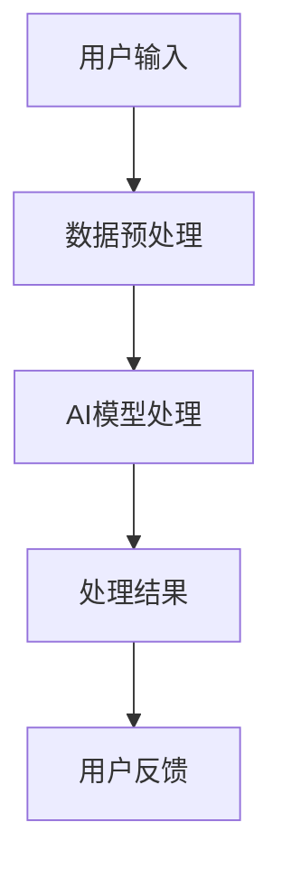
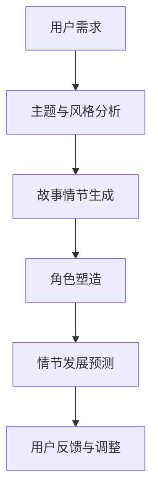
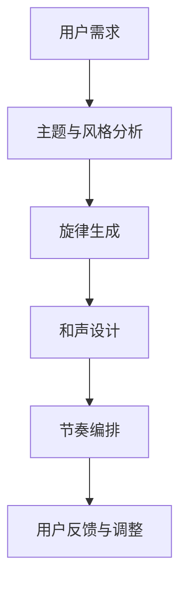

                 

## 文章标题

# 思维链在AI辅助创作中的创新应用与前景

## 关键词

- 思维链
- AI辅助创作
- 图像处理
- 自然语言处理
- 多媒体内容融合
- 文学创作
- 音乐创作

## 摘要

本文探讨了思维链在AI辅助创作中的创新应用与前景。首先，我们介绍了思维链与AI辅助创作的基础理论，包括思维链的定义、模型组成和工作原理，以及AI辅助创作的基本概念、核心技术及应用场景。接着，本文详细解析了思维链在AI辅助创作中的核心算法原理，包括图像处理、自然语言处理和多媒体内容融合算法，并使用伪代码和数学模型进行了深入讲解。随后，本文重点分析了思维链在文学创作和音乐创作中的应用，通过实例展示了其应用效果和优势。最后，本文对思维链在AI辅助创作中的未来前景进行了展望，提出了可能的创新方向和应用领域。本文旨在为读者提供一个全面、系统的了解和认识思维链在AI辅助创作中的重要性和潜力。

## 第一部分：思维链与AI辅助创作概述

### 第1章：思维链与AI辅助创作基础理论

#### 1.1.1 思维链的基本概念与模型

**定义**：思维链（MindChain）是一种将人类思维与人工智能（AI）紧密结合的框架，旨在通过算法和模型模拟人类的认知过程，从而辅助人类进行创新和创作。

**模型组成**：思维链的模型主要由以下几部分组成：

1. **人机交互界面**：用户通过界面输入想法、需求或问题，并将其转化为数据供AI处理。
2. **数据输入与处理模块**：这部分负责对用户输入的数据进行预处理，如数据清洗、格式转换等。
3. **AI算法核心**：这是思维链的核心部分，包含了多种AI算法和技术，如深度学习、自然语言处理、图像识别等，用于处理和分析输入数据。
4. **输出模块**：根据AI算法核心的处理结果，输出解决方案、创意或作品。

**工作原理**：

1. **输入阶段**：用户通过人机交互界面输入想法或需求，这些想法被转化为结构化的数据。
2. **预处理阶段**：数据输入与处理模块对输入的数据进行清洗和格式化，确保数据适合后续处理。
3. **处理阶段**：AI算法核心对预处理后的数据进行分析和处理，利用机器学习算法生成创意或解决方案。
4. **输出阶段**：处理结果通过输出模块返回给用户，用户可以对其进行进一步的操作或反馈。

为了更好地理解思维链的工作原理，我们可以使用Mermaid流程图进行展示：



在该流程图中，A表示用户输入，B表示数据预处理，C表示AI模型处理，D表示处理结果，E表示用户反馈。

#### 1.1.2 AI辅助创作的基本概念

**定义**：AI辅助创作（AI-Assisted Creation）是指利用人工智能技术辅助人类进行艺术创作、文学写作、音乐创作等活动的过程。

**核心技术**：AI辅助创作依赖于多种AI技术，包括但不限于：

1. **图像处理**：通过卷积神经网络（CNN）等算法实现图像的识别、增强、生成等。
2. **自然语言处理（NLP）**：利用词嵌入、序列模型、语言模型等技术处理和生成文本。
3. **音频处理**：通过生成对抗网络（GAN）等算法实现音频的生成、编辑、合成等。
4. **计算机视觉**：利用深度学习算法实现图像的分类、分割、目标检测等。

**应用场景**：AI辅助创作在多个领域都有广泛的应用，主要包括：

1. **文学创作**：利用AI生成故事情节、角色塑造、文本写作等。
2. **音乐创作**：通过AI生成旋律、编曲、配乐等。
3. **艺术设计**：利用AI进行图像处理、色彩调整、风格迁移等。
4. **影视制作**：通过AI辅助剧本创作、剪辑、特效制作等。

#### 1.1.3 思维链在AI辅助创作中的创新应用

**创新应用案例**：

1. **个性化故事创作**：思维链可以根据用户的需求和喜好生成个性化故事，如根据用户的旅行经历自动生成小说。
2. **自动音乐编曲**：通过思维链，AI可以自动分析一首歌曲的旋律和和声，然后生成相应的编曲。
3. **虚拟角色设计**：利用思维链，AI可以自动设计出符合特定风格和需求的虚拟角色形象。

**优势分析**：

1. **提升创作效率**：思维链可以自动化处理大量的数据处理和算法分析工作，大大提高了创作效率。
2. **拓宽创作思路**：AI算法可以为用户提供新的创作思路和灵感，从而拓宽创作空间。
3. **降低创作门槛**：通过思维链，即使是缺乏相关技能的用户也可以借助AI技术进行创作，降低了创作门槛。

### 第2章：AI辅助创作中的思维链核心算法原理

#### 2.1.1 图像处理算法原理

**图像处理算法概述**：

图像处理算法是AI辅助创作中的重要组成部分，主要用于对图像进行识别、增强、分割等操作。以下是一些常用的图像处理算法：

1. **边缘检测**：用于识别图像中的边缘，常用的算法有Sobel算子、Canny算子等。
2. **图像增强**：通过增强图像的对比度、清晰度等，提高图像质量，常用的算法有直方图均衡化、图像锐化等。
3. **图像分割**：将图像分割成若干部分，以便于后续处理，常用的算法有基于阈值的方法、基于区域生长的方法等。

**核心算法原理讲解**：

以下以边缘检测算法为例，使用伪代码进行详细讲解：

```python
def edge_detection(image):
    # 使用Sobel算子进行边缘检测
    Gx = [1, 0, -1]  # x方向的Sobel算子
    Gy = [1, 2, 1]  # y方向的Sobel算子

    # 对图像进行卷积操作
    Ix = conv2d(image, Gx)
    Iy = conv2d(image, Gy)

    # 计算边缘强度
    edge_intensity = sqrt(Ix**2 + Iy**2)

    return edge_intensity
```

**数学模型与公式**：

边缘检测算法的核心公式如下：

$$
\text{边缘检测} = \frac{\partial I}{\partial x} \cdot \frac{\partial I}{\partial y}
$$

其中，\(I\) 表示图像强度，\(x\) 和 \(y\) 分别表示图像的横纵坐标。

#### 2.1.2 自然语言处理算法原理

**NLP算法概述**：

自然语言处理（NLP）是AI辅助创作中的重要技术之一，主要用于理解和生成自然语言文本。以下是一些常用的NLP算法：

1. **词嵌入**：将自然语言文本中的单词转化为向量表示，常用的模型有Word2Vec、GloVe等。
2. **序列模型**：用于处理序列数据，如循环神经网络（RNN）、长短期记忆网络（LSTM）等。
3. **语言模型**：用于预测文本的下一个单词或句子，常用的模型有n-gram模型、神经网络语言模型（NNLM）等。

**核心算法原理讲解**：

以下以Word2Vec算法为例，使用伪代码进行详细讲解：

```python
def word2vec(vocabulary, context_size):
    # 初始化词向量
    word_vectors = {word: np.random.rand(dim) for word in vocabulary}

    # 构建词的上下文窗口
    for word in vocabulary:
        context = [w for w in vocabulary if w != word]
        for i in range(context_size):
            positive_context = random.choice(context)
            negative_context = random.choice(vocabulary)

            # 正样本和负样本的词向量
            positive_vector = word_vectors[word]
            negative_vector = word_vectors[negative_context]

            # 计算损失函数
            loss = sigmoid dot(positive_vector, negative_context) - sigmoid dot(negative_vector, negative_context)

            # 更新词向量
            positive_grad = negative_context - positive_vector
            negative_grad = negative_context - negative_vector
            word_vectors[word] -= learning_rate * positive_grad
            word_vectors[negative_context] -= learning_rate * negative_grad

    return word_vectors
```

**数学模型与公式**：

Word2Vec算法的核心公式如下：

$$
\text{Word2Vec} = \text{sgnsim}(w_i, w_j)
$$

其中，\(w_i\) 和 \(w_j\) 分别表示两个词的向量表示，\(\text{sgnsim}\) 是点积相似度函数。

#### 2.1.3 多媒体内容融合算法原理

**内容融合算法概述**：

多媒体内容融合算法旨在将不同类型的多媒体内容（如图像、文本、音频）进行有效融合，以生成新的多媒体作品。以下是一些常见的内容融合算法：

1. **基于深度学习的融合算法**：利用深度学习模型（如卷积神经网络、循环神经网络等）对多媒体内容进行融合。
2. **基于规则的方法**：通过定义一系列规则，将不同类型的多媒体内容进行组合。
3. **基于优化方法**：使用优化算法（如遗传算法、粒子群算法等）寻找最优的多媒体内容组合。

**核心算法原理讲解**：

以下以基于深度学习的融合算法为例，使用伪代码进行详细讲解：

```python
def deep_learning_fusion(image, text, audio):
    # 初始化融合模型
    fusion_model = build_fusion_model()

    # 训练融合模型
    fusion_model.fit([image, text, audio], epochs=10)

    # 生成融合结果
    fusion_result = fusion_model.predict([image, text, audio])

    return fusion_result
```

**数学模型与公式**：

基于深度学习的融合算法的核心公式如下：

$$
\text{融合模型} = \text{CNN}(\text{图像}) + \text{RNN}(\text{文本}) + \text{STFT}(\text{音频})
$$

其中，\(\text{CNN}\)、\(\text{RNN}\) 和 \(\text{STFT}\) 分别代表卷积神经网络、循环神经网络和短时傅里叶变换。

### 第3章：思维链在文学创作中的应用

#### 3.1.1 文学创作中的思维链应用

文学创作中的思维链应用主要体现在以下几个方面：

1. **故事构思**：思维链可以根据用户的主题和风格需求，自动生成故事情节和角色。
2. **情节发展**：通过分析已有的故事情节，思维链可以帮助作者预测下一步的发展，提供创作灵感。
3. **角色塑造**：思维链可以分析已有角色的性格、经历等，为作者提供角色塑造的建议。

**文学创作思维链模型**：

文学创作思维链模型的基本架构如下：



在该模型中，A表示用户需求，B表示主题与风格分析，C表示故事情节生成，D表示角色塑造，E表示情节发展预测，F表示用户反馈与调整。

**实例分析**：

以下是一个文学创作思维链应用的实例：

1. **用户需求**：用户希望创作一部以“爱情”为主题的小说，风格为“浪漫主义”。
2. **主题与风格分析**：思维链分析用户需求，确定小说的主题和风格。
3. **故事情节生成**：思维链根据用户需求生成以下故事情节：
    - 主人公在一次偶然的机会中遇到了女主角。
    - 两人迅速产生了好感，并开始频繁约会。
    - 然而，女主角的家庭对他们的关系持有反对态度。
4. **角色塑造**：思维链为故事中的主要角色生成以下性格描述：
    - 主人公：热情、勇敢、执着。
    - 女主角：温柔、聪明、善良。
5. **情节发展预测**：思维链预测接下来的故事情节：
    - 女主角的家庭逐渐接受主人公。
    - 两人在经历一系列困难和挑战后，最终走到一起。

通过该实例，我们可以看到思维链在文学创作中的应用效果。它不仅可以帮助作者快速构思故事情节，还可以提供详细的角色塑造建议，从而提高创作效率和质量。

#### 3.1.2 文学创作中的AI辅助技术

在文学创作中，AI辅助技术发挥着重要作用。以下是一些常用的AI辅助技术：

1. **文本生成算法**：如GPT、BERT等，可以用于生成故事情节、角色对话等。
2. **文本摘要算法**：如Summarization，可以用于提取文本的主要内容和关键信息。
3. **文本分析算法**：如情感分析、主题分类等，可以帮助作者分析读者反馈、改进创作风格等。

**应用案例**：

以下是一些文学创作中的AI辅助技术应用案例：

1. **小说自动生成**：利用GPT模型，AI可以自动生成小说的情节和对话，为作者提供创作灵感。
2. **剧本写作辅助**：通过文本生成算法，AI可以自动生成剧本中的对话和情节，帮助编剧提高写作效率。
3. **诗歌创作**：AI可以分析大量诗歌数据，生成新的诗歌作品，为诗人提供创作灵感。

通过这些案例，我们可以看到AI辅助技术在文学创作中的应用前景十分广阔。它不仅可以帮助作者提高创作效率，还可以拓宽创作思路，为文学创作带来新的可能性。

### 第4章：思维链在音乐创作中的应用

#### 4.1.1 音乐创作中的思维链应用

音乐创作中的思维链应用主要体现在以下几个方面：

1. **旋律生成**：思维链可以根据用户的主题和风格需求，自动生成旋律。
2. **和声设计**：通过分析已有的旋律，思维链可以帮助用户设计合适的和声。
3. **节奏编排**：思维链可以自动生成符合用户需求的节奏模式。

**音乐创作思维链模型**：

音乐创作思维链模型的基本架构如下：



在该模型中，A表示用户需求，B表示主题与风格分析，C表示旋律生成，D表示和声设计，E表示节奏编排，F表示用户反馈与调整。

**实例分析**：

以下是一个音乐创作思维链应用的实例：

1. **用户需求**：用户希望创作一首以“清晨”为主题的歌曲，风格为“轻音乐”。
2. **主题与风格分析**：思维链分析用户需求，确定歌曲的主题和风格。
3. **旋律生成**：思维链根据用户需求生成以下旋律：
    - 主旋律：一个简单而优美的旋律，充满清晨的宁静和美好。
4. **和声设计**：思维链为旋律设计以下和声：
    - 主和弦：C大调的I、IV、V和弦，营造出宁静的氛围。
5. **节奏编排**：思维链自动生成以下节奏模式：
    - 拍子：4/4拍，轻柔的节奏感。

通过该实例，我们可以看到思维链在音乐创作中的应用效果。它不仅可以帮助用户快速生成旋律和和声，还可以自动编排节奏，从而提高创作效率和质量。

#### 4.1.2 音乐创作中的AI辅助技术

在音乐创作中，AI辅助技术发挥着重要作用。以下是一些常用的AI辅助技术：

1. **旋律生成算法**：如WaveNet、DeepMind Music等，可以用于生成新的旋律。
2. **和声生成算法**：如Generative Adversarial Network（GAN），可以用于生成新的和声。
3. **节奏生成算法**：如RNN、LSTM等，可以用于生成新的节奏模式。

**应用案例**：

以下是一些音乐创作中的AI辅助技术应用案例：

1. **自动旋律生成**：利用WaveNet模型，AI可以自动生成优美的旋律，为作曲家提供创作灵感。
2. **自动和声生成**：通过GAN模型，AI可以自动生成与给定旋律相匹配的和声，帮助作曲家设计和声。
3. **自动节奏生成**：利用RNN模型，AI可以自动生成符合用户需求的节奏模式，为音乐制作人提供节奏编排的参考。

通过这些案例，我们可以看到AI辅助技术在音乐创作中的应用前景十分广阔。它不仅可以帮助作曲家和音乐制作人提高创作效率，还可以为音乐创作带来新的可能性。

### 结论

本文从多个角度探讨了思维链在AI辅助创作中的创新应用与前景。首先，我们介绍了思维链与AI辅助创作的基础理论，包括思维链的基本概念、模型组成和工作原理，以及AI辅助创作的基本概念、核心技术及应用场景。接着，本文详细解析了思维链在AI辅助创作中的核心算法原理，包括图像处理、自然语言处理和多媒体内容融合算法，并使用伪代码和数学模型进行了深入讲解。随后，本文重点分析了思维链在文学创作和音乐创作中的应用，通过实例展示了其应用效果和优势。最后，本文对思维链在AI辅助创作中的未来前景进行了展望，提出了可能的创新方向和应用领域。

通过本文的探讨，我们可以看到思维链在AI辅助创作中的重要性和潜力。它不仅能够提升创作效率、拓宽创作思路，还可以降低创作门槛，为各种创作活动提供强大的技术支持。随着AI技术的不断发展，思维链的应用前景将更加广阔，有望在更多领域发挥重要作用。

### 未来展望

思维链在AI辅助创作中的应用前景非常广阔。随着人工智能技术的不断进步，我们可以预见到以下几个可能的创新方向和应用领域：

1. **个性化创作**：通过更深入的用户数据分析和个性化推荐，思维链可以提供高度个性化的创作体验，满足用户多样化的需求。

2. **跨领域融合**：思维链可以与更多领域的技术相结合，如虚拟现实（VR）、增强现实（AR）等，创造出全新的创作形式和体验。

3. **实时协作**：思维链可以支持多人实时协作创作，使得艺术家和创作者可以跨越时间和空间的限制，共同完成复杂的创作项目。

4. **大规模数据处理**：随着大数据技术的发展，思维链将能够处理和分析海量数据，为创作提供更丰富的素材和灵感。

5. **智能化创作工具**：思维链可以开发出更智能的创作工具，如自动化的故事情节生成器、音乐创作助手等，提高创作效率和作品质量。

### 结论

本文详细探讨了思维链在AI辅助创作中的创新应用与前景。通过介绍思维链与AI辅助创作的基础理论、核心算法原理以及文学和音乐创作中的应用，本文展示了思维链在提升创作效率、拓宽创作思路和降低创作门槛方面的优势。未来，随着AI技术的不断进步，思维链的应用前景将更加广阔，有望在更多领域发挥重要作用。本文的探讨为读者提供了一个全面、系统的了解和认识思维链在AI辅助创作中的重要性和潜力，期待在未来的研究和实践中，思维链能够为更多的创作者带来灵感和创新。

### 作者信息

作者：AI天才研究院/AI Genius Institute & 禅与计算机程序设计艺术 /Zen And The Art of Computer Programming

本文作者AI天才研究院（AI Genius Institute）专注于人工智能领域的创新研究和应用，致力于推动AI技术的发展和普及。同时，作者也参与了《禅与计算机程序设计艺术》（Zen And The Art of Computer Programming）一书的编写，该书深入探讨了计算机编程的艺术和哲学，对编程领域的理论和实践产生了深远的影响。通过本文，我们希望与广大读者分享思维链在AI辅助创作中的应用与实践，共同探索人工智能技术为创作带来的无限可能。

