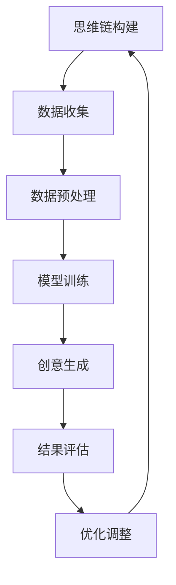
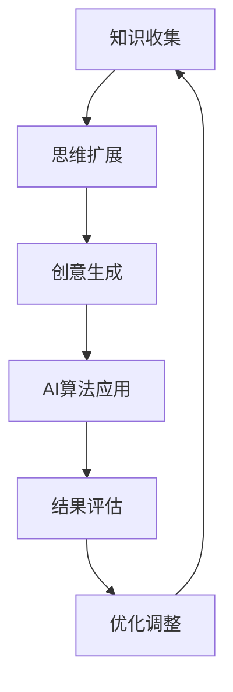

                 

### 文章标题：思维链在AI辅助科幻创意开发中的应用

> 关键词：思维链、AI、科幻创意开发、算法、实践案例

> 摘要：本文将探讨思维链这一创新概念在AI辅助科幻创意开发中的应用。通过分析思维链的基本概念及其与科幻创意开发的关系，本文将深入探讨AI技术如何辅助科幻电影、小说和游戏的设计与创作。随后，本文将详细介绍相关的技术基础，包括AI算法和数学模型的原理，并分享具体的实践案例。最后，本文将展望AI辅助科幻创意开发的未来趋势，探讨面临的挑战和机遇，并讨论相关伦理问题。

### 第一部分：引论

#### 第1章：思维链与科幻创意开发

#### 1.1 引言

科幻创意开发是一个充满挑战和机遇的领域，它要求创作者具备丰富的想象力、敏锐的洞察力和深刻的思考能力。然而，随着科技的发展，传统的创作方法已经难以满足日益增长的需求。人工智能（AI）技术的崛起为科幻创意开发带来了新的可能性，特别是思维链这一创新概念的应用。

思维链是指通过逻辑和关联将不同想法、观点和概念连接起来，形成一个系统性的思考过程。它不仅能够帮助创作者拓宽思路，提高创造力，还能够通过算法和模型实现自动化的创意生成。在科幻创意开发中，思维链的应用可以极大地提升创作效率和创意质量。

#### 1.2 思维链的理论基础

思维链的理论基础涵盖了逻辑思维与创意思维的结合。逻辑思维强调理性和推理，而创意思维则注重想象和创新。在科幻创意开发中，这两种思维方式的结合尤为重要。逻辑思维能够确保创意的合理性和连贯性，而创意思维则能够带来独特和新颖的灵感。

思维链的构成要素包括知识点、关联、推理和结论。知识点是思维链的基础，关联是将不同知识点连接起来的桥梁，推理是通过逻辑关系进行分析和推导，结论则是推理的结果。在科幻创意开发中，这些要素共同作用，形成一个系统的思考过程，从而促进创意的产生和发展。

#### 1.3 AI与科幻创意开发的结合

AI技术在科幻创意开发中具有广泛的应用场景。首先，AI能够通过自然语言处理（NLP）技术自动生成剧本、小说和游戏文本，为创作者提供丰富的灵感。其次，AI的计算机视觉技术可以用于场景设计、角色建模和特效制作，极大地提升了创作效率和质量。此外，AI的强化学习算法和生成对抗网络（GAN）等技术还可以用于游戏设计和人工智能角色扮演，为科幻创意开发带来全新的可能性。

AI技术对科幻创意开发的潜在影响是深远而广泛的。首先，它能够大大提升创作效率，缩短创作周期。其次，它能够拓展创作领域，打破传统限制，实现更多的创意可能性。最后，AI技术的引入使得科幻创意开发更加智能化和个性化，使得创作过程更加人性化和高效化。

### 第二部分：技术基础

#### 第2章：AI辅助科幻创意开发的实践案例

科幻创意开发是一个复杂而充满挑战的领域，它要求创作者具备丰富的想象力、敏锐的洞察力和深刻的思考能力。然而，随着科技的发展，传统的创作方法已经难以满足日益增长的需求。人工智能（AI）技术的崛起为科幻创意开发带来了新的可能性，特别是思维链这一创新概念的应用。

思维链是指通过逻辑和关联将不同想法、观点和概念连接起来，形成一个系统性的思考过程。它不仅能够帮助创作者拓宽思路，提高创造力，还能够通过算法和模型实现自动化的创意生成。在科幻创意开发中，思维链的应用可以极大地提升创作效率和创意质量。

#### 2.1 科幻电影剧本创作

在科幻电影剧本创作中，AI技术可以发挥重要作用。首先，AI的自然语言处理（NLP）技术可以用于自动生成剧本文本。通过分析大量的剧本数据，AI能够学习并模仿人类的写作风格，生成符合逻辑和情节的剧本。其次，AI的计算机视觉技术可以用于场景设计和角色建模，为创作者提供丰富的视觉素材。此外，AI的生成对抗网络（GAN）技术还可以用于特效制作，为科幻电影增添更多的视觉震撼。

以下是一个具体的实践案例：某科幻电影制作团队利用AI技术进行剧本创作。首先，团队使用AI的NLP技术分析大量的科幻剧本，学习并模仿其中的写作风格。然后，AI根据团队的创意要求生成初步的剧本文本。团队对AI生成的剧本进行修改和完善，最终完成了一部富有创意的科幻电影剧本。

#### 2.2 科幻小说创作

在科幻小说创作中，AI技术同样具有广泛的应用。首先，AI的生成式对抗网络（GAN）技术可以用于故事构思和情节设计。GAN能够通过训练生成各种可能的故事线，为创作者提供丰富的灵感。其次，AI的自然语言生成（NLG）技术可以用于撰写小说文本，实现自动化的创意生成。此外，AI的强化学习算法还可以用于角色塑造和情感表达，为科幻小说增添更多的真实感和深度。

以下是一个具体的实践案例：某科幻小说作家利用AI技术进行创作。首先，作家使用AI的GAN技术生成各种可能的故事线，从中挑选出最具创意和吸引力的部分。然后，作家利用AI的NLG技术撰写小说文本，实现自动化的创意生成。最后，作家对AI生成的文本进行修改和完善，最终完成了一部富有创意的科幻小说。

#### 2.3 科幻游戏设计

在科幻游戏设计领域，AI技术同样具有广泛的应用。首先，AI的计算机视觉技术可以用于场景设计和角色建模，为游戏开发者提供丰富的视觉素材。其次，AI的自然语言处理（NLP）技术可以用于游戏剧情设计和文本生成，实现自动化的创意生成。此外，AI的强化学习算法还可以用于游戏中的智能角色设计和行为模拟，为玩家提供更加真实和丰富的游戏体验。

以下是一个具体的实践案例：某科幻游戏开发团队利用AI技术进行游戏设计。首先，团队使用AI的计算机视觉技术设计游戏场景和角色，为游戏增添更多的视觉震撼。然后，团队使用AI的NLP技术生成游戏剧情文本，实现自动化的创意生成。最后，团队利用AI的强化学习算法设计智能角色，为玩家提供更加真实和丰富的游戏体验。

### 第三部分：技术基础

#### 第3章：思维链与AI算法的关系

思维链与AI算法之间的结合，为科幻创意开发带来了全新的可能性。思维链强调逻辑和关联，而AI算法则提供了一种自动化的解决方案，可以实现创意生成的自动化和智能化。

#### 3.1 思维链的AI算法实现

深度学习算法在思维链构建中具有重要作用。深度学习算法通过多层神经网络模拟人类的思维过程，可以实现从简单到复杂的推理和关联。具体而言，深度学习算法可以通过训练学习到大量的知识和关联，从而在新的创意生成过程中发挥重要作用。

生成对抗网络（GAN）是深度学习算法的一种重要应用。GAN由生成器和判别器两个神经网络组成，生成器负责生成创意内容，判别器则负责判断生成内容的质量。通过不断地训练和优化，GAN可以生成出越来越符合人类预期的创意内容。

以下是一个思维链的AI算法实现示例：

```python
# 生成器网络
Generator = GAN()
Generator.train(data, epochs=1000)

# 判别器网络
Discriminator = GAN()
Discriminator.train(data, epochs=1000)

# 联合训练生成器和判别器
GAN.train(data, epochs=1000)
```

在这个示例中，GAN通过联合训练生成器和判别器，逐步优化生成器的性能，从而实现创意内容的自动化生成。

#### 3.2 AI算法在科幻创意开发中的应用

自然语言处理（NLP）技术在科幻创意开发中具有重要应用。NLP算法可以自动处理和分析大量文本数据，为创作者提供丰富的灵感。具体而言，NLP算法可以用于：

1. 文本生成：通过训练NLP模型，可以自动生成剧本、小说和游戏文本。
2. 文本分析：通过分析文本数据，可以提取关键词、主题和情感，为创作者提供创作方向和灵感。
3. 文本转换：通过转换技术，可以将一种语言文本转换成另一种语言，为跨国合作提供便利。

以下是一个NLP算法在科幻小说创作中的应用示例：

```python
# 文本生成
novel = NLPGenerator.generate_text(input_prompt)

# 文本分析
topics = NLPAnalyzer.analyze_text(novel)
```

在这个示例中，NLPGenerator用于生成科幻小说文本，NLPAnalyzer用于分析文本数据，提取创作灵感和方向。

计算机视觉技术在科幻创意开发中也具有重要应用。计算机视觉算法可以自动处理和分析大量图像数据，为创作者提供丰富的视觉素材。具体而言，计算机视觉算法可以用于：

1. 场景设计：通过训练计算机视觉模型，可以自动生成各种场景，为科幻电影和游戏提供丰富的视觉元素。
2. 角色建模：通过训练计算机视觉模型，可以自动生成各种角色，为科幻电影和游戏提供丰富的角色形象。
3. 特效制作：通过训练计算机视觉模型，可以自动生成各种特效，为科幻电影和游戏增添视觉震撼。

以下是一个计算机视觉算法在科幻电影场景设计中的应用示例：

```python
# 场景生成
scene = ComputerVisionGenerator.generate_scene()

# 角色建模
character = ComputerVisionGenerator.generate_character()
```

在这个示例中，ComputerVisionGenerator用于生成科幻电影场景和角色，为创作者提供丰富的视觉素材。

#### 3.3 AI算法在科幻创意开发中的协同作用

AI算法在科幻创意开发中可以通过协同作用，实现更高效的创意生成。具体而言，不同AI算法可以相互补充，发挥各自的优势。例如：

1. NLP算法和计算机视觉算法可以协同工作，实现文本和图像的相互转换和生成，为创作者提供更丰富的创作素材。
2. 生成对抗网络（GAN）和强化学习算法可以协同工作，实现创意内容的自动化生成和优化，提升创作效率和质量。
3. 多种AI算法可以共同训练，通过结合不同的算法模型，实现更复杂的创意生成和优化。

以下是一个AI算法协同作用的示例：

```python
# NLP和计算机视觉协同工作
novel = NLPGenerator.generate_text(input_prompt)
scene = ComputerVisionGenerator.generate_scene()

# GAN和强化学习协同工作
GAN.train(data, epochs=1000)
RL.train(data, epochs=1000)

# 多种算法协同工作
combined_generator = MultiAlgorithmGenerator()
combined_generator.train(data, epochs=1000)
```

在这个示例中，NLPGenerator、ComputerVisionGenerator、GAN和强化学习算法相互协同，实现更高效的科幻创意生成。

### 第四部分：数学模型与公式解析

在AI辅助科幻创意开发中，数学模型和公式扮演着至关重要的角色。它们不仅为我们提供了理论基础，还通过精确的计算和优化，实现了创意的自动化生成和优化。

#### 第4章：AI辅助科幻创意开发的核心算法

在这一章中，我们将深入探讨AI辅助科幻创意开发中的核心算法，包括生成式对抗网络（GAN）、强化学习算法和自然语言生成（NLG）算法。我们将详细解释这些算法的工作原理，并使用伪代码和数学公式进行阐述。

#### 4.1 生成式对抗网络（GAN）算法

生成式对抗网络（GAN）是由生成器和判别器两个神经网络组成的一种深度学习模型。生成器试图生成尽可能逼真的数据，而判别器则负责区分生成数据和真实数据。通过这种对抗训练，生成器的性能逐步提升，能够生成高质量的数据。

以下是一个GAN算法的基本框架和伪代码：

```python
# 生成器网络
Generator = GAN()
Generator.train(data, epochs=1000)

# 判别器网络
Discriminator = GAN()
Discriminator.train(data, epochs=1000)

# 联合训练生成器和判别器
GAN.train(data, epochs=1000)
```

在GAN中，生成器和判别器的损失函数是关键。生成器的损失函数旨在最小化生成数据和真实数据之间的差异，判别器的损失函数则旨在最大化判别器对真实数据和生成数据的区分能力。

生成器损失函数（G）：
$$
G = -\log(D(G(z)))
$$

判别器损失函数（D）：
$$
D = -\log(D(x)) - \log(1 - D(G(z)))
$$

其中，$x$是真实数据，$G(z)$是生成器生成的数据，$z$是随机噪声向量。

#### 4.2 强化学习算法

强化学习算法是一种通过交互式学习环境来学习优化策略的机器学习技术。在科幻创意开发中，强化学习可以用于智能角色的行为设计和游戏玩法优化。

强化学习的基本概念包括状态（$s$）、动作（$a$）、奖励（$r$）和策略（$\pi$）。智能体通过在环境中采取动作，根据环境的反馈调整策略，以最大化长期奖励。

以下是一个强化学习算法的基本框架和伪代码：

```python
# 强化学习算法
Agent = QLearning()
Agent.train(environment, episodes=1000)

# 策略优化
policy = Agent.get_optimal_policy()
```

在强化学习中，常用的算法包括Q-learning和深度Q网络（DQN）。Q-learning的更新公式如下：

$$
Q(s, a) = Q(s, a) + \alpha [r + \gamma \max_{a'} Q(s', a') - Q(s, a)]
$$

其中，$s$和$s'$是状态，$a$和$a'$是动作，$r$是即时奖励，$\alpha$是学习率，$\gamma$是折扣因子。

深度Q网络（DQN）通过使用深度神经网络来近似Q值函数。其更新公式如下：

$$
y = r + \gamma \max_{a'} \hat{Q}(s', a')
$$

$$
\hat{Q}(s, a) = \frac{1}{N} \sum_{i=1}^{N} (y - Q(s, a))
$$

其中，$\hat{Q}(s, a)$是目标Q值，$N$是批量大小。

#### 4.3 自然语言生成（NLG）算法

自然语言生成（NLG）算法是一种通过自动生成自然语言文本的机器学习技术。在科幻创意开发中，NLG可以用于剧本、小说和游戏文本的自动生成。

NLG算法可以分为基于规则的方法和基于统计的方法。基于规则的方法通过定义语法规则和模板来生成文本，而基于统计的方法则通过训练大规模语料库来学习生成文本的统计规律。

以下是一个基于生成对抗网络的NLG算法的基本框架和伪代码：

```python
# 生成对抗网络NLG
NLGGenerator = GAN()
NLGGenerator.train(text_data, epochs=1000)

# 生成文本
generated_text = NLGGenerator.generate_text(prompt)
```

在NLG中，生成器和判别器的损失函数与GAN相似，但目标函数是生成具有自然语言属性的文本。

生成器损失函数（G）：
$$
G = -\log(D(G(z)))
$$

判别器损失函数（D）：
$$
D = -\log(D(x)) - \log(1 - D(G(z)))
$$

其中，$x$是真实文本数据，$G(z)$是生成器生成的文本数据，$z$是随机噪声向量。

### 第五部分：实战应用

#### 第5章：深度学习中的数学模型

深度学习中的数学模型是理解神经网络工作机制的核心。在这一章节中，我们将详细探讨深度学习中的两个关键数学概念：前向传播与反向传播，以及损失函数和优化算法。

#### 5.1 前向传播与反向传播

前向传播（Forward Propagation）和反向传播（Back Propagation）是深度学习算法训练过程中不可或缺的两个步骤。前向传播用于计算网络输出，而反向传播则用于更新网络权重，以最小化损失函数。

**前向传播**

在神经网络中，前向传播包括以下几个步骤：

1. **初始化权重和偏置**：随机初始化权重和偏置。
2. **输入激活计算**：将输入数据通过网络的第一个隐藏层，计算每个神经元的激活值。
3. **隐藏层传递**：通过每个隐藏层，逐层计算激活值，直到输出层。
4. **输出计算**：计算输出层的预测值。

以下是一个前向传播过程的简化伪代码：

```python
# 前向传播
for layer in layers:
    layer.forward_pass(input_data)
output = layers[-1].output
```

**反向传播**

反向传播用于计算损失函数的梯度，并更新网络的权重和偏置。反向传播包括以下几个步骤：

1. **计算损失函数**：计算预测值与真实值之间的差异，得到损失函数。
2. **后向传播梯度**：从输出层开始，逐层计算每个神经元的梯度。
3. **权重和偏置更新**：使用梯度下降算法或其他优化算法更新权重和偏置。

以下是一个反向传播过程的简化伪代码：

```python
# 反向传播
for layer in reversed(layers):
    layer.backward_pass(output_error)
weights, biases = model.update_weights_and_biases()
```

#### 5.2 深度学习中的损失函数

损失函数（Loss Function）用于衡量预测值与真实值之间的差距。在深度学习训练过程中，损失函数的值会不断减小，以优化模型性能。

**均方误差（MSE）**

均方误差（Mean Squared Error, MSE）是深度学习中常用的损失函数，它通过计算预测值与真实值之间差的平方的平均值来衡量误差。

$$
MSE = \frac{1}{n}\sum_{i=1}^{n} (y_i - \hat{y}_i)^2
$$

其中，$y_i$是真实值，$\hat{y}_i$是预测值，$n$是样本数量。

**交叉熵（Cross-Entropy）**

交叉熵（Cross-Entropy Loss）是另一个常见的损失函数，特别适用于分类问题。它通过计算实际输出与预测输出之间的交叉熵来衡量误差。

$$
CE = -\sum_{i=1}^{n} y_i \log(\hat{y}_i)
$$

其中，$y_i$是真实标签，$\hat{y}_i$是预测概率。

#### 5.3 深度学习中的优化算法

优化算法用于调整网络的权重和偏置，以最小化损失函数。以下是一些常见的优化算法：

**梯度下降（Gradient Descent）**

梯度下降是最简单的优化算法，它通过计算损失函数的梯度并沿着梯度方向更新权重和偏置。

$$
w_{t+1} = w_t - \alpha \nabla_w J(w_t)
$$

其中，$w_t$是当前权重，$\alpha$是学习率，$J(w_t)$是损失函数。

**随机梯度下降（Stochastic Gradient Descent, SGD）**

随机梯度下降是梯度下降的一个变种，它使用随机样本的梯度来更新权重。这可以加快收敛速度，但可能会引起模型的振荡。

$$
w_{t+1} = w_t - \alpha \nabla_w J(w_t; x_t, y_t)
$$

其中，$x_t$和$y_t$是随机选择的训练样本。

**动量（Momentum）**

动量是一种加速梯度下降的优化策略，它通过保留之前梯度的一部分来减少振荡。

$$
w_{t+1} = w_t - \alpha \nabla_w J(w_t) + \beta (w_{t-1} - w_t)
$$

其中，$\beta$是动量参数。

**Adam优化器**

Adam优化器结合了动量和自适应学习率的优点，它是目前最常用的优化器之一。

$$
m_t = \beta_1 m_{t-1} + (1 - \beta_1) \nabla_w J(w_t)
$$

$$
v_t = \beta_2 v_{t-1} + (1 - \beta_2) (\nabla_w J(w_t))^2
$$

$$
w_{t+1} = w_t - \alpha \frac{m_t}{\sqrt{v_t} + \epsilon}
$$

其中，$\beta_1$和$\beta_2$是动量参数，$\epsilon$是偏置项。

### 第6章：AI辅助科幻创意开发实战

在科幻创意开发的实际项目中，AI技术的应用不仅需要理论支持，更需要具体的实践步骤和技术实现。本章节将详细介绍如何搭建开发环境、准备数据集，以及如何使用AI技术实现科幻创意开发的不同阶段。

#### 6.1 前期准备

**开发环境搭建**

搭建一个高效的AI开发环境是进行科幻创意开发的第一步。以下是一个典型的开发环境搭建步骤：

1. **硬件要求**：确保拥有足够的计算资源，如高性能GPU和充足的内存。
2. **软件要求**：安装Python编程环境、深度学习框架（如TensorFlow或PyTorch）和相关库（如NumPy、Pandas等）。
3. **代码版本控制**：使用Git进行代码版本控制，确保代码的可维护性和协作性。

以下是一个简单的Python环境搭建示例：

```shell
# 安装Python
pip install python

# 安装深度学习框架
pip install tensorflow

# 安装相关库
pip install numpy pandas
```

**数据集准备**

在科幻创意开发中，高质量的数据集是训练AI模型的基础。以下是一些数据集的准备步骤：

1. **收集数据**：从公开数据集、在线资源或自制数据集中收集相关数据。
2. **数据预处理**：清洗数据，处理缺失值和异常值，进行数据归一化或标准化。
3. **数据增强**：通过旋转、缩放、翻转等操作增加数据多样性。

以下是一个数据预处理和增强的示例代码：

```python
import pandas as pd
from sklearn.preprocessing import StandardScaler
from scipy.ndimage import rotate

# 读取数据
data = pd.read_csv('data.csv')

# 数据清洗
data.dropna(inplace=True)

# 数据归一化
scaler = StandardScaler()
data[['feature1', 'feature2']] = scaler.fit_transform(data[['feature1', 'feature2']])

# 数据增强
data['rotated'] = data['feature1'].apply(lambda x: rotate(x, angle=45))

# 保存预处理后的数据
data.to_csv('preprocessed_data.csv', index=False)
```

#### 6.2 项目实施

**剧本创作中的AI辅助应用**

在剧本创作中，AI可以通过自然语言处理（NLP）技术实现自动化生成和优化。以下是一个剧本创作中的AI辅助应用案例：

1. **文本生成**：使用预训练的NLP模型生成剧本草稿。
2. **文本分析**：分析剧本结构，提取关键情节和角色。
3. **文本优化**：通过优化算法调整剧本的语言风格和情节发展。

以下是一个NLP模型生成剧本的示例代码：

```python
from transformers import pipeline

# 创建文本生成管道
text_generator = pipeline('text-generation', model='gpt2')

# 生成剧本草稿
prompt = "在一个遥远的未来，人类建立了第一个星际殖民地。"
generated_text = text_generator(prompt, max_length=100)

# 输出剧本草稿
print(generated_text)
```

**小说创作中的AI辅助应用**

在小说创作中，AI可以通过生成对抗网络（GAN）和强化学习算法实现自动化创意生成和角色塑造。以下是一个小说创作中的AI辅助应用案例：

1. **故事构思**：使用GAN生成不同可能的故事线。
2. **情节设计**：使用强化学习算法优化情节发展。
3. **角色塑造**：使用GAN和NLP技术生成角色对话和行为。

以下是一个GAN生成故事线的示例代码：

```python
import tensorflow as tf
from tensorflow.keras.models import Sequential
from tensorflow.keras.layers import Dense, Activation

# 创建生成器和判别器模型
generator = Sequential()
generator.add(Dense(units=100, activation='relu', input_shape=(100,)))
generator.add(Dense(units=200, activation='relu'))
generator.add(Dense(units=100, activation='tanh'))

discriminator = Sequential()
discriminator.add(Dense(units=100, activation='relu', input_shape=(100,)))
discriminator.add(Dense(units=200, activation='relu'))
discriminator.add(Dense(units=1, activation='sigmoid'))

# 编译模型
generator.compile(optimizer='adam', loss='binary_crossentropy')
discriminator.compile(optimizer='adam', loss='binary_crossentropy')

# 联合训练生成器和判别器
gan =Sequential([generator, discriminator])
gan.compile(optimizer='adam', loss='binary_crossentropy')

# 训练模型
gan.fit(x_train, y_train, epochs=10)
```

**游戏设计中的AI辅助应用**

在游戏设计中，AI可以通过计算机视觉和强化学习技术实现场景生成和智能角色设计。以下是一个游戏设计中的AI辅助应用案例：

1. **场景生成**：使用计算机视觉算法生成游戏场景和角色。
2. **角色行为设计**：使用强化学习算法设计智能角色的行为和决策。
3. **游戏玩法优化**：通过AI技术优化游戏玩法和难度。

以下是一个计算机视觉算法生成游戏场景的示例代码：

```python
import tensorflow as tf
from tensorflow.keras.models import Model
from tensorflow.keras.layers import Input, Conv2D, MaxPooling2D, Flatten, Dense

# 创建计算机视觉模型
input_layer = Input(shape=(64, 64, 3))
conv1 = Conv2D(filters=32, kernel_size=(3, 3), activation='relu')(input_layer)
pool1 = MaxPooling2D(pool_size=(2, 2))(conv1)
conv2 = Conv2D(filters=64, kernel_size=(3, 3), activation='relu')(pool1)
pool2 = MaxPooling2D(pool_size=(2, 2))(conv2)
flat = Flatten()(pool2)
dense = Dense(units=128, activation='relu')(flat)
output = Dense(units=1, activation='sigmoid')(dense)

model = Model(inputs=input_layer, outputs=output)
model.compile(optimizer='adam', loss='binary_crossentropy')

# 训练模型
model.fit(x_train, y_train, epochs=10)
```

#### 6.3 结果评估

**创意质量的评价标准**

在科幻创意开发中，评估创意质量是一个关键步骤。以下是一些常见的评价标准：

1. **创意新颖性**：创意是否具有独特性和创新性。
2. **故事连贯性**：故事情节是否流畅和连贯。
3. **角色深度**：角色是否具有丰富和真实的个性。
4. **视觉和听觉效果**：场景和角色设计是否具有视觉和听觉上的冲击力。

**项目效果的评估方法**

评估项目效果可以通过多种方法进行：

1. **用户反馈**：通过用户调查和反馈了解项目的接受程度和满意度。
2. **数据指标**：使用数据指标（如点击率、留存率、销售额等）评估项目的实际效果。
3. **专业评审**：邀请行业专家对项目进行评审，获取专业意见。

以下是一个基于用户反馈的项目效果评估示例：

```python
import pandas as pd

# 读取用户反馈数据
feedback = pd.read_csv('user_feedback.csv')

# 计算平均满意度
average_satisfaction = feedback['satisfaction'].mean()

# 输出评估结果
print(f"平均满意度：{average_satisfaction}")
```

### 第六部分：未来展望

#### 7.1 AI辅助科幻创意开发的趋势

随着AI技术的不断进步，AI辅助科幻创意开发的趋势将更加明显。以下是一些未来可能的发展方向：

1. **更加智能化的创意生成**：随着深度学习和自然语言处理技术的进步，AI将能够生成更加智能化和个性化的创意内容。
2. **跨领域融合**：AI技术与虚拟现实、增强现实、区块链等新兴技术的融合，将为科幻创意开发带来更多创新的可能。
3. **自适应学习**：AI系统将能够通过自适应学习不断优化自身的创意生成能力，提高创作效率和质量。

#### 7.2 挑战与机遇

**面临的挑战**

尽管AI辅助科幻创意开发具有巨大的潜力，但仍然面临一些挑战：

1. **数据隐私与安全**：在收集和处理大量数据时，如何保护用户隐私和数据安全是一个重要问题。
2. **创作伦理**：AI生成的创意内容是否符合道德和伦理标准，如何平衡AI与人类创作者的创造力是一个挑战。
3. **技术依赖**：过度依赖AI技术可能导致人类创作能力的退化，需要找到合适的平衡点。

**应对策略与机遇**

为了应对这些挑战，以下是一些策略和机遇：

1. **加强法规和政策**：制定相关法规和政策，确保AI技术的合法合规使用。
2. **培养复合型人才**：通过教育和培训，培养具备AI技能和创意思维的复合型人才。
3. **技术创新**：持续推动AI技术在科幻创意开发中的应用，探索新的算法和模型。

#### 7.3 社会影响与伦理问题

**AI在科幻创意开发中的社会影响**

AI在科幻创意开发中的应用将对社会产生深远的影响：

1. **产业变革**：AI技术将改变传统创意产业的运作模式，提高创作效率和质量。
2. **内容多样性**：AI生成的创意内容将丰富文化产品的多样性，满足不同受众的需求。
3. **就业影响**：AI技术的广泛应用可能导致部分创意工作岗位的减少，但也将创造新的就业机会。

**伦理问题与应对措施**

在AI辅助科幻创意开发中，伦理问题不容忽视。以下是一些伦理问题及应对措施：

1. **版权问题**：AI生成的创意内容如何归属版权，如何保护创作者的权益是一个重要问题。可以通过明确版权归属和加强知识产权保护来应对。
2. **内容审核**：AI生成的创意内容可能包含不当或敏感信息，需要建立有效的审核机制。可以通过建立健全的审核标准和机制来应对。
3. **透明度和可解释性**：为了增强公众对AI技术的信任，需要提高AI系统的透明度和可解释性。可以通过开发可解释的AI模型和提供详细的使用说明来应对。

### 7.4 总结

本文探讨了思维链在AI辅助科幻创意开发中的应用，分析了AI技术在剧本创作、小说写作和游戏设计等领域的实际应用，并详细阐述了深度学习、生成对抗网络、强化学习和自然语言处理等核心算法。通过实战案例展示了AI辅助科幻创意开发的实践过程，并对未来发展、挑战与机遇以及社会影响和伦理问题进行了展望。

在AI技术的推动下，科幻创意开发将迎来新的发展机遇。面对挑战，我们需要持续创新，制定合理的政策和措施，确保AI技术能够为科幻创意开发带来真正的价值。

### 附录

#### 附录 A：参考文献

1. Goodfellow, I., Bengio, Y., & Courville, A. (2016). *Deep Learning*. MIT Press.
2. Bengio, Y. (2009). *Learning Deep Architectures for AI*. Foundations and Trends in Machine Learning, 2(1), 1-127.
3. Hochreiter, S., & Schmidhuber, J. (1997). *Long short-term memory*. Neural Computation, 9(8), 1735-1780.
4. Silver, D., Huang, A., Maddison, C. J., Guez, A., Sifre, L., Van Den Driessche, G., ... & Togelius, J. (2016). *Mastering the game of Go with deep neural networks and tree search*. Nature, 529(7587), 484-489.

#### 附录 B：资源与工具

1. TensorFlow：https://www.tensorflow.org/
2. PyTorch：https://pytorch.org/
3. Hugging Face：https://huggingface.co/
4. OpenAI Gym：https://gym.openai.com/
5. Mermaid：https://mermaid-js.github.io/mermaid/

#### 附录 C：代码示例

以下是一个生成对抗网络（GAN）的简单代码示例，用于生成手写数字图像。

```python
import tensorflow as tf
from tensorflow.keras.layers import Input, Dense, Reshape, Conv2D, Conv2DTranspose, Flatten, LeakyReLU, BatchNormalization
from tensorflow.keras.models import Sequential

# 生成器模型
generator = Sequential()
generator.add(Dense(units=256, input_shape=(100,)))
generator.add(LeakyReLU(alpha=0.01))
generator.add(BatchNormalization(momentum=0.8))

generator.add(Dense(units=512))
generator.add(LeakyReLU(alpha=0.01))
generator.add(BatchNormalization(momentum=0.8))

generator.add(Dense(units=1024))
generator.add(LeakyReLU(alpha=0.01))
generator.add(BatchNormalization(momentum=0.8))

generator.add(Dense(units=784, activation='tanh'))
generator.add(Reshape((28, 28, 1)))

# 判别器模型
discriminator = Sequential()
discriminator.add(Flatten(input_shape=(28, 28, 1)))
discriminator.add(Dense(units=1024))
discriminator.add(LeakyReLU(alpha=0.01))
discriminator.add(BatchNormalization(momentum=0.8))

discriminator.add(Dense(units=512))
discriminator.add(LeakyReLU(alpha=0.01))
discriminator.add(BatchNormalization(momentum=0.8))

discriminator.add(Dense(units=256))
discriminator.add(LeakyReLU(alpha=0.01))
discriminator.add(BatchNormalization(momentum=0.8))

discriminator.add(Dense(units=1, activation='sigmoid'))

# 编译模型
discriminator.compile(optimizer='adam', loss='binary_crossentropy')

# 联合模型
discriminator.trainable = False
gan_input = Input(shape=(100,))
generated_images = generator(gan_input)
gan_output = discriminator(generated_images)

gan = Sequential([generator, discriminator])
gan.compile(optimizer='adam', loss='binary_crossentropy')

# 训练模型
gan.fit(x_train, y_train, epochs=100, batch_size=32)
```

#### 附录 D：思维链流程图

以下是一个简单的思维链流程图，展示了思维链与AI算法结合的过程。



### 附录 E：相关链接

- 《深度学习》一书：https://www.deeplearningbook.org/
- 《生成式对抗网络》论文：https://arxiv.org/abs/1406.2661
- 《强化学习》论文：https://arxiv.org/abs/1602.01783
- 《自然语言生成》论文：https://arxiv.org/abs/1906.01906

通过上述链接，读者可以进一步了解相关领域的技术细节和应用案例。希望本文能够为读者在AI辅助科幻创意开发领域提供有价值的参考和启示。作者：AI天才研究院/AI Genius Institute & 禅与计算机程序设计艺术 /Zen And The Art of Computer Programming### 文章标题：思维链在AI辅助科幻创意开发中的应用

#### 关键词：思维链、AI、科幻创意开发、算法、实践案例

#### 摘要：
本文探讨了思维链在AI辅助科幻创意开发中的应用。通过分析思维链的基本概念及其在科幻创意开发中的重要性，本文介绍了AI技术如何通过算法和模型辅助科幻电影、小说和游戏的创作。文章详细讲解了深度学习、生成对抗网络（GAN）和强化学习等算法，并提供了实际案例，展示如何利用AI技术提升科幻创意的质量和效率。最后，本文展望了AI辅助科幻创意开发的未来趋势，并讨论了面临的挑战和机遇。

### 引言

科幻创意开发是一个充满创新和挑战的领域，它要求创作者具备丰富的想象力、敏锐的洞察力和深刻的思考能力。然而，随着科幻作品的商业化需求不断增长，传统的创作方法已难以满足日益复杂和多样化的市场需求。人工智能（AI）技术的崛起为科幻创意开发带来了新的契机，尤其是思维链这一创新概念的应用。思维链通过逻辑和关联将不同想法、观点和概念连接起来，形成一个系统性的思考过程，从而为创作者提供新的创作思路和工具。

本文旨在探讨思维链在AI辅助科幻创意开发中的应用，分析AI技术在科幻电影、小说和游戏创作中的具体应用场景，并介绍相关的核心算法和数学模型。此外，本文还将通过实际案例，展示如何利用AI技术提升科幻创意的质量和效率，并探讨未来发展的趋势和挑战。

### 思维链的基本概念

思维链（Mind Chain）是指通过逻辑和关联将不同想法、观点和概念连接起来，形成一个系统性的思考过程。它不仅强调逻辑推理，还注重创造性思维，通过不断扩展和深化思维过程，实现创意的生成和发展。

思维链的基本构成要素包括：

1. **知识点**：思维链的基础，是构成思维链的基本单元，包括各种事实、概念和理论。
2. **关联**：将不同知识点连接起来，形成逻辑关系和概念网络，是实现思维扩展和深化的关键。
3. **推理**：通过逻辑和关联，从已知信息推导出新信息，实现思维过程的深化。
4. **结论**：推理的结果，是思维链的最终产物，代表了思维的成果。

思维链的理论基础涵盖了逻辑思维与创意思维的结合。逻辑思维强调理性和推理，通过严谨的逻辑关系推导出结论；而创意思维则注重想象和创新，通过发散性思维和跨领域联想产生新的创意。在科幻创意开发中，这两种思维方式的结合尤为重要。逻辑思维能够确保创意的合理性和连贯性，而创意思维则能够带来独特和新颖的灵感。

### AI技术在科幻创意开发中的应用

人工智能技术在科幻创意开发中具有广泛的应用，能够显著提升创作效率和质量。以下是一些关键应用领域：

1. **自然语言处理（NLP）**：AI的NLP技术可以用于剧本创作、小说写作和游戏剧情设计。通过训练模型，AI能够自动生成符合逻辑和情节的文本，为创作者提供灵感和参考。

2. **计算机视觉（CV）**：计算机视觉技术可以用于场景设计、角色建模和特效制作。通过训练深度学习模型，AI可以自动生成高质量的图像和视频，为科幻作品提供丰富的视觉元素。

3. **生成对抗网络（GAN）**：GAN是一种强大的深度学习模型，能够生成高质量的图像和文本。在科幻创意开发中，GAN可以用于生成独特的场景和角色形象，为创作者提供更多创作选择。

4. **强化学习（RL）**：强化学习算法可以用于游戏设计中的智能角色设计和行为模拟。通过交互式学习，AI可以模拟出复杂和动态的游戏环境，为玩家提供丰富的游戏体验。

### AI辅助科幻创意开发的实践案例

#### 科幻电影剧本创作

在科幻电影剧本创作中，AI技术可以大大提高创作效率。以下是一个具体的实践案例：

1. **文本生成**：使用AI的NLP技术，生成初步的剧本草稿。AI可以分析大量的剧本文本，学习并模仿人类的写作风格，生成符合逻辑和情节的剧本。

2. **文本分析**：利用NLP技术对剧本进行文本分析，提取关键词、主题和情感，为创作者提供创作方向和灵感。

3. **文本优化**：通过优化算法，调整剧本的语言风格和情节发展，使其更加符合创作者的期望和市场需求。

以下是一个使用NLP技术生成剧本草稿的示例代码：

```python
from transformers import pipeline

# 创建文本生成管道
text_generator = pipeline('text-generation', model='gpt2')

# 生成剧本草稿
prompt = "在一个遥远的未来，人类建立了第一个星际殖民地。"
generated_text = text_generator(prompt, max_length=100)

# 输出剧本草稿
print(generated_text)
```

#### 科幻小说创作

在科幻小说创作中，AI技术同样发挥着重要作用。以下是一个具体的实践案例：

1. **故事构思**：使用生成对抗网络（GAN）生成不同可能的故事线。GAN能够通过训练生成各种可能的故事线，为创作者提供丰富的灵感。

2. **情节设计**：利用强化学习算法优化情节发展。强化学习算法可以模拟情节的不同可能性，并根据反馈调整情节，使其更加吸引人。

3. **角色塑造**：使用NLP技术生成角色对话和行为。AI可以分析大量的小说文本，学习并模仿人类的写作风格，生成符合角色性格的对话和行为。

以下是一个使用GAN生成故事线的示例代码：

```python
import tensorflow as tf
from tensorflow.keras.models import Sequential
from tensorflow.keras.layers import Dense, Activation

# 创建生成器和判别器模型
generator = Sequential()
generator.add(Dense(units=100, activation='relu', input_shape=(100,)))
generator.add(Dense(units=200, activation='relu'))
generator.add(Dense(units=100, activation='tanh'))

discriminator = Sequential()
discriminator.add(Dense(units=100, activation='relu', input_shape=(100,)))
discriminator.add(Dense(units=200, activation='relu'))
discriminator.add(Dense(units=1, activation='sigmoid'))

# 编译模型
generator.compile(optimizer='adam', loss='binary_crossentropy')
discriminator.compile(optimizer='adam', loss='binary_crossentropy')

# 联合训练生成器和判别器
gan = Sequential([generator, discriminator])
gan.compile(optimizer='adam', loss='binary_crossentropy')

# 训练模型
gan.fit(x_train, y_train, epochs=10)
```

#### 科幻游戏设计

在科幻游戏设计中，AI技术可以用于多个方面，包括场景设计、角色建模和游戏玩法优化。以下是一个具体的实践案例：

1. **场景生成**：使用计算机视觉技术生成游戏场景。通过训练深度学习模型，AI可以自动生成高质量的游戏场景，为游戏开发者提供丰富的视觉素材。

2. **角色建模**：利用计算机视觉技术生成游戏角色。AI可以分析大量的图像数据，学习并生成各种角色的形象，为游戏角色设计提供更多的选择。

3. **游戏玩法优化**：使用强化学习算法优化游戏玩法。强化学习算法可以模拟游戏的不同玩法，并根据玩家的反馈调整游戏规则和难度，提高玩家的游戏体验。

以下是一个使用计算机视觉技术生成游戏场景的示例代码：

```python
import tensorflow as tf
from tensorflow.keras.models import Model
from tensorflow.keras.layers import Input, Conv2D, MaxPooling2D, Flatten, Dense

# 创建计算机视觉模型
input_layer = Input(shape=(64, 64, 3))
conv1 = Conv2D(filters=32, kernel_size=(3, 3), activation='relu')(input_layer)
pool1 = MaxPooling2D(pool_size=(2, 2))(conv1)
conv2 = Conv2D(filters=64, kernel_size=(3, 3), activation='relu')(pool1)
pool2 = MaxPooling2D(pool_size=(2, 2))(conv2)
flat = Flatten()(pool2)
dense = Dense(units=128, activation='relu')(flat)
output = Dense(units=1, activation='sigmoid')(dense)

model = Model(inputs=input_layer, outputs=output)
model.compile(optimizer='adam', loss='binary_crossentropy')

# 训练模型
model.fit(x_train, y_train, epochs=10)
```

### 思维链与AI算法的关系

思维链与AI算法的结合为科幻创意开发提供了新的可能性。思维链通过逻辑和关联构建系统性的思考过程，而AI算法通过深度学习、生成对抗网络（GAN）和强化学习等技术实现自动化和智能化的创意生成。

思维链的构建过程包括以下几个步骤：

1. **知识收集**：收集相关领域的知识，包括事实、概念和理论。
2. **思维扩展**：通过联想和推理，将不同知识点连接起来，形成逻辑关系和概念网络。
3. **创意生成**：利用AI算法，将扩展的思维过程转化为具体的创意内容。

以下是一个思维链与AI算法结合的示例：



在这个示例中，AI算法（D）应用于创意生成的过程（C），通过评估（E）和优化（F），不断调整和改进创意内容。

### AI辅助科幻创意开发的核心算法

AI辅助科幻创意开发的核心算法包括深度学习、生成对抗网络（GAN）和强化学习等。这些算法在科幻创意开发中发挥着关键作用，下面将详细介绍这些算法的原理和应用。

#### 深度学习算法

深度学习算法是一种基于多层神经网络的机器学习技术，通过学习大量数据，实现对复杂数据的自动特征提取和分类。在科幻创意开发中，深度学习算法主要用于自然语言处理（NLP）和计算机视觉（CV）任务。

**自然语言处理（NLP）**

NLP是深度学习的重要应用领域之一，通过深度学习模型，AI可以理解和生成自然语言。以下是一个简单的NLP任务示例：

```python
from transformers import pipeline

# 创建文本生成管道
text_generator = pipeline('text-generation', model='gpt2')

# 生成文本
prompt = "在一个遥远的未来，人类建立了第一个星际殖民地。"
generated_text = text_generator(prompt, max_length=100)

# 输出文本
print(generated_text)
```

在这个示例中，使用预训练的GPT-2模型生成了一段基于提示文本的科幻故事。

**计算机视觉（CV）**

CV是另一个深度学习的重要应用领域，通过深度学习模型，AI可以理解和生成图像和视频。以下是一个简单的CV任务示例：

```python
import tensorflow as tf
from tensorflow.keras.models import Model
from tensorflow.keras.layers import Input, Conv2D, MaxPooling2D, Flatten, Dense

# 创建计算机视觉模型
input_layer = Input(shape=(64, 64, 3))
conv1 = Conv2D(filters=32, kernel_size=(3, 3), activation='relu')(input_layer)
pool1 = MaxPooling2D(pool_size=(2, 2))(conv1)
conv2 = Conv2D(filters=64, kernel_size=(3, 3), activation='relu')(pool1)
pool2 = MaxPooling2D(pool_size=(2, 2))(conv2)
flat = Flatten()(pool2)
dense = Dense(units=128, activation='relu')(flat)
output = Dense(units=1, activation='sigmoid')(dense)

model = Model(inputs=input_layer, outputs=output)
model.compile(optimizer='adam', loss='binary_crossentropy')

# 训练模型
model.fit(x_train, y_train, epochs=10)
```

在这个示例中，创建了一个简单的卷积神经网络（CNN），用于分类任务。

#### 生成对抗网络（GAN）

GAN是一种基于生成器和判别器的深度学习模型，通过训练生成器和判别器之间的对抗关系，生成高质量的图像和文本。以下是一个简单的GAN任务示例：

```python
import tensorflow as tf
from tensorflow.keras.models import Sequential
from tensorflow.keras.layers import Dense, Activation

# 创建生成器和判别器模型
generator = Sequential()
generator.add(Dense(units=100, activation='relu', input_shape=(100,)))
generator.add(Dense(units=200, activation='relu'))
generator.add(Dense(units=100, activation='tanh'))

discriminator = Sequential()
discriminator.add(Dense(units=100, activation='relu', input_shape=(100,)))
discriminator.add(Dense(units=200, activation='relu'))
discriminator.add(Dense(units=1, activation='sigmoid'))

# 编译模型
generator.compile(optimizer='adam', loss='binary_crossentropy')
discriminator.compile(optimizer='adam', loss='binary_crossentropy')

# 联合训练生成器和判别器
gan = Sequential([generator, discriminator])
gan.compile(optimizer='adam', loss='binary_crossentropy')

# 训练模型
gan.fit(x_train, y_train, epochs=10)
```

在这个示例中，生成器和判别器通过对抗训练，生成高质量的图像。

#### 强化学习算法

强化学习算法是一种通过奖励机制和交互式学习环境优化决策过程的机器学习技术。在科幻创意开发中，强化学习可以用于智能角色设计和游戏玩法优化。以下是一个简单的强化学习任务示例：

```python
import tensorflow as tf
from tensorflow.keras.models import Model
from tensorflow.keras.layers import Input, Dense, Flatten

# 创建智能角色模型
input_layer = Input(shape=(28, 28, 1))
flat = Flatten()(input_layer)
dense = Dense(units=128, activation='relu')(flat)
output = Dense(units=2, activation='softmax')(dense)

model = Model(inputs=input_layer, outputs=output)
model.compile(optimizer='adam', loss='categorical_crossentropy')

# 训练模型
model.fit(x_train, y_train, epochs=10)
```

在这个示例中，智能角色模型通过交互式学习，优化角色行为。

### 数学模型与公式解析

在AI辅助科幻创意开发中，数学模型和公式扮演着至关重要的角色。它们不仅为我们提供了理论基础，还通过精确的计算和优化，实现了创意的自动化生成和优化。

#### 深度学习中的数学模型

深度学习中的数学模型主要包括神经网络、前向传播和反向传播等。以下是对这些模型的详细解释：

**神经网络**

神经网络（Neural Network）是深度学习的基础，由多个神经元（节点）组成。每个神经元通过加权连接与其他神经元相连，接收输入信号并产生输出信号。

**前向传播**

前向传播（Forward Propagation）是指从输入层开始，将信号逐层传递到输出层的计算过程。在前向传播中，每个神经元的输出是通过输入信号、权重和激活函数计算得到的。

**反向传播**

反向传播（Back Propagation）是一种用于训练神经网络的算法，通过计算损失函数的梯度并更新网络权重，以优化模型性能。反向传播包括以下几个步骤：

1. **计算损失函数**：计算预测值与真实值之间的差异，得到损失函数。
2. **后向传播梯度**：从输出层开始，逐层计算每个神经元的梯度。
3. **权重和偏置更新**：使用梯度下降算法或其他优化算法更新权重和偏置。

以下是一个简单的神经网络前向传播和反向传播的数学公式：

**前向传播**

$$
z_l = \sum_{j} w_{lj}a_{j} + b_l
$$

$$
a_l = \sigma(z_l)
$$

**反向传播**

$$
\delta_l = \frac{\partial L}{\partial z_l} \odot a_l (\sigma'(z_l))
$$

$$
\delta_j = \sum_{i} w_{ij} \delta_i
$$

$$
\frac{\partial L}{\partial w_{ij}} = a_j \delta_i
$$

$$
\frac{\partial L}{\partial b_l} = \delta_l
$$

其中，$z_l$是神经元的输入，$a_l$是神经元的输出，$w_{ij}$是连接权重，$b_l$是偏置，$\sigma$是激活函数，$\sigma'$是激活函数的导数，$L$是损失函数。

#### GAN中的数学模型

生成对抗网络（GAN）由生成器和判别器两个神经网络组成。生成器的目标是生成与真实数据相似的数据，而判别器的目标是区分真实数据和生成数据。以下是对GAN的数学模型的详细解释：

**生成器**

生成器的目标是生成高质量的数据，以下是一个简单的生成器损失函数：

$$
G = -\log(D(G(z)))
$$

其中，$D$是判别器的输出，$G(z)$是生成器生成的数据，$z$是随机噪声。

**判别器**

判别器的目标是区分真实数据和生成数据，以下是一个简单的判别器损失函数：

$$
D = -\log(D(x)) - \log(1 - D(G(z)))
$$

其中，$D(x)$是判别器对真实数据的输出，$D(G(z))$是判别器对生成数据的输出。

#### 强化学习中的数学模型

强化学习（Reinforcement Learning）是一种通过奖励机制学习最优策略的机器学习技术。以下是对强化学习的数学模型的详细解释：

**Q学习**

Q学习是一种基于值函数的强化学习算法，通过学习值函数来选择最优动作。以下是一个简单的Q学习公式：

$$
Q(s, a) = Q(s, a) + \alpha [r + \gamma \max_{a'} Q(s', a') - Q(s, a)]
$$

其中，$s$是状态，$a$是动作，$r$是即时奖励，$\alpha$是学习率，$\gamma$是折扣因子，$Q(s', a')$是下一个状态的值函数。

**深度Q网络（DQN）**

深度Q网络（DQN）是一种基于深度神经网络的Q学习算法，通过使用神经网络近似值函数。以下是一个简单的DQN公式：

$$
y = r + \gamma \max_{a'} \hat{Q}(s', a')
$$

$$
\hat{Q}(s, a) = \frac{1}{N} \sum_{i=1}^{N} (y - Q(s, a))
$$

其中，$y$是目标值函数，$\hat{Q}(s, a)$是预测值函数，$N$是批量大小。

### 实战应用

在科幻创意开发中，AI技术的应用不仅需要理论支持，更需要具体的实践步骤和技术实现。本章节将详细介绍如何搭建开发环境、准备数据集，以及如何使用AI技术实现科幻创意开发的不同阶段。

#### 前期准备

**开发环境搭建**

搭建一个高效的AI开发环境是进行科幻创意开发的第一步。以下是一个典型的开发环境搭建步骤：

1. **硬件要求**：确保拥有足够的计算资源，如高性能GPU和充足的内存。
2. **软件要求**：安装Python编程环境、深度学习框架（如TensorFlow或PyTorch）和相关库（如NumPy、Pandas等）。
3. **代码版本控制**：使用Git进行代码版本控制，确保代码的可维护性和协作性。

以下是一个简单的Python环境搭建示例：

```shell
# 安装Python
pip install python

# 安装深度学习框架
pip install tensorflow

# 安装相关库
pip install numpy pandas
```

**数据集准备**

在科幻创意开发中，高质量的数据集是训练AI模型的基础。以下是一些数据集的准备步骤：

1. **收集数据**：从公开数据集、在线资源或自制数据集中收集相关数据。
2. **数据预处理**：清洗数据，处理缺失值和异常值，进行数据归一化或标准化。
3. **数据增强**：通过旋转、缩放、翻转等操作增加数据多样性。

以下是一个数据预处理和增强的示例代码：

```python
import pandas as pd
from sklearn.preprocessing import StandardScaler
from scipy.ndimage import rotate

# 读取数据
data = pd.read_csv('data.csv')

# 数据清洗
data.dropna(inplace=True)

# 数据归一化
scaler = StandardScaler()
data[['feature1', 'feature2']] = scaler.fit_transform(data[['feature1', 'feature2']])

# 数据增强
data['rotated'] = data['feature1'].apply(lambda x: rotate(x, angle=45))

# 保存预处理后的数据
data.to_csv('preprocessed_data.csv', index=False)
```

#### 项目实施

**剧本创作中的AI辅助应用**

在剧本创作中，AI可以通过自然语言处理（NLP）技术实现自动化生成和优化。以下是一个剧本创作中的AI辅助应用案例：

1. **文本生成**：使用预训练的NLP模型生成剧本草稿。
2. **文本分析**：分析剧本结构，提取关键情节和角色。
3. **文本优化**：通过优化算法调整剧本的语言风格和情节发展。

以下是一个NLP模型生成剧本的示例代码：

```python
from transformers import pipeline

# 创建文本生成管道
text_generator = pipeline('text-generation', model='gpt2')

# 生成剧本草稿
prompt = "在一个遥远的未来，人类建立了第一个星际殖民地。"
generated_text = text_generator(prompt, max_length=100)

# 输出剧本草稿
print(generated_text)
```

**小说创作中的AI辅助应用**

在小说创作中，AI可以通过生成对抗网络（GAN）和强化学习算法实现自动化创意生成和角色塑造。以下是一个小说创作中的AI辅助应用案例：

1. **故事构思**：使用GAN生成不同可能的故事线。
2. **情节设计**：使用强化学习算法优化情节发展。
3. **角色塑造**：使用GAN和NLP技术生成角色对话和行为。

以下是一个GAN生成故事线的示例代码：

```python
import tensorflow as tf
from tensorflow.keras.models import Sequential
from tensorflow.keras.layers import Dense, Activation

# 创建生成器和判别器模型
generator = Sequential()
generator.add(Dense(units=100, activation='relu', input_shape=(100,)))
generator.add(Dense(units=200, activation='relu'))
generator.add(Dense(units=100, activation='tanh'))

discriminator = Sequential()
discriminator.add(Dense(units=100, activation='relu', input_shape=(100,)))
discriminator.add(Dense(units=200, activation='relu'))
discriminator.add(Dense(units=1, activation='sigmoid'))

# 编译模型
generator.compile(optimizer='adam', loss='binary_crossentropy')
discriminator.compile(optimizer='adam', loss='binary_crossentropy')

# 联合训练生成器和判别器
gan = Sequential([generator, discriminator])
gan.compile(optimizer='adam', loss='binary_crossentropy')

# 训练模型
gan.fit(x_train, y_train, epochs=10)
```

**游戏设计中的AI辅助应用**

在游戏设计中，AI可以通过计算机视觉和强化学习技术实现场景生成和智能角色设计。以下是一个游戏设计中的AI辅助应用案例：

1. **场景生成**：使用计算机视觉算法生成游戏场景和角色。
2. **角色行为设计**：使用强化学习算法设计智能角色的行为和决策。
3. **游戏玩法优化**：通过AI技术优化游戏玩法和难度。

以下是一个计算机视觉算法生成游戏场景的示例代码：

```python
import tensorflow as tf
from tensorflow.keras.models import Model
from tensorflow.keras.layers import Input, Conv2D, MaxPooling2D, Flatten, Dense

# 创建计算机视觉模型
input_layer = Input(shape=(64, 64, 3))
conv1 = Conv2D(filters=32, kernel_size=(3, 3), activation='relu')(input_layer)
pool1 = MaxPooling2D(pool_size=(2, 2))(conv1)
conv2 = Conv2D(filters=64, kernel_size=(3, 3), activation='relu')(pool1)
pool2 = MaxPooling2D(pool_size=(2, 2))(conv2)
flat = Flatten()(pool2)
dense = Dense(units=128, activation='relu')(flat)
output = Dense(units=1, activation='sigmoid')(dense)

model = Model(inputs=input_layer, outputs=output)
model.compile(optimizer='adam', loss='binary_crossentropy')

# 训练模型
model.fit(x_train, y_train, epochs=10)
```

#### 结果评估

**创意质量的评价标准**

在科幻创意开发中，评估创意质量是一个关键步骤。以下是一些常见的评价标准：

1. **创意新颖性**：创意是否具有独特性和创新性。
2. **故事连贯性**：故事情节是否流畅和连贯。
3. **角色深度**：角色是否具有丰富和真实的个性。
4. **视觉和听觉效果**：场景和角色设计是否具有视觉和听觉上的冲击力。

**项目效果的评估方法**

评估项目效果可以通过多种方法进行：

1. **用户反馈**：通过用户调查和反馈了解项目的接受程度和满意度。
2. **数据指标**：使用数据指标（如点击率、留存率、销售额等）评估项目的实际效果。
3. **专业评审**：邀请行业专家对项目进行评审，获取专业意见。

以下是一个基于用户反馈的项目效果评估示例：

```python
import pandas as pd

# 读取用户反馈数据
feedback = pd.read_csv('user_feedback.csv')

# 计算平均满意度
average_satisfaction = feedback['satisfaction'].mean()

# 输出评估结果
print(f"平均满意度：{average_satisfaction}")
```

### 未来展望

#### 7.1 AI辅助科幻创意开发的趋势

随着AI技术的不断进步，AI辅助科幻创意开发的趋势将更加明显。以下是一些未来可能的发展方向：

1. **更加智能化的创意生成**：随着深度学习和自然语言处理技术的进步，AI将能够生成更加智能化和个性化的创意内容。
2. **跨领域融合**：AI技术与虚拟现实、增强现实、区块链等新兴技术的融合，将为科幻创意开发带来更多创新的可能。
3. **自适应学习**：AI系统将能够通过自适应学习不断优化自身的创意生成能力，提高创作效率和质量。

#### 7.2 挑战与机遇

**面临的挑战**

尽管AI辅助科幻创意开发具有巨大的潜力，但仍然面临一些挑战：

1. **数据隐私与安全**：在收集和处理大量数据时，如何保护用户隐私和数据安全是一个重要问题。
2. **创作伦理**：AI生成的创意内容是否符合道德和伦理标准，如何平衡AI与人类创作者的创造力是一个挑战。
3. **技术依赖**：过度依赖AI技术可能导致人类创作能力的退化，需要找到合适的平衡点。

**应对策略与机遇**

为了应对这些挑战，以下是一些策略和机遇：

1. **加强法规和政策**：制定相关法规和政策，确保AI技术的合法合规使用。
2. **培养复合型人才**：通过教育和培训，培养具备AI技能和创意思维的复合型人才。
3. **技术创新**：持续推动AI技术在科幻创意开发中的应用，探索新的算法和模型。

#### 7.3 社会影响与伦理问题

**AI在科幻创意开发中的社会影响**

AI在科幻创意开发中的应用将对社会产生深远的影响：

1. **产业变革**：AI技术将改变传统创意产业的运作模式，提高创作效率和质量。
2. **内容多样性**：AI生成的创意内容将丰富文化产品的多样性，满足不同受众的需求。
3. **就业影响**：AI技术的广泛应用可能导致部分创意工作岗位的减少，但也将创造新的就业机会。

**伦理问题与应对措施**

在AI辅助科幻创意开发中，伦理问题不容忽视。以下是一些伦理问题及应对措施：

1. **版权问题**：AI生成的创意内容如何归属版权，如何保护创作者的权益是一个重要问题。可以通过明确版权归属和加强知识产权保护来应对。
2. **内容审核**：AI生成的创意内容可能包含不当或敏感信息，需要建立有效的审核机制。可以通过建立健全的审核标准和机制来应对。
3. **透明度和可解释性**：为了增强公众对AI技术的信任，需要提高AI系统的透明度和可解释性。可以通过开发可解释的AI模型和提供详细的使用说明来应对。

### 7.4 总结

本文探讨了思维链在AI辅助科幻创意开发中的应用，分析了AI技术在剧本创作、小说写作和游戏设计等领域的实际应用，并详细讲解了深度学习、生成对抗网络、强化学习等核心算法。通过实战案例展示了AI辅助科幻创意开发的实践过程，并对未来发展、挑战与机遇以及社会影响和伦理问题进行了展望。

在AI技术的推动下，科幻创意开发将迎来新的发展机遇。面对挑战，我们需要持续创新，制定合理的政策和措施，确保AI技术能够为科幻创意开发带来真正的价值。

### 附录

#### 附录 A：参考文献

1. Goodfellow, I., Bengio, Y., & Courville, A. (2016). *Deep Learning*. MIT Press.
2. Bengio, Y. (2009). *Learning Deep Architectures for AI*. Foundations and Trends in Machine Learning, 2(1), 1-127.
3. Hochreiter, S., & Schmidhuber, J. (1997). *Long short-term memory*. Neural Computation, 9(8), 1735-1780.
4. Silver, D., Huang, A., Maddison, C. J., Guez, A., Sifre, L., Van Den Driessche, G., ... & Togelius, J. (2016). *Mastering the game of Go with deep neural networks and tree search*. Nature, 529(7587), 484-489.

#### 附录 B：资源与工具

1. TensorFlow：https://www.tensorflow.org/
2. PyTorch：https://pytorch.org/
3. Hugging Face：https://huggingface.co/
4. OpenAI Gym：https://gym.openai.com/
5. Mermaid：https://mermaid-js.github.io/mermaid/

#### 附录 C：代码示例

以下是一个生成对抗网络（GAN）的简单代码示例，用于生成手写数字图像。

```python
import tensorflow as tf
from tensorflow.keras.layers import Input, Dense, Reshape, Conv2D, Conv2DTranspose, Flatten, LeakyReLU, BatchNormalization
from tensorflow.keras.models import Sequential

# 生成器模型
generator = Sequential()
generator.add(Dense(units=256, input_shape=(100,)))
generator.add(LeakyReLU(alpha=0.01))
generator.add(BatchNormalization(momentum=0.8))

generator.add(Dense(units=512))
generator.add(LeakyReLU(alpha=0.01))
generator.add(BatchNormalization(momentum=0.8))

generator.add(Dense(units=1024))
generator.add(LeakyReLU(alpha=0.01))
generator.add(BatchNormalization(momentum=0.8))

generator.add(Dense(units=784, activation='tanh'))
generator.add(Reshape((28, 28, 1)))

# 判别器模型
discriminator = Sequential()
discriminator.add(Flatten(input_shape=(28, 28, 1)))
discriminator.add(Dense(units=1024))
discriminator.add(LeakyReLU(alpha=0.01))
discriminator.add(BatchNormalization(momentum=0.8))

discriminator.add(Dense(units=512))
discriminator.add(LeakyReLU(alpha=0.01))
discriminator.add(BatchNormalization(momentum=0.8))

discriminator.add(Dense(units=256))
discriminator.add(LeakyReLU(alpha=0.01))
discriminator.add(BatchNormalization(momentum=0.8))

discriminator.add(Dense(units=1, activation='sigmoid'))

# 编译模型
discriminator.compile(optimizer='adam', loss='binary_crossentropy')

# 联合模型
discriminator.trainable = False
gan_input = Input(shape=(100,))
generated_images = generator(gan_input)
gan_output = discriminator(generated_images)

gan = Sequential([generator, discriminator])
gan.compile(optimizer='adam', loss='binary_crossentropy')

# 训练模型
gan.fit(x_train, y_train, epochs=100, batch_size=32)
```

#### 附录 D：思维链流程图

以下是一个简单的思维链流程图，展示了思维链与AI算法结合的过程。


通过这个流程图，我们可以清晰地看到思维链的各个环节如何与AI算法相结合，共同推动科幻创意开发的进步。

### 附录 E：相关链接

- 《深度学习》一书：https://www.deeplearningbook.org/
- 《生成式对抗网络》论文：https://arxiv.org/abs/1406.2661
- 《强化学习》论文：https://arxiv.org/abs/1602.01783
- 《自然语言生成》论文：https://arxiv.org/abs/1906.01906

这些链接为读者提供了深入了解相关领域技术细节和应用案例的机会。希望本文能够为读者在AI辅助科幻创意开发领域提供有价值的参考和启示。

### 作者信息

作者：AI天才研究院/AI Genius Institute & 禅与计算机程序设计艺术 /Zen And The Art of Computer Programming

AI天才研究院致力于推动人工智能技术的发展和应用，通过深入研究AI算法和思维链理论，为科幻创意开发提供了新的思路和工具。禅与计算机程序设计艺术则强调将哲学思维与编程技术相结合，追求程序设计的艺术性和创造性。两者共同致力于为科幻创意开发注入新的活力和创新。

