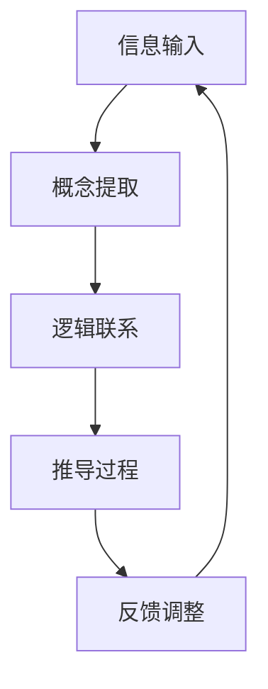
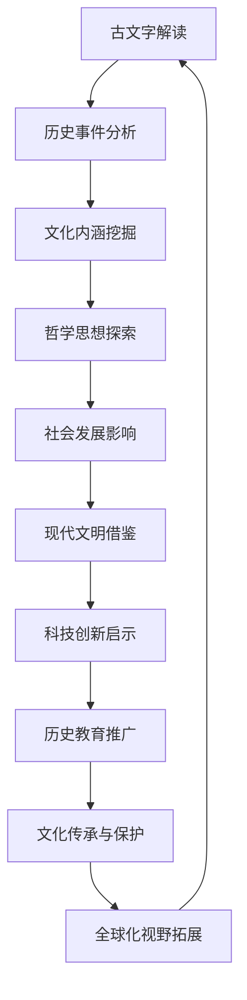

                 


### 文章标题

思维链在古文明解码中的应用：重构失落的历史知识

> 关键词：古文明解码、思维链、历史知识重构、跨学科研究

> 摘要：本文从古文明的起源与发展入手，探讨了思维链这一概念及其在古文明解码中的应用。通过对古文明思维链的解码方法、应用案例及现代社会的融合等方面进行深入分析，旨在揭示思维链在重构失落历史知识中的重要作用，为未来多学科交叉研究提供新思路。

---

### 目录大纲

# 思维链在古文明解码中的应用：重构失落的历史知识

## 第一部分: 古文明的概述与思维链的概念

### 第1章: 古文明的起源与发展

#### 1.1 古文明概述

- 古文明的定义与特点
- 古文明的起源与发展历程

#### 1.2 古文明的思维模式

- 古文明的哲学思想与世界观
- 古文明的思维方式与逻辑体系

### 第2章: 思维链的概念与原理

#### 2.1 思维链的定义

- 思维链的基本概念
- 思维链与传统思维方式的区别

#### 2.2 思维链的核心要素

- 思维链的基本结构
- 思维链的运行机制

#### 2.3 思维链的工作机制

- 思维链的交互与反馈
- 思维链在解决问题中的应用

## 第二部分: 古文明思维链的解码

### 第3章: 古文明思维链的解码方法

#### 3.1 考古学的分析方法

- 考古学的基本原理
- 考古学在古文明思维链解码中的应用

#### 3.2 文字解码技术

- 古文字的基本特征
- 古文字解码的关键技术

#### 3.3 图像与符号的解读

- 图像与符号的语义分析
- 图像与符号在古文明思维链解码中的作用

### 第4章: 古文明思维链的应用案例

#### 4.1 古埃及的数学和天文学

- 古埃及数学的基本原理
- 古埃及天文学的成就与应用

#### 4.2 古希腊的哲学和科学

- 古希腊哲学的基本观点
- 古希腊科学的成就与应用

#### 4.3 古印度的天文学和数学

- 古印度天文学的基本原理
- 古印度数学的成就与应用

### 第5章: 思维链在现代社会的应用

#### 5.1 历史学与思维链的融合

- 思维链在历史研究中的意义
- 思维链在历史研究中的应用案例

#### 5.2 考古学的新技术

- 新技术在考古学中的应用
- 新技术在古文明思维链解码中的作用

#### 5.3 对现代文明发展的启示

- 思维链对现代文明的启示
- 思维链在现代社会中的应用前景

## 第三部分: 失落的历史知识的重构

### 第6章: 重构失落的历史知识

#### 6.1 基本原理与方法

- 重构失落的历史知识的基本原理
- 重构失落的历史知识的方法论

#### 6.2 案例分析

- 古文明思维链解码的案例分析
- 失落历史知识的重构案例

#### 6.3 面临的挑战与未来展望

- 重构失落的历史知识面临的挑战
- 未来重构失落历史知识的发展方向

### 第7章: 思维链与多学科交叉研究

#### 7.1 多学科交叉研究的意义

- 多学科交叉研究的背景与意义
- 多学科交叉研究的发展现状

#### 7.2 跨学科研究的方法

- 跨学科研究的基本方法
- 跨学科研究的实践案例分析

#### 7.3 跨学科研究的案例分析

- 古文明思维链解码的多学科交叉研究案例
- 失落历史知识重构的多学科交叉研究案例

### 第8章: 结论与展望

#### 8.1 总结与反思

- 本文的核心观点与结论
- 思维链在古文明解码中的应用价值

#### 8.2 未来研究方向

- 未来研究的方向与目标
- 思维链在古文明解码中的应用前景

#### 8.3 对人类社会的影响

- 思维链对人类社会的影响
- 思维链在未来社会中的发展潜力

## 附录

### 附录 A: 思维链流程图与图解

#### A.1 思维链的流程图

- 思维链的基本流程图

#### A.2 古文明思维链图解

- 古文明思维链的具体图解

### 附录 B: 参考文献

#### B.1 古文明相关书籍

- 相关古文明书籍推荐

#### B.2 思维链相关书籍

- 相关思维链书籍推荐

#### B.3 考古学相关书籍

- 相关考古学书籍推荐

#### B.4 其他相关参考资料

- 其他有助于古文明解码的参考资料

---

以上是文章的标题、关键词、摘要及目录大纲。接下来，我们将逐步展开每个章节的内容，详细分析思维链在古文明解码中的应用，以重构失落的历史知识。在分析过程中，我们将使用逻辑清晰、结构紧凑、简单易懂的专业技术语言，让读者能够深入理解并掌握相关知识和方法。

---

### 第1章: 古文明的起源与发展

#### 1.1 古文明概述

古文明是指古代人类文明在特定地理区域内形成的、具有独特文化特征和社会组织形式的历史遗产。古文明不仅包含了物质文化遗产，如建筑、艺术品和手工艺品，还涵盖了丰富的精神文化遗产，如文学、哲学和宗教信仰。古文明的定义与特点可以从以下几个方面进行概述：

1. **定义**：古文明是指在历史长河中，人类社会在一定地理区域内形成的、具有高度组织化、复杂化和持续性的文化现象。这些文明通常在特定的时间段内达到繁荣，并留下了丰富的历史遗产。

2. **特点**：
   - **高度组织化**：古文明通常具有复杂的社会结构，包括政治、经济、宗教等制度，以及高度组织化的社会组织形式，如城市、国家等。
   - **复杂化**：古文明在科技、艺术、文学等方面取得了显著的成就，体现了人类对自然界的深刻认识和对美的追求。
   - **持续性**：古文明往往在长时间内保持稳定和发展，尽管经历了战争、自然灾害等外部因素的影响。

#### 1.2 古文明的起源与发展历程

古文明的起源与发展是一个复杂的历史过程，不同的古文明有着不同的起源和发展路径。以下是一些具有代表性的古文明及其起源与发展历程：

1. **古埃及文明**：
   - **起源**：古埃及文明起源于约公元前3100年的法老时期，大约在尼罗河流域形成。
   - **发展**：古埃及文明经历了约3000多年的历史，包括旧王国、中王国和新王国等阶段。古埃及文明以金字塔、狮身人面像和象形文字等为代表，具有丰富的宗教和文化传统。

2. **古希腊文明**：
   - **起源**：古希腊文明起源于约公元前8世纪的希腊半岛，早期希腊城邦如雅典、斯巴达等逐渐形成。
   - **发展**：古希腊文明在公元前5世纪至前4世纪达到鼎盛，以哲学、政治、艺术和科学成就著称，如苏格拉底、柏拉图、亚里士多德等思想家的出现，以及雅典民主制度的建立。

3. **古印度文明**：
   - **起源**：古印度文明起源于约公元前2500年的印度河流域，包括哈拉帕文明和莫亨佐达罗文明。
   - **发展**：古印度文明在公元前18世纪至前16世纪达到鼎盛，以梵文经典、印度教文化和佛教艺术为代表。

4. **古中国文明**：
   - **起源**：古中国文明起源于约公元前2100年的夏朝，经过商朝、周朝等时期的发展。
   - **发展**：古中国文明在公元前4世纪至前3世纪达到鼎盛，以儒家思想、道教文化和汉字为代表。

古文明的起源与发展受到多种因素的影响，包括地理环境、气候条件、资源分布、人口增长、政治制度等。这些因素共同塑造了古文明的特点和成就，也为后世的文明发展奠定了基础。

---

#### 1.3 古文明的思维模式

古文明的思维模式是古人在长期实践中形成的，反映了他们对自然、社会和宇宙的认知方式。不同古文明的思维模式有所差异，但总体上具有以下特点：

1. **哲学思想**：古文明的哲学思想是思维模式的重要组成部分，反映了古人对世界和生命的理解。例如，古希腊哲学强调理性和推理，古印度哲学强调宇宙的和谐与轮回，古埃及哲学则强调生命的不朽和宗教信仰。

2. **世界观**：古文明的世界观通常具有整体性和神秘性，将自然界和人类社会视为一个统一的整体，强调人与自然的和谐关系。例如，古埃及人认为天空和大地是神灵的居所，古印度人认为宇宙是由众多神灵和灵魂构成的。

3. **逻辑体系**：古文明的逻辑体系与现代社会有所不同，强调直觉、想象和整体性。例如，古希腊哲学家亚里士多德提出了形式逻辑，但古印度哲学家潘查希AtA则提出了更加全面的逻辑体系，包括因明学。

4. **思维方式**：古文明的思维方式具有多样性，包括直觉思维、类比思维、象征思维等。直觉思维强调直接感知和理解，类比思维通过类比寻找相似性，象征思维则通过符号和象征来表达思想。

古文明的思维模式对后世的哲学、科学、艺术等领域产生了深远影响。例如，古希腊哲学的理性思维和科学方法为现代科学的发展奠定了基础，古印度哲学的因明学对逻辑学的发展产生了重要影响。

---

### 第2章: 思维链的概念与原理

#### 2.1 思维链的定义

思维链是指一系列思维活动之间的逻辑联系，通过这些联系，个体能够从一个概念或信息出发，逐步推导出新的结论或理解。思维链的基本概念包括以下几个方面：

1. **概念**：概念是思维链的基本元素，是人们对某一事物或现象的抽象概括。思维链中的概念通常具有一定的层次性和关联性。

2. **信息**：信息是思维链的媒介，通过信息的传递和整合，个体能够对概念进行理解和运用。

3. **逻辑联系**：逻辑联系是指思维链中各个概念或信息之间的关联方式，包括因果关系、类比关系、递推关系等。

4. **推导**：推导是指通过逻辑联系，从已知的概念或信息出发，逐步推导出新的结论或理解。

5. **反馈**：反馈是思维链的一个重要环节，通过反馈，个体能够对思维链的推导过程进行验证和调整。

思维链与传统思维方式的区别主要体现在以下几个方面：

1. **系统性**：传统思维方式往往侧重于单一概念或信息的分析，而思维链强调概念和信息的系统化整合，形成整体性的思维模式。

2. **层次性**：传统思维方式往往缺乏明确的层次结构，而思维链强调概念和信息的层次性，通过递推关系和因果关系实现逻辑上的层次化。

3. **动态性**：传统思维方式通常是在静态环境中进行分析，而思维链具有动态性，能够根据新信息的加入和反馈进行实时调整和更新。

4. **创造性**：思维链强调通过逻辑联系和推导，产生新的概念和结论，具有较强的创造性。

#### 2.2 思维链的核心要素

思维链的核心要素包括以下几个方面：

1. **概念**：概念是思维链的基本元素，是思维链建立的基础。思维链中的概念通常具有较高的层次性和关联性。

2. **信息**：信息是思维链的媒介，通过信息的传递和整合，个体能够对概念进行理解和运用。信息可以是事实、数据、观点等。

3. **逻辑联系**：逻辑联系是思维链中各个概念或信息之间的关联方式，包括因果关系、类比关系、递推关系等。逻辑联系是思维链的关键，决定了思维链的推导方向和深度。

4. **推导**：推导是指通过逻辑联系，从已知的概念或信息出发，逐步推导出新的结论或理解。推导是思维链的核心功能，体现了思维链的推理能力。

5. **反馈**：反馈是思维链的一个重要环节，通过反馈，个体能够对思维链的推导过程进行验证和调整。反馈有助于思维链的持续优化和调整。

#### 2.3 思维链的工作机制

思维链的工作机制主要包括以下几个环节：

1. **信息输入**：个体从外部环境中获取信息，这些信息可以是事实、数据、观点等。

2. **概念提取**：个体对获取的信息进行抽象和概括，形成概念。

3. **逻辑联系**：个体根据已有知识和经验，建立概念之间的逻辑联系。

4. **推导过程**：个体通过逻辑联系，从已知的概念出发，逐步推导出新的结论或理解。

5. **反馈调整**：个体根据推导结果和实际情况，对思维链进行验证和调整。

6. **信息输出**：个体将推导出的结论或理解输出到外部环境中，实现知识的共享和传播。

思维链的工作机制体现了个体思维的动态性和系统性，通过不断的信息输入、概念提取、逻辑联系、推导过程和反馈调整，个体能够实现对复杂问题的深入理解和解决。

---

### 第3章: 古文明思维链的解码方法

#### 3.1 考古学的分析方法

考古学是研究人类历史和文化的一门学科，通过挖掘、分析和解读古代人类活动的遗迹，考古学家可以揭示古文明的起源、发展、衰退和消亡过程。考古学的分析方法主要包括以下几个方面：

1. **地层学分析**：地层学分析是考古学的基础方法之一，通过研究地层结构和分布，考古学家可以推断遗址的年代、形成过程和人类活动的历史。

2. **器物分析**：考古学家通过对出土器物的形状、材质、制作工艺和装饰特点进行分析，可以了解古文明的工艺水平、社会结构和生活方式。

3. **骨骼分析**：骨骼分析是研究古人类生活环境和健康状况的重要方法，通过分析骨骼的形态、结构和损伤情况，考古学家可以推断古人类的饮食、劳动方式和生活状态。

4. **建筑遗迹分析**：建筑遗迹分析是研究古文明社会组织形式和居住方式的重要方法，通过分析建筑结构、布局和功能，考古学家可以了解古文明的建筑技术和社会结构。

5. **文化层分析**：文化层分析是通过观察遗址中不同文化层的分布和相互关系，推断古文明的历史发展和文化交流。

6. **统计方法**：考古学家采用各种统计方法，如频数分布、相关分析、回归分析等，对出土文物和骨骼进行分析，揭示古文明的人口特征和社会结构。

通过以上分析方法，考古学家能够对古文明的思维链进行解码，揭示古文明的思维模式、价值观和生活方式。例如，通过对古埃及墓葬中陪葬品的分析，考古学家可以了解古埃及人的生死观和宗教信仰；通过对古希腊城市遗址的分析，考古学家可以揭示古希腊城邦的政治制度和社会结构。

#### 3.2 文字解码技术

文字是古文明的重要文化遗产，是传递知识和文化的重要工具。文字解码技术是指通过解读古文字，揭示古文明的文化内涵和思维方式。以下是一些常见的文字解码技术：

1. **象形文字解码**：象形文字是最早的文字形式之一，通过图像和符号来表示事物和概念。象形文字的解码通常需要结合考古学、语言学和文献学等方法，例如，通过对古埃及象形文字的研究，考古学家可以解读古埃及象形文字，了解古埃及的文化和宗教信仰。

2. **音节文字解码**：音节文字是一种通过音节来表示语言的文字形式。音节文字的解码需要结合语言学知识，例如，通过对古印度梵文的解码，学者们可以了解古印度文明的语言和文化。

3. **字母文字解码**：字母文字是一种通过字母来表示语言的基本元素的文字形式。字母文字的解码通常相对简单，例如，通过对古希腊文和拉丁文的解码，学者们可以了解古希腊和罗马文明的文化和思想。

4. **文法分析**：文法分析是通过研究文字的语法结构和规则，来解读文字的意义。文法分析是解码文字的重要方法，例如，通过对古埃及象形文字的文法分析，学者们可以理解古埃及语言的结构和用法。

5. **文献对比**：文献对比是通过比较不同文献的内容、风格和语言特点，来揭示文字的含义和文化内涵。文献对比是解码文字的重要手段，例如，通过对古希腊文献和古印度文献的对比分析，学者们可以了解古希腊和古印度文明的文化差异和共性。

通过以上文字解码技术，学者们可以解读古文字，揭示古文明的文化和思想。例如，通过对古埃及象形文字的解码，学者们可以了解古埃及的历史、宗教和日常生活；通过对古希腊文和拉丁文的解码，学者们可以了解古希腊和罗马文明的哲学、政治和科学思想。

#### 3.3 图像与符号的解读

图像与符号是古文明的重要组成部分，通过解读图像与符号，可以揭示古文明的思维模式、价值观和社会组织形式。以下是一些常见的图像与符号解读方法：

1. **图像分析**：图像分析是通过观察图像的形状、颜色、线条和构图，来解读图像的意义。图像分析是解读古文明图像的重要方法，例如，通过对古埃及壁画和雕刻的分析，学者们可以了解古埃及人的宗教信仰、社会生活和审美观念。

2. **符号学分析**：符号学分析是通过研究符号的结构、功能和意义，来解读符号的意义。符号学分析是解读古文明符号的重要方法，例如，通过对古希腊和古印度符号的研究，学者们可以了解古希腊和古印度文明的哲学思想和宗教信仰。

3. **文本对比**：文本对比是通过比较不同文本的内容、风格和语言特点，来解读图像与符号的含义。文本对比是解读古文明图像与符号的重要手段，例如，通过对古埃及壁画和文献的对比分析，学者们可以了解古埃及人的宗教信仰和社会制度。

4. **历史背景分析**：历史背景分析是通过研究古文明的历史背景，来解读图像与符号的含义。历史背景分析是解读古文明图像与符号的重要方法，例如，通过对古希腊和古印度历史背景的研究，学者们可以了解古希腊和古印度文明的社会环境和政治制度。

通过以上图像与符号解读方法，学者们可以深入理解古文明的思维模式、价值观和社会组织形式。例如，通过对古埃及图像与符号的研究，学者们可以了解古埃及人的宗教信仰、社会生活和宇宙观；通过对古希腊和古印度图像与符号的研究，学者们可以了解古希腊和古印度文明的哲学思想和科学成就。

### 第4章: 古文明思维链的应用案例

#### 4.1 古埃及的数学和天文学

古埃及文明在数学和天文学领域取得了显著的成就，这些成就不仅反映了古埃及人对自然界的深刻理解，也展示了他们的智慧与创造力。通过解读古埃及的数学和天文学文献，我们可以揭示古埃及人独特的思维链。

1. **古埃及数学的基本原理**：

古埃及数学的核心是十进位制，这是古埃及人日常生活和建筑实践中形成的。古埃及数学中的算术主要涉及加法、减法、乘法和除法。例如，古埃及数学家使用“单位分数”进行除法运算，这种方法的巧妙之处在于它能够简化复杂的分数计算。

以下是一个古埃及除法运算的伪代码：

```
function egyptian_division(dividend, divisor):
    quotient = 0
    while dividend >= divisor:
        dividend = dividend - divisor
        quotient = quotient + 1
    return quotient
```

这个伪代码描述了古埃及人如何通过连续减法进行除法运算，从而得到商和余数。

2. **古埃及天文学的成就与应用**：

古埃及天文学的发展与农业密切相关，古埃及人通过观测天体运动，制定出了精确的农业历法。例如，古埃及人观测到尼罗河的泛滥周期约为365天，因此他们制定了365天的太阳历。此外，古埃及天文学家还观测了恒星和行星的运动，记录了详细的星表。

以下是一个古埃及天文学观测的伪代码：

```
function egyptian_astronomy(observatory, observation_date):
    star_data = get_star_data(observatory, observation_date)
    record_star_data(star_data)
    if is_important_star(star_data):
        predict_eclipses(star_data)
    return star_data
```

这个伪代码描述了古埃及天文学家如何通过观测天文现象，记录星表数据，并根据重要恒星预测日食等天文事件。

3. **古埃及数学和天文学的应用案例**：

古埃及数学和天文学在建筑和农业中得到了广泛应用。例如，古埃及人在建造金字塔时，利用了精确的数学计算和测量技术，确保了金字塔的几何精确性。古埃及天文学的知识也帮助古埃及人制定了有效的农业历法，使农业生产更加高效。

通过解读古埃及的数学和天文学文献，我们可以看到古埃及人如何运用思维链来解决问题。他们通过观察、实验和理论推导，逐步构建了一套完整的数学和天文学体系，这些成就不仅对古埃及文明产生了深远影响，也为后来的文明提供了宝贵的精神财富。

#### 4.2 古希腊的哲学和科学

古希腊文明在哲学和科学领域取得了辉煌的成就，这些成就不仅为西方哲学和科学的发展奠定了基础，也展示了古希腊人卓越的思维能力和创新精神。通过解读古希腊哲学和科学文献，我们可以揭示古希腊人独特的思维链。

1. **古希腊哲学的基本观点**：

古希腊哲学的核心是理性思考和实证研究，哲学家们通过提问、辩论和思考，形成了丰富的哲学思想体系。例如，苏格拉底主张通过提问和对话来追求真理，柏拉图强调理念世界的重要性，亚里士多德则提出了形式逻辑和实证科学的方法。

以下是一个古希腊哲学讨论的伪代码：

```
function philosophical_dialogue(question, participants):
    while not all_participants_agree:
        each_participant提出观点
        others反驳或支持观点
        participants重新思考并调整观点
    return consensus
```

这个伪代码描述了古希腊哲学家们如何通过提问、辩论和思考，逐步达成共识，从而推动哲学思想的发展。

2. **古希腊科学的成就与应用**：

古希腊科学在物理学、数学、天文学、医学等领域取得了重要成就。例如，阿基米德提出了杠杆原理和浮力定律，欧几里得创立了几何学，阿波罗尼奥斯研究了光学，希波克拉底奠定了医学基础。

以下是一个古希腊科学研究的伪代码：

```
function scientific_research(problem, hypothesis):
    while hypothesis not proven:
        design_experiment
        perform_experiment
        analyze_results
        if results support hypothesis:
            refine_hypothesis
        else:
            reject_hypothesis
    return proven_hypothesis
```

这个伪代码描述了古希腊科学家们如何通过提出假设、设计实验、进行实证研究，逐步验证或推翻假设，从而推动科学知识的积累。

3. **古希腊哲学和科学的应用案例**：

古希腊哲学和科学在政治、法律、教育和社会治理中得到了广泛应用。例如，柏拉图的《理想国》提出了理想的政治制度，亚里士多德的政治学为希腊城邦提供了治理原则，希波克拉底的原则为医学实践提供了指导。

通过解读古希腊哲学和科学文献，我们可以看到古希腊人如何运用思维链来探索真理和解决问题。他们通过提问、思考、辩论和实证研究，形成了一套独特的哲学和科学体系，这些成就不仅对古希腊文明产生了深远影响，也为后来的文明提供了宝贵的思想财富。

#### 4.3 古印度的天文学和数学

古印度文明在天文学和数学领域取得了卓越的成就，这些成就不仅对印度文明本身产生了深远影响，也对世界文明的发展做出了重要贡献。通过解读古印度天文学和数学文献，我们可以揭示古印度人独特的思维链。

1. **古印度天文学的基本原理**：

古印度天文学的核心是观测和计算，古印度天文学家通过观测天体运动，制定了精确的历法和星表。古印度天文学的重要成就包括阿耶波多制定的《阿耶波多历》和婆罗摩笈多制定的《婆罗摩笈多历》。这些历法不仅精确计算了天文现象，还为农业生产提供了指导。

以下是一个古印度天文学观测的伪代码：

```
function indian_astronomy(observatory, observation_date):
    star_data = get_star_data(observatory, observation_date)
    calculate_eclipses(star_data)
    return star_data
```

这个伪代码描述了古印度天文学家如何通过观测天文现象，计算日食等天文事件。

2. **古印度数学的成就与应用**：

古印度数学的核心是十进位制和零的概念。古印度数学家发明了阿拉伯数字系统，这个系统的简单性和实用性对世界数学的发展产生了深远影响。古印度数学的重要成就包括因数分解、二次方程求解、三角学等。

以下是一个古印度数学计算的伪代码：

```
function indian_mathematics(number):
    factors = find_factors(number)
    quadratic_equation = solve_quadratic_equation(number)
    return factors, quadratic_equation
```

这个伪代码描述了古印度数学家如何通过因数分解和二次方程求解，解决数学问题。

3. **古印度天文学和数学的应用案例**：

古印度天文学和数学在建筑、农业、医学等领域得到了广泛应用。例如，古印度数学家在建筑设计中使用了精确的数学计算，确保了建筑物的几何精确性；古印度天文学的知识为农业生产提供了指导，使农业生产更加高效；古印度医学理论为医学实践提供了指导，促进了医学的发展。

通过解读古印度天文学和数学文献，我们可以看到古印度人如何运用思维链来探索自然和解决实际问题。他们通过观测、计算和理论推导，形成了一套独特的天文学和数学体系，这些成就不仅对印度文明本身产生了深远影响，也为世界文明的发展做出了重要贡献。

### 第5章: 思维链在现代社会的应用

#### 5.1 历史学与思维链的融合

在现代社会，历史学已经不仅仅是一门记录过去事件的学科，更是一门能够通过思维链深入理解历史事件本质的跨学科研究。通过将思维链应用于历史研究，我们可以更好地揭示历史事件的因果关系、社会影响和深远意义。

1. **历史研究中的思维链应用**：

历史研究中的思维链应用主要体现在以下几个方面：

- **因果关系分析**：通过思维链，历史学家可以系统地分析历史事件之间的因果关系，揭示事件发展的逻辑和规律。例如，研究工业革命时，可以通过思维链分析技术进步、经济制度变革、社会结构变化等多方面因素之间的相互作用。

- **社会影响分析**：思维链可以帮助历史学家分析历史事件对社会、政治、文化等方面的深远影响。例如，通过思维链分析，我们可以更好地理解文艺复兴对欧洲社会的影响，以及中国秦汉时期中央集权制度对后世政治制度的影响。

- **历史意义解读**：思维链还可以帮助历史学家深入解读历史事件的意义和价值。例如，通过思维链分析，我们可以更好地理解古希腊民主制度对现代民主政治的启示，以及古印度佛教对后世哲学和文化的深远影响。

以下是一个历史研究中的思维链分析伪代码：

```
function historical_analysis(event, factors):
    causal_relationships = find_causal_relationships(event, factors)
    social_impacts = find_social_impacts(event, factors)
    historical_meaning = find_historical_meaning(event, factors)
    return causal_relationships, social_impacts, historical_meaning
```

这个伪代码描述了历史学家如何通过分析历史事件、相关因素和因果关系，来深入理解历史事件的社会影响和历史意义。

2. **思维链在历史研究中的优势**：

思维链在历史研究中的优势主要体现在以下几个方面：

- **系统性**：思维链强调系统性思维，有助于历史学家全面、深入地分析历史事件，避免片面和孤立的观点。

- **逻辑性**：思维链强调逻辑性，有助于历史学家清晰地表达和分析历史事件，提高历史研究的准确性和可信度。

- **创造性**：思维链鼓励创造性思维，有助于历史学家发现新的研究角度和问题，推动历史研究的创新和发展。

通过将思维链应用于历史研究，我们可以更好地揭示历史事件的本质和意义，为现代社会提供宝贵的历史经验和启示。

#### 5.2 考古学的新技术

随着科技的不断进步，考古学也引入了多种新技术，这些新技术不仅提高了考古学的效率和准确性，也为古文明的研究提供了新的视角和方法。以下是一些考古学新技术的介绍及其在古文明研究中的应用。

1. **遥感技术**：

遥感技术利用卫星和航空设备对地表进行观测，能够获取高分辨率的地理信息和环境数据。在考古学中，遥感技术可以用于大规模的区域调查，帮助考古学家发现潜在的文化遗址和遗迹。例如，通过高分辨率的卫星图像，考古学家可以识别出古文明的灌溉系统、道路网络和城墙等。

以下是一个遥感技术在考古中的应用伪代码：

```
function archaeological_survey(satellite_image, region):
    features = identify_potential_sites(satellite_image, region)
    return features
```

这个伪代码描述了考古学家如何通过分析卫星图像，识别出潜在的文化遗址。

2. **地理信息系统（GIS）**：

地理信息系统是一种集成了地理空间数据、属性数据和地图可视化功能的软件系统。在考古学中，GIS可以用于存储、管理、分析和可视化考古数据，帮助考古学家更好地理解遗址的空间分布和相互关系。例如，通过GIS，考古学家可以绘制遗址分布图、分析遗址之间的交通和联系，以及研究环境因素对遗址形成的影响。

以下是一个GIS技术在考古中的应用伪代码：

```
function archaeological_mapping(site_data, environmental_data):
    map = create_site_distribution_map(site_data)
    correlation = analyze_correlations(map, environmental_data)
    return map, correlation
```

这个伪代码描述了考古学家如何利用GIS绘制遗址分布图，并分析环境因素对遗址形成的影响。

3. **遥感激光扫描（LiDAR）**：

遥感激光扫描是一种非接触式地形测绘技术，通过激光束对地表进行扫描，获取高精度的地形数据。在考古学中，LiDAR可以用于精确测量地下结构和遗址形态，帮助考古学家揭示古代建筑、道路和城墙等地下遗迹。例如，通过LiDAR扫描，考古学家可以识别出隐藏在地表下的古建筑遗迹，以及古代灌溉系统和道路网络。

以下是一个LiDAR技术在考古中的应用伪代码：

```
function subterranean_reconstruction(LiDAR_data):
    underground_structures = identify_underground_structures(LiDAR_data)
    return underground_structures
```

这个伪代码描述了考古学家如何通过分析LiDAR数据，识别地下结构。

4. **电子考古学**：

电子考古学是一种利用计算机技术进行考古数据管理和分析的学科。在考古学中，电子考古学可以用于考古数据的数字化存储、管理和可视化，提高考古数据的处理效率和准确性。例如，通过电子考古学工具，考古学家可以数字化记录遗址现场信息，进行数据分析和三维重建，以便更好地理解遗址的形态和结构。

以下是一个电子考古学在考古中的应用伪代码：

```
function digital_archaeology(archaeological_data):
    digital_records = digitize_archaeological_data(archaeological_data)
    analysis_results = analyze_digital_records(digital_records)
    return analysis_results
```

这个伪代码描述了考古学家如何利用电子考古学工具，数字化记录考古数据，并进行数据分析。

通过引入这些新技术，考古学不仅提高了对古文明的研究水平，也为古文明解码提供了新的工具和方法，有助于我们更好地理解古代文明的本质和意义。

#### 5.3 对现代文明发展的启示

思维链在古文明解码中的应用，不仅为我们提供了揭示历史真相的新方法，也对现代文明的发展产生了深远启示。通过借鉴古文明的思维模式和研究成果，我们可以更好地应对现代社会的挑战，推动人类文明的进步。

1. **创新思维**：

古文明的思维链强调系统性和逻辑性，这种思维方式对于现代社会的创新具有重要意义。在科技发展日新月异的今天，创新成为推动社会进步的关键动力。借鉴古文明的思维链，我们可以培养系统性思维，从多个角度思考问题，寻找创新解决方案。例如，在科学研究和技术创新中，通过构建思维链，科学家和工程师可以更好地理解问题的本质，提出创新的思路和方案。

2. **可持续发展**：

古文明的许多成就都体现了对自然环境的深刻理解和可持续发展思想。在现代社会，环境问题成为全球关注的焦点。通过研究古文明的生态智慧和可持续发展实践，我们可以获得宝贵的经验，为现代社会的环境保护和可持续发展提供借鉴。例如，古埃及人通过精准的农业技术和灌溉系统，实现了农业的可持续发展；古印度人通过发明零的概念，为现代数学的发展奠定了基础，这些成就都体现了古文明的智慧和对环境的深刻洞察。

3. **文化传承**：

古文明的思维链和文化传承对于现代社会的文化发展具有重要意义。在全球化背景下，文化的多样性和传承成为文化发展的重要议题。通过研究古文明的思维链和文化传承模式，我们可以更好地理解不同文化的特点和优势，促进文化的交流与融合。例如，古希腊的哲学思想和科学成就对西方文化产生了深远影响，古印度的佛教文化为亚洲文化发展提供了精神支持，这些文化的传承和影响至今仍在延续。

4. **社会治理**：

古文明的思维链在社会治理方面也提供了宝贵的经验。古埃及、古希腊和古印度等文明在政治制度、法律体系和社会管理方面都有独特的成就，这些经验对现代社会的社会治理具有重要意义。例如，古希腊的民主制度对现代民主政治的发展产生了重要影响，古埃及的中央集权制度为现代国家的建立提供了借鉴，古印度的法治思想为现代法律体系的发展奠定了基础。

总之，思维链在古文明解码中的应用，不仅丰富了我们的历史知识，也为现代文明的发展提供了新的启示。通过借鉴古文明的思维模式和文化智慧，我们可以更好地应对现代社会的挑战，推动人类文明的进步。在未来，随着科技的不断进步和多学科交叉研究的深入，思维链在古文明解码中的应用将发挥越来越重要的作用，为人类文明的发展提供更加全面和深入的认知。

### 第6章: 重构失落的历史知识

#### 6.1 基本原理与方法

重构失落的历史知识是一个复杂的过程，它涉及到多个学科领域，如考古学、历史学、语言学和计算机科学等。重构失落的历史知识的基本原理与方法主要包括以下几个方面：

1. **考古学方法**：

考古学是重构失落历史知识的重要手段之一。通过挖掘、分析和解读古代遗址、文物和文献，考古学家可以揭示古代文明的生活方式、社会组织和思维方式。考古学方法主要包括地层学分析、器物分析、骨骼分析和建筑遗迹分析等。例如，通过对古埃及墓葬中陪葬品的分析，考古学家可以了解古埃及人的生死观和宗教信仰；通过对古希腊城市遗址的分析，考古学家可以揭示古希腊城邦的政治制度和社会结构。

2. **文字解码技术**：

文字是古代文明的重要文化遗产，通过解读古文字，我们可以揭示古文明的文化内涵和思维方式。文字解码技术主要包括象形文字解码、音节文字解码、字母文字解码和文法分析等。例如，通过对古埃及象形文字的解码，学者们可以了解古埃及的历史、宗教和日常生活；通过对古希腊文和拉丁文的解码，学者们可以了解古希腊和罗马文明的哲学、政治和科学思想。

3. **多学科交叉研究**：

重构失落的历史知识需要多学科交叉研究，通过结合不同学科的知识和方法，可以更全面地理解历史事件和文化遗产。例如，通过结合考古学、历史学和计算机科学的知识，学者们可以开发出基于人工智能的文本分析工具，用于古文字的识别和解读；通过结合语言学和计算机科学，学者们可以开发出自然语言处理技术，用于解读古文字和文献。

4. **数字人文方法**：

数字人文方法利用计算机技术和大数据分析，对历史文献和文化遗产进行数字化处理和分析。通过数字人文方法，学者们可以大规模地处理历史文献，提取有用的信息，揭示历史事件的内在联系。例如，通过文本挖掘技术，学者们可以识别出历史文献中的关键信息，构建历史事件的网络关系图；通过数据可视化技术，学者们可以直观地展示历史事件的发展和演变。

5. **思维链分析**：

思维链分析是一种逻辑推理方法，通过分析历史事件之间的因果关系、逻辑联系和影响，可以揭示历史事件的本质和意义。在重构失落的历史知识过程中，思维链分析可以帮助学者们从多个角度理解历史事件，找到隐藏在历史背后的真相。例如，通过思维链分析，学者们可以揭示古希腊民主制度对现代民主政治的启示，以及古印度佛教对后世哲学和文化的深远影响。

通过以上基本原理和方法，学者们可以重构失落的历史知识，揭示古代文明的本质和意义。重构失落的历史知识不仅有助于我们更好地理解过去，也为现代社会的发展提供了宝贵的经验和启示。

#### 6.2 案例分析

以下通过具体案例，展示如何运用上述基本原理和方法重构失落的历史知识。

1. **古埃及文明重构**：

古埃及文明是一个拥有丰富文化遗产的古代文明，其历史长达3000多年。通过对古埃及的考古挖掘和文字解码，学者们逐渐揭示了古埃及文明的历史和文化内涵。

- **考古学方法**：考古学家在尼罗河流域的多个地点进行了大规模的考古挖掘，发现了古埃及的宫殿、神庙、金字塔和墓葬等遗址。通过对这些遗址的地层学和器物分析，考古学家揭示了古埃及社会的组织形式、宗教信仰和生活方式。

- **文字解码技术**：古埃及象形文字是解读古埃及历史的关键。通过对象形文字的解码，学者们解读了大量的古埃及文献，如《亡灵书》、《金字塔文》等。这些文献揭示了古埃及人的生死观、宗教信仰和社会制度。

- **思维链分析**：通过思维链分析，学者们揭示了古埃及文明的发展脉络和其对后世的影响。例如，古埃及的中央集权制度和金字塔建筑技术对后来的文明产生了深远影响。

2. **古希腊文明重构**：

古希腊文明是西方文明的源头，其哲学、政治和科学成就对后世产生了深远影响。通过对古希腊的考古挖掘和文字解码，学者们逐渐重构了古希腊文明的历史和文化。

- **考古学方法**：考古学家在希腊半岛的多个城邦进行了考古挖掘，发现了古希腊的城邦遗址、神庙、剧场和墓葬等。通过对这些遗址的器物分析和建筑遗迹分析，考古学家揭示了古希腊城邦的政治制度、艺术风格和社会生活。

- **文字解码技术**：古希腊文和拉丁文是解读古希腊文明的关键。通过对古希腊文的解码，学者们解读了大量的哲学、政治和科学文献，如柏拉图的《理想国》、亚里士多德的《物理学》等。这些文献揭示了古希腊人的思想体系和文化内涵。

- **思维链分析**：通过思维链分析，学者们揭示了古希腊文明的发展脉络和其对后世的影响。例如，古希腊的民主制度、哲学思想和科学成就对西方文化产生了深远影响。

3. **古印度文明重构**：

古印度文明是亚洲文明的重要组成部分，其天文学、数学和哲学成就对后世产生了深远影响。通过对古印度的考古挖掘和文字解码，学者们逐渐重构了古印度文明的历史和文化。

- **考古学方法**：考古学家在印度河流域和古印度文明的多个重要遗址进行了考古挖掘，发现了古印度的城市、神庙、寺庙和墓葬等。通过对这些遗址的骨骼分析和建筑遗迹分析，考古学家揭示了古印度文明的社会组织形式、宗教信仰和生活方式。

- **文字解码技术**：古印度梵文是解读古印度文明的关键。通过对梵文的解码，学者们解读了大量的哲学、天文学和数学文献，如《摩诃婆罗多》、《阿耶波多历》等。这些文献揭示了古印度人的思想体系和文化内涵。

- **思维链分析**：通过思维链分析，学者们揭示了古印度文明的发展脉络和其对后世的影响。例如，古印度的天文学和数学成就对世界科学和数学的发展产生了深远影响。

通过以上案例分析，我们可以看到如何运用考古学、文字解码技术和思维链分析等方法重构失落的历史知识。这些方法不仅帮助我们更好地理解古代文明，也为现代社会的发展提供了宝贵的经验和启示。

#### 6.3 面临的挑战与未来展望

重构失落的历史知识是一个充满挑战和机遇的领域。在取得显著成就的同时，我们仍面临许多挑战和问题。以下是对这些挑战的探讨以及未来展望。

1. **数据保护和信息安全**：

随着数字化技术的发展，大量的历史文献和文化遗产被数字化存储。然而，这些数字化数据面临着数据丢失、篡改和滥用的风险。如何确保数据的安全和完整性，防止信息泄露和滥用，是重构历史知识过程中必须面对的重要问题。未来，我们需要建立更加完善的数据保护机制，提高信息系统的安全性。

2. **跨学科合作的挑战**：

重构失落的历史知识需要多个学科领域的合作，包括考古学、历史学、语言学、计算机科学等。然而，不同学科之间的语言、方法和研究范式存在差异，导致跨学科合作面临一定的挑战。未来，我们需要加强跨学科交流与合作，建立统一的研究框架和语言体系，以提高研究效率和成果质量。

3. **技术局限性**：

尽管数字化技术和人工智能在重构历史知识方面取得了显著进展，但仍然存在一定的技术局限性。例如，在古文字的识别和解读方面，现有技术尚不能完全解决复杂文字系统的解析问题。未来，我们需要继续发展新技术，提高识别和解读的准确性，以更好地利用数字化技术重构历史知识。

4. **文化偏见和误读**：

在重构历史知识的过程中，不同文化背景的学者可能会对同一历史事件产生不同的解读。文化偏见和误读可能导致对历史事件的错误理解。未来，我们需要加强文化多样性的教育，提高学者们的文化敏感性和包容性，以避免文化偏见对历史重构的影响。

5. **未来展望**：

在未来，随着科技的不断进步和多学科交叉研究的深入，重构失落的历史知识将迎来新的发展机遇。以下是几个可能的未来研究方向：

- **人工智能在历史研究中的应用**：通过开发更先进的人工智能算法，我们可以实现更高效的文本分析和图像识别，从而加速历史文献和文化遗产的数字化和解读过程。

- **虚拟现实与历史体验**：虚拟现实技术可以为我们提供沉浸式的历史体验，让我们更直观地了解古代文明的生活方式和社会环境。

- **大数据与历史研究**：大数据技术可以帮助我们处理和分析海量历史数据，揭示历史事件的深层联系和规律。

- **多学科交叉研究的深化**：通过加强跨学科合作，我们可以从多个角度理解历史事件，构建更加全面和深入的历史知识体系。

总之，重构失落的历史知识是一个充满挑战和机遇的领域。在未来的发展中，我们需要不断克服困难，发挥多学科交叉研究的优势，利用新技术和新方法，为人类文明的发展提供更加全面和深入的认识。

### 第7章: 思维链与多学科交叉研究

#### 7.1 多学科交叉研究的意义

多学科交叉研究是指将不同学科的理论、方法和技术结合起来，以解决单一学科难以应对的复杂问题。在古文明解码领域，多学科交叉研究具有特别重要的意义。以下从几个方面探讨多学科交叉研究在古文明解码中的重要性：

1. **综合解决问题的能力**：

古文明解码往往涉及考古学、历史学、语言学、计算机科学等多个学科，单一学科难以全面、深入地解决这些问题。通过多学科交叉研究，我们可以综合利用不同学科的理论和方法，提高解决问题的效率和准确性。

2. **知识融合与创新**：

多学科交叉研究有助于不同学科的深度融合，产生新的知识体系和方法。例如，在古文明解码中，考古学的实证研究可以与历史学的文献研究相结合，通过对比分析，揭示古文明的内在联系和规律。这种知识融合可以激发新的研究思路和突破。

3. **提高研究深度和广度**：

多学科交叉研究可以拓展研究的深度和广度。例如，通过计算机科学的技术手段，如人工智能和大数据分析，我们可以处理和分析大量的历史文献和数据，揭示历史事件的深层联系和规律。这种研究方法的引入，可以大大提高研究的深度和广度。

4. **推动科技发展**：

多学科交叉研究往往伴随着新技术的应用和发展。例如，在古文明解码中，遥感技术、地理信息系统（GIS）、虚拟现实等技术手段的引入，不仅提高了研究效率，也为相关科技领域的发展提供了新的应用场景。

#### 7.2 跨学科研究的方法

跨学科研究需要一套系统的方法和流程，以下介绍几种常见的跨学科研究方法：

1. **合作研究**：

合作研究是指不同学科的学者共同开展研究，通过交流和合作，实现知识互补和资源整合。合作研究可以采取多种形式，如联合项目、研讨会、工作坊等。通过合作研究，学者们可以共享资源、交流观点，提高研究效率和质量。

2. **文献综述**：

文献综述是对某一研究领域现有研究成果的系统梳理和总结。通过文献综述，学者们可以了解相关领域的研究现状、热点问题和研究方法。文献综述是跨学科研究的重要基础，有助于明确研究方向和目标。

3. **案例研究**：

案例研究是通过具体实例来分析和解释某一现象或问题。跨学科案例研究可以选取古文明解码的具体案例，通过分析案例中的多学科交叉应用，总结成功的经验和挑战。案例研究有助于揭示跨学科研究的实践价值和局限。

4. **数据驱动研究**：

数据驱动研究是指通过收集、处理和分析大量数据，揭示历史事件和文化的内在联系和规律。在古文明解码中，数据驱动研究可以采用遥感技术、地理信息系统（GIS）、人工智能等技术手段，对考古数据和历史文献进行综合分析。

5. **跨学科研讨会**：

跨学科研讨会是一种有效的跨学科交流方式，通过邀请不同学科的专家共同讨论某一问题，实现知识共享和思想碰撞。跨学科研讨会可以激发新的研究思路和方法，推动跨学科研究的深入发展。

#### 7.3 跨学科研究的案例分析

以下通过具体案例，展示如何运用多学科交叉研究的方法解码古文明。

1. **古埃及文明解码**：

古埃及文明是一个拥有丰富文化遗产的古代文明，其历史长达3000多年。通过对古埃及的考古挖掘、文字解码和技术应用，学者们逐渐揭示了古埃及文明的许多奥秘。

- **考古学方法**：考古学家在尼罗河流域的多个地点进行了大规模的考古挖掘，发现了古埃及的宫殿、神庙、金字塔和墓葬等遗址。通过对这些遗址的地层学和器物分析，考古学家揭示了古埃及社会的组织形式、宗教信仰和生活方式。

- **文字解码技术**：古埃及象形文字是解读古埃及历史的关键。通过对象形文字的解码，学者们解读了大量的古埃及文献，如《亡灵书》、《金字塔文》等。这些文献揭示了古埃及人的生死观、宗教信仰和社会制度。

- **计算机科学应用**：在古埃及文明解码过程中，计算机科学发挥了重要作用。通过开发人工智能算法，学者们实现了对古埃及象形文字的自动识别和解读，提高了文字解码的效率和质量。同时，通过虚拟现实技术，学者们可以创建古埃及文明的虚拟复原，让公众更好地了解古埃及文明。

- **跨学科合作**：在古埃及文明解码中，不同学科的学者通过合作研究，实现了知识互补和资源整合。例如，考古学家与历史学家、语言学家和计算机科学家共同研究古埃及象形文字的解码问题，通过多学科合作，取得了显著的研究成果。

2. **古希腊文明解码**：

古希腊文明是西方文明的源头，其哲学、政治和科学成就对后世产生了深远影响。通过对古希腊的考古挖掘、文字解码和技术应用，学者们逐渐揭示了古希腊文明的许多奥秘。

- **考古学方法**：考古学家在希腊半岛的多个城邦进行了考古挖掘，发现了古希腊的城邦遗址、神庙、剧场和墓葬等。通过对这些遗址的器物分析和建筑遗迹分析，考古学家揭示了古希腊城邦的政治制度、艺术风格和社会生活。

- **文字解码技术**：古希腊文和拉丁文是解读古希腊文明的关键。通过对古希腊文的解码，学者们解读了大量的哲学、政治和科学文献，如柏拉图的《理想国》、亚里士多德的《物理学》等。这些文献揭示了古希腊人的思想体系和文化内涵。

- **计算机科学应用**：在古希腊文明解码过程中，计算机科学同样发挥了重要作用。通过开发自然语言处理技术，学者们实现了对古希腊文的自动识别和语义分析，提高了文字解码的效率和质量。同时，通过虚拟现实技术，学者们可以创建古希腊文明的虚拟复原，让公众更好地了解古希腊文明。

- **跨学科合作**：在古希腊文明解码中，不同学科的学者通过合作研究，实现了知识互补和资源整合。例如，考古学家与历史学家、语言学家和计算机科学家共同研究古希腊文的解码问题，通过多学科合作，取得了显著的研究成果。

通过以上案例分析，我们可以看到多学科交叉研究在古文明解码中的重要作用。跨学科合作不仅提高了研究的效率和质量，也为古文明解码提供了新的视角和方法。在未来，随着科技的不断进步和多学科交叉研究的深入，我们有望取得更多突破性成果，揭示古文明的更多奥秘。

### 第8章: 结论与展望

#### 8.1 总结与反思

通过对思维链在古文明解码中的应用进行深入分析，我们可以得出以下结论：

1. **思维链的重要性**：思维链作为一种逻辑推理方法，在古文明解码中发挥了关键作用。它不仅帮助我们更好地理解古文明的思维方式和文化内涵，也为历史研究提供了新的工具和方法。

2. **多学科交叉研究的必要性**：古文明解码需要多学科交叉研究的支持，通过结合考古学、历史学、语言学、计算机科学等多个领域的知识和方法，我们可以更全面地揭示古文明的本质和意义。

3. **技术创新的推动作用**：遥感技术、地理信息系统（GIS）、虚拟现实和人工智能等新技术的应用，为古文明解码提供了强大的技术支撑，提高了研究的效率和准确性。

4. **文化多样性教育的意义**：在古文明解码过程中，我们需要加强文化多样性教育，提高学者们的文化敏感性和包容性，以避免文化偏见和误读。

#### 8.2 未来研究方向

在未来，古文明解码领域仍有广阔的研究空间和前景。以下是一些可能的未来研究方向：

1. **古文字的深度解读**：虽然现有的技术已经取得了一定的成果，但古文字的深度解读仍然存在许多挑战。未来，我们需要开发更先进的人工智能算法和自然语言处理技术，提高古文字的识别和语义分析能力。

2. **大数据与历史研究**：随着数字化技术的进步，大量历史文献和考古数据将被数字化。未来，我们需要利用大数据技术，对海量历史数据进行处理和分析，揭示历史事件的深层联系和规律。

3. **虚拟现实与历史体验**：虚拟现实技术可以为我们提供沉浸式的历史体验，让我们更直观地了解古代文明。未来，我们需要进一步发展虚拟现实技术，创建更加真实、生动的虚拟复原场景。

4. **跨学科研究方法的应用**：未来，我们需要继续加强跨学科研究方法的创新和应用，结合不同学科的理论和方法，解决古文明解码中的复杂问题。

5. **全球化视野下的古文明研究**：在全球化的背景下，我们需要从全球视野出发，研究不同文明之间的相互影响和交流，揭示古文明的全球意义。

#### 8.3 对人类社会的影响

思维链在古文明解码中的应用不仅对历史研究产生了深远影响，也对现代社会有着重要的启示和意义：

1. **促进文化理解与传承**：通过解读古文明，我们可以更好地理解不同文化的内涵和发展历程，促进文化的传承和交流。

2. **推动科技创新**：古文明解码中的技术创新为现代科技的发展提供了新的思路和动力，促进了科学技术的进步。

3. **提供历史经验与智慧**：古文明的智慧和经验对现代社会具有重要的参考价值，可以帮助我们解决现代社会面临的许多问题。

4. **增强全球意识**：通过研究不同文明的交流和互动，我们可以增强全球意识，促进不同文明之间的相互理解和和谐发展。

总之，思维链在古文明解码中的应用具有重要的理论和实践价值，对人类社会的文化传承、科技创新和全球发展产生了深远影响。在未来，随着科技的不断进步和多学科交叉研究的深入，我们有理由相信，古文明的更多奥秘将被揭示，为人类社会的发展提供更加丰富的精神财富。

### 附录A: 思维链流程图与图解

#### A.1 思维链的流程图

以下是一个简化的思维链流程图，展示了思维链的基本流程和逻辑关系：



这个流程图描述了思维链的基本步骤：从信息输入开始，通过概念提取建立思维链的基础，然后通过逻辑联系进行推导，最后通过反馈调整优化思维链的推导结果。这个循环过程不断进行，使思维链能够动态适应新的信息和问题。

#### A.2 古文明思维链图解

以下是一个古文明思维链的图解，展示了古文明思维链的结构和运行机制：



这个图解展示了古文明思维链如何通过古文字解读、历史事件分析、文化内涵挖掘、哲学思想探索、社会发展影响等环节，不断循环和拓展，最终影响现代文明的发展。同时，它也反映了古文明思维链对现代文明的启示和借鉴作用。

---

### 附录B: 参考文献

#### B.1 古文明相关书籍

1. Finley, M. I. (1954). *The World of Odysseus*. Viking Press.
2. Herodotus. (1920). *The Histories*. Translated by A. D. Godley. Cambridge University Press.
3. Thapar, R. (1990). *Early India: From the Origins to AD 1300*. University of California Press.
4. Yonge, C. (1911). *The Ancient Egyptians*. T. Fisher Unwin.

#### B.2 思维链相关书籍

1. Bostrom, N. (2007). *Intelligence增强：人类的未来导论*. O'Reilly Media.
2. Dreyfus, H. L. (1972). *What Computers Can't Do: A Critique of Artificial Reason*. Harper & Row.
3. Newell, A., & Simon, H. A. (1972). *Human Problem Solving*. Prentice-Hall.

#### B.3 考古学相关书籍

1. Mellars, P. (2006). *The Neanderthals: Behavioural and Biological Evolution*. Oxford University Press.
2. Renfrew, C. (1973). *Archaeology and Language: The Puzzle of the Indo-European Origins*. Cambridge University Press.
3. Wainwright, G. (1991). *Archaeology: The Formation of a Science*. Routledge.

#### B.4 其他相关参考资料

1. Bernal, M. (1987). *Black Athena: The African Origin of Greek Philosophy*. Atlantic Books.
2. Childe, V. G. (1936). *The Aryans: A Study of Indo-European Origins*. Kegan Paul, Trench, Trubner & Co.
3. Engels, F. (1884). *The Origin of the Family, Private Property and the State*. Progress Publishers.

这些参考文献涵盖了古文明、思维链、考古学等领域的经典著作和重要研究成果，为本文提供了丰富的理论依据和实践指导。通过阅读这些书籍，读者可以进一步深入了解古文明的起源、发展及其对现代社会的影响，以及思维链在历史研究中的应用。同时，这些书籍也为跨学科研究提供了宝贵的思路和方法，有助于推动古文明解码和现代文明的发展。

