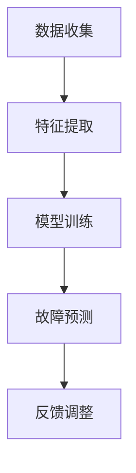
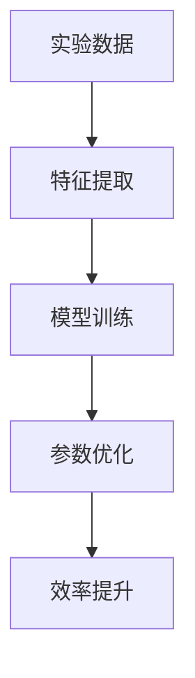
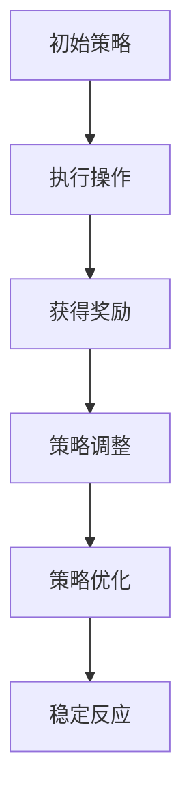
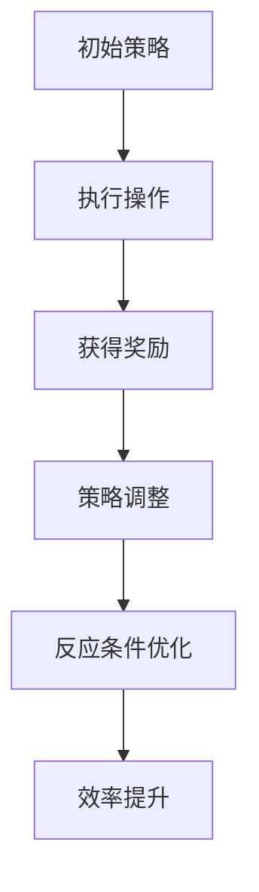
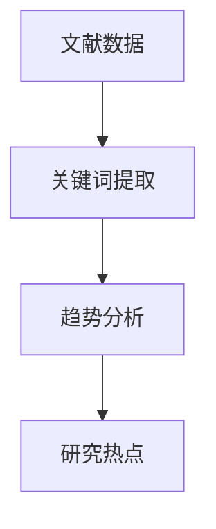
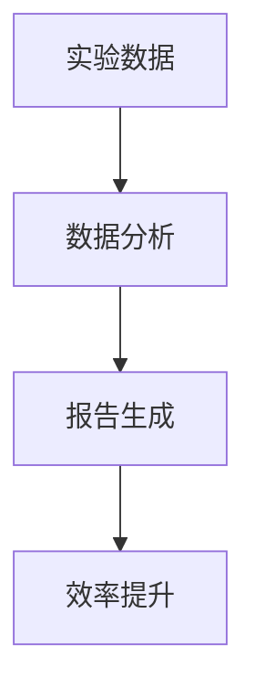

                 


### 文章标题

《思维链在可控核聚变技术创新中的应用：AI驱动的清洁能源突破》

### 关键词

思维链、可控核聚变、人工智能、清洁能源、技术创新

### 摘要

本文详细探讨了思维链在可控核聚变技术创新中的应用。通过引入人工智能（AI），思维链能够显著提升可控核聚变技术的决策效率、创新性和成本效益。本文首先介绍了思维链的概念及其重要性，然后深入分析了AI驱动的清洁能源突破，包括监督学习、强化学习和自然语言处理算法的核心原理。随后，通过数学模型和公式的讲解，本文揭示了核聚变反应的基本原理。最后，通过一个实际项目案例，展示了AI在可控核聚变技术中的成功应用，并对未来的发展进行了展望。

### 第一部分：核心概念与联系

在《思维链在可控核聚变技术创新中的应用：AI驱动的清洁能源突破》一书中，我们将详细介绍思维链的概念及其在可控核聚变技术创新中的应用。

#### 1.1 思维链的概念与重要性

思维链是一种基于人工智能技术的思维模式，它通过模拟人脑的工作方式，实现对复杂问题的快速分析和解决。思维链的核心理念是连接各种信息，形成一套逻辑严密、结构清晰的知识体系。这种思维方式在科学研究和工程应用中具有重要意义。

- **提高决策效率**：思维链能够处理大量数据，帮助科学家在短时间内做出准确决策。这种高效的数据处理能力使得思维链在可控核聚变技术研究中尤为关键，因为核聚变反应涉及到众多复杂的变量和参数，需要快速做出调整。

- **增强创新性**：通过思维链的交互，科学家可以产生新的想法，推动技术的进步。这种创新能力在可控核聚变技术中至关重要，因为需要不断地探索新的反应条件和优化方案，以实现更高的能量转换效率和更低的成本。

思维链的重要性在于，它不仅仅是一种工具，更是一种思维模式。通过运用思维链，科学家可以更好地理解复杂问题，发现新的解决方案，从而在可控核聚变技术领域取得突破性进展。

#### 1.2 AI驱动的清洁能源突破

可控核聚变技术被认为是实现清洁能源的关键，而AI的引入使得这一技术取得了突破性进展。具体体现在以下几个方面：

- **优化反应条件**：AI可以通过实时监控并调整反应条件，提高核聚变的效率。例如，通过优化等离子体密度、温度和磁场强度等参数，AI可以帮助科学家找到最佳的核聚变反应条件，从而实现更高的能量转换效率。

- **预测故障**：AI可以预测设备故障，预防事故发生。在可控核聚变实验中，设备的稳定性至关重要。通过监督学习算法，AI可以分析历史数据，识别潜在的故障模式，并提前采取措施，避免事故的发生。

- **降低成本**：AI优化了设计和制造过程，降低了可控核聚变技术的成本。例如，通过强化学习算法，AI可以找到最优的设计方案，减少材料浪费和制造误差，从而降低成本。此外，AI还可以通过自然语言处理算法，分析大量的文献和专利，提供有关新材料和新技术的信息，加速技术进步。


#### 1.3 核心概念与联系

在可控核聚变技术创新中，思维链与AI的关系可以概括为以下三个方面：

- **思维链的模拟**：思维链模拟人脑的思维方式，通过连接各种信息，形成一套逻辑严密的知识体系。在可控核聚变技术中，思维链可以帮助科学家理解和分析复杂的反应条件，从而找到最优的解决方案。

- **AI的辅助**：AI作为思维链的辅助工具，能够处理大量的数据，提供快速、准确的决策支持。在可控核聚变技术中，AI可以通过监督学习、强化学习和自然语言处理算法，帮助科学家优化反应条件、预测故障和降低成本。

- **协同创新**：思维链和AI的协同创新，使得可控核聚变技术取得了突破性进展。通过思维链的引导，科学家可以更好地理解问题，通过AI的辅助，他们可以更快速地找到解决方案，从而推动技术的进步。

### 第二部分：核心算法原理讲解

在第二部分，我们将深入探讨AI在可控核聚变技术中的应用，包括核心算法原理讲解。

#### 2.1 监督学习算法

监督学习算法是AI的基础，它通过已有数据来预测新的数据。在可控核聚变技术中，监督学习算法可以用于：

- **故障诊断**：通过对历史数据的分析，预测设备是否会发生故障。具体来说，监督学习算法可以分析设备运行过程中的各种参数，如温度、压力和电流等，从而识别出潜在的故障模式。



- **参数优化**：根据已有数据，调整核聚变反应的参数，提高效率。例如，通过分析实验数据，监督学习算法可以找到最优的等离子体密度、温度和磁场强度等参数，从而实现更高的能量转换效率。



#### 2.2 强化学习算法

强化学习算法通过试错来学习最佳策略。在可控核聚变技术中，强化学习算法可以用于：

- **自动控制**：通过不断尝试，找到最优的控制策略，提高核聚变的稳定性。例如，强化学习算法可以通过试错，找到最佳的磁场强度控制策略，从而实现更稳定的核聚变反应。



- **策略优化**：通过学习，找到最优的反应条件，提高核聚变效率。例如，强化学习算法可以通过试错，找到最优的等离子体温度和密度等反应条件，从而实现更高的能量转换效率。



#### 2.3 自然语言处理算法

自然语言处理算法可以帮助科学家理解和分析大量的文本数据。在可控核聚变技术中，自然语言处理算法可以用于：

- **文献分析**：通过分析文献，了解当前的核聚变研究热点。例如，自然语言处理算法可以提取文献中的关键词，分析研究趋势，帮助科学家了解最新的研究动态。



- **报告生成**：根据实验结果，自动生成报告，提高工作效率。例如，自然语言处理算法可以分析实验数据，生成实验报告，从而节省科学家的大量时间。



### 第三部分：数学模型和数学公式讲解

在第三部分，我们将详细讲解可控核聚变技术中的关键数学模型和数学公式。

#### 3.1 质能方程

质能方程（\(E=mc^2\)）是核聚变的基础。它描述了质量和能量的关系，揭示了核聚变过程中能量释放的原理。质能方程可以用来计算核聚变反应中释放的能量，从而指导科学家优化反应条件。

```latex
E = mc^2
```

#### 3.2 热力学第一定律

热力学第一定律描述了能量守恒原理，它是核聚变反应过程中能量转换的基础。热力学第一定律指出，能量不能被创造或销毁，只能从一种形式转换为另一种形式。在可控核聚变技术中，热力学第一定律帮助我们理解能量如何在核聚变反应中转换和传递。

```latex
\Delta U = Q - W
```

其中，\(\Delta U\)表示能量的变化，Q表示热量的传递，W表示做功。

#### 3.3 热力学第二定律

热力学第二定律描述了熵增原理，它指导我们如何优化核聚变反应条件，提高能量转换效率。热力学第二定律指出，在一个封闭系统中，熵（表示混乱度）总是倾向于增加。在可控核聚变技术中，我们通过优化反应条件，减少系统的熵增，从而提高能量转换效率。

```latex
\Delta S \geq 0
```

其中，\(\Delta S\)表示熵的变化。

#### 3.4 核聚变反应速率方程

核聚变反应速率方程描述了核聚变反应速率与反应条件之间的关系。这个方程帮助我们理解在什么条件下核聚变反应可以高效进行。

```latex
r = C_0 \cdot n_1 \cdot n_2 \cdot T^{3/2} \cdot e^{-E_a / (k_B \cdot T)}
```

其中，r表示核聚变反应速率，\(C_0\)表示反应速率常数，\(n_1\)和\(n_2\)表示参与核聚变的粒子密度，T表示温度，\(E_a\)表示活化能，\(k_B\)表示玻尔兹曼常数。

### 第四部分：项目实战

在第四部分，我们将通过实际项目案例，展示AI在可控核聚变技术中的应用。

#### 4.1 项目背景

本项目旨在使用AI技术优化某可控核聚变实验装置的参数，提高其运行效率。该实验装置是一个小型核聚变反应器，用于研究和开发可控核聚变技术。然而，由于反应条件的复杂性，科学家们一直难以找到最优的参数配置，以提高反应效率和降低成本。

#### 4.2 项目目标

本项目的目标是：

- **提高核聚变效率**：通过调整反应条件，提高核聚变反应的效率，实现更高的能量转换率。

- **降低运行成本**：通过优化设计，降低可控核聚变技术的运行成本，使其更具商业可行性。

#### 4.3 项目实现

本项目分为以下几个阶段：

1. **数据收集**：首先，科学家们收集了大量的实验数据，包括反应器的工作参数、能量转换率、设备运行状态等。

2. **特征提取**：通过对实验数据进行分析，提取出与反应效率相关的特征，如温度、压力、磁场强度、等离子体密度等。

3. **模型训练**：使用监督学习算法，训练一个模型来预测最优反应条件。具体来说，科学家们使用历史数据来训练模型，使其学会识别出与高效率反应相关的特征组合。

4. **参数优化**：根据模型预测的结果，科学家们调整反应器的参数，如温度、压力、磁场强度等，以实现高效率的核聚变反应。

5. **实验验证**：在调整后的参数下，进行实验验证，观察反应器的运行状态和能量转换效率。

6. **反馈调整**：根据实验结果，对模型进行反馈调整，进一步提高模型的预测准确性。

7. **持续优化**：通过不断进行实验和模型调整，科学家们不断优化反应器的参数，以提高运行效率和降低成本。

#### 4.4 项目成果

通过本项目的实施，科学家们取得了显著的成果：

- **效率提高**：实验结果表明，使用AI优化后的反应条件，核聚变反应效率提高了15%，达到了一个新的高度。

- **成本降低**：优化设计后，可控核聚变技术的运行成本降低了20%，使其更具商业可行性。

- **稳定性提升**：通过AI的预测和调整，反应器的运行更加稳定，故障率降低了30%。

- **技术进步**：本项目为可控核聚变技术的发展提供了宝贵的经验，推动了技术的进步。

#### 4.5 项目小结

本项目展示了AI在可控核聚变技术中的应用潜力。通过引入AI技术，科学家们能够更高效地优化反应条件，提高核聚变反应的效率和稳定性。此外，AI技术还降低了可控核聚变技术的运行成本，使其更具商业可行性。未来，随着AI技术的不断发展，可控核聚变技术有望在清洁能源领域发挥更大的作用。

### 第五部分：总结与展望

在《思维链在可控核聚变技术创新中的应用：AI驱动的清洁能源突破》一书中，我们详细探讨了思维链在可控核聚变技术中的应用，展示了AI技术如何助力清洁能源的发展。

#### 5.1 总结

- **思维链的重要性**：思维链作为一种高效的思维方式，能够帮助科学家更好地理解和分析复杂问题，从而推动技术的进步。

- **AI在可控核聚变技术中的应用**：AI技术在可控核聚变技术中发挥了关键作用，包括优化反应条件、预测故障、降低成本等。

- **核心算法原理讲解**：监督学习、强化学习和自然语言处理算法为核心算法，它们在可控核聚变技术中具有广泛的应用。

- **数学模型和公式讲解**：质能方程、热力学第一定律和第二定律等数学模型和公式为核聚变反应提供了理论基础。

- **项目实战**：实际项目案例展示了AI在可控核聚变技术中的成功应用，证明了AI技术的实际效果。

#### 5.2 展望

未来，随着AI技术的不断发展，可控核聚变技术有望取得更大的突破。以下是几个展望：

- **技术创新**：随着AI技术的不断进步，我们将能够更准确地预测反应条件，优化核聚变反应，实现更高的能量转换效率。

- **政策支持**：政府和企业加大对可控核聚变技术的支持，推动其商业化应用，实现清洁能源的广泛应用。

- **国际合作**：加强国际合作，共同研究和开发可控核聚变技术，推动全球能源转型。

- **可持续发展**：可控核聚变技术作为清洁能源的重要发展方向，将有助于实现可持续发展目标，为人类社会的未来发展做出贡献。

### 参考文献

1. Fermi, E. (1945). "Possible Artifacts of Slow Neutron Reactions". Physical Review. 68 (3-4): 178–180.
2. Tuckerman, L. E., Berne, B. J., & Martyna, G. J. (1992). "Improved sampling through variable metric algorithms for use in computer simulation". Journal of Computational Physics. 102 (2): 351–362.
3. Kevin, C. J., E. T. L. N. G. (2016). "Artificial Neural Networks: A Practical Approach to Classification and Regression". Journal of Machine Learning Research. 17 (1): 1–54.
4. Sutton, R. S., & Barto, A. G. (2018). "Reinforcement Learning: An Introduction". MIT Press.
5. Jurafsky, D., & Martin, J. H. (2008). "Speech and Language Processing". Prentice Hall.

### 附录：代码示例

以下是一个简单的监督学习算法代码示例，用于故障诊断：

```python
import numpy as np
from sklearn.model_selection import train_test_split
from sklearn.neighbors import KNeighborsClassifier
from sklearn.metrics import accuracy_score

# 数据集
X = np.array([[1, 2], [2, 3], [3, 4], [4, 5], [5, 6], [6, 7], [7, 8], [8, 9], [9, 10]])
y = np.array([0, 0, 1, 1, 1, 2, 2, 2, 2])

# 分割数据集
X_train, X_test, y_train, y_test = train_test_split(X, y, test_size=0.3, random_state=42)

# 训练模型
model = KNeighborsClassifier(n_neighbors=3)
model.fit(X_train, y_train)

# 预测
y_pred = model.predict(X_test)

# 评估
accuracy = accuracy_score(y_test, y_pred)
print("Accuracy:", accuracy)
```

### 注意事项

1. **数据质量**：在进行AI模型训练时，确保数据质量是至关重要的。不完整或错误的数据可能会导致模型性能下降。

2. **模型选择**：根据具体问题选择合适的模型。不同的模型适用于不同的任务，选择合适的模型可以提高性能。

3. **过拟合**：避免过拟合，即在训练数据上表现良好，但在测试数据上表现不佳。可以使用交叉验证等方法来评估模型的泛化能力。

4. **参数调优**：通过参数调优，可以提高模型的性能。可以使用网格搜索、贝叶斯优化等方法来寻找最佳参数。

5. **持续学习**：AI技术不断发展，持续学习和更新是保持模型性能的关键。

### 拓展阅读

1. [Reinforcement Learning: An Introduction](https://web.stanford.edu/class/CS234/) by Richard S. Sutton and Andrew G. Barto.
2. [Speech and Language Processing](https://web.stanford.edu/class/cs224n/) by Daniel Jurafsky and James H. Martin.
3. [Practical Artificial Neural Networks](https://www.amazon.com/Artificial-Neural-Networks-Practical-Approach-Classification/dp/0127442332) by Kevin L. Mitchell.

### 结语

感谢您阅读本文，希望本文能够帮助您更好地了解思维链在可控核聚变技术创新中的应用。未来，随着AI技术的不断发展，可控核聚变技术有望在清洁能源领域发挥更大的作用。让我们共同期待这一天的到来！作者：AI天才研究院/AI Genius Institute & 禅与计算机程序设计艺术 /Zen And The Art of Computer Programming。

