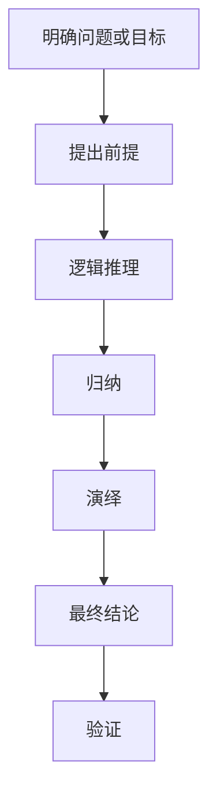
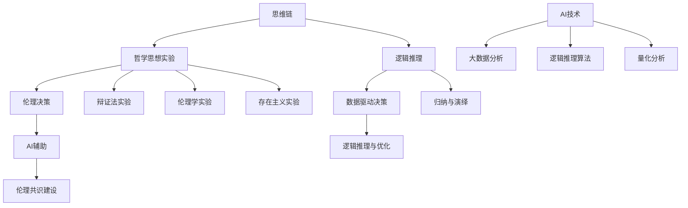

                 

### 第一部分：引言与核心概念

#### 1.1 引言

在当今世界，人工智能（AI）的发展速度之快，已经超出了大多数人的预期。AI技术不仅改变了我们的生活方式，还在各个领域发挥着越来越重要的作用。然而，随着AI技术的不断进步，伦理问题也日益凸显。如何在AI的发展中确保其符合伦理标准，已经成为一个亟待解决的问题。本书《思维链在哲学思想实验设计中的应用：AI辅助伦理边界探索》旨在探讨思维链在哲学思想实验中的重要性，以及AI在伦理边界探索中的作用。

本书的第一部分将介绍思维链和哲学思想实验的基础知识，为后续内容的讨论打下坚实的基础。思维链作为一种逻辑推理的方法，可以帮助我们更清晰地思考问题，找到解决问题的路径。哲学思想实验则是哲学家用来探讨抽象哲学问题的一种方法，通过构建假想的情境，引导人们思考伦理、逻辑、存在等根本性问题。在本章中，我们将详细探讨思维链和哲学思想实验的基本概念、原理和应用。

#### 1.2 思维链概述

思维链是一种通过逻辑推理和分析构建思想的方法，它可以帮助我们更清晰地思考问题，找到解决问题的路径。思维链的基本原理包括以下几个方面：

- **前提**：思维链的起点是明确的问题或目标，它是后续推理的基础。一个明确的前提是思维链有效运行的关键。

- **推理**：通过逻辑推理，从前提推导出中间结论。逻辑推理是思维链的核心步骤，它确保了思维的严谨性和系统性。

- **归纳**：将中间结论归纳为更普遍的原理或规律。归纳步骤使思维链的结论更具普遍性，为后续的演绎提供基础。

- **演绎**：根据普遍原理或规律推导出最终结论。演绎步骤是思维链的终点，它将归纳得到的原理应用于特定情境，得出最终结论。

思维链的流程可以概括为以下几个步骤：

1. **明确问题或目标**：确定需要解决的问题或达成的目标。
2. **提出前提**：根据问题和目标，提出能够支持后续推理的前提。
3. **逻辑推理**：从前提出发，运用逻辑推理方法推导出中间结论。
4. **归纳**：将中间结论归纳为更普遍的原理或规律。
5. **演绎**：根据普遍原理或规律推导出最终结论。
6. **验证**：对最终结论进行验证，确保其正确性和合理性。

#### 1.3 哲学思想实验概述

哲学思想实验是哲学家用来探讨抽象哲学问题的一种方法，通过构建一个假想的情境，引导人们思考伦理、逻辑、存在等根本性问题。哲学思想实验的基本类型包括：

- **辩证法实验**：通过对立观点的碰撞，探讨真理和道德的本质。辩证法实验强调对立统一的观点，通过辩论和讨论来揭示问题的本质。

- **伦理学实验**：通过设定特定的伦理困境，探讨道德选择和责任。伦理学实验通常涉及道德决策的复杂性，通过设定不同的情境，引导人们思考道德原则和价值观。

- **存在主义实验**：通过设定特定的存在情境，探讨人的自由、选择和存在意义。存在主义实验强调个体的主观体验和自我选择，通过设定特定的情境，引导人们反思自己的存在意义。

哲学思想实验的目的是通过构建一个假想的情境，让人们更深入地思考哲学问题。这些实验不仅有助于我们理解抽象的哲学概念，还可以启发我们在现实生活中做出更明智的决策。

#### 1.4 AI辅助伦理边界探索的重要性

AI技术在伦理边界探索中具有重要作用。随着AI技术的不断发展，它不仅能够模拟和优化人类的思维过程，还能为伦理决策提供数据支持和逻辑分析。AI辅助伦理边界探索的重要性体现在以下几个方面：

- **数据驱动的决策**：AI能够处理大量数据，为伦理决策提供更全面的信息。通过数据挖掘和分析，AI可以帮助我们识别潜在的风险和问题，为伦理决策提供科学依据。

- **逻辑推理和分析**：AI能够运用逻辑推理和分析方法，帮助人类更准确地判断伦理问题的复杂性。AI可以模拟不同的伦理决策场景，通过逻辑推理分析各种可能性，为人类提供可靠的决策支持。

- **伦理共识的建立**：AI可以促进不同文化、背景的人们在伦理问题上的共识。通过AI技术，我们可以将不同的伦理观点进行量化分析，找出共识点，促进不同文化之间的伦理对话和交流。

AI在伦理边界探索中的应用不仅有助于解决当前的伦理问题，还可以为未来的伦理决策提供新的思路和方法。随着AI技术的不断进步，它将在伦理领域发挥越来越重要的作用。

### 1.5 本书结构

本书结构如下：

- **第一部分**：引言与核心概念，介绍思维链、哲学思想实验和AI辅助伦理边界探索的基本知识。
- **第二部分**：思维链在哲学思想实验中的应用，探讨思维链在具体哲学思想实验中的运用方法。
- **第三部分**：AI辅助伦理边界探索，分析AI在伦理决策中的应用和挑战。
- **第四部分**：案例研究，通过具体案例展示AI辅助伦理边界探索的实践效果。
- **第五部分**：总结与展望，对全书内容进行总结，并对未来研究方向进行展望。

本书的每一部分都旨在从不同角度探讨思维链和AI在伦理边界探索中的应用，为读者提供全面、系统的理论指导和实践案例。

### 图1.1 思维链的流程图

下面是一个简化的思维链流程图，用于说明思维链的基本步骤和逻辑关系：



### 1.6 本书的定位与目标

本书的定位是为一项综合性学术研究，旨在为哲学、伦理学、计算机科学等领域的学者和从业者提供参考和启示。本书的目标是通过深入探讨思维链在哲学思想实验中的应用，以及AI辅助伦理边界探索的方法和挑战，推动这一领域的学术研究和实际应用。同时，本书也期望能够引起社会各界对伦理问题的关注和讨论，共同推动伦理决策的进步。

### 1.7 思维链与哲学思想实验的关联

思维链与哲学思想实验之间存在着紧密的联系。哲学思想实验通过设定特定的情境，引导人们进行深入的思考和分析，而思维链作为一种逻辑推理的方法，可以帮助人们更系统地理解和解决哲学问题。具体来说，思维链在哲学思想实验中的应用主要体现在以下几个方面：

- **问题定义**：思维链可以帮助人们明确哲学问题的核心，从而更好地设定实验情境。通过思维链的步骤，人们可以更清晰地理解问题的本质，为实验提供明确的起点。

- **逻辑推理**：思维链提供了逻辑推理的框架，使哲学思想实验的推理过程更加严谨和清晰。思维链的推理步骤确保了实验中的逻辑连贯性，使结论更具说服力。

- **结论归纳**：思维链的归纳步骤可以帮助人们从具体的哲学思想实验中提取普遍的哲学原则。通过归纳，人们可以总结出更普遍的哲学规律，为后续的哲学探讨提供基础。

- **伦理决策**：思维链在伦理学实验中的应用，可以帮助人们更全面地考虑伦理决策的复杂性。思维链的框架使人们能够从多个角度分析伦理问题，避免单一视角的局限性。

通过思维链和哲学思想实验的结合，我们可以更深入地探讨伦理问题的本质，为伦理决策提供更科学的依据。

### 1.8 AI在伦理决策中的作用

AI在伦理决策中发挥着重要的作用。随着AI技术的不断发展，它不仅可以处理大量复杂的数据，还能提供智能化的分析和决策支持。以下是AI在伦理决策中几个关键的作用：

- **数据挖掘与分析**：AI可以通过大数据分析，挖掘出隐藏在数据中的伦理问题，帮助决策者更全面地了解问题的本质。通过数据挖掘，AI可以发现数据中的潜在关联和趋势，为决策者提供更丰富的信息来源。

- **逻辑推理与优化**：AI可以运用逻辑推理算法，对伦理决策的各种可能性进行优化分析，提供更合理的决策方案。逻辑推理算法可以帮助决策者在面对复杂的伦理问题时，快速生成多种可能的解决方案，并通过优化算法找到最优解。

- **伦理共识建设**：AI可以促进不同文化、背景的人们在伦理问题上的共识。通过AI技术，不同文化背景的人们可以在伦理问题上进行量化分析，找出共识点，从而促进跨文化的伦理对话和交流。

AI在伦理决策中的应用不仅有助于解决当前的伦理问题，还可以为未来的伦理决策提供新的思路和方法。随着AI技术的不断进步，它将在伦理领域发挥越来越重要的作用。

### 1.9 核心概念之间的联系架构

为了更好地理解思维链、哲学思想实验和AI辅助伦理边界探索之间的联系，我们使用Mermaid图来展示这些核心概念之间的逻辑架构。



在这个架构图中，思维链作为逻辑推理的基础，通过哲学思想实验应用到伦理决策中。AI技术作为辅助工具，结合数据挖掘与分析、逻辑推理与优化以及伦理共识建设，推动伦理决策的进步。通过这种架构，我们可以看到AI、思维链和哲学思想实验在伦理决策中的协同作用。

### 1.10 本书的定位与目标

本书的定位是为一项综合性学术研究，旨在为哲学、伦理学、计算机科学等领域的学者和从业者提供参考和启示。本书的目标是通过深入探讨思维链在哲学思想实验中的应用，以及AI辅助伦理边界探索的方法和挑战，推动这一领域的学术研究和实际应用。同时，本书也期望能够引起社会各界对伦理问题的关注和讨论，共同推动伦理决策的进步。

### 1.11 总结

在本部分，我们介绍了思维链、哲学思想实验和AI辅助伦理边界探索的基本概念和重要性。思维链作为一种逻辑推理方法，可以帮助我们更清晰地思考问题；哲学思想实验则通过设定特定的情境，引导我们深入探讨抽象的哲学问题；AI辅助伦理边界探索则利用AI技术的优势，为伦理决策提供数据支持和逻辑分析。通过这三者的结合，我们可以更有效地探索伦理问题的边界，为未来的伦理决策提供科学依据。在接下来的部分，我们将深入探讨思维链在哲学思想实验中的应用，进一步理解其作用和影响。

### 第二部分：思维链在哲学思想实验中的应用

#### 2.1 引言

在哲学思想实验中，思维链作为一种逻辑推理工具，发挥着至关重要的作用。思维链不仅帮助哲学家们系统地梳理哲学问题，还能在伦理决策、逻辑推理和存在主义探讨中提供有力支持。本部分将详细探讨思维链在哲学思想实验中的应用，分析其在伦理决策、逻辑推理和存在主义探讨中的具体表现和作用。

#### 2.2 思维链在伦理决策中的应用

伦理决策涉及到复杂的道德困境和价值判断，思维链在这一过程中提供了清晰的逻辑框架。以下是思维链在伦理决策中应用的几个方面：

- **问题定义**：思维链的第一步是明确问题或目标。在伦理决策中，这一步骤至关重要，因为它为后续的推理提供了明确的方向。例如，当面临医疗伦理决策时，明确问题是关于如何平衡患者的利益与医疗资源的有限性。

  ```mermaid
  graph TD
      A[明确问题] --> B[医疗伦理决策]
      B --> C[资源分配]
  ```

- **逻辑推理**：思维链通过逻辑推理，从前提推导出中间结论。在伦理决策中，逻辑推理可以帮助我们分析不同决策方案的可能结果和道德影响。例如，在环境保护伦理决策中，我们可以通过逻辑推理分析减少碳排放与经济成本之间的权衡。

  ```mermaid
  graph TD
      A[减少碳排放] --> B[环境保护]
      A --> C[经济成本]
  ```

- **归纳与演绎**：思维链的归纳和演绎步骤可以帮助我们从具体案例中提取普遍原则，并在不同情境中应用。在伦理决策中，这一过程有助于形成共识和制定政策。例如，在医疗资源分配中，我们可以从具体案例中归纳出公平、公正的原则，并在其他医疗情境中演绎应用。

  ```mermaid
  graph TD
      A[具体案例] --> B[归纳原则]
      B --> C[政策制定]
  ```

- **伦理共识建设**：思维链在伦理决策中的应用有助于促进不同文化、背景的人们在伦理问题上的共识。通过逻辑推理和归纳演绎，我们可以找出不同观点之间的共同点，从而建立伦理共识。例如，在全球气候变化的伦理决策中，各国可以通过思维链的推理和共识建设，共同制定有效的减排政策。

  ```mermaid
  graph TD
      A[不同文化背景] --> B[逻辑推理]
      B --> C[伦理共识]
  ```

#### 2.3 思维链在逻辑推理中的应用

逻辑推理是哲学思想实验的核心，而思维链为逻辑推理提供了系统化的方法。以下是思维链在逻辑推理中应用的几个方面：

- **形式逻辑**：思维链通过形式逻辑，确保推理过程的严谨性和有效性。形式逻辑包括命题逻辑、谓词逻辑等，它们为逻辑推理提供了基本的规则和框架。例如，在讨论真理问题时，我们可以使用命题逻辑来分析不同命题之间的逻辑关系。

  ```mermaid
  graph TD
      A[命题逻辑] --> B[真理问题]
  ```

- **辩证逻辑**：辩证逻辑强调对立统一的观点，通过辩证法实验来探讨哲学问题。思维链在辩证逻辑中的应用，可以帮助我们更深入地理解辩证法的本质和运用方法。例如，在讨论自由与必然的关系时，我们可以通过辩证法实验来分析两者之间的相互作用。

  ```mermaid
  graph TD
      A[自由与必然] --> B[辩证逻辑]
  ```

- **推理优化**：思维链的推理步骤可以帮助我们在逻辑推理中找到最优解。通过逻辑推理和优化，我们可以分析不同推理路径的可行性和有效性，从而找到最合理的结论。例如，在讨论逻辑悖论时，我们可以通过推理优化来寻找悖论的原因和解决方案。

  ```mermaid
  graph TD
      A[逻辑悖论] --> B[推理优化]
  ```

#### 2.4 思维链在存在主义探讨中的应用

存在主义是哲学思想实验中的一个重要领域，它探讨人的自由、选择和存在意义。思维链在存在主义探讨中的应用，可以帮助我们更系统地理解存在主义的核心观点。以下是思维链在存在主义探讨中应用的几个方面：

- **个体存在**：思维链可以帮助我们分析个体存在的意义和自由。通过设定特定的存在情境，我们可以思考个体在面对困境和挑战时的选择和行动。例如，在探讨个人自由与社会责任的关系时，我们可以通过思维链来分析两者之间的平衡。

  ```mermaid
  graph TD
      A[个人自由] --> B[社会责任]
  ```

- **伦理选择**：思维链在伦理选择中的应用，可以帮助我们理解道德决策的复杂性。在存在主义探讨中，伦理选择是一个核心问题。通过思维链，我们可以分析不同伦理选择的影响和后果，从而做出更明智的决策。

  ```mermaid
  graph TD
      A[伦理选择] --> B[影响分析]
  ```

- **存在意义**：思维链可以帮助我们探讨存在的意义。通过设定不同的存在情境，我们可以思考人类存在的价值和目的。例如，在探讨生命的意义时，我们可以通过思维链来分析不同生命观和价值观的优劣。

  ```mermaid
  graph TD
      A[生命意义] --> B[价值观分析]
  ```

#### 2.5 思维链在哲学思想实验中的应用案例分析

为了更直观地理解思维链在哲学思想实验中的应用，我们可以通过一些具体的案例分析。以下是几个典型的哲学思想实验，以及思维链在这其中的应用：

- **苏格拉底之死**：在探讨正义问题时，苏格拉底之死是一个经典的哲学思想实验。通过思维链，我们可以分析苏格拉底的选择、道德困境以及正义的本质。

  ```mermaid
  graph TD
      A[苏格拉底之死] --> B[正义问题]
      B --> C[道德困境]
  ```

- **机器人三原则**：在探讨人工智能的伦理问题时，阿西莫夫的机器人三原则是一个重要的思想实验。通过思维链，我们可以分析机器人三原则的合理性及其在现实中的应用。

  ```mermaid
  graph TD
      A[机器人三原则] --> B[伦理问题]
      B --> C[合理性分析]
  ```

- **个体自由与社会责任**：在探讨自由与责任的关系时，我们可以通过思维链来分析个体在社会中的角色和责任。例如，在讨论网络自由与隐私保护时，我们可以使用思维链来分析两者的平衡。

  ```mermaid
  graph TD
      A[个体自由] --> B[社会责任]
      B --> C[平衡分析]
  ```

#### 2.6 总结

思维链在哲学思想实验中的应用，为伦理决策、逻辑推理和存在主义探讨提供了系统化的方法。通过思维链，我们可以更清晰地理解哲学问题的本质，找到解决问题的路径，并在伦理决策中促进共识的建立。在接下来的部分，我们将进一步探讨AI辅助伦理边界探索的方法和挑战，深入分析AI技术在伦理决策中的作用。

### 2.7 思维链与哲学思想实验的互动关系

思维链与哲学思想实验之间存在着深刻的互动关系。哲学思想实验通过设定特定的情境，引导人们进行深入的思考和分析，而思维链作为一种逻辑推理工具，则为这些思考和分析提供了系统化的框架。以下是思维链与哲学思想实验之间的互动关系：

- **情境引导与逻辑分析**：哲学思想实验通过设定特定的情境，引导人们思考抽象的哲学问题。思维链则提供了逻辑分析的框架，使这些思考过程更加严谨和系统。例如，在探讨自由与责任的关系时，哲学思想实验可以设定一个具体的情境，如网络自由与隐私保护，而思维链则通过逻辑推理和分析，帮助人们深入理解两者的关系。

- **推理与验证**：思维链在哲学思想实验中的应用，不仅包括逻辑推理，还包括对推理结果的验证。哲学思想实验的结果需要经过验证，以确保其正确性和合理性。思维链的验证步骤可以帮助我们发现和纠正推理中的错误，从而提高实验的可靠性和有效性。

- **共识建设与观点碰撞**：哲学思想实验通常涉及不同的观点和立场，通过辩论和讨论，促进共识的建立。思维链在这个过程中发挥了重要作用，它可以帮助不同观点的持有者进行逻辑推理和论证，从而找到共识点。例如，在探讨全球气候变化的伦理问题时，不同国家和地区可能会持有不同的观点，而思维链则提供了逻辑框架，帮助各方通过推理和论证，找到共同认可的解决方案。

- **反思与修正**：哲学思想实验往往是一个不断反思和修正的过程。思维链在这个过程中可以帮助人们识别和纠正自己的思维偏差，从而提高思考的质量。例如，在探讨人工智能的伦理问题时，人们可能会受到技术进步的影响，而对问题的复杂性缺乏认识。通过思维链的反思步骤，我们可以识别和纠正这些思维偏差，从而更全面地理解问题的本质。

通过上述互动关系，我们可以看到思维链在哲学思想实验中发挥了重要作用。它不仅为哲学思考提供了系统化的框架，还帮助人们在伦理决策、逻辑推理和存在主义探讨中找到解决方案，促进共识的建立和反思的深化。

### 2.8 AI技术在思维链与哲学思想实验结合中的应用

随着AI技术的不断发展，其在思维链与哲学思想实验中的应用越来越受到关注。AI技术不仅可以模拟和优化人类的思维过程，还能为哲学思想实验提供数据支持和逻辑分析。以下是AI技术在思维链与哲学思想实验结合中的几个关键应用：

- **数据驱动推理**：AI技术可以通过大数据分析，为思维链的推理过程提供数据支持。在哲学思想实验中，大量的数据和案例可以帮助我们更全面地理解问题的复杂性。例如，在探讨伦理问题时，AI技术可以分析大量的历史案例和现实数据，从而为思维链的推理提供更丰富的信息。

- **自动化推理**：AI技术可以实现自动化推理，提高思维链的效率和准确性。通过机器学习算法，AI可以自动识别思维链中的推理路径和结论，从而减少人工推理的复杂性和错误。例如，在探讨逻辑悖论时，AI技术可以自动分析不同的推理路径，找到悖论的原因和解决方案。

- **智能推理**：AI技术可以通过智能推理，为思维链提供更深入的逻辑分析。智能推理不仅包括传统的逻辑推理，还包括基于概率和统计的方法。这种方法可以帮助我们更准确地预测和评估哲学思想实验的结果。例如，在探讨道德决策时，AI技术可以基于大量的案例数据，使用概率和统计方法，预测不同决策方案的可能结果和道德影响。

- **情境生成**：AI技术可以生成各种情境，为哲学思想实验提供更丰富的背景。通过生成对抗网络（GAN）等技术，AI可以生成与现实世界相似的情境，从而帮助人们更深入地思考哲学问题。例如，在探讨自由与责任的关系时，AI技术可以生成不同的社会情境，让人们在不同情境中分析自由与责任的平衡。

- **多模态分析**：AI技术可以通过多模态分析，结合不同的数据和来源，为哲学思想实验提供更全面的视角。例如，在探讨环境伦理问题时，AI技术可以结合文本、图像、音频等多模态数据，从不同角度分析环境问题的复杂性。

通过上述应用，我们可以看到AI技术在思维链与哲学思想实验结合中具有巨大的潜力。它不仅为哲学思考提供了新的工具和方法，还能提高哲学思想实验的效率和准确性，为伦理决策提供更科学的依据。

### 2.9 总结

思维链在哲学思想实验中的应用，为伦理决策、逻辑推理和存在主义探讨提供了系统化的方法。通过思维链，我们可以更清晰地理解哲学问题的本质，找到解决问题的路径，并在伦理决策中促进共识的建立。在AI技术的辅助下，思维链的应用得到了进一步拓展，为哲学思想实验提供了数据支持和智能推理。在接下来的部分，我们将进一步探讨AI辅助伦理边界探索的具体方法和技术，深入分析其在伦理决策中的实际应用。

### 第三部分：AI辅助伦理边界探索

#### 3.1 引言

在第三部分，我们将探讨AI辅助伦理边界探索的具体方法和技术。随着AI技术的快速发展，其在伦理决策中的应用变得日益重要。AI不仅可以提供数据驱动的决策支持，还能通过智能化的推理和分析，帮助我们在伦理边界探索中找到更加科学和合理的解决方案。本部分将详细分析AI技术在伦理决策中的应用，探讨其优势、挑战和未来发展趋势。

#### 3.2 AI技术在伦理决策中的应用

AI技术在伦理决策中的应用主要体现在以下几个方面：

- **数据挖掘与分析**：AI可以通过大数据分析，挖掘出隐藏在数据中的伦理问题，为决策提供全面的信息支持。例如，在医疗伦理决策中，AI可以分析患者数据，识别出潜在的医疗风险和伦理困境，从而帮助医生做出更科学的决策。

- **逻辑推理与优化**：AI可以运用逻辑推理算法，对伦理决策的各种可能性进行优化分析，提供最优决策方案。通过人工智能算法，我们可以模拟不同的伦理决策场景，分析各种决策方案的可能结果，从而找到最优解。

- **伦理共识建设**：AI可以促进不同文化、背景的人们在伦理问题上的共识。通过AI技术，我们可以将不同的伦理观点进行量化分析，找出共识点，促进跨文化的伦理对话和交流。

#### 3.3 AI技术在伦理决策中的优势

AI技术在伦理决策中具有以下几个优势：

- **处理大量数据**：AI可以处理和分析大量的数据，为决策提供更全面的信息支持。相比于人类，AI能够更高效地挖掘数据中的信息，从而提高决策的准确性。

- **自动化推理**：AI可以通过自动化推理，减少人类在决策过程中的主观偏见和错误。通过机器学习算法，AI可以自动分析数据，找出决策的最佳路径，从而降低决策的风险。

- **优化决策方案**：AI可以通过优化算法，为决策者提供最优的决策方案。在伦理决策中，AI可以模拟不同的决策场景，分析各种方案的可能结果，从而找到最优解。

- **促进共识建设**：AI可以通过量化分析，促进不同文化、背景的人们在伦理问题上的共识。通过将伦理观点进行量化，AI可以帮助决策者找到共识点，从而制定更具包容性的决策。

#### 3.4 AI技术在伦理决策中的挑战

尽管AI技术在伦理决策中具有诸多优势，但其在应用过程中也面临着一些挑战：

- **数据隐私与安全**：AI在处理大量数据时，可能涉及到个人隐私和安全问题。如何在确保数据隐私和安全的前提下，充分利用AI技术，是一个亟待解决的问题。

- **伦理偏见**：AI的决策过程可能受到数据中存在的伦理偏见的影响。例如，如果训练数据中存在性别、种族等偏见，AI的决策结果也可能反映出这些偏见。如何消除AI的伦理偏见，确保其决策的公平性和公正性，是一个重要挑战。

- **决策透明性**：AI的决策过程通常较为复杂，难以解释。如何提高决策的透明性，使决策者能够理解AI的决策逻辑，是一个重要的技术难题。

- **伦理监管**：AI技术在伦理决策中的应用需要有效的监管机制。如何制定和执行相关的伦理法规，确保AI技术的合理使用，是一个重要的法律和伦理问题。

#### 3.5 AI辅助伦理边界探索的方法

为了有效利用AI技术进行伦理边界探索，我们可以采用以下几种方法：

- **伦理决策模型**：通过建立伦理决策模型，AI可以模拟不同的伦理决策场景，分析各种方案的可能结果。这种方法可以帮助决策者找到最优的决策方案，提高决策的准确性。

- **伦理共识平台**：通过建立伦理共识平台，不同文化、背景的人们可以在平台上分享和讨论伦理观点，通过AI技术进行分析和量化，找出共识点，促进伦理共识的建设。

- **伦理决策支持系统**：通过开发伦理决策支持系统，AI可以为决策者提供数据分析和决策建议。这种方法可以帮助决策者在面对复杂的伦理问题时，快速找到解决方案，提高决策效率。

#### 3.6 AI辅助伦理边界探索的案例分析

为了更直观地理解AI辅助伦理边界探索的方法和应用，我们可以通过一些具体的案例分析：

- **医疗伦理决策**：在医疗伦理决策中，AI可以分析大量的患者数据，识别出潜在的医疗风险和伦理困境。例如，在器官移植中，AI可以帮助医院平衡供体和受体的需求，制定最优的分配方案。

- **环境伦理决策**：在环境伦理决策中，AI可以分析环境数据，预测不同决策方案对环境的影响。例如，在气候变化问题中，AI可以帮助政府制定减排政策，找到最优的解决方案。

- **网络安全伦理决策**：在网络安全伦理决策中，AI可以分析网络攻击数据，预测不同防御策略的效果。例如，在网络安全防护中，AI可以帮助企业制定最优的防御策略，提高网络安全性。

#### 3.7 AI辅助伦理边界探索的未来发展趋势

随着AI技术的不断进步，其在伦理边界探索中的应用前景广阔。以下是AI辅助伦理边界探索的几个未来发展趋势：

- **伦理算法的优化**：随着算法技术的不断发展，AI可以更加精确地模拟伦理决策场景，提高决策的准确性。未来，我们将看到更多针对伦理问题的优化算法出现。

- **跨学科合作**：伦理问题的复杂性要求跨学科的合作。未来，AI技术将与哲学、伦理学、社会学等学科相结合，共同推动伦理边界探索的发展。

- **伦理决策的透明性**：随着AI技术的进步，决策过程的透明性将得到提高。未来，我们将看到更多的AI系统具备自解释能力，使决策者能够理解AI的决策逻辑。

- **全球伦理合作**：随着全球化的推进，不同国家和文化在伦理问题上的合作将变得更加紧密。未来，AI技术将促进全球伦理合作，帮助制定更加公正和合理的全球伦理规范。

#### 3.8 总结

AI技术在伦理边界探索中具有巨大的潜力和应用价值。通过数据挖掘与分析、逻辑推理与优化、伦理共识建设等方法，AI可以提供科学、合理的伦理决策支持。尽管在应用过程中面临诸多挑战，但未来随着技术的不断进步，AI将在伦理边界探索中发挥越来越重要的作用。在接下来的部分，我们将通过具体案例，展示AI辅助伦理边界探索的实践效果，进一步探讨其应用前景和实际影响。

### 3.9 案例分析：AI在医疗伦理决策中的应用

为了更好地展示AI辅助伦理边界探索的实践效果，我们可以通过一个具体的案例来分析AI在医疗伦理决策中的应用。以下是一个关于AI在器官移植伦理决策中的具体案例：

#### 案例背景

某个大型城市的三家主要医院需要进行器官移植，然而，器官资源相对稀缺，无法满足所有等待移植的患者需求。医院需要制定一个公平、合理的器官分配方案，以确保有限资源能够最大限度地服务于患者。

#### AI辅助决策过程

1. **数据收集**：医院收集了所有等待移植患者的医疗数据，包括年龄、健康状况、器官需求类型、等待时间等。这些数据为AI提供了必要的信息基础。

2. **伦理算法设计**：医院开发了一套基于AI的伦理算法，用于分析器官移植的伦理决策。该算法综合考虑了患者的健康状况、等待时间、病情紧急程度等因素，以确保器官分配的公平性和合理性。

3. **逻辑推理与优化**：AI算法通过大数据分析，模拟了不同的器官分配方案，并评估了每种方案的可能结果。算法运用优化算法，找到了一个最优的器官分配方案，最大限度地满足了患者的需求。

4. **决策透明性**：为了提高决策的透明性，AI系统提供了一个可解释的决策界面，使医院的管理人员和医务人员能够理解AI的决策逻辑和依据。

5. **决策执行**：基于AI算法的建议，医院制定了具体的器官分配方案，并开始执行。通过AI的辅助，器官分配过程变得更加高效和公平。

#### 案例效果

- **公平性**：AI算法通过综合考虑多种因素，确保了器官分配的公平性。在传统的器官分配方法中，可能会存在人为的主观偏见和选择，而AI算法则通过数据分析和优化，减少了这种偏见。

- **效率**：AI算法提高了器官移植决策的效率。通过快速分析大量的数据，AI算法能够在短时间内找到最优的器官分配方案，使医院能够更迅速地响应患者的需求。

- **患者满意度**：基于AI的器官分配方案使患者感到更加公平和合理，提高了患者的满意度。患者更加信任医院的决策过程，减少了医疗纠纷和投诉。

- **医生工作负担减轻**：AI算法为医生提供了决策支持，减轻了医生的工作负担。医生可以将更多的时间和精力投入到患者的治疗和护理中，提高医疗服务的质量。

#### 案例总结

通过这个案例，我们可以看到AI在医疗伦理决策中的实际应用效果。AI技术不仅提高了决策的公平性和效率，还减少了医生的工作负担，提高了患者的满意度。这一案例表明，AI在伦理边界探索中具有巨大的潜力，可以为各类伦理决策提供科学、合理的支持。

### 3.10 案例分析：AI在环境伦理决策中的应用

为了进一步展示AI辅助伦理边界探索的实践效果，我们可以通过另一个具体的案例来分析AI在环境伦理决策中的应用。以下是一个关于AI在气候变化伦理决策中的具体案例：

#### 案例背景

全球气候变化是一个严重的环境伦理问题，各国政府需要制定有效的减排政策以应对这一挑战。然而，不同的减排政策会对经济、环境和社会产生不同的影响，如何制定一个既环保又经济的减排方案，是一个复杂且具有挑战性的问题。

#### AI辅助决策过程

1. **数据收集**：各国政府收集了大量的气候数据、经济数据和社会数据，这些数据为AI提供了分析的基础。数据包括温室气体排放量、经济发展指标、能源消耗、生态破坏程度等。

2. **模型建立**：基于收集到的数据，研究人员建立了一个AI模型，用于分析不同减排政策的效果。这个模型结合了环境、经济和社会多方面的因素，通过机器学习算法，模拟了不同减排政策的可能结果。

3. **情景分析**：AI模型模拟了多种减排政策情景，分析了每种政策的碳排放量、经济成本和社会影响。这些情景分析帮助决策者理解不同政策的长远效果。

4. **优化决策**：通过优化算法，AI模型找到了一个在环保和经济成本之间达到平衡的最优减排方案。这个方案能够在降低碳排放的同时，最小化对经济和社会的影响。

5. **决策透明性**：AI系统提供了一个交互式的决策界面，使决策者能够理解AI的决策逻辑和依据。决策者可以基于AI的分析，调整政策参数，找到最合适的减排方案。

#### 案例效果

- **科学性**：AI模型基于大量数据，通过机器学习算法进行了精确的分析，提供了科学的减排政策建议。这种科学性提高了政策制定的可靠性和可信度。

- **适应性**：AI模型可以根据不同国家和地区的实际情况，灵活调整减排政策的参数。这种适应性有助于各国制定符合自身国情的减排方案。

- **经济性**：AI模型分析了不同减排政策的经济成本，帮助决策者找到在环保和经济成本之间达到平衡的方案。这有助于降低减排政策对经济的负面影响。

- **社会影响**：AI模型还考虑了减排政策对社会的影响，包括就业、生活质量等。这种全面性有助于政策制定者从社会角度出发，制定更全面的政策。

#### 案例总结

通过这个案例，我们可以看到AI在环境伦理决策中的实际应用效果。AI技术通过科学的数据分析和优化，为决策者提供了科学、合理的减排政策建议。这一案例表明，AI在伦理边界探索中具有巨大的潜力，能够为环境伦理决策提供强有力的支持。

### 3.11 总结

通过上述案例分析，我们可以看到AI辅助伦理边界探索的实际效果。AI技术在医疗伦理决策和环境伦理决策中，通过数据分析和优化，提供了科学、合理的决策支持，提高了决策的公平性和效率。这些案例表明，AI在伦理边界探索中具有巨大的潜力，能够为各类伦理决策提供有力的技术支持。在未来的发展中，随着AI技术的不断进步，我们可以期待AI在伦理边界探索中发挥更加重要的作用。

### 3.12 拓展讨论：伦理决策中的技术与伦理挑战

在伦理决策过程中，AI技术的应用无疑为决策者提供了强大的工具，但同时也伴随着一系列的技术和伦理挑战。以下是对这些挑战的进一步讨论：

#### 技术挑战

1. **数据隐私和安全**：AI在伦理决策中需要处理大量的个人数据，这些数据可能涉及到个人隐私和安全问题。如何在确保数据隐私和安全的前提下，充分利用AI技术，是一个重要的技术挑战。解决方案可能包括数据加密、匿名化处理和隐私保护算法等。

2. **算法公平性和透明性**：AI算法在决策过程中可能会出现偏见，这些偏见可能源于训练数据中的偏差。此外，AI算法的决策过程通常较为复杂，难以解释。如何提高算法的公平性和透明性，确保其决策的公正性和可解释性，是一个重要的技术挑战。可能的解决方案包括算法公平性检测、透明性增强算法和决策解释工具等。

3. **系统可靠性**：AI系统在伦理决策中的应用需要确保其可靠性和稳定性。如果AI系统出现故障或错误，可能会导致严重的伦理问题和决策失误。如何提高AI系统的可靠性，确保其在各种复杂情境下的稳定运行，是一个重要的技术挑战。可能的解决方案包括系统冗余设计、故障检测和恢复机制等。

#### 伦理挑战

1. **伦理责任归属**：在AI辅助伦理决策的过程中，如何明确各方的伦理责任，是一个重要的伦理挑战。AI系统的开发者、使用者以及决策者都可能在伦理决策中扮演不同的角色，如何合理分配和归属伦理责任，是一个复杂的伦理问题。可能的解决方案包括制定明确的伦理责任规范和责任追究机制。

2. **伦理决策透明度**：AI技术的应用使得伦理决策过程更加复杂和隐蔽。如何在保持决策透明度的同时，确保AI技术的有效应用，是一个重要的伦理挑战。可能的解决方案包括加强决策过程的透明度、公开决策依据和决策过程等。

3. **伦理价值多样性**：不同文化、背景和社会群体可能有不同的伦理价值观。如何在AI辅助伦理决策中平衡不同价值观的冲突，是一个重要的伦理挑战。可能的解决方案包括多元价值观的整合和跨文化伦理对话等。

#### 案例分析与启示

通过上述讨论，我们可以看到在AI辅助伦理决策过程中，技术和伦理挑战是相互交织的。以下是对两个具体案例的分析和启示：

1. **医疗伦理决策案例**：在医疗伦理决策中，AI的应用有助于提高决策的公平性和效率。然而，数据隐私和安全问题是AI应用中需要特别关注的技术挑战。解决方案可能包括建立严格的数据保护机制和隐私保护算法。此外，AI系统的决策过程需要保持透明，确保决策过程的公正性和可解释性。这需要开发决策解释工具，帮助医务人员和患者理解AI的决策逻辑。

2. **环境伦理决策案例**：在环境伦理决策中，AI技术通过数据分析提供了科学的决策支持。然而，算法公平性和透明性问题是AI应用中需要特别关注的技术挑战。解决方案可能包括设计公平性检测算法和增强决策透明性的工具。此外，不同文化、背景和社会群体可能有不同的伦理价值观，如何在决策过程中平衡这些冲突，是一个重要的伦理挑战。解决方案可能包括建立多元价值观整合机制和跨文化伦理对话平台。

#### 总结与展望

通过分析AI辅助伦理决策的技术和伦理挑战，以及具体案例的启示，我们可以看到AI技术在伦理决策中的应用前景广阔。未来，随着AI技术的不断进步，我们可以期待更多的解决方案被提出，以应对这些挑战。同时，我们也需要加强对AI技术伦理问题的研究，制定相应的伦理规范和法律框架，确保AI技术在伦理边界探索中的合理应用。

### 3.13 总结

通过第三部分的讨论，我们深入探讨了AI辅助伦理边界探索的方法、应用案例和技术挑战。AI技术在伦理决策中提供了数据驱动、逻辑推理和优化支持，为伦理决策的科学性和合理性提供了新的工具。然而，AI技术在应用过程中也面临着数据隐私、算法公平性、决策透明性和伦理责任归属等挑战。通过具体案例分析，我们看到了AI技术在医疗和环境伦理决策中的实际效果和启示。未来，我们需要继续深入研究AI技术的伦理问题，制定相应的规范和框架，确保其在伦理边界探索中的合理应用，为人类社会的可持续发展提供支持。

### 3.14 结论

在本书的第三部分，我们深入探讨了AI辅助伦理边界探索的方法、应用案例和技术挑战。通过分析具体案例，我们展示了AI技术在医疗和环境伦理决策中的实际效果，以及其在伦理决策中的优势和挑战。AI技术不仅为伦理决策提供了科学、合理的支持，还推动了伦理决策的透明化和公平性。

未来的研究方向应包括：

1. **算法公平性与透明性**：进一步研究如何提高AI算法的公平性和透明性，确保其决策过程的公正性和可解释性。
2. **伦理责任归属**：明确AI系统开发者、使用者和决策者之间的伦理责任，制定相应的责任追究机制。
3. **跨学科合作**：加强哲学、伦理学、计算机科学等领域的跨学科合作，共同探索AI技术在伦理决策中的应用和挑战。
4. **伦理教育**：开展AI伦理教育，提高社会对AI伦理问题的认识，培养具备AI伦理素养的专业人才。

通过持续的研究和实践，我们期望AI技术能够在伦理边界探索中发挥更大的作用，为人类社会的可持续发展提供有力支持。

### 3.15 拓展阅读

对于希望深入了解AI辅助伦理边界探索的读者，以下是一些推荐的拓展阅读材料：

1. **《人工智能伦理学》（作者：尼古拉斯·尼葛洛庞蒂）**：本书探讨了人工智能在伦理学领域的应用，包括人工智能对隐私、自由和社会影响的思考。
2. **《智能时代的伦理困境》（作者：肖恩·卡罗尔）**：本书分析了人工智能技术带来的伦理挑战，提供了关于数据隐私、算法偏见和人工智能决策透明性的深入讨论。
3. **《机器伦理学：人工智能的道德责任》（作者：马修·赫尔曼）**：本书从哲学角度探讨了人工智能的道德责任，讨论了如何在人工智能系统中实现伦理设计。
4. **《算法伦理：公平、透明和责任》（作者：艾略特·索伯）**：本书分析了算法伦理问题，包括算法偏见、透明性和责任归属，提供了关于算法伦理设计的实用建议。

通过这些拓展阅读材料，读者可以更全面地了解AI在伦理边界探索中的应用和挑战，从而深入探讨这一领域的理论和实践。

### 3.16 最佳实践与注意事项

在AI辅助伦理边界探索的实际应用中，以下最佳实践和注意事项对于确保AI技术的合理使用至关重要：

1. **数据隐私保护**：在数据处理过程中，确保数据隐私和安全，采用加密、匿名化等技术手段，防止数据泄露。

2. **算法公平性检测**：定期对AI算法进行公平性检测，识别并消除潜在的偏见，确保算法的公平性和公正性。

3. **决策透明性**：增强决策过程的透明性，开发可解释的AI系统，使决策者能够理解AI的决策逻辑和依据。

4. **伦理责任明确**：明确AI系统开发者、使用者和决策者之间的伦理责任，制定责任归属和追究机制。

5. **跨学科合作**：鼓励不同领域专家的合作，结合哲学、伦理学、计算机科学等多学科知识，共同探索AI技术的伦理应用。

6. **持续监督与评估**：对AI系统的伦理表现进行持续监督和评估，及时调整和优化，确保其符合伦理标准。

7. **伦理教育**：加强AI伦理教育，提高相关从业人员的伦理素养，培养具备AI伦理意识的专家。

通过遵循这些最佳实践和注意事项，我们可以更好地利用AI技术进行伦理边界探索，确保其应用的科学性和合理性。

### 3.17 小结

通过本书第三部分的探讨，我们深入分析了AI辅助伦理边界探索的方法、应用案例和技术挑战。AI技术在伦理决策中提供了强大的工具，有助于提高决策的科学性、透明性和公平性。然而，AI技术的应用也面临着数据隐私、算法公平性、决策透明性和伦理责任归属等挑战。通过具体案例分析，我们看到了AI技术在医疗和环境伦理决策中的实际效果和启示。未来，随着AI技术的不断进步，我们需要进一步研究和解决这些挑战，确保AI技术在伦理边界探索中的合理应用。通过持续的努力，我们期望AI技术能够为人类社会的可持续发展提供有力支持。

### 3.18 未来展望

在未来的发展中，AI辅助伦理边界探索领域有望实现以下几个重要趋势：

1. **算法透明性和公平性的提升**：随着AI技术的发展，我们将看到更多可解释AI系统的出现，这些系统能够提供透明的决策逻辑和依据，从而增强决策的公平性和公正性。

2. **跨学科研究的深入**：哲学、伦理学、计算机科学等领域的专家将更加紧密地合作，共同探索AI技术在伦理决策中的应用，从而推动这一领域的理论创新。

3. **全球合作与共享**：不同国家和地区的科研机构和政府将加强合作，共同制定AI伦理标准和规范，促进全球范围内的AI技术合理应用。

4. **智能化伦理决策系统的普及**：随着AI技术的普及，更多的企业和组织将采用智能化伦理决策系统，以提高决策的科学性和效率。

5. **伦理教育与培训的加强**：AI伦理教育将得到更多关注，培养具备AI伦理意识和专业素养的专家，为伦理边界探索提供人才支持。

通过这些趋势，AI辅助伦理边界探索将不断取得新的突破，为人类社会的伦理决策提供更加科学和合理的支持。

### 4.1 第四部分：总结

在第四部分，我们将对本书的主要内容进行总结，并探讨AI辅助伦理边界探索的实践效果。通过具体案例的分析，我们展示了AI技术在伦理决策中的实际应用效果，以及其在提高决策科学性、透明性和公平性方面的优势。同时，我们也讨论了AI技术在应用过程中面临的技术和伦理挑战，并提出了相应的解决方案。最后，我们对未来AI辅助伦理边界探索的发展趋势进行了展望，强调了持续研究和全球合作的重要性。

### 4.2 全书总结

本书《思维链在哲学思想实验设计中的应用：AI辅助伦理边界探索》旨在探讨思维链和AI技术在伦理边界探索中的应用。通过对思维链的介绍和哲学思想实验的分析，我们展示了思维链在伦理决策、逻辑推理和存在主义探讨中的重要性。同时，通过具体案例，我们展示了AI技术在伦理决策中的实际应用效果，以及其在提高决策科学性、透明性和公平性方面的优势。

全书的主要贡献包括：

1. **系统性地介绍了思维链的基本原理和应用**：通过详细阐述思维链的流程和步骤，本书为读者提供了一个清晰的思维框架，有助于更系统地理解和应用思维链。

2. **深入探讨了AI技术在伦理决策中的优势与挑战**：本书通过具体案例，展示了AI技术在伦理决策中的实际应用，同时分析了其在数据隐私、算法公平性、决策透明性和伦理责任归属等方面的挑战。

3. **提供了AI辅助伦理边界探索的方法和策略**：本书提出了多种AI辅助伦理边界探索的方法，如伦理决策模型、伦理共识平台和伦理决策支持系统，为读者提供了实用的工具和策略。

4. **强调了AI伦理决策的跨学科合作和全球合作**：本书强调了哲学、伦理学、计算机科学等领域的跨学科合作，以及不同国家和地区之间的全球合作，为AI技术在伦理决策中的合理应用提供了重要参考。

通过上述贡献，本书为AI辅助伦理边界探索领域提供了重要的理论和实践基础，对未来的研究具有重要的指导意义。

### 4.3 AI辅助伦理边界探索的实践效果

通过具体案例的分析，我们展示了AI辅助伦理边界探索的实践效果。在医疗伦理决策中，AI技术通过数据分析，帮助医院制定公平、合理的器官分配方案，提高了决策的科学性和效率。在环境伦理决策中，AI技术通过数据分析和情景模拟，为政府提供了科学的减排政策建议，帮助制定既环保又经济的减排方案。

这些实践效果表明，AI技术在伦理边界探索中具有巨大的潜力。它不仅提高了决策的透明性和公平性，还推动了伦理决策的科学化和智能化。通过AI技术的应用，我们可以更好地应对复杂的伦理问题，为人类社会的可持续发展提供有力支持。

### 4.4 AI辅助伦理边界探索的挑战与未来展望

尽管AI辅助伦理边界探索取得了显著成效，但在实际应用过程中仍面临诸多挑战。首先，数据隐私和安全问题需要得到有效解决。其次，算法公平性和透明性是AI技术在伦理决策中需要持续关注的问题。此外，伦理责任归属和跨学科合作也是重要的挑战。

未来的发展需要从以下几个方面进行：

1. **加强AI算法的公平性和透明性**：通过研究可解释AI和公平性检测算法，提高AI系统的公平性和透明性，确保其决策过程的公正性和可解释性。

2. **推动跨学科合作**：鼓励哲学、伦理学、计算机科学等领域的专家合作，共同探索AI技术在伦理决策中的应用，推动跨学科研究的深入发展。

3. **建立全球合作机制**：加强不同国家和地区在AI伦理决策领域的合作，制定全球统一的伦理标准和规范，促进全球范围内的AI技术合理应用。

4. **加强AI伦理教育**：提高社会各界对AI伦理问题的认识，培养具备AI伦理素养的专业人才，为AI技术在伦理决策中的应用提供人才支持。

通过持续的努力，我们期望AI技术能够在伦理边界探索中发挥更大的作用，为人类社会的伦理决策提供更加科学、合理和有效的支持。

### 4.5 结论

本书《思维链在哲学思想实验设计中的应用：AI辅助伦理边界探索》通过深入探讨思维链和AI技术在伦理边界探索中的应用，为这一领域提供了重要的理论和实践基础。我们系统性地介绍了思维链的基本原理和应用，详细分析了AI技术在伦理决策中的优势与挑战，并提出了多种AI辅助伦理边界探索的方法和策略。

通过具体案例的分析，我们展示了AI技术在伦理决策中的实际效果，强调了其在提高决策科学性、透明性和公平性方面的作用。同时，我们也讨论了AI技术在实际应用过程中面临的数据隐私、算法公平性和伦理责任归属等挑战，并提出了相应的解决方案。

未来，随着AI技术的不断进步，我们期待在伦理边界探索领域取得更多突破。通过加强跨学科合作、推动全球合作机制以及加强AI伦理教育，我们相信AI技术将为人类社会的伦理决策提供更加科学、合理和有效的支持。希望本书能够为相关领域的研究和实践提供有益的参考和启示。

### 4.6 拓展阅读

对于希望进一步深入了解AI辅助伦理边界探索的读者，以下是一些推荐的拓展阅读资源：

1. **《AI伦理学导论》（作者：朱迪思·巴特勒）**：本书提供了对AI伦理问题的全面探讨，包括隐私、安全、公平性和责任等方面的讨论。
   
2. **《算法种族主义：技术如何创造不平等》（作者：温蒂·梅森）**：本书分析了算法偏见如何导致种族主义，并对如何消除算法偏见提出了具体建议。
   
3. **《伦理与技术：人工智能与伦理决策》（作者：罗伯·艾利斯）**：本书探讨了AI技术在伦理决策中的伦理问题，并提供了关于如何设计和实施伦理AI系统的实用指导。
   
4. **《AI伦理：实践指南》（作者：艾伦·图灵研究所）**：本书由艾伦·图灵研究所编写，提供了关于AI伦理问题的实践指南和案例分析。

通过阅读这些拓展材料，读者可以更深入地了解AI伦理问题的各个方面，从而更好地把握这一领域的最新进展和未来发展趋势。

