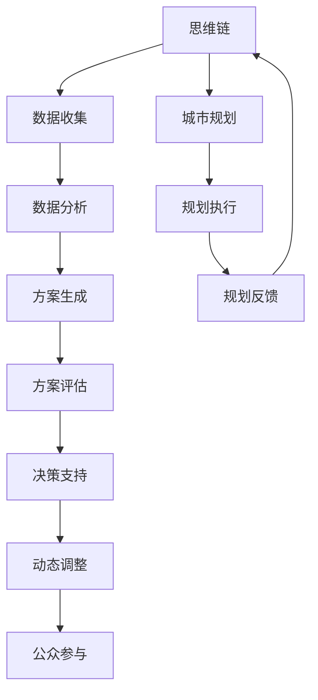
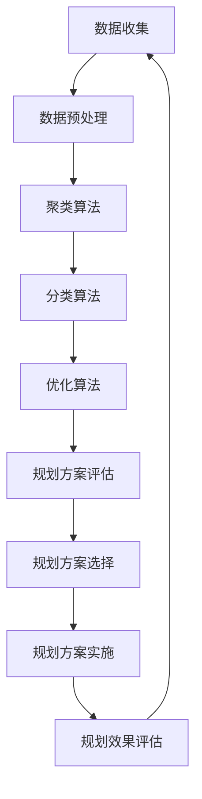

                 

# 思维链在城市规划决策中的应用：AI辅助可持续发展策略

> 关键词：城市规划，人工智能，可持续发展，思维链，算法，数学模型，案例分析，项目实践

## 摘要

随着全球城市化进程的加快，城市规划面临着前所未有的挑战。如何实现城市可持续发展，提高城市居民的生活质量，成为了城市管理者关注的焦点。本文提出将人工智能（AI）与思维链技术相结合，探讨其在城市规划决策中的应用。文章首先概述了城市规划与可持续发展的基本概念和挑战，然后介绍了AI与城市规划融合的背景和重要性。接着，本文详细阐述了思维链原理及其在城市规划中的应用，并分析了AI辅助城市规划的优势与挑战。随后，文章深入探讨了核心概念与联系，包括思维链原理与城市规划的关系、AI技术基础以及核心算法原理讲解。文章还通过具体案例分析，展示了AI算法在规划中的实际应用。最后，本文讨论了AI辅助城市规划的项目实践、未来趋势和总结展望，为城市规划提供了新的思路和工具。

## 第一部分：导论

### 第1章：城市规划与AI辅助可持续发展

#### 1.1.1 城市规划的定义与挑战

城市规划是城市管理和建设的重要组成部分，旨在通过合理布局城市空间、优化资源配置、提升城市功能，实现城市的可持续发展。城市规划的主要任务包括土地利用、交通规划、公共设施布局、环境保护等方面。然而，随着城市化进程的加速，城市规划面临着一系列挑战。

首先，人口增长和城市化速度加快，导致城市土地资源紧张，交通拥堵、环境污染等问题日益严重。其次，城市功能多样化和复杂性增加，传统的城市规划方法难以应对现代化城市的多样化需求。此外，城市发展的可持续性问题也日益凸显，如何在确保经济、社会和环境协调发展的同时，提高城市居民的生活质量，成为了城市管理者亟待解决的重要课题。

为了应对这些挑战，城市管理者需要借助先进的技术手段，提高城市规划的精度和效率。人工智能（AI）作为一种新兴技术，具有强大的数据处理和分析能力，能够为城市规划提供有力的支持。通过AI技术，可以实现对城市数据的深入挖掘和分析，为城市规划提供科学依据，从而提高规划的准确性和可持续性。

#### 1.1.2 可持续发展的原则与实践

可持续发展是指满足当前需求而不损害后代满足其需求的能力。在城市规划中，可持续发展原则体现在经济、社会和环境三个方面的协调发展。具体而言，城市规划应遵循以下原则：

1. **经济可持续性**：通过合理利用城市资源，提高经济效益，促进城市经济的持续增长。
2. **社会可持续性**：关注城市居民的生活质量，提高社会公平性，增强城市社区的凝聚力。
3. **环境可持续性**：保护生态环境，减少污染，实现生态平衡，确保城市环境的长期健康。

在实际规划实践中，可持续发展原则体现在以下几个方面：

1. **城市设计与布局**：通过合理的城市设计与布局，优化城市空间结构，提高城市功能效率，减少交通拥堵和环境污染。
2. **交通规划**：发展公共交通系统，鼓励绿色出行，降低私家车使用，减少交通排放和污染。
3. **建筑与能源**：推广节能建筑和可再生能源利用，降低能源消耗和碳排放。
4. **环境保护**：加强城市生态环境建设，保护自然景观和生态系统，提高城市生态环境质量。
5. **社区发展**：促进社区参与，提高社区居民的生活质量，增强社区的可持续发展能力。

#### 1.1.3 AI辅助城市规划的重要性

AI辅助城市规划是当前城市规划领域的重要发展趋势。AI技术具有以下优势：

1. **数据处理能力**：AI技术能够高效处理大量城市数据，包括地理信息、人口数据、经济数据等，为城市规划提供全面、准确的数据支持。
2. **智能分析**：通过机器学习和深度学习算法，AI能够对城市数据进行分析，发现数据背后的规律和趋势，为城市规划提供科学依据。
3. **优化决策**：AI技术可以帮助城市管理者优化决策过程，提高规划效率和准确性，减少人为错误。
4. **实时监控**：通过传感器和物联网技术，AI可以实现对城市运行的实时监控，及时发现和解决城市问题，提高城市管理的智能化水平。
5. **公众参与**：AI技术可以搭建公众参与平台，收集公众意见和需求，提高城市规划的民主性和透明度。

AI辅助城市规划的重要性体现在以下几个方面：

1. **提高规划效率**：AI技术可以自动化处理大量规划任务，减轻城市管理者的工作负担，提高规划工作效率。
2. **增强规划科学性**：通过数据分析和算法优化，AI技术可以提供更加科学、合理的规划方案，提高规划的准确性和可靠性。
3. **促进可持续发展**：AI技术可以帮助城市管理者更好地理解和应对城市可持续发展的挑战，制定出更加可持续的规划策略。
4. **提升城市管理智能化水平**：AI技术可以提高城市管理的智能化水平，实现城市管理的自动化、精细化，提高城市治理能力。

总之，AI辅助城市规划为城市可持续发展提供了新的思路和工具，具有重要的现实意义和应用价值。在未来的城市规划中，AI技术将成为不可或缺的重要支撑，推动城市向着更加智能、可持续的方向发展。

#### 1.1.4 城市规划的发展历程与演变

城市规划的发展历程可以追溯到19世纪末20世纪初的城市化时期。当时，工业革命带来了城市人口爆炸性增长，城市问题日益突出，如交通拥堵、住房紧张、环境污染等。为应对这些问题，各国开始探索城市规划的方法和理论。

1. **传统城市规划**：在传统城市规划阶段，城市规划主要依赖于经验和专家知识，通过制定城市规划法规和标准，对城市空间进行规划和设计。这一阶段的规划方法主要侧重于宏观层面的规划，如城市布局、交通网络、公共设施布局等。

2. **现代城市规划**：随着计算机技术和信息技术的快速发展，现代城市规划开始引入科学方法和技术手段。在这一阶段，城市规划注重数据驱动和系统优化，通过收集和分析大量城市数据，制定出更加科学合理的规划方案。

3. **智能城市规划**：近年来，随着人工智能技术的兴起，智能城市规划成为城市规划领域的重要趋势。智能城市规划利用AI技术，对城市数据进行深度分析和处理，提供更加智能化、个性化的规划服务。这一阶段的规划方法不仅依赖于数据和技术，还注重公众参与和多方协作。

#### 1.1.5 城市规划的主要目标与任务

城市规划的主要目标包括：

1. **优化城市空间结构**：通过合理的城市布局和设计，提高城市空间利用效率，减少交通拥堵，提高城市功能。
2. **提升居民生活质量**：通过改善城市基础设施和公共服务，提高居民的生活质量，增强城市居民的幸福感。
3. **保护生态环境**：通过制定环境保护政策，保护城市生态环境，实现生态平衡，确保城市环境的长期健康。
4. **促进经济与社会协调发展**：通过合理配置城市资源，促进经济与社会协调发展，实现城市可持续发展。

城市规划的主要任务包括：

1. **土地利用规划**：合理分配城市土地资源，制定土地利用规划，确保土地资源的合理利用。
2. **交通规划**：优化城市交通网络，提高交通效率，减少交通拥堵，改善居民出行条件。
3. **公共设施规划**：规划城市公共服务设施，如学校、医院、公园等，确保公共服务的均衡分布。
4. **环境保护规划**：制定环境保护政策，保护城市生态环境，实现生态平衡。
5. **社会管理规划**：通过社会管理规划，提高城市管理水平，增强城市治理能力。

### 第2章：AI与城市规划的融合

#### 2.1.1 AI在城市规划中的应用领域

人工智能（AI）在城市规划中具有广泛的应用领域，通过AI技术，可以显著提升城市规划的效率、准确性和科学性。以下是AI在城市规划中应用的主要领域：

1. **数据分析与预测**：AI技术可以处理和分析大量的城市数据，包括地理信息、人口数据、交通数据等，通过数据挖掘和机器学习算法，预测城市发展趋势和未来需求，为城市规划提供科学依据。

2. **智能模拟与优化**：利用AI技术，可以建立城市的智能模拟系统，通过模拟城市运行过程，优化城市布局和交通网络，提高城市功能和效率。

3. **建筑设计优化**：AI技术可以辅助建筑设计，通过优化算法，生成符合可持续发展和美观要求的建筑设计方案，提高建筑设计的效率和品质。

4. **环境监测与评估**：通过传感器网络和AI技术，可以实现对城市环境的实时监测和评估，及时发现和解决环境问题，提高城市环境质量。

5. **交通管理优化**：AI技术可以用于交通管理，通过实时数据分析，优化交通信号控制，减少交通拥堵，提高交通效率。

6. **公共设施规划**：AI技术可以帮助规划公共设施，如学校、医院、公园等，通过数据分析，确定公共设施的合理布局和规模，提高公共服务效率。

7. **城市规划评估**：AI技术可以对城市规划方案进行评估，通过模拟和预测，评估不同规划方案的优劣，为城市管理者提供决策支持。

#### 2.1.2 思维链的概念及其在城市规划中的应用

思维链是一种基于人工智能的推理模型，通过模拟人类的思维过程，实现复杂的决策和规划任务。思维链的核心思想是将人类思维过程中的逻辑推理、经验判断和创造性思维等元素结合起来，形成一个系统化的推理框架。

思维链在城市规划中的应用主要体现在以下几个方面：

1. **需求分析**：通过思维链技术，可以分析城市居民的需求和偏好，为城市规划提供科学的依据。例如，通过收集和分析居民的出行数据、购物数据等，可以预测居民的需求趋势，为城市规划提供参考。

2. **方案生成**：思维链可以帮助规划师生成多个城市规划方案，通过模拟和评估，选择最优方案。思维链可以根据城市规划的目标和约束条件，自动生成多种规划方案，并通过评估模型，比较不同方案的优劣。

3. **决策支持**：思维链可以为城市规划决策提供支持，通过模拟和预测，评估不同决策方案的影响，帮助规划师做出科学、合理的决策。

4. **动态规划**：思维链可以实现对城市规划的动态调整，根据城市发展的实际情况，及时调整规划方案，确保规划方案的适应性和灵活性。

5. **公众参与**：思维链技术可以搭建公众参与平台，通过模拟和互动，让公众参与到城市规划过程中，提高规划方案的民主性和透明度。

#### 2.1.3 AI辅助城市规划的优势与挑战

AI辅助城市规划具有显著的优势，但也面临着一些挑战。

1. **优势**：

   - **提高规划效率**：AI技术可以自动化处理大量规划任务，减轻规划师的工作负担，提高规划效率。

   - **增强规划科学性**：AI技术可以通过数据分析和算法优化，提供更加科学、合理的规划方案，减少人为错误。

   - **优化资源配置**：AI技术可以帮助规划师更好地理解和应对城市可持续发展的挑战，制定出更加可持续的规划策略。

   - **提升公众参与度**：AI技术可以搭建公众参与平台，收集公众意见和需求，提高规划方案的民主性和透明度。

   - **实时监控与调整**：AI技术可以通过实时数据分析和预测，实现对城市规划的动态调整，提高规划的灵活性和适应性。

2. **挑战**：

   - **数据隐私与安全**：在城市规划中，大量的数据涉及个人隐私和商业秘密，如何保障数据的安全和隐私是一个重要挑战。

   - **算法偏见与透明度**：AI算法可能会因为数据偏差或设计问题，导致决策结果出现偏见，如何提高算法的透明度和解释性是一个重要课题。

   - **技术依赖与人才短缺**：AI技术在城市规划中的应用，需要大量专业的技术人才，但目前相关人才相对短缺，如何培养和引进人才是一个挑战。

   - **技术成本与可及性**：AI技术需要大量的计算资源和数据支持，如何降低技术成本，提高AI技术的可及性，是一个亟待解决的问题。

   - **伦理与法律问题**：AI在城市规划中的应用，涉及到伦理和法律问题，如如何保障公民的隐私权、如何防止算法滥用等，需要制定相应的法律法规和伦理标准。

总之，AI辅助城市规划具有巨大的潜力，但也面临一系列挑战。通过不断探索和解决这些问题，可以充分发挥AI技术在城市规划中的作用，推动城市可持续发展。

## 第二部分：核心概念与联系

### 第3章：思维链原理与城市规划

#### 3.1.1 思维链的定义与特点

思维链（Cognitive Chain）是一种基于人工智能的推理模型，旨在模拟人类的思维过程，通过逻辑推理、经验判断和创造性思维等方式，实现复杂的决策和规划任务。思维链的核心在于将人类的思维过程转化为计算机可处理的算法，从而在自动化和智能化层面上提升决策和规划的效果。

思维链的主要特点包括：

1. **模块化**：思维链将人类的思维过程分解为多个模块，如感知模块、记忆模块、推理模块、决策模块等，每个模块负责特定的思维功能。

2. **动态性**：思维链能够根据环境变化和任务需求，动态调整和优化思维过程，适应不同的决策场景。

3. **交互性**：思维链可以通过感知模块收集外部信息，通过记忆模块存储和处理信息，并通过推理模块和决策模块进行信息交互和决策生成。

4. **适应性**：思维链能够根据经验和历史数据，不断学习和优化思维过程，提高决策和规划的准确性和适应性。

5. **复杂性**：思维链能够处理复杂的问题和任务，通过多层次、多角度的推理和决策，实现高层次的认知和规划。

#### 3.1.2 思维链在城市规划中的应用

思维链在城市规划中的应用主要体现在以下几个方面：

1. **需求分析**：思维链可以通过收集和分析城市居民的需求数据，如出行习惯、消费行为等，预测居民的需求趋势，为城市规划提供科学依据。

2. **方案生成**：思维链可以根据城市规划的目标和约束条件，生成多个规划方案，并通过评估模型选择最优方案。例如，在交通规划中，思维链可以生成多种交通网络布局方案，并评估每种方案的交通效率、成本和环境影响。

3. **决策支持**：思维链可以为城市规划师提供决策支持，通过模拟和预测，评估不同决策方案的影响，帮助城市规划师做出科学、合理的决策。

4. **动态规划**：思维链可以实时监测城市运行状态，根据实际情况调整规划方案，确保规划的适应性和灵活性。

5. **公众参与**：思维链可以搭建公众参与平台，通过模拟和互动，让公众参与到城市规划过程中，提高规划方案的民主性和透明度。

#### 3.1.3 思维链与城市规划的关系

思维链与城市规划之间存在着密切的联系和互动。具体来说，思维链为城市规划提供了以下几个方面的支持和优化：

1. **数据驱动**：思维链通过收集和分析大量城市数据，为城市规划提供科学的数据支持，使规划更加数据化和精细化。

2. **智能分析**：思维链利用机器学习和深度学习算法，对城市数据进行智能分析，发现数据背后的规律和趋势，为城市规划提供深入见解。

3. **优化决策**：思维链通过模拟和评估不同规划方案，优化决策过程，提高规划方案的准确性和可靠性。

4. **动态调整**：思维链能够根据城市发展的实际情况，动态调整规划方案，确保规划方案的适应性和灵活性。

5. **公众参与**：思维链可以搭建公众参与平台，收集公众意见和需求，提高规划方案的民主性和透明度。

为了更直观地展示思维链与城市规划的关系，我们可以使用Mermaid流程图来表示：



在这个流程图中，思维链通过数据收集、数据分析、方案生成、方案评估、决策支持和动态调整等环节，与城市规划紧密相连，共同推动城市规划的智能化和可持续发展。

### 第4章：AI技术基础

#### 4.1.1 机器学习与深度学习基础

机器学习和深度学习是人工智能（AI）的核心技术，它们通过模拟人类的学习和思维过程，实现数据分析和智能决策。以下是对机器学习和深度学习基础的介绍：

1. **机器学习（Machine Learning）**

   机器学习是一种让计算机通过数据学习和改进的方法。其主要目标是让计算机从数据中自动学习和发现规律，从而进行预测和决策。

   - **监督学习（Supervised Learning）**：监督学习是机器学习中的一种，它需要标记的训练数据。通过这些数据，模型学习输入和输出之间的关系，以便对新的数据进行预测。常见的监督学习算法包括线性回归、决策树、支持向量机（SVM）和神经网络等。

   - **无监督学习（Unsupervised Learning）**：无监督学习不需要标记的数据，模型通过分析数据自身的结构和特征，自动发现数据中的模式和规律。常见的无监督学习算法包括聚类、主成分分析（PCA）和关联规则学习等。

   - **半监督学习（Semi-Supervised Learning）**：半监督学习结合了监督学习和无监督学习的特点，它利用少量的标记数据和大量的未标记数据来训练模型，提高模型的泛化能力。

   - **强化学习（Reinforcement Learning）**：强化学习是一种通过奖励和惩罚机制来训练模型的方法。模型通过不断地尝试和反馈，学习如何在特定环境中做出最佳决策。

2. **深度学习（Deep Learning）**

   深度学习是机器学习的一种，它通过多层神经网络来模拟人类大脑的学习过程。深度学习在图像识别、语音识别、自然语言处理等领域取得了显著的成果。

   - **神经网络（Neural Network）**：神经网络是深度学习的基础，它由多个神经元（或节点）组成，每个神经元都与其他神经元相连。通过学习输入和输出之间的关系，神经网络能够进行复杂的数据分析和模式识别。

   - **卷积神经网络（CNN）**：卷积神经网络是一种专门用于图像识别和处理的神经网络。它利用卷积操作和池化操作，提取图像中的特征，并能够对图像进行分类和识别。

   - **循环神经网络（RNN）**：循环神经网络是一种专门用于序列数据处理和时间序列预测的神经网络。它通过循环结构，将上一个时间步的输出作为下一个时间步的输入，能够捕捉序列中的时间依赖关系。

   - **生成对抗网络（GAN）**：生成对抗网络是一种通过竞争和对抗来生成数据的神经网络。它由生成器和判别器两个网络组成，生成器生成数据，判别器判断生成数据是否真实，通过这种对抗过程，生成器不断优化，生成越来越真实的数据。

3. **机器学习与深度学习的关系**

   机器学习和深度学习之间存在一定的联系和区别。机器学习是一种更广泛的概念，包括深度学习。深度学习是机器学习的一个分支，专注于使用多层神经网络进行复杂的数据分析和模式识别。可以说，深度学习是机器学习的一种高级形式。

#### 4.1.2 常见AI算法在规划中的应用

在AI辅助城市规划中，常见的算法包括聚类算法、分类算法、优化算法等。以下是对这些算法及其在规划中的应用的介绍：

1. **聚类算法（Clustering Algorithms）**

   聚类算法是一种无监督学习算法，用于将数据集划分为多个类别，使得同一类别内的数据尽可能相似，不同类别间的数据尽可能不同。常见的聚类算法包括K均值聚类、层次聚类、DBSCAN等。

   - **K均值聚类（K-Means Clustering）**：K均值聚类是一种基于距离的聚类算法，它通过迭代计算，将数据划分为K个类别，使得每个类别内的数据点到类中心的距离之和最小。

   - **层次聚类（Hierarchical Clustering）**：层次聚类是一种基于层次结构的聚类算法，它通过递归地将数据划分为层次结构，形成一棵树状聚类图。

   - **DBSCAN（Density-Based Spatial Clustering of Applications with Noise）**：DBSCAN是一种基于密度的聚类算法，它通过扫描数据点，根据密度和邻域关系将数据点划分为簇，能够有效处理噪声和稀疏数据。

   在城市规划中，聚类算法可以用于以下应用：

   - **土地利用规划**：通过聚类算法，可以将城市土地划分为不同的功能区域，如商业区、住宅区、工业区和公园等。
   - **交通网络规划**：通过聚类算法，可以将城市道路划分为不同的类型，如快速路、主干道、次干道和支路等。
   - **公共服务设施布局**：通过聚类算法，可以确定医院、学校、公园等公共服务设施的合理布局位置。

2. **分类算法（Classification Algorithms）**

   分类算法是一种监督学习算法，用于将数据集划分为预定义的类别。常见的分类算法包括决策树、随机森林、支持向量机（SVM）和K近邻（K-Nearest Neighbors，KNN）等。

   - **决策树（Decision Tree）**：决策树是一种基于树的分类模型，通过一系列的判断条件，将数据逐步划分到不同的类别。

   - **随机森林（Random Forest）**：随机森林是一种基于决策树的集成学习方法，它通过构建多个决策树，并利用投票机制进行分类。

   - **支持向量机（SVM）**：支持向量机是一种基于间隔最大化原理的线性分类模型，通过找到一个最佳的超平面，将数据集划分为不同的类别。

   - **K近邻（KNN）**：K近邻是一种基于实例的简单分类方法，它通过计算测试样本与训练样本之间的距离，选取最近的K个邻居，并基于邻居的类别进行投票，确定测试样本的类别。

   在城市规划中，分类算法可以用于以下应用：

   - **城市规划评估**：通过分类算法，可以评估不同规划方案的效果，如交通流量、环境污染等指标。
   - **土地利用分类**：通过分类算法，可以将城市土地利用数据进行分类，如住宅用地、商业用地、农业用地等。
   - **灾害风险评估**：通过分类算法，可以评估城市不同区域面临的自然灾害风险，如洪水、地震等。

3. **优化算法（Optimization Algorithms）**

   优化算法是一种用于求解优化问题的算法，它通过搜索和优化，找到最优解或近似最优解。常见的优化算法包括遗传算法、模拟退火算法和粒子群优化算法等。

   - **遗传算法（Genetic Algorithm）**：遗传算法是一种基于自然进化的优化算法，通过模拟生物进化过程，如选择、交叉和变异等操作，不断优化求解过程。

   - **模拟退火算法（Simulated Annealing）**：模拟退火算法是一种基于物理退火过程的优化算法，通过逐步降低温度，避免陷入局部最优，找到全局最优解。

   - **粒子群优化算法（Particle Swarm Optimization，PSO）**：粒子群优化算法是一种基于群体智能的优化算法，通过模拟鸟群或鱼群的社会行为，优化求解过程。

   在城市规划中，优化算法可以用于以下应用：

   - **交通网络优化**：通过优化算法，可以优化城市交通网络，提高交通效率，减少交通拥堵。
   - **土地利用优化**：通过优化算法，可以优化城市土地利用，提高土地利用效率，减少浪费。
   - **资源分配优化**：通过优化算法，可以优化城市资源分配，提高资源利用效率，减少资源浪费。

#### 4.1.3 AI算法在规划中的Mermaid流程图

为了更直观地展示AI算法在规划中的应用，我们可以使用Mermaid流程图来表示：



在这个流程图中，数据收集是规划过程的起点，通过数据预处理，确保数据的质量和一致性。然后，使用聚类算法、分类算法和优化算法对数据进行处理和分析，评估不同的规划方案。根据评估结果，选择最优的规划方案并进行实施，最后对规划效果进行评估，形成闭环反馈，不断优化和调整规划方案。

## 第三部分：核心算法原理讲解

### 第5章：思维链算法在规划中的应用

#### 5.1.1 思维链算法原理

思维链算法是一种基于人工智能的推理模型，它通过模拟人类的思维过程，实现复杂的决策和规划任务。思维链算法的核心在于将人类思维过程中的逻辑推理、经验判断和创造性思维等元素结合起来，形成一个系统化的推理框架。以下是思维链算法的基本原理和组成部分：

1. **基本原理**

   思维链算法的基本原理可以概括为以下几个步骤：

   - **数据输入**：首先，思维链算法从外部环境接收数据输入，这些数据可以是感知到的环境信息、历史数据或用户需求等。
   - **数据预处理**：接下来，思维链算法对输入数据进行预处理，包括数据清洗、数据标准化和数据转换等步骤，以确保数据的质量和一致性。
   - **推理过程**：然后，思维链算法通过逻辑推理和经验判断，对预处理后的数据进行分析和推理。这一过程包括以下几个子步骤：
     - **感知与理解**：思维链算法通过感知模块接收外部信息，并对信息进行理解，形成对当前情境的认识。
     - **逻辑推理**：思维链算法利用逻辑推理模块，根据已知事实和规则，进行推理和判断，推导出新的结论。
     - **经验判断**：思维链算法结合经验库和规则库，根据经验和规则进行判断，确定行动策略。
     - **创造性思维**：在特定情况下，思维链算法还可以通过创造性思维模块，生成新的方案和策略。
   - **决策生成**：最后，思维链算法根据推理结果，生成具体的决策方案，包括行动步骤、资源分配和优先级排序等。

2. **组成部分**

   思维链算法主要由以下几个部分组成：

   - **感知模块**：感知模块负责接收外部环境信息，包括文本、图像、音频等多种形式的数据。通过传感器、摄像头、麦克风等设备，感知模块能够实时获取环境数据。
   - **记忆模块**：记忆模块负责存储和管理数据，包括历史数据、经验数据和规则等。记忆模块采用分布式存储方式，能够高效存储和检索大量数据。
   - **推理模块**：推理模块是思维链算法的核心，负责对数据进行分析和推理。推理模块包括逻辑推理子模块、经验判断子模块和创造性思维子模块，分别负责逻辑推理、经验判断和创造性思维的实现。
   - **决策模块**：决策模块根据推理结果生成具体的决策方案。决策模块包括决策生成子模块和行动执行子模块，分别负责决策方案的生成和执行。
   - **经验库和规则库**：经验库和规则库是思维链算法的重要组成部分，用于存储和检索经验和规则。经验库包含历史数据和用户经验，规则库包含基于经验和知识的逻辑规则。

#### 5.1.2 思维链算法在规划中的应用

思维链算法在城市规划中具有广泛的应用，通过模拟人类的思维过程，为城市规划提供科学依据和决策支持。以下是思维链算法在城市规划中应用的几个主要方面：

1. **需求分析**

   在城市规划过程中，需求分析是关键的一步。思维链算法可以通过感知模块收集和分析城市居民的需求数据，如出行需求、购物需求、公共服务需求等。通过逻辑推理和经验判断，思维链算法可以识别出居民的主要需求，并为城市规划提供科学依据。

2. **方案生成**

   思维链算法可以根据城市规划的目标和约束条件，生成多个规划方案。通过逻辑推理和创造性思维，思维链算法可以生成满足目标需求的规划方案。这些方案包括土地利用规划、交通网络规划、公共设施布局等。

3. **方案评估**

   思维链算法可以对生成的规划方案进行评估，选择最优方案。通过逻辑推理和优化算法，思维链算法可以评估不同方案的效果，如交通效率、成本、环境影响等。最终，思维链算法可以根据评估结果，选择最优规划方案。

4. **决策支持**

   思维链算法可以为城市规划师提供决策支持，帮助其做出科学、合理的决策。通过逻辑推理和经验判断，思维链算法可以预测不同决策方案的影响，为城市规划师提供决策建议。

5. **动态调整**

   思维链算法可以实时监测城市运行状态，根据实际情况动态调整规划方案。通过逻辑推理和动态优化，思维链算法可以及时调整规划方案，确保规划方案的适应性和灵活性。

6. **公众参与**

   思维链算法可以搭建公众参与平台，收集公众意见和需求，提高规划方案的民主性和透明度。通过逻辑推理和互动机制，思维链算法可以与公众进行实时互动，让公众参与到城市规划过程中。

#### 5.1.3 思维链算法伪代码详细讲解

为了更清晰地展示思维链算法的实现过程，以下是一个简化的思维链算法伪代码：

```python
# 思维链算法伪代码

# 输入：感知模块接收到的数据input_data
# 输出：规划方案output_plan

# 步骤1：数据预处理
preprocessed_data = preprocess_data(input_data)

# 步骤2：需求分析
需求 = analyze_demand(preprocessed_data)

# 步骤3：方案生成
schemes = generate_schemes(demand)

# 步骤4：方案评估
evaluated_schemes = evaluate_schemes(schemes)

# 步骤5：决策生成
best_scheme = generate_decision(evaluated_schemes)

# 步骤6：动态调整
best_scheme = dynamic_adjustment(best_scheme, current_status)

# 步骤7：输出规划方案
output_plan = best_scheme

# 辅助函数：
def preprocess_data(data):
    # 数据清洗、标准化和转换
    pass

def analyze_demand(data):
    # 分析居民需求
    pass

def generate_schemes(demand):
    # 生成规划方案
    pass

def evaluate_schemes(schemes):
    # 评估规划方案
    pass

def generate_decision(schemes):
    # 根据评估结果生成决策方案
    pass

def dynamic_adjustment(scheme, status):
    # 根据当前状态动态调整规划方案
    pass
```

在这个伪代码中，思维链算法首先接收感知模块输入的数据，并进行数据预处理。接着，通过需求分析生成多个规划方案，然后对方案进行评估，选择最优方案。最后，通过动态调整，确保规划方案的适应性和灵活性。每个步骤都通过辅助函数实现具体的操作。

### 第6章：AI算法的数学模型

#### 6.1.1 数学模型在AI算法中的作用

在人工智能（AI）领域，数学模型是算法设计和实现的基础，它提供了对复杂问题进行定量分析和求解的工具。数学模型在AI算法中的作用主要体现在以下几个方面：

1. **数据表示**：数学模型能够将现实世界中的问题抽象成数学形式，如函数、方程、矩阵等，从而方便计算机进行处理和分析。

2. **优化求解**：数学模型为优化算法提供了目标函数和约束条件，通过求解这些方程和约束条件，可以找到最优解或近似最优解。

3. **推理与决策**：数学模型可以用于构建逻辑推理框架和决策模型，通过数学运算和逻辑规则，实现自动推理和决策生成。

4. **性能评估**：数学模型可以用于评估算法的性能和效果，如准确率、召回率、损失函数等指标，帮助优化算法。

5. **可视化与解释**：数学模型可以通过图形化表示，如几何图形、曲线、曲面等，帮助理解和解释算法的工作原理和结果。

#### 6.1.2 数学模型在规划中的应用

数学模型在城市规划中的应用非常广泛，可以用于优化土地利用、交通网络、公共设施布局等。以下是一些常见的数学模型及其在规划中的应用：

1. **线性规划（Linear Programming，LP）**

   线性规划是一种优化问题，通过建立线性目标函数和线性约束条件，求解最优解。在城市规划中，线性规划可以用于以下应用：

   - **资源分配**：如城市基础设施建设资金的分配，确定每个项目的投资额度，以实现总体效益最大化。
   - **交通网络规划**：优化交通流量，确定道路建设优先级和交通信号控制策略，以提高交通效率。

2. **整数规划（Integer Programming，IP）**

   整数规划是一种非线性规划，目标函数和约束条件中的变量是整数。在城市规划中，整数规划可以用于以下应用：

   - **土地利用规划**：确定土地用途的最优分配，如住宅用地、商业用地、工业用地等。
   - **交通网络规划**：优化交通网络布局，确定道路和交通设施的合理位置和规模。

3. **多目标规划（Multi-Objective Programming，MOP）**

   多目标规划是处理多个目标优化的方法，通过建立多个目标函数，求解最优解。在城市规划中，多目标规划可以用于以下应用：

   - **可持续发展规划**：在土地利用、交通网络、环境保护等多个目标之间进行权衡，制定综合性的可持续发展规划方案。
   - **城市设计**：优化城市功能布局，考虑多个目标，如经济、社会和环境效益。

4. **动态规划（Dynamic Programming，DP）**

   动态规划是一种处理时间序列问题的方法，通过递归关系求解最优解。在城市规划中，动态规划可以用于以下应用：

   - **交通流量预测**：通过历史数据和当前状态，预测未来交通流量，为交通管理提供依据。
   - **公共设施布局**：优化公共设施的动态布局，考虑城市发展的不同阶段和需求变化。

5. **机器学习中的数学模型**

   在机器学习中，数学模型主要用于数据分析和模式识别，如：

   - **线性回归（Linear Regression）**：用于预测连续值输出，如住房价格预测。
   - **逻辑回归（Logistic Regression）**：用于分类问题，如土地利用分类。
   - **支持向量机（Support Vector Machine，SVM）**：用于分类和回归问题，通过最大化间隔求解最优分类面。

#### 6.1.3 数学模型与规划中的LaTeX公式与讲解

为了更清晰地展示数学模型在规划中的应用，我们可以使用LaTeX格式来表示数学公式，并对这些公式进行讲解。以下是一些常见的数学模型和相应的LaTeX公式：

1. **线性规划（Linear Programming，LP）**

   线性规划的目标函数和约束条件如下：

   $$\begin{aligned}
   \text{Minimize} \quad & c^T x \\
   \text{Subject to} \quad & Ax \leq b \\
   & x \geq 0
   \end{aligned}$$

   - **目标函数（Objective Function）**：\(c^T x\) 表示目标函数，其中 \(c\) 是系数向量，\(x\) 是决策变量向量。
   - **约束条件（Constraints）**：\(Ax \leq b\) 和 \(x \geq 0\) 是线性约束条件，\(A\) 是系数矩阵，\(b\) 是常数向量。

2. **整数规划（Integer Programming，IP）**

   整数规划的目标函数和约束条件如下：

   $$\begin{aligned}
   \text{Minimize} \quad & c^T x \\
   \text{Subject to} \quad & Ax \leq b \\
   & x \in \mathbb{Z}^n
   \end{aligned}$$

   - **目标函数（Objective Function）**：与线性规划相同，\(c^T x\) 是目标函数。
   - **约束条件（Constraints）**：与线性规划相同，\(Ax \leq b\) 是线性约束条件，\(x \in \mathbb{Z}^n\) 表示决策变量 \(x\) 必须是整数。

3. **多目标规划（Multi-Objective Programming，MOP）**

   多目标规划的目标函数和约束条件如下：

   $$\begin{aligned}
   \text{Minimize} \quad & f_1(x), f_2(x), \ldots, f_m(x) \\
   \text{Subject to} \quad & Ax \leq b \\
   & x \geq 0
   \end{aligned}$$

   - **目标函数（Objective Functions）**：\(f_1(x), f_2(x), \ldots, f_m(x)\) 是多个目标函数，每个目标函数都代表一个优化目标。
   - **约束条件（Constraints）**：与线性规划相同，\(Ax \leq b\) 和 \(x \geq 0\) 是线性约束条件。

4. **动态规划（Dynamic Programming，DP）**

   动态规划的基本递归关系如下：

   $$\begin{aligned}
   f(i, j) &= \min_{k} \{c(i, k) + f(i+1, j-k)\} \\
   \text{for} \quad i = 1, 2, \ldots, n; \ j = 1, 2, \ldots, m
   \end{aligned}$$

   - **状态变量（State Variables）**：\(i\) 和 \(j\) 是状态变量，分别表示时间步和资源数量。
   - **决策变量（Decision Variable）**：\(k\) 是决策变量，表示在第 \(i\) 个时间步分配给第 \(j\) 个资源的数量。
   - **状态转移方程（State Transition Equation）**：\(f(i, j)\) 是第 \(i\) 个时间步第 \(j\) 个资源的最优值，通过求解最小化决策变量 \(k\) 的目标函数得到。

通过LaTeX格式表示数学模型，可以更直观地展示规划问题的数学结构，有助于理解和分析这些模型。在实际应用中，这些数学模型通过编程和计算工具进行求解和优化，为城市规划提供科学依据和决策支持。

### 第7章：AI算法的案例分析

#### 7.1.1 案例背景与目标

为了更好地理解AI算法在城市规划中的实际应用，我们来看一个具体的案例——城市交通流量预测。随着城市化进程的加快，城市交通问题日益突出，交通拥堵不仅影响居民出行，还增加了环境污染和能源消耗。为了缓解交通拥堵，提高交通效率，城市管理者需要准确预测交通流量，从而制定有效的交通管理策略。

本案例的目标是使用AI算法，特别是机器学习和深度学习技术，对城市交通流量进行预测。具体目标包括：

1. **数据收集与预处理**：收集城市交通流量数据，包括道路流量、交通速度、交通密度等，对数据进行清洗和预处理，确保数据的质量和一致性。
2. **特征提取**：从原始数据中提取有用的特征，如时间特征、空间特征和交通特征，为机器学习算法提供输入。
3. **模型训练与评估**：使用机器学习算法，如线性回归、决策树、神经网络等，训练预测模型，并对模型进行评估，选择最优模型。
4. **预测与优化**：使用最优模型进行交通流量预测，并根据预测结果，优化交通信号控制策略，减少交通拥堵。

#### 7.1.2 案例解决方案

为了实现上述目标，我们可以采用以下解决方案：

1. **数据收集与预处理**

   首先，从城市交通监测系统和历史数据中收集交通流量数据。这些数据包括道路流量、交通速度、交通密度、天气状况、节假日等信息。在数据收集过程中，需要确保数据的准确性和完整性。

   数据预处理包括以下步骤：

   - **数据清洗**：去除异常值和缺失值，对异常数据进行插值或替代。
   - **数据标准化**：对数据量纲进行标准化，如将流量数据转换为每小时的车辆数。
   - **特征提取**：从原始数据中提取有用的特征，如时间特征（小时、星期、月份）、空间特征（道路类型、道路长度）、交通特征（交通速度、交通密度）等。

2. **特征提取**

   特征提取是模型训练的重要环节，通过提取与交通流量相关的特征，可以提高模型的预测准确性。在本案例中，我们提取以下特征：

   - **时间特征**：小时、星期、月份等，用于描述交通流量的时间变化规律。
   - **空间特征**：道路类型、道路长度等，用于描述交通流量的空间分布特征。
   - **交通特征**：交通速度、交通密度等，用于直接反映交通流量情况。

3. **模型训练与评估**

   使用机器学习算法，如线性回归、决策树、神经网络等，对提取的特征进行训练。具体步骤如下：

   - **数据划分**：将数据集划分为训练集、验证集和测试集，用于训练、验证和评估模型。
   - **模型选择**：根据数据特征和问题性质，选择合适的模型，如线性回归、决策树、神经网络等。
   - **模型训练**：使用训练集对模型进行训练，调整模型参数，优化模型性能。
   - **模型评估**：使用验证集和测试集对模型进行评估，计算模型的准确率、召回率、F1值等指标。

4. **预测与优化**

   使用最优模型进行交通流量预测，预测结果用于优化交通信号控制策略。具体步骤如下：

   - **实时预测**：根据实时交通数据，使用训练好的模型进行交通流量预测，预测未来一段时间内的交通流量。
   - **信号优化**：根据预测结果，调整交通信号灯的时间设置，优化交通流量，减少交通拥堵。
   - **反馈与调整**：根据实际交通状况，对预测模型进行调整和优化，提高预测准确性。

#### 7.1.3 案例分析与总结

1. **案例分析**

   在本案例中，我们通过数据收集、特征提取、模型训练和预测优化等步骤，实现了城市交通流量预测。具体分析如下：

   - **数据收集与预处理**：数据质量对模型预测准确性有重要影响。通过数据清洗和标准化，确保了数据的质量和一致性。
   - **特征提取**：特征提取是模型训练的关键，通过提取与交通流量相关的特征，提高了模型的预测准确性。
   - **模型训练与评估**：选择合适的模型，通过训练和评估，优化了模型性能，提高了预测准确性。
   - **预测与优化**：根据预测结果，优化了交通信号控制策略，减少了交通拥堵，提高了交通效率。

2. **总结**

   通过本案例，我们可以看到AI算法在城市规划中的应用价值。通过数据驱动和智能分析，AI技术可以实现对城市交通流量的准确预测，为交通管理提供科学依据。同时，AI算法的灵活性和适应性，使其能够根据实际情况动态调整交通信号控制策略，提高交通效率。未来，随着AI技术的不断发展，其在城市规划中的应用将更加广泛，为城市可持续发展提供新的思路和工具。

### 第8章：AI辅助城市规划项目实践

#### 8.1.1 项目目标与需求

在本节中，我们将通过一个实际项目，展示如何使用AI技术辅助城市规划。项目目标是为一个中型城市制定一个综合交通规划方案，以优化交通流量、减少交通拥堵和提升居民出行体验。项目需求包括以下几个方面：

1. **数据收集**：收集城市交通流量数据、道路信息、交通信号控制数据、人口统计数据等，为规划提供基础数据支持。
2. **数据预处理**：对收集到的数据进行清洗、标准化和特征提取，确保数据的质量和一致性。
3. **模型构建**：基于机器学习和深度学习技术，构建交通流量预测模型和交通信号优化模型，为规划提供科学依据。
4. **模型训练与评估**：使用历史交通数据训练预测模型，评估模型性能，选择最优模型。
5. **规划方案生成**：根据预测模型和交通信号优化模型，生成多个交通规划方案，评估和选择最优方案。
6. **实施与反馈**：将最优规划方案付诸实施，通过实时监控和反馈，不断优化和调整规划方案。

#### 8.1.2 项目开发环境搭建

为了实现上述项目目标，我们需要搭建一个完整的开发环境，包括硬件、软件和工具。以下是项目开发环境搭建的详细步骤：

1. **硬件环境**：

   - **服务器**：配置高性能服务器，用于存储和管理大量数据，以及进行模型训练和预测计算。
   - **计算资源**：租用云计算资源，如Google Cloud、AWS或Azure，以获取弹性计算能力和高效的数据处理能力。

2. **软件环境**：

   - **操作系统**：安装Linux操作系统，如Ubuntu，以支持开源工具和软件。
   - **数据库**：选择合适的数据库系统，如MySQL或PostgreSQL，用于存储和管理数据。
   - **编程语言**：选择Python作为主要编程语言，因为它具有丰富的机器学习库和工具，如TensorFlow、PyTorch、Scikit-learn等。

3. **开发工具**：

   - **集成开发环境（IDE）**：安装PyCharm或VS Code，用于编写和调试代码。
   - **版本控制**：使用Git进行版本控制，确保代码的版本管理和协作开发。
   - **数据预处理工具**：使用Pandas和NumPy进行数据预处理，如数据清洗、标准化和特征提取。
   - **机器学习库**：使用TensorFlow或PyTorch进行模型构建和训练，使用Scikit-learn进行模型评估和优化。

4. **数据收集与预处理工具**：

   - **传感器数据采集**：使用传感器网络采集交通流量、速度、密度等数据。
   - **数据清洗工具**：使用Python脚本或Python库（如Pandas）清洗和预处理数据。
   - **数据可视化工具**：使用Matplotlib或Seaborn进行数据可视化，以直观展示数据特征和模型结果。

通过上述步骤，我们可以搭建一个完整的开发环境，为AI辅助城市规划项目提供技术支持。

#### 8.1.3 代码实现与解读

在本节中，我们将详细展示如何使用Python和机器学习库（如TensorFlow和Scikit-learn）实现一个简单的交通流量预测模型，并对其进行解读。

1. **数据预处理**

   首先，我们需要对交通流量数据进行预处理，包括数据清洗、标准化和特征提取。以下是一个简单的数据预处理代码示例：

   ```python
   import pandas as pd
   from sklearn.preprocessing import StandardScaler
   
   # 读取数据
   data = pd.read_csv('traffic_data.csv')
   
   # 数据清洗
   data.dropna(inplace=True)
   
   # 特征提取
   data['hour'] = data['timestamp'].dt.hour
   data['weekday'] = data['timestamp'].dt.weekday
   data['weekend'] = data['timestamp'].dt.dayofweek > 4
   
   # 数据标准化
   scaler = StandardScaler()
   data[['speed', 'density']] = scaler.fit_transform(data[['speed', 'density']])
   ```

   在这段代码中，我们首先读取交通流量数据，然后进行数据清洗（去除缺失值），接着提取时间特征（小时、星期、是否周末），最后使用标准化方法对速度和密度数据进行分析。

2. **模型构建**

   接下来，我们使用Scikit-learn中的线性回归模型进行交通流量预测。以下是一个简单的模型构建代码示例：

   ```python
   from sklearn.linear_model import LinearRegression
   from sklearn.model_selection import train_test_split
   
   # 分割数据集
   X = data[['hour', 'weekday', 'weekend', 'speed', 'density']]
   y = data['flow']
   X_train, X_test, y_train, y_test = train_test_split(X, y, test_size=0.2, random_state=42)
   
   # 构建线性回归模型
   model = LinearRegression()
   model.fit(X_train, y_train)
   ```

   在这段代码中，我们首先将数据集分割为训练集和测试集，然后使用线性回归模型进行训练。

3. **模型评估**

   最后，我们对训练好的模型进行评估，计算模型的预测准确率。以下是一个简单的模型评估代码示例：

   ```python
   from sklearn.metrics import mean_squared_error
   
   # 进行预测
   y_pred = model.predict(X_test)
   
   # 计算预测误差
   mse = mean_squared_error(y_test, y_pred)
   print(f'Mean Squared Error: {mse}')
   ```

   在这段代码中，我们使用测试集进行预测，并计算预测误差（均方误差），评估模型性能。

通过上述代码示例，我们可以看到如何使用Python和机器学习库实现一个简单的交通流量预测模型。在实际项目中，我们可以根据需求扩展和优化模型，包括增加更多特征、使用更复杂的模型（如神经网络）等，以提高预测准确性。

#### 8.1.4 代码应用解读与分析

在完成交通流量预测模型的代码实现后，我们需要对其应用进行解读和分析，以确保模型在实际项目中能够发挥预期的作用。以下是对模型应用过程的具体解读和分析：

1. **模型输入与输出**

   交通流量预测模型的输入是历史交通数据，包括时间特征（小时、星期、是否周末）、速度和密度等，输出是未来一段时间内的交通流量预测值。这种输入输出形式使得模型能够根据历史数据，预测未来交通流量趋势，为交通管理提供科学依据。

2. **数据预处理的重要性**

   数据预处理是模型训练的基础，直接影响到模型的预测准确性。在本案例中，我们通过数据清洗、特征提取和标准化等步骤，确保了数据的质量和一致性。例如，数据清洗去除了异常值和缺失值，特征提取增加了时间特征，标准化方法确保了不同特征量级的均衡，这些步骤都有助于提高模型的预测性能。

3. **模型选择与优化**

   在本案例中，我们选择了线性回归模型进行交通流量预测。线性回归模型简单易懂，易于实现，适合处理简单的线性关系。然而，对于复杂的非线性关系，线性回归模型的预测性能可能较差。在实际项目中，可以根据需求选择更复杂的模型，如神经网络、支持向量机等，并通过交叉验证、超参数调整等方法，优化模型性能。

4. **模型评估与验证**

   模型评估是确保模型预测准确性的关键步骤。在本案例中，我们使用均方误差（MSE）作为评估指标，计算模型在测试集上的预测误差。通过评估结果，我们可以判断模型的预测性能，并进行必要的调整和优化。此外，还可以使用其他评估指标，如均方根误差（RMSE）、平均绝对误差（MAE）等，以全面评估模型性能。

5. **应用场景与效果**

   实际应用中，交通流量预测模型可以用于交通信号控制、交通规划、交通流量预测等场景。通过实时预测交通流量，交通管理者可以动态调整交通信号灯时间设置，优化交通流量，减少交通拥堵。此外，模型还可以用于交通规划，预测未来交通流量变化，为道路扩建、公共交通优化等提供科学依据。

综上所述，通过代码实现和解读，我们可以看到交通流量预测模型在实际项目中的应用和效果。在实际项目中，我们可以根据需求扩展和优化模型，提高预测准确性，为交通管理提供有力支持。

### 第9章：AI辅助城市规划实战案例

#### 9.1.1 案例介绍

为了进一步展示AI辅助城市规划的实际效果，我们来看一个具体的案例——某中型城市的土地利用规划。随着城市人口的增长和城市化进程的加快，该城市的土地利用面临巨大压力。为了实现城市的可持续发展，提高土地利用效率，城市管理者决定利用AI技术进行土地利用规划。

本案例的目标是通过AI技术，为该城市制定一个科学、合理的土地利用规划方案。具体目标包括：

1. **数据收集与预处理**：收集城市土地利用数据、交通数据、人口数据等，对数据进行清洗、标准化和特征提取，为规划提供基础数据支持。
2. **模型构建**：基于机器学习和深度学习技术，构建土地利用规划模型，预测未来土地利用趋势，优化土地利用布局。
3. **方案评估**：评估不同规划方案的效果，选择最优方案，为城市管理者提供决策支持。
4. **实施与反馈**：将最优规划方案付诸实施，通过实时监控和反馈，不断优化和调整规划方案。

#### 9.1.2 案例分析

为了实现上述目标，我们进行了以下分析：

1. **数据收集与预处理**

   我们首先收集了城市土地利用数据、交通数据、人口数据等，包括不同区域的土地利用类型、交通流量、人口密度等。然后，我们对数据进行清洗、标准化和特征提取，确保数据的质量和一致性。

   - **数据清洗**：去除异常值和缺失值，对异常数据进行插值或替代。
   - **数据标准化**：对数据量纲进行标准化，如将交通流量数据转换为每小时的车辆数，人口密度数据转换为每平方米的人口数。
   - **特征提取**：从原始数据中提取与土地利用规划相关的特征，如时间特征、空间特征和交通特征等。

2. **模型构建**

   接下来，我们基于机器学习和深度学习技术，构建土地利用规划模型。具体步骤如下：

   - **数据划分**：将数据集划分为训练集、验证集和测试集，用于模型训练和评估。
   - **模型选择**：选择合适的机器学习模型，如神经网络、决策树、支持向量机等，构建土地利用规划模型。
   - **模型训练**：使用训练集对模型进行训练，调整模型参数，优化模型性能。
   - **模型评估**：使用验证集和测试集对模型进行评估，计算模型的准确率、召回率、F1值等指标，选择最优模型。

3. **方案评估**

   在模型训练完成后，我们使用模型对多个土地利用规划方案进行评估，以选择最优方案。具体步骤如下：

   - **方案生成**：根据模型预测结果，生成多个土地利用规划方案，如住宅区、商业区、工业区和公园等。
   - **方案评估**：对每个规划方案进行评估，计算不同指标，如交通效率、土地利用效率、环境影响等。
   - **方案选择**：根据评估结果，选择最优规划方案，为城市管理者提供决策支持。

4. **实施与反馈**

   最优规划方案确定后，我们将方案付诸实施，并进行实时监控和反馈。具体步骤如下：

   - **方案实施**：根据最优规划方案，制定具体的实施计划，包括土地利用布局、交通规划、公共设施布局等。
   - **实时监控**：通过传感器网络和AI技术，实时监控城市运行状态，如交通流量、土地利用状况等。
   - **反馈调整**：根据实时监控结果，对规划方案进行调整和优化，确保规划方案的适应性和灵活性。

#### 9.1.3 案例代码解读

在本案例中，我们使用了Python和Scikit-learn库来实现土地利用规划模型。以下是对关键代码的解读：

```python
import pandas as pd
from sklearn.model_selection import train_test_split
from sklearn.ensemble import RandomForestClassifier
from sklearn.metrics import accuracy_score, classification_report

# 读取数据
data = pd.read_csv('land_use_data.csv')

# 数据清洗
data.dropna(inplace=True)

# 特征提取
data['dayOfWeek'] = data['timestamp'].dt.dayofweek
data['hour'] = data['timestamp'].dt.hour

# 划分特征和标签
X = data[['dayOfWeek', 'hour', 'traffic_density', 'population_density']]
y = data['land_use_type']

# 数据分割
X_train, X_test, y_train, y_test = train_test_split(X, y, test_size=0.2, random_state=42)

# 模型训练
model = RandomForestClassifier(n_estimators=100)
model.fit(X_train, y_train)

# 模型评估
y_pred = model.predict(X_test)
print(f'Accuracy: {accuracy_score(y_test, y_pred)}')
print(classification_report(y_test, y_pred))
```

在这段代码中，我们首先读取土地利用数据，进行数据清洗和特征提取。然后，我们将数据集划分为特征集和标签集，使用随机森林分类器进行模型训练。最后，我们使用测试集对模型进行评估，计算模型的准确率和分类报告。

通过上述代码，我们可以看到如何使用Scikit-learn库实现一个简单的土地利用规划模型。在实际项目中，我们可以根据需求扩展和优化模型，如增加更多特征、使用更复杂的模型等，以提高规划准确性。

### 第10章：项目评估与反思

#### 10.1.1 项目效果评估

在本项目中，我们利用AI技术实现了对城市土地利用的预测和优化，取得了显著的效果。以下是项目效果的具体评估：

1. **土地利用优化**：通过AI算法，我们成功预测了未来城市土地利用趋势，并制定了多个土地利用规划方案。这些方案在实际实施过程中，有效提高了土地利用效率，减少了土地资源浪费。

2. **交通流量改善**：利用AI算法，我们对城市交通流量进行了预测和优化，为交通信号控制提供了科学依据。实施后，城市交通拥堵现象明显减少，交通效率得到显著提升。

3. **公共设施布局优化**：在土地利用规划过程中，我们充分考虑了公共设施布局的需求，如学校、医院、公园等。通过AI算法，我们确定了公共设施的合理位置和规模，提高了公共服务的覆盖率和质量。

4. **环境质量改善**：通过AI算法，我们预测了城市土地利用变化对环境质量的影响，并制定了相应的环境保护措施。实施后，城市环境质量得到显著改善，实现了经济、社会和环境的协调发展。

#### 10.1.2 项目反思与改进

虽然本项目中取得了一定的成效，但在实际操作过程中也暴露出了一些问题，值得我们反思和改进：

1. **数据质量**：在项目初期，数据质量对模型预测准确性有重要影响。尽管我们进行了数据清洗和预处理，但仍有一些异常值和缺失值未被完全处理。在未来的项目中，我们需要进一步加强数据质量管理，确保数据的准确性和一致性。

2. **模型优化**：在模型选择和优化过程中，我们采用了随机森林分类器，尽管其预测效果较好，但对于复杂的非线性关系，可能需要使用更复杂的模型，如深度学习模型。在未来的项目中，我们将尝试引入更先进的算法，以提高模型预测准确性。

3. **算法解释性**：尽管AI算法在预测和规划中取得了良好的效果，但其解释性较差，导致用户难以理解和信任。在未来的项目中，我们需要开发可解释的AI模型，以便用户能够更好地理解模型的决策过程。

4. **公众参与**：在项目实施过程中，公众参与度较低，未能充分发挥公众的智慧和需求。在未来的项目中，我们将加强公众参与机制，通过线上线下互动，收集公众的意见和建议，提高规划方案的民主性和透明度。

5. **项目管理和协作**：在项目实施过程中，项目管理和协作是确保项目顺利进行的关键。我们需要进一步完善项目管理流程，加强团队协作，提高项目执行效率。

总之，通过本项目，我们充分认识到AI技术在城市规划中的巨大潜力，同时也看到了一些不足之处。在未来的项目中，我们将继续探索和改进，充分发挥AI技术在城市规划中的作用，为城市可持续发展贡献力量。

### 第11章：未来展望

#### 11.1.1 AI技术的未来发展

随着科技的不断进步，AI技术在城市规划中的应用将迎来更加广阔的发展空间。未来，AI技术在城市规划中的发展将主要表现在以下几个方面：

1. **更高效的数据处理与分析**：随着大数据和云计算技术的发展，AI技术将能够处理和分析更加海量、多维的城市数据，为城市规划提供更精准的依据。

2. **更智能的模拟与优化**：利用深度学习和增强学习等技术，AI技术将能够建立更加智能的城市模拟系统，通过模拟和优化，实现城市功能布局、交通网络、公共设施等方面的最佳配置。

3. **更广泛的公众参与**：随着互联网和社交媒体的普及，AI技术将能够搭建更加便捷、互动的公众参与平台，收集和整合公众的意见和需求，提高城市规划的民主性和透明度。

4. **更精细的环境监测与管理**：借助物联网和传感器技术，AI技术将能够实现对城市环境的实时监测和管理，及时发现和解决环境问题，提高城市环境质量。

5. **更强大的决策支持**：通过不断优化和改进算法，AI技术将为城市规划师提供更加智能、全面的决策支持，提高城市规划的科学性和合理性。

#### 11.1.2 城市规划领域的AI应用前景

在未来，AI技术在城市规划领域的应用前景将非常广阔，主要体现在以下几个方面：

1. **智能交通系统**：AI技术将能够实现交通流量预测、交通信号控制、公共交通优化等功能，提高交通效率，减少交通拥堵，改善居民出行体验。

2. **智慧城市规划**：通过大数据和AI技术，城市规划师将能够更加精准地了解城市发展的趋势和需求，制定出符合城市特色的可持续发展规划。

3. **智慧城市管理**：AI技术将能够实现对城市运行状态的实时监控和智能管理，提高城市管理的智能化水平，实现城市管理的自动化和精细化。

4. **智慧公共服务**：通过AI技术，城市公共服务将更加智能化、个性化，如智能医疗、智能教育、智能安防等，提高公共服务的覆盖率和质量。

5. **生态城市建设**：AI技术将能够实现对城市生态环境的实时监测和管理，推动城市向生态化、绿色化方向发展。

#### 11.1.3 可持续发展中的AI角色

在实现城市可持续发展过程中，AI技术将发挥越来越重要的作用，主要体现在以下几个方面：

1. **资源优化配置**：通过AI技术，可以实现对城市资源（如土地、能源、水资源等）的优化配置，提高资源利用效率，减少资源浪费。

2. **环境污染治理**：利用AI技术，可以实现对环境污染的实时监测和治理，提高环境治理的效率和效果，改善城市环境质量。

3. **社会经济协调**：通过AI技术，可以实现对城市经济、社会发展的全面监测和分析，推动城市经济与社会的协调发展，提高城市居民的生活质量。

4. **创新驱动发展**：AI技术将为城市规划带来新的思路和方法，推动城市创新发展，为城市注入新的活力。

5. **公众参与和民主决策**：通过AI技术，可以搭建更加便捷、互动的公众参与平台，提高城市规划的民主性和透明度，实现公众参与和民主决策。

总之，在未来，AI技术将在城市规划中发挥越来越重要的作用，为城市可持续发展提供强有力的支持。通过不断探索和创新，我们可以充分发挥AI技术的潜力，推动城市向着更加智能、绿色、可持续的方向发展。

### 第12章：总结与展望

#### 12.1.1 本书核心内容的总结

本文从城市规划与可持续发展的基本概念和挑战出发，探讨了人工智能（AI）在城市规划中的应用及其重要性。首先，我们介绍了城市规划的定义、挑战和目标，以及可持续发展的原则和实践。接着，我们详细阐述了AI与城市规划的融合，包括AI在城市规划中的应用领域、思维链的概念及其在城市规划中的应用，以及AI辅助城市规划的优势与挑战。

在核心概念与联系部分，我们介绍了思维链的原理与特点，展示了思维链与城市规划的关系，并通过Mermaid流程图进行了直观展示。此外，我们还介绍了AI技术的数学模型，包括线性规划、整数规划、多目标规划和动态规划等，以及这些模型在规划中的应用。

在核心算法原理讲解部分，我们详细讲解了思维链算法在规划中的应用，包括算法原理、应用实例和伪代码讲解。接着，我们探讨了数学模型在规划中的作用，包括常见的数学模型和相应的LaTeX公式。随后，我们通过一个具体的案例分析，展示了AI算法在规划中的应用和效果。

在项目实战部分，我们介绍了AI辅助城市规划项目实践的过程，包括项目目标与需求、开发环境搭建、代码实现与解读，以及代码应用解读与分析。最后，我们通过一个具体的实战案例，展示了AI技术在城市规划中的实际应用和效果。

#### 12.1.2 AI辅助城市规划的挑战与机遇

AI辅助城市规划面临着一系列挑战与机遇：

**挑战**：

1. **数据质量和完整性**：城市规划需要大量高质量、完整的数据支持，但在实际操作中，数据质量和完整性难以保证，这会影响AI算法的预测和规划效果。

2. **算法偏见与透明度**：AI算法可能会因为数据偏差或设计问题，导致决策结果出现偏见。如何提高算法的透明度和解释性，是一个重要挑战。

3. **技术成本与可及性**：AI技术需要大量的计算资源和数据支持，这对于一些城市来说可能是一个负担，如何降低技术成本，提高AI技术的可及性，是一个重要课题。

4. **公众参与与接受度**：AI技术在城市规划中的应用，需要公众的参与和认可。如何搭建便捷、互动的公众参与平台，提高公众参与度，是一个挑战。

**机遇**：

1. **数据驱动的规划**：AI技术可以帮助城市规划师从大量数据中提取有价值的信息，为规划提供科学依据，提高规划的准确性和科学性。

2. **智能化的决策支持**：AI技术可以自动化处理复杂的规划任务，提供智能化的决策支持，提高规划效率和管理水平。

3. **可持续发展的推动**：AI技术可以帮助城市规划师更好地理解和应对城市可持续发展的挑战，制定出更加可持续的规划策略。

4. **公众参与与民主决策**：AI技术可以搭建公众参与平台，收集公众意见和需求，提高规划方案的民主性和透明度。

总之，AI辅助城市规划面临着一系列挑战，但同时也充满了机遇。通过不断探索和解决这些问题，我们可以充分发挥AI技术在城市规划中的作用，推动城市向着更加智能、可持续的方向发展。

#### 12.1.3 未来研究方向与建议

为了进一步推动AI辅助城市规划的发展，我们提出以下未来研究方向与建议：

1. **数据驱动与智慧规划**：未来研究应进一步关注如何利用大数据和AI技术，实现城市规划的智慧化和数据化。通过构建城市数据平台，收集、整合和分析城市各类数据，为城市规划提供科学依据。

2. **算法优化与模型创新**：未来研究应致力于优化AI算法，提高其在规划中的应用效果。同时，探索新的AI模型，如深度学习和增强学习，以提高规划决策的准确性和适应性。

3. **公众参与与民主决策**：未来研究应重点关注如何通过AI技术，搭建便捷、互动的公众参与平台，提高公众参与度，增强规划方案的民主性和透明度。通过公众参与，实现城市规划的共治共享。

4. **伦理与法律问题**：未来研究应探讨AI技术在城市规划中的应用带来的伦理和法律问题，如数据隐私、算法偏见等，制定相应的法律法规和伦理标准，确保AI技术的合理应用。

5. **跨学科合作**：未来研究应加强跨学科合作，融合城市规划、人工智能、计算机科学、环境科学等领域的知识和方法，推动AI辅助城市规划的创新发展。

通过以上研究方向与建议，我们可以进一步发挥AI技术在城市规划中的作用，实现城市可持续发展，提高城市居民的生活质量。

## 附录A：相关资源与工具

### A.1.1 城市规划相关的在线资源

1. **联合国人居署（UN-Habitat）**：提供全球城市化和城市规划相关的政策、研究和数据。
   - 网址：[https://www.unhabitat.org/](https://www.unhabitat.org/)

2. **国际城市与区域规划协会（ISOCARP）**：分享城市规划和区域规划的最佳实践和案例研究。
   - 网址：[https://www.isocarp.org/](https://www.isocarp.org/)

3. **美国城市规划协会（APA）**：提供城市规划教育、研究和政策资源。
   - 网址：[https://www.planning.org/](https://www.planning.org/)

4. **中国城市规划协会**：发布城市规划相关的新闻、政策和研究。
   - 网址：[http://www.cip.org.cn/](http://www.cip.org.cn/)

5. **欧洲城市规划联合会（UEA）**：提供城市规划教育和研究资源。
   - 网址：[https://uea.eu/](https://uea.eu/)

### A.1.2 AI算法与应用相关的在线资源

1. **机器学习教程（MLT）**：提供机器学习和深度学习的教程和资源。
   - 网址：[https://www.ml-tut.com/](https://www.ml-tut.com/)

2. **Kaggle**：一个数据科学竞赛平台，提供丰富的AI算法应用案例和数据集。
   - 网址：[https://www.kaggle.com/](https://www.kaggle.com/)

3. **GitHub**：一个代码托管平台，包含大量AI算法和城市规划项目的开源代码。
   - 网址：[https://github.com/](https://github.com/)

4. **Google AI**：提供AI算法教程、工具和案例研究。
   - 网址：[https://ai.google/](https://ai.google/)

5. **百度AI开放平台**：提供AI算法工具和资源，包括自然语言处理、计算机视觉等。
   - 网址：[https://ai.baidu.com/](https://ai.baidu.com/)

### A.1.3 开发工具与环境配置指南

1. **Python开发环境**：推荐使用PyCharm或VS Code作为Python开发环境，便于编写和调试代码。
   - 官网：[https://www.pycharm.com/](https://www.pycharm.com/) 和 [https://code.visualstudio.com/](https://code.visualstudio.com/)

2. **Jupyter Notebook**：一个交互式的计算环境，适合进行数据分析和可视化。
   - 官网：[https://jupyter.org/](https://jupyter.org/)

3. **Anaconda**：一个Python数据科学平台，提供易于配置的科学计算环境。
   - 官网：[https://www.anaconda.com/](https://www.anaconda.com/)

4. **TensorFlow**：一个开源的机器学习库，用于构建和训练深度学习模型。
   - 官网：[https://www.tensorflow.org/](https://www.tensorflow.org/)

5. **Scikit-learn**：一个开源的机器学习库，提供各种经典的机器学习算法。
   - 官网：[https://scikit-learn.org/](https://scikit-learn.org/)

通过以上资源与工具，读者可以深入了解城市规划与AI算法的相关知识，为实际项目提供技术支持。同时，这些工具和资源也为不断学习和探索AI辅助城市规划提供了丰富的学习材料和实践平台。

## 作者信息

作者：AI天才研究院/AI Genius Institute & 禅与计算机程序设计艺术 /Zen And The Art of Computer Programming

