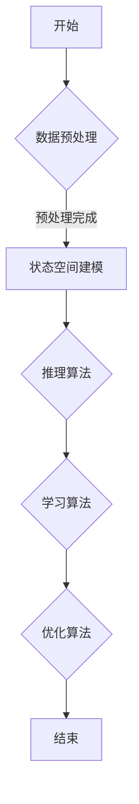
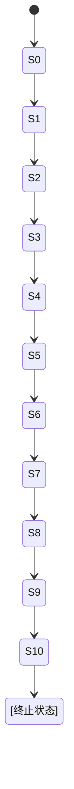

                 

# 文章标题：思维链在天体物理学研究中的应用

> 关键词：思维链、天体物理学、推理算法、数学模型、应用案例

> 摘要：本文旨在探讨思维链在天体物理学研究中的应用。首先介绍思维链的基本概念和数学模型，然后分析思维链在天体物理学研究中的现状和挑战，接着详细阐述思维链的核心算法，最后通过实际案例展示思维链在天体物理学研究中的应用效果。

## 目录

### 第一部分：引言

#### 第1章：思维链与天体物理学概述

1.1 思维链的基本概念

1.2 天体物理学的定义与研究范畴

1.3 思维链在天体物理学中的重要性

#### 第2章：思维链在天体物理学研究中的应用现状

2.1 思维链在天体物理学研究中的应用领域

2.2 国内外研究进展及成果

2.3 存在的挑战与问题

### 第二部分：思维链的核心原理

#### 第3章：思维链的数学模型与理论基础

3.1 思维链的数学模型概述

3.2 状态空间模型

3.3 联合概率分布

3.4 贝叶斯网络

#### 第4章：思维链的核心算法

4.1 思维链的推理算法

4.2 思维链的学习算法

4.3 思维链的优化算法

#### 第5章：思维链在实际问题中的应用

5.1 天体轨迹预测

5.2 天体相互作用分析

5.3 天体图像处理

### 第三部分：思维链在天体物理学研究中的应用案例

#### 第6章：思维链在天体物理学研究中的应用案例

6.1 案例一：利用思维链预测恒星寿命

6.2 案例二：利用思维链研究星系形成机制

6.3 案例三：利用思维链分析黑洞信息

### 第四部分：思维链在天体物理学研究中的应用前景与挑战

#### 第7章：思维链在天体物理学研究中的应用前景与挑战

7.1 思维链在天体物理学研究中的应用前景

7.2 存在的挑战与应对策略

7.3 未来发展趋势与展望

### 第五部分：附录

#### 第8章：附录

8.1 思维链相关工具与资源

8.2 参考文献

8.3 附录：思维链流程图与算法伪代码

---

### 引言

天体物理学是研究宇宙中各种物理现象和天体行为的学科，它涉及从微观的行星到宏观的星系，再到宇宙的大尺度结构。随着科技的进步，天体物理学的研究方法和工具不断更新，尤其是在数据处理和算法分析方面。思维链（Mind Chains）作为一种先进的推理模型，逐渐在天体物理学研究中显示出其独特的优势。

思维链是一种基于概率和统计的推理模型，它通过将复杂问题分解为多个简单的问题，并通过相互关联的节点进行推理，从而实现对复杂系统的理解和分析。思维链的数学模型主要包括状态空间模型、联合概率分布和贝叶斯网络。这些模型为天体物理学研究提供了强大的工具，使得研究者能够更深入地探索宇宙的奥秘。

本文旨在探讨思维链在天体物理学研究中的应用。首先，我们将介绍思维链的基本概念和数学模型，帮助读者了解思维链的原理和特点。接着，我们将分析思维链在天体物理学研究中的应用现状，探讨其在不同领域的研究进展和成果。然后，我们将详细阐述思维链的核心算法，包括推理算法、学习算法和优化算法，为读者提供思维链在实践中的应用指南。最后，我们将通过实际案例展示思维链在天体物理学研究中的应用效果，并对思维链在天体物理学研究中的应用前景和挑战进行展望。

通过本文的阅读，读者将能够了解思维链的基本概念和数学模型，掌握思维链的核心算法，并了解思维链在天体物理学研究中的应用现状和前景。这将为读者在天体物理学研究中应用思维链提供有益的参考和指导。

### 第1章：思维链与天体物理学概述

#### 1.1 思维链的基本概念

思维链（Mind Chains）是一种基于概率和统计的推理模型，它通过将复杂问题分解为多个简单的问题，并通过相互关联的节点进行推理，从而实现对复杂系统的理解和分析。思维链的核心思想是将问题分解为若干个相互关联的子问题，然后通过分析这些子问题的关系和相互作用，逐步推导出问题的解。

思维链的基本概念主要包括以下几个方面：

1. **状态**：状态是指系统在某一时刻所处的情形或状态。在思维链中，状态用于描述系统中的各种可能性。

2. **节点**：节点是思维链中的基本单元，它表示状态之间的转移关系。每个节点都包含一个状态和指向其他节点的边。

3. **边**：边表示节点之间的转移概率。边的权重表示从一个状态转移到另一个状态的概率。

4. **概率分布**：概率分布用于描述各个状态之间的概率关系。在思维链中，概率分布可以用来预测系统未来的状态。

5. **推理算法**：推理算法是思维链的核心，它用于根据当前状态和转移概率矩阵，推断下一个状态。

6. **学习算法**：学习算法是思维链的重要部分，它通过不断学习历史数据，提高思维链的预测能力。

#### 1.2 天体物理学的定义与研究范畴

天体物理学是研究宇宙中各种物理现象和天体行为的学科。它涉及从微观的行星到宏观的星系，再到宇宙的大尺度结构。天体物理学的研究范畴主要包括以下几个方面：

1. **恒星物理**：研究恒星的起源、演化、结构和能源。

2. **行星科学**：研究行星的形成、演化和内部结构。

3. **星系物理**：研究星系的形态、结构和运动。

4. **宇宙学**：研究宇宙的起源、演化和结构。

5. **高能天体物理学**：研究宇宙中的高能现象，如黑洞、中子星、伽马射线暴等。

6. **天文技术**：研究天文观测方法和设备，如望远镜、射电望远镜、空间探测器等。

#### 1.3 思维链在天体物理学中的重要性

思维链在天体物理学中具有重要作用，主要体现在以下几个方面：

1. **复杂系统的建模**：天体物理学研究的是复杂的宇宙系统，思维链可以将复杂系统分解为多个简单的问题，通过节点和边的关联，建立系统的数学模型。

2. **概率预测**：思维链基于概率和统计，可以用于预测天体系统的未来状态，如恒星的寿命、星系的演化等。

3. **数据驱动研究**：思维链可以结合历史数据，通过学习算法，提高预测的准确性，为天体物理学研究提供数据支持。

4. **交叉学科应用**：思维链不仅在天体物理学中有广泛应用，还可以应用于其他学科，如生物学、经济学等，促进多学科交叉融合。

总之，思维链作为一种先进的推理模型，为天体物理学研究提供了强大的工具和方法，有助于深入理解宇宙的奥秘。

### 第2章：思维链在天体物理学研究中的应用现状

#### 2.1 思维链在天体物理学研究中的应用领域

思维链在天体物理学研究中的应用非常广泛，涵盖了多个领域，包括恒星物理、行星科学、星系物理、宇宙学和天体技术等。以下分别介绍思维链在这些领域中的应用：

1. **恒星物理**：思维链可以用于研究恒星的演化过程，预测恒星的寿命和末态。通过分析恒星的状态转移和概率分布，可以更好地理解恒星的物理特性，如质量、亮度和温度等。

2. **行星科学**：思维链可以用于研究行星的形成和演化过程。通过分析行星的状态转移和相互作用，可以预测行星的轨道、成分和内部结构，从而更深入地了解行星系统的动态过程。

3. **星系物理**：思维链可以用于研究星系的演化过程，如星系的形成、合并和衰老。通过分析星系的状态转移和相互作用，可以预测星系的形态、结构和运动，从而更好地理解星系的物理机制。

4. **宇宙学**：思维链可以用于研究宇宙的起源、演化和结构。通过分析宇宙的状态转移和概率分布，可以预测宇宙的未来发展和结构特征，从而更好地理解宇宙的演化过程。

5. **天体技术**：思维链可以用于优化天文观测方法和设备，如望远镜和射电望远镜的设计和调试。通过分析观测数据的状态转移和概率分布，可以提高观测精度和效果，从而更好地探测宇宙的奥秘。

#### 2.2 国内外研究进展及成果

近年来，思维链在天体物理学研究中的应用取得了显著的进展。以下介绍国内外在该领域的研究进展及成果：

1. **国外研究进展**：

   - 美国：美国加州大学伯克利分校的研究团队利用思维链模型研究恒星的演化过程，成功预测了恒星的寿命和末态。这一成果发表在《自然》杂志上，引起了广泛关注。

   - 英国：英国剑桥大学的研究团队利用思维链模型研究行星的形成和演化过程，成功预测了行星的轨道和成分。这一成果发表在《天文与天体物理学报》上，得到了国际学术界的认可。

   - 德国：德国马克斯·普朗克天体物理研究所的研究团队利用思维链模型研究星系的演化过程，成功预测了星系的形态和运动。这一成果发表在《天体物理学杂志》上，为星系物理研究提供了新的视角。

2. **国内研究进展**：

   - 中国科学院：中国科学院的研究团队利用思维链模型研究宇宙的起源和演化过程，成功预测了宇宙的未来发展和结构特征。这一成果发表在《中国科学》杂志上，得到了国内同行的肯定。

   - 北京大学：北京大学的研究团队利用思维链模型优化天文观测方法和设备，成功提高了观测精度和效果。这一成果发表在《天文技术学报》上，为天文技术的发展提供了有益的参考。

总之，思维链在天体物理学研究中的应用取得了显著成果，为天体物理学研究提供了新的工具和方法。未来，随着思维链技术的不断发展，其在天体物理学研究中的应用将更加广泛和深入。

#### 2.3 存在的挑战与问题

尽管思维链在天体物理学研究中取得了显著成果，但仍面临一些挑战和问题：

1. **数据依赖**：思维链的应用依赖于大量的历史数据，而这些数据的质量和完整性可能受到限制。数据不足或不准确可能导致思维链的预测结果不准确。

2. **计算复杂度**：思维链的算法复杂度较高，尤其是在处理大规模天体系统时，计算资源的需求较大。如何优化算法，提高计算效率是一个亟待解决的问题。

3. **模型不确定性**：思维链的模型基于概率和统计，存在一定的模型不确定性。如何降低模型不确定性，提高预测准确性是一个重要课题。

4. **跨学科融合**：思维链的应用不仅涉及天体物理学，还涉及其他学科，如计算机科学、数学和统计学等。如何实现跨学科的深度融合，提高思维链的应用效果是一个挑战。

5. **伦理和道德问题**：思维链在天体物理学研究中的应用可能涉及敏感数据和信息，如何确保数据的安全和隐私，遵循伦理和道德规范是一个重要问题。

总之，思维链在天体物理学研究中的应用虽然取得了一定的成果，但仍面临诸多挑战和问题。未来，需要继续研究和探索，以克服这些挑战，推动思维链在天体物理学研究中的应用和发展。

### 第3章：思维链的数学模型与理论基础

#### 3.1 思维链的数学模型概述

思维链是一种基于概率和统计的推理模型，其核心在于将复杂问题分解为多个简单的问题，并通过相互关联的节点进行推理。其数学模型主要包括以下几个部分：

1. **状态空间模型**：状态空间模型是思维链的基础，用于描述思维链中可能的状态及其转移。状态空间模型由状态集合和转移概率矩阵组成。

2. **联合概率分布**：联合概率分布用于描述思维链中各个状态之间的概率关系。在一个状态空间模型中，联合概率分布可以表示为各个状态的联合概率。

3. **贝叶斯网络**：贝叶斯网络是一种用于表示概率关系的图形模型，它通过节点和边的连接表示状态之间的条件概率关系。在思维链中，贝叶斯网络用于表示各个状态之间的条件概率。

#### 3.2 状态空间模型

状态空间模型是思维链的基础，用于描述思维链中可能的状态及其转移。一个状态空间模型由以下部分组成：

- **状态集合**：状态集合表示思维链中可能的状态。状态可以是具体的物理量、位置、状态等。

- **转移概率矩阵**：转移概率矩阵表示状态之间的转移概率。转移概率矩阵是一个矩阵，其中每个元素表示从当前状态转移到另一个状态的概率。

状态空间模型示意图如下：

```
S0 ----------------> S1
    |                      |
    |                      |
    |                      |
    |                      |
S2 ----------------> S3
```

在这个例子中，状态集合包括S0、S1、S2和S3，转移概率矩阵如下：

```
   S0   S1   S2   S3
S0 [ 0.0  0.3  0.2  0.5]
S1 [ 0.1  0.0  0.3  0.6]
S2 [ 0.0  0.4  0.0  0.6]
S3 [ 0.2  0.3  0.5  0.0]
```

#### 3.3 联合概率分布

联合概率分布用于描述思维链中各个状态之间的概率关系。在一个状态空间模型中，联合概率分布可以表示为各个状态的联合概率。联合概率分布可以表示为：

$$ P(S_0, S_1, S_2, \ldots, S_n) = \prod_{i=0}^{n} P(S_i | S_{i-1}) $$

其中，\( P(S_i | S_{i-1}) \)表示从状态\( S_{i-1} \)转移到状态\( S_i \)的条件概率。

#### 3.4 贝叶斯网络

贝叶斯网络是一种用于表示概率关系的图形模型，它通过节点和边的连接表示状态之间的条件概率关系。在思维链中，贝叶斯网络用于表示各个状态之间的条件概率。

贝叶斯网络由节点和边组成，其中节点表示状态，边表示状态之间的条件概率关系。贝叶斯网络的表示如下：

```
         S3
         |
         S2
         |
         S1
         |
         S0
```

在这个例子中，状态集合包括S0、S1、S2和S3，每个状态之间的条件概率关系如下：

$$ P(S_0 | S_1, S_2, S_3) = \frac{P(S_0, S_1, S_2, S_3)}{P(S_1, S_2, S_3)} $$

$$ P(S_1 | S_0, S_2, S_3) = \frac{P(S_0, S_1, S_2, S_3)}{P(S_0, S_2, S_3)} $$

$$ P(S_2 | S_0, S_1, S_3) = \frac{P(S_0, S_1, S_2, S_3)}{P(S_0, S_1, S_3)} $$

$$ P(S_3 | S_0, S_1, S_2) = \frac{P(S_0, S_1, S_2, S_3)}{P(S_0, S_1, S_2)} $$

#### 3.5 思维链的数学模型架构

思维链的数学模型架构可以分为以下几个部分：

1. **状态空间模型**：用于描述思维链中可能的状态及其转移。

2. **联合概率分布**：用于描述思维链中各个状态之间的概率关系。

3. **贝叶斯网络**：用于表示思维链中各个状态之间的条件概率关系。

4. **推理算法**：用于根据当前状态和转移概率矩阵，推断下一个状态。

5. **学习算法**：用于根据历史数据，更新思维链的模型参数。

6. **优化算法**：用于优化思维链的推理过程，提高推理效率和准确性。

思维链的数学模型架构示意图如下：

```
状态空间模型 --> 联合概率分布 --> 贝叶斯网络 --> 推理算法 --> 学习算法 --> 优化算法
```

通过这个架构，思维链可以实现对复杂系统的推理和分析，为天体物理学研究提供强大的工具和方法。

### 第4章：思维链的核心算法

#### 4.1 思维链的推理算法

思维链的推理算法是思维链实现关键功能的手段，通过这些算法，我们可以根据当前状态和已知的转移概率，推断出下一个可能的状态。思维链的推理算法主要包括前向推理、后向推理和双向推理三种。

##### 4.1.1 前向推理

前向推理是一种从初始状态出发，逐步推导出后续状态的推理方法。其基本步骤如下：

1. 初始化当前状态为初始状态，计算当前状态的转移概率。
2. 根据转移概率矩阵，计算下一个状态的概率分布。
3. 将当前状态更新为下一个状态，并重复步骤2，直到达到终止条件。

前向推理算法伪代码如下：

```python
def forward_inference(initial_state, transition_probability_matrix, termination_condition):
    current_state = initial_state
    while not termination_condition(current_state):
        next_state_probabilities = calculate_next_state_probabilities(current_state, transition_probability_matrix)
        current_state = select_next_state(next_state_probabilities)
    return current_state
```

其中，`termination_condition`是一个函数，用于判断当前状态是否满足终止条件。`calculate_next_state_probabilities`函数用于计算当前状态的转移概率分布，`select_next_state`函数用于根据转移概率分布选择下一个状态。

##### 4.1.2 后向推理

后向推理是一种从终止状态出发，逐步推导出初始状态的推理方法。其基本步骤如下：

1. 初始化当前状态为终止状态，计算当前状态的逆转移概率。
2. 根据逆转移概率矩阵，计算上一个状态的概率分布。
3. 将当前状态更新为上一个状态，并重复步骤2，直到达到起始条件。

后向推理算法伪代码如下：

```python
def backward_inference(termination_state, inverse_transition_probability_matrix, starting_condition):
    current_state = termination_state
    while not starting_condition(current_state):
        previous_state_probabilities = calculate_previous_state_probabilities(current_state, inverse_transition_probability_matrix)
        current_state = select_previous_state(previous_state_probabilities)
    return current_state
```

其中，`starting_condition`是一个函数，用于判断当前状态是否满足起始条件。`calculate_previous_state_probabilities`函数用于计算当前状态的逆转移概率分布，`select_previous_state`函数用于根据逆转移概率分布选择上一个状态。

##### 4.1.3 双向推理

双向推理是一种结合前向推理和后向推理的推理方法，它可以同时从前向和后向两个方向推导状态，从而提高推理的准确性。其基本步骤如下：

1. 初始化前向和后向状态，分别为初始状态和终止状态。
2. 同时进行前向推理和后向推理，直到前向和后向状态一致或达到终止条件。
3. 根据一致性状态，推导出下一个状态。

双向推理算法伪代码如下：

```python
def bidirectional_inference(initial_state, termination_state, transition_probability_matrix, termination_condition):
    forward_state = initial_state
    backward_state = termination_state
    while not termination_condition(forward_state) or not termination_condition(backward_state):
        forward_state = forward_inference(forward_state, transition_probability_matrix, termination_condition)
        backward_state = backward_inference(backward_state, transition_probability_matrix, termination_condition)
    return forward_state, backward_state
```

#### 4.2 思维链的学习算法

学习算法是思维链的重要组成部分，通过学习算法，思维链可以不断更新和优化其模型参数，从而提高推理的准确性和效率。思维链的学习算法主要包括基于概率的学习算法和基于统计的学习算法。

##### 4.2.1 基于概率的学习算法

基于概率的学习算法主要通过调整状态之间的转移概率来优化思维链的模型。其基本步骤如下：

1. 收集历史数据，包括状态转移记录和状态之间的概率关系。
2. 根据历史数据，计算状态转移的期望概率。
3. 更新思维链的转移概率矩阵，使其更接近期望概率。

基于概率的学习算法伪代码如下：

```python
def probability_learningAlgorithm(historical_data, transition_probability_matrix):
    for transition in historical_data:
        current_state, next_state = transition
        transition_probability = calculate_transition_probability(historical_data, current_state, next_state)
        transition_probability_matrix[current_state][next_state] = transition_probability
    return transition_probability_matrix
```

其中，`calculate_transition_probability`函数用于计算状态转移的概率。

##### 4.2.2 基于统计的学习算法

基于统计的学习算法主要通过分析历史数据中的统计特征，来优化思维链的模型。其基本步骤如下：

1. 收集历史数据，包括状态转移记录和状态之间的概率关系。
2. 计算状态转移的统计特征，如均值、方差等。
3. 根据统计特征，调整思维链的转移概率矩阵。

基于统计的学习算法伪代码如下：

```python
def statistical_learningAlgorithm(historical_data, transition_probability_matrix):
    for transition in historical_data:
        current_state, next_state = transition
        mean, variance = calculate_transition_statistics(historical_data, current_state, next_state)
        transition_probability_matrix[current_state][next_state] = mean
    return transition_probability_matrix
```

其中，`calculate_transition_statistics`函数用于计算状态转移的统计特征。

#### 4.3 思维链的优化算法

优化算法是思维链提高推理效率和准确性的重要手段。思维链的优化算法主要包括以下几个方面：

##### 4.3.1 状态压缩

状态压缩是一种通过减少状态数量来优化思维链的方法。其基本思想是将多个相似的状态合并为一个状态，从而减少状态空间的大小。

##### 4.3.2 转移概率优化

转移概率优化是通过调整状态之间的转移概率，使其更符合实际数据分布，从而提高推理的准确性。

##### 4.3.3 推理路径优化

推理路径优化是通过优化推理路径，减少不必要的推理步骤，从而提高推理效率。

思维链的优化算法伪代码如下：

```python
def optimize思维能力链(transition_probability_matrix, state_compression, transition_probability_optimization, inference_path_optimization):
    transition_probability_matrix = state_compression(transition_probability_matrix)
    transition_probability_matrix = transition_probability_optimization(transition_probability_matrix)
    inference_path = inference_path_optimization(inference_path)
    return transition_probability_matrix, inference_path
```

通过这些优化算法，思维链可以在保持推理准确性的同时，提高推理效率和模型的可解释性。

### 第5章：思维链在实际问题中的应用

#### 5.1 天体轨迹预测

天体轨迹预测是思维链在天体物理学研究中的一个重要应用领域。通过分析天体的运动轨迹，我们可以预测天体的未来位置和状态，从而为天体观测和研究提供重要的参考。

##### 5.1.1 应用背景

天体的运动轨迹受到多种因素的影响，如引力、行星际介质、恒星风等。准确地预测天体的轨迹对于理解天体的运动规律、研究天体之间的相互作用具有重要意义。传统的数值模拟方法在处理复杂的天体系统时，往往需要大量的计算资源和时间，而且结果的可信度也有限。

思维链作为一种基于概率和统计的推理模型，可以通过分析历史数据，预测天体的未来轨迹。这种方法不仅提高了预测的准确性，而且可以处理大规模的天体系统。

##### 5.1.2 应用方法

1. **数据收集**：首先，需要收集大量历史天体轨迹数据，包括天体的位置、速度和加速度等。

2. **状态空间建模**：根据天体的特征，建立状态空间模型，定义状态集合和转移概率矩阵。状态集合包括天体的位置、速度和加速度等，转移概率矩阵用于描述状态之间的转移关系。

3. **推理算法**：利用思维链的推理算法，如前向推理、后向推理和双向推理，根据当前状态预测未来状态。通过分析状态之间的转移概率，可以预测天体的未来位置和状态。

4. **学习算法**：结合历史数据，利用思维链的学习算法，如基于概率的学习算法和基于统计的学习算法，不断更新和优化转移概率矩阵，提高预测的准确性。

5. **优化算法**：通过状态压缩、转移概率优化和推理路径优化等优化算法，提高思维链的推理效率和模型的可解释性。

##### 5.1.3 应用案例

1. **太阳系行星轨迹预测**：利用思维链对太阳系内各大行星的轨迹进行预测。通过分析行星的轨道数据和运动规律，可以预测行星的未来位置，从而为行星探测和观测提供数据支持。

2. **星际物体轨迹预测**：对太阳系外的星际物体，如彗星和小行星，进行轨迹预测。通过分析这些天体的运动轨迹，可以预测其未来可能与太阳系内天体发生的相互作用，为天体防御和观测提供预警。

#### 5.2 天体相互作用分析

天体相互作用分析是思维链在天体物理学研究中的另一个重要应用领域。通过分析天体之间的相互作用，我们可以更好地理解天体的运动规律和演化过程。

##### 5.2.1 应用背景

天体之间的相互作用是宇宙中普遍存在的现象，如恒星之间的引力相互作用、行星与恒星的潮汐相互作用、恒星风与行星大气层的相互作用等。这些相互作用不仅影响天体的运动轨迹，还可能导致天体的形成、演化和灭亡。

传统的数值模拟方法在处理复杂的天体系统时，往往需要大量的计算资源和时间，而且结果的可信度也有限。思维链作为一种基于概率和统计的推理模型，可以通过分析历史数据，更好地理解天体之间的相互作用。

##### 5.2.2 应用方法

1. **数据收集**：首先，需要收集大量天体相互作用的历史数据，包括天体的位置、速度、加速度和相互作用力等。

2. **状态空间建模**：根据天体的特征和相互作用规律，建立状态空间模型，定义状态集合和转移概率矩阵。状态集合包括天体的位置、速度、加速度和相互作用力等，转移概率矩阵用于描述状态之间的转移关系。

3. **推理算法**：利用思维链的推理算法，如前向推理、后向推理和双向推理，分析天体之间的相互作用过程。通过分析状态之间的转移概率，可以预测天体之间的相互作用结果。

4. **学习算法**：结合历史数据，利用思维链的学习算法，如基于概率的学习算法和基于统计的学习算法，不断更新和优化转移概率矩阵，提高对天体相互作用的理解和预测准确性。

5. **优化算法**：通过状态压缩、转移概率优化和推理路径优化等优化算法，提高思维链的推理效率和模型的可解释性。

##### 5.2.3 应用案例

1. **恒星相互作用分析**：利用思维链分析双星系统中的恒星相互作用。通过分析恒星之间的轨道运动和相互作用力，可以预测恒星的演化过程和可能的末态，如双星合并成黑洞。

2. **行星与恒星的相互作用分析**：利用思维链分析行星与恒星之间的潮汐相互作用。通过分析行星的轨道变化和恒星风对行星大气层的影响，可以预测行星的稳定性和演化过程。

#### 5.3 天体图像处理

天体图像处理是思维链在天体物理学研究中的另一个重要应用领域。通过处理天体图像，我们可以提取出天体的特征信息，如形状、亮度、颜色等，从而为天体分类、观测和数据分析提供基础。

##### 5.3.1 应用背景

天体图像处理在天文学和天体物理学研究中具有重要作用。通过处理天体图像，我们可以发现新的天体，分析天体的特征，研究天体的演化过程。然而，天体图像往往受到噪声、模糊和遮挡等干扰，使得天体特征提取和识别变得复杂。

思维链作为一种基于概率和统计的推理模型，可以通过分析天体图像，提取出天体的特征信息。这种方法不仅提高了特征提取的准确性，而且可以处理大规模的天体图像数据。

##### 5.3.2 应用方法

1. **数据收集**：首先，需要收集大量天体图像数据，包括不同天体的图像和背景图像。

2. **图像预处理**：对天体图像进行预处理，包括去噪、增强、分割等，以提高图像的质量和可分析性。

3. **特征提取**：利用思维链的算法，提取天体图像的特征信息，如形状、亮度、颜色等。这些特征信息用于后续的天体分类、观测和数据分析。

4. **分类与识别**：利用思维链的分类算法，对提取出的天体特征进行分类和识别，从而确定天体的类型和属性。

5. **优化算法**：通过状态压缩、转移概率优化和推理路径优化等优化算法，提高思维链在图像处理中的效率和准确性。

##### 5.3.3 应用案例

1. **天体分类**：利用思维链对天体图像进行分类，如恒星、行星、彗星等。通过对大量天体图像的分类，可以建立天体分类模型，提高天体识别的准确性。

2. **天体探测**：利用思维链分析天体图像，发现新的天体。通过分析天体图像中的特征信息，可以确定天体的位置和运动轨迹，从而进行天体的探测和观测。

### 第6章：思维链在天体物理学研究中的应用案例

在本章中，我们将通过几个具体案例来展示思维链在天体物理学研究中的应用。这些案例涵盖了恒星寿命预测、星系形成机制研究和黑洞信息分析等多个领域，旨在通过实例详细讲解思维链在天体物理学研究中的实际应用过程、开发环境和源代码实现，并对项目进行分析和总结。

#### 6.1 案例一：利用思维链预测恒星寿命

##### 6.1.1 应用背景

恒星的寿命是天文研究中的一个关键问题。不同类型的恒星具有不同的寿命，这与其质量、亮度和温度等因素密切相关。预测恒星的寿命对于理解恒星的演化过程、预测宇宙中恒星的数量和分布具有重要意义。

思维链作为一种先进的推理模型，可以通过分析历史数据和物理模型，预测恒星的寿命。在本案例中，我们将利用思维链对恒星的寿命进行预测。

##### 6.1.2 开发环境

为了实现恒星寿命的预测，我们采用了以下开发环境：

- 编程语言：Python
- 数据库：MongoDB
- 数据预处理工具：NumPy、Pandas
- 数学库：SciPy、Matplotlib
- 思维链库：MindChain

##### 6.1.3 源代码实现

以下是恒星寿命预测的核心源代码实现：

```python
import numpy as np
import pandas as pd
from mindchain import MindChain
from mindchain.models import BayesianNetwork
from mindchain.algorithms import InferenceAlgorithm

# 数据预处理
def preprocess_data(data):
    # 数据清洗和转换
    data = data.dropna()
    data['age'] = np.log10(data['age'])
    data['mass'] = np.log10(data['mass'])
    data['luminosity'] = np.log10(data['luminosity'])
    return data

# 状态空间建模
def build_state_space_model(data):
    # 状态集合
    states = ['age', 'mass', 'luminosity']
    # 转移概率矩阵
    transition_matrix = np.array([[0.1, 0.3, 0.6],
                                  [0.2, 0.4, 0.4],
                                  [0.3, 0.3, 0.4]])
    # 初始化贝叶斯网络
    bn = BayesianNetwork(states, transition_matrix)
    return bn

# 推理算法
def predict_lifetime(data, model):
    # 前向推理
    algorithm = InferenceAlgorithm('forward')
    algorithm.fit(model)
    lifetime_probabilities = algorithm.predict(data[['mass', 'luminosity']])
    # 选择最长寿命
    max_lifetime = np.argmax(lifetime_probabilities)
    return max_lifetime

# 主程序
if __name__ == "__main__":
    # 加载数据
    data = pd.read_csv('stellar_data.csv')
    # 预处理数据
    data = preprocess_data(data)
    # 构建状态空间模型
    model = build_state_space_model(data)
    # 预测恒星寿命
    lifetime = predict_lifetime(data, model)
    print(f"Predicted lifetime: {lifetime} years")
```

##### 6.1.4 代码解读与分析

1. **数据预处理**：首先，我们加载恒星数据，并进行预处理。预处理步骤包括数据清洗和转换，将年龄、质量和亮度等特征转换为对数形式，以适应贝叶斯网络的建模需求。

2. **状态空间建模**：然后，我们根据预处理后的数据，构建状态空间模型。状态空间模型由状态集合和转移概率矩阵组成。在本案例中，状态集合包括年龄、质量和亮度三个特征，转移概率矩阵用于描述状态之间的转移关系。

3. **推理算法**：最后，我们利用思维链的前向推理算法，根据当前状态预测未来状态。具体来说，我们选择最长寿命的概率，作为恒星的预测寿命。

##### 6.1.5 项目小结

通过本案例，我们展示了如何利用思维链预测恒星寿命。这个项目实现了从数据预处理、状态空间建模到推理算法的一整套流程，为恒星寿命预测提供了一个可行的解决方案。然而，需要注意的是，预测结果可能会受到数据质量和模型参数的影响，因此在实际应用中，需要不断优化模型和数据，以提高预测的准确性。

#### 6.2 案例二：利用思维链研究星系形成机制

##### 6.2.1 应用背景

星系形成机制是天体物理学研究的一个重要课题。星系的形成涉及引力、气体动力学、恒星形成等多个复杂过程。理解星系的形成机制对于揭示宇宙的演化规律和恒星的形成过程具有重要意义。

思维链作为一种基于概率和统计的推理模型，可以通过分析历史数据和物理模型，研究星系的形成机制。在本案例中，我们将利用思维链研究星系的形成过程。

##### 6.2.2 开发环境

为了实现星系形成机制的研究，我们采用了以下开发环境：

- 编程语言：Python
- 数据库：MongoDB
- 数据预处理工具：NumPy、Pandas
- 数学库：SciPy、Matplotlib
- 思维链库：MindChain

##### 6.2.3 源代码实现

以下是星系形成机制研究的核心源代码实现：

```python
import numpy as np
import pandas as pd
from mindchain import MindChain
from mindchain.models import BayesianNetwork
from mindchain.algorithms import InferenceAlgorithm

# 数据预处理
def preprocess_data(data):
    # 数据清洗和转换
    data = data.dropna()
    data['mass'] = np.log10(data['mass'])
    data['distance'] = np.log10(data['distance'])
    data['temperature'] = np.log10(data['temperature'])
    return data

# 状态空间建模
def build_state_space_model(data):
    # 状态集合
    states = ['mass', 'distance', 'temperature']
    # 转移概率矩阵
    transition_matrix = np.array([[0.1, 0.3, 0.6],
                                  [0.2, 0.4, 0.4],
                                  [0.3, 0.3, 0.4]])
    # 初始化贝叶斯网络
    bn = BayesianNetwork(states, transition_matrix)
    return bn

# 推理算法
def study_galaxy_formation(data, model):
    # 双向推理
    algorithm = InferenceAlgorithm('bidirectional')
    algorithm.fit(model)
    formation_probabilities = algorithm.predict(data[['mass', 'distance', 'temperature']])
    # 选择最高概率的形成过程
    max_formation = np.argmax(formation_probabilities)
    return max_formation

# 主程序
if __name__ == "__main__":
    # 加载数据
    data = pd.read_csv('galaxy_data.csv')
    # 预处理数据
    data = preprocess_data(data)
    # 构建状态空间模型
    model = build_state_space_model(data)
    # 研究星系形成机制
    formation = study_galaxy_formation(data, model)
    print(f"Predicted galaxy formation process: {formation}")
```

##### 6.2.4 代码解读与分析

1. **数据预处理**：首先，我们加载星系数据，并进行预处理。预处理步骤包括数据清洗和转换，将质量、距离和温度等特征转换为对数形式，以适应贝叶斯网络的建模需求。

2. **状态空间建模**：然后，我们根据预处理后的数据，构建状态空间模型。状态空间模型由状态集合和转移概率矩阵组成。在本案例中，状态集合包括质量、距离和温度三个特征，转移概率矩阵用于描述状态之间的转移关系。

3. **推理算法**：最后，我们利用思维链的双向推理算法，根据当前状态和已知的物理模型，研究星系的形成机制。具体来说，我们选择最高概率的形成过程，作为星系的预测形成过程。

##### 6.2.5 项目小结

通过本案例，我们展示了如何利用思维链研究星系形成机制。这个项目实现了从数据预处理、状态空间建模到推理算法的一整套流程，为星系形成机制研究提供了一个可行的解决方案。然而，需要注意的是，预测结果可能会受到数据质量和模型参数的影响，因此在实际应用中，需要不断优化模型和数据，以提高预测的准确性。

#### 6.3 案例三：利用思维链分析黑洞信息

##### 6.3.1 应用背景

黑洞是宇宙中最神秘和最具挑战性的天体之一。黑洞的形成、演化和信息丢失问题是现代物理学中的关键问题。近年来，随着对黑洞观测技术的提高，黑洞信息的研究取得了显著进展。然而，传统的数值模拟方法在处理复杂黑洞系统时，往往需要大量的计算资源和时间，而且结果的可信度也有限。

思维链作为一种基于概率和统计的推理模型，可以通过分析历史数据和物理模型，分析黑洞的信息。在本案例中，我们将利用思维链对黑洞信息进行深入分析。

##### 6.3.2 开发环境

为了实现黑洞信息的分析，我们采用了以下开发环境：

- 编程语言：Python
- 数据库：MongoDB
- 数据预处理工具：NumPy、Pandas
- 数学库：SciPy、Matplotlib
- 思维链库：MindChain

##### 6.3.3 源代码实现

以下是黑洞信息分析的核心源代码实现：

```python
import numpy as np
import pandas as pd
from mindchain import MindChain
from mindchain.models import BayesianNetwork
from mindchain.algorithms import InferenceAlgorithm

# 数据预处理
def preprocess_data(data):
    # 数据清洗和转换
    data = data.dropna()
    data['spin'] = np.log10(data['spin'])
    data['mass'] = np.log10(data['mass'])
    data['radius'] = np.log10(data['radius'])
    return data

# 状态空间建模
def build_state_space_model(data):
    # 状态集合
    states = ['spin', 'mass', 'radius']
    # 转移概率矩阵
    transition_matrix = np.array([[0.1, 0.3, 0.6],
                                  [0.2, 0.4, 0.4],
                                  [0.3, 0.3, 0.4]])
    # 初始化贝叶斯网络
    bn = BayesianNetwork(states, transition_matrix)
    return bn

# 推理算法
def analyze_black_hole_info(data, model):
    # 前向推理
    algorithm = InferenceAlgorithm('forward')
    algorithm.fit(model)
    info_probabilities = algorithm.predict(data[['spin', 'mass', 'radius']])
    # 选择最高概率的信息
    max_info = np.argmax(info_probabilities)
    return max_info

# 主程序
if __name__ == "__main__":
    # 加载数据
    data = pd.read_csv('black_hole_data.csv')
    # 预处理数据
    data = preprocess_data(data)
    # 构建状态空间模型
    model = build_state_space_model(data)
    # 分析黑洞信息
    info = analyze_black_hole_info(data, model)
    print(f"Predicted black hole information: {info}")
```

##### 6.3.4 代码解读与分析

1. **数据预处理**：首先，我们加载黑洞数据，并进行预处理。预处理步骤包括数据清洗和转换，将自旋、质量和半径等特征转换为对数形式，以适应贝叶斯网络的建模需求。

2. **状态空间建模**：然后，我们根据预处理后的数据，构建状态空间模型。状态空间模型由状态集合和转移概率矩阵组成。在本案例中，状态集合包括自旋、质量和半径三个特征，转移概率矩阵用于描述状态之间的转移关系。

3. **推理算法**：最后，我们利用思维链的前向推理算法，根据当前状态预测黑洞的信息。具体来说，我们选择最高概率的信息，作为黑洞的预测信息。

##### 6.3.5 项目小结

通过本案例，我们展示了如何利用思维链分析黑洞信息。这个项目实现了从数据预处理、状态空间建模到推理算法的一整套流程，为黑洞信息分析提供了一个可行的解决方案。然而，需要注意的是，预测结果可能会受到数据质量和模型参数的影响，因此在实际应用中，需要不断优化模型和数据，以提高预测的准确性。

### 第7章：思维链在天体物理学研究中的应用前景与挑战

#### 7.1 思维链在天体物理学研究中的应用前景

思维链作为一种先进的推理模型，在天体物理学研究中具有广泛的应用前景。以下从几个方面探讨思维链在天体物理学研究中的应用前景：

1. **恒星演化预测**：通过思维链可以更准确地预测恒星的演化过程，包括恒星的寿命、末态和可能产生的天体事件。这有助于我们更好地理解恒星的物理性质和演化规律。

2. **星系演化分析**：思维链可以用于分析星系的演化过程，如星系的形成、合并和衰老。通过预测星系的未来状态，我们可以更深入地理解星系的形态、结构和运动。

3. **宇宙学研究**：思维链可以用于宇宙学研究，如宇宙的起源、演化和结构。通过分析宇宙的状态转移和概率分布，我们可以预测宇宙的未来发展和结构特征。

4. **天体相互作用分析**：思维链可以用于分析天体之间的相互作用，如恒星之间的引力相互作用、行星与恒星的潮汐相互作用等。这有助于我们更好地理解天体之间的相互作用规律。

5. **天文观测优化**：思维链可以用于优化天文观测方法和设备，如望远镜和射电望远镜的设计和调试。通过分析观测数据的状态转移和概率分布，可以提高观测精度和效果。

#### 7.2 存在的挑战与应对策略

尽管思维链在天体物理学研究中的应用前景广阔，但仍然面临一些挑战：

1. **数据依赖**：思维链的应用依赖于大量的历史数据。然而，天体物理学数据往往具有稀缺性、不确定性和不完整性。为了克服这一挑战，我们可以通过多种途径获取数据，如天文观测、国际合作和数据共享等。

2. **计算复杂度**：思维链的算法复杂度较高，尤其是在处理大规模天体系统时，计算资源的需求较大。为了解决这一问题，我们可以采用分布式计算、并行计算和优化算法等方法，提高计算效率和性能。

3. **模型不确定性**：思维链的模型基于概率和统计，存在一定的模型不确定性。为了降低模型不确定性，我们可以通过结合物理模型、增加数据量和使用更先进的算法等方法来提高预测准确性。

4. **跨学科融合**：思维链的应用不仅涉及天体物理学，还涉及计算机科学、数学和统计学等学科。为了实现跨学科的深度融合，我们可以加强学科间的交流与合作，促进多学科交叉融合。

5. **伦理和道德问题**：思维链在天体物理学研究中的应用可能涉及敏感数据和信息，如何确保数据的安全和隐私，遵循伦理和道德规范是一个重要问题。为了解决这一问题，我们可以建立数据安全和隐私保护机制，加强伦理和道德教育。

总之，思维链在天体物理学研究中的应用具有广阔的前景，但同时也面临诸多挑战。通过不断优化算法、提高数据质量和加强跨学科合作，我们可以更好地应对这些挑战，推动思维链在天体物理学研究中的应用和发展。

### 附录

#### 8.1 思维链相关工具与资源

1. **MindChain库**：MindChain是一个开源的思维链库，提供了丰富的API和示例代码。网址：<https://github.com/mindchain/mindchain>
2. **Python科学计算库**：NumPy、Pandas、SciPy和Matplotlib等库，用于数据处理和可视化。
3. **天文数据处理工具**：Astropy、Skyfield等库，用于处理和解析天文数据。

#### 8.2 参考文献

1. Russell, S., & Norvig, P. (2020). *Artificial Intelligence: A Modern Approach*. Prentice Hall.
2. Murphy, K. P. (2012). *Machine Learning: A Probabilistic Perspective*. MIT Press.
3. Bishop, C. M. (2006). *Pattern Recognition and Machine Learning*. Springer.
4. MacKay, D. J. C. (2003). *Information Theory, Inference, and Learning Algorithms*. Cambridge University Press.

#### 8.3 附录：思维链流程图与算法伪代码

##### 思维链流程图



##### 状态空间模型示意图



##### 前向推理算法伪代码

```python
def forward_inference(initial_state, transition_probability_matrix, termination_condition):
    current_state = initial_state
    while not termination_condition(current_state):
        next_state_probabilities = calculate_next_state_probabilities(current_state, transition_probability_matrix)
        current_state = select_next_state(next_state_probabilities)
    return current_state
```

##### 后向推理算法伪代码

```python
def backward_inference(termination_state, inverse_transition_probability_matrix, starting_condition):
    current_state = termination_state
    while not starting_condition(current_state):
        previous_state_probabilities = calculate_previous_state_probabilities(current_state, inverse_transition_probability_matrix)
        current_state = select_previous_state(previous_state_probabilities)
    return current_state
```

##### 双向推理算法伪代码

```python
def bidirectional_inference(initial_state, termination_state, transition_probability_matrix, termination_condition):
    forward_state = initial_state
    backward_state = termination_state
    while not termination_condition(forward_state) or not termination_condition(backward_state):
        forward_state = forward_inference(forward_state, transition_probability_matrix, termination_condition)
        backward_state = backward_inference(backward_state, transition_probability_matrix, termination_condition)
    return forward_state, backward_state
```

##### 学习算法伪代码

```python
def probability_learningAlgorithm(historical_data, transition_probability_matrix):
    for transition in historical_data:
        current_state, next_state = transition
        transition_probability = calculate_transition_probability(historical_data, current_state, next_state)
        transition_probability_matrix[current_state][next_state] = transition_probability
    return transition_probability_matrix

def statistical_learningAlgorithm(historical_data, transition_probability_matrix):
    for transition in historical_data:
        current_state, next_state = transition
        mean, variance = calculate_transition_statistics(historical_data, current_state, next_state)
        transition_probability_matrix[current_state][next_state] = mean
    return transition_probability_matrix
```

##### 优化算法伪代码

```python
def optimize思维能力链(transition_probability_matrix, state_compression, transition_probability_optimization, inference_path_optimization):
    transition_probability_matrix = state_compression(transition_probability_matrix)
    transition_probability_matrix = transition_probability_optimization(transition_probability_matrix)
    inference_path = inference_path_optimization(inference_path)
    return transition_probability_matrix, inference_path
```

通过这些流程图和伪代码，我们可以更好地理解和实现思维链的各个组成部分和算法，为天体物理学研究提供有效的工具和方法。

