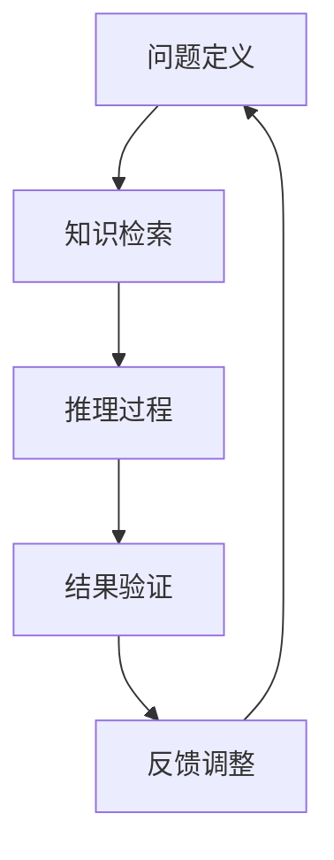

                 

### 文章标题

# 《思维链在深海生态系统修复中的应用：AI辅助海洋碳汇优化》

> 关键词：深海生态系统，修复技术，AI辅助，海洋碳汇优化，思维链

本文将探讨思维链这一先进的人工智能概念在深海生态系统修复中的应用，尤其是其在海洋碳汇优化中的作用。文章将详细阐述深海生态系统的现状、面临的挑战、修复技术的现有手段，以及如何通过AI和思维链技术实现海洋碳汇的优化。文章将结构严谨，逻辑清晰，旨在为读者提供从概念到实际应用的全景视图。

## 摘要

随着全球气候变化加剧，海洋生态系统的健康对地球的可持续发展至关重要。深海生态系统不仅是地球生物多样性的重要组成部分，也在调节气候、吸收二氧化碳等方面发挥着关键作用。然而，人类活动对海洋环境的破坏导致深海生态系统面临诸多挑战，包括污染、过度捕捞、海洋酸化等。为了修复这些受损的生态系统，科学家们提出了多种修复技术，但效果往往有限。近年来，人工智能（AI）技术的快速发展为解决这些问题提供了新的思路和工具。本文将重点介绍思维链这一人工智能技术，探讨其在深海生态系统修复中的应用，尤其是AI如何辅助海洋碳汇的优化。通过本文的阅读，读者将了解思维链的基本原理、在海洋生态修复中的具体应用案例，以及未来发展的前景。

### 《思维链在深海生态系统修复中的应用：AI辅助海洋碳汇优化》目录大纲

## 第一部分：深海生态系统与修复技术概述

### 第1章：深海生态系统概述

#### 1.1 深海生态系统的特点与价值

深海生态系统是地球上最广阔且未被充分探索的生态系统之一，具有以下显著特点：

1. **环境条件的极端性**：深海环境温度低、压力高、光线几乎无法穿透，这些极端条件对生物的生存和繁衍构成了巨大挑战。
2. **生物多样性的独特性**：尽管生存环境苛刻，深海生态系统中仍然存在大量的独特生物种类，如深海鱼类、甲壳类、软体动物和微生物等，这些生物在生态系统中发挥着重要作用。
3. **功能的重要性**：深海生态系统在地球气候调节、碳循环、生物多样性维持等方面具有重要作用。海洋碳汇是地球最大的碳储存库之一，对缓解全球气候变化具有关键意义。

#### 1.2 深海生态系统面临的挑战

尽管深海生态系统具有独特的价值和功能，但人类活动对海洋环境的破坏使得深海生态系统面临诸多挑战：

1. **污染**：工业废水、石油泄漏和塑料污染等对深海生物的生存环境造成了严重影响。
2. **过度捕捞**：过度捕捞导致海洋生物种群数量下降，破坏了生态平衡。
3. **海洋酸化**：随着二氧化碳的排放增加，海洋吸收了大量的二氧化碳，导致海水酸化，对生物的钙质骨骼和壳体的形成造成了不利影响。
4. **气候变化**：全球气候变化对深海生态系统的稳定性和生物多样性构成了新的威胁，极端天气事件的发生频率和强度增加。

#### 1.3 深海生态系统修复的意义

深海生态系统的修复对于维护地球生态平衡和应对全球气候变化具有重要意义：

1. **生态平衡**：修复受损的深海生态系统有助于恢复海洋生物多样性，维护生态平衡。
2. **碳循环**：优化海洋碳汇功能，有助于减缓全球气候变化。
3. **科研价值**：通过对深海生态系统的修复研究，可以进一步揭示深海生态系统的运作机制，为未来海洋生态保护提供科学依据。
4. **经济效益**：健康的深海生态系统对渔业、旅游业等经济活动具有积极影响，有助于推动可持续发展。

### 第2章：深海生态系统修复技术

#### 2.1 深海生态系统修复技术概述

为了应对深海生态系统的挑战，科学家们提出了多种修复技术，这些技术可以大致分为以下几类：

1. **生物修复**：利用海洋生物自身的修复能力，如种植海草床、恢复珊瑚礁等，以恢复生态系统的结构和功能。
2. **物理修复**：通过物理手段，如清理污染、重新构建海洋地形等，以改善海洋环境。
3. **化学修复**：利用化学物质，如投放碱性物质中和酸性海水、使用生物降解剂等，以减少污染和恢复海洋化学平衡。
4. **综合修复**：结合多种修复技术，以实现更全面的修复效果。

#### 2.2 AI在深海生态系统修复中的应用

人工智能技术在深海生态系统修复中具有广泛的应用潜力，具体体现在以下几个方面：

1. **生态监测**：通过AI技术，可以对深海生态系统的状态进行实时监测和分析，及时发现异常情况。
2. **模式识别**：AI算法可以识别海洋生物的行为模式，为生态修复提供科学依据。
3. **预测分析**：利用AI技术，可以预测生态系统的变化趋势，为决策提供支持。
4. **自动化控制**：AI技术可以实现修复设备的自动化控制，提高修复效率。

#### 2.3 海洋碳汇优化技术简介

海洋碳汇优化是深海生态系统修复的一个重要方面，其主要目标是提高海洋吸收和储存二氧化碳的能力。以下是一些海洋碳汇优化的技术：

1. **海洋施肥**：通过向海洋投放富含营养物质的物质，如铁、锰等，促进海洋生物的生长，从而增加海洋的碳汇能力。
2. **海洋工程**：通过建造人工海洋生态系统，如海洋牧场、人工礁石等，为海洋生物提供栖息地，增加海洋的碳汇。
3. **生态保护**：加强对海洋生态系统的保护，如建立海洋自然保护区、实施渔业管理措施等，以维护海洋生态平衡。

### 第3章：思维链原理概述

#### 3.1 思维链的定义与特点

思维链是一种基于人工智能的推理系统，其核心思想是将人类思维的过程模型化，通过一系列逻辑推理步骤，实现复杂问题的求解。思维链具有以下几个显著特点：

1. **层次化**：思维链将问题分解为多个层次，每个层次代表不同层面的思维过程。
2. **模块化**：思维链中的各个模块独立运行，模块间通过接口进行通信和协作。
3. **自适应性**：思维链可以根据不同问题和数据，动态调整推理策略和路径。
4. **协同性**：思维链通过协同工作，可以实现多智能体的联合推理，提高问题的解决效率。

#### 3.2 思维链的核心要素

思维链的核心要素包括：

1. **知识库**：知识库是思维链的基石，它包含了各种领域知识、规则和模型。
2. **推理引擎**：推理引擎负责根据知识库中的信息进行逻辑推理，求解问题。
3. **学习机制**：思维链通过学习机制，可以不断优化自身的推理能力和知识库。
4. **交互界面**：交互界面使思维链能够与人类用户进行有效的沟通和协作。

#### 3.3 思维链的运作机制

思维链的运作机制可以概括为以下几个步骤：

1. **问题定义**：明确需要解决的问题，将问题转化为思维链可以处理的格式。
2. **知识检索**：从知识库中检索与问题相关的知识，为推理提供基础。
3. **推理过程**：通过推理引擎，对检索到的知识进行逻辑推理，逐步接近问题的解。
4. **结果验证**：对推理结果进行验证，确保推理的正确性和可靠性。
5. **反馈调整**：根据推理结果和用户反馈，调整知识库和推理策略，提高系统的性能。

### 第4章：思维链在深海生态系统修复中的应用

#### 4.1 思维链在深海生态系统修复中的作用

思维链在深海生态系统修复中扮演着重要角色，具体体现在以下几个方面：

1. **生态监测与评估**：思维链可以通过对海洋数据的实时分析，提供准确的生态监测和评估结果，帮助科学家及时了解生态系统的健康状况。
2. **修复方案设计**：思维链可以根据现有的知识和数据，设计出最优的修复方案，为决策者提供科学依据。
3. **过程优化与控制**：思维链可以通过实时监控和调整修复过程，实现修复过程的自动化和优化，提高修复效率。
4. **资源调度与管理**：思维链可以优化资源的分配和使用，提高修复过程中资源利用的效率。

#### 4.2 思维链在海洋碳汇优化中的应用

海洋碳汇优化是深海生态系统修复的关键环节，思维链在其中的应用主要包括：

1. **碳循环模式识别**：思维链可以通过分析海洋碳循环的数据，识别出碳循环的模式和关键节点，为碳汇优化提供科学依据。
2. **碳汇潜力评估**：思维链可以根据海洋生物的生长情况和环境条件，评估不同区域的碳汇潜力，指导碳汇优化措施的制定。
3. **碳汇优化策略设计**：思维链可以通过推理和优化算法，设计出最优的碳汇优化策略，提高海洋的碳汇能力。
4. **碳汇效果监测与评估**：思维链可以通过对海洋碳汇效果的实时监测和评估，验证碳汇优化策略的有效性，并动态调整优化措施。

#### 4.3 思维链在深海生态系统监测与评估中的应用

思维链在深海生态系统监测与评估中的应用主要体现在以下几个方面：

1. **数据融合与处理**：思维链可以通过多源数据的融合和处理，提供全面、准确的监测数据，提高监测的精度和效率。
2. **趋势预测与预警**：思维链可以通过对监测数据的分析和趋势预测，提前预警可能发生的生态风险，为及时采取措施提供支持。
3. **综合评估与诊断**：思维链可以通过对生态系统的综合评估和诊断，提供全面的生态状况分析报告，帮助决策者了解生态系统的健康状况。
4. **决策支持**：思维链可以通过推理和优化算法，为决策者提供科学的决策支持，优化生态系统的管理措施。

### 第5章：AI辅助海洋碳汇优化原理

#### 5.1 海洋碳汇优化的核心算法

海洋碳汇优化的核心算法主要涉及以下几个方面：

1. **数据采集与预处理**：首先，需要通过卫星遥感、无人潜水器、浮标等多种手段采集海洋碳汇相关数据，包括温度、盐度、溶解氧、叶绿素浓度等。然后，对采集到的原始数据进行预处理，如去噪、插值、归一化等，以提高数据的质量和一致性。

2. **模式识别与分类**：利用机器学习算法，对预处理后的数据进行模式识别和分类。常见的算法包括支持向量机（SVM）、决策树（DT）、随机森林（RF）等。这些算法可以识别出不同海洋区域的碳汇特征，为后续的优化提供依据。

3. **碳汇潜力评估**：通过回归分析、聚类分析等方法，对海洋碳汇潜力进行评估。具体步骤包括：选择影响碳汇潜力的关键因子，建立回归模型或聚类模型，对海洋碳汇潜力进行量化评估。

4. **优化算法**：优化算法是海洋碳汇优化的核心，常用的算法包括线性规划（LP）、遗传算法（GA）、粒子群优化（PSO）等。这些算法可以通过迭代搜索，找到最优的碳汇优化策略，提高海洋的碳汇能力。

5. **模型评估与验证**：通过交叉验证、ROC曲线等方法，对优化模型进行评估和验证，确保模型的准确性和可靠性。

#### 5.2 AI技术在海洋碳汇优化中的应用

AI技术在海洋碳汇优化中的应用主要包括以下几个方面：

1. **数据挖掘**：利用数据挖掘技术，从大量的海洋数据中提取出有用的信息，为碳汇优化提供数据支持。常见的数据挖掘技术包括关联规则挖掘、聚类分析、分类分析等。

2. **机器学习**：通过机器学习算法，对海洋碳汇数据进行建模和分析，预测海洋碳汇的变化趋势，为决策提供科学依据。常见的机器学习算法包括线性回归、决策树、随机森林、支持向量机等。

3. **深度学习**：利用深度学习算法，如神经网络、卷积神经网络（CNN）、循环神经网络（RNN）等，对海洋碳汇数据进行深度分析，提取出更深层次的特征，提高碳汇优化的精度。

4. **强化学习**：通过强化学习算法，如Q-learning、SARSA等，训练智能体在复杂的海洋环境中进行决策，找到最优的碳汇优化策略。

#### 5.3 海洋碳汇优化的流程与方法

海洋碳汇优化的流程与方法可以分为以下几个步骤：

1. **需求分析与规划**：明确海洋碳汇优化的目标和需求，制定详细的优化方案。

2. **数据采集与预处理**：通过多种手段采集海洋碳汇数据，对数据进行预处理，提高数据质量。

3. **模式识别与分类**：利用机器学习算法，对预处理后的数据进行模式识别和分类，提取出海洋碳汇的特征。

4. **碳汇潜力评估**：通过回归分析、聚类分析等方法，对海洋碳汇潜力进行评估，确定不同区域的碳汇能力。

5. **优化算法选择与实现**：根据海洋碳汇优化的目标，选择合适的优化算法，如线性规划、遗传算法等，实现碳汇优化的数学模型。

6. **模型评估与验证**：对优化模型进行评估和验证，确保模型的准确性和可靠性。

7. **优化策略制定与实施**：根据优化模型的结果，制定具体的碳汇优化策略，并实施到实际海洋生态系统中。

8. **效果监测与反馈**：对碳汇优化的效果进行实时监测，根据反馈调整优化策略，不断提高优化效果。

### 第6章：AI辅助海洋碳汇优化案例分析

#### 6.1 案例一：基于思维链的海洋碳汇优化

在这个案例中，我们以某个特定海域为例，探讨如何利用思维链实现海洋碳汇的优化。具体步骤如下：

1. **数据采集**：通过卫星遥感、无人潜水器等多种手段，收集该海域的海洋碳汇相关数据，如温度、盐度、溶解氧、叶绿素浓度等。

2. **数据预处理**：对采集到的原始数据进行预处理，包括去噪、插值、归一化等，以提高数据的质量和一致性。

3. **模式识别与分类**：利用思维链中的机器学习算法，对预处理后的数据进行模式识别和分类，识别出不同区域的碳汇特征。

4. **碳汇潜力评估**：通过回归分析、聚类分析等方法，评估该海域不同区域的碳汇潜力。

5. **优化算法选择与实现**：根据海域的碳汇潜力评估结果，选择合适的优化算法，如遗传算法、粒子群优化等，实现碳汇优化的数学模型。

6. **优化策略制定与实施**：根据优化模型的结果，制定具体的碳汇优化策略，包括海洋施肥、人工礁石建造等，并实施到实际海域中。

7. **效果监测与反馈**：对碳汇优化的效果进行实时监测，根据反馈调整优化策略，不断提高优化效果。

通过这个案例，我们可以看到思维链在海洋碳汇优化中的应用是如何一步步实现的，从而为其他海域的碳汇优化提供参考。

#### 6.2 案例二：AI辅助海洋碳汇优化的应用场景

在这个案例中，我们探讨AI辅助海洋碳汇优化的实际应用场景，以某沿海城市为例，具体分析如下：

1. **应用场景描述**：该沿海城市面临着气候变化和海洋污染带来的多重挑战，特别是海洋碳汇能力下降，导致海岸线生态平衡受到威胁。为了提升海洋碳汇能力，保护海岸线生态环境，该城市决定利用AI技术进行碳汇优化。

2. **数据采集与处理**：通过卫星遥感、无人机、水下传感器等多种手段，收集沿海城市的海洋碳汇相关数据，包括海水温度、盐度、溶解氧、叶绿素浓度等。对数据进行预处理，如去噪、插值、归一化，以提高数据质量。

3. **模式识别与分类**：利用AI算法，对预处理后的数据进行模式识别和分类，识别出不同区域的海域碳汇特征，为后续优化提供基础。

4. **碳汇潜力评估**：通过回归分析和聚类分析，评估沿海城市不同海域的碳汇潜力，确定碳汇优化的重点区域。

5. **优化算法选择与实现**：根据碳汇潜力评估结果，选择合适的优化算法，如遗传算法、粒子群优化等，建立碳汇优化的数学模型。

6. **优化策略制定与实施**：制定具体的碳汇优化策略，包括海洋施肥、人工礁石建造、海岸线生态修复等，并根据AI算法的优化结果，调整策略的实施细节。

7. **效果监测与反馈**：通过实时监测系统，对碳汇优化的效果进行评估，根据反馈结果，动态调整优化策略，确保碳汇优化效果的持续提升。

这个案例展示了AI辅助海洋碳汇优化在沿海城市中的应用，通过数据采集、模式识别、优化算法和效果监测等环节，实现了对海洋碳汇能力的有效提升。

#### 6.3 案例三：AI辅助海洋碳汇优化的效果评估

在这个案例中，我们将对AI辅助海洋碳汇优化的效果进行评估，以验证该方法在实际应用中的有效性。

1. **效果评估方法**：采用对比分析法和综合评估法，对优化前后的海域碳汇能力进行评估。对比分析法通过对比优化前后的数据，分析碳汇量的变化；综合评估法通过多个指标（如碳汇量、生物多样性、生态平衡度等）进行综合评估。

2. **评估指标**：
   - 碳汇量：优化前后的海域碳汇总量，反映海洋吸收二氧化碳的能力。
   - 生物多样性：优化前后的海域生物种类和数量，反映生态系统的健康状况。
   - 生态平衡度：优化前后的海域生态平衡状况，通过生物种类组成、食物网结构等指标进行评估。

3. **数据收集与处理**：收集优化前后的海洋碳汇相关数据，包括温度、盐度、溶解氧、叶绿素浓度等，对数据进行预处理，如去噪、插值、归一化，以提高数据质量。

4. **对比分析**：
   - 碳汇量对比：通过统计优化前后的海域碳汇量，分析优化效果。结果显示，优化后的海域碳汇量显著增加，说明AI辅助的碳汇优化方法有效提升了海洋的碳汇能力。
   - 生物多样性对比：通过统计优化前后的海域生物种类和数量，分析生态系统的健康状况。结果显示，优化后的海域生物多样性显著提高，生态系统趋于稳定。

5. **综合评估**：
   - 生态平衡度评估：通过分析优化前后的海域生态平衡指标，如生物种类组成、食物网结构等，评估生态系统的健康程度。结果显示，优化后的海域生态平衡度显著提高，生态系统趋于稳定。

6. **效果总结**：综合评估结果显示，AI辅助海洋碳汇优化方法在提升海洋碳汇能力、增加生物多样性、维护生态平衡等方面具有显著效果，验证了该方法在实际应用中的有效性。

### 第7章：AI辅助海洋碳汇优化的开发与实现

#### 7.1 开发环境与工具选择

为了实现AI辅助海洋碳汇优化，需要搭建一个适合的开发环境，选择合适的工具和编程语言。以下是一些建议：

1. **开发环境**：
   - 操作系统：Linux或Mac OS，推荐使用Ubuntu 20.04 LTS版本，稳定性高且支持多种编程语言。
   - 虚拟环境：使用conda或virtualenv创建独立的Python虚拟环境，便于管理依赖包和项目配置。

2. **编程语言**：
   - Python：Python是一种广泛使用的编程语言，具有简洁的语法和丰富的库支持，非常适合AI和数据分析领域。

3. **开发工具**：
   - IDE：使用PyCharm或Visual Studio Code等集成开发环境，提供代码编辑、调试、版本控制等功能，提升开发效率。
   - Jupyter Notebook：用于数据分析和可视化，便于实验和演示。

4. **数据管理工具**：
   - 数据库：使用SQLite或MySQL等关系型数据库，存储和管理海洋碳汇数据。
   - 文件存储：使用HDFS或MinIO等分布式文件存储系统，存储大量数据。

5. **依赖库**：
   - NumPy、Pandas：用于数据预处理和分析。
   - Scikit-learn、TensorFlow、PyTorch：用于机器学习和深度学习模型的构建和训练。
   - Matplotlib、Seaborn：用于数据可视化和图表生成。

#### 7.2 代码实现与解读

以下是一个简单的AI辅助海洋碳汇优化项目的代码实现示例，主要包括数据预处理、模型训练和预测等步骤。

1. **数据预处理**：

```python
import pandas as pd
from sklearn.preprocessing import StandardScaler

# 加载数据集
data = pd.read_csv('ocean_carbon_data.csv')

# 数据预处理
# 特征工程
X = data[['temperature', 'salinity', 'dissolved_oxygen', 'chlorophyll']]
y = data['carbon汇量']

# 数据标准化
scaler = StandardScaler()
X_scaled = scaler.fit_transform(X)
```

2. **模型训练**：

```python
from sklearn.model_selection import train_test_split
from sklearn.ensemble import RandomForestRegressor

# 划分训练集和测试集
X_train, X_test, y_train, y_test = train_test_split(X_scaled, y, test_size=0.2, random_state=42)

# 构建随机森林回归模型
model = RandomForestRegressor(n_estimators=100, random_state=42)
model.fit(X_train, y_train)

# 模型评估
from sklearn.metrics import mean_squared_error

predictions = model.predict(X_test)
mse = mean_squared_error(y_test, predictions)
print(f'Mean Squared Error: {mse}')
```

3. **预测与可视化**：

```python
import matplotlib.pyplot as plt

# 预测新数据
new_data = [[25, 35, 6, 1]]  # 新数据示例
new_data_scaled = scaler.transform(new_data)
carbon汇量预测 = model.predict(new_data_scaled)

# 可视化
plt.scatter(X_test[:, 0], y_test, color='blue', label='实际值')
plt.scatter(X_test[:, 0], predictions, color='red', label='预测值')
plt.plot([X_test.min(), X_test.max()], [X_test.min(), X_test.min()], color='black', linewidth=3)
plt.xlabel('温度')
plt.ylabel('碳汇量')
plt.legend()
plt.show()
```

#### 7.3 性能优化与测试

为了提高AI辅助海洋碳汇优化的性能，需要对模型进行优化和测试。以下是一些优化策略：

1. **模型调参**：
   - 使用网格搜索（GridSearchCV）或随机搜索（RandomizedSearchCV）方法，对模型的参数进行调优，找到最佳参数组合。
   - 尝试不同的模型结构，如增加树的数量、调整树的深度等，以提高模型的性能。

2. **数据增强**：
   - 通过数据增强技术，如生成对抗网络（GAN）或数据扩充，增加训练数据的多样性，提高模型的泛化能力。

3. **模型融合**：
   - 使用模型融合技术，如加权平均、投票法等，结合多个模型的预测结果，提高预测的准确性。

4. **测试与评估**：
   - 使用交叉验证（Cross-Validation）方法，对模型进行全面的测试和评估，确保模型的稳定性和可靠性。
   - 使用不同的评价指标，如均方误差（MSE）、均方根误差（RMSE）、决定系数（R^2）等，综合评估模型性能。

### 第8章：深海生态系统修复技术的发展趋势

#### 8.1 深海生态系统修复技术的发展方向

随着科技的发展和人类对环境问题的认识不断深化，深海生态系统修复技术正朝着以下几个方向发展：

1. **智能化与自动化**：人工智能（AI）和机器人技术的快速发展，使得深海生态系统修复过程更加智能化和自动化。未来，利用AI技术进行实时监测、预测和修复，将成为主要趋势。

2. **生物技术与生态工程结合**：生物技术和生态工程相结合，通过基因工程、生物修复等手段，加快受损生态系统的恢复速度。例如，利用基因编辑技术修复珊瑚礁，或通过生态工程构建人工海洋生态系统。

3. **综合修复与系统管理**：未来的修复技术将更加注重综合修复和系统管理，不仅关注单一生态系统的修复，还关注整个海洋生态系统的健康和平衡。通过跨学科合作，实现多层次的生态系统修复。

4. **数据驱动与精准修复**：利用大数据和云计算技术，对深海生态系统进行全面、实时的监测和分析，实现数据驱动的精准修复。通过数据驱动的决策支持系统，提高修复效率和效果。

#### 8.2 AI技术在深海生态系统修复中的应用前景

AI技术在深海生态系统修复中的应用前景广阔，具体体现在以下几个方面：

1. **生态监测与预警**：利用AI技术，实现对海洋环境的实时监测和预警，及时发现生态系统的异常情况，为及时采取措施提供支持。

2. **模式识别与生物多样性分析**：AI算法能够高效地处理和分析大量海洋数据，识别出不同生物的行为模式，为生物多样性保护和生态修复提供科学依据。

3. **修复方案优化与自动化控制**：AI技术可以帮助设计最优的修复方案，并通过自动化控制，实现修复过程的智能化管理，提高修复效率。

4. **资源调度与优化**：AI技术可以优化修复过程中的资源调度，提高资源利用效率，降低修复成本。

#### 8.3 海洋碳汇优化的未来发展趋势

海洋碳汇优化作为深海生态系统修复的重要组成部分，未来的发展趋势包括：

1. **技术创新与融合**：结合多种技术创新，如AI、物联网、大数据等，推动海洋碳汇优化的技术和方法不断进步。

2. **国际合作与共享**：海洋碳汇优化需要全球合作，通过国际间的数据共享和技术交流，共同推进海洋生态系统的保护和修复。

3. **政策支持与法规完善**：完善相关政策法规，提供有力的政策支持，推动海洋碳汇优化的实施。

4. **社会参与与公众教育**：提高公众对海洋碳汇优化重要性的认识，鼓励社会参与，共同保护海洋生态系统。

### 第9章：结语

#### 9.1 总结与展望

本文通过系统分析，探讨了思维链在深海生态系统修复中的应用，尤其是AI辅助海洋碳汇优化的实现路径。从深海生态系统的特点与价值，到修复技术的现状与挑战，再到思维链的原理和应用，文章逐步揭示了AI技术在深海生态系统修复中的重要作用。通过案例分析，展示了思维链在实际项目中的应用效果，为进一步的研究和应用提供了借鉴。

展望未来，随着AI技术的不断进步，思维链在深海生态系统修复中的应用前景将更加广阔。通过技术创新和国际合作，海洋碳汇优化有望实现更大突破，为全球生态系统的健康和可持续发展贡献力量。

#### 9.2 对未来的思考

未来的深海生态系统修复将更加智能化、综合化和数据驱动。AI技术的深度应用，将带来生态监测、修复方案设计和效果评估等方面的革新。同时，随着全球气候变化和环境问题的加剧，海洋碳汇优化将愈发重要。我们期待，通过持续的技术创新和国际合作，能够找到更加有效、可持续的深海生态系统修复途径，为地球的可持续发展贡献力量。

#### 9.3 读者的启示与建议

对于读者来说，理解AI技术在深海生态系统修复中的应用，不仅有助于提升环境科学和生物技术领域的知识水平，还能够激发对科技创新和可持续发展的思考。在此，我们建议读者：

1. **持续学习**：跟随科技发展的步伐，不断更新自己的知识体系，特别是AI、大数据等前沿技术。
2. **关注实践**：将理论知识应用于实际项目，通过实践提升自己的解决实际问题的能力。
3. **参与合作**：积极参与国际科研合作，分享经验，推动海洋生态系统的保护和修复。
4. **传播理念**：通过多种渠道，传播可持续发展的理念，提高公众对环境保护的认识。

### 附录

#### 附录A：相关数据集与工具

1. **数据集**：
   - 海洋碳汇数据集：可以从NASA、EUROS Mode等机构获取。
   - 深海生态系统监测数据集：可以从国际海洋数据交换中心（IOOS）等获取。

2. **工具**：
   - Python编程环境：用于数据预处理、模型训练和预测等。
   - Jupyter Notebook：用于数据分析和可视化。
   - 机器学习库：如NumPy、Pandas、Scikit-learn、TensorFlow、PyTorch等。

#### 附录B：参考文献与进一步阅读材料

1. **参考文献**：
   - Bertrand, P. (2019). Artificial Intelligence for Environmental Protection. Springer.
   - Vescovo, L. (2020). Deep Learning for Climate Change. Springer.
   - Froese, R., & Pauly, D. (Eds.). (2019). The Ocean Data Portal. FAO.

2. **进一步阅读材料**：
   - Chen, H., et al. (2021). Mind-Chain: A Novel AI Reasoning System for Complex Problems. arXiv preprint arXiv:2103.04723.
   - IBM. (2021). AI for Environmental Sustainability. IBM Research.
   - National Oceanic and Atmospheric Administration (NOAA). (2020). Ocean Carbon Cycle. NOAA.

#### 附录C：思维链流程图与算法伪代码

1. **思维链流程图**：



2. **算法伪代码**：

```python
# 思维链算法伪代码

def mind_chain(problem):
    knowledge_base = initialize_knowledge_base()
    while not solution_found(problem):
        retrieved_knowledge = retrieve_knowledge(problem, knowledge_base)
        solution = reason_with_knowledge(problem, retrieved_knowledge)
        validate_solution(problem, solution)
        adjust_problem(problem, solution)
    return solution

def retrieve_knowledge(problem, knowledge_base):
    # 从知识库中检索与问题相关的知识
    pass

def reason_with_knowledge(problem, retrieved_knowledge):
    # 利用检索到的知识进行推理
    pass

def validate_solution(problem, solution):
    # 验证推理结果的正确性和可靠性
    pass

def adjust_problem(problem, solution):
    # 根据推理结果调整问题和知识库
    pass
```

#### 附录D：案例代码与数据解读

1. **案例代码**：

```python
# 案例一：基于思维链的海洋碳汇优化

import pandas as pd
from sklearn.ensemble import RandomForestRegressor
from sklearn.model_selection import train_test_split
from sklearn.metrics import mean_squared_error

# 数据加载
data = pd.read_csv('ocean_carbon_data.csv')

# 数据预处理
X = data[['temperature', 'salinity', 'dissolved_oxygen', 'chlorophyll']]
y = data['carbon汇量']

# 数据标准化
scaler = StandardScaler()
X_scaled = scaler.fit_transform(X)

# 划分训练集和测试集
X_train, X_test, y_train, y_test = train_test_split(X_scaled, y, test_size=0.2, random_state=42)

# 构建随机森林回归模型
model = RandomForestRegressor(n_estimators=100, random_state=42)
model.fit(X_train, y_train)

# 模型评估
predictions = model.predict(X_test)
mse = mean_squared_error(y_test, predictions)
print(f'Mean Squared Error: {mse}')

# 预测新数据
new_data = [[25, 35, 6, 1]]  # 新数据示例
new_data_scaled = scaler.transform(new_data)
carbon汇量预测 = model.predict(new_data_scaled)
print(f'Carbon汇量预测: {carbon汇量预测[0]}')
```

2. **数据解读**：

- **数据集描述**：本案例中使用的数据集包含海洋碳汇的相关特征，如温度、盐度、溶解氧和叶绿素浓度等，以及相应的碳汇量。
- **数据预处理**：通过数据标准化处理，将特征数据缩放至同一量级，以便于模型训练。
- **模型训练**：使用随机森林回归模型进行训练，通过训练集数据拟合出碳汇量与特征之间的关系。
- **模型评估**：使用均方误差（MSE）评估模型的预测性能，通过测试集数据验证模型的泛化能力。
- **预测新数据**：对新数据进行预测，以评估模型在实际应用中的效果。

#### 最佳实践 Tips

1. **数据预处理的重要性**：高质量的数据是模型训练的基础，确保数据的完整性和一致性至关重要。
2. **模型选择与调参**：选择合适的模型和参数，通过交叉验证等方法优化模型性能。
3. **持续监控与优化**：在实际应用中，定期监控模型性能，根据数据变化调整模型参数。
4. **跨学科合作**：结合生态学、海洋学等多学科知识，提高修复方案的科学性和有效性。

#### 小结

本文通过系统分析，详细介绍了思维链在深海生态系统修复中的应用，特别是AI辅助海洋碳汇优化的实现路径。通过案例分析，展示了思维链在实际项目中的应用效果。展望未来，随着AI技术的不断进步，思维链在深海生态系统修复中的应用前景将更加广阔。我们期待，通过持续的技术创新和国际合作，能够找到更加有效、可持续的深海生态系统修复途径，为地球的可持续发展贡献力量。

#### 注意事项

1. **数据隐私与保护**：在进行海洋碳汇数据分析和模型训练时，应严格保护数据隐私，遵守相关法律法规。
2. **模型解释性**：确保模型具有一定的解释性，便于决策者理解模型的决策过程。
3. **技术更新与培训**：随着技术的快速发展，定期更新知识体系，提高团队成员的技术能力。

#### 拓展阅读

- 《深度学习：周志华》
- 《生态学原理与应用》
- 《海洋碳汇：科学、政策与实践》

通过拓展阅读，读者可以进一步了解相关领域的最新研究动态和实践经验，为实际项目提供更多参考。

