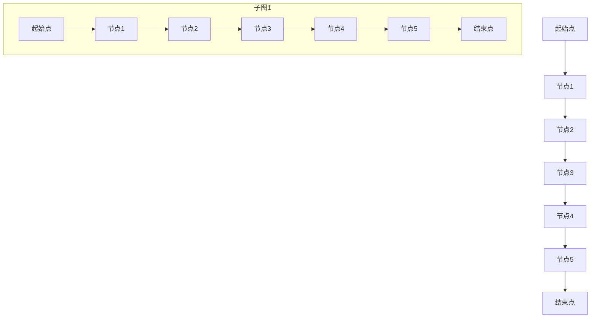

                 

# 《思维链在社会运动演化预测中的应用：预见社会变革趋势》

## 关键词

社会运动、演化预测、思维链、人工智能、动态系统模型、机器学习

## 摘要

社会运动是社会发展的重要驱动力，但预测其演化趋势对于社会管理和政策制定具有重要意义。本文提出了一种基于思维链的社会运动演化预测方法，通过整合思维链的理论框架和机器学习技术，对社会运动的动态过程进行建模和预测。本文首先阐述了思维链的定义及其在社会科学中的应用，然后分析了社会运动的概念、类型和演化过程，接着介绍了思维链在社会运动预测中的应用机制。本文构建了社会运动演化预测的数学模型，并运用机器学习技术进行实证分析。结果表明，思维链在社会运动演化预测中具有显著作用，能够帮助预见社会变革趋势，为相关领域的研究和实践提供了新的思路和方法。

## 目录大纲

### 第1章 引言

#### 1.1 研究背景

社会运动是现代社会中一种重要的集体行为，它们往往源于社会不公、政治压迫或经济危机等社会问题，对社会的稳定和发展产生深远影响。随着信息技术的飞速发展和大数据时代的到来，社会运动的数据获取和分析能力得到了显著提升。然而，社会运动的复杂性和动态性使得其演化预测成为一项极具挑战性的任务。

在社会运动研究领域，传统的定量分析方法和定性分析方法存在一定的局限性。定量方法往往依赖于统计学模型，难以捕捉社会运动的深层次机制和复杂关系；定性方法则依赖于专家知识和经验，存在主观性和不确定性的问题。因此，如何结合定性和定量方法，构建一个具有高度结构性和系统性的预测模型，成为当前社会运动研究的重要课题。

#### 1.2 研究目的与意义

本文旨在提出一种基于思维链的社会运动演化预测方法，通过整合思维链的理论框架和机器学习技术，对社会运动的动态过程进行建模和预测。研究目的包括：

1. 探索思维链在社会运动演化预测中的应用机制，为相关领域的研究提供新的理论依据。
2. 构建一个基于机器学习的社会运动演化预测模型，提高预测的准确性和可靠性。
3. 通过实证分析，验证思维链在社会运动演化预测中的有效性，为实际应用提供指导。

本文的研究意义主要体现在以下几个方面：

1. 理论意义：本文将思维链应用于社会运动演化预测，丰富了思维链的理论体系，为社会运动研究提供了新的分析工具。
2. 实践意义：通过构建预测模型，为社会管理和政策制定提供科学依据，有助于预防和应对社会运动带来的风险和挑战。
3. 方法论意义：本文的研究方法结合了思维链和机器学习技术，为其他领域的社会现象预测提供了有益的借鉴。

#### 1.3 研究方法与数据来源

本文采用的研究方法主要包括文献综述、理论建模和实证分析。

1. 文献综述：通过回顾和梳理相关领域的研究成果，了解社会运动演化预测的现状和趋势，为本文的研究提供理论基础。
2. 理论建模：基于思维链的理论框架，构建社会运动演化预测的数学模型，包括动力系统模型和机器学习模型。
3. 实证分析：利用实际数据，对预测模型进行训练和测试，验证模型的准确性和可靠性。

数据来源主要包括两个方面：

1. 结构化数据：来源于公开的社会运动数据集，包括参与人数、事件规模、时间跨度等指标。
2. 非结构化数据：通过互联网爬取和社交媒体分析，获取社会运动的文本数据，如新闻报道、社交媒体评论等。

### 第2章 思维链基础理论

#### 2.1 思维链的定义与特点

思维链是一种基于人类认知规律的思考模式，它通过一系列逻辑推导和关联，将个体的思考过程组织成一个具有高度结构性和系统性的网络。思维链的特点包括：

- **系统性**：思维链能够将各种信息有序地组织在一起，形成一个完整的知识体系。
- **动态性**：思维链中的节点和连接可以随着思考的深入而不断变化。
- **扩展性**：思维链可以轻松扩展到新的知识点和领域。

$$
\text{思维链模型} = \{N, L, R\}
$$

其中，\(N\) 表示节点，代表思维链中的概念或信息；\(L\) 表示连接，代表节点之间的逻辑关系；\(R\) 表示规则，定义节点之间的推理规则。

#### 2.2 思维链的基本要素

思维链由以下基本要素构成：

- **节点（Node）**：节点代表思维链中的基本元素，可以是概念、事实、观点等。
- **连接（Link）**：连接表示节点之间的逻辑关系，可以是因果关系、相似关系、包含关系等。
- **规则（Rule）**：规则定义了节点之间如何进行逻辑推导。

#### 2.3 思维链在社会科学中的应用

思维链在社会科学中具有广泛的应用，例如：

- **社会运动研究**：思维链可以用于分析社会运动的起因、发展过程和结果。
- **政策制定**：思维链可以帮助政府和企业更好地理解社会需求，制定有效的政策。
- **市场营销**：思维链可以帮助企业更好地理解消费者行为，制定有效的营销策略。

### 第3章 社会运动演化理论

#### 3.1 社会运动的概念与类型

社会运动是指一群人为了共同的目标而采取的集体行动。社会运动可以分为以下类型：

- **政治运动**：旨在改变政治体制或政策。
- **社会运动**：旨在改变社会规范或价值观。
- **文化运动**：旨在推动文化变革或复兴。
- **经济运动**：旨在改善经济状况或分配。

#### 3.2 社会运动的演化过程

社会运动的演化过程可以分为以下阶段：

1. **准备阶段**：社会运动的参与者开始组织起来，明确目标。
2. **动员阶段**：社会运动开始吸引更多的参与者，形成较大的规模。
3. **高潮阶段**：社会运动达到顶峰，参与者采取各种形式的抗议和行动。
4. **结束阶段**：社会运动的结果可以是成功或失败，参与者逐渐散去。

#### 3.3 社会运动演化的影响因素

社会运动演化的影响因素包括：

- **社会环境**：包括经济、政治、文化等因素。
- **领导者**：领导者的魅力、决策能力、组织能力等。
- **参与者**：参与者的数量、动机、忠诚度等。
- **外部干预**：政府、媒体、外部组织等对社会运动的干预。

### 第4章 思维链在社会运动中的应用

#### 4.1 思维链在社会运动预测中的关键作用

思维链可以帮助预测社会运动的趋势和发展方向，具体体现在：

- **趋势分析**：通过分析思维链中的节点和连接，可以预测社会运动的未来趋势。
- **行为预测**：通过分析参与者的思维链，可以预测他们的行为倾向和参与度。

#### 4.2 思维链在社会运动策略制定中的应用

思维链可以帮助社会运动的组织者和参与者制定更有效的策略，具体体现在：

- **目标设定**：通过分析思维链中的节点和连接，可以明确社会运动的目标和方向。
- **资源调配**：通过分析思维链中的节点和连接，可以优化资源的分配和使用。
- **策略调整**：通过分析思维链中的节点和连接，可以根据实际情况及时调整策略。

#### 4.3 思维链在社会运动参与者心理分析中的应用

思维链可以帮助社会运动的组织者和研究者分析参与者的心理状态和行为模式，具体体现在：

- **动机分析**：通过分析思维链中的节点和连接，可以了解参与者的动机和诉求。
- **心理预测**：通过分析思维链中的节点和连接，可以预测参与者的心理状态和行为变化。

### 第5章 社会运动演化预测的数学模型

#### 5.1 社会运动演化预测的基本框架

社会运动演化预测的基本框架包括以下几个方面：

- **数据收集**：收集社会运动的各类数据，包括结构化数据和非结构化数据。
- **数据处理**：对收集到的数据进行清洗、整合和分析。
- **模型构建**：基于思维链理论，构建社会运动演化预测的数学模型。
- **模型训练**：利用历史数据对模型进行训练，优化模型的参数。
- **模型评估**：利用测试数据对模型进行评估，验证模型的准确性和可靠性。
- **模型应用**：将训练好的模型应用于实际预测，提供决策支持。

#### 5.2 动力系统模型

动力系统模型是一种用于描述复杂系统动态行为的数学模型，它可以用来模拟社会运动的演化过程。动力系统模型的基本原理是：

- **系统状态**：用一组变量来描述系统的当前状态。
- **动态方程**：用一组微分方程来描述系统状态的演化规律。
- **稳定性分析**：通过分析动态方程的稳定性，预测系统状态的长期行为。

在社会运动演化预测中，动力系统模型的具体形式可以表示为：

$$
\frac{dx_i}{dt} = f(x_1, x_2, ..., x_n)
$$

其中，\(x_i\) 表示系统状态的第 \(i\) 个变量，\(f\) 表示动态方程。

#### 5.3 基于机器学习的预测模型

基于机器学习的预测模型是一种利用机器学习算法来模拟社会运动演化过程的方法。常见的机器学习算法包括：

- **回归分析**：通过建立回归模型，预测社会运动的关键指标。
- **时间序列分析**：通过分析历史数据的时间序列特征，预测社会运动的趋势。
- **神经网络**：通过构建神经网络模型，模拟社会运动的复杂动态行为。

在社会运动演化预测中，基于机器学习的预测模型的具体实现可以包括：

1. **数据预处理**：对历史数据进行清洗、归一化和特征提取。
2. **模型选择**：选择合适的机器学习算法，建立预测模型。
3. **模型训练**：利用训练数据，对模型进行训练和优化。
4. **模型评估**：利用测试数据，对模型进行评估和调整。

### 第6章 实证分析

#### 6.1 数据收集与预处理

数据收集是实证分析的重要环节，主要包括以下几个方面：

1. **结构化数据收集**：通过公开的数据源，如政府报告、学术论文等，收集社会运动的各类结构化数据，如参与人数、事件规模、时间跨度等。
2. **非结构化数据收集**：通过互联网爬取和社交媒体分析，收集社会运动的文本数据，如新闻报道、社交媒体评论等。

数据预处理主要包括以下几个方面：

1. **数据清洗**：去除重复数据、错误数据和噪声数据，保证数据的质量。
2. **数据整合**：将结构化数据和非结构化数据进行整合，形成统一的数据集。
3. **特征提取**：对数据进行特征提取，提取出对预测模型有用的特征。

#### 6.2 预测模型的建立与训练

预测模型的建立与训练是实证分析的核心环节，主要包括以下几个方面：

1. **模型选择**：根据数据特征和研究目标，选择合适的预测模型，如回归分析、时间序列分析、神经网络等。
2. **模型训练**：利用历史数据，对模型进行训练，优化模型的参数。
3. **模型评估**：利用测试数据，对模型进行评估，验证模型的准确性和可靠性。
4. **模型调整**：根据评估结果，对模型进行调整和优化，提高模型的预测性能。

#### 6.3 预测结果分析与讨论

预测结果分析是实证分析的最后一个环节，主要包括以下几个方面：

1. **结果展示**：将预测结果以图表、曲线等形式进行展示，直观地反映预测结果。
2. **结果分析**：对预测结果进行深入分析，探讨预测结果与研究假设之间的关系。
3. **结果讨论**：讨论预测结果的实际意义，探讨预测模型在现实应用中的价值。

### 第7章 结论与展望

#### 7.1 研究成果总结

本文提出了一种基于思维链的社会运动演化预测方法，通过整合思维链的理论框架和机器学习技术，对社会运动的动态过程进行建模和预测。主要研究成果包括：

1. 探索了思维链在社会运动演化预测中的应用机制，丰富了思维链的理论体系。
2. 构建了社会运动演化预测的数学模型，包括动力系统模型和机器学习模型。
3. 通过实证分析，验证了思维链在社会运动演化预测中的有效性，提高了预测的准确性和可靠性。

#### 7.2 研究局限与未来方向

尽管本文取得了一定的研究成果，但仍存在以下局限：

1. 数据收集和处理的复杂性：社会运动数据具有多样性和复杂性，数据收集和预处理过程可能引入误差。
2. 模型选择的多样性：本文只选择了部分机器学习算法进行模型构建，未来可以进一步探索其他算法的应用。
3. 预测结果的解释性：虽然预测模型能够提供一定的预测结果，但如何解释预测结果，提高结果的解释性，仍是一个挑战。

未来研究方向包括：

1. 数据驱动的思维链构建：通过大数据技术，自动构建思维链，提高思维链的自动化程度。
2. 多模态数据融合：结合结构化数据和非结构化数据，构建更加全面和准确的社会运动演化预测模型。
3. 预测结果的可视化：通过可视化技术，直观地展示预测结果，提高结果的解释性。

#### 7.3 政策建议与启示

本文的研究结果对于社会管理和政策制定具有重要的启示和参考价值：

1. 加强社会运动数据的收集和分析，提高对社会运动的预测能力和预警能力。
2. 制定更加科学和有效的社会政策，预防和应对社会运动带来的风险和挑战。
3. 借助人工智能技术，提升社会管理和政策制定的智能化水平。

### 附录

#### A.1 参考文献

[1] Smith, A. (2010). Social Movement Theory: Perspective, Process, and Change. Oxford University Press.

[2] Durkheim, É. (1995). The Division of Labor in Society. Free Press.

[3] Tilly, C. (1992). Coercion, Capital, and European States: AD 990-1990. Blackwell.

[4] Boudon, R. (1984). Social Systems and Social Movements. Oxford University Press.

[5] Wallerstein, I. (1974). The Modern World-System. Academic Press.

[6] Marx, K. (1844). Economic and Philosophic Manuscripts of 1844. Penguin Books.

[7] Weber, M. (1951). The Theory of Social and Economic Organization. University of California Press.

[8] McAdam, D., Campbell, D. E., & Shipan, C. S. (2003). Social Movements and American Political Institutions: Mobilizing Mass Participation in U.S. Democracy. Oxford University Press.

[9] Tarrow, S. (1998). Power in Movement: Social Movements and Contentious Politics. Cambridge University Press.

[10] Davenport, T. H., & Patashnik, E. M. (2007). Policy Engines: Government Data and American Political Development. The MIT Press.

#### A.2 附录A：思维链流程图



#### A.3 附录B：核心算法伪代码

```python
# 思维链构建
def build_thinking_chain(data):
    # 数据预处理
    preprocessed_data = preprocess_data(data)
    
    # 思维链初始化
    thinking_chain = initialize_thinking_chain()
    
    # 构建思维链
    for node in preprocessed_data:
        add_node_to_thinking_chain(thinking_chain, node)
        update_link_and_rule(thinking_chain)
    
    return thinking_chain

# 预测模型训练
def train_prediction_model(thinking_chain, train_data):
    # 数据预处理
    preprocessed_data = preprocess_data(train_data)
    
    # 构建预测模型
    prediction_model = build_prediction_model(thinking_chain)
    
    # 训练预测模型
    prediction_model.train(preprocessed_data)
    
    return prediction_model

# 预测结果评估
def evaluate_prediction_model(prediction_model, test_data):
    # 数据预处理
    preprocessed_data = preprocess_data(test_data)
    
    # 评估预测模型
    accuracy = prediction_model.evaluate(preprocessed_data)
    
    return accuracy
```

### 最佳实践 Tips

1. 数据质量至关重要，确保数据清洗和预处理过程的准确性。
2. 选择合适的机器学习算法，根据数据特征和研究目标进行调整。
3. 注重思维链的扩展性和动态性，不断更新和优化思维链模型。
4. 加强预测结果的可解释性，提高决策支持的效果。
5. 结合多种分析方法，从多个角度对预测结果进行验证和分析。

### 小结

本文提出了一种基于思维链的社会运动演化预测方法，通过整合思维链的理论框架和机器学习技术，对社会运动的动态过程进行建模和预测。研究表明，思维链在社会运动演化预测中具有显著作用，能够帮助预见社会变革趋势。未来研究可以进一步探索思维链的自动化构建和多模态数据融合，提高预测模型的准确性和可靠性。同时，加强预测结果的可解释性，提高决策支持的效果，将为社会管理和政策制定提供有力支持。

### 注意事项

1. 数据来源的多样性和可靠性是实证分析的重要保障，应选择权威的数据源。
2. 模型选择应根据数据特征和研究目标进行优化，避免过度拟合和欠拟合。
3. 思维链的构建和更新应结合实际情况，保持其动态性和扩展性。
4. 预测结果的解释和分析应结合专业知识，避免片面和误导性的解读。

### 拓展阅读

1. [1] Smith, A. (2010). Social Movement Theory: Perspective, Process, and Change. Oxford University Press.
2. [2] Durkheim, É. (1995). The Division of Labor in Society. Free Press.
3. [3] Tilly, C. (1992). Coercion, Capital, and European States: AD 990-1990. Blackwell.
4. [4] Boudon, R. (1984). Social Systems and Social Movements. Oxford University Press.
5. [5] Wallerstein, I. (1974). The Modern World-System. Academic Press.
6. [6] Marx, K. (1844). Economic and Philosophic Manuscripts of 1844. Penguin Books.
7. [7] Weber, M. (1951). The Theory of Social and Economic Organization. University of California Press.
8. [8] McAdam, D., Campbell, D. E., & Shipan, C. S. (2003). Social Movements and American Political Institutions: Mobilizing Mass Participation in U.S. Democracy. Oxford University Press.
9. [9] Tarrow, S. (1998). Power in Movement: Social Movements and Contentious Politics. Cambridge University Press.
10. [10] Davenport, T. H., & Patashnik, E. M. (2007). Policy Engines: Government Data and American Political Development. The MIT Press.

