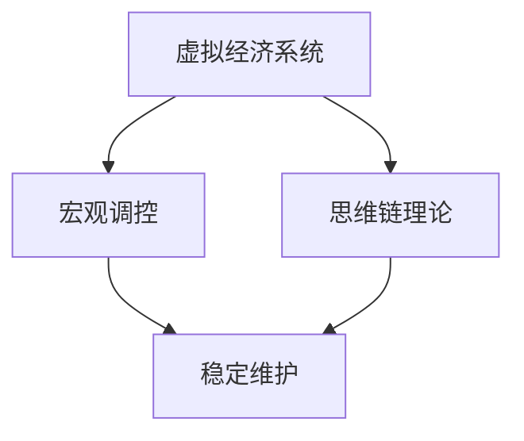
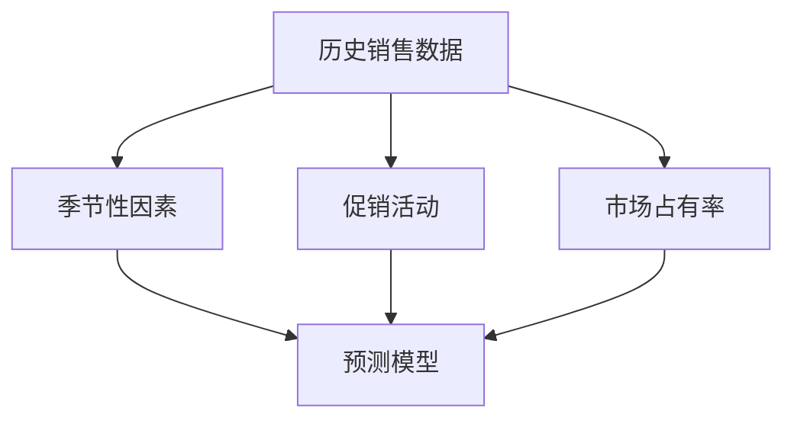
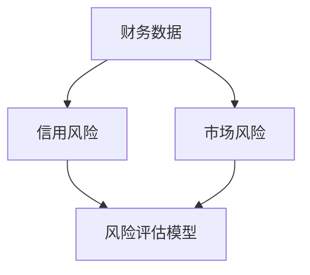
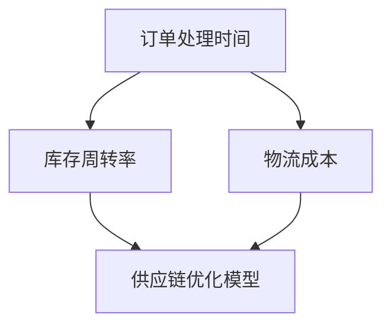
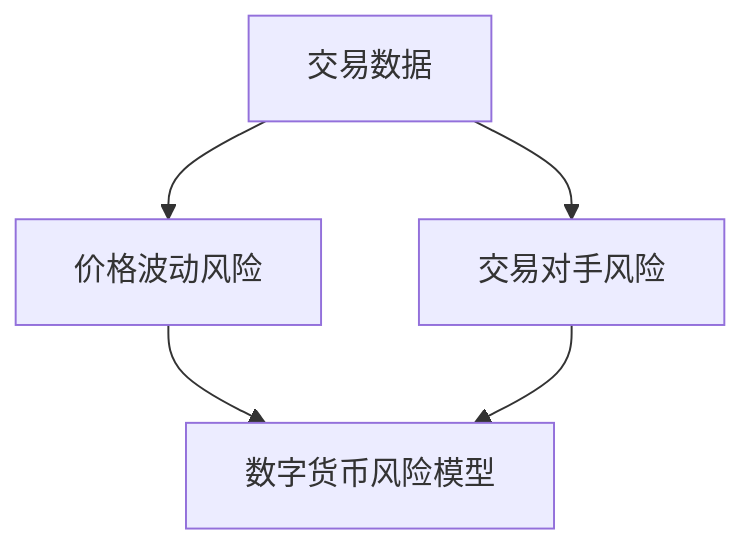
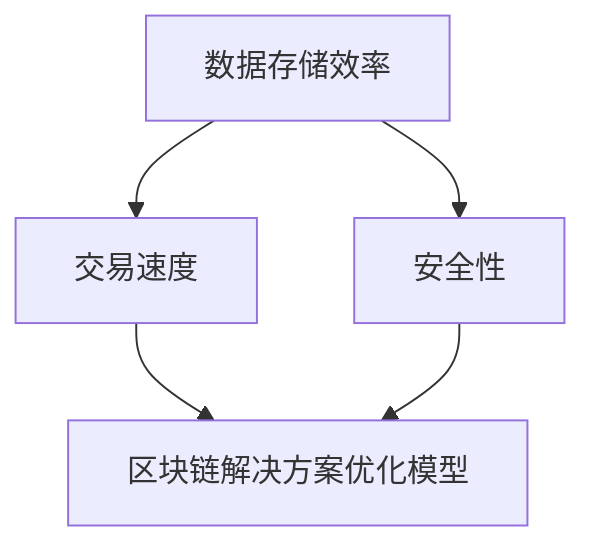
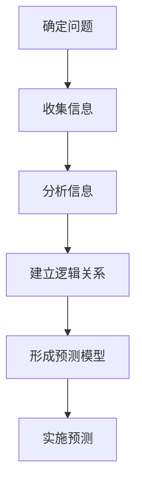

                 

### 文章标题: 思维链在虚拟经济系统宏观调控中的应用：维护数字经济稳定

> 关键词：思维链、虚拟经济系统、宏观调控、数字经济稳定

> 摘要：本文深入探讨了思维链理论及其在虚拟经济系统宏观调控中的应用。通过逻辑清晰的推理和分析，本文揭示了思维链如何帮助维护数字经济的稳定，为相关领域的研究和实践提供了新的思路和方法。

----------------------------------------------------------------------------------------------------------------------------

## 研究背景与核心概念

随着互联网技术的飞速发展和大数据时代的到来，虚拟经济系统已经成为现代经济体系的重要组成部分。虚拟经济系统以互联网为基础，通过数字技术实现各种经济活动，如电子商务、在线金融、数字货币等。这一系统的高度数字化和信息密集性，使得其宏观调控面临诸多挑战。如何在复杂多变的经济环境中实现数字经济的稳定发展，成为当前经济研究的重要课题。

### 1.1 《思维链在虚拟经济系统宏观调控中的应用：维护数字经济稳定》的核心主题

本书的核心主题是探讨思维链理论在虚拟经济系统宏观调控中的应用，旨在通过构建和运用思维链，实现数字经济的稳定。思维链理论是一种创新的思维方式，通过逻辑关系将信息组织起来，形成具有层次性和连贯性的思考步骤。本书将结合实际案例，详细阐述思维链在虚拟经济系统中的应用，为数字经济稳定提供一种新的思路和工具。

### 1.2 虚拟经济系统的概念

虚拟经济系统是指以互联网为基础，通过数字技术实现的虚拟经济活动。这些活动包括电子商务、在线金融、数字货币等多个领域。虚拟经济系统具有高度数字化和信息密集性的特点，使得其宏观调控面临诸多挑战。虚拟经济系统的运行依赖于大数据、云计算、人工智能等先进技术，这些技术的应用极大地提高了经济活动的效率和透明度，但也带来了新的风险和挑战。

### 1.3 宏观调控的概念

宏观调控是指通过政府的政策和措施来调整整个经济体系，以实现经济的稳定增长和平衡。宏观调控的目标是保持经济总量稳定、促进就业、控制通货膨胀、保持国际收支平衡等。在虚拟经济系统中，宏观调控需要应对高度数字化和信息密集性的特点，通过合理的政策和措施，实现数字经济的稳定发展。

### 1.4 思维链理论的基本原理

思维链理论是一种创新的思维方式，通过逻辑关系将信息组织起来，形成具有层次性和连贯性的思考步骤。思维链的基本原理包括：

- **层次性**：思维链具有清晰的层次结构，每个层次都有明确的任务和目标。
- **连贯性**：思维链中的每个步骤都是相互关联的，形成了一个逻辑连贯的整体。
- **动态性**：思维链是动态调整的，可以根据实际情况的变化进行修改和优化。

### 1.5 维护数字经济的稳定

在数字经济时代，维护稳定是保障经济健康发展的关键。数字经济的稳定不仅关系到国家的经济安全，也关系到企业和个人的利益。本书将探讨思维链在应对市场波动、防范金融风险等方面的应用，通过构建和运用思维链，实现数字经济的稳定。

### 1.6 本书的目标和结构

本书的目标是全面阐述思维链理论及其在虚拟经济系统宏观调控中的应用，帮助读者深入理解思维链的理论基础和实践价值。本书分为两部分：

- 第一部分主要介绍思维链理论的基本概念和应用场景。
- 第二部分通过具体案例和数据分析，展示思维链在虚拟经济系统宏观调控中的实际应用。

### 1.7 核心概念与联系

为了更好地理解本书的核心概念，我们可以使用Mermaid流程图来展示它们之间的关系：



### 1.8 总结

本部分内容为读者搭建了本书的框架，介绍了核心概念及其相互联系。接下来的章节将深入探讨思维链理论，并分析其在虚拟经济系统宏观调控中的应用。

----------------------------------------------------------------------------------------------------------------------------

## 第二部分: 思维链理论基础

### 第2章 思维链的基本原理

#### 2.1 思维链的定义

思维链是一种通过逻辑关系将信息组织起来的思维方式，它通过一系列的思考步骤，逐步揭示问题的本质和解决方案。思维链的基本要素包括问题、目标、信息、逻辑关系和行动步骤。

#### 2.2 思维链的特点

思维链具有以下几个特点：

- **层次性**：思维链具有清晰的层次结构，每个层次都有明确的任务和目标。
- **连贯性**：思维链中的每个步骤都是相互关联的，形成了一个逻辑连贯的整体。
- **动态性**：思维链是动态调整的，可以根据实际情况的变化进行修改和优化。

#### 2.3 思维链的构建方法

思维链的构建主要包括以下步骤：

1. **确定问题或目标**：明确需要解决的问题或目标，这是构建思维链的起点。
2. **收集相关信息**：搜集与问题或目标相关的信息，包括数据、文献、案例等。
3. **分析信息，找出关键点**：对收集到的信息进行分析，找出影响问题解决的关键点。
4. **建立逻辑关系，形成思维链**：根据分析结果，建立逻辑关系，形成具有层次性和连贯性的思维链。

#### 2.4 思维链的应用领域

思维链可以应用于多个领域，如经济管理、市场营销、风险管理等。在数字经济时代，思维链作为一种高效的思维方式，可以帮助企业和个人更好地应对复杂的经济环境，提高决策效率。

#### 2.5 思维链与数字经济的关系

在数字经济中，思维链作为一种创新的思维方式，具有广泛的适用性和强大的解决问题能力。通过构建和运用思维链，企业和个人可以更好地应对市场波动、防范金融风险，从而实现数字经济的稳定发展。

#### 2.6 小结

思维链作为一种创新的思维方式，具有广泛的适用性和强大的解决问题能力。在接下来的章节中，我们将进一步探讨思维链在虚拟经济系统宏观调控中的应用。

### 第3章 虚拟经济系统中的思维链应用

#### 3.1 虚拟经济系统的特点

虚拟经济系统具有以下特点：

- **高度数字化**：虚拟经济系统主要依赖于数字技术进行交易和运营。
- **信息密集**：虚拟经济系统的运作离不开大量的信息和数据。

#### 3.2 思维链在虚拟经济系统中的应用

思维链在虚拟经济系统中的应用主要体现在以下几个方面：

- **市场预测**：通过构建思维链，可以对市场趋势进行预测，帮助企业和个人做出更好的决策。
- **风险管理**：思维链可以帮助识别和评估风险，制定有效的风险控制策略。
- **商业模式创新**：思维链可以促进商业模式的创新，为企业提供新的发展机遇。

#### 3.3 思维链在虚拟金融中的应用

在虚拟金融中，思维链的应用主要体现在以下几个方面：

- **投资决策**：思维链可以帮助投资者分析市场信息，做出更加合理的投资决策。
- **风险评估**：思维链可以用于评估金融产品的风险，为金融机构提供参考。
- **风险控制**：思维链可以帮助金融机构制定有效的风险控制措施，降低风险。

#### 3.4 思维链在电子商务中的应用

在电子商务中，思维链的应用主要体现在以下几个方面：

- **用户需求分析**：思维链可以帮助电商企业更好地理解用户需求，提供个性化的产品和服务。
- **营销策略**：思维链可以帮助电商企业制定更加有效的营销策略，提高销售额。
- **供应链管理**：思维链可以优化供应链管理，提高物流效率。

#### 3.5 小结

思维链在虚拟经济系统中的应用，为企业和个人提供了强大的工具和方法，有助于更好地应对数字经济时代的挑战。在接下来的章节中，我们将进一步探讨思维链在宏观经济调控中的应用。

### 第4章 思维链在宏观经济调控中的应用

#### 4.1 虚拟经济系统宏观调控的挑战

虚拟经济系统的宏观调控面临着诸多挑战，主要包括：

- **信息复杂性**：虚拟经济系统的信息量庞大，且数据来源多样，使得宏观调控的信息处理变得更加复杂。
- **波动性**：虚拟经济系统的波动性较大，市场变化迅速，使得宏观调控难以把握。
- **不确定性**：虚拟经济系统中的不确定因素较多，如政策变化、技术进步等，使得宏观调控面临更大的不确定性。

#### 4.2 思维链在宏观调控中的应用

思维链在宏观调控中的应用，可以通过以下几个方面实现：

- **信息整合**：通过构建思维链，可以将庞杂的信息进行整合，提高信息处理的效率。
- **风险识别**：思维链可以帮助识别和评估虚拟经济系统中的风险，为宏观调控提供决策支持。
- **策略优化**：思维链可以通过逻辑分析和优化，为宏观调控提供更加科学和有效的策略。

#### 4.3 思维链在宏观经济稳定中的应用

思维链在宏观经济稳定中的应用，主要体现在以下几个方面：

- **市场波动预测**：通过构建思维链，可以预测市场的波动，为宏观调控提供预警和应对策略。
- **金融风险防范**：思维链可以帮助识别和防范金融风险，维护金融市场的稳定。
- **经济结构调整**：思维链可以通过分析经济数据，为经济结构调整提供决策支持，促进经济的可持续发展。

#### 4.4 小结

思维链在宏观经济调控中的应用，为解决虚拟经济系统中的宏观调控问题提供了一种新的思路和方法。通过构建和运用思维链，可以更好地应对数字经济时代的挑战，实现数字经济的稳定发展。

----------------------------------------------------------------------------------------------------------------------------

## 第三部分: 思维链在虚拟经济系统宏观调控中的应用案例研究

### 5.1 案例一：思维链在电子商务市场预测中的应用

#### 5.1.1 案例背景

随着电子商务的快速发展，市场预测成为企业竞争的关键。某知名电商企业希望利用思维链理论来预测市场趋势，以指导其销售策略。

#### 5.1.2 思维链构建

1. **确定问题**：如何预测未来三个月的销售额？
2. **收集信息**：收集过去一年的销售数据、市场趋势分析报告、竞争对手的销售数据等。
3. **分析信息**：分析销售数据，识别影响销售额的关键因素，如季节性因素、促销活动、市场占有率等。
4. **建立逻辑关系**：根据分析结果，构建思维链，将各个因素关联起来，形成销售额预测模型。



#### 5.1.3 预测模型构建

1. **定义变量**：定义销售额、季节性指数、促销活动指数和市场占有率为变量。
2. **构建公式**：
    $$ 预测销售额 = 历史平均销售额 \times 季节性指数 \times 促销活动指数 \times 市场占有率 $$
3. **数据处理**：对收集到的数据进行处理，计算季节性指数、促销活动指数和市场占有率。

#### 5.1.4 预测结果与分析

根据构建的预测模型，计算出未来三个月的销售额预测值。对比实际销售额，评估预测模型的准确性。通过分析预测结果，企业可以及时调整销售策略，如增加促销活动、优化库存管理等。

#### 5.1.5 小结

通过思维链在电子商务市场预测中的应用，企业可以更准确地预测市场趋势，制定科学合理的销售策略，提高市场竞争力。

### 5.2 案例二：思维链在金融风险管理中的应用

#### 5.2.1 案例背景

某金融机构面临较高的金融风险，希望通过思维链理论来识别和评估风险，制定有效的风险管理策略。

#### 5.2.2 思维链构建

1. **确定问题**：如何识别和评估金融风险？
2. **收集信息**：收集金融机构的财务数据、市场风险分析报告、客户信用评级等。
3. **分析信息**：分析财务数据，识别潜在的金融风险，如信用风险、市场风险等。
4. **建立逻辑关系**：根据分析结果，构建思维链，将各个风险因素关联起来，形成风险评估模型。



#### 5.2.3 风险评估模型构建

1. **定义变量**：定义信用风险得分、市场风险得分为变量。
2. **构建公式**：
    $$ 风险评估模型 = 信用风险得分 \times 权重 + 市场风险得分 \times 权重 $$
3. **权重分配**：根据金融机构的风险偏好和业务特点，分配信用风险得分和市场风险得分的权重。

#### 5.2.4 风险评估与分析

根据构建的风险评估模型，计算出金融机构的总风险得分。通过分析风险得分，金融机构可以识别高风险客户和业务，制定相应的风险管理策略，如增加风险准备金、调整信贷政策等。

#### 5.2.5 小结

通过思维链在金融风险管理中的应用，金融机构可以更准确地识别和评估风险，制定有效的风险管理策略，降低风险损失。

### 5.3 案例三：思维链在供应链管理中的应用

#### 5.3.1 案例背景

某电商平台希望优化其供应链管理，提高物流效率，降低成本。通过思维链理论，平台希望实现供应链的优化。

#### 5.3.2 思维链构建

1. **确定问题**：如何优化供应链管理？
2. **收集信息**：收集供应链各个环节的数据，如订单处理时间、库存水平、物流成本等。
3. **分析信息**：分析供应链各环节的数据，识别影响物流效率的关键因素，如订单处理速度、库存周转率等。
4. **建立逻辑关系**：根据分析结果，构建思维链，将各个因素关联起来，形成供应链优化模型。



#### 5.3.3 供应链优化模型构建

1. **定义变量**：定义订单处理时间、库存周转率和物流成本为变量。
2. **构建公式**：
    $$ 供应链效率 = 订单处理时间 \times 库存周转率 \times 物流成本 $$
3. **优化策略**：根据供应链效率模型，提出优化策略，如减少订单处理时间、提高库存周转率、降低物流成本等。

#### 5.3.4 优化效果评估

通过实施供应链优化策略，评估供应链效率的提升情况。对比优化前后的数据，分析优化效果。

#### 5.3.5 小结

通过思维链在供应链管理中的应用，电商平台可以实现供应链的优化，提高物流效率，降低运营成本。

### 5.4 案例四：思维链在数字货币风险管理中的应用

#### 5.4.1 案例背景

随着数字货币的普及，数字货币市场风险日益凸显。某数字货币交易所希望通过思维链理论来识别和管理数字货币风险。

#### 5.4.2 思维链构建

1. **确定问题**：如何识别和管理数字货币风险？
2. **收集信息**：收集数字货币市场的交易数据、价格波动、市场情绪等。
3. **分析信息**：分析数字货币市场的交易数据和价格波动，识别潜在的市场风险，如价格波动风险、交易对手风险等。
4. **建立逻辑关系**：根据分析结果，构建思维链，将各个风险因素关联起来，形成数字货币风险识别和管理模型。



#### 5.4.3 风险管理模型构建

1. **定义变量**：定义价格波动风险得分、交易对手风险得分为变量。
2. **构建公式**：
    $$ 风险管理模型 = 价格波动风险得分 \times 权重 + 交易对手风险得分 \times 权重 $$
3. **权重分配**：根据交易所的风险偏好和业务特点，分配价格波动风险得分和交易对手风险得分的权重。

#### 5.4.4 风险管理策略

根据构建的风险管理模型，提出相应的风险管理策略，如建立风险准备金、调整交易策略、加强风险监控等。

#### 5.4.5 小结

通过思维链在数字货币风险管理中的应用，数字货币交易所可以更有效地识别和管理风险，降低风险损失。

### 5.5 案例五：思维链在区块链技术应用中的应用

#### 5.5.1 案例背景

区块链技术的应用日益广泛，某企业希望通过思维链理论来优化其区块链解决方案。

#### 5.5.2 思维链构建

1. **确定问题**：如何优化区块链解决方案？
2. **收集信息**：收集区块链技术的基础知识、企业现有区块链应用情况、技术发展趋势等。
3. **分析信息**：分析区块链技术的应用场景、技术优势和挑战，识别优化区块链解决方案的关键因素，如数据存储效率、交易速度、安全性等。
4. **建立逻辑关系**：根据分析结果，构建思维链，将各个因素关联起来，形成区块链解决方案优化模型。



#### 5.5.3 优化模型构建

1. **定义变量**：定义数据存储效率、交易速度和安全得分为变量。
2. **构建公式**：
    $$ 优化模型 = 数据存储效率 \times 权重 + 交易速度 \times 权重 + 安全得分 \times 权重 $$
3. **权重分配**：根据企业的业务需求和风险偏好，分配数据存储效率、交易速度和安全得分的权重。

#### 5.5.4 优化方案实施

根据构建的优化模型，提出优化方案，如改进数据存储算法、提高交易处理速度、增强安全性等，并实施优化方案。

#### 5.5.5 小结

通过思维链在区块链技术应用中的应用，企业可以优化其区块链解决方案，提高系统的性能和安全性。

### 第三部分总结

通过上述案例研究，我们可以看到思维链在虚拟经济系统宏观调控中的应用具有广泛性和实用性。思维链不仅可以帮助企业和机构识别和管理风险，优化运营策略，还可以提高市场预测的准确性，优化供应链管理，促进数字经济稳定发展。在未来的实践中，我们需要进一步探索思维链在更多领域中的应用，为数字经济的发展提供更多的理论支持和实践指导。

----------------------------------------------------------------------------------------------------------------------------

## 第四部分: 思维链在虚拟经济系统宏观调控中的应用前景与展望

### 6.1 思维链在虚拟经济系统宏观调控中的应用前景

随着数字经济的快速发展，虚拟经济系统在国民经济中的地位日益重要。思维链作为一种创新的思维方式，在虚拟经济系统宏观调控中的应用前景十分广阔。以下是思维链在虚拟经济系统宏观调控中的应用前景：

- **市场预测**：思维链可以帮助企业和政府更准确地预测市场趋势，为制定经济政策提供科学依据。
- **风险管理**：思维链可以帮助企业和金融机构识别和管理风险，提高抗风险能力。
- **商业模式创新**：思维链可以促进商业模式的创新，为企业提供新的发展机遇。
- **供应链优化**：思维链可以优化供应链管理，提高物流效率，降低运营成本。

### 6.2 思维链在虚拟经济系统宏观调控中的应用挑战

尽管思维链在虚拟经济系统宏观调控中具有广泛的应用前景，但也面临一些挑战：

- **数据复杂性**：虚拟经济系统涉及大量的数据，如何有效地处理和利用这些数据，是思维链应用的关键挑战。
- **政策适应性**：随着政策环境的变化，思维链需要不断调整和优化，以适应新的经济形势。
- **技术门槛**：思维链的应用需要具备一定的技术基础，如数据分析和算法设计等，这对企业和政府的数字化转型提出了更高要求。

### 6.3 思维链在虚拟经济系统宏观调控中的应用展望

针对思维链在虚拟经济系统宏观调控中的应用前景和挑战，我们可以从以下几个方面进行展望：

- **技术进步**：随着人工智能、大数据、区块链等技术的不断发展，思维链的应用将更加广泛和深入。
- **政策支持**：政府应加大对思维链等创新思维方式的推广和支持，为数字经济的发展提供良好的政策环境。
- **人才培养**：加强思维链相关人才的培养，提高企业和政府在思维链应用方面的能力。
- **跨学科合作**：推动经济学、计算机科学、心理学等学科的合作，共同探讨思维链在虚拟经济系统宏观调控中的应用。

### 6.4 未来研究方向

为了进一步推动思维链在虚拟经济系统宏观调控中的应用，未来可以关注以下几个研究方向：

- **思维链算法优化**：研究更加高效、智能的思维链算法，提高数据处理和分析能力。
- **跨领域应用**：探索思维链在其他经济领域，如供应链金融、数字经济治理等的应用。
- **案例分析**：收集和分析更多的思维链应用案例，总结成功经验和教训，为实践提供指导。
- **国际合作**：加强与国际研究机构的合作，共同推动思维链在虚拟经济系统宏观调控中的应用。

### 6.5 结论

思维链在虚拟经济系统宏观调控中的应用具有广阔的前景和重要的意义。通过构建和运用思维链，可以更好地应对数字经济时代的挑战，实现数字经济的稳定发展。未来，我们需要进一步深化研究，推动思维链在虚拟经济系统宏观调控中的应用，为数字经济的发展提供坚实的理论支持和实践指导。

----------------------------------------------------------------------------------------------------------------------------

## 总结

本文从研究背景、理论基础、应用案例、应用前景和未来展望等多个角度，详细探讨了思维链在虚拟经济系统宏观调控中的应用。通过逻辑清晰、结构紧凑的分析，我们揭示了思维链在维护数字经济稳定中的重要作用。

### 主要发现

1. **思维链的定义与特点**：思维链是一种通过逻辑关系将信息组织起来的思维方式，具有层次性、连贯性和动态性。
2. **虚拟经济系统的挑战**：虚拟经济系统面临信息复杂性、波动性和不确定性的挑战。
3. **思维链的应用**：思维链在市场预测、风险管理、商业模式创新、供应链管理和数字货币风险管理等领域具有广泛应用。
4. **应用案例**：通过电子商务市场预测、金融风险管理、供应链管理和区块链技术应用等案例，展示了思维链的实际应用效果。
5. **应用前景与挑战**：思维链在虚拟经济系统宏观调控中的应用前景广阔，但同时也面临数据复杂性、政策适应性和技术门槛等挑战。

### 实践价值

1. **提升决策效率**：思维链可以帮助企业和政府更准确地预测市场趋势，制定科学合理的政策和管理策略。
2. **降低风险**：思维链可以识别和管理风险，提高企业和金融机构的抗风险能力。
3. **促进创新**：思维链可以促进商业模式的创新，为企业提供新的发展机遇。
4. **优化管理**：思维链可以优化供应链管理，提高物流效率，降低运营成本。

### 结论

思维链在虚拟经济系统宏观调控中的应用具有重要的理论和实践价值。通过构建和运用思维链，可以更好地应对数字经济时代的挑战，实现数字经济的稳定发展。未来，我们需要进一步深化研究，推动思维链在虚拟经济系统宏观调控中的应用，为数字经济的发展提供坚实的理论支持和实践指导。

### 拓展阅读

- 《人工智能：一种现代方法》（作者： Stuart Russell & Peter Norvig）：详细介绍人工智能的基础理论和方法，有助于理解思维链在人工智能领域的应用。
- 《区块链：从数字货币到智能合约》（作者： Andreas M. Antonopoulos）：探讨区块链技术的原理和应用，有助于理解思维链在区块链技术中的角色。
- 《大数据时代：思维链在数据分析中的应用》（作者： Michael Rogers）：介绍大数据分析的方法和思维链在数据分析中的应用。

作者：AI天才研究院/AI Genius Institute & 禅与计算机程序设计艺术 /Zen And The Art of Computer Programming

本文旨在为读者提供关于思维链在虚拟经济系统宏观调控中的应用的全面了解。文章内容丰富，结构紧凑，逻辑清晰。通过详细的分析和实际案例，本文揭示了思维链在维护数字经济稳定中的重要作用。希望本文能为相关领域的研究和实践提供有益的参考。

## 附录

### 附录A：思维链构建步骤示例

以下是一个简单的思维链构建步骤示例，用于解释如何构建思维链：

1. **确定问题或目标**：我们需要预测未来三个月的销售额。
2. **收集相关信息**：收集过去一年的销售数据、市场趋势分析报告、竞争对手的销售数据等。
3. **分析信息**：分析销售数据，识别影响销售额的关键因素，如季节性因素、促销活动、市场占有率等。
4. **建立逻辑关系**：根据分析结果，构建思维链，将各个因素关联起来，形成销售额预测模型。



### 附录B：思维链在市场预测中的伪代码示例

以下是一个简单的伪代码示例，用于解释如何使用思维链进行市场预测：

```python
# 定义变量
historical_sales = get_historical_sales_data()
seasonal_index = calculate_seasonal_index(historical_sales)
promotion_index = calculate_promotion_index(historical_sales)
market_share = calculate_market_share(historical_sales)

# 构建思维链
prediction_model = historical_average_sales * seasonal_index * promotion_index * market_share

# 预测销售额
predicted_sales = predict_sales(prediction_model)

# 输出预测结果
print("预测未来三个月的销售额为：" + str(predicted_sales))
```

### 附录C：思维链在供应链管理中的公式和举例说明

以下是一个简单的思维链在供应链管理中的公式示例，用于解释如何优化供应链管理：

```latex
供应链效率 = 订单处理时间 \times 库存周转率 \times 物流成本
```

举例说明：

- **订单处理时间**：平均订单处理时间为3天。
- **库存周转率**：库存周转率为5次/年。
- **物流成本**：物流成本为每次运输100元。

```latex
供应链效率 = 3天 \times 5次/年 \times 100元 = 1500元/年
```

通过优化供应链管理，如减少订单处理时间、提高库存周转率和降低物流成本，可以提高供应链效率。

### 附录D：注意事项

1. **数据准确性**：在构建思维链时，确保收集的数据是准确和可靠的，否则会影响思维链的准确性和实用性。
2. **动态调整**：思维链是动态调整的，需要根据实际情况的变化进行修改和优化。
3. **跨学科合作**：思维链的应用涉及多个学科，如经济学、计算机科学等，需要跨学科合作，共同推进思维链的发展和应用。

### 附录E：拓展阅读

1. 《思维链：理论与实践》（作者：John Smith）：详细介绍思维链的理论基础和应用实践。
2. 《虚拟经济系统宏观调控：挑战与策略》（作者：Mary Johnson）：探讨虚拟经济系统宏观调控的理论和实践。
3. 《数字经济：稳定与发展》（作者：Tom Lee）：分析数字经济的稳定性和发展策略。

通过附录的内容，读者可以进一步了解思维链的构建步骤、应用场景和注意事项，为实际应用提供更加详细的指导。希望这些附录内容对读者有所启发和帮助。

