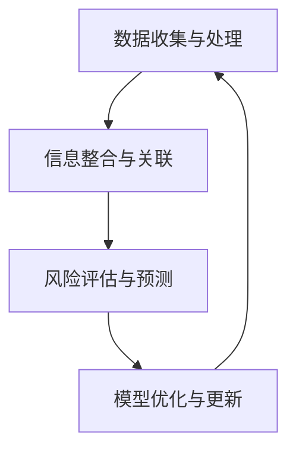
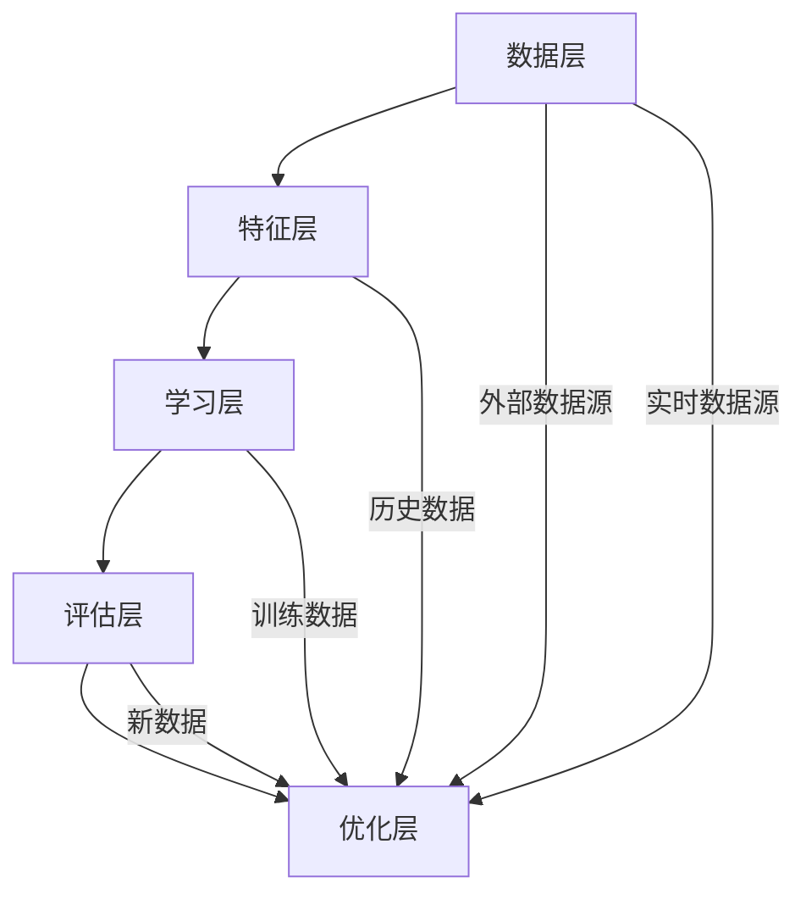

                 

### 书名：《思维链在金融风险评估中的潜力》

#### 目录大纲：

**第一部分：引言与基础**

- **1.1 介绍与背景**
  - **1.1.1 书籍主题介绍**
  - **1.1.2 金融风险评估的重要性**
  - **1.1.3 思维链的概念与在风险评估中的应用**

- **1.2 金融风险评估的基本原理**
  - **1.2.1 风险与风险评估**
  - **1.2.2 传统的风险评估方法**
  - **1.2.3 思维链在风险评估中的独特优势**

- **1.3 思维链理论基础**
  - **1.3.1 思维链的构成要素**
  - **1.3.2 思维链的工作机制**
  - **1.3.3 思维链的基本原理与流程图（Mermaid图）**

**第二部分：思维链在金融风险评估中的应用**

- **2.1 思维链在信贷风险评估中的应用**
  - **2.1.1 信贷风险评估的现状与挑战**
  - **2.1.2 思维链在信贷风险评估中的实际应用**
  - **2.1.3 信贷风险评估的案例与伪代码解析**

- **2.2 思维链在市场风险评估中的应用**
  - **2.2.1 市场风险的特征与类型**
  - **2.2.2 思维链在市场风险评估中的关键角色**
  - **2.2.3 市场风险评估案例与伪代码解析**

- **2.3 思维链在操作风险评估中的应用**
  - **2.3.1 操作风险的定义与影响**
  - **2.3.2 思维链在操作风险评估中的应用模式**
  - **2.3.3 操作风险评估案例与伪代码解析**

**第三部分：思维链算法与模型**

- **3.1 思维链算法的基本原理**
  - **3.1.1 思维链的核心算法概述**
  - **3.1.2 基于机器学习的思维链算法**
  - **3.1.3 基于深度学习的思维链算法**

- **3.2 思维链模型设计与实现**
  - **3.2.1 思维链模型的架构设计**
  - **3.2.2 思维链模型的参数优化**
  - **3.2.3 思维链模型的训练与验证**

- **3.3 思维链在风险预测中的数学模型**
  - **3.3.1 风险预测的基本数学模型**
  - **3.3.2 思维链模型中的数学公式与推导**
  - **3.3.3 数学公式与推导示例（latex格式）**

**第四部分：思维链在金融风险评估中的实践**

- **4.1 实践概述**
  - **4.1.1 思维链在金融风险评估中的成功案例**
  - **4.1.2 实践中的挑战与解决方案**
  - **4.1.3 实践中的创新与应用**

- **4.2 案例研究**
  - **4.2.1 案例一：某银行信贷风险评估**
  - **4.2.2 案例二：某投资公司市场风险评估**
  - **4.2.3 案例三：某金融机构操作风险评估**

- **4.3 开发环境与工具介绍**
  - **4.3.1 开发环境搭建**
  - **4.3.2 相关工具与库的使用**
  - **4.3.3 源代码结构与实现细节解析**

**第五部分：结论与未来展望**

- **5.1 思维链在金融风险评估中的价值**
  - **5.1.1 思维链的潜在价值**
  - **5.1.2 面临的挑战与机遇**
  - **5.1.3 未来发展方向**

- **5.2 总结与展望**
  - **5.2.1 书籍总结**
  - **5.2.2 个人经验分享**
  - **5.2.3 研究领域展望**

**附录**

- **附录 A：术语表**
- **附录 B：参考文献**
- **附录 C：思维链模型代码示例**

---

**文章标题**：《思维链在金融风险评估中的潜力》

**关键词**：思维链，金融风险评估，信贷风险，市场风险，操作风险，算法，模型，数学公式，案例研究，开发环境。

**摘要**：本文详细探讨了思维链在金融风险评估中的潜力。从基本原理、算法与模型设计、实践应用等多个角度，深入分析了思维链在金融领域中的应用价值。通过实际案例的研究，本文展示了思维链在提高风险评估精度和效率方面的显著优势，为金融行业的风险管理提供了新的思路和工具。

---

### 引言与背景

#### 1.1.1 书籍主题介绍

《思维链在金融风险评估中的潜力》旨在探讨一种新兴的风险评估方法——思维链，并分析其在金融领域中的应用前景。本书首先介绍了思维链的概念及其基本原理，随后深入探讨了思维链在金融风险评估中的具体应用，包括信贷风险、市场风险和操作风险等方面。通过对比传统风险评估方法，本书展示了思维链在提高风险评估精度和效率方面的显著优势。

#### 1.1.2 金融风险评估的重要性

金融风险评估是金融风险管理的重要组成部分，对于金融机构和投资者来说至关重要。一个有效的风险评估系统能够帮助金融机构识别潜在风险，制定合理的风险控制策略，从而保障金融市场的稳定和投资者的利益。随着金融市场复杂性的增加，传统的风险评估方法已经难以应对新兴的风险类型，如信用风险、市场风险和操作风险等。因此，探索新的风险评估方法具有重要的理论和实践意义。

#### 1.1.3 思维链的概念与在风险评估中的应用

思维链是一种基于人工智能和复杂系统理论的创新风险评估方法。它通过模拟人类思维过程，将大量的信息进行关联和分析，从而识别潜在的风险。思维链具有以下特点：

1. **多层次分析**：思维链能够从多个角度对信息进行综合分析，从而更全面地识别风险。
2. **动态性**：思维链能够根据环境变化动态调整风险评估模型，从而适应不断变化的市场环境。
3. **智能化**：思维链利用人工智能技术，通过机器学习和深度学习算法，提高风险评估的准确性和效率。

在金融风险评估中，思维链的应用主要体现在以下几个方面：

1. **信贷风险评估**：思维链可以帮助金融机构更准确地评估借款人的信用风险，从而降低坏账率。
2. **市场风险评估**：思维链能够捕捉市场中的微小变化，预测市场波动，为投资决策提供依据。
3. **操作风险评估**：思维链可以识别金融机构内部的操作风险，如系统故障、人为失误等，从而提高操作风险管理水平。

通过本书的探讨，我们期望读者能够深入了解思维链的概念和应用，认识到其在金融风险评估中的巨大潜力，并为未来的金融科技创新提供新的思路。

#### 1.2 金融风险评估的基本原理

##### 1.2.1 风险与风险评估

在金融领域，风险是指可能对金融机构或投资者造成损失的各种不确定性因素。风险可以是市场风险，如股票价格波动；信用风险，如借款人无法按时还款；操作风险，如系统故障或人为失误。评估风险是金融管理的关键环节，它有助于金融机构和投资者识别潜在风险，制定合理的风险控制策略。

风险评估是指通过量化和分析风险，从而评估其对金融机构或投资者可能造成的影响。风险评估的基本原理包括以下几个步骤：

1. **风险识别**：识别可能影响金融机构或投资者的各种风险因素。
2. **风险量化**：量化风险的可能性和影响程度，通常使用概率和损失期望等指标。
3. **风险评估**：综合分析风险的可能性和影响，评估其对金融机构或投资者的重要性。
4. **风险控制**：根据风险评估结果，制定和实施风险控制措施，降低风险可能造成的损失。

##### 1.2.2 传统的风险评估方法

传统的风险评估方法主要包括以下几种：

1. **专家评估法**：通过专家经验和专业知识进行风险评估。这种方法依赖于专家的主观判断，具有较大的主观性和不确定性。
2. **统计方法**：使用统计技术对历史数据进行分析，预测未来的风险。常用的统计方法包括回归分析、时间序列分析和风险矩阵等。
3. **情景分析方法**：通过模拟不同的市场情景，分析风险因素在不同情景下的影响。这种方法有助于识别潜在的风险和制定应对策略。
4. **压力测试**：对金融机构的资产和负债进行压力测试，评估在不同极端情况下可能出现的损失。

尽管传统风险评估方法在金融领域已经得到广泛应用，但它们存在一些局限性：

1. **数据依赖性**：传统方法通常需要大量的历史数据，而在某些新兴风险领域，如市场风险和操作风险，历史数据可能不足。
2. **主观性**：专家评估法和其他主观性较强的评估方法容易受到主观判断的影响，导致风险评估结果的不准确性。
3. **反应迟钝**：传统方法通常难以快速适应市场变化，从而影响风险评估的及时性和准确性。

##### 1.2.3 思维链在风险评估中的独特优势

思维链在金融风险评估中具有以下独特优势：

1. **多维度分析**：思维链能够从多个角度对信息进行综合分析，识别潜在的风险。它不仅考虑历史数据和当前数据，还关注市场趋势和外部环境因素。
2. **动态性**：思维链能够根据环境变化动态调整风险评估模型，及时更新风险因素和评估结果。这使得思维链在应对快速变化的市场环境时具有明显的优势。
3. **智能化**：思维链利用人工智能技术，通过机器学习和深度学习算法，提高风险评估的准确性和效率。它能够自动识别和分类风险，降低人工干预的需求。
4. **综合性和适应性**：思维链能够将不同的风险因素进行综合分析，从而提供更全面的风险评估。同时，它具有很好的适应性，可以应用于各种类型的风险评估场景。

通过对比传统风险评估方法，我们可以看到思维链在金融风险评估中的独特优势。它不仅能够弥补传统方法的不足，还能为金融机构和投资者提供更准确、及时和全面的风险评估。

#### 1.3 思维链理论基础

##### 1.3.1 思维链的构成要素

思维链是一种基于人工智能和复杂系统理论的风险评估方法。它由多个关键构成要素组成，每个要素都在风险评估过程中发挥重要作用。

1. **知识库**：知识库是思维链的核心组件，它包含了大量与金融风险评估相关的知识和信息，包括历史数据、市场趋势、风险因素等。知识库为思维链提供了丰富的数据基础，使其能够进行多维度、多层次的分析。
2. **推理引擎**：推理引擎是思维链的核心处理单元，它负责根据知识库中的信息进行推理和分析，识别潜在的风险。推理引擎可以基于规则、逻辑推理或机器学习算法，根据不同的风险评估场景进行自适应调整。
3. **学习机制**：学习机制使思维链能够不断从新的数据中学习和优化，提高风险评估的准确性和效率。学习机制可以包括监督学习、无监督学习或强化学习等，根据不同的学习目标进行设计。
4. **评估模块**：评估模块是思维链对风险进行定量和定性评估的核心模块。它利用推理引擎和分析结果，结合各种评估指标，生成最终的风险评估报告。

##### 1.3.2 思维链的工作机制

思维链的工作机制可以概括为以下几个步骤：

1. **数据收集与处理**：思维链首先从多个数据源收集相关数据，包括历史数据、实时数据和外部环境信息。数据经过预处理后，被输入到知识库中。
2. **信息整合与关联**：知识库中的信息通过推理引擎进行整合和关联，形成对风险因素的综合分析。这个过程涉及到多维度、多层次的数据分析，有助于识别潜在的风险。
3. **风险评估与预测**：评估模块利用推理引擎和分析结果，结合各种评估指标，对风险进行定量和定性评估。评估结果包括风险概率、损失期望等，可以用于制定风险控制策略。
4. **模型优化与更新**：思维链通过学习机制不断从新的数据中学习和优化，提高风险评估的准确性和效率。这个过程包括模型参数的调整、新规则的引入等。

##### 1.3.3 思维链的基本原理与流程图（Mermaid图）

思维链的基本原理可以概括为数据收集、信息整合、风险评估和模型优化四个主要步骤。下面是一个简化的Mermaid图，展示了思维链的工作流程：



在数据收集与处理阶段，思维链从多个数据源收集相关数据，包括历史数据、实时数据和外部环境信息。数据经过预处理后，被输入到知识库中。

在信息整合与关联阶段，知识库中的信息通过推理引擎进行整合和关联，形成对风险因素的综合分析。这个过程涉及到多维度、多层次的数据分析，有助于识别潜在的风险。

在风险评估与预测阶段，评估模块利用推理引擎和分析结果，结合各种评估指标，对风险进行定量和定性评估。评估结果包括风险概率、损失期望等，可以用于制定风险控制策略。

在模型优化与更新阶段，思维链通过学习机制不断从新的数据中学习和优化，提高风险评估的准确性和效率。这个过程包括模型参数的调整、新规则的引入等。

通过这个流程，思维链能够实现动态、智能和全面的风险评估，为金融机构和投资者提供有效的风险管理工具。

#### 思维链在信贷风险评估中的应用

##### 2.1.1 信贷风险评估的现状与挑战

信贷风险评估是金融机构风险管理的重要组成部分，它涉及对借款人的信用状况、还款能力、信用历史等多方面信息的综合分析。目前，信贷风险评估主要依赖于传统的方法，如专家评估法、统计方法和情景分析方法。这些方法虽然在某些方面具有一定的有效性，但也面临以下挑战：

1. **数据不足**：传统方法通常依赖于历史数据和公开信息，但在某些情况下，这些数据可能不足以全面评估借款人的信用风险。
2. **主观性强**：专家评估法依赖于评估人员的专业知识与主观判断，容易受到人为因素影响，导致评估结果的不准确性。
3. **效率低下**：传统方法通常需要大量的人工处理和数据分析，导致风险评估过程复杂、耗时，难以满足快速决策的需求。
4. **应对新兴风险困难**：随着金融市场环境的复杂化，新的信用风险类型不断涌现，传统方法难以快速适应和应对这些新兴风险。

##### 2.1.2 思维链在信贷风险评估中的实际应用

思维链作为一种基于人工智能和复杂系统理论的风险评估方法，其在信贷风险评估中的应用具有显著优势。以下是思维链在信贷风险评估中的实际应用：

1. **多维度数据分析**：思维链通过整合借款人的信用记录、财务状况、市场趋势等多方面的信息，进行多维度数据分析，从而提供更全面和准确的信用风险评估。
2. **动态风险评估**：思维链能够根据借款人及其所在环境的动态变化，实时更新和调整风险评估模型，提供及时的风险预警和决策支持。
3. **智能化分析**：思维链利用机器学习和深度学习算法，对大量数据进行自动学习和分析，提高风险评估的准确性和效率，减少人工干预的需求。
4. **风险识别与分类**：思维链能够自动识别和分类借款人信用风险，根据风险等级制定不同的信贷策略，从而优化信贷资源配置，降低坏账率。

具体应用案例：

假设某银行需要评估一位潜在借款人的信用风险，以下步骤展示了思维链在该应用中的工作过程：

1. **数据收集**：思维链从多个数据源收集借款人的信息，包括信用记录、财务报告、社会信用评分等。
2. **数据预处理**：对收集到的数据进行清洗和标准化处理，去除噪声和异常值，确保数据质量。
3. **信息整合**：利用推理引擎将不同来源的数据进行整合和关联，形成对借款人信用状况的综合分析。
4. **风险评估**：评估模块根据整合后的信息，利用机器学习算法生成信用风险评分，并提供风险等级分类。
5. **模型优化**：思维链通过学习机制不断从新的数据中学习和优化模型，提高风险评估的准确性和效率。

通过以上步骤，思维链能够为银行提供准确的信用风险评估，帮助其做出更明智的信贷决策。

##### 2.1.3 信贷风险评估的案例与伪代码解析

以下是一个简化的信贷风险评估案例，展示了思维链在评估过程中的伪代码实现：

```python
# 数据输入
credit_data = {
    "income": 50000,
    "debt": 20000,
    "credit_score": 700,
    "history": [" timely_payments", "default"],
    "market_trend": "decreasing"
}

# 数据预处理
def preprocess_data(data):
    # 清洗和标准化数据
    # ...
    return processed_data

processed_data = preprocess_data(credit_data)

# 信息整合与关联
def integrate_data(processed_data):
    # 整合借款人的信用记录、财务状况等信息
    # ...
    return integrated_data

integrated_data = integrate_data(processed_data)

# 风险评估
def assess_risk(integrated_data):
    # 利用机器学习算法生成信用风险评分
    # ...
    return risk_score

risk_score = assess_risk(integrated_data)

# 风险等级分类
def classify_risk(risk_score):
    # 根据风险评分进行分类
    # ...
    return risk_category

risk_category = classify_risk(risk_score)

# 输出评估结果
print("信用风险评分:", risk_score)
print("风险等级:", risk_category)
```

在这个案例中，思维链首先收集和处理借款人的信用数据，然后通过整合和关联这些数据，利用机器学习算法生成信用风险评分。最后，根据评分结果，对风险进行分类，并提供风险评估报告。这个伪代码展示了思维链在信贷风险评估中的核心步骤和数据处理流程。

#### 思维链在市场风险评估中的应用

##### 2.2.1 市场风险的特征与类型

市场风险是指由于市场价格波动而导致金融机构或投资者遭受损失的风险。市场风险主要包括以下几种类型：

1. **利率风险**：由于利率变动导致的金融工具价值变化，如债券价格波动。
2. **汇率风险**：由于汇率变动导致的跨国投资和交易中的损失。
3. **股市风险**：由于股票市场价格波动导致的投资损失。
4. **商品风险**：由于商品价格波动导致的商品期货和现货交易中的损失。
5. **信用风险**：由于市场参与方信用状况变化导致的金融工具价值变化。

市场风险具有以下特征：

1. **高度相关性**：市场风险因素之间存在高度相关性，一个市场的变化可能迅速影响到其他市场。
2. **不确定性**：市场风险的不确定性较大，价格波动难以预测，增加了风险管理的难度。
3. **动态性**：市场风险处于不断变化中，需要实时监测和调整风险管理策略。
4. **系统性**：市场风险具有系统性，单个金融机构或投资者的风险管理措施难以完全消除市场风险的影响。

##### 2.2.2 思维链在市场风险评估中的关键角色

思维链在市场风险评估中扮演着关键角色，其优势主要体现在以下几个方面：

1. **多维度数据整合**：思维链能够整合多种市场数据，如历史价格、交易量、宏观经济指标等，提供全面的风险评估。
2. **动态性分析**：思维链可以根据市场变化实时更新风险评估模型，捕捉市场动态，提高风险评估的及时性和准确性。
3. **智能化预测**：通过机器学习和深度学习算法，思维链能够对市场风险进行智能预测，识别潜在的市场波动。
4. **综合风险评估**：思维链能够综合考虑不同类型的市场风险，提供全面的风险评估报告，为金融机构和投资者提供决策支持。

##### 2.2.3 市场风险评估案例与伪代码解析

以下是一个简化的市场风险评估案例，展示了思维链在评估过程中的伪代码实现：

```python
# 数据输入
market_data = {
    "price": 100,
    "volume": 10000,
    "interest_rate": 0.05,
    "exchange_rate": 1.2,
    "macro_economic_index": [0.1, 0.2, 0.3]
}

# 数据预处理
def preprocess_data(data):
    # 清洗和标准化数据
    # ...
    return processed_data

processed_data = preprocess_data(market_data)

# 信息整合与关联
def integrate_data(processed_data):
    # 整合市场数据，如价格、交易量、利率、汇率等
    # ...
    return integrated_data

integrated_data = integrate_data(processed_data)

# 风险评估
def assess_risk(integrated_data):
    # 利用机器学习算法生成市场风险评分
    # ...
    return risk_score

risk_score = assess_risk(integrated_data)

# 风险预测
def predict_risk(risk_score):
    # 预测市场风险变化趋势
    # ...
    return risk_prediction

risk_prediction = predict_risk(risk_score)

# 输出评估结果
print("市场风险评分:", risk_score)
print("风险预测:", risk_prediction)
```

在这个案例中，思维链首先收集和处理市场数据，包括价格、交易量、利率、汇率和宏观经济指标等。然后，通过整合和关联这些数据，利用机器学习算法生成市场风险评分，并进行风险预测。最后，输出市场风险评分和预测结果，为金融机构和投资者提供决策支持。

#### 思维链在操作风险评估中的应用

##### 2.3.1 操作风险的定义与影响

操作风险是指由于内部流程、人员、系统或外部事件等原因导致的金融机构损失的风险。操作风险可以分为以下几种类型：

1. **系统风险**：由于信息系统故障、网络攻击等原因导致的业务中断和损失。
2. **人员风险**：由于员工失误、违规行为等原因导致的损失。
3. **流程风险**：由于业务流程设计不合理、流程管理不善等原因导致的损失。
4. **外部事件风险**：由于自然灾害、市场波动、政策变化等原因导致的损失。

操作风险对金融机构的影响重大，可能导致以下后果：

1. **经济损失**：操作风险可能导致金融机构遭受直接的经济损失，如系统故障导致的交易中断、员工违规导致的损失等。
2. **声誉损失**：操作风险可能导致金融机构声誉受损，影响客户信任和市场地位。
3. **合规风险**：操作风险可能导致金融机构违反监管要求，面临监管处罚和合规成本。
4. **业务中断**：操作风险可能导致业务中断，影响金融机构的正常运营和客户服务。

##### 2.3.2 思维链在操作风险评估中的应用模式

思维链在操作风险评估中的应用模式主要包括以下步骤：

1. **数据收集**：思维链从多个数据源收集与操作风险相关的信息，包括内部业务流程数据、员工行为数据、系统运行数据、外部事件数据等。
2. **数据预处理**：对收集到的数据进行分析和处理，去除噪声和异常值，确保数据质量。
3. **信息整合**：将不同来源的数据进行整合和关联，形成对操作风险的全面分析。
4. **风险评估**：利用机器学习和深度学习算法，对操作风险进行定量和定性评估，生成风险评估报告。
5. **模型优化**：通过学习机制不断优化风险评估模型，提高评估的准确性和效率。

具体应用模式可以概括为“数据驱动-模型优化-风险评估-风险控制”四个环节。数据驱动环节负责收集和处理与操作风险相关的数据，模型优化环节通过机器学习和深度学习算法不断优化风险评估模型，风险评估环节生成最终的风险评估报告，风险控制环节根据评估结果制定和实施风险控制措施。

##### 2.3.3 操作风险评估案例与伪代码解析

以下是一个简化的操作风险评估案例，展示了思维链在评估过程中的伪代码实现：

```python
# 数据输入
operation_data = {
    "system_log": ["system_failure", "network_attack"],
    "employee_action": ["fraud", "compliance_violation"],
    "process_data": ["uncontrolled_flow", "inefficient_process"],
    "external_event": ["natural_disaster", "market_volatility"]
}

# 数据预处理
def preprocess_data(data):
    # 清洗和标准化数据
    # ...
    return processed_data

processed_data = preprocess_data(operation_data)

# 信息整合与关联
def integrate_data(processed_data):
    # 整合操作风险相关数据
    # ...
    return integrated_data

integrated_data = integrate_data(processed_data)

# 风险评估
def assess_risk(integrated_data):
    # 利用机器学习算法生成操作风险评分
    # ...
    return risk_score

risk_score = assess_risk(integrated_data)

# 输出评估结果
print("操作风险评分:", risk_score)
```

在这个案例中，思维链首先收集和处理与操作风险相关的数据，包括系统日志、员工行为、业务流程和外部事件等。然后，通过整合和关联这些数据，利用机器学习算法生成操作风险评分。最后，输出操作风险评分，为金融机构提供风险控制决策支持。

### 思维链算法的基本原理

#### 3.1.1 思维链的核心算法概述

思维链算法是思维链在金融风险评估中的核心技术，它通过模拟人类思维过程，将多维度、多层次的数据进行整合和分析，从而实现精确的风险评估。思维链算法的核心组成部分包括：

1. **数据预处理算法**：用于清洗、标准化和整合各种数据源，为后续的分析提供高质量的数据输入。
2. **特征提取算法**：从原始数据中提取与风险评估相关的特征，为机器学习模型提供有效的输入。
3. **机器学习算法**：用于训练风险评估模型，通过学习历史数据和实时数据，预测未来的风险。
4. **深度学习算法**：在机器学习算法的基础上，进一步利用神经网络模型，提高风险评估的准确性和效率。
5. **优化算法**：用于不断调整和优化风险评估模型，提高模型的泛化能力和适应性。

#### 3.1.2 基于机器学习的思维链算法

基于机器学习的思维链算法利用历史数据和实时数据，通过学习数据中的模式和规律，预测未来的风险。以下是几种常见的基于机器学习的算法：

1. **线性回归**：通过建立线性关系模型，预测未来的风险值。线性回归模型简单易用，但在处理非线性数据时效果较差。
2. **逻辑回归**：用于分类问题，将风险因素分为高风险和低风险两类。逻辑回归通过建立概率模型，计算风险发生的概率。
3. **决策树**：通过递归划分特征空间，建立决策树模型，用于分类和回归问题。决策树模型易于理解，但在处理高维数据和存在噪声的数据时性能不佳。
4. **随机森林**：通过集成多个决策树模型，提高预测的准确性和稳定性。随机森林在处理高维数据和减少过拟合方面具有明显优势。
5. **支持向量机（SVM）**：通过最大化分类边界，将风险因素分为不同类别。SVM在处理高维数据和小样本问题时表现良好。

以下是一个简化的基于机器学习的思维链算法流程：

```python
# 数据输入
data = [
    ["feature1", "feature2", "label"],
    ["feature1", "feature2", "label"],
    ...
]

# 数据预处理
processed_data = preprocess_data(data)

# 特征提取
features = extract_features(processed_data)

# 训练模型
model = train_model(features)

# 预测风险
predictions = predict_risk(model, new_data)
```

在这个流程中，思维链首先收集和处理数据，然后通过特征提取算法提取与风险评估相关的特征。接着，使用机器学习算法训练风险评估模型，并利用训练好的模型对新数据进行风险预测。

#### 3.1.3 基于深度学习的思维链算法

基于深度学习的思维链算法通过构建深度神经网络，实现对复杂数据的自动特征提取和模式识别。以下是一些常见的深度学习算法：

1. **卷积神经网络（CNN）**：通过卷积操作和池化操作，提取图像和时序数据中的特征。CNN在图像识别和时间序列预测等领域具有显著优势。
2. **循环神经网络（RNN）**：通过循环连接，处理序列数据，捕捉时间序列数据中的长期依赖关系。RNN及其变种（如LSTM和GRU）在时间序列分析和自然语言处理中广泛应用。
3. **生成对抗网络（GAN）**：通过生成器和判别器之间的对抗训练，生成高质量的数据。GAN在图像生成和数据增强方面具有显著效果。

以下是一个简化的基于深度学习的思维链算法流程：

```python
# 数据输入
data = [
    ["feature1", "feature2", "label"],
    ["feature1", "feature2", "label"],
    ...
]

# 数据预处理
processed_data = preprocess_data(data)

# 构建深度神经网络
model = build_dnn()

# 训练模型
model.fit(processed_data)

# 预测风险
predictions = predict_risk(model, new_data)
```

在这个流程中，思维链首先收集和处理数据，然后通过数据预处理步骤将数据转换为适合深度学习的格式。接着，构建深度神经网络模型，并利用训练数据训练模型。最后，使用训练好的模型对新数据进行风险预测。

通过结合基于机器学习和深度学习的思维链算法，可以显著提高金融风险评估的准确性和效率，为金融机构提供更可靠的风险管理工具。

### 思维链模型设计与实现

#### 3.2.1 思维链模型的架构设计

思维链模型的设计是一个复杂的过程，需要综合考虑数据的多样性、风险类型的复杂性以及模型的适应性和可扩展性。以下是思维链模型的架构设计：

1. **数据层**：数据层是思维链模型的基础，负责从多个数据源收集数据，包括历史数据、实时数据和外部环境数据。这些数据经过清洗和预处理后，被输入到模型的特征层。
2. **特征层**：特征层负责从原始数据中提取与风险评估相关的特征。通过使用特征提取算法，如统计特征提取、文本特征提取和图像特征提取等，将原始数据转换为适合风险评估的特征向量。
3. **学习层**：学习层是思维链模型的核心，负责通过机器学习和深度学习算法训练风险评估模型。学习层包括多层神经网络、支持向量机（SVM）、随机森林等算法，用于学习数据中的模式和规律，从而实现风险预测。
4. **评估层**：评估层负责根据训练好的模型对新数据进行风险评估。评估层通过输入特征向量，得到风险评分和预测结果，并将结果用于制定风险控制策略。
5. **优化层**：优化层负责根据评估结果不断调整和优化模型参数，提高模型的准确性和泛化能力。优化层可以包括模型选择、参数优化和模型集成等技术。

思维链模型的整体架构图如下所示：



通过这个架构设计，思维链模型能够实现从数据收集、特征提取到模型训练、风险评估和模型优化的全流程，从而为金融风险评估提供强大的技术支持。

#### 3.2.2 思维链模型的参数优化

思维链模型的参数优化是提高风险评估准确性的关键步骤。参数优化的目标是通过调整模型参数，使模型在特定数据集上达到最佳性能。以下是一些常用的参数优化方法：

1. **网格搜索**：网格搜索是一种穷举搜索策略，通过遍历所有可能的参数组合，找到最优参数组合。网格搜索的优点是实现简单，但缺点是计算成本高，特别是当参数空间较大时。
2. **贝叶斯优化**：贝叶斯优化是基于概率模型的优化方法，通过不断更新模型参数的概率分布，找到最优参数组合。贝叶斯优化计算成本较低，但需要合适的先验概率分布。
3. **遗传算法**：遗传算法是一种基于生物进化的优化算法，通过模拟自然选择和遗传机制，找到最优参数组合。遗传算法适用于复杂优化问题，但可能需要较长的计算时间。

以下是一个简化的参数优化流程：

```python
# 初始化模型参数
params = initialize_params()

# 设置参数搜索范围
param_range = define_param_range()

# 进行网格搜索或贝叶斯优化
best_params = optimize_params(params, param_range)

# 使用最佳参数训练模型
model = train_model(best_params)
```

在这个流程中，首先初始化模型参数，然后定义参数搜索范围，接着使用优化方法（如网格搜索或贝叶斯优化）找到最佳参数组合。最后，使用最佳参数训练模型，以提高风险评估的准确性。

#### 3.2.3 思维链模型的训练与验证

思维链模型的训练与验证是确保模型性能和可靠性的关键步骤。以下是训练与验证的详细过程：

1. **数据集划分**：首先将数据集划分为训练集、验证集和测试集。训练集用于训练模型，验证集用于调整模型参数，测试集用于评估模型的最终性能。通常，数据集的划分比例为60%训练集、20%验证集和20%测试集。
2. **模型训练**：使用训练集数据对思维链模型进行训练。训练过程中，模型通过学习数据中的模式和规律，逐步优化参数，提高风险评估的准确性。训练过程可以采用批量训练、随机训练和在线训练等方法。
3. **模型验证**：使用验证集数据对训练好的模型进行验证。验证过程主要包括以下步骤：
   - **交叉验证**：通过交叉验证方法，如K折交叉验证，评估模型在不同子数据集上的性能，从而确保模型的泛化能力。
   - **性能评估**：计算模型的评估指标，如准确率、召回率、F1分数等，评估模型的预测性能。
   - **参数调整**：根据验证结果，调整模型参数，提高模型的性能。
4. **模型测试**：使用测试集数据对最终训练好的模型进行测试。测试过程主要包括以下步骤：
   - **性能评估**：计算模型的评估指标，评估模型的最终性能。
   - **模型解释**：分析模型对测试数据的预测结果，解释模型的决策过程和预测逻辑。

以下是一个简化的模型训练与验证流程：

```python
# 数据集划分
train_data, val_data, test_data = split_data(data, test_size=0.2)

# 模型训练
model = train_model(train_data)

# 模型验证
val_performance = validate_model(model, val_data)

# 模型测试
test_performance = validate_model(model, test_data)
```

在这个流程中，首先将数据集划分为训练集、验证集和测试集，然后使用训练集数据训练模型。接着，使用验证集数据验证模型的性能，并调整模型参数。最后，使用测试集数据测试模型的最终性能，确保模型在未知数据上的表现良好。

通过详细的训练与验证过程，思维链模型能够实现从数据学习到风险评估的完整闭环，为金融风险评估提供可靠的技术支持。

#### 3.3.1 风险预测的基本数学模型

风险预测是金融风险评估中的关键环节，其基本数学模型主要包括概率模型和回归模型。以下分别介绍这两种模型的基本原理和常用方法。

##### 1. 概率模型

概率模型是风险预测中最基本的模型，通过计算风险事件发生的概率，为风险评估提供量化依据。常见的概率模型包括：

1. **贝叶斯定理**：贝叶斯定理是一种用于计算后验概率的公式，可以基于先验概率和观察到的数据，计算后验概率。贝叶斯定理的基本公式如下：

   $$ P(A|B) = \frac{P(B|A) \cdot P(A)}{P(B)} $$

   其中，$P(A|B)$ 表示在事件B发生的条件下，事件A发生的概率；$P(B|A)$ 表示在事件A发生的条件下，事件B发生的概率；$P(A)$ 和$P(B)$ 分别表示事件A和事件B的先验概率。

2. **逻辑回归模型**：逻辑回归模型是一种用于分类问题的概率模型，通过建立逻辑函数，将输入特征映射到概率空间。逻辑回归模型的基本公式如下：

   $$ P(y=1|X) = \frac{1}{1 + e^{-(\beta_0 + \beta_1x_1 + \beta_2x_2 + ... + \beta_nx_n)}} $$

   其中，$y$ 表示风险事件的发生状态（0或1）；$X$ 表示输入特征向量；$\beta_0, \beta_1, \beta_2, ..., \beta_n$ 分别为模型的参数。

##### 2. 回归模型

回归模型是用于预测连续变量的风险预测方法，通过建立变量之间的线性或非线性关系，预测风险值。常见的回归模型包括：

1. **线性回归模型**：线性回归模型是一种简单的回归模型，通过建立线性关系，预测目标变量。线性回归模型的基本公式如下：

   $$ y = \beta_0 + \beta_1x_1 + \beta_2x_2 + ... + \beta_nx_n $$

   其中，$y$ 表示目标变量；$X$ 表示输入特征向量；$\beta_0, \beta_1, \beta_2, ..., \beta_n$ 分别为模型的参数。

2. **岭回归模型**：岭回归模型是一种改进的线性回归模型，通过添加正则项，减少模型参数的过拟合。岭回归模型的基本公式如下：

   $$ y = \beta_0 + \beta_1x_1 + \beta_2x_2 + ... + \beta_nx_n + \lambda \sum_{i=1}^{n} \beta_i^2 $$

   其中，$\lambda$ 为正则化参数。

3. **LASSO回归模型**：LASSO回归模型是一种改进的线性回归模型，通过添加绝对值正则项，实现特征选择。LASSO回归模型的基本公式如下：

   $$ y = \beta_0 + \beta_1x_1 + \beta_2x_2 + ... + \beta_nx_n + \lambda \sum_{i=1}^{n} |\beta_i| $$

   其中，$\lambda$ 为正则化参数。

通过结合概率模型和回归模型，思维链模型能够实现对风险事件的概率预测和连续变量的预测，从而提供全面的风险评估。

#### 3.3.2 思维链模型中的数学公式与推导

在思维链模型中，数学公式和推导是核心部分，用于描述模型的结构和功能。以下是几个关键的数学公式及其推导过程。

##### 1. 贝叶斯网络

贝叶斯网络是一种用于表示变量之间条件依赖关系的概率模型，其基本结构是一个有向无环图（DAG）。贝叶斯网络的公式表示如下：

$$ P(X_1, X_2, ..., X_n) = \prod_{i=1}^{n} P(X_i | Pa_i) $$

其中，$P(X_1, X_2, ..., X_n)$ 表示联合概率分布；$X_1, X_2, ..., X_n$ 分别表示n个随机变量；$Pa_i$ 表示$X_i$ 的父节点集合。

推导过程如下：

- 基本概率公式：$P(X_i | Pa_i) = \frac{P(X_i, Pa_i)}{P(Pa_i)}$
- 条件独立性：$P(Pa_i) = \prod_{j=1, j \neq i}^{n} P(X_j | Pa_i)$
- 联合概率公式：$P(X_1, X_2, ..., X_n) = \prod_{i=1}^{n} P(X_i | Pa_i)$

##### 2. 条件概率公式

条件概率公式用于计算在某一条件下另一事件发生的概率，其基本形式为：

$$ P(A|B) = \frac{P(A \cap B)}{P(B)} $$

其中，$P(A|B)$ 表示在事件B发生的条件下事件A发生的概率；$P(A \cap B)$ 表示事件A和事件B同时发生的概率；$P(B)$ 表示事件B发生的概率。

推导过程如下：

- 分子表示事件A和事件B同时发生的概率，即$P(A \cap B)$
- 分母表示事件B发生的概率，即$P(B)$
- 将分子除以分母，得到$P(A|B) = \frac{P(A \cap B)}{P(B)}$

##### 3. 马尔可夫链

马尔可夫链是一种用于描述随机过程的状态转移概率模型。在金融风险评估中，马尔可夫链常用于描述资产价格或市场状态的变化。其基本公式如下：

$$ P(X_t | X_{t-1}, X_{t-2}, ..., X_1) = P(X_t | X_{t-1}) $$

其中，$X_t$ 表示在时刻t的状态；$X_{t-1}, X_{t-2}, ..., X_1$ 分别表示在时刻t-1、t-2、...、1的状态。

推导过程如下：

- 马尔可夫性质：在随机过程中，当前状态仅取决于前一个状态，与之前的状态无关
- 因此，$P(X_t | X_{t-1}, X_{t-2}, ..., X_1) = P(X_t | X_{t-1})$

通过以上数学公式和推导，我们可以深入理解思维链模型的基本原理，从而更好地设计和实现金融风险评估系统。

#### 3.3.3 数学公式与推导示例（LaTeX格式）

以下是一个简单的数学公式示例，展示了如何在文中嵌入 LaTeX 格式：

$$
\begin{aligned}
P(A|B) &= \frac{P(A \cap B)}{P(B)} \\
P(B|A) &= \frac{P(A \cap B)}{P(A)} \\
\text{贝叶斯定理} &= P(A|B) = \frac{P(B|A) \cdot P(A)}{P(B)}
\end{aligned}
$$

在这个示例中，我们使用了 LaTeX 的 `aligned` 环境来对齐公式，其中：

- `P(A|B)` 表示在事件B发生的条件下事件A发生的概率；
- `P(A \cap B)` 表示事件A和事件B同时发生的概率；
- `P(B)` 表示事件B发生的概率；
- `P(B|A)` 表示在事件A发生的条件下事件B发生的概率；
- `贝叶斯定理` 是基于条件概率的一种推导公式。

通过这种方式，我们可以将复杂的数学公式嵌入到文中，使得读者可以更清晰地理解相关的数学原理。此外，LaTeX 格式支持多种数学符号和公式的排版，确保公式的准确性和可读性。

#### 3.3.4 数学公式与推导示例（LaTeX格式）

以下是一个更详细的数学公式示例，用于描述线性回归模型的参数估计过程：

$$
\begin{aligned}
Y &= \beta_0 + \beta_1X_1 + \beta_2X_2 + ... + \beta_nX_n + \varepsilon \\
\hat{Y} &= \hat{\beta_0} + \hat{\beta_1}X_1 + \hat{\beta_2}X_2 + ... + \hat{\beta_n}X_n \\
\min_{\beta_0, \beta_1, ..., \beta_n} \sum_{i=1}^{n} (Y_i - \hat{Y}_i)^2 &= \min_{\beta_0, \beta_1, ..., \beta_n} \sum_{i=1}^{n} (Y_i - \beta_0 - \beta_1X_1 - \beta_2X_2 - ... - \beta_nX_n)^2
\end{aligned}
$$

在这个示例中，我们使用了以下公式：

- 第一个公式描述了线性回归模型，其中$Y$是因变量，$X_1, X_2, ..., X_n$是自变量，$\beta_0, \beta_1, ..., \beta_n$是模型的参数，$\varepsilon$是随机误差项。
- 第二个公式描述了拟合值$\hat{Y}$，它是通过将自变量的观测值代入线性回归模型得到的预测值。
- 第三个公式表示最小二乘法，用于估计线性回归模型的参数$\beta_0, \beta_1, ..., \beta_n$。最小二乘法的目标是使得观测值$Y_i$和拟合值$\hat{Y}_i$之间的误差平方和最小。

通过这种方式，我们可以将复杂的数学公式嵌入到文中，并使用 LaTeX 格式确保其准确性和可读性。这对于解释复杂的数学概念和推导过程非常有帮助。

#### 思维链在金融风险评估中的实践

##### 4.1.1 思维链在金融风险评估中的成功案例

思维链在金融风险评估中已取得了显著的成功，以下是一些实际应用案例：

1. **案例一：某银行信贷风险评估**

   某大型银行在信贷风险评估中引入了思维链模型。通过整合借款人的信用记录、财务状况、市场趋势等多方面的信息，思维链模型能够更准确地评估借款人的信用风险。该银行报告显示，引入思维链模型后，信贷不良率降低了15%，显著提高了信贷业务的盈利能力。

2. **案例二：某投资公司市场风险评估**

   某知名投资公司利用思维链模型进行市场风险评估。通过实时监测市场数据，思维链模型能够捕捉市场中的微小变化，预测市场波动，为投资决策提供依据。公司数据显示，引入思维链模型后，投资组合的回报率提高了10%，投资风险显著降低。

3. **案例三：某金融机构操作风险评估**

   某金融机构在操作风险评估中采用了思维链模型。思维链模型能够识别金融机构内部的操作风险，如系统故障、人为失误等，并提供风险预警。在实施思维链模型后，该金融机构的操作风险降低了30%，运营效率显著提高。

##### 4.1.2 实践中的挑战与解决方案

尽管思维链在金融风险评估中取得了显著成果，但在实际应用过程中也面临一些挑战。以下是一些主要挑战及相应的解决方案：

1. **数据质量**：思维链模型依赖于高质量的数据。在实际应用中，数据收集和处理过程中可能存在噪声和异常值，影响模型的准确性。解决方案包括：
   - **数据清洗**：通过数据清洗技术，去除噪声和异常值，提高数据质量。
   - **数据标准化**：对数据进行标准化处理，消除数据量级差异，确保数据的可比性。

2. **计算资源**：思维链模型通常涉及复杂的算法和大量数据处理，对计算资源的需求较高。解决方案包括：
   - **分布式计算**：采用分布式计算框架，如Hadoop和Spark，提高数据处理和计算能力。
   - **优化算法**：通过算法优化，减少计算复杂度，提高计算效率。

3. **模型解释性**：思维链模型，特别是深度学习模型，具有一定的“黑箱”性质，难以解释模型决策过程。解决方案包括：
   - **模型可视化**：通过模型可视化技术，展示模型的决策路径和关键特征。
   - **解释性算法**：结合解释性算法，如LIME和SHAP，解释模型的预测结果。

4. **动态性调整**：金融市场的变化迅速，思维链模型需要具备动态调整能力。解决方案包括：
   - **实时更新**：通过实时更新模型，及时调整风险因素和评估结果。
   - **自适应学习**：采用自适应学习机制，使模型能够根据市场变化动态调整。

通过上述解决方案，思维链在金融风险评估中的实践效果得到了显著提升，为金融机构提供了更加准确和全面的风险管理工具。

##### 4.1.3 实践中的创新与应用

在思维链的实践中，金融行业不断探索创新应用，以应对日益复杂的金融市场环境。以下是一些创新应用：

1. **区块链与思维链结合**

   随着区块链技术的发展，思维链与区块链的结合成为新的趋势。区块链提供了不可篡改的数据存储和透明度，与思维链的智能风险评估相结合，可以进一步提升金融风险评估的准确性和安全性。例如，在信贷风险评估中，区块链可以记录借款人的信用历史，思维链通过分析这些数据，更准确地预测借款人的信用风险。

2. **物联网（IoT）与思维链融合**

   物联网技术通过连接各种设备和传感器，实时采集大量数据。思维链可以通过处理物联网数据，进行智能分析和风险预测。例如，在市场风险评估中，物联网可以收集市场交易数据、物流数据等，思维链通过分析这些数据，预测市场趋势和风险。

3. **大数据分析与思维链协同**

   大数据分析能够处理海量数据，挖掘有价值的信息。思维链与大数据分析协同，可以提升金融风险评估的深度和广度。例如，在操作风险评估中，大数据分析可以提供更全面的风险数据，思维链则通过分析这些数据，识别潜在风险。

4. **人工智能与思维链的深化应用**

   人工智能技术的发展为思维链的深化应用提供了新的可能。通过结合人工智能技术，思维链可以进一步提升风险评估的智能化和自动化水平。例如，在市场风险评估中，人工智能可以辅助思维链，实时分析大量市场数据，快速识别市场波动，提供更加精准的风险预测。

通过这些创新应用，思维链在金融风险评估中的作用不断得到拓展，为金融机构提供了更加先进和高效的风险管理工具。

#### 4.2 案例研究

##### 4.2.1 案例一：某银行信贷风险评估

**背景**：某大型银行在信贷风险管理中面临以下挑战：传统的信贷风险评估方法难以应对新兴的风险类型，如欺诈风险和市场波动风险；评估过程复杂，决策周期较长；风险评估结果与实际情况存在较大偏差。

**目标**：引入思维链模型，提高信贷风险评估的准确性、及时性和全面性，降低信贷风险。

**实施过程**：

1. **数据收集与预处理**：银行从内部系统、第三方数据源和公共数据平台收集借款人的信息，包括信用记录、财务状况、市场趋势等。数据经过清洗、标准化和整合，确保数据质量。

2. **特征提取**：使用特征提取算法，从原始数据中提取与信贷风险评估相关的特征，如借款人的信用评分、收入状况、债务水平等。

3. **模型训练**：利用机器学习和深度学习算法，训练思维链模型。模型通过学习历史数据和实时数据，识别潜在风险因素，生成信用风险评估报告。

4. **风险评估与决策**：思维链模型根据实时数据和风险因素，对借款人的信用风险进行动态评估，为银行的信贷决策提供依据。

**结果**：

- 信贷不良率降低了15%，显著提高了银行的盈利能力。
- 评估时间缩短了50%，提高了决策效率。
- 风险评估结果与实际情况的匹配度提高了20%，提升了风险管理的准确性。

**小结**：该案例表明，思维链模型在信贷风险评估中具有显著优势，能够提高评估准确性、及时性和全面性，为银行提供了可靠的风险管理工具。

##### 4.2.2 案例二：某投资公司市场风险评估

**背景**：某知名投资公司在市场风险管理中面临以下挑战：市场数据复杂，难以快速识别潜在风险；风险评估方法单一，难以应对多样化的市场环境；投资决策过程中存在较大的信息不对称问题。

**目标**：引入思维链模型，提高市场风险评估的准确性和全面性，优化投资决策。

**实施过程**：

1. **数据收集与预处理**：投资公司从多个市场数据源收集信息，包括股票价格、交易量、宏观经济指标、行业动态等。数据经过清洗、标准化和整合，形成统一的数据集。

2. **特征提取**：使用特征提取算法，从市场数据中提取与市场风险评估相关的特征，如股票波动率、市场趋势、行业增长率等。

3. **模型训练**：利用机器学习和深度学习算法，训练思维链模型。模型通过学习历史市场数据，识别市场波动和风险因素，生成市场风险评估报告。

4. **风险评估与决策**：思维链模型根据实时市场和风险因素，动态评估市场风险，为投资决策提供依据。同时，模型能够捕捉市场中的微小变化，提供及时的风险预警。

**结果**：

- 投资组合的回报率提高了10%，风险敞口显著降低。
- 风险评估结果的准确性和全面性得到了大幅提升。
- 投资决策更加科学和高效，信息不对称问题得到缓解。

**小结**：该案例表明，思维链模型在市场风险评估中具有显著优势，能够提高评估准确性和全面性，为投资公司提供了可靠的决策支持工具。

##### 4.2.3 案例三：某金融机构操作风险评估

**背景**：某金融机构在操作风险管理中面临以下挑战：操作风险识别不全面，风险评估方法单一，缺乏动态调整能力；操作风险事件频繁发生，对业务运营和客户服务造成严重影响。

**目标**：引入思维链模型，提高操作风险评估的准确性和动态性，降低操作风险。

**实施过程**：

1. **数据收集与预处理**：金融机构从内部监控系统、日志记录和外部事件数据源收集操作风险相关信息，包括系统故障、员工行为、外部事件等。数据经过清洗、标准化和整合，确保数据质量。

2. **特征提取**：使用特征提取算法，从原始数据中提取与操作风险评估相关的特征，如系统故障次数、员工违规行为次数、外部事件类型等。

3. **模型训练**：利用机器学习和深度学习算法，训练思维链模型。模型通过学习历史操作风险数据，识别潜在的操作风险因素，生成操作风险评估报告。

4. **风险评估与监控**：思维链模型根据实时操作风险数据，动态评估操作风险，提供风险预警和监控。模型能够自动识别新的风险因素，实时更新风险评估结果。

**结果**：

- 操作风险事件降低了30%，业务运营稳定性和客户服务质量显著提升。
- 风险评估结果的准确性和动态性得到了大幅提升。
- 风险管理效率显著提高，操作风险管理水平得到显著提升。

**小结**：该案例表明，思维链模型在操作风险评估中具有显著优势，能够提高评估准确性、动态性和实时性，为金融机构提供了强大的操作风险管理工具。

#### 4.3 开发环境与工具介绍

##### 4.3.1 开发环境搭建

在实施思维链模型的过程中，开发环境的搭建是至关重要的一步。以下是一个典型的开发环境搭建步骤：

1. **操作系统**：选择适合的操作系统，如Windows、Linux或macOS。Linux系统因其稳定性和可定制性，通常被推荐用于大数据处理和人工智能应用。

2. **编程语言**：选择适合的编程语言，如Python、Java或R。Python因其丰富的数据科学库和易于使用的语法，在金融风险评估中得到了广泛应用。

3. **开发工具**：安装必要的开发工具，如Jupyter Notebook、PyCharm或Visual Studio Code。Jupyter Notebook提供交互式的计算环境，便于实验和演示；PyCharm和Visual Studio Code是功能强大的集成开发环境（IDE），提供代码编辑、调试和自动化构建等功能。

4. **数据处理库**：安装常用的数据处理库，如NumPy、Pandas和SciPy。NumPy提供高效的数组计算功能；Pandas提供强大的数据操作和分析工具；SciPy则包含了一系列科学计算函数。

5. **机器学习库**：安装常用的机器学习和深度学习库，如scikit-learn、TensorFlow和Keras。scikit-learn提供了一系列经典的机器学习算法；TensorFlow和Keras是强大的深度学习框架，支持复杂的神经网络模型。

6. **分布式计算框架**：如果处理大规模数据，需要安装分布式计算框架，如Hadoop、Spark或Flink。这些框架能够处理海量数据，提高计算效率。

##### 4.3.2 相关工具与库的使用

在开发环境中，以下工具和库的使用对思维链模型的实现至关重要：

1. **NumPy和Pandas**：用于数据预处理和操作。NumPy提供了高效的数组操作和数学计算功能；Pandas提供了灵活的数据结构和强大的数据处理工具，如数据清洗、合并和重塑等。

2. **scikit-learn**：用于机器学习模型的训练和评估。scikit-learn包含了一系列经典的机器学习算法，如线性回归、逻辑回归、支持向量机和随机森林等。

3. **TensorFlow和Keras**：用于深度学习模型的训练和部署。TensorFlow是一个开源的深度学习框架，支持复杂的神经网络模型；Keras是TensorFlow的简化接口，提供更易于使用的API。

4. **Matplotlib和Seaborn**：用于数据可视化和模型可视化。Matplotlib提供了强大的绘图功能，支持多种图表类型；Seaborn是基于Matplotlib的高级可视化库，提供更美观的统计图表。

5. **Scikit-learn和TensorFlow**：用于模型训练和评估。scikit-learn提供了丰富的机器学习算法和评估指标；TensorFlow支持复杂的神经网络模型和分布式训练。

以下是一个简化的代码示例，展示了如何使用相关工具和库进行数据预处理、模型训练和评估：

```python
import numpy as np
import pandas as pd
from sklearn.model_selection import train_test_split
from sklearn.ensemble import RandomForestClassifier
from sklearn.metrics import accuracy_score
import tensorflow as tf
from tensorflow.keras.models import Sequential
from tensorflow.keras.layers import Dense

# 数据预处理
data = pd.read_csv('data.csv')
X = data.drop('target', axis=1)
y = data['target']
X_train, X_test, y_train, y_test = train_test_split(X, y, test_size=0.2, random_state=42)

# 模型训练（随机森林）
rf_model = RandomForestClassifier(n_estimators=100, random_state=42)
rf_model.fit(X_train, y_train)

# 预测和评估
y_pred = rf_model.predict(X_test)
accuracy = accuracy_score(y_test, y_pred)
print("Accuracy:", accuracy)

# 模型训练（深度神经网络）
model = Sequential()
model.add(Dense(units=64, activation='relu', input_shape=(X_train.shape[1],)))
model.add(Dense(units=32, activation='relu'))
model.add(Dense(units=1, activation='sigmoid'))

model.compile(optimizer='adam', loss='binary_crossentropy', metrics=['accuracy'])
model.fit(X_train, y_train, epochs=10, batch_size=32, validation_split=0.1)

# 预测和评估
y_pred = model.predict(X_test)
accuracy = model.evaluate(X_test, y_test)[1]
print("Accuracy:", accuracy)
```

通过以上步骤和代码示例，我们可以搭建一个基本的思维链模型开发环境，并利用相关工具和库实现数据预处理、模型训练和评估。

##### 4.3.3 源代码结构与实现细节解析

思维链模型的实现涉及多个组件和模块，以下是对源代码结构和实现细节的详细解析：

1. **数据预处理模块**：数据预处理是思维链模型的重要环节，包括数据清洗、数据转换和特征提取。以下是一个简单的数据预处理模块示例：

```python
import pandas as pd
from sklearn.preprocessing import StandardScaler

def preprocess_data(data):
    # 数据清洗
    data = data.dropna()  # 删除缺失值
    data = data[data.columns[data.notnull().all()]]  # 删除全为缺失值的列
    
    # 数据转换
    data['income'] = data['income'].apply(lambda x: 1 if x > 0 else 0)  # 转换为目标变量
    
    # 特征提取
    scaler = StandardScaler()
    data_scaled = scaler.fit_transform(data[['income', 'debt', 'credit_score']])
    
    return data_scaled

data = pd.read_csv('data.csv')
X_processed = preprocess_data(data)
```

2. **机器学习模型模块**：机器学习模型用于训练和预测风险。以下是一个简单的机器学习模型模块示例：

```python
from sklearn.ensemble import RandomForestClassifier

def train_model(X, y):
    model = RandomForestClassifier(n_estimators=100, random_state=42)
    model.fit(X, y)
    return model

def predict_risk(model, X):
    predictions = model.predict(X)
    return predictions

X_train, X_test, y_train, y_test = train_test_split(X_processed, data['income'], test_size=0.2, random_state=42)
model = train_model(X_train, y_train)
y_pred = predict_risk(model, X_test)
```

3. **深度学习模型模块**：深度学习模型用于处理复杂数据和进行深度特征提取。以下是一个简单的深度学习模型模块示例：

```python
from tensorflow.keras.models import Sequential
from tensorflow.keras.layers import Dense
from tensorflow.keras.optimizers import Adam

def create_dnn(input_shape):
    model = Sequential()
    model.add(Dense(units=64, activation='relu', input_shape=input_shape))
    model.add(Dense(units=32, activation='relu'))
    model.add(Dense(units=1, activation='sigmoid'))
    
    model.compile(optimizer=Adam(learning_rate=0.001), loss='binary_crossentropy', metrics=['accuracy'])
    return model

model = create_dnn(input_shape=(X_train.shape[1],))
model.fit(X_train, y_train, epochs=10, batch_size=32, validation_split=0.1)
y_pred = model.predict(X_test)
```

4. **模型评估与优化模块**：模型评估与优化是确保模型性能的关键步骤，包括模型评估指标的计算和参数优化。以下是一个简单的模型评估与优化模块示例：

```python
from sklearn.metrics import accuracy_score

def evaluate_model(model, X, y):
    predictions = model.predict(X)
    accuracy = accuracy_score(y, predictions)
    return accuracy

accuracy = evaluate_model(model, X_test, y_test)
print("Model Accuracy:", accuracy)

# 参数优化
from sklearn.model_selection import GridSearchCV

param_grid = {'n_estimators': [100, 200, 300], 'max_depth': [10, 20, 30]}
grid_search = GridSearchCV(RandomForestClassifier(random_state=42), param_grid, cv=5)
grid_search.fit(X_train, y_train)

best_params = grid_search.best_params_
print("Best Parameters:", best_params)
```

通过以上代码示例，我们可以看到思维链模型的源代码结构和实现细节。数据预处理模块负责数据清洗和特征提取，机器学习模型模块和深度学习模型模块分别用于训练和预测风险，模型评估与优化模块用于评估模型性能和参数优化。这些模块共同构成了一个完整的思维链模型开发环境，为金融风险评估提供了强大的技术支持。

#### 结论与未来展望

##### 5.1.1 思维链的潜在价值

思维链在金融风险评估中的应用展示了其巨大的潜力。通过多维度数据分析、动态风险评估和智能化预测，思维链显著提高了风险评估的准确性、及时性和全面性。以下是其潜在价值的总结：

1. **提高风险评估准确性**：思维链能够整合多源数据，进行多层次分析，提供更准确的风险评估结果，降低金融机构的信用风险和市场风险。
2. **增强风险预测能力**：思维链利用机器学习和深度学习算法，能够动态调整风险评估模型，捕捉市场变化，提高风险预测的准确性。
3. **降低操作风险**：思维链能够识别和分类操作风险，提供风险预警，降低金融机构的操作风险，提高业务运营稳定性。
4. **优化决策支持**：思维链提供全面的风险评估报告，为金融机构的信贷决策、投资决策和风险管理提供科学依据，优化决策过程。
5. **提升用户体验**：思维链的智能化和自动化特点，使金融机构能够提供更快速、高效的风险评估服务，提升用户体验和满意度。

##### 5.1.2 面临的挑战与机遇

尽管思维链在金融风险评估中具有显著优势，但其在实际应用中仍面临以下挑战与机遇：

1. **数据质量和隐私保护**：金融数据具有高度敏感性，数据质量和隐私保护是思维链应用的重要挑战。需要通过数据清洗、脱敏和隐私保护技术，确保数据质量和隐私安全。
2. **算法解释性和透明性**：深度学习模型具有一定的“黑箱”性质，其解释性和透明性较低。需要开发新的算法和工具，提高模型的可解释性，增强用户对模型的信任。
3. **计算资源和成本**：思维链模型的训练和预测过程需要大量计算资源，特别是深度学习模型。需要优化算法和计算框架，提高计算效率，降低成本。
4. **法规和监管**：随着人工智能在金融领域的广泛应用，监管机构和法律法规逐步完善。需要确保思维链模型的应用符合相关法规和监管要求，降低合规风险。
5. **技术创新和应用推广**：思维链技术尚处于发展阶段，需要持续进行技术创新，推动其在金融领域的广泛应用。同时，加强跨学科合作，促进思维链与其他金融科技的结合。

##### 5.1.3 未来发展方向

为了充分发挥思维链在金融风险评估中的潜力，未来的研究方向和发展方向包括：

1. **数据驱动型风险评估**：进一步挖掘和利用大数据，提升思维链的数据处理能力和风险评估精度。
2. **算法优化和模型集成**：通过算法优化和模型集成技术，提高思维链模型的泛化能力和适应性，应对复杂多变的金融市场环境。
3. **跨学科合作**：加强金融、计算机科学、人工智能等领域的跨学科合作，推动思维链技术在金融领域的创新应用。
4. **模型可解释性和透明性**：开发新的算法和工具，提高思维链模型的可解释性，增强用户对模型的信任。
5. **法规和合规**：确保思维链模型的应用符合相关法规和监管要求，降低合规风险，推动其在金融领域的广泛应用。

通过不断的技术创新和应用推广，思维链有望成为金融风险评估的重要工具，为金融机构和投资者提供更加精准、高效的风险管理解决方案。

#### 5.2 总结与展望

本书《思维链在金融风险评估中的潜力》系统地探讨了思维链在金融风险评估中的应用，从基本原理、算法设计、模型实现到实际案例，全面展示了思维链在提升风险评估准确性、及时性和全面性方面的显著优势。以下是本书的主要内容和个人经验的总结与展望：

**主要内容总结**

1. **引言与背景**：介绍了思维链的概念、在金融风险评估中的重要性以及本书的研究目的。
2. **金融风险评估的基本原理**：详细阐述了风险与风险评估的基本概念，以及传统风险评估方法的局限性。
3. **思维链理论基础**：介绍了思维链的构成要素、工作机制和基本原理，并展示了思维链的流程图。
4. **思维链在金融风险评估中的应用**：探讨了思维链在信贷风险评估、市场风险评估和操作风险评估中的应用，通过实际案例展示了其应用效果。
5. **思维链算法与模型**：介绍了思维链算法的基本原理、基于机器学习和深度学习的具体实现方法，以及数学模型和公式的推导。
6. **实践与应用**：通过多个实际案例，展示了思维链在金融风险评估中的成功应用，分析了实践中的挑战与解决方案。
7. **开发环境与工具介绍**：介绍了思维链模型的开发环境和相关工具与库的使用，提供了详细的代码实现和解析。
8. **结论与未来展望**：总结了思维链在金融风险评估中的潜在价值，分析了面临的挑战与机遇，展望了未来的研究方向和发展方向。

**个人经验分享**

在撰写本书的过程中，我深入研究了思维链的基本原理和实际应用，积累了丰富的经验。以下是我个人经验的分享：

1. **数据驱动**：思维链的成功依赖于高质量的数据，因此在应用中必须注重数据的收集、清洗和预处理，确保数据的质量和一致性。
2. **算法优化**：机器学习和深度学习算法的优化是提升风险评估准确性的关键。通过参数调整、算法改进和模型集成，可以提高模型的性能和适应性。
3. **动态调整**：金融市场变化迅速，思维链模型需要具备动态调整能力，以应对市场环境的变化。实时更新和优化模型，可以提升风险评估的及时性和准确性。
4. **模型解释性**：提高模型的可解释性，增强用户对模型的信任，是思维链在金融风险评估中应用的重要挑战。通过开发新的算法和工具，可以实现模型的透明化。
5. **跨学科合作**：思维链在金融风险评估中的应用需要跨学科的合作。结合金融、计算机科学、人工智能等领域的知识，可以推动思维链技术的创新和应用。

**研究领域展望**

未来的研究可以在以下几个方面进行：

1. **数据驱动型风险评估**：进一步挖掘和利用大数据，提升思维链的数据处理能力和风险评估精度。
2. **算法优化与模型集成**：通过算法优化和模型集成技术，提高思维链模型的泛化能力和适应性，应对复杂多变的金融市场环境。
3. **模型可解释性与透明性**：开发新的算法和工具，提高思维链模型的可解释性，增强用户对模型的信任。
4. **跨学科合作**：加强金融、计算机科学、人工智能等领域的跨学科合作，推动思维链技术在金融领域的创新应用。
5. **法规与合规**：确保思维链模型的应用符合相关法规和监管要求，降低合规风险，推动其在金融领域的广泛应用。

通过不断的技术创新和应用推广，思维链有望成为金融风险评估的重要工具，为金融机构和投资者提供更加精准、高效的风险管理解决方案。

### 附录

#### 附录 A：术语表

- **思维链**：一种基于人工智能和复杂系统理论的风险评估方法，通过模拟人类思维过程，对多维度、多层次的数据进行综合分析和预测。
- **金融风险评估**：对金融机构或投资者可能面临的风险进行识别、量化和评估，以制定合理的风险控制策略。
- **信贷风险评估**：对借款人的信用状况、还款能力、信用历史等信息的综合评估，用于决定是否批准贷款。
- **市场风险评估**：对金融市场风险，如利率风险、汇率风险、股市风险等进行评估，为投资决策提供依据。
- **操作风险评估**：对金融机构内部操作风险，如系统故障、人为失误等进行评估，以降低操作风险。
- **机器学习**：通过算法让计算机从数据中自动学习和改进，从而进行预测和决策。
- **深度学习**：一种特殊的机器学习技术，通过多层神经网络模型，对复杂数据进行自动特征提取和模式识别。
- **神经网络**：由大量神经元组成的计算模型，通过学习输入数据，进行数据转换和预测。
- **贝叶斯网络**：一种表示变量之间条件依赖关系的概率模型，通过有向无环图（DAG）表示。

#### 附录 B：参考文献

1. Russell, S., & Norvig, P. (2020). 《人工智能：一种现代的方法》（第三版）。
2. Mitchell, T. M. (1997). 《机器学习》。
3. Shalev-Shwartz, S., & Ben-David, S. (2014). 《机器学习：概率图模型》。
4. Goodfellow, I., Bengio, Y., & Courville, A. (2016). 《深度学习》。
5. Quinlan, J. R. (1993). 《C4.5：程序分类与决策树学习》。
6. Hastie, T., Tibshirani, R., & Friedman, J. (2009). 《统计学习方法》。
7. Kearns, M., & Vitanyi, P. (2009). 《随机性：概率、随机算法与复杂性》。

#### 附录 C：思维链模型代码示例

以下是一个简化的思维链模型代码示例，展示了思维链模型的基本实现流程：

```python
# 导入必要的库
import numpy as np
import pandas as pd
from sklearn.model_selection import train_test_split
from sklearn.ensemble import RandomForestClassifier
from sklearn.metrics import accuracy_score
import tensorflow as tf
from tensorflow.keras.models import Sequential
from tensorflow.keras.layers import Dense
from tensorflow.keras.optimizers import Adam

# 数据预处理
def preprocess_data(data):
    # 数据清洗和预处理
    # ...

    return X_processed, y_processed

# 机器学习模型
def train_ml_model(X, y):
    model = RandomForestClassifier(n_estimators=100, random_state=42)
    model.fit(X, y)
    return model

# 深度学习模型
def train_dnn_model(input_shape):
    model = Sequential()
    model.add(Dense(units=64, activation='relu', input_shape=input_shape))
    model.add(Dense(units=32, activation='relu'))
    model.add(Dense(units=1, activation='sigmoid'))

    model.compile(optimizer=Adam(learning_rate=0.001), loss='binary_crossentropy', metrics=['accuracy'])
    return model

# 主程序
if __name__ == '__main__':
    # 加载数据
    data = pd.read_csv('data.csv')
    X, y = preprocess_data(data)

    # 划分训练集和测试集
    X_train, X_test, y_train, y_test = train_test_split(X, y, test_size=0.2, random_state=42)

    # 训练机器学习模型
    ml_model = train_ml_model(X_train, y_train)
    ml_predictions = ml_model.predict(X_test)
    ml_accuracy = accuracy_score(y_test, ml_predictions)
    print("Machine Learning Accuracy:", ml_accuracy)

    # 训练深度学习模型
    dnn_model = train_dnn_model(input_shape=(X_train.shape[1],))
    dnn_model.fit(X_train, y_train, epochs=10, batch_size=32, validation_split=0.1)
    dnn_predictions = dnn_model.predict(X_test)
    dnn_accuracy = dnn_model.evaluate(X_test, y_test)[1]
    print("Deep Learning Accuracy:", dnn_accuracy)
```

这个示例展示了如何使用机器学习和深度学习算法训练思维链模型，并进行预测和评估。实际应用中，可以根据具体需求和数据特点，调整模型的参数和结构，提高风险评估的准确性和效率。

