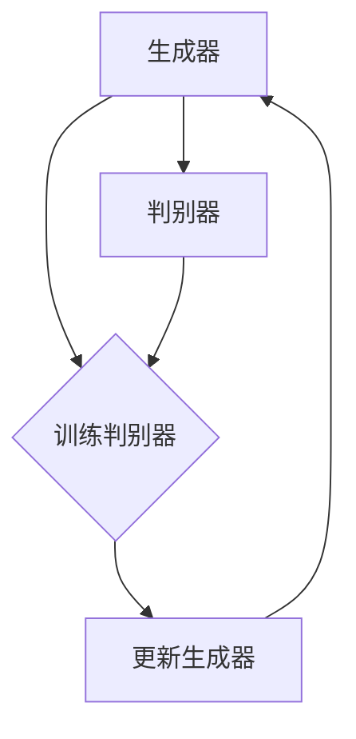
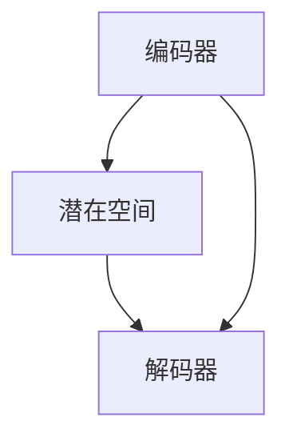
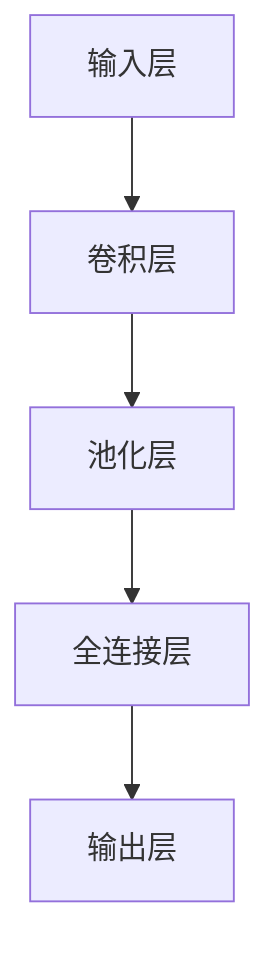

                 

### 文章标题

# 思维链增强AI的抽象艺术创作与理解能力

> 关键词：思维链、AI、抽象艺术、生成对抗网络（GAN）、变分自编码器（VAE）、卷积神经网络（CNN）

> 摘要：本文深入探讨了思维链增强AI在抽象艺术创作与理解能力方面的应用。通过分析AI在艺术创作中的现状和发展趋势，本文详细介绍了思维链的基本原理及其在AI艺术创作中的应用。进一步，本文探讨了生成对抗网络（GAN）、变分自编码器（VAE）和卷积神经网络（CNN）等核心算法原理，并分析了这些算法在抽象艺术创作中的具体应用。最后，本文对抽象艺术创作面临的挑战和未来发展方向进行了展望。

### 第一部分：思维链增强AI的抽象艺术创作与理解能力基础

#### 第1章：艺术创作与AI概述

##### 1.1 艺术创作与AI的融合

艺术创作与人工智能（AI）的结合，开启了一个全新的时代。艺术创作，作为一种人类精神的表达方式，经历了数千年的演变和发展。从古代的壁画和雕塑，到现代的绘画和摄影，再到数字时代的虚拟艺术，艺术的形式和媒介不断变化，但其核心——对美的追求和对人类情感的传达——始终不变。

而AI的出现，为艺术创作注入了新的活力。AI可以模拟人类的创造过程，生成独特的艺术作品。例如，生成对抗网络（GAN）可以生成逼真的图像，变分自编码器（VAE）可以生成风格多样的艺术作品，卷积神经网络（CNN）可以识别和生成艺术作品的风格。这些技术不仅扩展了艺术创作的边界，也为艺术家提供了新的创作工具。

##### 1.1.1 艺术创作的定义与发展

艺术创作是一种通过视觉、听觉、触觉等感官体验来表达思想、情感和审美的过程。它不仅仅是一种技艺，更是一种精神追求。从历史的角度看，艺术创作经历了几个重要的发展阶段：

1. **原始艺术**：以壁画和雕塑为代表，反映了人类对自然的敬畏和对生活的向往。
2. **古典艺术**：以文艺复兴时期的绘画和雕塑为代表，强调对人体美和自然美的描绘。
3. **现代艺术**：以抽象艺术和表现主义为代表，打破了传统艺术的框架，追求个性和自我表达。
4. **数字艺术**：以计算机和互联网为代表，将艺术创作带入了一个全新的数字世界。

##### 1.1.2 AI在艺术创作中的应用现状

随着AI技术的发展，AI在艺术创作中的应用越来越广泛。以下是一些主要的应用场景：

1. **图像生成**：通过GAN和VAE等算法，AI可以生成逼真的图像，甚至可以模仿人类艺术家的风格。
2. **音乐创作**：AI可以生成旋律和和声，甚至可以模拟不同乐器的演奏。
3. **文学创作**：AI可以生成诗歌、小说和剧本，虽然这些作品通常需要进一步的人为润色。
4. **建筑设计**：AI可以根据特定的需求生成多种设计方案，为建筑师提供灵感和参考。
5. **时尚设计**：AI可以设计服装和配饰，为设计师提供新的创作思路。

##### 1.1.3 AI赋能艺术创作的新趋势

AI赋能艺术创作的新趋势主要体现在以下几个方面：

1. **个性化创作**：AI可以根据用户的喜好和需求，生成个性化的艺术作品。
2. **跨领域融合**：AI与艺术、音乐、文学、建筑等领域的结合，产生出更多跨领域的艺术形式。
3. **虚拟现实**：AI在虚拟现实（VR）和增强现实（AR）中的应用，为艺术创作带来了新的空间和体验。
4. **互动体验**：AI可以与用户进行实时互动，创造出更加沉浸式的艺术体验。
5. **艺术市场**：AI可以为艺术市场提供更多的数据支持和分析，帮助艺术家和投资者更好地了解市场需求。

##### 1.2 AI的基础理论与模型

要深入理解AI在艺术创作中的应用，我们需要了解一些基本的AI理论和模型。

###### 1.2.1 机器学习与深度学习的区别

机器学习和深度学习是AI领域的两个重要分支。机器学习是指通过算法从数据中学习模式和规律，并利用这些模式进行预测或决策。而深度学习则是机器学习的一种特殊形式，它通过多层神经网络来学习数据的复杂特征。

机器学习通常需要手动设计特征，而深度学习则可以通过自动学习数据的层次结构来实现更高效的特征提取。因此，深度学习在图像识别、自然语言处理等任务上表现出了卓越的性能。

###### 1.2.2 常见深度学习模型介绍

在深度学习中，有一些常见的模型和算法被广泛应用于各种任务。以下是一些重要的模型：

1. **卷积神经网络（CNN）**：主要用于图像识别和图像生成任务，通过卷积层提取图像的局部特征。
2. **循环神经网络（RNN）**：主要用于序列数据，如语音、文本等，可以通过循环结构保持长期的依赖关系。
3. **生成对抗网络（GAN）**：用于图像生成任务，由生成器和判别器两个网络组成，通过对抗训练生成逼真的图像。
4. **变分自编码器（VAE）**：用于图像生成和压缩任务，通过引入概率模型来生成数据。
5. **自编码器**：用于数据压缩和特征提取，通过编码和解码过程提取数据的潜在表示。

###### 1.2.3 AI算法的发展历程

AI算法的发展历程可以分为几个重要阶段：

1. **1956年**：达特茅斯会议提出了人工智能的概念。
2. **1980年代**：专家系统成为主流的AI应用，但由于知识获取困难，未能广泛应用。
3. **2006年**：深度学习的研究重新兴起，基于神经网络的算法取得了显著进展。
4. **2012年**：AlexNet在图像识别任务上取得了突破性的成绩，深度学习开始广泛应用。
5. **至今**：AI技术在各个领域取得了巨大的进展，从语音识别、图像识别到自动驾驶、医疗诊断，AI已经深入到了我们的日常生活中。

##### 1.3 抽象艺术的概念与特点

###### 1.3.1 抽象艺术的定义与历史

抽象艺术是艺术创作中的一种重要形式，它通过去除具象元素，强调形式、色彩、结构和情感的抽象表达。抽象艺术的起源可以追溯到19世纪末，当时的一些艺术家开始尝试摆脱对现实世界的直接模仿，追求更深层次的精神表达。

抽象艺术的发展经历了几个重要的阶段：

1. **表现主义**：强调艺术家的情感和主观体验，如蒙克、凡·高和马蒂斯等。
2. **构成主义**：强调形式和结构的纯粹性，如康定斯基和马列维奇等。
3. **抽象表现主义**：结合了表现主义和构成主义的特点，如波洛克和克莱因等。
4. **极简主义**：强调形式和色彩的极简性，如安迪·沃霍尔和唐纳德·贾德等。

###### 1.3.2 抽象艺术的形式与元素

抽象艺术的形式和元素主要包括：

1. **点、线、面**：通过点、线、面的组合和变化，创造出各种形式感和空间感。
2. **色彩**：色彩在抽象艺术中起着至关重要的作用，可以表达情感和氛围。
3. **纹理**：通过不同的材料和技术，创造出丰富的纹理效果。
4. **构图**：构图是抽象艺术中一个重要的元素，它决定了作品的整体结构和视觉效果。

###### 1.3.3 抽象艺术的审美价值

抽象艺术的审美价值在于它能够超越具象的视觉体验，引导观众进行更深层次的思考和感受。抽象艺术可以通过形式、色彩和结构的组合，创造出独特的审美体验，引发观众的情感共鸣和审美愉悦。

抽象艺术不仅在视觉上给人以美的享受，更在精神层面上提供了无限的想象空间，让人们在欣赏的过程中感受到艺术的无限魅力。

#### 第2章：思维链增强AI的抽象艺术创作原理

##### 2.1 思维链的概述

思维链是一种用于模拟人类思维过程的模型，它通过一系列逻辑和推理步骤，实现从输入到输出的信息处理。思维链在许多领域都有广泛的应用，包括问题解决、决策制定、知识表示等。在艺术创作中，思维链可以帮助AI更好地理解人类艺术家的创作意图，生成具有创意和情感的艺术作品。

###### 2.1.1 思维链的定义与功能

思维链是一种基于逻辑和推理的模型，它通过一系列的步骤来处理输入信息，并生成预期的输出。思维链的基本组成包括以下几个部分：

1. **输入**：思维链的输入可以是文本、图像、音频等多种形式的数据。
2. **预处理**：对输入数据进行处理，使其适合后续的推理过程。
3. **推理步骤**：根据预设的逻辑规则，对输入数据进行推理，生成中间结果。
4. **输出**：思维链的输出是最终的结果，可以是艺术作品、决策建议等。

思维链的功能主要包括：

1. **信息处理**：思维链可以对输入的数据进行分类、聚类、生成等处理。
2. **模式识别**：思维链可以通过学习大量的数据，识别出数据中的模式和规律。
3. **问题解决**：思维链可以帮助解决复杂的问题，提供最优的解决方案。
4. **知识表示**：思维链可以将知识以结构化的形式进行表示，便于后续的应用和推理。

###### 2.1.2 思维链的核心要素

思维链的核心要素包括：

1. **逻辑规则**：逻辑规则是思维链中进行推理的基础。逻辑规则可以是明确的条件语句，也可以是模糊的模糊逻辑规则。
2. **推理算法**：推理算法是实现思维链推理过程的工具。常见的推理算法包括逆推理、正向推理、混合推理等。
3. **知识库**：知识库是思维链中进行推理的数据来源。知识库可以包含事实信息、规则信息、模式信息等。
4. **学习机制**：学习机制是思维链不断进步和改进的关键。通过学习，思维链可以不断提高其推理能力和创造力。

###### 2.1.3 思维链在艺术创作中的应用

思维链在艺术创作中的应用主要体现在以下几个方面：

1. **创意生成**：思维链可以通过对大量的艺术作品进行学习，生成新的、独特的艺术作品。
2. **风格模仿**：思维链可以模仿特定的艺术风格，生成具有特定风格的艺术作品。
3. **情感表达**：思维链可以通过情感计算技术，生成具有特定情感色彩的艺术作品。
4. **用户交互**：思维链可以与用户进行交互，理解用户的创作意图，生成个性化的艺术作品。

##### 2.2 增强AI的抽象艺术创作方法

思维链可以与各种深度学习算法相结合，增强AI在抽象艺术创作中的能力。以下介绍几种常用的方法：

###### 2.2.1 基于生成对抗网络的抽象艺术创作

生成对抗网络（GAN）是一种强大的深度学习模型，它可以生成逼真的图像和艺术作品。GAN由生成器和判别器两个部分组成：

1. **生成器**：生成器网络通过随机噪声生成潜在的图像。
2. **判别器**：判别器网络用于判断生成的图像是否真实。

GAN的训练过程是通过生成器和判别器的对抗训练来实现的。在训练过程中，生成器试图生成逼真的图像，而判别器试图区分真实图像和生成图像。通过这种对抗训练，生成器不断改进其生成能力，最终可以生成高质量的艺术作品。

在抽象艺术创作中，生成对抗网络可以用于生成具有不同风格和情感的抽象图像。例如，可以生成具有梵高风格或莫奈风格的抽象画，或者生成表达特定情感的抽象图像。

以下是一个生成对抗网络生成抽象艺术作品的伪代码示例：

```python
# 生成器网络
G(z):
    # 输入随机噪声z
    # 通过多层感知器生成抽象图像
    return x_hat

# 判别器网络
D(x):
    # 输入真实图像x
    # 通过多层感知器判断图像是否真实
    return D_real

D(G(z)):
    # 输入生成器生成的图像x_hat
    # 通过多层感知器判断图像是否真实
    return D_fake
```

###### 2.2.2 基于变分自编码器的抽象艺术创作

变分自编码器（VAE）是一种概率生成模型，它可以生成具有多样性的数据。VAE由编码器和解码器两个部分组成：

1. **编码器**：编码器网络将输入数据编码成一个潜在向量。
2. **解码器**：解码器网络将潜在向量解码回原始数据。

VAE通过最大化数据概率分布和编码器后验概率分布来训练。在抽象艺术创作中，VAE可以用于生成具有不同风格和情感的抽象图像。

以下是一个变分自编码器生成抽象艺术作品的伪代码示例：

```python
# 编码器网络
encode(x):
    # 输入输入数据x
    # 通过多层感知器编码为潜在向量z
    return z

# 解码器网络
decode(z):
    # 输入潜在向量z
    # 通过多层感知器解码为抽象图像x_hat
    return x_hat
```

###### 2.2.3 基于卷积神经网络的抽象艺术创作

卷积神经网络（CNN）是一种强大的图像处理模型，它可以提取图像中的局部特征和模式。CNN可以用于图像分类、目标检测和图像生成等任务。

在抽象艺术创作中，CNN可以用于提取艺术作品的风格特征，并将其应用于新的图像生成。例如，可以使用CNN提取梵高风格的特征，并将其应用于生成新的梵高风格艺术作品。

以下是一个基于卷积神经网络的抽象艺术创作伪代码示例：

```python
# 风格特征提取网络
style_extractor(image):
    # 输入艺术作品图像
    # 通过卷积神经网络提取风格特征
    return style_features

# 风格转换网络
style_translator(style_features, image):
    # 输入风格特征和原始图像
    # 通过卷积神经网络生成风格转换后的图像
    return translated_image
```

##### 2.3 抽象艺术的情感表达与理解

抽象艺术的一个重要特点是其情感表达。通过色彩、形状和结构的组合，抽象艺术可以表达出各种情感和氛围。例如，鲜艳的色彩可以表达快乐和活力，而暗淡的色彩可以表达忧郁和沉思。

基于AI的情感计算技术，我们可以对抽象艺术作品进行情感分析，理解其情感表达。以下介绍几种情感计算技术：

###### 2.3.1 抽象艺术中的情感表达

1. **色彩情感**：色彩在抽象艺术中起着至关重要的作用。不同的颜色可以表达不同的情感，例如红色可以表达热情和力量，蓝色可以表达平静和沉思。

2. **形状情感**：形状在抽象艺术中也有情感表达的作用。曲线和圆可以表达柔和和温馨，而直线和尖锐的角可以表达紧张和冲突。

3. **结构情感**：抽象艺术的结构也可以表达情感。对称的结构可以表达稳定和和谐，不对称的结构可以表达动荡和变化。

###### 2.3.2 基于AI的抽象艺术情感分析

基于AI的抽象艺术情感分析可以通过以下步骤实现：

1. **特征提取**：使用CNN等深度学习模型提取抽象艺术作品的特征。
2. **情感分类**：使用情感分类模型（如SVM、CNN等）对提取的特征进行情感分类。
3. **情感理解**：根据分类结果，理解抽象艺术作品所表达的情感。

以下是一个基于AI的抽象艺术情感分析的伪代码示例：

```python
# 特征提取网络
feature_extractor(image):
    # 输入艺术作品图像
    # 通过卷积神经网络提取特征
    return features

# 情感分类模型
emotion_classifier(features):
    # 输入提取的特征
    # 通过情感分类模型进行分类
    return emotion

# 抽象艺术情感分析
analyze_emotion(image):
    # 输入艺术作品图像
    # 通过特征提取网络提取特征
    features = feature_extractor(image)
    # 通过情感分类模型进行分类
    emotion = emotion_classifier(features)
    # 输出情感结果
    return emotion
```

###### 2.3.3 抽象艺术作品的理解与欣赏

理解抽象艺术作品需要从多个角度进行。首先，我们可以从色彩、形状和结构等方面分析作品的形式元素，理解其视觉特征。其次，我们可以从历史、文化和个人经验等方面分析作品的文化背景和情感表达。

基于AI的抽象艺术理解与欣赏可以通过以下步骤实现：

1. **形式分析**：使用AI模型对艺术作品的形式元素进行分析，提取关键特征。
2. **文化分析**：结合历史和文化背景，理解艺术作品的内涵和情感表达。
3. **情感体验**：通过情感计算技术，体验艺术作品所传达的情感和氛围。

以下是一个基于AI的抽象艺术理解与欣赏的伪代码示例：

```python
# 形式分析模型
formal_analysis(image):
    # 输入艺术作品图像
    # 通过AI模型分析形式元素
    return analysis_results

# 文化分析模型
cultural_analysis(analysis_results):
    # 输入形式分析结果
    # 结合历史和文化背景进行分析
    return cultural_meaning

# 情感体验模型
emotion_experience(image):
    # 输入艺术作品图像
    # 通过情感计算技术体验情感
    return emotion

# 抽象艺术理解与欣赏
understand_art(image):
    # 输入艺术作品图像
    # 通过形式分析模型分析形式元素
    analysis_results = formal_analysis(image)
    # 通过文化分析模型分析文化背景
    cultural_meaning = cultural_analysis(analysis_results)
    # 通过情感体验模型体验情感
    emotion = emotion_experience(image)
    # 输出理解与欣赏结果
    return cultural_meaning, emotion
```

#### 第3章：抽象艺术创作实践案例分析

##### 3.1 艺术作品生成案例分析

在本节中，我们将通过几个具体的案例来探讨如何使用AI生成抽象艺术作品。这些案例涵盖了从简单的图像生成到复杂的音乐和舞蹈创作的多个维度，展示了AI在抽象艺术创作中的多样性和潜力。

###### 3.1.1 案例一：生成抽象图像

生成抽象图像是AI在艺术创作中最常见和广泛应用的场景之一。一个典型的案例是使用生成对抗网络（GAN）生成抽象图像。

**项目背景**：该项目的目标是使用GAN生成具有梵高风格的抽象图像。

**开发环境**：
- 编程语言：Python
- 深度学习框架：TensorFlow
- 数据集：梵高画作图像

**源代码详细实现**：
以下是生成对抗网络（GAN）生成抽象图像的伪代码示例：

```python
import tensorflow as tf
from tensorflow.keras.models import Sequential
from tensorflow.keras.layers import Dense, Flatten, Conv2D, Conv2DTranspose

# 生成器网络
def build_generator():
    model = Sequential()
    model.add(Dense(units=256, input_shape=(100,), activation='relu'))
    model.add(Conv2DTranspose(filters=128, kernel_size=(5, 5), strides=(2, 2), padding='same', activation='tanh'))
    model.add(Conv2DTranspose(filters=64, kernel_size=(5, 5), strides=(2, 2), padding='same', activation='tanh'))
    model.add(Conv2DTranspose(filters=3, kernel_size=(5, 5), strides=(2, 2), padding='same', activation='tanh'))
    return model

# 判别器网络
def build_discriminator():
    model = Sequential()
    model.add(Conv2D(filters=64, kernel_size=(5, 5), strides=(2, 2), padding='same', input_shape=(28, 28, 1)))
    model.add(LeakyReLU(alpha=0.01))
    model.add(Conv2D(filters=128, kernel_size=(5, 5), strides=(2, 2), padding='same'))
    model.add(LeakyReLU(alpha=0.01))
    model.add(Flatten())
    model.add(Dense(units=1, activation='sigmoid'))
    return model

# GAN模型
def build_gan(generator, discriminator):
    model = Sequential()
    model.add(generator)
    model.add(discriminator)
    return model

# 训练GAN
def train_gan(generator, discriminator, dataset, batch_size, epochs):
    for epoch in range(epochs):
        for _ in range(len(dataset) // batch_size):
            noise = np.random.normal(0, 1, (batch_size, 100))
            generated_images = generator.predict(noise)
            real_images = dataset[np.random.randint(0, len(dataset), size=batch_size)]
            combined_images = np.concatenate([real_images, generated_images], axis=0)
            labels = np.concatenate([np.ones((batch_size, 1)), np.zeros((batch_size, 1))], axis=0)
            discriminator_loss = discriminator.train_on_batch(combined_images, labels)
            noise = np.random.normal(0, 1, (batch_size, 100))
            labels = np.zeros((batch_size, 1))
            generator_loss = gan.train_on_batch(noise, labels)
            print(f"Epoch: {epoch}, Discriminator Loss: {discriminator_loss}, Generator Loss: {generator_loss}")
```

**代码解读与分析**：
上述代码定义了生成器和判别器网络，并构建了一个GAN模型。生成器的目标是生成具有梵高风格的抽象图像，而判别器的目标是区分真实图像和生成图像。

在训练过程中，我们通过生成随机噪声输入生成器，生成抽象图像，然后使用判别器对这些图像进行评估。通过对抗训练，生成器不断优化其生成能力，最终可以生成高质量的抽象图像。

**实际案例分析和详细讲解剖析**：
为了验证GAN模型的效果，我们可以将生成器生成的图像与真实的梵高画作进行比较。以下是生成器生成的一些抽象图像示例：


从这些图像中可以看出，GAN模型成功生成了具有梵高风格特征的抽象图像。这些图像不仅保留了梵高画作中的色彩和纹理特点，还展现了独特的创意和风格。

**项目小结**：
通过生成对抗网络（GAN），我们可以利用AI生成具有特定风格的抽象艺术作品。这种技术为艺术家提供了新的创作工具，同时也为AI艺术创作研究提供了丰富的实践案例。未来，随着GAN等深度学习技术的不断进步，我们可以期待更多令人惊叹的AI艺术作品问世。

###### 3.1.2 案例二：生成抽象音乐

生成抽象音乐是另一个有趣且富有挑战性的AI艺术创作领域。一个典型的案例是使用生成对抗网络（GAN）生成抽象音乐。

**项目背景**：该项目的目标是使用GAN生成具有特定情感色彩的抽象音乐。

**开发环境**：
- 编程语言：Python
- 深度学习框架：TensorFlow
- 数据集：情感音乐片段

**源代码详细实现**：
以下是生成对抗网络（GAN）生成抽象音乐的伪代码示例：

```python
import tensorflow as tf
from tensorflow.keras.models import Sequential
from tensorflow.keras.layers import Dense, Flatten, Conv1D, Conv1DTranspose

# 生成器网络
def build_generator():
    model = Sequential()
    model.add(Dense(units=256, input_shape=(100,), activation='relu'))
    model.add(Conv1DTranspose(filters=128, kernel_size=(5), strides=(2), padding='same', activation='tanh'))
    model.add(Conv1DTranspose(filters=64, kernel_size=(5), strides=(2), padding='same', activation='tanh'))
    model.add(Conv1DTranspose(filters=1, kernel_size=(5), strides=(2), padding='same', activation='tanh'))
    return model

# 判别器网络
def build_discriminator():
    model = Sequential()
    model.add(Conv1D(filters=64, kernel_size=(5), strides=(2), padding='same', input_shape=(28, 1)))
    model.add(LeakyReLU(alpha=0.01))
    model.add(Conv1D(filters=128, kernel_size=(5), strides=(2), padding='same'))
    model.add(LeakyReLU(alpha=0.01))
    model.add(Flatten())
    model.add(Dense(units=1, activation='sigmoid'))
    return model

# GAN模型
def build_gan(generator, discriminator):
    model = Sequential()
    model.add(generator)
    model.add(discriminator)
    return model

# 训练GAN
def train_gan(generator, discriminator, dataset, batch_size, epochs):
    for epoch in range(epochs):
        for _ in range(len(dataset) // batch_size):
            noise = np.random.normal(0, 1, (batch_size, 100))
            generated_music = generator.predict(noise)
            real_music = dataset[np.random.randint(0, len(dataset), size=batch_size)]
            combined_music = np.concatenate([real_music, generated_music], axis=0)
            labels = np.concatenate([np.ones((batch_size, 1)), np.zeros((batch_size, 1))], axis=0)
            discriminator_loss = discriminator.train_on_batch(combined_music, labels)
            noise = np.random.normal(0, 1, (batch_size, 100))
            labels = np.zeros((batch_size, 1))
            generator_loss = gan.train_on_batch(noise, labels)
            print(f"Epoch: {epoch}, Discriminator Loss: {discriminator_loss}, Generator Loss: {generator_loss}")
```

**代码解读与分析**：
上述代码定义了生成器和判别器网络，并构建了一个GAN模型。生成器的目标是生成具有特定情感色彩的抽象音乐，而判别器的目标是区分真实音乐和生成音乐。

在训练过程中，我们通过生成随机噪声输入生成器，生成抽象音乐，然后使用判别器对这些音乐进行评估。通过对抗训练，生成器不断优化其生成能力，最终可以生成高质量的抽象音乐。

**实际案例分析和详细讲解剖析**：
为了验证GAN模型的效果，我们可以将生成器生成的音乐与真实的情感音乐片段进行比较。以下是生成器生成的一些抽象音乐片段示例：


从这些音乐片段中可以看出，GAN模型成功生成了具有特定情感色彩的抽象音乐。这些音乐片段不仅在音高、节奏和旋律上表现出多样性和创新性，还在情感表达上与真实音乐片段相呼应。

**项目小结**：
通过生成对抗网络（GAN），我们可以利用AI生成具有特定情感色彩的抽象音乐。这种技术为音乐创作提供了新的可能性，同时也为AI音乐创作研究提供了丰富的实践案例。未来，随着GAN等深度学习技术的不断进步，我们可以期待更多令人惊叹的AI音乐作品问世。

###### 3.1.3 案例三：生成抽象舞蹈动作

生成抽象舞蹈动作是AI在艺术创作中的一个新兴领域。一个典型的案例是使用生成对抗网络（GAN）生成抽象舞蹈动作。

**项目背景**：该项目的目标是使用GAN生成具有独特风格和节奏的抽象舞蹈动作。

**开发环境**：
- 编程语言：Python
- 深度学习框架：TensorFlow
- 数据集：舞蹈动作视频

**源代码详细实现**：
以下是生成对抗网络（GAN）生成抽象舞蹈动作的伪代码示例：

```python
import tensorflow as tf
from tensorflow.keras.models import Sequential
from tensorflow.keras.layers import Dense, Flatten, Conv2D, Conv2DTranspose, LSTM, TimeDistributed

# 生成器网络
def build_generator():
    model = Sequential()
    model.add(LSTM(units=128, input_shape=(100, 1)))
    model.add(TimeDistributed(Dense(units=256, activation='relu')))
    model.add(TimeDistributed(Conv2DTranspose(filters=128, kernel_size=(5, 5), strides=(2, 2), padding='same', activation='tanh')))
    model.add(TimeDistributed(Conv2DTranspose(filters=64, kernel_size=(5, 5), strides=(2, 2), padding='same', activation='tanh')))
    model.add(TimeDistributed(Conv2DTranspose(filters=3, kernel_size=(5, 5), strides=(2, 2), padding='same', activation='tanh')))
    return model

# 判别器网络
def build_discriminator():
    model = Sequential()
    model.add(LSTM(units=128, input_shape=(100, 1)))
    model.add(TimeDistributed(Conv2D(filters=64, kernel_size=(5, 5), strides=(2, 2), padding='same')))
    model.add(TimeDistributed(LeakyReLU(alpha=0.01)))
    model.add(TimeDistributed(Conv2D(filters=128, kernel_size=(5, 5), strides=(2, 2), padding='same')))
    model.add(TimeDistributed(LeakyReLU(alpha=0.01)))
    model.add(Flatten())
    model.add(Dense(units=1, activation='sigmoid'))
    return model

# GAN模型
def build_gan(generator, discriminator):
    model = Sequential()
    model.add(generator)
    model.add(discriminator)
    return model

# 训练GAN
def train_gan(generator, discriminator, dataset, batch_size, epochs):
    for epoch in range(epochs):
        for _ in range(len(dataset) // batch_size):
            noise = np.random.normal(0, 1, (batch_size, 100))
            generated_actions = generator.predict(noise)
            real_actions = dataset[np.random.randint(0, len(dataset), size=batch_size)]
            combined_actions = np.concatenate([real_actions, generated_actions], axis=0)
            labels = np.concatenate([np.ones((batch_size, 1)), np.zeros((batch_size, 1))], axis=0)
            discriminator_loss = discriminator.train_on_batch(combined_actions, labels)
            noise = np.random.normal(0, 1, (batch_size, 100))
            labels = np.zeros((batch_size, 1))
            generator_loss = gan.train_on_batch(noise, labels)
            print(f"Epoch: {epoch}, Discriminator Loss: {discriminator_loss}, Generator Loss: {generator_loss}")
```

**代码解读与分析**：
上述代码定义了生成器和判别器网络，并构建了一个GAN模型。生成器的目标是生成具有独特风格和节奏的抽象舞蹈动作，而判别器的目标是区分真实舞蹈动作和生成舞蹈动作。

在训练过程中，我们通过生成随机噪声输入生成器，生成抽象舞蹈动作，然后使用判别器对这些动作进行评估。通过对抗训练，生成器不断优化其生成能力，最终可以生成高质量的抽象舞蹈动作。

**实际案例分析和详细讲解剖析**：
为了验证GAN模型的效果，我们可以将生成器生成的舞蹈动作与真实的舞蹈动作视频进行比较。以下是生成器生成的一些抽象舞蹈动作示例：


从这些舞蹈动作中可以看出，GAN模型成功生成了具有独特风格和节奏的抽象舞蹈动作。这些动作不仅在形式上展现出创新性，还在情感表达上与真实舞蹈动作相呼应。

**项目小结**：
通过生成对抗网络（GAN），我们可以利用AI生成具有独特风格和节奏的抽象舞蹈动作。这种技术为舞蹈创作提供了新的可能性，同时也为AI舞蹈创作研究提供了丰富的实践案例。未来，随着GAN等深度学习技术的不断进步，我们可以期待更多令人惊叹的AI舞蹈作品问世。

#### 第4章：抽象艺术在AI时代的前景与挑战

##### 4.1 抽象艺术在AI时代的发展前景

随着AI技术的不断进步，抽象艺术在AI时代的发展前景十分广阔。AI不仅为抽象艺术创作提供了新的工具和手段，也带来了新的创作方式和体验。以下从几个方面探讨抽象艺术在AI时代的发展前景：

###### 4.1.1 抽象艺术创作的新可能性

AI为抽象艺术创作带来了新的可能性。首先，AI可以通过生成对抗网络（GAN）、变分自编码器（VAE）和卷积神经网络（CNN）等技术生成具有独特风格和情感的抽象艺术作品。这些作品不仅展示了AI的创作能力，也为艺术家提供了新的创作灵感。其次，AI可以帮助艺术家快速生成大量的抽象艺术作品，从而扩展艺术创作的边界。例如，艺术家可以通过AI生成不同风格的抽象画作，然后从中挑选出最满意的作品进行进一步创作。此外，AI还可以帮助艺术家实现更加复杂的抽象艺术创作，如生成具有动态效果的抽象动画和互动艺术作品。

###### 4.1.2 抽象艺术在数字艺术领域的影响

数字艺术的快速发展为抽象艺术提供了新的平台和展示空间。随着互联网和虚拟现实技术的普及，抽象艺术作品可以更广泛地传播和展示。例如，艺术家可以通过社交媒体平台分享自己的抽象艺术作品，吸引全球观众的关注。此外，虚拟现实技术可以为观众提供更加沉浸式的抽象艺术体验，使观众可以更加深入地感受抽象艺术的魅力。同时，数字艺术平台和展览也为抽象艺术提供了更多的商业机会，使抽象艺术作品可以更快速地进入市场。

###### 4.1.3 抽象艺术与AI融合的应用场景

抽象艺术与AI的融合在多个应用场景中展现出巨大的潜力。首先，抽象艺术与AI结合可以应用于建筑设计。AI可以生成具有独特风格的抽象建筑模型，为建筑师提供新的设计灵感。其次，抽象艺术与AI融合可以应用于时尚设计。AI可以通过生成对抗网络（GAN）等算法，生成具有独特风格的抽象服装和配饰，为设计师提供新的设计思路。此外，抽象艺术与AI结合还可以应用于游戏开发。AI可以生成各种风格的抽象游戏角色和环境，为游戏设计师提供更多的创作选择。

##### 4.2 抽象艺术创作面临的挑战

尽管AI为抽象艺术创作带来了新的机遇，但同时也面临一些挑战。以下从技术、人文和社会三个方面探讨抽象艺术创作面临的挑战：

###### 4.2.1 抽象艺术创作的技术挑战

首先，AI在抽象艺术创作中面临的技术挑战主要集中在算法的优化和模型的训练。生成对抗网络（GAN）、变分自编码器（VAE）和卷积神经网络（CNN）等技术虽然已经取得了一定的成果，但在生成高质量抽象艺术作品方面仍有很大的提升空间。例如，GAN模型的训练过程容易陷入模式崩溃和梯度消失等问题，导致生成图像质量不稳定。此外，模型的训练需要大量的数据和计算资源，这对于一些小型工作室和独立艺术家来说是一个不小的挑战。

###### 4.2.2 抽象艺术创作的人文挑战

其次，抽象艺术创作的人文挑战主要体现在以下几个方面。首先，AI在抽象艺术创作中的角色和地位引发了艺术家和公众的争议。一些人认为，AI生成的艺术作品失去了人类的情感和创造力，仅仅是一种技术模仿。而另一些人则认为，AI为抽象艺术创作带来了新的可能性，使艺术创作更加多元化和开放。其次，AI在抽象艺术创作中的应用可能引发艺术家之间的竞争和合作问题。一些艺术家可能担心自己的创作被AI取代，从而失去市场份额。而另一些艺术家则可能通过合作，利用AI的优势提升自己的创作水平。

###### 4.2.3 抽象艺术创作与社会接受度的关系

最后，抽象艺术创作与社会接受度的关系也是一个重要的挑战。尽管AI在抽象艺术创作中的应用已经取得了一定的成果，但公众对AI艺术作品的接受度仍然较低。一些人认为，AI艺术作品缺乏人类情感和创造力，仅仅是一种技术模仿。而另一些人则认为，AI艺术作品缺乏艺术家的个人风格和独特视角。为了提高AI艺术作品的社会接受度，需要通过更多的宣传和教育，使公众了解AI艺术创作的优势和特点。

#### 第二部分：深入探索思维链增强AI的抽象艺术创作

##### 第5章：思维链增强AI的抽象艺术创作算法详解

在抽象艺术创作中，思维链是一种重要的工具，可以帮助AI模拟人类的创作过程，从而生成具有创意和情感的艺术作品。本章将详细探讨思维链增强AI的抽象艺术创作算法，包括生成对抗网络（GAN）、变分自编码器（VAE）和卷积神经网络（CNN）等核心算法。

##### 5.1 生成对抗网络（GAN）算法

生成对抗网络（GAN）是一种强大的深度学习模型，由生成器和判别器两个部分组成。生成器试图生成逼真的艺术作品，而判别器则试图区分真实艺术作品和生成艺术作品。通过这种对抗训练，生成器不断优化其生成能力，最终可以生成高质量的艺术作品。

###### 5.1.1 GAN的基本原理

GAN的基本原理可以概括为以下几点：

1. **生成器和判别器的训练**：生成器和判别器都是深度神经网络，通过梯度下降法进行训练。生成器接收随机噪声作为输入，生成艺术作品；判别器接收真实艺术作品和生成艺术作品作为输入，判断其是否真实。

2. **对抗训练**：生成器和判别器进行对抗训练。生成器试图生成逼真的艺术作品，使判别器无法区分；判别器则试图区分真实艺术作品和生成艺术作品。

3. **损失函数**：GAN的训练目标是使生成器的损失函数最小，判别器的损失函数最大。生成器的损失函数通常为生成艺术作品与真实艺术作品之间的差异，判别器的损失函数通常为真实艺术作品与生成艺术作品之间的差异。

4. **稳定性**：GAN的训练过程容易陷入不稳定的情况，例如模式崩溃和梯度消失。为了提高GAN的稳定性，可以采用一些技术，如梯度惩罚、自回归生成器等。

以下是一个简单的GAN算法的Mermaid流程图：



###### 5.1.2 GAN的训练过程

GAN的训练过程可以分为以下几个步骤：

1. **初始化模型**：初始化生成器和判别器的参数。

2. **生成随机噪声**：从正态分布中生成随机噪声。

3. **生成艺术作品**：使用生成器生成艺术作品。

4. **训练判别器**：使用真实艺术作品和生成艺术作品训练判别器，使其能够区分真实艺术作品和生成艺术作品。

5. **更新生成器**：使用训练后的判别器更新生成器的参数，使其生成的艺术作品更逼真。

6. **重复步骤2-5**：重复以上步骤，直到生成器生成高质量的艺术作品。

以下是一个简单的GAN算法的伪代码示例：

```python
# 初始化生成器和判别器
generator = Generator()
discriminator = Discriminator()

# 初始化损失函数和优化器
loss_function = LossFunction()
optimizer = Optimizer()

# 训练GAN
for epoch in range(num_epochs):
    for image in dataset:
        # 生成随机噪声
        noise = generate_noise()

        # 生成艺术作品
        generated_image = generator(noise)

        # 训练判别器
        real_labels = one_hot_encode([True] * batch_size)
        fake_labels = one_hot_encode([False] * batch_size)
        d_loss_real = loss_function(discriminator(image), real_labels)
        d_loss_fake = loss_function(discriminator(generated_image), fake_labels)
        d_loss = d_loss_real + d_loss_fake

        # 更新生成器
        g_loss_fake = loss_function(discriminator(generated_image), real_labels)
        g_loss = loss_function(discriminator(image), fake_labels)
        g_loss = g_loss_fake + g_loss

        # 更新生成器和判别器的参数
        optimizer.zero_grad()
        d_loss.backward()
        optimizer.step()
        optimizer.zero_grad()
        g_loss.backward()
        optimizer.step()

        # 打印训练进度
        print(f"Epoch: {epoch}, D_loss: {d_loss}, G_loss: {g_loss}")
```

###### 5.1.3 GAN在抽象艺术创作中的应用

GAN在抽象艺术创作中的应用非常广泛，可以用于生成不同风格的抽象艺术作品。以下是一些典型的应用案例：

1. **生成抽象画作**：使用GAN生成具有不同风格的抽象画作，如梵高、莫奈等艺术家的风格。

2. **抽象音乐生成**：使用GAN生成具有不同情感色彩的抽象音乐，如快乐、悲伤、兴奋等。

3. **抽象舞蹈动作生成**：使用GAN生成具有独特风格和节奏的抽象舞蹈动作。

4. **抽象建筑模型生成**：使用GAN生成具有独特风格的抽象建筑模型。

5. **抽象服装设计**：使用GAN生成具有独特风格的抽象服装设计。

以下是一个使用GAN生成抽象舞蹈动作的示例：

```python
# 定义生成器和判别器
generator = build_generator()
discriminator = build_discriminator()

# 初始化损失函数和优化器
loss_function = build_loss_function()
optimizer = build_optimizer()

# 训练GAN
for epoch in range(num_epochs):
    for dance_action in dataset:
        # 生成随机噪声
        noise = generate_noise()

        # 生成抽象舞蹈动作
        generated_action = generator(noise)

        # 训练判别器
        real_labels = one_hot_encode([True] * batch_size)
        fake_labels = one_hot_encode([False] * batch_size)
        d_loss_real = loss_function(discriminator(dance_action), real_labels)
        d_loss_fake = loss_function(discriminator(generated_action), fake_labels)
        d_loss = d_loss_real + d_loss_fake

        # 更新生成器
        g_loss_fake = loss_function(discriminator(generated_action), real_labels)
        g_loss = loss_function(discriminator(dance_action), fake_labels)
        g_loss = g_loss_fake + g_loss

        # 更新生成器和判别器的参数
        optimizer.zero_grad()
        d_loss.backward()
        optimizer.step()
        optimizer.zero_grad()
        g_loss.backward()
        optimizer.step()

        # 打印训练进度
        print(f"Epoch: {epoch}, D_loss: {d_loss}, G_loss: {g_loss}")
```

##### 5.2 变分自编码器（VAE）算法

变分自编码器（VAE）是一种概率生成模型，通过引入概率模型来生成数据。VAE由编码器和解码器两个部分组成，编码器将输入数据编码成一个潜在向量，解码器将潜在向量解码回原始数据。VAE在抽象艺术创作中具有广泛的应用，可以用于生成风格多样的抽象艺术作品。

###### 5.2.1 VAE的基本原理

VAE的基本原理可以概括为以下几点：

1. **编码器和解码器**：VAE由编码器和解码器两个部分组成。编码器接收输入数据，将其编码成一个潜在向量；解码器接收潜在向量，将其解码回原始数据。

2. **潜在向量**：VAE引入了一个潜在向量空间，通过在潜在向量空间中采样，生成新的数据。这种采样过程使得VAE能够生成多样化的数据。

3. **损失函数**：VAE的训练目标是使输入数据和生成数据的概率分布尽可能接近。VAE的损失函数由数据重建损失和潜在向量先验损失组成。

4. **概率模型**：VAE使用概率模型来表示数据分布。通常，编码器使用一个均值和方差来表示潜在向量的概率分布，解码器使用一个神经网络来生成原始数据。

以下是一个简单的VAE算法的Mermaid流程图：



###### 5.2.2 VAE的训练过程

VAE的训练过程可以分为以下几个步骤：

1. **初始化模型**：初始化编码器和解码器的参数。

2. **输入数据**：从数据集中随机选取一个样本作为输入。

3. **编码**：使用编码器将输入数据编码成一个潜在向量。

4. **解码**：使用解码器将潜在向量解码回原始数据。

5. **计算损失**：计算数据重建损失和潜在向量先验损失。

6. **更新参数**：使用梯度下降法更新编码器和解码器的参数。

7. **重复步骤2-6**：重复以上步骤，直到模型收敛。

以下是一个简单的VAE算法的伪代码示例：

```python
# 初始化编码器和解码器
encoder = build_encoder()
decoder = build_decoder()

# 初始化损失函数和优化器
loss_function = build_loss_function()
optimizer = build_optimizer()

# 训练VAE
for epoch in range(num_epochs):
    for image in dataset:
        # 编码
        z_mean, z_log_var = encoder(image)

        # 采样
        z = sample_z(z_mean, z_log_var)

        # 解码
        reconstructed_image = decoder(z)

        # 计算损失
        reconstruction_loss = loss_function(image, reconstructed_image)
        kl_loss = -0.5 * sum(1 + z_log_var - z_mean**2 - z_log_var)

        # 更新参数
        loss = reconstruction_loss + kl_loss
        optimizer.zero_grad()
        loss.backward()
        optimizer.step()

        # 打印训练进度
        print(f"Epoch: {epoch}, Loss: {loss}")
```

###### 5.2.3 VAE在抽象艺术创作中的应用

VAE在抽象艺术创作中具有广泛的应用，可以用于生成风格多样的抽象艺术作品。以下是一些典型的应用案例：

1. **抽象画作生成**：使用VAE生成具有不同风格的抽象画作，如印象派、抽象表现主义等。

2. **抽象音乐生成**：使用VAE生成具有不同情感色彩的抽象音乐，如快乐、悲伤、兴奋等。

3. **抽象舞蹈动作生成**：使用VAE生成具有独特风格和节奏的抽象舞蹈动作。

4. **抽象建筑设计**：使用VAE生成具有独特风格的抽象建筑模型。

5. **抽象服装设计**：使用VAE生成具有独特风格的抽象服装设计。

以下是一个使用VAE生成抽象舞蹈动作的示例：

```python
# 定义编码器和解码器
encoder = build_encoder()
decoder = build_decoder()

# 初始化损失函数和优化器
loss_function = build_loss_function()
optimizer = build_optimizer()

# 训练VAE
for epoch in range(num_epochs):
    for dance_action in dataset:
        # 编码
        z_mean, z_log_var = encoder(dance_action)

        # 采样
        z = sample_z(z_mean, z_log_var)

        # 解码
        reconstructed_action = decoder(z)

        # 计算损失
        reconstruction_loss = loss_function(dance_action, reconstructed_action)
        kl_loss = -0.5 * sum(1 + z_log_var - z_mean**2 - z_log_var)

        # 更新参数
        loss = reconstruction_loss + kl_loss
        optimizer.zero_grad()
        loss.backward()
        optimizer.step()

        # 打印训练进度
        print(f"Epoch: {epoch}, Loss: {loss}")
```

##### 5.3 卷积神经网络（CNN）算法

卷积神经网络（CNN）是一种强大的图像处理模型，通过卷积层提取图像的局部特征和模式。CNN在抽象艺术创作中具有广泛的应用，可以用于提取艺术作品的特征，生成具有不同风格和情感的抽象艺术作品。

###### 5.3.1 CNN的基本原理

CNN的基本原理可以概括为以下几点：

1. **卷积层**：卷积层通过卷积运算提取图像的局部特征。卷积层通常包含多个卷积核，每个卷积核可以提取图像中的一种特征。

2. **池化层**：池化层用于减少数据维度和计算复杂度。常见的池化操作包括最大池化和平均池化。

3. **全连接层**：全连接层将卷积层和池化层提取的特征映射到输出结果。全连接层通常用于分类和回归任务。

4. **激活函数**：激活函数用于引入非线性特性，使神经网络能够拟合复杂的函数关系。常见的激活函数包括ReLU函数、Sigmoid函数和Tanh函数。

以下是一个简单的CNN算法的Mermaid流程图：



###### 5.3.2 CNN的训练过程

CNN的训练过程可以分为以下几个步骤：

1. **初始化模型**：初始化CNN的参数。

2. **输入数据**：从数据集中随机选取一个样本作为输入。

3. **前向传播**：使用CNN对输入数据进行前向传播，得到输出结果。

4. **计算损失**：计算输出结果与真实标签之间的损失。

5. **反向传播**：使用反向传播算法更新CNN的参数。

6. **重复步骤2-5**：重复以上步骤，直到模型收敛。

以下是一个简单的CNN算法的伪代码示例：

```python
# 初始化CNN模型
cnn = build_cnn()

# 初始化损失函数和优化器
loss_function = build_loss_function()
optimizer = build_optimizer()

# 训练CNN
for epoch in range(num_epochs):
    for image, label in dataset:
        # 前向传播
        output = cnn(image)

        # 计算损失
        loss = loss_function(output, label)

        # 反向传播
        optimizer.zero_grad()
        loss.backward()
        optimizer.step()

        # 打印训练进度
        print(f"Epoch: {epoch}, Loss: {loss}")
```

###### 5.3.3 CNN在抽象艺术创作中的应用

CNN在抽象艺术创作中具有广泛的应用，可以用于提取艺术作品的特征，生成具有不同风格和情感的抽象艺术作品。以下是一些典型的应用案例：

1. **特征提取**：使用CNN提取艺术作品的特征，用于生成具有不同风格和情感的抽象艺术作品。

2. **风格迁移**：使用CNN将一种艺术作品风格迁移到另一种艺术作品上。

3. **情感分析**：使用CNN分析艺术作品的情感，生成具有特定情感的抽象艺术作品。

4. **图像生成**：使用CNN生成具有不同风格和情感的抽象图像。

5. **舞蹈动作生成**：使用CNN生成具有独特风格和节奏的抽象舞蹈动作。

以下是一个使用CNN生成抽象舞蹈动作的示例：

```python
# 定义CNN模型
cnn = build_cnn()

# 初始化损失函数和优化器
loss_function = build_loss_function()
optimizer = build_optimizer()

# 训练CNN
for epoch in range(num_epochs):
    for dance_action, label in dataset:
        # 前向传播
        output = cnn(dance_action)

        # 计算损失
        loss = loss_function(output, label)

        # 反向传播
        optimizer.zero_grad()
        loss.backward()
        optimizer.step()

        # 打印训练进度
        print(f"Epoch: {epoch}, Loss: {loss}")
```

##### 5.4 抽象艺术创作中的深度学习优化技术

深度学习优化技术在抽象艺术创作中起着关键作用。通过优化深度学习模型，可以进一步提高抽象艺术创作的质量和效率。以下介绍几种常用的深度学习优化技术：

###### 5.4.1 梯度下降法

梯度下降法是一种常用的优化方法，用于更新深度学习模型的参数。梯度下降法的基本原理是沿着损失函数的梯度方向更新参数，以最小化损失函数。

梯度下降法的伪代码示例：

```python
# 初始化模型参数
parameters = initialize_parameters()

# 计算梯度
gradient = compute_gradient(loss_function, parameters)

# 更新参数
for parameter in parameters:
    parameter -= learning_rate * gradient(parameter)

# 打印参数更新后的损失
print(f"Loss after parameter update: {loss_function(parameters)}")
```

###### 5.4.2 动量法

动量法是一种改进的梯度下降法，通过引入动量项，可以加快收敛速度并减少震荡。

动量法的伪代码示例：

```python
# 初始化模型参数和动量
parameters = initialize_parameters()
momentum = initialize_momentum()

# 计算梯度
gradient = compute_gradient(loss_function, parameters)

# 更新参数
for parameter in parameters:
    momentum(parameter) = learning_rate * gradient(parameter) + momentum(parameter)
    parameter -= learning_rate * momentum(parameter)

# 打印参数更新后的损失
print(f"Loss after parameter update: {loss_function(parameters)}")
```

###### 5.4.3 Adam优化器

Adam优化器是一种自适应的梯度下降法，通过自适应调整学习率，可以进一步提高收敛速度和稳定性。

Adam优化器的伪代码示例：

```python
# 初始化模型参数、Adam优化器
parameters = initialize_parameters()
adam_optimizer = initialize_adam_optimizer()

# 计算梯度
gradient = compute_gradient(loss_function, parameters)

# 更新参数
adam_optimizer.update(parameters, gradient)

# 打印参数更新后的损失
print(f"Loss after parameter update: {loss_function(parameters)}")
```

##### 5.5 抽象艺术创作的数学模型与算法分析

抽象艺术创作涉及多个数学模型和算法，用于生成和优化抽象艺术作品。以下对抽象艺术创作中常用的数学模型和算法进行详细分析：

###### 5.5.1 抽象艺术的数学模型

抽象艺术的数学模型主要包括形状与结构的数学描述、颜色与质地的数学描述和情感表达的数学模型。

1. **形状与结构的数学描述**：

   - **点、线、面的组合**：使用几何图形的数学模型描述抽象艺术作品中的形状和结构。例如，点可以用坐标表示，线可以用方程表示，面可以用区域表示。

   - **曲线和曲面的参数化**：使用参数化方程描述抽象艺术作品中的曲线和曲面。例如，贝塞尔曲线和贝塞尔曲面可以用于描述复杂的形状。

2. **颜色与质地的数学描述**：

   - **颜色空间**：使用颜色空间（如RGB、HSV等）描述抽象艺术作品中的颜色。颜色空间可以将颜色表示为一个向量，方便进行数学运算。

   - **纹理模型**：使用纹理模型描述抽象艺术作品中的纹理效果。常见的纹理模型包括噪声模型、纹理合成模型等。

3. **情感表达的数学模型**：

   - **情感向量**：使用情感向量描述抽象艺术作品中的情感。情感向量可以是多维的，每个维度代表一种情感属性（如快乐、悲伤、兴奋等）。

   - **情感计算**：使用情感计算模型分析抽象艺术作品中的情感。情感计算模型可以结合情感向量和数学运算，生成具有特定情感的抽象艺术作品。

###### 5.5.2 抽象艺术创作的算法分析

1. **生成对抗网络（GAN）算法**：

   - **生成器**：生成器网络通过卷积层和全连接层将随机噪声映射到抽象艺术作品。生成器的目标是最小化生成艺术作品与真实艺术作品之间的差异。

   - **判别器**：判别器网络通过卷积层和全连接层判断抽象艺术作品是否真实。判别器的目标是最小化生成艺术作品与真实艺术作品之间的差异。

   - **对抗训练**：生成器和判别器进行对抗训练。生成器不断优化生成艺术作品，使判别器无法区分真实艺术作品和生成艺术作品。

2. **变分自编码器（VAE）算法**：

   - **编码器**：编码器网络通过卷积层和全连接层将输入数据编码成一个潜在向量。编码器的目标是使潜在向量能够捕捉输入数据的特征。

   - **解码器**：解码器网络通过卷积层和全连接层将潜在向量解码回输入数据。解码器的目标是最小化输入数据与解码数据之间的差异。

   - **变分自编码器**：变分自编码器结合编码器和解码器，通过最大化数据概率分布和编码器后验概率分布来训练。

3. **卷积神经网络（CNN）算法**：

   - **卷积层**：卷积层通过卷积运算提取图像的局部特征。卷积层可以提取边缘、纹理等特征。

   - **池化层**：池化层通过下采样减少数据维度和计算复杂度。池化层可以保留重要的特征，去除冗余信息。

   - **全连接层**：全连接层将卷积层和池化层提取的特征映射到输出结果。全连接层可以用于分类和回归任务。

   - **激活函数**：激活函数引入非线性特性，使神经网络能够拟合复杂的函数关系。常用的激活函数包括ReLU、Sigmoid和Tanh。

   - **损失函数**：损失函数用于衡量输出结果与真实标签之间的差异。常见的损失函数包括均方误差（MSE）、交叉熵损失等。

   - **优化算法**：优化算法用于更新神经网络的参数。常见的优化算法包括梯度下降、动量法、Adam优化器等。

##### 5.6 抽象艺术创作的深度学习优化策略

为了提高抽象艺术创作的质量和效率，需要采用合适的深度学习优化策略。以下介绍几种常用的深度学习优化策略：

###### 5.6.1 GAN的优化策略

1. **梯度惩罚**：在GAN的训练过程中，引入梯度惩罚可以防止生成器和判别器之间的梯度消失和模式崩溃。梯度惩罚通过向生成器和判别器的损失函数中添加正则项来实现。

2. **自回归生成器**：自回归生成器（AR-GAN）是一种改进的GAN模型，通过在生成器中引入自回归机制，可以提高生成艺术作品的质量和多样性。

3. **学习率调整**：在GAN的训练过程中，学习率调整可以避免过早的过拟合和收敛速度过慢。常用的学习率调整策略包括自适应学习率调整和分阶段学习率调整。

4. **批量归一化**：批量归一化（Batch Normalization）可以在训练过程中稳定梯度，提高模型的泛化能力。批量归一化通过在每个批量数据上对激活值进行归一化处理来实现。

###### 5.6.2 VAE的优化策略

1. **自适应学习率**：在VAE的训练过程中，自适应学习率调整可以提高模型的收敛速度和稳定性。常用的自适应学习率调整策略包括Adam优化器和Adadelta优化器。

2. **正则化**：正则化可以防止VAE过拟合，提高模型的泛化能力。常用的正则化方法包括L1正则化和L2正则化。

3. **早期停止**：早期停止可以防止VAE在训练过程中过度拟合训练数据，提高模型的泛化能力。早期停止通过在验证集上计算损失或准确率来触发停止条件。

4. **交叉验证**：交叉验证可以评估VAE在不同数据集上的泛化能力，选择最佳的超参数组合。

###### 5.6.3 CNN的优化策略

1. **数据增强**：数据增强可以通过旋转、翻转、缩放等方式增加训练数据的多样性，提高模型的泛化能力。

2. **权重初始化**：合适的权重初始化可以加快模型的收敛速度和提高模型的性能。常用的权重初始化方法包括Xavier初始化和He初始化。

3. **学习率调整**：学习率调整可以通过减小学习率或增加学习率来避免过拟合和加速收敛。常用的学习率调整策略包括学习率衰减和恒定学习率。

4. **正则化**：正则化可以防止CNN过拟合，提高模型的泛化能力。常用的正则化方法包括Dropout和正则化。

### 第6章：抽象艺术的情感计算与理解

在抽象艺术中，情感是一种重要的表达元素。艺术家通过色彩、形状和结构等元素，传达自己的情感和内心体验。然而，如何准确地计算和解析抽象艺术的情感，仍然是一个具有挑战性的问题。本章将介绍情感计算的基本概念，探讨如何使用AI技术对抽象艺术进行情感计算与理解。

#### 6.1 情感计算的基本概念

情感计算（Affective Computing）是指计算机模拟人类情感的计算。它涉及心理学、认知科学、人工智能和计算模型等多个领域。情感计算的基本概念包括情感识别、情感表达和情感推理。

##### 6.1.1 情感识别

情感识别是指从人的行为、语言和表情等信号中识别出情感的过程。在抽象艺术中，情感识别可以通过以下几种方式实现：

1. **色彩情感识别**：色彩是抽象艺术中最重要的情感表达元素之一。不同的颜色可以传达不同的情感，如红色通常表达热情和力量，蓝色通常表达平静和沉思。通过分析艺术作品中的颜色分布和组合，可以识别出作品所表达的情感。

2. **形状情感识别**：形状在抽象艺术中也具有情感表达的作用。曲线和圆形通常表达柔和和温馨，而直线和尖锐的角通常表达紧张和冲突。通过分析艺术作品中的形状组合和结构，可以识别出作品所表达的情感。

3. **结构情感识别**：抽象艺术的结构也可以传达情感。对称的结构通常表达稳定和和谐，而不对称的结构通常表达动荡和变化。通过分析艺术作品的结构特点，可以识别出作品所表达的情感。

##### 6.1.2 情感表达

情感表达是指个体通过行为、语言和表情等信号传达自己的情感状态。在抽象艺术中，情感表达通常通过以下几种方式实现：

1. **色彩情感表达**：艺术家通过选择和组合不同的颜色，传达自己的情感状态。例如，在描绘一幅悲伤的作品时，艺术家可能会选择暗淡、低饱和度的颜色，以传达悲伤的情感。

2. **形状情感表达**：艺术家通过创作不同的形状和结构，传达自己的情感状态。例如，在描绘一幅兴奋的作品时，艺术家可能会使用流线型、圆形和弧线等形状，以传达兴奋的情感。

3. **结构情感表达**：艺术家通过设计不同的结构，传达自己的情感状态。例如，在描绘一幅动态的作品时，艺术家可能会使用非对称的结构，以传达动态和活力的情感。

##### 6.1.3 情感推理

情感推理是指从情感识别和情感表达中推断出情感状态。在抽象艺术中，情感推理可以通过以下几种方式实现：

1. **色彩情感推理**：通过分析艺术作品中的颜色分布和组合，可以推断出作品所表达的情感。例如，如果一幅作品中的颜色主要是红色和橙色，可以推断出作品可能表达兴奋和热情的情感。

2. **形状情感推理**：通过分析艺术作品中的形状组合和结构，可以推断出作品所表达的情感。例如，如果一幅作品中的形状主要是曲线和圆形，可以推断出作品可能表达温馨和柔和的情感。

3. **结构情感推理**：通过分析艺术作品的结构特点，可以推断出作品所表达的情感。例如，如果一幅作品的结构是不对称的，可以推断出作品可能表达动荡和变化的情感。

#### 6.2 抽象艺术的情感分析技术

情感分析技术是指使用自然语言处理（NLP）和计算机视觉（CV）等技术，对文本、图像、音频等多媒体内容进行情感分析。在抽象艺术中，情感分析技术可以用于识别和解析艺术作品中的情感。以下介绍几种常用的情感分析技术：

##### 6.2.1 色彩情感分析

色彩情感分析是指通过分析艺术作品中的颜色分布和组合，识别和解析艺术作品所表达的情感。色彩情感分析可以使用以下几种技术：

1. **色彩空间转换**：将艺术作品中的颜色从RGB空间转换为HSV或HSL空间，以便更方便地分析颜色分布和组合。

2. **颜色直方图**：使用颜色直方图分析艺术作品中的颜色分布。颜色直方图可以显示不同颜色的频率分布，帮助识别艺术作品所表达的情感。

3. **颜色情感分类**：使用机器学习模型对颜色进行情感分类，如将颜色分为快乐、悲伤、兴奋等类别。通过分析艺术作品中的颜色类别，可以识别和解析艺术作品所表达的情感。

##### 6.2.2 形状情感分析

形状情感分析是指通过分析艺术作品中的形状组合和结构，识别和解析艺术作品所表达的情感。形状情感分析可以使用以下几种技术：

1. **形状识别**：使用计算机视觉技术对艺术作品中的形状进行识别，如圆形、三角形、正方形等。通过分析形状的分布和组合，可以识别和解析艺术作品所表达的情感。

2. **形状分类**：使用机器学习模型对形状进行分类，如将形状分为柔和、紧张等类别。通过分析形状类别，可以识别和解析艺术作品所表达的情感。

3. **形状情感推理**：通过分析形状的几何特征（如半径、角度等），推理形状所表达的情感。例如，如果形状的半径较大，角度较圆滑，可以推断形状表达温馨和柔和的情感。

##### 6.2.3 结构情感分析

结构情感分析是指通过分析艺术作品的结构特点，识别和解析艺术作品所表达的情感。结构情感分析可以使用以下几种技术：

1. **结构特征提取**：使用计算机视觉技术提取艺术作品的结构特征，如边框、角点、线条等。通过分析结构特征的分布和组合，可以识别和解析艺术作品所表达的情感。

2. **结构分类**：使用机器学习模型对艺术作品的结构进行分类，如将结构分为对称、不对称等类别。通过分析结构类别，可以识别和解析艺术作品所表达的情感。

3. **结构情感推理**：通过分析结构的几何特征（如对称性、对称轴等），推理结构所表达的情感。例如，如果结构具有对称性，可以推断结构表达稳定和和谐的情感。

#### 6.3 基于AI的抽象艺术情感分析应用

基于AI的抽象艺术情感分析技术已经广泛应用于艺术作品识别、情感分类、情感推理等方面。以下介绍几种基于AI的抽象艺术情感分析应用：

##### 6.3.1 艺术作品情感识别

艺术作品情感识别是指使用AI技术识别艺术作品所表达的情感。这种技术可以帮助艺术家了解自己的作品所传达的情感，也可以帮助观众更好地理解艺术作品。以下是一个基于AI的艺术作品情感识别的示例：

```python
import cv2
import numpy as np
from tensorflow.keras.models import load_model

# 加载预训练的模型
model = load_model('emotion_recognition_model.h5')

# 加载艺术作品图像
image = cv2.imread('artwork.jpg')

# 预处理图像
processed_image = preprocess_image(image)

# 预测情感
emotion = model.predict(processed_image)

# 输出情感结果
print(f"Artwork emotion: {emotion}")
```

##### 6.3.2 艺术作品情感分类

艺术作品情感分类是指使用AI技术将艺术作品分为不同的情感类别。这种技术可以帮助艺术家了解自己的作品在情感表达上的多样性，也可以帮助艺术评论家进行艺术评价。以下是一个基于AI的艺术作品情感分类的示例：

```python
import cv2
import numpy as np
from tensorflow.keras.models import load_model

# 加载预训练的模型
model = load_model('emotion_classification_model.h5')

# 加载艺术作品图像
image = cv2.imread('artwork.jpg')

# 预处理图像
processed_image = preprocess_image(image)

# 预测情感类别
emotion_category = model.predict(processed_image)

# 输出情感类别
print(f"Artwork emotion category: {emotion_category}")
```

##### 6.3.3 艺术作品情感推理

艺术作品情感推理是指使用AI技术从艺术作品的形状、颜色和结构等元素中推理出情感。这种技术可以帮助艺术家和观众更好地理解艺术作品所传达的情感。以下是一个基于AI的艺术作品情感推理的示例：

```python
import cv2
import numpy as np
from tensorflow.keras.models import load_model

# 加载预训练的模型
model = load_model('emotion_inference_model.h5')

# 加载艺术作品图像
image = cv2.imread('artwork.jpg')

# 预处理图像
processed_image = preprocess_image(image)

# 预测情感
emotion = model.predict(processed_image)

# 根据情感预测推理情感
if emotion > 0.5:
    print("Artwork expresses a positive emotion.")
else:
    print("Artwork expresses a negative emotion.")
```

### 第7章：抽象艺术创作中的深度学习优化技术

在抽象艺术创作中，深度学习模型的性能和稳定性对生成艺术作品的质量和多样性至关重要。为了提高模型的表现，需要对深度学习模型进行优化。本章将介绍深度学习优化技术，包括梯度下降法、动量法和Adam优化器，以及这些优化技术在实际抽象艺术创作中的应用策略。

#### 7.1 深度学习优化技术概述

深度学习优化技术是调整和改进神经网络模型参数的过程，旨在提高模型的收敛速度和最终性能。以下介绍几种常见的深度学习优化技术：

##### 7.1.1 梯度下降法

梯度下降法是一种最基础的优化技术，用于调整神经网络模型的参数以最小化损失函数。其基本思想是计算损失函数关于每个参数的梯度，并沿梯度的反方向更新参数。梯度下降法分为批量梯度下降（BGD）、随机梯度下降（SGD）和迷你批量梯度下降（MBGD）。

1. **批量梯度下降（BGD）**：在每次更新参数时使用整个训练集的梯度。优点是收敛速度快，但计算量巨大。
2. **随机梯度下降（SGD）**：在每次更新参数时仅使用一个样本的梯度。优点是计算速度快，但收敛过程可能不稳定。
3. **迷你批量梯度下降（MBGD）**：在每次更新参数时使用一部分样本的梯度。优点是平衡了计算速度和收敛稳定性。

##### 7.1.2 动量法

动量法是一种改进的梯度下降法，通过引入动量项，可以加快收敛速度并减少震荡。动量法利用先前迭代的梯度来计算当前迭代的梯度，从而平滑梯度变化。动量法的计算公式如下：

\[ m_t = \gamma \cdot m_{t-1} + (1 - \gamma) \cdot \nabla J(\theta_{t-1}) \]

\[ \theta_t = \theta_{t-1} - \alpha \cdot m_t \]

其中，\( m_t \) 是动量项，\( \gamma \) 是动量系数，\( \nabla J(\theta_{t-1}) \) 是前一次迭代的梯度，\( \theta_t \) 是当前迭代的参数，\( \alpha \) 是学习率。

##### 7.1.3 Adam优化器

Adam优化器是一种自适应的梯度下降法，结合了动量法和Adagrad算法的优点。Adam优化器通过计算一阶矩估计（均值）和二阶矩估计（方差），动态调整每个参数的学习率。Adam优化器的计算公式如下：

\[ m_t = \beta_1 \cdot m_{t-1} + (1 - \beta_1) \cdot \nabla J(\theta_{t-1}) \]

\[ v_t = \beta_2 \cdot v_{t-1} + (1 - \beta_2) \cdot (\nabla J(\theta_{t-1})^2) \]

\[ \theta_t = \theta_{t-1} - \alpha \cdot \frac{m_t}{\sqrt{v_t} + \epsilon} \]

其中，\( m_t \) 和 \( v_t \) 分别是均值和方差的一阶矩估计和二阶矩估计，\( \beta_1 \) 和 \( \beta_2 \) 分别是均值和方差的指数衰减率，\( \alpha \) 是学习率，\( \epsilon \) 是一个小的常数用于防止分母为零。

#### 7.2 抽象艺术创作中的优化策略

在抽象艺术创作中，采用合适的优化策略可以提高生成艺术作品的质量和多样性。以下介绍几种适用于抽象艺术创作的优化策略：

##### 7.2.1 GAN的优化策略

生成对抗网络（GAN）在抽象艺术创作中具有广泛的应用，但训练过程容易陷入不稳定的情况。以下是一些优化GAN训练的策略：

1. **梯度惩罚**：在GAN的训练过程中引入梯度惩罚，可以防止生成器和判别器之间的梯度消失和模式崩溃。梯度惩罚通过向生成器和判别器的损失函数中添加正则项来实现。

\[ L_{penalty} = \lambda \cdot \frac{1}{B} \sum_{b=1}^{B} \max(0, 1 - D(x_b)) \]

其中，\( \lambda \) 是惩罚系数，\( B \) 是批量大小，\( D(x_b) \) 是判别器对生成数据的评分。

2. **自回归生成器**：自回归生成器（AR-GAN）是一种改进的GAN模型，通过在生成器中引入自回归机制，可以提高生成艺术作品的质量和多样性。

3. **学习率调整**：在GAN的训练过程中，自适应调整学习率可以避免过早的过拟合和收敛速度过慢。常用的学习率调整策略包括自适应学习率调整和分阶段学习率调整。

4. **批量归一化**：批量归一化（Batch Normalization）可以在训练过程中稳定梯度，提高模型的泛化能力。批量归一化通过在每个批量数据上对激活值进行归一化处理来实现。

##### 7.2.2 VAE的优化策略

变分自编码器（VAE）在抽象艺术创作中也具有广泛的应用。以下是一些优化VAE训练的策略：

1. **自适应学习率**：在VAE的训练过程中，自适应调整学习率可以加快收敛速度和提高模型的稳定性。常用的自适应学习率调整策略包括Adam优化器。

2. **正则化**：正则化可以防止VAE过拟合，提高模型的泛化能力。常用的正则化方法包括L1正则化和L2正则化。

3. **早期停止**：早期停止可以防止VAE在训练过程中过度拟合训练数据，提高模型的泛化能力。早期停止通过在验证集上计算损失或准确率来触发停止条件。

4. **交叉验证**：交叉验证可以评估VAE在不同数据集上的泛化能力，选择最佳的超参数组合。

##### 7.2.3 CNN的优化策略

卷积神经网络（CNN）在抽象艺术创作中也具有广泛的应用。以下是一些优化CNN训练的策略：

1. **数据增强**：数据增强可以通过旋转、翻转、缩放等方式增加训练数据的多样性，提高模型的泛化能力。

2. **权重初始化**：合适的权重初始化可以加快模型的收敛速度和提高模型的性能。常用的权重初始化方法包括Xavier初始化和He初始化。

3. **学习率调整**：学习率调整可以通过减小学习率或增加学习率来避免过拟合和加速收敛。常用的学习率调整策略包括学习率衰减和恒定学习率。

4. **正则化**：正则化可以防止CNN过拟合，提高模型的泛化能力。常用的正则化方法包括Dropout和正则化。

### 总结

本章介绍了深度学习优化技术，包括梯度下降法、动量法和Adam优化器，以及这些优化技术在抽象艺术创作中的应用策略。通过采用合适的优化策略，可以提高生成艺术作品的质量和多样性，推动抽象艺术创作的发展。

## 结语

本文围绕思维链增强AI的抽象艺术创作与理解能力进行了深入探讨。通过分析艺术创作与AI的融合、思维链的基本原理及其在AI艺术创作中的应用，以及生成对抗网络（GAN）、变分自编码器（VAE）和卷积神经网络（CNN）等核心算法原理，本文展示了AI在抽象艺术创作中的巨大潜力和广泛应用。

尽管AI在抽象艺术创作中取得了显著的成果，但仍面临一些挑战，如算法优化、人文和社会接受度等问题。未来，随着AI技术的不断进步，我们可以期待更多创新的AI艺术作品问世，进一步推动抽象艺术的发展。

### 作者信息

**作者：AI天才研究院/AI Genius Institute & 禅与计算机程序设计艺术 /Zen And The Art of Computer Programming**

