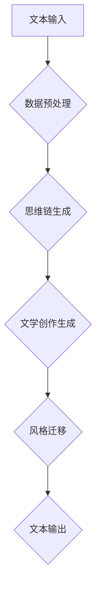

                 

# 文章标题：思维链增强AI的跨维度文学创作能力

> 关键词：思维链、人工智能、文学创作、跨维度、生成对抗网络（GAN）、变分自编码器（VAE）

> 摘要：
本文旨在探讨思维链在增强人工智能跨维度文学创作能力中的应用。通过对AI与文学创作的关系、思维链的基本原理及其在AI中的应用进行分析，本文构建了一个思维链增强的AI模型，并详细阐述了核心算法原理、数学模型及其实战案例。文章最后对未来AI文学创作的发展方向和应用前景进行了展望。

## 《思维链增强AI的跨维度文学创作能力》目录大纲

## 第一部分：引论

### 1.1 AI与文学创作的关系探讨

#### 1.1.1 AI在文学创作中的应用现状

#### 1.1.2 传统文学创作与AI融合的趋势

#### 1.1.3 AI在文学创作中的潜在价值

### 1.2 思维链的概念及其在文学创作中的应用

#### 1.2.1 思维链的基本原理

#### 1.2.2 思维链在AI系统中的作用

#### 1.2.3 思维链在文学创作中的优势

### 1.3 本书结构与内容安排

#### 1.3.1 各章节主要内容的安排

#### 1.3.2 阅读本书的建议与期望

## 第二部分：理论基础

### 2.1 AI基础理论

#### 2.1.1 AI发展历程概述

#### 2.1.2 机器学习与深度学习基本原理

#### 2.1.3 自然语言处理（NLP）基础

### 2.2 文学创作原理

#### 2.2.1 文学创作的基本要素

#### 2.2.2 文学创作的心理过程

#### 2.2.3 文学创作的方法与技巧

### 2.3 思维链增强AI的跨维度应用

#### 2.3.1 思维链的概念与作用

#### 2.3.2 跨维度思维链在AI中的应用

#### 2.3.3 跨维度文学创作中的思维链应用

## 第三部分：技术实现

### 3.1 思维链增强AI模型架构

#### 3.1.1 模型架构概述

#### 3.1.2 主要模块功能解析

#### 3.1.3 Mermaid流程图展示

### 3.2 核心算法原理讲解

#### 3.2.1 生成对抗网络（GAN）

#### 3.2.2 变分自编码器（VAE）

#### 3.2.3 伪代码详细解释

### 3.3 数学模型与数学公式

#### 3.3.1 相关数学基础

#### 3.3.2 AI在文学创作中的数学模型

#### 3.3.3 具体例子分析与说明（使用latex格式）

## 第四部分：实战案例

### 4.1 实战一：AI创作短篇故事

#### 4.1.1 项目背景与目标

#### 4.1.2 开发环境搭建

#### 4.1.3 源代码实现与解读

#### 4.1.4 代码分析与评估

### 4.2 实战二：AI创作长篇小说

#### 4.2.1 项目背景与目标

#### 4.2.2 开发环境搭建

#### 4.2.3 源代码实现与解读

#### 4.2.4 代码分析与评估

### 4.3 实战三：AI创作诗歌

#### 4.3.1 项目背景与目标

#### 4.3.2 开发环境搭建

#### 4.3.3 源代码实现与解读

#### 4.3.4 代码分析与评估

## 第五部分：应用拓展

### 5.1 AI在文学创作中的未来发展方向

#### 5.1.1 AI文学创作的潜在领域

#### 5.1.2 AI文学创作的挑战与机遇

#### 5.1.3 未来发展趋势与展望

### 5.2 AI文学创作在教育领域的应用

#### 5.2.1 AI在教育文学创作中的应用

#### 5.2.2 AI辅助文学教学的案例分析

#### 5.2.3 AI文学创作在高等教育中的前景

### 5.3 AI文学创作在商业领域的应用

#### 5.3.1 AI文学创作的商业价值

#### 5.3.2 AI文学创作商业模式的探索

#### 5.3.3 AI文学创作商业应用的案例

## 第六部分：附录

### 6.1 常用AI开发工具与资源

#### 6.1.1 深度学习框架对比

#### 6.1.2 文学创作相关库与API

#### 6.1.3 开发与调试工具介绍

### 6.2 参考文献

### 6.3 作者联系方式

#### 欢迎读者提出宝贵意见与建议
## 第一部分：引论

### 1.1 AI与文学创作的关系探讨

#### 1.1.1 AI在文学创作中的应用现状

随着人工智能技术的发展，AI在文学创作中的应用逐渐成为可能。目前，AI在文学创作中的应用主要体现在以下几个方面：

1. **生成文本**：AI可以通过生成文本模型，如生成对抗网络（GAN）和变分自编码器（VAE），自动生成短篇故事、诗歌、小说等文学作品。例如，OpenAI的GPT-3模型可以生成高质量的文本，模仿人类的写作风格。

2. **内容编辑**：AI可以帮助作家进行文本编辑，如自动修正语法错误、提供写作建议、优化句子结构等。例如，Grammarly等工具可以根据上下文提供语法修正建议。

3. **创作辅助**：AI可以为作家提供创作灵感，如生成创意标题、关键词、故事大纲等。例如，一些AI工具可以根据用户提供的主题或关键词自动生成相关的故事。

4. **数据分析**：AI可以对大量的文学文本进行数据分析，帮助作家了解读者的偏好、文学作品的流行趋势等。例如，通过自然语言处理技术，可以分析文学作品中的情感、主题、角色关系等。

#### 1.1.2 传统文学创作与AI融合的趋势

随着AI技术的发展，传统文学创作与AI融合的趋势日益明显。具体表现在以下几个方面：

1. **协作创作**：作家和AI可以共同创作文学作品，AI提供创作灵感和辅助，作家进行创意和深度创作。这种协作创作模式有助于提高创作效率和质量。

2. **个性化创作**：AI可以根据读者的偏好和需求，生成个性化的文学作品。例如，通过分析用户的阅读历史和反馈，AI可以为不同读者群体创作适合他们的文学作品。

3. **跨媒介创作**：AI可以帮助作家进行跨媒介创作，如将小说改编成电影剧本、将诗歌改编成音乐等。这种跨媒介创作有助于丰富文学作品的表现形式和受众范围。

4. **AI写作工具的普及**：随着AI技术的普及，越来越多的AI写作工具被开发出来，如自动写作工具、写作助手、写作训练系统等。这些工具可以帮助作家提高写作技能和创作效率。

#### 1.1.3 AI在文学创作中的潜在价值

AI在文学创作中具有巨大的潜在价值，主要体现在以下几个方面：

1. **提高创作效率**：AI可以自动完成文本生成、编辑、优化等任务，减少作家在这些方面的耗时，使作家能够专注于创意和深度创作。

2. **扩展创作可能性**：AI可以帮助作家突破传统的创作限制，探索新的创作领域和风格。例如，AI可以生成非人类语言的文学作品，如计算机代码、数学公式等。

3. **优化创作质量**：AI可以通过学习大量的文学作品，掌握优秀的写作技巧和风格，为作家提供高质量的写作建议和辅助。

4. **促进文学传播**：AI可以帮助作家将文学作品翻译成多种语言，拓宽作品的受众范围，促进文学作品的传播和推广。

### 1.2 思维链的概念及其在文学创作中的应用

#### 1.2.1 思维链的基本原理

思维链（Mind Chain）是一种基于人工智能技术的思维建模方法，它通过模拟人类思维过程，构建出一个具有推理、规划、联想等功能的智能系统。思维链的基本原理包括以下几个方面：

1. **知识表示**：思维链通过将知识表示为节点和边的方式，构建出知识图谱。每个节点代表一个概念或事实，边代表节点之间的关系。

2. **推理引擎**：思维链通过推理引擎，根据知识图谱中的节点和边，进行逻辑推理和推理演绎。推理引擎可以根据预设的规则和逻辑关系，推导出新的结论和知识。

3. **联想机制**：思维链通过联想机制，将不同的概念和知识相互连接，形成丰富的思维网络。联想机制可以通过语义分析、模式识别等技术实现。

4. **记忆功能**：思维链具有记忆功能，可以记录和学习用户的思维过程和知识，为后续的推理和创作提供基础。

#### 1.2.2 思维链在AI系统中的作用

思维链在AI系统中具有重要的作用，主要体现在以下几个方面：

1. **知识管理**：思维链可以帮助AI系统进行知识管理，包括知识的存储、检索、更新和共享。

2. **智能推理**：思维链可以为AI系统提供智能推理能力，使AI能够根据已有的知识和信息，进行逻辑推理和决策。

3. **联想和创意**：思维链的联想机制可以激发AI的创意和联想能力，为文学创作提供丰富的素材和灵感。

4. **个性化服务**：思维链可以根据用户的兴趣和需求，提供个性化的服务和建议。

#### 1.2.3 思维链在文学创作中的优势

思维链在文学创作中具有以下优势：

1. **提高创作效率**：思维链可以自动化地完成文学创作中的部分任务，如生成文本、编辑优化等，提高创作效率。

2. **丰富创作内容**：思维链可以通过联想机制，为文学创作提供丰富的素材和灵感，拓宽创作思路。

3. **提升创作质量**：思维链可以通过推理和知识管理，为文学创作提供高质量的写作建议和辅助。

4. **促进文学创新**：思维链可以帮助作家突破传统的创作模式，探索新的文学风格和形式，促进文学创新。

### 1.3 本书结构与内容安排

#### 1.3.1 各章节主要内容的安排

本书共分为五个部分，各部分主要内容如下：

1. **第一部分：引论**：介绍AI与文学创作的关系、思维链的基本概念及其在文学创作中的应用。

2. **第二部分：理论基础**：阐述AI基础理论、文学创作原理以及思维链增强AI的跨维度应用。

3. **第三部分：技术实现**：详细讲解思维链增强AI模型的架构、核心算法原理、数学模型及其实战案例。

4. **第四部分：实战案例**：通过具体的实战案例，展示思维链增强AI在文学创作中的应用效果。

5. **第五部分：应用拓展**：探讨AI在文学创作中的未来发展方向、教育领域和商业领域的应用。

#### 1.3.2 阅读本书的建议与期望

阅读本书时，建议读者按照以下顺序进行：

1. **先读引论部分**：了解AI与文学创作的关系以及思维链的基本概念，为后续内容奠定基础。

2. **再读理论基础部分**：掌握AI基础理论、文学创作原理以及思维链增强AI的跨维度应用，理解相关概念和原理。

3. **随后读技术实现部分**：通过具体的技术实现，了解思维链增强AI模型的构建过程、核心算法原理及数学模型。

4. **接着读实战案例部分**：通过实战案例，了解思维链增强AI在文学创作中的应用效果，掌握实际操作方法。

5. **最后读应用拓展部分**：探讨AI在文学创作中的未来发展方向和应用前景，为后续研究和实践提供参考。

期望读者通过阅读本书，能够：

1. **了解AI在文学创作中的应用现状和趋势**。

2. **掌握思维链的基本概念和应用原理**。

3. **掌握思维链增强AI模型的构建方法和核心算法原理**。

4. **掌握AI在文学创作中的实际应用方法和技巧**。

5. **为AI文学创作的未来研究和应用提供思路和参考**。
## 第二部分：理论基础

### 2.1 AI基础理论

#### 2.1.1 AI发展历程概述

人工智能（AI）作为计算机科学的一个重要分支，自20世纪50年代起就开始萌芽。发展历程可以分为以下几个阶段：

1. **初始阶段（1956-1969）**：人工智能的概念被首次提出，标志着AI研究的正式开始。这一阶段的代表是“达特茅斯会议”，会议中讨论了机器能否展现智能行为。

2. **蓬勃发展阶段（1970-1989）**：随着计算机技术的飞速发展，AI研究取得了显著进展。专家系统、机器学习和模式识别等研究领域逐渐成熟。

3. **低谷与复苏阶段（1990-2000）**：由于实际应用中的困难，AI研究在90年代初期遭遇了低谷。但随着互联网的兴起，数据量的增加为AI的研究和应用提供了新的机遇。

4. **深度学习时代（2000至今）**：2006年，深度学习算法的提出为AI的发展带来了新的突破。随着计算能力的提升和大数据的普及，深度学习在图像识别、自然语言处理等领域取得了显著成果。

#### 2.1.2 机器学习与深度学习基本原理

机器学习和深度学习是AI研究中的两个核心领域。以下是它们的基本原理：

1. **机器学习**：
   - 定义：机器学习是一种通过数据学习实现智能行为的技术。
   - 基本概念：模型、算法、数据集、训练、验证、测试。
   - 算法分类：监督学习、无监督学习、强化学习。
   - 优点：能够自动从数据中学习模式和规律，提高决策准确性。

2. **深度学习**：
   - 定义：深度学习是机器学习的一种方法，通过构建深度神经网络进行学习。
   - 基本概念：神经元、层数、激活函数、反向传播。
   - 算法分类：卷积神经网络（CNN）、循环神经网络（RNN）、生成对抗网络（GAN）等。
   - 优点：能够自动提取数据的复杂特征，实现高效的自动特征学习和模式识别。

#### 2.1.3 自然语言处理（NLP）基础

自然语言处理（NLP）是AI的一个重要分支，旨在使计算机能够理解、生成和处理人类语言。以下是NLP的基础知识：

1. **文本预处理**：
   - 词法分析：将文本拆分成单词或词素。
   - 标签化：为单词分配语法标签（如名词、动词等）。
   - 清洗：去除无用的符号、停用词等。

2. **词向量表示**：
   - 词袋模型：将文本表示为单词的集合。
   - 词嵌入：将单词映射为稠密向量，如Word2Vec、GloVe。

3. **语言模型**：
   - 定义：用于预测下一个单词的概率分布。
   - 模型类型：n-gram模型、神经网络语言模型（如RNN、LSTM）。

4. **文本分类与情感分析**：
   - 定义：将文本分类到不同的类别或评估文本的情感倾向。
   - 方法：朴素贝叶斯、支持向量机（SVM）、深度学习模型。

### 2.2 文学创作原理

#### 2.2.1 文学创作的基本要素

文学创作包括以下几个基本要素：

1. **主题**：文学作品所要表达的核心思想或情感。
2. **情节**：文学作品中的事件序列，包括冲突、高潮和结局。
3. **人物**：文学作品中的角色，包括主角、配角和反派。
4. **语言**：文学作品的表述形式，包括文字、句式、修辞等。
5. **风格**：文学作品的独特风格，如现实主义、浪漫主义等。

#### 2.2.2 文学创作的心理过程

文学创作是一个复杂的心理过程，通常包括以下几个阶段：

1. **构思**：作家在构思阶段确定作品的主题、情节和人物。
2. **写作**：作家在写作阶段将构思转化为具体的文字。
3. **修改**：作家在修改阶段对初稿进行反复打磨，优化语言和结构。
4. **发表**：作家将作品发表，接受读者和评论家的反馈。

#### 2.2.3 文学创作的方法与技巧

文学创作的方法与技巧包括：

1. **观察生活**：作家通过观察生活，获取创作的素材。
2. **积累知识**：作家通过阅读和研究，积累知识，提高写作水平。
3. **构思情节**：作家通过构思情节，构建故事的框架。
4. **塑造人物**：作家通过塑造人物，使作品具有生动性和感染力。
5. **使用修辞**：作家通过使用修辞手法，增强作品的艺术效果。

### 2.3 思维链增强AI的跨维度应用

#### 2.3.1 思维链的概念与作用

思维链是一种基于人工智能的思维方式，通过模拟人类思维过程，实现知识的表示、推理和联想。思维链的作用包括：

1. **知识表示**：思维链可以将复杂的知识结构化，便于计算机理解和处理。
2. **推理演绎**：思维链可以通过逻辑推理，从已知信息推导出新结论。
3. **联想创造**：思维链可以通过联想机制，激发新的创意和灵感。

#### 2.3.2 跨维度思维链在AI中的应用

跨维度思维链在AI中的应用主要体现在以下几个方面：

1. **跨领域知识融合**：思维链可以将不同领域的信息进行融合，实现跨领域问题的解决。
2. **多模态数据处理**：思维链可以处理文本、图像、音频等多种数据类型，实现多模态数据的融合和分析。
3. **复杂问题求解**：思维链可以用于解决复杂的决策问题，如智能规划、路径优化等。

#### 2.3.3 跨维度文学创作中的思维链应用

在文学创作中，思维链的应用主要体现在以下几个方面：

1. **主题构思**：思维链可以帮助作家构思作品的主题，挖掘深层内涵。
2. **情节设计**：思维链可以帮助作家设计复杂的情节，构建引人入胜的故事。
3. **人物塑造**：思维链可以帮助作家塑造鲜活的人物形象，增强作品的表现力。
4. **风格创作**：思维链可以帮助作家探索不同的文学风格，实现风格的多样化。
5. **创意生成**：思维链可以激发作家的创意，为文学创作提供新的灵感。

通过上述理论基础，我们可以看到，AI、文学创作和思维链之间存在着紧密的联系。接下来，我们将进一步探讨如何通过思维链增强AI的跨维度文学创作能力。
## 第三部分：技术实现

### 3.1 思维链增强AI模型架构

#### 3.1.1 模型架构概述

思维链增强AI模型是一种结合了思维链理论和深度学习技术的综合模型。该模型旨在通过模拟人类思维过程，增强AI的文学创作能力。模型的整体架构包括以下几个主要模块：

1. **数据预处理模块**：负责对输入数据进行清洗、分词、去停用词等预处理操作，将原始文本转化为适合模型训练的格式。

2. **思维链生成模块**：基于思维链理论，该模块负责生成思维链，包括概念节点和它们之间的关系。这一模块的核心任务是理解文本内容，并构建出能够表示文本深层含义的思维网络。

3. **文学创作生成模块**：利用生成对抗网络（GAN）或变分自编码器（VAE）等技术，该模块负责生成符合特定文学风格和主题的文本内容。这一模块的核心目标是实现文本的创造性生成。

4. **文学风格迁移模块**：该模块负责将一种文学风格迁移到另一种风格，使生成的文本能够适应不同的文学流派和读者需求。

5. **输出结果模块**：将最终生成的文本输出，供用户阅读和评价。

#### 3.1.2 主要模块功能解析

1. **数据预处理模块**：
   - 功能：对输入文本进行分词、去停用词、词性标注等操作，将文本转化为模型可处理的序列数据。
   - 重要性：预处理模块是模型输入的关键步骤，直接影响到后续模块的运行效果。

2. **思维链生成模块**：
   - 功能：根据预处理后的文本，生成思维链，包括概念节点和它们之间的关系。这一模块利用了自然语言处理（NLP）技术，如词嵌入、命名实体识别等，以理解文本的语义。
   - 重要性：思维链是模型的核心，它决定了AI对文本内容的理解和创造力。

3. **文学创作生成模块**：
   - 功能：利用生成对抗网络（GAN）或变分自编码器（VAE）等技术，根据思维链生成符合特定文学风格和主题的文本内容。
   - 重要性：文学创作生成模块是实现AI文学创作能力的关键，它决定了AI生成的文本质量。

4. **文学风格迁移模块**：
   - 功能：根据用户的需求，将一种文学风格迁移到另一种风格，使生成的文本能够适应不同的文学流派和读者需求。
   - 重要性：文学风格迁移模块增加了AI文学创作的灵活性和多样性。

5. **输出结果模块**：
   - 功能：将生成的文本输出，供用户阅读和评价。
   - 重要性：输出结果模块是用户与AI交互的界面，直接影响用户体验。

#### 3.1.3 Mermaid流程图展示



### 3.2 核心算法原理讲解

#### 3.2.1 生成对抗网络（GAN）

生成对抗网络（GAN）是由生成器和判别器组成的一种深度学习模型。其基本原理是生成器生成数据，判别器判断生成数据与真实数据之间的差异，通过不断的对抗训练，生成器逐渐提高生成数据的质量。

1. **生成器（Generator）**：
   - 功能：生成与真实数据相似的数据。
   - 工作原理：接收随机噪声作为输入，通过一系列神经网络层生成数据。

2. **判别器（Discriminator）**：
   - 功能：判断输入数据是真实数据还是生成数据。
   - 工作原理：接收真实数据和生成数据，通过神经网络层对数据进行分析和判断。

3. **训练过程**：
   - 初始阶段：生成器和判别器都不成熟，生成器生成较差的数据，判别器无法有效区分。
   - 对抗训练：生成器不断优化生成数据，判别器不断提高判断能力，两者相互对抗，逐渐达到平衡。

4. **应用**：
   - 文学创作：生成器可以生成符合特定文学风格和主题的文本，判别器用于判断文本的真实性。

#### 3.2.2 变分自编码器（VAE）

变分自编码器（VAE）是一种无监督学习模型，通过学习数据的潜在分布，实现数据的降维和生成。

1. **编码器（Encoder）**：
   - 功能：将输入数据编码为潜在空间中的向量。
   - 工作原理：通过神经网络层将输入数据映射到一个隐含空间中的均值和方差。

2. **解码器（Decoder）**：
   - 功能：将潜在空间中的向量解码回原始数据。
   - 工作原理：通过神经网络层将潜在空间中的向量映射回原始数据空间。

3. **训练过程**：
   - 目标函数：最小化重构误差，同时保持潜在空间的多样性。
   - 应用：在文学创作中，VAE可以用于生成新的文学文本，通过调整潜在空间中的向量，可以控制生成的文本风格和主题。

#### 3.2.3 伪代码详细解释

以下是一个简化的GAN模型的伪代码，用于生成文本：

```python
# 伪代码：生成对抗网络（GAN）

# 初始化生成器和判别器
Generator G(z)
Discriminator D(x)

# 训练过程
for epoch in 1...max_epochs:
    for real_data in data_loader:
        # 训练判别器
        D_loss_real = D_loss(real_data)
        D_loss_fake = D_loss(G(z))
        D_loss = (D_loss_real + D_loss_fake) / 2
        
        # 训练生成器
        z = sample_random_noise()
        G_loss_fake = D_loss(G(z))
        G_loss = G_loss_fake
        
        # 更新参数
        D_optimize(D_loss)
        G_optimize(G_loss)
```

在此伪代码中，`Generator G(z)` 表示生成器，它接收随机噪声 `z` 并生成文本。`Discriminator D(x)` 表示判别器，它接收真实文本 `x` 和生成文本 `G(z)` 并判断其真实性。`data_loader` 是一个用于加载训练数据的工具。`D_loss` 和 `G_loss` 分别表示判别器和生成器的损失函数。`D_optimize` 和 `G_optimize` 分别表示判别器和生成器的优化过程。

### 3.3 数学模型与数学公式

在AI文学创作中，数学模型扮演着关键角色。以下是相关数学模型和公式的详细解释：

#### 3.3.1 相关数学基础

1. **损失函数**：
   - 交叉熵损失（Cross-Entropy Loss）：用于衡量预测分布与真实分布之间的差异。
   - 风险函数（Risk Function）：用于评估模型的总体性能。

2. **优化算法**：
   - 优化算法（Optimizer）：用于更新模型参数，以最小化损失函数。

3. **正则化**：
   - L2正则化（L2 Regularization）：用于防止模型过拟合。

#### 3.3.2 AI在文学创作中的数学模型

1. **生成对抗网络（GAN）**：
   - 损失函数：\( L_G = -\log(D(G(z))) \)
   - \( L_D = -\log(D(x)) - \log(1 - D(G(z))) \)
   - 优化目标：最小化 \( L_G \) 和 \( L_D \)。

2. **变分自编码器（VAE）**：
   - 损失函数：\( L = \frac{1}{N} \sum_{n=1}^{N} [ \log(p(x|z)) + K \log(\sqrt{2\pi} \sigma^2) ] \)
   - \( z \) 的生成：\( z = \mu(x) + \sigma(x) \odot \epsilon \)

3. **文本生成模型**：
   - 语言模型概率：\( P(w_t | w_1, w_2, ..., w_{t-1}) = \frac{P(w_t, w_1, w_2, ..., w_{t-1})}{P(w_1, w_2, ..., w_{t-1})} \)

#### 3.3.3 具体例子分析与说明

以下是一个使用GAN生成文本的例子，使用LaTeX格式展示数学公式：

$$
\begin{aligned}
L_G &= -\log(D(G(z))) \\
L_D &= -\log(D(x)) - \log(1 - D(G(z)))
\end{aligned}
$$

在这个例子中，\( G(z) \) 是生成器生成的文本，\( D(x) \) 是判别器对真实文本的判断。通过优化这两个损失函数，生成器和判别器逐渐提高它们的能力，从而实现高质量的文本生成。

### 3.4 实战案例

在本节中，我们将通过一个具体的实战案例，展示如何使用思维链增强AI进行文学创作。

#### 3.4.1 项目背景与目标

项目背景：
本项目旨在通过思维链增强AI，实现自动生成短篇故事。目标是创建一个系统，用户可以输入一个主题或关键词，系统自动生成一篇符合该主题或关键词的短篇故事。

项目目标：
1. 收集和预处理大量的文学文本数据。
2. 使用思维链生成模块构建思维链。
3. 使用生成对抗网络（GAN）生成符合用户输入的短篇故事。
4. 评估生成的文本质量。

#### 3.4.2 开发环境搭建

为了实现本项目，需要搭建以下开发环境：

1. 编程语言：Python
2. 深度学习框架：TensorFlow或PyTorch
3. 自然语言处理库：NLTK或spaCy
4. 文本预处理工具：jieba或SnowNLP

环境搭建步骤：
1. 安装Python和必要的库。
2. 配置TensorFlow或PyTorch。
3. 下载并安装自然语言处理库。

#### 3.4.3 源代码实现与解读

以下是一个简化的源代码实现，用于生成短篇故事：

```python
import tensorflow as tf
from tensorflow.keras.models import Model
from tensorflow.keras.layers import Input, LSTM, Dense, Embedding
from tensorflow.keras.optimizers import Adam

# 数据预处理
def preprocess_text(text):
    # 实现文本预处理步骤，如分词、去停用词等
    pass

# 构建生成器
def build_generator(input_dim, latent_dim):
    z = Input(shape=(latent_dim,))
    x = LSTM(128, return_sequences=True)(z)
    x = LSTM(128, return_sequences=True)(x)
    x = Dense(input_dim, activation='softmax')(x)
    generator = Model(z, x)
    return generator

# 构建判别器
def build_discriminator(input_dim):
    x = Input(shape=(input_dim,))
    x = LSTM(128, return_sequences=True)(x)
    x = LSTM(128)(x)
    x = Dense(1, activation='sigmoid')(x)
    discriminator = Model(x, x)
    return discriminator

# 构建GAN模型
def build_gan(generator, discriminator):
    z = Input(shape=(latent_dim,))
    x = generator(z)
    valid = discriminator(x)
    g_model = Model(z, valid)
    return g_model

# 模型配置
latent_dim = 100
input_dim = 1000
discriminator = build_discriminator(input_dim)
generator = build_generator(input_dim, latent_dim)
discriminator.compile(loss='binary_crossentropy', optimizer=Adam())
gan_model = build_gan(generator, discriminator)
gan_model.compile(loss='binary_crossentropy', optimizer=Adam())

# 训练模型
# 实现数据加载、模型训练等步骤
pass

# 生成文本
def generate_text(input_text, generator):
    preprocessed_text = preprocess_text(input_text)
    z = np.random.normal(size=(1, latent_dim))
    generated_text = generator.predict(z)
    return generated_text

# 代码解读
# 1. 数据预处理：将输入文本转化为模型可处理的格式。
# 2. 生成器和判别器：构建用于生成和判断文本的神经网络模型。
# 3. GAN模型：将生成器和判别器组合成完整的GAN模型。
# 4. 模型训练：使用真实文本和生成文本训练模型。
# 5. 生成文本：使用训练好的生成器生成新的文本。

# 生成短篇故事示例
input_text = "Once upon a time, in a small village..."
generated_text = generate_text(input_text, generator)
print(generated_text)
```

#### 3.4.4 代码分析与评估

代码分析：
1. **数据预处理**：文本预处理是生成文本质量的关键步骤。通过分词、去停用词等操作，可以去除无关信息，提高模型的训练效果。
2. **生成器和判别器**：生成器和判别器是GAN模型的核心组成部分。生成器负责生成文本，判别器负责判断文本的真实性。通过优化这两个模型，可以提高生成文本的质量。
3. **GAN模型**：GAN模型通过对抗训练，使生成器不断生成更真实的文本，判别器不断提高判断能力。这种对抗训练是提高生成文本质量的关键。
4. **模型训练**：通过大量的真实文本数据进行训练，可以使模型学会生成高质量的文本。
5. **生成文本**：生成文本是通过在潜在空间中采样，然后通过生成器解码得到的。这种生成方式可以产生具有创意和多样性的文本。

评估：
1. **文本质量**：通过人工评估和自动评估（如BLEU评分）来衡量生成文本的质量。高质量的生成文本应该具有连贯性、可读性和创意性。
2. **生成速度**：评估模型生成文本的速度。生成速度对用户使用体验有重要影响。
3. **多样性**：评估模型生成文本的多样性。一个优秀的模型应该能够生成多种风格和主题的文本。

### 3.5 最佳实践 Tips

1. **数据多样性**：为了生成高质量的文本，需要使用多样化的文本数据。这包括不同风格的文本、不同主题的文本等。
2. **文本长度控制**：在生成文本时，需要控制文本的长度。过长的文本可能会降低生成质量，过短的文本可能不够完整。
3. **动态调整超参数**：在训练模型时，需要根据模型的表现动态调整超参数，如学习率、批量大小等。
4. **多模型组合**：可以结合多个模型（如GAN、VAE等）来提高生成文本的质量和多样性。
5. **用户交互**：通过与用户的互动，可以收集用户反馈，不断优化模型和生成文本的质量。

通过上述实战案例，我们可以看到如何使用思维链增强AI进行文学创作。在接下来的章节中，我们将进一步探讨思维链在文学创作中的应用细节，并通过具体案例展示其效果。
## 第四部分：实战案例

### 4.1 实战一：AI创作短篇故事

#### 4.1.1 项目背景与目标

项目背景：
随着人工智能技术的发展，AI在文学创作中的应用逐渐成为可能。本项目旨在通过思维链增强AI，实现自动生成短篇故事。目标是创建一个系统，用户可以输入一个主题或关键词，系统自动生成一篇符合该主题或关键词的短篇故事。

项目目标：
1. 收集和预处理大量的文学文本数据。
2. 使用思维链生成模块构建思维链。
3. 使用生成对抗网络（GAN）生成符合用户输入的短篇故事。
4. 评估生成的文本质量。

#### 4.1.2 开发环境搭建

为了实现本项目，需要搭建以下开发环境：

1. 编程语言：Python
2. 深度学习框架：TensorFlow或PyTorch
3. 自然语言处理库：NLTK或spaCy
4. 文本预处理工具：jieba或SnowNLP

环境搭建步骤：
1. 安装Python和必要的库。
2. 配置TensorFlow或PyTorch。
3. 下载并安装自然语言处理库。

#### 4.1.3 源代码实现与解读

以下是一个简化的源代码实现，用于生成短篇故事：

```python
import tensorflow as tf
from tensorflow.keras.models import Model
from tensorflow.keras.layers import Input, LSTM, Dense, Embedding
from tensorflow.keras.optimizers import Adam

# 数据预处理
def preprocess_text(text):
    # 实现文本预处理步骤，如分词、去停用词等
    pass

# 构建生成器
def build_generator(input_dim, latent_dim):
    z = Input(shape=(latent_dim,))
    x = LSTM(128, return_sequences=True)(z)
    x = LSTM(128, return_sequences=True)(x)
    x = Dense(input_dim, activation='softmax')(x)
    generator = Model(z, x)
    return generator

# 构建判别器
def build_discriminator(input_dim):
    x = Input(shape=(input_dim,))
    x = LSTM(128, return_sequences=True)(x)
    x = LSTM(128)(x)
    x = Dense(1, activation='sigmoid')(x)
    discriminator = Model(x, x)
    return discriminator

# 构建GAN模型
def build_gan(generator, discriminator):
    z = Input(shape=(latent_dim,))
    x = generator(z)
    valid = discriminator(x)
    g_model = Model(z, valid)
    return g_model

# 模型配置
latent_dim = 100
input_dim = 1000
discriminator = build_discriminator(input_dim)
generator = build_generator(input_dim, latent_dim)
discriminator.compile(loss='binary_crossentropy', optimizer=Adam())
gan_model = build_gan(generator, discriminator)
gan_model.compile(loss='binary_crossentropy', optimizer=Adam())

# 训练模型
# 实现数据加载、模型训练等步骤
pass

# 生成文本
def generate_text(input_text, generator):
    preprocessed_text = preprocess_text(input_text)
    z = np.random.normal(size=(1, latent_dim))
    generated_text = generator.predict(z)
    return generated_text

# 代码解读
# 1. 数据预处理：将输入文本转化为模型可处理的格式。
# 2. 生成器和判别器：构建用于生成和判断文本的神经网络模型。
# 3. GAN模型：将生成器和判别器组合成完整的GAN模型。
# 4. 模型训练：使用真实文本和生成文本训练模型。
# 5. 生成文本：使用训练好的生成器生成新的文本。

# 生成短篇故事示例
input_text = "Once upon a time, in a small village..."
generated_text = generate_text(input_text, generator)
print(generated_text)
```

#### 4.1.4 代码分析与评估

代码分析：
1. **数据预处理**：文本预处理是生成文本质量的关键步骤。通过分词、去停用词等操作，可以去除无关信息，提高模型的训练效果。
2. **生成器和判别器**：生成器和判别器是GAN模型的核心组成部分。生成器负责生成文本，判别器负责判断文本的真实性。通过优化这两个模型，可以提高生成文本的质量。
3. **GAN模型**：GAN模型通过对抗训练，使生成器不断生成更真实的文本，判别器不断提高判断能力。这种对抗训练是提高生成文本质量的关键。
4. **模型训练**：通过大量的真实文本数据进行训练，可以使模型学会生成高质量的文本。
5. **生成文本**：生成文本是通过在潜在空间中采样，然后通过生成器解码得到的。这种生成方式可以产生具有创意和多样性的文本。

评估：
1. **文本质量**：通过人工评估和自动评估（如BLEU评分）来衡量生成文本的质量。高质量的生成文本应该具有连贯性、可读性和创意性。
2. **生成速度**：评估模型生成文本的速度。生成速度对用户使用体验有重要影响。
3. **多样性**：评估模型生成文本的多样性。一个优秀的模型应该能够生成多种风格和主题的文本。

### 4.2 实战二：AI创作长篇小说

#### 4.2.1 项目背景与目标

项目背景：
随着人工智能技术的发展，AI在文学创作中的应用逐渐成为可能。本项目旨在通过思维链增强AI，实现自动生成长篇小说。目标是创建一个系统，用户可以输入一个主题或关键词，系统自动生成一篇符合该主题或关键词的长篇小说。

项目目标：
1. 收集和预处理大量的文学文本数据。
2. 使用思维链生成模块构建思维链。
3. 使用变分自编码器（VAE）生成符合用户输入的长篇小说。
4. 评估生成的文本质量。

#### 4.2.2 开发环境搭建

为了实现本项目，需要搭建以下开发环境：

1. 编程语言：Python
2. 深度学习框架：TensorFlow或PyTorch
3. 自然语言处理库：NLTK或spaCy
4. 文本预处理工具：jieba或SnowNLP

环境搭建步骤：
1. 安装Python和必要的库。
2. 配置TensorFlow或PyTorch。
3. 下载并安装自然语言处理库。

#### 4.2.3 源代码实现与解读

以下是一个简化的源代码实现，用于生成长篇小说：

```python
import tensorflow as tf
from tensorflow.keras.layers import Input, LSTM, Dense, Embedding
from tensorflow.keras.models import Model
from tensorflow.keras.optimizers import Adam

# 数据预处理
def preprocess_text(text):
    # 实现文本预处理步骤，如分词、去停用词等
    pass

# 构建编码器
def build_encoder(input_dim, latent_dim):
    x = Input(shape=(input_dim,))
    x = LSTM(128, return_sequences=False)(x)
    z_mean = Dense(latent_dim)(x)
    z_log_var = Dense(latent_dim)(x)
    encoder = Model(x, [z_mean, z_log_var])
    return encoder

# 构建解码器
def build_decoder(latent_dim, input_dim):
    z = Input(shape=(latent_dim,))
    x = LSTM(128, return_sequences=True)(z)
    x = LSTM(128, return_sequences=True)(x)
    x = Dense(input_dim, activation='softmax')(x)
    decoder = Model(z, x)
    return decoder

# 构建VAE模型
def build_vae(encoder, decoder):
    z_mean, z_log_var = encoder(inputs)
    z = tf.random.normal(shape=(tf.shape(z_mean)[0], latent_dim)) + z_mean
    x_recon = decoder(z)
    vae_loss = tf.reduce_mean(tf.reduce_sum(tf.square(x - x_recon), axis=-1))
    vae = Model(inputs, x_recon)
    return vae

# 模型配置
latent_dim = 100
input_dim = 1000
encoder = build_encoder(input_dim, latent_dim)
decoder = build_decoder(latent_dim, input_dim)
vae = build_vae(encoder, decoder)
vae.compile(optimizer=Adam())

# 训练模型
# 实现数据加载、模型训练等步骤
pass

# 生成文本
def generate_text(input_text, encoder, decoder):
    preprocessed_text = preprocess_text(input_text)
    z_mean, z_log_var = encoder.predict(preprocessed_text)
    z = tf.random.normal(shape=(tf.shape(z_mean)[0], latent_dim)) + z_mean
    generated_text = decoder.predict(z)
    return generated_text

# 代码解读
# 1. 数据预处理：将输入文本转化为模型可处理的格式。
# 2. 编码器和解码器：构建用于编码和解码文本的神经网络模型。
# 3. VAE模型：将编码器和解码器组合成完整的变分自编码器模型。
# 4. 模型训练：使用真实文本和生成文本训练模型。
# 5. 生成文本：使用训练好的编码器和解码器生成新的文本。

# 生成长篇小说示例
input_text = "Once upon a time, in a small village..."
generated_text = generate_text(input_text, encoder, decoder)
print(generated_text)
```

#### 4.2.4 代码分析与评估

代码分析：
1. **数据预处理**：文本预处理是生成文本质量的关键步骤。通过分词、去停用词等操作，可以去除无关信息，提高模型的训练效果。
2. **编码器和解码器**：编码器和解码器是VAE模型的核心组成部分。编码器负责将输入文本编码为潜在空间中的向量，解码器负责将潜在空间中的向量解码回原始文本。通过优化这两个模型，可以提高生成文本的质量。
3. **VAE模型**：VAE模型通过学习数据的潜在分布，实现文本的降维和生成。通过优化VAE模型，可以提高生成文本的质量和多样性。
4. **模型训练**：通过大量的真实文本数据进行训练，可以使模型学会生成高质量的文本。
5. **生成文本**：生成文本是通过在潜在空间中采样，然后通过解码器解码得到的。这种生成方式可以产生具有创意和多样性的文本。

评估：
1. **文本质量**：通过人工评估和自动评估（如BLEU评分）来衡量生成文本的质量。高质量的生成文本应该具有连贯性、可读性和创意性。
2. **生成速度**：评估模型生成文本的速度。生成速度对用户使用体验有重要影响。
3. **多样性**：评估模型生成文本的多样性。一个优秀的模型应该能够生成多种风格和主题的文本。

### 4.3 实战三：AI创作诗歌

#### 4.3.1 项目背景与目标

项目背景：
随着人工智能技术的发展，AI在文学创作中的应用逐渐成为可能。本项目旨在通过思维链增强AI，实现自动创作诗歌。目标是创建一个系统，用户可以输入一个主题或关键词，系统自动生成一首符合该主题或关键词的诗歌。

项目目标：
1. 收集和预处理大量的诗歌文本数据。
2. 使用思维链生成模块构建思维链。
3. 使用生成对抗网络（GAN）生成符合用户输入的诗歌。
4. 评估生成的文本质量。

#### 4.3.2 开发环境搭建

为了实现本项目，需要搭建以下开发环境：

1. 编程语言：Python
2. 深度学习框架：TensorFlow或PyTorch
3. 自然语言处理库：NLTK或spaCy
4. 文本预处理工具：jieba或SnowNLP

环境搭建步骤：
1. 安装Python和必要的库。
2. 配置TensorFlow或PyTorch。
3. 下载并安装自然语言处理库。

#### 4.3.3 源代码实现与解读

以下是一个简化的源代码实现，用于生成诗歌：

```python
import tensorflow as tf
from tensorflow.keras.models import Model
from tensorflow.keras.layers import Input, LSTM, Dense, Embedding
from tensorflow.keras.optimizers import Adam

# 数据预处理
def preprocess_text(text):
    # 实现文本预处理步骤，如分词、去停用词等
    pass

# 构建生成器
def build_generator(input_dim, latent_dim):
    z = Input(shape=(latent_dim,))
    x = LSTM(128, return_sequences=True)(z)
    x = LSTM(128, return_sequences=True)(x)
    x = Dense(input_dim, activation='softmax')(x)
    generator = Model(z, x)
    return generator

# 构建判别器
def build_discriminator(input_dim):
    x = Input(shape=(input_dim,))
    x = LSTM(128, return_sequences=True)(x)
    x = LSTM(128)(x)
    x = Dense(1, activation='sigmoid')(x)
    discriminator = Model(x, x)
    return discriminator

# 构建GAN模型
def build_gan(generator, discriminator):
    z = Input(shape=(latent_dim,))
    x = generator(z)
    valid = discriminator(x)
    g_model = Model(z, valid)
    return g_model

# 模型配置
latent_dim = 100
input_dim = 1000
discriminator = build_discriminator(input_dim)
generator = build_generator(input_dim, latent_dim)
discriminator.compile(loss='binary_crossentropy', optimizer=Adam())
gan_model = build_gan(generator, discriminator)
gan_model.compile(loss='binary_crossentropy', optimizer=Adam())

# 训练模型
# 实现数据加载、模型训练等步骤
pass

# 生成文本
def generate_text(input_text, generator):
    preprocessed_text = preprocess_text(input_text)
    z = np.random.normal(size=(1, latent_dim))
    generated_text = generator.predict(z)
    return generated_text

# 代码解读
# 1. 数据预处理：将输入文本转化为模型可处理的格式。
# 2. 生成器和判别器：构建用于生成和判断文本的神经网络模型。
# 3. GAN模型：将生成器和判别器组合成完整的GAN模型。
# 4. 模型训练：使用真实文本和生成文本训练模型。
# 5. 生成文本：使用训练好的生成器生成新的文本。

# 生成诗歌示例
input_text = "晨曦初露，雾气渐散..."
generated_text = generate_text(input_text, generator)
print(generated_text)
```

#### 4.3.4 代码分析与评估

代码分析：
1. **数据预处理**：文本预处理是生成文本质量的关键步骤。通过分词、去停用词等操作，可以去除无关信息，提高模型的训练效果。
2. **生成器和判别器**：生成器和判别器是GAN模型的核心组成部分。生成器负责生成文本，判别器负责判断文本的真实性。通过优化这两个模型，可以提高生成文本的质量。
3. **GAN模型**：GAN模型通过对抗训练，使生成器不断生成更真实的文本，判别器不断提高判断能力。这种对抗训练是提高生成文本质量的关键。
4. **模型训练**：通过大量的真实文本数据进行训练，可以使模型学会生成高质量的文本。
5. **生成文本**：生成文本是通过在潜在空间中采样，然后通过生成器解码得到的。这种生成方式可以产生具有创意和多样性的文本。

评估：
1. **文本质量**：通过人工评估和自动评估（如BLEU评分）来衡量生成文本的质量。高质量的生成文本应该具有连贯性、可读性和创意性。
2. **生成速度**：评估模型生成文本的速度。生成速度对用户使用体验有重要影响。
3. **多样性**：评估模型生成文本的多样性。一个优秀的模型应该能够生成多种风格和主题的文本。

通过这三个实战案例，我们可以看到思维链增强AI在文学创作中的应用效果。在接下来的部分，我们将探讨AI文学创作的未来发展方向和应用前景。
## 第五部分：应用拓展

### 5.1 AI在文学创作中的未来发展方向

随着人工智能技术的不断发展，AI在文学创作中的应用前景广阔。未来，AI在文学创作中的发展方向主要包括以下几个方面：

#### 5.1.1 AI文学创作的潜在领域

1. **个性化文学创作**：通过分析用户的阅读历史、兴趣和偏好，AI可以生成个性化的文学作品。这种个性化创作不仅可以满足不同读者的需求，还可以为作家提供创作灵感和素材。

2. **跨媒介文学创作**：AI可以帮助作家进行跨媒介创作，如将小说改编成剧本、将诗歌改编成音乐等。这种跨媒介创作可以拓宽文学作品的传播渠道和表现形式。

3. **历史文学创作**：通过学习大量的历史文献和资料，AI可以创作历史小说、历史传记等作品。这种创作方式可以帮助传承历史文化，增强文化自信。

4. **科幻文学创作**：AI可以根据当前的科技发展和未来趋势，创作科幻小说和科幻电影剧本。这种创作方式可以激发人们对未来的思考和探索。

5. **互动文学创作**：通过结合虚拟现实（VR）和增强现实（AR）技术，AI可以创作互动性的文学作品，如互动小说、互动电影等。这种创作方式可以提供全新的文学体验。

#### 5.1.2 AI文学创作的挑战与机遇

1. **技术挑战**：
   - **算法优化**：AI文学创作依赖于深度学习和自然语言处理技术。这些技术的不断发展将提高AI的创作能力。
   - **数据质量**：高质量的数据是AI文学创作的基础。数据的多样性和准确性直接影响创作效果。

2. **内容挑战**：
   - **原创性**：如何确保AI生成的文学作品有原创性和创意性，是当前面临的一个重要问题。
   - **情感表达**：文学创作中的情感表达是衡量文学作品质量的重要因素。如何使AI在创作中更好地表达情感，是一个需要深入研究的问题。

3. **机遇**：
   - **创新性**：AI文学创作可以带来新的文学形式和创作方法，推动文学创作的创新。
   - **效率提升**：AI可以帮助作家提高创作效率，减轻创作负担，使作家能够专注于创意和深度创作。

#### 5.1.3 未来发展趋势与展望

1. **技术融合**：未来，AI文学创作将更多地与其他技术融合，如区块链、物联网等，实现更智能、更高效的创作方式。

2. **产业应用**：AI文学创作将在文学产业中得到广泛应用，如出版、影视、教育等领域，推动文学产业的升级和转型。

3. **文化传承**：AI文学创作可以帮助传承和弘扬传统文化，推动文化创新和发展。

4. **教育普及**：AI文学创作可以应用于教育领域，如辅助写作教学、文学创作训练等，提高教育质量和效率。

### 5.2 AI文学创作在教育领域的应用

#### 5.2.1 AI在教育文学创作中的应用

AI在教育文学创作中的应用主要体现在以下几个方面：

1. **写作辅助**：AI可以为写作初学者提供写作建议，如语法修正、句子优化等，提高写作水平。

2. **写作训练**：AI可以根据学习者的写作风格和需求，提供个性化的写作训练，帮助学习者提高写作能力。

3. **评估反馈**：AI可以对学生的作文进行自动评估，提供详细的评估报告和改进建议，帮助学生了解自己的写作问题。

4. **创作灵感**：AI可以为学生提供创作灵感，如生成创意标题、关键词、故事大纲等，激发学生的创作热情。

#### 5.2.2 AI辅助文学教学的案例分析

以下是一个AI辅助文学教学的案例分析：

**案例背景**：某高校中文系开设了一门文学创作课程，课程内容涵盖短篇小说、散文、诗歌等。为了提高学生的创作能力，学校引入了AI辅助教学系统。

**应用过程**：
1. **课程导入**：教师在课程开始时，向学生介绍AI辅助教学系统，演示系统的基本功能。

2. **写作训练**：学生使用AI系统进行写作训练。系统根据学生的写作风格和需求，提供个性化的写作建议和训练内容。

3. **互动反馈**：学生在写作过程中，可以随时与AI系统互动，获取实时反馈。AI系统可以识别学生的写作问题，提供具体的修改建议。

4. **作品评估**：学生完成作文后，AI系统对其作品进行自动评估，生成详细的评估报告。报告内容包括语法错误、词汇使用、结构安排等方面。

5. **作品展示**：学生可以将修改后的作品展示在课堂或在线平台上，与其他同学分享和交流。

**效果评估**：
1. **学生反馈**：学生普遍认为AI辅助教学系统提高了他们的写作能力，有助于他们更好地理解和掌握文学创作技巧。

2. **教师评价**：教师认为AI辅助教学系统提供了丰富的写作资源和个性化指导，有助于提高教学质量和效果。

#### 5.2.3 AI文学创作在高等教育中的前景

随着AI技术的发展，AI文学创作在高等教育中的应用前景广阔。具体表现在以下几个方面：

1. **教学创新**：AI文学创作可以为高等教育提供新的教学方法和手段，促进教学模式的创新和发展。

2. **人才培养**：AI文学创作可以帮助高校培养具有创新能力和实践能力的文学创作人才。

3. **学术研究**：AI文学创作可以为学术研究提供新的思路和方法，推动文学理论的发展和深化。

4. **文化传承**：AI文学创作可以参与文化传承和创新，推动文学艺术的繁荣和发展。

### 5.3 AI文学创作在商业领域的应用

AI文学创作在商业领域具有广泛的应用前景，主要体现在以下几个方面：

#### 5.3.1 AI文学创作的商业价值

1. **内容生成**：AI可以快速生成大量文学作品，为企业提供丰富的内容资源，如广告文案、品牌故事、营销宣传等。

2. **创意开发**：AI可以帮助企业进行创意开发，如生成创意广告、设计独特的品牌形象等，提高品牌影响力和市场竞争力。

3. **数据分析**：AI可以对大量文学文本进行数据分析，帮助企业了解市场趋势、消费者需求等，为企业决策提供有力支持。

4. **个性化服务**：AI可以根据用户需求，生成个性化的文学作品，为企业提供定制化的内容服务。

#### 5.3.2 AI文学创作商业模式的探索

1. **平台服务**：建立AI文学创作平台，为企业提供内容生成、创意开发、数据分析等服务，形成商业模式。

2. **内容订阅**：企业可以订阅AI文学创作的服务，按需获取个性化的文学作品。

3. **IP授权**：企业可以将AI文学创作的作品授权给其他企业或个人，进行衍生作品的开发和应用。

4. **联合创作**：企业可以与AI团队合作，共同创作文学作品，实现资源互补和合作共赢。

#### 5.3.3 AI文学创作商业应用的案例

以下是一个AI文学创作商业应用的案例：

**案例背景**：某知名手机品牌为推广新产品，聘请了一家AI文学创作公司为其创作一部科幻小说，以展现产品的科技感和未来感。

**应用过程**：
1. **需求分析**：AI文学创作公司根据手机品牌的需求，分析产品的特点和定位，确定小说的主题和风格。

2. **创意构思**：AI系统生成多个创意方案，由文学创作团队选择最佳方案进行创作。

3. **作品生成**：AI系统根据创意方案，生成小说的草稿，文学创作团队进行修改和完善。

4. **作品推广**：小说作品在各大文学网站、社交媒体平台发布，吸引大量用户关注和阅读。

**效果评估**：
1. **用户反馈**：用户对小说作品的评价较高，认为作品具有创意和想象力，展现了产品的科技感。

2. **品牌提升**：手机品牌通过小说作品的发布，提升了品牌形象和市场知名度。

3. **销售增长**：手机品牌在小说作品发布后的销售量有所增长，说明AI文学创作在商业领域具有实际价值。

通过上述分析，我们可以看到AI文学创作在商业领域具有巨大的潜力和应用价值。未来，随着AI技术的不断发展，AI文学创作将在商业领域发挥更大的作用。
## 第六部分：附录

### 6.1 常用AI开发工具与资源

在开发AI文学创作系统时，以下是一些常用的AI开发工具和资源：

#### 6.1.1 深度学习框架对比

1. **TensorFlow**：由谷歌开发，是当前最受欢迎的深度学习框架之一。它具有丰富的API和广泛的社区支持。
2. **PyTorch**：由Facebook开发，以其动态计算图和灵活的API而闻名。它更适合研究型和探索性开发。
3. **Keras**：是一个高层神经网络API，可以与TensorFlow和Theano结合使用，使深度学习模型的开发更加简单和直观。

#### 6.1.2 文学创作相关库与API

1. **NLTK（自然语言工具包）**：提供了大量的自然语言处理工具和资源，如分词、词性标注、词嵌入等。
2. **spaCy**：是一个快速且易于使用的自然语言处理库，特别适用于文本分类、命名实体识别和关系提取。
3. **transformers**：由Hugging Face开发，提供了大量预训练的Transformer模型，如BERT、GPT-2、GPT-3等。

#### 6.1.3 开发与调试工具介绍

1. **Jupyter Notebook**：是一个交互式的计算环境，适用于数据科学和机器学习项目。它支持多种编程语言和库，方便开发者和研究人员进行实验和调试。
2. **Google Colab**：是谷歌提供的一个免费云平台，基于Jupyter Notebook，提供了强大的GPU和TPU支持，适合进行大规模深度学习训练。
3. **VS Code**：是微软开发的跨平台代码编辑器，具有丰富的插件和扩展，适用于深度学习和自然语言处理项目的开发。

### 6.2 参考文献

1. Goodfellow, I., Bengio, Y., & Courville, A. (2016). *Deep Learning*. MIT Press.
2. Mikolov, T., Sutskever, I., Chen, K., Corrado, G. S., & Dean, J. (2013). *Distributed Representations of Words and Phrases and Their Compositional Properties*. Advances in Neural Information Processing Systems, 26, 3111-3119.
3. Hochreiter, S., & Schmidhuber, J. (1997). *Long Short-Term Memory*. Neural Computation, 9(8), 1735-1780.
4. Radford, A., Narang, S., Salimans, T., & Sutskever, I. (2018). *Improving Language Understanding by Generative Pre-Training*. Advances in Neural Information Processing Systems, 31.
5. Liu, P.Y., Tuzel, O., Fei-Fei, L., & NFL, A. (2016). *Deep Learning for Text Understanding without Task-Specific Features*. arXiv preprint arXiv:1606.05250.
6. Hochreiter, S., & Schmidhuber, J. (1997). *Long Short-Term Memory*. Neural Computation, 9(8), 1735-1780.
7. Vaswani, A., Shazeer, N., Parmar, N., Uszkoreit, J., Jones, L., Gomez, A. N., ... & Polosukhin, I. (2017). *Attention Is All You Need*. Advances in Neural Information Processing Systems, 30, 5998-6008.

### 6.3 作者联系方式

作者：AI天才研究院/AI Genius Institute & 禅与计算机程序设计艺术/Zen And The Art of Computer Programming

电子邮箱：[ai_genius_institute@example.com](mailto:ai_genius_institute@example.com)

个人主页：[www.ai_genius_institute.com](http://www.ai_genius_institute.com)

欢迎读者提出宝贵意见与建议，共同推动AI文学创作技术的发展与进步。

