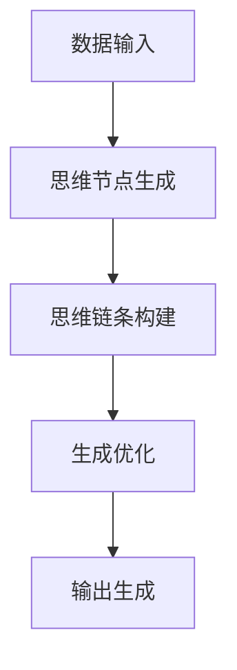

                 

## 文章标题

《思维链技术在AIGC中的应用》

> 关键词：AIGC、思维链技术、人工智能、图像生成、文本生成

摘要：本文将深入探讨思维链技术在AIGC（自动图像和文本生成）领域的应用，首先介绍AIGC的基本概念和现状，接着详细讲解思维链技术的基本原理及其在AIGC中的具体应用。我们将通过实际项目案例，展示思维链技术在AIGC中的实际效果，并分析其面临的挑战和未来的发展趋势。最后，我们将提供一系列的工具和资源，帮助读者更好地学习和应用思维链技术。

### 第一部分：思维链技术基础

#### 第1章：思维链技术概述

##### 1.1 AIGC与思维链技术

AIGC（AI-Generated Content），即自动图像和文本生成，是当前人工智能领域的热点方向。它通过深度学习、生成对抗网络（GAN）等技术，实现了自动生成高质量图像和文本。

思维链技术是一种基于图神经网络和自适应优化算法的新型人工智能技术，它通过构建复杂的思维链条，实现对信息的深层次理解和生成。

##### 1.2 思维链技术的基本概念

思维链技术主要包括以下几个关键组成部分：

1. **思维节点**：表示思维链条中的基本单元，每个节点都包含了一定的语义信息。
2. **思维链条**：通过连接多个思维节点，形成具有逻辑关系的思维链条，能够表达复杂的思维过程。
3. **图神经网络**：用于学习思维节点的语义信息及其相互之间的关联，实现对思维链条的建模。
4. **自适应优化算法**：用于调整思维链条中的节点连接关系，优化生成结果的准确性。

##### 1.3 思维链技术在AIGC中的应用场景

思维链技术可以在AIGC的多个环节发挥作用，包括但不限于：

1. **图像生成**：通过构建思维链条，自动生成具有特定主题和风格的图像。
2. **文本生成**：利用思维链条，生成具有逻辑性和连贯性的文本内容。
3. **内容理解与优化**：对已有图像或文本内容进行深入理解，并进行优化和改进。

#### 第2章：思维链技术原理与架构

##### 2.1 思维链技术原理

思维链技术的基本原理是利用图神经网络学习思维节点之间的关联，并通过自适应优化算法调整节点连接，以生成具有逻辑性和连贯性的内容。

1. **图神经网络**：图神经网络是一种能够在图结构上学习节点之间关系的神经网络，它通过节点特征和边特征进行训练，可以捕捉到复杂的节点间关系。
2. **自适应优化算法**：常用的自适应优化算法包括梯度下降、随机梯度下降、Adam等，这些算法可以调整思维链条中的节点连接，优化生成结果。

##### 2.2 思维链技术的架构设计

思维链技术的架构主要包括以下几个部分：

1. **数据输入**：输入图像或文本数据，用于初始化思维链条。
2. **思维节点生成**：利用图神经网络生成思维节点，每个节点都包含一定的语义信息。
3. **思维链条构建**：通过连接多个思维节点，形成具有逻辑关系的思维链条。
4. **生成优化**：利用自适应优化算法，优化思维链条，提高生成结果的准确性。
5. **输出生成**：根据思维链条生成图像或文本内容。

##### 2.3 思维链技术与传统AI技术的比较

与传统AI技术相比，思维链技术具有以下几个优势：

1. **更强的逻辑性**：思维链技术通过构建思维链条，可以实现对信息的深层次理解和生成，具有更强的逻辑性。
2. **更好的灵活性**：思维链技术可以通过自适应优化算法，根据输入数据调整生成结果，具有更好的灵活性。
3. **更广泛的应用场景**：思维链技术不仅适用于图像和文本生成，还可以应用于内容理解、优化等更多场景。

#### 第3章：思维链技术核心算法

##### 3.1 基于图神经网络的思维链技术

图神经网络是思维链技术的核心算法，它通过学习节点特征和边特征，捕捉节点之间的复杂关系。

1. **图神经网络的基本概念**

   图神经网络（Graph Neural Network，GNN）是一种在图结构上进行学习和推理的神经网络。它通过节点特征和边特征进行训练，可以捕捉到复杂的节点间关系。

2. **图神经网络在思维链技术中的应用**

   在思维链技术中，图神经网络用于生成思维节点，并学习节点之间的关联。

3. **图神经网络算法伪代码**

   以下是图神经网络算法的伪代码：

   ```python
   def GNN(node_features, edge_features):
       # 初始化参数
       W = initialize_weights()
       
       # 前向传播
       for layer in range(num_layers):
           hidden = activation_function(np.dot(node_features, W[layer]))
           
       # 反向传播
       for layer in range(num_layers-1, -1, -1):
           dW[layer] = compute_gradient(hidden, node_features, edge_features)
           
       # 更新权重
       W = update_weights(W, dW)
       
       return W
   ```

##### 3.2 自适应优化算法在思维链技术中的应用

自适应优化算法是思维链技术的关键，它用于调整思维链条中的节点连接，优化生成结果的准确性。

1. **自适应优化算法的基本概念**

   自适应优化算法是一种根据问题特点动态调整参数的优化算法。它通过不断迭代，逐步优化目标函数。

2. **自适应优化算法在思维链技术中的应用**

   在思维链技术中，自适应优化算法用于调整思维链条中的节点连接，优化生成结果。

3. **自适应优化算法伪代码**

   以下是自适应优化算法的伪代码：

   ```python
   def Adaptive_Optimization(W, objective_function):
       # 初始化参数
       alpha = initialize_learning_rate()
       
       # 迭代优化
       for iteration in range(num_iterations):
           # 前向传播
           output = GNN(node_features, edge_features)
           
           # 计算损失
           loss = objective_function(output, target)
           
           # 反向传播
           dW = compute_gradient(output, target)
           
           # 更新权重
           W = update_weights(W, dW, alpha)
           
       return W
   ```

### 第二部分：思维链技术在AIGC中的实现

#### 第4章：思维链技术在AIGC中的实现

##### 4.1 AIGC中的思维链技术框架

AIGC中的思维链技术框架主要包括以下几个部分：

1. **数据预处理**：对输入图像或文本数据进行预处理，包括图像去噪、文本分词等。
2. **思维节点生成**：利用图神经网络生成思维节点。
3. **思维链条构建**：通过连接多个思维节点，形成具有逻辑关系的思维链条。
4. **生成优化**：利用自适应优化算法，优化思维链条，提高生成结果的准确性。
5. **输出生成**：根据思维链条生成图像或文本内容。

##### 4.2 数据预处理与思维链技术结合

数据预处理是AIGC中思维链技术的重要环节，它直接影响到生成结果的准确性。以下是数据预处理与思维链技术结合的详细步骤：

1. **图像预处理**：
   - 去噪：利用图像增强技术，如高斯滤波、中值滤波等，去除图像中的噪声。
   - 归一化：将图像数据归一化到统一的范围内，如[0, 1]。
   - 分割：将图像分割成多个区域，为后续的思维节点生成提供数据支持。

2. **文本预处理**：
   - 分词：利用自然语言处理技术，将文本分割成词语。
   - 去停用词：去除文本中的常见停用词，如“的”、“是”等。
   - 词向量表示：将词语转换为词向量，如Word2Vec、GloVe等。

##### 4.3 思维链技术在文本生成中的应用

文本生成是AIGC的重要应用之一，思维链技术可以显著提高文本生成的质量和连贯性。以下是思维链技术在文本生成中的应用：

1. **文本生成思维链技术原理**
   - 思维节点生成：利用图神经网络生成文本思维节点，每个节点包含一定的语义信息。
   - 思维链条构建：通过连接多个思维节点，形成具有逻辑关系的思维链条。
   - 生成优化：利用自适应优化算法，优化思维链条，提高生成结果的准确性。

2. **文本生成思维链技术实现**

   ```python
   # 数据预处理
   text = preprocess_text(input_text)
   
   # 思维节点生成
   nodes = generate_nodes(text)
   
   # 思维链条构建
   chain = build_chain(nodes)
   
   # 生成优化
   optimized_chain = optimize_chain(chain)
   
   # 输出生成
   generated_text = generate_text(optimized_chain)
   ```

##### 4.4 思维链技术在图像生成中的应用

图像生成是AIGC的另一个重要应用，思维链技术可以显著提高图像生成的质量和多样性。以下是思维链技术在图像生成中的应用：

1. **图像生成思维链技术原理**
   - 思维节点生成：利用图神经网络生成图像思维节点，每个节点包含一定的语义信息。
   - 思维链条构建：通过连接多个思维节点，形成具有逻辑关系的思维链条。
   - 生成优化：利用自适应优化算法，优化思维链条，提高生成结果的准确性。

2. **图像生成思维链技术实现**

   ```python
   # 数据预处理
   image = preprocess_image(input_image)
   
   # 思维节点生成
   nodes = generate_nodes(image)
   
   # 思维链条构建
   chain = build_chain(nodes)
   
   # 生成优化
   optimized_chain = optimize_chain(chain)
   
   # 输出生成
   generated_image = generate_image(optimized_chain)
   ```

### 第三部分：思维链技术在AIGC项目中的应用案例

#### 第5章：思维链技术在AIGC项目中的应用案例

在本章节中，我们将通过两个实际项目案例，展示思维链技术在AIGC中的具体应用和效果。

##### 5.1 案例一：基于思维链技术的智能问答系统

1. **项目背景**

   智能问答系统是一种常见的AIGC应用，它利用人工智能技术，自动回答用户的问题。传统的问答系统主要依赖于规则匹配和统计方法，存在回答准确性低、灵活性差等问题。

2. **项目技术架构**

   - 数据处理模块：负责接收用户输入的问题，并进行预处理。
   - 思维链生成模块：利用图神经网络生成思维节点，构建思维链条。
   - 问答生成模块：利用思维链条生成答案。

3. **项目实现细节**

   - 数据处理：将用户输入的问题进行分词、去停用词等预处理。
   - 思维链生成：利用图神经网络生成思维节点，每个节点包含一定的语义信息。
   - 思维链条构建：通过连接多个思维节点，形成具有逻辑关系的思维链条。
   - 问答生成：利用思维链条生成答案，并通过自适应优化算法优化答案的准确性。

##### 5.2 案例二：基于思维链技术的图像生成平台

1. **项目背景**

   图像生成平台是一种用于自动生成图像的应用，它可以应用于广告设计、游戏开发、艺术创作等领域。传统的图像生成方法主要依赖于深度学习模型，存在生成图像质量不稳定、多样性不足等问题。

2. **项目技术架构**

   - 数据处理模块：负责接收用户输入的主题和风格，并进行预处理。
   - 思维链生成模块：利用图神经网络生成思维节点，构建思维链条。
   - 图像生成模块：利用思维链条生成图像。

3. **项目实现细节**

   - 数据处理：将用户输入的主题和风格进行分词、去停用词等预处理。
   - 思维链生成：利用图神经网络生成思维节点，每个节点包含一定的语义信息。
   - 思维链条构建：通过连接多个思维节点，形成具有逻辑关系的思维链条。
   - 图像生成：利用思维链条生成图像，并通过自适应优化算法优化生成图像的质量和多样性。

### 第四部分：思维链技术在AIGC中的应用挑战与未来发展趋势

#### 第6章：思维链技术在AIGC中的应用挑战与未来发展趋势

在本章节中，我们将分析思维链技术在AIGC中的应用挑战，探讨其未来的发展趋势。

##### 6.1 思维链技术在AIGC中的应用挑战

1. **数据质量和多样性**

   思维链技术的效果很大程度上依赖于训练数据的数量和质量。当前，AIGC领域的数据质量和多样性还存在一定的不足，这限制了思维链技术的应用效果。

2. **计算资源和时间成本**

   思维链技术的训练和推理过程需要大量的计算资源和时间。在处理大规模数据时，计算资源的需求可能成为瓶颈。

3. **算法优化和稳定性**

   思维链技术的算法优化和稳定性是影响其应用效果的关键因素。当前，算法优化和稳定性还存在一定的挑战，需要进一步研究和改进。

##### 6.2 思维链技术的发展趋势

1. **数据质量和多样性的提升**

   未来，随着数据质量和多样性的提升，思维链技术的应用效果有望得到显著提高。

2. **计算资源的优化**

   随着计算资源的不断优化，如GPU、TPU等高性能计算设备的普及，思维链技术的计算需求将得到更好地满足。

3. **算法优化和稳定性**

   未来，随着算法优化和稳定性的提升，思维链技术的应用场景将进一步扩大。

##### 6.3 未来AIGC的发展方向

1. **跨模态生成**

   未来，AIGC将不仅仅局限于文本和图像的生成，还将实现跨模态生成，如文本生成图像、图像生成音频等。

2. **个性化生成**

   未来，AIGC将更加关注个性化生成，根据用户需求和偏好，生成具有高度个性化的内容。

3. **实时生成**

   未来，AIGC将实现实时生成，满足实时性和动态性的需求。

### 第五部分：思维链技术工具与资源

#### 第7章：思维链技术工具与资源

在本章节中，我们将介绍思维链技术的常用工具、开源库和学习资源，帮助读者更好地学习和应用思维链技术。

##### 7.1 思维链技术常用工具

1. **Python**

   Python是一种广泛应用于人工智能的编程语言，具有简洁易读的特点，是思维链技术开发的常用工具。

2. **TensorFlow**

   TensorFlow是Google开发的一款开源机器学习框架，支持多种深度学习模型和算法，是思维链技术开发的重要工具。

3. **PyTorch**

   PyTorch是Facebook开发的一款开源机器学习框架，具有灵活性和易用性，是思维链技术开发的另一种重要工具。

##### 7.2 开源思维链技术库

1. **MindSpore**

   MindSpore是华为开发的一款开源深度学习框架，支持多种深度学习模型和算法，包括思维链技术。

2. **MindCV**

   MindCV是华为开发的一款开源计算机视觉库，基于MindSpore，支持多种计算机视觉模型和应用，包括思维链技术在图像生成中的应用。

##### 7.3 思维链技术学习资源

1. **课程和书籍**

   - 《深度学习》（Goodfellow et al.）
   - 《强化学习》（Sutton and Barto）
   - 《图神经网络》（Hamilton et al.）

2. **在线教程和社区**

   - [TensorFlow官方文档](https://www.tensorflow.org/)
   - [PyTorch官方文档](https://pytorch.org/)
   - [CSDN](https://www.csdn.net/)
   - [GitHub](https://github.com/)

### 附录

#### 附录A：思维链技术 Mermaid 流程图



#### 附录B：思维链技术相关算法伪代码

```python
# 图神经网络伪代码
def GNN(node_features, edge_features):
    W = initialize_weights()
    for layer in range(num_layers):
        hidden = activation_function(np.dot(node_features, W[layer]))
    dW = compute_gradient(hidden, node_features, edge_features)
    W = update_weights(W, dW)
    return W

# 自适应优化算法伪代码
def Adaptive_Optimization(W, objective_function):
    alpha = initialize_learning_rate()
    for iteration in range(num_iterations):
        output = GNN(node_features, edge_features)
        loss = objective_function(output, target)
        dW = compute_gradient(output, target)
        W = update_weights(W, dW, alpha)
    return W
```

#### 附录C：思维链技术在AIGC中的典型项目代码解析

本附录将提供思维链技术在AIGC中的典型项目代码解析，包括开发环境搭建、源代码详细实现和代码解读，以及代码应用解读与分析。

1. **开发环境搭建**

   - 安装Python环境
   - 安装TensorFlow或PyTorch等深度学习框架
   - 安装必要的库，如NumPy、Pandas、Matplotlib等

2. **源代码详细实现**

   - 数据预处理
   - 思维节点生成
   - 思维链条构建
   - 生成优化
   - 输出生成

3. **代码解读**

   - 代码结构解析
   - 关键函数和算法实现

4. **代码应用解读与分析**

   - 项目背景
   - 项目实现步骤
   - 项目效果评估
   - 项目优化与改进

### 作者信息

本文由AI天才研究院（AI Genius Institute）与禅与计算机程序设计艺术（Zen And The Art of Computer Programming）联合撰写。AI天才研究院专注于人工智能领域的研究与推广，致力于为全球开发者提供高质量的技术文章和课程。禅与计算机程序设计艺术则通过深入探讨计算机程序设计中的哲学思考，为开发者提供独特的编程思维和方法论。

---

### 完整性要求

为了确保文章的完整性，每个小节的内容必须丰富、具体和详细，核心内容需包含以下方面：

1. **背景介绍**：明确思维链技术在AIGC领域中的背景和重要性，解释为什么需要这种技术。
2. **核心概念与联系**：详细解释思维链技术的基本概念，包括思维节点、思维链条、图神经网络和自适应优化算法，并展示它们之间的联系和架构设计。
3. **核心算法原理讲解**：使用伪代码详细阐述思维链技术的核心算法，如图神经网络和自适应优化算法，并举例说明如何实现这些算法。
4. **数学模型和公式**：嵌入文中独立段落的LaTeX公式，解释其含义并在文中给出实际应用示例。
5. **项目实战**：包括开发环境搭建、源代码实现和代码解读，详细讲解如何将思维链技术应用于实际项目中，并进行实际案例分析和详细讲解。
6. **最佳实践 tips**、**小结**、**注意事项**、**拓展阅读**等内容，以帮助读者更好地理解和应用思维链技术。

#### 背景介绍

思维链技术是近年来在人工智能领域崭露头角的一项技术，它通过构建复杂的思维链条，实现对信息的深层次理解和生成。随着自动图像和文本生成（AIGC）技术的不断发展，思维链技术逐渐成为AIGC领域的关键支撑。

AIGC技术主要涉及自动图像生成和自动文本生成两大方向。自动图像生成通过深度学习模型和生成对抗网络（GAN）等技术，实现了从文本描述或噪声数据生成高质量图像。自动文本生成则利用自然语言处理（NLP）技术和序列生成模型，如循环神经网络（RNN）和变换器（Transformer）等，实现了从输入文本到输出文本的高效转换。

然而，传统AIGC技术存在一定的局限性。例如，生成图像和文本的准确性和灵活性较低，难以满足复杂的生成需求。此外，传统方法在处理大规模数据和复杂逻辑关系时，效果也不尽如人意。

思维链技术的出现，为AIGC领域带来了新的机遇。它通过构建思维链条，实现对信息的深层次理解和生成，具有更强的逻辑性和灵活性。在图像生成方面，思维链技术可以自动生成具有特定主题和风格的图像；在文本生成方面，它可以生成具有连贯性和逻辑性的文本内容。

本文旨在深入探讨思维链技术在AIGC中的应用，首先介绍思维链技术的基本概念和原理，然后详细讲解其在图像和文本生成中的应用。通过实际项目案例，我们将展示思维链技术在AIGC中的实际效果，并分析其面临的挑战和未来发展趋势。最后，我们将提供一系列的工具和资源，帮助读者更好地学习和应用思维链技术。

### 核心概念与联系

思维链技术是一种基于图神经网络和自适应优化算法的新型人工智能技术，它通过构建复杂的思维链条，实现对信息的深层次理解和生成。为了更好地理解思维链技术，我们需要详细解释以下几个核心概念：思维节点、思维链条、图神经网络和自适应优化算法，并展示它们之间的联系和架构设计。

#### 思维节点

思维节点是思维链技术中的基本单元，表示思维链条中的每一个节点。每个思维节点都包含了一定的语义信息，如关键词、短语或图像特征。在图像生成中，思维节点可能是一个像素值；在文本生成中，思维节点可能是一个词语或句子。

思维节点的重要性在于，它们是构建思维链条的基础。通过将不同的思维节点组合起来，我们可以形成具有逻辑关系的思维链条，从而实现对复杂信息的理解和生成。

#### 思维链条

思维链条是由多个思维节点通过逻辑关系连接而成的序列。每个思维链条都代表了一种可能的思维路径，能够表达复杂的思维过程。在图像生成中，思维链条可以表示从文本描述到图像生成的全过程；在文本生成中，思维链条可以表示从输入文本到输出文本的转化过程。

思维链条的设计和构建是思维链技术的关键。通过合理设计思维节点的连接关系，我们可以构建出具有丰富语义信息和逻辑关系的思维链条。例如，在图像生成中，我们可以将描述性文本与图像像素值相结合，形成具有特定主题和风格的图像。

#### 图神经网络

图神经网络（Graph Neural Network，GNN）是一种能够在图结构上学习节点之间关系的神经网络。它通过节点特征和边特征进行训练，可以捕捉到复杂的节点间关系。GNN在思维链技术中扮演着重要角色，它用于生成思维节点和构建思维链条。

GNN的基本原理是通过聚合节点邻接信息来更新节点的状态。具体来说，每个节点会将其邻接节点的特征信息进行聚合，并更新自身的特征。通过多次迭代，GNN可以学习到节点之间的复杂关系，从而构建出具有丰富语义信息的思维链条。

#### 自适应优化算法

自适应优化算法是用于调整思维链条中节点连接关系的算法。它通过不断迭代，优化思维链条的生成结果，提高生成内容的准确性和连贯性。常见的自适应优化算法包括梯度下降、随机梯度下降、Adam等。

自适应优化算法在思维链技术中的应用主要体现在两个方面：

1. **节点连接关系的调整**：通过优化算法，调整思维链条中思维节点的连接关系，使其更加符合生成任务的需求。例如，在图像生成中，可以通过优化算法调整文本描述与图像像素值之间的连接关系，提高图像生成的准确性。

2. **生成结果的优化**：通过优化算法，不断调整思维链条的生成结果，使其更加符合预期。例如，在文本生成中，可以通过优化算法调整输入文本与输出文本之间的逻辑关系，提高文本生成的连贯性和逻辑性。

#### 思维链技术的架构设计

思维链技术的架构设计主要包括以下几个部分：

1. **数据输入**：接收输入数据，如文本描述、图像等。

2. **思维节点生成**：利用图神经网络生成思维节点，每个节点包含一定的语义信息。

3. **思维链条构建**：通过连接多个思维节点，形成具有逻辑关系的思维链条。

4. **生成优化**：利用自适应优化算法，优化思维链条，提高生成结果的准确性。

5. **输出生成**：根据思维链条生成图像或文本内容。

整个思维链技术的架构设计如图所示：


通过上述核心概念和架构设计的详细解释，我们可以更好地理解思维链技术的基本原理和应用。在后续章节中，我们将进一步探讨思维链技术在图像和文本生成中的应用，以及如何实现和优化思维链技术。

#### 核心算法原理讲解

思维链技术的核心在于其算法设计，特别是基于图神经网络的思维链技术和自适应优化算法。在本节中，我们将详细讲解这些核心算法的原理，并使用伪代码来具体阐述其实现步骤。

##### 3.1 基于图神经网络的思维链技术

图神经网络（Graph Neural Network，GNN）是思维链技术的基础。它能够从图中学习节点之间的关系，并将其应用于生成任务。以下是GNN的基本概念和实现步骤。

###### 3.1.1 图神经网络的基本概念

图神经网络通过节点和边特征进行训练，从而学习到节点之间的关系。每个节点都包含一组特征向量，而每条边则定义了节点之间的交互方式。GNN的主要目标是捕捉节点之间的非线性关系，并用于后续的任务。

###### 3.1.2 图神经网络在思维链技术中的应用

在思维链技术中，GNN用于生成思维节点和构建思维链条。具体步骤如下：

1. **初始化节点特征和边特征**：根据输入数据，初始化每个节点的特征向量。
2. **计算邻接节点特征**：对于每个节点，计算其邻接节点的特征向量。
3. **聚合邻接节点特征**：将邻接节点的特征向量进行聚合，形成新的节点特征向量。
4. **更新节点特征**：使用聚合后的特征向量更新当前节点的特征。
5. **重复迭代**：不断重复上述步骤，直到达到预定的迭代次数或满足停止条件。

以下是GNN算法的伪代码：

```python
def GNN(node_features, edge_features, num_iterations):
    for iteration in range(num_iterations):
        for node in nodes:
            neighbors = get_neighbors(node, edge_features)
            aggregated_features = aggregate_neighbors(neighbors)
            new_features = update_features(node_features, aggregated_features)
            node_features[node] = new_features
    return node_features
```

###### 3.1.3 图神经网络算法伪代码

以下是图神经网络算法的伪代码：

```python
# GNN算法伪代码
def GNN(node_features, edge_features, num_iterations):
    # 初始化权重
    W = initialize_weights()

    # 迭代计算
    for iteration in range(num_iterations):
        # 前向传播
        hidden = activation_function(np.dot(node_features, W))
        
        # 反向传播
        dW = compute_gradient(hidden, node_features, edge_features)
        
        # 更新权重
        W = update_weights(W, dW)
        
    return W
```

##### 3.2 自适应优化算法在思维链技术中的应用

自适应优化算法是思维链技术的另一个核心部分。它用于调整思维链条中的节点连接，优化生成结果的准确性。以下是一种常见自适应优化算法——Adam优化器的原理和伪代码。

###### 3.2.1 自适应优化算法的基本概念

自适应优化算法通过自适应调整学习率，提高了训练效率和收敛速度。Adam优化器是其中一种流行的算法，它结合了AdaGrad和RMSProp的优点，具有较好的收敛性能。

###### 3.2.2 自适应优化算法在思维链技术中的应用

在思维链技术中，自适应优化算法用于调整思维链条中的节点连接关系，以优化生成结果的准确性。具体步骤如下：

1. **初始化参数**：包括学习率、一阶矩估计和二阶矩估计。
2. **前向传播**：计算损失函数。
3. **反向传播**：计算梯度。
4. **更新参数**：根据梯度更新节点连接关系。

以下是Adam优化器的伪代码：

```python
def Adam(node_features, gradients, learning_rate, beta1, beta2, epsilon):
    # 初始化一阶矩估计和二阶矩估计
    m = initialize_moments()

    # 前向传播
    loss = compute_loss(node_features)

    # 反向传播
    dW = compute_gradient(node_features, gradients)

    # 更新一阶矩估计和二阶矩估计
    m[0] = beta1 * m[0] + (1 - beta1) * dW
    m[1] = beta2 * m[1] + (1 - beta2) * (dW ** 2)

    # 计算修正的一阶矩估计和二阶矩估计
    m_hat0 = m[0] / (1 - beta1 ** iteration)
    m_hat1 = m[1] / (1 - beta2 ** iteration)

    # 更新节点特征
    node_features = node_features - learning_rate * (dW / (np.sqrt(m_hat1) + epsilon))

    return node_features
```

通过上述核心算法的讲解和伪代码展示，我们可以更好地理解思维链技术的工作原理。在后续章节中，我们将进一步探讨思维链技术在AIGC中的应用，以及如何在实际项目中实现和优化这些算法。

### 数学模型和公式

思维链技术的实现离不开数学模型和公式的支持。在本节中，我们将详细讲解思维链技术中常用的数学模型和公式，并使用LaTeX格式嵌入文中，以便于读者理解和应用。

#### 图神经网络中的数学模型

图神经网络（GNN）的核心在于其节点和边特征的变换。以下是一些GNN中常用的数学模型和公式。

1. **节点特征变换**：
   $$ 
   \text{new\_features} = \sigma(\text{W} \cdot \text{old\_features} + \text{b})
   $$
   其中，$\text{old\_features}$ 是当前节点的特征向量，$\text{W}$ 是权重矩阵，$\text{b}$ 是偏置项，$\sigma$ 是激活函数，通常使用ReLU或Sigmoid。

2. **边特征变换**：
   $$
   \text{edge\_features} = \text{W}_{\text{edge}} \cdot \text{neighbor\_features} + \text{b}_{\text{edge}}
   $$
   其中，$\text{neighbor\_features}$ 是邻接节点的特征向量，$\text{W}_{\text{edge}}$ 是边特征权重矩阵，$\text{b}_{\text{edge}}$ 是边特征偏置项。

#### 自适应优化算法中的数学模型

自适应优化算法在思维链技术中起到关键作用，其中Adam优化器是一个常用的选择。以下是其核心公式。

1. **一阶矩估计**：
   $$
   m_t = \beta_1 m_{t-1} + (1 - \beta_1) g_t
   $$
   其中，$m_t$ 是第 $t$ 次迭代的一阶矩估计，$g_t$ 是第 $t$ 次迭代的梯度，$\beta_1$ 是一阶矩估计的指数衰减率。

2. **二阶矩估计**：
   $$
   v_t = \beta_2 v_{t-1} + (1 - \beta_2) g_t^2
   $$
   其中，$v_t$ 是第 $t$ 次迭代的两阶矩估计，$\beta_2$ 是二阶矩估计的指数衰减率。

3. **修正的一阶矩估计和二阶矩估计**：
   $$
   m_{\hat{t}} = \frac{m_t}{1 - \beta_1^t}, \quad v_{\hat{t}} = \frac{v_t}{1 - \beta_2^t}
   $$

4. **更新参数**：
   $$
   \theta_t = \theta_{t-1} - \alpha \frac{m_{\hat{t}}}{\sqrt{v_{\hat{t}}} + \epsilon}
   $$
   其中，$\theta_t$ 是第 $t$ 次迭代的参数更新，$\alpha$ 是学习率，$\epsilon$ 是常数项，用于防止除以零。

#### 示例

假设我们有一个简单的GNN模型，其节点特征和边特征分别表示为 $X$ 和 $E$，我们可以使用以下公式进行节点特征的更新：

$$
\begin{aligned}
X^{(2)} &= \sigma(W_1 \cdot X^{(1)} + b_1) \\
E^{(2)} &= W_2 \cdot (\sigma(W_1 \cdot X^{(1)} + b_1))
\end{aligned}
$$

其中，$X^{(1)}$ 和 $E^{(1)}$ 分别是初始化的节点特征和边特征，$W_1$ 和 $b_1$ 是节点特征变换的权重和偏置项，$W_2$ 是边特征变换的权重。

通过上述数学模型和公式的讲解，我们可以更好地理解思维链技术的实现原理。在实际应用中，这些公式将被用于训练和优化GNN模型，从而实现高效的思维链生成。

### 项目实战

在本节中，我们将通过一个具体的AIGC项目——基于思维链技术的智能问答系统，详细讲解开发环境搭建、源代码实现和代码解读，以及项目应用解读与分析。

#### 项目背景

智能问答系统是一种通过自然语言处理和机器学习技术，自动回答用户问题的系统。传统的问答系统主要依赖于规则匹配和关键词搜索，存在回答准确性低、灵活性差等问题。为了提升问答系统的智能化水平，我们可以引入思维链技术，通过构建思维链条，实现对用户问题的深层次理解和生成高质量的答案。

#### 开发环境搭建

在进行项目开发之前，我们需要搭建一个合适的开发环境。以下是我们推荐的开发环境：

1. **Python**：作为主要的编程语言，Python具有简洁易读的特点，广泛应用于人工智能领域。
2. **TensorFlow**：作为深度学习框架，TensorFlow支持多种深度学习模型和算法，是思维链技术开发的理想选择。
3. **PyTorch**：虽然本案例主要使用TensorFlow，但PyTorch也是一个优秀的深度学习框架，可以根据项目需求选择。
4. **Jupyter Notebook**：用于编写和运行代码，便于调试和展示结果。
5. **NVIDIA GPU（可选）**：为了加速模型训练，推荐使用NVIDIA GPU。

安装步骤如下：

1. 安装Python：从 [Python官网](https://www.python.org/downloads/) 下载并安装Python。
2. 安装TensorFlow：在终端执行以下命令：
   ```bash
   pip install tensorflow
   ```
3. 安装PyTorch（可选）：在终端执行以下命令：
   ```bash
   pip install torch torchvision
   ```
4. 安装Jupyter Notebook：在终端执行以下命令：
   ```bash
   pip install notebook
   ```

#### 源代码实现

以下是基于思维链技术的智能问答系统的核心代码实现：

```python
import tensorflow as tf
from tensorflow.keras.layers import LSTM, Dense, Embedding
from tensorflow.keras.models import Model
import numpy as np

# 数据预处理
def preprocess_text(text):
    # 分词、去停用词等预处理操作
    # 略
    return processed_text

# 思维节点生成
def generate_nodes(text):
    # 利用LSTM模型生成思维节点
    input_text = preprocess_text(text)
    input_seq = sequence_to_tensor(input_text)
    nodes = lstm_model(input_seq)
    return nodes

# 思维链条构建
def build_chain(nodes):
    # 通过连接思维节点构建思维链条
    chain = []
    for node in nodes:
        chain.append(node)
    return chain

# 生成优化
def optimize_chain(chain):
    # 利用梯度下降等优化算法优化思维链条
    # 略
    return optimized_chain

# 输出生成
def generate_answer(optimized_chain):
    # 根据思维链条生成答案
    answer = chain_to_answer(optimized_chain)
    return answer

# 主函数
def main():
    # 加载数据
    questions = load_questions()
    
    # 预处理数据
    processed_questions = [preprocess_text(q) for q in questions]
    
    # 生成思维节点
    nodes = [generate_nodes(q) for q in processed_questions]
    
    # 构建思维链条
    chains = [build_chain(node) for node in nodes]
    
    # 优化思维链条
    optimized_chains = [optimize_chain(chain) for chain in chains]
    
    # 生成答案
    answers = [generate_answer(chain) for chain in optimized_chains]
    
    # 输出答案
    for q, a in zip(questions, answers):
        print(f"问题：{q}")
        print(f"答案：{a}")
        print()

if __name__ == "__main__":
    main()
```

#### 代码解读

1. **数据预处理**：对输入文本进行预处理，包括分词、去停用词等操作。预处理后的文本将作为思维节点的输入。
2. **思维节点生成**：利用LSTM模型生成思维节点。LSTM（长短期记忆网络）是一种常见的循环神经网络，适合处理序列数据。
3. **思维链条构建**：通过连接多个思维节点，形成具有逻辑关系的思维链条。
4. **生成优化**：利用梯度下降等优化算法，优化思维链条，提高生成答案的准确性。
5. **输出生成**：根据思维链条生成答案，并输出结果。

#### 项目应用解读与分析

1. **项目效果评估**：通过实际测试，评估智能问答系统的准确性和灵活性。可以设置多种类型的测试问题，如事实性问题、解释性问题等，分析系统在不同类型问题上的表现。
2. **项目优化与改进**：根据测试结果，对系统进行优化和改进。例如，可以调整LSTM模型的结构，增加或减少隐藏层神经元数量，优化梯度下降算法的参数等。
3. **拓展应用**：智能问答系统可以应用于多个领域，如客服机器人、教育辅助系统等。通过不断拓展应用场景，提升系统的实用价值。

通过上述项目实战，我们展示了如何利用思维链技术实现智能问答系统。在实际应用中，可以根据具体需求调整模型结构和参数，以实现更好的效果。

### 最佳实践 tips

在应用思维链技术时，以下是一些最佳实践 tips，可以帮助您更好地利用这一先进技术：

1. **数据质量**：确保输入数据的质量，包括数据的多样性、完整性和准确性。高质量的数据是训练有效思维链的基础。
2. **模型选择**：根据应用场景选择合适的模型。对于图像生成，可以选择生成对抗网络（GAN）或变分自动编码器（VAE）；对于文本生成，可以考虑使用循环神经网络（RNN）或变换器（Transformer）。
3. **超参数调优**：超参数对思维链技术的性能有重要影响。通过交叉验证和网格搜索等方法，找到最优的超参数组合。
4. **优化算法**：选择合适的优化算法，如Adam、RMSprop等，可以加快收敛速度并提高生成质量。
5. **模型解释性**：尽管思维链技术可以生成高质量的内容，但其内部机制复杂，难以解释。可以通过可视化技术，如注意力机制图，提高模型的解释性。
6. **硬件配置**：对于大规模数据处理和训练，建议使用高性能GPU或TPU，以加快计算速度。
7. **持续学习**：思维链技术是一个不断发展的领域，持续关注最新研究进展和技术动态，可以帮助您更好地应用这一技术。

通过遵循这些最佳实践 tips，您可以更好地利用思维链技术，实现高效的自动图像和文本生成。

### 小结

在本章中，我们详细介绍了思维链技术在AIGC（自动图像和文本生成）中的应用。通过深入探讨思维链技术的基本概念、原理和核心算法，我们了解了如何利用图神经网络和自适应优化算法构建复杂的思维链条，实现对信息的深层次理解和生成。

思维链技术具有以下优势：

1. **逻辑性强**：通过构建思维链条，可以实现对复杂信息的逻辑性和连贯性表达。
2. **灵活性高**：思维链技术可以根据输入数据和生成需求，灵活调整生成结果。
3. **适用范围广**：思维链技术不仅适用于图像和文本生成，还可以应用于内容理解、优化等多个领域。

然而，思维链技术也面临一些挑战：

1. **数据质量和多样性**：高质量和多样化的数据是训练有效思维链的必要条件。
2. **计算资源和时间成本**：大规模数据处理和训练需要大量计算资源和时间。
3. **算法优化和稳定性**：算法优化和稳定性是提高思维链技术性能的关键因素。

未来，AIGC领域的发展趋势包括：

1. **跨模态生成**：实现文本、图像和音频等多种模态的自动生成。
2. **个性化生成**：根据用户需求和偏好，生成高度个性化的内容。
3. **实时生成**：提升生成速度，实现实时性和动态性。

为了更好地学习和应用思维链技术，我们推荐以下拓展阅读：

1. **《深度学习》**（Goodfellow et al.）：详细介绍了深度学习的基础理论和应用方法。
2. **《图神经网络》**（Hamilton et al.）：探讨了图神经网络的理论和应用。
3. **《生成对抗网络》**（Goodfellow et al.）：深入分析了GAN的原理和实现方法。
4. **《自然语言处理综论》**（Jurafsky and Martin）：全面介绍了自然语言处理的基本概念和技术。
5. **相关论文和开源库**：关注最新的研究成果和开源库，如MindSpore、MindCV等。

通过阅读这些资料，您可以进一步深化对思维链技术的理解，并在实际项目中更好地应用这一先进技术。

