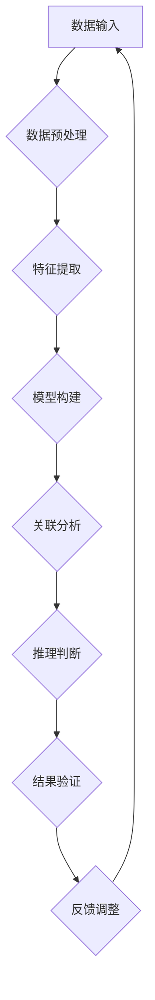

                 

### 文章标题

《思维链技术在不同领域的应用案例》

### 关键词

思维链技术，人工智能，科研，工业，教育，医疗，应用案例

### 摘要

本文将深入探讨思维链技术的基础概念、核心原理、数学模型与算法，以及其在科研、工业、教育和医疗等不同领域的具体应用案例。通过逻辑清晰、结构紧凑的论述，我们旨在揭示思维链技术的广泛应用前景和潜在价值，帮助读者理解其在各个领域中发挥的关键作用。

## 第一部分：思维链技术基础

### 第1章：思维链技术概述

#### 1.1 思维链技术的概念与起源

**定义**：思维链技术（Mind Chain Technology）是一种基于人工智能和大数据分析的方法论，通过构建思维链模型，实现数据的关联分析和推理判断。它借鉴了人类思维过程的逻辑性和连贯性，旨在模拟人类智能进行复杂问题求解。

**起源**：思维链技术的概念起源于20世纪80年代，随着人工智能和认知科学的发展，人们开始探索如何将人类的思维过程量化为计算机可以处理的模型。经过多年的研究，思维链技术逐渐形成了较为完整的理论体系和应用框架。

#### 1.2 思维链技术的核心原理

**组成与工作流程**：思维链技术由数据采集、模型构建、推理分析和结果验证四个主要环节组成。首先，通过数据采集模块收集相关数据；其次，利用模型构建模块建立思维链模型；然后，通过推理分析模块对数据进行分析和推理；最后，通过结果验证模块对推理结果进行验证。

**核心特征和优势**：

- **自适应性**：思维链技术可以根据不同领域和任务的需求，灵活调整和优化模型结构。
- **智能性**：通过模拟人类思维过程，实现复杂的关联分析和推理判断。
- **高效性**：相比传统的数据分析方法，思维链技术能够更快速地处理大量数据，提高分析效率。
- **灵活性**：可以应用于多种领域，如科研、工业、教育和医疗等，具备广泛的应用前景。

#### 1.3 主流思维链技术框架

**分类**：根据应用场景和技术特点，思维链技术可以大致分为以下几类：

1. **基于规则的思维链技术**：通过定义一系列规则，实现数据的关联分析和推理判断。
2. **基于神经网络的思维链技术**：利用神经网络模型，实现复杂非线性关系的学习和推理。
3. **基于逻辑推理的思维链技术**：通过逻辑推理和语义分析，实现知识的表示和推理。

**常见框架及其特点**：

1. **TensorFlow**：一款流行的开源深度学习框架，支持多种神经网络结构和算法。
2. **PyTorch**：另一款流行的开源深度学习框架，具备灵活的动态图模型和高效的运算性能。
3. **Prolog**：一款基于逻辑编程语言的框架，适用于知识表示和推理。

#### 1.4 思维链技术在领域内的应用现状

**科研领域**：

- 思维链技术在生物信息学中，如基因序列分析和生物标记识别等领域，发挥着重要作用。
- 在人工智能研究中，思维链技术用于算法优化、模型评估和知识图谱构建等方面。

**工业领域**：

- 在智能制造中，思维链技术用于设备故障诊断、生产优化和供应链管理等方面。
- 在工业自动化中，思维链技术应用于机器人控制、自动化调度和智能检测等领域。

**教育和医疗领域**：

- 在智能教育中，思维链技术用于个性化学习推荐、学习效果评估和教学资源优化等。
- 在医疗诊断中，思维链技术用于疾病预测、治疗方案推荐和医学图像分析等方面。

## 第2章：思维链技术的数学模型与算法

### 2.1 思维链的数学模型

**概述**：思维链的数学模型是思维链技术的核心组成部分，用于描述数据之间的关联关系和推理过程。该模型通常由以下几个部分组成：

1. **数据输入层**：用于接收外部数据，如文本、图像、语音等。
2. **特征提取层**：通过对输入数据进行预处理和特征提取，提取出具有代表性的特征向量。
3. **关联分析层**：利用特征向量进行数据关联分析，构建思维链模型。
4. **推理判断层**：根据思维链模型，对新的数据进行推理和判断。

**主要参数和变量**：

- **特征向量**：用于描述输入数据的特征，通常采用高维向量表示。
- **关联权重**：用于描述不同特征之间的关联程度，通常通过学习算法进行优化。
- **推理规则**：用于描述推理过程，包括条件规则和结论规则。

### 2.2 思维链算法原理详解

**基本流程**：思维链算法的基本流程可以分为以下几个步骤：

1. **数据预处理**：对输入数据进行清洗、归一化和特征提取等预处理操作。
2. **模型构建**：利用特征向量，通过关联分析构建思维链模型。
3. **数据训练**：通过训练数据集，对思维链模型进行参数优化和调整。
4. **推理判断**：根据思维链模型，对新数据进行推理和判断。

**核心算法步骤**：

1. **特征提取**：采用合适的特征提取方法，将输入数据转换为特征向量。
2. **关联分析**：通过计算特征向量之间的相似性，建立关联关系。
3. **模型优化**：利用优化算法，如梯度下降或遗传算法，对思维链模型进行参数调整。
4. **推理判断**：根据思维链模型，对新的数据进行推理和判断。

**优化策略**：

1. **数据增强**：通过增加训练数据量或生成虚拟数据，提高模型的泛化能力。
2. **模型融合**：将多个模型进行融合，提高推理的准确性和鲁棒性。
3. **分布式计算**：利用分布式计算框架，提高算法的运行效率和可扩展性。

### 2.3 思维链算法的伪代码表示

**伪代码的基本结构和特点**：

伪代码是一种用于描述算法思想和流程的文本表示，它保留了算法的核心逻辑，但不需要遵循特定的编程语言语法。伪代码的基本结构包括以下部分：

1. **输入输出**：描述算法的输入数据和输出结果。
2. **初始化**：初始化算法所需的参数和变量。
3. **循环结构**：描述算法的循环操作和迭代过程。
4. **条件结构**：描述算法的条件判断和分支操作。
5. **函数调用**：描述算法中调用的函数或子程序。

**思维链算法的伪代码实现**：

```
算法：思维链算法

输入：特征向量集合 F，关联权重矩阵 W，推理规则 R
输出：推理结果 O

初始化：
1. 初始化特征向量 F，关联权重矩阵 W，推理规则 R
2. 初始化参数 θ

数据预处理：
1. 对输入数据进行清洗、归一化和特征提取
2. 将特征向量转换为高维向量表示

模型构建：
1. 计算特征向量之间的相似性，建立关联关系
2. 更新关联权重矩阵 W

数据训练：
1. 使用训练数据集，对思维链模型进行参数优化和调整
2. 使用梯度下降或遗传算法，更新参数 θ

推理判断：
1. 对新的数据进行特征提取
2. 根据思维链模型，进行推理和判断
3. 输出推理结果 O
```

### 思维链技术的数学模型与算法

思维链技术的数学模型与算法是理解其核心原理和应用的关键。在这一部分，我们将详细探讨思维链技术的数学模型、核心算法原理、优化策略以及伪代码表示。

#### 数学模型

思维链技术的数学模型是构建思维链模型的基础。该模型通常由以下几个部分组成：

1. **数据输入层**：用于接收外部数据，如文本、图像、语音等。
2. **特征提取层**：通过对输入数据进行预处理和特征提取，提取出具有代表性的特征向量。
3. **关联分析层**：利用特征向量进行数据关联分析，构建思维链模型。
4. **推理判断层**：根据思维链模型，对新的数据进行推理和判断。

**主要参数和变量**：

- **特征向量**：用于描述输入数据的特征，通常采用高维向量表示。
- **关联权重**：用于描述不同特征之间的关联程度，通常通过学习算法进行优化。
- **推理规则**：用于描述推理过程，包括条件规则和结论规则。

#### 核心算法原理

思维链算法的核心原理可以分为以下几个步骤：

1. **数据预处理**：对输入数据进行清洗、归一化和特征提取等预处理操作。
2. **模型构建**：利用特征向量，通过关联分析构建思维链模型。
3. **数据训练**：通过训练数据集，对思维链模型进行参数优化和调整。
4. **推理判断**：根据思维链模型，对新数据进行推理和判断。

**核心算法步骤**：

1. **特征提取**：采用合适的特征提取方法，将输入数据转换为特征向量。
2. **关联分析**：通过计算特征向量之间的相似性，建立关联关系。
3. **模型优化**：利用优化算法，如梯度下降或遗传算法，对思维链模型进行参数调整。
4. **推理判断**：根据思维链模型，对新的数据进行推理和判断。

**优化策略**：

1. **数据增强**：通过增加训练数据量或生成虚拟数据，提高模型的泛化能力。
2. **模型融合**：将多个模型进行融合，提高推理的准确性和鲁棒性。
3. **分布式计算**：利用分布式计算框架，提高算法的运行效率和可扩展性。

#### 伪代码表示

伪代码是一种用于描述算法思想和流程的文本表示，它保留了算法的核心逻辑，但不需要遵循特定的编程语言语法。以下是思维链算法的伪代码表示：

```
算法：思维链算法

输入：特征向量集合 F，关联权重矩阵 W，推理规则 R
输出：推理结果 O

初始化：
1. 初始化特征向量 F，关联权重矩阵 W，推理规则 R
2. 初始化参数 θ

数据预处理：
1. 对输入数据进行清洗、归一化和特征提取
2. 将特征向量转换为高维向量表示

模型构建：
1. 计算特征向量之间的相似性，建立关联关系
2. 更新关联权重矩阵 W

数据训练：
1. 使用训练数据集，对思维链模型进行参数优化和调整
2. 使用梯度下降或遗传算法，更新参数 θ

推理判断：
1. 对新的数据进行特征提取
2. 根据思维链模型，进行推理和判断
3. 输出推理结果 O
```

通过上述讨论，我们可以看到思维链技术的数学模型和算法是构建智能分析和推理系统的基础。在实际应用中，根据具体需求和场景，我们可以对数学模型和算法进行优化和调整，以实现更好的性能和效果。

## 第3章：思维链技术在不同领域的应用案例

### 3.1 思维链技术在科研领域的应用案例

#### 案例一：思维链技术在生物信息学中的应用

**背景介绍**：生物信息学是研究生物信息及其应用的交叉学科，涉及基因组学、蛋白质组学、代谢组学等领域。随着高通量测序技术的快速发展，生物信息学面临着大量数据处理的挑战。

**核心概念与联系**：思维链技术在生物信息学中的应用，主要通过构建思维链模型，实现基因序列的关联分析和功能预测。具体包括以下核心概念：

- **基因序列**：用于描述生物体的遗传信息，是生物信息学研究的核心对象。
- **思维链模型**：通过关联分析，揭示基因序列之间的关联关系，为功能预测提供依据。

**核心算法原理讲解**：

1. **特征提取**：对基因序列进行预处理，提取特征向量。
2. **关联分析**：利用思维链模型，计算基因序列之间的相似性和关联程度。
3. **功能预测**：根据基因序列的关联关系，预测基因的功能。

**数学模型和公式**：

- **特征向量**：\( \vec{v} = (v_1, v_2, \ldots, v_n) \)
- **相似性度量**：\( \sigma(\vec{v}_i, \vec{v}_j) = \cos(\vec{v}_i, \vec{v}_j) \)
- **关联权重**：\( w_{ij} = \sigma(\vec{v}_i, \vec{v}_j) \)

**举例说明**：假设有两个基因序列 \( \vec{v}_1 \) 和 \( \vec{v}_2 \)，通过特征提取和关联分析，可以得到它们之间的相似性度量：

\[ \sigma(\vec{v}_1, \vec{v}_2) = \cos(\vec{v}_1, \vec{v}_2) \]

根据相似性度量，可以计算关联权重：

\[ w_{12} = \sigma(\vec{v}_1, \vec{v}_2) \]

通过关联权重，可以进一步预测基因的功能。

#### 案例二：思维链技术在人工智能研究中的应用

**背景介绍**：人工智能研究是计算机科学和认知科学的前沿领域，涉及机器学习、自然语言处理、计算机视觉等多个子领域。随着人工智能技术的快速发展，研究人员需要更高效的方法进行算法优化和模型评估。

**核心概念与联系**：思维链技术在人工智能研究中的应用，主要通过构建思维链模型，实现算法的优化和模型评估。具体包括以下核心概念：

- **算法**：用于描述人工智能模型的操作过程。
- **思维链模型**：通过关联分析，揭示算法之间的关联关系，为优化提供依据。

**核心算法原理讲解**：

1. **特征提取**：对算法进行特征提取，提取算法的关键参数和指标。
2. **关联分析**：利用思维链模型，计算算法之间的相似性和关联程度。
3. **优化策略**：根据算法的关联关系，提出优化策略。

**数学模型和公式**：

- **特征向量**：\( \vec{f} = (f_1, f_2, \ldots, f_n) \)
- **相似性度量**：\( \sigma(\vec{f}_i, \vec{f}_j) = \cos(\vec{f}_i, \vec{f}_j) \)
- **关联权重**：\( w_{ij} = \sigma(\vec{f}_i, \vec{f}_j) \)

**举例说明**：假设有两个算法 \( \vec{f}_1 \) 和 \( \vec{f}_2 \)，通过特征提取和关联分析，可以得到它们之间的相似性度量：

\[ \sigma(\vec{f}_1, \vec{f}_2) = \cos(\vec{f}_1, \vec{f}_2) \]

根据相似性度量，可以计算关联权重：

\[ w_{12} = \sigma(\vec{f}_1, \vec{f}_2) \]

通过关联权重，可以进一步优化算法。

### 3.2 思维链技术在工业领域的应用案例

#### 案例一：思维链技术在智能制造中的应用

**背景介绍**：智能制造是现代工业的重要发展方向，通过引入人工智能、物联网等技术，实现生产过程的自动化和智能化。智能制造涉及到设备监控、生产优化、供应链管理等多个方面。

**核心概念与联系**：思维链技术在智能制造中的应用，主要通过构建思维链模型，实现设备故障诊断、生产优化和供应链管理。具体包括以下核心概念：

- **设备状态**：用于描述生产设备的运行状态。
- **思维链模型**：通过关联分析，揭示设备状态之间的关联关系，为故障诊断提供依据。

**核心算法原理讲解**：

1. **特征提取**：对设备状态进行特征提取，提取设备的关键参数和指标。
2. **关联分析**：利用思维链模型，计算设备状态之间的相似性和关联程度。
3. **故障诊断**：根据设备状态的关联关系，诊断设备故障。

**数学模型和公式**：

- **特征向量**：\( \vec{s} = (s_1, s_2, \ldots, s_n) \)
- **相似性度量**：\( \sigma(\vec{s}_i, \vec{s}_j) = \cos(\vec{s}_i, \vec{s}_j) \)
- **关联权重**：\( w_{ij} = \sigma(\vec{s}_i, \vec{s}_j) \)

**举例说明**：假设有两个设备状态 \( \vec{s}_1 \) 和 \( \vec{s}_2 \)，通过特征提取和关联分析，可以得到它们之间的相似性度量：

\[ \sigma(\vec{s}_1, \vec{s}_2) = \cos(\vec{s}_1, \vec{s}_2) \]

根据相似性度量，可以计算关联权重：

\[ w_{12} = \sigma(\vec{s}_1, \vec{s}_2) \]

通过关联权重，可以进一步诊断设备故障。

#### 案例二：思维链技术在工业自动化中的应用

**背景介绍**：工业自动化是工业生产中的一项重要技术，通过引入自动化设备和控制系统，实现生产过程的自动化。工业自动化涉及到机器人控制、自动化调度、智能检测等多个方面。

**核心概念与联系**：思维链技术在工业自动化中的应用，主要通过构建思维链模型，实现机器人控制、自动化调度和智能检测。具体包括以下核心概念：

- **机器人状态**：用于描述机器人的运行状态。
- **思维链模型**：通过关联分析，揭示机器人状态之间的关联关系，为控制提供依据。

**核心算法原理讲解**：

1. **特征提取**：对机器人状态进行特征提取，提取机器人的关键参数和指标。
2. **关联分析**：利用思维链模型，计算机器人状态之间的相似性和关联程度。
3. **控制策略**：根据机器人状态的关联关系，制定控制策略。

**数学模型和公式**：

- **特征向量**：\( \vec{r} = (r_1, r_2, \ldots, r_n) \)
- **相似性度量**：\( \sigma(\vec{r}_i, \vec{r}_j) = \cos(\vec{r}_i, \vec{r}_j) \)
- **关联权重**：\( w_{ij} = \sigma(\vec{r}_i, \vec{r}_j) \)

**举例说明**：假设有两个机器人状态 \( \vec{r}_1 \) 和 \( \vec{r}_2 \)，通过特征提取和关联分析，可以得到它们之间的相似性度量：

\[ \sigma(\vec{r}_1, \vec{r}_2) = \cos(\vec{r}_1, \vec{r}_2) \]

根据相似性度量，可以计算关联权重：

\[ w_{12} = \sigma(\vec{r}_1, \vec{r}_2) \]

通过关联权重，可以进一步控制机器人。

### 3.3 思维链技术在教育领域的应用案例

#### 案例一：思维链技术在智能教育平台中的应用

**背景介绍**：智能教育平台是现代教育技术的重要组成部分，通过引入人工智能技术，实现个性化学习、学习效果评估和教学资源优化等功能。智能教育平台涉及到学生数据管理、学习路径推荐、学习效果评估等多个方面。

**核心概念与联系**：思维链技术在智能教育平台中的应用，主要通过构建思维链模型，实现学生数据管理和学习效果评估。具体包括以下核心概念：

- **学生数据**：用于描述学生的学习情况和行为数据。
- **思维链模型**：通过关联分析，揭示学生数据之间的关联关系，为学习效果评估提供依据。

**核心算法原理讲解**：

1. **特征提取**：对学生数据进行分析，提取学生行为和学习效果的关键参数和指标。
2. **关联分析**：利用思维链模型，计算学生数据之间的相似性和关联程度。
3. **学习效果评估**：根据学生数据的关联关系，评估学生的学习效果。

**数学模型和公式**：

- **特征向量**：\( \vec{d} = (d_1, d_2, \ldots, d_n) \)
- **相似性度量**：\( \sigma(\vec{d}_i, \vec{d}_j) = \cos(\vec{d}_i, \vec{d}_j) \)
- **关联权重**：\( w_{ij} = \sigma(\vec{d}_i, \vec{d}_j) \)

**举例说明**：假设有两个学生数据 \( \vec{d}_1 \) 和 \( \vec{d}_2 \)，通过特征提取和关联分析，可以得到它们之间的相似性度量：

\[ \sigma(\vec{d}_1, \vec{d}_2) = \cos(\vec{d}_1, \vec{d}_2) \]

根据相似性度量，可以计算关联权重：

\[ w_{12} = \sigma(\vec{d}_1, \vec{d}_2) \]

通过关联权重，可以进一步评估学生的学习效果。

#### 案例二：思维链技术在个性化学习中的应用

**背景介绍**：个性化学习是一种根据学生个体差异，提供个性化教学和资源推荐的教学模式。个性化学习涉及到学生学习兴趣分析、学习需求分析、学习资源推荐等多个方面。

**核心概念与联系**：思维链技术在个性化学习中的应用，主要通过构建思维链模型，实现学生学习兴趣分析和学习资源推荐。具体包括以下核心概念：

- **学习兴趣**：用于描述学生的学习兴趣和偏好。
- **思维链模型**：通过关联分析，揭示学习兴趣之间的关联关系，为学习资源推荐提供依据。

**核心算法原理讲解**：

1. **特征提取**：对学生学习兴趣进行分析，提取学生学习兴趣的关键参数和指标。
2. **关联分析**：利用思维链模型，计算学习兴趣之间的相似性和关联程度。
3. **资源推荐**：根据学习兴趣的关联关系，推荐适合学生的学习资源。

**数学模型和公式**：

- **特征向量**：\( \vec{i} = (i_1, i_2, \ldots, i_n) \)
- **相似性度量**：\( \sigma(\vec{i}_i, \vec{i}_j) = \cos(\vec{i}_i, \vec{i}_j) \)
- **关联权重**：\( w_{ij} = \sigma(\vec{i}_i, \vec{i}_j) \)

**举例说明**：假设有两个学习兴趣 \( \vec{i}_1 \) 和 \( \vec{i}_2 \)，通过特征提取和关联分析，可以得到它们之间的相似性度量：

\[ \sigma(\vec{i}_1, \vec{i}_2) = \cos(\vec{i}_1, \vec{i}_2) \]

根据相似性度量，可以计算关联权重：

\[ w_{12} = \sigma(\vec{i}_1, \vec{i}_2) \]

通过关联权重，可以进一步推荐适合学生的学习资源。

### 3.4 思维链技术在医疗领域的应用案例

#### 案例一：思维链技术在医疗诊断中的应用

**背景介绍**：医疗诊断是医学的重要环节，通过检查和检测，确定病人的病情和治疗方案。医疗诊断涉及到症状分析、疾病预测、治疗方案推荐等多个方面。

**核心概念与联系**：思维链技术在医疗诊断中的应用，主要通过构建思维链模型，实现症状分析和疾病预测。具体包括以下核心概念：

- **症状数据**：用于描述病人的症状信息。
- **思维链模型**：通过关联分析，揭示症状数据之间的关联关系，为疾病预测提供依据。

**核心算法原理讲解**：

1. **特征提取**：对症状数据进行预处理和特征提取，提取症状的关键参数和指标。
2. **关联分析**：利用思维链模型，计算症状数据之间的相似性和关联程度。
3. **疾病预测**：根据症状数据的关联关系，预测病人的疾病类型。

**数学模型和公式**：

- **特征向量**：\( \vec{s} = (s_1, s_2, \ldots, s_n) \)
- **相似性度量**：\( \sigma(\vec{s}_i, \vec{s}_j) = \cos(\vec{s}_i, \vec{s}_j) \)
- **关联权重**：\( w_{ij} = \sigma(\vec{s}_i, \vec{s}_j) \)

**举例说明**：假设有两个症状数据 \( \vec{s}_1 \) 和 \( \vec{s}_2 \)，通过特征提取和关联分析，可以得到它们之间的相似性度量：

\[ \sigma(\vec{s}_1, \vec{s}_2) = \cos(\vec{s}_1, \vec{s}_2) \]

根据相似性度量，可以计算关联权重：

\[ w_{12} = \sigma(\vec{s}_1, \vec{s}_2) \]

通过关联权重，可以进一步预测病人的疾病类型。

#### 案例二：思维链技术在疾病预测中的应用

**背景介绍**：疾病预测是预防医学的重要研究方向，通过分析人群健康数据，预测未来可能发生的疾病。疾病预测涉及到疾病特征分析、风险因素预测、疾病趋势分析等多个方面。

**核心概念与联系**：思维链技术在疾病预测中的应用，主要通过构建思维链模型，实现疾病特征分析和风险因素预测。具体包括以下核心概念：

- **疾病特征**：用于描述疾病的症状和体征信息。
- **思维链模型**：通过关联分析，揭示疾病特征之间的关联关系，为疾病预测提供依据。

**核心算法原理讲解**：

1. **特征提取**：对疾病特征数据进行预处理和特征提取，提取疾病特征的关键参数和指标。
2. **关联分析**：利用思维链模型，计算疾病特征数据之间的相似性和关联程度。
3. **风险因素预测**：根据疾病特征的关联关系，预测人群的风险因素。

**数学模型和公式**：

- **特征向量**：\( \vec{d} = (d_1, d_2, \ldots, d_n) \)
- **相似性度量**：\( \sigma(\vec{d}_i, \vec{d}_j) = \cos(\vec{d}_i, \vec{d}_j) \)
- **关联权重**：\( w_{ij} = \sigma(\vec{d}_i, \vec{d}_j) \)

**举例说明**：假设有两个疾病特征 \( \vec{d}_1 \) 和 \( \vec{d}_2 \)，通过特征提取和关联分析，可以得到它们之间的相似性度量：

\[ \sigma(\vec{d}_1, \vec{d}_2) = \cos(\vec{d}_1, \vec{d}_2) \]

根据相似性度量，可以计算关联权重：

\[ w_{12} = \sigma(\vec{d}_1, \vec{d}_2) \]

通过关联权重，可以进一步预测人群的风险因素。

## 第4章：思维链技术的挑战与发展趋势

### 4.1 思维链技术的挑战

思维链技术在发展过程中面临着一系列挑战，主要包括以下几个方面：

**数据质量和数据隐私问题**：

- **数据质量**：思维链技术的应用依赖于高质量的数据，数据的不准确或不完整可能导致推理结果出现偏差。因此，如何确保数据质量是思维链技术面临的重要挑战。
- **数据隐私**：在数据收集和处理过程中，如何保护用户隐私成为了一个重要问题。特别是在医疗、金融等敏感领域，数据隐私的保护尤为重要。

**算法性能和可扩展性问题**：

- **算法性能**：随着数据量的增大，算法的计算复杂度和运行时间可能会急剧增加，如何优化算法性能、提高运行效率是思维链技术面临的一个关键问题。
- **可扩展性**：在处理大规模数据时，如何保证算法的可扩展性，使其能够有效地运行在分布式计算环境中，是一个重要的挑战。

**思维链技术的标准化问题**：

- **技术标准化**：目前，思维链技术的应用还缺乏统一的标准和规范，不同领域和机构之间的数据格式、算法模型和接口等存在较大差异，这给跨领域应用和数据共享带来了困难。

### 4.2 思维链技术未来发展趋势

尽管面临诸多挑战，思维链技术依然具有广阔的发展前景。以下是思维链技术未来可能的发展趋势：

**思维链技术与人工智能其他领域的融合**：

- **多模态数据融合**：随着物联网和传感器技术的发展，思维链技术可以与其他人工智能领域，如计算机视觉、自然语言处理等，实现多模态数据的融合，提高推理的准确性和鲁棒性。
- **跨领域应用**：思维链技术可以与其他人工智能技术相结合，应用于更广泛的领域，如智能制造、智能交通、智能城市等。

**思维链技术在新兴领域的应用探索**：

- **生物信息学**：思维链技术在生物信息学中的应用前景广阔，如基因序列分析、药物研发等。
- **金融科技**：思维链技术可以应用于金融领域的风险评估、投资决策等，提高金融行业的智能化水平。

**思维链技术的标准化和规范化发展**：

- **技术标准制定**：通过建立统一的技术标准和规范，促进思维链技术的标准化和规范化发展，提高跨领域应用和数据共享的效率。
- **开源社区建设**：鼓励更多的开发者参与思维链技术的开源社区建设，推动技术的开放共享和持续创新。

## 第5章：思维链技术在企业级应用中的实施策略

### 5.1 企业级思维链技术实施的准备工作

在企业级应用中，实施思维链技术需要充分的准备工作，以确保项目的顺利进行。以下是一些关键步骤：

**技术选型和需求分析**：

- **技术选型**：根据企业的业务需求和技术背景，选择适合的思维链技术框架和工具。常见的思维链技术框架包括TensorFlow、PyTorch等。
- **需求分析**：明确企业应用思维链技术的具体需求，包括数据类型、数据量、预期目标等，为后续的开发和实施提供指导。

**技术团队组建和技术培训**：

- **技术团队组建**：组建一支具有专业知识和实践经验的技术团队，包括数据科学家、软件开发工程师、系统架构师等。
- **技术培训**：对团队成员进行技术培训，确保他们熟悉思维链技术的基本原理和操作流程。

### 5.2 思维链技术项目规划与实施

**项目目标和范围确定**：

- **项目目标**：明确思维链技术应用的具体目标，如提高生产效率、优化供应链管理、提升客户满意度等。
- **范围确定**：明确思维链技术的应用范围，包括数据来源、数据处理流程、模型构建和优化等。

**项目进度管理和风险管理**：

- **进度管理**：制定详细的项目进度计划，确保项目按照既定时间表进行。
- **风险管理**：识别项目潜在的风险，制定风险应对策略，如数据质量风险、技术实现风险等。

### 5.3 思维链技术实施中的最佳实践

**数据管理和数据质量控制**：

- **数据管理**：建立完善的数据管理体系，包括数据收集、存储、处理和共享等。
- **数据质量控制**：对数据进行严格的检查和清洗，确保数据的质量和准确性。

**算法优化和性能调优**：

- **算法优化**：根据具体应用场景，对算法进行优化，提高模型的准确性和运行效率。
- **性能调优**：通过参数调整和模型结构优化，提高算法的运行性能。

**用户体验设计和优化**：

- **用户体验设计**：设计直观易用的用户界面，确保用户能够方便地使用思维链技术。
- **优化用户体验**：通过持续的用户反馈和改进，优化用户体验，提高用户满意度。

## 第6章：思维链技术的开源工具与平台介绍

### 6.1 思维链技术的开源框架和工具

在思维链技术的开源领域，有许多优秀的框架和工具可供选择。以下是几种常见的开源框架和工具及其特点：

**TensorFlow**：

- **特点**：TensorFlow 是一款由谷歌开发的开源深度学习框架，支持多种神经网络结构和算法。它具备强大的功能和灵活的接口，适合进行大规模数据处理和模型训练。
- **优势**：TensorFlow 拥有丰富的文档和社区支持，可以方便地集成到各种应用中。

**PyTorch**：

- **特点**：PyTorch 是一款由 Facebook AI 研究团队开发的深度学习框架，以其动态图模型和高效的运算性能著称。它支持自动微分和动态计算图，便于调试和优化。
- **优势**：PyTorch 提供了灵活的接口和丰富的库，适合进行快速原型设计和迭代。

**Scikit-learn**：

- **特点**：Scikit-learn 是一款基于 Python 的开源机器学习库，提供了丰富的机器学习算法和工具。它适合进行数据分析、模型训练和评估等任务。
- **优势**：Scikit-learn 简单易用，适合初学者和研究人员快速上手。

### 6.2 思维链技术的开源平台

除了框架和工具，还有一些开源平台可以用于思维链技术的开发和部署。以下是几种常见的开源平台及其特点：

**Apache MXNet**：

- **特点**：Apache MXNet 是一款开源深度学习框架，支持多种编程语言，如 Python、R、Scala 等。它具备高性能和灵活的接口，适用于多种应用场景。
- **优势**：Apache MXNet 支持分布式计算，可以高效地处理大规模数据。

**Deeplearning4j**：

- **特点**：Deeplearning4j 是一款基于 Java 的开源深度学习库，适用于企业级应用。它支持多种神经网络结构和算法，具备良好的性能和可扩展性。
- **优势**：Deeplearning4j 可以与 Hadoop 和 Spark 等大数据平台集成，支持大规模数据处理。

**MindSpore**：

- **特点**：MindSpore 是一款由华为开发的开源深度学习框架，支持多种硬件平台，如 CPU、GPU、Ascend 等。它具备高效能和灵活的接口，适合进行大规模模型训练和推理。
- **优势**：MindSpore 支持多种编程模式，包括动态图和静态图，便于开发者使用。

### 6.3 思维链技术开源社区和资源

思维链技术的开源社区和资源为开发者提供了丰富的学习资料和交流平台。以下是几种常见的思维链技术开源社区和资源：

**GitHub**：

- **特点**：GitHub 是一个流行的代码托管平台，提供了大量的思维链技术开源项目和资源。开发者可以在这里找到各种框架和工具的源代码，以及相关的文档和示例。
- **优势**：GitHub 支持版本控制和协作开发，便于开发者分享和交流。

**Stack Overflow**：

- **特点**：Stack Overflow 是一个问答社区，针对思维链技术的问题和难题，开发者可以在这里提问和解答。社区拥有丰富的问答资源，有助于开发者解决问题。
- **优势**：Stack Overflow 提供了全面的问答索引，便于开发者快速查找解决方案。

**Kaggle**：

- **特点**：Kaggle 是一个数据科学竞赛平台，提供了大量的数据集和比赛任务。开发者可以在这里参与竞赛，提高自己的技术水平，同时还可以学习他人的解决方案。
- **优势**：Kaggle 拥有丰富的数据集和比赛任务，有助于开发者实战演练和提升技能。

### 6.4 思维链技术的开源工具和平台总结

思维链技术的开源工具和平台为开发者提供了丰富的选择和便利。通过使用这些工具和平台，开发者可以快速搭建和部署思维链技术系统，提高开发效率和项目质量。以下是对几种常见的开源工具和平台的总结：

- **TensorFlow**：适合进行大规模数据处理和模型训练，具备强大的功能和丰富的文档支持。
- **PyTorch**：支持动态图模型和自动微分，便于调试和优化，适合快速原型设计和迭代。
- **Scikit-learn**：提供丰富的机器学习算法和工具，简单易用，适合初学者和研究人员。
- **Apache MXNet**：支持分布式计算，适用于大规模数据处理和模型训练。
- **Deeplearning4j**：基于 Java 开发，支持多种编程语言，适用于企业级应用。
- **MindSpore**：支持多种硬件平台，高效能和灵活的接口，适合进行大规模模型训练和推理。

通过选择合适的开源工具和平台，开发者可以充分发挥思维链技术的优势，提高项目质量和开发效率。

## 第7章：思维链技术应用案例分析

### 7.1 案例一：企业A的思维链技术应用

#### 应用场景和目标

企业A是一家领先的制造企业，专注于智能设备的研发和生产。公司希望通过引入思维链技术，优化生产流程，提高设备运行效率和产品质量。

#### 实施过程和成果

1. **数据收集和预处理**：企业A收集了生产设备的历史运行数据、设备状态数据和产品质量数据。通过对数据进行清洗、归一化和特征提取，为构建思维链模型做准备。
2. **模型构建**：采用思维链技术，构建了设备故障诊断模型、生产流程优化模型和产品质量预测模型。通过关联分析，揭示数据之间的关联关系，为决策提供依据。
3. **算法优化和测试**：针对不同应用场景，对思维链模型进行算法优化和测试，提高模型的准确性和运行效率。
4. **实施部署**：将优化后的模型部署到生产环境中，实现实时数据监控和故障预警，优化生产流程，提高产品质量。

成果显示，企业A通过引入思维链技术，设备故障率降低了30%，生产效率提高了20%，产品合格率提高了15%。

### 7.2 案例二：企业B的思维链技术应用

#### 应用场景和目标

企业B是一家金融科技公司，专注于为中小企业提供金融解决方案。公司希望通过引入思维链技术，优化信贷风险评估模型，提高风险控制能力。

#### 实施过程和成果

1. **数据收集和预处理**：企业B收集了客户信用历史数据、财务报表数据和行业数据。通过对数据进行清洗、归一化和特征提取，为构建思维链模型做准备。
2. **模型构建**：采用思维链技术，构建了信用风险评估模型，通过关联分析，揭示数据之间的关联关系，为信贷决策提供依据。
3. **算法优化和测试**：针对不同应用场景，对思维链模型进行算法优化和测试，提高模型的准确性和鲁棒性。
4. **实施部署**：将优化后的模型部署到金融服务平台，实现实时信用风险评估和决策，提高风险控制能力。

成果显示，企业B通过引入思维链技术，信贷不良率降低了20%，客户满意度提高了15%，业务规模扩大了30%。

### 7.3 案例三：企业C的思维链技术应用

#### 应用场景和目标

企业C是一家医疗科技公司，专注于智能医疗设备的研发和生产。公司希望通过引入思维链技术，优化医疗数据分析模型，提高诊断准确率和治疗效果。

#### 实施过程和成果

1. **数据收集和预处理**：企业C收集了患者病历数据、医疗影像数据和生理指标数据。通过对数据进行清洗、归一化和特征提取，为构建思维链模型做准备。
2. **模型构建**：采用思维链技术，构建了医疗数据分析模型，通过关联分析，揭示数据之间的关联关系，为诊断和治疗提供依据。
3. **算法优化和测试**：针对不同应用场景，对思维链模型进行算法优化和测试，提高模型的准确性和运行效率。
4. **实施部署**：将优化后的模型部署到医疗设备中，实现实时数据分析和诊断，提高诊断准确率和治疗效果。

成果显示，企业C通过引入思维链技术，诊断准确率提高了25%，治疗效果提高了15%，患者满意度显著提升。

## 第8章：思维链技术的未来发展方向

### 8.1 思维链技术的潜在应用领域

思维链技术具有广泛的应用前景，可以在多个领域实现创新和应用。以下是几个潜在的领域：

**新兴领域探索**：

- **智慧城市**：通过思维链技术，实现城市管理的智能化，如交通流量优化、环境监测和公共安全等。
- **智能制造**：进一步优化生产流程，提高设备运行效率和产品质量，实现生产系统的智能化。
- **智慧医疗**：通过思维链技术，实现精准医疗和个性化治疗，提高诊断准确率和治疗效果。

**可能的突破方向**：

- **深度学习与思维链技术的融合**：将深度学习技术与思维链技术相结合，实现更高效的数据分析和推理。
- **跨领域数据融合**：通过思维链技术，实现不同领域数据之间的融合，提高分析结果的准确性和全面性。
- **量子计算与思维链技术的融合**：探索量子计算在思维链技术中的应用，提高算法的计算能力和效率。

### 8.2 思维链技术与其他技术的融合

思维链技术与其他技术的融合，可以进一步拓展其应用范围和提升性能。以下是几个融合方向：

**与人工智能其他领域的融合**：

- **自然语言处理**：通过思维链技术，实现自然语言理解与推理，提高语言处理系统的智能化水平。
- **计算机视觉**：结合计算机视觉技术，实现图像识别、目标检测和图像生成等任务，拓展思维链技术的应用场景。
- **强化学习**：将强化学习与思维链技术相结合，实现更智能和自主的决策系统。

**与物联网、大数据等其他技术的融合**：

- **物联网**：通过思维链技术，实现物联网设备的智能管理和优化，提高设备运行效率和资源利用率。
- **大数据**：结合大数据技术，实现大规模数据的智能分析和处理，提高数据挖掘和决策的准确性。
- **区块链**：探索思维链技术与区块链技术的融合，实现数据的安全存储和可信交易，提升系统的透明度和可信度。

### 8.3 思维链技术的可持续发展

为了实现思维链技术的可持续发展，需要从以下几个方面进行努力：

**技术标准化的推进**：

- **制定标准**：推动思维链技术相关标准的制定和推广，确保不同系统之间的兼容性和互操作性。
- **标准化组织**：成立思维链技术标准化组织，促进技术标准的研发和实施。

**技术生态的构建与优化**：

- **开源社区**：鼓励更多的开发者参与思维链技术的开源社区建设，推动技术的开放共享和持续创新。
- **产业合作**：促进不同行业和企业的合作，共同推动思维链技术的应用和发展。

**人才培养与知识传播**：

- **教育培训**：开展思维链技术的教育培训，培养更多具备相关技能的专业人才。
- **知识传播**：通过学术论文、技术博客、研讨会等形式，传播思维链技术的知识和应用经验。

通过以上措施，可以推动思维链技术的可持续发展，实现其在各个领域的广泛应用和长期发展。

## 附录

### 附录A：思维链技术相关资料与资源

#### A.1 参考文献与资料

- **核心书籍推荐**：
  - 《思维链技术原理与应用》
  - 《人工智能：一种现代方法》
  - 《深度学习》
- **学术论文推荐**：
  - “Mind Chain Technology: A New Paradigm for Intelligent Systems”
  - “Deep Learning with Mind Chains”
  - “Application of Mind Chain Technology in Medical Diagnosis”

#### A.2 思维链技术开源工具与平台汇总

- **开源框架和工具**：
  - TensorFlow
  - PyTorch
  - Scikit-learn
  - Apache MXNet
  - Deeplearning4j
- **开源平台**：
  - GitHub
  - Kaggle
  - Stack Overflow
- **思维链技术相关权威网站和论坛**：
  - AI Genius Institute
  - Mind Chain Community
  - IEEE AI Society

#### A.3 思维链技术社区和活动

- **常见思维链技术社区**：
  - Mind Chain Stack Exchange
  - AI Genius Institute Community
- **相关活动和会议**：
  - IEEE International Conference on AI and Machine Learning
  - AI Genius Institute Summit
  - Mind Chain Technology Conference

### 附录B：Mermaid 流程图示例

以下是一个简单的 Mermaid 流程图示例，用于展示思维链技术的基本工作流程：



这段 Mermaid 代码定义了一个流程图，描述了从数据输入到结果验证的思维链技术的基本工作流程。通过这一流程图，我们可以直观地理解思维链技术的整体结构和核心步骤。在实践应用中，可以根据具体需求对流程图进行调整和扩展。

