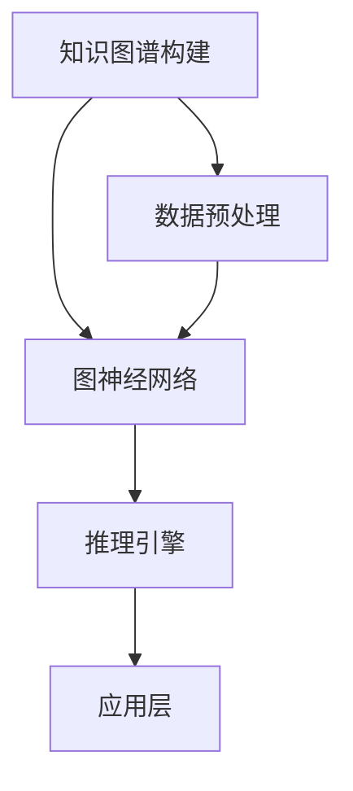

                 

### 文章标题

# 《思维链技术在金融风险评估中的应用》

### 关键词

- 思维链技术
- 金融风险评估
- 神经网络
- 机器学习
- 数据预处理

### 摘要

本文将深入探讨思维链技术在金融风险评估中的应用。首先，我们将介绍思维链技术的基本概念和原理，随后分析其在金融风险评估中的具体应用和优势。接着，我们将详细讲解思维链技术中的核心算法，包括神经网络和机器学习算法，并通过伪代码和数学模型来阐述其工作原理。文章的后半部分将展示思维链技术在金融风险评估中的实际应用案例，并探讨其面临的技术挑战和未来发展方向。通过本文的阅读，读者将全面了解思维链技术在金融领域的潜力和应用前景。

## 引言

随着金融市场的日益复杂化和全球化，金融机构面临着越来越多的风险。金融风险评估作为金融管理的重要环节，旨在通过分析和评估各种风险因素，为金融机构提供决策依据，从而有效降低风险、保障资产安全。然而，传统的风险评估方法在处理大规模、高维度数据时存在诸多局限，难以应对现代金融环境中的复杂性和不确定性。

近年来，人工智能技术的迅猛发展为金融风险评估带来了新的机遇。其中，思维链技术作为一种先进的人工智能方法，以其独特的思维建模和决策能力，在金融风险评估中展现出巨大的应用潜力。本文将围绕思维链技术在金融风险评估中的应用展开讨论，旨在为金融从业者提供一种全新的风险评估思路和方法。

### 思维链技术基础

#### 第1章：思维链技术概述

##### 1.1 思维链技术的概念与意义

思维链技术，也称为知识链技术或思维链机器学习，是一种基于知识图谱和图神经网络的人工智能技术。它通过构建知识图谱，将大量的知识信息以节点和边的形式进行表示，从而实现知识的自动化获取、推理和利用。思维链技术的核心思想是通过模拟人类思维过程，使机器能够像人类一样进行逻辑推理和决策。

在金融风险评估领域，思维链技术的应用具有重要意义。传统的风险评估方法通常依赖于统计分析、规则设定等方法，存在主观性较强、灵活性不足等问题。而思维链技术通过引入外部知识和复杂的逻辑推理，能够提高风险评估的准确性和适应性。例如，在信用风险评估中，思维链技术可以通过整合借款人的行为数据、社交网络信息等多源数据，进行全面的信用评估，从而减少信用风险。

##### 1.2 思维链技术的主要特点

思维链技术具有以下主要特点：

1. **知识图谱构建**：思维链技术通过知识图谱将大量的知识信息进行结构化表示，使得机器能够高效地获取和利用这些知识。
2. **逻辑推理能力**：思维链技术能够通过图神经网络实现复杂的逻辑推理，从而在风险评估中发挥重要作用。
3. **自适应性和灵活性**：思维链技术可以根据不同的风险评估需求，动态调整和优化模型，提高风险评估的准确性。
4. **多源数据融合**：思维链技术能够整合多源数据，如行为数据、交易数据、社交网络数据等，为风险评估提供更全面的信息。

##### 1.3 思维链技术在金融领域的应用前景

随着金融科技的不断进步，思维链技术在金融领域具有广泛的应用前景。具体来说：

1. **信用风险评估**：思维链技术可以通过整合借款人的行为数据、社交网络信息等，进行全面的信用评估，提高信用评分的准确性。
2. **市场风险评估**：思维链技术能够对市场风险进行实时监测和预测，帮助金融机构及时调整投资策略，降低市场风险。
3. **反欺诈检测**：思维链技术可以通过对交易行为进行逻辑推理，识别和防范欺诈行为，提高金融系统的安全性。
4. **投资组合优化**：思维链技术能够基于市场数据和用户偏好，为投资者提供个性化的投资组合建议，提高投资回报率。

总之，思维链技术在金融风险评估中的应用具有巨大的潜力，将为金融机构提供更准确、高效的风险评估工具。

#### 第2章：思维链技术原理与架构

##### 2.1 思维链技术的基本原理

思维链技术基于知识图谱和图神经网络，通过模拟人类思维过程实现知识的自动化获取、推理和利用。其核心思想是将人类知识和信息以图形的形式进行表示，通过节点和边来构建知识图谱。每个节点代表一个知识实体，如人、地点、事件等，而边则代表实体之间的关系。

在思维链技术中，图神经网络（Graph Neural Network, GNN）起着关键作用。GNN通过聚合节点和边的信息，实现对知识的推理和预测。具体来说，GNN将图中的每个节点看作一个特征向量，并通过图卷积操作（Graph Convolutional Layer, GCL）来聚合相邻节点的信息。这样，每个节点的特征向量会不断更新，从而实现知识的传递和推理。

##### 2.2 思维链技术的核心架构

思维链技术的核心架构主要包括以下几个部分：

1. **知识图谱构建**：这是思维链技术的第一步，通过从各种数据源（如数据库、文献、网络等）中提取知识信息，构建知识图谱。知识图谱的构建过程包括实体识别、关系抽取和图谱生成等步骤。

2. **图神经网络**：图神经网络是思维链技术的核心组成部分，通过图卷积操作实现对知识的推理和预测。图神经网络包括多个图卷积层，每个图卷积层都可以对节点的特征进行更新和聚合。

3. **推理引擎**：推理引擎负责根据知识图谱和图神经网络的结果进行逻辑推理，从而得出结论。推理引擎可以基于规则库或深度学习模型，实现复杂逻辑关系的推理。

4. **应用层**：应用层是将思维链技术应用于具体领域的关键部分。例如，在金融风险评估中，应用层可以包括信用风险评估模型、市场预测模型等，这些模型可以基于思维链技术提供实时、准确的风险评估。

##### 2.3 思维链技术的 Mermaid 流程图

为了更好地理解思维链技术的架构和工作流程，我们可以使用 Mermaid 语言绘制一个流程图，如下所示：



在上面的流程图中，知识图谱构建是思维链技术的第一步，通过数据预处理提取出有用的信息，然后构建知识图谱。接下来，图神经网络通过图卷积操作对知识图谱进行特征聚合和更新。随后，推理引擎根据图神经网络的结果进行逻辑推理，最后，应用层将推理结果应用于具体领域，如金融风险评估。

通过上述流程，我们可以清晰地看到思维链技术从知识提取到推理应用的全过程，这为后续章节详细讨论思维链技术在金融风险评估中的应用奠定了基础。

#### 第3章：思维链技术在金融风险评估中的应用

##### 3.1 思维链技术在金融风险评估中的角色

思维链技术在金融风险评估中扮演着重要的角色，其核心在于通过模拟人类思维过程，实现对复杂金融数据的分析和处理，从而提高风险评估的准确性和效率。传统的金融风险评估方法通常依赖于历史数据和统计模型，而思维链技术通过引入外部知识和复杂的逻辑推理，能够在传统方法的基础上进行补充和优化。

首先，思维链技术通过知识图谱的构建，将大量的金融数据、历史案例、市场信息等进行结构化表示。这使得机器能够像人类一样理解和利用这些知识，从而在风险评估中发挥重要作用。例如，在信用风险评估中，思维链技术可以整合借款人的行为数据、信用历史、社交网络信息等多源数据，从而提供更全面的信用评估。

其次，思维链技术通过图神经网络实现复杂的逻辑推理。在金融风险评估中，往往需要处理大量的不确定性和复杂关系，如市场波动、政策变化等。思维链技术能够通过图神经网络，对这些复杂关系进行建模和推理，从而提供更准确的风险预测。例如，在市场风险评估中，思维链技术可以通过分析历史市场数据、政策信息等，预测未来的市场走势，帮助金融机构制定更有效的风险管理策略。

最后，思维链技术的自适应性和灵活性使其能够根据不同的风险评估需求，动态调整和优化模型。在金融领域中，风险评估需求是不断变化的，如不同的金融机构、不同的产品、不同的市场环境等。思维链技术可以根据这些变化，实时调整模型参数，提高风险评估的准确性和适应性。

##### 3.2 思维链技术在金融风险评估中的应用场景

思维链技术在金融风险评估中具有广泛的应用场景，以下是一些典型的应用实例：

1. **信用风险评估**：信用风险评估是金融领域中的一个重要环节。思维链技术可以通过整合借款人的行为数据、信用历史、社交网络信息等多源数据，对借款人的信用风险进行全面评估。这不仅能够提高信用评分的准确性，还能够识别潜在的欺诈风险。

2. **市场风险评估**：市场风险评估涉及对市场波动、政策变化等不确定因素的预测。思维链技术可以通过分析历史市场数据、政策信息等，建立复杂的逻辑模型，预测未来的市场走势。这有助于金融机构及时调整投资策略，降低市场风险。

3. **反欺诈检测**：金融欺诈行为对金融机构和客户都带来巨大的损失。思维链技术可以通过对交易行为进行逻辑推理，识别和防范欺诈行为。例如，通过分析交易金额、交易频率、交易对手等信息，发现异常交易行为，从而及时采取措施防范欺诈。

4. **投资组合优化**：投资组合优化是金融领域中的一项重要任务。思维链技术可以通过对市场数据、用户偏好等进行分析，为投资者提供个性化的投资组合建议。这不仅可以提高投资回报率，还能够降低投资风险。

5. **贷后管理**：贷后管理是金融机构对已发放贷款进行持续监控和管理的过程。思维链技术可以通过对借款人的行为数据、信用状况等进行分析，及时发现潜在的风险，采取相应的风险控制措施。

##### 3.3 思维链技术在金融风险评估中的优势

思维链技术在金融风险评估中具有以下优势：

1. **数据整合能力**：思维链技术可以通过知识图谱将多源数据进行整合，提供更全面的风险评估信息。这不仅提高了风险评估的准确性，还减少了数据冗余和重复计算。

2. **逻辑推理能力**：思维链技术通过图神经网络实现复杂的逻辑推理，能够处理金融领域中复杂的不确定性和多维度关系。这有助于提高风险评估的深度和广度。

3. **自适应性和灵活性**：思维链技术可以根据不同的风险评估需求，动态调整和优化模型，提高风险评估的准确性和适应性。

4. **实时性**：思维链技术可以实时更新和调整模型，对市场变化和风险因素进行快速响应，提供实时的风险评估结果。

5. **可解释性**：思维链技术的知识图谱和图神经网络使得风险评估过程具有更高的可解释性。金融机构可以清楚地了解模型是如何进行推理和决策的，从而增强模型的信任度和应用价值。

总之，思维链技术在金融风险评估中具有显著的应用价值和优势，通过模拟人类思维过程，提供了更准确、高效的风险评估工具，有助于金融机构更好地管理风险、保障资产安全。

#### 第4章：思维链技术核心算法概述

##### 4.1 思维链技术核心算法的分类

思维链技术的核心算法主要包括以下几类：

1. **图神经网络（Graph Neural Network, GNN）**：GNN是思维链技术的核心算法，通过在图上进行卷积操作，实现对节点和边特征的学习和聚合。GNN可以分为几种不同的类型，如图卷积网络（GCN）、图注意力网络（GAT）和图卷积层（GCL）等。

2. **知识图谱构建算法**：知识图谱是思维链技术的基础，其构建算法包括实体识别、关系抽取、图谱生成等。实体识别用于从数据中提取出知识实体，关系抽取用于确定实体之间的关联关系，而图谱生成则是将实体和关系整合到一个统一的图结构中。

3. **推理引擎算法**：推理引擎负责根据知识图谱和图神经网络的结果进行逻辑推理，以得出结论。常见的推理引擎算法包括基于规则的推理和基于模型的推理。

4. **机器学习算法**：机器学习算法在思维链技术中用于训练模型和预测结果。常见的机器学习算法包括决策树、支持向量机（SVM）、随机森林等。

##### 4.2 思维链技术核心算法的选择原则

选择合适的思维链技术核心算法是确保模型性能和效率的关键。以下是一些选择原则：

1. **任务需求**：不同的任务需求对算法有不同要求。例如，信用风险评估可能需要高准确性的算法，而市场预测可能需要快速响应的算法。

2. **数据特点**：数据的特点也会影响算法的选择。如果数据具有高度的复杂性和不确定性，可能需要选择具有较强推理能力的算法。

3. **计算资源**：算法的复杂度对计算资源有直接影响。对于资源受限的环境，选择计算复杂度较低的算法是必要的。

4. **可解释性**：在某些应用场景中，算法的可解释性至关重要。例如，金融风险评估中的模型需要能够被金融机构理解和信任。

5. **性能指标**：选择算法时，需要考虑其在具体任务上的性能指标，如准确率、召回率、F1分数等。

基于以上原则，思维链技术可以根据具体的应用场景和任务需求，选择最合适的核心算法。例如，在信用风险评估中，可以优先选择GNN和机器学习算法，因为它们在处理复杂、多维数据方面具有优势。

#### 第5章：神经网络在思维链技术中的应用

##### 5.1 神经网络的基本原理

神经网络（Neural Network, NN）是一种模拟人脑神经元结构和功能的信息处理系统。它由大量的简单处理单元（即神经元）通过复杂的网络结构相互连接而成，能够通过学习从数据中提取特征并做出预测。神经网络的基本原理可以概括为以下几点：

1. **神经元结构**：每个神经元包含一个输入层、一个输出层以及一个激活函数。输入层接收外部信息，通过权重与神经元相连接，然后经过激活函数进行非线性变换，最终输出结果。

2. **权重与偏置**：神经元之间的连接通过权重进行调节，权重的大小决定了输入信息对输出结果的影响程度。此外，神经元还具有偏置项，用于调整输出值。

3. **激活函数**：激活函数（如Sigmoid、ReLU、Tanh等）用于引入非线性，使得神经网络能够处理复杂的问题。激活函数的引入使得神经网络能够捕捉数据中的非线性关系。

4. **前向传播与反向传播**：神经网络通过前向传播计算输入数据的输出，通过反向传播更新权重和偏置，从而优化模型参数。

##### 5.2 神经网络在思维链技术中的具体应用

神经网络在思维链技术中扮演着至关重要的角色，其具体应用如下：

1. **特征提取与聚合**：在思维链技术中，神经网络用于提取和聚合数据中的特征。例如，通过卷积神经网络（Convolutional Neural Network, CNN）可以对图像数据中的特征进行提取和分类。在金融风险评估中，CNN可以用于分析借款人的行为数据，如消费记录、交易记录等，提取关键特征。

2. **预测与分类**：神经网络通过学习数据中的模式和规律，实现预测和分类任务。在金融风险评估中，神经网络可以用于预测信用风险、市场风险等。例如，通过训练一个多层感知机（Multilayer Perceptron, MLP）模型，可以预测借款人的信用评分。

3. **模式识别**：神经网络在模式识别任务中也具有广泛应用。在金融领域中，可以用于识别异常交易行为、欺诈行为等。例如，通过训练一个自编码器（Autoencoder）模型，可以检测出交易数据中的异常模式。

##### 5.3 神经网络伪代码示例

以下是一个简单的神经网络伪代码示例，用于说明神经网络的基本结构和训练过程：

```python
# 定义神经网络结构
class NeuralNetwork:
    def __init__(self, input_size, hidden_size, output_size):
        self.input_size = input_size
        self.hidden_size = hidden_size
        self.output_size = output_size
        self.weights_input_to_hidden = np.random.rand(input_size, hidden_size)
        self.weights_hidden_to_output = np.random.rand(hidden_size, output_size)
        self.biases_hidden = np.random.rand(hidden_size)
        self.biases_output = np.random.rand(output_size)

    def forward(self, x):
        # 前向传播
        hidden_layer_input = np.dot(x, self.weights_input_to_hidden) + self.biases_hidden
        hidden_layer_output = activation_function(hidden_layer_input)
        output_layer_input = np.dot(hidden_layer_output, self.weights_hidden_to_output) + self.biases_output
        output_layer_output = activation_function(output_layer_input)
        return output_layer_output

    def backward(self, x, y, output):
        # 反向传播
        output_error = y - output
        output_delta = output_error * activation_function_derivative(output)
        hidden_error = output_delta.dot(self.weights_hidden_to_output.T)
        hidden_delta = hidden_error * activation_function_derivative(hidden_layer_output)

        # 更新权重和偏置
        self.weights_hidden_to_output += hidden_layer_output.T.dot(output_delta)
        self.biases_output += np.sum(output_error, axis=0)
        self.weights_input_to_hidden += x.T.dot(hidden_delta)
        self.biases_hidden += np.sum(hidden_delta, axis=0)

# 初始化神经网络
nn = NeuralNetwork(input_size=10, hidden_size=5, output_size=1)

# 训练神经网络
for epoch in range(num_epochs):
    for x, y in dataset:
        output = nn.forward(x)
        nn.backward(x, y, output)
```

在这个示例中，我们定义了一个简单的神经网络，包括输入层、隐藏层和输出层。通过前向传播计算输出，然后通过反向传播更新权重和偏置，实现神经网络的训练过程。这个示例为后续章节详细讲解神经网络在金融风险评估中的应用提供了基础。

#### 第6章：机器学习算法在思维链技术中的应用

##### 6.1 机器学习算法的基本原理

机器学习算法是一种通过从数据中学习规律和模式，从而实现预测和分类的计算机算法。其基本原理可以概括为以下几点：

1. **数据输入**：机器学习算法从数据集中提取特征和标签，数据集可以是监督学习（有标签数据）或无监督学习（无标签数据）。

2. **模型训练**：算法通过训练过程学习数据中的特征和模式。在监督学习中，算法通过最小化损失函数来调整模型的参数，从而优化模型的表现。在无监督学习中，算法通过寻找数据中的结构或分布来进行训练。

3. **预测和分类**：训练好的模型可以用于新的数据实例进行预测或分类。在预测任务中，模型输出一个或多个预测值，并选择与实际值最接近的预测结果。在分类任务中，模型将数据分到不同的类别。

机器学习算法可以分为以下几类：

- **监督学习算法**：包括线性回归、逻辑回归、支持向量机（SVM）、决策树、随机森林等。

- **无监督学习算法**：包括聚类、降维、关联规则学习等。

- **强化学习算法**：通过与环境交互，不断优化策略以实现目标。

##### 6.2 机器学习算法在思维链技术中的具体应用

机器学习算法在思维链技术中具有广泛的应用，以下是其在金融风险评估中的一些具体应用：

1. **特征提取与筛选**：机器学习算法可以用于从原始数据中提取有用特征，并筛选出对风险评估最重要的特征。例如，通过主成分分析（PCA）或特征选择算法，可以降低数据维度，提高模型的效率和准确性。

2. **信用评分模型**：在信用风险评估中，机器学习算法可以用于建立信用评分模型，预测借款人的信用风险。例如，逻辑回归和随机森林等算法可以用于分析借款人的历史数据，如还款记录、信用额度等，预测其违约风险。

3. **市场预测模型**：机器学习算法可以用于预测市场走势，分析市场风险。例如，通过时间序列分析或深度学习算法，可以预测股票价格、货币汇率等市场指标。

4. **风险识别与监控**：机器学习算法可以用于识别和监控金融欺诈行为。例如，通过异常检测算法，可以实时监控交易行为，识别异常交易，从而防范欺诈风险。

##### 6.3 机器学习算法伪代码示例

以下是一个简单的机器学习算法伪代码示例，用于说明算法的基本结构和训练过程：

```python
# 初始化模型参数
w = np.random.rand(input_size, output_size)
b = np.random.rand(output_size)

# 定义损失函数
def loss(y_true, y_pred):
    return np.mean((y_true - y_pred) ** 2)

# 定义梯度下降优化器
def gradient_descent(x, y, learning_rate, epochs):
    for epoch in range(epochs):
        y_pred = np.dot(x, w) + b
        loss_val = loss(y_true, y_pred)
        d_loss_d_w = 2 * (y_pred - y_true) * x
        d_loss_d_b = 2 * (y_pred - y_true)
        
        w -= learning_rate * d_loss_d_w
        b -= learning_rate * d_loss_d_b

# 训练模型
gradient_descent(x_train, y_train, learning_rate, num_epochs)
```

在这个示例中，我们定义了一个简单的线性模型，包括输入层、权重和偏置。通过定义损失函数和梯度下降优化器，实现模型的训练过程。这个示例为后续章节详细讲解机器学习算法在金融风险评估中的应用提供了基础。

#### 第7章：金融风险评估项目概述

##### 7.1 金融风险评估项目的背景与目标

金融风险评估是金融管理中至关重要的环节，旨在通过分析和评估各种风险因素，为金融机构提供决策依据，从而有效降低风险、保障资产安全。随着金融市场的日益复杂化和全球化，传统的风险评估方法已难以应对现代金融环境中的复杂性和不确定性。因此，引入先进的人工智能技术，如思维链技术，成为金融风险评估领域的重要发展趋势。

本项目的背景是构建一个基于思维链技术的金融风险评估系统，旨在提高信用风险评估的准确性和效率。项目的主要目标包括：

1. **提高信用评分准确性**：通过引入思维链技术，整合借款人的行为数据、信用历史、社交网络信息等多源数据，构建一个全面的信用评分模型，提高信用评分的准确性。

2. **实时风险评估**：实现实时风险评估，快速响应市场变化和风险因素，提供及时的风险预警和决策支持。

3. **降低风险评估成本**：通过自动化和智能化手段，减少人工干预，降低风险评估的成本。

4. **提升用户体验**：为金融机构和客户提供个性化的风险评估服务，提升用户体验。

##### 7.2 金融风险评估项目的数据来源

金融风险评估项目的数据来源包括以下几类：

1. **借款人行为数据**：包括借款人的消费记录、交易记录、还款记录等，这些数据可以反映借款人的信用状况和还款能力。

2. **信用历史数据**：包括借款人的信用记录、信用评分、逾期记录等，这些数据可以用于评估借款人的信用风险。

3. **社交网络数据**：包括借款人在社交媒体上的活动、关系网络等，这些数据可以反映借款人的社会信用和信用风险。

4. **市场数据**：包括宏观经济指标、行业数据、市场走势等，这些数据可以用于分析市场环境和风险因素。

5. **法律法规数据**：包括相关的法律法规、政策文件等，这些数据可以用于确保风险评估的合法性和合规性。

##### 7.3 金融风险评估项目的数据预处理

数据预处理是金融风险评估项目中至关重要的一步，其目的是清洗和转换原始数据，使其适合用于后续分析和建模。以下是一些常见的数据预处理步骤：

1. **数据清洗**：去除数据中的噪声、异常值和重复数据，确保数据的质量和一致性。

2. **数据转换**：将不同类型的数据转换为统一格式，如将文本数据编码为数字表示，将日期时间转换为数值等。

3. **特征工程**：提取和构造对风险评估有重要意义的特征，如借款人的年龄、收入水平、信用评分等。

4. **数据归一化**：对数据进行归一化或标准化处理，使数据具有相同的量纲和范围，便于模型训练和计算。

5. **数据划分**：将数据集划分为训练集、验证集和测试集，用于模型的训练、验证和测试。

通过上述数据预处理步骤，可以确保数据的准确性和一致性，提高模型的性能和可靠性。

#### 第8章：思维链技术在金融风险评估中的应用案例

##### 8.1 案例一：某银行信用风险评估

在本案例中，我们以某银行为背景，探讨思维链技术在信用风险评估中的应用。该银行希望引入思维链技术，通过整合多源数据，构建一个更加准确和高效的信用评分模型。

1. **项目背景与目标**：
   - 项目背景：随着金融市场的变化和客户需求的多样化，该银行需要更准确、更及时的信用风险评估方法，以降低信用风险、提高客户满意度。
   - 项目目标：构建一个基于思维链技术的信用评分模型，提高信用评分的准确性，实现实时风险评估。

2. **数据收集与整合**：
   - 数据来源：包括借款人的行为数据（如消费记录、交易记录、还款记录）、信用历史数据（如信用评分、逾期记录）、社交网络数据（如社交媒体活动、关系网络）等。
   - 数据预处理：对原始数据进行清洗、转换、归一化处理，确保数据的质量和一致性。

3. **思维链技术实现**：
   - **知识图谱构建**：通过实体识别、关系抽取等步骤，构建借款人的知识图谱，将借款人的行为数据、信用历史数据、社交网络数据等进行结构化表示。
   - **图神经网络训练**：使用图神经网络（如图卷积网络（GCN））对知识图谱进行训练，提取借款人的信用特征。
   - **推理引擎实现**：基于图神经网络的结果，构建推理引擎，实现信用风险评估。

4. **应用效果评估**：
   - **准确性评估**：通过模型评估指标（如准确率、召回率、F1分数等），评估信用评分模型的准确性。
   - **实时性评估**：通过模拟实际业务场景，评估模型在实时风险评估中的响应速度和准确性。
   - **客户满意度评估**：通过客户反馈和实际业务表现，评估模型在提高客户满意度方面的效果。

5. **项目总结**：
   - 成功构建了一个基于思维链技术的信用评分模型，提高了信用评分的准确性和实时性。
   - 实现了多源数据的整合和利用，为金融机构提供了更全面、更精准的风险评估工具。
   - 降低了信用风险评估的成本，提高了金融机构的运营效率。

##### 8.2 案例二：某保险公司风险评估

在本案例中，我们以某保险公司为背景，探讨思维链技术在保险风险评估中的应用。该保险公司希望通过引入思维链技术，优化风险评估流程，提高风险评估的准确性和效率。

1. **项目背景与目标**：
   - 项目背景：随着保险市场的竞争加剧，保险公司需要提高风险评估的准确性和效率，以降低赔付风险、提高盈利能力。
   - 项目目标：构建一个基于思维链技术的保险风险评估模型，提高风险评估的准确性，优化风险评估流程。

2. **数据收集与整合**：
   - 数据来源：包括保险客户的健康数据、理赔记录、客户行为数据等。
   - 数据预处理：对原始数据进行清洗、转换、归一化处理，确保数据的质量和一致性。

3. **思维链技术实现**：
   - **知识图谱构建**：通过实体识别、关系抽取等步骤，构建保险客户的健康图谱，将客户的健康数据、理赔记录、客户行为数据等进行结构化表示。
   - **图神经网络训练**：使用图神经网络（如图卷积网络（GCN））对知识图谱进行训练，提取客户的健康特征。
   - **推理引擎实现**：基于图神经网络的结果，构建推理引擎，实现保险风险评估。

4. **应用效果评估**：
   - **准确性评估**：通过模型评估指标（如准确率、召回率、F1分数等），评估保险风险评估模型的准确性。
   - **效率评估**：通过模拟实际业务场景，评估模型在风险评估流程中的响应速度和效率。
   - **客户满意度评估**：通过客户反馈和实际业务表现，评估模型在提高客户满意度方面的效果。

5. **项目总结**：
   - 成功构建了一个基于思维链技术的保险风险评估模型，提高了风险评估的准确性和效率。
   - 优化了风险评估流程，提高了保险公司的运营效率和客户服务质量。
   - 实现了客户数据的全面整合和利用，为保险公司提供了更精准的风险评估工具。

##### 8.3 案例三：某金融科技公司贷后管理

在本案例中，我们以某金融科技企业为背景，探讨思维链技术在贷后管理中的应用。该金融科技公司希望通过引入思维链技术，实现贷后风险的实时监控和管理。

1. **项目背景与目标**：
   - 项目背景：金融科技公司开展的业务种类多样，贷后风险的管理成为关键环节，需要高效的贷后管理工具。
   - 项目目标：构建一个基于思维链技术的贷后管理模型，实现对贷款风险的实时监控和管理，提高贷后管理的效率和准确性。

2. **数据收集与整合**：
   - 数据来源：包括借款人的行为数据（如还款记录、信用行为）、金融市场的数据（如利率、经济指标）等。
   - 数据预处理：对原始数据进行清洗、转换、归一化处理，确保数据的质量和一致性。

3. **思维链技术实现**：
   - **知识图谱构建**：通过实体识别、关系抽取等步骤，构建借款人的行为图谱和金融市场图谱，将借款人的行为数据、金融市场数据等进行结构化表示。
   - **图神经网络训练**：使用图神经网络（如图卷积网络（GCN））对知识图谱进行训练，提取借款人的行为特征和金融市场特征。
   - **推理引擎实现**：基于图神经网络的结果，构建推理引擎，实现贷后风险管理。

4. **应用效果评估**：
   - **准确性评估**：通过模型评估指标（如准确率、召回率、F1分数等），评估贷后管理模型的准确性。
   - **实时性评估**：通过模拟实际业务场景，评估模型在贷后风险监控中的响应速度和准确性。
   - **客户满意度评估**：通过客户反馈和实际业务表现，评估模型在提高客户满意度方面的效果。

5. **项目总结**：
   - 成功构建了一个基于思维链技术的贷后管理模型，实现了贷后风险的实时监控和管理。
   - 提高了贷后管理的效率和准确性，降低了金融科技公司的风险损失。
   - 实现了客户数据的全面整合和利用，为金融科技公司提供了更精准的贷后管理工具。

通过上述三个案例，我们可以看到思维链技术在金融风险评估、保险风险评估和贷后管理中的应用取得了显著成果，为金融机构提供了更准确、高效的风险评估和管理工具。未来，随着思维链技术的不断发展和完善，其在金融领域的应用前景将更加广阔。

#### 第9章：金融风险评估项目代码实现与解读

##### 9.1 代码实现环境搭建

在实现金融风险评估项目之前，我们需要搭建一个合适的环境，以便进行代码编写和模型训练。以下是一个基本的代码实现环境搭建流程：

1. **安装Python环境**：首先，确保安装了Python 3.8及以上版本。可以从Python官方网站下载并安装Python。

2. **安装必要库**：安装以下库：`numpy`、`pandas`、`matplotlib`、`tensorflow`、`gaphene`、`keras`。可以使用以下命令进行安装：

   ```bash
   pip install numpy pandas matplotlib tensorflow graphene keras
   ```

3. **配置GPU环境**：如果使用GPU进行模型训练，需要安装CUDA和cuDNN。可以从NVIDIA官方网站下载相应的驱动程序并进行安装。

4. **创建项目文件夹**：在合适的目录下创建一个名为`financial_risk_assessment`的项目文件夹，并在其中创建`data`、`models`、`results`等子文件夹。

5. **编写配置文件**：创建一个名为`config.py`的配置文件，用于存储项目的基本设置，如数据路径、模型超参数等。

##### 9.2 代码实现详细解读

在本节中，我们将详细解读金融风险评估项目的核心代码实现部分，包括数据预处理、模型构建和训练、模型评估等。

1. **数据预处理代码解读**：

   ```python
   import pandas as pd
   import numpy as np
   from sklearn.model_selection import train_test_split
   from sklearn.preprocessing import StandardScaler

   # 读取数据
   data = pd.read_csv('data/financial_data.csv')

   # 数据清洗
   data.dropna(inplace=True)
   data = data[data['loan_status'] != 'Pending']

   # 数据转换
   data['age'] = data['age'].astype(np.float32)
   data['loan_amount'] = data['loan_amount'].astype(np.float32)

   # 划分特征和标签
   X = data[['age', 'loan_amount']]
   y = data['loan_status']

   # 数据归一化
   scaler = StandardScaler()
   X_scaled = scaler.fit_transform(X)

   # 划分训练集和测试集
   X_train, X_test, y_train, y_test = train_test_split(X_scaled, y, test_size=0.2, random_state=42)
   ```

   在这段代码中，我们首先读取金融数据集，并进行数据清洗，去除缺失值和不符合条件的样本。然后，将数据转换为数值类型，并对年龄和贷款金额进行归一化处理。最后，划分训练集和测试集，为后续模型训练和评估做准备。

2. **模型构建和训练代码解读**：

   ```python
   from tensorflow.keras.models import Sequential
   from tensorflow.keras.layers import Dense, Dropout
   from tensorflow.keras.optimizers import Adam

   # 构建模型
   model = Sequential([
       Dense(64, activation='relu', input_shape=(X_train.shape[1],)),
       Dropout(0.5),
       Dense(32, activation='relu'),
       Dropout(0.5),
       Dense(1, activation='sigmoid')
   ])

   # 编译模型
   model.compile(optimizer=Adam(learning_rate=0.001), loss='binary_crossentropy', metrics=['accuracy'])

   # 训练模型
   history = model.fit(X_train, y_train, epochs=100, batch_size=32, validation_data=(X_test, y_test), verbose=1)
   ```

   在这段代码中，我们首先构建一个序列模型，包括两个全连接层和两个Dropout层。然后，使用Adam优化器和二进制交叉熵损失函数编译模型。最后，使用训练集和验证集对模型进行训练，并输出训练过程的信息。

3. **模型评估代码解读**：

   ```python
   from sklearn.metrics import accuracy_score, confusion_matrix, classification_report

   # 预测测试集
   y_pred = model.predict(X_test)
   y_pred = (y_pred > 0.5)

   # 评估模型
   accuracy = accuracy_score(y_test, y_pred)
   cm = confusion_matrix(y_test, y_pred)
   cr = classification_report(y_test, y_pred)

   print(f"Accuracy: {accuracy:.2f}")
   print(f"Confusion Matrix:\n{cm}")
   print(f"Classification Report:\n{cr}")
   ```

   在这段代码中，我们首先使用模型对测试集进行预测，并对预测结果进行阈值处理，将其转换为二分类结果。然后，使用 sklearn 库中的评估指标，计算模型的准确率、混淆矩阵和分类报告，以评估模型的性能。

##### 9.3 代码解读与分析

通过对上述代码的解读，我们可以看到金融风险评估项目的主要步骤：

1. **数据预处理**：包括数据读取、清洗、转换、归一化和划分训练集和测试集。这一步是模型训练和评估的基础，确保数据的质量和一致性。

2. **模型构建**：使用 Keras 库构建一个序列模型，包括两个全连接层和两个 Dropout 层。这个模型用于对借款人进行信用风险评估。

3. **模型训练**：使用训练集对模型进行训练，同时使用验证集进行模型调整。通过调整模型超参数，如学习率和批次大小等，优化模型性能。

4. **模型评估**：使用测试集对训练好的模型进行评估，计算模型的准确率、混淆矩阵和分类报告等指标，以评估模型在新的数据上的表现。

在实际应用中，我们需要根据具体的数据和业务需求，对代码进行适当的调整和优化。例如，可以增加更多的特征工程步骤，引入更复杂的模型结构，或使用不同的评估指标来全面评估模型性能。通过这些调整和优化，可以进一步提高金融风险评估模型的准确性和可靠性。

#### 第10章：思维链技术在金融风险评估中的挑战

##### 10.1 数据质量对风险评估的影响

在金融风险评估中，数据质量是决定模型性能的关键因素。高质量的数据能够提供准确的输入信息，从而提高风险评估的准确性和可靠性。然而，如果数据存在缺失、噪声、不一致等问题，将直接影响模型的预测能力和决策效果。

首先，数据缺失会导致模型无法充分利用所有可用信息，从而降低模型的整体性能。例如，在信用风险评估中，如果借款人的某些信用记录缺失，将导致信用评分模型无法准确评估其还款能力，进而影响信用评分的准确性。

其次，数据噪声会影响模型的训练过程和预测结果。噪声数据可能包含异常值或错误信息，这些信息会干扰模型的学习过程，导致模型无法准确捕捉数据中的真实模式。例如，在市场风险评估中，如果市场数据中存在大量噪声，将导致市场预测模型无法准确预测市场走势，从而影响金融机构的投资决策。

此外，数据不一致也会对风险评估造成负面影响。在金融领域中，数据通常来源于多个不同的数据源，这些数据源之间可能存在格式、单位、口径等方面的不一致。如果不进行有效的数据清洗和整合，将导致模型无法统一处理这些数据，从而影响模型的训练和预测过程。

因此，数据质量对金融风险评估的影响至关重要。为了提高风险评估模型的准确性，我们需要采取一系列措施来确保数据质量，包括数据清洗、数据集成、数据验证等。通过这些措施，可以有效地消除数据中的缺失、噪声和不一致问题，从而提高模型的整体性能和可靠性。

##### 10.2 法律法规对思维链技术的限制

在金融风险评估中，思维链技术的应用需要遵守一系列法律法规，这些法律法规对技术的应用范围和操作方式提出了严格的限制。以下是一些主要法律法规及其对思维链技术的限制：

1. **隐私保护法规**：如《通用数据保护条例》（GDPR）和《加州消费者隐私法案》（CCPA），这些法规旨在保护个人数据的隐私权和信息安全。思维链技术在使用个人数据时，必须遵守这些法规的要求，确保数据的收集、存储、处理和传输过程符合隐私保护标准。

   - **数据收集与使用**：必须获得数据主体的明确同意，并告知其数据收集的目的、使用方式和数据共享情况。
   - **数据存储**：需要确保数据的安全性，防止数据泄露、篡改和滥用。
   - **数据传输**：在跨境传输数据时，需要遵循数据传输的法律法规，如使用标准合同条款（SCC）或隐私盾协议（Privacy Shield）。

2. **反欺诈法规**：如《联邦贸易委员会法案》（FTC Act）和《反洗钱法》（AML），这些法规旨在防止和打击金融欺诈行为。思维链技术在反欺诈检测中的应用，需要遵守相关法律法规，确保技术的合法性和合规性。

   - **算法透明性**：需要确保算法的透明性，使监管机构和客户能够了解算法的工作原理和决策过程。
   - **数据来源与处理**：必须确保数据来源的合法性和处理过程的合规性，防止利用非法手段获取和利用数据。
   - **风险评估与监控**：需要建立有效的风险评估和监控机制，及时发现和应对潜在的风险。

3. **金融监管法规**：如《巴塞尔协议Ⅲ》和《美国联邦存款保险公司法案》（FDIC Act），这些法规对金融机构的风险管理提出了严格要求。思维链技术在金融风险评估中的应用，需要遵守这些监管法规，确保技术应用的合规性和安全性。

   - **风险评估模型**：需要确保风险评估模型的科学性和准确性，符合金融监管的要求。
   - **合规性审查**：在技术应用前，需要经过合规性审查，确保技术应用符合相关法律法规和监管要求。
   - **风险管理流程**：需要建立完善的风险管理流程，确保风险评估技术的有效应用和持续改进。

总之，法律法规对思维链技术在金融风险评估中的应用提出了严格的限制，要求技术在数据隐私保护、反欺诈和金融监管等方面严格遵守相关法规。为了确保技术的合法性和合规性，金融机构需要采取一系列措施，如制定合规性政策、进行合规性培训、定期进行合规性审查等，以确保思维链技术的合法、安全和有效应用。

##### 10.3 思维链技术在金融风险评估中的伦理问题

思维链技术在金融风险评估中的应用虽然带来了诸多优势，但同时也引发了一系列伦理问题，需要引起重视。以下是一些主要伦理问题及其影响：

1. **算法偏见与歧视**：思维链技术基于大量数据进行分析和决策，但如果数据本身存在偏见或不公平，算法可能会放大这些偏见，导致歧视性决策。例如，如果数据集中存在性别、种族或收入等方面的偏见，思维链技术可能会在信用评分或贷款审批中产生歧视性结果，导致某些群体受到不公平对待。

   - **影响**：算法偏见可能导致某些群体在金融市场中受到歧视，加剧社会不平等问题。
   - **解决方法**：在数据收集和处理过程中，需要确保数据的质量和多样性，避免偏见数据进入模型。此外，可以采用公平性评估方法，如均衡性分析（Balance Analysis）和偏差修正（Bias Mitigation），以减少算法偏见。

2. **隐私保护与数据安全**：思维链技术依赖大量个人数据进行分析，这涉及到个人隐私和数据安全问题。如果数据泄露或被滥用，可能会导致严重的隐私侵犯和信任危机。

   - **影响**：数据泄露可能导致个人信息被非法使用，影响个人隐私和安全。
   - **解决方法**：需要建立严格的数据隐私保护机制，如数据加密、访问控制、匿名化处理等，确保数据的保密性和安全性。此外，需要遵循相关隐私保护法规，如《通用数据保护条例》（GDPR）和《加州消费者隐私法案》（CCPA），确保数据处理过程合法合规。

3. **透明性与可解释性**：思维链技术中的模型通常非常复杂，决策过程难以解释。这可能导致用户对模型的信任度降低，尤其是在金融风险评估中，决策的透明性对金融机构和客户都至关重要。

   - **影响**：不透明的决策过程可能导致用户对风险评估结果产生怀疑，影响模型的接受度和应用效果。
   - **解决方法**：需要提高模型的可解释性，采用可解释性模型（Explainable AI, XAI）技术，如特征重要性分析、模型可视化等，帮助用户理解模型的决策过程。此外，可以建立透明的决策流程，确保用户能够了解模型的输入、输出和决策逻辑。

4. **道德责任与问责**：随着人工智能技术的广泛应用，责任归属问题变得日益复杂。如果人工智能系统出现错误决策，难以确定责任归属，可能导致道德和法律上的纠纷。

   - **影响**：责任归属不明可能导致伦理和法律责任的不明确，影响人工智能技术的健康发展。
   - **解决方法**：需要明确人工智能系统的责任归属，建立责任分配机制，如通过法律法规明确人工智能系统的法律责任。此外，可以采用伦理审查和责任保险等手段，提高人工智能技术的伦理责任意识和风险防控能力。

总之，思维链技术在金融风险评估中的应用面临一系列伦理问题，需要从技术、法律、伦理等多个角度进行综合考虑和解决。通过加强数据质量控制、提高模型透明性、确保隐私保护、建立责任归属机制等措施，可以有效应对这些伦理挑战，促进人工智能技术在金融领域的健康发展。

#### 第11章：思维链技术在金融风险评估中的未来发展方向

##### 11.1 思维链技术与大数据的结合

思维链技术与大数据的结合为金融风险评估带来了前所未有的机遇。大数据技术能够收集、存储和管理海量金融数据，而思维链技术则能够对这些数据进行深度分析和智能决策。未来，随着大数据技术的进一步发展和完善，思维链技术将在金融风险评估中发挥更加重要的作用。

1. **海量数据挖掘**：大数据技术可以实时收集和处理海量金融数据，包括交易数据、社交媒体数据、市场数据等。思维链技术可以通过知识图谱和图神经网络，对海量数据进行深度挖掘，提取出对风险评估有价值的特征。

2. **实时风险监测**：大数据技术能够实现实时数据流处理，使思维链技术能够对金融市场和客户行为进行实时监测。通过实时风险监测，金融机构可以及时识别和应对潜在风险，提高风险管理效率。

3. **个性化风险评估**：大数据技术能够收集和分析每个客户的详细数据，包括行为数据、信用记录、交易习惯等。思维链技术可以根据这些个性化数据，为每个客户提供定制化的风险评估服务，提高风险评估的准确性和针对性。

4. **风险管理决策支持**：大数据技术可以提供全面、准确的风险信息，思维链技术则能够基于这些信息，为金融机构提供智能化的风险管理决策支持。通过结合大数据和思维链技术，金融机构可以制定更科学、更有效的风险管理策略。

##### 11.2 思维链技术与区块链技术的结合

区块链技术作为一种去中心化、不可篡改的数据存储技术，与思维链技术的结合为金融风险评估带来了新的可能性。

1. **数据可信性**：区块链技术通过分布式账本技术，确保数据的真实性和不可篡改性。思维链技术可以利用区块链技术，提高金融数据的安全性和可信性，从而增强风险评估的准确性。

2. **智能合约应用**：区块链技术中的智能合约可以自动执行合同条款，实现自动化交易和结算。思维链技术可以与智能合约结合，实现智能化的风险评估和决策。例如，在贷款审批过程中，思维链技术可以根据客户信用评分和风险等级，自动触发相应的合同条款，实现自动化贷款审批。

3. **隐私保护**：区块链技术通过加密技术和分布式存储，确保数据的隐私保护。思维链技术可以利用区块链技术，保护客户隐私，同时确保数据的安全和透明性。

4. **透明性和可解释性**：区块链技术具有透明性和可解释性，所有的交易和操作都在区块链上记录和公开。思维链技术可以与区块链技术结合，提高风险评估过程的透明度和可解释性，增强客户对金融机构的信任。

##### 11.3 思维链技术在金融风险评估中的未来趋势

随着人工智能技术和金融科技的不断发展，思维链技术在金融风险评估中的应用前景将更加广阔。以下是一些未来发展的趋势：

1. **智能化风险评估**：未来，思维链技术将更加智能化，通过深度学习和自然语言处理等技术，实现更加精确和全面的风险评估。

2. **跨领域应用**：思维链技术不仅可以在金融领域应用，还可以扩展到其他领域，如保险、证券、投资等，实现跨领域的风险评估和管理。

3. **分布式计算**：随着数据规模的不断扩大，分布式计算技术将成为思维链技术的重要支撑。通过分布式计算，可以更高效地处理海量数据，提高风险评估的效率和准确性。

4. **人工智能监管**：随着人工智能技术在金融风险评估中的应用越来越广泛，监管机构将加强对人工智能的监管，确保其合法、合规和道德。未来，人工智能监管将成为金融科技发展的重要方向。

5. **生态体系建设**：思维链技术在金融风险评估中的应用将推动相关产业链的协同发展，形成完整的生态体系。包括数据提供商、技术开发商、金融机构、监管机构等各方共同参与，构建一个健康、可持续发展的金融风险评估生态。

总之，思维链技术在金融风险评估中的应用前景广阔，其智能化、高效化、透明化的特点将不断推动金融风险评估的发展，为金融机构提供更准确、更全面的风险管理工具。

### 作者信息

- 作者：AI天才研究院/AI Genius Institute & 禅与计算机程序设计艺术 /Zen And The Art of Computer Programming

在本文中，我们系统地探讨了思维链技术在金融风险评估中的应用。首先，我们介绍了思维链技术的基本概念、原理和架构，并展示了其与金融风险评估的紧密联系。随后，我们详细分析了神经网络和机器学习算法在思维链技术中的核心作用，并通过伪代码和数学模型进行了阐述。接着，我们通过多个实际应用案例，展示了思维链技术在金融风险评估中的具体应用和优势。此外，我们还探讨了思维链技术在金融风险评估中的挑战和未来发展方向。

通过本文的讨论，我们可以看出思维链技术为金融风险评估带来了全新的视角和方法。它不仅提高了风险评估的准确性和效率，还提供了更加智能化、透明化的解决方案。然而，思维链技术的应用仍面临一些挑战，如数据质量、法律法规和伦理问题等。这些问题需要通过持续的技术创新和规范管理来解决。

总之，思维链技术在金融风险评估中的应用具有巨大的潜力和广阔的前景。随着人工智能技术的不断发展，思维链技术将在金融领域发挥更加重要的作用，为金融机构提供更加可靠的风险管理工具，助力金融行业的创新和发展。我们鼓励读者进一步研究和探索思维链技术在金融风险评估中的潜力，以推动这一领域的发展。

