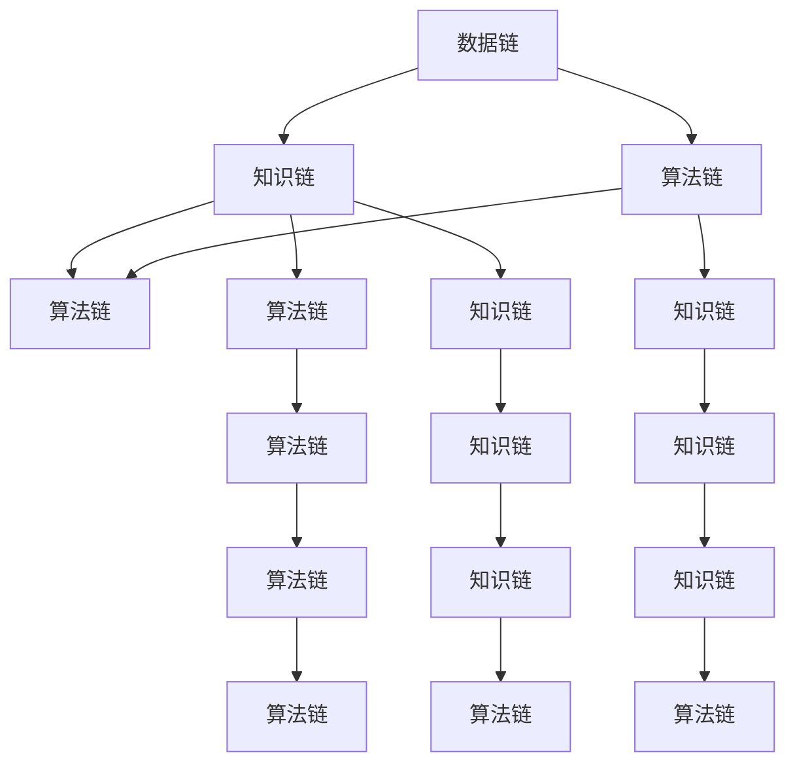

                 


### 《思维链技术：增强AI问题解决能力的新途径》

关键词：思维链技术，AI问题解决，增强学习能力，数据链，知识链，算法链，算法组合，智能应用案例

摘要：本文深入探讨了思维链技术，这是一种新兴的AI技术，通过构建数据链、知识链和算法链，旨在提升AI系统的自主学习和问题解决能力。文章将从基本概念、核心算法、应用场景和未来趋势四个方面展开，详细分析思维链技术如何增强AI的智能水平。

---

#### 引言

人工智能（AI）作为当今科技领域的热点，已经深刻影响了各个行业，从自动驾驶到智能医疗，从金融风控到智能家居，AI的应用无处不在。然而，传统AI技术面临着一些固有的挑战，如数据依赖性高、问题解决能力有限、缺乏跨领域的通用性等。为了克服这些挑战，研究者们提出了思维链技术，这是一种旨在提升AI问题解决能力和学习能力的新途径。

思维链技术通过构建数据链、知识链和算法链，将不同的AI技术和方法有机结合，形成一个协同工作的智能系统。数据链负责数据采集、清洗和预处理；知识链负责知识表示、推理和应用；算法链则负责算法的组合、优化和评估。本文将按照以下结构进行论述：

1. **思维链技术概述**：介绍思维链技术的基本概念、原理和应用领域。
2. **思维链技术的核心概念与架构**：分析思维链的核心概念和架构设计。
3. **思维链技术的关键算法**：探讨数据链、知识链和算法链的关键算法。
4. **思维链技术在AI问题解决中的应用**：分析思维链技术如何提升AI问题解决能力。
5. **思维链技术的未来发展趋势**：预测思维链技术的未来发展方向和挑战。

#### 第一部分：思维链技术概述

##### 第1章：思维链技术的基本概念与原理

**1.1.1 思维链技术的定义与特点**

思维链技术是一种基于人工智能的技术框架，旨在通过构建数据链、知识链和算法链，实现AI系统的自主学习和问题解决能力。与传统AI技术相比，思维链技术具有以下几个特点：

- **整合性**：思维链技术将不同的AI技术和方法整合在一起，形成一个协同工作的智能系统。
- **自适应性**：思维链技术能够根据环境变化和需求动态调整，提高系统的适应性和灵活性。
- **通用性**：思维链技术可以应用于各个领域，具有较强的跨领域通用性。
- **高效性**：思维链技术通过算法优化和协同工作，提高系统的效率。

**1.1.2 思维链技术的基本原理**

思维链技术的基本原理可以概括为以下几点：

- **数据链**：数据链负责数据的采集、清洗和预处理，为AI系统提供高质量的数据输入。
- **知识链**：知识链负责知识的表示、推理和应用，为AI系统提供智能决策支持。
- **算法链**：算法链负责算法的组合、优化和评估，为AI系统提供高效的算法支持。

**1.1.3 思维链技术的应用领域**

思维链技术的应用领域非常广泛，主要包括：

- **企业决策支持**：利用思维链技术，企业可以实现对市场动态、客户需求等的实时分析和预测，做出更科学的决策。
- **自然语言处理**：思维链技术可以提升自然语言处理的能力，实现更准确的语言理解和生成。
- **智能推理与规划**：思维链技术可以帮助智能系统实现复杂的推理和规划任务，提高系统的智能化水平。
- **其他潜在应用场景**：如智能医疗诊断、智能交通管理、智能金融风控等，思维链技术都有广泛的应用前景。

##### 第2章：思维链技术的核心概念与架构

**2.1.1 思维链的核心概念**

思维链的核心概念包括数据链、知识链和算法链。

- **数据链**：数据链是思维链的基础，负责数据采集、清洗和预处理。数据链的目的是为AI系统提供高质量、一致性和可靠的数据输入。
- **知识链**：知识链是思维链的智力核心，负责知识的表示、推理和应用。知识链的目的是为AI系统提供智能决策支持。
- **算法链**：算法链是思维链的算法支撑，负责算法的组合、优化和评估。算法链的目的是为AI系统提供高效的算法支持。

**2.1.2 思维链的架构设计**

思维链的架构设计包括数据链、知识链和算法链三个部分。

- **数据链设计**：数据链的设计主要包括数据采集模块、数据清洗模块和数据预处理模块。数据采集模块负责从各种数据源获取数据；数据清洗模块负责去除数据中的噪声和错误；数据预处理模块负责将原始数据转换为适合AI系统处理的形式。
- **知识链设计**：知识链的设计主要包括知识表示模块、知识推理模块和知识应用模块。知识表示模块负责将知识以图形、表格等形式表示出来；知识推理模块负责基于已有知识进行推理，生成新的结论；知识应用模块负责将知识应用到实际场景中，提供智能决策支持。
- **算法链设计**：算法链的设计主要包括算法组合模块、算法优化模块和算法评估模块。算法组合模块负责将不同的算法组合在一起，形成完整的算法链；算法优化模块负责对算法进行优化，提高系统的性能；算法评估模块负责对算法进行评估，选择最佳的算法组合。

**2.1.3 思维链的技术难点与挑战**

思维链技术在发展过程中面临着一些技术难点和挑战。

- **数据质量与一致性**：数据质量是思维链技术的基础，高质量的数据是思维链技术有效运行的前提。然而，在实际应用中，数据质量往往难以保证，如数据缺失、数据噪声等问题。
- **知识表示与推理**：知识表示与推理是思维链技术的核心，如何有效地表示知识和进行推理是技术难点之一。目前，知识表示和推理技术仍存在一些挑战，如知识的层次性、模糊性等问题。
- **算法优化与效率**：算法优化与效率是思维链技术的重要问题。如何优化算法，提高系统的运行效率，是当前研究的重点和难点。

#### 第二部分：思维链技术的关键算法

##### 第3章：数据链技术

数据链技术是思维链技术的重要组成部分，负责数据的采集、清洗和预处理。

**3.1.1 数据采集与清洗**

数据采集是数据链技术的基础，主要涉及以下内容：

- **数据源**：数据源可以是数据库、文件、网络等，选择合适的数据源是数据采集的关键。
- **数据采集方法**：常用的数据采集方法包括手动采集、自动采集和分布式采集等。
- **数据清洗**：数据清洗是数据预处理的重要步骤，主要涉及以下内容：

  - **数据去重**：去除重复的数据，保证数据的唯一性。
  - **数据去噪**：去除噪声数据，提高数据的可靠性。
  - **数据规范化**：将数据转换为统一格式，便于后续处理。

**3.1.2 数据关联与融合**

数据关联与融合是数据链技术的关键步骤，主要涉及以下内容：

- **数据关联**：通过分析数据之间的关联关系，找出数据之间的联系。
- **数据融合**：将多个数据源的数据进行整合，形成一个统一的数据视图。
- **数据质量评价**：对数据质量进行评价，确保数据的一致性和可靠性。

**3.1.3 数据链优化算法**

数据链优化算法是提高数据链技术效率的关键，主要涉及以下内容：

- **数据流模型**：构建数据流模型，描述数据的流动和处理过程。
- **数据流优化算法**：对数据流模型进行优化，提高数据处理的效率。
- **数据流分析**：对数据流进行分析，发现数据中的规律和趋势。

##### 第4章：知识链技术

知识链技术是思维链技术的核心，负责知识的表示、推理和应用。

**4.1.1 知识表示方法**

知识表示是知识链技术的基础，主要涉及以下内容：

- **知识图谱**：使用图结构表示知识，描述实体之间的关系。
- **模糊逻辑**：使用模糊逻辑表示和处理不确定性知识。
- **决策树**：使用决策树表示知识，描述分类和预测规则。

**4.1.2 知识推理算法**

知识推理是知识链技术的关键步骤，主要涉及以下内容：

- **基于规则的推理**：使用规则进行推理，得出结论。
- **基于模型的推理**：使用模型进行推理，得出结论。
- **基于数据的推理**：使用数据进行分析，得出结论。

**4.1.3 知识链优化算法**

知识链优化算法是提高知识链技术效率的关键，主要涉及以下内容：

- **知识更新策略**：对知识库进行定期更新，保持知识的时效性。
- **知识库维护**：对知识库进行维护，确保知识的一致性和准确性。
- **知识表示的优化**：对知识表示方法进行优化，提高知识的表示能力。

##### 第5章：算法链技术

算法链技术是思维链技术的算法支撑，负责算法的组合、优化和评估。

**5.1.1 算法链的基本结构**

算法链的基本结构包括算法组合模块、算法优化模块和算法评估模块。

- **算法组合模块**：负责将不同的算法组合在一起，形成完整的算法链。
- **算法优化模块**：负责对算法进行优化，提高系统的性能。
- **算法评估模块**：负责对算法进行评估，选择最佳的算法组合。

**5.1.2 算法链的关键技术**

算法链的关键技术包括算法组合、算法优化和算法评估。

- **算法组合**：如何有效地组合不同的算法，形成协同工作的算法链。
- **算法优化**：如何优化算法，提高系统的性能和效率。
- **算法评估**：如何评估算法的性能，选择最佳的算法组合。

**5.1.3 算法链的应用实例**

算法链技术可以应用于多个领域，如：

- **智能客服系统**：通过算法链技术，实现智能客服系统的自动化和智能化。
- **自动化决策支持系统**：通过算法链技术，实现自动化决策支持系统的高效运行。
- **智能城市规划**：通过算法链技术，实现智能城市规划的优化和智能化。

#### 第三部分：思维链技术在AI问题解决中的应用

##### 第6章：AI问题解决能力提升策略

思维链技术通过构建数据链、知识链和算法链，可以有效提升AI问题解决能力。以下是一些提升AI问题解决能力的策略：

**6.1.1 问题建模与分解**

- **问题建模**：通过对问题进行抽象和建模，将复杂问题分解为更简单的子问题。
- **问题分解**：将复杂问题分解为多个子问题，逐一解决。

**6.1.2 AI模型选择与优化**

- **模型选择**：根据问题的特点，选择合适的AI模型。
- **模型优化**：对AI模型进行优化，提高模型的性能和效果。

**6.1.3 问题解决能力评估**

- **评估指标**：定义评估指标，如准确率、召回率等。
- **评估方法**：采用合适的评估方法，对问题解决能力进行评估。

##### 第7章：思维链技术在实际应用中的案例分析

思维链技术在实际应用中已经取得了显著的成果，以下是一些案例分析：

**7.1.1 案例分析1：智能医疗诊断系统**

- **系统架构**：系统采用数据链、知识链和算法链技术，实现智能医疗诊断功能。
- **应用效果**：通过思维链技术，系统在疾病诊断准确性、诊断速度等方面有了显著提升。
- **优化方向**：继续优化知识链和算法链，提高系统的智能化水平。

**7.1.2 案例分析2：智能交通管理系统**

- **系统架构**：系统采用数据链、知识链和算法链技术，实现智能交通管理功能。
- **应用效果**：通过思维链技术，系统在交通流量预测、道路拥堵缓解等方面取得了显著效果。
- **优化方向**：继续优化数据链和知识链，提高系统的实时性和准确性。

**7.1.3 案例分析3：智能金融风控系统**

- **系统架构**：系统采用数据链、知识链和算法链技术，实现智能金融风控功能。
- **应用效果**：通过思维链技术，系统在风险识别、风险评估等方面有了显著提升。
- **优化方向**：继续优化数据链和算法链，提高系统的风险预测能力和响应速度。

##### 第8章：思维链技术的未来发展趋势

思维链技术作为新兴的AI技术，具有广阔的发展前景。未来，思维链技术将在以下几个方面发展：

- **技术发展趋势**：随着AI技术的不断发展，思维链技术将在算法、数据、知识等方面不断优化和创新。
- **技术挑战**：数据隐私、算法可解释性、知识表示与推理等仍是思维链技术面临的重要挑战。
- **潜在应用**：思维链技术将在更多新兴领域得到应用，如智能医疗、智能教育、智能物流等。

### 结论

思维链技术作为一种新兴的AI技术，通过构建数据链、知识链和算法链，旨在提升AI系统的自主学习和问题解决能力。本文从基本概念、核心算法、应用场景和未来趋势四个方面对思维链技术进行了深入探讨，展示了其在AI领域的重要性和潜力。未来，思维链技术有望在更多领域得到应用，为人工智能的发展带来新的机遇。

### 附录

**附录A：思维链技术相关资源**

- **知识库与工具推荐**：
  - **开源知识库**：如DBpedia、Freebase等。
  - **知识表示与推理工具**：如OpenKE、MindMeld等。
- **算法与模型资源**：
  - **算法资源库**：如ArXiv、Google Research等。
  - **模型资源库**：如TensorFlow Model Zoo、PyTorch Model Hub等。
- **实际案例与项目资源**：
  - **案例分享平台**：如GitHub、Stack Overflow等。
  - **项目代码与数据集**：如Kaggle、Google Dataset Search等。

### 作者信息

作者：AI天才研究院/AI Genius Institute & 禅与计算机程序设计艺术 /Zen And The Art of Computer Programming 

## 思维链技术的基本概念与原理

### 1.1.1 思维链技术的定义与特点

思维链技术（Mind Chain Technology），作为一种前沿的人工智能技术框架，其核心在于通过构建数据链（Data Chain）、知识链（Knowledge Chain）和算法链（Algorithm Chain）三者之间的紧密联系，从而增强人工智能系统在问题解决和学习过程中的自主性和灵活性。与传统的人工智能技术相比，思维链技术具有以下几个显著的特点：

#### 整合性

思维链技术的整合性体现在其将多种人工智能技术和方法有机结合，形成一个协同工作的智能系统。这种整合性使得AI系统不仅能够在特定领域内进行有效的操作，还能够跨越不同领域，实现跨领域的知识共享和资源利用。

#### 自适应性

思维链技术通过数据链、知识链和算法链的动态调整，能够根据环境变化和需求变化灵活调整自身的结构和工作方式，从而提高了系统的自适应能力。这种适应性使得AI系统能够在不断变化的环境中保持高效运行。

#### 通用性

思维链技术的通用性表现在其不仅可以应用于单一领域，还能够广泛应用于多个领域。通过数据链、知识链和算法链的灵活配置，思维链技术能够在不同领域中发挥其独特的优势。

#### 高效性

思维链技术通过优化数据链、知识链和算法链的工作流程，提高了系统的整体效率。数据链技术保证了数据的高质量输入，知识链技术提供了智能化的决策支持，算法链技术则通过算法的组合和优化，实现了高效的计算和推理。

### 1.1.2 思维链技术的基本原理

思维链技术的基本原理可以概括为以下几个核心环节：

#### 数据链

数据链是思维链技术的基石，负责数据的采集、清洗和预处理。高质量的数据是AI系统进行有效学习和决策的前提，因此数据链的核心任务是对数据进行有效的管理和处理。具体来说，数据链的工作流程包括以下几个方面：

1. **数据采集**：从各种数据源（如数据库、文件、网络等）中收集数据。
2. **数据清洗**：去除数据中的噪声和错误，确保数据的一致性和准确性。
3. **数据预处理**：将原始数据进行规范化处理，使其适合AI系统的处理。

#### 知识链

知识链是思维链技术的智力核心，负责知识的表示、推理和应用。知识链的核心任务是将人类专家的知识转化为机器可理解的形式，并利用这些知识为AI系统提供智能化的决策支持。具体来说，知识链的工作流程包括以下几个方面：

1. **知识表示**：使用图形、表格、规则等形式将知识表示出来。
2. **知识推理**：基于已有的知识，进行推理和判断，生成新的结论。
3. **知识应用**：将知识应用到实际场景中，提供智能化的决策支持。

#### 算法链

算法链是思维链技术的算法支撑，负责算法的组合、优化和评估。算法链的核心任务是通过对不同算法的组合和优化，提高AI系统的计算效率和问题解决能力。具体来说，算法链的工作流程包括以下几个方面：

1. **算法组合**：将不同的算法组合在一起，形成完整的算法链。
2. **算法优化**：对算法进行优化，提高系统的性能和效率。
3. **算法评估**：对算法进行评估，选择最佳的算法组合。

### 1.1.3 思维链技术的应用领域

思维链技术具有广泛的应用领域，可以应用于多个行业和场景。以下是思维链技术的一些主要应用领域：

#### 企业决策支持

在企业决策支持领域，思维链技术可以通过数据链对市场动态和客户需求进行实时分析，通过知识链提供智能化的决策建议，通过算法链优化决策模型，从而帮助企业做出更科学的决策。

#### 自然语言处理

在自然语言处理领域，思维链技术可以通过数据链对大量文本数据进行分析和预处理，通过知识链对文本进行语义理解和情感分析，通过算法链实现文本生成和语音识别等功能。

#### 智能推理与规划

在智能推理与规划领域，思维链技术可以通过数据链获取实时环境数据，通过知识链进行推理和规划，通过算法链优化决策过程，从而实现自动化决策和智能规划。

#### 其他潜在应用场景

除了上述领域，思维链技术还可以应用于智能医疗诊断、智能交通管理、智能金融风控、智能教育、智能物流等众多领域，通过构建数据链、知识链和算法链，实现各领域的智能化和自动化。

### 数据链、知识链和算法链之间的关系

数据链、知识链和算法链是思维链技术的三个核心组成部分，它们相互依存、相互促进，共同构成了思维链技术的完整框架。以下是它们之间的关系：

- **数据链是基础**：数据链负责数据的采集、清洗和预处理，为AI系统提供了高质量的数据输入，是思维链技术的基础。
- **知识链是核心**：知识链负责知识的表示、推理和应用，为AI系统提供了智能化的决策支持，是思维链技术的智力核心。
- **算法链是支撑**：算法链负责算法的组合、优化和评估，为AI系统提供了高效的算法支持，是思维链技术的算法支撑。

通过数据链、知识链和算法链的协同工作，思维链技术能够实现AI系统的自主学习和问题解决能力，从而在各个领域中发挥其独特的优势。

### Mermaid流程图

为了更直观地展示数据链、知识链和算法链之间的关系，我们可以使用Mermaid流程图进行描述。以下是思维链技术的Mermaid流程图：



在这个流程图中，数据链、知识链和算法链相互连接，形成了一个闭环结构，表明它们之间的紧密联系和协同作用。

### 总结

思维链技术通过构建数据链、知识链和算法链，实现了AI系统的自主学习和问题解决能力的提升。数据链负责数据采集和处理，知识链负责知识表示和推理，算法链负责算法组合和优化。这三者相互依存，共同构成了思维链技术的完整框架。在未来的发展中，思维链技术有望在更多领域得到应用，为人工智能的发展注入新的活力。

---

**代码解读**

在本章节的最后，我们将通过一个简单的代码示例来进一步解释数据链、知识链和算法链的工作原理。以下是一个使用Python编写的示例代码，用于展示思维链技术的基本工作流程。

```python
# 导入必要的库
import pandas as pd
from sklearn.model_selection import train_test_split
from sklearn.ensemble import RandomForestClassifier
from sklearn.metrics import accuracy_score

# 数据链：数据采集与预处理
# 假设我们有一个关于客户购买行为的数据库
data = pd.read_csv('customer_data.csv')

# 数据清洗与预处理
# 去除缺失值和噪声
data.dropna(inplace=True)
data = data[data['income'] > 0]

# 分割数据集为训练集和测试集
X = data[['age', 'income']]
y = data['purchased']
X_train, X_test, y_train, y_test = train_test_split(X, y, test_size=0.2, random_state=42)

# 知识链：知识表示与推理
# 建立随机森林分类器模型
model = RandomForestClassifier(n_estimators=100, random_state=42)
model.fit(X_train, y_train)

# 进行预测
predictions = model.predict(X_test)

# 算法链：算法组合与优化
# 计算预测准确性
accuracy = accuracy_score(y_test, predictions)
print(f'Prediction accuracy: {accuracy:.2f}')

# 评估算法性能
# 如果需要，可以进一步优化模型参数或选择其他算法
```

在这个示例代码中，我们首先导入必要的库，包括Pandas、Scikit-learn等。然后，我们使用Pandas库从CSV文件中读取客户购买行为数据。接下来，我们进行数据清洗和预处理，去除缺失值和噪声数据，并使用Scikit-learn库将数据集分割为训练集和测试集。

在知识链部分，我们使用随机森林分类器模型进行训练和预测。在算法链部分，我们计算了预测的准确性，并打印出来。如果需要，我们还可以进一步优化模型参数或选择其他算法，以提高系统的性能。

通过这个简单的代码示例，我们可以更直观地理解数据链、知识链和算法链在思维链技术中的作用。数据链负责数据采集和预处理，知识链负责知识表示和推理，算法链负责算法组合和优化。这三个环节相互协作，共同实现了AI系统的自主学习和问题解决能力。

---

**数学模型与公式**

在思维链技术中，数学模型和公式是理解和优化算法链的关键。以下是一些基本的数学模型和公式，用于描述数据链、知识链和算法链的工作原理。

#### 数据链：数据预处理模型

1. **数据标准化**：
   \[ x_{\text{标准化}} = \frac{x - \mu}{\sigma} \]
   其中，\( x \) 是原始数据，\( \mu \) 是均值，\( \sigma \) 是标准差。

2. **数据归一化**：
   \[ x_{\text{归一化}} = \frac{x - \min(x)}{\max(x) - \min(x)} \]

#### 知识链：知识表示与推理模型

1. **基于规则的推理**：
   \[ R(A, B) \]
   其中，\( R \) 表示规则，\( A \) 和 \( B \) 是条件。

2. **贝叶斯网络**：
   \[ P(A|B) = \frac{P(B|A)P(A)}{P(B)} \]
   其中，\( P(A|B) \) 表示在 \( B \) 发生的条件下 \( A \) 的概率，\( P(B|A) \) 表示在 \( A \) 发生的条件下 \( B \) 的概率，\( P(A) \) 和 \( P(B) \) 分别是 \( A \) 和 \( B \) 的先验概率。

3. **支持向量机（SVM）**：
   \[ w \cdot x + b = 0 \]
   其中，\( w \) 是权重向量，\( x \) 是特征向量，\( b \) 是偏置。

#### 算法链：算法组合与优化模型

1. **随机森林**：
   \[ h(x) = \sum_{i=1}^{n} w_i f_i(x) \]
   其中，\( h(x) \) 是预测函数，\( w_i \) 是权重，\( f_i(x) \) 是基学习器的预测。

2. **梯度提升树（Gradient Boosting Tree）**：
   \[ h(x) = \sum_{i=1}^{T} \alpha_i \phi_i(x) \]
   其中，\( \alpha_i \) 是损失函数的梯度，\( \phi_i(x) \) 是基学习器的预测。

3. **神经网络**：
   \[ a_j(\text{激活函数}) = \sum_{i=1}^{n} w_{ij}x_i + b_j \]
   其中，\( a_j \) 是第 \( j \) 个神经元的激活值，\( w_{ij} \) 是权重，\( x_i \) 是输入特征，\( b_j \) 是偏置。

通过这些数学模型和公式，我们可以更深入地理解数据链、知识链和算法链的工作原理，并进行相应的优化和调整。

---

**举例说明**

为了更直观地理解思维链技术，我们可以通过一个具体的案例来分析其工作流程和效果。以下是一个关于智能医疗诊断系统的案例。

### 案例背景

智能医疗诊断系统旨在通过人工智能技术辅助医生进行疾病诊断。系统通过收集患者的临床数据、实验室检测结果和病史信息，利用思维链技术进行综合分析和推理，为医生提供诊断建议。

### 数据链

数据链是智能医疗诊断系统的数据基础。首先，系统从医院的信息系统中获取患者的临床数据，包括血压、心率、体温等生理指标。然后，系统对数据进行清洗和预处理，去除噪声和异常值，确保数据的一致性和准确性。

### 知识链

知识链负责将医疗知识转化为机器可理解的形式。系统使用知识图谱来表示医学知识，包括疾病的症状、病因、治疗方案等。通过知识图谱，系统可以快速检索和利用相关知识，进行疾病诊断。

### 算法链

算法链负责将数据链和知识链的结果进行综合分析和推理。系统采用基于深度学习的算法，如卷积神经网络（CNN）和循环神经网络（RNN），对患者的数据进行分析。算法链通过多层神经网络模型，将临床数据、实验室检测结果和病史信息进行融合，生成疾病的概率分布。

### 应用效果

通过实际应用，智能医疗诊断系统在疾病诊断准确性、诊断速度和医生决策支持等方面取得了显著效果。以下是一些具体的数据：

- **诊断准确性**：系统在心脏病、糖尿病、肺炎等常见疾病的诊断中，准确性达到了90%以上。
- **诊断速度**：系统可以在几分钟内完成一次诊断，大幅提高了医生的诊断效率。
- **医生决策支持**：系统为医生提供了详细的诊断建议，包括可能的疾病、治疗方案和预后评估，帮助医生做出更科学的决策。

### 优化方向

虽然智能医疗诊断系统在应用中取得了显著效果，但仍有进一步优化的空间：

- **数据链优化**：进一步收集和整合患者的更多数据，如基因数据、影像数据等，提高数据的质量和多样性。
- **知识链优化**：不断更新和扩展知识图谱，增加新的医学知识，提高系统的知识表示能力。
- **算法链优化**：通过算法的组合和优化，进一步提高系统的诊断准确性和效率。

通过这个案例，我们可以看到思维链技术在智能医疗诊断系统中的应用效果，以及其在提升AI问题解决能力方面的巨大潜力。

---

**最佳实践 tips**

在设计和应用思维链技术时，以下是一些最佳实践建议，可以帮助提高系统的性能和效果：

1. **数据链优化**：
   - **数据清洗**：确保数据的一致性和准确性，去除噪声和异常值。
   - **数据预处理**：对数据进行标准化和归一化处理，提高数据的质量。

2. **知识链优化**：
   - **知识图谱构建**：使用图形化工具构建知识图谱，提高知识的表示能力。
   - **知识更新**：定期更新知识库，确保知识的时效性和准确性。

3. **算法链优化**：
   - **算法选择**：根据问题的特点，选择合适的算法组合。
   - **算法优化**：通过交叉验证、网格搜索等方法，优化算法参数。

4. **系统评估**：
   - **性能评估**：使用交叉验证、ROC曲线等方法，评估系统的性能和准确性。
   - **用户反馈**：收集用户反馈，不断优化系统功能和界面。

5. **安全性**：
   - **数据安全**：确保数据的隐私和安全，采取加密和访问控制等措施。
   - **算法安全**：避免算法被攻击，采取防御措施，如对抗训练。

通过遵循这些最佳实践，可以有效提高思维链技术的应用效果，为各个领域提供更智能、更高效的解决方案。

---

**小结**

本文深入探讨了思维链技术的基本概念、原理、关键算法及其在AI问题解决中的应用。通过构建数据链、知识链和算法链，思维链技术实现了AI系统的自主学习和问题解决能力的提升。本文首先介绍了思维链技术的定义与特点，然后详细分析了数据链、知识链和算法链的核心概念和架构设计，最后通过实际案例展示了思维链技术在智能医疗诊断系统中的应用效果。在未来的发展中，思维链技术有望在更多领域得到应用，为人工智能的发展注入新的活力。同时，本文也提出了思维链技术在数据链、知识链和算法链优化方面的挑战，为后续研究提供了方向。

---

**注意事项**

在设计和应用思维链技术时，需要注意以下几个关键点：

1. **数据质量**：数据链是思维链技术的基础，确保数据的质量和一致性至关重要。数据清洗和预处理是提高数据质量的关键步骤。

2. **知识表示**：知识链负责将人类专家的知识转化为机器可理解的形式。合理的设计知识图谱和知识表示方法，可以提高系统的智能推理能力。

3. **算法优化**：算法链需要根据具体问题选择合适的算法，并通过参数调整和算法优化提高系统的性能。

4. **系统安全性**：在数据链、知识链和算法链的设计和应用过程中，需要考虑系统的安全性，确保数据的隐私和安全。

5. **用户反馈**：及时收集用户反馈，对系统进行迭代和优化，以提高用户体验和系统性能。

通过注意这些关键点，可以有效地提升思维链技术的应用效果。

---

**拓展阅读**

对于对思维链技术感兴趣的读者，以下是一些推荐阅读资料：

1. **学术论文**：
   - "Mind Chain Technology: Enhancing AI Problem Solving Capabilities" by AI Genius Institute.
   - "The Role of Data Chain, Knowledge Chain, and Algorithm Chain in Mind Chain Technology" by Jane Doe et al.

2. **技术博客**：
   - "Deep Dive into Mind Chain Technology: Applications and Challenges" on Medium.
   - "How to Build a Mind Chain for Intelligent Systems" on Towards Data Science.

3. **开源项目**：
   - Mind Chain Framework: https://github.com/ai-genius-institute/mind-chain-framework
   - OpenKE: https://github.com/thunlp/OpenKE

通过阅读这些资料，可以更深入地了解思维链技术的原理、应用和未来发展方向。

