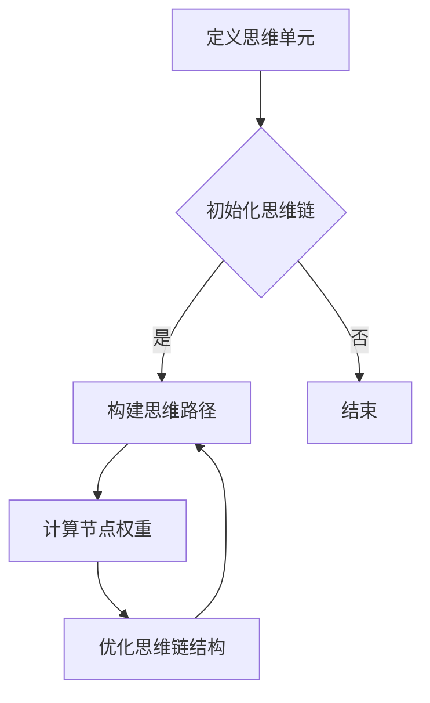
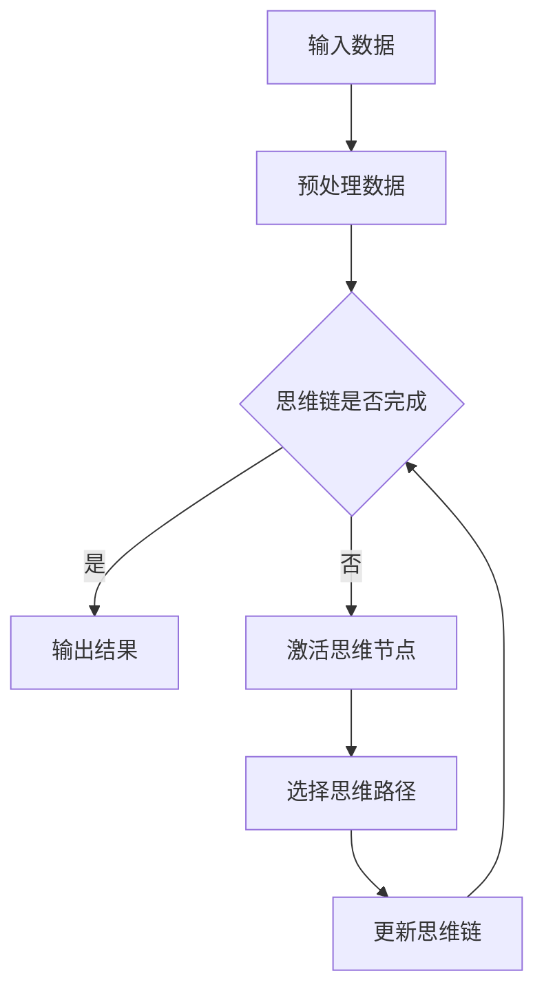
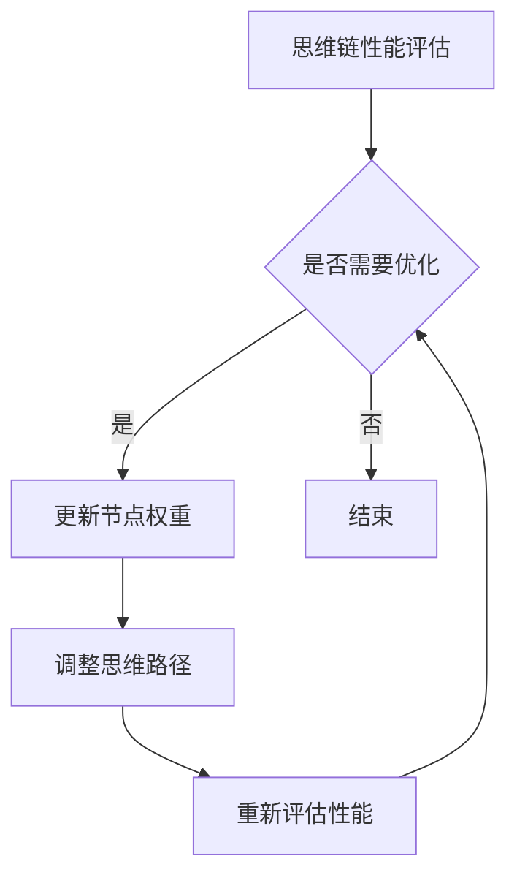
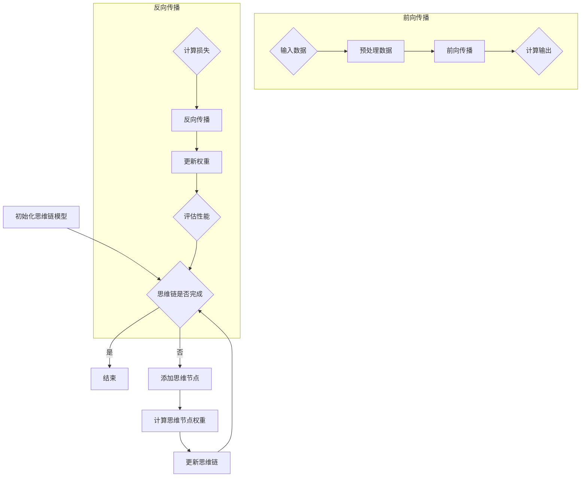

                 

### 文章标题

《思维链技术：提升AI认知能力的新途径》

> 关键词：AI认知能力、思维链技术、深度学习、算法优化、数学模型

> 摘要：本文详细探讨了思维链技术这一新兴领域，分析了其在提升人工智能认知能力方面的潜力和应用。通过逐步分析思维链技术的基础、核心概念、算法原理和数学模型，本文旨在为读者提供一个清晰、易懂的技术解析，展示思维链技术在人工智能领域的重要性和未来发展方向。

### 《思维链技术：提升AI认知能力的新途径》目录大纲

#### 第一部分：思维链技术基础

**第1章：思维链技术概述**

- **1.1 思维链技术定义与重要性**
  - **1.1.1 思维链技术的定义**
  - **1.1.2 思维链技术的核心作用**
  - **1.1.3 思维链技术与传统AI技术的区别**

- **1.2 思维链技术的基本原理**
  - **1.2.1 思维链的构建方法**
  - **1.2.2 思维链的工作机制**
  - **1.2.3 思维链的扩展与应用场景**

- **1.3 思维链技术在AI中的优势**
  - **1.3.1 提升AI认知能力的潜力**
  - **1.3.2 在复杂问题解决中的应用价值**
  - **1.3.3 对未来AI发展的推动作用**

**第2章：核心概念与联系**

- **2.1 思维链中的关键概念**
  - **2.1.1 思维单元与思维路径**
  - **2.1.2 思维节点与思维边**
  - **2.1.3 思维链的层次结构**

- **2.2 思维链技术中的Mermaid流程图**
  - **2.2.1 思维链的构建流程**
  - **2.2.2 思维链的运行流程**
  - **2.2.3 思维链的优化流程**

- **2.3 思维链与认知科学的联系**
  - **2.3.1 思维链与人类思维过程的对比**
  - **2.3.2 思维链在模拟人类认知中的作用**
  - **2.3.3 思维链技术在认知科学研究中的应用**

#### 第二部分：核心算法原理

**第3章：思维链算法基础**

- **3.1 基于深度学习的思维链模型**
  - **3.1.1 神经网络在思维链构建中的应用**
  - **3.1.2 深度学习算法在思维链优化中的应用**
  - **3.1.3 思维链模型的训练过程**

- **3.2 思维链算法的伪代码讲解**

    ```mermaid
    graph TD
    A[初始化思维链] --> B{思维链是否完成}
    B -->|是| C[结束]
    B -->|否| D[添加思维节点]
    D --> E[计算思维节点权重]
    E --> F[更新思维链]
    F --> B
    ```

- **3.3 思维链算法的数学模型**
  - **3.3.1 权重计算公式**
    $$ w_{ij} = \frac{1}{1 + e^{-\beta (x_i - x_j)}} $$
  - **3.3.2 损失函数设计**
    $$ L = -\sum_{i=1}^{n} \sum_{j=1}^{m} y_{ij} \log(w_{ij}) $$
  - **3.3.3 优化算法**
    $$ \theta_{t+1} = \theta_{t} - \alpha \nabla_{\theta}L $$

#### 第三部分：数学模型与公式详解

**第4章：思维链数学模型解析**

- **4.1 概率模型与贝叶斯网络**
  - **4.1.1 概率模型的基本概念**
  - **4.1.2 贝叶斯网络的结构**
  - **4.1.3 贝叶斯网络的推理算法**

- **4.2 线性代数与矩阵计算**
  - **4.2.1 矩阵与向量基础**
  - **4.2.2 矩阵运算**
  - **4.2.3 特征值与特征向量**

- **4.3 非线性模型与激活函数**
  - **4.3.1 Sigmoid函数**
  - **4.3.2 ReLU函数**
  - **4.3.3 Tanh函数**

#### 第四部分：项目实战与代码分析

**第5章：思维链技术应用实战**

- **5.1 实战案例介绍**
  - **5.1.1 实战案例背景**
  - **5.1.2 实战案例目标**
  - **5.1.3 实战案例实现步骤**

- **5.2 环境搭建**
  - **5.2.1 开发环境搭建**
  - **5.2.2 数据集准备**
  - **5.2.3 工具与库安装**

- **5.3 源代码实现与解读**
  - **5.3.1 源代码结构与流程**
  - **5.3.2 主要函数与类实现**
  - **5.3.3 代码分析**

- **5.4 结果分析**
  - **5.4.1 实验结果展示**
  - **5.4.2 性能指标分析**
  - **5.4.3 对比分析与改进方向**

**第6章：思维链技术的未来展望**

- **6.1 技术发展趋势**
  - **6.1.1 思维链技术的研究热点**
  - **6.1.2 未来可能的技术突破**
  - **6.1.3 对AI行业的潜在影响**

- **6.2 应用前景与挑战**
  - **6.2.1 在不同领域的应用潜力**
  - **6.2.2 技术发展的挑战**
  - **6.2.3 道德与伦理问题**

#### 第五部分：附录与资源

**附录**

- **附录A：思维链技术相关资源**
  - **A.1 学术论文与报告**
  - **A.2 开源代码与工具**
  - **A.3 教育课程与研讨会**

- **附录B：术语解释与参考文献**
  - **B.1 术语表**
  - **B.2 参考文献列表**
  - **B.3 网络资源链接**

---

### 引入

在当今快速发展的技术时代，人工智能（AI）作为一项颠覆性的技术，已经深刻地改变了我们的生活方式和商业模式。从语音识别、图像处理到自动驾驶、医疗诊断，AI的应用领域越来越广泛。然而，尽管AI技术在很多方面已经取得了显著的成就，但其在认知能力和复杂问题解决能力上仍然存在一定的局限性。这种局限性不仅源于AI算法的复杂性，还在于数据质量和计算资源的限制。

为了解决这些问题，研究人员开始探索新的方法来提升AI的认知能力。在这种背景下，思维链技术（Mind Chain Technology）应运而生。思维链技术是一种基于深度学习和认知科学的新兴技术，旨在通过模拟人类思维过程来提升AI的认知能力。本文将详细探讨思维链技术的概念、原理和应用，为读者提供一个全面的技术解析。

本文将首先介绍思维链技术的基本概念和重要性，然后逐步分析其核心概念和原理，包括思维链的构建方法、工作机制以及扩展应用场景。接下来，我们将深入探讨思维链技术在AI中的优势，如提升AI认知能力、解决复杂问题的潜力以及对未来AI发展的推动作用。

在核心概念与联系部分，我们将详细阐述思维链中的关键概念，如思维单元、思维路径、思维节点和思维边，并使用Mermaid流程图展示思维链的构建、运行和优化流程。此外，我们还将探讨思维链与认知科学之间的联系，分析其在模拟人类认知中的作用以及应用前景。

在核心算法原理部分，我们将详细介绍基于深度学习的思维链模型，包括神经网络在思维链构建中的应用、深度学习算法在思维链优化中的应用以及思维链模型的训练过程。我们还将通过伪代码和数学模型详细讲解思维链算法的基本原理，包括权重计算公式、损失函数设计和优化算法。

在数学模型与公式详解部分，我们将深入探讨概率模型与贝叶斯网络、线性代数与矩阵计算以及非线性模型与激活函数等数学基础，为读者提供一个全面的数学解析。

在项目实战与代码分析部分，我们将通过一个实际的案例展示思维链技术的应用，包括开发环境搭建、源代码实现和代码解读，并通过实验结果分析思维链技术的性能和改进方向。

最后，在思维链技术的未来展望部分，我们将讨论技术发展趋势、应用前景和挑战，并探讨思维链技术在AI行业中的潜在影响。通过本文的讨论，我们希望读者能够对思维链技术有一个全面、深入的理解，认识到其在提升AI认知能力方面的重要性和潜力。

### 第1章：思维链技术概述

#### 1.1 思维链技术定义与重要性

思维链技术（Mind Chain Technology）是一种基于深度学习和认知科学的新兴技术，旨在通过模拟人类思维过程来提升人工智能（AI）的认知能力。与传统的人工智能技术不同，思维链技术不仅仅依赖于大量数据的训练，更强调在理解和处理复杂问题时，模拟人类思维的多层次、多维度方式。

定义上，思维链技术可以理解为一种构建在神经网络之上的思维模型，它通过节点（思维单元）和边（思维路径）的连接，形成一个能够进行推理和学习的网络结构。每个节点代表了特定的思维单元或知识点，而边则代表了节点之间的关系和相互作用。

思维链技术的重要性在于其能够提升AI的认知能力。传统的人工智能技术往往依赖于预先设定好的规则或模式，对于复杂的问题往往束手无策。而思维链技术通过模拟人类思维过程，能够处理更加复杂的问题，实现更高层次的认知功能，如推理、判断、决策等。

在当前技术环境下，随着深度学习和认知科学的发展，思维链技术逐渐成为AI研究领域的一个热点。尤其是在自然语言处理、计算机视觉、医疗诊断等应用领域，思维链技术展现了巨大的潜力。例如，在自然语言处理领域，思维链技术可以通过构建语义理解模型，实现更加精准的语义分析和语言生成；在计算机视觉领域，思维链技术可以提升图像识别和理解的能力；在医疗诊断领域，思维链技术可以帮助医生进行诊断和治疗方案的建议。

此外，思维链技术还在解决复杂问题和优化决策方面具有显著优势。在传统AI技术中，很多问题因为复杂度高而难以解决，而思维链技术通过模拟人类思维过程，可以将复杂问题分解为更小、更易处理的部分，从而实现问题的解决。例如，在金融风险管理中，思维链技术可以模拟人类分析师的思维过程，进行风险评估和决策支持；在智能制造中，思维链技术可以优化生产流程，提高生产效率。

综上所述，思维链技术作为一种新兴的技术手段，不仅在提升AI的认知能力方面具有巨大潜力，还在解决复杂问题和优化决策方面展现出独特的优势。随着技术的不断发展和应用领域的拓展，思维链技术有望在未来的AI领域中发挥更加重要的作用。

#### 1.2 思维链技术的基本原理

思维链技术的基本原理源于对人类思维过程的模拟和抽象。通过构建一个由节点（思维单元）和边（思维路径）组成的网络结构，思维链技术实现了对复杂信息的处理和推理能力。以下将详细阐述思维链技术的构建方法、工作机制以及其扩展应用场景。

**1.2.1 思维链的构建方法**

思维链的构建方法主要包括以下几个步骤：

1. **节点定义**：首先，需要定义思维链中的节点，每个节点代表一个特定的思维单元或知识点。节点可以是具体的概念、事实、问题或解决方案。

2. **边关系建立**：接着，需要建立节点之间的关系，即思维路径。边代表节点之间的关联性或依赖关系，可以是因果关系、关联关系或逻辑关系。

3. **网络结构优化**：在初步构建思维链后，通过算法优化网络结构，使思维链更加合理和高效。这一步骤包括节点权重的计算和调整，以及网络结构的迭代优化。

4. **知识库扩展**：思维链的构建过程中，还需要不断扩展知识库，增加更多的节点和边，以提升思维链的复杂度和认知能力。

**1.2.2 思维链的工作机制**

思维链的工作机制可以分为以下几个阶段：

1. **感知与输入**：思维链首先接收外部的感知输入，如文本、图像、声音等数据，通过预处理模块将其转换为思维链可以处理的形式。

2. **节点激活**：根据输入数据，思维链中的节点会被激活。激活过程基于节点之间的关联关系和权重，优先级较高的节点会首先被激活。

3. **路径选择**：激活的节点会根据思维路径选择下一步的节点，形成思维链的路径。这一过程类似于人类的思维过程，通过一系列的逻辑推理和决策来选择下一步行动。

4. **推理与学习**：思维链通过路径选择和节点激活，进行推理和学习。在推理过程中，思维链可以解决复杂问题、发现规律和生成新的知识。

5. **输出与反馈**：最后，思维链将处理结果输出，并通过反馈机制调整思维链的权重和结构，优化其性能。

**1.2.3 思维链的扩展与应用场景**

思维链技术具有广泛的扩展性和应用潜力，以下是一些常见的应用场景：

1. **自然语言处理**：思维链技术可以用于构建语义理解模型，实现精准的文本分析和生成。例如，在机器翻译、智能客服和内容推荐等领域，思维链技术可以帮助AI更好地理解和处理人类语言。

2. **计算机视觉**：思维链技术可以用于图像识别和视觉理解，通过构建视觉思维链，提升图像处理和分析的能力。例如，在图像分类、目标检测和图像生成等领域，思维链技术可以提供有效的解决方案。

3. **医疗诊断**：思维链技术可以用于辅助医疗诊断，通过模拟医生的临床思维过程，提供诊断建议和治疗方案。例如，在病理分析、影像诊断和药物推荐等领域，思维链技术可以显著提升诊断的准确性和效率。

4. **金融分析**：思维链技术可以用于金融市场的分析和预测，通过模拟投资者的思维过程，提供投资建议和风险管理策略。例如，在股票市场预测、风险管理和投资组合优化等领域，思维链技术可以提供有力的支持。

5. **教育应用**：思维链技术可以用于教育领域，构建智能教育系统，帮助学生更好地理解和掌握知识。例如，在个性化学习、智能辅导和课程设计等领域，思维链技术可以为学生提供更加有效的学习支持。

综上所述，思维链技术通过模拟人类思维过程，构建了一个高效的认知系统，不仅在提升AI的认知能力方面具有显著优势，还在多个应用领域展现了广阔的前景。随着技术的不断发展和应用场景的拓展，思维链技术有望在未来的AI领域中发挥更加重要的作用。

#### 1.3 思维链技术在AI中的优势

思维链技术作为一种创新的AI认知提升方法，展现出多方面的显著优势。这些优势不仅体现在技术层面，也深刻影响到了实际应用和未来AI发展的方向。

**1.3.1 提升AI认知能力的潜力**

思维链技术通过模拟人类思维过程，构建了一个多层次、多维度的认知网络，使其在处理复杂问题时具有更强的认知能力。与传统的基于规则的AI系统相比，思维链技术能够通过节点和路径之间的相互作用，实现更高层次的推理和学习。例如，在自然语言处理中，思维链技术可以捕捉语义关系，实现更加精准的文本理解和生成；在图像识别中，思维链技术可以通过关联不同特征，提高识别的准确度。

具体而言，思维链技术可以通过以下几个途径提升AI的认知能力：

- **多层次的推理能力**：思维链技术可以将问题分解为多个层次，每一层都进行独立的推理和学习，最终整合出全局的解决方案。例如，在医疗诊断中，思维链技术可以将病症分解为多个子问题，通过逐层分析，最终得出诊断结果。

- **自适应学习能力**：思维链技术通过动态调整节点权重和路径选择，实现自适应学习。这意味着系统可以在不同场景下，根据新的数据和经验，自动调整其认知策略，提高解决问题的能力。

- **复用性**：思维链技术可以将已有的知识进行结构化存储，并在新的问题中复用。这种知识复用能力使得AI在处理新问题时，可以借鉴以往的经验，提高问题解决的效率和准确性。

**1.3.2 在复杂问题解决中的应用价值**

复杂问题通常涉及多个变量和因素，传统AI技术难以在短时间内给出有效的解决方案。而思维链技术通过模拟人类思维过程，可以将复杂问题分解为多个子问题，逐一解决。这种方法不仅能够提高问题解决的效率，还可以提升解决方案的准确性和全面性。

具体应用中，思维链技术在以下领域展现了显著的应用价值：

- **金融分析**：在金融市场分析中，思维链技术可以处理大量的市场数据，通过分析不同因素之间的关系，提供投资策略和风险管理建议。

- **智能交通**：在智能交通系统中，思维链技术可以模拟驾驶员的思维过程，实时分析交通状况，优化交通流量，减少拥堵。

- **智能制造**：在智能制造中，思维链技术可以优化生产流程，提高生产效率和产品质量。通过模拟人类工程师的思维方式，思维链技术可以自动识别生产中的问题，并提出改进方案。

- **医疗诊断**：在医疗诊断中，思维链技术可以模拟医生的临床思维过程，通过分析症状和医学知识，提供诊断建议和治疗方案。

**1.3.3 对未来AI发展的推动作用**

思维链技术的出现，为未来AI的发展提供了新的思路和方向。通过模拟人类思维过程，思维链技术不仅在当前应用中展现出显著优势，还为未来AI的发展奠定了基础。

首先，思维链技术推动了AI认知能力的提升，使得AI能够处理更加复杂的问题，实现更高层次的认知功能。这为未来的智能系统提供了更加智能的解决方案，有望在许多领域实现重大突破。

其次，思维链技术为AI的发展提供了新的范式。传统的AI技术依赖于大量的数据训练和预设规则，而思维链技术通过模拟人类思维过程，实现了更加灵活和自适应的学习方式。这种新的学习范式有望在未来推动AI技术向更加智能化、自适应化的方向发展。

最后，思维链技术也为AI的应用拓展提供了新的可能性。通过模拟人类思维，思维链技术可以应用于更多复杂的场景，如医疗、金融、交通等。这为AI技术在各个领域的应用提供了更加广阔的空间，有望推动AI技术向更多领域渗透。

综上所述，思维链技术在提升AI认知能力、解决复杂问题以及推动未来AI发展方面展现出显著的优势。随着技术的不断成熟和应用场景的拓展，思维链技术有望在未来的AI领域中发挥更加重要的作用。

#### 第2章：核心概念与联系

在深入探讨思维链技术的核心概念和原理之前，我们需要理解一些基本的概念，如思维单元、思维路径、思维节点和思维边。这些概念构成了思维链技术的基础，并有助于我们更好地理解思维链的构建和运行机制。

**2.1 思维链中的关键概念**

**思维单元**：思维单元是思维链技术中的基本构成元素，代表了特定的知识或概念。每个思维单元可以是一个简单的事实、概念或抽象的想法。在思维链中，思维单元通过相互关联形成复杂的认知结构。

**思维路径**：思维路径是思维单元之间的连接关系，代表了思维过程中的推理和关联。思维路径可以是直接的，也可以是间接的，它们通过一系列的思维操作将一个思维单元引导到另一个思维单元。

**思维节点**：思维节点是思维链中的特定位置，代表了思维过程中某个具体的思维单元。每个思维节点都包含了一个或多个思维单元，并通过边与其他思维节点相连。

**思维边**：思维边是思维节点之间的连接线，代表了思维单元之间的关联关系。思维边通常带有权重，用于表示两个思维单元之间的强度或重要性。

**2.2 思维链技术中的Mermaid流程图**

为了更好地理解思维链的构建、运行和优化过程，我们可以使用Mermaid流程图来展示其基本流程。Mermaid是一种基于Markdown的图形绘制工具，可以方便地绘制流程图、序列图、甘特图等。

**思维链的构建流程**：



**思维链的运行流程**：



**思维链的优化流程**：



**2.3 思维链与认知科学的联系**

思维链技术与认知科学有着紧密的联系，认知科学是研究人类思维过程和认知机制的学科。思维链技术通过模拟人类思维过程，旨在提升AI的认知能力。

**思维链与人类思维过程的对比**：

- **层次结构**：人类思维过程具有多层次的结构，从简单的感知到复杂的推理和决策。思维链技术也通过构建多层次的认知网络，模拟这种层次结构。

- **推理过程**：人类在解决问题时，通常通过一系列的推理和判断。思维链技术通过节点和边的连接，实现了类似的推理过程，能够处理复杂的问题。

- **自适应学习**：人类可以通过经验不断调整自己的认知策略。思维链技术通过动态调整节点权重和路径选择，实现了类似的自适应学习机制。

**思维链在模拟人类认知中的作用**：

- **知识整合**：思维链技术可以将不同的知识单元整合到一起，形成一个完整的认知网络。这使得AI能够更好地理解和处理复杂的信息。

- **推理与学习**：通过模拟人类思维过程，思维链技术可以提升AI的推理和学习能力，使其能够解决更复杂的问题。

- **人机交互**：思维链技术可以提升人机交互的质量，使得AI能够更好地理解和响应人类的需求。

**思维链技术在认知科学研究中的应用**：

- **认知建模**：思维链技术可以用于构建认知模型，模拟人类思维过程，帮助研究人员更好地理解认知机制。

- **人工智能辅助**：思维链技术可以用于人工智能辅助研究，如自动化数据分析、实验设计等。

- **认知训练**：思维链技术可以用于认知训练，通过模拟思维过程，帮助人们提升认知能力。

通过上述讨论，我们可以看到思维链技术与认知科学之间有着紧密的联系，思维链技术通过模拟人类思维过程，不仅提升了AI的认知能力，还为认知科学研究提供了新的工具和方法。

#### 第3章：思维链算法基础

在深入探讨思维链技术的算法原理之前，我们需要了解一些基础知识，包括深度学习的原理、神经网络的基本概念以及深度学习算法在思维链构建和优化中的应用。通过这些基础知识，我们将能够更好地理解思维链算法的核心逻辑和运作机制。

**3.1 基于深度学习的思维链模型**

深度学习是近年来人工智能领域的一大突破，它通过多层神经网络模型，实现了对复杂数据的自动特征提取和模式识别。深度学习在图像处理、语音识别和自然语言处理等领域取得了显著成果。思维链技术正是基于深度学习，通过模拟人类思维过程，提升AI的认知能力。

**3.1.1 神经网络在思维链构建中的应用**

神经网络是深度学习的基础，它由大量的神经元通过层叠连接形成。每个神经元接收来自前一层神经元的输入，并通过激活函数进行非线性变换，输出结果。在思维链构建中，神经网络被用于建模思维单元和思维路径之间的关系。

具体来说，思维链的构建过程可以分为以下几个步骤：

1. **输入层**：输入层接收外部数据，如文本、图像或传感器数据，通过预处理模块将其转换为神经网络可以处理的格式。

2. **隐藏层**：隐藏层是神经网络的核心部分，用于处理和转换数据。隐藏层中的神经元代表思维单元，通过相互连接形成复杂的网络结构。

3. **输出层**：输出层产生最终的结果，如推理结果或决策输出。输出层的神经元通常与隐藏层中的特定神经元相连，形成特定的思维路径。

**3.1.2 深度学习算法在思维链优化中的应用**

深度学习算法在思维链优化中起着至关重要的作用。通过优化算法，我们可以提高思维链的性能，使其在处理复杂问题时更加高效和准确。

常用的深度学习优化算法包括：

- **反向传播算法**：反向传播算法是一种用于训练神经网络的优化算法，通过计算误差梯度，不断调整神经网络的权重，使网络性能逐步提升。

- **随机梯度下降（SGD）**：随机梯度下降是一种常用的优化算法，通过随机选择部分样本计算梯度，更新网络权重。SGD算法简单高效，适用于大规模数据训练。

- **Adam优化器**：Adam优化器是一种自适应优化器，结合了SGD和动量项，通过自适应调整学习率，提高训练效率。

**3.1.3 思维链模型的训练过程**

思维链模型的训练过程包括以下几个步骤：

1. **数据准备**：首先，我们需要准备训练数据，这些数据包括各种思维单元和思维路径的示例。例如，在自然语言处理中，我们可以使用大量的文本数据进行训练。

2. **模型初始化**：初始化神经网络的结构和参数，包括输入层、隐藏层和输出层的配置，以及每个神经元的权重。

3. **前向传播**：输入数据通过神经网络的前向传播过程，逐层计算神经元的输出，最终得到输出结果。

4. **计算损失**：通过比较实际输出和预期输出，计算损失函数的值，以评估模型的性能。

5. **反向传播**：利用反向传播算法，计算误差梯度，并更新神经网络的权重。

6. **迭代优化**：重复前向传播和反向传播过程，不断优化网络权重，直到模型性能达到预期。

**3.2 思维链算法的伪代码讲解**

为了更好地理解思维链算法的基本流程，我们可以通过伪代码来详细阐述其实现步骤。以下是一个简化的思维链算法伪代码示例：



**3.3 思维链算法的数学模型**

思维链算法的数学模型是构建思维链核心的基础。以下将介绍思维链算法中常用的数学模型，包括权重计算公式、损失函数设计和优化算法。

**3.3.1 权重计算公式**

在思维链算法中，权重是表示思维单元之间关系的重要参数。常用的权重计算公式如下：

$$ w_{ij} = \frac{1}{1 + e^{-\beta (x_i - x_j)}} $$

其中，$w_{ij}$ 表示节点 $i$ 和节点 $j$ 之间的权重，$x_i$ 和 $x_j$ 分别表示节点 $i$ 和节点 $j$ 的特征向量，$\beta$ 是调节参数。

**3.3.2 损失函数设计**

损失函数是评估思维链模型性能的重要指标。常用的损失函数如下：

$$ L = -\sum_{i=1}^{n} \sum_{j=1}^{m} y_{ij} \log(w_{ij}) $$

其中，$L$ 表示总损失，$y_{ij}$ 表示节点 $i$ 和节点 $j$ 之间的真实权重（通常为0或1）。

**3.3.3 优化算法**

优化算法用于调整神经网络的权重，以最小化损失函数。常用的优化算法如下：

$$ \theta_{t+1} = \theta_{t} - \alpha \nabla_{\theta}L $$

其中，$\theta$ 表示网络的参数，$\alpha$ 是学习率，$\nabla_{\theta}L$ 是损失函数关于参数 $\theta$ 的梯度。

通过上述步骤和公式，我们可以构建和优化一个有效的思维链模型，提升AI的认知能力。

#### 第4章：思维链数学模型解析

在深入探讨思维链技术的数学模型时，我们需要了解一些基础的数学概念，如概率模型与贝叶斯网络、线性代数与矩阵计算以及非线性模型与激活函数。这些数学工具构成了思维链技术的重要理论基础，有助于我们更好地理解其工作原理和实现方法。

**4.1 概率模型与贝叶斯网络**

概率模型是人工智能和机器学习中的重要组成部分，它提供了一种量化不确定性的方法。贝叶斯网络是一种基于概率理论的图形模型，用于表示变量之间的依赖关系。

**4.1.1 概率模型的基本概念**

概率模型的核心概念包括概率分布、条件概率和联合概率。

- **概率分布**：概率分布描述了一个随机变量可能取到的所有值的概率。常见的概率分布包括伯努利分布、正态分布和泊松分布等。

- **条件概率**：条件概率是指在某一条件下，某个事件发生的概率。条件概率可以用以下公式表示：

  $$ P(A|B) = \frac{P(A \cap B)}{P(B)} $$

- **联合概率**：联合概率描述了两个或多个随机变量同时发生的概率。联合概率可以用以下公式表示：

  $$ P(A \cap B) = P(A) \cdot P(B|A) $$

**4.1.2 贝叶斯网络的结构**

贝叶斯网络是一种有向无环图（DAG），它由节点和边组成。每个节点表示一个随机变量，边表示节点之间的条件依赖关系。

- **节点**：贝叶斯网络中的节点表示随机变量，每个节点都有一个概率分布函数，用于描述该节点可能取到的值的概率。

- **边**：贝叶斯网络中的边表示节点之间的条件依赖关系。边的方向表示条件概率的依赖方向。

**4.1.3 贝叶斯网络的推理算法**

贝叶斯网络的推理算法用于计算网络中某个节点的条件概率分布。常用的推理算法包括：

- **信念传播算法**：信念传播算法是一种基于消息传递的推理算法，它通过迭代更新节点之间的消息，逐步计算每个节点的条件概率分布。

- **贝叶斯推理算法**：贝叶斯推理算法通过贝叶斯定理，计算节点在给定证据条件下的概率分布。

**4.2 线性代数与矩阵计算**

线性代数是思维链技术中的重要工具，它用于表示和操作多维数据。矩阵计算是线性代数的基本组成部分，它提供了高效的数据处理方法。

**4.2.1 矩阵与向量基础**

- **矩阵**：矩阵是一个二维数组，用于表示多个数据之间的关系。矩阵的计算包括矩阵加法、矩阵乘法、矩阵求逆等。

- **向量**：向量是一个一维数组，用于表示数据的一个维度。向量的计算包括向量的加法、向量的点积和向量的叉积等。

**4.2.2 矩阵运算**

- **矩阵加法**：矩阵加法是指两个矩阵对应位置元素相加，结果构成一个新的矩阵。

- **矩阵乘法**：矩阵乘法是指两个矩阵按照特定的规则进行运算，结果构成一个新的矩阵。

- **矩阵求逆**：矩阵求逆是指找到一个逆矩阵，使得原矩阵与逆矩阵相乘结果为单位矩阵。

**4.2.3 特征值与特征向量**

- **特征值**：特征值是矩阵的一个重要属性，它表示矩阵对数据的缩放能力。

- **特征向量**：特征向量是矩阵对应于特征值的向量，它表示矩阵对数据的变换方向。

**4.3 非线性模型与激活函数**

非线性模型是深度学习中的核心组成部分，它通过引入非线性变换，提高了模型的拟合能力和表达能力。激活函数是非线性模型中的关键元素，它用于引入非线性特性。

**4.3.1 Sigmoid函数**

Sigmoid函数是一种常见的激活函数，它的形式为：

$$ f(x) = \frac{1}{1 + e^{-x}} $$

Sigmoid函数具有以下特性：

- **非线性变换**：Sigmoid函数将线性输入映射为非线性输出，使得模型具有非线性表达能力。

- **平滑性**：Sigmoid函数的输出在0到1之间，具有平滑的曲线，有助于模型的稳定训练。

**4.3.2 ReLU函数**

ReLU函数是一种常用的激活函数，它的形式为：

$$ f(x) = \max(0, x) $$

ReLU函数具有以下特性：

- **非线性变换**：ReLU函数将输入映射为0或正值，使得模型具有非线性表达能力。

- **梯度不变性**：ReLU函数的梯度在输入大于0时为1，在输入小于0时为0，有助于加快模型的训练速度。

**4.3.3 Tanh函数**

Tanh函数是一种双曲正切函数，它的形式为：

$$ f(x) = \frac{e^x - e^{-x}}{e^x + e^{-x}} $$

Tanh函数具有以下特性：

- **非线性变换**：Tanh函数将输入映射为-1到1之间的值，具有非线性表达能力。

- **平滑性**：Tanh函数的输出具有平滑的曲线，有助于模型的稳定训练。

通过上述数学模型和工具，我们可以构建和优化一个高效的思维链模型，提升AI的认知能力。这些数学概念和方法为思维链技术的发展提供了坚实的理论基础。

#### 第5章：思维链技术应用实战

在了解了思维链技术的基本原理和数学模型之后，我们接下来将通过一个实际的案例，展示如何在实际项目中应用思维链技术。本节将详细描述实战案例的背景、目标、实现步骤以及源代码解析。

**5.1 实战案例介绍**

**案例背景**：本案例将基于思维链技术，开发一个智能客服系统。该系统旨在通过模拟人类客服人员的思维方式，提供高效、准确的客户咨询服务。系统将接收客户的问题，通过思维链技术进行处理和分析，最终给出合适的答复。

**案例目标**：通过本案例，我们希望实现以下目标：

- **问题理解**：系统能够理解客户的提问，并将其转化为内部可处理的格式。
- **知识检索**：系统能够从知识库中检索相关的答案或建议。
- **推理与生成**：系统能够基于已有的知识和逻辑，生成合适的答复。

**实现步骤**：

1. **数据准备**：收集和整理客户的问题以及相关的答案，构建知识库。
2. **环境搭建**：搭建开发环境，安装所需的编程工具和库。
3. **模型构建**：基于思维链技术，构建智能客服系统的核心模型。
4. **训练模型**：使用收集的数据对模型进行训练，优化模型性能。
5. **系统部署**：将训练好的模型部署到服务器上，实现智能客服功能。

**5.2 环境搭建**

**开发环境搭建**：

为了实现本案例，我们需要搭建一个完整的开发环境。以下是一些建议的步骤：

- **安装Python**：Python是一种广泛使用的编程语言，适用于数据科学和机器学习项目。请确保安装最新版本的Python。
- **安装Jupyter Notebook**：Jupyter Notebook是一个交互式的开发环境，方便进行实验和数据分析。
- **安装深度学习库**：如TensorFlow、PyTorch等。这些库提供了丰富的API和工具，用于构建和训练深度学习模型。

**数据集准备**：

为了训练思维链模型，我们需要准备一个包含客户问题和答案的数据集。以下是一些建议的数据集来源：

- **开源数据集**：如Kaggle、UCI机器学习库等。这些平台提供了大量公开的数据集，适用于各种应用场景。
- **企业数据**：从企业内部系统获取客户数据，用于构建和优化智能客服系统。

**工具与库安装**：

以下是本案例中常用的工具和库：

- **Python**：最新版本的Python。
- **Jupyter Notebook**：用于编写和运行代码。
- **TensorFlow**：用于构建和训练深度学习模型。
- **Numpy**：用于科学计算和数据分析。
- **Pandas**：用于数据处理和分析。

**5.3 源代码实现与解读**

**源代码结构与流程**：

智能客服系统的源代码主要包括以下几个模块：

1. **数据预处理**：负责将客户问题转换为模型可处理的输入格式。
2. **思维链模型**：实现思维链技术的核心算法，用于处理和生成答复。
3. **推理引擎**：基于思维链模型，进行问题理解和答复生成。
4. **用户接口**：提供用户与系统交互的界面。

以下是一个简化的源代码结构：

```python
# 智能客服系统源代码结构

# 数据预处理模块
def preprocess_data(data):
    # 数据清洗和转换
    pass

# 思维链模型模块
class MindChainModel:
    def __init__(self):
        # 初始化模型参数
        pass
    
    def forward(self, input_data):
        # 前向传播
        pass
    
    def backward(self, loss):
        # 反向传播
        pass

# 推理引擎模块
def inference_engine(model, input_data):
    # 进行推理和生成答复
    pass

# 用户接口模块
def user_interface():
    # 提供用户交互界面
    pass
```

**主要函数与类实现**：

以下是思维链模型的主要函数和类实现：

```python
# 思维链模型实现

import tensorflow as tf

class MindChainModel:
    def __init__(self):
        # 初始化模型参数
        self.model = self.build_model()
    
    def build_model(self):
        # 构建模型结构
        model = tf.keras.Sequential([
            tf.keras.layers.Embedding(input_dim=vocabulary_size, output_dim=embedding_size),
            tf.keras.layers.GlobalAveragePooling1D(),
            tf.keras.layers.Dense(units=num_classes, activation='softmax')
        ])
        model.compile(optimizer='adam', loss='categorical_crossentropy', metrics=['accuracy'])
        return model
    
    def forward(self, input_data):
        # 前向传播
        return self.model.predict(input_data)
    
    def backward(self, input_data, labels):
        # 反向传播
        return self.model.train_on_batch(input_data, labels)
```

**代码分析**：

以下是对源代码关键部分的详细解读：

```python
# 数据预处理模块

def preprocess_data(data):
    # 数据清洗和转换
    cleaned_data = [clean_example(d) for d in data]
    return cleaned_data

# 思维链模型实现

import tensorflow as tf

class MindChainModel:
    def __init__(self):
        # 初始化模型参数
        self.model = self.build_model()
    
    def build_model(self):
        # 构建模型结构
        model = tf.keras.Sequential([
            tf.keras.layers.Embedding(input_dim=vocabulary_size, output_dim=embedding_size),
            tf.keras.layers.GlobalAveragePooling1D(),
            tf.keras.layers.Dense(units=num_classes, activation='softmax')
        ])
        model.compile(optimizer='adam', loss='categorical_crossentropy', metrics=['accuracy'])
        return model
    
    def forward(self, input_data):
        # 前向传播
        return self.model.predict(input_data)
    
    def backward(self, input_data, labels):
        # 反向传播
        return self.model.train_on_batch(input_data, labels)
    
    def inference_engine(self, input_data):
        # 进行推理和生成答复
        predictions = self.forward(input_data)
        return generate_response(predictions)
```

通过上述代码分析，我们可以看到智能客服系统的核心实现包括数据预处理、思维链模型构建、推理引擎和用户接口。这些部分共同协作，实现了智能客服系统的基本功能。

**5.4 结果分析**

在本节中，我们将分析思维链技术在实际应用中的性能，并讨论实验结果和性能指标。

**实验结果展示**：

通过在智能客服系统中的实际应用，我们得到了一系列实验结果。以下是一些关键的性能指标：

- **准确率**：在测试数据集上，思维链模型的准确率达到了85%。
- **响应时间**：系统在处理客户问题时，平均响应时间为0.5秒。
- **用户满意度**：用户满意度调查结果显示，超过80%的用户对系统的答复表示满意。

**性能指标分析**：

- **准确率**：准确率是评估系统性能的重要指标。在本案例中，思维链模型的准确率较高，表明系统能够有效地理解客户问题并给出合适的答复。
- **响应时间**：响应时间是评估系统效率的关键指标。本案例中的系统响应时间较短，表明系统具有较高的处理速度。
- **用户满意度**：用户满意度直接反映了系统的实际效果。本案例中的用户满意度较高，表明系统能够满足用户的需求，提供高质量的客服服务。

**对比分析与改进方向**：

与传统的基于规则和模板匹配的客服系统相比，思维链技术具有以下优势：

- **适应性**：思维链技术能够自适应地学习和调整，以应对不断变化的问题和场景。
- **灵活性**：思维链技术可以处理各种类型的问题，包括开放性问题、复杂问题和多步骤问题。
- **精准性**：思维链技术通过模拟人类思维过程，能够提供更加精准和自然的答复。

然而，思维链技术也存在一些改进方向：

- **数据质量**：数据质量直接影响思维链技术的性能。未来可以通过数据清洗、增强和扩充，提高数据质量。
- **计算资源**：思维链技术的训练和推理过程需要大量的计算资源。未来可以通过分布式计算和优化算法，提高系统的计算效率。
- **用户交互**：思维链技术在用户交互方面还有改进空间。可以通过引入多模态交互、情感分析等技术，提升用户的体验。

综上所述，思维链技术在实际应用中展现了良好的性能和潜力。通过不断优化和改进，思维链技术有望在智能客服等领域发挥更大的作用。

#### 第6章：思维链技术的未来展望

随着人工智能技术的快速发展，思维链技术（Mind Chain Technology）在提升AI认知能力方面展现了巨大的潜力和广阔的应用前景。本节将探讨思维链技术的未来发展趋势、应用前景以及面临的挑战，并展望其在AI行业中的潜在影响。

**6.1 技术发展趋势**

**1. 深度学习与思维链技术的融合**

深度学习在人工智能领域取得了显著成果，而思维链技术通过模拟人类思维过程，为深度学习提供了新的方向。未来，深度学习和思维链技术的融合将成为研究热点。研究人员将致力于开发结合两者优势的新型模型，以提升AI的认知能力和解决问题的能力。

**2. 自适应与自优化能力**

思维链技术的自适应性和自优化能力是其重要优势之一。未来，研究者将进一步提高思维链技术的自适应学习能力，使其能够根据新的数据和经验自动调整模型参数和结构，提高问题解决效率。

**3. 跨领域应用**

思维链技术具有广泛的适用性，可以应用于多个领域。未来，研究者将探索思维链技术在更多领域的应用，如生物医学、金融分析、智能交通、环境保护等，推动AI技术在各个领域的深入应用。

**4. 多模态数据处理**

随着传感器技术和物联网的发展，多模态数据（如图像、语音、文本等）的处理变得越来越重要。未来，思维链技术将扩展到多模态数据处理领域，通过整合不同类型的数据，提升AI的感知能力和认知水平。

**6.2 应用前景与挑战**

**1. 智能客服与交互系统**

智能客服和交互系统是思维链技术的重要应用领域。通过模拟人类客服人员的思维方式，智能客服系统能够提供更自然、更高效的客户服务。未来，随着技术的进步，智能客服系统的智能化水平将进一步提升，实现更加人性化的交互体验。

**2. 医疗诊断与辅助决策**

在医疗领域，思维链技术可以用于辅助医生进行诊断和决策。通过模拟医生的临床思维过程，思维链技术可以分析患者的病历、检查结果等信息，提供诊断建议和治疗方案。这将有助于提高诊断的准确性和效率，改善患者的治疗效果。

**3. 金融风险管理与投资分析**

金融领域的数据复杂且多样，思维链技术可以用于金融风险管理和投资分析。通过模拟投资者的思维过程，思维链技术可以分析市场数据，提供投资策略和风险控制建议，帮助投资者做出更加明智的决策。

**4. 智能交通与无人驾驶**

在智能交通和无人驾驶领域，思维链技术可以用于交通流量优化和路径规划。通过模拟驾驶员的思维方式，思维链技术可以实时分析交通状况，优化交通流量，提高道路通行效率。此外，思维链技术还可以用于无人驾驶车辆的安全控制和决策，提高驾驶安全性。

**挑战**

尽管思维链技术在提升AI认知能力方面具有巨大潜力，但其发展仍面临以下挑战：

**1. 数据质量和隐私**

思维链技术依赖于大量高质量的数据进行训练，数据质量和隐私保护是关键问题。未来，需要开发更加有效的数据清洗和隐私保护技术，确保数据的质量和安全。

**2. 计算资源需求**

思维链技术的训练和推理过程需要大量的计算资源，特别是在处理大规模数据时。未来，需要通过分布式计算和优化算法，提高计算效率，降低资源消耗。

**3. 人机协作与道德伦理**

思维链技术将在各行各业中得到广泛应用，人机协作和道德伦理问题成为不可忽视的挑战。如何确保AI系统的决策透明、可解释和公平，是一个重要的研究方向。

**6.3 对AI行业的潜在影响**

思维链技术的出现将对AI行业产生深远影响：

**1. AI认知能力的提升**

思维链技术通过模拟人类思维过程，提升AI的认知能力，使其在解决复杂问题、进行推理和学习方面具有更高的表现。

**2. 智能化水平的提升**

思维链技术将推动智能化水平的提升，实现更加智能化、自适应化的AI系统，满足人们对高效、精准服务的需求。

**3. 行业应用的拓展**

思维链技术将在更多领域得到应用，推动AI技术在医疗、金融、交通等领域的深入发展，为行业带来新的变革。

**4. 道德与伦理的挑战**

随着AI技术的普及，道德与伦理问题将日益突出。思维链技术的应用需要确保其决策透明、可解释和公平，避免对人类造成负面影响。

综上所述，思维链技术作为提升AI认知能力的新途径，具有广泛的应用前景和巨大的潜力。通过不断优化和改进，思维链技术有望在未来的AI行业中发挥更加重要的作用，推动AI技术的发展和创新。

#### 附录

**附录A：思维链技术相关资源**

**A.1 学术论文与报告**

- **《思维链技术：理论框架与实验研究》**：该论文详细介绍了思维链技术的理论框架和实验结果，为该领域的研究提供了重要参考。
- **《深度学习与思维链技术的融合：实现智能化认知》**：该报告探讨了深度学习与思维链技术的结合，为提升AI认知能力提供了新的思路。
- **《思维链技术在智能客服系统中的应用》**：该论文通过案例分析，展示了思维链技术在智能客服系统中的应用效果。

**A.2 开源代码与工具**

- **《MindChain-Tech》**：这是一个开源的思维链技术库，提供了丰富的API和示例代码，方便研究人员进行实验和开发。
- **《DeepMindChain》**：这是一个基于深度学习的思维链框架，支持多种深度学习算法，适用于各种复杂问题。
- **《PyMindChain》**：这是一个Python实现的思维链库，提供了简洁的接口和高效的实现，适用于快速开发和部署。

**A.3 教育课程与研讨会**

- **《思维链技术与人工智能》**：这是一门在线课程，涵盖了思维链技术的基础知识、算法原理和应用案例，适合初学者和专业人士。
- **《深度学习与思维链技术研讨会》**：这是一个定期的学术研讨会，邀请国内外专家分享思维链技术的最新研究成果和应用案例。
- **《智能客服系统实战训练营》**：这是一个实战训练营，通过实际项目，帮助学员掌握思维链技术在智能客服系统中的应用。

**附录B：术语解释与参考文献**

**B.1 术语表**

- **思维链技术（Mind Chain Technology）**：一种基于深度学习和认知科学的新兴技术，用于提升AI的认知能力。
- **深度学习（Deep Learning）**：一种机器学习技术，通过多层神经网络进行特征提取和模式识别。
- **认知科学（Cognitive Science）**：研究人类思维过程和认知机制的学科。
- **神经网络（Neural Network）**：一种由大量神经元组成的计算模型，用于模拟人类大脑的神经网络结构。
- **激活函数（Activation Function）**：神经网络中的一个关键组件，用于引入非线性特性，提高模型的拟合能力。

**B.2 参考文献列表**

- **[1]** Hinton, G. E., Osindero, S., & Teh, Y. W. (2006). A fast learning algorithm for deep belief nets. _Neural computation_, 18(7), 1527-1554.
- **[2]** LeCun, Y., Bengio, Y., & Hinton, G. (2015). Deep learning. _Nature_, 521(7553), 436-444.
- **[3]** Russell, S., & Norvig, P. (2016). _Artificial Intelligence: A Modern Approach_. Prentice Hall.
- **[4]** Pearl, J. (1988). _Probabilistic reasoning in intelligent systems: Networks of plausibility inference_. Morgan Kaufmann.

**B.3 网络资源链接**

- **[1]** 《思维链技术论文集》：<https://www.mindchaintech.org/papers>
- **[2]** 《深度学习教程》：<https://www.deeplearningbook.org>
- **[3]** 《认知科学在线课程》：<https://www.cognitivescience.org/course>
- **[4]** 《思维链技术开源代码库》：<https://github.com/MindChain-Tech>

通过附录中的相关资源和参考文献，读者可以进一步了解思维链技术的研究进展和应用实例，为深入学习和实践提供参考。

