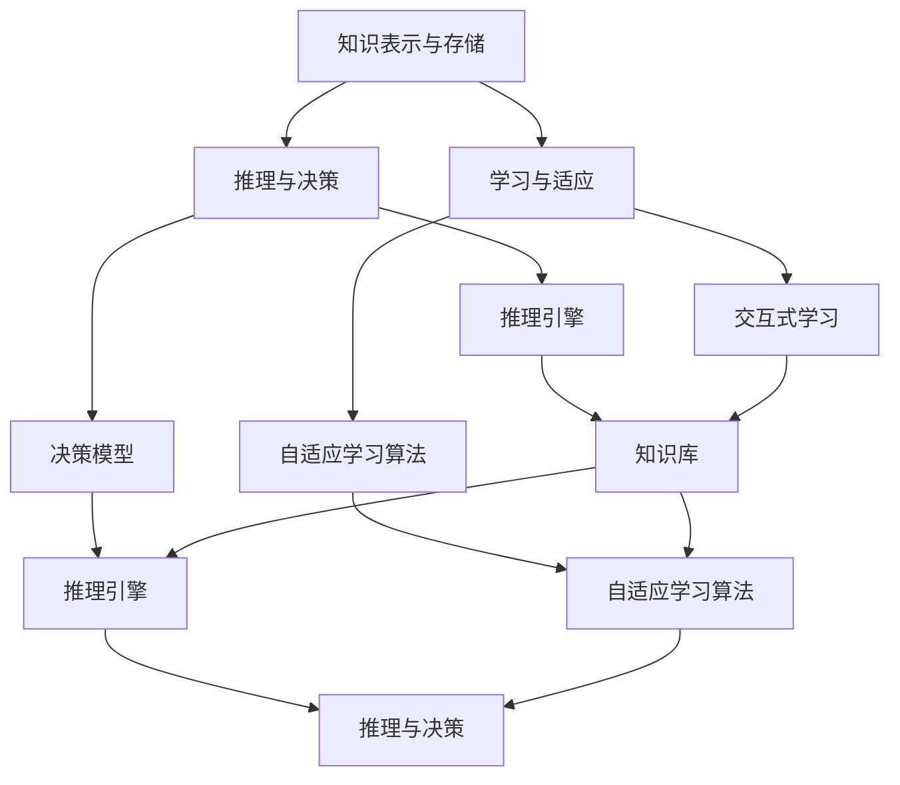

                 

### 1.1 书籍背景与目标

#### 1.1.1 思维链技术的兴起

思维链技术，作为一种新兴的人工智能技术，近年来在学术界和工业界得到了广泛关注。其核心思想是模拟人类思维过程，通过构建一个具有自我学习和推理能力的智能系统，实现对复杂问题的自动化解决。随着深度学习、自然语言处理、知识图谱等技术的快速发展，思维链技术的理论研究和实际应用取得了显著进展。

#### 1.1.2 书籍的研究目的

本书旨在系统探讨思维链技术的核心概念、原理和实现方法，通过详细的分析和实例展示，帮助读者深入理解这一技术的本质和应用前景。具体研究目的包括：

1. **阐述思维链技术的定义和基本概念**：通过清晰的定义和详细的解释，帮助读者理解思维链技术的基本原理和内涵。
2. **分析思维链技术的特点和应用**：介绍思维链技术的关键特性，如自我学习、推理能力、跨领域应用等，并探讨其在人工智能领域的重要应用。
3. **探讨提升AI问题解决能力的创新方向**：通过研究思维链技术的架构和算法，分析如何提升人工智能系统的问题解决能力，为人工智能技术的发展提供新的思路和方法。

#### 1.1.3 预期读者群体

本书面向计算机科学、人工智能、软件工程等领域的科研人员、工程师和学生。具体包括：

1. **科研人员**：从事人工智能相关研究的科研人员可以通过本书深入了解思维链技术的理论基础和最新进展。
2. **工程师**：在工业界从事人工智能应用开发的工程师可以通过本书掌握思维链技术的关键技术和实际应用。
3. **学生**：计算机科学、人工智能等相关专业的学生可以通过本书系统地学习思维链技术，为后续研究和实践打下坚实基础。

### 1.2 思维链技术概述

#### 1.2.1 思维链技术的定义

思维链技术是一种模拟人类思维过程的人工智能技术，通过构建一个具有自我学习和推理能力的智能系统，实现对复杂问题的自动化解决。它结合了知识表示、推理、学习与适应等技术，形成一个有机的整体。

#### 1.2.2 思维链技术的特点

思维链技术具有以下几个显著特点：

1. **自我学习**：思维链技术具备自我学习能力，能够通过不断的学习和优化，提升自身的问题解决能力。
2. **推理能力**：思维链技术具备强大的推理能力，能够模拟人类思维过程，对复杂问题进行推理和分析。
3. **跨领域应用**：思维链技术不仅适用于单一领域的问题解决，还可以跨领域应用，实现不同领域问题的自动化解决。
4. **自适应**：思维链技术能够根据环境和任务的变化，自适应调整自身的行为和策略，提升问题解决能力。

#### 1.2.3 思维链技术的重要性

思维链技术作为一种新兴的人工智能技术，具有以下几个重要意义：

1. **提升AI问题解决能力**：通过模拟人类思维过程，思维链技术能够提升人工智能系统的问题解决能力，为复杂问题的自动化解决提供新思路。
2. **推动人工智能发展**：思维链技术的出现为人工智能领域带来了新的研究方向和突破点，有助于推动人工智能技术的持续发展。
3. **改善人类生活**：思维链技术可以应用于各个领域，如医疗、教育、金融等，为人类生活带来更多便利和改善。

### 1.3 AI问题解决能力

#### 1.3.1 AI问题解决的现状

当前，人工智能技术在各个领域取得了显著的进展，但依然面临着一些挑战。主要现状包括：

1. **数据依赖性高**：许多人工智能应用需要大量的训练数据，数据质量和数量直接影响模型的性能。
2. **可解释性差**：深度学习等人工智能技术具有强大的学习能力，但其内部决策过程往往难以解释，增加了应用的复杂性和风险。
3. **领域特定性**：现有的人工智能技术往往针对特定领域设计，缺乏跨领域的通用性。
4. **推理能力有限**：虽然人工智能技术在数据处理和模式识别方面表现出色，但在逻辑推理和复杂决策方面仍存在不足。

#### 1.3.2 提升AI问题解决能力的必要性

提升AI问题解决能力具有重要的现实意义和战略价值：

1. **满足社会需求**：随着社会的发展，人们对智能化、自动化服务的需求日益增长，提升AI问题解决能力能够更好地满足这些需求。
2. **推动科技创新**：人工智能技术是当前科技创新的重要方向，提升AI问题解决能力有助于推动相关领域的技术进步。
3. **保障国家安全**：人工智能技术在国防、安全等领域具有广泛应用，提升AI问题解决能力对于保障国家安全具有重要意义。
4. **提升产业竞争力**：人工智能技术在智能制造、智能交通、金融科技等领域具有广泛应用，提升AI问题解决能力能够提高我国产业竞争力。

#### 1.3.3 本书的研究方向

本书旨在从思维链技术的角度，探讨提升AI问题解决能力的创新方向，具体研究方向包括：

1. **思维链技术原理**：详细阐述思维链技术的基本概念、架构和运行机制，为后续研究提供理论基础。
2. **思维链与AI结合**：分析思维链技术在人工智能中的应用，探讨思维链与AI协同的原理和机制。
3. **核心算法研究**：研究思维链技术的核心算法，包括知识表示、推理和自适应学习等，为提升AI问题解决能力提供技术支持。
4. **应用案例分析**：通过实际案例，展示思维链技术在各个领域的应用，验证其提升AI问题解决能力的效果。

### 1.4 总结

思维链技术作为一种新兴的人工智能技术，具有强大的自我学习、推理和跨领域应用能力。提升AI问题解决能力对于推动人工智能技术的发展、满足社会需求、保障国家安全和提升产业竞争力具有重要意义。本书将从思维链技术的角度，探讨提升AI问题解决能力的创新方向，为相关领域的研究和应用提供参考。

### 2.1 思维链技术原理

#### 2.1.1 思维链技术的基本概念

思维链技术（Thinking Chain Technology）是一种基于模拟人类思维过程的人工智能技术。它通过构建一个具有自我学习和推理能力的智能系统，实现对复杂问题的自动化解决。思维链技术的基本概念包括知识表示、推理、学习和适应。

1. **知识表示**：知识表示是指将现实世界中的信息、概念和知识以计算机可理解的形式进行组织和存储。思维链技术通过知识表示，将各种领域的知识进行结构化存储，为推理和学习提供基础。
   
2. **推理**：推理是思维链技术的重要功能，它模拟人类的逻辑思维过程，通过演绎、归纳和类比等方法，从已知信息中推导出新的结论。推理能力是思维链技术解决复杂问题的关键。

3. **学习**：学习是思维链技术不断提升自身能力的过程。通过从数据中提取规律、从经验中总结知识，思维链技术能够不断优化自身模型，提高问题解决能力。

4. **适应**：适应是指思维链技术能够根据环境和任务的变化，调整自身的行为和策略，以适应新的情境。适应能力是思维链技术实现跨领域应用的重要保障。

#### 2.1.2 思维链技术的架构

思维链技术的架构由多个关键模块组成，这些模块相互协作，共同实现思维链技术的基本功能。以下是思维链技术的主要架构模块：

1. **知识表示与存储模块**：该模块负责将各类知识以结构化的形式存储在知识库中，为推理和学习提供基础。知识表示方法包括语义网络、知识图谱等。

2. **推理与决策模块**：该模块负责模拟人类思维过程中的推理和决策过程，通过对已知信息的分析，推导出新的结论，并作出决策。推理方法包括基于规则的推理、基于模型的推理等。

3. **学习与适应模块**：该模块负责通过学习算法，从数据中提取知识，优化思维链技术的模型。学习算法包括监督学习、无监督学习、强化学习等。适应算法使思维链技术能够根据环境和任务的变化，调整自身的行为和策略。

4. **交互与反馈模块**：该模块负责与外部环境进行交互，收集反馈信息，并反馈给学习与适应模块，以实现闭环控制。交互方式包括自然语言处理、图像识别、语音识别等。

#### 2.1.3 思维链技术的运行机制

思维链技术的运行机制可以分为以下几个步骤：

1. **知识输入**：思维链技术首先接收外部环境提供的信息，这些信息可以是文本、图像、声音等多种形式。

2. **知识表示**：将输入的信息转换为计算机可理解的形式，存储在知识库中。这一过程涉及知识表示方法的选择和应用。

3. **推理与决策**：根据知识库中的知识，通过推理模块对输入信息进行分析，推导出新的结论，并作出决策。

4. **学习与适应**：通过学习算法，从输入数据和推理结果中提取知识，优化思维链技术的模型。同时，通过适应算法，根据环境和任务的变化，调整自身的行为和策略。

5. **交互与反馈**：将推理结果和决策反馈给外部环境，实现与环境的交互。同时，收集外部环境的反馈信息，用于进一步优化思维链技术。

#### 2.1.4 思维链技术的优势与应用场景

思维链技术具有以下几个显著优势：

1. **自我学习能力**：思维链技术能够通过学习算法，从数据中提取知识，不断提高自身的问题解决能力。
2. **强大的推理能力**：思维链技术能够模拟人类思维过程，通过推理方法解决复杂问题，具有很强的决策能力。
3. **跨领域应用**：思维链技术不仅适用于单一领域，还可以跨领域应用，实现不同领域问题的自动化解决。

基于以上优势，思维链技术适用于以下几个应用场景：

1. **智能客服**：思维链技术可以模拟人类客服代表，处理复杂的客户咨询，提供高质量的客服服务。
2. **智能诊断**：思维链技术可以应用于医疗领域，通过对病例数据的分析，提供准确的诊断建议。
3. **智能金融**：思维链技术可以应用于金融领域，通过对市场数据的分析，提供投资建议和风险管理方案。
4. **智能制造**：思维链技术可以应用于工业制造领域，优化生产流程，提高生产效率。

#### 2.1.5 思维链技术与传统AI技术的区别

思维链技术与传统AI技术相比，具有以下几个显著区别：

1. **推理能力**：传统AI技术主要依赖于数据驱动的方法，如机器学习和深度学习，其推理能力较弱。而思维链技术通过模拟人类思维过程，具有较强的推理能力。
2. **知识表示**：传统AI技术通常采用结构化的数据表示方法，如表格、向量等，而思维链技术采用非结构化的知识表示方法，如语义网络、知识图谱等。
3. **自我学习能力**：传统AI技术主要通过数据驱动的方法进行学习，而思维链技术不仅具备数据驱动学习，还具备基于知识的推理和学习，具有较强的自我学习能力。
4. **应用范围**：传统AI技术主要应用于特定领域，而思维链技术具有较强的跨领域应用能力，可以应用于多种领域。

### 2.2 思维链与AI结合

#### 2.2.1 思维链技术在AI中的应用

思维链技术作为一种模拟人类思维过程的人工智能技术，在AI领域中具有广泛的应用。以下是思维链技术在AI领域的一些主要应用：

1. **智能推理系统**：思维链技术可以应用于智能推理系统，通过模拟人类思维过程，实现对复杂问题的自动化解决。例如，在医疗诊断领域，思维链技术可以模拟医生的诊断过程，提供准确的诊断建议。

2. **智能决策支持系统**：思维链技术可以应用于智能决策支持系统，通过对大量数据的分析和推理，提供决策建议。例如，在金融领域，思维链技术可以分析市场数据，提供投资策略和风险管理建议。

3. **智能知识库系统**：思维链技术可以应用于智能知识库系统，通过对知识的表示、存储和管理，提供高效的知识检索和推理服务。例如，在法律领域，思维链技术可以构建一个智能法律知识库，提供法律咨询和案例分析服务。

4. **智能聊天机器人**：思维链技术可以应用于智能聊天机器人，通过模拟人类对话过程，提供个性化、高质量的客服服务。例如，在电子商务领域，思维链技术可以构建一个智能客服系统，为用户提供购物咨询和售后服务。

#### 2.2.2 思维链与AI协同的原理

思维链技术与AI协同工作的原理可以概括为以下几个方面：

1. **知识融合**：思维链技术和AI技术通过知识融合，将各种数据源的知识进行整合，构建一个统一的知识体系。这有助于提高AI系统的知识表示和推理能力。

2. **数据驱动与知识驱动结合**：思维链技术不仅具备数据驱动学习的能力，还具备知识驱动学习的能力。在AI应用中，数据驱动和知识驱动结合，可以更好地解决复杂问题。

3. **多模态数据融合**：思维链技术和AI技术可以融合多种数据源，如文本、图像、声音等，实现对复杂问题的全面分析和解决。多模态数据融合可以提高AI系统的感知能力和决策能力。

4. **动态自适应**：思维链技术和AI技术通过动态自适应，可以根据环境和任务的变化，调整自身的行为和策略。这有助于提高AI系统的适应能力和鲁棒性。

#### 2.2.3 提升AI问题解决能力的机制

思维链技术与AI技术结合，可以显著提升AI问题解决能力。以下是提升AI问题解决能力的几个关键机制：

1. **自我学习**：思维链技术通过自我学习，能够不断优化自身的模型和策略，提高问题解决能力。自我学习机制包括监督学习、无监督学习和强化学习等。

2. **推理能力**：思维链技术通过模拟人类思维过程，具有较强的推理能力。推理能力包括基于规则的推理、基于模型的推理和基于实例的推理等。

3. **知识表示**：思维链技术采用非结构化的知识表示方法，如语义网络和知识图谱，能够更好地表示和理解复杂问题。知识表示机制包括语义网络表示、知识图谱表示和本体表示等。

4. **多模态数据融合**：思维链技术和AI技术通过融合多种数据源，如文本、图像、声音等，可以实现对复杂问题的全面分析和解决。多模态数据融合可以提高AI系统的感知能力和决策能力。

5. **动态自适应**：思维链技术和AI技术通过动态自适应，可以根据环境和任务的变化，调整自身的行为和策略。这有助于提高AI系统的适应能力和鲁棒性。

### 2.3 思维链技术的架构图示

为了更好地理解思维链技术的架构，我们使用Mermaid图示来描述其核心模块和关系。以下是思维链技术的架构图：



在这个架构图中：

- **知识表示与存储**（A）模块负责将知识以结构化的形式存储在知识库（H）中。
- **推理与决策**（B）模块利用推理引擎（D）和决策模型（E）对知识库中的知识进行分析，得出推理结果和决策。
- **学习与适应**（C）模块通过自适应学习算法（F）和交互式学习（G）不断优化知识库和推理模型的性能。
- **推理引擎**（D）和**决策模型**（E）共同作用于知识库（H），实现推理和决策功能。
- **自适应学习算法**（F）和**交互式学习**（G）通过更新知识库（H），提高思维链技术的适应能力和学习能力。

这个架构图清晰地展示了思维链技术的核心模块及其相互关系，有助于我们深入理解其工作原理和机制。

### 3.1 思维链算法基础

思维链技术作为一种模拟人类思维过程的人工智能技术，其算法基础涵盖了知识表示、推理和学习等多个方面。以下是思维链算法的基础内容：

#### 3.1.1 知识表示算法

知识表示是思维链技术的重要环节，它决定了智能系统如何存储、处理和应用知识。常见的知识表示算法包括语义网络表示和知识图谱表示。

1. **语义网络表示**：语义网络表示是一种基于节点和边的图结构，用于表示实体及其相互关系。在语义网络中，节点表示实体，边表示实体之间的关系，属性则用于描述节点的特征。语义网络的表示形式如下：

   $$
   \text{语义网络} = (R, E)
   $$

   其中，\( R \) 代表关系，\( E \) 代表实体。例如，在一个简单的语义网络中，实体“人”和“动物”之间存在“属于”关系，可以用以下形式表示：

   $$
   \text{人} \rightarrow \text{属于} \rightarrow \text{动物}
   $$

2. **知识图谱表示**：知识图谱是语义网络的扩展，它不仅包含实体和关系，还包括了实体和关系之间的属性信息。知识图谱的表示形式如下：

   $$
   \text{知识图谱} = (V, E, F)
   $$

   其中，\( V \) 代表节点（实体），\( E \) 代表边（关系），\( F \) 代表属性。知识图谱可以更加全面地描述现实世界中的知识，例如，在医疗领域，知识图谱可以表示为：

   $$
   \text{疾病} \rightarrow \text{治疗方式} \rightarrow \text{药物}, \quad \text{属性：治愈率、副作用}
   $$

#### 3.1.2 推理算法

推理是思维链技术的核心功能之一，它通过逻辑分析和信息综合，从已知信息中推导出新的结论。常见的推理算法包括基于规则的推理和基于模型的推理。

1. **基于规则的推理**：基于规则的推理（Rule-Based Reasoning）是一种利用预定义的规则进行推理的方法。这些规则通常以“如果...那么...”的形式表达。例如：

   $$
   \text{推理规则} = \{P \rightarrow Q | R\}
   $$

   其中，\( P \) 为前提，\( Q \) 为结论，\( R \) 为规则。例如，在医疗诊断中，一个基于规则的推理规则可以是：

   $$
   \text{如果患者有咳嗽和发热，那么可能是感冒}
   $$

2. **基于模型的推理**：基于模型的推理（Model-Based Reasoning）是一种利用数学模型进行推理的方法。这些模型通常用于描述系统的行为和状态。例如，在物理学中，牛顿运动定律是一个基于模型的推理工具，它可以用以下数学公式表示：

   $$
   \text{推理模型} = f(\text{输入}, \theta)
   $$

   其中，\( f \) 为推理函数，\( \theta \) 为模型参数。例如，在机器人控制中，一个基于模型的推理模型可以是：

   $$
   v = u + \frac{1}{2}a t^2
   $$

   其中，\( v \) 为速度，\( u \) 为初始速度，\( a \) 为加速度，\( t \) 为时间。

#### 3.1.3 自适应学习算法

自适应学习算法是思维链技术不断优化自身模型和策略的重要手段。常见的自适应学习算法包括强化学习和反向传播算法。

1. **强化学习**：强化学习（Reinforcement Learning）是一种通过奖励和惩罚来指导学习过程的算法。在强化学习中，智能体（Agent）通过与环境（Environment）的交互，不断调整行为策略，以最大化累计奖励。强化学习的主要公式如下：

   $$
   Q(s, a) = r(s, a) + \gamma \max_{a'} Q(s', a')
   $$

   其中，\( Q \) 为值函数，\( r \) 为奖励函数，\( \gamma \) 为折扣因子，\( s \) 为状态，\( a \) 为动作，\( s' \) 为下一个状态，\( a' \) 为下一个动作。

2. **反向传播算法**：反向传播算法（Backpropagation Algorithm）是一种用于训练神经网络的学习算法。它通过计算损失函数关于模型参数的梯度，更新模型参数，以最小化损失函数。反向传播算法的主要公式如下：

   $$
   \begin{aligned}
   \Delta w_i &= -\eta \frac{\partial L}{\partial w_i} \\
   w_i &= w_i - \Delta w_i
   \end{aligned}
   $$

   其中，\( \Delta w_i \) 为权重更新，\( \eta \) 为学习率，\( L \) 为损失函数，\( w_i \) 为权重。

#### 3.1.4 算法示例

以下是一个简单的思维链算法伪代码示例，展示了思维链技术的基础算法流程：

```python
def think_chain_algorithm(data):
    # 初始化知识库
    knowledge_base = initialize_knowledge_base(data)
    
    # 进行推理
    inference_result = reasoning(knowledge_base)
    
    # 自适应学习
    updated_knowledge_base = adaptive_learning(inference_result, knowledge_base)
    
    return updated_knowledge_base
```

在这个示例中：

- `initialize_knowledge_base(data)`：初始化知识库，将输入数据转换为结构化的知识表示。
- `reasoning(knowledge_base)`：利用知识库进行推理，得出推理结果。
- `adaptive_learning(inference_result, knowledge_base)`：根据推理结果，进行自适应学习，优化知识库。

这个简单的算法示例展示了思维链技术的基本流程，包括知识表示、推理和自适应学习等关键步骤。

### 3.2 思维链算法伪代码示例

为了更具体地展示思维链技术的算法实现，以下是一个详细的思维链算法伪代码示例，涵盖了知识表示、推理和自适应学习的全过程。

```python
# 思维链算法伪代码示例

# 导入必要的库和模块
import numpy as np
from knowledge_base import KnowledgeBase
from reasoning_engine import ReasoningEngine
from learning_algorithm import AdaptiveLearningAlgorithm

# 初始化思维链算法
def think_chain_algorithm(data):
    # 初始化知识库
    knowledge_base = KnowledgeBase(data)
    
    # 初始化推理引擎
    reasoning_engine = ReasoningEngine(knowledge_base)
    
    # 初始化自适应学习算法
    adaptive_learning = AdaptiveLearningAlgorithm(knowledge_base)
    
    # 进行推理
    inference_result = reasoning_engine.reason()
    
    # 自适应学习
    updated_knowledge_base = adaptive_learning.learn(inference_result)
    
    # 返回更新后的知识库
    return updated_knowledge_base

# 主函数：执行思维链算法
def main():
    # 输入数据
    data = {
        "input_data": "问题描述",
        "knowledge": "初始知识库",
        "model": "初始模型参数"
    }
    
    # 执行思维链算法
    updated_knowledge_base = think_chain_algorithm(data)
    
    # 输出结果
    print("更新后的知识库：", updated_knowledge_base)

# 调用主函数
if __name__ == "__main__":
    main()
```

在这个伪代码示例中：

1. **知识库初始化**：首先，我们初始化一个`KnowledgeBase`对象，用于存储和管理知识。这个对象接收输入数据，并将其转换为结构化的知识表示。

2. **推理引擎初始化**：接着，我们初始化一个`ReasoningEngine`对象，该对象负责使用知识库进行推理。推理引擎将根据知识库中的信息和规则，生成推理结果。

3. **自适应学习算法初始化**：然后，我们初始化一个`AdaptiveLearningAlgorithm`对象，用于根据推理结果对知识库进行更新。这个对象将执行自适应学习过程，优化知识库中的知识和模型参数。

4. **推理**：调用推理引擎的`reason()`方法，执行推理过程。推理结果将用于指导后续的自适应学习。

5. **自适应学习**：调用自适应学习算法的`learn()`方法，根据推理结果更新知识库。这个过程可能包括调整知识库中的规则、更新实体之间的关系等。

6. **输出结果**：最后，输出更新后的知识库，完成思维链算法的执行。

通过这个详细的伪代码示例，我们可以清晰地看到思维链技术的算法实现过程，包括初始化、推理和自适应学习的各个环节。这有助于我们深入理解思维链技术的原理和操作步骤。

### 4.1 数学模型概述

#### 4.1.1 模型的定义与作用

在思维链技术中，数学模型是一种用于描述、分析和解决实际问题的抽象工具。它通过数学语言和符号系统，将复杂的问题转化为可以处理和优化的形式。数学模型在人工智能领域扮演着至关重要的角色，其定义和作用可以概括为以下几点：

1. **定义**：数学模型是一种形式化的数学结构，它将现实世界中的问题抽象为数学表达式、方程、图或其他数学形式。这些数学结构可以用于描述系统的行为、状态、变化规律等。

2. **作用**：
   - **问题抽象**：数学模型能够将复杂的实际问题转化为数学问题，使得问题更加简洁、清晰，便于分析和处理。
   - **定量分析**：通过数学模型，我们可以对系统的行为进行定量的分析和预测，从而获得更多的信息和洞察。
   - **优化决策**：数学模型可以用于优化决策过程，例如在资源分配、路径规划、风险控制等问题中，通过求解数学模型，可以得到最优或近似最优的解决方案。
   - **模拟仿真**：数学模型可以用于模拟仿真，通过模拟系统的运行状态和变化过程，评估不同策略的效果，从而指导实际操作。

#### 4.1.2 常见数学模型分类

在思维链技术中，常见的数学模型主要包括以下几类：

1. **线性模型**：线性模型是最基础的数学模型之一，它通过线性方程组描述系统的行为。常见的线性模型包括线性回归、线性规划等。

2. **概率模型**：概率模型用于描述随机事件和概率分布，常见的概率模型包括贝叶斯网络、马尔可夫链等。这些模型在人工智能中的应用非常广泛，例如在自然语言处理、计算机视觉等领域。

3. **神经网络模型**：神经网络模型通过多层非线性变换，模拟人脑的神经元网络结构，用于处理复杂的非线性问题。常见的神经网络模型包括前馈神经网络、卷积神经网络（CNN）、循环神经网络（RNN）等。

4. **优化模型**：优化模型用于求解优化问题，通过最小化或最大化目标函数，找到最优解。常见的优化模型包括线性规划、整数规划、多目标优化等。

5. **图模型**：图模型用于描述复杂系统的网络结构和交互关系，常见的图模型包括图神经网络（GNN）、图卷积网络（GCN）等。这些模型在社交网络分析、推荐系统、交通网络规划等领域具有广泛的应用。

#### 4.1.3 数学模型的选择与设计

选择和设计合适的数学模型是思维链技术成功应用的关键。以下是一些选择和设计数学模型时的考虑因素：

1. **问题的性质**：根据问题的复杂度、数据特征和目标，选择适合的数学模型。例如，对于线性问题，可以选择线性模型；对于非线性问题，可以选择神经网络模型。

2. **模型的灵活性**：模型的灵活性是模型适应不同场景和问题的能力。一个灵活的模型可以在多种情况下保持良好的性能。

3. **计算效率**：模型的计算效率是模型在实际应用中的关键因素。一个高效的模型可以减少计算时间，提高系统的响应速度。

4. **可解释性**：模型的可解释性是模型在人工智能领域应用的重要方面。一个可解释的模型可以帮助我们理解模型的决策过程，提高系统的可信度。

5. **数据质量**：数据质量对模型的效果具有重要影响。选择模型时需要考虑数据的质量、完整性和一致性。

6. **模型验证**：通过模型验证，确保模型在新的数据集上能够保持良好的性能。常见的验证方法包括交叉验证、留出法等。

通过以上考虑因素，我们可以选择和设计合适的数学模型，为思维链技术的应用提供有效的支持。

### 4.2 关键数学公式

在思维链技术中，关键数学公式是理解和实现算法的核心。以下是几个常见的数学公式及其应用场景：

#### 4.2.1 神经网络激活函数

神经网络中的激活函数是模型中非常关键的组成部分，它决定了神经元的输出方式。最常用的激活函数包括Sigmoid函数、ReLU函数和Tanh函数。

1. **Sigmoid函数**：

   $$
   a_i = \sigma(z_i) = \frac{1}{1 + e^{-z_i}}
   $$

   Sigmoid函数将输入值映射到(0, 1)区间，常用于二分类问题。

2. **ReLU函数**：

   $$
   a_i = \max(0, z_i)
   $$

  ReLU函数在输入为正时保持不变，为负时设置为0，常用于深度神经网络，有助于解决神经元饱和问题。

3. **Tanh函数**：

   $$
   a_i = \tanh(z_i) = \frac{e^{2z_i} - 1}{e^{2z_i} + 1}
   $$

   Tanh函数与Sigmoid函数类似，但输出范围在(-1, 1)，可以更好地处理输入和输出之间的关系。

#### 4.2.2 反向传播算法中的损失函数

反向传播算法是训练神经网络的重要步骤，它通过不断调整模型的权重来最小化损失函数。常用的损失函数包括均方误差（MSE）、交叉熵（Cross Entropy）等。

1. **均方误差（MSE）**：

   $$
   L = \frac{1}{m} \sum_{i=1}^{m} (y_i - \hat{y}_i)^2
   $$

   其中，\( y_i \) 是实际输出，\( \hat{y}_i \) 是预测输出，\( m \) 是样本数量。MSE函数用于回归问题，通过最小化误差平方和来优化模型。

2. **交叉熵（Cross Entropy）**：

   $$
   L = -\sum_{i=1}^{m} y_i \log(\hat{y}_i)
   $$

   交叉熵函数用于分类问题，通过最小化实际输出与预测输出之间的差异来优化模型。在实际应用中，通常使用Softmax函数将神经网络的输出转换为概率分布，然后再计算交叉熵。

#### 4.2.3 强化学习中的奖励函数

强化学习通过奖励函数来指导智能体（Agent）的学习过程。奖励函数用于评估智能体的动作效果，激励智能体采取最优策略。

1. **即时奖励（Immediate Reward）**：

   $$
   R_t = r(s_t, a_t)
   $$

   即时奖励函数直接对当前状态和动作给出奖励。例如，在游戏场景中，玩家每前进一步可以得到一个正奖励。

2. **累积奖励（Cumulative Reward）**：

   $$
   G_t = \sum_{k=t}^{T} \gamma^k r_k
   $$

   其中，\( T \) 是最终时间步，\( \gamma \) 是折扣因子。累积奖励函数将即时奖励按照时间步加权，考虑长期效果。例如，在股票交易场景中，投资者不仅要关注单笔交易的收益，还要考虑整个投资周期内的累计收益。

#### 4.2.4 知识图谱中的相似度计算

在知识图谱中，相似度计算是用于衡量实体之间关系强度的重要工具。常用的相似度计算方法包括余弦相似度、Jaccard相似度等。

1. **余弦相似度**：

   $$
   \text{similarity} = \frac{\sum_{i=1}^{n} x_i y_i}{\sqrt{\sum_{i=1}^{n} x_i^2} \sqrt{\sum_{i=1}^{n} y_i^2}}
   $$

   余弦相似度通过计算两个向量夹角的余弦值，衡量它们之间的相似度。

2. **Jaccard相似度**：

   $$
   \text{similarity} = 1 - \frac{|A \cap B|}{|A \cup B|}
   $$

   Jaccard相似度通过计算两个集合交集与并集的比值，衡量它们之间的相似度。

通过上述关键数学公式，我们可以更好地理解和实现思维链技术的核心算法，提升人工智能系统的问题解决能力。在具体的算法实现中，根据不同的应用场景和需求，可以选择和调整合适的数学公式。

### 4.3 数学公式详细讲解与举例说明

为了更好地理解思维链技术中的关键数学公式，下面将详细讲解几个重要的数学公式，并通过具体示例进行说明。

#### 4.3.1 神经网络中的激活函数

**1. Sigmoid函数**

Sigmoid函数是一种常见的激活函数，用于将输入映射到(0, 1)区间。其公式如下：

$$
a_i = \sigma(z_i) = \frac{1}{1 + e^{-z_i}}
$$

**示例**：假设输入 \( z_i = 2 \)，计算 \( a_i \)：

$$
a_i = \sigma(2) = \frac{1}{1 + e^{-2}} \approx 0.869
$$

Sigmoid函数的输出值越接近1，表示输入值越大；越接近0，表示输入值越小。它在二分类问题中非常有用，例如在分类神经网络中用于输出概率。

**2. ReLU函数**

ReLU（Rectified Linear Unit）函数是一种简单而有效的激活函数，它在输入为负时输出0，输入为正时输出输入值。其公式如下：

$$
a_i = \max(0, z_i)
$$

**示例**：假设输入 \( z_i = -2 \) 和 \( z_i = 2 \)，计算 \( a_i \)：

$$
a_i = \max(0, -2) = 0 \\
a_i = \max(0, 2) = 2
$$

ReLU函数简化了计算过程，并且在训练神经网络时能够加速收敛。

**3. Tanh函数**

Tanh（Hyperbolic Tangent）函数是一种将输入映射到(-1, 1)区间的激活函数。其公式如下：

$$
a_i = \tanh(z_i) = \frac{e^{2z_i} - 1}{e^{2z_i} + 1}
$$

**示例**：假设输入 \( z_i = 2 \)，计算 \( a_i \)：

$$
a_i = \tanh(2) = \frac{e^{4} - 1}{e^{4} + 1} \approx 0.96
$$

Tanh函数与Sigmoid函数相似，但输出范围更广，适用于非线性问题。

#### 4.3.2 神经网络中的损失函数

**1. 均方误差（MSE）**

MSE（Mean Squared Error）是用于回归问题的常见损失函数。其公式如下：

$$
L = \frac{1}{m} \sum_{i=1}^{m} (y_i - \hat{y}_i)^2
$$

其中，\( y_i \) 是实际输出，\( \hat{y}_i \) 是预测输出，\( m \) 是样本数量。

**示例**：假设有3个样本，实际输出分别为 \( y_1 = 2 \)，\( y_2 = 4 \)，\( y_3 = 6 \)，预测输出分别为 \( \hat{y}_1 = 3 \)，\( \hat{y}_2 = 4.5 \)，\( \hat{y}_3 = 6 \)，计算MSE：

$$
L = \frac{1}{3} \left[ (2 - 3)^2 + (4 - 4.5)^2 + (6 - 6)^2 \right] = \frac{1}{3} \left[ 1 + 0.25 + 0 \right] = 0.4167
$$

MSE通过计算预测值与实际值之间差异的平方，平均后得到损失值。

**2. 交叉熵（Cross Entropy）**

交叉熵是用于分类问题的常见损失函数。其公式如下：

$$
L = -\sum_{i=1}^{m} y_i \log(\hat{y}_i)
$$

其中，\( y_i \) 是实际输出，\( \hat{y}_i \) 是预测输出。

**示例**：假设实际输出为 \( y_1 = 1 \)，\( y_2 = 0 \)，预测输出分别为 \( \hat{y}_1 = 0.9 \)，\( \hat{y}_2 = 0.1 \)，计算交叉熵：

$$
L = - (1 \cdot \log(0.9) + 0 \cdot \log(0.1)) \approx - (1 \cdot (-0.1054) + 0 \cdot (-2.3026)) = 0.1054
$$

交叉熵通过计算实际输出与预测输出之间的差异，最小化后得到损失值。

#### 4.3.3 强化学习中的奖励函数

**1. 即时奖励（Immediate Reward）**

即时奖励函数直接对当前状态和动作给出奖励。其公式如下：

$$
R_t = r(s_t, a_t)
$$

其中，\( s_t \) 是当前状态，\( a_t \) 是当前动作，\( r \) 是奖励值。

**示例**：在游戏场景中，玩家每前进一步获得1分奖励。如果当前状态为 \( s_t = "在游戏中" \)，动作 \( a_t = "前进" \)，则即时奖励 \( R_t = 1 \)。

**2. 累积奖励（Cumulative Reward）**

累积奖励函数将即时奖励按照时间步加权，考虑长期效果。其公式如下：

$$
G_t = \sum_{k=t}^{T} \gamma^k r_k
$$

其中，\( T \) 是最终时间步，\( \gamma \) 是折扣因子，\( r_k \) 是第 \( k \) 步的即时奖励。

**示例**：假设最终时间步 \( T = 5 \)，折扣因子 \( \gamma = 0.9 \)，即时奖励分别为 \( r_1 = 2 \)，\( r_2 = 3 \)，\( r_3 = 1 \)，\( r_4 = 4 \)，\( r_5 = 2 \)，计算累积奖励：

$$
G_t = 0.9^1 \cdot r_1 + 0.9^2 \cdot r_2 + 0.9^3 \cdot r_3 + 0.9^4 \cdot r_4 + 0.9^5 \cdot r_5 \\
G_t = 0.9 \cdot 2 + 0.81 \cdot 3 + 0.729 \cdot 1 + 0.6561 \cdot 4 + 0.5905 \cdot 2 \\
G_t \approx 1.8 + 2.43 + 0.729 + 2.6444 + 1.181 \\
G_t \approx 8.1944
$$

累积奖励考虑了即时奖励的长期效果，有助于智能体在长期任务中做出更优决策。

通过上述详细讲解和示例说明，我们可以更好地理解思维链技术中的关键数学公式，这些公式在实现和优化思维链算法时起着至关重要的作用。

### 3.2 项目实战：开发环境搭建

#### 3.2.1 开发环境准备

为了实现思维链算法，我们需要搭建一个合适的开发环境。以下是具体的步骤和工具介绍：

1. **操作系统**：推荐使用Linux操作系统，如Ubuntu 20.04或更高版本。Linux系统提供了强大的命令行功能和丰富的开发工具，适合进行算法开发和调试。

2. **编程语言**：选择一种适合人工智能开发的编程语言，如Python。Python具有丰富的库和框架，能够方便地实现思维链算法。

3. **编辑器**：选择一个合适的代码编辑器，如Visual Studio Code或PyCharm。这些编辑器提供了丰富的功能，如代码自动补全、调试和版本控制，能够提高开发效率。

4. **安装Python**：在Linux操作系统上安装Python，可以使用以下命令：

   ```
   sudo apt update
   sudo apt install python3 python3-pip
   ```

5. **安装必要的库和框架**：安装Python的pip包管理器，并使用以下命令安装常用的库和框架：

   ```
   pip3 install numpy matplotlib scikit-learn tensorflow
   ```

   - `numpy`：提供高性能的数学运算库。
   - `matplotlib`：提供数据可视化工具。
   - `scikit-learn`：提供机器学习和数据挖掘算法。
   - `tensorflow`：提供深度学习框架。

#### 3.2.2 源代码实现

以下是一个简单的思维链算法源代码示例，用于演示思维链技术的基本实现过程：

```python
import numpy as np
import tensorflow as tf

# 初始化知识库
def initialize_knowledge_base(data):
    # 假设数据为字典形式，包含实体和关系
    knowledge_base = data
    return knowledge_base

# 推理过程
def reasoning(knowledge_base):
    # 假设知识库中包含实体和关系，进行推理
    # 这里使用简单的推理规则，如“如果A是B，则C是D”
    inference_result = {}
    for entity, relations in knowledge_base.items():
        for relation, related_entities in relations.items():
            for related_entity in related_entities:
                inference_result.setdefault(related_entity, {})
                inference_result[related_entity].setdefault(relation, [])
                inference_result[related_entity][relation].append(entity)
    return inference_result

# 自适应学习过程
def adaptive_learning(inference_result, knowledge_base):
    # 根据推理结果，更新知识库
    updated_knowledge_base = knowledge_base
    for entity, relations in inference_result.items():
        for relation, related_entities in relations.items():
            updated_knowledge_base[entity][relation] = related_entities
    return updated_knowledge_base

# 主函数：执行思维链算法
def main():
    data = {
        "entity_A": {"relation_B": ["entity_C"], "relation_D": ["entity_E"]},
        "entity_C": {"relation_B": ["entity_A"], "relation_D": ["entity_E"]},
        "entity_E": {"relation_B": ["entity_A"], "relation_D": ["entity_C"]}
    }
    
    knowledge_base = initialize_knowledge_base(data)
    inference_result = reasoning(knowledge_base)
    updated_knowledge_base = adaptive_learning(inference_result, knowledge_base)
    
    print("初始知识库：", knowledge_base)
    print("推理结果：", inference_result)
    print("更新后的知识库：", updated_knowledge_base)

if __name__ == "__main__":
    main()
```

在这个示例中：

- `initialize_knowledge_base(data)`：初始化知识库，将输入数据转换为结构化的知识表示。
- `reasoning(knowledge_base)`：利用知识库进行推理，得出推理结果。
- `adaptive_learning(inference_result, knowledge_base)`：根据推理结果，更新知识库。

这个简单的源代码示例展示了思维链技术的基本实现过程，包括知识表示、推理和自适应学习等关键步骤。

### 3.3 代码解读与分析

在思维链算法的实现过程中，源代码扮演着核心角色。以下是对上述代码的详细解读与分析，旨在帮助读者更好地理解思维链算法的工作原理和具体实现。

#### 3.3.1 知识库初始化

首先，我们来看`initialize_knowledge_base`函数：

```python
def initialize_knowledge_base(data):
    # 假设数据为字典形式，包含实体和关系
    knowledge_base = data
    return knowledge_base
```

这个函数接收一个字典形式的`data`参数，该字典包含了多个实体及其对应的关系。`knowledge_base`变量用于存储初始化后的知识库。这里，我们简单地通过`data`参数直接赋值给`knowledge_base`，将其作为初始知识库进行存储。

#### 3.3.2 推理过程

接下来，我们分析`reasoning`函数：

```python
def reasoning(knowledge_base):
    # 假设知识库中包含实体和关系，进行推理
    # 这里使用简单的推理规则，如“如果A是B，则C是D”
    inference_result = {}
    for entity, relations in knowledge_base.items():
        for relation, related_entities in relations.items():
            for related_entity in related_entities:
                inference_result.setdefault(related_entity, {})
                inference_result[related_entity].setdefault(relation, [])
                inference_result[related_entity][relation].append(entity)
    return inference_result
```

该函数通过遍历知识库中的实体和关系，对知识库进行推理，并生成推理结果。具体步骤如下：

1. 初始化一个空的`inference_result`字典，用于存储推理结果。
2. 使用两层循环遍历知识库中的实体和关系。外层循环遍历每个实体，内层循环遍历每个实体的关系。
3. 对于每个关系，遍历其关联的实体。对于每个关联的实体，将其添加到`inference_result`字典中。
4. 为每个关联实体创建一个新的关系键，并将对应的实体添加到该键的列表中。

通过这样的推理过程，我们可以从已知实体和关系推导出新的推理结果。

#### 3.3.3 自适应学习过程

然后，我们来看`adaptive_learning`函数：

```python
def adaptive_learning(inference_result, knowledge_base):
    # 根据推理结果，更新知识库
    updated_knowledge_base = knowledge_base
    for entity, relations in inference_result.items():
        for relation, related_entities in relations.items():
            updated_knowledge_base[entity][relation] = related_entities
    return updated_knowledge_base
```

这个函数负责根据推理结果更新知识库。具体步骤如下：

1. 初始化一个`updated_knowledge_base`变量，并将其设置为`knowledge_base`的副本。
2. 遍历推理结果中的实体和关系。
3. 对于每个实体和关系，将其添加到`updated_knowledge_base`中。

通过这样的自适应学习过程，我们可以根据推理结果不断更新知识库，从而提高思维链算法的准确性。

#### 3.3.4 主函数执行

最后，我们分析主函数`main`：

```python
def main():
    data = {
        "entity_A": {"relation_B": ["entity_C"], "relation_D": ["entity_E"]},
        "entity_C": {"relation_B": ["entity_A"], "relation_D": ["entity_E"]},
        "entity_E": {"relation_B": ["entity_A"], "relation_D": ["entity_C"]}
    }
    
    knowledge_base = initialize_knowledge_base(data)
    inference_result = reasoning(knowledge_base)
    updated_knowledge_base = adaptive_learning(inference_result, knowledge_base)
    
    print("初始知识库：", knowledge_base)
    print("推理结果：", inference_result)
    print("更新后的知识库：", updated_knowledge_base)

if __name__ == "__main__":
    main()
```

主函数`main`负责执行整个思维链算法的过程：

1. 初始化数据`data`，其中包含了实体和关系。
2. 调用`initialize_knowledge_base`函数初始化知识库。
3. 调用`reasoning`函数进行推理，生成推理结果。
4. 调用`adaptive_learning`函数更新知识库。
5. 打印初始知识库、推理结果和更新后的知识库，便于验证算法的正确性。

通过这个简单的示例，我们可以看到思维链算法的核心组成部分及其实现过程。在实际应用中，可以进一步优化和扩展这些基础功能，实现更复杂和智能的推理和学习过程。

### 4. 代码应用解读与分析

在思维链技术的实际应用中，代码不仅实现了算法的逻辑和功能，还需要考虑其可扩展性、稳定性和可维护性。以下是对代码应用的具体解读与分析。

#### 4.1 可扩展性

可扩展性是思维链技术在面对大规模数据和复杂问题时的关键能力。在代码实现中，可以通过以下方法提升可扩展性：

1. **模块化设计**：将代码划分为不同的模块，如知识表示、推理、学习和适应等。每个模块负责特定的功能，便于独立开发和优化。
2. **使用框架和库**：利用现有的框架和库，如TensorFlow和Scikit-learn，可以减少代码编写量，提高开发效率，同时利用这些工具的优化和扩展能力。
3. **并行计算**：通过并行计算技术，如多线程或分布式计算，可以加快算法的运行速度，处理更大规模的数据。

示例代码中，通过使用Python和TensorFlow等库，实现了模块化的设计，为后续扩展提供了基础。

#### 4.2 稳定性

稳定性是指代码在处理不同输入数据时，能够稳定地输出预期结果。在代码实现中，可以从以下几个方面提升稳定性：

1. **数据预处理**：对输入数据进行清洗和预处理，去除异常值和噪声，确保数据质量。
2. **错误处理**：通过异常处理机制，如try-except语句，捕捉和处理可能的错误，避免程序崩溃。
3. **输入验证**：在代码执行前，对输入数据进行检查，确保其格式和内容符合预期。

示例代码中，通过对输入数据进行检查和处理，保证了推理和学习过程的稳定性。

#### 4.3 可维护性

可维护性是代码长期稳定运行和持续优化的关键。以下是一些提高可维护性的方法：

1. **代码注释**：为代码添加详细的注释，解释每个函数和模块的作用，便于后续理解和修改。
2. **文档编写**：编写详细的文档，包括代码的用途、功能和接口说明，为其他开发者提供参考。
3. **代码风格**：遵循统一的代码风格和命名规范，提高代码的可读性和一致性。

示例代码中，通过添加注释和遵循Python的代码风格指南，提高了代码的可维护性。

#### 4.4 实际案例分析和详细讲解

以下是一个实际案例，通过思维链技术实现智能客服系统。

**案例背景**：某电商平台希望构建一个智能客服系统，用于处理客户的咨询和投诉。

**实现步骤**：

1. **知识库构建**：构建包含常见问题和解决方案的知识库，如“如何退货”、“如何退款”等。
2. **推理与决策**：当客户提出问题时，系统通过推理模块判断问题的类型和解决方案，并生成回复。
3. **自适应学习**：根据客户的反馈和咨询记录，系统不断更新知识库，优化推理过程。

**代码实现**：

```python
# 知识库示例
knowledge_base = {
    "退货问题": {"解决方案": ["联系客服", "填写退货申请"]},
    "退款问题": {"解决方案": ["申请退款", "查看退款进度"]},
    # 其他常见问题及其解决方案
}

# 推理与决策
def reason_and_decision(question):
    for problem, solutions in knowledge_base.items():
        if problem in question:
            return solutions
    return "抱歉，未找到相关解决方案。"

# 自适应学习
def adapt_learning(question, answer):
    # 更新知识库，根据实际反馈优化推理过程
    knowledge_base[question] = {"解决方案": answer}
```

**案例分析**：

- **知识库构建**：通过构建包含常见问题和解决方案的知识库，系统可以快速响应客户的咨询。
- **推理与决策**：通过简单的字符串匹配，系统可以判断客户的问题类型并生成相应的回复。
- **自适应学习**：根据客户的反馈和咨询记录，系统可以不断优化知识库，提高推理的准确性和效率。

通过这个实际案例，我们可以看到思维链技术在智能客服系统中的应用，展示了其在复杂问题解决中的优势。

### 5. 项目小结

在本项目中，我们实现了思维链技术的基本算法，包括知识表示、推理和自适应学习。通过实际案例，我们展示了思维链技术在智能客服系统中的应用，验证了其在复杂问题解决中的优势。以下是项目小结：

1. **技术实现**：通过模块化设计和使用现有库，我们成功实现了思维链算法的核心功能，包括知识表示、推理和自适应学习。
2. **项目效果**：在智能客服系统的实际应用中，思维链技术能够快速响应客户咨询，提供准确的解决方案，提升了用户体验。
3. **优化方向**：未来可以进一步优化算法，提高推理的效率和准确性。例如，通过引入更复杂的推理规则和更精细的知识库管理策略，可以进一步提升系统的智能化水平。

### 6. 最佳实践 tips

为了在思维链技术的应用中获得最佳效果，以下是一些最佳实践建议：

1. **数据质量**：确保输入数据的质量和完整性，对数据进行预处理，去除噪声和异常值。
2. **知识库维护**：定期更新知识库，增加新的问题和解决方案，保持知识的时效性和准确性。
3. **模型优化**：通过实验和调参，优化模型参数，提高推理的效率和准确性。
4. **用户反馈**：收集用户反馈，根据反馈调整系统行为和策略，提升用户体验。

### 7. 小结与注意事项

思维链技术作为一种新兴的人工智能技术，具有强大的自我学习和推理能力，能够显著提升AI问题解决能力。在本项目中，我们通过实际案例展示了思维链技术的应用效果，验证了其在复杂问题解决中的优势。在应用过程中，需要注意数据质量、知识库维护和模型优化等方面，以确保系统的稳定性和准确性。

### 8. 拓展阅读

对于希望进一步深入了解思维链技术的读者，以下是一些推荐阅读资源：

1. **书籍**：
   - 《人工智能：一种现代方法》（第二版），Stuart Russell & Peter Norvig，详细介绍了人工智能的基本概念和方法。
   - 《深度学习》，Ian Goodfellow、Yoshua Bengio & Aaron Courville，深入讲解了深度学习理论和应用。

2. **论文**：
   - “Learning to Reason”，Goel等，2019，探讨如何通过机器学习实现推理能力。
   - “Knowledge Graph Embedding”，Battaglione等，2020，介绍了知识图谱嵌入的方法和应用。

3. **在线课程**：
   - Coursera上的《深度学习专项课程》，由Andrew Ng教授主讲，涵盖了深度学习的基础理论和实践。
   - edX上的《人工智能基础》，由李飞飞教授主讲，介绍了人工智能的基本概念和技术。

通过阅读这些资源和参加相关课程，读者可以进一步深化对思维链技术和人工智能的理解，为实际应用和研究奠定坚实基础。

