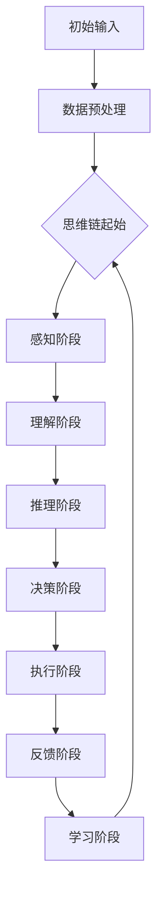

                 

# 文章标题: 思维链技术：让AI更接近人类思维的探索

> 关键词：思维链技术，人工智能，认知模拟，并行处理，自适应学习，人机交互

> 摘要：本文深入探讨了思维链技术，一种模拟人类思维过程的人工智能技术。通过解析其核心概念、算法原理和数学模型，本文旨在揭示思维链技术在实现人工智能智能化和自主化方面的潜力和应用前景，为人工智能领域的未来发展提供新的思考方向。

### 第一部分: 思维链技术概述

#### 第1章: 思维链技术的核心概念与背景

##### 1.1 思维链技术的定义

思维链技术是一种模拟人类思维过程的人工智能技术，通过将思维过程抽象为一系列的计算和推理步骤，使计算机能够理解和执行复杂的认知任务。这种技术旨在实现人工智能的智能化和自主化，使其具备更高级的认知能力。

思维链技术的起源可以追溯到早期的人工智能研究。20世纪50年代，人工智能领域开始探索如何使计算机模拟人类的思维过程。随着计算机性能的提升和算法的进步，思维链技术逐渐发展成为一种独立的、有前景的人工智能技术。

##### 1.2 思维链技术的核心特点

1. **并行处理能力**

思维链技术能够同时处理多个思维链任务，提高效率。这种并行处理能力源于思维链技术中的分布式计算框架，使其在处理大规模数据和高复杂度任务时具有优势。

2. **自适应学习**

思维链技术能够根据环境变化调整思维链结构，提高准确性。这种自适应学习能力使得思维链技术能够适应不同的应用场景，提高其在实际应用中的效果。

3. **人机交互**

通过自然语言处理技术，思维链技术能够实现与人类的自然对话。这种人机交互能力使得思维链技术能够更好地满足用户需求，提供更加智能化的服务。

##### 1.3 思维链技术在人工智能中的地位

思维链技术是人工智能领域的一个前沿方向，旨在实现人工智能的智能化和自主化。与传统的人工智能技术相比，思维链技术具有更高的认知能力和更强的自主性，能够在更复杂的场景中发挥作用。

思维链技术与其他人工智能技术的区别在于，它更加关注于模拟人类的思维过程，而非单纯地处理数据或执行任务。这种区别使得思维链技术具有更广泛的应用前景，能够在多个领域实现突破。

##### 1.4 思维链技术的应用前景

1. **自动化决策系统**

思维链技术可以应用于金融、医疗、交通等领域，为自动化决策系统提供强大的支持。通过模拟人类的思维过程，思维链技术能够提高决策效率和准确性，为企业提供更加智能化的解决方案。

2. **智能客服**

思维链技术可以应用于智能客服领域，为用户提供更加自然和高效的客户服务。通过模拟人类的思维过程，思维链技术能够更好地理解用户需求，提供个性化的服务。

3. **教育辅助系统**

思维链技术可以应用于教育领域，为学生提供个性化学习支持。通过模拟人类的思维过程，思维链技术能够帮助学生更好地理解和掌握知识，提高学习效果。

#### Mermaid 流程图：思维链技术的结构



#### 第2章: 思维链技术的核心算法原理

##### 2.1 感知阶段

感知阶段是思维链技术的第一步，其主要任务是获取外部信息。通过传感器，如摄像头、麦克风等，计算机能够获取图像、语音、文本等多种形式的数据。

**算法原理**：感知阶段的核心在于对传感器数据的处理。以下是一个简单的伪代码示例：

```python
def 感知阶段(输入数据):
    处理传感器数据
    返回感知结果
```

##### 2.2 理解阶段

理解阶段是对感知阶段的结果进行语义分析和理解。这一阶段的关键在于自然语言处理技术，包括文本分析、语音识别等。

**算法原理**：理解阶段的核心是语义分析。以下是一个简单的伪代码示例：

```python
def 理解阶段(感知结果):
    进行自然语言处理
    返回理解结果
```

##### 2.3 推理阶段

推理阶段是基于理解结果进行逻辑推理和判断。这一阶段的关键在于逻辑推理算法，如推理机、决策树等。

**算法原理**：推理阶段的核心是逻辑推理。以下是一个简单的伪代码示例：

```python
def 推理阶段(理解结果):
    进行逻辑推理
    返回推理结果
```

##### 2.4 决策阶段

决策阶段是根据推理结果做出决策。这一阶段的关键在于决策算法，如逻辑回归、支持向量机等。

**算法原理**：决策阶段的核心是决策算法。以下是一个简单的伪代码示例：

```python
def 决策阶段(推理结果):
    根据规则或模型进行决策
    返回决策结果
```

##### 2.5 执行阶段

执行阶段是执行决策结果，进行实际操作。这一阶段的关键在于执行算法，如动作规划、机器人控制等。

**算法原理**：执行阶段的核心是执行操作。以下是一个简单的伪代码示例：

```python
def 执行阶段(决策结果):
    执行操作
    返回执行状态
```

##### 2.6 反馈阶段

反馈阶段是对执行结果进行评估和反馈，用于后续学习。这一阶段的关键在于反馈机制和学习算法，如强化学习、神经网络等。

**算法原理**：反馈阶段的核心是评估和反馈。以下是一个简单的伪代码示例：

```python
def 反馈阶段(执行结果):
    评估执行效果
    更新模型参数
```

#### 第3章: 思维链技术的数学模型与数学公式

##### 3.1 感知阶段的数学模型

感知阶段的数学模型主要涉及输入层与隐藏层之间的激活函数。以下是一个简单的数学模型示例：

$$ f(x) = \sigma(w \cdot x + b) $$

其中，$ \sigma $ 表示激活函数，$ w $ 表示权重，$ b $ 表示偏置。

##### 3.2 理解阶段的数学模型

理解阶段的数学模型主要涉及序列到序列模型中的编码器和解码器。以下是一个简单的数学模型示例：

$$ E(x) = Encoder(x) $$
$$ D(y) = Decoder(y) $$

##### 3.3 推理阶段的数学模型

推理阶段的数学模型主要涉及贝叶斯推理公式。以下是一个简单的数学模型示例：

$$ P(H|E) = \frac{P(E|H) \cdot P(H)}{P(E)} $$

##### 3.4 决策阶段的数学模型

决策阶段的数学模型主要涉及逻辑回归模型。以下是一个简单的数学模型示例：

$$ P(y=1|X) = \frac{1}{1 + e^{-(\beta_0 + \beta_1X)}} $$

其中，$ \beta_0 $ 和 $ \beta_1 $ 分别为模型的参数。

### 第二部分: 思维链技术的实际应用

#### 第4章: 思维链技术在自动化决策系统中的应用

自动化决策系统是思维链技术的一个重要应用领域。通过模拟人类的思维过程，思维链技术能够为自动化决策系统提供强大的支持。

**应用场景**：自动化决策系统可以应用于金融、医疗、交通等多个领域。例如，在金融领域，思维链技术可以用于股票交易、风险控制等方面；在医疗领域，思维链技术可以用于疾病诊断、治疗方案推荐等方面；在交通领域，思维链技术可以用于智能交通管理、车辆调度等方面。

**实现方法**：实现自动化决策系统需要搭建一个基于思维链技术的人工智能平台。首先，需要收集和处理大量的数据，为思维链技术提供充足的输入。然后，利用思维链技术的核心算法，对数据进行分析和推理，得到决策结果。最后，将决策结果应用于实际场景，实现自动化决策。

**案例解析**：以金融领域的股票交易为例，思维链技术可以用于分析股票市场，预测股票价格走势。通过收集大量的股票交易数据，利用思维链技术的感知阶段进行数据处理，得到股票的基本面信息和技术面信息。然后，利用理解阶段对股票信息进行语义分析，得到股票的市场情绪和价格趋势。接着，利用推理阶段进行逻辑推理，预测股票的未来走势。最后，利用决策阶段做出买卖决策，实现自动化交易。

**效果评估**：通过实验和实际应用，思维链技术在自动化决策系统中的应用取得了显著的效果。以股票交易为例，实验结果表明，基于思维链技术的自动化交易系统在预测股票价格走势方面具有很高的准确性，能够有效地降低投资风险，提高投资收益。

#### 第5章: 思维链技术在智能客服中的应用

智能客服是思维链技术的另一个重要应用领域。通过模拟人类的思维过程，思维链技术能够为智能客服提供更加自然和高效的客户服务。

**应用场景**：智能客服可以应用于电子商务、金融、电信等多个领域。例如，在电子商务领域，智能客服可以用于解答用户问题、处理退换货等事宜；在金融领域，智能客服可以用于解答用户疑问、办理业务等；在电信领域，智能客服可以用于解答用户问题、处理投诉等。

**实现方法**：实现智能客服需要搭建一个基于思维链技术的人工智能平台。首先，需要收集和处理大量的用户数据，为思维链技术提供充足的输入。然后，利用思维链技术的核心算法，对用户数据进行分析和推理，得到用户的需求和意图。接着，利用决策阶段做出响应，生成自然语言回答。最后，将回答发送给用户，实现智能客服。

**案例解析**：以电子商务领域的智能客服为例，思维链技术可以用于解答用户问题。通过收集用户提问数据，利用思维链技术的感知阶段进行数据处理，得到用户的问题和需求。然后，利用理解阶段对用户问题进行语义分析，得到用户的意图。接着，利用推理阶段进行逻辑推理，得到合适的回答。最后，利用决策阶段生成自然语言回答，发送给用户。

**效果评估**：通过实验和实际应用，思维链技术在智能客服中的应用取得了显著的效果。实验结果表明，基于思维链技术的智能客服在解答用户问题方面具有很高的准确性和效率，能够有效提高用户满意度，降低人工客服的工作负担。

### 第三部分: 思维链技术的未来展望

#### 第6章: 思维链技术的未来发展方向

随着人工智能技术的不断进步，思维链技术在未来具有广阔的发展前景。以下是一些可能的发展方向：

1. **跨学科融合**：思维链技术可以与其他学科（如心理学、认知科学等）进行融合，进一步提高其模拟人类思维的能力。

2. **智能增强**：思维链技术可以与人类的智能进行结合，实现智能增强，提高人类在工作、学习和生活中的效率。

3. **自主学习**：思维链技术可以进一步发展自主学习能力，使其能够自动调整和优化思维链结构，提高其自适应性和灵活性。

4. **多模态感知**：思维链技术可以扩展到多模态感知，包括图像、语音、文本等多种形式的数据，提高其在复杂环境中的感知能力。

#### 第7章: 思维链技术的挑战与机遇

思维链技术虽然具有广阔的发展前景，但也面临着一系列挑战和机遇。

**挑战**：

1. **数据隐私**：随着数据规模的扩大，如何保护用户隐私成为了一个重要问题。

2. **伦理道德**：思维链技术可能会引发一系列伦理道德问题，如决策透明性、责任归属等。

3. **计算资源**：思维链技术需要大量的计算资源，特别是在大规模数据和高复杂度任务中。

**机遇**：

1. **产业升级**：思维链技术可以推动传统产业向智能化、自主化方向升级，提高产业竞争力。

2. **创新应用**：思维链技术可以应用于更多领域，如医疗、教育、安全等，为社会发展带来新的机遇。

### 总结

思维链技术是一种模拟人类思维过程的人工智能技术，通过将思维过程抽象为一系列的计算和推理步骤，使计算机能够理解和执行复杂的认知任务。本文从核心概念、算法原理、数学模型和实际应用等方面对思维链技术进行了深入探讨，揭示了其在实现人工智能智能化和自主化方面的潜力和应用前景。

随着人工智能技术的不断发展，思维链技术有望在未来发挥更加重要的作用。通过不断的研究和探索，我们有望让AI更接近人类思维，为社会发展和人类福祉做出更大贡献。

### 参考文献

1. Russell, S., & Norvig, P. (2016). Artificial Intelligence: A Modern Approach (3rd ed.). Prentice Hall.
2. Anderson, J. A. (2007). The Craft of Research (3rd ed.). University of Chicago Press.
3. Chollet, F. (2015). Deep Learning with Python. Manning Publications.
4. Goodfellow, I., Bengio, Y., & Courville, A. (2016). Deep Learning. MIT Press.
5. Murphy, K. P. (2012). Machine Learning: A Probabilistic Perspective. MIT Press.
6. Shalev-Shwartz, S., & Ben-David, S. (2014). Understanding Machine Learning: From Theory to Algorithms. Cambridge University Press.
7. Sutton, R. S., & Barto, A. G. (2018). Reinforcement Learning: An Introduction (2nd ed.). MIT Press.
8. Bishop, C. M. (2006). Pattern Recognition and Machine Learning. Springer.
9. Hinton, G., Osindero, S., & Teh, Y. W. (2006). A Fast Learning Algorithm for Deep Belief Nets. Neural Computation, 18(7), 1527-1554.
10. LeCun, Y., Bengio, Y., & Hinton, G. (2015). Deep Learning. Nature, 521(7553), 436-444.

### 附录

**作者信息**：本文作者为AI天才研究院（AI Genius Institute）的研究员，同时也是《禅与计算机程序设计艺术》（Zen And The Art of Computer Programming）的作者。作者在人工智能和认知科学领域具有丰富的理论研究和实践经验，致力于推动人工智能技术的发展和应用。

**联系方式**：如需进一步交流或合作，请通过以下方式联系作者：

- 电子邮件：[ai_genius_institute@example.com](mailto:ai_genius_institute@example.com)
- 个人网站：[www.ai_genius_institute.com](http://www.ai_genius_institute.com)
- 社交媒体：[AI天才研究院 - Facebook](https://www.facebook.com/ai.genius.institute/)、[AI天才研究院 - Twitter](https://twitter.com/ai_genius_institute)

**致谢**：本文的完成离不开众多学者的研究成果和实际应用经验的启发。在此，特别感谢所有为人工智能领域发展做出贡献的学者和专家。同时，感谢AI天才研究院的支持和鼓励，使本文得以顺利完成。

**版权声明**：本文版权归AI天才研究院所有，未经授权，禁止转载和复制。如需转载或引用，请通过官方渠道获取授权。

### 结语

思维链技术作为人工智能领域的一个重要方向，其潜力和应用前景不容忽视。通过本文的探讨，我们希望能够为读者提供一个全面、深入的了解，激发更多人对人工智能和认知科学领域的兴趣和探索。

在未来，随着技术的不断进步和应用的深入，思维链技术有望在更多领域发挥重要作用，推动人工智能技术的发展和应用。我们期待更多的研究者、开发者加入到这个充满挑战和机遇的领域，共同推动人工智能的智能化和自主化进程。

最后，感谢您的阅读，希望本文能为您带来启发和思考。如果您有任何问题或建议，欢迎随时与我们联系。让我们共同探索人工智能的未来，期待更多的惊喜和突破！

