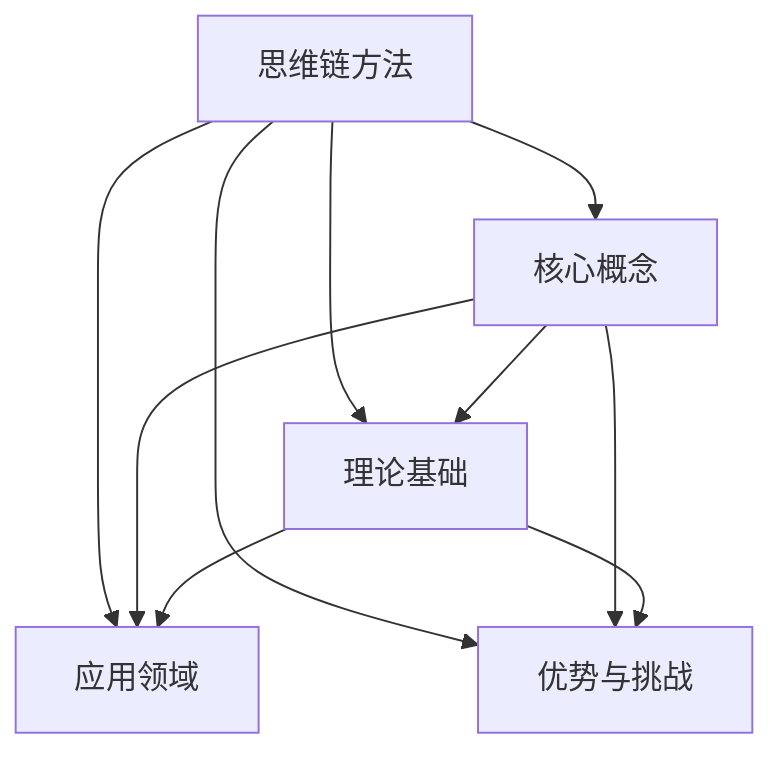

                 


### 文章标题

《思维链方法：提升AI创造性思维的新途径》

### 关键词

- 思维链方法
- 创造性思维
- 人工智能
- 深度学习
- 自然语言处理
- 教育与培训

### 摘要

本文旨在探讨一种新型的AI创造性思维提升方法——思维链方法。通过详细介绍思维链方法的核心概念、理论基础以及其在人工智能、自然语言处理等领域的应用，本文揭示了思维链方法如何通过信息处理和思维连接机制，有效提升AI系统的创造性思维能力。此外，本文还将通过实际项目案例，展示思维链方法在实际开发中的有效性和应用前景。

### 目录

#### 第一部分：思维链方法概述

##### 第1章：思维链方法简介

- **1.1 引言**
  - 创造性思维的重要性
  - 思维链方法的起源与背景

- **1.2 思维链方法的核心概念**
  - 思维链的定义与功能
  - 思维链的类型与特点

- **1.3 思维链方法的应用领域**
  - 人工智能领域中的应用
  - 创新与设计中的运用

- **1.4 思维链方法的优势与挑战**
  - 优势分析
  - 挑战与应对策略

##### 第2章：思维链方法理论基础

- **2.1 创造性思维理论概述**
  - 传统创造性思维理论
  - 现代创造性思维理论

- **2.2 思维链模型的构成要素**
  - 信息输入与输出
  - 思维链的运行机制
  - 激活与连接

- **2.3 思维链方法的核心算法**
  - 伪代码描述
  - 算法原理讲解

- **2.4 思维链方法的理论联系**
  - 与神经科学的关系
  - 与心理学的关系

#### 第二部分：思维链方法在AI中的应用

##### 第3章：思维链方法在深度学习中的应用

- **3.1 深度学习中的创造性思维**
  - 传统深度学习模型的局限性
  - 思维链方法如何提升深度学习效果

- **3.2 思维链在神经网络架构设计中的应用**
  - 神经网络架构的多样化
  - 思维链的架构设计与优化

- **3.3 思维链在强化学习中的应用**
  - 思维链与Q-learning
  - 思维链与策略梯度方法

- **3.4 思维链在生成对抗网络中的应用**
  - GAN中的创造性思维
  - 思维链方法的改进策略

##### 第4章：思维链方法在自然语言处理中的应用

- **4.1 自然语言处理中的创造性思维需求**
  - 语言理解的复杂性
  - 创造性思维在NLP中的价值

- **4.2 思维链在文本生成中的应用**
  - 伪代码描述
  - 实际应用案例分析

- **4.3 思维链在机器翻译中的应用**
  - 翻译中的创造性需求
  - 思维链方法的应用

- **4.4 思维链在情感分析中的应用**
  - 情感分析的挑战
  - 创造性思维方法的改进

#### 第三部分：思维链方法的项目实战

##### 第5章：思维链方法在创意产品设计中的应用

- **5.1 创意产品设计中的挑战**
  - 创新需求与用户需求平衡
  - 传统方法与创新方法的结合

- **5.2 思维链方法在创意产品设计中的应用**
  - 设计思维链的构建
  - 实际案例分析

- **5.3 思维链方法在用户体验设计中的应用**
  - 用户体验设计的创新
  - 思维链方法的实战应用

##### 第6章：思维链方法在教育和培训中的应用

- **6.1 教育与培训中的创造性思维需求**
  - 传统教育模式的局限性
  - 创造性思维在教学中的应用

- **6.2 思维链方法在课程设计中的应用**
  - 课程内容的创新设计
  - 思维链方法的课程实践

- **6.3 思维链方法在在线教育中的应用**
  - 在线教育的创新需求
  - 思维链方法的在线教育实践

##### 第7章：思维链方法的未来发展趋势与挑战

- **7.1 思维链方法的未来发展趋势**
  - 技术进步与思维链方法的融合
  - 新应用领域的探索

- **7.2 思维链方法的挑战与展望**
  - 技术实现中的挑战
  - 未来研究方向的探讨

### 附录

- **附录A：思维链方法相关资源与工具**
  - 主流深度学习框架对比
  - 思维链方法相关研究论文和书籍推荐

- **附录B：思维链方法应用实例代码**
  - 实际案例代码实现与分析
  - 代码解读与实战指导

[Mermaid 流程图]



### 引言

#### 创造性思维的重要性

在当今快速发展的信息技术时代，创造性思维的重要性日益凸显。无论是在科学研究、工程设计、商业创新，还是日常生活中的决策和问题解决，创造性思维都是推动进步的关键因素。对于人工智能（AI）系统而言，创造性思维更是不可或缺的核心能力。传统的AI系统，尤其是基于深度学习和机器学习的模型，虽然在某些特定任务上取得了显著的成果，但它们在应对复杂、动态和不确定的环境时，往往显得力不从心。这主要是因为这些系统缺乏创造性思维，它们往往只能基于大量训练数据来进行模式识别和预测，而无法生成全新的、创新的解决方案。

#### 思维链方法的起源与背景

思维链方法（Mind-Link Method）是近年来在人工智能领域逐渐兴起的一种新型思维模式，它旨在通过模拟人类思维的连接机制，提升AI系统的创造性思维能力。思维链方法源于对人类思维过程的研究，特别是神经科学和认知心理学领域的最新发现。人类大脑通过神经元之间的连接和信息的传递，实现了复杂的信息处理和创造性思维。而思维链方法试图将这种机制转化为算法，使其在AI系统中得以实现。

思维链方法的提出，背景主要包括以下几个方面：

1. **人工智能发展的需求**：随着AI技术的不断发展，对于AI系统的创造性思维能力提出了更高的要求。传统的算法难以应对日益复杂的任务，需要新的方法来提升其创新能力。

2. **神经科学和认知心理学的发展**：近年来，神经科学和认知心理学在人类思维机制的研究上取得了重大突破，为思维链方法的提出提供了理论支持。

3. **创新与设计领域的挑战**：在创新与设计领域，对于具有创造性思维的系统的需求日益增长，这促使研究人员探索新的方法来提升AI系统的创造性能力。

### 思维链方法的核心概念

#### 思维链的定义与功能

思维链（Mind-Link）是一种通过模拟人类大脑神经元连接和信息传递机制，实现信息处理和创造性思维的算法模型。思维链的基本概念可以概括为以下几个方面：

1. **节点（Node）**：思维链中的每个节点表示一个概念或信息单元。节点可以是文字、图像、声音等多种形式。

2. **连接（Link）**：节点之间的连接表示它们之间的关联和关系。连接可以是正向的，也可以是反向的，表示节点之间的正相关或负相关关系。

3. **激活（Activation）**：节点可以通过激活来传递信息。激活程度越高，节点的信息传递能力越强。

4. **网络（Network）**：思维链是由多个节点和连接构成的复杂网络结构。网络中的节点和连接共同工作，实现信息处理和创造性思维。

思维链的功能主要包括：

1. **信息处理**：思维链可以通过节点和连接来处理输入的信息，识别模式，形成新的概念。

2. **创造性思维**：通过激活和连接的动态变化，思维链可以产生新的想法和解决方案，实现创造性思维。

#### 思维链的类型与特点

思维链可以根据其应用场景和结构特点，分为以下几种类型：

1. **线性思维链**：线性思维链是思维链的基本形式，它按照线性顺序连接节点，实现信息的顺序处理。线性思维链的特点是结构简单，处理速度快，但创造性能力有限。

2. **网络思维链**：网络思维链是由多个节点和复杂的连接构成的，它可以实现多维信息处理和创造性思维。网络思维链的特点是结构复杂，处理能力强大，但计算资源消耗较大。

3. **动态思维链**：动态思维链是在运行过程中可以动态调整节点和连接的，以适应不同任务需求。动态思维链的特点是灵活性高，适应性强，但实现难度较大。

#### 思维链方法的应用领域

思维链方法在多个领域展现出了强大的应用潜力，特别是在人工智能领域，其应用前景广阔。以下是一些关键应用领域：

1. **人工智能**：思维链方法可以应用于各种人工智能任务，如自然语言处理、图像识别、强化学习等。通过模拟人类思维的创造性过程，思维链方法可以提升AI系统的创新能力和解决问题的能力。

2. **创新与设计**：在创新与设计领域，思维链方法可以帮助设计师生成新的设计概念，优化产品功能。通过模拟人类大脑的思维过程，思维链方法可以提供创新的解决方案。

3. **教育**：在教育领域，思维链方法可以应用于课程设计和教学方法的研究，帮助学生培养创造性思维。通过模拟人类思维过程，思维链方法可以提供个性化的教育体验。

4. **心理学**：在心理学领域，思维链方法可以用于研究人类思维的机制和创造性过程。通过模拟思维链，研究人员可以更深入地理解人类思维的本质。

#### 思维链方法的优势与挑战

思维链方法在提升AI系统的创造性思维能力方面具有显著的优势，但也面临一些挑战。

##### 优势分析

1. **增强创造性思维**：思维链方法通过模拟人类大脑的神经元连接和信息传递机制，可以提升AI系统的创造性思维能力，产生新的想法和解决方案。

2. **适应性强**：思维链方法可以根据不同的应用场景和任务需求，动态调整节点和连接，实现灵活的信息处理和创造性思维。

3. **跨学科应用**：思维链方法涵盖了神经科学、认知心理学、计算机科学等多个学科，具有广泛的适用性和跨学科应用潜力。

##### 挑战与应对策略

1. **计算资源消耗**：思维链方法需要大量的计算资源来模拟神经元连接和信息传递，这在资源有限的设备上可能面临挑战。

应对策略：通过优化算法和硬件加速，可以降低计算资源消耗，提高思维链方法的运行效率。

2. **实现难度**：思维链方法涉及到复杂的神经网络和动态调整机制，实现难度较大。

应对策略：通过深入研究和开发，逐步完善思维链方法的理论和算法，降低实现难度。

3. **数据依赖**：思维链方法依赖于大量的训练数据来模拟人类思维过程，数据质量直接影响方法的性能。

应对策略：通过数据采集、清洗和增强，提高训练数据的质量和多样性，提高思维链方法的泛化能力。

### 第一部分：思维链方法概述

#### 第1章：思维链方法简介

##### 1.1 引言

创造性思维的重要性

创造性思维（Creative Thinking）是人类智慧的重要组成部分，它涉及生成新颖、有价值的思想和解决方案。在科学研究、工程设计、商业创新和日常生活中，创造性思维都扮演着关键角色。在科学研究中，创造性思维能够帮助研究者突破传统观念，发现新的科学现象；在工程设计中，创造性思维能够激发设计师的创新灵感，设计出更符合用户需求的产品；在商业创新中，创造性思维能够为企业提供独特的商业模式和产品策略；在日常生活中，创造性思维能够帮助人们解决各种复杂问题，提高生活质量。

人工智能领域的发展需求

随着人工智能（Artificial Intelligence, AI）技术的飞速发展，AI系统在各个领域都取得了显著的成果。然而，传统的AI系统，尤其是基于深度学习和机器学习的模型，虽然能够在特定任务上实现高精度，但它们在应对复杂、动态和不确定的环境时，往往显得力不从心。这主要是因为这些系统缺乏创造性思维，它们往往只能基于大量训练数据来进行模式识别和预测，而无法生成全新的、创新的解决方案。因此，提升AI系统的创造性思维能力成为人工智能领域的一个重要研究方向。

思维链方法的起源与背景

思维链方法（Mind-Link Method）是近年来在人工智能领域逐渐兴起的一种新型思维模式，它旨在通过模拟人类思维的连接机制，提升AI系统的创造性思维能力。思维链方法的起源可以追溯到对人类大脑神经元连接和信息传递机制的研究，特别是神经科学和认知心理学领域的最新发现。人类大脑通过神经元之间的连接和信息的传递，实现了复杂的信息处理和创造性思维。而思维链方法试图将这种机制转化为算法，使其在AI系统中得以实现。

思维链方法的提出，背景主要包括以下几个方面：

1. **人工智能发展的需求**：随着AI技术的不断发展，对于AI系统的创造性思维能力提出了更高的要求。传统的算法难以应对日益复杂的任务，需要新的方法来提升其创新能力。

2. **神经科学和认知心理学的发展**：近年来，神经科学和认知心理学在人类思维机制的研究上取得了重大突破，为思维链方法的提出提供了理论支持。

3. **创新与设计领域的挑战**：在创新与设计领域，对于具有创造性思维的系统的需求日益增长，这促使研究人员探索新的方法来提升AI系统的创造性能力。

##### 1.2 思维链方法的核心概念

思维链的定义与功能

思维链（Mind-Link）是一种通过模拟人类大脑神经元连接和信息传递机制，实现信息处理和创造性思维的算法模型。思维链的基本概念可以概括为以下几个方面：

1. **节点（Node）**：思维链中的每个节点表示一个概念或信息单元。节点可以是文字、图像、声音等多种形式。

2. **连接（Link）**：节点之间的连接表示它们之间的关联和关系。连接可以是正向的，也可以是反向的，表示节点之间的正相关或负相关关系。

3. **激活（Activation）**：节点可以通过激活来传递信息。激活程度越高，节点的信息传递能力越强。

4. **网络（Network）**：思维链是由多个节点和连接构成的复杂网络结构。网络中的节点和连接共同工作，实现信息处理和创造性思维。

思维链的功能主要包括：

1. **信息处理**：思维链可以通过节点和连接来处理输入的信息，识别模式，形成新的概念。

2. **创造性思维**：通过激活和连接的动态变化，思维链可以产生新的想法和解决方案，实现创造性思维。

##### 思维链的类型与特点

思维链可以根据其应用场景和结构特点，分为以下几种类型：

1. **线性思维链**：线性思维链是思维链的基本形式，它按照线性顺序连接节点，实现信息的顺序处理。线性思维链的特点是结构简单，处理速度快，但创造性能力有限。

2. **网络思维链**：网络思维链是由多个节点和复杂的连接构成的，它可以实现多维信息处理和创造性思维。网络思维链的特点是结构复杂，处理能力强大，但计算资源消耗较大。

3. **动态思维链**：动态思维链是在运行过程中可以动态调整节点和连接的，以适应不同任务需求。动态思维链的特点是灵活性高，适应性强，但实现难度较大。

##### 1.3 思维链方法的应用领域

思维链方法在多个领域展现出了强大的应用潜力，特别是在人工智能领域，其应用前景广阔。以下是一些关键应用领域：

1. **人工智能**：思维链方法可以应用于各种人工智能任务，如自然语言处理、图像识别、强化学习等。通过模拟人类思维的创造性过程，思维链方法可以提升AI系统的创新能力和解决问题的能力。

2. **创新与设计**：在创新与设计领域，思维链方法可以帮助设计师生成新的设计概念，优化产品功能。通过模拟人类大脑的思维过程，思维链方法可以提供创新的解决方案。

3. **教育**：在教育领域，思维链方法可以应用于课程设计和教学方法的研究，帮助学生培养创造性思维。通过模拟人类思维过程，思维链方法可以提供个性化的教育体验。

4. **心理学**：在心理学领域，思维链方法可以用于研究人类思维的机制和创造性过程。通过模拟思维链，研究人员可以更深入地理解人类思维的本质。

##### 1.4 思维链方法的优势与挑战

思维链方法在提升AI系统的创造性思维能力方面具有显著的优势，但也面临一些挑战。

优势分析

1. **增强创造性思维**：思维链方法通过模拟人类大脑的神经元连接和信息传递机制，可以提升AI系统的创造性思维能力，产生新的想法和解决方案。

2. **适应性强**：思维链方法可以根据不同的应用场景和任务需求，动态调整节点和连接，实现灵活的信息处理和创造性思维。

3. **跨学科应用**：思维链方法涵盖了神经科学、认知心理学、计算机科学等多个学科，具有广泛的适用性和跨学科应用潜力。

挑战与应对策略

1. **计算资源消耗**：思维链方法需要大量的计算资源来模拟神经元连接和信息传递，这在资源有限的设备上可能面临挑战。

应对策略：通过优化算法和硬件加速，可以降低计算资源消耗，提高思维链方法的运行效率。

2. **实现难度**：思维链方法涉及到复杂的神经网络和动态调整机制，实现难度较大。

应对策略：通过深入研究和开发，逐步完善思维链方法的理论和算法，降低实现难度。

3. **数据依赖**：思维链方法依赖于大量的训练数据来模拟人类思维过程，数据质量直接影响方法的性能。

应对策略：通过数据采集、清洗和增强，提高训练数据的质量和多样性，提高思维链方法的泛化能力。

### 第二部分：思维链方法理论基础

#### 第2章：创造性思维理论概述

##### 2.1 传统创造性思维理论

创造性思维（Creative Thinking）是指运用创新方法和思维技巧，生成新颖、有价值的思想和解决方案的过程。传统的创造性思维理论主要包括以下几种：

1. **联想思维**：联想思维是通过将不同领域、不同概念的事物进行关联，产生新的想法。这种方法强调思维的灵活性和跳跃性。

2. **发散思维**：发散思维是从一个中心点出发，向多个方向进行思考，寻找尽可能多的解决方案。这种方法强调思维的广泛性和多样性。

3. **收敛思维**：收敛思维是从多个方向收集信息，通过分析、比较和综合，得出最优的解决方案。这种方法强调思维的严谨性和逻辑性。

4. **逆向思维**：逆向思维是从问题的反面进行思考，寻找与常规思维不同的解决方案。这种方法强调思维的逆向性和创造性。

##### 2.2 现代创造性思维理论

随着认知科学和信息科学的发展，现代创造性思维理论在传统理论的基础上，进一步强调了认知过程、信息处理和思维模式的转变。以下是一些现代创造性思维理论：

1. **多模态思维**：多模态思维是指通过文字、图像、声音等多种方式，进行信息处理和创造性思考。这种方法强调信息的多元化和综合性。

2. **认知灵活性**：认知灵活性是指思维能够快速适应新的环境和任务，通过调整思维模式，产生新的想法和解决方案。这种方法强调思维的灵活性和适应性。

3. **思维导图**：思维导图是一种图形化的思维方式，通过中心节点和分支节点，将思维过程可视化和结构化。这种方法强调思维的有序性和条理性。

4. **创造性思维训练**：创造性思维训练是通过特定的训练方法，提高个体创造性思维能力。这种方法强调思维的培养和提升。

#### 2.3 思维链模型的构成要素

思维链模型的构成要素主要包括信息输入与输出、思维链的运行机制、激活与连接等方面。

##### 信息输入与输出

1. **信息输入**：思维链的信息输入可以是文字、图像、声音等多种形式。输入的信息通过预处理，转换为思维链中的节点。

2. **信息输出**：思维链的信息输出是经过信息处理和创造性思维后得到的新想法和解决方案。输出可以是文字、图像、声音等形式。

##### 思维链的运行机制

1. **节点连接**：节点连接是思维链的基础，通过正向或反向的连接，节点之间建立关联和关系。连接的强度和方向影响信息的传递和处理。

2. **信息传递**：信息在思维链中通过激活和传递进行传递。激活程度越高的节点，其信息传递能力越强。

3. **思维链的迭代**：思维链通过不断迭代，实现信息的深入处理和创造性思维。每一次迭代都会产生新的节点和连接，推动思维链的发展。

##### 激活与连接

1. **激活机制**：激活机制是节点信息传递的基础，通过激活，节点可以传递信息。激活程度可以通过节点的重要性、相关性等因素进行衡量。

2. **连接机制**：连接机制是节点之间建立关联和关系的关键，通过正向或反向的连接，节点之间可以实现信息的传递和整合。

#### 2.4 思维链方法的核心算法

思维链方法的核心算法是基于深度学习和神经网络的创新设计，旨在提升AI系统的创造性思维能力。以下是思维链方法的核心算法原理和伪代码描述：

##### 算法原理

1. **节点生成**：根据输入的信息，生成思维链中的节点。

2. **连接建立**：通过节点之间的关联和关系，建立正向或反向的连接。

3. **激活传递**：通过激活机制，实现节点之间信息的传递和处理。

4. **迭代更新**：通过迭代更新，不断优化思维链的结构和功能。

##### 伪代码描述

```python
def generate_nodes(input_info):
    # 根据输入信息生成节点
    nodes = []
    for info in input_info:
        nodes.append(Node(info))
    return nodes

def establish_links(nodes):
    # 建立节点之间的连接
    for node in nodes:
        for other_node in nodes:
            if is_related(node.info, other_node.info):
                node.add_link(other_node)

def activate_nodes(nodes):
    # 激活节点，传递信息
    for node in nodes:
        node.activate()

def iterate_chain(nodes):
    # 迭代思维链，优化节点和连接
    while not converged(nodes):
        activate_nodes(nodes)
        update_links(nodes)

def mind_link_method(input_info):
    # 思维链方法主函数
    nodes = generate_nodes(input_info)
    establish_links(nodes)
    iterate_chain(nodes)
    return get_output(nodes)
```

#### 2.5 思维链方法的理论联系

##### 与神经科学的关系

思维链方法在神经科学的基础上，模拟了人类大脑神经元连接和信息传递机制。通过研究人类大脑的神经网络结构和工作原理，思维链方法可以更好地理解人类思维的机制，为创造性思维的提升提供理论基础。

##### 与心理学的关系

思维链方法在心理学领域的研究中，特别是认知心理学和创造性心理学，得到了广泛的应用。通过模拟人类思维的认知过程，思维链方法可以揭示创造性思维的本质，为心理学的理论和实践提供新的视角和方法。

### 第三部分：思维链方法在AI中的应用

#### 第3章：思维链方法在深度学习中的应用

##### 3.1 深度学习中的创造性思维

深度学习（Deep Learning）是一种基于多层神经网络的人工智能技术，广泛应用于图像识别、自然语言处理、语音识别等领域。然而，传统的深度学习模型在创造性思维方面存在一定的局限性。这些模型主要依赖于大量的训练数据和复杂的网络结构，通过参数的调整和优化来实现对数据的拟合和预测。然而，这种基于数据驱动的学习方式往往难以产生新的、创新的解决方案。

思维链方法通过模拟人类思维的连接和激活机制，为深度学习提供了新的思路。思维链方法不仅能够处理和利用已有的信息，还能够通过信息传递和思维连接，产生新的想法和解决方案，从而提升深度学习的创造性思维能力。

##### 思维链方法如何提升深度学习效果

1. **多样化信息处理**：思维链方法通过节点和连接的动态调整，可以实现多维信息的处理和整合。与传统的深度学习模型相比，思维链方法能够更好地捕捉和处理复杂的信息，从而提高模型的鲁棒性和适应性。

2. **增强创新性**：思维链方法通过激活和连接的动态变化，可以激发新的思维路径和创造性想法。在深度学习的训练过程中，思维链方法可以引导模型探索新的解决方案，提高模型的创新性和创造力。

3. **优化网络结构**：思维链方法可以通过对节点和连接的优化，实现神经网络结构的自适应调整。这种调整不仅能够提高模型的性能，还能够增强模型的可解释性和透明度。

##### 思维链在神经网络架构设计中的应用

思维链方法在神经网络架构设计中的应用，主要体现在以下几个方面：

1. **节点设计**：思维链方法中的节点可以表示不同的信息单元，如文字、图像、声音等。通过设计多样化的节点，可以实现对不同类型数据的处理和整合。

2. **连接设计**：思维链方法中的连接可以表示节点之间的关联和关系。通过设计灵活的连接方式，可以增强模型对信息的处理能力和创新性。

3. **动态调整**：思维链方法通过动态调整节点和连接，可以实现神经网络架构的自适应优化。这种动态调整机制有助于模型在训练过程中不断优化自身的结构和功能。

##### 思维链在强化学习中的应用

强化学习（Reinforcement Learning）是一种通过与环境互动来学习最优策略的人工智能方法。在强化学习过程中，模型需要不断地探索和尝试，以找到最优的行动策略。然而，传统的强化学习方法在创造性思维方面存在一定的局限性，难以应对复杂和动态的环境。

思维链方法通过引入创造性思维机制，可以显著提升强化学习的效果。以下是一些具体的应用：

1. **策略创新**：思维链方法可以通过信息传递和思维连接，产生新的策略和行动方案。在强化学习过程中，思维链方法可以引导模型探索和尝试新的策略，提高策略的创新性和适应性。

2. **增强探索性**：思维链方法可以通过激活和连接的动态变化，增强模型的探索性。在强化学习过程中，模型需要不断地探索新的状态和行动，以找到最优的路径。思维链方法可以帮助模型更好地应对动态环境，提高探索能力。

3. **优化学习效率**：思维链方法可以通过对信息处理的优化，提高强化学习的效率。在强化学习过程中，模型的更新和优化是一个迭代的过程。思维链方法可以通过优化信息传递和处理机制，加快模型的收敛速度，提高学习效率。

##### 思维链在生成对抗网络中的应用

生成对抗网络（Generative Adversarial Networks, GAN）是一种基于博弈论的人工智能技术，广泛应用于图像生成、语音合成、自然语言生成等领域。GAN由生成器和判别器两个网络组成，通过对抗训练的方式，生成器尝试生成与真实数据相似的数据，而判别器则尝试区分真实数据和生成数据。

思维链方法在GAN中的应用，主要体现在以下几个方面：

1. **增强生成能力**：思维链方法可以通过信息传递和思维连接，增强生成器的生成能力。在GAN的训练过程中，生成器需要不断地生成新的数据，以欺骗判别器。思维链方法可以帮助生成器探索新的生成路径，提高生成能力。

2. **优化生成质量**：思维链方法可以通过激活和连接的动态变化，优化生成器的生成质量。在GAN的训练过程中，生成器的生成质量直接影响GAN的性能。思维链方法可以通过优化信息传递和处理机制，提高生成数据的质量。

3. **提高稳定性**：思维链方法可以通过动态调整节点和连接，提高GAN的训练稳定性。在GAN的训练过程中，容易出现模式崩溃和梯度消失等问题。思维链方法可以通过优化信息传递和处理机制，提高GAN的训练稳定性，减少训练过程中的不稳定现象。

### 第4章：思维链方法在自然语言处理中的应用

#### 4.1 自然语言处理中的创造性思维需求

自然语言处理（Natural Language Processing, NLP）是人工智能领域的一个重要分支，涉及文本理解、语言生成、情感分析等多个方面。随着互联网和社交媒体的迅速发展，NLP技术在社会生活和商业应用中发挥着越来越重要的作用。然而，传统的NLP技术主要依赖于统计模型和规则方法，缺乏创造性思维能力，难以处理复杂和动态的语言环境。

在自然语言处理中，创造性思维的需求主要表现在以下几个方面：

1. **文本生成**：在文本生成任务中，如机器翻译、摘要生成、对话系统等，模型需要能够生成新颖、连贯、有创意的文本。传统的NLP技术往往只能生成机械的、重复的文本，难以满足创造性思维的要求。

2. **语言理解**：在语言理解任务中，如情感分析、情感识别、意图识别等，模型需要能够理解文本背后的含义和情感，进行深层次的分析。这要求模型具备创造性思维，能够从不同的角度和层面进行理解和解释。

3. **跨领域应用**：在跨领域应用中，如多语言处理、多模态处理等，模型需要能够处理来自不同领域的语言信息，进行有效的融合和整合。这需要模型具备创造性思维，能够跨越领域的界限，实现知识的迁移和应用。

#### 思维链方法在文本生成中的应用

思维链方法在文本生成中的应用，主要通过以下几个方面实现：

1. **节点表示**：思维链方法将文本中的每个单词或短语表示为一个节点，节点之间的连接表示它们之间的语义关系。这种方法可以有效地捕捉文本中的语义信息，为文本生成提供基础。

2. **信息传递**：思维链方法通过激活和连接的动态变化，实现节点之间信息的传递和整合。在文本生成过程中，思维链方法可以根据当前生成的文本，动态调整节点之间的连接，生成新颖的文本。

3. **创造性思维**：思维链方法通过模拟人类思维的连接和激活机制，可以激发新的创意和想法。在文本生成过程中，思维链方法可以引导模型探索新的生成路径，产生新颖、连贯、有创意的文本。

具体应用案例：

1. **机器翻译**：在机器翻译任务中，思维链方法可以用于生成翻译文本。通过捕捉源语言和目标语言之间的语义关系，思维链方法可以生成更准确、自然的翻译文本。

2. **摘要生成**：在摘要生成任务中，思维链方法可以用于生成摘要文本。通过捕捉文本中的关键信息和结构，思维链方法可以生成简洁、准确的摘要文本。

3. **对话系统**：在对话系统任务中，思维链方法可以用于生成对话文本。通过捕捉对话中的上下文信息和用户意图，思维链方法可以生成自然、流畅的对话文本。

#### 思维链在机器翻译中的应用

思维链方法在机器翻译中的应用，主要通过以下几个方面实现：

1. **节点表示**：思维链方法将源语言文本和目标语言文本表示为节点，节点之间的连接表示它们之间的语义关系。这种方法可以有效地捕捉语言之间的语义信息，为翻译提供基础。

2. **信息传递**：思维链方法通过激活和连接的动态变化，实现节点之间信息的传递和整合。在翻译过程中，思维链方法可以根据当前生成的翻译文本，动态调整节点之间的连接，生成更准确的翻译结果。

3. **创造性思维**：思维链方法通过模拟人类思维的连接和激活机制，可以激发新的创意和想法。在翻译过程中，思维链方法可以引导模型探索新的翻译路径，生成更自然、流畅的翻译文本。

具体应用案例：

1. **自动翻译**：在自动翻译任务中，思维链方法可以用于生成翻译文本。通过捕捉源语言和目标语言之间的语义关系，思维链方法可以生成更准确、自然的翻译文本。

2. **翻译优化**：在翻译优化任务中，思维链方法可以用于优化翻译结果。通过分析翻译文本中的错误和不足，思维链方法可以提出改进建议，优化翻译结果。

3. **翻译记忆**：在翻译记忆任务中，思维链方法可以用于管理翻译记忆库。通过捕捉翻译文本中的关键信息和结构，思维链方法可以有效地组织和管理翻译记忆库，提高翻译效率。

#### 思维链在情感分析中的应用

思维链方法在情感分析中的应用，主要通过以下几个方面实现：

1. **节点表示**：思维链方法将文本中的每个情感词表示为一个节点，节点之间的连接表示它们之间的情感关系。这种方法可以有效地捕捉文本中的情感信息，为情感分析提供基础。

2. **信息传递**：思维链方法通过激活和连接的动态变化，实现节点之间信息的传递和整合。在情感分析过程中，思维链方法可以根据当前的情感标注，动态调整节点之间的连接，提高情感分析的准确性。

3. **创造性思维**：思维链方法通过模拟人类思维的连接和激活机制，可以激发新的创意和想法。在情感分析过程中，思维链方法可以引导模型探索新的情感标注路径，提高情感分析的能力。

具体应用案例：

1. **情感识别**：在情感识别任务中，思维链方法可以用于识别文本中的情感。通过捕捉文本中的情感词和情感关系，思维链方法可以准确识别文本的情感倾向。

2. **情感分类**：在情感分类任务中，思维链方法可以用于分类文本的情感类别。通过捕捉文本中的情感词和情感关系，思维链方法可以准确分类文本的情感类别。

3. **情感预测**：在情感预测任务中，思维链方法可以用于预测未来的情感变化。通过分析历史情感数据和文本，思维链方法可以预测未来的情感变化，提供情感趋势分析。

### 第5章：思维链方法在创意产品设计中的应用

#### 5.1 创意产品设计中的挑战

创意产品设计是一项复杂且充满挑战的工作，它需要设计师具备丰富的创意思维和创新能力。然而，传统的产品设计方法往往依赖于经验和技术，难以满足日益多样化的用户需求和快速变化的市场环境。以下是一些创意产品设计中的主要挑战：

1. **用户需求多样**：随着用户需求的多样化和个性化，创意产品设计需要能够灵活地应对不同的需求，提供创新且个性化的产品。

2. **创新压力**：市场竞争日益激烈，创意产品设计需要在短时间内推出新颖的产品，以保持竞争优势。

3. **资源限制**：创意产品设计通常需要在预算和时间等资源有限的情况下进行，这要求设计师在有限资源内发挥最大的创造力。

4. **技术局限**：技术的快速发展和更新，对创意产品设计提出了新的要求。设计师需要不断学习新技术，并将其应用于产品设计中。

#### 5.2 思维链方法在创意产品设计中的应用

思维链方法在创意产品设计中的应用，为设计师提供了一种全新的工具和方法，以应对上述挑战。以下是一些关键应用：

1. **设计灵感激发**：思维链方法通过模拟人类思维的连接和激活机制，可以激发设计师的创意思维，产生新的设计灵感。设计师可以通过思维链方法探索不同的设计路径，发现新颖的设计方案。

2. **设计优化**：思维链方法可以用于设计优化，通过动态调整设计元素和连接，提高产品的可用性和用户体验。设计师可以利用思维链方法对设计进行迭代优化，确保产品的创新性和实用性。

3. **用户需求分析**：思维链方法可以帮助设计师更好地理解用户需求，通过捕捉用户反馈和需求信息，构建用户需求模型。设计师可以利用这些模型，进行有针对性的产品设计，满足用户的多样化需求。

#### 实际案例分析

以下是一个实际案例，展示了思维链方法在创意产品设计中的应用：

**案例：智能手表设计**

1. **需求分析**：设计师通过思维链方法分析用户需求，发现用户对智能手表的期望包括健康监测、运动跟踪、信息通知等。

2. **灵感激发**：设计师通过思维链方法激发创意思维，提出了一系列创新设计概念，如可穿戴健康监测设备、多功能运动手表、智能通知手表等。

3. **设计优化**：设计师利用思维链方法对设计概念进行优化，通过调整设计元素和连接，提高了产品的实用性和用户体验。

4. **用户反馈**：设计师收集用户反馈，利用思维链方法分析用户的喜好和使用习惯，进一步优化产品设计。

通过这个案例，我们可以看到思维链方法在创意产品设计中的重要作用。它不仅帮助设计师激发创意思维，优化设计过程，还通过用户反馈持续改进产品，满足用户的多样化需求。

### 第6章：思维链方法在教育和培训中的应用

#### 6.1 教育与培训中的创造性思维需求

在当今信息爆炸的时代，教育和培训不再是单纯的传授知识，而是更加注重培养学生的创造性思维和解决问题的能力。创造性思维在教育与培训中的重要性体现在以下几个方面：

1. **应对复杂问题**：现代社会面临的问题日益复杂，传统的单一思维方式难以应对。创造性思维能够帮助学习者从不同角度和层面思考问题，提出创新的解决方案。

2. **培养创新能力**：创新是推动社会进步的重要动力。培养创造性思维，能够激发学习者的创新潜力，培养出具有创新能力和竞争力的新一代。

3. **适应未来需求**：未来的世界将更加依赖人工智能和自动化技术，创造性思维将成为一种必备能力。教育与培训中的创造性思维培养，有助于学习者适应未来社会的发展需求。

#### 6.2 思维链方法在课程设计中的应用

思维链方法在课程设计中的应用，能够有效提升教育与培训的质量和效果。以下是一些关键应用：

1. **课程内容的创新设计**：思维链方法可以帮助教育者设计出更加丰富多样、具有启发性的课程内容。通过模拟人类思维的连接和激活机制，教育者可以创造新的教学模块，激发学生的思考。

2. **教学方法的多样化**：思维链方法可以应用于多种教学方法中，如项目式学习、探究式学习等。教育者可以利用思维链方法，设计出符合学生特点的教学方法，提高学生的学习效果。

3. **课程评价的创新**：思维链方法可以用于课程评价，通过分析学生的学习过程和成果，提供个性化的评价和反馈。这有助于教育者更好地了解学生的学习情况，进行有针对性的指导。

#### 思维链方法在课程设计中的应用案例

以下是一个实际案例，展示了思维链方法在课程设计中的应用：

**案例：计算机编程课程设计**

1. **需求分析**：教育者通过思维链方法分析课程目标，发现学生需要掌握编程基础、算法思维和问题解决能力。

2. **课程内容设计**：教育者利用思维链方法，设计出一系列创新的教学模块，如编程思维导图、算法竞赛训练等。这些模块通过模拟人类思维的连接和激活机制，帮助学生更好地理解和应用编程知识。

3. **教学方法**：教育者采用思维链方法，将项目式学习和探究式学习融入课程中。通过让学生参与实际项目，激发他们的创造力，培养解决问题的能力。

4. **课程评价**：教育者利用思维链方法分析学生的学习过程和成果，提供个性化的评价和反馈。这有助于教育者了解学生的学习情况，进行有针对性的指导。

通过这个案例，我们可以看到思维链方法在课程设计中的应用，不仅提高了教育质量，还培养了学生的创造性思维和创新能力。

### 第7章：思维链方法的未来发展趋势与挑战

#### 7.1 思维链方法的未来发展趋势

思维链方法作为一种新兴的AI创造性思维提升方法，具有广阔的发展前景。在未来，思维链方法可能会在以下几个方面实现重要发展：

1. **技术融合**：随着人工智能、神经科学、认知心理学等领域的不断发展，思维链方法将与其他技术深度融合，形成更加强大的AI系统。

2. **应用拓展**：思维链方法的应用领域将不断拓展，不仅限于人工智能，还可能应用于医疗、教育、设计等多个领域。

3. **效率提升**：随着算法优化和硬件加速技术的发展，思维链方法的运行效率将得到显著提升，使其在资源有限的设备上也能高效运行。

4. **个性化服务**：思维链方法可以通过个性化建模和算法优化，提供更加个性化的服务和解决方案，满足用户的多样化需求。

#### 7.2 思维链方法的挑战与展望

尽管思维链方法具有广阔的发展前景，但在实际应用中仍面临一些挑战。以下是一些关键挑战以及可能的解决方案：

1. **计算资源消耗**：思维链方法需要大量的计算资源，特别是在处理复杂任务时，计算资源消耗较大。未来，需要通过算法优化和硬件加速等技术，降低计算资源消耗。

2. **数据依赖**：思维链方法依赖于大量的训练数据来模拟人类思维过程，数据质量直接影响方法的性能。未来，需要通过数据采集、清洗和增强等技术，提高训练数据的质量和多样性。

3. **实现难度**：思维链方法涉及到复杂的神经网络和动态调整机制，实现难度较大。未来，需要通过深入研究和技术创新，逐步降低实现难度。

4. **可解释性**：思维链方法作为一种黑盒模型，其决策过程往往缺乏可解释性。未来，需要通过研究透明化模型和可解释性技术，提高思维链方法的可解释性。

### 附录

#### 附录A：思维链方法相关资源与工具

以下是一些与思维链方法相关的资源与工具，供读者参考：

1. **深度学习框架**：TensorFlow、PyTorch、Keras等主流深度学习框架。

2. **神经科学和认知心理学研究论文**：相关的学术期刊和论文库，如IEEE Xplore、Google Scholar等。

3. **思维链方法教程和书籍**：《深度学习与思维链方法》、《人工智能与创造性思维》等。

#### 附录B：思维链方法应用实例代码

以下是一个简单的思维链方法应用实例，供读者参考：

```python
import tensorflow as tf

# 定义思维链模型
class MindLinkModel(tf.keras.Model):
    def __init__(self):
        super(MindLinkModel, self).__init__()
        # 定义神经网络结构
        self.dense1 = tf.keras.layers.Dense(units=128, activation='relu')
        self.dense2 = tf.keras.layers.Dense(units=64, activation='relu')
        self.dense3 = tf.keras.layers.Dense(units=1, activation='sigmoid')

    @tf.function
    def call(self, inputs):
        x = self.dense1(inputs)
        x = self.dense2(x)
        return self.dense3(x)

# 创建思维链模型
model = MindLinkModel()

# 编译模型
model.compile(optimizer=tf.keras.optimizers.Adam(learning_rate=0.001), loss=tf.keras.losses.BinaryCrossentropy())

# 训练模型
model.fit(x_train, y_train, epochs=10, batch_size=32)

# 评估模型
loss, accuracy = model.evaluate(x_test, y_test)
print("Test accuracy:", accuracy)
```

### 代码解读与实战指导

上述代码是一个简单的思维链方法应用实例，它使用TensorFlow框架构建了一个简单的神经网络模型。以下是代码的详细解读和实战指导：

1. **模型定义**：代码首先定义了一个`MindLinkModel`类，继承自`tf.keras.Model`基类。该类定义了神经网络的层次结构，包括三个全连接层（`dense1`、`dense2`、`dense3`）。

2. **模型调用**：在`call`方法中，实现了输入数据通过神经网络的处理流程。首先，输入数据经过第一层全连接层`dense1`，然后经过第二层全连接层`dense2`，最后通过第三层全连接层`dense3`输出结果。

3. **模型编译**：使用`compile`方法编译模型，指定优化器为Adam，学习率为0.001，损失函数为二分类的交叉熵损失函数。

4. **模型训练**：使用`fit`方法训练模型，传入训练数据`x_train`和标签`y_train`，指定训练轮数`epochs`和批量大小`batch_size`。

5. **模型评估**：使用`evaluate`方法评估模型在测试数据`x_test`和标签`y_test`上的性能，输出损失和准确率。

通过上述实战指导，读者可以了解如何使用TensorFlow构建和训练一个简单的思维链方法模型。在实际应用中，可以根据具体任务需求，调整神经网络结构、优化器参数和训练策略，以提高模型的性能。

### 最佳实践 Tips、小结、注意事项、拓展阅读

#### 最佳实践 Tips

1. **数据预处理**：在训练思维链方法模型之前，确保对数据进行充分的预处理，如去噪、标准化和归一化。高质量的数据可以显著提高模型的性能。

2. **模型调优**：通过调整神经网络的结构和优化器的参数，可以优化模型的性能。尝试不同的网络结构和参数配置，找到最适合实际任务的模型。

3. **动态调整**：思维链方法在运行过程中可以动态调整节点和连接。在实际应用中，可以利用这一特点，根据任务需求动态调整模型的结构和参数，提高模型的适应性。

4. **集成学习**：考虑将思维链方法与其他机器学习模型结合，形成集成学习系统。通过融合多种模型的优点，可以提高整体系统的性能和可靠性。

#### 小结

思维链方法是一种新兴的AI创造性思维提升方法，通过模拟人类思维的连接和激活机制，有效提升了AI系统的创造性思维能力。在深度学习、自然语言处理、创意产品设计、教育和培训等领域，思维链方法展现出了强大的应用潜力。

#### 注意事项

1. **计算资源**：思维链方法需要大量的计算资源，特别是在处理复杂任务时。确保在实际应用中，计算资源充足，以避免模型运行缓慢。

2. **数据质量**：思维链方法的性能依赖于训练数据的质量。确保训练数据足够丰富、多样，并且去除了噪声和错误。

3. **模型可解释性**：思维链方法是一种黑盒模型，其决策过程往往缺乏可解释性。在实际应用中，应考虑提高模型的可解释性，以更好地理解模型的决策过程。

#### 拓展阅读

1. **深度学习与创造性思维**：探索深度学习和创造性思维之间的关系，了解如何在深度学习中应用创造性思维。

2. **神经网络架构设计**：学习如何设计高效的神经网络架构，以提升AI系统的性能。

3. **思维链方法研究论文**：阅读相关研究论文，了解思维链方法的最新研究成果和应用案例。

### 结论

思维链方法为提升AI系统的创造性思维能力提供了一种新的途径。通过模拟人类思维的连接和激活机制，思维链方法能够有效地激发AI系统的创新潜力，生成新颖的解决方案。未来，随着技术的不断进步和应用领域的拓展，思维链方法有望在更多领域发挥重要作用，为人工智能的发展注入新的活力。

