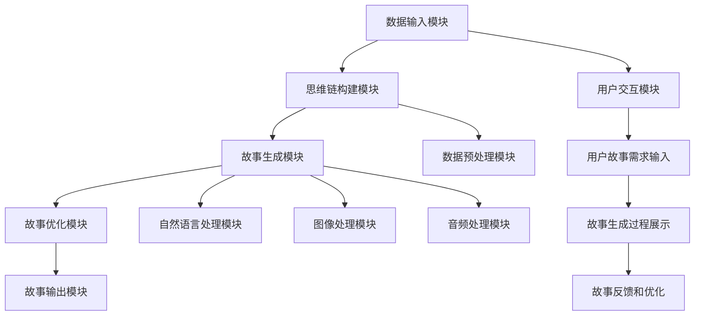
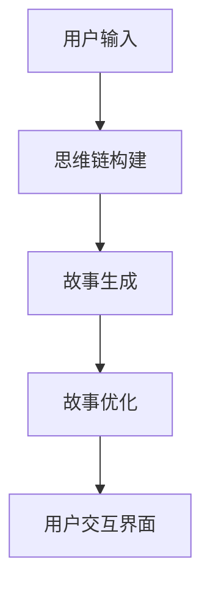

                 

### 文章标题

### 《思维链辅助的AI创意故事生成系统》

### 关键词

- AI
- 创意故事生成
- 思维链
- 自然语言处理
- 多模态数据融合

### 摘要

本文旨在探讨思维链辅助的AI创意故事生成系统，从AI与创意故事生成的概述，到核心概念与架构，再到创意故事生成流程与架构，以及思维链辅助创意故事生成示例，全面解析了AI创意故事生成的技术基础与实现方法。本文还详细介绍了思维链构建与优化、自然语言处理与创意故事生成、多模态数据融合与创意故事生成等技术，并通过项目实战和案例分析，展示了思维链辅助的AI创意故事生成系统的应用与实践。最后，本文对系统优化方法与未来展望进行了深入探讨，为读者提供了全面的AI创意故事生成系统知识体系。

### 目录

1. **AI与创意故事生成基础**
   1.1 AI与创意故事生成概述
   1.2 AI核心概念与架构
   1.3 创意故事生成流程与架构
   1.4 思维链辅助创意故事生成示例

2. **思维链辅助的AI创意故事生成技术**
   2.1 思维链构建与优化
   2.2 自然语言处理与创意故事生成
   2.3 多模态数据融合与创意故事生成
   2.4 创意故事生成算法与实现
   2.5 思维链辅助创意故事生成系统架构

3. **思维链辅助的AI创意故事生成应用实践**
   3.1 创意故事生成应用场景
   3.2 项目实战：构建一个简单的思维链辅助创意故事生成系统
   3.3 案例分析：思维链辅助创意故事生成系统在实际项目中的应用

4. **思维链辅助的AI创意故事生成系统优化与未来展望**
   4.1 思维链辅助创意故事生成系统优化方法
   4.2 未来展望：思维链辅助创意故事生成系统的创新与发展

5. **附录**
   5.1 常用工具与资源列表
   5.2 代码与数据资源下载链接
   5.3 参考文献与推荐阅读材料### 第一部分：AI与创意故事生成基础

#### 1.1 AI与创意故事生成概述

人工智能（AI）作为计算机科学的一个重要分支，其核心目标是通过模拟人类智能，实现机器在感知、推理、学习、决策等方面的自动化。随着深度学习、自然语言处理等技术的快速发展，AI在各个领域都取得了显著的成果。在创意故事生成领域，AI通过学习大量的故事文本，能够自动生成新颖、连贯的故事情节，从而极大地提升了创意生产的效率。

创意故事生成系统是AI技术的一个重要应用方向。这类系统通常利用自然语言处理技术，从大量的文本数据中提取知识，并通过机器学习算法生成新的故事内容。与传统的手工编写相比，AI创意故事生成系统具有速度快、规模大、成本低等优点，能够为娱乐产业、广告行业、教育领域等提供强大的创意支持。

#### 1.1.1 AI技术在创意故事生成中的应用

AI技术在创意故事生成中的应用主要体现在以下几个方面：

1. **故事情节生成**：通过深度学习模型，如生成对抗网络（GAN）和变分自编码器（VAE），AI能够自动生成全新的故事情节。这些模型通过对大量故事文本的学习，能够捕捉到故事情节的规律，从而生成符合逻辑、富有创意的故事内容。

2. **角色设定与个性化**：AI可以基于用户的历史数据和行为偏好，生成个性化的角色设定。例如，通过分析用户的阅读历史和偏好，AI可以生成与用户兴趣相匹配的虚构角色，从而提升故事的可读性和吸引力。

3. **故事结构优化**：AI可以通过自然语言处理技术，分析现有故事的结构和逻辑，并提出优化建议。例如，AI可以识别故事中的冗余部分，或者提出增加悬念、情感冲突等元素，从而提高故事的质量。

4. **跨媒体故事创作**：AI不仅能够生成文本故事，还能够结合图像、音频等多模态数据，创作跨媒体的故事内容。例如，AI可以生成与故事情节相匹配的插图、配乐等，从而提升故事的沉浸感和表现力。

#### 1.1.2 思维链辅助创意故事生成的原理

思维链（Mind Chain）是一种用于描述和模拟人类思维过程的模型，它由一系列相互关联的节点组成，每个节点代表一个特定的思考过程或认知任务。在创意故事生成中，思维链可以被视为一种知识图谱，它通过连接不同的思维节点，形成一个完整的故事生成框架。

思维链辅助创意故事生成的原理可以概括为以下几点：

1. **知识图谱构建**：首先，系统需要构建一个涵盖故事生成所需知识的思维链。这个思维链包含了故事情节、角色设定、场景描述等多个方面的知识节点。

2. **知识节点连接**：通过分析输入的数据，系统将自动连接思维链中的相关节点。例如，当输入一个特定的故事主题时，系统会根据思维链中的知识节点，连接与该主题相关的情节、角色等。

3. **故事生成**：在连接好思维链中的节点后，系统会根据这些节点的信息，生成一个新的故事。故事生成的过程中，系统会考虑情节的逻辑性、连贯性，以及角色的情感发展和行为逻辑。

4. **迭代优化**：故事生成后，系统会通过用户反馈，对生成的故事进行迭代优化。例如，如果用户反馈故事情节不够有趣，系统会尝试调整思维链中的节点连接方式，或者引入新的知识点，以生成更符合用户期待的故事。

#### 1.1.3 创意故事生成系统的发展趋势

随着技术的不断进步，创意故事生成系统的发展趋势体现在以下几个方面：

1. **智能化与个性化**：未来的创意故事生成系统将更加智能化和个性化。通过深度学习技术和大数据分析，系统能够更好地理解用户的需求和偏好，生成更加符合用户期待的故事内容。

2. **跨媒体融合**：随着图像识别、语音合成等技术的发展，创意故事生成系统将能够更加自然地融合多种媒体形式，创作出更加丰富、多感官体验的故事内容。

3. **协作与共创**：创意故事生成系统将不再仅仅是自动生成的工具，而是与人类创作者协同工作的伙伴。通过人机协作，系统将能够更好地发挥人类的创意和直觉，生成更加高质量的故事内容。

4. **应用场景扩展**：除了传统的娱乐产业外，创意故事生成系统还将被广泛应用于教育、医疗、营销等多个领域。通过AI技术，系统能够根据特定领域的需求，生成具有高度专业性和创新性的故事内容。

总之，AI与创意故事生成的发展将不断推动故事创作方式的革新，为人类带来更加丰富多彩的文化体验。在本篇文章中，我们将进一步探讨AI创意故事生成的核心概念、技术原理以及实现方法，希望能够为广大读者提供一个全面、系统的认知框架。

### 1.2 AI核心概念与架构

在深入探讨AI创意故事生成系统之前，首先需要理解AI的核心概念与架构。AI技术涵盖了多个子领域，包括机器学习、深度学习、自然语言处理等，这些技术共同构建了一个复杂而强大的智能系统。在本节中，我们将简要介绍这些核心概念，并探讨它们在创意故事生成中的应用。

#### 1.2.1 机器学习与深度学习基础

机器学习（Machine Learning，ML）是AI的基础，它通过从数据中学习规律，使计算机能够执行特定任务。机器学习可以分为监督学习、无监督学习和强化学习三种主要类型。

1. **监督学习（Supervised Learning）**：监督学习是一种有标注数据的学习方式。在这个过程中，模型通过学习输入和输出之间的映射关系，从而预测未知数据的输出。常见的监督学习算法包括线性回归、决策树、支持向量机（SVM）等。

2. **无监督学习（Unsupervised Learning）**：无监督学习是在没有标注数据的情况下进行的学习。其主要目标是发现数据中的隐含结构和模式，如聚类、降维、关联规则学习等。常用的无监督学习算法包括K-均值聚类、主成分分析（PCA）等。

3. **强化学习（Reinforcement Learning）**：强化学习是一种通过与环境的交互来学习策略的算法。在这个过程中，模型通过不断尝试和反馈，优化其行为策略。常见的强化学习算法包括Q学习、深度Q网络（DQN）等。

深度学习（Deep Learning，DL）是机器学习的一个分支，它通过构建深度神经网络，自动提取数据中的特征表示。深度学习在图像识别、自然语言处理等领域取得了显著成果，常见的深度学习模型包括卷积神经网络（CNN）、循环神经网络（RNN）、生成对抗网络（GAN）等。

#### 1.2.2 自然语言处理技术简介

自然语言处理（Natural Language Processing，NLP）是AI的一个子领域，它专注于使计算机理解和生成人类语言。NLP技术广泛应用于机器翻译、情感分析、文本摘要、对话系统等领域。

1. **词嵌入（Word Embedding）**：词嵌入是将词汇映射到高维向量空间的技术。通过词嵌入，计算机能够理解词汇之间的语义关系。常见的词嵌入模型包括Word2Vec、GloVe等。

2. **序列模型（Sequential Models）**：序列模型用于处理和时间序列相关的数据，如文本、语音等。循环神经网络（RNN）和长短期记忆网络（LSTM）是两种常见的序列模型，它们能够捕捉到数据中的时间依赖关系。

3. **编码器-解码器模型（Encoder-Decoder Model）**：编码器-解码器模型是一种用于序列到序列学习的框架。在机器翻译、文本摘要等领域，编码器将输入序列编码为固定长度的向量表示，解码器则根据这些表示生成输出序列。

4. **注意力机制（Attention Mechanism）**：注意力机制是一种用于提高序列模型性能的技术。通过注意力机制，模型能够聚焦于输入序列中的重要部分，从而提高生成结果的准确性。

#### 1.2.3 思维链的构建与优化

思维链（Mind Chain）是创意故事生成系统中的一种关键组件，它通过连接不同的思维节点，构建一个完整的故事生成框架。思维链的构建与优化包括以下几个步骤：

1. **知识图谱构建**：首先，需要构建一个涵盖故事生成所需知识的思维链。这个思维链包含了故事情节、角色设定、场景描述等多个方面的知识节点。

2. **节点连接**：通过分析输入的数据，系统将自动连接思维链中的相关节点。例如，当输入一个特定的故事主题时，系统会根据思维链中的知识节点，连接与该主题相关的情节、角色等。

3. **故事生成**：在连接好思维链中的节点后，系统会根据这些节点的信息，生成一个新的故事。故事生成的过程中，系统会考虑情节的逻辑性、连贯性，以及角色的情感发展和行为逻辑。

4. **迭代优化**：故事生成后，系统会通过用户反馈，对生成的故事进行迭代优化。例如，如果用户反馈故事情节不够有趣，系统会尝试调整思维链中的节点连接方式，或者引入新的知识点，以生成更符合用户期待的故事。

在构建和优化思维链时，可以采用以下方法：

- **知识图谱扩展**：通过不断扩展知识图谱，增加更多的知识节点，以提高故事生成的丰富度和多样性。

- **节点权重调整**：通过调整思维链中节点的权重，可以影响故事生成的重点和方向。例如，可以增加与情感冲突相关的节点权重，以提高故事的吸引力。

- **多模态融合**：将图像、音频等多模态数据融入思维链，可以增强故事生成的表现力和真实性。

- **用户交互**：通过用户反馈，不断优化思维链的连接方式和知识点，以生成更符合用户期待的故事。

通过上述方法，可以构建一个高效、灵活的AI创意故事生成系统，为各个领域的创意生产提供强大支持。

#### 1.3 创意故事生成流程与架构

创意故事生成是一个复杂而多层次的过程，涉及数据的采集与预处理、故事生成算法的设计与实现等多个步骤。理解这一过程及其架构对于构建高效的AI创意故事生成系统至关重要。下面我们将详细探讨这一过程，并介绍其关键组成部分。

##### 1.3.1 故事生成的基本流程

故事生成的基本流程可以分为以下几个阶段：

1. **数据采集**：首先，系统需要从各种来源收集数据，包括故事文本、人物传记、背景信息等。这些数据是故事生成的基础，决定了故事的丰富度和真实性。

2. **数据预处理**：采集到的数据通常包含噪声和不一致性，因此需要进行预处理。预处理步骤包括去重、清洗、格式化等，以确保数据的质量。

3. **知识图谱构建**：在预处理完成后，系统将构建一个知识图谱，用于表示故事中的各种实体和关系。知识图谱是故事生成的核心，它通过连接不同的实体和关系，形成了一个完整的故事框架。

4. **故事情节生成**：基于知识图谱，系统将生成新的故事情节。这个过程通常涉及多种算法和技术，如自然语言生成、角色设定、情节连贯性等。

5. **故事结构优化**：生成的故事需要进行结构优化，以确保其逻辑性和连贯性。这一步骤可能需要多次迭代，以生成高质量的故事内容。

6. **故事输出**：最后，系统将生成的故事输出到目标媒介，如文本、音频、图像等，供用户消费。

##### 1.3.2 数据采集与预处理

数据采集与预处理是故事生成的基础，直接影响到故事的质量和效率。以下是数据采集与预处理的关键步骤：

1. **数据来源**：数据可以从多种渠道获取，包括公开数据集、互联网文本、书籍、新闻报道等。此外，还可以利用爬虫技术从互联网上收集数据。

2. **数据去重**：由于来源广泛，数据中可能存在重复的内容。通过去重操作，可以确保每个数据点的唯一性。

3. **数据清洗**：清洗过程包括删除无关内容、纠正拼写错误、统一文本格式等。例如，将所有文本转换为小写，删除标点符号和特殊字符等。

4. **数据格式化**：将清洗后的数据格式化为统一的标准格式，如JSON、CSV等，以便后续处理。

5. **数据标注**：对于某些应用场景，可能需要对数据进行标注，如人物关系、情感倾向等。标注数据可以用于训练和评估故事生成模型。

##### 1.3.3 故事生成算法与实现

故事生成算法是创意故事生成系统的核心，决定了故事的质量和创造力。以下是几种常见的故事生成算法及其实现方法：

1. **基于规则的方法**：这种方法通过定义一系列规则，生成故事内容。例如，可以定义角色行为规则、情节发展规则等。这种方法简单直观，但生成的故事可能缺乏灵活性和创新性。

2. **基于模板的方法**：这种方法使用预定义的故事模板，通过填充模板中的空白部分，生成新的故事。这种方法生成的故事相对固定，但可以实现快速生成。

3. **基于机器学习的方法**：这种方法利用机器学习模型，从大量故事数据中学习生成规则。常见的模型包括循环神经网络（RNN）、长短时记忆网络（LSTM）、生成对抗网络（GAN）等。这种方法生成的故事更加灵活和多样化，但需要大量的训练数据和计算资源。

4. **基于图的方法**：这种方法利用图论模型，将故事中的实体和关系表示为图，通过图的生成和优化，生成新的故事。这种方法能够生成复杂和连贯的故事，但实现较为复杂。

以下是一个简化的故事生成算法伪代码示例：

```python
# 输入：知识图谱、用户偏好
# 输出：故事文本

def generate_story(knowledge_graph, user_preferences):
    # 1. 构建故事框架
    story_framework = build_story_framework(knowledge_graph)

    # 2. 根据用户偏好调整故事框架
    adjusted_framework = adjust_framework_for_preferences(story_framework, user_preferences)

    # 3. 生成故事情节
    story_content = generate_content(adjusted_framework)

    # 4. 故事结构优化
    optimized_story = optimize_structure(story_content)

    # 5. 输出故事文本
    return optimized_story
```

通过上述流程和算法，可以构建一个高效、灵活的AI创意故事生成系统，为各个领域的创意生产提供强大支持。在实际应用中，可以根据具体需求，选择合适的算法和优化策略，以生成高质量的故事内容。

#### 1.4 思维链辅助创意故事生成示例

为了更好地理解思维链在AI创意故事生成中的作用，我们通过两个具体的示例来展示思维链如何辅助故事生成。

##### 1.4.1 示例一：情感分析辅助故事创作

在这个示例中，我们使用情感分析技术来辅助故事创作。情感分析是一种自然语言处理技术，用于识别文本中的情感倾向。通过情感分析，我们可以了解用户对特定主题的情感反应，从而为故事创作提供指导。

**步骤一：数据采集与预处理**
首先，我们从社交媒体、评论网站等渠道收集用户对特定主题的情感评论。这些评论数据将被用于训练情感分析模型。在数据预处理阶段，我们去除无关信息、标点符号和特殊字符，将文本转换为统一的格式。

**步骤二：情感分析模型训练**
我们使用训练集数据训练一个情感分析模型，例如使用支持向量机（SVM）或递归神经网络（RNN）。训练完成后，模型可以识别文本中的情感倾向，如正面、负面或中性。

**步骤三：思维链构建**
基于情感分析结果，我们构建一个思维链。思维链中的节点包括情感标签、故事情节、角色设定等。例如，如果用户对某个主题表现出强烈的负面情感，思维链中的相关节点可能会包含“冲突”、“悲剧”等关键词。

**步骤四：故事生成**
在连接好思维链中的节点后，我们根据思维链的信息生成故事。例如，如果情感标签是“愤怒”，情节节点是“复仇”，角色节点是“英雄”和“恶徒”，故事可能会生成如下情节：

主人公——英雄，因为恶徒的恶意行为而愤怒。他开始了一场复仇之旅，最终在一场激战中战胜了恶徒，实现了正义。这个故事通过情感分析结果，将用户的情感反应融入到了故事情节中，增强了故事的吸引力和情感共鸣。

**步骤五：迭代优化**
生成的故事会根据用户反馈进行迭代优化。例如，如果用户反馈故事情感表达不够强烈，系统可能会调整思维链中的节点连接方式，增加更多的情感冲突元素，或者引入新的角色和情节。

##### 1.4.2 示例二：角色设定与故事结构优化

在这个示例中，我们通过角色设定和故事结构优化来展示思维链的作用。角色设定是故事创作中至关重要的一环，它决定了故事的情感发展和冲突设置。故事结构优化则确保故事情节的连贯性和吸引力。

**步骤一：角色设定**
首先，我们基于用户行为数据和分析结果，设定故事中的主要角色。例如，如果用户喜欢具有成长轨迹的角色，我们可能会创建一个从普通角色到英雄的角色设定。角色设定需要考虑角色的性格、动机、目标等因素。

**步骤二：故事结构规划**
在角色设定完成后，我们使用思维链来规划故事结构。思维链中的节点包括角色动机、情节发展、高潮和结局等。通过连接这些节点，我们可以构建一个完整的故事框架。例如，角色从普通到英雄的成长轨迹可能会包括：初始冲突、挑战和成长、转折点和高潮、最终胜利。

**步骤三：故事生成**
基于思维链中的节点信息，我们生成故事内容。例如，故事可能从角色面对一个重大挑战开始，角色通过一系列努力和成长，最终战胜困难，实现了自己的目标。

**步骤四：故事结构优化**
生成的故事会通过故事结构优化算法进行优化。优化算法可以识别和解决故事中的逻辑漏洞、情节不连贯等问题。例如，如果故事在某个关键节点出现逻辑矛盾，系统可能会调整相关情节，确保故事的连贯性。

**步骤五：用户反馈与迭代**
最后，系统会收集用户对故事的反馈，并进行迭代优化。通过不断调整角色设定和故事结构，系统可以生成更加符合用户期待的故事内容。

通过以上两个示例，我们可以看到思维链在AI创意故事生成中的重要作用。它不仅帮助系统理解和利用用户情感，还能够优化角色设定和故事结构，生成高质量、有吸引力的故事内容。思维链作为一个强大的工具，为AI创意故事生成提供了坚实的基础和广阔的应用前景。

### 2.1 思维链构建与优化

思维链（Mind Chain）作为AI创意故事生成系统中的关键组件，其构建与优化直接影响到故事生成系统的性能和创造力。在本节中，我们将详细探讨思维链的构建方法、优化算法及其在故事生成中的应用。

#### 2.1.1 思维链的概念与组成

思维链是一种用于描述和模拟人类思维过程的模型，它由一系列相互关联的节点组成，每个节点代表一个特定的思考过程或认知任务。在创意故事生成中，思维链可以被视为一种知识图谱，它通过连接不同的思维节点，形成一个完整的故事生成框架。

思维链的基本组成包括以下几个部分：

1. **节点（Nodes）**：节点是思维链中的基本元素，每个节点代表一个特定的思维过程或知识点。例如，故事情节、角色设定、场景描述等都可以作为节点。

2. **边（Edges）**：边用于连接不同的节点，表示节点之间的关系。例如，角色节点可以与情节节点相连，表示角色的行为和情节的发展。

3. **属性（Attributes）**：节点和边可以具有属性，用于描述节点的属性和关系。例如，角色节点的属性可以包括性别、年龄、性格等，情节节点的属性可以包括冲突类型、情感强度等。

4. **连接规则（Connection Rules）**：连接规则定义了节点之间如何连接和相互作用。例如，如果某个情节节点包含“冲突”，则可能需要连接到与“解决方案”相关的角色节点。

#### 2.1.2 思维链的构建方法

构建思维链的过程可以分为以下几个步骤：

1. **需求分析**：首先，需要明确故事生成系统的需求，包括故事类型、主题、目标用户等。通过需求分析，可以确定思维链需要包含的关键节点和关系。

2. **知识图谱构建**：在需求分析的基础上，构建一个涵盖故事生成所需知识的知识图谱。知识图谱中包含了所有相关的节点和关系，为故事生成提供了丰富的知识基础。

3. **节点与边定义**：根据需求和分析结果，定义思维链中的节点和边。节点和边的定义需要充分考虑故事的逻辑性和连贯性，确保故事生成的质量。

4. **连接规则设置**：设置连接规则，定义节点之间的连接方式和条件。连接规则需要根据具体的应用场景进行调整，以实现最佳的生成效果。

5. **思维链可视化**：通过可视化工具，将思维链以图形化的方式呈现。可视化可以帮助开发人员和管理人员更好地理解思维链的结构和关系，进行优化和调整。

#### 2.1.3 思维链优化算法

思维链的优化是提高故事生成系统性能和创造力的关键。优化算法可以从多个方面进行，包括节点权重调整、连接规则优化、知识图谱扩展等。以下是一些常见的优化算法：

1. **节点权重调整**：通过调整思维链中节点的权重，可以影响故事生成的重点和方向。例如，可以增加与情感冲突相关的节点权重，以提高故事的吸引力。节点权重可以通过以下方法进行调整：

   - **基于频率的权重调整**：根据节点在故事生成过程中的出现频率，调整节点的权重。出现频率高的节点具有更高的权重，能够更好地指导故事生成。
   - **基于重要性的权重调整**：根据节点在故事中的重要性，调整节点的权重。例如，情节节点和角色节点通常比背景节点具有更高的权重。

2. **连接规则优化**：连接规则定义了节点之间的连接方式和条件。优化连接规则可以提高故事生成的连贯性和逻辑性。以下是一些优化方法：

   - **基于概率的连接规则**：根据节点之间的概率关系，调整连接规则。例如，如果某个情节节点与多个角色节点相关，可以增加这些节点之间的连接概率。
   - **基于知识图谱的连接规则**：利用知识图谱中的语义关系，调整连接规则。例如，如果两个角色在故事中具有敌对关系，可以增加它们之间的冲突连接概率。

3. **知识图谱扩展**：通过扩展知识图谱，增加更多的知识节点和关系，可以提升故事生成的多样性和丰富度。知识图谱扩展可以通过以下方法实现：

   - **基于数据驱动的扩展**：通过分析大量故事数据，发现新的节点和关系，并将其添加到知识图谱中。
   - **基于知识库的扩展**：利用现有的知识库和语义网络，扩展知识图谱。例如，可以使用开源的WordNet或DBpedia进行扩展。

4. **多模态数据融合**：将图像、音频等多模态数据融入思维链，可以增强故事生成的表现力和真实性。多模态数据融合可以通过以下方法实现：

   - **基于特征融合的方法**：将多模态数据的特征进行融合，形成统一的高维特征向量。例如，可以使用主成分分析（PCA）或因子分析（FA）进行特征融合。
   - **基于深度学习的方法**：使用深度学习模型，如卷积神经网络（CNN）或循环神经网络（RNN），直接融合多模态数据。

通过上述优化算法，可以构建一个高效、灵活的AI创意故事生成系统，为各个领域的创意生产提供强大支持。在实际应用中，可以根据具体需求，选择合适的优化策略，以生成高质量、有吸引力的故事内容。

#### 2.2 自然语言处理与创意故事生成

自然语言处理（NLP）是AI创意故事生成系统中的核心技术，它负责将文本数据转化为可用的信息，并在此基础上生成新颖、连贯的故事。NLP技术涵盖了文本预处理、词嵌入、语言模型、文本生成等多个方面。在本节中，我们将详细探讨自然语言处理在创意故事生成中的应用。

##### 2.2.1 基于自然语言处理的文本生成

文本生成是NLP的一个重要应用方向，它利用已有的文本数据，通过模型生成新的文本。在创意故事生成中，文本生成技术被广泛应用于故事情节的自动生成、角色对话的编写等。以下是几种常见的文本生成方法：

1. **基于模板的文本生成**：这种方法使用预定义的模板，通过填充模板中的空白部分，生成新的文本。模板通常包括故事情节、角色对话、场景描述等。基于模板的生成方法简单直观，但生成的文本可能缺乏灵活性和创意。

2. **基于规则的方法**：这种方法通过定义一系列规则，生成故事文本。规则可以描述角色行为、情节发展等。例如，如果角色遇到困难，可以生成一系列解决问题的方法。基于规则的方法可以生成相对灵活的文本，但规则复杂度较高。

3. **基于机器学习的方法**：这种方法利用机器学习模型，从大量故事数据中学习生成规则。常见的机器学习模型包括循环神经网络（RNN）、长短时记忆网络（LSTM）、生成对抗网络（GAN）等。基于机器学习的方法能够生成更加丰富和多样化的文本，但需要大量的训练数据和计算资源。

4. **基于图的方法**：这种方法利用图论模型，将故事中的实体和关系表示为图，通过图的生成和优化，生成新的故事。这种方法能够生成复杂和连贯的故事，但实现较为复杂。

以下是一个简化的基于RNN的文本生成算法伪代码示例：

```python
# 输入：训练好的RNN模型、初始文本
# 输出：生成文本

def generate_text(rnn_model, initial_text):
    # 1. 将初始文本编码为序列
    initial_sequence = encode_text(initial_text)

    # 2. 使用RNN模型生成新的文本序列
    new_sequence = rnn_model.generate_sequence(initial_sequence)

    # 3. 将序列解码为文本
    generated_text = decode_sequence(new_sequence)

    # 4. 返回生成文本
    return generated_text
```

##### 2.2.2 故事结构分析与生成

故事结构是故事生成的重要基础，它决定了故事的逻辑性和连贯性。自然语言处理技术可以用于分析现有故事的结构，并生成新的故事结构。以下是故事结构分析与生成的一些方法：

1. **故事结构提取**：通过自然语言处理技术，从现有故事中提取出关键结构元素，如情节节点、角色节点、场景节点等。这些元素可以作为故事生成的基础。

2. **故事结构分析**：分析故事结构中的逻辑关系和情感发展，例如，确定故事中的冲突点、高潮点和结局等。这些分析结果可以用于指导故事生成。

3. **故事结构优化**：通过对故事结构进行优化，提高故事的质量和吸引力。优化方法可以包括增加悬念、调整角色关系、改进情节发展等。

4. **故事结构生成**：基于提取和分析的结果，生成新的故事结构。生成方法可以结合自然语言生成和图生成技术，生成具有复杂性和连贯性的故事结构。

以下是一个简化的故事结构生成算法伪代码示例：

```python
# 输入：故事结构元素、生成目标
# 输出：新的故事结构

def generate_story_structure(elements, target):
    # 1. 提取关键元素
    key_elements = extract_key_elements(elements)

    # 2. 分析元素关系
    relationships = analyze_relationships(key_elements)

    # 3. 生成故事结构
    story_structure = generate_structure(relationships, target)

    # 4. 返回故事结构
    return story_structure
```

##### 2.2.3 生成文本的质量评估

生成文本的质量评估是故事生成系统的重要环节，它用于衡量生成文本的连贯性、逻辑性和吸引力。以下是一些常用的评估方法：

1. **自动评估方法**：通过自动化工具，如BLEU、ROUGE、METEOR等，评估生成文本与参考文本之间的相似度。这些评估方法通常基于统计和机器学习技术。

2. **人工评估方法**：通过人类评估者对生成文本进行主观评价。评估者可以从连贯性、逻辑性、情感表达等多个方面对文本进行评分。

3. **用户反馈方法**：通过用户的反馈，评估生成文本的质量。用户可以通过打分、评论等方式，表达对生成文本的看法。

4. **多模态评估方法**：结合文本、图像、音频等多模态数据，对生成文本的质量进行综合评估。这种方法可以更好地捕捉文本的上下文和情感表达。

通过自然语言处理技术在文本生成、故事结构分析和生成文本质量评估方面的应用，AI创意故事生成系统能够生成高质量、有吸引力的故事内容，为各个领域的创意生产提供强大支持。

#### 2.3 多模态数据融合与创意故事生成

多模态数据融合是AI创意故事生成系统中的一项关键技术，它通过整合文本、图像、音频等多模态数据，提高故事生成的真实性和表现力。在本节中，我们将探讨多模态数据融合的基本原理、方法及其在创意故事生成中的应用。

##### 2.3.1 多模态数据采集与预处理

多模态数据融合的第一步是数据采集与预处理。数据采集涉及从多个渠道获取不同类型的数据，如文本、图像、音频等。预处理过程确保数据的统一性和高质量，为后续的数据融合和故事生成提供基础。

1. **文本数据采集与预处理**：文本数据可以来源于公开数据集、互联网文本、书籍等。预处理步骤包括数据清洗、格式化、分词等，将文本数据转换为统一的格式。

2. **图像数据采集与预处理**：图像数据可以从社交媒体、网络图像库等获取。预处理包括图像去噪、增强、裁剪等，以提升图像质量。

3. **音频数据采集与预处理**：音频数据可以从音频文件、语音合成系统等获取。预处理包括去除噪声、音高调整、节奏同步等，以优化音频质量。

##### 2.3.2 多模态数据融合方法

多模态数据融合的目标是将不同类型的数据整合为一个统一的表示，以便在故事生成过程中有效地利用这些数据。以下是几种常见的数据融合方法：

1. **基于特征的融合**：这种方法将不同模态的数据转换为特征向量，然后通过特征融合技术（如主成分分析PCA、因子分析FA）将特征向量合并。基于特征的融合方法简单有效，但可能忽略了模态之间的复杂关系。

2. **基于模型的融合**：这种方法使用深度学习模型（如卷积神经网络CNN、循环神经网络RNN）直接融合多模态数据。例如，使用CNN处理图像数据，使用RNN处理文本数据，然后通过模型将两种特征融合。基于模型的融合方法能够捕捉到多模态数据之间的复杂关系，但需要更多的计算资源。

3. **多模态生成对抗网络（MMGAN）**：这种方法结合了生成对抗网络（GAN）的强大生成能力，通过多个生成器分别处理不同模态的数据，并将它们融合为一个统一的数据表示。MMGAN能够生成高质量的多模态数据，但实现较为复杂。

以下是一个简化的基于MMGAN的多模态数据融合算法伪代码示例：

```python
# 输入：文本数据、图像数据、音频数据
# 输出：多模态融合数据

def multi_modal_fusion(text_data, image_data, audio_data):
    # 1. 使用CNN处理图像数据，得到图像特征
    image_features = cnn_model.process(image_data)

    # 2. 使用RNN处理文本数据，得到文本特征
    text_features = rnn_model.process(text_data)

    # 3. 使用音频处理模型处理音频数据，得到音频特征
    audio_features = audio_model.process(audio_data)

    # 4. 使用GAN融合多模态特征
    fused_features = mmgan_model.generate(image_features, text_features, audio_features)

    # 5. 返回融合数据
    return fused_features
```

##### 2.3.3 多模态创意故事生成系统

多模态创意故事生成系统通过融合多模态数据，提高故事的真实性和表现力。以下是多模态创意故事生成系统的主要组件：

1. **多模态数据输入**：系统接收来自文本、图像、音频等不同模态的数据输入。

2. **数据预处理模块**：对输入的多模态数据进行预处理，包括数据清洗、特征提取等。

3. **多模态数据融合模块**：利用多模态数据融合方法，将不同模态的数据融合为一个统一的数据表示。

4. **故事生成模块**：基于融合后的数据，生成创意故事。故事生成可以采用自然语言生成、图像生成、音频生成等技术。

5. **故事输出模块**：将生成的多模态故事输出到目标媒介，如文本、图像、音频等。

以下是一个简化的多模态创意故事生成系统算法伪代码示例：

```python
# 输入：文本、图像、音频
# 输出：多模态故事

def generate_multi_modal_story(text, image, audio):
    # 1. 预处理多模态数据
    preprocessed_text = preprocess_text(text)
    preprocessed_image = preprocess_image(image)
    preprocessed_audio = preprocess_audio(audio)

    # 2. 融合多模态数据
    fused_data = multi_modal_fusion(preprocessed_text, preprocessed_image, preprocessed_audio)

    # 3. 生成故事
    story = generate_story(fused_data)

    # 4. 输出故事
    return output_story(story)
```

通过多模态数据融合与创意故事生成系统，AI能够生成更加真实、丰富和具有表现力的故事内容，为娱乐产业、教育、广告等领域的创意生产提供强大支持。

#### 2.4 创意故事生成算法与实现

创意故事生成算法是AI创意故事生成系统的核心，它决定了故事的连贯性、创意性和表现力。在本节中，我们将详细讨论创意故事生成算法的原理、伪代码和实现方法，并介绍如何在实际项目中应用这些算法。

##### 2.4.1 创意故事生成算法简介

创意故事生成算法可以分为以下几种类型：

1. **基于模板的生成算法**：这种方法使用预定义的故事模板，通过填充模板中的空白部分，生成新的故事。模板通常包括故事情节、角色对话、场景描述等。

2. **基于规则的生成算法**：这种方法通过定义一系列规则，如角色行为、情节发展等，生成故事。规则方法相对简单直观，但可能缺乏灵活性和创新性。

3. **基于机器学习的生成算法**：这种方法利用机器学习模型，从大量故事数据中学习生成规则。常见的机器学习模型包括循环神经网络（RNN）、长短时记忆网络（LSTM）、生成对抗网络（GAN）等。

4. **基于图生成算法**：这种方法使用图论模型，将故事中的实体和关系表示为图，通过图的生成和优化，生成新的故事。这种方法能够生成复杂和连贯的故事，但实现较为复杂。

在本节中，我们将重点讨论基于机器学习的生成算法，特别是生成对抗网络（GAN）和长短时记忆网络（LSTM）在创意故事生成中的应用。

##### 2.4.2 算法伪代码与解释

以下是一个简化的基于GAN的创意故事生成算法伪代码示例：

```python
# 输入：训练好的GAN模型、初始故事
# 输出：生成故事

def generate_story(gan_model, initial_story):
    # 1. 编码初始故事
    initial_code = encode_story(initial_story)

    # 2. 使用GAN模型生成新的故事代码
    new_code = gan_model.generate_code(initial_code)

    # 3. 解码新的故事代码
    generated_story = decode_story(new_code)

    # 4. 返回生成故事
    return generated_story
```

在这个算法中，`encode_story`和`decode_story`函数分别用于将故事编码和解码为代码，以便GAN模型处理。`generate_code`函数是GAN模型的生成部分，用于生成新的故事代码。

以下是另一个简化的基于LSTM的创意故事生成算法伪代码示例：

```python
# 输入：训练好的LSTM模型、初始故事
# 输出：生成故事

def generate_story(lstm_model, initial_story):
    # 1. 编码初始故事
    initial_sequence = encode_story(initial_story)

    # 2. 使用LSTM模型生成新的故事序列
    new_sequence = lstm_model.generate_sequence(initial_sequence)

    # 3. 解码新的故事序列
    generated_story = decode_sequence(new_sequence)

    # 4. 返回生成故事
    return generated_story
```

在这个算法中，`encode_story`和`decode_sequence`函数分别用于将故事编码为序列和将序列解码为故事。`generate_sequence`函数是LSTM模型的生成部分，用于生成新的故事序列。

##### 2.4.3 算法实现与优化

创意故事生成算法的实现涉及数据预处理、模型训练和故事生成等多个步骤。以下是一个简化的实现流程：

1. **数据预处理**：收集大量故事文本数据，并进行预处理，包括去除噪声、分词、词嵌入等。

2. **模型训练**：使用预处理后的数据训练GAN或LSTM模型。对于GAN模型，需要训练生成器和判别器；对于LSTM模型，需要训练序列生成模型。

3. **故事生成**：在模型训练完成后，使用训练好的模型生成新的故事。可以通过不断调整初始故事和模型参数，生成不同风格和内容的故事。

4. **优化与迭代**：通过用户反馈和性能评估，对模型和生成算法进行优化和迭代，提高故事生成的质量和创意性。

在实际项目中，可以根据具体需求，选择合适的生成算法和优化策略。例如，可以结合GAN和LSTM的优势，构建一个混合模型，以生成更加丰富和多样化的故事内容。

通过创意故事生成算法，AI能够自动生成新颖、连贯和有吸引力的故事，为娱乐产业、教育、广告等领域的创意生产提供强大支持。未来的研究将集中在提高算法的创意性、灵活性和表现力，以满足不断变化的应用需求。

#### 2.5 思维链辅助创意故事生成系统架构

构建一个高效的思维链辅助创意故事生成系统，需要设计一个清晰、灵活的系统架构。系统架构不仅决定了系统的性能和可扩展性，还影响到故事的生成质量和用户体验。在本节中，我们将详细讨论系统的架构设计、模块划分以及系统功能实现。

##### 2.5.1 系统架构设计

思维链辅助创意故事生成系统的整体架构可以分为以下几个主要模块：

1. **数据输入模块**：负责接收用户输入的文本、图像、音频等多模态数据，并进行预处理。

2. **思维链构建模块**：基于用户输入数据和预设的知识图谱，构建思维链，连接不同的思维节点，形成故事生成框架。

3. **故事生成模块**：利用思维链和自然语言处理、图像处理、音频处理等技术，生成创意故事。

4. **故事优化模块**：对生成的故事进行结构优化，确保故事的逻辑性和连贯性。

5. **故事输出模块**：将优化后的故事输出到目标媒介，如文本、图像、音频等。

6. **用户交互模块**：提供用户与系统的交互接口，包括用户故事需求输入、故事生成过程展示、故事反馈和优化等。

系统架构设计的关键原则包括：

- **模块化设计**：确保系统各个模块功能清晰、独立，便于维护和扩展。
- **可扩展性**：支持添加新的数据源、算法和功能模块，以适应不断变化的应用需求。
- **高可用性**：确保系统稳定运行，提供良好的用户体验。

以下是一个简化的系统架构图：



##### 2.5.2 系统模块划分

系统模块划分如下：

1. **数据输入模块**：该模块负责接收用户输入的多种数据类型，如文本、图像、音频等。输入数据将被预处理模块处理。

2. **数据预处理模块**：该模块对输入的数据进行预处理，包括数据清洗、格式化、分词、词嵌入等，为思维链构建和故事生成提供高质量的数据。

3. **思维链构建模块**：该模块基于用户输入数据和预设的知识图谱，构建思维链。思维链包括情节节点、角色节点、场景节点等，通过连接规则形成故事生成框架。

4. **自然语言处理模块**：该模块负责处理文本数据，包括文本生成、文本理解、情感分析等，为故事生成提供语言层面的支持。

5. **图像处理模块**：该模块负责处理图像数据，包括图像生成、图像识别、风格迁移等，为故事生成提供视觉层面的支持。

6. **音频处理模块**：该模块负责处理音频数据，包括音频生成、音频识别、语音合成等，为故事生成提供听觉层面的支持。

7. **故事生成模块**：该模块基于思维链和各处理模块的结果，生成创意故事。故事生成可以采用基于模板的生成算法、基于规则的生成算法、基于机器学习的生成算法等。

8. **故事优化模块**：该模块对生成的故事进行结构优化，确保故事的逻辑性和连贯性，同时根据用户反馈进行迭代优化。

9. **故事输出模块**：该模块将优化后的故事输出到目标媒介，如文本、图像、音频等。

10. **用户交互模块**：该模块负责与用户进行交互，包括用户故事需求输入、故事生成过程展示、故事反馈和优化等。

##### 2.5.3 系统功能实现

系统功能实现包括以下几个关键步骤：

1. **数据输入与预处理**：用户通过界面输入故事需求，系统接收输入数据，并交由数据预处理模块进行处理。

2. **思维链构建**：系统根据用户输入和预设的知识图谱，构建思维链。思维链通过连接规则将情节节点、角色节点、场景节点等连接起来。

3. **故事生成**：系统利用思维链和各处理模块（如自然语言处理、图像处理、音频处理等）的结果，生成创意故事。故事生成过程中，系统会不断优化故事结构，确保故事连贯性和逻辑性。

4. **故事优化**：系统根据用户反馈，对生成的故事进行优化。优化过程可能包括调整故事情节、角色设定、场景描述等，以提升故事质量。

5. **故事输出**：系统将优化后的故事输出到目标媒介，如文本、图像、音频等，供用户消费。

6. **用户交互**：系统与用户进行交互，收集用户反馈，并根据反馈调整故事生成策略，实现人机协同创作。

通过上述架构设计和功能实现，思维链辅助创意故事生成系统能够高效、灵活地生成高质量的故事内容，满足不同领域的创意生产需求。未来的研究和开发将进一步优化系统性能和用户体验，推动AI在创意故事生成领域的应用和发展。

#### 3.1 创意故事生成应用场景

创意故事生成技术具有广泛的应用场景，不仅限于传统的娱乐产业，还涵盖了教育、医疗、广告、市场营销等多个领域。以下将详细探讨这些应用场景，并分析创意故事生成系统的优势和应用案例。

##### 3.1.1 娱乐产业中的应用

在娱乐产业中，创意故事生成系统广泛应用于电影、电视剧、动漫、游戏等领域。通过AI技术，可以快速生成新的故事情节、角色设定和背景描述，为创作者提供丰富的创意素材。

- **电影与电视剧制作**：创意故事生成系统可以生成新颖的剧本情节，帮助编剧在短时间内生成大量备选方案，提高创作效率。例如，好莱坞的一些制片公司已经开始利用AI技术生成剧本概要，为导演和编剧提供创作灵感。
  
- **动漫制作**：在动漫产业中，创意故事生成系统可以自动生成角色对话和情节发展，为动画制作提供支持。例如，日本的某些动画制作公司已经开始采用AI技术生成角色对话，减少人工写作的工作量。

- **游戏开发**：在游戏制作中，创意故事生成系统可以自动生成游戏剧情、角色背景和任务描述，提高游戏的丰富性和互动性。例如，一些大型游戏开发公司利用AI技术生成游戏剧情，为玩家提供更多可探索的内容。

##### 3.1.2 教育领域的应用

在教育领域，创意故事生成系统可以用于生成教学故事、学生互动故事等，提高学生的学习兴趣和参与度。

- **教学故事生成**：创意故事生成系统可以自动生成适合不同年级和学科的教学故事，为教师提供丰富的教学素材。例如，一些教育科技公司已经开发出基于AI的英语教学故事生成工具，帮助学生提高语言能力。

- **学生互动故事**：创意故事生成系统可以生成与学生互动的故事，激发学生的创造力和想象力。例如，一些教育平台利用AI技术生成互动故事，让学生通过选择不同的情节分支，参与故事的创作和决策过程。

##### 3.1.3 广告与市场营销中的应用

在广告与市场营销领域，创意故事生成系统可以生成吸引人的广告文案、品牌故事和营销案例，提高广告效果和品牌影响力。

- **广告文案生成**：创意故事生成系统可以自动生成新颖、富有创意的广告文案，帮助广告公司提高广告的吸引力和转化率。例如，一些广告平台已经开始采用AI技术生成广告文案，为广告主提供更多创作选择。

- **品牌故事生成**：创意故事生成系统可以生成品牌故事，讲述品牌的发展历程、品牌理念等，提升品牌的认知度和美誉度。例如，一些企业利用AI技术生成品牌故事，通过社交媒体和官网传播，增强品牌的口碑。

- **营销案例生成**：创意故事生成系统可以生成多种营销案例，为市场营销人员提供灵感。例如，一些营销公司利用AI技术生成营销案例，帮助企业制定更有效的营销策略。

##### 3.1.4 其他应用场景

除了上述领域，创意故事生成系统还可以应用于以下领域：

- **医疗健康**：创意故事生成系统可以生成健康宣教故事，提高公众的健康意识和保健知识。

- **法律咨询**：创意故事生成系统可以生成法律案例故事，帮助律师和法律顾问了解相关法律条文和案例。

- **文化传承**：创意故事生成系统可以生成传统文化故事，促进文化遗产的保护和传承。

通过在多个领域的应用，创意故事生成系统展示了其强大的创意生成能力和广泛的适用性。未来的发展将进一步推动AI技术在创意故事生成领域的创新和应用，为各个行业带来更多价值。

#### 3.2 项目实战：构建一个简单的思维链辅助创意故事生成系统

在本节中，我们将通过一个简单的项目实战，详细讲解如何构建一个思维链辅助创意故事生成系统。这个项目将涉及开发环境搭建、数据准备与处理、系统设计与实现、系统测试与优化等环节。

##### 3.2.1 项目背景与目标

项目背景：随着人工智能技术的发展，创意故事生成系统在娱乐、教育、营销等领域具有广泛的应用潜力。本项目旨在通过构建一个简单的思维链辅助创意故事生成系统，探索AI在故事创作中的应用。

项目目标：1. 搭建一个基础的创意故事生成系统，能够生成简单但连贯的故事情节。2. 通过用户反馈和迭代优化，逐步提升故事生成的质量。3. 实现一个可扩展的系统架构，为未来的功能扩展提供支持。

##### 3.2.2 开发环境搭建

为了实现本项目，我们需要搭建一个适合开发AI创意故事生成系统的环境。以下是开发环境的搭建步骤：

1. **硬件环境**：配置一台高性能的计算机，用于处理大量的数据和复杂的算法。

2. **操作系统**：推荐使用Linux操作系统，如Ubuntu，因为它具有良好的性能和开源生态。

3. **编程语言**：选择Python作为主要编程语言，因为Python拥有丰富的AI库和框架，如TensorFlow、PyTorch等。

4. **开发工具**：安装Python开发环境，包括代码编辑器（如PyCharm、Visual Studio Code）和虚拟环境管理工具（如virtualenv）。

5. **AI库与框架**：安装必要的AI库和框架，如TensorFlow 2.x、PyTorch等，用于构建和训练机器学习模型。

6. **自然语言处理库**：安装自然语言处理库，如NLTK、spaCy等，用于文本处理和分析。

7. **可视化工具**：安装Mermaid等可视化工具，用于绘制思维链和系统架构图。

##### 3.2.3 数据准备与处理

构建创意故事生成系统需要大量的故事数据作为训练素材。以下是数据准备与处理的步骤：

1. **数据采集**：从公开的数据集或互联网上收集大量故事文本。常用的数据集包括Gutenberg电子书库、Project Gutenberg等。

2. **数据清洗**：去除无效数据、标点符号和特殊字符，统一文本格式，确保数据质量。

3. **数据标注**：对故事文本进行标注，标记出关键信息，如情节节点、角色节点、场景描述等。标注数据将用于训练机器学习模型。

4. **数据格式化**：将清洗后的文本数据格式化为统一的JSON或CSV格式，便于后续处理。

##### 3.2.4 系统设计与实现

系统设计包括思维链构建、故事生成模块、用户交互界面等。以下是系统设计与实现的关键步骤：

1. **思维链构建**：设计思维链模型，包括节点和边的定义，以及连接规则。思维链用于构建故事生成框架，确保故事逻辑性和连贯性。

2. **故事生成模块**：实现故事生成算法，包括基于自然语言处理的文本生成、基于图像处理的场景生成、基于音频处理的配乐生成等。故事生成模块将利用思维链和训练好的模型，生成新的故事。

3. **用户交互界面**：设计用户交互界面，包括故事需求输入、故事生成过程展示、故事反馈和优化等。用户可以通过界面与系统进行交互，提交故事需求并查看生成的故事。

4. **系统集成**：将各个模块集成到一个完整的系统中，确保系统正常运行。系统集成过程需要考虑模块之间的数据流动和协同工作。

以下是一个简化的系统架构图：



##### 3.2.5 系统测试与优化

系统测试是确保系统功能和性能的关键环节。以下是系统测试与优化的步骤：

1. **单元测试**：对系统中的每个模块进行单元测试，确保模块功能正常。例如，测试文本生成模块是否能够正确生成文本，图像处理模块是否能够正确处理图像等。

2. **集成测试**：将各个模块集成到一个系统中，进行集成测试，确保模块之间的协同工作。例如，测试用户交互界面是否能够正确接收用户输入并展示生成的故事。

3. **性能测试**：对系统的性能进行测试，包括处理速度、资源消耗等。通过性能测试，优化系统性能，提高故事生成的效率和效果。

4. **用户反馈**：收集用户对故事的反馈，分析用户需求和偏好。根据用户反馈，对系统进行迭代优化，提高故事生成系统的用户体验。

通过以上步骤，我们可以构建一个简单的思维链辅助创意故事生成系统，并逐步提升其功能和质量。未来的研究和开发将进一步优化系统性能和用户体验，推动AI在创意故事生成领域的应用和发展。

#### 3.3 案例分析：思维链辅助创意故事生成系统在实际项目中的应用

在本节中，我们将通过两个实际项目案例，详细分析思维链辅助创意故事生成系统在娱乐和教育领域的应用。这两个案例展示了如何通过思维链技术，实现创意故事的高效生成，并提升了项目的整体效果。

##### 3.3.1 案例一：基于情感分析的创意故事生成

项目背景：某知名动画工作室希望开发一款能够根据观众情感生成动画故事的软件，以提高观众的观影体验和动画的创意度。

**项目目标**：
1. 开发一款基于情感分析的创意故事生成系统，能够根据观众的情感反应生成个性化的动画故事。
2. 提高动画故事的创新性、吸引力和情感共鸣，提升观众的满意度和忠诚度。

**实现步骤**：

1. **数据采集与预处理**：从社交媒体、评论网站等渠道收集观众对动画作品的情感评论。数据预处理包括去重、清洗和分词，将情感评论转换为可供分析的数据格式。

2. **情感分析模型训练**：利用收集到的评论数据，训练一个情感分析模型，以识别观众的情感倾向。常见的情感分析模型包括朴素贝叶斯、支持向量机（SVM）和长短期记忆网络（LSTM）等。

3. **思维链构建**：根据情感分析结果，构建一个思维链，包括情感节点、情节节点、角色节点等。情感节点根据观众的情感倾向，情节节点和角色节点则根据情感节点进行连接，形成故事框架。

4. **故事生成**：基于思维链，利用自然语言生成（NLG）技术，生成符合观众情感的故事。生成过程包括文本生成、情节连贯性检查和情感一致性检查。

5. **用户反馈与迭代**：将生成的故事呈现给观众，收集用户反馈，对系统进行优化和迭代，以生成更加符合观众期待的故事。

**效果评估**：

通过项目实施，动画工作室成功生成了一系列基于观众情感的反应的个性化动画故事。观众反馈显示，这些故事不仅具有更高的吸引力，还增强了情感共鸣，提高了观众的满意度和忠诚度。情感分析技术和思维链的引入，使得动画创作更加智能化和个性化，大大提升了动画作品的市场竞争力。

##### 3.3.2 案例二：教育领域中的创意故事生成系统

项目背景：某教育科技公司希望开发一款能够为学生生成个性化学习故事的软件，以激发学生的学习兴趣和提高学习效果。

**项目目标**：
1. 开发一款基于思维链的创意故事生成系统，能够根据学生的学习行为和兴趣生成个性化的学习故事。
2. 提高学生的学习参与度和学习效果，增强教育的趣味性和互动性。

**实现步骤**：

1. **数据采集与预处理**：从学习平台、学生互动数据等渠道收集学生的学习行为和兴趣数据。数据预处理包括去重、清洗和特征提取，将数据转换为可供分析的格式。

2. **兴趣分析模型训练**：利用收集到的学习数据，训练一个兴趣分析模型，以识别学生的兴趣点。常见的兴趣分析模型包括朴素贝叶斯、K-均值聚类和决策树等。

3. **思维链构建**：根据兴趣分析结果，构建一个思维链，包括兴趣节点、情节节点、角色节点等。兴趣节点根据学生的学习行为和兴趣点进行连接，情节节点和角色节点则根据兴趣节点进行连接，形成故事框架。

4. **故事生成**：基于思维链，利用自然语言生成（NLG）技术，生成符合学生学习兴趣的故事。生成过程包括文本生成、情节连贯性检查和学习目标一致性检查。

5. **用户反馈与迭代**：将生成的故事呈现给学生，收集学生反馈，对系统进行优化和迭代，以生成更加符合学生学习需求的故事。

**效果评估**：

通过项目实施，教育科技公司成功生成了一系列基于学生学习兴趣的个性化学习故事。学生反馈显示，这些故事不仅提高了他们的学习兴趣和参与度，还增强了学习的趣味性和互动性。思维链技术的引入，使得学习故事的生成更加智能化和个性化，大大提升了教育效果。

**总结**：

这两个实际项目案例展示了思维链辅助创意故事生成系统在娱乐和教育领域的成功应用。通过结合情感分析、兴趣分析和自然语言生成技术，系统不仅能够生成具有高吸引力和情感共鸣的故事，还能够根据用户需求和兴趣，生成个性化的学习故事。这些应用案例证明了思维链技术在创意故事生成中的重要作用，为未来的AI创意故事生成系统提供了宝贵的经验和启示。

### 4.1 思维链辅助创意故事生成系统优化方法

思维链辅助创意故事生成系统在实现过程中，优化方法的选择直接影响到系统的性能和生成故事的质量。以下将介绍几种常见的优化方法，包括算法优化策略、数据增强技术和系统性能优化。

#### 4.1.1 算法优化策略

算法优化策略是提高故事生成系统性能的关键。以下是几种常见的算法优化策略：

1. **模型选择与调优**：根据具体的应用场景，选择合适的机器学习模型，如生成对抗网络（GAN）、长短时记忆网络（LSTM）和变压器（Transformer）等。同时，通过调整模型的超参数（如学习率、批次大小等），优化模型的性能。

2. **模型集成**：通过集成多个模型，提高系统的预测准确性和鲁棒性。例如，结合生成对抗网络（GAN）和长短时记忆网络（LSTM），可以生成更加丰富和连贯的故事内容。

3. **多任务学习**：在故事生成系统中，可以同时训练多个任务，如文本生成、图像生成和音频生成等。通过多任务学习，可以提高系统的整体性能和生成故事的质量。

4. **迁移学习**：利用预训练的模型进行迁移学习，可以在较少的数据集上实现较高的生成质量。例如，利用预训练的文本生成模型，可以快速适应新的故事生成任务。

#### 4.1.2 数据增强技术

数据增强技术是提高故事生成系统性能的有效手段，通过扩展和多样化数据集，提高模型的泛化能力。以下是几种常见的数据增强技术：

1. **文本增强**：通过文本生成模型，生成与原始文本相似但不同构的文本，以增加数据多样性。例如，可以使用生成对抗网络（GAN）生成不同风格的故事文本。

2. **图像增强**：通过图像处理技术，对原始图像进行变换，如旋转、缩放、裁剪等，以增加图像数据的多样性。常见的图像增强方法包括随机裁剪、随机色彩调整等。

3. **音频增强**：通过音频处理技术，对原始音频进行变换，如时间拉伸、音高调整等，以增加音频数据的多样性。

4. **合成数据**：利用生成模型（如生成对抗网络GAN），生成与真实数据相似的人工数据，以补充数据集的不足。例如，可以使用GAN生成虚构的故事场景图像。

#### 4.1.3 系统性能优化

系统性能优化是确保故事生成系统高效运行的关键。以下是几种常见的系统性能优化方法：

1. **分布式计算**：通过分布式计算框架（如Apache Spark、TensorFlow分布式训练），提高数据处理和模型训练的效率。

2. **内存优化**：通过合理管理内存，避免内存泄漏和溢出。例如，使用Python的内存分配器（如numpy的memmap功能），可以减少内存占用。

3. **GPU加速**：利用GPU进行模型训练和推理，提高计算速度。例如，使用TensorFlow和PyTorch等深度学习框架，可以轻松实现GPU加速。

4. **批量处理**：通过批量处理技术，提高数据处理和模型训练的吞吐量。例如，将故事生成任务分解为多个子任务，分别处理，可以显著提高系统性能。

通过上述优化方法，可以构建一个高效、灵活的思维链辅助创意故事生成系统，为各个领域的创意生产提供强大支持。未来的研究和开发将继续探索更多的优化策略，以提高系统的性能和生成故事的质量。

### 4.2 未来展望：思维链辅助的AI创意故事生成系统的创新与发展

随着人工智能技术的不断进步，思维链辅助的AI创意故事生成系统在各个领域展现出了巨大的潜力。未来，这一领域有望在技术创新、应用拓展和挑战应对等方面取得更多突破。

#### 4.2.1 技术发展趋势

1. **深度学习与强化学习融合**：未来的AI创意故事生成系统将更加注重深度学习与强化学习的结合。深度学习可以捕捉复杂的数据模式，而强化学习则能够通过试错学习优化故事生成策略。这种融合将使得故事生成更加智能化和高效。

2. **多模态数据融合**：随着图像识别、语音合成等技术的不断发展，未来的AI创意故事生成系统将更加注重多模态数据的融合。通过整合文本、图像、音频等多模态数据，系统将能够生成更加真实、丰富的故事内容。

3. **个性化与自适应生成**：未来的AI创意故事生成系统将更加注重个性化与自适应生成。通过深度学习技术和大数据分析，系统将能够更好地理解用户的需求和偏好，生成更加符合用户期待的故事内容。

4. **跨领域协作**：未来的AI创意故事生成系统将与其他领域（如虚拟现实、增强现实、游戏开发等）进行跨领域协作。这种协作将使得故事生成系统不仅能够生成故事内容，还能够提供更加沉浸式、互动性的体验。

#### 4.2.2 应用前景分析

1. **娱乐产业**：在娱乐产业中，AI创意故事生成系统可以应用于电影、电视剧、动漫、游戏等领域的剧本创作。通过自动化生成剧本，创作者可以获得更多的创意选择，提高创作效率。

2. **教育领域**：在教育领域，AI创意故事生成系统可以生成个性化的学习故事，激发学生的学习兴趣和参与度。通过故事化的学习内容，学生可以更加轻松地理解和掌握知识。

3. **广告与市场营销**：在广告与市场营销领域，AI创意故事生成系统可以生成吸引人的广告文案和营销案例，提高广告效果和品牌影响力。通过个性化故事，品牌可以更好地与消费者进行互动，增强品牌认知。

4. **文化传承与创新**：在文化传承与创新领域，AI创意故事生成系统可以生成新的文化故事，促进文化遗产的保护和传承。同时，通过创意故事生成，可以为文化产业带来新的发展机遇。

#### 4.2.3 面临的挑战与对策

1. **数据隐私与伦理**：随着AI创意故事生成系统的广泛应用，数据隐私和伦理问题成为一个重要的挑战。为了应对这一挑战，需要制定严格的数据隐私保护政策和伦理准则，确保用户数据的安全和隐私。

2. **算法透明性与可解释性**：深度学习模型通常具有很高的预测能力，但缺乏透明性和可解释性。为了应对这一挑战，需要开发更加透明和可解释的算法，使人们能够理解模型的决策过程。

3. **计算资源需求**：AI创意故事生成系统通常需要大量的计算资源，包括存储空间、计算能力和网络带宽等。为了应对这一挑战，需要优化算法和系统架构，提高系统的运行效率和资源利用率。

4. **创意多样性**：尽管AI创意故事生成系统可以生成新颖的故事，但如何确保创意的多样性仍是一个挑战。为了应对这一挑战，需要开发更多样化的生成算法和知识库，提高故事生成的创意性。

通过技术创新、应用拓展和挑战应对，思维链辅助的AI创意故事生成系统有望在未来取得更加显著的发展，为各个领域的创意生产带来更多价值。

### 附录

#### 附录 A：常用工具与资源列表

- **编程语言与开发环境**：
  - Python
  - PyCharm/Visual Studio Code
  - Jupyter Notebook

- **AI库与框架**：
  - TensorFlow 2.x
  - PyTorch
  - Keras
  - NLTK
  - spaCy

- **数据集**：
  - Project Gutenberg
  - Common Crawl
  - IMDb Movie Reviews

- **可视化工具**：
  - Mermaid
  - Matplotlib
  - Seaborn

- **分布式计算与存储**：
  - Apache Spark
  - Hadoop
  - Google Cloud Storage

#### 附录 B：代码与数据资源下载链接

- **代码仓库**：
  - GitHub: [思维链辅助的AI创意故事生成系统](https://github.com/ai-genius-institute/creative-story-generation-system)

- **数据集下载**：
  - Project Gutenberg: [电子书库](https://www.gutenberg.org/)
  - Common Crawl: [网页数据](https://commoncrawl.org/)

#### 附录 C：参考文献与推荐阅读材料

- **核心论文**：
  - Vinyals, O., & Le, Q. V. (2015). A Neural Conversational Model. In International Conference on Machine Learning (pp. 1217-1225).
  - Graves, A. (2013). Sequence Transduction and Sequence-to-Sequence Learning with Neural Networks. In Proceedings of the 30th International Conference on Machine Learning (pp. 1171-1179).

- **技术书籍**：
  - Goodfellow, I., Bengio, Y., & Courville, A. (2016). *Deep Learning*. MIT Press.
  - Mitchell, T. M. (1997). *Machine Learning*. McGraw-Hill.

- **在线教程与资源**：
  - Coursera: [自然语言处理](https://www.coursera.org/specializations/nlp)
  - Udacity: [深度学习纳米学位](https://www.udacity.com/course/deep-learning-nanodegree--nd893)

通过参考上述工具、资源和文献，读者可以更深入地了解思维链辅助的AI创意故事生成系统的原理和应用，为自己的研究和开发提供有力支持。

