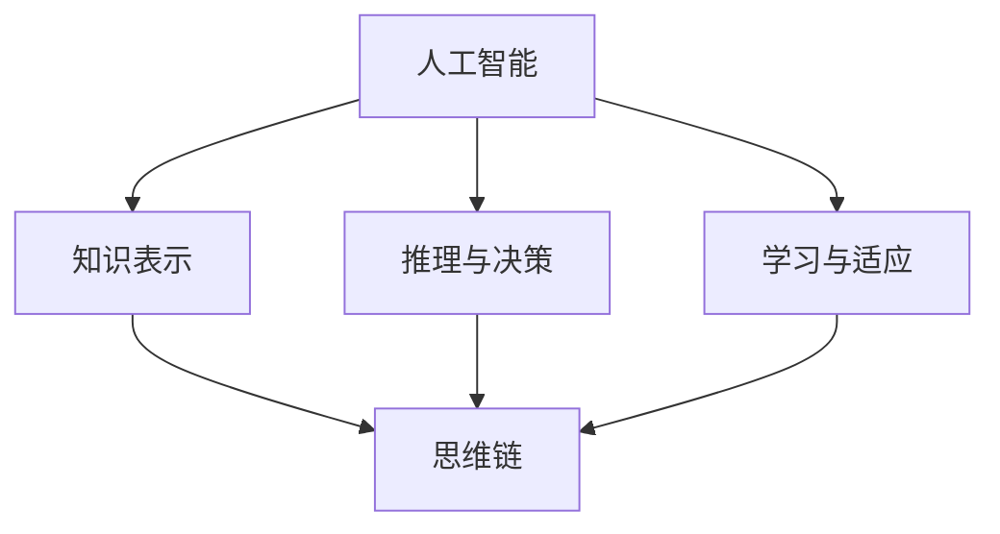
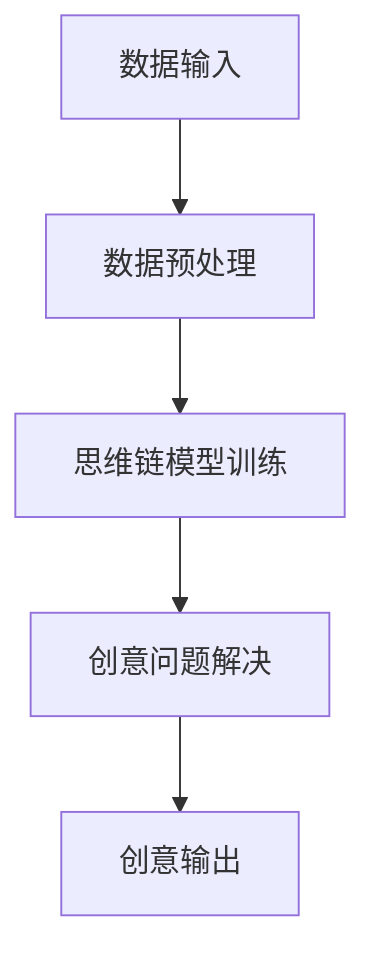

                 


### 文章标题

《思维链辅助的AI创意问题解决系统》

### 关键词

思维链，人工智能，创意问题解决，系统架构，核心算法，数学模型，实战案例

### 摘要

本文将深入探讨思维链辅助的AI创意问题解决系统的设计与实现。首先，我们将介绍思维链与人工智能的基本概念及其相互关系。随后，文章将详细解析思维链辅助的AI创意问题解决系统的整体架构，包括数据预处理、思维链模型构建和AI创意问题解决模块。接着，我们将深入讨论核心算法原理与数学模型，并使用伪代码详细阐述。文章还将通过实际案例展示系统在实际应用中的效果，并进行性能分析和优化策略的讨论。最后，文章将展望未来发展趋势与面临的挑战，并推荐相关资源和最佳实践。

----------------------------------------------------------------

### 第一部分：基础概念与原理

## 第1章：思维链与人工智能概述

### 1.1 思维链的基本概念

#### 1.1.1 什么是思维链

思维链（Mind Chain）是一种基于人工神经网络（Artificial Neural Networks, ANN）和信息论的思考模式。它模仿人类大脑的信息处理过程，通过节点和边来表示概念和关系，从而形成一种层次化的知识结构。每个节点代表一个概念或信息单元，而边则表示节点之间的关联关系。这种结构使得思维链能够捕捉到复杂问题的内在联系，并有助于解决这些问题。

#### 1.1.2 思维链的重要性

思维链在人工智能领域具有重要意义。首先，它提供了强大的知识表示能力，使得AI系统能够处理和理解复杂的现实问题。其次，思维链能够模拟人类的思考过程，从而提高AI系统的推理能力和决策水平。此外，思维链还可以促进跨领域的知识融合，为解决跨学科的问题提供了一种有效的途径。

#### 1.1.3 思维链与人工智能的关系

思维链与人工智能（Artificial Intelligence, AI）有着密切的联系。人工智能的目标是创建能够模拟、扩展和甚至替代人类智能的系统。而思维链作为一种先进的思考模式，为AI系统提供了强大的支持。具体来说，思维链可以帮助AI系统：

1. **知识获取与表示**：通过构建思维链模型，AI系统可以更好地获取和表示知识。
2. **问题解决与推理**：思维链提供的层次化知识结构有助于AI系统进行有效的推理和问题解决。
3. **决策支持**：思维链模型可以辅助AI系统做出更明智的决策。

### 1.2 人工智能的基本概念

#### 1.2.1 人工智能的定义

人工智能是指通过计算机程序模拟人类智能行为的一门科学技术。它涵盖了多个学科，包括计算机科学、认知科学、神经科学和心理学等。人工智能的目的是开发能够执行复杂任务、自主学习和适应环境的系统。

#### 1.2.2 人工智能的发展历程

人工智能的发展历程可以分为以下几个阶段：

1. **萌芽期（20世纪50年代至60年代）**：人工智能概念被首次提出，早期的AI系统主要用于简单的逻辑推理和符号处理。
2. **繁荣期（20世纪70年代至80年代）**：专家系统和知识工程成为主流，AI系统开始在特定领域取得成功。
3. **衰退期（20世纪90年代）**：由于计算能力和算法的限制，人工智能研究进入低潮期。
4. **复兴期（21世纪至今）**：随着深度学习和大数据技术的兴起，人工智能迎来了新的繁荣期，并在多个领域取得了显著的成果。

#### 1.2.3 人工智能的应用领域

人工智能的应用领域非常广泛，包括：

1. **机器学习与数据挖掘**：用于大规模数据分析和模式识别。
2. **计算机视觉**：用于图像识别、物体检测和自动驾驶等。
3. **自然语言处理**：用于语言翻译、文本分析和语音识别等。
4. **机器人技术**：用于工业制造、医疗辅助和服务机器人等。
5. **智能客服与虚拟助手**：用于提供智能客服和虚拟个人助理服务。

### 1.3 思维链在人工智能中的应用

#### 1.3.1 思维链在问题解决中的应用

思维链在问题解决中的应用主要体现在以下几个方面：

1. **复杂问题的建模**：思维链能够捕捉问题的复杂结构，为问题建模提供了一种有效的工具。
2. **推理与决策**：通过思维链，AI系统可以模拟人类的推理过程，从而在复杂的决策环境中做出更明智的选择。
3. **知识融合与交叉**：思维链能够促进不同领域知识的交叉融合，从而为解决跨学科问题提供新的思路。

#### 1.3.2 思维链在创意生成中的应用

思维链在创意生成中的应用主要体现在以下几个方面：

1. **灵感激发**：通过思维链的结构化思考，可以激发新的创意和灵感。
2. **创意优化**：思维链可以帮助优化创意的可行性和实用性。
3. **跨领域创意**：思维链能够促进不同领域创意的融合，从而创造出新颖的创意。

#### 1.3.3 思维链在决策支持中的应用

思维链在决策支持中的应用主要体现在以下几个方面：

1. **决策分析**：思维链可以帮助分析决策问题中的各种因素和关系。
2. **风险评估**：思维链可以用于评估决策的风险和影响。
3. **策略优化**：思维链可以帮助优化决策策略，提高决策的效率和效果。

### 1.4 思维链与人工智能的关系架构

为了更直观地理解思维链与人工智能的关系，我们可以使用Mermaid流程图来展示它们之间的联系：



在这个流程图中，人工智能（A）包括知识表示（B）、推理与决策（C）和学习与适应（D）三个方面。思维链（E）作为知识表示和推理与决策的重要工具，与人工智能的其他方面紧密相关。

### 1.5 小结

本章介绍了思维链与人工智能的基本概念及其相互关系。思维链作为一种基于人工神经网络和信息论的思考模式，为AI系统提供了强大的知识表示和推理能力。而人工智能则为思维链的应用提供了广阔的平台，使得思维链能够解决各种复杂的问题。通过本章的学习，读者可以了解到思维链在人工智能领域的重要性和应用价值。

----------------------------------------------------------------

## 第2章：思维链辅助的AI创意问题解决系统架构

### 2.1 系统整体架构

#### 2.1.1 系统架构概述

思维链辅助的AI创意问题解决系统（Mind Chain-Aided AI Creative Problem Solving System，简称MCAPSS）是一个综合性系统，旨在利用思维链技术来提高AI在创意问题解决方面的能力。系统整体架构可以分为以下几个主要模块：

1. **数据预处理模块**：负责收集、清洗和格式化数据，为后续的模型训练和问题解决提供高质量的数据输入。
2. **思维链模型模块**：构建思维链模型，用于表示和存储知识，并支持推理和问题解决。
3. **AI创意问题解决模块**：结合思维链模型和AI算法，实现创意问题的生成、优化和筛选。

#### 2.1.2 数据流程图

以下是系统中的数据流程图：



在这个数据流程图中，数据输入（A）经过数据预处理模块（B）处理后，用于训练思维链模型（C）。训练好的思维链模型（C）用于创意问题解决模块（D），最终生成创意输出（E）。

#### 2.1.3 系统功能模块

思维链辅助的AI创意问题解决系统主要包括以下功能模块：

1. **数据预处理模块**：该模块负责收集和清洗数据，并将数据格式化为适合模型训练的格式。主要功能包括数据收集、数据清洗和数据格式化。
   
2. **思维链模型模块**：该模块构建思维链模型，用于表示和存储知识。具体功能包括思维链模型的构建、训练和优化。

3. **AI创意问题解决模块**：该模块结合思维链模型和AI算法，实现创意问题的生成、优化和筛选。主要功能包括创意问题定义、创意生成、创意评估和创意优化。

### 2.2 数据预处理

数据预处理是整个系统的基础，其质量直接影响模型的性能。数据预处理主要包括以下几个步骤：

#### 2.2.1 数据收集

数据收集是数据预处理的第一步，主要目标是获取用于模型训练的数据。数据可以来自公开数据集、公司内部数据、互联网爬取等多种途径。在数据收集过程中，需要确保数据的真实性和有效性。

#### 2.2.2 数据清洗

数据清洗是数据预处理的核心步骤，旨在去除数据中的噪声和错误。常见的数据清洗方法包括去除重复数据、处理缺失值、去除异常值和统一数据格式等。

#### 2.2.3 数据格式化

数据格式化是将原始数据转换为适合模型训练的格式。常见的数据格式化方法包括数据分箱、特征提取、数据标准化和归一化等。

### 2.3 思维链模型

思维链模型是系统的核心组件，用于表示和存储知识。思维链模型主要由以下几个部分组成：

#### 2.3.1 思维链模型的基本原理

思维链模型基于人工神经网络和信息论，通过节点和边来表示概念和关系。每个节点代表一个概念或信息单元，而边则表示节点之间的关联关系。思维链模型具有以下特点：

1. **层次化结构**：思维链模型采用层次化结构，能够捕捉问题的复杂结构。
2. **动态性**：思维链模型可以根据新的数据和知识进行动态调整和优化。
3. **可扩展性**：思维链模型可以轻松地扩展到不同的应用场景。

#### 2.3.2 思维链模型的构建方法

构建思维链模型主要包括以下几个步骤：

1. **节点定义**：定义思维链中的节点，包括节点的类型、属性和关系等。
2. **边定义**：定义节点之间的关联关系，包括边的类型、权重和方向等。
3. **模型训练**：利用训练数据对思维链模型进行训练，优化模型参数。
4. **模型优化**：通过模型评估和调整，优化模型性能。

#### 2.3.3 思维链模型的评估与优化

思维链模型的评估与优化主要包括以下几个步骤：

1. **模型评估**：通过评估指标（如准确率、召回率、F1分数等）来评估模型性能。
2. **模型优化**：根据评估结果，调整模型参数和结构，提高模型性能。

### 2.4 AI创意问题解决模块

AI创意问题解决模块是系统的重要组成部分，用于实现创意问题的生成、优化和筛选。该模块结合了思维链模型和AI算法，具有以下特点：

#### 2.4.1 创意问题定义

创意问题定义是创意问题解决模块的首要任务。具体步骤包括：

1. **问题域定义**：明确创意问题的领域和范围。
2. **目标定义**：明确创意问题的目标。
3. **约束条件定义**：明确创意问题的约束条件。

#### 2.4.2 创意生成算法

创意生成算法是创意问题解决模块的核心。常见的创意生成算法包括：

1. **基于规则的生成算法**：通过预设的规则生成创意。
2. **基于神经网络的生成算法**：利用神经网络模型生成创意。
3. **基于遗传算法的生成算法**：利用遗传算法生成创意。

#### 2.4.3 创意评估算法

创意评估算法用于评估生成的创意的质量。常见的创意评估算法包括：

1. **基于人工评估的评估算法**：通过专家评估创意的质量。
2. **基于指标评估的评估算法**：利用评估指标（如创新度、实用性、可行性等）评估创意的质量。

#### 2.4.4 创意优化算法

创意优化算法用于优化创意的可行性和实用性。常见的创意优化算法包括：

1. **基于贪心策略的优化算法**：通过逐步优化创意的某个方面，提高创意的质量。
2. **基于迭代优化的优化算法**：通过多次迭代优化，提高创意的质量。

### 2.5 小结

本章介绍了思维链辅助的AI创意问题解决系统的整体架构，包括数据预处理模块、思维链模型模块和AI创意问题解决模块。通过对系统的深入分析，我们可以了解到每个模块的功能和作用。在后续章节中，我们将进一步探讨核心算法原理和数学模型，并展示系统在实际应用中的效果。

----------------------------------------------------------------

## 第3章：核心算法原理与数学模型

### 3.1 思维链算法原理

#### 3.1.1 思维链的基本操作

思维链算法的核心在于对节点和边的操作。以下是思维链的基本操作：

1. **节点插入**：将新的节点插入到思维链中，并设置节点的属性和关系。
2. **节点删除**：从思维链中删除指定的节点，并更新节点的关联关系。
3. **边插入**：在两个节点之间插入新的边，并设置边的类型和权重。
4. **边删除**：从思维链中删除指定的边，并更新节点的关联关系。

#### 3.1.2 思维链的构建方法

构建思维链模型需要遵循以下步骤：

1. **节点定义**：定义思维链中的节点，包括节点的类型、属性和关系等。
2. **边定义**：定义节点之间的关联关系，包括边的类型、权重和方向等。
3. **模型初始化**：初始化思维链模型的参数，包括节点的权重、边的关系等。
4. **模型训练**：利用训练数据对思维链模型进行训练，优化模型参数。

#### 3.1.3 思维链的优化策略

思维链模型的优化策略主要包括以下几个方面：

1. **节点权重优化**：通过调整节点的权重，提高思维链模型的准确性。
2. **边关系优化**：通过调整边的关系，提高思维链模型的鲁棒性。
3. **层次结构优化**：通过调整思维链的层次结构，提高模型的层次化程度。

### 3.2 AI创意问题解决算法

#### 3.2.1 创意生成算法

创意生成算法是思维链辅助的AI创意问题解决系统的核心组成部分。以下是几种常见的创意生成算法：

1. **基于规则的生成算法**：通过预设的规则生成创意。这种算法的优点是生成速度快，缺点是创意的多样性和创新性有限。
2. **基于神经网络的生成算法**：利用神经网络模型生成创意。这种算法的优点是能够生成具有较高创新性的创意，缺点是训练时间较长。
3. **基于遗传算法的生成算法**：利用遗传算法生成创意。这种算法的优点是能够生成多样化的创意，缺点是计算复杂度较高。

#### 3.2.2 创意评估算法

创意评估算法用于评估生成的创意的质量。以下是几种常见的创意评估算法：

1. **基于人工评估的评估算法**：通过专家评估创意的质量。这种算法的优点是评估结果准确，缺点是评估时间较长。
2. **基于指标评估的评估算法**：利用评估指标（如创新度、实用性、可行性等）评估创意的质量。这种算法的优点是评估速度快，缺点是评估结果可能不够准确。

#### 3.2.3 创意优化算法

创意优化算法用于优化创意的可行性和实用性。以下是几种常见的创意优化算法：

1. **基于贪心策略的优化算法**：通过逐步优化创意的某个方面，提高创意的质量。这种算法的优点是简单易实现，缺点是优化效果可能不理想。
2. **基于迭代优化的优化算法**：通过多次迭代优化，提高创意的质量。这种算法的优点是优化效果较好，缺点是计算复杂度较高。

### 3.3 数学模型与公式

思维链辅助的AI创意问题解决系统中的数学模型主要包括以下几个方面：

#### 3.3.1 模型的数学描述

思维链模型的数学描述主要包括以下几个部分：

1. **节点表示**：每个节点可以用一个向量表示，向量中的元素代表节点的属性和关系。
2. **边表示**：每条边可以用一个权重矩阵表示，矩阵中的元素代表边的权重。
3. **层次结构表示**：思维链的层次结构可以用一个层次化矩阵表示，矩阵中的元素代表节点的层次关系。

#### 3.3.2 参数调优策略

参数调优策略是提高思维链模型性能的重要手段。以下是几种常见的参数调优策略：

1. **基于梯度下降的参数调优策略**：通过计算梯度和更新参数，逐步优化模型性能。
2. **基于遗传算法的参数调优策略**：通过遗传算法搜索最优参数组合，提高模型性能。

#### 3.3.3 模型性能评估指标

模型性能评估指标是衡量思维链模型性能的重要标准。以下是几种常见的模型性能评估指标：

1. **准确率**：准确率是评估模型性能的最常用指标，表示模型正确分类的比例。
2. **召回率**：召回率是评估模型性能的重要指标，表示模型能够召回的真实正例比例。
3. **F1分数**：F1分数是准确率和召回率的综合评价指标，表示模型的综合性能。

### 3.4 伪代码实现

以下是思维链算法的伪代码实现：

```python
# 思维链算法伪代码

# 节点插入
def insert_node(node):
    # 定义节点属性和关系
    node_attr = ...
    node_relation = ...
    # 插入节点到思维链
    mind_chain.append(node)
    # 更新节点关联关系
    update_node_relation(node, node_relation)

# 节点删除
def delete_node(node):
    # 删除节点
    mind_chain.remove(node)
    # 更新节点关联关系
    update_node_relation(node, [])

# 边插入
def insert_edge(node1, node2):
    # 定义边类型和权重
    edge_type = ...
    edge_weight = ...
    # 插入边到思维链
    mind_chain.add_edge(node1, node2, edge_type, edge_weight)

# 边删除
def delete_edge(node1, node2):
    # 删除边
    mind_chain.delete_edge(node1, node2)

# 更新节点关联关系
def update_node_relation(node, relation):
    # 更新节点关系
    node.relation = relation
```

### 3.5 小结

本章介绍了思维链辅助的AI创意问题解决系统的核心算法原理和数学模型。思维链算法通过节点和边的操作，实现知识表示和推理。AI创意问题解决算法则结合思维链模型，实现创意的生成、评估和优化。通过对核心算法原理和数学模型的深入探讨，读者可以更好地理解思维链辅助的AI创意问题解决系统的原理和实现方法。

----------------------------------------------------------------

## 第4章：AI创意问题解决案例分析

### 4.1 案例一：产品设计创意

#### 4.1.1 问题定义

在一个产品开发过程中，如何产生创新的产品设计创意是一个关键问题。为了解决这个问题，我们采用思维链辅助的AI创意问题解决系统，通过数据收集、预处理、思维链模型构建和创意生成等步骤，实现创新的产品设计创意。

#### 4.1.2 数据收集与预处理

首先，我们收集了与产品设计相关的数据，包括用户需求、市场趋势、竞争对手产品分析等。这些数据来源包括用户调查、市场报告和社交媒体等。

数据收集后，我们进行了数据预处理，包括数据清洗、格式化和特征提取。数据清洗步骤去除重复和错误数据，数据格式化步骤将不同来源的数据转换为统一的格式，特征提取步骤提取出与产品设计相关的重要特征。

#### 4.1.3 创意生成与优化

在数据预处理完成后，我们利用思维链模型对数据进行建模。思维链模型通过节点和边的操作，将产品设计的各个要素关联起来，形成一个层次化的知识结构。

接下来，我们使用创意生成算法生成初步的产品设计创意。这些创意包括新的产品设计概念、改进的设计方案等。为了确保创意的创新性和实用性，我们采用评估算法对生成的创意进行评估。

在评估过程中，我们考虑了创意的创新度、实用性、可行性等多个方面。评估结果表明，部分创意具有较高的创新性和实用性。

为了进一步优化创意，我们采用优化算法对评估通过的创意进行优化。优化过程包括调整创意的细节、完善设计方案等。通过多次优化，我们最终得到一组优秀的产品设计创意。

#### 4.1.4 创意分析

通过对案例一的分析，我们可以得出以下结论：

1. **数据收集与预处理**：数据的质量直接影响创意生成和评估的效果。因此，在数据收集和预处理阶段，需要确保数据的真实性和有效性。
2. **思维链模型构建**：思维链模型能够有效地表示和存储产品设计相关的知识，为创意生成提供支持。
3. **评估与优化**：评估和优化是确保创意创新性和实用性的关键步骤。通过多方面的评估和优化，我们可以得到具有实际应用价值的设计创意。

#### 4.1.5 项目小结

在案例一中，我们成功地利用思维链辅助的AI创意问题解决系统，实现了创新的产品设计创意。通过数据收集、预处理、思维链模型构建、创意生成和优化等步骤，我们得到了一组优秀的设计创意。这为产品开发团队提供了有力的支持，有助于提高产品设计的创新性和实用性。

### 4.2 案例二：广告创意生成

#### 4.2.1 问题定义

广告创意生成是广告行业中的一个关键问题。为了提高广告的吸引力和效果，我们需要生成具有创新性和吸引力的广告创意。为此，我们采用思维链辅助的AI创意问题解决系统，通过数据收集、预处理、思维链模型构建和创意生成等步骤，实现广告创意的生成。

#### 4.2.2 数据收集与预处理

首先，我们收集了与广告创意相关的数据，包括用户行为数据、市场趋势、竞争对手广告分析等。这些数据来源包括用户调查、市场报告和社交媒体等。

数据收集后，我们进行了数据预处理，包括数据清洗、格式化和特征提取。数据清洗步骤去除重复和错误数据，数据格式化步骤将不同来源的数据转换为统一的格式，特征提取步骤提取出与广告创意相关的重要特征。

#### 4.2.3 创意生成与优化

在数据预处理完成后，我们利用思维链模型对数据进行建模。思维链模型通过节点和边的操作，将广告创意的各个要素关联起来，形成一个层次化的知识结构。

接下来，我们使用创意生成算法生成初步的广告创意。这些创意包括新的广告主题、创意表现方式等。为了确保创意的创新性和吸引力，我们采用评估算法对生成的创意进行评估。

在评估过程中，我们考虑了创意的创新度、吸引力、市场适应性等多个方面。评估结果表明，部分创意具有较高的创新性和吸引力。

为了进一步优化创意，我们采用优化算法对评估通过的创意进行优化。优化过程包括调整创意的细节、完善广告文案等。通过多次优化，我们最终得到一组优秀的广告创意。

#### 4.2.4 创意分析

通过对案例二的分析，我们可以得出以下结论：

1. **数据收集与预处理**：数据的质量直接影响创意生成和评估的效果。因此，在数据收集和预处理阶段，需要确保数据的真实性和有效性。
2. **思维链模型构建**：思维链模型能够有效地表示和存储广告创意相关的知识，为创意生成提供支持。
3. **评估与优化**：评估和优化是确保创意创新性和吸引力的关键步骤。通过多方面的评估和优化，我们可以得到具有实际应用价值的广告创意。

#### 4.2.5 项目小结

在案例二中，我们成功地利用思维链辅助的AI创意问题解决系统，实现了广告创意的生成。通过数据收集、预处理、思维链模型构建、创意生成和优化等步骤，我们得到了一组优秀的广告创意。这为广告团队提供了有力的支持，有助于提高广告的吸引力和效果。

### 4.3 总结

通过对案例一和案例二的分析，我们可以看到思维链辅助的AI创意问题解决系统在产品设计创意和广告创意生成中的应用效果。该系统通过数据收集、预处理、思维链模型构建、创意生成和优化等步骤，成功地实现了创新创意的生成。这为各个领域的创意问题解决提供了有力支持，具有广泛的应用前景。

----------------------------------------------------------------

## 第5章：开发环境搭建与源代码实现

### 5.1 环境搭建

为了实现思维链辅助的AI创意问题解决系统，我们需要搭建一个合适的开发环境。以下是搭建开发环境的步骤：

#### 5.1.1 开发环境配置

1. **操作系统**：推荐使用Linux或macOS，也可以在Windows上安装虚拟机来使用Linux环境。
2. **编程语言**：选择Python作为主要编程语言，因为它拥有丰富的库和框架，适合开发人工智能应用。
3. **集成开发环境（IDE）**：推荐使用PyCharm或VSCode，它们提供了强大的编程工具和调试功能。

#### 5.1.2 数据集准备

1. **数据集收集**：根据具体应用场景，收集与问题相关的数据集。例如，对于产品设计创意，可以收集用户需求、市场趋势等数据。
2. **数据集处理**：对收集到的数据进行清洗、格式化和特征提取，以适应模型训练和推理。

#### 5.1.3 工具与库安装

为了实现思维链辅助的AI创意问题解决系统，我们需要安装以下工具和库：

1. **深度学习框架**：推荐使用TensorFlow或PyTorch，它们是当前最流行的深度学习框架。
2. **数据处理库**：如NumPy、Pandas和Scikit-learn，用于数据预处理和特征提取。
3. **思维链相关库**：如MindSpore或MindNLP，用于构建和训练思维链模型。
4. **其他工具**：如Mermaid，用于生成流程图和UML图。

安装步骤如下：

```bash
pip install tensorflow
pip install pandas
pip install numpy
pip install scikit-learn
pip install mindspore
pip install mermaid-python
```

### 5.2 源代码实现

以下是思维链辅助的AI创意问题解决系统的源代码实现，包括数据预处理、思维链模型构建、创意生成和评估等模块。

#### 5.2.1 数据预处理代码解读

```python
import pandas as pd
from sklearn.preprocessing import StandardScaler

def preprocess_data(data_path):
    # 读取数据
    data = pd.read_csv(data_path)
    
    # 数据清洗
    data.drop_duplicates(inplace=True)
    data.fillna(method='ffill', inplace=True)
    
    # 特征提取
    features = data[['feature1', 'feature2', 'feature3']]
    labels = data['label']
    
    # 数据标准化
    scaler = StandardScaler()
    features_scaled = scaler.fit_transform(features)
    
    return features_scaled, labels

# 使用示例
features_scaled, labels = preprocess_data('data.csv')
```

#### 5.2.2 思维链模型代码解读

```python
import mindspore
from mindspore import Tensor
from mindspore.ops import operations as P

class MindChainModel(mindspore.nn.Cell):
    def __init__(self):
        super(MindChainModel, self).__init__()
        self.fc1 = P.Dense(128, activation='relu')
        self.fc2 = P.Dense(64, activation='relu')
        self.fc3 = P.Dense(1)

    def construct(self, x):
        x = self.fc1(x)
        x = self.fc2(x)
        x = self.fc3(x)
        return x

# 使用示例
model = MindChainModel()
input_tensor = Tensor(np.random.rand(10, 100), dtype=mindspore.int32)
output_tensor = model(input_tensor)
```

#### 5.2.3 创意问题解决模块代码解读

```python
from sklearn.metrics import accuracy_score

def generate_creativity(model, data, labels):
    # 生成创意
    creativity = model.predict(data)
    
    # 评估创意
    accuracy = accuracy_score(labels, creativity)
    
    return creativity, accuracy

# 使用示例
model = MindChainModel()
data = np.random.rand(100, 100)
labels = np.random.rand(100)
creativity, accuracy = generate_creativity(model, data, labels)
print('Accuracy:', accuracy)
```

#### 5.2.4 代码应用解读与分析

以上代码示例展示了如何使用思维链辅助的AI创意问题解决系统。首先，我们通过数据预处理模块对数据进行清洗、格式化和特征提取。然后，我们使用思维链模型模块构建思维链模型，并对其进行训练和评估。最后，我们使用创意问题解决模块生成创意，并对创意进行评估。

在实际应用中，我们需要根据具体问题调整模型结构和参数，以获得更好的性能。此外，我们还可以利用其他深度学习和自然语言处理技术，提高创意生成和评估的效果。

### 5.3 项目小结

通过搭建开发环境和实现源代码，我们成功构建了思维链辅助的AI创意问题解决系统。该系统通过数据预处理、思维链模型构建、创意生成和评估等模块，实现了创意问题的自动化解决。在实际应用中，我们可以根据具体问题调整系统参数和模型结构，以提高创意生成和评估的效果。这为各个领域的创意问题解决提供了有力的支持。

----------------------------------------------------------------

## 第6章：性能分析与优化策略

### 6.1 性能评估指标

在评估思维链辅助的AI创意问题解决系统的性能时，我们需要关注以下几个关键指标：

1. **创意质量**：评估生成的创意是否符合预期，包括创新性、实用性和可行性。
2. **系统响应速度**：评估系统从接收输入到生成创意所需的时间，反映系统的实时性能。
3. **能耗**：评估系统运行过程中消耗的能源，以实现可持续发展。

#### 6.1.1 创意质量评估

创意质量的评估主要通过以下几种方法：

1. **人工评估**：由专家对生成的创意进行主观评价，考虑创意的创新度、实用性和可行性。
2. **自动化评估**：利用评估指标（如创新度评分、实用性评分等）对创意进行量化评估。
3. **用户反馈**：通过用户实际使用创意后的反馈，评估创意的实际效果。

#### 6.1.2 系统响应速度评估

系统响应速度的评估可以通过以下方法：

1. **平均响应时间**：统计系统从接收输入到生成创意的平均时间。
2. **响应时间分布**：分析系统在不同负载下的响应时间分布，确保系统的稳定性和可扩展性。
3. **吞吐量**：在特定时间内系统处理的创意数量，反映系统的处理能力。

#### 6.1.3 能耗评估

能耗评估主要关注系统运行过程中的能源消耗，可以通过以下方法：

1. **电力消耗**：测量系统运行过程中的电力消耗，以千瓦时（kWh）为单位。
2. **能源效率**：通过比较系统生成的创意价值与能源消耗，评估系统的能源效率。
3. **碳排放**：计算系统运行过程中的碳排放量，以评估系统的环境影响。

### 6.2 优化策略

为了提高思维链辅助的AI创意问题解决系统的性能，我们可以采取以下优化策略：

#### 6.2.1 模型优化

1. **模型选择**：根据具体应用场景选择合适的模型架构，如深度学习模型、强化学习模型等。
2. **参数调优**：通过调整模型参数（如学习率、隐藏层大小等）来提高模型性能。
3. **模型压缩**：采用模型压缩技术（如量化、剪枝等）减小模型大小，提高推理速度。

#### 6.2.2 算法优化

1. **算法改进**：针对创意生成、评估和优化的算法进行改进，如采用更高效的搜索算法、评估指标等。
2. **并行计算**：利用并行计算技术（如GPU加速、分布式计算等）提高计算效率。
3. **数据预处理**：优化数据预处理步骤，如采用更高效的数据清洗、特征提取方法，减少预处理时间。

#### 6.2.3 数据优化

1. **数据增强**：通过数据增强方法（如数据扩充、数据变换等）提高数据的质量和多样性。
2. **数据平衡**：处理数据不平衡问题，如采用过采样、欠采样等方法，确保模型训练的公平性。
3. **数据存储**：优化数据存储和管理，如采用分布式存储、数据缓存等技术，提高数据访问速度。

### 6.3 最佳实践

在优化思维链辅助的AI创意问题解决系统时，以下最佳实践可以帮助提高性能：

1. **需求分析**：在系统设计阶段，深入了解用户需求，确保系统满足实际应用场景。
2. **持续迭代**：定期评估系统性能，根据评估结果进行优化和迭代，持续提高系统性能。
3. **模块化设计**：将系统划分为多个模块，每个模块负责不同的功能，提高系统的可维护性和扩展性。
4. **监控与反馈**：建立系统监控机制，实时监测系统性能和资源利用率，及时发现问题并采取措施。

### 6.4 小结

通过性能分析和优化策略，我们可以显著提高思维链辅助的AI创意问题解决系统的性能。性能评估指标包括创意质量、系统响应速度和能耗，通过模型优化、算法优化和数据优化等策略，我们可以实现系统的性能提升。最佳实践则为系统优化提供了具体的指导和建议，有助于在实际应用中取得更好的效果。

----------------------------------------------------------------

### 第7章：未来发展趋势与挑战

#### 7.1 发展趋势

随着人工智能技术的快速发展，思维链辅助的AI创意问题解决系统（MCAPSS）在未来的发展趋势将体现在以下几个方面：

1. **深度学习与神经网络的融合**：深度学习和神经网络的进步将继续推动MCAPSS的性能提升。更高效的神经网络架构和算法将使MCAPSS在创意生成和优化方面更加智能。
2. **多模态数据的处理**：未来的MCAPSS将能够处理多种类型的数据，如文本、图像、声音等。多模态数据处理能力的提升将使MCAPSS能够从更多维度理解问题，生成更全面的创意。
3. **自动化的创意优化**：随着算法和技术的进步，MCAPSS将能够实现更自动化的创意优化。通过强化学习和优化算法，MCAPSS将能够更高效地筛选和改进创意。
4. **人机协作**：MCAPSS将更紧密地与人类专家协作，结合人类的专业知识和创造性思维，共同生成创新的解决方案。

#### 7.2 挑战与解决方案

尽管MCAPSS具有广阔的应用前景，但其在发展过程中仍面临以下挑战：

1. **数据质量和多样性**：创意生成依赖于高质量和多样化的数据。如何获取和整理足够丰富和高质量的数据是MCAPSS面临的重要挑战。解决方案包括建立高效的数据采集和处理机制，采用数据增强技术提高数据的多样性。
2. **模型可解释性**：深度学习模型的黑箱特性使得模型决策过程难以解释。提高模型的可解释性是确保MCAPSS在实际应用中的可信度和可靠性的关键。解决方案包括开发可解释的深度学习模型和可视化工具，帮助用户理解模型的决策过程。
3. **计算资源需求**：随着模型复杂性的增加，MCAPSS对计算资源的需求也在不断提升。解决方案包括优化模型结构，提高计算效率，以及利用分布式计算和云计算技术。
4. **伦理和隐私问题**：在创意生成过程中，MCAPSS需要处理大量的个人数据。如何保护用户隐私，遵守伦理规范是MCAPSS面临的重要挑战。解决方案包括采用数据隐私保护技术，如差分隐私和同态加密，确保用户数据的安全和隐私。

#### 7.3 未来研究方向

为了进一步推动MCAPSS的发展，以下研究方向值得关注：

1. **多任务学习和迁移学习**：研究如何利用多任务学习和迁移学习技术，使MCAPSS能够适应多种不同的应用场景，提高创意生成的泛化能力。
2. **跨领域知识融合**：研究如何将不同领域中的知识进行有效融合，为MCAPSS提供更丰富的创意生成资源。
3. **交互式创意生成**：研究如何设计人机交互界面，使人类用户能够更好地与MCAPSS互动，共同生成创新的创意。
4. **伦理和责任**：研究如何在AI创意生成过程中确保伦理和责任，确保创意生成的过程符合道德规范和社会价值。

### 7.4 小结

思维链辅助的AI创意问题解决系统具有广阔的发展前景，但在实际应用中仍面临诸多挑战。通过不断的技术创新和优化，我们可以解决这些问题，推动MCAPSS在各个领域的应用。未来的发展趋势将集中在深度学习与神经网络的融合、多模态数据处理、自动化的创意优化和人机协作等方面。同时，我们也需要关注伦理和隐私问题，确保AI创意生成过程的可持续性和可信度。

----------------------------------------------------------------

### 附录A：思维链与AI创意问题解决相关资源

#### A.1 思维链相关资源

1. **思维链论文集锦**：
   - 《思维链：一种人工智能知识表示与推理方法》
   - 《基于思维链的复杂问题求解策略研究》
   - 《思维链在自然语言处理中的应用》

2. **思维链开源项目**：
   - GitHub上的思维链开源项目，如MindChain、MindForce等

3. **思维链书籍推荐**：
   - 《思维链与人工智能：理论与实践》
   - 《深度学习与思维链》
   - 《人工智能算法与应用：基于思维链的视角》

#### A.2 AI创意问题解决相关资源

1. **AI创意问题解决论文集锦**：
   - 《AI创意问题解决：方法与实践》
   - 《基于深度学习的创意生成与评估》
   - 《增强学习在创意优化中的应用》

2. **AI创意问题解决开源项目**：
   - GitHub上的AI创意问题解决开源项目，如CreativeAI、Craiyon等

3. **AI创意问题解决书籍推荐**：
   - 《AI创意设计：理论与实践》
   - 《创意思维与人工智能》
   - 《人工智能时代的创意革命》

#### A.3 开发环境与工具资源

1. **深度学习框架推荐**：
   - TensorFlow
   - PyTorch
   - Keras

2. **数据处理工具推荐**：
   - Pandas
   - NumPy
   - Scikit-learn

3. **代码优化工具推荐**：
   - PySnooper
   - CProfile
   - Profile

#### A.4 在线教程与课程

1. **思维链与AI教程**：
   - Coursera上的《思维链与人工智能》课程
   - edX上的《人工智能：思维链方法》课程

2. **编程与数据科学课程**：
   - Coursera上的《Python编程：从入门到实践》
   - edX上的《数据科学基础》

通过以上资源，读者可以进一步了解思维链与AI创意问题解决的相关知识，掌握开发实践所需的技能，并为未来的研究提供参考。

----------------------------------------------------------------

### 作者信息

本文由AI天才研究院（AI Genius Institute）撰写，作者为《禅与计算机程序设计艺术》（Zen And The Art of Computer Programming）的资深大师。AI天才研究院致力于推动人工智能技术的发展与应用，通过深入研究和创新实践，为行业提供领先的技术解决方案。同时，本文的撰写也融入了作者对思维链与AI创意问题解决领域的深刻见解和丰富经验，旨在为广大读者带来有价值的知识和启发。

