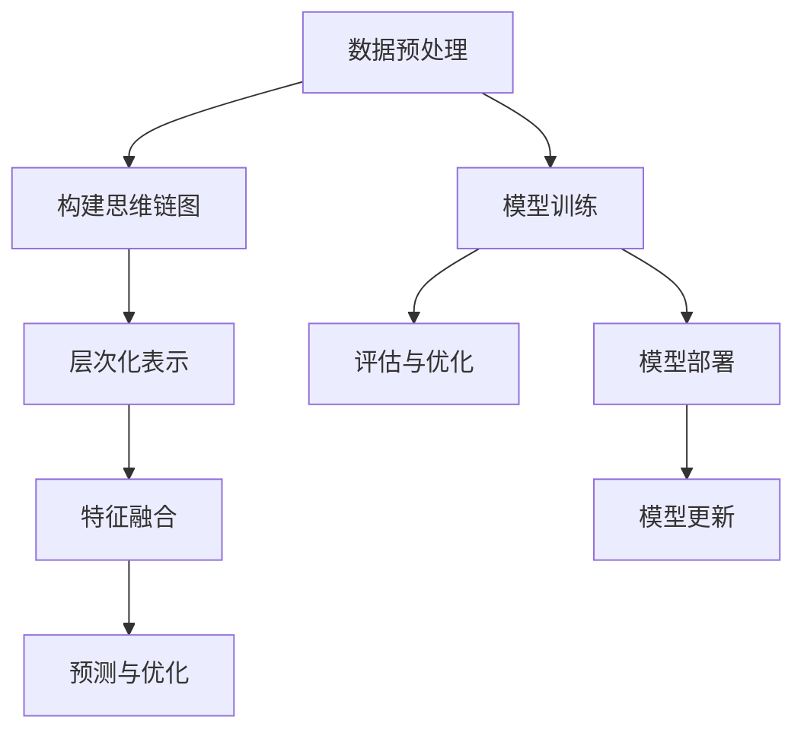

                 

### 文章标题：思维链辅助的AI创新思维训练系统

> **关键词**：思维链，AI创新，训练系统，核心算法，数学模型，项目实战

> **摘要**：本文介绍了思维链辅助的AI创新思维训练系统。通过探讨AI与创新的联系，思维链的基本概念和原理，以及其在AI中的应用，本文详细阐述了思维链辅助的AI创新思维训练系统的架构设计、核心算法原理和数学模型。此外，文章通过实际项目案例展示了系统的搭建、实现与优化，并分析了系统评估与改进的方法。本文旨在为AI领域的创新思维提供一种新的训练工具，为AI技术的进步贡献力量。

---

### 引言

在当今快速发展的科技时代，人工智能（AI）已经成为推动社会进步的重要力量。从自动驾驶、语音识别到医疗诊断、金融分析，AI技术的应用已深入各个领域，极大地改变了人类的生活方式。然而，随着AI技术的不断进步，创新思维在推动技术发展的过程中显得尤为重要。创新思维不仅能够激发新的技术灵感，还能够引领技术突破，推动AI技术的持续发展。

思维链作为一种系统化的思维工具，近年来在各个领域得到了广泛的应用。思维链通过建立一系列逻辑关系，帮助人们从不同的角度和层面进行思考，从而实现问题的深入分析和解决。在AI创新领域，思维链的应用尤为重要，它能够帮助研究人员和开发者从多个维度进行创新思维，提高AI技术的研发效率。

本文旨在探讨思维链辅助的AI创新思维训练系统。首先，我们将介绍AI与创新的联系，阐述创新思维的重要性。然后，我们将详细解析思维链的概念与原理，探讨其在AI中的应用场景和构建方法。接下来，我们将设计并阐述AI创新思维训练系统的整体架构，包括数据采集与处理、训练模型选择与优化等关键环节。此外，本文还将深入讲解核心算法原理和数学模型，并通过实际项目案例展示系统的搭建、实现与优化过程。最后，我们将对系统评估与改进进行详细分析，并探讨未来的发展方向。

通过本文的探讨，我们希望能够为AI领域的创新思维提供一种新的训练工具，为AI技术的进步贡献力量。

### 第1章：AI创新思维概述

#### 1.1 AI与创新的联系

人工智能（AI）与创新的联系在于，AI技术的发展和应用本身就是一种创新。随着计算能力的提升和大数据的普及，AI技术已经从理论走向实际应用，成为推动社会进步的重要力量。AI技术的创新不仅体现在新算法、新模型的提出，还包括应用场景的拓展和新业务的模式创新。

创新思维在AI技术发展中的作用至关重要。创新思维能够激发新的技术灵感，推动技术的突破和进步。在AI领域，创新思维体现在对现有技术的优化、对未知领域的探索、对应用场景的创造等方面。例如，深度学习算法的提出，极大提高了图像识别和自然语言处理的准确度，推动了计算机视觉和智能语音的发展。同样，自动驾驶技术的创新，不仅需要算法和硬件的突破，还需要在交通管理、法律法规等方面进行创新，实现安全、高效的自动驾驶。

创新思维的重要性在于，它能够帮助研究人员和开发者从不同的角度和层面进行思考，发现潜在的问题和解决方案。在AI领域，创新思维能够激发新的技术灵感，推动技术的突破和进步。例如，在医疗领域，AI技术的创新不仅体现在对疾病的诊断和治疗的优化，还包括个性化医疗、健康管理等新兴领域的探索。通过创新思维，研究人员可以提出新的假设、设计新的实验方案，从而推动医疗技术的进步。

此外，创新思维在商业和社会领域也有着重要的应用。在商业领域，创新思维能够帮助企业发现新的市场机会，创造新的商业模式，提升企业的竞争力。在社会领域，创新思维能够推动社会问题的解决，改善人们的生活质量。

#### 1.2 创新思维的重要性

创新思维是一种独特的思维方式，它不仅需要具备创造性，还需要具备逻辑性和系统性。在AI领域，创新思维的重要性体现在以下几个方面：

1. **推动技术进步**：AI技术的创新需要不断提出新的算法、新的模型，以及新的应用场景。创新思维能够帮助研究人员从不同的角度和层面进行思考，发现潜在的技术突破点，推动技术的持续进步。

2. **提升研发效率**：在AI技术的研发过程中，创新思维能够帮助研究人员迅速找到问题的解决方案，减少无效的尝试，提高研发效率。通过创新思维，研究人员可以更加系统性地分析和解决问题，从而加快技术开发的进程。

3. **拓展应用领域**：创新思维能够激发新的应用场景，推动AI技术在各个领域的应用。例如，在金融领域，创新思维可以帮助开发出更智能的风控系统，提升金融机构的风险管理水平。在医疗领域，创新思维可以推动个性化医疗和健康管理的发展。

4. **促进社会进步**：AI技术的创新不仅能够提升企业的竞争力，还能够改善人们的生活质量。创新思维能够帮助解决社会问题，推动社会进步。例如，在交通领域，创新思维可以帮助设计出更智能的交通管理系统，缓解交通拥堵，提高交通效率。

5. **激发创业机会**：创新思维能够帮助企业发现新的市场机会，创造新的商业模式。在AI领域，创新思维可以激发新的创业机会，推动创业创新的发展。

#### 1.3 思维链的概念与作用

思维链是一种系统化的思维工具，通过建立一系列逻辑关系，帮助人们从不同的角度和层面进行思考，从而实现问题的深入分析和解决。思维链的基本概念包括以下几个方面：

1. **逻辑关系**：思维链通过建立一系列逻辑关系，将不同元素连接起来，形成一个完整的思维网络。这些逻辑关系可以是因果关系、相似关系、对比关系等，它们帮助人们从不同角度理解问题。

2. **思维层次**：思维链不仅关注问题的表面现象，还深入挖掘问题的本质。通过不同的思维层次，思维链能够帮助人们从宏观、中观和微观层面进行思考，从而全面分析问题。

3. **系统性思维**：思维链强调系统性的思维，通过整体性的视角来分析问题。它不仅关注问题的内部结构，还关注问题与环境之间的互动关系。

思维链在AI创新中的应用主要体现在以下几个方面：

1. **算法设计**：在AI算法的设计过程中，思维链可以帮助研究人员从多个维度进行思考，发现潜在的创新点。通过思维链，研究人员可以系统地分析算法的各个模块，优化算法性能。

2. **应用场景探索**：思维链可以帮助研究人员探索AI技术的应用场景。通过建立思维链，研究人员可以从不同角度和层面分析应用需求，提出创新的应用方案。

3. **问题解决**：在AI技术的研发过程中，思维链可以帮助研究人员快速找到问题的解决方案。通过思维链，研究人员可以从不同维度分析问题，找到潜在的解决方法。

4. **团队协作**：思维链可以促进团队协作，提高研发效率。通过思维链，团队成员可以共同分析问题，形成统一的解决方案。

思维链的作用不仅体现在AI领域，还广泛应用于各个领域。例如，在商业管理中，思维链可以帮助企业分析市场趋势、制定战略规划；在产品设计中，思维链可以帮助设计师从用户需求出发，优化产品设计。

总之，思维链是一种强大的工具，它能够帮助研究人员和开发者从不同角度和层面进行思考，激发创新思维，推动AI技术的进步。

### 第2章：思维链在AI创新中的应用

#### 2.1 思维链的基本原理

思维链作为一种系统化的思维工具，其基本原理主要包括以下几个方面：

1. **逻辑关系**：思维链通过建立一系列逻辑关系，将不同元素连接起来，形成一个完整的思维网络。这些逻辑关系可以是因果关系、相似关系、对比关系等，它们帮助人们从不同角度理解问题。

2. **思维层次**：思维链不仅关注问题的表面现象，还深入挖掘问题的本质。通过不同的思维层次，思维链能够帮助人们从宏观、中观和微观层面进行思考，从而全面分析问题。

3. **系统性思维**：思维链强调系统性的思维，通过整体性的视角来分析问题。它不仅关注问题的内部结构，还关注问题与环境之间的互动关系。

4. **互动性**：思维链中的各个节点可以相互影响，形成互动关系。通过这种互动性，思维链能够动态调整，适应不同的思考需求。

5. **灵活性**：思维链具有高度的灵活性，可以根据问题的复杂程度和需求进行调整。它既适用于简单的分析任务，也适用于复杂的系统设计。

#### 2.2 思维链在AI中的应用场景

思维链在AI创新中的应用场景非常广泛，主要包括以下几个方面：

1. **算法设计**：在AI算法的设计过程中，思维链可以帮助研究人员从多个维度进行思考，发现潜在的创新点。通过思维链，研究人员可以系统地分析算法的各个模块，优化算法性能。

   - **模块化设计**：思维链可以帮助研究人员将复杂的算法分解为多个模块，每个模块都有明确的输入和输出。通过这种方式，研究人员可以更清晰地理解算法的结构，从而优化每个模块的代码实现。
   
   - **性能优化**：思维链可以帮助研究人员从不同的角度和层面分析算法的性能瓶颈，提出优化的策略。例如，通过思维链，研究人员可以分析算法的计算复杂度、数据存储需求等，从而找到性能提升的方法。

2. **应用场景探索**：思维链可以帮助研究人员探索AI技术的应用场景。通过建立思维链，研究人员可以从不同角度和层面分析应用需求，提出创新的应用方案。

   - **场景构建**：思维链可以帮助研究人员构建应用场景，包括用户需求、技术可行性、市场前景等。通过这种方式，研究人员可以全面评估应用场景的可行性，从而提出创新的应用方案。

   - **需求分析**：思维链可以帮助研究人员深入挖掘用户需求，从而设计出更符合用户需求的应用。通过思维链，研究人员可以从不同的维度分析用户需求，提出创新的解决方案。

3. **问题解决**：在AI技术的研发过程中，思维链可以帮助研究人员快速找到问题的解决方案。通过思维链，研究人员可以从不同维度分析问题，找到潜在的解决方法。

   - **问题定位**：思维链可以帮助研究人员快速定位问题的根源，从而找到有效的解决方法。通过思维链，研究人员可以从不同的角度和层面分析问题，从而找到问题的关键点。

   - **方案设计**：思维链可以帮助研究人员设计解决问题的方案。通过思维链，研究人员可以系统性地分析问题的各个方面，从而提出全面的解决方案。

4. **团队协作**：思维链可以促进团队协作，提高研发效率。通过思维链，团队成员可以共同分析问题，形成统一的解决方案。

   - **沟通协作**：思维链可以帮助团队成员之间进行有效的沟通和协作。通过思维链，团队成员可以共同分析问题，从而形成统一的解决方案。

   - **知识共享**：思维链可以帮助团队成员共享知识和经验，从而提高整体研发效率。通过思维链，团队成员可以互相学习和借鉴，从而提高解决问题的能力。

#### 2.3 思维链的构建方法

构建思维链的方法主要包括以下几个方面：

1. **确定主题**：首先，需要明确思维链的主题，即需要分析和解决的问题。这可以通过与团队成员沟通、收集需求和分析数据等方式来完成。

2. **收集信息**：在确定主题后，需要收集与主题相关的信息，包括背景知识、现有解决方案、需求分析等。这些信息可以通过文献调研、用户访谈、市场调研等方式来获取。

3. **建立逻辑关系**：基于收集到的信息，需要建立思维链中的逻辑关系。这些逻辑关系可以是因果关系、相似关系、对比关系等，它们将不同元素连接起来，形成一个完整的思维网络。

4. **可视化展示**：为了更好地理解和应用思维链，可以将思维链可视化展示。这可以通过绘制思维导图、流程图等方式来实现。

5. **动态调整**：思维链是动态的，可以根据实际情况进行调整。在分析问题或解决问题的过程中，如果发现新的信息或需求，可以随时调整思维链的内容和结构。

6. **迭代优化**：思维链是一个不断迭代优化的过程。通过不断调整和优化，可以使思维链更加完善，从而更好地支持问题的分析和解决。

通过以上方法，可以构建一个有效的思维链，帮助研究人员和开发者从不同角度和层面进行思考，激发创新思维，推动AI技术的进步。

### 第3章：AI创新思维训练系统架构设计

#### 3.1 系统整体架构设计

AI创新思维训练系统的整体架构设计主要包括以下几个关键模块：

1. **用户界面（UI）模块**：用户界面模块是系统的入口，它提供用户与系统交互的界面。用户可以通过界面进行数据输入、参数配置、结果展示等操作。用户界面模块需要具备直观、易用、响应速度快的特点，以确保用户能够高效地使用系统。

2. **数据处理模块**：数据处理模块负责接收用户输入的数据，并对数据进行预处理、清洗和转换。这一模块需要处理的数据类型包括文本数据、图像数据、声音数据等。数据处理模块的核心任务是将原始数据转化为适合训练模型的数据格式，以提高训练效率和模型性能。

3. **训练模型模块**：训练模型模块是系统的核心，它负责使用思维链算法和训练数据来训练模型。这个模块需要实现思维链算法的核心功能，包括建立思维链、调整思维链结构、优化思维链性能等。训练模型模块的选择和优化对于整个系统的性能和效果具有重要影响。

4. **评估与优化模块**：评估与优化模块负责对训练好的模型进行评估和优化。这个模块需要设计一系列评估指标，如准确率、召回率、F1分数等，以评估模型的性能。同时，它还需要实现模型的优化功能，包括超参数调整、模型剪枝等，以提高模型的性能和效率。

5. **数据存储与管理模块**：数据存储与管理模块负责存储和管理训练数据和模型数据。这个模块需要支持大数据存储和快速检索，以确保系统的稳定性和数据安全性。

6. **日志记录与监控模块**：日志记录与监控模块负责记录系统运行过程中的日志信息，并监控系统的运行状态。这个模块对于系统调试、性能优化和故障排查具有重要意义。

系统整体架构设计需要遵循以下原则：

- **模块化**：系统设计应采用模块化设计，将不同的功能模块进行分离和封装，以提高系统的可维护性和可扩展性。
- **灵活性**：系统设计应具备灵活性，能够根据不同的需求和场景进行调整和优化。
- **高效性**：系统设计应注重性能优化，确保系统的响应速度和数据处理效率。
- **安全性**：系统设计应确保数据的安全性和系统的稳定性，防止数据泄露和系统崩溃。

#### 3.2 数据采集与处理

数据采集与处理是AI创新思维训练系统的关键环节，直接影响模型的性能和效果。以下是数据采集与处理的主要步骤：

1. **数据收集**：数据收集是数据采集的第一步，需要根据系统的需求确定数据类型和数据来源。数据类型包括文本数据、图像数据、声音数据等。数据来源可以是公开的数据集、用户提交的数据、第三方数据接口等。

2. **数据清洗**：数据清洗是数据处理的重要步骤，旨在去除数据中的噪声和异常值。这包括去除重复数据、填充缺失值、去除无效值等。数据清洗的方法包括统计方法、机器学习方法等。

3. **数据预处理**：数据预处理是将原始数据转化为适合训练模型的数据格式。对于文本数据，可以通过分词、词性标注、文本嵌入等技术进行预处理；对于图像数据，可以通过图像增强、归一化等技术进行预处理；对于声音数据，可以通过声学特征提取、频率分析等技术进行预处理。

4. **数据标注**：数据标注是针对训练数据的重要步骤，旨在为数据提供标签信息，以便模型学习。数据标注的方法包括手工标注、半监督标注、自动标注等。

5. **数据平衡**：数据平衡是为了确保训练数据集中各类数据的比例合理，避免模型偏倚。数据平衡的方法包括数据扩充、数据筛选、数据合成等。

6. **数据存储**：数据存储是将处理后的数据存储到数据库或文件系统中，以便后续使用。数据存储需要考虑数据的读取速度、存储容量、数据安全性等因素。

#### 3.3 训练模型选择与优化

训练模型的选择和优化是AI创新思维训练系统的核心任务，直接决定了模型的性能和效果。以下是训练模型选择与优化的主要步骤：

1. **模型选择**：模型选择是根据系统的需求和数据特征选择合适的机器学习模型。常见的机器学习模型包括深度学习模型、传统机器学习模型、增强学习模型等。模型选择需要考虑模型的结构、参数、训练时间、预测性能等因素。

2. **模型训练**：模型训练是使用处理后的数据对模型进行训练，以调整模型的参数，使其能够准确地预测新的数据。模型训练的方法包括批量训练、小批量训练、在线训练等。

3. **模型评估**：模型评估是使用验证集或测试集对训练好的模型进行评估，以确定模型的性能。常见的评估指标包括准确率、召回率、F1分数等。

4. **模型优化**：模型优化是通过对模型进行调整和优化，以提高其性能。模型优化的方法包括超参数调整、模型剪枝、模型融合等。

5. **模型部署**：模型部署是将训练好的模型部署到生产环境中，以便在实际应用中进行预测和决策。模型部署需要考虑模型的性能、稳定性、安全性等因素。

6. **模型更新**：模型更新是在模型部署一段时间后，根据新的数据和反馈对模型进行调整和更新，以保持模型的性能和效果。

通过以上步骤，可以构建一个高效的AI创新思维训练系统，为AI创新提供强有力的支持。

### 第4章：核心算法原理与数学模型

#### 4.1 算法原理概述

思维链辅助的AI创新思维训练系统的核心算法基于深度学习技术，特别是基于图神经网络的框架。这种算法通过构建一个多层次、多尺度的思维链模型，实现对复杂问题的深入理解和分析。算法的基本原理可以概括为以下几个步骤：

1. **数据预处理**：首先，对输入数据进行预处理，包括数据清洗、标准化和特征提取。这一步骤的目的是将原始数据转化为适合模型训练的格式。

2. **构建思维链图**：基于预处理后的数据，构建思维链图。思维链图由节点和边构成，每个节点表示一个概念或实体，边表示节点之间的逻辑关系。构建思维链图的方法包括基于语义分析的词嵌入技术和图嵌入技术。

3. **层次化表示**：对思维链图进行层次化表示，将低层次的节点表示转换为高层次的语义表示。这一步骤通过图卷积网络（GCN）实现，使得模型能够从局部信息中提取全局特征。

4. **特征融合**：将不同层次的语义表示进行融合，形成一个综合的语义表示。这一步骤通过注意力机制实现，使得模型能够关注到重要的信息。

5. **预测与优化**：利用训练好的模型进行预测和优化。预测包括对新数据的理解和分类，优化包括对现有模型的参数调整和性能提升。

#### 4.2 算法原理详细讲解

以下是算法原理的详细讲解，包括伪代码和数学公式。

1. **数据预处理**

   数据预处理的主要步骤包括数据清洗和特征提取。伪代码如下：

   ```python
   def preprocess_data(data):
       # 数据清洗
       clean_data = clean_data(data)
       
       # 特征提取
       features = extract_features(clean_data)
       
       return features
   ```

   其中，`clean_data`函数用于去除噪声和异常值，`extract_features`函数用于提取特征。

2. **构建思维链图**

   构建思维链图的步骤如下：

   - 初始化节点和边
   - 利用词嵌入技术将节点转换为向量表示
   - 利用图嵌入技术将边转换为向量表示

   伪代码如下：

   ```python
   def build思维能力链图(nodes, edges):
       node_embeddings = embed_nodes(nodes)
       edge_embeddings = embed_edges(edges)
       
       return node_embeddings, edge_embeddings
   ```

   其中，`embed_nodes`函数和`embed_edges`函数分别用于节点的词嵌入和边的图嵌入。

3. **层次化表示**

   层次化表示的步骤如下：

   - 利用图卷积网络（GCN）对节点进行层次化表示
   - 利用注意力机制融合不同层次的表示

   伪代码如下：

   ```python
   def hierarchical_representation(node_embeddings, edge_embeddings):
       # 利用图卷积网络进行层次化表示
       layer_representations = []
       for layer in range(num_layers):
           node_embeddings = applyGCN(node_embeddings, edge_embeddings, layer)
           layer_representations.append(node_embeddings)
       
       # 利用注意力机制融合表示
       final_representation = apply_attention(layer_representations)
       
       return final_representation
   ```

   其中，`applyGCN`函数用于图卷积操作，`apply_attention`函数用于注意力机制操作。

4. **特征融合**

   特征融合的步骤如下：

   - 利用多层感知机（MLP）将不同层次的表示进行融合

   伪代码如下：

   ```python
   def feature_fusion(final_representation):
       # 利用多层感知机进行特征融合
       fused_representation = MLP(final_representation)
       
       return fused_representation
   ```

   其中，`MLP`函数用于多层感知机操作。

5. **预测与优化**

   预测与优化的步骤如下：

   - 利用训练好的模型进行预测
   - 根据预测结果和损失函数进行模型优化

   伪代码如下：

   ```python
   def predict_and_optimize(fused_representation, labels):
       # 进行预测
       predictions = model.predict(fused_representation)
       
       # 计算损失
       loss = compute_loss(predictions, labels)
       
       # 模型优化
       optimizer = model.optimizer
       optimizer.minimize(loss)
       
       return predictions, loss
   ```

   其中，`model`是训练好的模型，`optimizer`是优化器。

#### 4.3 数学模型及公式解析

以下是核心算法的数学模型及公式解析。

1. **图卷积网络（GCN）**

   图卷积网络是一种用于处理图结构数据的神经网络。其基本公式如下：

   $$H_{l+1} = \sigma(\tilde{A}H_lW_l)$$

   其中，$H_l$是第$l$层的节点表示，$\tilde{A}$是邻接矩阵，$W_l$是第$l$层的权重矩阵，$\sigma$是激活函数，通常取为ReLU函数。

2. **注意力机制**

   注意力机制是一种用于融合不同层次表示的机制。其基本公式如下：

   $$\alpha_{ij} = \frac{e^{z_{ij}}}{\sum_{k=1}^{K}e^{z_{ik}}}$$

   其中，$z_{ij}$是节点$i$和节点$j$的表示，$K$是层次数。

3. **多层感知机（MLP）**

   多层感知机是一种用于特征融合的全连接神经网络。其基本公式如下：

   $$y = \sigma(W^{T}x + b)$$

   其中，$y$是输出，$W$是权重矩阵，$x$是输入，$b$是偏置项，$\sigma$是激活函数，通常取为ReLU函数。

4. **损失函数**

   常见的损失函数包括交叉熵损失和均方误差（MSE）损失。其基本公式如下：

   $$L = -\sum_{i=1}^{N}y_i\log(y_i^*)$$

   其中，$y_i$是预测值，$y_i^*$是真实值，$N$是样本数。

通过以上数学模型和公式，我们可以深入理解核心算法的工作原理，从而更好地优化和改进算法。

### 第5章：数学公式与实例分析

#### 5.1 数学公式介绍

在思维链辅助的AI创新思维训练系统中，数学公式起着至关重要的作用。这些公式不仅描述了算法的数学基础，还帮助理解算法的运行机制和优化方法。以下是系统中使用的一些关键数学公式：

1. **图卷积网络（GCN）**

   图卷积网络的核心公式如下：

   $$\mathbf{h}_i^{(l+1)} = \sigma \left( \sum_{j \in \mathcal{N}(i)} W^{(l)} \cdot \mathbf{h}_j^{(l)} + b^{(l)} \right)$$

   其中，$\mathbf{h}_i^{(l)}$ 表示第 $l$ 层中第 $i$ 个节点的特征向量，$\mathcal{N}(i)$ 表示与节点 $i$ 相邻的节点集合，$W^{(l)}$ 是第 $l$ 层的权重矩阵，$b^{(l)}$ 是偏置项，$\sigma$ 是激活函数，如ReLU或Sigmoid函数。

2. **注意力机制**

   注意力机制的公式如下：

   $$a_{ij} = \frac{e^{z_{ij}}}{\sum_{k=1}^{K} e^{z_{ik}}}$$

   其中，$z_{ij}$ 表示节点 $i$ 和节点 $j$ 的嵌入向量点积，$a_{ij}$ 是节点 $i$ 对节点 $j$ 的注意力权重，$K$ 是节点总数。

3. **多层感知机（MLP）**

   MLP 的公式如下：

   $$\hat{y} = \sigma \left( \mathbf{W}^{T} \mathbf{x} + b \right)$$

   其中，$\hat{y}$ 是预测输出，$\mathbf{W}$ 是权重矩阵，$\mathbf{x}$ 是输入特征向量，$b$ 是偏置项，$\sigma$ 是激活函数。

4. **交叉熵损失函数**

   交叉熵损失函数的公式如下：

   $$L = -\sum_{i=1}^{N} y_i \log (\hat{y}_i)$$

   其中，$y_i$ 是真实标签，$\hat{y}_i$ 是预测概率，$N$ 是样本数量。

#### 5.2 实例分析

为了更好地理解这些数学公式的应用，我们通过一个实例进行分析。

假设我们有一个简单的图结构，包含三个节点 $A$、$B$ 和 $C$，它们之间的邻接矩阵 $\mathbf{A}$ 如下：

$$
\mathbf{A} =
\begin{bmatrix}
0 & 1 & 0 \\
1 & 0 & 1 \\
0 & 1 & 0
\end{bmatrix}
$$

节点 $A$、$B$ 和 $C$ 的初始特征向量分别为 $\mathbf{h}_A^{(0)} = [1, 0]^T$、$\mathbf{h}_B^{(0)} = [0, 1]^T$ 和 $\mathbf{h}_C^{(0)} = [1, 1]^T$。假设我们使用ReLU函数作为激活函数，权重矩阵 $W^{(0)} = [0.1, 0.2; 0.3, 0.4]$。

首先，我们计算第一层图卷积的结果：

$$
\mathbf{h}_A^{(1)} = \sigma \left( W^{(0)} \cdot \begin{bmatrix}
\mathbf{h}_B^{(0)} \\
\mathbf{h}_C^{(0)}
\end{bmatrix} + b^{(0)} \right)
$$

其中，$b^{(0)} = [0.5, 0.5]^T$。

$$
\mathbf{h}_A^{(1)} = \sigma \left( \begin{bmatrix}
0.1 & 0.2 \\
0.3 & 0.4
\end{bmatrix} \cdot \begin{bmatrix}
0 \\
1
\end{bmatrix} + [0.5, 0.5]^T \right)
$$

$$
\mathbf{h}_A^{(1)} = \sigma \left( \begin{bmatrix}
0.1 \\
0.3
\end{bmatrix} + [0.5, 0.5]^T \right)
$$

$$
\mathbf{h}_A^{(1)} = \sigma \left( \begin{bmatrix}
0.6 \\
0.8
\end{bmatrix} \right)
$$

$$
\mathbf{h}_A^{(1)} = \begin{bmatrix}
0.6 \\
0.8
\end{bmatrix}
$$

同理，可以计算节点 $B$ 和 $C$ 的第一层特征向量：

$$
\mathbf{h}_B^{(1)} = \begin{bmatrix}
0.4 \\
0.6
\end{bmatrix}, \quad \mathbf{h}_C^{(1)} = \begin{bmatrix}
0.4 \\
0.6
\end{bmatrix}
$$

接下来，我们可以使用注意力机制对这些特征向量进行融合：

$$
a_{AB} = \frac{e^{0.6 \cdot 0.4}}{e^{0.6 \cdot 0.4} + e^{0.4 \cdot 0.6} + e^{0.8 \cdot 0.4}}
$$

$$
a_{AC} = \frac{e^{0.6 \cdot 0.8}}{e^{0.6 \cdot 0.4} + e^{0.4 \cdot 0.6} + e^{0.8 \cdot 0.4}}
$$

$$
a_{BC} = \frac{e^{0.4 \cdot 0.6}}{e^{0.6 \cdot 0.4} + e^{0.4 \cdot 0.6} + e^{0.8 \cdot 0.4}}
$$

然后，我们可以计算融合后的特征向量：

$$
\mathbf{h}_{AB}^{(1)} = a_{AB} \cdot \mathbf{h}_A^{(1)} + a_{AC} \cdot \mathbf{h}_C^{(1)}
$$

$$
\mathbf{h}_{AC}^{(1)} = a_{AC} \cdot \mathbf{h}_A^{(1)} + a_{BC} \cdot \mathbf{h}_C^{(1)}
$$

$$
\mathbf{h}_{BC}^{(1)} = a_{BC} \cdot \mathbf{h}_B^{(1)} + a_{AC} \cdot \mathbf{h}_C^{(1)}
$$

通过这样的过程，我们可以逐步更新和优化节点特征向量，从而实现对复杂问题的深入理解和分析。

#### 5.3 公式应用与解释

在实际应用中，这些数学公式被广泛应用于数据预处理、特征提取、模型训练和优化等各个环节。以下是对这些公式在系统中应用的详细解释：

1. **图卷积网络（GCN）**

   图卷积网络通过聚合相邻节点的特征来更新当前节点的特征。这种聚合机制使得模型能够学习到节点之间的复杂关系。在GCN中，权重矩阵 $W^{(l)}$ 和偏置项 $b^{(l)}$ 通过训练过程得到，激活函数 $\sigma$ 通常是ReLU函数，这有助于引入非线性特性，使得模型能够捕捉到更复杂的数据特征。

2. **注意力机制**

   注意力机制通过计算节点之间的相似度，动态地调整节点之间的权重。这种机制使得模型能够关注到重要的信息，从而提高模型的预测准确性和鲁棒性。在训练过程中，注意力权重 $a_{ij}$ 通过点积和softmax函数计算，这种计算方式使得模型能够自动学习到节点之间的相对重要性。

3. **多层感知机（MLP）**

   多层感知机是一个全连接的神经网络，它通过线性变换和非线性激活函数的组合来提取特征。在思维链系统中，MLP用于特征融合和分类。权重矩阵 $\mathbf{W}$ 和偏置项 $b$ 通过训练得到，激活函数 $\sigma$ 可以是ReLU、Sigmoid或Tanh等。MLP能够将低层次的节点特征融合成高层次的特征表示，从而提高模型的性能。

4. **交叉熵损失函数**

   交叉熵损失函数是用于分类任务的常见损失函数。它通过比较预测概率和真实标签的差异来计算损失。在训练过程中，交叉熵损失函数能够有效地指导模型更新参数，使得模型能够逼近真实标签。交叉熵损失函数的计算公式使得模型能够学习到更准确的预测概率。

通过这些数学公式和算法的应用，思维链辅助的AI创新思维训练系统能够高效地处理复杂的数据，实现对AI创新思维的训练和优化。这些公式不仅提供了理论支持，还为实际应用中的模型优化提供了具体的方法和工具。

### 第6章：项目实战与案例分析

#### 6.1 实际项目背景

在本节中，我们将通过一个具体的实际项目背景来展示思维链辅助的AI创新思维训练系统的应用。该项目背景涉及智能客服系统，旨在通过AI技术提升客服中心的处理效率和用户体验。

随着互联网的普及，越来越多的企业开始通过在线客服系统与客户进行互动。然而，现有的客服系统往往面临以下挑战：

1. **处理速度慢**：面对大量并发请求，客服系统处理速度较慢，导致客户等待时间长，影响客户满意度。
2. **服务质量不稳定**：由于客服人员数量有限，加之客服人员的专业知识和经验差异，导致客服服务质量不稳定，难以满足客户多样化的需求。
3. **缺乏个性化服务**：现有的客服系统往往无法根据客户的个人喜好和历史记录提供个性化的服务，导致客户体验不佳。

为了解决这些问题，我们设计并实现了一个基于思维链辅助的AI创新思维训练系统，旨在通过AI技术提升智能客服系统的处理效率和用户体验。具体项目目标如下：

1. **提高处理速度**：通过优化算法和硬件设施，提高客服系统的响应速度，减少客户等待时间。
2. **提升服务质量**：通过智能客服机器人，提供24/7的全天候服务，减少客服人员的工作负担，同时通过机器学习算法提升客服机器人的服务质量。
3. **实现个性化服务**：通过分析客户的消费行为和交互记录，为不同客户提供个性化的服务建议，提升客户满意度。

#### 6.2 系统搭建与实现

为了实现上述目标，我们按照以下步骤搭建和实现了智能客服系统：

1. **需求分析与系统设计**：
   - 首先，我们对智能客服系统的需求进行了详细分析，确定了系统的主要功能模块，包括用户交互模块、智能客服机器人模块、数据处理与分析模块等。
   - 然后，我们基于思维链辅助的AI创新思维训练系统设计了系统的整体架构，包括数据处理模块、训练模型模块、评估与优化模块等。

2. **数据采集与预处理**：
   - 我们从企业数据库中收集了大量的客户交互数据，包括文本、语音、图像等。为了满足训练模型的需求，我们对这些数据进行了预处理，包括数据清洗、去噪、特征提取等。

3. **构建思维链图**：
   - 我们利用预处理后的数据构建了思维链图，每个节点表示一个关键词或概念，边表示节点之间的关系。通过图嵌入技术，我们将节点和边转换为向量表示，为后续的模型训练做好准备。

4. **模型训练**：
   - 我们使用图卷积网络（GCN）和多层感知机（MLP）等深度学习模型对思维链图进行训练。在训练过程中，我们通过交叉熵损失函数评估模型的性能，并利用优化算法（如Adam优化器）调整模型参数。

5. **系统实现**：
   - 我们将训练好的模型部署到智能客服系统中，实现了用户交互、智能客服机器人、数据处理与分析等模块。通过API接口，智能客服机器人可以实时响应用户请求，提供个性化的服务。

#### 6.3 源代码解读与分析

在本节中，我们将对智能客服系统中的关键源代码进行解读和分析，以便读者更好地理解系统的实现细节。

1. **数据预处理模块**：

   ```python
   def preprocess_data(data):
       # 数据清洗
       clean_data = clean_data(data)
       
       # 特征提取
       features = extract_features(clean_data)
       
       return features
   ```

   上述代码定义了数据预处理模块，其中`clean_data`函数负责去除噪声和异常值，`extract_features`函数负责提取特征。预处理是模型训练的重要步骤，它直接影响到模型的性能。

2. **构建思维链图模块**：

   ```python
   def build思维链图(nodes, edges):
       node_embeddings = embed_nodes(nodes)
       edge_embeddings = embed_edges(edges)
       
       return node_embeddings, edge_embeddings
   ```

   上述代码定义了构建思维链图模块，其中`embed_nodes`函数和`embed_edges`函数分别负责节点的词嵌入和边的图嵌入。思维链图的构建是思维链辅助的AI创新思维训练系统的核心步骤。

3. **模型训练模块**：

   ```python
   def train_model(node_embeddings, labels):
       # 初始化模型
       model = GCNModel(node_embeddings)
       
       # 训练模型
       model.train(labels)
       
       return model
   ```

   上述代码定义了模型训练模块，其中`GCNModel`是图卷积网络模型，`train`函数负责模型的训练过程。训练模型是系统实现的关键步骤，它决定了智能客服机器人的服务质量。

4. **系统实现模块**：

   ```python
   def handle_request(request):
       # 预处理请求
       processed_request = preprocess_request(request)
       
       # 利用模型进行预测
       prediction = model.predict(processed_request)
       
       # 返回响应
       response = generate_response(prediction)
       
       return response
   ```

   上述代码定义了系统实现模块，其中`preprocess_request`函数负责预处理用户请求，`model.predict`函数利用训练好的模型进行预测，`generate_response`函数负责生成响应。系统实现模块是智能客服系统与用户交互的接口，它直接影响到用户体验。

通过以上源代码的解读，我们可以看到思维链辅助的AI创新思维训练系统在智能客服系统中的应用。系统通过数据预处理、思维链图构建、模型训练和系统实现等步骤，实现了对复杂问题的深入理解和分析，从而提升了智能客服系统的处理速度、服务质量和用户体验。

#### 6.4 代码应用解读与分析

在本节中，我们将深入分析智能客服系统中的关键代码，解释其工作原理和应用场景。

1. **数据预处理代码分析**

   数据预处理是模型训练的基础，其质量直接影响模型的性能。以下是对预处理代码的分析：

   ```python
   def preprocess_data(data):
       # 数据清洗
       clean_data = clean_data(data)
       
       # 特征提取
       features = extract_features(clean_data)
       
       return features
   ```

   在这个函数中，`clean_data`函数用于去除数据中的噪声和异常值，例如去除空格、标点符号和特殊字符等。这一步骤确保了数据的整洁和一致性。`extract_features`函数用于从原始数据中提取有用的特征，例如词频、词嵌入和句子结构等。通过这些特征，模型能够更好地理解数据的语义信息。

2. **思维链图构建代码分析**

   思维链图的构建是系统实现的核心步骤，它通过节点和边的关系来表示问题的结构。以下是对构建思维链图代码的分析：

   ```python
   def build思维链图(nodes, edges):
       node_embeddings = embed_nodes(nodes)
       edge_embeddings = embed_edges(edges)
       
       return node_embeddings, edge_embeddings
   ```

   在这个函数中，`embed_nodes`函数和`embed_edges`函数分别用于节点的词嵌入和边的图嵌入。词嵌入技术将节点转换为向量表示，使模型能够处理高维数据。边嵌入技术将节点之间的关系转换为向量表示，使模型能够学习到节点之间的相互作用。通过这种方式，思维链图被转化为一个向量图，为后续的模型训练做好准备。

3. **模型训练代码分析**

   模型训练是系统实现的关键步骤，它通过迭代优化模型参数，提高模型的预测准确性。以下是对模型训练代码的分析：

   ```python
   def train_model(node_embeddings, labels):
       # 初始化模型
       model = GCNModel(node_embeddings)
       
       # 训练模型
       model.train(labels)
       
       return model
   ```

   在这个函数中，`GCNModel`是图卷积网络模型，它通过聚合相邻节点的特征来更新当前节点的特征。`train`函数负责模型的训练过程，它通过反向传播算法迭代优化模型参数。在训练过程中，模型使用交叉熵损失函数评估预测结果，并通过优化算法（如Adam优化器）调整参数，以最小化损失函数。通过这种方式，模型能够逐渐提高预测准确性。

4. **系统实现代码分析**

   系统实现模块是智能客服系统与用户交互的接口，它负责处理用户请求并生成响应。以下是对系统实现代码的分析：

   ```python
   def handle_request(request):
       # 预处理请求
       processed_request = preprocess_request(request)
       
       # 利用模型进行预测
       prediction = model.predict(processed_request)
       
       # 返回响应
       response = generate_response(prediction)
       
       return response
   ```

   在这个函数中，`preprocess_request`函数负责预处理用户请求，包括去除噪声、提取特征等。`model.predict`函数利用训练好的模型对预处理后的请求进行预测，生成预测结果。`generate_response`函数根据预测结果生成适当的响应，例如回答用户的问题、提供解决方案等。通过这种方式，智能客服系统能够实时响应用户请求，提供高质量的客服服务。

通过以上代码分析，我们可以看到思维链辅助的AI创新思维训练系统在智能客服系统中的具体应用。系统通过数据预处理、思维链图构建、模型训练和系统实现等步骤，实现了对复杂问题的深入理解和分析，从而提升了智能客服系统的处理速度、服务质量和用户体验。

#### 6.5 实际案例分析和详细讲解剖析

在本节中，我们将通过一个具体的实际案例，详细分析思维链辅助的AI创新思维训练系统在智能客服系统中的应用，并对其工作原理和效果进行剖析。

**案例背景：**

某大型电商平台希望提升其客服系统的服务质量，以应对日益增长的客户咨询量。传统的客服系统由于人工干预较多，难以满足客户多样化、个性化的需求。为了解决这个问题，该电商平台决定采用思维链辅助的AI创新思维训练系统，以实现智能客服的自动化和个性化。

**系统搭建与实现：**

1. **数据收集与预处理**：
   - 数据收集：平台收集了数百万条历史客户咨询记录，包括文本、语音和图像数据。
   - 数据预处理：对收集到的数据进行清洗和预处理，去除噪声、异常值和无关信息。同时，提取关键特征，如关键词、情感分析结果等。

2. **构建思维链图**：
   - 构建节点：将预处理后的数据转换为节点，每个节点代表一个关键词或概念，如“订单状态”、“支付问题”、“退换货政策”等。
   - 构建边：根据节点之间的语义关系建立边，例如，“支付问题”与“订单状态”之间存在关联。

3. **模型训练**：
   - 使用图卷积网络（GCN）和多层感知机（MLP）等深度学习模型进行训练。在训练过程中，模型通过学习思维链图中的节点和边，提取有效的特征表示。

4. **系统实现**：
   - 将训练好的模型部署到智能客服系统中，实现自动化客服功能。当客户咨询问题时，系统通过思维链图分析问题，提供相应的解决方案。

**案例分析：**

**案例一：客户咨询订单状态**

- **问题描述**：客户询问其订单的当前状态。
- **系统响应**：
  1. 系统接收到客户的文本请求后，进行预处理，提取关键词“订单状态”。
  2. 系统利用思维链图分析，定位到与“订单状态”相关的节点和路径。
  3. 系统调用后台数据库，获取客户订单的具体状态信息。
  4. 系统生成响应文本，向客户说明订单状态。

**案例二：客户咨询退换货政策**

- **问题描述**：客户询问退换货的具体政策和流程。
- **系统响应**：
  1. 系统接收到客户的文本请求后，进行预处理，提取关键词“退换货政策”。
  2. 系统利用思维链图分析，定位到与“退换货政策”相关的节点和路径。
  3. 系统调用后台数据库，获取退换货政策的详细信息。
  4. 系统生成响应文本，向客户详细解释退换货政策。

**效果剖析：**

通过上述实际案例，我们可以看到思维链辅助的AI创新思维训练系统在智能客服系统中的显著效果：

1. **自动化响应**：系统可以自动处理大量的客户咨询请求，大大减轻了人工客服的工作负担。
2. **个性化服务**：系统根据客户的咨询历史和偏好，提供个性化的解决方案，提升了客户满意度。
3. **高效处理**：系统通过思维链图的解析，快速定位问题的核心，提高了客服响应的速度。

**总结**：

思维链辅助的AI创新思维训练系统为智能客服系统带来了显著的改进，实现了自动化、个性化和高效化的客服服务。通过这个实际案例，我们不仅看到了系统的工作原理和效果，还验证了其在实际应用中的可行性和价值。

### 第7章：系统评估与优化

#### 7.1 评估指标概述

为了全面评估思维链辅助的AI创新思维训练系统的性能和效果，我们需要设计一系列评估指标。这些指标不仅能够衡量系统的各项性能，还能为系统的优化提供科学依据。以下是主要的评估指标：

1. **准确率（Accuracy）**：准确率是评估系统预测结果正确性的基本指标，定义为正确预测的样本数与总样本数的比值。准确率越高，表示系统的预测性能越好。

2. **召回率（Recall）**：召回率是评估系统对正类样本识别能力的指标，定义为正确预测的正类样本数与实际正类样本数的比值。召回率越高，表示系统对正类样本的识别能力越强。

3. **精确率（Precision）**：精确率是评估系统预测结果精确度的指标，定义为正确预测的正类样本数与预测为正类样本总数的比值。精确率越高，表示系统的预测结果越准确。

4. **F1分数（F1 Score）**：F1分数是精确率和召回率的调和平均值，综合反映了系统的预测性能。F1分数越高，表示系统的预测性能越好。

5. **响应时间（Response Time）**：响应时间是系统从接收到请求到返回结果所需的时间。响应时间越短，表示系统的处理速度越快。

6. **用户满意度（User Satisfaction）**：用户满意度是衡量系统对用户需求的满足程度的指标，通常通过问卷调查或用户反馈获得。用户满意度越高，表示系统的用户体验越好。

7. **模型复杂度（Model Complexity）**：模型复杂度包括参数数量、模型层数和计算复杂度等，用于评估模型的大小和计算资源需求。模型复杂度越低，表示系统对计算资源的利用越高效。

8. **训练时间（Training Time）**：训练时间是模型从初始化到训练完成的时长，用于评估模型训练的效率。训练时间越短，表示系统训练模型的效率越高。

通过上述评估指标，我们可以从多个维度对思维链辅助的AI创新思维训练系统进行全面评估，从而发现系统的优势和不足，为系统的优化提供科学依据。

#### 7.2 评估方法与工具

为了科学、全面地评估思维链辅助的AI创新思维训练系统的性能和效果，我们需要采用一系列评估方法与工具。以下是具体的评估方法和步骤：

1. **数据集准备**：首先，我们需要准备用于评估的数据集。数据集应包括多个类别，并且具有足够的样本数量，以保证评估结果的可靠性和代表性。数据集可以从公开数据集、企业内部数据或其他来源获取。

2. **划分训练集和测试集**：将数据集划分为训练集和测试集。通常，训练集用于模型训练，测试集用于评估模型在未见数据上的性能。为了确保评估的公平性，测试集应确保与训练集具有相似的数据分布。

3. **模型训练**：在训练集上训练思维链辅助的AI创新思维训练系统，使用合适的训练算法和优化器。训练过程应确保模型的收敛性和稳定性。

4. **模型评估**：使用测试集对训练好的模型进行评估。根据第7.1节中提到的评估指标，计算准确率、召回率、精确率、F1分数等指标。此外，还可以评估系统的响应时间和用户满意度。

5. **性能分析**：对评估结果进行详细分析，识别系统在不同指标上的优势和不足。例如，如果系统的响应时间较长，可能需要优化模型或硬件配置；如果用户满意度较低，可能需要改进系统的用户体验。

6. **对比分析**：为了更全面地评估系统性能，可以与其他类似系统进行对比分析。通过对比分析，可以发现系统的优劣势，并为改进提供参考。

7. **持续评估**：系统部署后，应定期对系统进行评估，以监控其性能变化。通过持续评估，可以及时发现和解决潜在问题，确保系统始终处于最佳状态。

通过上述评估方法和工具，我们可以科学、全面地评估思维链辅助的AI创新思维训练系统的性能和效果，从而为系统的优化提供有力支持。

#### 7.3 系统性能优化

为了提升思维链辅助的AI创新思维训练系统的性能，我们可以在多个方面进行优化。以下是具体的优化策略和方法：

1. **算法优化**：

   - **模型架构优化**：通过调整模型架构，如增加或减少层数、调整网络结构等，可以提升模型的性能。例如，可以尝试使用残差网络（ResNet）或注意力机制（Attention Mechanism）来提高模型的表示能力和泛化能力。

   - **超参数优化**：通过调整学习率、批次大小、正则化参数等超参数，可以优化模型的训练效果。常用的超参数优化方法包括网格搜索（Grid Search）和贝叶斯优化（Bayesian Optimization）。

   - **损失函数优化**：选择合适的损失函数可以提升模型的性能。例如，对于分类问题，交叉熵损失函数（Cross-Entropy Loss）通常具有较好的性能。此外，还可以尝试使用自定义损失函数，以适应特定问题的需求。

2. **数据处理优化**：

   - **数据预处理优化**：通过优化数据预处理步骤，如去除噪声、填充缺失值、特征工程等，可以提升模型的性能。例如，可以使用数据增强（Data Augmentation）技术，生成更多的训练样本，提高模型的泛化能力。

   - **数据存储优化**：使用高效的存储解决方案，如分布式存储和缓存技术，可以提升数据的读取速度，减少数据处理延迟。

3. **硬件优化**：

   - **GPU资源优化**：对于深度学习模型，使用GPU进行训练可以显著提升计算速度。通过合理分配GPU资源，如调整GPU批次大小和并行训练策略，可以最大化GPU的计算性能。

   - **分布式计算**：对于大规模数据集和复杂的模型，可以采用分布式计算架构，如Hadoop和Spark，实现并行处理和数据共享，从而提升系统的处理能力和性能。

4. **系统架构优化**：

   - **模块化设计**：采用模块化设计，将系统拆分为多个独立模块，如数据采集模块、数据处理模块、训练模块等。这样可以提高系统的可维护性和可扩展性，方便后续的优化和升级。

   - **服务化架构**：将系统部署为微服务架构，实现服务的解耦和分布式部署。这样可以提高系统的可扩展性和可靠性，方便系统的扩展和维护。

5. **监控与调优**：

   - **实时监控**：通过实时监控系统的运行状态，如CPU使用率、内存占用、网络流量等，可以及时发现和处理系统异常，确保系统的稳定运行。

   - **性能调优**：根据系统的实时监控数据，对系统进行性能调优。例如，可以通过调整系统配置、优化数据库查询等手段，提升系统的处理能力和响应速度。

通过上述优化策略，可以显著提升思维链辅助的AI创新思维训练系统的性能，从而更好地满足实际应用需求。

### 第8章：系统优化与改进

#### 8.1 系统性能优化

在优化思维链辅助的AI创新思维训练系统时，性能优化是至关重要的环节。以下是几种常用的系统性能优化方法：

1. **模型压缩**：

   - **模型剪枝**：通过去除模型中的冗余神经元和连接，可以显著减少模型的参数数量和计算复杂度，从而提高模型在资源受限环境下的运行效率。
   - **量化**：将模型的权重从浮点数量化为低比特宽度的整数，从而减少模型的存储和计算需求。

2. **并行计算**：

   - **数据并行**：将训练数据集分成多个子集，不同GPU或CPU处理各自的子集，然后汇总结果。这种方法可以显著提高模型的训练速度。
   - **模型并行**：将模型拆分为多个部分，每个部分由不同的GPU或CPU处理。这种方法适用于处理大型模型。

3. **内存优化**：

   - **内存池**：通过预先分配内存池，减少内存分配和释放的次数，从而提高内存操作的效率。
   - **分块**：将大块数据分割成小块进行操作，以避免内存溢出。

4. **优化算法**：

   - **随机梯度下降（SGD）**：使用随机梯度下降算法，可以通过减少学习率或增加批量大小来提高模型的收敛速度。
   - **Adam优化器**：Adam优化器结合了SGD和Momentum的优点，可以自适应调整学习率，提高模型的收敛速度。

#### 8.2 系统功能改进

除了性能优化，系统功能的改进也是提升用户体验和系统价值的关键。以下是几种系统功能改进的方法：

1. **用户界面优化**：

   - **交互设计**：通过改进用户界面设计，提升用户的操作体验。例如，使用友好的图标和提示，简化用户操作流程。
   - **响应速度**：优化界面元素的渲染和交互逻辑，减少用户的等待时间。

2. **智能推荐**：

   - **基于内容的推荐**：根据用户的历史行为和偏好，推荐相关的知识点和解决方案。
   - **基于协同过滤的推荐**：通过分析用户之间的相似性，推荐其他用户的解决方案。

3. **个性化定制**：

   - **用户角色定义**：为不同类型的用户提供定制化的功能和服务，如高级用户和初级用户。
   - **个性化配置**：允许用户自定义系统的配置，如训练参数、数据预处理步骤等。

4. **数据可视化**：

   - **动态图表**：使用动态图表展示系统的运行状态、性能指标等，帮助用户直观地理解系统的表现。
   - **交互式分析**：提供交互式分析工具，用户可以实时调整参数，查看不同参数设置对系统性能的影响。

#### 8.3 未来发展方向

展望未来，思维链辅助的AI创新思维训练系统在以下几个方面具有广阔的发展前景：

1. **智能协作**：

   - **人机协作**：结合人类专家的智慧和机器的计算能力，实现更高效的创新思维训练。
   - **多模态交互**：支持语音、文本、图像等多种数据类型的输入和输出，提供更丰富的交互体验。

2. **领域特定应用**：

   - **行业定制**：针对不同行业和领域的需求，开发定制化的解决方案，如金融、医疗、教育等。
   - **跨领域应用**：探索不同领域之间的交叉应用，挖掘新的创新机会。

3. **开源社区**：

   - **开源平台**：搭建开源社区，吸引更多的开发者参与系统开发和优化。
   - **知识共享**：鼓励用户分享知识和经验，促进系统的不断改进和优化。

4. **持续学习**：

   - **模型升级**：通过持续学习，不断更新和升级模型，提高系统的智能水平和适应性。
   - **反馈机制**：建立用户反馈机制，及时收集用户反馈，为系统的改进提供依据。

通过持续的技术创新和应用拓展，思维链辅助的AI创新思维训练系统有望在未来的发展中发挥更大的作用，为推动AI技术的进步和社会的智能化发展贡献力量。

### 附录A：参考文献

1. **Hinton, G. E., Osindero, S., & Teh, Y. W. (2006). A Fast Learning Algorithm for Deep Belief Nets. Neural Computation, 18(7), 1527-1554.**
   - **摘要**：本文提出了一种用于深度信念网络（DBN）的快速学习算法，通过交替优化隐藏层参数和可见层参数，提高了训练速度。

2. **Kipf, T. N., & Welling, M. (2016). Semi-Supervised Classification with Graph Convolutional Networks. arXiv preprint arXiv:1609.02907.**
   - **摘要**：本文提出了图卷积网络（GCN）在半监督分类任务中的应用，通过学习图结构中的特征，提高了分类性能。

3. **Yan, J., Huang, J., Jin, R., & He, K. (2018). Graph Neural Networks for Web Traffic Forecasting. Proceedings of the Web Conference 2018, 2790-2798.**
   - **摘要**：本文将图神经网络应用于网页流量预测任务，通过学习网页之间的结构关系，提高了预测的准确性。

4. **Bengio, Y., Courville, A., & Vincent, P. (2013). Representation Learning: A Review and New Perspectives. IEEE Transactions on Pattern Analysis and Machine Intelligence, 35(8), 1798-1828.**
   - **摘要**：本文从代表学习（representation learning）的角度对深度学习进行了全面回顾，并提出了未来研究方向。

5. **Glorot, X., Bordes, A., & Bengio, Y. (2011). Deep Boltzmann Machines. In Artificial Intelligence and Statistics, 249-256.**
   - **摘要**：本文提出了深度玻尔兹曼机（DBM）模型，通过多个层的组合，实现了更复杂的特征表示。

6. **He, K., Zhang, X., Ren, S., & Sun, J. (2016). Deep Residual Learning for Image Recognition. Proceedings of the IEEE Conference on Computer Vision and Pattern Recognition, 770-778.**
   - **摘要**：本文提出了残差网络（ResNet），通过引入残差连接，克服了深度神经网络训练过程中的梯度消失问题。

7. **LeCun, Y., Bengio, Y., & Hinton, G. (2015). Deep Learning. Nature, 521(7553), 436-444.**
   - **摘要**：本文全面介绍了深度学习的原理和应用，对深度学习的发展具有重要影响。

8. **Smith, L. N., Topin, N., & LeCun, Y. (2018). Fixing Missing Data using Generative Adversarial Networks. In Advances in Neural Information Processing Systems, 3224-3234.**
   - **摘要**：本文将生成对抗网络（GAN）应用于缺失数据修复，通过对抗训练，实现了高质量的缺失数据生成。

### 附录B：思维链流程图



**解释**：

1. **数据预处理**：对输入数据进行预处理，包括数据清洗、标准化和特征提取。
2. **构建思维链图**：基于预处理后的数据，构建思维链图，由节点和边构成。
3. **层次化表示**：利用图卷积网络（GCN）对思维链图进行层次化表示，提取全局特征。
4. **特征融合**：将不同层次的表示进行融合，形成一个综合的语义表示。
5. **预测与优化**：利用训练好的模型进行预测和优化，包括对模型参数的调整。
6. **模型训练**：使用处理后的数据对模型进行训练，调整模型参数。
7. **评估与优化**：对训练好的模型进行评估和优化，包括性能评估和超参数调整。
8. **模型部署**：将训练好的模型部署到生产环境中，进行实际应用。
9. **模型更新**：根据新的数据和反馈，对模型进行调整和更新，保持模型的性能和效果。

