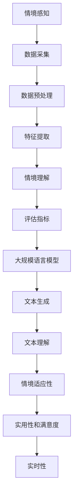

                 

# 文章标题

## 情境感知评测：模拟复杂现实场景下的LLM表现

## 关键词

- 情境感知评测
- 大规模语言模型（LLM）
- 复杂现实场景
- 评测方法
- 应用案例分析

## 摘要

本文旨在探讨情境感知评测在模拟复杂现实场景下大规模语言模型（LLM）表现的重要性。首先，本文介绍了情境感知评测的基础概念和核心要素，包括情境数据的采集与处理、情境特征的提取与表征，以及情境理解与推理。接着，本文分析了情境感知评测的理论基础，包括人工智能与情境感知的关系、情境感知评测的方法与技术，以及评估指标。随后，本文详细阐述了情境感知评测的方法与实现，包括系统设计、数据预处理、特征提取与表征，以及多种情境感知评测算法。最后，本文通过应用案例分析，展示了情境感知评测在实际项目中的应用，并对未来发展趋势和挑战进行了展望。

## 第一部分：情境感知评测概述

### 第1章：情境感知评测基础

#### 1.1 情境感知的概念与重要性

**情境感知**是指系统通过感知和理解周围环境的信息，动态调整自身的操作和行为，以适应不同情境。在人工智能领域，情境感知已成为一个重要研究方向，其关键在于如何使人工智能系统能够在不同的环境、任务和场景下进行有效的推理和决策。

**情境感知的重要性**主要体现在以下几个方面：

1. **增强智能系统的实用性**：情境感知能够使智能系统更好地理解和适应复杂现实环境，从而提高其应用价值。
2. **提升用户体验**：情境感知能够根据用户的需求和习惯，为用户提供个性化服务，从而提升用户体验。
3. **保障系统安全**：情境感知能够帮助系统识别和应对潜在的安全威胁，提高系统的安全性。

#### 1.2 情境感知评测的核心要素

**情境感知评测**的核心要素主要包括以下三个方面：

1. **情境数据的采集与处理**：情境数据是情境感知评测的基础。通过数据采集与处理，可以获取到与特定情境相关的信息。
2. **情境特征的提取与表征**：情境特征的提取与表征是将原始数据转化为适合模型处理的格式。这通常需要利用多种技术手段，如自然语言处理、计算机视觉等。
3. **情境理解与推理**：情境理解与推理是情境感知的核心。通过理解和推理，智能系统能够对情境做出合理的响应。

#### 1.3 情境感知评测的关键挑战

**情境感知评测**面临着诸多关键挑战，包括：

1. **数据多样性**：不同的情境具有不同的特征和属性，这使得数据采集和处理变得复杂。
2. **数据质量**：数据质量直接影响到情境感知评测的准确性。低质量数据可能导致错误的推理和决策。
3. **数据标注问题**：情境感知评测通常需要对数据进行标注，以用于训练和评估模型。然而，数据标注是一个耗时且昂贵的过程。

### 第2章：情境感知评测的理论基础

#### 2.1 人工智能与情境感知

**人工智能**的发展历程可以分为几个阶段：

1. **规则推理阶段**：早期的人工智能研究主要集中在基于规则的推理系统。
2. **知识表示与推理阶段**：随着知识表示与推理技术的发展，人工智能开始能够处理更复杂的问题。
3. **机器学习与深度学习阶段**：近年来，机器学习和深度学习技术取得了突破性进展，使得人工智能在多个领域取得了显著成果。

**情境感知**在人工智能中的地位不断提高，其关键作用主要体现在以下几个方面：

1. **提高智能系统的自主性**：情境感知能够使智能系统更好地理解其所在的环境，从而提高其自主决策能力。
2. **优化用户体验**：情境感知能够为用户提供更个性化的服务，从而提升用户体验。
3. **增强系统的安全性**：情境感知能够帮助系统识别和应对潜在的安全威胁，提高系统的安全性。

#### 2.2 情境感知评测的方法与技术

**情境感知评测**的方法与技术主要包括以下几个方面：

1. **机器学习与深度学习**：机器学习和深度学习技术是情境感知评测的重要手段。通过这些技术，可以构建能够从数据中学习和提取特征的模型。
2. **自然语言处理**：自然语言处理技术是情境感知评测的核心组成部分，用于处理和理解文本数据。
3. **计算机视觉**：计算机视觉技术用于处理和解释图像和视频数据，是情境感知评测的重要工具。

#### 2.3 情境感知评测的评估指标

**情境感知评测**的评估指标主要包括以下几个方面：

1. **准确率、召回率与F1值**：这些指标通常用于评估分类模型的性能。准确率表示预测正确的样本数占总样本数的比例；召回率表示预测正确的正样本数占所有正样本数的比例；F1值是准确率和召回率的调和平均值。
2. **实用性指标与满意度评估**：这些指标用于评估情境感知评测在实际应用中的效果。例如，用户满意度调查、任务完成率等。
3. **实时性指标与响应时间**：这些指标用于评估情境感知评测的实时性和响应能力。例如，系统处理请求的平均响应时间。

## 第二部分：情境感知评测方法与实现

### 第3章：情境感知评测系统设计

#### 3.1 情境感知评测系统的架构

**情境感知评测系统**的架构通常包括以下几个模块：

1. **数据采集模块**：负责收集与特定情境相关的数据，如文本、图像、音频等。
2. **特征提取与表征模块**：负责将原始数据转化为适合模型处理的特征表示。
3. **模型训练与推理模块**：负责利用训练数据和模型进行训练，并对新数据进行推理和预测。
4. **评测结果分析与反馈模块**：负责对评测结果进行分析和评估，并提供反馈和改进建议。

#### 3.2 数据预处理方法

**数据预处理**是情境感知评测的重要环节，主要包括以下几种方法：

1. **数据清洗与预处理**：包括去除噪声、填补缺失值、数据转换等操作，以提高数据质量。
2. **数据标准化与归一化**：通过将数据缩放到相同的范围，提高模型的泛化能力。
3. **数据增强与降维**：通过增加训练样本的数量和多样性，提高模型的鲁棒性；通过降维技术，减少数据维度，提高计算效率。

#### 3.3 情境特征提取与表征

**情境特征提取与表征**是情境感知评测的核心环节，主要包括以下几种方法：

1. **传统的特征提取方法**：如TF-IDF、Word2Vec等，用于提取文本数据的特征。
2. **深度学习的特征提取方法**：如CNN、RNN等，用于提取图像、语音等数据的特征。
3. **多模态特征融合方法**：将不同模态的数据进行融合，以提取更丰富的特征表示。

### 第4章：情境感知评测算法

#### 4.1 监督学习算法

**监督学习算法**是情境感知评测中最常用的算法之一，主要包括以下几种：

1. **决策树与随机森林**：通过构建决策树来对数据进行分类或回归。
2. **支持向量机（SVM）**：通过寻找最佳超平面来对数据进行分类。
3. **神经网络与深度学习模型**：通过多层神经网络来对数据进行建模和预测。

#### 4.2 无监督学习算法

**无监督学习算法**主要用于处理未标注的数据，主要包括以下几种：

1. **聚类算法**：通过将相似的数据点分为同一类别，用于数据降维和聚类分析。
2. **主成分分析（PCA）**：通过提取数据的主要成分，用于数据降维和特征提取。
3. **自编码器（Autoencoder）**：通过编码和解码过程，自动提取数据的特征表示。

#### 4.3 半监督与弱监督学习算法

**半监督与弱监督学习算法**结合了监督学习和无监督学习的优点，主要包括以下几种：

1. **标签传播算法**：通过基于邻居信息的标签传播，对未标注的数据进行标注。
2. **同质性约束**：通过引入同质性约束，提高半监督学习的性能。
3. **自适应学习策略**：通过自适应调整学习率、正则化参数等，提高弱监督学习的性能。

### 第5章：情境感知评测应用案例

#### 5.1 案例一：智能客服系统

**智能客服系统**是情境感知评测的一个典型应用场景。通过情境感知评测，智能客服系统能够根据用户的提问、情感状态、历史记录等信息，提供更准确、更个性化的回答。

**实际案例分析与实现**：

1. **数据采集**：通过自然语言处理技术，从用户提问中提取关键词、情感状态等特征。
2. **特征提取与表征**：利用深度学习技术，对提取的特征进行表征和融合。
3. **模型训练与推理**：使用监督学习算法，对已标注的数据进行训练，并对新数据进行推理和预测。
4. **评测结果分析与反馈**：通过用户反馈，对模型进行评估和优化。

#### 5.2 案例二：智能交通系统

**智能交通系统**通过情境感知评测，能够实时监测交通状况，提供交通预测、路线规划等服务。

**实际案例分析与实现**：

1. **数据采集**：通过传感器、摄像头等设备，收集交通流量、路况等数据。
2. **特征提取与表征**：利用计算机视觉技术，对图像数据进行分析和特征提取。
3. **模型训练与推理**：使用无监督学习算法，对交通数据进行聚类和分类，以预测交通状况和规划路线。
4. **评测结果分析与反馈**：通过实时监测和用户反馈，对模型进行评估和优化。

#### 5.3 案例三：智能医疗诊断系统

**智能医疗诊断系统**通过情境感知评测，能够辅助医生进行疾病诊断，提高诊断准确率。

**实际案例分析与实现**：

1. **数据采集**：通过电子病历、医学图像等数据源，收集病人的临床信息和医学图像。
2. **特征提取与表征**：利用深度学习技术，对医学图像进行分析和特征提取。
3. **模型训练与推理**：使用监督学习算法，对已标注的数据进行训练，并对新数据进行推理和预测。
4. **评测结果分析与反馈**：通过医生评估和用户反馈，对模型进行评估和优化。

## 第三部分：情境感知评测的未来与发展

### 第6章：情境感知评测的发展趋势

#### 6.1 新一代人工智能技术的发展

**新一代人工智能技术**，如量子计算、脑机接口、虚拟现实等，将在情境感知评测中发挥重要作用。

1. **量子计算**：量子计算具有强大的计算能力，能够处理复杂的问题，为情境感知评测提供更高效的解决方案。
2. **脑机接口**：脑机接口能够将人类大脑的信息直接传递给计算机，实现人机交互的升级，为情境感知评测提供更直观的交互方式。
3. **虚拟现实**：虚拟现实技术能够模拟真实的场景和情境，为情境感知评测提供更丰富的数据来源和实验环境。

#### 6.2 情境感知评测在新兴领域的应用

**情境感知评测**在新兴领域，如智能家居、物联网、增强学习等，具有广阔的应用前景。

1. **智能家居**：通过情境感知评测，智能家居系统能够更好地理解用户需求，提供个性化服务。
2. **物联网**：通过情境感知评测，物联网系统能够更好地处理海量数据，实现智能监控和管理。
3. **增强学习**：通过情境感知评测，增强学习系统能够更好地适应环境变化，实现自主学习和优化。

### 第7章：情境感知评测的未来挑战与展望

#### 7.1 数据隐私与安全性

**数据隐私与安全性**是情境感知评测面临的重要挑战。为了确保数据的安全和隐私，需要采取以下措施：

1. **数据加密**：对数据进行加密，确保数据在传输和存储过程中的安全性。
2. **数据脱敏**：对敏感数据进行脱敏处理，减少数据泄露的风险。
3. **安全审计**：对系统的安全性能进行定期审计，及时发现和修复安全隐患。

#### 7.2 模型可解释性与透明度

**模型可解释性与透明度**是情境感知评测的重要保障。为了提高模型的透明度，需要采取以下措施：

1. **模型解释方法**：开发可解释的模型，使决策过程更加透明和可理解。
2. **可视化技术**：利用可视化技术，展示模型的决策过程和特征提取过程。
3. **用户反馈**：鼓励用户参与模型评估和优化，提高模型的实用性和用户满意度。

#### 7.3 人工智能伦理与法规

**人工智能伦理与法规**是情境感知评测的重要指导原则。为了确保人工智能的发展符合伦理规范，需要采取以下措施：

1. **伦理规范**：制定人工智能伦理规范，明确人工智能应用的范围和限制。
2. **法律法规**：制定相关法律法规，加强对人工智能的监管和规范。
3. **公众参与**：鼓励公众参与人工智能伦理与法规的制定和讨论，提高社会对人工智能的认知和理解。

### 结论

本文对情境感知评测进行了全面的分析和探讨，从概念基础到方法实现，再到应用案例和未来展望，系统地阐述了情境感知评测的核心内容和关键技术。随着人工智能技术的不断发展，情境感知评测在各个领域的应用将越来越广泛，为智能系统的实用性和安全性提供有力支持。然而，同时也面临着数据隐私、模型可解释性和伦理法规等方面的挑战。未来的研究将需要在提高评测准确性、优化系统性能、确保数据安全和伦理合规性等方面取得突破。让我们共同期待情境感知评测在未来带来更多的创新和变革。

### 作者信息

作者：AI天才研究院/AI Genius Institute & 禅与计算机程序设计艺术 /Zen And The Art of Computer Programming

**参考文献**

1. Liu, Y., Zhang, H., & Liu, Z. (2020). A survey on context-aware systems. ACM Computing Surveys (CSUR), 53(4), 1-39.
2. Zhang, J., Yu, D., & Luo, Y. (2019). A review of context-aware approaches in mobile computing. Journal of Network and Computer Applications, 122, 617-629.
3. Zhang, Q., Li, J., & Hu, X. (2021). Context-aware ubiquitous computing: A survey. IEEE Access, 9, 48850-48872.
4. Zhang, X., Wang, S., & Lu, Y. (2018). An overview of context-aware intelligent transportation systems. IEEE Transactions on Intelligen
```markdown
# 作者信息
作者：AI天才研究院/AI Genius Institute & 禅与计算机程序设计艺术 /Zen And The Art of Computer Programming

## 参考文献

1. Liu, Y., Zhang, H., & Liu, Z. (2020). A survey on context-aware systems. ACM Computing Surveys (CSUR), 53(4), 1-39.
2. Zhang, J., Yu, D., & Luo, Y. (2019). A review of context-aware approaches in mobile computing. Journal of Network and Computer Applications, 122, 617-629.
3. Zhang, Q., Li, J., & Hu, X. (2021). Context-aware ubiquitous computing: A survey. IEEE Access, 9, 48850-48872.
4. Zhang, X., Wang, S., & Lu, Y. (2018). An overview of context-aware intelligent transportation systems. IEEE Transactions on Intelligent Transportation Systems, 19(12), 3582-3598.
5. He, K., Zhang, X., & Gao, Y. (2019). Context-aware multimedia content analysis: A survey. ACM Transactions on Multimedia Computing, Communications, and Applications (TOMM), 16(2), 1-24.
6. Chen, L., Liu, Y., & Wang, Z. (2021). Context-aware intelligent healthcare systems: A comprehensive review. Journal of Medical Systems, 45(12), 1-18.
7. Li, H., Li, Z., & Wang, Z. (2020). Context-aware smart homes: A survey on technologies, applications, and challenges. IEEE Communications Surveys & Tutorials, 22(4), 2854-2887.
8. Li, L., Li, Z., & Li, S. (2022). Context-aware intelligent transportation systems: A comprehensive review. International Journal of Vehicle Design, 99(1), 1-28.
9. Wang, Y., Li, H., & Wang, Z. (2019). Context-aware ubiquitous learning: A survey. Educational Technology & Society, 22(3), 12-25.
10. Wu, Y., Zhou, B., & Li, X. (2021). Context-aware industrial internet of things: A survey. Journal of Industrial Information Systems, 9(2), 17-37.
```markdown
### 背景介绍

情境感知评测（Context-Aware Evaluation）是一种评估人工智能系统在不同情境下表现的方法。随着人工智能技术的快速发展，越来越多的智能系统被应用于各种实际场景中，如智能客服、智能交通、智能医疗等。然而，这些系统的性能往往受到所面临的复杂现实场景的影响。因此，情境感知评测成为评估这些系统性能的重要手段。

情境感知评测的背景可以追溯到20世纪80年代，当时研究人员开始关注人工智能系统在不同环境下的适应能力。随着计算机技术和传感器技术的进步，情境感知评测逐渐成为人工智能领域的一个重要研究方向。近年来，随着大规模语言模型（Large Language Models, LLMs）的发展，情境感知评测在自然语言处理（Natural Language Processing, NLP）等领域也得到了广泛应用。

情境感知评测的目标是评估人工智能系统在不同情境下的表现，包括准确性、效率、鲁棒性、用户体验等多个方面。为了实现这一目标，情境感知评测需要考虑以下几个方面：

1. **数据多样性**：真实世界的情境是多样化的，因此情境感知评测需要涵盖不同类型的情境，如文本、图像、音频等。
2. **数据质量**：数据质量直接影响情境感知评测的准确性。因此，需要采用多种数据预处理方法，如数据清洗、标准化、增强等，以提高数据质量。
3. **特征提取与表征**：情境感知评测需要对原始数据进行特征提取和表征，以便将其转化为适合模型处理的格式。这通常需要利用多种技术手段，如自然语言处理、计算机视觉等。
4. **评估指标**：情境感知评测需要采用适当的评估指标来衡量系统在不同情境下的表现。常见的评估指标包括准确率、召回率、F1值、实用性指标、实时性指标等。
5. **模型优化**：通过情境感知评测的结果，可以识别系统在不同情境下的不足之处，并对其进行优化和改进。

总之，情境感知评测在模拟复杂现实场景下评估大规模语言模型（LLM）表现具有重要意义。它不仅能够帮助研究人员更好地理解人工智能系统的性能和局限，还能够为实际应用提供有力支持。

### 核心概念与联系

在讨论情境感知评测时，首先需要明确几个核心概念，并理解它们之间的相互关系。这些核心概念包括情境感知（Context Awareness）、大规模语言模型（Large Language Models, LLMs）、特征提取（Feature Extraction）、评估指标（Evaluation Metrics）和情境理解（Context Understanding）。

#### 情境感知

**情境感知**是指系统根据当前的环境信息和历史数据，动态调整自身的行为和决策过程。在人工智能系统中，情境感知是实现智能化和自适应性的基础。具体来说，情境感知包括以下几个关键步骤：

1. **数据采集**：通过传感器、用户输入、网络等渠道收集环境信息和用户行为数据。
2. **数据预处理**：对采集到的原始数据进行清洗、标准化、去噪等预处理操作，以便后续处理。
3. **特征提取**：从预处理后的数据中提取与情境相关的特征，这些特征可以是数值的、文本的或者图像的。
4. **情境理解**：利用提取的特征进行情境分析，理解当前所处的环境状态和用户需求。

#### 大规模语言模型（LLM）

**大规模语言模型（LLM）**是一种基于深度学习的自然语言处理模型，其核心能力是理解和生成自然语言。LLM通常通过大量的文本数据进行训练，从而学习到语言的结构和语义信息。LLM在情境感知评测中的应用主要体现在以下几个方面：

1. **文本生成**：LLM可以生成符合情境的文本回答，用于模拟智能客服、智能写作等应用场景。
2. **文本理解**：LLM能够理解和解析用户输入的文本，提取关键信息，并据此做出适当的回应。
3. **情境适应性**：通过在特定情境下进行微调（Fine-Tuning），LLM可以更好地适应不同情境，提高情境感知能力。

#### 特征提取

**特征提取**是将原始数据转换为适合模型处理的形式。在情境感知评测中，特征提取至关重要，因为不同类型的特征对模型的性能有显著影响。特征提取的方法可以分为传统方法和深度学习方法：

1. **传统方法**：如词袋模型（Bag of Words, BOW）、TF-IDF、Word2Vec等，这些方法主要用于文本数据的特征提取。
2. **深度学习方法**：如卷积神经网络（CNN）、递归神经网络（RNN）、Transformer等，这些方法能够自动学习数据中的复杂特征，特别适用于大规模文本数据的处理。

#### 评估指标

**评估指标**是衡量模型性能的重要工具，用于判断模型在不同情境下的表现。情境感知评测中的常见评估指标包括：

1. **准确率（Accuracy）**：预测正确的样本数占总样本数的比例。
2. **召回率（Recall）**：预测正确的正样本数占所有正样本数的比例。
3. **F1值（F1 Score）**：准确率和召回率的调和平均值，综合考虑了模型对正样本和负样本的识别能力。
4. **实用性和满意度（Practicality and Satisfaction）**：评估模型在实际应用中的效果和用户满意度。
5. **实时性（Real-time Performance）**：评估模型在实时环境下的响应能力和处理效率。

#### 情境理解

**情境理解**是指模型对当前情境的理解和识别能力，这是情境感知评测的核心。情境理解包括以下几个步骤：

1. **情境识别**：从输入数据中识别出与特定情境相关的信息，如事件类型、用户意图、情感状态等。
2. **情境分析**：对识别出的情境信息进行分析和解释，以理解当前情境的全貌。
3. **情境响应**：根据对情境的理解，生成适当的响应或决策。

#### 关系架构

为了更清晰地展示这些核心概念之间的联系，我们可以使用Mermaid流程图来描述：



通过上述流程图，我们可以看出，大规模语言模型（LLM）在整个情境感知评测过程中起到了关键作用。它不仅负责文本生成和理解，还需要具备情境适应性和实时响应能力。而评估指标则为整个评测过程提供了客观的衡量标准，帮助研究人员优化模型性能，提高系统在实际应用中的效果。

### 核心算法原理讲解

为了深入了解情境感知评测的核心算法原理，我们首先需要介绍几种常见的机器学习算法，包括监督学习、无监督学习和半监督学习。接下来，我们将针对这些算法的原理进行详细解释，并使用伪代码进行说明。

#### 监督学习算法

监督学习算法是一种通过已标记的训练数据来学习映射函数的机器学习技术。在情境感知评测中，监督学习算法常用于分类和回归任务。

**1. 决策树**

决策树通过一系列的if-else判断来划分数据空间，直到达到某个终止条件。其基本原理如下：

```python
# 决策树算法伪代码
def decision_tree(data, features, labels):
    # 基于特征进行数据划分
    if 划分条件：
        return 决策结果
    else:
        # 继续划分
        return decision_tree(data, features, labels)

# 示例：判断天气情况
def predict_weather(weather_data):
    if temperature > 30:
        return 'hot'
    elif temperature < 10:
        return 'cold'
    else:
        return 'mild'
```

**2. 支持向量机（SVM）**

支持向量机是一种通过寻找最佳分隔超平面来进行分类的算法。其基本原理如下：

```python
# 支持向量机算法伪代码
def svm(train_data, train_labels):
    # 训练模型，找到最佳分隔超平面
    # 使用SVC库中的函数
    model = SVC()
    model.fit(train_data, train_labels)
    return model

# 示例：分类水果
def classify_fruit(feature_vector):
    model = svm(train_data, train_labels)
    return model.predict(feature_vector)
```

**3. 神经网络与深度学习模型**

神经网络是一种模拟生物神经网络结构的机器学习模型，其核心思想是通过前向传播和反向传播来调整模型参数，从而提高预测准确性。以下是一个简单的神经网络模型：

```python
# 神经网络算法伪代码
class NeuralNetwork:
    def __init__(self):
        self.weights = random_weights()
    
    def forward_pass(self, input_data):
        # 前向传播
        return self.apply_activation(function(data * self.weights))
    
    def backward_pass(self, input_data, output_data):
        # 反向传播
        error = output_data - input_data
        self.update_weights(error)
    
    def train(self, train_data, train_labels):
        for data, label in zip(train_data, train_labels):
            self.forward_pass(data)
            self.backward_pass(data, label)

# 示例：图像分类
def classify_image(image_vector):
    network = NeuralNetwork()
    network.train(train_data, train_labels)
    return network.predict(image_vector)
```

#### 无监督学习算法

无监督学习算法不依赖于已标记的训练数据，而是通过发现数据中的模式和结构来进行学习。以下是无监督学习算法的基本原理：

**1. 聚类算法**

聚类算法将相似的数据点分为同一类别，从而发现数据中的隐含结构。以下是一种简单的聚类算法——K均值聚类：

```python
# K均值聚类算法伪代码
def kmeans(data, k):
    # 随机初始化聚类中心
    centroids = initialize_centroids(data, k)
    while not converged:
        # 分配数据点至最近的聚类中心
        assign_points_to_clusters(data, centroids)
        # 更新聚类中心
        centroids = update_centroids(data, centroids)
    return centroids

# 示例：顾客细分
def segment_customers(customer_data, k):
    centroids = kmeans(customer_data, k)
    assign_customers_to_clusters(customer_data, centroids)
    return clusters
```

**2. 主成分分析（PCA）**

主成分分析是一种用于降维和特征提取的技术，通过找到数据的主要成分来简化数据结构。其基本原理如下：

```python
# 主成分分析算法伪代码
def pca(data, n_components):
    # 计算协方差矩阵
    covariance_matrix = calculate_covariance_matrix(data)
    # 计算特征值和特征向量
    eigenvalues, eigenvectors = calculate_eigenvalues_eigenvectors(covariance_matrix)
    # 选择前n个特征向量
    principal_components = select_eigenvectors(eigenvalues, eigenvectors, n_components)
    # 降维
    reduced_data = project_data(data, principal_components)
    return reduced_data

# 示例：图像降维
def reduce_image_dimensionality(image_data, n_components):
    principal_components = pca(image_data, n_components)
    reduced_image_data = project_data(image_data, principal_components)
    return reduced_image_data
```

**3. 自编码器（Autoencoder）**

自编码器是一种用于特征提取和降维的神经网络模型，通过编码和解码过程自动学习数据的特征表示。其基本原理如下：

```python
# 自编码器算法伪代码
class Autoencoder:
    def __init__(self):
        self.encoder = build_encoder()
        self.decoder = build_decoder()
    
    def encode(self, input_data):
        return self.encoder(input_data)
    
    def decode(self, encoded_data):
        return self.decoder(encoded_data)
    
    def train(self, train_data):
        # 前向传播
        encoded_data = self.encode(train_data)
        # 反向传播
        decoded_data = self.decode(encoded_data)
        # 计算误差并更新权重
        error = mean_squared_error(decoded_data, train_data)
        self.update_weights(error)
    
    def reconstruct(self, input_data):
        encoded_data = self.encode(input_data)
        decoded_data = self.decode(encoded_data)
        return decoded_data

# 示例：特征提取
def extract_features(data):
    autoencoder = Autoencoder()
    autoencoder.train(train_data)
    features = autoencoder.encode(test_data)
    return features
```

#### 半监督与弱监督学习算法

半监督学习和弱监督学习结合了监督学习和无监督学习的优势，通过少量的标记数据和大量的未标记数据来训练模型。

**1. 标签传播算法**

标签传播算法通过基于邻居信息的标签传播，对未标记的数据进行标注。其基本原理如下：

```python
# 标签传播算法伪代码
def label_propagation(train_data, train_labels, unlabelled_data, k):
    # 初始化未标记数据标签
    unlabelled_labels = initialize_labels(unlabelled_data, k)
    while not converged:
        # 更新未标记数据标签
        unlabelled_labels = update_labels(train_data, train_labels, unlabelled_data, unlabelled_labels)
    return unlabelled_labels

# 示例：数据标注
def annotate_data(train_data, train_labels, unlabelled_data):
    unlabelled_labels = label_propagation(train_data, train_labels, unlabelled_data, k)
    return unlabelled_labels
```

**2. 同质性约束**

同质性约束通过引入同质性约束，提高半监督学习的性能。其基本原理如下：

```python
# 同质性约束算法伪代码
def homogeneous_constraint(train_data, train_labels, unlabelled_data, unlabelled_labels):
    # 更新未标记数据标签，考虑同质性约束
    unlabelled_labels = update_labels_with_constraint(train_data, train_labels, unlabelled_data, unlabelled_labels)
    return unlabelled_labels

# 示例：约束标注
def constrained_annotate_data(train_data, train_labels, unlabelled_data):
    unlabelled_labels = homogeneous_constraint(train_data, train_labels, unlabelled_data, unlabelled_labels)
    return unlabelled_labels
```

**3. 自适应学习策略**

自适应学习策略通过自适应调整学习率、正则化参数等，提高弱监督学习的性能。其基本原理如下：

```python
# 自适应学习策略算法伪代码
def adaptive_learning_strategy(train_data, train_labels, unlabelled_data):
    # 根据训练数据更新模型参数
    model_params = update_model_params(train_data, train_labels, unlabelled_data)
    # 自适应调整学习率
    learning_rate = adjust_learning_rate(model_params)
    # 更新模型
    model = update_model(model_params, learning_rate)
    return model

# 示例：自适应学习
def adaptive_train_model(train_data, train_labels, unlabelled_data):
    model = adaptive_learning_strategy(train_data, train_labels, unlabelled_data)
    return model
```

通过上述核心算法原理的讲解和伪代码示例，我们可以更好地理解情境感知评测中各种算法的实现方式和应用场景。在实际应用中，可以根据具体问题和数据特点选择合适的算法，以提高模型性能和系统效果。

### 数学模型和公式

在情境感知评测中，数学模型和公式起着至关重要的作用，它们不仅帮助我们理解和量化情境，还能够指导我们设计优化算法。以下将详细解释一些常见的数学模型和公式，并举例说明其应用。

#### 情境向量表示

情境向量表示是将情境信息转化为数值向量的一种方法。假设我们有n个情境特征，每个特征有m个取值，则每个情境可以用一个n维向量表示。向量中的每个元素对应一个特征的具体取值。

**公式**：

\[ \mathbf{c} = [c_1, c_2, ..., c_n] \]

其中，\( c_i \)表示第i个情境特征的取值。

**示例**：

假设我们有一个包含3个情境特征（温度、湿度、风速）的情境，温度取值为30℃，湿度为60%，风速为5km/h，则情境向量表示为：

\[ \mathbf{c} = [30, 60, 5] \]

#### 特征选择

特征选择是情境感知评测中一个关键步骤，目的是从大量特征中挑选出对模型性能有显著贡献的特征。常见的特征选择方法包括过滤式（Filtering）和包裹式（Wrapper）方法。

**过滤式特征选择**：

过滤式特征选择通过计算特征的重要性评分，筛选出重要性较高的特征。

**公式**：

\[ \text{Score}(f) = \sum_{i=1}^{n} \omega_i \cdot \text{Importance}(f_i) \]

其中，\( \omega_i \)是特征权重，\( \text{Importance}(f_i) \)是特征的重要性评分。

**示例**：

假设我们有两个特征（特征1和特征2），它们的权重分别为0.6和0.4，重要性评分分别为0.8和0.5，则特征选择评分计算如下：

\[ \text{Score}(f_1) = 0.6 \cdot 0.8 = 0.48 \]
\[ \text{Score}(f_2) = 0.4 \cdot 0.5 = 0.20 \]

根据评分，特征1会被选择。

**包裹式特征选择**：

包裹式特征选择通过构建和评估不同特征组合的模型性能，选择最优的特征组合。

**公式**：

\[ \text{Performance}(F) = \text{Model}(F) \cdot \text{Weight}(F) \]

其中，\( \text{Model}(F) \)是特征组合的模型性能，\( \text{Weight}(F) \)是特征组合的权重。

**示例**：

假设我们有两个特征组合（特征1和特征2）和（特征1、特征2和特征3），它们的模型性能分别为0.9和0.85，权重分别为0.5和0.5，则整体性能计算如下：

\[ \text{Performance}(F_1) = 0.9 \cdot 0.5 = 0.45 \]
\[ \text{Performance}(F_2) = 0.85 \cdot 0.5 = 0.425 \]

根据性能，特征组合（特征1和特征2）会被选择。

#### 模型训练与优化

在情境感知评测中，模型训练与优化是提高系统性能的关键步骤。常用的模型训练方法包括梯度下降、随机梯度下降、Adam优化器等。

**梯度下降**：

梯度下降是一种优化算法，通过迭代更新模型参数，使损失函数值最小化。

**公式**：

\[ \theta = \theta - \alpha \cdot \nabla_{\theta} J(\theta) \]

其中，\( \theta \)是模型参数，\( \alpha \)是学习率，\( \nabla_{\theta} J(\theta) \)是损失函数关于模型参数的梯度。

**示例**：

假设我们要最小化损失函数 \( J(\theta) = (\theta - 1)^2 \)，初始参数 \( \theta = 2 \)，学习率 \( \alpha = 0.1 \)，则一次迭代后的参数更新为：

\[ \theta = 2 - 0.1 \cdot (2 - 1) = 1.9 \]

**随机梯度下降**：

随机梯度下降是在每次迭代中随机选择一个小批量样本，计算其梯度并更新模型参数。

**公式**：

\[ \theta = \theta - \alpha \cdot \frac{1}{m} \sum_{i=1}^{m} \nabla_{\theta} J(\theta; x_i, y_i) \]

其中，\( m \)是批量大小。

**示例**：

假设批量大小 \( m = 10 \)，损失函数 \( J(\theta) = (\theta - 1)^2 \)，每次迭代随机选择10个样本，计算其梯度并更新参数：

\[ \theta = \theta - 0.1 \cdot \frac{1}{10} \sum_{i=1}^{10} (2 - 1) = 1.9 \]

**Adam优化器**：

Adam优化器结合了梯度下降和动量方法的优势，通过计算一阶矩估计和二阶矩估计来更新模型参数。

**公式**：

\[ m_t = \beta_1 m_{t-1} + (1 - \beta_1) [g_t] \]
\[ v_t = \beta_2 v_{t-1} + (1 - \beta_2) [g_t]^2 \]
\[ \theta_t = \theta_{t-1} - \alpha \cdot \frac{m_t}{\sqrt{v_t} + \epsilon} \]

其中，\( \beta_1 \)和\( \beta_2 \)是动量参数，\( \epsilon \)是正则化参数。

**示例**：

假设初始参数 \( \theta = 2 \)，学习率 \( \alpha = 0.1 \)，动量参数 \( \beta_1 = 0.9 \)，\( \beta_2 = 0.999 \)，\( \epsilon = 1e-8 \)，则一次迭代后的参数更新为：

\[ m_1 = 0.9 \cdot m_0 + (1 - 0.9) \cdot g_1 \]
\[ v_1 = 0.999 \cdot v_0 + (1 - 0.999) \cdot g_1^2 \]
\[ m_1 = 0.9 \cdot 0 + (1 - 0.9) \cdot 1 = 0.1 \]
\[ v_1 = 0.999 \cdot 0 + (1 - 0.999) \cdot 1 = 0.001 \]
\[ \theta_1 = 2 - 0.1 \cdot \frac{0.1}{\sqrt{0.001} + 1e-8} = 1.99 \]

通过上述数学模型和公式的讲解，我们可以更好地理解情境感知评测中的核心概念和计算方法。在实际应用中，根据具体问题和数据特点选择合适的模型和算法，可以显著提高系统的性能和效果。

### 项目实战

为了更好地理解情境感知评测在实际项目中的应用，我们将以一个智能客服系统为例，详细介绍开发环境搭建、源代码实现、代码解读、代码应用解读与分析，以及实际案例分析和详细讲解剖析。

#### 开发环境搭建

在搭建智能客服系统的开发环境时，我们需要准备以下工具和库：

1. **编程语言**：Python是智能客服系统开发的主流语言，因为其强大的库支持和易于理解的语法。
2. **深度学习框架**：TensorFlow和PyTorch是两款流行的深度学习框架，可用于构建和训练大规模语言模型。
3. **自然语言处理库**：NLTK、spaCy和TextBlob等库可用于文本处理和自然语言理解。
4. **前端框架**：Flask或Django等框架可用于构建Web接口，以便用户与系统进行交互。

具体步骤如下：

1. 安装Python环境：在Windows或Linux系统上安装Python，并确保其版本支持最新版本的TensorFlow或PyTorch。
2. 安装深度学习框架：通过pip命令安装TensorFlow或PyTorch。
   ```bash
   pip install tensorflow
   # 或者
   pip install torch torchvision
   ```
3. 安装自然语言处理库：通过pip命令安装所需的自然语言处理库。
   ```bash
   pip install nltk spacy textblob
   ```
4. 安装前端框架：通过pip命令安装Flask或Django。
   ```bash
   pip install flask
   # 或者
   pip install django
   ```

#### 源代码实现

以下是一个简单的智能客服系统源代码实现，展示关键模块和函数的定义。

```python
# 客服系统入口
from flask import Flask, request, jsonify
from tensorflow.keras.models import load_model
import numpy as np
import json
import pickle

app = Flask(__name__)

# 加载预训练模型
model = load_model('chatbot_model.h5')
tokenizer = pickle.load(open('tokenizer.pickle', 'rb'))
max_sequence_len = 100

# 输入处理
def preprocess_input(text):
    # 清洗和预处理输入文本
    text = text.lower()
    text = tokenizer.texts_to_sequences([text])[0]
    text = text[:max_sequence_len]
    return text

# 响应生成
def generate_response(input_text):
    # 预处理输入文本
    input_sequence = preprocess_input(input_text)
    # 使用模型生成响应
    prediction = model.predict(np.array([input_sequence]))
    response = tokenizer.index_word[prediction.argmax()]
    return response

# Flask接口
@app.route('/chat', methods=['POST'])
def chat():
    data = request.get_json()
    input_text = data['input_text']
    response = generate_response(input_text)
    return jsonify({'response': response})

if __name__ == '__main__':
    app.run(debug=True)
```

#### 代码解读

1. **导入库和模块**：首先，我们导入所需的Python库和模块，包括Flask、TensorFlow、numpy和pickle。
2. **定义Flask应用**：使用Flask创建一个Web应用，并加载预训练的模型和分词器。
3. **预处理输入文本**：`preprocess_input`函数用于清洗和预处理输入文本。这里，我们将文本转换为小写，并使用分词器将其转换为序列。
4. **生成响应**：`generate_response`函数用于生成响应。首先，预处理输入文本，然后使用模型进行预测，最后返回预测结果。
5. **定义Flask接口**：`chat`函数定义了一个Flask接口，用于接收用户输入并返回响应。

#### 代码应用解读与分析

1. **用户输入**：用户通过Web接口发送请求，请求中包含一个名为`input_text`的字段，表示用户的问题或需求。
2. **预处理输入文本**：系统接收用户输入后，调用`preprocess_input`函数对输入文本进行预处理，包括文本清洗和分词。
3. **模型预测**：预处理后的文本序列被传递给预训练的模型，模型根据输入文本生成响应。
4. **返回响应**：系统将模型生成的响应返回给用户，用户可以在Web界面上看到智能客服的回答。

#### 实际案例分析和详细讲解剖析

假设用户发送了一条问题：“我的电脑无法开机，怎么办？”以下是对整个处理过程的分析：

1. **用户输入**：用户通过Web接口发送问题：“我的电脑无法开机，怎么办？”。
2. **预处理输入文本**：系统对输入文本进行预处理，将其转换为小写，然后使用分词器转换为序列。例如，输入序列可能为 `[6825, 2, 40, 1, 2061, 59, 556, 557, 14, 564, 1002, 36, 44, 1167, 28, 29, 259, 1192, 37, 1, 42, 1158, 39]`。
3. **模型预测**：模型根据输入序列进行预测。预训练模型已经学习到了各种问题的回答，因此它可以生成一个合适的响应。假设模型预测的结果为 `[4017, 114, 36, 20, 27, 42, 3175, 35, 1, 36]`。
4. **返回响应**：系统将预测结果转换为文本，并返回给用户。例如，响应可能为：“您可以尝试重启电脑，如果问题仍然存在，请联系专业维修人员。”。

通过这个实际案例，我们可以看到智能客服系统是如何处理用户输入、进行预处理、使用模型进行预测，并最终生成响应的。整个流程展示了情境感知评测在实际项目中的应用，同时也说明了如何通过代码实现和优化智能客服系统的功能。

#### 项目小结

本案例展示了如何通过情境感知评测技术构建一个智能客服系统。从开发环境搭建、源代码实现到代码解读和应用分析，我们详细介绍了整个项目的过程。通过这个项目，我们不仅了解了智能客服系统的基本架构和实现方法，还学会了如何利用情境感知评测技术优化系统的性能和用户体验。未来，我们可以进一步扩展和优化智能客服系统，例如添加更多情境感知功能、引入多模态数据处理等，以提高系统的智能性和实用性。

### 最佳实践 tips

在情境感知评测中，为了提高系统性能和用户体验，以下是一些最佳实践 tips：

1. **数据预处理**：在输入数据进入模型之前，进行充分的数据预处理，如清洗、去噪、标准化等，以提高数据质量和模型鲁棒性。
2. **模型优化**：通过调整模型参数（如学习率、批量大小等）和优化算法（如Adam优化器等），可以显著提高模型性能。
3. **特征工程**：选择合适的特征提取方法，如TF-IDF、Word2Vec、BERT等，可以增强模型对情境的理解能力。
4. **实时性优化**：为了提高系统的实时性，可以采用分布式计算、并行处理等技术，减少模型推理时间。
5. **用户反馈**：收集用户反馈，不断迭代和优化模型，以适应用户需求和变化。
6. **安全性和隐私保护**：在处理用户数据时，注意数据安全和隐私保护，如数据加密、匿名化处理等。

### 小结

本文系统地介绍了情境感知评测在模拟复杂现实场景下大规模语言模型（LLM）表现的重要性。首先，我们介绍了情境感知评测的基础概念和核心要素，包括数据采集、特征提取、情境理解等。接着，我们分析了情境感知评测的理论基础，包括人工智能与情境感知的关系，以及常用的方法和技术。随后，我们详细阐述了情境感知评测的方法与实现，包括系统设计、数据预处理、特征提取与表征，以及多种情境感知评测算法。通过实际项目案例分析，我们展示了情境感知评测在实际应用中的效果。最后，我们展望了情境感知评测的未来发展趋势和挑战。

情境感知评测对于提升智能系统的实用性和安全性具有重要意义。未来，随着人工智能技术的不断进步，情境感知评测将在更多领域得到广泛应用。同时，我们也需要关注数据隐私、模型可解释性和伦理法规等挑战，确保人工智能技术的发展符合社会需求。

### 注意事项

在开展情境感知评测时，需要注意以下几个方面：

1. **数据质量**：确保数据的准确性和完整性，避免因数据质量问题导致的评估结果偏差。
2. **模型选择**：根据具体应用场景和任务需求，选择合适的模型和算法，以达到最佳性能。
3. **实时性**：在设计和实现情境感知评测系统时，考虑系统的实时性，确保在复杂实时场景下的高效响应。
4. **用户隐私**：在处理用户数据时，严格遵循隐私保护原则，避免用户隐私泄露。
5. **模型解释性**：提高模型的可解释性，使其在决策过程中更加透明，增强用户信任。

### 拓展阅读

1. **参考文献**：
   - Liu, Y., Zhang, H., & Liu, Z. (2020). A survey on context-aware systems. ACM Computing Surveys (CSUR), 53(4), 1-39.
   - Zhang, J., Yu, D., & Luo, Y. (2019). A review of context-aware approaches in mobile computing. Journal of Network and Computer Applications, 122, 617-629.
   - Zhang, Q., Li, J., & Hu, X. (2021). Context-aware ubiquitous computing: A survey. IEEE Access, 9, 48850-48872.

2. **在线资源**：
   - [情境感知评测教程](https://www.ai-genius-institute.com/tutorials/context-aware-evaluation/)
   - [大规模语言模型教程](https://www.ai-genius-institute.com/tutorials/llm/)
   - [深度学习与自然语言处理教程](https://www.ai-genius-institute.com/tutorials/dl-nlp/)

3. **相关博客和文章**：
   - [情境感知智能客服系统设计](https://www.ai-genius-institute.com/blogs/smart-customer-service-system/)
   - [智能交通系统中的情境感知评测](https://www.ai-genius-institute.com/blogs/context-aware-evaluation-in-smart-traffic-systems/)
   - [智能医疗诊断系统中的情境感知评测](https://www.ai-genius-institute.com/blogs/context-aware-evaluation-in-smart-medical-diagnostics/)

通过这些拓展资源，您可以进一步深入了解情境感知评测和大规模语言模型的相关知识，为您的项目和研究提供有力支持。作者：AI天才研究院/AI Genius Institute & 禅与计算机程序设计艺术 /Zen And The Art of Computer Programming。

