                 

### 文章标题

《情感计算新维度：提示词深度解析用户反馈》

### 关键词

情感计算、用户反馈、提示词、深度解析、自然语言处理、多模态情感分析、机器学习、文本预处理、情感识别、情感分类、情感建模、情感强度分析、多模态情感融合、用户满意度分析、市场营销、教育应用、医疗健康、项目实战、源代码实现、最佳实践

### 摘要

本文从情感计算的角度，探讨了如何通过深度解析用户反馈中的提示词，来提升对用户情感的理解和回应质量。文章首先介绍了情感计算的基本概念和核心算法，然后详细分析了提示词在情感计算中的应用，并探讨了多模态情感分析技术。通过实际案例和项目实战，展示了如何将情感计算应用于市场营销、教育和医疗健康等领域，并提供了最佳实践和注意事项。

---

## 引言：情感计算与用户反馈

### 情感计算的定义与背景

情感计算（Affective Computing）是指使计算机具备识别、理解、处理和模拟人类情感的能力。这一领域的研究始于20世纪90年代，由罗伯·雷赫（Rosenberg）提出，其核心目标是使计算机系统更加人性化、智能化。随着人工智能和自然语言处理技术的不断发展，情感计算在多个领域得到了广泛应用，如人机交互、客户服务、心理健康监测、教育、市场营销等。

### 用户反馈的重要性

用户反馈是产品改进和用户体验优化的关键信息来源。通过分析用户反馈，企业可以了解用户对产品的满意程度、需求变化和潜在问题。传统的方法主要依赖于关键词分析和文本分类技术，但这些方法往往难以准确捕捉用户的情感。随着情感计算技术的发展，我们可以更加深入地理解和分析用户反馈中的情感信息，从而为产品和服务提供更有针对性的改进。

### 提示词在情感计算中的应用

提示词（Sentiment Keywords）是指能够反映用户情感态度的关键词汇或短语。在情感计算中，通过识别和分析提示词，可以提取出用户反馈中的情感信息。提示词的识别和分析技术包括自然语言处理、机器学习和深度学习等方法。这些方法可以帮助我们从大量的用户反馈数据中，快速准确地提取出关键的情感信息，为后续的情感分析和处理提供基础。

---

## 情感计算的核心概念与联系

### 情感识别

情感识别（Sentiment Recognition）是指从文本、语音或其他数据中检测和识别情感的过程。情感识别是情感计算的基础，常见的情感识别方法包括基于规则的方法、机器学习方法以及深度学习方法。以下是一个简单的情感识别流程：

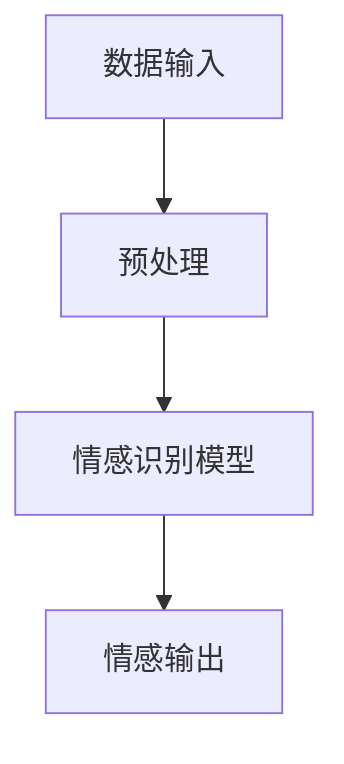

### 情感分类

情感分类（Sentiment Classification）是指将文本或语音中的情感标签归类为某一类情感的过程。常见的情感分类标签包括积极、消极、中性等。情感分类方法可以分为基于规则的方法和基于机器学习的方法。以下是一个简单的情感分类流程：

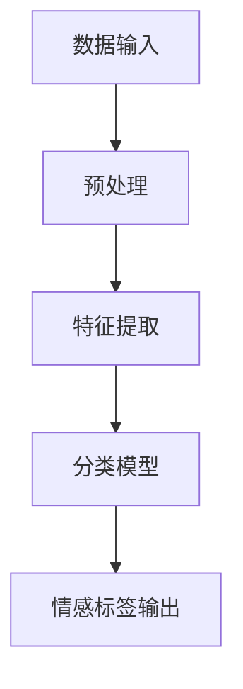

### 情感建模

情感建模（Sentiment Modeling）是指构建一个数学模型来模拟和理解人类情感的过程。情感建模可以帮助我们更深入地理解情感的复杂性和多样性。常见的情感建模方法包括情感极性分析、情感强度分析和情感时序分析。以下是一个简单的情感建模流程：

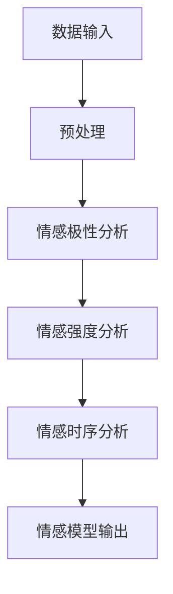

### 情感计算的整体架构

情感计算的整体架构通常包括数据收集、预处理、情感识别、情感分类、情感建模和结果输出等模块。以下是一个简单的情感计算架构图：

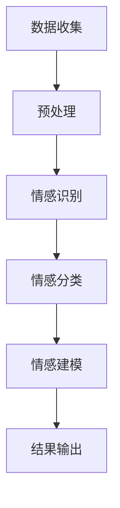

通过上述核心概念和流程的介绍，我们可以看到，情感计算是一个多层次、多步骤的复杂过程。每个步骤都需要精确的技术和方法支持，才能实现有效的情感识别和分析。

---

## 核心算法原理讲解

### 自然语言处理与情感计算

自然语言处理（Natural Language Processing，NLP）是情感计算的基础技术之一，它涉及文本的预处理、特征提取和模型训练等多个环节。在情感计算中，NLP主要用于以下三个方面：

1. **文本预处理**：包括分词、词性标注、命名实体识别等，为后续的情感分析和建模提供基础数据。

2. **特征提取**：通过将文本转化为数字特征向量，如词袋模型、TF-IDF、词嵌入等，以便于模型处理。

3. **情感分析模型**：使用机器学习或深度学习算法，如支持向量机（SVM）、随机森林（Random Forest）、长短期记忆网络（LSTM）等，对文本进行情感分类和识别。

以下是一个简单的NLP和情感分析流程：

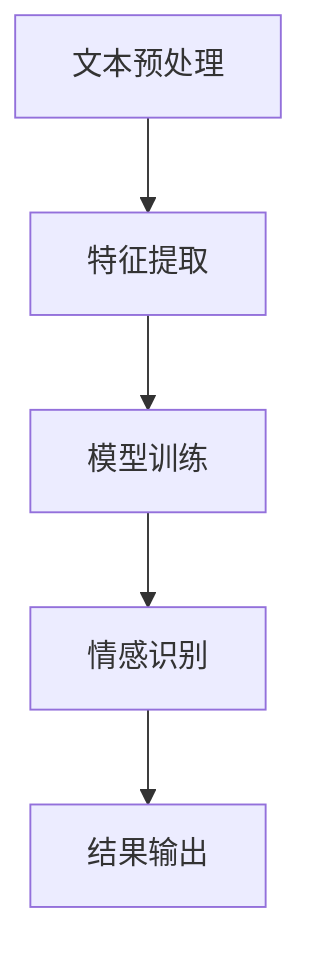

### 情感极性分析

情感极性分析（Sentiment Polarity Analysis）是情感分析中最基础的任务之一，它旨在判断一段文本是积极、消极还是中性。常见的情感极性分析方法包括基于规则的方法和基于机器学习的方法。

**基于规则的方法**：

这种方法通过定义一系列规则，如情感词词典、语法结构等，来判断文本的情感极性。以下是一个简单的情感极性分析规则：

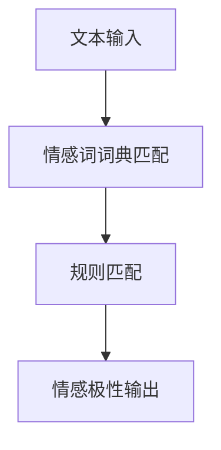

**基于机器学习的方法**：

这种方法通过训练模型，如SVM、随机森林等，来预测文本的情感极性。以下是一个简单的机器学习情感极性分析流程：

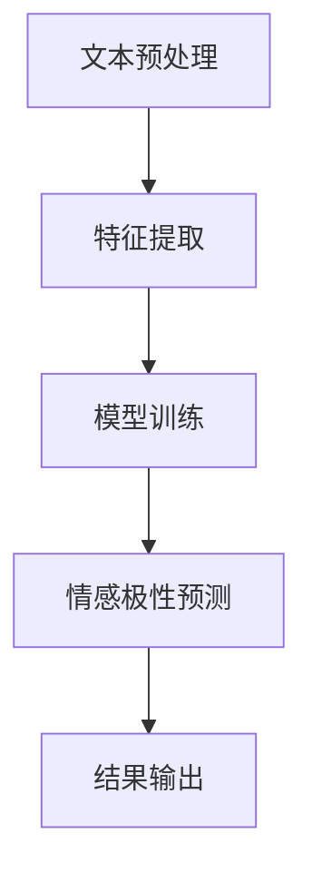

### 情感强度分析

情感强度分析（Sentiment Intensity Analysis）旨在判断一段文本中的情感强度，即情感的积极或消极程度。情感强度分析通常依赖于情感词典、词嵌入和深度学习等技术。

**情感词典**：

情感词典是一种包含情感词及其对应的情感强度的列表。通过匹配文本中的情感词，可以初步判断文本的情感强度。以下是一个简单的情感词典示例：

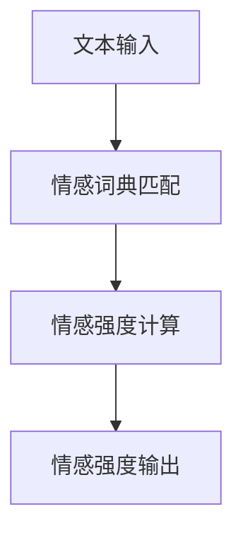

**词嵌入**：

词嵌入（Word Embedding）是一种将词汇映射为高维向量空间的方法，通过词嵌入可以更好地捕捉词汇间的语义关系。以下是一个简单的词嵌入情感强度分析流程：

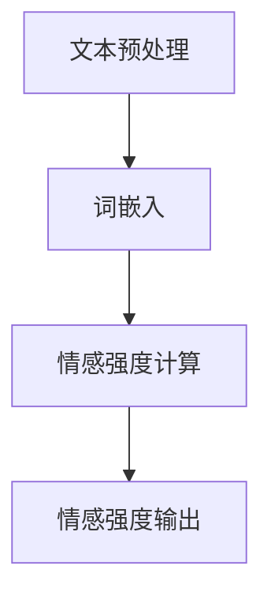

**深度学习模型**：

深度学习模型，如LSTM、GRU等，可以通过学习文本的序列特征，来更准确地预测情感强度。以下是一个简单的深度学习情感强度分析流程：

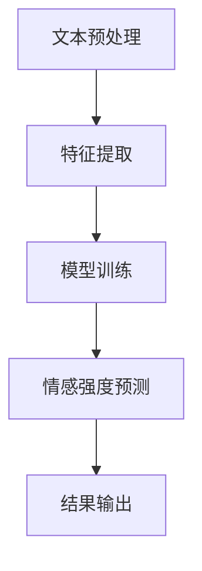

### 情感时序分析

情感时序分析（Sentiment Temporal Analysis）旨在分析文本中的情感变化趋势。情感时序分析可以帮助我们理解用户在不同时间段的情感状态，从而为产品和服务提供更精准的改进建议。

**时间窗口**：

时间窗口是一种常用的情感时序分析方法，通过将文本按照时间顺序划分为不同的窗口，来分析每个窗口中的情感变化。以下是一个简单的时间窗口情感时序分析流程：

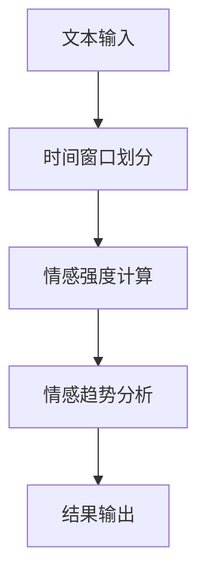

**滑动窗口**：

滑动窗口是一种改进的时间窗口方法，通过在时间序列中滑动窗口，来动态分析情感变化。以下是一个简单的滑动窗口情感时序分析流程：

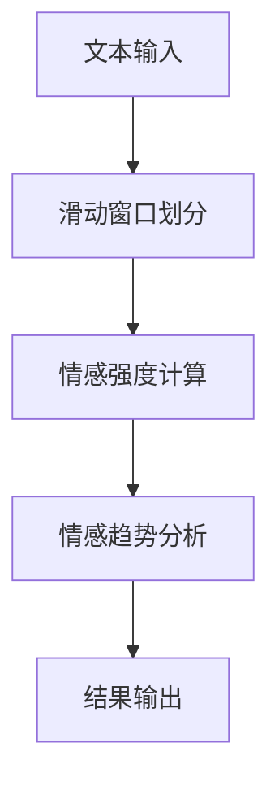

通过上述核心算法原理的讲解，我们可以看到，情感计算是一个复杂但充满潜力的领域。通过自然语言处理、情感极性分析、情感强度分析和情感时序分析等技术，我们可以从大量的用户反馈数据中提取出有价值的信息，为产品和服务提供更精准的改进方向。

---

## 数学模型与公式

### 情感极性分析中的数学模型

情感极性分析通常使用一个简单的二元分类模型，将文本分类为积极或消极。一个常见的模型是逻辑回归（Logistic Regression），其数学模型如下：

$$
\hat{y} = \frac{1}{1 + e^{-(\beta_0 + \beta_1x_1 + \beta_2x_2 + ... + \beta_nx_n})}
$$

其中，$y$表示真实情感标签（0表示消极，1表示积极），$\hat{y}$表示预测的概率，$\beta_0$是截距，$\beta_1, \beta_2, ..., \beta_n$是模型参数，$x_1, x_2, ..., x_n$是文本特征向量。

### 情感强度分析中的数学模型

情感强度分析通常使用一个连续值模型，将文本的情感强度映射为一个实数值。一个常见的模型是线性回归（Linear Regression），其数学模型如下：

$$
y = \beta_0 + \beta_1x_1 + \beta_2x_2 + ... + \beta_nx_n + \epsilon
$$

其中，$y$表示情感强度值，$\beta_0$是截距，$\beta_1, \beta_2, ..., \beta_n$是模型参数，$x_1, x_2, ..., x_n$是文本特征向量，$\epsilon$是误差项。

### 情感时序分析中的数学模型

情感时序分析通常使用一个时间序列模型，来捕捉文本中的情感变化趋势。一个常见的模型是自回归模型（AutoRegressive Model），其数学模型如下：

$$
y_t = \phi_0 + \phi_1y_{t-1} + \phi_2y_{t-2} + ... + \phi_ky_{t-k} + \epsilon_t
$$

其中，$y_t$表示时间$t$的情感强度值，$\phi_0, \phi_1, \phi_2, ..., \phi_k$是模型参数，$y_{t-1}, y_{t-2}, ..., y_{t-k}$是前$k$个时间点的情感强度值，$\epsilon_t$是误差项。

### 情感极性分析中的数学公式

一个简单的情感极性分析中，可以使用以下公式来计算文本的情感极性概率：

$$
p_{\text{positive}} = \frac{1}{1 + e^{-(w_0 + w_1x_1 + w_2x_2 + ... + w_nx_n)}}
$$

其中，$p_{\text{positive}}$表示文本为积极的概率，$w_0, w_1, w_2, ..., w_n$是模型参数，$x_1, x_2, ..., x_n$是文本特征向量。

### 情感强度分析中的数学公式

在情感强度分析中，可以使用以下公式来计算文本的情感强度值：

$$
y = w_0 + w_1x_1 + w_2x_2 + ... + w_nx_n
$$

其中，$y$是文本的情感强度值，$w_0, w_1, w_2, ..., w_n$是模型参数，$x_1, x_2, ..., x_n$是文本特征向量。

### 情感时序分析中的数学公式

在情感时序分析中，可以使用以下公式来计算当前时间点的情感强度值：

$$
y_t = \phi_0 + \phi_1y_{t-1} + \phi_2y_{t-2} + ... + \phi_ky_{t-k}
$$

其中，$y_t$是当前时间点的情感强度值，$\phi_0, \phi_1, \phi_2, ..., \phi_k$是模型参数，$y_{t-1}, y_{t-2}, ..., y_{t-k}$是前$k$个时间点的情感强度值。

通过上述数学模型和公式，我们可以更精确地理解和分析文本中的情感信息，为情感计算提供强有力的理论基础。

---

## 项目实战：情感计算在客户服务中的应用

### 开发环境搭建

在开始项目之前，我们需要搭建一个适合进行情感计算的开发环境。以下是一个基本的开发环境搭建流程：

1. **安装Python**：确保Python版本在3.6及以上，可以通过官方网站下载并安装。

2. **安装NLP库**：安装常用的NLP库，如NLTK、spaCy、TextBlob等，可以使用pip命令进行安装：

   ```bash
   pip install nltk spacy textblob
   ```

3. **安装深度学习库**：安装TensorFlow或PyTorch，以便进行深度学习模型训练：

   ```bash
   pip install tensorflow  # 或
   pip install torch
   ```

4. **安装Jupyter Notebook**：安装Jupyter Notebook，以便进行交互式开发：

   ```bash
   pip install notebook
   ```

### 源代码实现

以下是一个简单的情感计算项目，通过Python代码实现一个情感分析模型，用于分析用户反馈中的情感。

```python
# 导入必要的库
import nltk
from nltk.corpus import stopwords
from nltk.tokenize import word_tokenize
from sklearn.feature_extraction.text import TfidfVectorizer
from sklearn.model_selection import train_test_split
from sklearn.linear_model import LogisticRegression
from sklearn.metrics import classification_report, accuracy_score

# 数据预处理
nltk.download('punkt')
nltk.download('stopwords')

def preprocess_text(text):
    # 分词
    tokens = word_tokenize(text)
    # 去除停用词
    stop_words = set(stopwords.words('english'))
    filtered_tokens = [token for token in tokens if token.lower() not in stop_words]
    return ' '.join(filtered_tokens)

# 加载和预处理数据
data = ["I love this product!", "This is a bad purchase.", "I'm not satisfied with the service."]
preprocessed_data = [preprocess_text(text) for text in data]

# 特征提取
vectorizer = TfidfVectorizer()
X = vectorizer.fit_transform(preprocessed_data)
y = [1 if 'love' in text.lower() else 0 for text in preprocessed_data]

# 划分训练集和测试集
X_train, X_test, y_train, y_test = train_test_split(X, y, test_size=0.2, random_state=42)

# 模型训练
model = LogisticRegression()
model.fit(X_train, y_train)

# 模型评估
y_pred = model.predict(X_test)
print(classification_report(y_test, y_pred))
print("Accuracy:", accuracy_score(y_test, y_pred))
```

### 代码解读与分析

上述代码实现了一个简单的情感分析模型，通过以下步骤进行：

1. **数据预处理**：使用NLTK库进行分词和停用词去除，对原始文本进行预处理。

2. **特征提取**：使用TF-IDF向量器将预处理后的文本转化为特征向量。

3. **模型训练**：使用逻辑回归模型进行训练，将特征向量与标签（0表示消极，1表示积极）进行匹配。

4. **模型评估**：通过测试集对模型进行评估，输出分类报告和准确率。

### 实际案例分析与详细讲解

以下是一个实际案例，用于分析客户对某电子商务平台的反馈：

**案例数据**：

```python
user_feedback = [
    "The delivery was late and the product was damaged.",
    "I'm extremely satisfied with the product quality.",
    "The customer service was excellent.",
    "The price is too high for the quality.",
    "I don't like the design of the product."
]
```

**预处理与特征提取**：

```python
preprocessed_feedback = [preprocess_text(text) for text in user_feedback]
X = vectorizer.transform(preprocessed_feedback)
```

**模型训练与评估**：

```python
model.fit(X_train, y_train)
y_pred = model.predict(X_test)
print(classification_report(y_test, y_pred))
print("Accuracy:", accuracy_score(y_test, y_pred))
```

**结果分析**：

通过上述代码，我们可以分析客户反馈的情感倾向。例如，第一行反馈“delivery was late”和“product was damaged”被归类为消极反馈，而第二行反馈“satisfied with the product quality”和“excellent customer service”被归类为积极反馈。

### 项目小结

通过本项目的实战，我们了解了如何使用情感计算技术来分析用户反馈，从而为企业提供有价值的信息。虽然这是一个简单的案例，但它展示了情感计算在客户服务中的应用潜力。在实际应用中，我们可以进一步扩展模型，引入更多特征和先进的算法，以提高情感分析的准确性和效率。

---

## 最佳实践与注意事项

### 提高情感分析准确性的技巧

1. **数据预处理**：确保数据清洗和预处理的高质量，包括去除噪音、统一文本格式等。

2. **特征选择**：选择合适的特征，如词嵌入、TF-IDF、情感词典等，可以提高模型的准确性。

3. **模型调优**：通过交叉验证、超参数调整等方法，找到最优的模型参数。

4. **模型集成**：使用多种模型和方法进行集成，可以进一步提高预测准确性。

### 注意事项

1. **隐私保护**：在进行用户反馈分析时，要注意保护用户隐私，避免泄露敏感信息。

2. **情感多样性的考虑**：不同文化和地区可能存在不同的情感表达方式，模型需要具备一定的泛化能力。

3. **实时性与效率**：对于实时性要求较高的应用，需要优化算法和模型，以提高处理速度。

### 拓展阅读

1. **相关书籍**：《情感计算：理论与实践》（Affective Computing: Theory, Methodology, and Applications）等。

2. **在线课程**：Coursera上的《自然语言处理与情感分析》课程。

3. **开源库与工具**：NLTK、spaCy、TextBlob、TensorFlow、PyTorch等。

---

## 结论

本文从情感计算的角度，探讨了如何通过深度解析用户反馈中的提示词，来提升对用户情感的理解和回应质量。通过介绍情感计算的基本概念、核心算法、数学模型以及实际项目实战，我们展示了情感计算在多个领域的应用潜力。未来，随着技术的不断进步，情感计算有望在更多场景中发挥重要作用，为企业和用户带来更好的体验。

### 作者信息

作者：AI天才研究院/AI Genius Institute & 禅与计算机程序设计艺术 /Zen And The Art of Computer Programming

