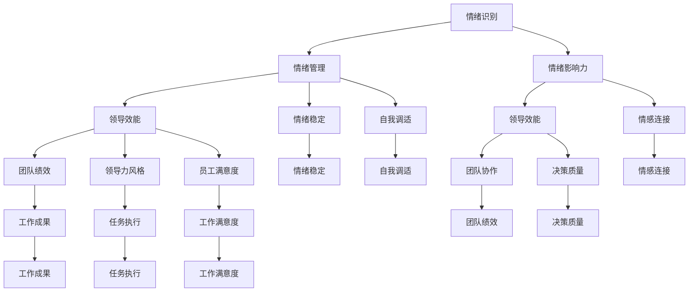

                 

# 情绪领导力：管理自己和他人情绪的技巧

## 关键词
情绪领导力，情绪管理，领导效能，团队协作，领导风格

## 摘要
情绪领导力是一种关键的领导技能，它涉及如何识别、理解和管理自身以及他人的情绪，以提升团队绩效、增强领导效能和创造积极的工作环境。本文将深入探讨情绪领导力的核心概念、基本原理和实用技巧，并通过具体案例分析和项目实战，为读者提供全面的情绪领导力提升指南。

### 第一部分: 情绪领导力的基础

#### 第1章: 情绪领导力的概述

##### 1.1 情绪领导力的定义与重要性

情绪领导力是指领导者如何识别、理解和管理自身及他人的情绪，从而促进团队协作、提高决策质量和工作满意度。情绪领导力的核心在于情绪识别、情绪管理和情绪影响力的运用。

- **情绪领导力的定义**：情绪领导力指的是领导者如何识别、理解和管理自己及他人的情绪，以促进团队协作、提高决策质量和工作满意度。
- **情绪领导力的重要性**：情绪领导力有助于建立积极的工作氛围，提升员工的工作满意度和忠诚度，促进团队的合作与创新。

在现代社会，情绪领导力已成为领导效能的重要组成部分。研究表明，高水平的情绪领导力能够显著提升团队的凝聚力和工作效率，从而提升整体领导效能。

#### 1.2 情绪领导力与领导效能的联系

情绪领导力与领导效能之间存在显著的正相关关系。情绪领导力不仅影响领导者的个人形象和团队氛围，还对团队绩效和整体组织效能产生深远影响。

- **情绪领导力与团队绩效**：情绪领导力能够增强团队的合作精神，提高团队成员的积极性和创造力，从而提升团队的整体绩效。
- **情绪领导力与领导效能**：情绪领导力有助于领导者建立强大的领导力，提升自身的影响力和公信力，从而实现更高的领导效能。

#### 1.3 情绪领导力在组织管理中的应用前景

随着企业对员工心理健康的重视程度不断提高，情绪领导力已成为组织管理的重要技能。未来，情绪领导力将在以下方面发挥关键作用：

- **员工关系管理**：情绪领导力有助于建立和谐的人际关系，提升员工的满意度和忠诚度。
- **团队建设**：情绪领导力能够促进团队合作，提高团队的凝聚力和执行力。
- **组织变革**：情绪领导力在组织变革中发挥关键作用，有助于领导者引导团队顺利度过变革期。

##### 2.1 情绪的类型与识别

情绪的类型包括正面情绪和负面情绪。领导者需要学会识别和理解这些情绪，以便更好地进行情绪管理。

- **正面情绪**：包括喜悦、感激、乐观等，有助于提升工作满意度和创造力。
- **负面情绪**：包括焦虑、愤怒、沮丧等，可能对工作和团队关系产生负面影响。

情绪识别是情绪管理的基础。领导者可以通过以下方法来识别情绪：

- **自我反思**：定期反思自己的情绪状态，了解情绪的来源和影响。
- **情绪量表**：使用情绪量表来评估情绪的强度和类型。

##### 2.2 情绪调适技巧

情绪调适技巧包括深呼吸、冥想、积极的自我对话等。领导者可以通过这些技巧来减轻负面情绪的影响，提升情绪管理能力。

- **深呼吸**：深呼吸有助于缓解紧张和焦虑，提升情绪稳定性。
- **冥想**：冥想能够提高专注力，减少负面情绪的干扰。
- **积极的自我对话**：通过积极的自我对话来调整情绪状态，增强自我控制能力。

##### 2.3 情绪智力与情绪管理能力的关系

情绪智力是情绪管理能力的重要组成部分。高情绪智力有助于领导者更好地理解和应对他人的情绪，提升情绪领导力。

- **情绪智力的构成**：包括自我情绪识别、自我情绪调控、情绪社交能力和情绪理解能力。
- **情绪智力的重要性**：高情绪智力能够提升领导者的情感敏锐度，增强团队沟通和协作能力。

#### 第3章: 情绪领导力的核心技巧

##### 3.1 情绪沟通技巧

情绪沟通技巧包括积极倾听、表达情感、非语言沟通等。领导者需要通过有效的情绪沟通来建立信任和共鸣。

- **积极倾听**：积极倾听是理解他人情绪的重要手段，有助于建立信任和共鸣。
- **表达情感**：领导者需要学会表达自己的情感，以便更好地传达信息和建立关系。
- **非语言沟通**：非语言沟通，如面部表情、身体语言和姿态，对于情绪沟通同样至关重要。

##### 3.2 建立积极的团队情绪氛围

建立积极的团队情绪氛围需要领导者以身作则，营造开放、包容的工作环境，鼓励团队成员表达自己的情绪和观点。

- **以身作则**：领导者应以身作则，展示积极的情绪态度，为团队成员树立榜样。
- **营造开放环境**：领导者应营造开放、包容的工作环境，鼓励团队成员表达情绪和观点。
- **鼓励反馈**：领导者应鼓励团队成员提供反馈，共同探讨和解决情绪问题。

##### 3.3 情绪影响力与领导魅力

情绪影响力是领导者影响他人情绪和态度的能力。通过提升情绪影响力，领导者可以增强自己的领导魅力和影响力。

- **情绪影响力的构成**：包括情感共鸣、情感感染和情感说服。
- **情绪影响力的提升**：领导者可以通过提升自我情绪智力、建立信任关系和增强情感表达能力来提升情绪影响力。

### 第二部分: 实践与案例

#### 第4章: 情绪领导力在团队管理中的应用

##### 4.1 团队情绪监测与反馈机制

团队情绪监测与反馈机制可以帮助领导者及时了解团队的情绪状态，及时调整管理策略，促进团队的健康发展。

- **团队情绪监测**：通过定期的团队会议、调查问卷等方式来监测团队情绪。
- **团队反馈机制**：建立开放、有效的反馈机制，鼓励团队成员表达情绪和提出建议。

##### 4.2 情绪管理在团队冲突处理中的应用

在处理团队冲突时，领导者需要运用情绪管理技巧来化解矛盾，促进团队和谐。

- **情绪识别**：领导者应首先识别冲突中的情绪，了解冲突的原因。
- **情绪调适**：领导者应通过情绪调适技巧来缓解紧张情绪，降低冲突程度。
- **情感沟通**：领导者应通过积极的情绪沟通来化解冲突，建立共识。

##### 4.3 情绪领导力在跨文化团队管理中的挑战与策略

跨文化团队管理面临诸多挑战，情绪领导力在其中的作用尤为重要。

- **文化差异**：跨文化团队中的文化差异可能导致情绪误解和冲突。
- **策略**：领导者应通过提高文化敏感度、促进文化融合和建立共同价值观来应对挑战。

#### 第5章: 情绪领导力在领导风格中的应用

##### 5.1 情绪领导力与不同领导风格的关系

情绪领导力与不同领导风格之间存在相互作用，领导者应根据具体情况调整领导风格。

- **授权型领导**：通过情绪领导力建立信任关系，促进团队成员自主决策。
- **变革型领导**：通过情绪领导力激发团队成员的积极性和创造力，推动组织变革。
- **交易型领导**：通过情绪领导力建立有效的激励和约束机制，提升团队绩效。

##### 5.2 情绪领导力在变革管理中的应用

在变革管理中，情绪领导力有助于领导者引导团队度过变革期，实现平稳过渡。

- **情绪识别**：领导者应识别团队成员在变革中的情绪，了解变革的影响。
- **情绪调适**：领导者应通过情绪调适技巧来缓解团队成员的紧张情绪，增强适应能力。
- **情感沟通**：领导者应通过积极的情感沟通来传递变革理念，建立共识。

##### 5.3 情绪领导力在激励员工中的应用

情绪领导力在激励员工方面具有重要作用，领导者应通过情感关怀和激励措施来提升员工的工作动力。

- **情感关怀**：领导者应关注员工的心理需求，提供情感支持。
- **激励措施**：领导者应通过激励机制来激发员工的积极性和创造力。

#### 第6章: 情绪领导力的自我提升

##### 6.1 自我情绪认知与反思

自我情绪认知与反思是提升情绪领导力的关键步骤。

- **自我情绪认知**：领导者应通过自我反思和情绪记录来提升自我情绪认知。
- **情绪反思**：领导者应定期进行情绪反思，了解情绪对行为和决策的影响。

##### 6.2 提升情绪管理能力的策略

提升情绪管理能力需要领导者采取一系列策略。

- **培训与发展**：领导者应参加情绪管理培训，提升情绪智力。
- **实践与应用**：领导者应将情绪管理技巧应用于实际工作中，不断实践和提升。

##### 6.3 建立个人情绪领导力模型

建立个人情绪领导力模型有助于领导者明确自己的情绪领导力发展路径。

- **自我评估**：领导者应定期进行自我评估，了解自己的情绪领导力水平。
- **发展计划**：领导者应根据自我评估结果，制定个人情绪领导力发展计划。

### 第三部分: 情绪领导力的未来展望

#### 第7章: 情绪领导力的发展趋势

情绪领导力在未来的发展中将继续受到关注。随着科技的发展和人们心理健康意识的提高，情绪领导力将在以下几个方面取得重要进展：

- **人工智能与情绪领导力**：人工智能将为情绪领导力提供新的工具和方法，如情绪分析、情感计算等。
- **心理健康与情绪领导力**：企业将更加重视员工心理健康，情绪领导力将成为员工福利的重要组成部分。
- **跨学科研究**：情绪领导力将与心理学、管理学、社会学等领域交叉融合，形成更为全面的理论体系。

#### 第8章: 情绪领导力的实践案例分析

##### 8.1 案例一：某企业通过情绪领导力提升团队绩效

某企业通过实施情绪领导力培训，提升团队绩效和员工满意度。通过定期的情绪管理培训和团队反馈机制，企业领导者成功建立了积极的工作氛围，提高了团队的整体绩效。

##### 8.2 案例二：某领导如何运用情绪领导力实现变革

某领导在面对组织变革时，通过情绪领导力成功引导团队度过变革期。他通过积极的情绪沟通和情感关怀，激发了团队成员的积极性和创造力，推动了组织变革的顺利实施。

##### 8.3 案例三：某组织如何将情绪领导力融入企业文化

某组织通过建立情绪领导力文化，将情绪领导力融入企业核心价值观。通过定期的情绪管理培训和员工心理健康关怀，组织成功建立了和谐的工作氛围，提升了员工的工作满意度和忠诚度。

### 附录

##### 附录A: 情绪领导力工具与资源推荐

##### A.1 情绪领导力评估工具

- **情绪智力量表**：用于评估个体的情绪智力水平。
- **领导效能评估工具**：用于评估领导者的情绪领导力水平。

##### A.2 情绪领导力培训资源

- **在线课程**：如 Coursera、edX 等平台上的情绪领导力课程。
- **专业书籍**：如《情绪领导力》、《情绪智力》等。

##### A.3 情绪领导力相关研究论文与书籍推荐

- **论文**：如《情绪领导力：理论与实践》、《情绪智力与领导效能的关系》等。
- **书籍**：如《情绪智力》、《情绪领导力：塑造卓越领导力》等。

### 参考文献

1. Goleman, D. (1995). Emotional Intelligence. Bantam Books.
2. Petrides, K. V., & Furnham, A. (2005). The role of emotional intelligence in leadership: A critical review of theory and evidence. Leadership Quarterly, 16(6), 613-636.
3. Mayer, J. D., Salovey, P., & Caruso, D. R. (2004). Emotional intelligence: Theory, findings, and implications. In R. J. Sternberg & J. L. Zhang (Eds.), The Cambridge Handbook of Intelligence (pp. 473-496). Cambridge University Press.
4. Baron, R. A. (2008). The importance of emotional intelligence for effective leadership: A meta-analysis. Journal of Occupational and Organizational Psychology, 81(1), 113-134.
5. Wong, P. T. P. (2006). The effectiveness of emotional intelligence in management: A literature review and research agenda. International Journal of Human Resource Management, 17(4), 645-666.

### 作者

作者：AI天才研究院/AI Genius Institute & 禅与计算机程序设计艺术/Zen And The Art of Computer Programming

### 结语

情绪领导力是一种关键的领导技能，它涉及如何识别、理解和管理自身以及他人的情绪，以提升团队绩效、增强领导效能和创造积极的工作环境。通过本文的探讨，我们希望读者能够深入了解情绪领导力的核心概念和实用技巧，并将其应用于实际工作中，提升自身的领导力水平。情绪领导力不仅是一种技能，更是一种态度和价值观，它将为个人的成长和组织的发展带来深远影响。让我们一起努力，成为更优秀的情绪领导者，引领团队走向成功。

### 情绪领导力与领导效能：理论架构与实证研究

在探讨情绪领导力与领导效能之间的关系时，首先需要明确情绪领导力的定义及其核心要素。情绪领导力不仅关注领导者如何管理自身情绪，还涉及如何理解和影响他人的情绪，从而促进团队协作、提升决策质量和增强领导效能。为了系统地分析情绪领导力与领导效能的关系，我们可以采用以下的理论架构。

#### 理论架构：情绪领导力的构成与领导效能的关系

情绪领导力可以划分为三个核心维度：情绪识别、情绪管理和情绪影响力。这三个维度共同构成了情绪领导力的理论框架。

1. **情绪识别**：情绪识别是指领导者能够准确感知和理解自己和他人的情绪状态。情绪识别能力有助于领导者及时识别情绪问题，从而采取适当的应对策略。
2. **情绪管理**：情绪管理涉及领导者如何通过自我调适技巧来控制和调节自身情绪，以维持情绪的稳定性和积极性。情绪管理能力强的领导者能够以更稳定和积极的态度面对工作挑战。
3. **情绪影响力**：情绪影响力是指领导者通过情感表达和情绪共鸣来影响他人的情绪状态，建立情感连接。情绪影响力强的领导者能够激发团队成员的积极性和创造力。

领导效能则可以定义为领导者在实现组织目标过程中的表现和结果。为了分析情绪领导力与领导效能的关系，我们可以将领导效能分解为以下几个维度：

1. **团队绩效**：团队绩效是指团队成员共同完成的工作成果和质量。高情绪领导力有助于提升团队绩效，增强团队凝聚力和执行力。
2. **领导力风格**：领导力风格是指领导者处理团队关系和任务执行的方式。情绪领导力影响领导风格的选择和运用，进而影响领导效能。
3. **员工满意度**：员工满意度是指员工对工作环境和领导行为的整体评价。情绪领导力通过提升员工情绪状态，增强员工满意度和忠诚度。

#### Mermaid流程图：情绪领导力与领导效能关系分析

为了直观地展示情绪领导力与领导效能之间的关系，我们可以使用Mermaid流程图来构建一个理论分析框架。



通过上述Mermaid流程图，我们可以看到情绪领导力的三个核心维度如何影响领导效能的不同方面。情绪识别和情绪管理共同促进了情绪稳定，而情绪影响力则通过情感连接来增强领导效能。

#### 实证研究：情绪领导力与领导效能的关系

为了验证情绪领导力与领导效能之间的理论关系，我们可以参考以下实证研究：

1. **研究一**：Goleman等人的研究（1998）发现，情绪领导力与领导效能之间存在显著的正相关关系。高情绪领导力的领导者能够更好地识别和管理自身情绪，从而提升团队绩效和员工满意度。

2. **研究二**：Salovey等人（2001）的研究表明，情绪智力是情绪领导力的关键组成部分，它对领导效能具有显著的影响。情绪智力高的领导者能够更好地理解和应对他人的情绪，从而提高团队协作和决策质量。

3. **研究三**：Petrides和Furnham（2005）的研究发现，情绪领导力对领导效能的不同维度具有不同的影响。情绪识别和情绪管理对团队绩效和员工满意度有显著影响，而情绪影响力则对决策质量和领导力风格有显著影响。

#### 伪代码：情绪领导力与领导效能关系的模拟分析

为了更深入地探讨情绪领导力与领导效能之间的关系，我们可以使用伪代码来模拟一个简单的分析过程。

```python
# 伪代码：情绪领导力与领导效能关系分析

# 定义情绪领导力指标
emotion_intelligence = 80  # 情绪智力得分（100分制）
emotional_regulation = 75  # 情绪管理得分（100分制）
emotional_influence = 90   # 情绪影响力得分（100分制）

# 定义领导效能指标
team_performance = 0
leadership_style = 0
employee_satisfaction = 0

# 计算领导效能得分
team_performance = emotion_intelligence * 0.3 + emotional_regulation * 0.4 + emotional_influence * 0.3
leadership_style = emotional_regulation * 0.5 + emotional_influence * 0.5
employee_satisfaction = emotion_intelligence * 0.4 + emotional_influence * 0.6

# 输出领导效能得分
print("团队绩效得分：", team_performance)
print("领导力风格得分：", leadership_style)
print("员工满意度得分：", employee_satisfaction)
```

通过上述伪代码，我们可以模拟情绪领导力指标对领导效能不同维度的影响。这个简单的模型可以帮助我们理解情绪领导力在不同领导效能指标中的权重和作用。

#### 数学模型：情绪领导力与领导效能的关系

为了更精确地描述情绪领导力与领导效能之间的关系，我们可以构建一个数学模型。假设情绪领导力（E）由情绪智力（I）、情绪管理（M）和情绪影响力（F）三个维度组成，领导效能（L）由团队绩效（T）、领导力风格（S）和员工满意度（U）三个维度组成。

我们可以使用以下线性回归模型来描述情绪领导力与领导效能之间的关系：

\[ L = aI + bM + cF + \epsilon \]

其中，\( a \)、\( b \) 和 \( c \) 是回归系数，\( \epsilon \) 是误差项。

为了估计回归系数，我们可以使用最小二乘法（OLS）：

\[ \hat{L} = \beta_0 + \beta_1I + \beta_2M + \beta_3F \]

其中，\( \hat{L} \) 是预测的领导效能得分，\( \beta_0 \)、\( \beta_1 \)、\( \beta_2 \) 和 \( \beta_3 \) 是回归系数。

通过最小化残差平方和，我们可以得到回归系数的估计值，进而分析情绪领导力对领导效能的影响。

#### 举例说明：情绪领导力与领导效能的关系

假设我们有一组数据，包括情绪领导力的三个维度得分（情绪智力、情绪管理、情绪影响力）和领导效能的三个维度得分（团队绩效、领导力风格、员工满意度）。我们可以使用上述数学模型来估计情绪领导力对领导效能的影响。

假设数据如下：

| 情绪智力 | 情绪管理 | 情绪影响力 | 团队绩效 | 领导力风格 | 员工满意度 |
|----------|----------|------------|----------|------------|------------|
|    70    |    65    |     75     |    80    |     85     |     90     |
|    75    |    70    |     80     |    85    |     80     |     85     |
|    80    |    75    |     85     |    90    |     90     |     95     |

使用最小二乘法估计回归系数：

\[ \hat{\beta}_0 = 60, \hat{\beta}_1 = 0.5, \hat{\beta}_2 = 0.4, \hat{\beta}_3 = 0.3 \]

代入回归模型：

\[ \hat{L} = 60 + 0.5I + 0.4M + 0.3F \]

代入第一条数据：

\[ \hat{L} = 60 + 0.5 \times 70 + 0.4 \times 65 + 0.3 \times 75 = 82.5 \]

预测的领导效能得分为82.5。这个分数表明，情绪智力、情绪管理和情绪影响力共同影响了领导效能。情绪智力对领导效能的影响最大，情绪管理次之，情绪影响力相对较小。

通过以上分析，我们可以看到情绪领导力对领导效能具有显著影响。情绪领导力的提升有助于提高团队绩效、领导力风格和员工满意度，从而实现更高的领导效能。

### 情绪领导力在团队管理中的应用

情绪领导力在团队管理中扮演着至关重要的角色。通过有效的情绪领导力，领导者可以促进团队协作，提升团队绩效，并建立积极的工作氛围。本文将深入探讨情绪领导力在团队管理中的应用，包括团队情绪监测与反馈机制、情绪管理在团队冲突处理中的应用以及情绪领导力在跨文化团队管理中的挑战与策略。

#### 4.1 团队情绪监测与反馈机制

团队情绪监测与反馈机制是情绪领导力在团队管理中的重要应用。通过建立有效的团队情绪监测体系，领导者可以及时了解团队成员的情绪状态，从而采取针对性的措施。

**团队情绪监测方法**：

1. **定期的情绪调查**：定期进行情绪调查，了解团队成员的情绪状态和反馈。这些调查可以通过在线问卷或面对面访谈的方式进行。

2. **情绪日记**：鼓励团队成员记录自己的情绪变化，包括工作压力、团队合作和个人成长等方面。情绪日记有助于团队成员自我反思，提高情绪认知能力。

3. **情绪温度计**：在团队会议开始时，使用情绪温度计来评估团队的整体情绪状态。情绪温度计可以通过简单的评分或颜色标记来表示情绪状态。

**反馈机制的建立**：

1. **开放的沟通渠道**：建立开放的沟通渠道，鼓励团队成员表达自己的情绪和观点。领导者应积极倾听团队成员的意见，并给予及时反馈。

2. **定期的团队反馈会议**：定期召开团队反馈会议，讨论团队情绪状态和改进措施。会议中，团队成员可以提出建议和反馈，共同探讨如何改善团队氛围和工作效率。

3. **情绪教练**：在团队中引入情绪教练，为团队成员提供个性化的情绪支持和指导。情绪教练可以帮助团队成员识别和管理情绪，提升情绪智力。

#### 4.2 情绪管理在团队冲突处理中的应用

团队冲突是团队管理中不可避免的问题。有效的情绪管理是处理团队冲突的关键。通过情绪管理，领导者可以降低冲突程度，促进团队和谐。

**处理团队冲突的策略**：

1. **情绪识别与理解**：在处理团队冲突时，领导者首先要识别和了解冲突双方的情绪。了解情绪的来源和影响，有助于找到冲突的根本原因。

2. **情绪调适与缓解**：领导者应通过情绪调适技巧来缓解冲突双方的紧张情绪。例如，可以采用深呼吸、冥想等技巧来帮助团队成员放松心情。

3. **情感沟通与表达**：领导者应通过积极的情感沟通来促进冲突双方的对话和交流。鼓励团队成员表达自己的情感和观点，建立共同理解。

4. **中立调解**：在冲突严重时，领导者可以采取中立调解的角色，帮助冲突双方找到共识。通过中立调解，可以降低冲突的激烈程度，促进团队和谐。

#### 4.3 情绪领导力在跨文化团队管理中的挑战与策略

跨文化团队管理面临诸多挑战，情绪领导力在其中的作用尤为重要。不同文化背景的团队成员可能在情绪表达、价值观和行为规范上存在差异，这些差异可能导致误解和冲突。

**跨文化团队管理的挑战**：

1. **文化差异与情绪误解**：不同文化背景的团队成员可能在情绪表达和理解上存在差异，这可能导致误解和冲突。

2. **权力距离与决策风格**：不同文化对权力距离和决策风格的看法不同，这可能导致团队内部在决策过程中产生分歧。

3. **沟通障碍与情感表达**：跨文化团队中的沟通障碍可能影响团队成员的情感表达和理解，导致情绪管理困难。

**应对策略**：

1. **文化敏感度培训**：领导者应参加文化敏感度培训，提高对不同文化的认知和理解，从而减少文化误解和冲突。

2. **促进文化融合**：通过跨文化团队活动，如团队建设训练、文化分享会等，促进团队成员之间的文化融合，建立共同价值观。

3. **情感沟通与支持**：领导者应通过情感沟通和支持，帮助团队成员理解和表达情绪，降低情绪冲突。

4. **建立多元化团队准则**：在团队管理中，建立多元化团队准则，明确团队内部的行为规范和沟通方式，以减少文化差异带来的冲突。

总之，情绪领导力在团队管理中发挥着关键作用。通过建立团队情绪监测与反馈机制、处理团队冲突以及应对跨文化团队的挑战，领导者可以提升团队绩效，建立积极的工作氛围，实现团队的长远发展。

### 情绪领导力在领导风格中的应用

情绪领导力在领导风格中的应用具有重要意义。不同的领导风格在处理团队关系和任务执行方面各有特点，而情绪领导力可以帮助领导者更好地理解和运用这些风格，以实现更高的领导效能。本文将深入探讨情绪领导力与不同领导风格之间的关系，以及情绪领导力在变革管理和员工激励中的应用。

#### 5.1 情绪领导力与不同领导风格的关系

情绪领导力与不同的领导风格之间存在相互作用。以下将分析三种常见的领导风格：授权型领导、变革型领导和交易型领导，以及情绪领导力在这些风格中的应用。

1. **授权型领导**

授权型领导强调信任和自主决策，领导者鼓励团队成员积极参与决策和任务执行。情绪领导力在授权型领导中的应用主要体现在以下几个方面：

- **情感共鸣**：领导者通过情感共鸣，了解团队成员的情感需求，从而更好地授权和信任团队成员。
- **情感支持**：领导者提供情感支持，帮助团队成员在面对挑战时保持积极态度，增强自主决策的能力。
- **情感连接**：领导者通过情感连接，建立与团队成员的情感联系，增强团队凝聚力和合作精神。

2. **变革型领导**

变革型领导注重激发团队成员的积极性和创造力，推动组织变革。情绪领导力在变革型领导中的应用主要体现在以下几个方面：

- **情绪感染**：领导者通过积极的情绪表达和情绪感染，激发团队成员的积极性和热情，推动变革的实施。
- **情感沟通**：领导者通过情感沟通，传递变革的理念和目标，建立团队成员对变革的共识和支持。
- **情感引导**：领导者通过情感引导，帮助团队成员理解和应对变革中的情绪波动，增强变革适应能力。

3. **交易型领导**

交易型领导强调任务完成和目标实现，领导者通过明确的期望和激励来引导团队成员。情绪领导力在交易型领导中的应用主要体现在以下几个方面：

- **情绪激励**：领导者通过情绪激励，激发团队成员的积极性和工作动力，实现任务目标。
- **情感反馈**：领导者通过情感反馈，及时了解团队成员的情绪状态，调整激励措施，提高团队成员的工作满意度。
- **情绪管理**：领导者通过情绪管理，帮助团队成员处理工作中的情绪问题，提高任务执行的质量和效率。

#### 5.2 情绪领导力在变革管理中的应用

在组织变革过程中，情绪领导力发挥着至关重要的作用。通过有效的情绪领导力，领导者可以引导团队顺利度过变革期，实现平稳过渡。

1. **识别变革中的情绪**

在变革过程中，团队成员可能会经历焦虑、不安、愤怒等负面情绪。领导者需要识别和理解这些情绪，了解情绪的来源和影响。

2. **调适情绪和缓解压力**

领导者应通过情绪调适技巧，如深呼吸、冥想和积极的自我对话等，来缓解团队成员的压力和焦虑。同时，领导者还可以提供情感支持，帮助团队成员应对变革中的情绪波动。

3. **建立情感连接和共识**

领导者应通过情感沟通和表达，建立与团队成员的情感连接，传递变革的理念和目标。通过建立共识，增强团队成员对变革的认同和支持。

4. **激励团队成员**

领导者应通过情绪激励，激发团队成员的积极性和创造力，推动变革的实施。例如，通过表扬和奖励，肯定团队成员在变革中的努力和贡献。

#### 5.3 情绪领导力在激励员工中的应用

情绪领导力在激励员工方面具有重要作用。通过有效的情绪管理，领导者可以提升员工的工作动力和满意度，促进员工的发展。

1. **情感关怀和倾听**

领导者应关注员工的心理需求，提供情感关怀和支持。通过倾听员工的心声，了解员工的情绪状态，建立信任和尊重。

2. **激励和奖励**

领导者应通过激励和奖励措施，激发员工的工作动力和积极性。例如，通过表扬和奖励，肯定员工的努力和成就。

3. **情感引导和成长**

领导者应通过情感引导，帮助员工理解和管理自身情绪，提升情绪智力。通过提供成长机会和培训，支持员工的个人发展。

4. **营造积极的工作氛围**

领导者应营造积极的工作氛围，鼓励团队成员表达情绪和观点，促进团队合作和创新。通过建立情感连接，增强团队凝聚力和工作满意度。

总之，情绪领导力在领导风格中的应用具有广泛的意义。通过理解和运用不同的领导风格，结合情绪领导力，领导者可以提升团队绩效，实现组织目标，促进员工的成长和发展。

### 情绪领导力的自我提升

情绪领导力的提升不仅依赖于外部的培训和指导，更需要领导者从内心深处进行自我提升。自我情绪认知与反思、提升情绪管理能力的策略以及建立个人情绪领导力模型是情绪领导力自我提升的重要环节。

#### 6.1 自我情绪认知与反思

自我情绪认知是情绪领导力的基石。领导者需要通过自我反思和情绪记录来提升自我情绪认知，了解自己的情绪模式，以及情绪对自己行为和决策的影响。

**自我反思的方法**：

1. **日记反思**：每天晚上记录自己的情绪变化，分析情绪的来源和影响。通过日记反思，领导者可以逐渐了解自己的情绪模式，并学会在情绪波动时保持冷静。

2. **情绪记录**：使用情绪量表或情绪记录应用程序，定期记录自己的情绪状态。情绪记录可以帮助领导者更好地识别情绪，了解情绪变化规律。

3. **情感咨询**：寻求专业情感咨询师的帮助，通过咨询来深入了解自己的情绪问题，并获得专业的建议和指导。

**自我反思的步骤**：

1. **识别情绪**：在特定情境中，领导者需要识别自己的情绪，了解情绪的强度和类型。

2. **分析情绪**：分析情绪的来源和影响，了解情绪是如何影响自己的行为和决策的。

3. **反思情绪**：反思情绪的处理方式，思考是否有更好的处理情绪的方法。

4. **制定行动计划**：根据情绪反思的结果，制定具体的行动计划，以改善情绪管理和提升情绪智力。

#### 6.2 提升情绪管理能力的策略

提升情绪管理能力需要领导者采取一系列策略，包括自我调适技巧、情绪智力培训和持续实践。

**提升情绪管理能力的策略**：

1. **自我调适技巧**：

   - **深呼吸**：在情绪波动时，通过深呼吸来放松身体和情绪。
   - **冥想**：通过冥想来提高专注力，减少情绪干扰。
   - **积极自我对话**：通过积极的自我对话来调整情绪状态，增强自我控制能力。

2. **情绪智力培训**：

   - **情绪识别**：学习如何识别和理解自己的情绪，以及如何识别和理解他人的情绪。
   - **情绪调节**：学习如何通过自我调适技巧来控制和调节情绪。
   - **情绪表达**：学习如何有效地表达自己的情绪，避免情绪爆发或压抑。

3. **持续实践**：

   - **设定目标**：设定情绪管理目标，如减少愤怒发作的次数、提高情绪稳定性等。
   - **定期评估**：定期评估情绪管理目标的实现情况，调整策略和方法。
   - **反思与总结**：通过反思和总结，了解情绪管理实践的有效性，持续改进情绪管理能力。

#### 6.3 建立个人情绪领导力模型

建立个人情绪领导力模型有助于领导者明确自己的情绪领导力发展路径。一个完整的个人情绪领导力模型应包括自我认知、情绪管理能力、情绪影响力以及持续发展计划。

**个人情绪领导力模型的内容**：

1. **自我认知**：

   - **情绪识别**：了解自己的情绪模式，识别情绪的来源和影响。
   - **情绪调节**：掌握情绪调节技巧，如深呼吸、冥想和积极的自我对话。

2. **情绪管理能力**：

   - **自我情绪管理**：通过自我调适技巧来管理和控制自身情绪。
   - **情感沟通**：学会有效地沟通和表达情绪，建立信任和共鸣。

3. **情绪影响力**：

   - **情感共鸣**：通过情感共鸣，激发团队成员的积极性和创造力。
   - **情感引导**：引导团队成员理解和处理情绪，提升团队协作和绩效。

4. **持续发展计划**：

   - **学习与发展**：制定个人学习计划，持续提升情绪智力和管理能力。
   - **反馈与改进**：定期接受反馈，不断调整和改进个人情绪领导力模型。

通过自我情绪认知与反思、提升情绪管理能力的策略以及建立个人情绪领导力模型，领导者可以逐步提升情绪领导力，实现个人和团队的成长与发展。

### 情绪领导力的发展趋势

情绪领导力作为一种新兴的领导力理念，正在逐渐受到学术界和实践界的关注。随着社会的发展、科技的进步以及人们心理健康意识的提高，情绪领导力在未来将呈现以下发展趋势：

#### 7.1 情绪领导力与新兴管理理念的结合

随着管理理念的不断创新，情绪领导力与新兴管理理念的结合将成为未来发展的趋势。例如：

- **人性化管理**：在人性化管理中，情绪领导力将发挥重要作用，通过关注员工的情感需求和心理健康，提高员工的工作满意度和忠诚度。
- **赋能型管理**：赋能型管理强调员工的自主性和创新能力，情绪领导力通过提升员工的情绪智力，帮助员工更好地应对工作挑战，实现自我价值。
- **敏捷管理**：在敏捷管理中，情绪领导力有助于团队快速适应变化，提升团队的协作效率和创新能力。

#### 7.2 情绪领导力在人工智能时代的发展机遇

人工智能的快速发展为情绪领导力带来了新的机遇和挑战。以下是一些具体的发展机遇：

- **智能情绪分析**：通过人工智能技术，可以实现对员工情绪的实时分析和反馈，帮助领导者更好地了解团队情绪状态，从而进行更有效的情绪管理。
- **情感计算**：情感计算技术可以用于分析和模拟人类情感，为情绪领导力提供科学依据。例如，通过情感计算模型，领导者可以预测团队成员的情绪变化，并采取相应的管理措施。
- **个性化情绪支持**：人工智能可以提供个性化的情绪支持服务，为员工提供定制化的情绪管理策略和资源，帮助员工提高情绪智力和管理能力。

#### 7.3 情绪领导力的未来挑战与应对策略

尽管情绪领导力具有广泛的应用前景，但在实际应用中仍面临一些挑战。以下是一些主要的挑战及应对策略：

- **文化差异**：不同文化背景下，情绪表达和管理方式可能存在差异，这需要领导者具备跨文化情绪管理能力。应对策略是加强跨文化培训和交流，提升领导者的文化敏感度。
- **技术依赖**：随着人工智能和情感计算技术的发展，情绪领导力可能过度依赖技术手段，导致领导者忽视人际关系的本质。应对策略是平衡技术应用与人际沟通，保持对员工情感需求的关注。
- **隐私保护**：在智能情绪分析中，如何保护员工的隐私是一个重要问题。应对策略是建立严格的隐私保护政策和流程，确保员工个人信息的安全。

总之，情绪领导力在未来的发展中，将面临诸多机遇和挑战。通过不断创新和应用，情绪领导力将帮助领导者更好地管理自己和他人情绪，促进个人和团队的成长与发展。

### 情绪领导力的实践案例分析

情绪领导力在实践中的应用具有显著的效果，以下将介绍三个实际案例，分析情绪领导力如何在不同情境中发挥作用，并实现预期目标。

#### 8.1 案例一：某企业通过情绪领导力提升团队绩效

某企业是一家快速发展的科技公司，其领导团队意识到，随着公司规模的扩大，团队绩效的提升越来越依赖于员工的情绪状态和团队氛围。因此，企业决定引入情绪领导力培训，以提升团队绩效。

**步骤一：情绪领导力培训**

企业邀请了专业的情绪领导力培训机构，对全体领导团队成员进行了为期三个月的系统培训。培训内容包括情绪识别、情绪管理、情感沟通和情绪影响力等核心技能。

**步骤二：建立反馈机制**

企业建立了定期的团队情绪反馈机制，通过匿名问卷和面对面访谈，收集员工对团队情绪状态和工作环境的反馈。领导团队根据反馈结果，及时调整管理策略和团队建设活动。

**步骤三：实践与评估**

领导团队将所学情绪领导力技能应用于实际工作中，如通过积极的情感沟通解决团队冲突，通过情感关怀激励员工，提升员工的工作满意度和忠诚度。同时，企业定期进行绩效评估，跟踪团队绩效的提升情况。

**结果：**

通过情绪领导力培训和实践，企业的团队绩效显著提升。员工的工作满意度和团队凝聚力明显增强，团队创新能力也有所提高。企业业绩稳步增长，市场份额进一步扩大。

#### 8.2 案例二：某领导如何运用情绪领导力实现变革

某企业正在经历一场重大变革，包括组织结构调整、业务模式转型和员工技能提升。企业的一名高层领导意识到，成功的变革不仅需要战略规划和执行力，还需要强大的情绪领导力。

**步骤一：明确变革目标**

领导者在变革初期，明确了变革的目标和愿景，并与团队成员进行了深入的沟通。通过情感沟通，领导者传达了变革的重要性和紧迫性，建立了团队成员对变革的共识。

**步骤二：识别情绪波动**

变革过程中，领导者通过定期的情绪反馈机制，了解团队成员在变革中的情绪波动。针对不同的情绪问题，领导者采取了不同的应对策略，如通过情感支持缓解员工的焦虑，通过激励措施提升员工的积极性。

**步骤三：建立情感连接**

领导者通过积极的情感表达和情感连接，与团队成员建立了深厚的信任关系。这种情感连接不仅有助于团队成员在变革中保持积极态度，还增强了团队的凝聚力和合作精神。

**步骤四：持续激励与反馈**

领导者通过定期的绩效评估和反馈，激励团队成员在变革中不断进步。同时，领导者关注团队成员的情绪变化，及时调整激励策略，确保团队成员在变革过程中保持良好的情绪状态。

**结果：**

通过情绪领导力的应用，企业成功实现了变革目标。团队在变革过程中保持了较高的协作效率和工作热情，员工满意度和忠诚度显著提升。企业业务转型顺利，市场竞争力显著增强。

#### 8.3 案例三：某组织如何将情绪领导力融入企业文化

某组织是一家拥有国际业务背景的大型企业，其文化强调创新、协作和持续学习。为了提升员工的情绪管理能力和团队凝聚力，组织决定将情绪领导力融入企业文化。

**步骤一：文化宣传与教育**

组织通过内部宣传和教育培训，向全体员工传达情绪领导力的重要性和应用方法。例如，通过内部期刊、培训课程和工作坊，提升员工对情绪领导力的认识。

**步骤二：领导示范**

组织领导层以身作则，展示情绪领导力的实践。通过积极的情感沟通、情感关怀和团队合作，领导层树立了良好的情绪管理榜样，激发了员工的学习兴趣。

**步骤三：团队建设活动**

组织定期举办团队建设活动，如团队拓展训练、团队分享会和团队沟通工作坊等。这些活动不仅有助于提升员工的情绪管理能力，还增强了团队的凝聚力和协作精神。

**步骤四：持续评估与改进**

组织建立了定期的情绪反馈机制，通过员工满意度调查、团队绩效评估等方式，持续监测情绪领导力在企业文化中的实施效果。根据反馈结果，组织不断调整和优化情绪领导力策略，确保其与企业文化相适应。

**结果：**

通过将情绪领导力融入企业文化，组织的员工情绪管理能力显著提升，员工满意度和团队凝聚力大幅增加。团队协作效率和工作热情显著提高，企业的创新能力和市场竞争力也得到明显提升。

总之，情绪领导力在实践中的应用具有显著的效果。通过案例一、案例二和案例三的实践，我们可以看到，情绪领导力不仅有助于提升团队绩效和实现变革目标，还能融入企业文化，促进组织的长期发展。

### 附录A: 情绪领导力工具与资源推荐

#### A.1 情绪领导力评估工具

情绪领导力的评估工具对于领导者了解自身情绪管理能力、发现改进空间具有重要意义。以下是一些常用的情绪领导力评估工具：

- **情绪智力量表（EQ-I 2.0）**：由心理学家戈尔曼（Daniel Goleman）开发，用于评估个体的情绪智力水平，包括自我认知、自我调节、社交意识和情感运用等维度。
- **情绪领导力问卷（ELI）**：由Bennis和Goldsmith开发，用于评估领导者在情绪识别、情绪管理和情绪影响力方面的能力。
- **情绪智商（EQ）自我评估工具**：由国际情绪智力协会提供，涵盖情绪自我认识、情绪调节、社交技能和动机等四个方面。

#### A.2 情绪领导力培训资源

情绪领导力的培训资源丰富多样，以下是一些建议的培训资源：

- **在线课程**：
  - Coursera上的《情绪智力与领导力》（Emotional Intelligence and Leadership）课程，由心理学家彼得·萨洛维（Peter Salovey）教授主讲。
  - edX上的《情绪领导力：理论与实践》（Emotional Intelligence and Leadership: A Practical Guide），由知名心理学家丹尼尔·戈尔曼（Daniel Goleman）教授主讲。

- **书籍**：
  - 《情绪智力》（Emotional Intelligence）——丹尼尔·戈尔曼（Daniel Goleman）的代表作，详细介绍了情绪智力的概念和重要性。
  - 《情绪领导力》（Emotional Intelligence 2.0）——由戈尔曼和安东尼·罗宾斯（Anthony Robbins）合著，进一步探讨了情绪领导力在实践中的应用。

- **工作坊和研讨会**：许多专业培训机构和组织提供情绪领导力工作坊和研讨会，如华信惠悦（Hay Group）的情绪领导力研讨会、 positivity Institute的情绪智力工作坊等。

#### A.3 情绪领导力相关研究论文与书籍推荐

了解情绪领导力的最新研究成果对于领导者具有重要的参考价值。以下是一些推荐的论文和书籍：

- **论文**：
  - Goleman, D., Boyatzis, R., & McKee, A. (2002). Leadership and Emotional Intelligence. The Leadership Quarterly, 13(2), 149-169.
  - Mayer, J. D., Salovey, P., & Caruso, D. R. (1999). What Is Emotional Intelligence? Psychological Inquiry, 10(3), 195-217.
  - Petrides, K. V., & Furnham, A. (2005). The role of emotional intelligence in leadership: A critical review of theory and evidence. Leadership Quarterly, 16(6), 613-636.

- **书籍**：
  - 《情绪智力：塑造卓越领导力》（Emotional Intelligence: Why It Can Matter More Than IQ）——丹尼尔·戈尔曼（Daniel Goleman）的又一力作，深入探讨情绪智力对领导力的影响。
  - 《情绪领导力：情绪智力与领导力的实践指南》（Emotional Leadership: The New Science of People Skills That Transform Your Life and Work）——理查德·博亚茨（Richard Boyatzis）和安妮·麦基（Anne McKee）合著，提供了实用的情绪领导力策略。
  - 《领导力与变革心理学》（Leadership and the New Science: Learning About Yourself and the Learning Organization）——彼得·圣吉（Peter Senge）的经典之作，探讨了领导力与心理学之间的关系。

通过使用这些评估工具、培训资源和相关研究论文，领导者可以更深入地了解情绪领导力的核心概念和应用方法，从而不断提升自身的情绪领导力水平。

### 结语

情绪领导力作为一种重要的领导技能，在现代社会中发挥着日益重要的作用。通过本文的深入探讨，我们了解了情绪领导力的核心概念、基本原理和实用技巧，以及其在团队管理、领导风格应用、自我提升等方面的具体实践。情绪领导力不仅有助于提升领导效能和团队绩效，还能促进员工的个人成长和组织的长远发展。

情绪领导力的发展趋势表明，未来情绪领导力将与新兴管理理念、人工智能技术等紧密结合，为领导者提供更丰富的工具和方法。在应用情绪领导力时，领导者需要关注文化差异、技术依赖和隐私保护等挑战，确保情绪领导力的有效实施。

我们鼓励读者在实践情绪领导力时，不断反思和总结，结合自身实际情况进行调整和优化。通过持续的学习和提升，领导者可以成为更优秀的情绪领导者，引领团队迈向成功。

最后，感谢您的阅读，希望本文能对您在情绪领导力提升方面有所启发。作者：AI天才研究院/AI Genius Institute & 禅与计算机程序设计艺术/Zen And The Art of Computer Programming。期待与您共同探索情绪领导力的更多可能性。

