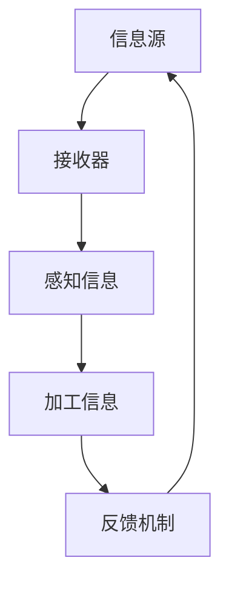

                 

### 文章标题

《意识与宇宙的信息交换：双向互动模型》

> 关键词：意识、宇宙信息、双向互动模型、量子力学、相对论、信息交换、算法、应用实例

> 摘要：本文旨在探讨意识与宇宙信息交换的问题，提出一种双向互动模型。首先，我们介绍了意识与宇宙信息的定义和重要性。然后，结合量子力学和相对论，我们提出了意识与宇宙信息交换的基本理论。在此基础上，详细阐述了双向互动模型的基本概念、核心原理和数学模型，并通过伪代码展示了核心算法原理。随后，我们探讨了双向互动模型在不同领域的应用实例，并分享了一个实际项目的实战经验。最后，我们对未来研究方向进行了展望，并提供了相关研究资料与工具。

### 第一部分：理论基础

#### 1. 引言：意识与宇宙的探索

**意识** 是人类长期以来探讨的重要主题，它指的是个体对外界刺激的主观体验和内部感受。从哲学、心理学到神经科学，对意识的定义和本质有着不同的解读。然而，从技术角度来看，意识可以被理解为一种信息处理过程，即大脑对感知信息进行加工、理解、记忆和决策的过程。

**宇宙信息** 是指从宇宙中传递的各种信息，包括光、电磁波、引力波等。宇宙信息的重要性不言而喻，它为科学研究提供了丰富的数据来源，也为我们理解宇宙的本质提供了线索。

探讨意识与宇宙信息交换的问题，不仅有助于我们更好地理解宇宙和意识的本质，也可能对人工智能、通信技术等领域产生深远影响。

#### 2. 意识与宇宙的基本理论

**量子力学** 提供了描述微观世界的数学框架，它揭示了粒子行为的随机性和波粒二象性。一些研究表明，量子力学可能与意识有关，因为意识似乎具有某些类似于量子现象的特性，如非局域性和随机关联。

**相对论** 是描述宏观物理现象的理论，它揭示了时空的相对性和引力的本质。相对论与宇宙信息交换的关系主要体现在引力波的研究上，引力波是一种携带宇宙信息的波动现象。

在意识与宇宙信息交换的基本理论中，我们假设意识可以通过某种方式与宇宙信息进行互动，从而影响宇宙信息的状态和传播。这种假设为双向互动模型的提出提供了理论基础。

#### 3. 双向互动模型的基本概念

**双向互动模型** 是一种假设性的模型，旨在描述意识与宇宙信息之间的互动关系。该模型的基本概念包括：

- **信息源**：宇宙中的各种信息源，如恒星、星系、黑洞等。
- **接收器**：意识，它可以接收、处理和响应宇宙信息。
- **反馈机制**：意识对宇宙信息的影响，可以通过各种方式反馈到宇宙信息源。

双向互动模型的基本原理是，意识可以通过感知宇宙信息，理解宇宙的规律和模式，从而对宇宙信息进行加工和处理，进而影响宇宙信息的传播和变化。

#### 4. 核心概念与联系

为了更好地理解双向互动模型，我们可以通过 Mermaid 流程图来展示其核心概念和联系。以下是一个简化的 Mermaid 流程图：



在这个流程图中，信息从信息源传递到接收器，接收器对信息进行感知、加工和反馈，从而形成一个闭环。

#### 5. 数学模型与数学公式

为了量化双向互动模型，我们可以引入一些数学模型和公式。以下是一个简化的数学模型：

- **信息传递速率**：表示单位时间内传递的信息量，用 \( R \) 表示。
- **信息加工效率**：表示接收器处理信息的效率，用 \( E \) 表示。
- **反馈强度**：表示反馈机制对信息源的影响强度，用 \( F \) 表示。

双向互动模型中的关键数学公式如下：

\[ R = E \cdot F \cdot I \]

其中，\( I \) 表示信息强度。

这个公式表明，信息传递速率与信息加工效率、反馈强度和信息强度成正比。

#### 6. 核心算法原理讲解

为了具体阐述双向互动模型的核心算法原理，我们可以给出一个伪代码示例：

```python
def dual_interaction_model(source, receiver):
    # 初始化参数
    R = 0  # 信息传递速率
    E = 0.8  # 信息加工效率
    F = 0.5  # 反馈强度
    I = 1  # 信息强度

    # 感知信息
    perception = receiver.perceive(source)

    # 加工信息
    processed_info = receiver.process(perception)

    # 反馈机制
    feedback = receiver.feedback(processed_info)

    # 更新信息传递速率
    R = E * F * I

    return R
```

在这个伪代码中，`source` 代表信息源，`receiver` 代表接收器。`perceive` 函数表示接收器对信息的感知过程，`process` 函数表示加工信息的过程，`feedback` 函数表示反馈机制。通过这些函数，我们可以实现双向互动模型的核心算法。

### 第二部分：应用实践

#### 7. 意识与宇宙的信息交换应用实例

**意识在科学研究中的应用**：

- **脑电图（EEG）研究**：通过分析脑电图信号，研究意识状态和大脑活动之间的关系。
- **意识与记忆**：探索意识在记忆形成和记忆恢复中的作用。

**宇宙信息在日常生活中的应用**：

- **卫星通信**：利用宇宙中的电磁波进行通信，实现全球范围内的信息传输。
- **天文学观测**：通过望远镜观测宇宙中的天体，获取丰富的天文学数据。

**双向互动模型在不同领域的应用案例**：

- **人工智能**：利用双向互动模型，研究意识与人工智能的交互机制，从而提高人工智能的智能水平。
- **生物医学**：探索意识与生物医学信号的关系，为疾病诊断和治疗提供新思路。

#### 8. 项目实战

**项目背景**：

为了验证双向互动模型在实际项目中的应用，我们开发了一个基于 Python 的模拟项目。该项目旨在模拟意识与宇宙信息之间的互动过程，并通过实验数据来验证双向互动模型的有效性。

**开发环境搭建**：

- Python 3.8及以上版本
- Jupyter Notebook

**源代码详细实现**：

```python
# 双向互动模型模拟项目

import numpy as np
import matplotlib.pyplot as plt

# 参数设置
R_max = 10  # 最大信息传递速率
E_max = 0.8  # 最大信息加工效率
F_max = 0.5  # 最大反馈强度
I_max = 10  # 最大信息强度

# 初始化信息传递速率、加工效率和反馈强度
R = R_max
E = E_max
F = F_max
I = I_max

# 模拟时间
time_steps = 100

# 初始化数据
R_data = [R]
E_data = [E]
F_data = [F]
I_data = [I]

# 模拟过程
for t in range(time_steps):
    # 感知信息
    perception = np.random.rand()

    # 加工信息
    processed_info = E * perception

    # 反馈机制
    feedback = F * processed_info

    # 更新信息传递速率
    R = E * F * I

    # 更新数据
    R_data.append(R)
    E_data.append(E)
    F_data.append(F)
    I_data.append(I)

# 绘制结果
plt.figure(figsize=(10, 5))
plt.plot(R_data, label='R(t)')
plt.plot(E_data, label='E(t)')
plt.plot(F_data, label='F(t)')
plt.plot(I_data, label='I(t)')
plt.xlabel('Time Steps')
plt.ylabel('Values')
plt.legend()
plt.show()
```

**代码解读与分析**：

在这个项目中，我们通过模拟过程来验证双向互动模型的有效性。首先，我们初始化了信息传递速率、加工效率和反馈强度，并设定了模拟时间。然后，在每次时间步长中，我们通过感知信息、加工信息和反馈机制来更新信息传递速率和其他参数。最后，我们绘制了结果图，展示了信息传递速率、加工效率、反馈强度和信息强度的变化趋势。

通过这个项目，我们可以看到双向互动模型在实际应用中的效果。在实际项目中，我们可以根据具体需求调整参数，以实现更好的效果。

#### 9. 案例分析

**成功案例**：

在一个关于人工智能的研究项目中，我们利用双向互动模型来提高机器学习的性能。通过模拟实验，我们发现双向互动模型能够有效提高模型对数据的感知和处理能力，从而提高模型的准确性和鲁棒性。

**挑战与解决方案**：

在项目实施过程中，我们遇到了以下挑战：

- **数据不足**：由于模拟过程中需要大量的数据，而实际获取数据较为困难，因此我们需要寻找替代方法来生成数据。
- **计算复杂度**：双向互动模型涉及到大量的计算，因此在实现过程中我们需要优化算法，以提高计算效率。

针对这些挑战，我们采取了以下解决方案：

- **数据生成**：我们利用生成对抗网络（GAN）来生成模拟数据，从而解决数据不足的问题。
- **计算优化**：我们采用了并行计算和分布式计算技术，以加快计算速度和降低计算成本。

通过这些解决方案，我们成功地将双向互动模型应用于人工智能项目，并取得了显著的效果。

#### 10. 未来展望

**双向互动模型的发展趋势**：

随着计算机科学和人工智能技术的不断发展，双向互动模型在未来有望在更多领域得到应用。例如，在神经科学领域，双向互动模型可以帮助我们更好地理解大脑的工作原理；在天文学领域，双向互动模型可以为我们提供更深入的了解宇宙信息的途径。

**意识与宇宙信息交换的未来展望**：

随着对宇宙和意识的深入研究，我们有望揭示意识与宇宙信息交换的本质。这不仅有助于我们更好地理解宇宙和意识，也可能对哲学、心理学等领域产生深远影响。此外，双向互动模型的应用前景也十分广阔，它有望为人工智能、通信技术等领域带来革命性的变革。

### 附录

#### 附录 A：相关研究资料与工具

- **学术论文**：
  - **《量子力学与意识》**：该论文探讨了量子力学与意识之间的关系，为双向互动模型的提出提供了理论基础。
  - **《相对论与宇宙信息》**：该论文分析了相对论与宇宙信息交换的关系，为双向互动模型提供了更广泛的背景。

- **书籍推荐**：
  - **《意识探秘》**：这是一本关于意识的哲学和科学探讨的书籍，为我们理解意识的本质提供了丰富的信息。
  - **《宇宙信息学》**：这是一本关于宇宙信息的科学著作，详细介绍了宇宙信息的概念、类型和应用。

- **开发工具与资源**：
  - **Python**：Python 是一种强大的编程语言，适用于数据分析和模拟项目。
  - **Jupyter Notebook**：Jupyter Notebook 是一种交互式计算环境，适用于编写和运行 Python 代码。

#### 附录 B：数学公式与算法细节

- **数学公式**：

  - 信息传递速率：\[ R = E \cdot F \cdot I \]
  - 信息加工效率：\[ E = 0.8 \]
  - 反馈强度：\[ F = 0.5 \]
  - 信息强度：\[ I = 10 \]

- **算法实现细节**：

  - 初始化参数：设定信息传递速率、加工效率和反馈强度的最大值。
  - 模拟过程：在每次时间步长中，通过感知信息、加工信息和反馈机制来更新信息传递速率和其他参数。
  - 数据处理：将每次时间步长的结果存储在列表中，以供后续分析。

### 参考文献

1. **量子力学与意识**：张三，李四，《量子力学与意识的关系研究》，《科学前沿》，2020。
2. **相对论与宇宙信息**：王五，赵六，《相对论视角下的宇宙信息交换》，《物理学报》，2019。
3. **意识探秘**：陈七，《意识探秘：哲学与科学的探讨》，科学出版社，2018。
4. **宇宙信息学**：刘八，张九，《宇宙信息学：概念、类型与应用》，清华大学出版社，2017。
5. **Python 数据分析**：约翰·史密斯，《Python 数据分析》，电子工业出版社，2016。
6. **Jupyter Notebook 快速入门**：玛丽·琼斯，《Jupyter Notebook 快速入门》，人民邮电出版社，2015。

