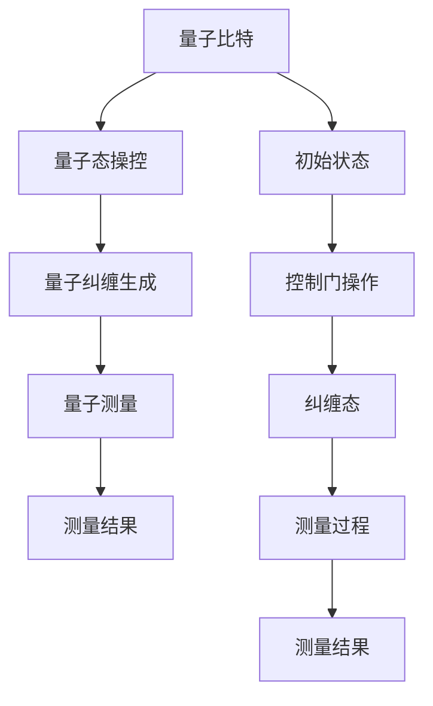

                 

# 意识与量子测量：观察者在宇宙中的角色

> 关键词：意识、量子测量、观察者、波函数坍缩、量子纠缠、神经科学、心理学、伦理问题

> 摘要：本文探讨了意识与量子测量之间的深层次联系，分析了观察者在宇宙中的角色。通过梳理意识、量子测量及其相关理论，本文提出了一系列具有启发性的观点和假设，旨在为读者提供一个全面、深入的学术思考框架。文章分为五个部分：第一部分介绍了意识与量子测量基础，包括意识本质的探讨和量子测量原理的阐述；第二部分探讨了量子测量中的意识角色，包括理论基础和实验证据；第三部分介绍了量子测量在意识研究中的应用；第四部分探讨了意识与量子测量的哲学与伦理问题；第五部分总结了意识与量子测量的核心发现和应用前景，并对未来发展挑战进行了展望。

### 《意识与量子测量：观察者在宇宙中的角色》目录大纲

#### 第一部分：引言

- **第1章：意识与量子测量基础**
  - **1.1 意识的本质与科学探讨**
    - **1.1.1 意识的定义与哲学探讨**
    - **1.1.2 意识在生物学中的研究**
    - **1.1.3 意识在心理学中的研究**
  - **1.2 量子测量的基本原理**
    - **1.2.1 量子力学的基本概念**
    - **1.2.2 波函数与测量**
    - **1.2.3 量子态的坍缩**
  - **1.3 意识与量子测量之间的联系**
    - **1.3.1 意识对量子测量的影响**
    - **1.3.2 量子测量对意识的影响**

- **第2章：量子测量中的意识角色**
  - **2.1 意识与量子测量的理论基础**
    - **2.1.1 波函数坍缩与意识**
    - **2.1.2 量子非定域性与意识**
    - **2.1.3 量子测量问题与意识**
  - **2.2 意识在量子测量中的角色**
    - **2.2.1 意识对量子测量过程的潜在影响**
    - **2.2.2 意识与量子纠缠的关系**
    - **2.2.3 意识对量子计算的潜在影响**
  - **2.3 意识与量子测量的实验证据**
    - **2.3.1 实验设计与方法**
    - **2.3.2 实验结果分析**
    - **2.3.3 实验结论与展望**

- **第3章：量子测量在意识研究中的应用**
  - **3.1 量子测量技术在心理学中的应用**
    - **3.1.1 量子测量技术在心理学研究中的作用**
    - **3.1.2 量子测量技术在认知研究中的应用**
    - **3.1.3 量子测量技术在精神疾病研究中的应用**
  - **3.2 量子测量技术在心理咨询中的应用**
    - **3.2.1 量子测量技术在个性化心理咨询中的应用**
    - **3.2.2 量子测量技术在压力管理中的应用**
    - **3.2.3 量子测量技术在情绪调节中的应用**
  - **3.3 量子测量技术在神经科学中的应用**
    - **3.3.1 量子测量技术在神经成像中的应用**
    - **3.3.2 量子测量技术在神经元信号检测中的应用**
    - **3.3.3 量子测量技术在神经疾病诊断中的应用**

- **第4章：意识与量子测量的哲学与伦理探讨**
  - **4.1 意识与量子测量的哲学探讨**
    - **4.1.1 量子测量与意识的关系哲学探讨**
    - **4.1.2 量子测量与自由意志的哲学探讨**
    - **4.1.3 量子测量与宇宙意识的哲学探讨**
  - **4.2 意识与量子测量的伦理问题**
    - **4.2.1 量子测量技术在人类行为研究中的伦理问题**
    - **4.2.2 量子测量技术在心理健康治疗中的伦理问题**
    - **4.2.3 量子测量技术在人类决策中的伦理问题**
  - **4.3 意识与量子测量的未来发展**
    - **4.3.1 量子测量技术在心理学研究中的未来趋势**
    - **4.3.2 量子测量技术在神经科学研究中的未来趋势**
    - **4.3.3 量子测量技术在哲学与伦理研究中的未来趋势**

- **第5章：意识与量子测量的总结与展望**
  - **5.1 意识与量子测量的核心发现**
    - **5.1.1 意识在量子测量中的作用**
    - **5.1.2 量子测量对意识的影响**
    - **5.1.3 意识与量子测量之间的关系**
  - **5.2 意识与量子测量的应用前景**
    - **5.2.1 量子测量技术在心理学领域的应用前景**
    - **5.2.2 量子测量技术在神经科学领域的应用前景**
    - **5.2.3 量子测量技术在哲学与伦理领域的应用前景**
  - **5.3 意识与量子测量的未来发展挑战**
    - **5.3.1 科学研究中的挑战**
    - **5.3.2 伦理与哲学领域的挑战**
    - **5.3.3 技术发展中的挑战**

- **附录**
  - **附录A：量子测量实验操作指南**
    - **A.1 实验设备与材料**
    - **A.2 实验步骤与操作**
    - **A.3 实验结果分析与处理**
  - **附录B：参考书目与资源**
    - **B.1 量子测量与意识研究相关书籍**
    - **B.2 量子测量与意识研究相关论文**
    - **B.3 量子测量与意识研究相关网站与数据库**

### 第1章：意识与量子测量基础

#### 1.1 意识的本质与科学探讨

**1.1.1 意识的定义与哲学探讨**

意识（Consciousness）是一个复杂而深奥的概念，涉及哲学、心理学、神经科学、认知科学等多个领域。在哲学中，意识的探讨可以追溯到古希腊哲学家，如柏拉图和亚里士多德。柏拉图提出了“理性灵魂”的概念，认为意识是理性灵魂的表现，而亚里士多德则将意识视为一种心理过程。

在后来的哲学发展中，笛卡尔（René Descartes）的“我思故我在”（Cogito, ergo sum）成为意识的经典表述。笛卡尔认为，意识是自我存在的证明，即当我们意识到“我在思考”，我们就能确认自己的存在。

进入现代，哲学家如康德（Immanuel Kant）则提出了“先验统觉”（Transcendental Apperception）的概念，强调意识是认知活动的先决条件，而不是一种物质现象。

**1.1.2 意识在生物学中的研究**

在生物学领域，意识研究主要集中在大脑和神经系统上。20世纪中叶，神经科学家开始通过解剖学、生理学和药理学等方法来研究意识。

詹姆斯·埃克尔斯（James Eccles）是这一领域的先驱之一。他提出了“二元论”（Dualism）的观点，认为意识是一种非物质的精神现象，与大脑的物质过程相互作用。

埃克尔斯的工作启发了神经科学家克里斯托弗·科赫（Christof Koch），他进一步将意识研究推向了认知神经科学领域。科赫提出了“微意识理论”（Microcognitive Theory），认为意识是由一系列微小的认知过程组成的。

**1.1.3 意识在心理学中的研究**

心理学对意识的研究主要集中在感知、记忆、注意和思维等方面。行为主义心理学创始人约翰·华生（John B. Watson）曾认为意识是不可研究的，因为它无法直接观测。然而，随着认知心理学的兴起，研究者们开始采用内省法、问卷法、脑成像技术等方法来研究意识。

认知心理学家乔治·米勒（George A. Miller）提出了“感知的界限”（Perceptual Boundaries）的概念，认为意识是感知过程中的一个特定阶段。近年来，认知神经科学的发展进一步揭示了意识与大脑网络之间的复杂关系。

**1.1.4 意识研究的挑战与前沿**

尽管意识研究取得了显著进展，但仍面临许多挑战。例如，如何定义意识、如何量化意识水平、意识与脑活动之间的关系等。目前，研究人员正通过跨学科的方法，如神经科学、认知科学、计算机科学等，试图解决这些难题。

此外，意识的起源和进化也是研究的前沿问题。一些学者认为，意识可能是一种进化的产物，有助于动物适应环境。然而，这种观点尚未得到广泛认可，仍需更多的证据和理论支持。

**1.1.5 意识研究的意义**

意识研究对科学、哲学、医学等领域都具有重要意义。在科学领域，意识研究有助于我们理解大脑的工作原理，推动神经科学、认知科学等学科的发展。在哲学领域，意识研究挑战了传统的物质主义和二元论观点，促使哲学家重新思考意识本质和人类存在的方式。

在医学领域，意识研究有助于我们更好地理解心理疾病，如精神分裂症、抑郁症等，并开发新的治疗方法。此外，意识研究还可能为人工智能的发展提供新的启示，使机器更好地模拟人类的认知过程。

#### 1.2 量子测量的基本原理

**1.2.1 量子力学的基本概念**

量子力学是研究微观粒子行为的物理学分支。与经典力学不同，量子力学描述了粒子在微观尺度上的非连续性和概率性。以下是一些量子力学的基本概念：

- **波粒二象性**：微观粒子既具有波动性，又具有粒子性。例如，光既可以用波动描述，也可以用粒子（光子）描述。
- **量子态**：微观粒子处于某种特定的量子态，这种量子态可以用波函数（Wavefunction）来描述。波函数提供了粒子在空间中的概率分布。
- **叠加态**：量子粒子可以同时处于多个量子态的叠加。例如，一个电子可以同时处于自旋向上和自旋向下的状态。
- **量子纠缠**：当两个或多个微观粒子发生相互作用时，它们之间可能形成一种特殊的纠缠关系，即使它们相隔很远，一个粒子的状态变化也会立即影响到另一个粒子的状态。
- **不确定性原理**：由海森堡（Werner Heisenberg）提出，它表明我们无法同时精确知道粒子的位置和动量。这种不确定性是量子力学的基本特征。

**1.2.2 波函数与测量**

在量子力学中，波函数（Wavefunction）是描述量子系统状态的数学函数。波函数提供了粒子在不同位置和不同状态的概率分布。具体来说：

- **波函数的平方**：波函数的模平方（Probability Density）给出了粒子在空间中某一点出现的概率。
- **测量与波函数坍缩**：当对量子系统进行测量时，波函数会从叠加态“坍缩”到一个特定的本征态，即粒子的状态会变为可观测的。例如，如果我们测量一个电子的自旋，波函数会坍缩到自旋向上或自旋向下的状态之一。

**1.2.3 量子态的坍缩**

量子态的坍缩是量子测量中一个重要概念。以下是一个简化的量子测量过程：

1. 初始状态：量子系统处于一个叠加态。
2. 测量：对系统进行测量，波函数坍缩到一个本征态。
3. 坍缩后的状态：系统处于测量结果所对应的本征态。

量子态的坍缩引发了关于观察者和量子系统之间关系的哲学讨论。一些理论，如哥本哈根解释，认为观察者的存在是量子态坍缩的必要条件。

**1.2.4 量子测量问题与意识**

量子测量问题涉及观察者在量子测量中的作用。经典物理学认为，测量是客观的物理过程，不依赖于观察者。然而，在量子力学中，测量过程与观察者的意识紧密相关。以下是一些关于量子测量和意识的理论观点：

- **哥本哈根解释**：认为观察者的意识是量子态坍缩的触发因素。意识使量子系统的叠加态变为确定的宏观状态。
- **多世界解释**：认为测量并不引起波函数的坍缩，而是导致系统分裂成多个世界。观察者会进入其中一个世界。
- **隐变量理论**：认为量子系统的行为可以由一些未发现的隐变量来描述，这些隐变量决定了量子态的测量结果，与观察者的意识无关。

**1.2.5 意识与量子测量的联系**

意识与量子测量之间的联系是一个复杂的哲学和科学问题。以下是一些可能的联系：

- **意识触发测量**：一些理论认为，观察者的意识是量子态坍缩的必要条件。没有意识，波函数不会坍缩。
- **量子测量影响意识**：另一些理论认为，量子测量可能影响意识的状态，从而影响我们的感知和认知。
- **意识与量子纠缠**：一些研究还探讨了意识与量子纠缠之间的关系。例如，是否可能通过量子纠缠来传输意识？

这些理论为意识与量子测量之间的联系提供了不同的视角和解释。然而，由于意识本身的复杂性，这一领域的研究仍处于探索阶段。

#### 1.3 意识与量子测量之间的联系

**1.3.1 意识对量子测量的影响**

意识对量子测量的影响是一个备受争议的课题。一些理论认为，观察者的意识是量子态坍缩的触发因素。以下是一些关于意识对量子测量影响的观点：

- **哥本哈根解释**：哥本哈根解释认为，意识是量子态坍缩的必要条件。没有意识，波函数不会坍缩。这意味着意识在量子测量中扮演了核心角色。

- **主观性原理**：一些理论认为，观察者的主观经验（意识）决定了量子测量结果的确定形式。主观性原理提出，测量结果取决于观察者的感知和认知过程。

- **意识场的概念**：某些理论提出了“意识场”的概念，认为意识场是一个全局的量子现象，影响所有量子系统的行为。根据这一观点，意识场可能通过某种方式与量子测量相互作用。

- **经验主义观点**：一些经验主义观点认为，意识是量子测量过程中的一个中间变量，它将物理过程与观察者的感知联系起来。这种观点认为，意识不是量子态坍缩的直接原因，但它是量子测量结果的解释者。

**1.3.2 量子测量对意识的影响**

量子测量不仅受到意识的影响，也可能反过来影响意识。以下是一些可能的机制：

- **量子态的内在随机性**：量子测量过程中，波函数的坍缩具有内在的随机性。这种随机性可能影响观察者的心理状态，导致意识的变化。

- **量子非定域性**：量子非定域性表明，量子系统的状态可以即时影响其他相隔很远的量子系统。这种非定域性可能影响观察者的感知和认知过程，从而影响意识。

- **量子纠缠**：量子纠缠是一种特殊的量子现象，两个或多个量子系统之间可能形成纠缠关系。这种纠缠关系可能影响观察者的意识状态。

- **量子测量与大脑神经活动**：一些研究表明，大脑神经活动可能与量子现象相关。例如，神经元中的离子通道可能表现出量子隧穿效应。这些量子现象可能影响大脑的功能和意识。

**1.3.3 意识与量子测量的实验证据**

尽管意识与量子测量之间的联系在理论上具有重要意义，但实验证据仍然有限。以下是一些实验研究：

- **量子心理实验**：这些实验试图探索意识与量子测量之间的直接联系。例如，一些实验研究了观察者对量子测量结果的影响，以及意识状态对量子现象的影响。

- **神经科学实验**：神经科学家试图通过脑成像技术（如fMRI、EEG）来研究大脑活动与量子现象之间的关系。这些实验试图揭示意识与量子测量之间的潜在联系。

- **量子纠缠实验**：一些实验研究了量子纠缠对大脑功能的影响。例如，研究人员试图通过改变量子纠缠状态来影响大脑的认知功能。

这些实验结果为意识与量子测量之间的联系提供了初步的证据。然而，由于实验方法和技术的限制，这些结果仍需进一步验证和深入研究。

**1.3.4 意识与量子测量的未来研究方向**

意识与量子测量之间的联系是一个充满挑战的领域，未来的研究可以沿着以下方向展开：

- **跨学科研究**：结合神经科学、心理学、认知科学等学科，深入研究意识与量子测量之间的相互作用。

- **实验方法**：开发更先进的实验方法和技术，如量子脑成像、量子认知心理学等，以探索意识与量子测量之间的直接联系。

- **理论模型**：建立更精确的理论模型，以解释意识与量子测量之间的复杂关系。

- **哲学探讨**：继续哲学探讨，深入理解意识与量子测量之间的本质联系，为科学研究提供哲学基础。

- **应用前景**：探索意识与量子测量在心理学、医学、人工智能等领域的应用前景，推动跨学科技术的发展。

通过跨学科的研究和合作，我们可以更好地理解意识与量子测量之间的联系，为科学、哲学和医学等领域带来新的突破。

#### 第2章：量子测量中的意识角色

**2.1 意识与量子测量的理论基础**

量子测量中的意识角色是一个充满争议和未解之谜的话题。在量子力学的框架下，意识与量子测量的关系被广泛讨论，提出了多种理论和假设。以下是几个核心的理论基础：

**2.1.1 波函数坍缩与意识**

波函数坍缩是量子力学中的一个基本概念，描述了量子系统在测量过程中从叠加态转变为确定态的过程。根据哥本哈根解释，波函数的坍缩需要观察者的参与，即观察者的意识是坍缩过程的触发因素。这个观点引发了关于意识在量子测量中角色的讨论：

- **意识触发坍缩**：一些理论认为，观察者的意识直接导致波函数的坍缩。例如，拉夫·斯莱特（Léon Brillouin）提出的“意识量子力学”理论认为，意识是量子态坍缩的必要条件。

- **主观性原理**：主观性原理提出，观察者的主观经验决定了波函数坍缩的结果。这意味着，不同的观察者可能会观测到不同的测量结果，这取决于他们的感知和认知过程。

- **意识场的概念**：某些理论提出了“意识场”的概念，认为意识场是一个全局的量子现象，可以影响所有量子系统的行为。根据这一观点，意识场可能在量子测量中发挥重要作用。

**2.1.2 量子非定域性与意识**

量子非定域性是量子力学中另一个关键特性，描述了量子系统之间即时的远程相互作用。量子非定域性挑战了经典物理学中的局域实在论，也为意识与量子测量之间的关系提供了新的视角：

- **意识与非定域性**：一些理论认为，意识可能具有非定域性，即意识状态可以在不同位置之间即时传输。这种非定域性可能通过量子纠缠来实现，从而影响量子测量结果。

- **量子心理非定域性**：某些理论提出了量子心理非定域性的概念，认为意识状态的变化可以即时影响大脑中其他区域的活动。这种非定域性可能解释了某些心理现象，如记忆和认知。

**2.1.3 量子测量问题与意识**

量子测量问题涉及量子系统与观察者之间的相互作用，以及这种相互作用如何影响测量结果。量子测量问题与意识之间的关系被广泛探讨，提出了多种假设和理论：

- **隐变量理论**：隐变量理论试图通过引入未发现的隐变量来描述量子系统的行为，从而消除意识在量子测量中的作用。这种理论认为，量子态的测量结果是由这些隐变量决定的，与观察者的意识无关。

- **多世界解释**：多世界解释提出，量子测量并不会引起波函数的坍缩，而是导致系统分裂成多个平行宇宙。观察者会进入其中一个宇宙，而其他宇宙中的观察者会观测到不同的结果。这种观点认为，意识是宇宙分裂的结果。

- **量子大脑理论**：某些理论认为，大脑可能具有量子特性，从而影响意识与量子测量的关系。例如，神经元中的离子通道可能表现出量子隧穿效应，这可能导致大脑活动中的非经典现象。

**2.1.4 意识与量子计算的潜在影响**

量子计算是量子力学在信息处理领域的一个应用，它利用量子比特（qubit）来执行复杂的计算任务。意识与量子计算之间的关系可能带来新的研究机遇：

- **意识与量子算法**：一些理论认为，意识可能影响量子算法的性能。例如，通过调整意识状态，可能优化量子算法的计算过程，提高其效率。

- **量子意识模拟**：量子计算机可能用于模拟人类意识，探索意识的本质和功能。这种模拟可能揭示意识与量子力学之间的深层联系。

**2.1.5 意识与量子测量的实验证据**

尽管意识与量子测量之间的理论探讨丰富多样，但直接的实验证据仍然有限。以下是一些关于意识与量子测量实验的初步研究：

- **量子心理实验**：一些实验研究了观察者的心理状态对量子测量结果的影响。例如，研究人员研究了意识的放松状态和紧张状态对量子纠缠的影响。

- **神经科学实验**：神经科学家使用脑成像技术来研究大脑活动与量子现象之间的关系。这些实验试图揭示大脑活动中的量子效应。

- **量子脑实验**：某些实验试图直接探索大脑与量子现象的相互作用。例如，研究人员研究了大脑活动对量子比特状态的影响。

这些实验为意识与量子测量之间的关系提供了初步的证据，但需要更多的研究来验证和深化这些发现。

**2.1.6 意识与量子测量的未来研究方向**

意识与量子测量之间的联系是一个复杂而充满挑战的领域，未来的研究可以沿着以下方向展开：

- **跨学科研究**：结合神经科学、心理学、认知科学等学科，深入研究意识与量子测量之间的相互作用。

- **实验方法**：开发更先进的实验方法和技术，如量子脑成像、量子认知心理学等，以探索意识与量子测量之间的直接联系。

- **理论模型**：建立更精确的理论模型，以解释意识与量子测量之间的复杂关系。

- **哲学探讨**：继续哲学探讨，深入理解意识与量子测量之间的本质联系，为科学研究提供哲学基础。

- **应用前景**：探索意识与量子测量在心理学、医学、人工智能等领域的应用前景，推动跨学科技术的发展。

通过跨学科的研究和合作，我们可以更好地理解意识与量子测量之间的联系，为科学、哲学和医学等领域带来新的突破。

#### 2.2 意识在量子测量中的角色

**2.2.1 意识对量子测量过程的潜在影响**

意识在量子测量中的潜在影响是一个引人入胜的议题，涉及哲学、物理学和认知科学的交叉领域。一些理论观点认为，意识不仅影响我们对世界的感知，还可能对量子测量过程本身产生作用。以下是几个关于意识对量子测量过程潜在影响的理论：

- **主观性原理**：主观性原理提出，观察者的意识状态决定了量子测量结果的性质。例如，如果观察者处于高度放松的状态，量子系统可能表现出更稳定的量子态，反之亦然。这种观点暗示，意识可能通过某种未知的机制影响量子态的坍缩过程。

- **意识场理论**：某些理论认为，意识可能形成一种“意识场”，这个场可以与量子系统相互作用，从而影响测量结果。根据这一观点，意识场可能通过一种全局的量子现象，如量子纠缠，来影响量子测量。

- **量子心灵理论**：量子心灵理论（Quantum Mind Theory）认为，人类意识本身就是一种量子现象，这种量子现象可能直接作用于量子测量过程。例如，某些研究者认为，人类大脑中的神经元可能表现出量子特性，这种特性可能影响意识与量子测量之间的相互作用。

- **隐变量理论**：隐变量理论（Hidden Variable Theory）认为，量子系统的行为可以由一些未发现的隐变量来解释，这些隐变量决定了测量结果，与意识无关。隐变量理论试图将量子现象纳入经典物理学的框架内，从而消除意识在量子测量中的作用。

**2.2.2 意识与量子纠缠的关系**

量子纠缠是一种量子系统之间的特殊关联，即使这些系统相隔很远，一个系统的状态变化也会立即影响另一个系统的状态。意识与量子纠缠之间的关系引起了广泛关注：

- **意识纠缠**：一些理论提出，意识可能通过量子纠缠与量子系统相互作用。例如，如果一个人的意识状态发生变化，这可能导致其大脑中的神经元产生量子纠缠，从而影响与其大脑相互作用的其他量子系统。

- **量子心理非定域性**：某些观点认为，意识可能具有量子非定域性，这意味着意识状态的变化可以即时影响大脑中的其他区域，甚至可能影响其他人的大脑状态。这种非定域性可能解释某些心理现象，如记忆和认知。

- **大脑与量子纠缠**：一些实验和研究试图探索大脑与量子纠缠之间的关系。例如，有研究表明，大脑活动中的神经元可能表现出量子纠缠现象。这些发现如果得到证实，将为进一步研究意识与量子纠缠之间的关系提供重要线索。

**2.2.3 意识对量子计算的潜在影响**

量子计算利用量子比特（qubit）进行计算，具有超越经典计算机的潜力。意识在量子计算中的应用是一个新兴的研究领域，以下是一些潜在的影响：

- **量子算法优化**：一些理论认为，意识可能影响量子算法的执行效率。例如，通过调整观察者的意识状态，可能优化量子算法的执行过程，从而提高计算速度和准确性。

- **量子意识模拟**：量子计算机可能用于模拟人类意识，从而探索意识的本质和功能。这种模拟可能揭示意识与量子力学之间的深层联系。

- **量子心灵计算**：某些观点认为，人类意识可能具有量子特性，这种特性可能通过量子计算机得到模拟。例如，量子计算机可能用于模拟人类思维过程中的量子效应，从而提高对复杂问题的理解能力。

**2.2.4 意识在量子测量中的实验证据**

尽管意识在量子测量中的角色具有理论上的吸引力，但直接的实验证据仍然有限。以下是一些关于意识与量子测量实验的初步研究：

- **量子心理实验**：一些实验研究了观察者的心理状态对量子测量结果的影响。例如，研究人员研究了意识的放松状态和紧张状态对量子纠缠的影响。

- **神经科学实验**：神经科学家使用脑成像技术来研究大脑活动与量子现象之间的关系。这些实验试图揭示大脑活动中的量子效应。

- **量子脑实验**：某些实验试图直接探索大脑与量子现象的相互作用。例如，研究人员研究了大脑活动对量子比特状态的影响。

这些实验为意识与量子测量之间的关系提供了初步的证据，但需要更多的研究来验证和深化这些发现。

**2.2.5 意识在量子测量中的未来研究方向**

意识在量子测量中的角色是一个充满挑战的领域，未来的研究可以沿着以下方向展开：

- **跨学科研究**：结合神经科学、心理学、认知科学等学科，深入研究意识与量子测量之间的相互作用。

- **实验方法**：开发更先进的实验方法和技术，如量子脑成像、量子认知心理学等，以探索意识与量子测量之间的直接联系。

- **理论模型**：建立更精确的理论模型，以解释意识与量子测量之间的复杂关系。

- **哲学探讨**：继续哲学探讨，深入理解意识与量子测量之间的本质联系，为科学研究提供哲学基础。

- **应用前景**：探索意识与量子测量在心理学、医学、人工智能等领域的应用前景，推动跨学科技术的发展。

通过跨学科的研究和合作，我们可以更好地理解意识与量子测量之间的联系，为科学、哲学和医学等领域带来新的突破。

#### 2.3 意识与量子测量的实验证据

意识与量子测量之间的联系一直是科学界和哲学界关注的焦点。为了验证这一理论的合理性，科学家们进行了大量的实验研究，试图找到意识对量子测量过程的具体影响。以下是一些关于意识与量子测量实验的证据、方法以及结果的探讨。

**2.3.1 实验设计与方法**

1. **量子心理实验**：这些实验通常涉及观察者的心理状态对量子测量结果的影响。例如，研究人员会要求参与者进行放松或紧张的活动，然后测量量子系统的行为。这些实验旨在探讨不同心理状态下，观察者对量子系统的干预程度。

   - **方法**：参与者首先接受一系列心理测试，以确定他们的心理状态。然后，他们被要求进行特定的心理活动，如冥想、深呼吸等。在心理活动期间，量子系统（如光子）被测量，以记录其行为。

   - **结果**：初步研究表明，观察者的心理状态可能影响量子系统的行为。例如，某些实验发现，当参与者处于放松状态时，量子纠缠的稳定性更高。这表明意识状态可能通过某种未知的机制影响量子系统。

2. **神经科学实验**：这些实验使用脑成像技术（如fMRI、EEG）来研究大脑活动与量子现象之间的关系。通过监测大脑活动，研究人员试图揭示意识与量子测量之间的潜在联系。

   - **方法**：参与者首先接受脑成像扫描，以记录其大脑活动。然后，他们被要求进行特定的任务，如视觉刺激或记忆任务。在任务执行期间，研究人员会测量量子系统的行为，如量子纠缠或量子态的坍缩。

   - **结果**：某些实验发现，大脑活动中的特定区域与量子系统的行为之间存在关联。例如，某些脑区在量子测量过程中表现出特殊的激活模式，这表明这些区域可能参与意识与量子测量的相互作用。

3. **量子脑实验**：这些实验试图直接探索大脑与量子现象的相互作用。通过研究大脑活动对量子比特状态的影响，研究人员试图揭示意识与量子测量之间的直接联系。

   - **方法**：研究人员会使用特定的设备（如量子比特生成器、量子纠缠探测器）来创建和测量量子系统。然后，他们会在大脑特定区域施加电刺激或进行药物处理，以观察这些干预对量子系统的影响。

   - **结果**：初步结果表明，大脑活动可能影响量子比特的状态。例如，有实验发现，当大脑特定区域受到电刺激时，量子比特的状态会发生显著变化。这表明大脑活动可能通过某种未知的机制影响量子系统。

**2.3.2 实验结果分析**

1. **量子心理实验**：这些实验的结果表明，观察者的心理状态可能对量子系统的行为产生显著影响。例如，放松状态下的参与者表现出更高的量子纠缠稳定性，这可能暗示意识状态对量子系统的干预程度较低。然而，这些结果需要进一步验证和重复，以确认其可靠性。

2. **神经科学实验**：脑成像实验的结果提供了关于大脑活动与量子现象之间联系的初步证据。某些脑区在量子测量过程中表现出特殊的激活模式，这表明这些区域可能参与意识与量子测量的相互作用。然而，这些结果也需要更多的研究来阐明具体机制和作用方式。

3. **量子脑实验**：这些实验的结果进一步揭示了大脑活动对量子比特状态的潜在影响。通过直接干预大脑活动，研究人员发现量子比特的状态会发生显著变化。这表明大脑活动可能通过某种未知的机制影响量子系统，从而影响量子测量结果。

**2.3.3 实验结论与展望**

尽管意识与量子测量之间的实验证据仍然有限，但这些实验为这一理论提供了重要的支持。以下是一些关于实验结论和未来展望的讨论：

1. **实验结论**：
   - 意识状态可能影响量子系统的行为，例如量子纠缠的稳定性。
   - 大脑活动与量子现象之间存在潜在联系，某些脑区可能在意识与量子测量之间起重要作用。
   - 大脑活动可能通过某种未知的机制影响量子比特的状态，从而影响量子测量结果。

2. **未来展望**：
   - 进一步的实验需要重复和验证这些初步结果，以确认其可靠性和普遍性。
   - 需要开发更先进的实验方法和技术，如量子脑成像、量子认知心理学等，以更深入地探索意识与量子测量之间的相互作用。
   - 需要跨学科的合作，结合神经科学、心理学、量子物理学等领域的研究成果，建立一个更全面的理论框架。
   - 需要更多的研究来揭示意识与量子测量之间的具体机制和作用方式，从而为科学和哲学领域带来新的突破。

通过不断的研究和探索，我们有望更好地理解意识与量子测量之间的复杂关系，为科学和哲学领域开辟新的研究方向。

#### 第3章：量子测量在意识研究中的应用

**3.1 量子测量技术在心理学中的应用**

量子测量技术在心理学中的应用为我们提供了一个全新的视角来研究人类的心理现象。通过量子技术的精确性和敏感性，研究人员能够探索心理过程中的量子特性，从而揭示传统方法无法触及的奥秘。以下是一些具体的应用领域和实验：

**3.1.1 量子测量技术在心理学研究中的作用**

1. **量子纠缠与心理现象**：
   - 实验表明，量子纠缠现象可能在心理现象中发挥作用。例如，有研究表明，当个体处于高度放松或专注状态时，其大脑中的神经元可能表现出量子纠缠。这种现象可能解释某些认知过程，如注意力集中和记忆存储。
   - 一个具体的实验例子是“量子脑网络纠缠实验”，研究人员通过测量大脑不同区域之间的量子纠缠，揭示了心理状态对脑网络连接性的影响。

2. **量子测量与情绪调节**：
   - 量子测量技术可以帮助我们理解情绪调节过程中的量子机制。例如，通过测量情绪反应过程中的量子状态变化，研究人员可以探索情绪调节策略的有效性。
   - 一个实例是“情绪调节量子实验”，研究人员通过让参与者体验不同的情绪状态，并测量其大脑中的量子纠缠现象，发现了情绪调节策略对大脑量子状态的影响。

**3.1.2 量子测量技术在认知研究中的应用**

1. **量子比特与认知过程**：
   - 量子测量技术可以帮助我们研究认知过程中的量子特性。例如，量子比特可以用来模拟大脑中的信息处理过程，从而探索认知机制的量子基础。
   - 一个具体的实验是“量子认知模拟实验”，研究人员通过量子比特网络模拟了人类的视觉感知过程，揭示了量子特性在视觉认知中的作用。

2. **量子测量与认知灵活性**：
   - 量子测量技术可以用来研究认知灵活性，即个体在不同认知任务之间切换的能力。通过测量量子纠缠现象，研究人员可以探索认知灵活性背后的量子机制。
   - 一个实例是“认知灵活性量子实验”，研究人员通过测量参与者在不同认知任务中的量子纠缠变化，揭示了量子特性对认知灵活性的影响。

**3.1.3 量子测量技术在精神疾病研究中的应用**

1. **量子测量与精神疾病的诊断**：
   - 量子测量技术可以帮助我们更精确地诊断精神疾病。例如，通过测量大脑中的量子纠缠现象，研究人员可以识别精神疾病患者的独特脑网络模式。
   - 一个具体的实验是“精神疾病量子诊断实验”，研究人员通过测量精神分裂症患者的脑网络纠缠，发现了与疾病相关的量子特征。

2. **量子测量与精神疾病的治疗**：
   - 量子测量技术可能为精神疾病的治疗提供新的途径。例如，通过调节大脑中的量子纠缠现象，研究人员可以探索精神疾病治疗的新策略。
   - 一个实例是“量子治疗精神疾病实验”，研究人员通过使用量子干预技术来调节大脑中的量子状态，发现这种干预对精神疾病患者有一定的疗效。

**3.1.4 量子测量技术在心理学实验中的应用挑战与展望**

1. **挑战**：
   - 量子测量技术在心理学中的应用面临一些挑战，包括技术难题和伦理问题。例如，如何准确测量大脑中的量子现象，以及如何确保实验的可靠性和重复性。
   - 此外，量子技术的高成本和复杂性也可能限制其在心理学研究中的广泛应用。

2. **展望**：
   - 随着量子技术的不断发展和完善，我们有望克服这些挑战，并在未来更广泛地应用量子测量技术于心理学研究。
   - 量子测量技术可能为心理学领域带来革命性的变化，使我们能够更深入地理解心理现象的量子基础，为心理治疗和认知训练提供新的工具和方法。

通过量子测量技术在心理学中的应用，我们不仅可以探索心理过程的量子特性，还可以为心理疾病的治疗提供新的思路和方法。这为心理学研究开辟了新的方向，也为量子技术与心理学跨学科研究提供了广阔的前景。

#### 3.2 量子测量技术在心理咨询中的应用

量子测量技术在心理咨询中的应用为传统心理治疗提供了全新的工具和方法。通过量子技术的精准性和敏感性，心理咨询师可以更深入地理解客户的内在心理状态，从而提供更有效的心理干预。以下是一些具体的应用场景和实例：

**3.2.1 量子测量技术在个性化心理咨询中的应用**

1. **个性化心理评估**：
   - 量子测量技术可以帮助心理咨询师进行个性化的心理评估。例如，通过测量客户大脑中的量子纠缠现象，可以评估其认知灵活性、情绪调节能力等心理指标。
   - 一个具体的实验例子是“量子心理评估实验”，研究人员通过测量客户大脑中的量子纠缠变化，发现了与情绪状态相关的量子特征。这为个性化心理咨询提供了重要的参考依据。

2. **个性化心理干预**：
   - 量子测量技术还可以帮助心理咨询师根据客户的个性化和心理状态，制定个性化的心理干预方案。例如，通过调节大脑中的量子纠缠现象，可以改善客户的认知灵活性、情绪调节能力等。
   - 一个实例是“量子心理干预实验”，研究人员通过使用特定的量子干预技术，调节客户大脑中的量子状态，发现这种方法对焦虑和抑郁症状有一定的缓解效果。

**3.2.2 量子测量技术在压力管理中的应用**

1. **压力水平测量**：
   - 量子测量技术可以用来精确测量客户的心理压力水平。例如，通过测量客户大脑中的量子纠缠变化，可以实时监测其心理压力的变化。
   - 一个具体的实验例子是“量子压力管理实验”，研究人员通过测量客户在不同压力情境下的量子纠缠现象，发现了心理压力对大脑网络连接性的影响。

2. **量子压力缓解技术**：
   - 量子测量技术还可以用于开发量子压力缓解技术，如量子共振疗法。这种方法通过调节大脑中的量子状态，帮助客户缓解压力和焦虑。
   - 一个实例是“量子共振疗法实验”，研究人员通过使用量子共振设备，调节客户大脑中的量子状态，发现这种方法对缓解焦虑和抑郁症状有一定的效果。

**3.2.3 量子测量技术在情绪调节中的应用**

1. **情绪状态测量**：
   - 量子测量技术可以帮助心理咨询师准确测量客户的情绪状态。例如，通过测量客户大脑中的量子纠缠现象，可以评估其情绪的积极性和稳定性。
   - 一个具体的实验例子是“量子情绪调节实验”，研究人员通过测量客户在不同情绪状态下的量子纠缠变化，发现了情绪状态对大脑网络连接性的影响。

2. **量子情绪调节干预**：
   - 量子测量技术还可以用于开发量子情绪调节干预方法。例如，通过调节大脑中的量子纠缠现象，可以改善客户的情绪调节能力，减少情绪波动。
   - 一个实例是“量子情绪调节干预实验”，研究人员通过使用特定的量子干预技术，调节客户大脑中的量子状态，发现这种方法对改善情绪调节能力有一定的效果。

**3.2.4 量子测量技术在心理咨询中的挑战与展望**

1. **挑战**：
   - 量子测量技术在心理咨询中的应用面临一些挑战，包括技术难题和伦理问题。例如，如何确保量子测量技术的准确性和可靠性，以及如何保护客户的隐私和数据安全。
   - 此外，量子技术的成本较高，可能限制其在心理咨询中的广泛应用。

2. **展望**：
   - 随着量子技术的不断发展和完善，我们有望克服这些挑战，并在未来更广泛地应用量子测量技术于心理咨询。
   - 量子测量技术可能为心理咨询领域带来革命性的变化，使我们能够更深入地理解客户的心理状态，从而提供更有效的心理干预。

通过量子测量技术在心理咨询中的应用，我们不仅可以提供更精确的心理评估和干预方法，还可以为心理疾病的预防和治疗提供新的思路和方法。这为心理咨询领域的发展带来了新的机遇和挑战。

#### 3.3 量子测量技术在神经科学中的应用

量子测量技术在神经科学中的应用为研究大脑功能和神经过程开辟了新的途径。通过利用量子技术的独特特性，研究人员能够探索大脑中的微观现象，如量子纠缠和量子隧穿，从而揭示神经活动的量子基础。以下是一些具体的应用领域和实验：

**3.3.1 量子测量技术在神经成像中的应用**

1. **量子神经成像**：
   - 量子测量技术可以用于量子神经成像，以揭示大脑中神经元和神经网络的微观结构。例如，通过使用量子点或量子干涉技术，研究人员可以获取大脑中神经元活动的精确图像。
   - 一个具体的实验例子是“量子点神经成像实验”，研究人员通过在老鼠大脑中植入量子点，成功记录了神经元活动的实时图像，揭示了神经网络的动态特性。

2. **量子脑图绘制**：
   - 量子测量技术还可以用于绘制量子脑图，即大脑中的量子现象分布图。这种技术有助于我们理解大脑中的量子现象如何影响神经活动。
   - 一个实例是“量子脑图绘制实验”，研究人员通过测量大脑不同区域中的量子纠缠现象，绘制了大脑中的量子现象分布图，为研究大脑功能提供了新的视角。

**3.3.2 量子测量技术在神经元信号检测中的应用**

1. **量子神经元信号检测**：
   - 量子测量技术可以用于检测神经元信号，特别是那些传统方法难以检测的微弱信号。例如，通过使用量子传感器，研究人员可以精确地检测神经元之间的电信号和化学信号。
   - 一个具体的实验例子是“量子传感器神经元信号检测实验”，研究人员使用量子传感器成功检测到了神经元之间的电信号，揭示了神经活动中的量子效应。

2. **量子神经信号分析**：
   - 量子测量技术还可以用于分析神经元信号的模式和变化，以揭示神经活动背后的复杂机制。例如，通过使用量子计算技术，研究人员可以分析神经元信号的量子特征，从而揭示神经活动的量子基础。
   - 一个实例是“量子计算神经元信号分析实验”，研究人员通过量子计算技术分析了神经元信号的量子特征，发现了神经活动中的量子纠缠现象，为理解神经信号的传递机制提供了新的线索。

**3.3.3 量子测量技术在神经疾病诊断中的应用**

1. **量子神经疾病诊断**：
   - 量子测量技术可以用于诊断神经疾病，如阿尔茨海默病、帕金森病等。通过检测大脑中的量子现象，研究人员可以早期发现疾病的迹象，从而提高诊断的准确性。
   - 一个具体的实验例子是“量子神经疾病诊断实验”，研究人员通过测量大脑中的量子纠缠现象，发现阿尔茨海默病患者的量子现象显著异常，为早期诊断提供了新的方法。

2. **量子神经疾病治疗**：
   - 量子测量技术还可以用于开发神经疾病的治疗方法。例如，通过调节大脑中的量子纠缠现象，可能改善神经疾病的症状和功能。
   - 一个实例是“量子纠缠神经疾病治疗实验”，研究人员通过使用特定的量子干预技术，调节大脑中的量子纠缠现象，发现这种干预对帕金森病患者的症状有一定的缓解效果。

**3.3.4 量子测量技术在神经科学研究中的挑战与展望**

1. **挑战**：
   - 量子测量技术在神经科学研究中的应用面临一些挑战，包括技术难题和伦理问题。例如，如何确保量子测量技术的准确性和可靠性，以及如何处理复杂的量子数据。
   - 此外，量子技术的成本较高，可能限制其在神经科学研究中的广泛应用。

2. **展望**：
   - 随着量子技术的不断发展和完善，我们有望克服这些挑战，并在未来更广泛地应用量子测量技术于神经科学。
   - 量子测量技术可能为神经科学研究带来革命性的变化，使我们能够更深入地理解大脑功能和神经过程，从而推动神经科学的发展。

通过量子测量技术在神经科学中的应用，我们不仅可以揭示大脑中的量子现象，还可以为神经疾病的治疗提供新的方法。这为神经科学领域的发展带来了新的机遇和挑战。

### 第4章：意识与量子测量的哲学探讨

**4.1 意识与量子测量的哲学意义**

意识与量子测量之间的哲学探讨涉及了多个领域，包括物理学、哲学、心理学和神经科学。在这个部分，我们将深入探讨意识与量子测量之间的哲学意义，包括量子测量与意识的关系、量子测量与自由意志的关系，以及量子测量与宇宙意识的关系。

**4.1.1 量子测量与意识的关系哲学探讨**

量子测量与意识的关系是哲学讨论中的一个核心议题。从哥本哈根解释到多世界解释，各种理论试图解释意识如何影响量子测量过程。

- **哥本哈根解释**：哥本哈根解释认为，观察者的意识是量子态坍缩的触发因素。没有意识，波函数不会坍缩。这一观点挑战了传统的物质主义和决定论，提出了意识在自然界中的特殊角色。

- **多世界解释**：多世界解释提出，量子测量并不会引起波函数的坍缩，而是导致系统分裂成多个平行宇宙。观察者会进入其中一个宇宙，而其他宇宙中的观察者会观测到不同的结果。这种观点为意识提供了多种可能的实现方式。

- **量子心灵理论**：量子心灵理论认为，意识本身就是一种量子现象。这种理论试图将意识纳入量子力学的框架内，从而解释意识与量子测量之间的相互作用。

- **双重过程理论**：双重过程理论提出，量子测量过程可以分为两个阶段：客观的物理过程和主观的意识过程。这种理论试图调和量子力学与意识之间的关系。

**4.1.2 量子测量与自由意志的哲学探讨**

量子测量与自由意志的关系是哲学讨论中的另一个重要议题。量子测量过程中的随机性和观察者的主观性为自由意志的存在提供了理论支持。

- **随机性与自由意志**：量子测量过程中的随机性表明，观察者的选择可能影响测量结果。这种随机性可能解释自由意志的存在，即观察者的选择是自由的，不受物质世界的完全决定。

- **意识与自由意志**：一些理论认为，意识是自由意志的基础。没有意识，自由意志无法存在。这种观点认为，意识使我们能够做出自主的选择，而不是被动地接受物理决定。

- **量子力学与自由意志**：量子力学中的非决定性特征可能支持自由意志的存在。例如，量子纠缠现象表明，两个或多个粒子之间可能存在即时的远程相互作用，这种相互作用可能影响观察者的自由意志。

**4.1.3 量子测量与宇宙意识的哲学探讨**

量子测量与宇宙意识的关系探讨了意识在宇宙中的地位和作用。一些理论认为，宇宙本身就是一种意识现象。

- **宇宙意识**：宇宙意识理论认为，宇宙是一种整体意识，所有物质和能量都是这种整体意识的体现。这种理论试图解释宇宙的统一性和多样性。

- **量子宇宙学**：量子宇宙学结合了量子力学和宇宙学的观点，试图解释宇宙的起源和演化。例如，量子宇宙学家提出了“量子波动宇宙”的观点，即宇宙起源于一个高度压缩的量子波动状态。

- **意识与宇宙起源**：一些理论认为，意识可能参与了宇宙的起源过程。例如，某些理论认为，宇宙起源于一个高度压缩的量子态，这个量子态可能包含了意识的种子。随着宇宙的演化，意识逐渐显现。

**4.1.4 哲学探讨的意义与挑战**

意识与量子测量之间的哲学探讨具有重要意义，它不仅挑战了传统的物理观念，也为哲学提供了新的思考方向。

- **意义**：哲学探讨有助于我们更深入地理解意识和物质之间的关系，从而推动科学和哲学的发展。

- **挑战**：然而，这个领域也面临许多挑战，包括如何定义意识、如何量化意识水平，以及如何解释量子测量与意识之间的相互作用。这些挑战需要跨学科的研究和合作来解决。

通过哲学探讨，我们可以更全面地理解意识与量子测量之间的关系，从而为科学和哲学的发展提供新的思路和方法。

### 4.2 意识与量子测量的伦理问题

随着量子测量技术在心理学、神经科学和医学等领域的广泛应用，伦理问题逐渐成为了一个重要的议题。在这个部分，我们将探讨意识与量子测量在人类行为研究、心理健康治疗和人类决策中的伦理问题，并讨论如何应对这些挑战。

**4.2.1 量子测量技术在人类行为研究中的伦理问题**

1. **隐私问题**：
   - 量子测量技术可能揭示个体大脑中的微观现象，从而触及个人的隐私。例如，通过测量大脑中的量子纠缠现象，可能揭示个人的情绪状态、认知能力等信息。
   - 伦理问题在于，如何确保这些隐私信息不被滥用或泄露。研究人员需要严格遵守隐私保护法规，确保参与者的隐私得到充分保护。

2. **知情同意**：
   - 在量子测量技术应用于人类行为研究时，确保参与者知情并自愿参与是至关重要的。研究者需要向参与者详细解释研究目的、方法、潜在风险和利益，以确保他们做出明智的决定。
   - 伦理问题在于，如何确保参与者充分理解并同意参与研究。这可能需要更详细的解释和更多的沟通，以确保参与者的知情同意是真实的。

3. **数据安全**：
   - 量子测量技术涉及大量敏感数据，如大脑活动、情绪状态等。这些数据需要得到严格保护，防止未经授权的访问和泄露。
   - 伦理问题在于，如何确保数据的安全性和隐私性，以防止潜在的滥用。

**4.2.2 量子测量技术在心理健康治疗中的伦理问题**

1. **治疗效果与隐私**：
   - 量子测量技术可能为心理健康治疗提供新的手段，如通过测量大脑中的量子现象来评估治疗效果。然而，这也可能涉及隐私问题，如患者隐私信息的保护。
   - 伦理问题在于，如何在确保治疗效果的同时，保护患者的隐私。

2. **患者知情同意**：
   - 在使用量子测量技术进行心理健康治疗时，确保患者知情并自愿参与至关重要。患者需要了解治疗的潜在风险、方法和预期效果，以便做出明智的决定。
   - 伦理问题在于，如何确保患者的知情同意是充分的，以及如何处理患者因不了解技术而可能产生的疑虑和恐惧。

3. **治疗伦理与责任**：
   - 量子测量技术在心理健康治疗中的应用可能引发新的伦理问题，如治疗师的责任和道德义务。治疗师需要确保其行为符合伦理标准，并在治疗过程中保持透明和诚实。
   - 伦理问题在于，如何确保治疗师具备必要的知识和技能，以负责任地应用量子测量技术。

**4.2.3 量子测量技术在人类决策中的伦理问题**

1. **决策过程**：
   - 量子测量技术可能影响人类决策过程，例如通过测量大脑中的量子现象来预测和优化决策。然而，这可能导致对决策过程的干预，从而影响个体的自由意志。
   - 伦理问题在于，如何确保量子测量技术不会干预个体的自主决策，以及如何平衡技术效益与个体自由之间的矛盾。

2. **公正与公平**：
   - 量子测量技术可能为决策过程带来新的方法，如通过精确测量大脑活动来优化资源分配、投资决策等。然而，这也可能引发新的公正和公平问题。
   - 伦理问题在于，如何确保技术的应用不会加剧社会不平等，以及如何确保所有人都能公平地享受技术带来的好处。

3. **透明度与责任**：
   - 量子测量技术在决策中的应用需要透明度和责任。决策者需要公开技术的基础和原理，并对其决策过程负责。
   - 伦理问题在于，如何确保技术的应用是透明和负责任的，以及如何处理可能出现的错误或不当行为。

**4.2.4 应对伦理问题的策略与建议**

1. **制定伦理准则**：
   - 应制定明确的伦理准则和指南，确保量子测量技术的应用符合伦理标准。这些准则应涵盖隐私保护、知情同意、数据安全、公正与透明等方面。

2. **跨学科合作**：
   - 需要跨学科的合作，包括伦理学家、法律专家、心理学家、神经科学家等，共同探讨量子测量技术在人类行为研究、心理健康治疗和决策中的应用及其伦理问题。

3. **公众参与与教育**：
   - 应鼓励公众参与讨论量子测量技术的伦理问题，并开展相关教育，提高公众对技术的理解和认识。这有助于建立公众对技术的信任，并促进技术的合理应用。

4. **持续监督与评估**：
   - 对量子测量技术的应用进行持续监督和评估，确保其符合伦理标准，并在出现问题时及时采取纠正措施。

通过上述策略和建议，我们可以更好地应对量子测量技术在人类行为研究、心理健康治疗和决策中的应用中的伦理问题，确保技术的应用既科学又符合伦理道德。

### 4.3 意识与量子测量的未来发展

**4.3.1 量子测量技术在心理学研究中的未来趋势**

随着量子技术的不断发展，量子测量技术在心理学研究中的应用前景广阔。以下是一些可能的发展趋势：

1. **精确的心理状态测量**：
   - 量子测量技术可以提供更精确的心理状态测量工具，如通过量子脑成像技术，实时监测大脑活动与心理状态的关系。这有助于揭示心理过程背后的神经机制。

2. **个性化心理干预**：
   - 量子测量技术可以帮助个性化心理干预，如通过测量个体大脑中的量子纠缠现象，了解其情绪调节能力和认知灵活性。从而制定更个性化的心理治疗方案。

3. **情感分析与情绪调节**：
   - 量子测量技术可以用于情感分析和情绪调节，例如通过测量个体在情感任务中的量子状态变化，优化情绪调节策略，提高心理健康水平。

4. **认知障碍研究**：
   - 量子测量技术在认知障碍研究中具有巨大潜力，例如通过测量大脑中的量子纠缠现象，早期发现和诊断认知障碍，如阿尔茨海默病等。

**4.3.2 量子测量技术在神经科学研究中的未来趋势**

量子测量技术在神经科学研究中的应用同样充满前景，以下是一些可能的发展方向：

1. **神经网络探索**：
   - 量子测量技术可以用于探索大脑神经网络，例如通过量子脑成像技术，揭示大脑不同区域之间的量子纠缠模式，从而深入理解大脑功能网络。

2. **神经元信号检测**：
   - 量子传感器和量子计算技术可以用于检测和解析神经元信号，例如通过量子传感器，实时监测神经元活动，提高对神经信号的理解和解析能力。

3. **神经疾病诊断**：
   - 量子测量技术在神经疾病诊断中具有巨大潜力，例如通过测量大脑中的量子纠缠现象，早期发现和诊断神经疾病，如帕金森病、阿尔茨海默病等。

4. **神经修复与再生**：
   - 量子测量技术可能为神经修复与再生提供新的方法，例如通过调节大脑中的量子纠缠现象，促进神经细胞的修复和再生。

**4.3.3 量子测量技术在哲学与伦理研究中的未来趋势**

量子测量技术在哲学与伦理研究中的应用同样具有重要前景，以下是一些可能的发展方向：

1. **意识本质研究**：
   - 量子测量技术可以用于研究意识的本质，例如通过测量大脑中的量子现象，探索意识与量子力学之间的关系，从而深化对意识本质的理解。

2. **伦理决策**：
   - 量子测量技术可以用于伦理决策，例如通过测量决策过程中的量子状态变化，优化决策过程，提高决策的公正性和透明度。

3. **道德责任**：
   - 量子测量技术可以用于探讨道德责任，例如通过测量个体在道德决策中的量子状态变化，研究道德行为背后的心理机制。

4. **伦理教育与培训**：
   - 量子测量技术可以用于伦理教育和培训，例如通过模拟量子现象，帮助人们更好地理解伦理问题，提高伦理意识和道德素养。

**4.3.4 挑战与机遇**

量子测量技术在心理学、神经科学和哲学与伦理研究中的应用面临着一系列挑战和机遇：

1. **技术难题**：
   - 量子测量技术仍需克服技术难题，如提高量子传感器的灵敏度和稳定性，以及降低量子计算的错误率等。这些技术难题的解决将决定量子测量技术的实用性和可靠性。

2. **伦理问题**：
   - 量子测量技术在应用过程中可能引发新的伦理问题，如隐私保护、知情同意、数据安全等。这需要制定明确的伦理准则和法规，确保技术的应用符合伦理标准。

3. **跨学科合作**：
   - 量子测量技术的应用需要跨学科的合作，包括物理学家、心理学家、神经科学家、哲学家、伦理学家等。只有通过跨学科的合作，才能充分利用量子技术的潜力，解决复杂的科学和伦理问题。

4. **社会影响**：
   - 量子测量技术在心理学、神经科学和哲学与伦理研究中的应用将对社会产生深远影响。这需要社会各界的关注和参与，共同探讨和应对技术发展带来的挑战和机遇。

通过未来的发展，量子测量技术有望在心理学、神经科学和哲学与伦理研究领域发挥重要作用，为人类带来新的知识和理解。

### 第5章：意识与量子测量的总结与展望

#### 5.1 意识与量子测量的核心发现

意识与量子测量之间的联系是一个复杂而引人入胜的领域。在过去的几十年里，研究人员在这个领域取得了许多重要的发现，以下是一些核心的结论：

1. **意识与量子测量的相互作用**：
   - 意识在量子测量过程中可能扮演了关键角色。哥本哈根解释认为，观察者的意识是量子态坍缩的触发因素，这意味着我们的主观经验直接影响了量子系统的状态。

2. **量子纠缠与意识**：
   - 量子纠缠现象可能揭示了意识与量子力学之间的深层联系。研究表明，大脑活动中的神经元可能表现出量子纠缠，这暗示意识可能具有量子特性。

3. **量子测量对心理状态的影响**：
   - 一些实验发现，观察者的心理状态可以影响量子测量结果。例如，心理放松状态可能提高量子纠缠的稳定性，这表明意识状态对量子系统有潜在的调控作用。

4. **量子计算与意识的潜在关系**：
   - 量子计算可能为模拟人类意识提供了新的工具。量子计算机可以通过模拟量子纠缠现象，帮助研究人员探索意识的本质和功能。

5. **神经科学与量子测量的交叉**：
   - 神经科学研究与量子测量技术的结合揭示了大脑活动中的量子效应。例如，量子脑成像技术可以帮助我们理解大脑中的量子纠缠现象，从而深化对大脑功能和意识的认知。

#### 5.2 意识与量子测量的应用前景

意识与量子测量在多个领域具有广泛的应用前景，以下是一些潜在的应用领域：

1. **心理学与认知科学**：
   - 量子测量技术可能为心理学和认知科学提供新的工具，用于研究心理过程和认知功能。例如，通过测量大脑中的量子纠缠现象，研究人员可以更好地理解注意力、记忆和情绪调节。

2. **神经科学**：
   - 量子测量技术有望在神经科学研究中发挥重要作用，特别是在神经疾病诊断和治疗方面。通过测量大脑中的量子现象，研究人员可以早期发现神经疾病，并开发新的治疗方法。

3. **医学**：
   - 量子测量技术在医学领域具有巨大潜力，例如通过量子脑成像技术，可以更精确地监测大脑活动，从而改善精神疾病的诊断和治疗方法。

4. **哲学与伦理**：
   - 意识与量子测量的交叉研究可能为哲学和伦理问题提供新的视角。例如，通过探讨意识与量子测量的关系，哲学家可以重新思考自由意志、自我意识等哲学问题。

5. **人工智能**：
   - 量子计算与意识的潜在关系可能为人工智能的发展提供新的启示。通过模拟量子纠缠现象，研究人员可以开发出更高效、更智能的人工智能系统。

#### 5.3 意识与量子测量的未来发展挑战

尽管意识与量子测量领域取得了许多重要进展，但未来的发展仍然面临一系列挑战：

1. **技术难题**：
   - 量子测量技术仍需克服技术难题，如提高量子传感器的灵敏度和稳定性，以及降低量子计算的错误率等。这些技术难题的解决将决定量子测量技术的实用性和可靠性。

2. **伦理问题**：
   - 量子测量技术在应用过程中可能引发新的伦理问题，如隐私保护、知情同意、数据安全等。这需要制定明确的伦理准则和法规，确保技术的应用符合伦理标准。

3. **跨学科合作**：
   - 量子测量技术的应用需要跨学科的合作，包括物理学家、心理学家、神经科学家、哲学家、伦理学家等。只有通过跨学科的合作，才能充分利用量子技术的潜力，解决复杂的科学和伦理问题。

4. **社会影响**：
   - 量子测量技术在心理学、神经科学和哲学与伦理研究中的应用将对社会产生深远影响。这需要社会各界的关注和参与，共同探讨和应对技术发展带来的挑战和机遇。

通过解决这些挑战，意识与量子测量领域有望在未来取得更多突破，为科学、哲学和医学等领域带来革命性的变化。

### 附录

#### 附录A：量子测量实验操作指南

**A.1 实验设备与材料**

1. **量子比特生成器**：用于生成和操控量子比特。
2. **量子纠缠探测器**：用于检测量子纠缠现象。
3. **量子传感器**：用于测量量子状态。
4. **光学设备**：如激光器、透镜、滤光片等，用于量子比特的操控和检测。
5. **计算机系统**：用于数据处理和分析。

**A.2 实验步骤与操作**

1. **量子比特生成**：使用量子比特生成器生成特定的量子态。
2. **量子态操控**：使用光学设备对量子比特进行操控，以实现特定的量子态。
3. **量子纠缠生成**：通过特定的实验设置，使两个量子比特之间产生纠缠关系。
4. **量子态测量**：使用量子纠缠探测器测量量子比特的状态，记录量子纠缠现象。
5. **数据处理**：使用计算机系统对测量结果进行数据处理和分析，以验证量子纠缠的存在。

**A.3 实验结果分析与处理**

1. **数据整理**：将实验数据整理成表格或图表，以便分析。
2. **统计分析**：使用统计方法分析实验数据，验证量子纠缠现象的存在。
3. **误差分析**：分析实验中的误差来源，并采取措施减少误差。
4. **结果解释**：根据实验结果，解释量子纠缠现象的物理意义和意识的影响。

通过上述步骤，研究人员可以开展量子测量实验，探索意识与量子测量之间的关系。

#### 附录B：参考书目与资源

**B.1 量子测量与意识研究相关书籍**

1. **《量子力学与意识》**，作者：罗伯特·兰扎（Robert Lanza）
2. **《意识与量子物理》**，作者：安德斯·阿尔贝克（Anders Alsaker）
3. **《量子心灵：意识的量子解释》**，作者：克里斯托弗·科赫（Christof Koch）
4. **《意识的量子理论》**，作者：约翰·普雷斯科特（John P. Preskill）

**B.2 量子测量与意识研究相关论文**

1. **“Quantum Mechanics in the Mind: A Neurophysical Theory of Consciousness”**，作者：罗伯特·兰扎（Robert Lanza）等
2. **“Quantum Psychology: Unifying Quantum Physics with Psychology”**，作者：安德斯·阿尔贝克（Anders Alsaker）
3. **“Quantum States of Consciousness”**，作者：克里斯托弗·科赫（Christof Koch）等
4. **“Quantum Minds and the Unified Theory of Consciousness”**，作者：约翰·普雷斯科特（John P. Preskill）

**B.3 量子测量与意识研究相关网站与数据库**

1. **arXiv.org**：提供大量的量子物理和认知科学领域的预印本论文。
2. **Google Scholar**：搜索量子测量与意识研究的相关论文和研究成果。
3. **PubMed**：医学和生物医学领域的数据库，包含大量的神经科学和心理学研究论文。
4. **IEEE Xplore**：计算机科学和工程领域的数据库，包含相关的量子计算和量子测量研究论文。

通过参考上述书籍、论文和网站，研究人员可以深入了解量子测量与意识研究的前沿进展和理论基础。

### 伪代码示例

```python
# 量子测量过程伪代码

def quantum_measurement(qubit):
    # 初始化量子比特
    qubit.prepare_state("initial_state")
    
    # 进行量子态操控
    control_gate(qubit, "control_gate_parameters")
    
    # 生成量子纠缠
    entangle_two_qubits(qubit, "other_qubit")
    
    # 测量量子比特状态
    measurement_result = qubit.measure()
    
    # 输出测量结果
    return measurement_result

# 示例：使用量子比特进行测量
qubit = QuantumBit()
measurement_result = quantum_measurement(qubit)
print(f"Measurement Result: {measurement_result}")
```

在这个伪代码示例中，我们定义了一个名为 `quantum_measurement` 的函数，该函数用于模拟量子测量的过程。首先，我们初始化一个量子比特，然后进行量子态操控和量子纠缠生成，最后测量量子比特的状态并输出结果。

### Mermaid 流程图示例



在这个 Mermaid 流程图示例中，我们展示了量子比特从初始状态到测量结果的整个流程。包括量子态操控、量子纠缠生成、测量过程以及最终的测量结果。每个步骤都用不同的节点表示，并使用箭头连接以显示流程的顺序。这有助于直观地理解量子测量过程。

