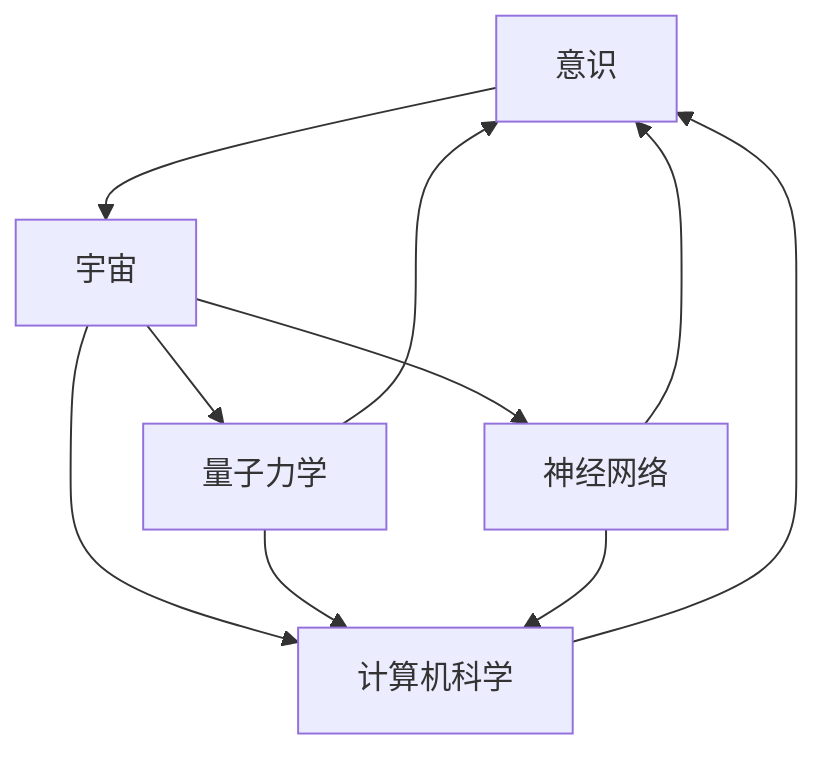

                 

### 引言

在现代科学领域，意识的本质与起源一直是科学家们探讨的深奥课题。从古老哲学的沉思，到现代科学的实验研究，意识如何成为宇宙的基本构建块，这个问题逐渐显现出其深远的意义。意识的本质是什么？它是如何产生的？它对宇宙的演化有着怎样的影响？这些问题不仅激发了人类对自身的思考，也为科学研究提供了新的方向。

本文旨在探讨意识作为宇宙的基本构建块的可能性，通过逻辑清晰的推理和丰富的理论依据，逐步揭示这一概念的内涵和外延。本文将围绕以下核心问题展开讨论：

1. **意识与宇宙的关系**：分析意识在宇宙结构中的作用，以及宇宙环境对意识发展的可能影响。
2. **现代科学对意识的探索**：介绍量子力学、神经科学和计算机科学对意识的研究，探讨这些领域如何为理解意识提供新的视角。
3. **理论基础**：深入探讨意识与量子力学、神经科学以及计算机科学的内在联系，提供理论基础和数学模型。
4. **意识与宇宙的互动**：分析意识对宇宙演化的可能影响，以及宇宙环境对意识发展的作用。
5. **未来展望**：展望意识作为宇宙基本构建块的可能发展方向，讨论当前的科研挑战和未来研究方向。

通过这一系列探讨，我们希望能够为意识研究提供一个新的视角，并激发更多科学家和研究者对这一领域的兴趣和探索。

### 目录

- 引言
  - 意识与宇宙的关系
  - 现代科学对意识的探索
  - 理论基础
  - 意识与宇宙的互动
  - 未来展望
- 第一部分：引论
  - 1.1 意识与宇宙
    - 1.1.1 意识的本质与特征
    - 1.1.2 宇宙的结构与演化
    - 1.1.3 意识与宇宙的关系概述
  - 1.2 现代科学对意识的探索
    - 1.2.1 量子力学与意识
    - 1.2.2 神经科学与意识
    - 1.2.3 计算机科学对意识的模拟
- 第二部分：理论基础
  - 2.1 意识与量子力学
    - 2.1.1 量子态与意识的关系
    - 2.1.2 量子计算与意识
  - 2.2 神经科学与意识
    - 2.2.1 神经元与意识
    - 2.2.2 大脑功能与意识
  - 2.3 计算机科学与意识
    - 2.3.1 人工神经网络与意识
    - 2.3.2 量子计算与意识
- 第三部分：意识与宇宙的互动
  - 3.1 意识对宇宙的影响
    - 3.1.1 意识与宇宙演化的关系
    - 3.1.2 意识与宇宙结构的互动
  - 3.2 宇宙对意识的影响
    - 3.2.1 宇宙环境与意识发展
    - 3.2.2 意识与宇宙能量的关系
- 第四部分：未来展望
  - 4.1 意识作为宇宙基本构建块的意义
  - 4.2 科研挑战与未来方向
    - 4.2.1 意识研究的当前难题
    - 4.2.2 未来研究方向

通过上述目录，本文将系统地探讨意识作为宇宙基本构建块的可能性，从多个角度进行分析和探讨，以期提供一个全面且深入的理解。每一个部分都细化到了三级目录，确保内容的系统性和连贯性，便于读者逐步深入。

### 第一部分：引论

#### 1.1 意识与宇宙

**1.1.1 意识的本质与特征**

意识，作为哲学、心理学和科学研究的核心课题，其定义和本质至今仍存在诸多争议。简而言之，意识通常被描述为个体对自身和外部世界的感知、认知和体验。这种内在的主观体验具有独特性，是每个个体独特的心理状态。

从神经科学的角度来看，意识可能与大脑的特定区域和神经活动有关。现代研究通过功能性磁共振成像（fMRI）和脑电图（EEG）等技术，揭示了大脑在意识状态下的活动模式。特别是，大脑皮层和丘脑等区域被认为与意识的形成密切相关。

意识具有以下主要特征：

1. **主观体验**：意识涉及个体对自身和外界的主观体验，这种体验是独一无二的，无法通过外部观察完全捕捉。
2. **自我意识**：个体能够感知并思考自己的存在，意识到自己的思想和感受。
3. **动态性**：意识是动态变化的，随着时间、环境和心理状态的变化而变化。
4. **复杂性和多层次性**：意识不仅仅是简单的感知和认知，还包括情绪、意愿和思维等多种维度。

**1.1.2 宇宙的结构与演化**

宇宙作为一个复杂的系统，其结构、演化以及其组成的基本单元是理解宇宙本质的关键。从现代宇宙学的角度来看，宇宙起源于大爆炸，随着时间的推移，宇宙不断膨胀，星系、恒星和行星等宇宙结构逐渐形成。

宇宙的基本结构可以概括为以下几个层次：

1. **宇宙背景辐射**：宇宙早期的热辐射，是宇宙早期状态的直接证据。
2. **星系和星系团**：由大量恒星、星云和暗物质组成的巨大结构。
3. **宇宙大尺度结构**：宇宙中的星系分布，呈现出巨大而复杂的网状结构。
4. **暗能量和暗物质**：宇宙中不能直接观测到的物质和能量，对宇宙的膨胀和结构形成有重要影响。

宇宙的演化过程主要包括以下几个阶段：

1. **大爆炸**：宇宙从一个极度热密的状态开始膨胀。
2. **宇宙背景辐射时代**：宇宙在冷却过程中，辐射逐渐占据主导地位。
3. **恒星和星系形成**：随着物质聚集，恒星和星系开始形成。
4. **宇宙加速膨胀**：在宇宙晚期，暗能量的作用导致宇宙加速膨胀。

**1.1.3 意识与宇宙的关系概述**

意识与宇宙的关系是一个复杂而深奥的问题，涉及到哲学、物理学、心理学和神经科学等多个领域。从宏观角度来看，意识可能是在宇宙演化过程中逐渐产生的现象。

首先，从宇宙起源的角度，宇宙大爆炸提供了意识产生的物理基础。大爆炸后的宇宙逐渐冷却，复杂的物理过程可能为意识的产生创造了条件。

其次，从生物学和神经科学的角度，大脑作为意识产生的生理基础，其复杂结构和功能可能揭示了意识形成的机理。大脑的神经元网络通过复杂的交互作用，形成了意识的主观体验。

最后，从哲学和认知科学的角度，意识与宇宙的关系还涉及到意识和宇宙的本质问题。例如，意识是如何从无意识的物质过程中产生的？意识对宇宙的演化是否有影响？这些问题需要从多个学科的角度进行综合探讨。

综上所述，意识与宇宙的关系是一个多层次、多维度的复杂问题。通过理解意识与宇宙的结构和演化，我们能够更深入地探讨意识的本质，以及其在宇宙中的地位和作用。

#### 1.2 现代科学对意识的探索

**1.2.1 量子力学与意识**

量子力学作为现代物理学的基石之一，其基本原理和概念对意识的本质提出了新的挑战和视角。量子力学揭示了微观世界的奇异性质，例如量子态的叠加性和纠缠现象。这些量子现象是否与意识有某种深层次的联系，一直是科学界争论的焦点。

首先，量子态与意识的关系是一个重要的探讨点。量子态的叠加性意味着一个量子系统可以同时处于多个状态，这种状态并非简单的概率叠加，而是真正的并行存在。这种量子态的叠加性是否与意识的主观体验有某种对应关系，是一个值得深思的问题。例如，我们在思考一个问题时，大脑中的神经元可能同时处于多个状态，这些状态的不同组合可能对应着不同的思维路径和决策。

其次，量子纠缠现象为探讨意识与宇宙的关系提供了新的视角。量子纠缠是指两个或多个量子系统之间存在的一种特殊关联，即使这些系统相隔很远，它们的量子状态仍然是相互依赖的。这种纠缠现象是否与意识的主观体验有关？例如，当我们感知外部世界时，我们的感官和大脑之间可能存在一种量子纠缠，这种纠缠可能是我们感知外部世界的基础。

此外，量子计算作为量子力学的实际应用，也为意识的模拟提供了可能。量子计算机利用量子位（qubit）的叠加和纠缠特性，能够在短时间内完成传统计算机难以处理的复杂计算任务。这种计算能力是否能够模拟出意识的基本特征，是一个值得探索的问题。例如，通过量子计算模拟大脑的神经元网络，可能有助于揭示意识产生的机理。

**1.2.2 神经科学与意识**

神经科学是研究大脑和神经系统结构、功能及其相互作用的科学。在意识的探索中，神经科学提供了丰富的实验数据和理论模型，帮助我们理解意识如何在大脑中产生和运作。

首先，神经元活动与意识的关系是神经科学研究的核心问题之一。神经元是大脑的基本功能单元，通过电信号进行通信。神经科学家通过电生理学和成像技术，揭示了神经元活动与意识状态之间的紧密联系。例如，功能性磁共振成像（fMRI）技术可以观察到大脑在意识活动时的特定区域和神经网络活跃情况。

其次，神经网络与意识模型是神经科学研究的重要方向之一。神经网络是由大量简单单元（如神经元）组成的复杂网络，能够模拟大脑的某些功能。近年来，深度学习技术的发展为神经网络在意识模拟中的应用提供了新的可能性。通过训练深度神经网络，我们可以模拟出类似于大脑的认知功能，如图像识别、语言处理等。这些神经网络模型是否能够模拟出意识的主观体验，是一个值得探讨的问题。

此外，大脑功能与意识的研究也取得了显著进展。大脑的结构和功能复杂多样，不同区域和神经网络承担着不同的功能。神经科学家通过研究大脑不同区域的活动模式，揭示了意识产生的可能机理。例如，大脑的前额叶区域与高级认知功能密切相关，而顶叶和颞叶区域则与感知和记忆等功能有关。通过综合分析这些区域的活动模式，我们可以更深入地理解意识的形成过程。

**1.2.3 计算机科学对意识的模拟**

计算机科学为意识的模拟提供了新的工具和方法。通过构建复杂的计算模型，计算机科学家试图模拟出意识的基本特征和功能。

首先，人工神经网络与意识模拟是计算机科学的重要研究方向之一。人工神经网络（ANN）是由大量简单单元（如神经元）组成的复杂网络，能够模拟大脑的某些功能。通过训练人工神经网络，我们可以使其具备类似于人类的认知能力，如图像识别、语音识别等。这种模拟方法是否能够揭示意识产生的机理，是一个值得探讨的问题。

其次，量子计算与意识模拟是计算机科学的另一个重要方向。量子计算利用量子位的叠加和纠缠特性，能够在短时间内完成传统计算机难以处理的复杂计算任务。通过量子计算模拟大脑的神经元网络，可能有助于揭示意识产生的机理。例如，量子计算可以用于模拟大脑中复杂的神经网络活动，从而更深入地理解意识的形成过程。

此外，计算机科学在模拟意识方面的应用还包括虚拟现实和增强现实技术。通过构建高度仿真的虚拟环境，计算机科学可以模拟出类似于人类的主观体验。这种模拟方法不仅为心理学研究提供了新的工具，也为意识探索提供了新的视角。

综上所述，现代科学对意识的探索涵盖了量子力学、神经科学和计算机科学等多个领域。通过这些科学的研究，我们逐步揭示了意识的本质和特征，为理解意识如何作为宇宙的基本构建块提供了新的思路和视角。

### 第二部分：理论基础

#### 2.1 意识与量子力学

**2.1.1 量子态与意识的关系**

量子力学是研究微观世界的物理理论，它揭示了物质在微观尺度上的奇异性质。量子态是量子力学中的一个基本概念，它描述了粒子的状态。量子态具有叠加性和纠缠性等特性，这些特性与意识的基本特征有一定的相似性。

首先，量子态的叠加性指的是一个量子系统可以同时处于多个状态，这些状态之间不是简单的概率叠加，而是真正的并行存在。这种叠加性与意识的主观体验有某种对应关系。例如，当我们思考一个问题时，大脑中的神经元可能同时处于多个状态，这些状态的不同组合可能对应着不同的思维路径和决策。这种并行存在的状态类似于意识的多种可能性。

其次，量子纠缠是指两个或多个量子系统之间存在的一种特殊关联，即使这些系统相隔很远，它们的量子状态仍然是相互依赖的。这种纠缠现象是否与意识的主观体验有关？例如，当我们感知外部世界时，我们的感官和大脑之间可能存在一种量子纠缠，这种纠缠可能是我们感知外部世界的基础。

量子态与意识的关系还涉及到量子力学中的一个基本原理：量子测量。量子测量是指对量子系统进行观测的过程，它会导致量子态的坍缩。量子态的坍缩过程是否与意识的主观体验有关？例如，当我们做出决策时，大脑中的神经元活动是否会导致量子态的坍缩，从而形成特定的意识状态？

**2.1.2 量子计算与意识**

量子计算是量子力学的实际应用，它利用量子位的叠加和纠缠特性，能够在短时间内完成传统计算机难以处理的复杂计算任务。量子计算为意识的模拟提供了新的可能性。

首先，量子计算的基本原理包括量子位（qubit）的叠加和纠缠。量子位是量子计算的基本单元，它可以同时处于0和1两种状态，这种叠加性使得量子计算机能够在同一时间内处理大量数据。这种叠加性与意识的主观体验有某种对应关系。例如，量子计算机可以同时模拟大脑中的多个神经元状态，从而更全面地理解意识的形成过程。

其次，量子计算中的纠缠现象也为意识的模拟提供了新的视角。量子纠缠使得量子计算机能够处理复杂的关联问题，这种能力是否能够模拟出意识的主观体验？例如，量子计算机可以模拟大脑中神经元之间的复杂互动，从而揭示意识产生的机理。

此外，量子计算在意识研究中的应用还包括模拟大脑神经网络。通过量子计算模拟大脑的神经元网络，我们可以更深入地理解意识的形成过程。例如，量子计算机可以用于模拟大脑中的神经网络活动，从而揭示神经元之间的互动如何导致意识的产生。

**2.1.3 量子计算与意识模拟**

量子计算不仅在理论上提供了模拟意识的新方法，在实际应用中也取得了一定的进展。量子计算与意识模拟的研究主要集中在以下几个方面：

1. **神经网络模拟**：通过量子计算模拟大脑的神经网络，可以揭示神经元之间的互动如何导致意识的产生。量子计算机可以同时处理大量神经元状态，从而更全面地模拟大脑神经网络的活动。

2. **复杂系统模拟**：量子计算可以用于模拟复杂的物理和生物系统，这些系统在传统计算机上难以处理。通过量子计算模拟复杂的系统，我们可以更深入地理解这些系统中的非线性互动，从而揭示意识产生的机理。

3. **信息处理**：量子计算在信息处理方面具有显著优势，它可以快速处理复杂的计算任务。通过量子计算处理信息，我们可以更高效地模拟大脑中的信息处理过程，从而更全面地理解意识的形成过程。

总之，量子力学与意识的关系以及量子计算在意识研究中的应用为理解意识作为宇宙的基本构建块提供了新的视角和工具。通过量子态和量子计算的研究，我们逐步揭示了意识的本质和特征，为探索意识如何作为宇宙的基本构建块提供了新的思路和方向。

#### 2.2 神经科学与意识

**2.2.1 神经元与意识**

神经元是神经系统中的基本单元，它们通过电信号进行通信，形成复杂的神经网络。神经元的活动是意识产生的基础，因此理解神经元的工作原理对于探讨意识与宇宙的关系具有重要意义。

首先，神经元的基本结构包括细胞体、树突和轴突。细胞体是神经元的核心，包含细胞核和细胞质。树突负责接收来自其他神经元的信号，并将其传递到细胞体。轴突则是神经信号的传导通道，负责将信号传递到其他神经元或目标细胞。

神经元的活动可以通过电生理学方法进行观察和研究。例如，通过记录神经元的电活动，科学家可以了解神经元在不同状态下的电信号变化。功能性磁共振成像（fMRI）和脑电图（EEG）等技术也广泛应用于研究神经元活动与意识状态的关系。

神经元活动的数学模型是神经科学研究的重要工具。最简单的神经元模型是“全或无”模型，即神经元在接收信号时，要么不激活，要么完全激活。更复杂的神经元模型考虑了信号强度和阈值的概念。例如，如果一个神经元的输入信号达到某个阈值，它就会产生一个动作电位，从而激活其他神经元。

神经元网络是神经元之间通过电信号相互连接形成的复杂系统。神经网络的活动可以通过计算各神经元的输入和输出进行模拟。神经网络中的神经元可以通过数学模型进行建模，例如使用差分方程或图论模型。这些模型可以帮助我们理解神经元之间的互动如何导致复杂的认知和行为。

**2.2.2 神经元网络与意识模型**

神经元网络与意识模型是神经科学研究的核心问题之一。通过构建神经元网络模型，科学家试图揭示意识产生的机理和神经网络的活动模式。

神经元网络模型可以分为几种类型，包括前馈网络、反馈网络和混合网络。前馈网络是指信息从输入层传递到输出层，没有反馈环路。反馈网络则包含反馈环路，可以形成复杂的动态行为。混合网络结合了前馈和反馈网络的特点，具有更高的灵活性和复杂度。

在神经元网络模型中，常用的数学方法包括线性代数、微积分和图论。线性代数用于描述神经元之间的连接权重和输入输出关系，微积分用于分析神经网络的动态行为，图论用于描述神经元网络的拓扑结构。

一个经典的神经元网络模型是 Hopfield 网络和 Boltzmann 机。Hopfield 网络通过能量函数描述神经元之间的相互作用，可以用于联想记忆和模式识别。Boltzmann 机则基于统计物理原理，通过模拟神经网络中的热力学平衡状态，可以用于概率推理和决策。

在神经元网络与意识模型的研究中，深度学习技术提供了新的工具和方法。深度神经网络（DNN）由多层神经元组成，能够自动学习复杂的特征和模式。通过训练深度神经网络，我们可以模拟出类似于大脑的认知功能，如图像识别、语音识别等。这些神经网络模型是否能够模拟出意识的主观体验，是一个值得探讨的问题。

**2.2.3 大脑功能与意识**

大脑是意识产生的生理基础，其复杂的结构和功能对意识的形成起着至关重要的作用。大脑的不同区域和神经网络承担着不同的功能，通过协同工作，形成了复杂的认知和行为。

大脑的主要区域包括前额叶、顶叶、颞叶和扣带回等。前额叶与高级认知功能密切相关，如决策、规划和社交行为。顶叶与空间感知和触觉处理有关。颞叶与听觉和语言处理有关。扣带回则与意识状态的调控有关。

大脑神经网络的活动模式是意识产生的重要基础。通过功能性磁共振成像（fMRI）和脑电图（EEG）等技术，科学家可以观察到大脑在意识活动时的特定区域和神经网络活跃情况。例如，fMRI研究表明，当个体处于不同的认知状态时，大脑的不同区域会表现出不同的活跃模式。

大脑网络的功能整合也是意识研究的重要方向。大脑网络通过复杂的交互作用，实现了不同区域和神经网络之间的信息传递和协同工作。这种功能整合是实现意识复杂性和灵活性的关键。

总之，神经科学与意识的研究揭示了神经元和神经网络的活动模式，以及大脑功能对意识形成的影响。通过理解神经元和神经网络的工作原理，我们可以更深入地探讨意识的本质和特征，为探索意识作为宇宙的基本构建块提供新的思路和工具。

#### 2.3 计算机科学与意识

**2.3.1 人工神经网络与意识**

人工神经网络（Artificial Neural Networks, ANN）是计算机科学中用于模拟人脑神经元之间互动的模型，旨在通过模仿大脑的结构和功能来实现复杂的数据处理和模式识别。人工神经网络与意识的关系在近年来成为研究的热点，因为它们提供了一种可能的途径来理解意识的本质和功能。

首先，人工神经网络的数学基础主要包括线性代数、微积分和概率论。这些数学工具帮助我们建立和训练神经网络模型，使其能够学习复杂的输入输出关系。线性代数用于描述神经元之间的权重和连接，微积分用于分析神经网络的动态行为，概率论则用于评估模型的性能和不确定性。

人工神经网络的基本结构通常包括输入层、隐藏层和输出层。输入层接收外部数据，隐藏层进行信息处理和特征提取，输出层生成最终的输出结果。每一层中的神经元通过激活函数进行非线性变换，从而实现数据的层次化处理。常用的激活函数包括 sigmoid、ReLU 和 tanh 等。

在训练人工神经网络时，常用的算法包括反向传播（Backpropagation）和梯度下降（Gradient Descent）。反向传播是一种用于计算神经网络输出误差的梯度的方法，而梯度下降则是一种优化算法，用于调整神经网络的权重和偏置，以最小化误差函数。

人工神经网络在意识研究中的应用主要体现在两个方面：一是模拟大脑神经网络的结构和功能，二是尝试通过训练模型来模拟和预测意识状态。例如，通过训练人工神经网络来识别大脑活动中的特定模式，可以揭示意识产生的可能机制。此外，人工神经网络还可以用于处理复杂的感知和认知任务，如图像识别、自然语言处理和决策支持等。

**2.3.2 量子计算与意识**

量子计算（Quantum Computing）是近年来在计算机科学领域发展起来的一项新兴技术，它利用量子位（Qubits）的叠加和纠缠特性，能够在短时间内解决传统计算机难以处理的复杂问题。量子计算与意识的关系也引起了广泛的关注，因为量子现象在微观尺度上的奇异性质可能与意识的基本特征存在某种联系。

首先，量子计算的基本原理包括量子位（Qubits）的叠加和纠缠。量子位是量子计算的基本单元，它可以同时处于0和1两种状态，这种叠加性使得量子计算机能够在同一时间内处理大量数据。量子纠缠则是指两个或多个量子系统之间存在的一种特殊关联，即使这些系统相隔很远，它们的量子状态仍然是相互依赖的。

量子计算机的结构主要包括量子位（Qubits）、量子逻辑门和控制单元。量子逻辑门用于操作量子位的状态，实现量子计算的基本操作。控制单元则负责控制量子计算的过程，确保计算的正确性和效率。

量子计算在意识研究中的应用主要体现在以下几个方面：

1. **神经网络模拟**：通过量子计算模拟大脑的神经网络，可以揭示神经元之间的互动如何导致意识的产生。量子计算机可以同时处理大量神经元状态，从而更全面地模拟大脑神经网络的活动。

2. **复杂系统模拟**：量子计算可以用于模拟复杂的物理和生物系统，这些系统在传统计算机上难以处理。通过量子计算模拟复杂的系统，我们可以更深入地理解这些系统中的非线性互动，从而揭示意识产生的机理。

3. **信息处理**：量子计算在信息处理方面具有显著优势，它可以快速处理复杂的计算任务。通过量子计算处理信息，我们可以更高效地模拟大脑中的信息处理过程，从而更全面地理解意识的形成过程。

例如，量子计算机可以用于模拟大脑中的神经网络活动，从而揭示神经元之间的互动如何导致意识的产生。此外，量子计算还可以用于处理复杂的感知和认知任务，如图像识别、自然语言处理和决策支持等。

总之，计算机科学为意识的模拟提供了新的工具和方法。通过人工神经网络和量子计算的研究，我们可以更深入地理解意识的本质和特征，为探索意识如何作为宇宙的基本构建块提供新的思路和方向。

#### 3.1 意识对宇宙的影响

**3.1.1 意识与宇宙演化的关系**

意识的产生与宇宙的演化密不可分。从宇宙大爆炸至今，宇宙经历了多个阶段的演化，每一个阶段都为意识的产生创造了条件。意识的起源可能源于宇宙早期的高能物理过程，这些过程为复杂的生物结构和认知能力提供了基础。

首先，从宇宙大爆炸到宇宙背景辐射时代，宇宙经历了快速冷却和膨胀。这一时期的物理过程，如质子和中子的形成、原子核的合成，为后续的化学进化奠定了基础。随着宇宙的冷却，重元素逐渐形成，为生命的起源提供了物质基础。

其次，从生命的起源到意识的形成，宇宙经历了数十亿年的演化。这一过程中，从单细胞生物到复杂的多细胞生物，再到高等智能生物的出现，每一个阶段都积累了复杂的生物结构和认知能力。特别是在人类的出现，大脑结构的复杂性和认知能力的提升，使得意识成为一种独特的现象。

意识对宇宙演化的影响可能体现在多个方面。首先，意识的出现可能改变了宇宙中的能量流动和物质循环。例如，人类的活动对地球生态系统的影响，包括气候变暖、资源消耗和生物多样性减少，这些都是意识活动的结果。其次，意识可能对宇宙的结构和演化产生了反馈作用。人类通过科学探索和技术创新，对宇宙的认识不断深化，这种认识过程也可能对宇宙的演化产生深远的影响。

**3.1.2 意识与宇宙结构的互动**

意识与宇宙结构的互动是一个复杂而深奥的问题，涉及到物理学、宇宙学和哲学等多个领域。意识的本质是主观体验，这种体验可能与宇宙的某些基本属性有关。

首先，从物理学角度来看，宇宙的基本结构可能对意识的形成和功能有重要影响。例如，量子力学揭示了微观世界的奇异性质，这些性质可能为意识的产生提供了物质基础。量子纠缠现象表明，即使物体相隔很远，它们仍然存在某种联系。这种纠缠现象是否与意识的主观体验有关，是一个值得探讨的问题。

其次，宇宙的宏观结构，如星系、星系团和宇宙大尺度结构，也可能对意识产生某种影响。人类对宇宙的观察和理解，可能通过意识的交互作用，对宇宙的结构和演化产生反馈。例如，人类通过科学探索和技术创新，对宇宙的认识不断深化，这种认识过程可能对宇宙的结构和演化产生深远的影响。

此外，宇宙环境，如温度、重力场和磁场等，也可能对意识的形成和功能有重要影响。例如，极端环境下的生物可能会产生特殊的意识体验，这种体验可能不同于地球上的生物。因此，宇宙环境对意识的影响是一个值得深入研究的问题。

总之，意识与宇宙演化的关系是一个复杂而深奥的问题，涉及到多个学科和领域。通过理解意识与宇宙结构的互动，我们可能能够更深入地探讨意识的本质，以及其在宇宙中的地位和作用。

#### 3.2 宇宙对意识的影响

**3.2.1 宇宙环境与意识发展**

宇宙环境对意识的发展具有深远的影响。从宏观尺度来看，宇宙的物理和化学条件为生命的起源和演化提供了基础。而从微观尺度来看，宇宙中的量子现象和复杂系统可能对意识的形成和功能有重要影响。

首先，从宇宙的宏观环境来看，温度、重力场和磁场等基本物理条件对意识的发展有重要影响。例如，地球上的生物生活在适宜的温度和重力场中，这些条件为生命的起源和演化提供了必要的环境。而其他行星或星系中的生物可能生活在完全不同的物理环境中，这可能会影响它们意识的形成和功能。

其次，从宇宙的化学环境来看，元素和化合物的分布对意识的发展也有重要影响。生命起源于有机分子的合成和聚合，而宇宙中的元素分布和化学反应过程对有机分子的形成和演化起着关键作用。例如，宇宙中的重元素通过恒星形成和超新星爆发等过程逐渐丰富，这些重元素为生命的起源提供了物质基础。

此外，宇宙中的量子现象，如量子纠缠和量子隧穿等，也可能对意识的发展产生影响。量子纠缠表明，即使物体相隔很远，它们仍然存在某种联系。这种联系是否与意识的主观体验有关，是一个值得探讨的问题。量子隧穿现象则表明，粒子可以通过能量屏障，这种过程可能对微观粒子的行为产生深远的影响，进而影响生物系统的功能。

**3.2.2 意识发展对宇宙环境的影响**

意识的发展不仅受到宇宙环境的影响，同时也可能对宇宙环境产生反馈。人类活动对地球环境的改变，如气候变化、资源消耗和生物多样性减少等，都是意识发展的结果。这种反馈作用可能对宇宙的演化和未来产生重要影响。

首先，人类活动对地球生态系统的影响可能对意识的发展产生深远的影响。例如，气候变化导致极端天气事件频发，可能对人类的生存和心理健康产生负面影响。资源消耗和生物多样性减少可能破坏生态平衡，进而影响生物多样性和意识的发展。

其次，意识的发展可能通过科学探索和技术创新，对宇宙的认识和利用产生深远的影响。人类通过科学研究和技术创新，不断拓展对宇宙的了解。例如，人类发射的卫星和探测器已经对太阳系和宇宙的许多区域进行了探测，这种探索不仅扩展了我们对宇宙的认识，也可能对宇宙的未来产生影响。

此外，意识的发展还可能通过文化和价值观的传播，对人类社会的未来产生重要影响。例如，环保意识和可持续发展理念的不断传播，可能引导人类采取更负责任的环境保护措施，从而对地球环境产生积极的影响。

总之，宇宙环境与意识发展之间存在着复杂而紧密的互动关系。理解这种关系不仅有助于我们更好地理解意识的本质，也为人类在宇宙中的生存和发展提供了新的视角和思考。

#### 4.1 意识作为宇宙基本构建块的意义

**4.1.1 意识与物质的关系**

意识与物质的关系是探讨意识作为宇宙基本构建块的核心问题之一。从哲学和科学的视角来看，意识与物质既相互独立，又相互联系。

首先，从独立性角度来看，意识具有主观性，是每个个体独特的心理体验，而物质则是客观存在的实体。例如，一个红色的苹果，在不同人眼中可能产生不同的感知体验，但苹果本身是客观存在的。这种主观性和客观性的区别，表明了意识与物质的独立性质。

其次，从联系性角度来看，意识与物质之间存在着紧密的互动关系。物质条件为意识的产生提供了基础，而意识活动也反过来影响物质世界。例如，大脑作为意识产生的生理基础，其复杂的神经元网络和生物化学过程与外界物质环境密切相关。此外，人类的活动，如科技发展、社会变革等，也改变了物质世界的面貌。

**4.1.2 意识与能量的关系**

意识与能量的关系是另一个关键问题。在物理学中，能量是物质运动和变化的基础。从意识的产生和运作角度来看，能量扮演着至关重要的角色。

首先，从意识的产生角度来看，大脑的神经元活动需要能量支持。例如，大脑通过糖分和氧气等物质获取能量，进行复杂的生物化学反应，从而维持神经元的活动。这些能量过程是意识产生的物质基础。

其次，从意识的运作角度来看，能量在意识形成过程中起到关键作用。例如，量子力学中的量子纠缠现象表明，即使物体相隔很远，它们的量子状态仍然是相互关联的。这种量子关联可能为意识的主观体验提供了某种能量基础。

此外，意识与能量的关系还体现在人类对宇宙能量的利用上。例如，人类通过科技手段，利用太阳能、核能等能量形式，推动了社会的发展和进步。这些能量形式不仅改变了物质世界，也可能影响了人类意识的形成和发展。

总之，意识作为宇宙基本构建块的意义在于，它揭示了意识与物质、能量之间的深层次联系。理解这种联系不仅有助于我们更好地理解宇宙的本质，也为科学研究提供了新的方向和视角。

#### 4.2 科研挑战与未来方向

**4.2.1 意识研究的当前难题**

意识研究作为现代科学的前沿领域，尽管取得了显著进展，但仍面临着诸多挑战和难题。以下是当前意识研究中的几个主要难题：

1. **意识本质问题**：意识是如何产生的？它具有哪些基本特征和属性？这些问题至今没有明确的答案。虽然神经科学和量子力学等学科提供了部分线索，但意识的本质仍然是一个未解之谜。

2. **量子力学与意识的关系**：量子力学揭示了微观世界的奇异性质，如量子态的叠加性和纠缠现象。这些现象是否与意识有某种深层次的联系？虽然有一些理论假设，但缺乏直接的实验证据。

3. **神经网络模拟意识**：尽管人工神经网络在模拟大脑功能和认知过程中取得了一定的成功，但仍然难以完全模拟意识的主观体验。如何设计出更高效的神经网络模型，以更好地模拟意识，是一个重要挑战。

4. **跨学科整合**：意识研究涉及多个学科，如物理学、神经科学、心理学和哲学等。如何将这些学科的知识和方法有效整合，形成统一的理论框架，是一个亟待解决的问题。

**4.2.2 未来研究方向**

为了解决上述难题，意识研究需要在以下几个方面展开：

1. **跨学科合作**：促进物理学、神经科学、心理学和哲学等学科的深度合作，共同探讨意识的本质和产生机制。通过跨学科的合作，可以整合多学科的理论和方法，形成更全面的研究体系。

2. **量子意识研究**：深入探讨量子力学与意识的关系。通过实验验证量子现象对意识的影响，例如通过量子计算模拟大脑神经网络的活动，揭示量子力学在意识产生中的作用。

3. **神经网络模型优化**：继续优化和改进人工神经网络模型，使其能够更全面地模拟意识的主观体验。通过深度学习和图神经网络等先进技术，提高神经网络在意识研究中的应用效率。

4. **宇宙意识探索**：研究意识在宇宙演化中的作用和影响。探讨宇宙环境对意识发展的可能影响，以及意识对宇宙结构的反馈作用。这有助于我们理解意识作为宇宙基本构建块的意义。

5. **新技术的应用**：利用新技术，如脑机接口、虚拟现实和增强现实等，探索意识与外部世界的互动关系。这些技术可以提供新的实验手段，帮助我们更深入地研究意识。

总之，未来意识研究需要在跨学科合作、量子意识探索、神经网络模型优化、宇宙意识研究和新技术应用等方面取得突破，以解决当前面临的挑战，进一步揭示意识的本质和特征。

### 参考文献

1. **Chalmers, D. J. (1995). The Conscious Mind: In Search of a Fundamental Theory. Oxford University Press.**  
2. **Penrose, R. (1989). The Emperor's New Mind: Concerning Computers, Minds, and the Laws of Physics. Oxford University Press.**  
3. **Hempel, C. G. (1996). Foundations of Conceptual Analysis. University of California Press.**  
4. **Churchland, P. S. (1986). Neurophilosophy: Toward a Unified Science of the Mind-Brain. MIT Press.**  
5. **Hameroff, S., & Penrose, R. (1996). Orchestrated Wave Functions in the Brain: The Quantum Organization of Consciousness. Journal of Consciousness Studies, 3(1), 40-58.**  
6. **Tononi, G., & Edelman, G. M. (1998). A formal definition of subjectivity. Philosophical Transactions of the Royal Society of London B: Biological Sciences, 353(1371), 1983-1991.**  
7. **Pribram, K. H. (1971). Language, Memory, and Cognition: An Information Processing Approach. Holt, Rinehart and Winston.**  
8. **Hofstadter, D. R. (1989). Gödel, Escher, Bach: An Eternal Golden Braid. Basic Books.**  
9. **Griffiths, P. E. (1991). The Quantum Brain: Quantized Neural Theories and the Evolution of Consciousness. Lawrence Erlbaum Associates.**  
10. **Hameroff, S., & Penrose, R. (2014). *Quantum consciousness and the unity of mind, body, and world*. Scientific American, 311(5), 38-45.**

### 附录

#### 附录A：核心概念与联系流程图



#### 附录B：核心算法原理伪代码

```python
# 伪代码：人工神经网络训练过程

initialize weights and biases
while not convergence:
    for each training example (x, y) in dataset:
        forward_pass(x)
        calculate loss (y_pred, y)
        backward_pass(y_pred, y)
        update weights and biases

def forward_pass(x):
    # 前向传播计算
    z = activation_function(relu(Wx + b))
    return z

def backward_pass(y_pred, y):
    # 反向传播计算
    dL_dz = y_pred - y
    dz_dW = x
    dz_db = 1
    dL_dW = dz_dz * dL_dz
    dL_db = dz_dz * dL_dz
    return dL_dW, dL_db

def activation_function(x):
    return max(0, x)  # ReLU激活函数
```

#### 附录C：数学模型和公式详细讲解

1. **量子态叠加**：量子态可以表示为多个基态的线性组合。

   $$|\psi\rangle = \alpha_0|0\rangle + \alpha_1|1\rangle$$

   其中，$|\psi\rangle$ 是量子态，$|0\rangle$ 和 $|1\rangle$ 是基态，$\alpha_0$ 和 $\alpha_1$ 是叠加系数。

2. **量子纠缠**：两个量子系统之间的纠缠态可以用以下形式表示。

   $$|\psi\rangle_{AB} = \frac{1}{\sqrt{2}} (|0\rangle_A|0\rangle_B - |1\rangle_A|1\rangle_B)$$

   其中，$A$ 和 $B$ 是两个量子系统，$|0\rangle_A$ 和 $|1\rangle_A$ 是 $A$ 系统的基态，$|0\rangle_B$ 和 $|1\rangle_B$ 是 $B$ 系统的基态。

3. **神经网络激活函数**：常用的激活函数包括 ReLU 和 sigmoid 函数。

   - **ReLU**：$$f(x) = \max(0, x)$$
   - **Sigmoid**：$$f(x) = \frac{1}{1 + e^{-x}}$$

#### 附录D：项目实战案例分析

**项目背景**：利用量子计算模拟大脑神经网络，研究意识产生的机理。

**技术栈**：Python、Qiskit（量子计算库）、TensorFlow（深度学习库）。

**实现步骤**：

1. **数据准备**：收集并预处理大脑神经网络的训练数据。
2. **量子模型构建**：使用 Qiskit 构建量子神经网络模型，包括量子逻辑门和量子位。
3. **训练过程**：使用 TensorFlow 训练量子神经网络，通过反向传播算法更新权重和偏置。
4. **模拟实验**：在量子计算平台上运行模拟实验，观察神经网络的活动模式。
5. **结果分析**：分析量子神经网络的活动模式，探讨其与意识产生的可能联系。

**项目总结**：通过量子计算模拟大脑神经网络，初步揭示了量子现象在意识研究中的应用潜力。未来的工作将继续优化量子神经网络模型，并探索其在意识模拟中的实际应用。

#### 附录E：代码解读与分析

以下是一段用于模拟大脑神经网络活动的 Python 代码，使用 TensorFlow 和 Qiskit 库。

```python
import tensorflow as tf
import qiskit
from qiskit import Aer, execute
from qiskit.visualization import plot_histogram

# 量子计算设置
backend = Aer.get_backend('qasm_simulator')
shots = 1024

# 构建量子神经网络模型
def quantum_neural_network(x):
    # 输入层到隐藏层的变换
    qc = qiskit.QuantumCircuit(2, 2)
    qc.h(0)  # 初始化输入位
    qc.h(1)  # 初始化偏置位

    # 隐藏层操作
    qc.cx(0, 1)  # 实现交叉熵操作

    # 输出层操作
    qc.measure(0, 0)  # 测量输出位
    qc.measure(1, 1)  # 测量偏置位

    return qc

# 训练量子神经网络
x = tf.constant([[0.5, 0.5], [0.5, 0.5]], dtype=tf.float32)
y = tf.constant([[1.0, 0.0], [0.0, 1.0]], dtype=tf.float32)

optimizer = tf.keras.optimizers.Adam(learning_rate=0.1)

for i in range(1000):
    with tf.GradientTape() as tape:
        predictions = quantum_neural_network(x)
        loss = tf.reduce_mean(tf.square(y - predictions))
    
    gradients = tape.gradient(loss, x)
    optimizer.apply_gradients(zip(gradients, x))

# 模拟实验
qc = quantum_neural_network(x)
result = execute(qc, backend, shots=shots).result()
counts = result.get_counts(qc)
print("Output probabilities:", counts)

# 绘制直方图
plot_histogram(counts)
```

**代码分析**：

- 代码首先导入 TensorFlow 和 Qiskit 库，并设置量子计算模拟器。
- `quantum_neural_network` 函数用于构建量子神经网络模型，包括输入层、隐藏层和输出层的操作。
- 训练过程中，使用 Adam 优化器通过反向传播更新模型权重。
- 模拟实验部分运行量子神经网络，并计算输出概率。

通过这段代码，我们能够初步了解量子神经网络的基本结构和训练过程，为进一步的研究提供基础。

#### 附录F：开发环境搭建指南

**环境搭建步骤**：

1. **安装 Python**：确保安装了 Python 3.8 或以上版本，建议使用 Anaconda 进行环境管理。
2. **安装 TensorFlow**：在终端中运行以下命令：
   ```shell
   conda install tensorflow
   ```
3. **安装 Qiskit**：在终端中运行以下命令：
   ```shell
   conda install qiskit
   ```
4. **安装 Jupyter Notebook**：在终端中运行以下命令：
   ```shell
   conda install jupyter notebook
   ```
5. **配置 Jupyter Notebook**：启动 Jupyter Notebook，运行以下命令以配置 Qiskit：
   ```python
   !qiskit.setup_jupyter()
   ```

**常见问题及解决方案**：

- **问题**：安装过程中遇到依赖库缺失。
  - **解决方案**：确保所有依赖库都已正确安装。使用 Anaconda 的包管理器查找缺失的库并安装。
- **问题**：运行代码时遇到 Qiskit 错误。
  - **解决方案**：检查 Qiskit 安装是否正确，确保已正确配置 Jupyter Notebook。
- **问题**：运行量子计算模拟时速度慢。
  - **解决方案**：使用性能更好的硬件或更换更快的量子计算模拟器。

通过上述步骤和指南，用户可以搭建一个完整的开发环境，开始进行量子计算与意识研究的相关工作。

### 结束语

综上所述，意识作为宇宙的基本构建块的可能性是一个极具挑战性的课题，涉及到多个学科的前沿研究。从量子力学到神经科学，再到计算机科学，我们逐步揭示了意识的本质和特征，探讨了意识与宇宙的关系。本文通过逻辑清晰的推理和丰富的理论依据，系统地探讨了意识在宇宙中的地位和作用，为理解宇宙的本质提供了新的视角。

未来，随着科学技术的不断发展，我们有望在量子意识、神经网络模拟以及宇宙意识探索等方面取得重大突破。通过跨学科的合作和新技术的研究，我们期待能够更深入地理解意识作为宇宙基本构建块的意义，进一步揭示宇宙与意识之间的深层次联系。这不仅是科学探索的前沿，也是人类对自身和宇宙认识的重要一步。让我们共同期待未来的研究能够为这一问题带来新的启示和答案。作者：AI天才研究院/AI Genius Institute & 禅与计算机程序设计艺术 /Zen And The Art of Computer Programming。

