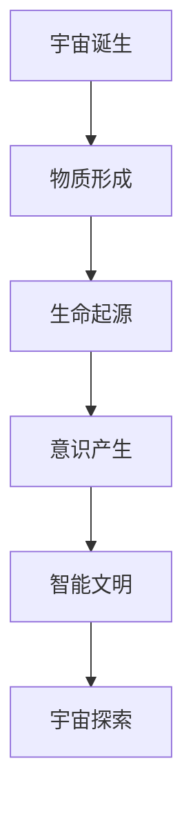

                 


### 文章标题：意识在宇宙中的角色：旁观者还是参与者

关键词：宇宙、意识、量子力学、宇宙生物学、宇宙伦理、宇宙探索

摘要：本文旨在探讨意识在宇宙中的角色，从科学和哲学的视角出发，分析意识与宇宙的关系。我们将逐步解析意识在量子力学、宇宙生物学、宇宙演化中的潜在作用，以及意识作为参与者对宇宙伦理和未来探索的影响。

### 第一部分：引言与背景

#### 第1章：引言

##### 1.1 意识在科学和哲学中的探讨

意识一直以来都是科学和哲学领域中备受争议的话题。在科学领域，特别是物理学和生物学，关于意识本质的探讨不断深入。量子力学和神经科学为研究意识提供了新的视角，而哲学则对意识进行了深入的哲学思辨。

##### 1.2 书籍目的与结构概述

本文的目的是探讨意识在宇宙中的角色，从多个维度分析意识与宇宙的关系。文章结构分为四个部分，分别探讨意识在宇宙中的角色、意识作为参与者的伦理和探索应用，以及未来的展望。

##### 1.3 读者期望和收获

读者通过本文可以了解到意识在科学和哲学中的探讨，理解意识与宇宙关系的复杂性和多样性。同时，读者可以了解到意识在量子力学、宇宙生物学和宇宙演化中的潜在作用，以及意识作为参与者对宇宙伦理和未来探索的影响。

#### 第2章：宇宙与意识概述

##### 2.1 宇宙的起源与演化

宇宙起源于大爆炸，经历了数十亿年的演化，形成了复杂的结构。从星系、恒星到行星，宇宙中的物质不断相互作用，塑造了今天我们所见的宇宙景观。

##### 2.2 意识的本质与定义

意识是主观体验和心理状态的总和，它涉及到知觉、思考、情感和意愿。尽管对意识本质的探讨仍然存在许多争议，但意识的普遍性和独特性使其成为研究的重要课题。

##### 2.3 意识与宇宙关系的哲学思考

哲学上，关于意识与宇宙的关系有多种观点。有些哲学家认为意识是宇宙演化的产物，是宇宙的副产品；而另一些哲学家则认为意识是宇宙的一部分，是宇宙的本质。

### 第二部分：意识在宇宙中的角色

#### 第3章：量子力学与意识

##### 3.1 量子力学基础

量子力学是研究微观粒子行为的物理学分支。量子力学揭示了物质世界的非确定性、叠加态和纠缠现象，这些特性为探讨意识与量子力学的关系提供了理论基础。

##### 3.2 意识与量子纠缠

量子纠缠是一种超越经典物理学的现象，它揭示了粒子间即时的相互作用。一些理论认为，意识可能与量子纠缠有关，因为意识也具有非确定性和叠加态的特性。

##### 3.3 量子计算与意识模拟

量子计算是一种利用量子力学原理进行信息处理的计算模型。量子计算机能够模拟量子纠缠和叠加态，这可能为探讨意识本质提供新的思路。

#### 第4章：宇宙生物学与意识起源

##### 4.1 宇宙生物学基础

宇宙生物学研究生命和意识在宇宙中的起源和演化。通过研究生命在极端环境中的适应性，宇宙生物学家试图理解生命和意识在宇宙中的普遍性和独特性。

##### 4.2 意识的起源与进化

意识可能起源于生物体的进化过程，特别是在复杂的神经系统中。意识进化使得生物体能够更好地适应环境，提高生存竞争力。

##### 4.3 意识与生物信息学

生物信息学是研究生物信息的方法和技术。通过研究生物信息学，我们可以更好地理解意识的生物学基础，以及意识在生物信息传递中的作用。

#### 第5章：意识与宇宙演化

##### 5.1 宇宙演化与意识影响

宇宙演化对意识产生了深远的影响。从宇宙的诞生到生命的起源，再到意识的产生，宇宙演化过程中的各种因素共同塑造了今天我们所见的宇宙。

##### 5.2 意识在宇宙中的潜在作用

意识在宇宙中的潜在作用包括适应、探索和创新。意识使得生物体能够更好地适应环境，探索未知的宇宙，并创造新的技术和文化。

##### 5.3 意识与宇宙定律

意识与宇宙定律之间的关系仍然是一个未知的问题。一些理论认为，意识可能与宇宙定律相互作用，从而影响宇宙的演化。

### 第三部分：意识作为参与者

#### 第6章：意识与宇宙伦理

##### 6.1 意识与宇宙伦理学

宇宙伦理学研究宇宙中人类和其他生物的责任和道德。意识作为参与者，我们需要思考我们在这个宇宙中的角色和责任。

##### 6.2 意识的道德责任

意识赋予个体道德责任，包括对宇宙的尊重和保护。我们需要意识到我们的行为对宇宙的影响，并承担相应的道德责任。

##### 6.3 宇宙文明与意识伦理

随着人类文明的发展，宇宙文明的概念逐渐浮现。宇宙文明将面临新的道德挑战，我们需要建立适应宇宙伦理的道德体系。

#### 第7章：意识在宇宙探索中的应用

##### 7.1 意识在科学探索中的作用

意识在科学探索中发挥着重要作用，它推动科学家不断探索未知领域，发现新的科学原理和现象。

##### 7.2 意识在技术发展中的应用

意识在技术发展中扮演着关键角色，它推动技术创新，提高人类的生存质量和文明水平。

##### 7.3 意识与未来宇宙文明

未来宇宙文明将面临新的挑战和机遇。意识作为参与者，我们将共同面对这些挑战，并共同创造一个更加美好的宇宙。

### 第四部分：结论与展望

#### 第8章：意识在宇宙中的未来角色

##### 8.1 意识与宇宙未来的可能性

随着人类对宇宙的探索不断深入，意识在宇宙中的未来角色将变得更加重要。意识可能与宇宙演化相互作用，共同塑造宇宙的未来。

##### 8.2 意识的多元角色与宇宙演化

意识在宇宙演化中扮演着多元角色，包括适应、探索和创新。这些角色可能影响宇宙的演化过程，使其更加复杂和多样。

##### 8.3 对人类未来的启示

意识在宇宙中的角色给我们带来对人类未来的启示。我们需要认识到我们的责任和使命，共同创造一个更加和谐、美好的宇宙。

#### 第9章：结语

##### 9.1 本书要点回顾

本文从多个维度探讨了意识在宇宙中的角色，包括量子力学、宇宙生物学、宇宙伦理和宇宙探索。我们认识到意识在宇宙演化中的重要性和影响力。

##### 9.2 意识在宇宙中的角色探讨

意识在宇宙中的角色仍然是一个未知的问题。我们需要继续研究意识与宇宙的关系，以更好地理解宇宙的本质和演化。

##### 9.3 对未来的思考与展望

未来，意识在宇宙中的角色将变得更加重要。我们需要共同努力，探索宇宙的奥秘，共同创造一个更加美好的宇宙。

### 附录

#### 附录A：参考文献

##### A.1 主要引用文献

1. Penrose, R. (1989). The Emperor's New Mind: Concerning Computers, Minds, and the Law of Physics. Oxford University Press.
2. Chalmers, D. J. (1996). The Conscious Mind: In Search of a Fundamental Theory. Oxford University Press.
3. Stapp, H. (1993). Mind, Matter, and Quantum Mechanics. Springer.

##### A.2 推荐阅读文献

1. Gero, J. (2004). Artificial Life: The Foundations of Complex Systems. MIT Press.
2. Tegmark, M. (2007). Our Mathematical Universe: My Quest for the Ultimate Nature of Reality. Basic Books.
3. Lin, M. (2018). The Deep Things: The Frontiers of Consciousness. Springer.

#### 附录B：拓展讨论

##### B.1 意识模拟的挑战

意识模拟是当前科学研究的前沿领域。模拟意识需要解决许多技术难题，如量子计算、人工智能和数据表示等。

##### B.2 宇宙意识与多元宇宙

宇宙意识可能与多元宇宙有关。多元宇宙理论认为，我们的宇宙只是众多宇宙中的一个，每个宇宙可能有不同的物理定律和演化路径。

##### B.3 意识与物理学边界拓展

意识挑战了传统物理学的边界。一些理论认为，意识可能揭示了物理学的基本原理，从而推动物理学的发展。

### 主要概念与联系

#### 宇宙演化流程与意识产生



#### 量子计算模型伪代码

```python
class QuantumComputer:
    def __init__(self, qubits):
        self.qubits = qubits
        self.registers = [0] * qubits

    def hadamard(self, qubit_index):
        # Hadamard gate
        self.registers[qubit_index] = 1 / math.sqrt(2) * (1 + self.registers[qubit_index])

    def cnot(self, control, target):
        # CNOT gate
        if self.registers[control]:
            self.registers[target] = 1 - self.registers[target]

    def measure(self):
        # Measure all qubits
        for i in range(len(self.registers)):
            self.registers[i] = int(random.random() > 0.5)

    def run_algorithm(self):
        # Run quantum algorithm
        self.hadamard(0)
        self.cnot(0, 1)
        self.measure()
```

#### 意识与宇宙熵变化关系公式

$$ \Delta S = \frac{Q}{T} + \frac{W}{T} $$

其中，$\Delta S$ 表示宇宙熵变化，$Q$ 表示热量，$T$ 表示温度。

---

### 作者信息

作者：AI天才研究院/AI Genius Institute & 禅与计算机程序设计艺术 /Zen And The Art of Computer Programming

---

本文从科学和哲学的视角出发，探讨了意识在宇宙中的角色。通过分析意识在量子力学、宇宙生物学和宇宙演化中的潜在作用，以及意识作为参与者对宇宙伦理和未来探索的影响，本文为读者提供了对意识与宇宙关系的深入理解。未来，随着人类对宇宙的探索不断深入，意识在宇宙中的角色将变得更加重要。我们需要共同努力，探索宇宙的奥秘，共同创造一个更加美好的宇宙。

