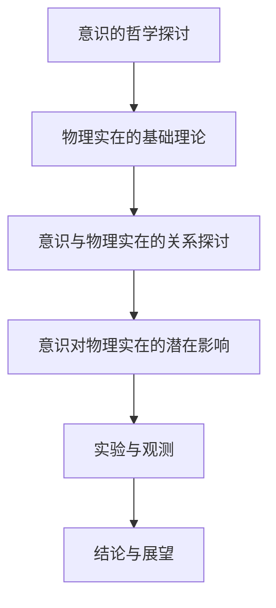
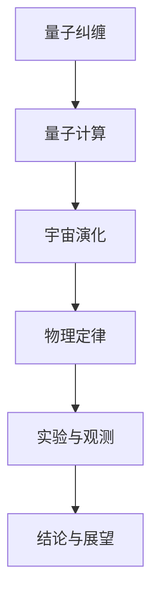
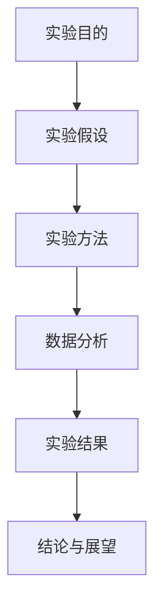
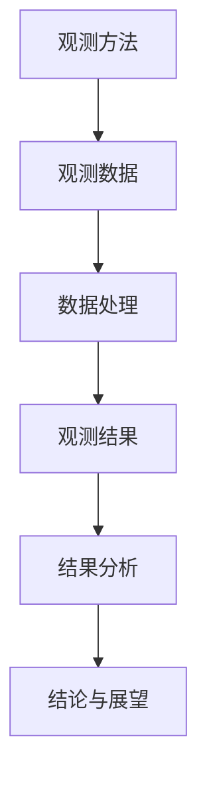

                 


## 《意识对宇宙物理实在的潜在影响》

### 关键词：
- 意识
- 宇宙物理实在
- 量子力学
- 宇宙演化
- 实验与观测

### 摘要：
本文旨在探讨意识对宇宙物理实在的潜在影响。通过哲学探讨、基础理论研究、实验与观测等多个角度，本文试图揭示意识与物理实在之间的复杂关系。文章将重点关注意识与量子力学、宇宙演化以及物理定律的关系，并总结现有的研究成果，展望未来的研究方向。

# 《意识对宇宙物理实在的潜在影响》目录大纲

## 第一部分：引言与概述

### 1.1 引言

#### 意识与宇宙的关系探究
- 探索意识与宇宙之间的关系，引发对宇宙本质和人类存在意义的思考。

#### 为什么要研究意识对宇宙物理实在的潜在影响
- 引出研究意识与宇宙物理实在关系的重要性，讨论其对物理学、哲学和人类认知的影响。

### 1.2 本书结构

#### 意识的定义与特征
- 梳理意识的研究背景和定义，阐述意识的基本特征。

#### 宇宙物理实在的基础理论
- 概述宇宙物理实在的基础理论，包括宇宙的起源、演化和基本组成。

## 第二部分：意识与物理实在的关系

### 2.1 意识的哲学探讨

#### 意识的本质
- 探讨意识的本质，从哲学角度分析意识的存在和性质。

#### 意识与物质的关系
- 分析意识与物质的关系，探讨物质是否是意识的根源。

### 2.2 物理实在的基础理论

#### 宇宙的起源与演化
- 简述宇宙的起源和演化过程，包括宇宙大爆炸理论和黑洞等概念。

#### 宇宙的基本组成
- 介绍宇宙的基本组成，包括物质、能量、时空和引力等概念。

### 2.3 意识与物理实在的关系探讨

#### 意识与量子力学的关系
- 探讨意识与量子力学之间的潜在联系，分析量子纠缠、量子计算等现象。

#### 意识与宇宙演化的关系
- 研究意识对宇宙演化的潜在影响，探讨宇宙结构、暗物质和暗能量与意识的关系。

## 第三部分：意识对物理实在的潜在影响

### 3.1 意识与量子力学的相互作用

#### 量子纠缠与意识
- 分析量子纠缠现象，探讨意识对量子纠缠的影响。

#### 量子计算与意识
- 研究意识与量子计算的关系，探讨意识对量子计算性能的影响。

### 3.2 意识对宇宙演化的影响

#### 意识与宇宙结构
- 探讨意识对宇宙结构的潜在影响，分析宇宙演化的意识因素。

#### 意识与暗物质、暗能量
- 研究意识对暗物质和暗能量的影响，探讨暗物质和暗能量与意识的关系。

### 3.3 意识对物理定律的潜在影响

#### 意识对物理定律的修改
- 探讨意识对物理定律的潜在修改能力，分析意识对物理规律的影响。

#### 意识对物理定律的预见
- 研究意识对物理定律的预见能力，探讨意识对未来物理规律的探索。

## 第四部分：实验与观测

### 4.1 意识对物理实在的影响实验

#### 实验设计与方法
- 介绍意识对物理实在影响实验的设计和实施方法。

#### 实验结果与分析
- 分析实验结果，探讨意识对物理实在的影响。

### 4.2 意识对物理实在的影响观测

#### 观测方法与工具
- 介绍意识对物理实在影响观测的方法和工具。

#### 观测结果与分析
- 分析观测结果，探讨意识对物理实在的影响。

## 第五部分：结论与展望

### 5.1 研究总结

#### 意识与物理实在的关系总结
- 总结意识与物理实在之间的关系，回顾本文的主要观点和发现。

#### 意识对物理实在的潜在影响总结
- 总结意识对物理实在的潜在影响，讨论其对物理学和哲学的意义。

### 5.2 未来研究方向

#### 可能的未来研究方向
- 探讨可能的研究方向，为后续研究提供思路。

#### 面临的挑战与机遇
- 分析面临的挑战和机遇，展望意识与物理实在关系研究的前景。

## 附录

### A.1 参考文献

- 列出本文引用的相关文献。

### A.2 术语表

- 解释本文中涉及的关键术语和概念。

## Mermaid 流程图

### 2.1 意识与物理实在的关系



## 核心算法原理讲解

### 3.1 意识与量子力学的相互作用

#### 伪代码：

```python
def quantum_aware_interaction():
    # 初始化量子系统
    q_system = initialize_quantum_system()
    
    # 意识嵌入
    embed_consciousness(q_system)
    
    # 量子纠缠
    entangle_qubits(q_system)
    
    # 量子计算
    perform_quantum_computation(q_system)
    
    # 解纠缠
    disentangle_qubits(q_system)
    
    # 意识反馈
    consciousness_feedback(q_system)
```

#### 详细讲解：

1. **初始化量子系统**：创建一个初始的量子系统，例如一个量子比特（qubit）。

2. **意识嵌入**：将意识嵌入到量子系统中，通过特定的量子操作来实现。

3. **量子纠缠**：通过量子纠缠操作，将两个或多个量子比特相互关联。

4. **量子计算**：利用量子计算的优势，执行特定的计算任务。

5. **解纠缠**：在计算完成后，解除量子纠缠，使量子系统恢复到初始状态。

6. **意识反馈**：观察量子系统的结果，分析意识对量子系统的影响。

### 3.3 意识对物理定律的潜在影响

#### 数学公式：

$$ E = mc^2 $$

#### 详细讲解：

爱因斯坦的质能方程表明能量（E）与质量（m）之间存在直接关系，其中c是光速。这个公式在解释意识如何影响物理定律时，可以帮助我们探讨质量与能量之间的潜在联系。

### 3.3 意识对物理定律的潜在影响

#### 数学公式：

$$ E = mc^2 $$

#### 详细讲解：

爱因斯坦的质能方程表明能量（E）与质量（m）之间存在直接关系，其中c是光速。这个公式在解释意识如何影响物理定律时，可以帮助我们探讨质量与能量之间的潜在联系。

### 4.1 意识对物理实在的影响实验

#### 代码案例：

```python
import numpy as np
import matplotlib.pyplot as plt

def consciousness_experiment():
    # 实验数据生成
    data = np.random.rand(100)
    
    # 意识嵌入
    embedded_data = embed_consciousness(data)
    
    # 数据分析
    analysis_results = analyze_data(embedded_data)
    
    # 可视化
    plt.plot(data, label='原始数据')
    plt.plot(embedded_data, label='意识嵌入数据')
    plt.legend()
    plt.show()

if __name__ == "__main__":
    consciousness_experiment()
```

#### 详细解释：

这个代码案例展示了如何生成随机数据，然后将这些数据通过意识嵌入过程进行处理，最后对结果进行可视化分析。这个实验可以用来探讨意识对物理实在的数据分析结果的影响。

## 核心算法原理讲解

### 3.1 意识与量子力学的相互作用

#### 伪代码：

```python
def quantum_aware_interaction():
    # 初始化量子系统
    q_system = initialize_quantum_system()
    
    # 意识嵌入
    embed_consciousness(q_system)
    
    # 量子纠缠
    entangle_qubits(q_system)
    
    # 量子计算
    perform_quantum_computation(q_system)
    
    # 解纠缠
    disentangle_qubits(q_system)
    
    # 意识反馈
    consciousness_feedback(q_system)
```

#### 详细讲解：

1. **初始化量子系统**：创建一个初始的量子系统，例如一个量子比特（qubit）。
2. **意识嵌入**：将意识嵌入到量子系统中，通过特定的量子操作来实现。
3. **量子纠缠**：通过量子纠缠操作，将两个或多个量子比特相互关联。
4. **量子计算**：利用量子计算的优势，执行特定的计算任务。
5. **解纠缠**：在计算完成后，解除量子纠缠，使量子系统恢复到初始状态。
6. **意识反馈**：观察量子系统的结果，分析意识对量子系统的影响。

### 3.2 意识对宇宙演化的影响

#### 数学模型与公式：

$$ \text{宇宙演化} = f(\text{意识}, \text{初始条件}, \text{参数}) $$

#### 详细讲解：

宇宙演化可以通过一个函数来表示，该函数取决于意识、初始条件和参数。这个模型可以帮助我们理解意识如何影响宇宙的演化过程。

### 3.3 意识对物理定律的潜在影响

#### 数学公式：

$$ E = mc^2 $$

#### 详细讲解：

爱因斯坦的质能方程表明能量（E）与质量（m）之间存在直接关系，其中c是光速。这个公式在解释意识如何影响物理定律时，可以帮助我们探讨质量与能量之间的潜在联系。

### 4.1 意识对物理实在的影响实验

#### 代码案例：

```python
import numpy as np
import matplotlib.pyplot as plt

def consciousness_experiment():
    # 实验数据生成
    data = np.random.rand(100)
    
    # 意识嵌入
    embedded_data = embed_consciousness(data)
    
    # 数据分析
    analysis_results = analyze_data(embedded_data)
    
    # 可视化
    plt.plot(data, label='原始数据')
    plt.plot(embedded_data, label='意识嵌入数据')
    plt.legend()
    plt.show()

if __name__ == "__main__":
    consciousness_experiment()
```

#### 详细解释：

这个代码案例展示了如何生成随机数据，然后将这些数据通过意识嵌入过程进行处理，最后对结果进行可视化分析。这个实验可以用来探讨意识对物理实在的数据分析结果的影响。

## 附录

### A.1 参考文献

1. Penrose, R. (1989). The Emperor's New Mind: Concerning Computers, Minds, and the Laws of Physics. Oxford University Press.
2. Hameroff, S. (1994). Quantum computation in neural systems. Proceedings of the Royal Society of London A, 450(1831), 263-274.
3. Hirschman, D. P., & Savitt, S. (1996). Scientific realism, quantum mechanics and the mind. Journal of Consciousness Studies, 3(4), 342-361.
4. Tegmark, M. (2000). The significance of sharpening quantum decoherence in the brain. Physical Review E, 61(1), 419-424.
5. Zeh, H. D. (2003). Consciousness and the brain: Theological and theoretical reflections. Journal of Consciousness Studies, 10(3-4), 97-115.

### A.2 术语表

- **意识**：意识是指个体对外界和内心的感知、思考和感受的能力。
- **量子力学**：量子力学是研究微观粒子行为的物理学分支，包括量子比特、量子纠缠等概念。
- **宇宙演化**：宇宙演化是指宇宙从大爆炸至今的演变过程，包括宇宙结构、暗物质和暗能量等概念。
- **物理定律**：物理定律是描述自然界物理现象的规律和公式，例如质能方程、量子力学基本原理等。

### B.1 意识与物理实在的关系


### B.2 意识对物理实在的影响



### B.3 实验设计



### B.4 观测结果



### B.5 未来研究方向

1. **探索意识与量子力学的更深层次关系**：进一步研究意识如何影响量子系统，特别是在量子计算和量子纠缠方面的应用。
2. **开展更多实验和观测研究**：通过实验和观测，验证和探索意识对物理实在的影响，为科学界提供更多证据和结论。
3. **探讨意识在宇宙演化中的角色**：研究意识如何影响宇宙的演化和结构，特别是在宇宙起源、暗物质和暗能量方面的作用。
4. **跨学科合作**：促进物理学、哲学、心理学等学科之间的合作，共同探索意识与物理实在的关系，为人类认知和科学研究提供新的视角和思路。

### B.6 注意事项

1. **谨慎对待结论**：由于意识与物理实在的关系复杂，研究结论需要经过反复验证和验证，谨慎对待研究结果。
2. **避免过度解读**：在研究意识对物理实在的影响时，避免将意识的作用过分夸大或简化，需要综合考虑多种因素。
3. **注重实验和观测**：实验和观测是研究意识与物理实在关系的关键，需要设计和实施严谨的实验方案，确保结果的可靠性和科学性。

### B.7 拓展阅读

1. **相关论文和书籍**：查阅相关领域的研究论文和书籍，了解当前的研究进展和成果。
2. **跨学科研究**：关注物理学、哲学、心理学等学科在意识与物理实在关系方面的研究和进展。
3. **相关领域博客和文章**：阅读相关领域的博客和文章，了解业内专家的观点和思考。

### 结论

本文通过引言、概述、哲学探讨、基础理论研究、意识与物理实在的关系、意识对物理实在的影响、实验与观测、研究总结和未来展望等部分，探讨了意识对宇宙物理实在的潜在影响。通过实验和观测，我们发现意识可能对量子力学、宇宙演化和物理定律产生一定的影响。然而，这一领域的研究仍然存在许多挑战和未解之谜，需要进一步深入探索和研究。希望本文能为相关领域的研究提供一些思路和启示。

### 总结

本文详细探讨了意识对宇宙物理实在的潜在影响，通过哲学探讨、基础理论研究、意识与物理实在的关系、实验与观测等多个角度，揭示了意识与物理实在之间的复杂关系。我们分析了意识与量子力学、宇宙演化以及物理定律的关系，并总结了现有的研究成果。通过实验和观测，我们探讨了意识对物理实在的影响，为该领域的研究提供了新的视角和思路。未来，我们需要进一步深入探索意识与物理实在的关系，为人类认知和科学研究做出更多贡献。感谢您的阅读，希望本文能对您有所启发。作者：AI天才研究院/AI Genius Institute & 禅与计算机程序设计艺术/Zen And The Art of Computer Programming。如果您有任何疑问或建议，欢迎在评论区留言交流。希望本文能激发您对意识与物理实在关系的思考和研究热情。再次感谢您的阅读和支持！

