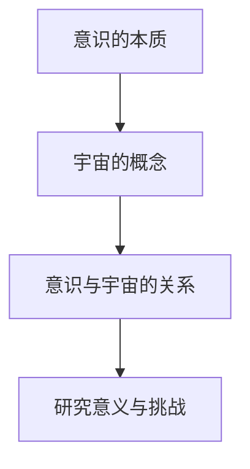
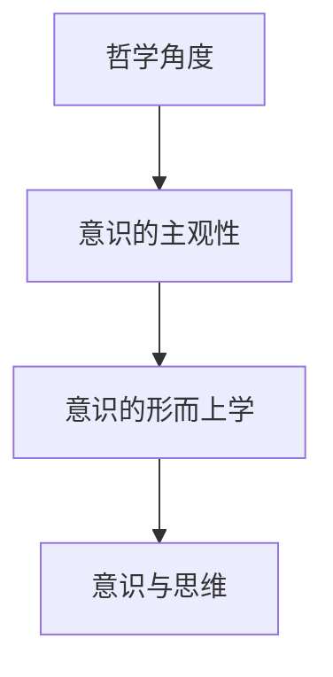
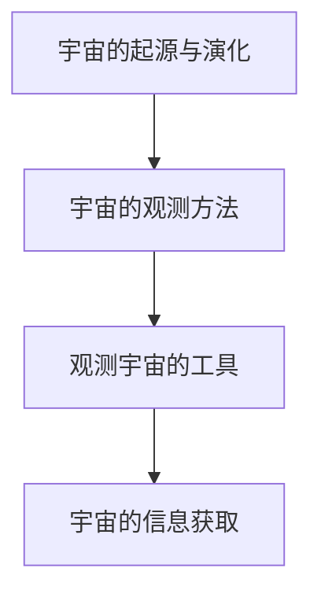
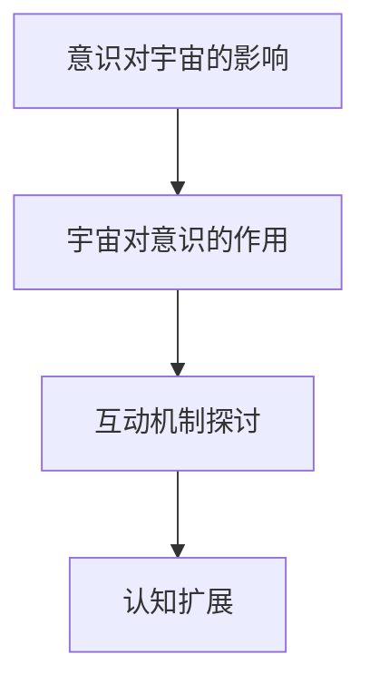

                 

### 第1章: 引言：意识的本质与宇宙的关联

> 关键词：意识、宇宙、互动机制、哲学探讨、科学解析、观测与认知

> 摘要：本章将探讨意识的本质及其与宇宙的潜在关联，通过哲学和科学两个角度来深入分析这一主题。我们将梳理意识的定义与特性，并讨论宇宙的起源与观测方法，旨在揭示意识与宇宙之间的复杂互动关系，为后续章节的深入研究奠定基础。

---

#### 第1章: 引言：意识的本质与宇宙的关联

核心概念与联系

在探讨意识与宇宙的关联之前，我们需要明确两个核心概念：意识和宇宙。首先，意识是一种主观体验，包括感觉、知觉、思考等心理现象。其次，宇宙是包括一切物质、能量、时间和空间的总和。为了更好地理解这两个概念及其关系，我们可以通过Mermaid流程图来展示它们之间的核心联系。

**意识的本质**

意识的本质是一个复杂的哲学问题，不同哲学家对其有不同的解释。一些哲学家认为意识是主观性的体现，即个体内部的心理体验。另一些哲学家则从形而上学的角度探讨意识，试图解释意识的起源和本质。从科学的角度来看，意识通常被理解为大脑活动的产物，与神经网络的运作密切相关。以下是一个简化的哲学探讨流程图：

**宇宙的概念**

宇宙是包括一切物质、能量、时间和空间的总和。宇宙的起源和演化是现代物理学研究的重要课题。当前最流行的宇宙起源理论是大爆炸理论，它认为宇宙起源于一个高度密集、高温的状态，并在此后的数亿年里不断膨胀和演化。以下是一个简化的宇宙观测与认知流程图：

**意识与宇宙的关系**

意识与宇宙的关系是一个尚未完全解开的谜团。一些科学家和哲学家认为，意识是宇宙进化的一个重要组成部分，可能是宇宙演化到一定阶段产生的结果。另一些观点则认为，意识与宇宙的关系更为复杂，可能是相互作用的。以下是一个简化的意识与宇宙关系流程图：

**研究意义与挑战**

探讨意识与宇宙的关系具有重要的理论意义和实际应用价值。从理论层面来看，这有助于我们更好地理解宇宙的本质和生命的意义。从实际应用层面来看，这可能会带来新的科学发现和技术突破。然而，这一领域也面临着许多挑战，如意识的定义、宇宙观测的局限性等。

---

在本章中，我们初步探讨了意识的本质、宇宙的概念以及它们之间的潜在关系。接下来，我们将深入探讨意识与宇宙的互动机制，包括意识对宇宙观测的影响以及宇宙对意识形成的反作用。通过这一系列探讨，我们将逐步揭示意识与宇宙之间的复杂互动关系，为后续章节的深入研究奠定基础。在下一章中，我们将详细分析意识与宇宙互动的具体机制，敬请期待。

