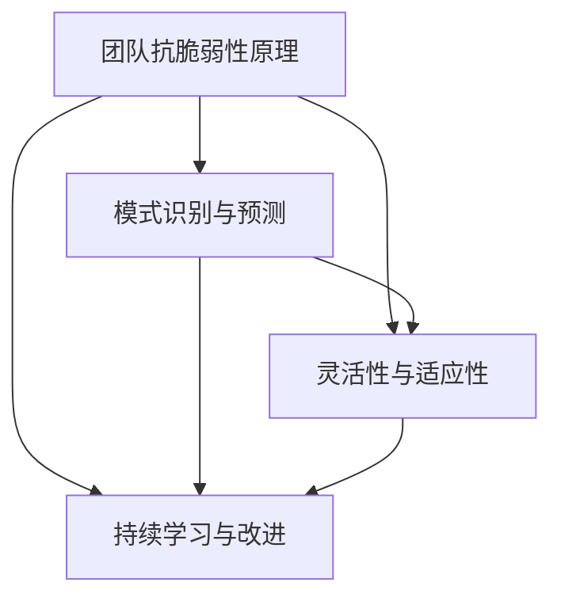

                 


## 引言与背景

### 1.1 书籍概述

《打造resilient团队：提升应对变化的能力》旨在为现代团队提供一套系统化的方法，帮助他们在不断变化的环境中保持韧性和活力。本书的作者是一位具有丰富实践经验和深厚理论基础的人工智能专家，他结合最新的研究成果和实际案例，对团队抗脆弱性的原理、架构和实践方法进行了深入剖析。

#### 1.1.1 书籍主题与目标

本书的主题是“团队抗脆弱性”，即如何在面对外部环境的快速变化和内部的不确定性时，保持团队的稳定性和高效性。本书的目标是帮助读者：

1. 理解团队抗脆弱性的核心概念和原理。
2. 设计和构建具有抗脆弱性的团队组织结构。
3. 制定和实施有效的团队建设和响应变化策略。
4. 培养团队成员的持续学习和创新能力。

#### 1.1.2 团队抗脆弱性的重要性

在当今快速发展的数字化时代，变化已成为不可避免的趋势。对于团队来说，面对变化的能力直接关系到其生存和发展。一个具有抗脆弱性的团队能够：

1. 更快地适应市场变化，抓住发展机会。
2. 更有效地应对潜在风险，减少不确定性带来的负面影响。
3. 激发团队成员的积极性和创造力，提升团队的整体绩效。
4. 建立健康的团队文化和组织氛围，促进长期可持续发展。

### 1.2 本书结构

本书共分为五个部分，结构如下：

## 第二部分：团队抗脆弱性的理论基础
### 2.1 抗脆弱性的定义与原则
#### 2.1.1 抗脆弱性的定义
#### 2.1.2 抗脆弱性的原则

## 第二部分：团队抗脆弱性的理论基础
### 2.2 团队抗脆弱性的核心要素
#### 2.2.1 模式识别与预测
#### 2.2.2 灵活性与适应性
#### 2.2.3 持续学习与改进

## 第二部分：团队抗脆弱性的理论基础
### 2.3 抗脆弱性的组织结构设计
#### 2.3.1 组织结构的灵活性
#### 2.3.2 分权与自治
#### 2.3.3 网络化组织

## 第三部分：提升团队抗脆弱性的实践方法
### 3.1 团队建设
#### 3.1.1 团队文化塑造
#### 3.1.2 团队沟通与协作
#### 3.1.3 团队成员能力提升

## 第三部分：提升团队抗脆弱性的实践方法
### 3.2 响应变化策略
#### 3.2.1 快速响应机制
#### 3.2.2 风险管理策略
#### 3.2.3 变化适应性评估

## 第三部分：提升团队抗脆弱性的实践方法
### 3.3 持续学习与迭代
#### 3.3.1 学习型组织建设
#### 3.3.2 知识管理
#### 3.3.3 创新与持续改进

## 第四部分：案例分析
### 4.1 案例研究1：团队A的成功转型
#### 4.1.1 团队背景
#### 4.1.2 转型过程
#### 4.1.3 成功要素

### 4.2 案例研究2：团队B的抗脆弱性实践
#### 4.2.1 团队背景
#### 4.2.2 实践措施
#### 4.2.3 效果评估

## 第五部分：结论与展望
### 5.1 结论
#### 5.1.1 抗脆弱性团队的构建
#### 5.1.2 持续改进的重要性

### 5.2 展望未来
#### 5.2.1 抗脆弱性团队的发展趋势
#### 5.2.2 未来研究方向

通过以上结构，本书将带领读者逐步了解团队抗脆弱性的核心概念、理论基础、实践方法以及成功案例，旨在为团队管理者提供一套切实可行的操作指南。

### 1.3 团队抗脆弱性的现状与挑战

在当今快速变化的市场环境中，团队抗脆弱性已成为一个关键议题。然而，现实中的团队在面对变化时往往显得脆弱，主要挑战包括：

1. **环境变化速度过快**：市场、技术、客户需求等方面的变化速度远超过团队适应的能力。
2. **内部协作不畅**：团队成员之间缺乏有效的沟通和协作，导致信息传递滞后、决策效率低下。
3. **技能更新滞后**：团队成员的技能和知识更新速度跟不上技术发展的步伐，导致团队整体竞争力下降。
4. **组织结构僵化**：传统的组织结构往往过于僵化，难以快速响应变化，导致团队在变革中失去方向。

这些挑战使得团队在面对变化时，往往表现出以下脆弱性：

1. **适应力不足**：团队难以快速适应新的环境和需求，导致业绩下滑。
2. **应变能力弱**：团队在面对突发风险和机会时，缺乏有效的应对策略，导致损失。
3. **创新能力缺乏**：团队缺乏持续创新的能力，导致在激烈的市场竞争中失去优势。
4. **团队士气低落**：频繁的变化和挑战使得团队成员感到压力重重，士气低落。

为了应对这些挑战，提升团队抗脆弱性已成为当务之急。这不仅关系到团队当下的生存，更关乎其长期的可持续发展。因此，本书将从理论到实践，系统性地探讨如何构建一个具有抗脆弱性的团队，帮助团队在变化中保持活力和竞争力。

## 第二部分：团队抗脆弱性的理论基础

在探讨如何打造具有抗脆弱性的团队之前，我们需要先了解抗脆弱性的核心概念和理论基础。这一部分将详细介绍抗脆弱性的定义、原则以及团队抗脆弱性的核心要素，为后续的实践方法提供理论支撑。

### 2.1 抗脆弱性的定义与原则

#### 2.1.1 抗脆弱性的定义

抗脆弱性（Resilience）是指一个系统在面对外部冲击和内部不确定性时，能够迅速适应、恢复并持续发展的能力。在团队层面，抗脆弱性表现为团队在面对外部市场变化、内部人员流动、技术更新等不确定因素时，能够保持高效运作、持续创新和长期发展的能力。

#### 2.1.2 抗脆弱性的原则

为了构建一个具有抗脆弱性的团队，我们需要遵循以下原则：

1. **适应性原则**：团队应具备快速适应外部环境变化的能力，灵活调整战略和行动。
2. **灵活性原则**：团队组织结构应具备灵活性，能够根据不同情况快速调整资源配置和任务分配。
3. **自我修复原则**：团队在面对挑战和失败时，应具备自我修复的能力，迅速恢复并继续前进。
4. **持续学习原则**：团队应鼓励成员持续学习和成长，不断提升个人和团队的能力。
5. **多样性原则**：团队应具备多样性，包括技能、背景、经验和思维方式，以增强团队面对复杂问题的能力。

### 2.2 团队抗脆弱性的核心要素

团队抗脆弱性的实现依赖于多个核心要素的协同作用。以下是这些核心要素的详细探讨：

#### 2.2.1 模式识别与预测

模式识别与预测是团队抗脆弱性的关键要素之一。通过分析历史数据和趋势，团队可以识别出潜在的规律和模式，从而预测未来可能发生的变化。以下是模式识别与预测的核心步骤：

1. **数据收集**：收集与团队业务相关的各种数据，包括市场数据、客户反馈、技术发展动态等。
2. **数据分析**：运用数据挖掘和机器学习等技术，对收集到的数据进行分析，识别出潜在的模式和趋势。
3. **预测建模**：基于分析结果，构建预测模型，预测未来可能发生的变化和趋势。
4. **验证与修正**：对预测模型进行验证，并根据实际情况进行调整和修正，提高预测准确性。

#### 2.2.2 灵活性与适应性

灵活性与适应性是团队在面对变化时的核心能力。一个具有高度灵活性和适应性的团队，能够迅速调整战略和行动，以适应不断变化的外部环境。以下是提高团队灵活性和适应性的关键策略：

1. **组织结构灵活性**：设计灵活的组织结构，减少层级和中间环节，提高信息传递速度和决策效率。
2. **任务分配灵活性**：灵活调整任务分配，根据团队成员的能力和兴趣进行动态调整，以充分发挥团队潜力。
3. **资源配置灵活性**：根据业务需求和市场变化，灵活调整资源分配，确保团队具备应对各种情况的能力。
4. **文化适应性**：建立开放、包容和积极的文化，鼓励团队成员面对变化时保持积极态度，勇于尝试新方法和思路。

#### 2.2.3 持续学习与改进

持续学习与改进是团队抗脆弱性的重要保障。通过不断学习和改进，团队可以不断提升自身能力，适应快速变化的环境。以下是实现持续学习和改进的关键步骤：

1. **培训与发展**：定期组织培训和发展活动，提升团队成员的技能和知识水平。
2. **知识共享**：建立知识共享平台，鼓励团队成员分享经验和知识，促进团队整体能力的提升。
3. **反馈与评估**：建立有效的反馈机制，及时收集成员的反馈和建议，对团队运作进行评估和改进。
4. **创新激励**：鼓励团队成员提出创新想法，为创新提供必要的资源和支持，促进团队的持续创新。

通过以上核心要素的协同作用，团队可以构建起抗脆弱性的基础，提高其在面对变化时的适应能力和应变能力。下一部分将深入探讨抗脆弱性的组织结构设计，为团队抗脆弱性的实现提供具体的方法和策略。

### 2.3 抗脆弱性的组织结构设计

组织结构对于团队抗脆弱性的实现至关重要。一个灵活、分权且网络化的组织结构，能够增强团队在面对外部环境变化时的适应能力和应变能力。以下将详细探讨抗脆弱性的组织结构设计，包括组织结构的灵活性、分权与自治以及网络化组织的特点和实践方法。

#### 2.3.1 组织结构的灵活性

灵活性是组织结构设计的关键原则之一，它决定了团队在应对变化时的敏捷程度。一个具有灵活性的组织结构能够迅速调整资源、任务和决策过程，以适应不断变化的市场需求和技术发展。以下是实现组织结构灵活性的关键策略：

1. **扁平化组织**：通过减少管理层级和中间环节，实现信息传递的快速和直接。扁平化的组织结构有助于提高决策效率，减少信息失真和延迟。

2. **模块化组织**：将组织划分为多个独立的模块，每个模块负责特定的任务和目标。模块化组织有助于提高团队在面对变化时的应对能力，模块之间的独立性和灵活性可以减少对整体组织的影响。

3. **跨功能团队**：建立跨功能的团队，使团队成员能够跨越部门界限，共同解决问题和完成任务。跨功能团队有助于提高团队的整体协作效率，增强团队在面对复杂问题时的适应能力。

4. **敏捷管理**：采用敏捷管理方法，如Scrum或Kanban，将工作流程划分为短周期迭代，快速响应市场变化和客户需求。敏捷管理方法强调迭代和反馈，有助于团队不断优化和调整工作方式。

#### 2.3.2 分权与自治

分权与自治是增强团队自主性和创新能力的有效手段。通过赋予团队更多的决策权和自主权，可以激发团队成员的积极性和创造力，提高团队的整体绩效。以下是实现分权与自治的关键策略：

1. **决策权下放**：将决策权下放至团队和个体，使团队成员能够自主决策，快速响应市场变化。决策权的下放有助于减少决策链条，提高决策速度和效率。

2. **自主管理**：鼓励团队成员参与团队管理和决策过程，培养团队成员的自主管理能力。自主管理有助于团队成员更加深入地了解团队目标和业务需求，提高工作满意度和投入度。

3. **激励机制**：建立与团队目标和绩效挂钩的激励机制，鼓励团队成员为实现团队目标而努力。激励机制可以激发团队成员的积极性和创造力，提高团队的凝聚力和战斗力。

4. **授权与支持**：为团队成员提供必要的授权和支持，使其能够自主决策和解决问题。授权与支持有助于减少团队成员的依赖性，增强团队的自组织和自愈能力。

#### 2.3.3 网络化组织

网络化组织是一种基于资源共享、协作和互惠互利的新型组织形式。通过建立广泛的合作网络，团队可以获取更多的资源、知识和信息，提高整体抗脆弱性。以下是实现网络化组织的关键策略：

1. **合作伙伴关系**：建立与外部合作伙伴的紧密合作关系，共享资源、知识和信息。合作伙伴关系有助于团队扩展业务领域，提高市场竞争力和抗风险能力。

2. **开放协作平台**：搭建开放协作平台，鼓励内部员工和外部合作伙伴之间的交流和协作。开放协作平台有助于知识共享、技能互补和创新能力提升。

3. **跨界合作**：积极探索与其他行业和领域的跨界合作机会，实现资源的共享和互补。跨界合作有助于团队突破传统的思维框架，拓展业务领域和市场空间。

4. **虚拟团队**：利用现代通信技术和工具，组建虚拟团队，实现远程协作和实时沟通。虚拟团队有助于团队跨越地理和时间的限制，提高协作效率和响应速度。

通过组织结构的灵活性、分权与自治以及网络化组织的设计，团队可以构建起抗脆弱性的组织基础。这些策略不仅有助于提高团队在面对变化时的适应能力和应变能力，还能激发团队成员的积极性和创造力，推动团队的长期可持续发展。下一部分将探讨如何通过团队建设、响应变化策略和持续学习与迭代等实践方法，进一步提升团队的抗脆弱性。

### 第三部分：提升团队抗脆弱性的实践方法

在明确了团队抗脆弱性的理论基础和组织结构设计后，接下来我们将探讨具体的实践方法，以帮助团队在实际操作中提升抗脆弱性。这些实践方法包括团队建设、响应变化策略和持续学习与迭代。通过这些方法的实施，团队可以更好地应对外部环境的变化，保持稳定和高效。

#### 3.1 团队建设

团队建设是提升团队抗脆弱性的关键步骤之一。一个强大的团队不仅能够共同应对挑战，还能在变化中找到新的机会。以下是团队建设的重要方面：

##### 3.1.1 团队文化塑造

团队文化是团队运作的基石，它决定了团队成员的行为和团队的整体氛围。一个积极、开放和包容的团队文化能够增强团队的凝聚力和协作精神。以下是塑造团队文化的方法：

1. **共同价值观**：明确团队的共同价值观，如诚信、责任、创新等，并确保所有团队成员都认同这些价值观。

2. **沟通与反馈**：建立开放的沟通渠道，鼓励团队成员之间坦诚交流，及时反馈工作进展和问题。

3. **庆祝成就**：庆祝团队取得的每一个小成就，增强团队成员的成就感和归属感。

4. **领导示范**：领导者在塑造团队文化中扮演关键角色，通过自身的行为树立榜样，引导团队成员形成积极的行为模式。

##### 3.1.2 团队沟通与协作

有效的沟通与协作是团队建设的重要环节。良好的沟通可以减少误解和冲突，提高团队的工作效率。以下是提高团队沟通与协作的方法：

1. **建立沟通机制**：制定明确的沟通规则和流程，确保信息传递的及时性和准确性。

2. **定期会议**：定期举行团队会议，讨论工作进展、问题和计划，确保团队成员之间的信息同步。

3. **透明化信息**：尽可能公开信息，减少信息不对称，增强团队成员的信任感。

4. **工具支持**：使用协作工具，如Slack、Trello等，提高团队的协作效率和信息共享。

##### 3.1.3 团队成员能力提升

团队成员的能力提升是团队建设的重要组成部分。通过培训和发展，团队成员可以不断提升个人技能和团队协作能力。以下是提升团队成员能力的方法：

1. **培训与发展计划**：制定长期的培训和发展计划，为团队成员提供专业技能和领导力培训。

2. **导师制度**：建立导师制度，为新人提供指导和支持，帮助他们快速融入团队并提升能力。

3. **实践机会**：为团队成员提供实践机会，如项目参与、任务承担等，让他们在实际工作中锻炼和提升技能。

4. **鼓励自主学习**：鼓励团队成员自主学习，通过阅读、在线课程等方式不断提升个人能力。

#### 3.2 响应变化策略

在快速变化的环境中，团队需要具备快速响应变化的能力。以下是应对变化的一些策略：

##### 3.2.1 快速响应机制

快速响应机制是团队应对变化的重要手段。通过建立快速响应机制，团队可以迅速调整策略和行动，以应对外部环境的变化。以下是建立快速响应机制的方法：

1. **敏捷流程**：采用敏捷开发流程，如Scrum或Kanban，将工作分解为短周期迭代，快速响应市场变化和客户需求。

2. **应急计划**：制定应急计划，明确在突发情况下团队成员的职责和行动步骤，确保团队能够在紧急情况下迅速响应。

3. **快速决策**：建立快速决策机制，减少决策链条，提高决策效率，确保团队能够迅速调整策略和行动。

##### 3.2.2 风险管理策略

在变化的环境中，团队需要具备有效管理风险的能力。通过识别、评估和控制风险，团队可以减少不确定性带来的负面影响。以下是风险管理策略的方法：

1. **风险识别**：通过定期评估和监控，识别潜在的风险因素，包括市场风险、技术风险和操作风险等。

2. **风险评估**：对识别出的风险进行评估，确定风险的影响程度和发生的可能性，为风险管理提供依据。

3. **风险控制**：制定相应的风险控制措施，如风险规避、风险转移和风险缓解等，以减少风险发生的概率和影响。

4. **风险监控**：建立风险监控机制，定期检查风险控制措施的有效性，并根据实际情况进行调整和优化。

##### 3.2.3 变化适应性评估

为了确保团队能够持续适应外部环境的变化，需要进行变化适应性评估。以下是进行变化适应性评估的方法：

1. **适应性评估指标**：制定适应性评估指标，如响应速度、创新能力、团队士气等，用于评估团队适应变化的能力。

2. **定期评估**：定期进行适应性评估，收集和分析相关数据，评估团队在适应变化方面的表现。

3. **反馈与改进**：根据评估结果，提供反馈和建议，制定改进措施，提升团队适应变化的能力。

#### 3.3 持续学习与迭代

持续学习和迭代是团队抗脆弱性的重要保障。通过不断学习和改进，团队可以不断提升自身能力，适应快速变化的环境。以下是实现持续学习和迭代的方法：

##### 3.3.1 学习型组织建设

学习型组织是一种持续学习和创新的组织形式。通过建立学习型组织，团队可以不断提升整体能力和竞争力。以下是建设学习型组织的方法：

1. **学习文化**：建立学习文化，鼓励团队成员积极学习，将学习视为一种生活方式和工作习惯。

2. **学习平台**：搭建学习平台，提供丰富的学习资源和培训机会，为团队成员的学习和发展提供支持。

3. **知识共享**：建立知识共享机制，鼓励团队成员分享知识和经验，促进团队整体能力的提升。

##### 3.3.2 知识管理

知识管理是持续学习的重要环节。通过有效管理知识和信息，团队可以减少重复劳动，提高工作效率。以下是实现知识管理的方法：

1. **知识分类与编码**：对知识和信息进行分类和编码，使其易于检索和利用。

2. **知识库建设**：建立知识库，收集和存储团队成员的知识和经验，为团队成员提供参考和借鉴。

3. **知识更新与维护**：定期更新和维护知识库，确保知识库中的知识和信息保持最新和准确。

##### 3.3.3 创新与持续改进

创新和持续改进是团队应对变化的重要手段。通过不断探索和尝试新方法，团队可以保持竞争力和活力。以下是实现创新和持续改进的方法：

1. **创新激励**：建立创新激励机制，鼓励团队成员提出创新想法，并为创新提供必要的资源和支持。

2. **创新实践**：鼓励团队成员参与创新项目，通过实践探索新的方法和思路。

3. **改进反馈**：建立改进反馈机制，收集团队成员的改进建议和反馈，不断优化和改进团队的工作流程和操作方法。

通过团队建设、响应变化策略和持续学习与迭代等实践方法，团队可以不断提升抗脆弱性，保持稳定和高效。这些方法的实施需要长期的积累和持续的努力，但它们将为团队在快速变化的环境中提供坚实的保障。下一部分将结合实际案例，进一步展示如何通过实践提升团队的抗脆弱性。

### 案例研究1：团队A的成功转型

团队A是一家高科技企业的研究与开发团队，主要从事人工智能技术的研发和应用。随着市场环境的快速变化和技术的迅猛发展，团队A面临着巨大的挑战。为了保持竞争力，团队A决定进行一次全面的转型，提升其抗脆弱性。以下是团队A的转型过程和成功要素。

#### 4.1.1 团队背景

在转型之前，团队A面临以下挑战：

1. **技术发展滞后**：团队的技术水平未能跟上行业的发展步伐，导致在项目竞标和技术合作中处于劣势。
2. **组织结构僵化**：团队的组织结构相对僵化，决策链条过长，导致响应速度缓慢，无法迅速适应市场变化。
3. **团队成员能力不均**：团队成员的技能和能力参差不齐，部分成员的技能和知识更新滞后，影响团队的整体绩效。
4. **沟通不畅**：团队成员之间的沟通不畅，信息传递滞后，导致协作效率低下。

#### 4.1.2 转型过程

团队A的转型过程可以分为以下几个阶段：

1. **评估与规划**：首先，团队对当前的状况进行了全面的评估，明确了转型的目标和方向。在评估过程中，团队强调了提高技术水平、优化组织结构、提升团队协作能力以及加强成员技能提升的重要性。

2. **组织结构调整**：团队A对组织结构进行了调整，减少了管理层级，加强了跨部门协作。通过引入敏捷开发方法，团队将工作流程划分为短周期迭代，提高了响应速度和决策效率。

3. **技能提升**：团队制定了详细的培训和发展计划，为团队成员提供技术培训和领导力培训。通过导师制度和内部知识共享平台，团队成员的技能和能力得到了显著提升。

4. **文化建设**：团队A积极塑造开放、包容和创新的文化，鼓励团队成员坦诚交流、分享知识和经验。通过定期的团队活动和团队建设，团队成员之间的沟通和协作得到了加强。

5. **持续改进**：团队A建立了持续改进机制，定期评估团队的工作流程和协作效果，收集团队成员的反馈和建议，不断优化和改进。

#### 4.1.3 成功要素

团队A的成功转型离不开以下几个关键要素：

1. **领导层的支持**：领导层在转型过程中起到了关键作用，他们不仅提供了战略方向，还积极参与到团队建设中，为团队成员提供了有力的支持和激励。

2. **全面的评估和规划**：在转型初期，团队A进行了全面的评估和规划，明确了转型的目标和步骤，确保了转型的有序进行。

3. **组织结构的灵活性**：通过减少管理层级和引入敏捷开发方法，团队A提高了组织结构的灵活性，增强了团队在面对变化时的适应能力和应变能力。

4. **技能提升和文化建设**：通过技能提升和文化建设，团队A提升了团队成员的技能和能力，增强了团队的凝聚力和协作精神。

5. **持续改进和反馈机制**：团队A建立了持续改进和反馈机制，确保团队能够不断优化和改进，保持持续的竞争力。

通过这次成功的转型，团队A不仅提升了技术水平，优化了组织结构，还增强了团队的协作能力和抗脆弱性，为企业的持续发展奠定了坚实的基础。

### 案例研究2：团队B的抗脆弱性实践

团队B是一家互联网公司的产品开发团队，主要从事在线教育和电商平台的开发与维护。面对快速变化的市场和技术环境，团队B意识到提升抗脆弱性的重要性，并开始实施一系列措施来增强团队的韧性。以下是团队B的抗脆弱性实践过程和效果评估。

#### 4.2.1 团队背景

在实践抗脆弱性之前，团队B面临以下挑战：

1. **市场需求变化**：随着在线教育市场的迅速发展，客户需求变得多样化且变化快，团队难以及时响应。
2. **技术更新快速**：技术的迅猛发展要求团队不断更新知识体系，保持技术竞争力。
3. **组织内部沟通不畅**：团队内部沟通渠道不畅，信息传递滞后，导致决策速度慢，影响项目进度。
4. **人才流动性高**：团队成员流动性高，新人融入难度大，影响团队的稳定性和效率。

#### 4.2.2 实践措施

团队B采取了以下措施来提升抗脆弱性：

1. **建立快速响应机制**：团队引入敏捷开发方法，将项目开发流程划分为短周期迭代，提高团队对市场需求变化的响应速度。通过每日站立会议、迭代评审和回顾会议，确保团队成员信息同步和问题快速解决。

2. **技术能力提升**：团队制定了详细的技术培训计划，定期组织技术分享会和在线培训，帮助团队成员跟上技术发展的步伐。同时，团队建立了内部知识库，收集和整理团队成员的技术经验和最佳实践，为新成员提供学习资源。

3. **沟通与协作优化**：团队优化了内部沟通机制，引入协作工具如Slack和Trello，确保信息传递的及时性和准确性。同时，通过定期的团队会议和团建活动，增强团队成员之间的沟通和信任，提高协作效率。

4. **人才发展计划**：团队实施了人才发展计划，为新员工提供导师制度和轮岗机会，帮助他们快速融入团队并提升技能。同时，通过职业发展规划和激励机制，鼓励团队成员持续学习和成长。

5. **风险管理策略**：团队建立了风险管理机制，定期识别和评估潜在风险，制定相应的风险控制措施。通过风险监控和预警系统，确保团队能够及时应对突发情况，减少风险对项目的影响。

#### 4.2.3 效果评估

通过一系列的抗脆弱性实践，团队B取得了显著的效果：

1. **响应速度提升**：敏捷开发方法的引入，使团队能够更快地响应市场需求，提高了项目的交付速度和客户满意度。

2. **技术竞争力增强**：通过持续的技术培训和知识共享，团队成员的技术能力得到了显著提升，团队在技术领域的竞争力也得到了增强。

3. **团队协作效率提高**：优化的沟通和协作机制，使团队成员之间的信息传递更加流畅，决策速度加快，协作效率显著提高。

4. **人才稳定性增强**：人才发展计划的实施，使新员工能够更快地融入团队，减少了人才流失率，提升了团队的稳定性。

5. **风险管理能力提升**：通过建立完善的风险管理机制，团队能够更有效地识别和应对风险，项目成功率显著提高。

团队B的抗脆弱性实践，为企业在快速变化的市场环境中提供了坚实的基础，为团队的长远发展奠定了良好的基础。

### 第五部分：结论与展望

通过本文的探讨，我们明确了团队抗脆弱性的重要性，并详细介绍了构建具有抗脆弱性的团队所需的理论基础和实践方法。以下是本文的总结与展望：

#### 5.1 结论

1. **团队抗脆弱性的核心要素**：团队抗脆弱性包括模式识别与预测、灵活性与适应性、持续学习与改进等核心要素。这些要素相互关联，共同构成了团队在面对变化时的韧性基础。

2. **组织结构设计的重要性**：通过灵活的组织结构、分权与自治、网络化组织等设计，团队能够提高应对变化的能力，增强内部协作和自主性。

3. **实践方法的应用**：团队建设、响应变化策略和持续学习与迭代等实践方法，为团队提供了具体的操作指南，有助于提升团队的整体抗脆弱性。

4. **成功案例分析**：通过团队A和团队B的成功转型实践，我们看到了抗脆弱性建设在提升团队适应能力和绩效方面的显著效果。

#### 5.2 展望未来

1. **抗脆弱性团队的发展趋势**：随着市场的快速变化和技术的不断进步，抗脆弱性团队将成为企业竞争力的关键因素。未来，企业将更加重视团队抗脆弱性的建设，积极探索新的方法和工具。

2. **未来研究方向**：未来的研究可以进一步探讨团队抗脆弱性的具体衡量指标和方法，以及如何在不同行业和领域中进行应用。同时，结合人工智能和大数据技术，开发更先进的抗脆弱性评估和预测模型。

通过本文的探讨，我们希望为团队管理者提供一套实用的操作指南，帮助他们构建具有抗脆弱性的团队，在快速变化的环境中保持稳定和高效。

### 附录A：参考资料

1. **《抗脆弱性：从不确定中获益》** - Noah S. Goldstein
2. **《团队的智慧：敏捷团队如何快速适应与协作》** - Jean Tabaka
3. **《敏捷开发：实践指南》** - Barry Boehm & Richard A. Turner
4. **《组织学习的五项修炼》** - Peter Senge
5. **《知识管理：理论和实践》** - Judy S. Alexander

### 附录B：抗脆弱性工具与资源

1. **敏捷开发工具**：
   - **Jira**：项目管理工具，支持敏捷开发方法。
   - **Trello**：看板工具，用于任务管理和协作。
   - **Asana**：项目管理工具，提供实时协作和任务跟踪。

2. **知识共享平台**：
   - **Confluence**：企业知识管理和协作平台。
   - **Slack**：即时通讯工具，支持团队内部沟通。

3. **在线培训资源**：
   - **Coursera**：提供各类在线课程，包括技术和管理培训。
   - **Udemy**：拥有丰富的在线课程，涵盖各种技能和知识领域。

### 附录C：抗脆弱性原理与架构图

以下是团队抗脆弱性原理与架构图的Mermaid表示：



### 附录D：响应变化的策略伪代码

以下是响应变化策略的Python伪代码示例：

```python
def respond_to_change(change):
    """
    快速响应变化的策略函数。
    
    参数：
    - change：变化的事件或情况。
    
    返回：
    - response：响应变化的操作或措施。
    """
    
    # 判断变化类型
    if "风险" in change:
        response = handle_risk()
    elif "机会" in change:
        response = seize_opportunity()
    else:
        response = standard_response()
    
    # 执行响应操作
    execute(response)
    
    return response

# 响应风险
def handle_risk():
    """
    风险响应操作函数。
    
    返回：
    - risk_response：风险响应的操作。
    """
    risk_response = """
    $$
    def mitigate_risk():
        # 确定风险来源
        source = identify_risk_source()

        # 制定风险缓解措施
        measures = design_mitigation_measures(source)

        # 实施风险缓解措施
        implement_measures(measures)
    $$
    """
    return risk_response

# 响应机会
def seize_opportunity():
    """
    机会响应操作

    """
    opportunity_response = """
    $$
    def seize_opportunity():
        # 识别机会
        opportunity = identify_opportunity()

        # 制定利用机会的策略
        strategies = design_seizing_strategies(opportunity)

        # 实施策略
        execute_strategies(strategies)
    $$
    """
    return opportunity_response

# 标准响应
def standard_response():
    """
    标准响应操作函数。
    
    返回：
    - standard_response：标准响应的操作。
    """
    standard_response = """
    $$
    def standard_response():
        # 执行常规操作
        perform_regular_operations()
    $$
    """
    return standard_response

# 执行响应操作
def execute(response):
    """
    执行响应操作的函数。
    
    参数：
    - response：响应操作的代码。
    """
    # 在实际环境中执行响应操作
    eval(response)
```

### 附录E：最佳实践

- **定期评估与反馈**：定期对团队进行评估，收集团队成员的反馈，及时调整策略和方法。
- **跨部门协作**：鼓励跨部门协作，共享资源和知识，提高整体抗脆弱性。
- **持续培训与发展**：持续为团队成员提供培训和发展机会，提升团队整体能力。
- **文化包容与开放**：建立包容和开放的文化，鼓励团队成员提出创新想法，并给予支持。

### 附录F：注意事项

- **抗脆弱性建设是一个长期过程**：需要持续的努力和投入，不能一蹴而就。
- **灵活性与稳定性平衡**：在提高团队灵活性的同时，保持团队的稳定性，避免过度变动带来的混乱。
- **资源合理分配**：合理分配资源，确保团队在面对变化时具备充足的资源和能力。
- **风险意识与预防**：建立风险意识，提前预防潜在风险，降低不确定性带来的负面影响。

### 附录G：拓展阅读

- **《敏捷革命》** - Barry O'Reilly
- **《知识管理与知识共享》** - Peter Adzic
- **《团队管理实战》** - 石川贤治
- **《风险管理》** - Edward T. Mistry

通过以上附录，我们希望为读者提供更多的参考资源和实践指导，帮助他们在实际工作中更好地构建抗脆弱性团队，提升团队应对变化的能力。作者：AI天才研究院/AI Genius Institute & 禅与计算机程序设计艺术 /Zen And The Art of Computer Programming。

