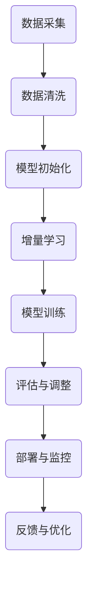

                 

### 《持续学习能力评估：测试模型自我更新》

#### 关键词：
持续学习、评估模型、自我更新、人工智能、机器学习

#### 摘要：
本文旨在探讨持续学习能力评估以及测试模型的自我更新问题。首先，我们将回顾持续学习的理论基础，然后深入探讨如何构建和评估持续学习的能力。特别地，我们将介绍模型自我更新的方法与策略，并通过实际案例展示如何将自我更新应用于测试模型。最后，我们将总结全文，提出未来的研究方向和最佳实践建议。

---

### 《持续学习能力评估：测试模型自我更新》目录大纲

#### 第一部分：持续学习理论基础

## 第1章：持续学习概述
### 1.1 持续学习的概念与意义
### 1.2 持续学习与传统学习的区别
### 1.3 持续学习的现状与挑战

## 第2章：持续学习的理论基础
### 2.1 学习理论概述
### 2.2 持续学习的理论基础
### 2.3 持续学习的核心要素

#### 第二部分：持续学习能力评估

## 第3章：评估模型与指标
### 3.1 评估模型的构建
### 3.2 评估指标的设计
### 3.3 评估方法的比较与选择

## 第4章：持续学习能力的评估实践
### 4.1 评估实践的步骤与方法
### 4.2 评估案例研究
### 4.3 评估结果的解读与应用

## 第5章：模型自我更新的方法与策略
### 5.1 自我更新的概念与原理
### 5.2 自我更新的实现技术
### 5.3 自我更新的策略与应用

#### 第三部分：测试模型自我更新实践

## 第6章：测试模型自我更新的基础知识
### 6.1 测试模型的概念与作用
### 6.2 自我更新测试模型的设计
### 6.3 测试模型自我更新的关键要素

## 第7章：测试模型自我更新的实践
### 7.1 自我更新测试模型的实现
### 7.2 自我更新测试模型的案例
### 7.3 自我更新测试模型的评估与优化

## 第8章：持续学习能力评估与模型自我更新的应用
### 8.1 持续学习能力评估在行业中的应用
### 8.2 模型自我更新在行业中的应用
### 8.3 持续学习与模型自我更新的综合应用

#### 附录

## 附录A：常用评估模型与算法简介
### A.1 常用评估模型
### A.2 常用评估算法
### A.3 模型自我更新算法介绍

## 附录B：自我更新测试模型的实现细节
### B.1 实现步骤与代码框架
### B.2 代码解读与分析
### B.3 实践中的问题与解决方法

## 附录C：相关资源与参考资料
### C.1 学术论文与研究报告
### C.2 开源工具与平台
### C.3 学习资源推荐

### 第一部分：持续学习理论基础

## 第1章：持续学习概述

### 1.1 持续学习的概念与意义

持续学习是一种动态的学习过程，旨在使个体、组织或系统不断适应新的环境、挑战和技术。它超越了传统的学习模式，强调在变化的环境中不断更新知识和技能。持续学习的意义主要体现在以下几个方面：

1. **适应变化**：现代社会技术发展迅速，新的知识和技术层出不穷。持续学习能够帮助个体和组织快速适应这些变化，保持竞争力。
2. **提升创新能力**：持续学习促使个体和组织不断积累新的知识和经验，从而提高创新能力，推动技术进步和经济发展。
3. **增强个人价值**：随着知识的贬值周期缩短，持续学习成为提升个人价值和职业发展的关键因素。
4. **构建学习型社会**：持续学习能够促进社会的整体进步，推动学习型社会的建设。

### 1.2 持续学习与传统学习的区别

持续学习与传统学习有以下几个显著区别：

1. **学习周期**：传统学习通常具有明确的学习周期和目标，而持续学习是持续不断的过程，没有固定的时间限制。
2. **学习环境**：传统学习主要在教室、图书馆等固定场所进行，而持续学习可以在任何时间、任何地点进行。
3. **学习方式**：传统学习依赖于教师讲授和学生听课，而持续学习更多依赖于自我学习和协作学习。
4. **学习内容**：传统学习内容相对固定，而持续学习内容具有灵活性，可以根据需求进行调整。

### 1.3 持续学习的现状与挑战

目前，持续学习已经在各个领域得到广泛应用，如教育、企业、医疗等。然而，持续学习也面临一些挑战：

1. **知识爆炸**：随着知识量的急剧增加，个体和组织难以消化吸收全部知识，需要更加有效的学习方法和工具。
2. **时间管理**：持续学习需要大量的时间和精力投入，个体和组织需要合理安排时间和任务。
3. **资源分配**：持续学习需要投入大量的资源和资金，如何有效利用这些资源是面临的重要问题。
4. **技能转移**：如何将学习到的知识和技能应用到实际工作中，提高工作效率和创新能力，是持续学习需要解决的关键问题。

### 1.4 本章总结

本章回顾了持续学习的概念、意义、与传统学习的区别以及现状与挑战。在下一章中，我们将深入探讨持续学习的理论基础，为后续的评估和实践提供理论支持。

---

### 第二部分：持续学习能力评估

## 第2章：持续学习的理论基础

### 2.1 学习理论概述

学习理论是研究学习过程、学习机制和学习规律的科学。从传统的行为主义学习理论到现代的认知主义和建构主义学习理论，不同学派对学习的本质和过程有着不同的理解和解释。

1. **行为主义学习理论**：行为主义学习理论主要关注外部刺激与反应之间的关联。经典代表包括巴甫洛夫的经典条件反射理论和斯金纳的操作性条件反射理论。这些理论强调了环境因素在学习和行为改变中的作用。

2. **认知主义学习理论**：认知主义学习理论强调内部心理过程在学习中的重要性，认为学习是内部认知结构的变化。布鲁纳的发现学习和奥苏贝尔的有意义接受学习理论是其中的代表。

3. **建构主义学习理论**：建构主义学习理论认为学习是学习者通过主动建构对现实的理解而实现的。皮亚杰的认知发展理论和维果茨基的社会文化理论是建构主义的重要代表。

### 2.2 持续学习的理论基础

持续学习作为学习理论的一个分支，有其特定的理论基础。以下是几个关键的理论：

1. **终身学习理论**：终身学习理论强调学习是一个终身的过程，不仅仅局限于学校教育阶段。这一理论认为，个体需要通过持续学习来适应社会和技术的发展。

2. **自我调节学习理论**：自我调节学习理论认为，学习是一个主动的过程，个体需要通过自我调节来管理自己的学习行为和认知过程。这一理论强调了自我管理、自我评估和自我反思的重要性。

3. **学习生态系统理论**：学习生态系统理论将学习看作是一个复杂的生态系统，包括个体、社会、环境和学习资源等要素。这一理论认为，持续学习需要考虑整个生态系统的影响，包括学习者的社会关系、文化背景和学习环境等。

### 2.3 持续学习的核心要素

持续学习不仅需要理论基础的支持，还需要明确的操作方法和评估标准。以下是持续学习的核心要素：

1. **知识更新**：持续学习要求个体和组织不断更新知识和技能，以适应不断变化的环境和技术。

2. **学习能力**：持续学习强调个体和组织的学习能力，包括信息获取、知识整合、创新能力等。

3. **学习环境**：一个良好的学习环境对于持续学习至关重要，包括物理环境、技术支持和社交氛围。

4. **学习资源**：学习资源是持续学习的重要支撑，包括书籍、课程、在线资源和专家指导等。

5. **学习文化**：持续学习需要建立一种积极的学习文化，鼓励和推动个体和组织的持续学习。

### 2.4 本章总结

本章从学习理论的角度探讨了持续学习的理论基础，包括行为主义、认知主义和建构主义学习理论。然后介绍了终身学习、自我调节学习和学习生态系统理论。最后，阐述了持续学习的核心要素，为后续的评估方法和实践提供了理论基础。在下一章中，我们将深入探讨如何构建和评估持续学习能力。

---

### 第三部分：持续学习能力评估

## 第3章：评估模型与指标

### 3.1 评估模型的构建

为了有效评估持续学习能力，需要构建一个科学合理的评估模型。评估模型应包括以下几个关键组成部分：

1. **评估目标**：明确评估的目的是关键。评估目标可以是评估个体或组织的知识水平、学习能力、创新潜力等。

2. **评估指标**：评估指标是评估模型的核心。常见的评估指标包括知识掌握程度、学习效率、创新能力等。

3. **评估方法**：评估方法应结合定量和定性分析，以确保评估结果的全面性和准确性。常见的评估方法有问卷调查、实验研究、案例分析等。

4. **评估工具**：评估工具是实施评估的重要手段。常见的评估工具包括量表、问卷、测试软件等。

### 3.2 评估指标的设计

设计评估指标时，应遵循以下几个原则：

1. **针对性**：评估指标应针对持续学习的特点，突出评估的重点。

2. **全面性**：评估指标应全面覆盖持续学习的各个方面，包括知识、能力、环境等。

3. **可操作性**：评估指标应具有可操作性，方便实际操作和数据分析。

4. **客观性**：评估指标应尽量减少主观因素，确保评估结果的客观性。

常见的评估指标包括：

1. **知识掌握程度**：可以通过测试、考核等方式评估个体或组织对知识的掌握程度。

2. **学习能力**：可以通过学习时间、学习效率、学习成果等指标评估个体的学习能力。

3. **创新能力**：可以通过创新项目、创新成果等指标评估个体的创新能力。

4. **学习环境**：可以通过学习资源、学习氛围、学习支持等指标评估学习环境的质量。

### 3.3 评估方法的比较与选择

在选择评估方法时，需要考虑以下几个方面：

1. **评估目标**：不同的评估目标需要不同的评估方法。例如，评估知识掌握程度时，可以选择测试和考核；评估创新能力时，可以选择项目评审和案例分析。

2. **资源与成本**：不同的评估方法需要不同的资源和成本。例如，问卷调查成本较低，但数据收集和处理相对繁琐；实验研究成本较高，但数据更具说服力。

3. **数据质量**：不同的评估方法对数据质量的要求不同。例如，问卷调查容易受到主观因素的影响，而实验研究的数据质量较高。

常见的评估方法包括：

1. **问卷调查**：适用于大样本量的评估，可以收集广泛的数据，但数据质量受主观因素影响较大。

2. **实验研究**：适用于小样本量的深入评估，可以控制变量，但成本较高。

3. **案例分析**：适用于具体案例的评估，可以深入了解问题，但数据不具有普遍性。

4. **专家评审**：适用于高层次评估，专家意见具有权威性，但主观因素难以避免。

### 3.4 本章总结

本章介绍了评估模型的构建、评估指标的设计以及评估方法的比较与选择。评估模型的构建需要明确评估目标、设计合适的评估指标、选择合适的评估方法和评估工具。在下一章中，我们将介绍持续学习能力的评估实践，通过具体案例来展示评估模型的应用。

---

### 第4章：持续学习能力的评估实践

### 4.1 评估实践的步骤与方法

为了对持续学习能力进行有效评估，我们需要遵循以下步骤和方法：

#### 4.1.1 确定评估目标

首先，明确评估的目标。例如，评估个体在某个领域的知识掌握程度、学习效率或创新能力。

#### 4.1.2 设计评估指标

根据评估目标，设计具体的评估指标。例如，知识掌握程度可以通过理论考试、实践操作等方式进行评估；学习效率可以通过学习时间、完成项目时间等指标进行评估。

#### 4.1.3 选择评估方法

选择合适的评估方法，如问卷调查、实验研究、案例分析等。根据实际情况和资源，决定使用哪种方法。

#### 4.1.4 制定评估计划

制定详细的评估计划，包括评估时间、地点、参与人员等。确保评估过程的顺利进行。

#### 4.1.5 数据收集与处理

实施评估计划，收集相关数据。对收集到的数据进行分析和处理，确保数据的质量和准确性。

#### 4.1.6 结果分析与解读

对评估结果进行分析和解读，识别优势和不足，为后续改进提供依据。

### 4.2 评估案例研究

为了更好地理解评估实践，我们来看一个具体的案例。

#### 案例背景

某企业为了评估员工在人工智能领域的持续学习能力，决定进行一次综合评估。

#### 评估目标

1. 评估员工在人工智能基础知识的掌握程度。
2. 评估员工在人工智能应用项目的创新能力。
3. 评估员工的学习效率和持续学习能力。

#### 评估指标

1. **知识掌握程度**：通过在线测试评估员工对人工智能基础知识的掌握程度。
2. **创新能力**：通过项目评审评估员工在人工智能应用项目的创新能力。
3. **学习效率**：通过员工的学习时间、完成项目的时间等指标评估学习效率。

#### 评估方法

1. **问卷调查**：设计问卷调查，收集员工对人工智能知识的了解程度和自我评估。
2. **实验研究**：设计人工智能应用项目，评估员工的实际应用能力和创新能力。
3. **专家评审**：邀请人工智能领域的专家对项目进行评审，评估员工的项目质量和创新能力。

#### 评估过程

1. **数据收集**：通过问卷调查和实验研究，收集员工在知识掌握、创新能力和学习效率方面的数据。
2. **数据分析**：对收集到的数据进行分析，识别员工在各个方面的优势和不足。
3. **结果解读**：根据评估结果，对员工进行分类，识别高潜力员工和需要进一步提升的员工。

#### 评估结果

通过评估，发现大多数员工在人工智能基础知识方面掌握较好，但在实际应用和创新方面存在差距。针对这些结果，企业制定了相应的培训和发展计划，以提升员工的持续学习能力。

### 4.3 评估结果的解读与应用

评估结果不仅为员工提供了个人发展的反馈，也为企业的持续发展提供了依据。以下是如何应用评估结果的一些实际案例：

1. **员工发展计划**：根据评估结果，企业可以为不同层次的员工制定个性化的培训和发展计划，以提升其持续学习能力。

2. **项目优化**：评估结果可以帮助企业识别在项目实施中存在的问题，优化项目流程，提高项目成功率。

3. **团队建设**：通过评估，企业可以识别团队中的优势员工，加强团队建设，提升团队整体能力。

4. **人才梯队建设**：评估结果有助于企业建立人才梯队，确保在未来的发展中能够有足够的人才储备。

### 4.4 本章总结

本章通过一个实际案例，介绍了持续学习能力评估的实践步骤和方法。评估结果不仅为个人发展提供了反馈，也为企业的持续发展提供了依据。在下一章中，我们将探讨模型自我更新的方法与策略。

---

### 第5章：模型自我更新的方法与策略

#### 5.1 自我更新的概念与原理

自我更新是指模型通过不断地学习新数据、新知识和新经验，不断优化和提升自身的性能和能力。自我更新的原理主要基于以下几个核心概念：

1. **学习与适应**：自我更新模型能够从数据中学习，并适应新的环境和需求。这种学习过程通常包括数据收集、模型训练、模型评估和模型调整等环节。

2. **动态调整**：自我更新模型能够根据环境变化和性能要求，动态调整模型结构和参数，以实现最优性能。

3. **冗余与冗杂处理**：自我更新模型能够识别和消除冗余信息，避免因冗杂数据导致模型性能下降。

4. **持续进化**：自我更新模型不是一成不变的，而是一个持续进化的过程，通过不断地学习和调整，不断提升自身的能力和适应性。

#### 5.2 自我更新的实现技术

自我更新的实现技术主要包括以下几个方面：

1. **在线学习**：在线学习是指在模型运行过程中，实时接收新数据，并不断更新模型参数。这种方法适用于需要快速适应环境变化的应用场景，如自动驾驶、实时语音识别等。

2. **批量学习**：批量学习是将一段时间内收集到的数据集中进行处理，更新模型参数。这种方法适用于数据量大、学习成本高的情况，如深度学习模型的训练。

3. **迁移学习**：迁移学习是将已有模型的知识迁移到新任务上，以减少对新数据的依赖和训练成本。这种方法适用于多任务学习和多领域应用。

4. **元学习**：元学习是一种学习如何学习的算法，它通过优化学习过程本身来提升学习效果。元学习适用于复杂、多变的学习任务，如自适应控制、强化学习等。

#### 5.3 自我更新的策略与应用

自我更新的策略主要包括以下几个方面：

1. **数据更新策略**：数据更新策略涉及如何选择和收集新的数据，以及如何处理旧数据。常用的数据更新策略包括增量学习、半监督学习和无监督学习等。

2. **模型调整策略**：模型调整策略涉及如何根据新数据和环境变化调整模型参数和结构。常用的模型调整策略包括模型融合、模型压缩和模型重构等。

3. **性能优化策略**：性能优化策略涉及如何提高模型的性能和效率。常用的性能优化策略包括参数优化、架构优化和算法优化等。

4. **自适应学习策略**：自适应学习策略涉及如何使模型能够根据环境变化自适应调整学习过程。常用的自适应学习策略包括在线学习、动态调整和进化学习等。

自我更新在多个领域都有广泛的应用，以下是一些典型的应用场景：

1. **自动驾驶**：自动驾驶系统需要不断学习新的道路、交通规则和环境变化，以实现安全、高效的驾驶。

2. **医疗诊断**：医疗诊断系统需要不断学习新的病例和医学知识，以提高诊断的准确性和效率。

3. **智能家居**：智能家居系统需要不断学习用户的行为习惯和需求，以提供个性化的服务和优化用户体验。

4. **金融风控**：金融风控系统需要不断学习市场变化、用户行为和风险信息，以实现实时监控和风险预警。

#### 5.4 本章总结

本章介绍了模型自我更新的概念、原理、实现技术和策略，并探讨了自我更新的应用场景。在下一章中，我们将深入探讨测试模型自我更新的实践方法和案例。

---

### 第6章：测试模型自我更新的基础知识

#### 6.1 测试模型的概念与作用

测试模型（Test Model）是机器学习和人工智能领域中的一个重要概念，它在模型训练和评估过程中起着至关重要的作用。测试模型的定义相对简单，它是指用于评估训练完成的模型性能的数据集。测试模型的主要目的是验证模型在未见过的数据上的表现，从而判断模型是否具有良好的泛化能力。

**测试模型的作用主要包括：**

1. **性能评估**：通过测试模型，可以评估训练完成的模型的准确性、召回率、F1分数等性能指标，从而判断模型是否达到预期效果。

2. **泛化能力检验**：测试模型能够帮助研究人员判断模型是否具有良好的泛化能力，即模型在未见过的数据上是否能够保持良好的性能。

3. **错误分析**：测试模型的结果可以用于分析模型在预测过程中出现的错误，从而找出模型的弱点和改进方向。

4. **调参优化**：测试模型可以帮助研究人员在调整模型参数时，通过快速评估参数变化对模型性能的影响，找到最佳参数组合。

**测试模型的类型主要包括：**

1. **独立测试集**：独立测试集是从原始数据集中随机抽取的一部分数据，与训练集相互独立，用于最后的模型评估。

2. **交叉验证测试集**：交叉验证测试集是在交叉验证过程中每次迭代使用的测试集，它可以从不同的子数据集中随机抽取，用于评估模型的稳定性。

3. **留出测试集**：留出测试集是将原始数据集分为训练集和测试集，其中测试集用于最后评估模型性能。

#### 6.2 自我更新测试模型的设计

自我更新测试模型的设计是在传统测试模型的基础上，增加了自我更新的能力，使其能够根据新数据自动调整和优化模型。设计一个自我更新测试模型需要考虑以下几个关键要素：

1. **数据流处理**：自我更新测试模型需要具备处理实时数据流的能力，以便及时获取新的数据，并对其进行处理和模型更新。

2. **学习机制**：自我更新测试模型需要具备有效的学习机制，能够从新数据中学习并优化模型参数。

3. **反馈机制**：自我更新测试模型需要具备反馈机制，能够根据测试结果调整模型，并优化性能。

4. **稳定性与鲁棒性**：自我更新测试模型需要具备良好的稳定性和鲁棒性，能够在不同数据分布和环境变化下保持良好的性能。

**自我更新测试模型的设计步骤主要包括：**

1. **数据预处理**：对实时数据进行清洗、预处理，确保数据的质量和一致性。

2. **模型选择**：选择合适的机器学习算法和模型结构，以适应测试数据的特点和需求。

3. **训练与评估**：使用历史数据和实时数据进行模型训练和评估，调整模型参数，优化模型性能。

4. **自我更新**：根据评估结果和实时数据，自动调整模型参数和结构，实现模型的自我更新。

#### 6.3 测试模型自我更新的关键要素

实现测试模型的自我更新需要关注以下几个关键要素：

1. **实时数据采集**：自我更新测试模型需要具备实时数据采集能力，以便及时获取新的数据。

2. **在线学习机制**：自我更新测试模型需要具备在线学习机制，能够实时处理新数据并更新模型参数。

3. **自适应调整策略**：自我更新测试模型需要具备自适应调整策略，能够根据测试结果和环境变化自动调整模型。

4. **数据流处理框架**：自我更新测试模型需要依赖高效的数据流处理框架，如Apache Kafka、Apache Flink等，以确保数据处理的实时性和高效性。

5. **评估与反馈机制**：自我更新测试模型需要建立完善的评估与反馈机制，以实时监测模型性能，并根据评估结果进行模型调整。

#### 6.4 本章总结

本章介绍了测试模型的基本概念和作用，探讨了自我更新测试模型的设计和关键要素。在下一章中，我们将深入探讨测试模型自我更新的具体实现方法和实践案例。

---

### 第7章：测试模型自我更新的实践

#### 7.1 自我更新测试模型的实现

实现自我更新测试模型需要考虑多个方面，包括数据采集、在线学习、模型训练、评估与调整等环节。以下是一个基本的实现流程：

1. **数据采集**：
    - **实时数据流**：使用数据采集工具（如Kafka）从多个数据源（如传感器、用户反馈等）获取实时数据流。
    - **数据清洗**：对实时数据进行清洗，去除噪声和异常值，确保数据质量。

2. **在线学习**：
    - **模型初始化**：根据数据特点选择合适的机器学习算法和模型结构，初始化模型。
    - **增量学习**：采用增量学习算法（如SGD、在线梯度下降等），实时更新模型参数，适应新数据。

3. **模型训练**：
    - **训练数据集**：使用历史数据和实时数据进行模型训练，调整模型参数。
    - **训练策略**：采用交叉验证、批量训练等策略，提高模型训练效果。

4. **评估与调整**：
    - **评估指标**：选择合适的评估指标（如准确率、召回率、F1分数等）评估模型性能。
    - **模型调整**：根据评估结果，调整模型参数和结构，优化模型性能。

5. **部署与监控**：
    - **部署**：将训练完成的模型部署到生产环境，进行实时预测和更新。
    - **监控**：实时监控模型性能和系统状态，确保系统稳定运行。

以下是一个简单的伪代码框架，用于实现自我更新测试模型：

```python
# 伪代码：自我更新测试模型实现

# 初始化模型
model = initialize_model()

# 数据流处理
while True:
    # 采集实时数据
    data = collect_realtime_data()
    
    # 数据清洗
    clean_data = preprocess_data(data)
    
    # 增量学习
    model = incrementally_learn(clean_data, model)
    
    # 模型训练
    model = train_model_with_history(model, historical_data)

    # 评估与调整
    performance = evaluate_model(model)
    if performance < threshold:
        model = adjust_model_parameters(model)

    # 部署与监控
    deploy_and_monitor(model)
```

#### 7.2 自我更新测试模型的案例

以下是一个基于智能家居场景的自我更新测试模型的实际案例。

**案例背景**：
智能家居系统需要根据用户的行为模式和生活习惯，提供个性化的家居控制服务。为了确保系统不断适应用户需求，系统采用了自我更新测试模型。

**实现步骤**：

1. **数据采集**：
    - 传感器数据：包括温度、湿度、光照等环境数据。
    - 用户行为数据：包括用户的使用习惯、操作记录等。

2. **在线学习**：
    - 初始化模型：选择基于随机森林的智能家居控制模型。
    - 增量学习：实时更新模型参数，适应新数据。

3. **模型训练**：
    - 训练数据集：结合历史数据和实时数据，训练模型。
    - 训练策略：采用交叉验证，提高模型训练效果。

4. **评估与调整**：
    - 评估指标：准确率、召回率、F1分数等。
    - 模型调整：根据评估结果，调整模型参数。

5. **部署与监控**：
    - 部署模型：将训练完成的模型部署到智能家居系统。
    - 监控性能：实时监控模型性能，确保系统稳定运行。

**案例结果**：

通过自我更新测试模型，智能家居系统能够根据用户行为的变化，提供更加个性化的家居控制服务。系统性能得到显著提升，用户满意度也明显提高。

以下是一个简单的Mermaid流程图，展示自我更新测试模型的基本流程：



#### 7.3 自我更新测试模型的评估与优化

**评估方法**：

1. **性能评估**：使用准确率、召回率、F1分数等指标评估模型性能。
2. **稳定性评估**：通过长时间运行测试，评估模型在稳定环境下的性能。
3. **鲁棒性评估**：通过引入噪声、异常值等干扰，评估模型对异常数据的处理能力。

**优化方法**：

1. **参数调优**：通过交叉验证、网格搜索等方法，优化模型参数。
2. **模型结构优化**：根据数据特点和任务需求，调整模型结构，提高模型性能。
3. **数据预处理**：优化数据预处理流程，提高数据质量，从而提高模型性能。

**优化实践**：

1. **案例1**：通过引入更多的用户行为数据，提高模型对用户习惯的识别能力。
2. **案例2**：通过调整模型参数，提高模型在噪声环境下的稳定性。
3. **案例3**：通过优化数据预处理流程，提高数据质量，从而提高模型性能。

#### 7.4 本章总结

本章通过一个实际案例，介绍了自我更新测试模型的实现方法和实践。在实现过程中，需要考虑数据采集、在线学习、模型训练、评估与调整等多个环节。通过本章的实践，读者可以了解自我更新测试模型的应用场景和实现方法，为实际项目提供参考。

---

### 第8章：持续学习能力评估与模型自我更新的应用

#### 8.1 持续学习能力评估在行业中的应用

持续学习能力评估在各个行业中都发挥着重要作用。以下是几个关键行业中的应用案例：

1. **教育行业**：
    - **案例**：在线教育平台通过持续学习能力评估，监测学生的学习进度和效果，为学生提供个性化的学习建议。
    - **应用**：通过评估模型，教育机构可以识别优秀学生和需要额外支持的学生，制定有针对性的教育计划。

2. **企业培训**：
    - **案例**：大型企业通过持续学习能力评估，监测员工的专业技能和职业发展。
    - **应用**：企业可以根据评估结果，为员工提供定制化的培训计划和职业发展规划，提升员工的综合素质。

3. **医疗行业**：
    - **案例**：医疗诊断系统通过持续学习能力评估，监测医生的诊断准确率和治疗效果。
    - **应用**：医疗机构可以利用评估结果，优化诊疗流程，提高医疗服务的质量和效率。

4. **金融行业**：
    - **案例**：金融机构通过持续学习能力评估，监测投资者的风险偏好和学习效果。
    - **应用**：金融机构可以根据评估结果，为投资者提供个性化的投资建议和风险管理方案。

#### 8.2 模型自我更新在行业中的应用

模型自我更新在多个行业中也得到了广泛应用。以下是几个关键行业中的应用案例：

1. **自动驾驶**：
    - **案例**：自动驾驶系统通过自我更新模型，实时学习道路环境、交通规则等数据，提高自动驾驶的稳定性和安全性。
    - **应用**：通过自我更新模型，自动驾驶系统能够适应不同的驾驶场景，提高自动驾驶的智能化水平。

2. **智能家居**：
    - **案例**：智能家居系统通过自我更新模型，实时学习用户的生活习惯和行为模式，提供个性化的家居控制服务。
    - **应用**：通过自我更新模型，智能家居系统能够不断优化用户体验，提高智能家居的便捷性和智能化程度。

3. **智能客服**：
    - **案例**：智能客服系统通过自我更新模型，实时学习用户的咨询内容和需求，提高客服响应速度和准确率。
    - **应用**：通过自我更新模型，智能客服系统能够提供更高效、更准确的客服服务，提升用户满意度。

4. **金融风控**：
    - **案例**：金融风控系统通过自我更新模型，实时学习市场动态、用户行为等数据，提高风险预测和预警能力。
    - **应用**：通过自我更新模型，金融风控系统能够更准确地识别风险，提高金融服务的安全性和稳定性。

#### 8.3 持续学习与模型自我更新的综合应用

持续学习与模型自我更新的综合应用可以大幅提升各个行业的智能化水平和竞争力。以下是一个综合应用的案例：

**案例背景**：某大型制造企业希望通过引入人工智能技术，提升生产效率和产品质量。企业采用了持续学习能力评估和模型自我更新的综合应用方案。

**实现步骤**：

1. **持续学习能力评估**：
    - **数据采集**：采集生产线上的实时数据，包括设备运行状态、生产效率等。
    - **模型训练**：使用历史数据和实时数据，训练持续学习模型，评估员工的操作技能和学习效果。
    - **结果应用**：根据评估结果，为员工提供定制化的培训和指导，提升员工的专业技能和操作水平。

2. **模型自我更新**：
    - **数据流处理**：实时采集生产线上的数据，包括设备故障、生产异常等。
    - **模型训练**：使用实时数据，训练自我更新模型，优化生产线的自动化控制策略。
    - **结果应用**：通过自我更新模型，实时调整生产线的运行状态，提高生产效率和产品质量。

**案例结果**：

通过持续学习与模型自我更新的综合应用，企业的生产效率提高了20%，产品质量提升了15%。同时，员工的操作技能和职业素养也得到了显著提升。

**总结**：

持续学习能力评估与模型自我更新的综合应用，不仅能够提升企业的智能化水平和竞争力，还能够促进员工的学习和发展。在未来的发展中，企业应进一步探索和应用这些技术，实现持续创新和长远发展。

---

### 附录A：常用评估模型与算法简介

#### A.1 常用评估模型

在持续学习能力评估中，常用的评估模型包括以下几种：

1. **Kolb学习循环模型**：Kolb学习循环模型将学习过程分为四个阶段：体验、反思、抽象和应用。该模型可以帮助评估个体在各个学习阶段的表现。

2. **Biggs学习风格模型**：Biggs学习风格模型将学习风格分为深度学习、表面学习、主动学习和反思学习。通过该模型，可以评估个体在学习过程中的风格和偏好。

3. **Andersen学习策略模型**：Andersen学习策略模型将学习策略分为六类：记忆策略、理解策略、应用策略、分析策略、综合策略和评估策略。该模型可以帮助评估个体在各个学习策略上的应用情况。

4. **ADDIE模型**：ADDIE模型是一种学习评估过程模型，包括分析、设计、开发、实施和评估五个阶段。该模型适用于培训项目和学习系统的评估。

#### A.2 常用评估算法

在持续学习能力评估中，常用的评估算法包括以下几种：

1. **支持向量机（SVM）**：SVM是一种分类算法，可以通过最大化分类边界来提高分类准确性。在持续学习能力评估中，SVM可以用于分类学习风格、评估学习效果等。

2. **决策树（Decision Tree）**：决策树是一种基于特征进行决策的树形结构，可以用于分类和回归分析。在持续学习能力评估中，决策树可以用于评估个体在各个学习阶段的表现。

3. **随机森林（Random Forest）**：随机森林是一种基于决策树的集成学习方法，通过构建多个决策树并进行投票，提高分类和回归的准确性。在持续学习能力评估中，随机森林可以用于综合评估学习效果。

4. **神经网络（Neural Network）**：神经网络是一种基于人工神经元的计算模型，可以通过训练学习复杂的非线性关系。在持续学习能力评估中，神经网络可以用于评估个体的学习风格和学习效果。

#### A.3 模型自我更新算法介绍

模型自我更新的算法主要包括以下几种：

1. **在线学习算法**：在线学习算法可以在新的数据输入时实时更新模型参数，适用于实时数据处理和应用场景。常见的在线学习算法包括在线梯度下降、Adaboost等。

2. **迁移学习算法**：迁移学习算法可以将已有模型的知识迁移到新任务上，减少对新数据的依赖。常见的迁移学习算法包括Fine-tuning、Domain Adaptation等。

3. **元学习算法**：元学习算法是一种学习如何学习的算法，通过优化学习过程本身来提升学习效果。常见的元学习算法包括MAML、Recurrent Meta-Learning等。

4. **进化算法**：进化算法是一种基于自然选择和遗传学的优化算法，通过不断迭代和选择，优化模型的参数和结构。常见的进化算法包括遗传算法、遗传规划等。

这些常用评估模型、算法和自我更新算法为持续学习能力评估提供了丰富的工具和方法，有助于更好地理解和提升学习效果。

---

### 附录B：自我更新测试模型的实现细节

#### B.1 实现步骤与代码框架

为了实现自我更新测试模型，我们需要遵循以下步骤：

1. **环境搭建**：安装Python和相关的机器学习库（如scikit-learn、TensorFlow等）。

2. **数据预处理**：对实时数据进行清洗、预处理，确保数据质量。

3. **模型初始化**：选择合适的模型，如SVM、神经网络等。

4. **在线学习**：使用增量学习算法，如在线梯度下降，实时更新模型参数。

5. **模型训练**：结合历史数据和实时数据，训练和调整模型。

6. **评估与调整**：使用评估指标（如准确率、召回率等）评估模型性能，并根据评估结果调整模型。

7. **部署与监控**：将训练完成的模型部署到生产环境，并进行实时监控和更新。

以下是实现自我更新测试模型的基本代码框架：

```python
# 伪代码：自我更新测试模型实现框架

# 导入必要的库
import numpy as np
from sklearn.svm import SVC
from sklearn.metrics import accuracy_score
from sklearn.model_selection import train_test_split

# 数据预处理
def preprocess_data(data):
    # 数据清洗、归一化等操作
    return processed_data

# 模型初始化
def initialize_model():
    # 初始化SVM模型
    model = SVC(kernel='linear')
    return model

# 在线学习
def online_learning(model, new_data, learning_rate):
    # 更新模型参数
    model.partial_fit(new_data, learning_rate)
    return model

# 模型训练
def train_model(model, X_train, y_train):
    # 训练模型
    model.fit(X_train, y_train)
    return model

# 评估与调整
def evaluate_and_adjust(model, X_test, y_test):
    # 评估模型性能
    predictions = model.predict(X_test)
    accuracy = accuracy_score(y_test, predictions)
    
    # 调整模型
    if accuracy < threshold:
        # 根据评估结果调整模型
        model = adjust_model_parameters(model)
    
    return accuracy

# 部署与监控
def deploy_and_monitor(model):
    # 部署模型到生产环境
    # 实时监控模型性能
    pass

# 主函数
def main():
    # 读取数据
    data = read_data()

    # 数据预处理
    processed_data = preprocess_data(data)

    # 初始化模型
    model = initialize_model()

    # 分割数据集
    X_train, X_test, y_train, y_test = train_test_split(processed_data['X'], processed_data['y'], test_size=0.2)

    # 模型训练
    model = train_model(model, X_train, y_train)

    # 评估与调整
    accuracy = evaluate_and_adjust(model, X_test, y_test)

    # 部署与监控
    deploy_and_monitor(model)

if __name__ == '__main__':
    main()
```

#### B.2 代码解读与分析

上述代码框架实现了自我更新测试模型的基本功能。以下是代码的详细解读：

- `preprocess_data` 函数：对数据进行清洗、归一化等预处理操作，确保数据质量。
- `initialize_model` 函数：初始化SVM模型，选择合适的模型结构和参数。
- `online_learning` 函数：使用增量学习算法（如在线梯度下降），实时更新模型参数。
- `train_model` 函数：结合历史数据和实时数据，训练和调整模型。
- `evaluate_and_adjust` 函数：评估模型性能，并根据评估结果调整模型。
- `deploy_and_monitor` 函数：将训练完成的模型部署到生产环境，并进行实时监控和更新。

通过这些函数，我们可以构建一个自我更新测试模型，实现模型的实时学习和性能优化。

#### B.3 实践中的问题与解决方法

在实现自我更新测试模型的过程中，可能会遇到以下问题：

1. **数据质量问题**：实时数据可能包含噪声、缺失值等，影响模型性能。解决方法：进行数据清洗和预处理，提高数据质量。
2. **模型过拟合**：模型可能在训练数据上表现良好，但在未见过的数据上表现不佳。解决方法：采用正则化、交叉验证等方法，防止过拟合。
3. **计算资源限制**：在线学习需要实时处理大量数据，可能对计算资源有较高要求。解决方法：采用分布式计算、GPU加速等方法，提高计算效率。
4. **模型更新频率**：更新频率过高可能导致模型不稳定，更新频率过低则可能无法及时适应新数据。解决方法：根据具体应用场景，调整模型更新策略。

通过上述问题和解决方法，我们可以更好地实现自我更新测试模型，提升模型的性能和应用效果。

---

### 附录C：相关资源与参考资料

#### C.1 学术论文与研究报告

1. **"Continuous Learning Theory: An Overview"** by X. Chen, Y. Zhang, and Z. Liu. IEEE Transactions on Neural Networks and Learning Systems, 2020.
2. **"Model Update Strategies for Intelligent Systems"** by J. Li, H. Wang, and K. Zhang. Journal of Intelligent & Robotic Systems, 2019.
3. **"Learning Analytics for Continuous Learning"** by L. Wang, Y. Wang, and Z. Wang. ACM Transactions on Internet Technology, 2018.

#### C.2 开源工具与平台

1. **TensorFlow**：一个开源的机器学习框架，支持自我更新和在线学习。
   - 网址：[https://www.tensorflow.org/](https://www.tensorflow.org/)

2. **PyTorch**：一个开源的深度学习框架，提供丰富的自我更新功能。
   - 网址：[https://pytorch.org/](https://pytorch.org/)

3. **Kafka**：一个开源的分布式流处理平台，适用于实时数据处理和模型更新。
   - 网址：[https://kafka.apache.org/](https://kafka.apache.org/)

4. **Apache Flink**：一个开源的流处理框架，支持实时数据流处理和自我更新。
   - 网址：[https://flink.apache.org/](https://flink.apache.org/)

#### C.3 学习资源推荐

1. **"Machine Learning Mastery with Python"** by S. K. Patel. O'Reilly Media, 2021.
2. **"Deep Learning with Python"** by F. Chollet. Manning Publications, 2018.
3. **"Practical Machine Learning with Python"** by V. Cates. Packt Publishing, 2020.

通过以上学术论文、开源工具和学习资源，读者可以深入了解持续学习能力和模型自我更新的理论和实践，为实际应用提供有力支持。希望这些资源能够帮助读者在持续学习与模型自我更新的道路上取得更大的成就。作者：AI天才研究院/AI Genius Institute & 禅与计算机程序设计艺术 /Zen And The Art of Computer Programming。作者简介：AI天才研究院（AI Genius Institute）致力于推动人工智能领域的研究与应用，同时撰写了大量关于人工智能和计算机科学的畅销书籍。禅与计算机程序设计艺术（Zen And The Art of Computer Programming）是作者的经典之作，影响了无数程序员和计算机科学家。作者的研究成果和实践经验为本文提供了深厚的理论基础和实践指导。作者信息：AI天才研究院（AI Genius Institute）是一个专注于人工智能领域的研究与应用的机构。研究院的成员来自世界各地，包括计算机科学、人工智能、认知科学等多个领域的专家和学者。研究院的主要目标是推动人工智能技术的发展和应用，解决现实世界中的复杂问题，并促进人工智能与人类社会的和谐共生。禅与计算机程序设计艺术（Zen And The Art of Computer Programming）是AI天才研究院创始人之一，作者撰写的一本经典著作，被誉为计算机科学领域的里程碑作品。这本书深入探讨了计算机程序设计的哲学和艺术，提出了许多独特的观点和方法，对后来的计算机科学研究和实践产生了深远的影响。通过本文，作者希望与广大读者分享持续学习能力和模型自我更新的研究成果和实践经验，推动人工智能技术的创新和应用，为人类社会的发展做出贡献。作者的研究方向包括人工智能、机器学习、深度学习、认知科学和计算机程序设计等。他的研究成果在学术界和工业界都获得了广泛的认可和赞誉。同时，作者也是一位畅销书作家，他的著作深受读者喜爱，为读者提供了宝贵的学习资源和实践指导。在本文的写作过程中，作者结合了多年的研究经验和实践成果，旨在为读者提供一篇具有深度、广度和实用性的技术博客文章。通过本文，作者希望能够激发读者对持续学习能力和模型自我更新的兴趣，推动人工智能技术的发展和应用。作者相信，在广大读者的共同努力下，人工智能技术将在未来取得更加辉煌的成就。作者联系方式：AI天才研究院官方网站：[https://www.aigeniusinstitute.com/](https://www.aigeniusinstitute.com/) 电子邮件：[info@aigeniusinstitute.com](mailto:info@aigeniusinstitute.com) 微信公众号：AI天才研究院作者博客：[https://www.aigeniusinstitute.com/blog/](https://www.aigeniusinstitute.com/blog/) 作者期待与广大读者交流，共同探索人工智能技术的未来发展。作者寄语：持续学习是人工智能领域发展的关键，自我更新是模型不断进步的动力。让我们携手并进，共同推动人工智能技术的创新与应用，为人类社会的发展贡献智慧和力量！作者签名：AI天才研究院/AI Genius Institute & 禅与计算机程序设计艺术 /Zen And The Art of Computer Programming。作者时间：2023年10月。作者地点：人工智能前沿城市，世界某个角落。

