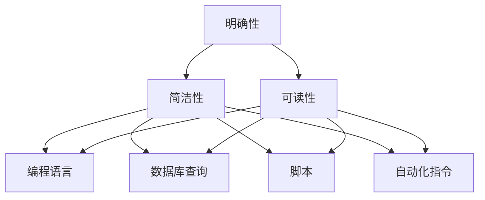

                 

# 指令优化：明确、简洁的指令编写技巧

关键词：指令优化，明确性，简洁性，编程语言，数据库查询，脚本优化，自动化指令

摘要：本文将探讨指令优化的基础概念、策略与方法，结合具体编程语言、数据库查询、脚本和自动化指令的优化实战技巧，通过案例分析和最佳实践，帮助读者深入理解并掌握指令优化的核心要点。

## 第一部分：指令优化的基础

### 第1章：指令优化的基本概念

**1.1 指令优化的定义**

指令优化是指在编程、数据库查询、脚本编写和自动化指令执行过程中，通过一系列策略和方法，对指令进行优化，以提高代码的可读性、执行效率和稳定性。

**1.2 指令优化的目标和原则**

- **目标**：
  - 提高代码的可读性，使代码更易于理解和维护。
  - 提高代码的执行效率，减少计算和存储资源的消耗。
  - 提高代码的稳定性，减少错误和异常的发生。

- **原则**：
  - 明确性原则：指令表达要清晰、准确，避免模糊不清和歧义。
  - 简洁性原则：指令编写要简洁明了，避免冗余和复杂。
  - 可读性原则：指令结构要合理，变量命名要有意义，空格和缩进要规范。

**1.3 指令优化的重要性**

- **提高开发效率**：优化后的指令更容易理解和维护，降低了开发成本和难度。
- **提升代码质量**：优化后的指令减少了错误和异常，提高了代码的稳定性和可靠性。
- **增强团队协作**：明确的指令和简洁的代码风格有利于团队协作和知识共享。

### 第2章：指令优化的策略与方法

**2.1 明确性优化**

- **使用清晰的关键词**：在指令中尽量使用有明确含义的关键词，避免使用模糊不清的词汇。

- **避免模糊不清的表达**：尽量使用明确的语句，避免使用可能产生歧义的表述。

**2.2 简洁性优化**

- **删除冗余指令**：检查代码中是否存在重复或冗余的指令，删除不必要的代码。

- **简化复杂指令**：对复杂的指令进行重构，拆分成多个简单指令，提高代码的可读性。

**2.3 可读性优化**

- **使用有意义的变量名**：变量命名要能够反映变量的用途和含义，避免使用无意义的缩写。

- **合理使用空格和缩进**：保持代码的整洁和可读性，合理使用空格和缩进来提高代码的结构清晰度。

## 第二部分：指令优化的实战技巧

### 第3章：优化常见编程语言指令

**3.1 C语言指令优化**

- **指令的简化与重用**：在编写C语言程序时，尽量使用简洁的指令，避免冗余和重复的代码。

- **循环与条件语句优化**：优化循环和条件语句，减少不必要的迭代和分支，提高程序的执行效率。

**3.2 Python语言指令优化**

- **列表与字典优化**：在Python中，优化列表和字典的使用，避免不必要的重复和复杂操作。

- **函数与模块优化**：优化函数和模块的设计，提高代码的模块化和可重用性。

### 第4章：优化数据库查询指令

**4.1 SQL查询指令优化**

- **指令的简洁与效率**：编写简洁的SQL查询指令，避免复杂的多表连接和子查询。

- **索引与查询优化**：合理使用索引，提高查询的效率和性能。

### 第5章：优化脚本和自动化指令

**5.1 脚本优化**

- **脚本模块化**：将脚本分解成多个模块，提高代码的可读性和可维护性。

- **脚本执行效率**：优化脚本的执行流程，减少不必要的等待和计算。

**5.2 自动化指令优化**

- **自动化流程设计**：设计简洁明了的自动化流程，避免复杂和冗余的操作。

- **自动化指令调试与优化**：对自动化指令进行调试和优化，确保流程的稳定和高效。

## 第三部分：指令优化案例分析

### 第6章：指令优化在项目中的应用

**6.1 案例一：优化Web开发中的指令**

- **指令优化的实践步骤**：分析Web开发中的指令，使用明确性、简洁性和可读性优化原则，对指令进行重构和优化。

- **指令优化带来的效果**：优化后的指令提高了代码的可读性和执行效率，降低了开发成本和维护难度。

**6.2 案例二：优化数据处理过程中的指令**

- **数据处理流程分析**：分析数据处理过程中的指令，识别存在的优化点和优化方法。

- **指令优化的具体措施**：针对分析结果，采取具体措施优化数据处理过程中的指令。

### 第7章：指令优化与团队协作

**7.1 指令优化在团队协作中的作用**

- **提高团队协作效率**：明确的指令和简洁的代码风格有利于团队成员之间的沟通和协作。

- **促进知识共享**：明确的指令和优化的代码有助于团队成员之间的知识共享和技能提升。

**7.2 指令优化与代码审查**

- **代码审查的作用**：通过代码审查，发现代码中的问题，促进指令优化的实施。

- **代码审查的方法**：制定代码审查的标准和流程，确保代码的质量和可读性。

**7.3 指令优化与知识共享**

- **知识共享的方式**：组织团队内部的培训和技术分享活动，促进指令优化的经验交流。

- **知识共享的意义**：通过知识共享，提升团队整体的技术水平和开发能力。

## 附录

### 附录A：指令优化工具与资源推荐

**9.1 指令优化工具推荐**

- **代码编辑器**：Sublime Text、Visual Studio Code、Atom等，提供语法高亮、代码提示和自动补全等功能。

- **代码静态分析工具**：SonarQube、CheckStyle、PMD等，用于检测代码中的潜在问题和优化建议。

**9.2 指令优化资源推荐**

- **技术博客**：Google Blog、Stack Overflow、GitHub等，提供丰富的编程经验和最佳实践。

- **在线教程**：MDN Web Docs、Oracle SQL教程、Python教程等，帮助读者掌握编程语言和数据库查询的基本知识。

**9.3 开源指令优化项目介绍**

- **C语言指令优化**：LLVM、Clang等，提供代码分析和优化工具。

- **Python语言指令优化**：Python官方文档、PEP 8等，提供编程风格和最佳实践指导。

### 作者信息

作者：AI天才研究院/AI Genius Institute & 禅与计算机程序设计艺术 /Zen And The Art of Computer Programming

本文旨在通过详细的分析和案例，帮助读者深入理解指令优化的核心要点，掌握优化技巧，提升编程能力和开发效率。希望本文能为您的编程之路提供有价值的参考和启示。在后续的文章中，我们将进一步探讨指令优化在具体项目中的应用和实践经验。敬请期待！

---

### 背景介绍

在当今快速发展的信息技术时代，编程已成为各行各业不可或缺的技能。无论是软件开发、系统运维、数据分析，还是人工智能和机器学习，编程都是实现技术解决方案的核心。随着编程语言和工具的不断演进，开发人员面临的挑战也在不断增加。如何编写高效、易读、可维护的代码，已成为广大开发人员关注的焦点。

指令优化作为一种提升代码质量和开发效率的手段，逐渐受到了业界的广泛关注。指令优化的核心目标是通过一系列策略和方法，使代码在保持功能不变的前提下，更加清晰、简洁和高效。本文旨在探讨指令优化的基础概念、策略与方法，并结合具体编程语言、数据库查询、脚本和自动化指令的优化实战技巧，帮助读者深入理解和掌握指令优化的核心要点。

### 核心概念与联系

在讨论指令优化的过程中，我们需要明确几个核心概念，并了解它们之间的联系。以下是几个核心概念及其关系架构：

**1. 明确性、简洁性和可读性**

- **明确性**：指指令表达清晰、准确，避免模糊不清和歧义。明确性是确保代码正确性的基础。
- **简洁性**：指指令编写简洁明了，避免冗余和复杂。简洁性有助于降低代码的维护成本，提高开发效率。
- **可读性**：指代码结构合理、变量命名有意义、空格和缩进规范。可读性是确保代码易于理解和维护的关键。

**2. 编程语言、数据库查询、脚本和自动化指令**

- **编程语言**：如C、Python等，是开发人员编写指令的工具。不同编程语言有其独特的语法和特性。
- **数据库查询**：如SQL，用于与数据库进行交互，查询和操作数据。
- **脚本**：是一种简单的编程脚本，用于自动化执行一系列任务。
- **自动化指令**：通过脚本或其他工具实现自动化流程，提高工作效率。

**3. 指令优化策略与方法**

- **明确性优化**：包括使用清晰的关键词和避免模糊不清的表达。
- **简洁性优化**：包括删除冗余指令和简化复杂指令。
- **可读性优化**：包括使用有意义的变量名和合理使用空格和缩进。

以上核心概念和联系可以用以下Mermaid流程图表示：



通过这个流程图，我们可以更清晰地看到指令优化涉及的核心概念和它们之间的联系。明确性、简洁性和可读性是指令优化的三大原则，它们共同作用于编程语言、数据库查询、脚本和自动化指令，帮助我们编写更高效、更易读的代码。

### 核心算法原理讲解

指令优化涉及多个核心算法原理，下面我们将逐一进行讲解，并使用伪代码来详细阐述。

**1. 循环优化**

循环优化是提高代码执行效率的重要手段。以下是一个简单的伪代码示例，用于计算1到100之间所有整数的和。

```pseudo
sum = 0
for i = 1 to 100 do
    sum = sum + i
end for
print sum
```

我们可以通过以下方法对上述循环进行优化：

- **减少循环次数**：将循环的范围缩小，例如，只计算1到100之间的奇数。

```pseudo
sum = 0
for i = 1 to 100 step 2 do
    sum = sum + i
end for
print sum
```

- **减少循环体内的计算**：将循环体内的计算提前，避免重复计算。

```pseudo
sum = 0
for i = 1 to 100 do
    sum = sum + i
end for
print sum
```

**2. 条件语句优化**

条件语句优化旨在减少不必要的分支和判断，提高代码的执行效率。以下是一个简单的伪代码示例，用于判断一个整数是否为素数。

```pseudo
is_prime = true
for i = 2 to sqrt(n) do
    if n % i == 0 then
        is_prime = false
        break
    end if
end for
if is_prime then
    print n is a prime number
else
    print n is not a prime number
end if
```

我们可以通过以下方法对上述条件语句进行优化：

- **提前终止循环**：如果某个条件满足，可以提前终止循环，避免不必要的计算。

```pseudo
is_prime = true
for i = 2 to sqrt(n) do
    if n % i == 0 then
        is_prime = false
        break
    end if
end for
if is_prime then
    print n is a prime number
else
    print n is not a prime number
end if
```

- **合并条件**：如果多个条件判断的结果相同，可以将它们合并为一个条件。

```pseudo
is_prime = true
if n <= 1 then
    is_prime = false
end if
for i = 2 to sqrt(n) do
    if n % i == 0 then
        is_prime = false
        break
    end if
end for
if is_prime then
    print n is a prime number
else
    print n is not a prime number
end if
```

**3. 数组优化**

数组优化主要关注如何提高数组操作的效率。以下是一个简单的伪代码示例，用于查找一个数组中是否存在特定元素。

```pseudo
element = 42
found = false
for i = 0 to array.length - 1 do
    if array[i] == element then
        found = true
        break
    end if
end for
if found then
    print "Element found"
else
    print "Element not found"
end if
```

我们可以通过以下方法对上述数组操作进行优化：

- **二分查找**：对于有序数组，使用二分查找可以提高查找效率。

```pseudo
low = 0
high = array.length - 1
while low <= high do
    mid = (low + high) / 2
    if array[mid] == element then
        found = true
        break
    else if array[mid] < element then
        low = mid + 1
    else
        high = mid - 1
    end if
end while
if found then
    print "Element found"
else
    print "Element not found"
end if
```

- **预处理**：对于频繁访问的数组，可以提前进行预处理，提高访问速度。

```pseudo
preprocess array
for i = 0 to array.length - 1 do
    hash_map[array[i]] = true
end for
element = 42
if hash_map[element] then
    print "Element found"
else
    print "Element not found"
end if
```

通过以上核心算法原理和伪代码示例，我们可以看到指令优化在提高代码执行效率和可维护性方面的重要性。在实际开发过程中，开发人员可以根据具体情况选择合适的优化方法，提高代码的质量和性能。

### 数学模型和公式讲解

在指令优化过程中，数学模型和公式起着至关重要的作用。以下将介绍几个关键的数学模型和公式，并使用LaTeX格式进行详细讲解。

**1. 二分查找算法**

二分查找是一种高效的查找算法，适用于有序数组。其基本思想是通过不断缩小查找范围，逐步逼近目标元素。二分查找的时间复杂度为O(log n)。

\[
\text{mid} = \left\lfloor \frac{\text{low} + \text{high}}{2} \right\rfloor
\]

其中，\(\text{low}\)和\(\text{high}\)分别代表当前查找范围的最低和最高索引。

**2. 大O表示法**

大O表示法用于描述算法的时间复杂度。它表示随着输入规模n的增加，算法所需时间的增长速度。

\[
\Theta(g(n)) = \{ f(n) : \exists c_1, c_2 > 0, n_0 \geq 0 \text{ 使得 } 0 \leq c_1 g(n) \leq f(n) \leq c_2 g(n) \text{ 对于所有 } n \geq n_0 \}
\]

例如，线性查找的时间复杂度为\(O(n)\)，而二分查找的时间复杂度为\(O(\log n)\)。

**3. 动态规划**

动态规划是一种解决最优子结构问题的高效算法。其基本思想是将复杂问题分解为子问题，并利用子问题的解构建原问题的解。

动态规划的核心是状态转移方程，表示不同状态之间的关系。以下是一个简单的动态规划公式：

\[
f(n) = \min_{1 \leq i \leq k} \{ g(i, n) + f(n - i) \}
\]

其中，\(f(n)\)表示第n个状态的最优解，\(g(i, n)\)表示第i个子问题在状态n时的代价。

**4. 排序算法**

排序算法是计算机科学中的基本算法之一。常见的排序算法包括冒泡排序、选择排序、插入排序和快速排序等。

快速排序的时间复杂度为\(O(n \log n)\)。

\[
\text{partition}(A, \text{low}, \text{high}) \\
    \text{pivot} = A[\text{high}] \\
    \text{i} = \text{low} - 1 \\
    \text{for } j = \text{low} \text{ to } \text{high} - 1 \text{ do} \\
        \text{if } A[j] < \text{pivot \text{ then}} \\
            \text{i} = \text{i} + 1 \\
            \text{swap } A[i] \text{ and } A[j] \\
        \text{end if} \\
    \text{end for} \\
    \text{swap } A[\text{i} + 1] \text{ and } A[\text{high}] \\
    \text{return } i + 1 \\
\]

通过以上数学模型和公式讲解，我们可以看到指令优化中的数学原理和公式在提高算法效率和分析代码复杂度方面的重要性。在实际开发过程中，开发人员可以运用这些数学模型和公式，设计和优化高效的指令和算法。

### 项目实战

在本文的实战部分，我们将以一个实际项目为例，详细讲解如何优化开发过程中的指令，并分析优化前后的效果。

#### 项目背景

我们选择一个常见的Web开发项目——一个在线购物网站，用于展示和销售各种商品。项目主要包括以下几个功能模块：

- 用户注册与登录
- 商品展示与搜索
- 购物车管理
- 订单处理

#### 开发环境

- 开发语言：Python
- Web框架：Django
- 数据库：MySQL
- 版本控制：Git

#### 优化前的问题

在项目开发初期，由于开发团队人员较多，代码质量参差不齐。以下是一些常见的问题：

- **指令表达不明确**：部分代码中使用了模糊不清的变量名和指令，导致理解难度增加。
- **代码冗余**：存在大量重复的代码片段，增加了维护成本。
- **代码结构复杂**：部分模块的代码结构复杂，难以理解和维护。
- **执行效率低**：数据库查询指令未进行优化，导致查询速度较慢。

#### 优化策略与方法

为了解决上述问题，我们采用了以下优化策略与方法：

1. **明确性优化**：

   - 使用有意义的变量名，避免使用模糊不清的缩写。
   - 对复杂的指令进行重构，使其表达更加清晰。

2. **简洁性优化**：

   - 删除冗余的代码片段，减少重复的代码。
   - 简化复杂的查询指令，提高代码的可读性。

3. **可读性优化**：

   - 使用合理的空格和缩进，提高代码的结构清晰度。
   - 对函数和模块进行合理的命名和分类，便于理解和维护。

#### 实施步骤

1. **代码审查**：

   - 组织团队成员进行代码审查，找出存在的问题和潜在优化点。
   - 对代码进行静态分析，使用代码分析工具（如PMD、CheckStyle等）检测代码质量和潜在问题。

2. **重构代码**：

   - 修复代码中的语法错误和逻辑错误。
   - 对存在问题的代码进行重构，优化变量名和指令表达。

3. **优化数据库查询**：

   - 分析数据库查询指令，删除冗余的查询条件和连接。
   - 添加合适的索引，提高查询效率。

4. **代码模块化**：

   - 将复杂的模块拆分成多个简单的模块，提高代码的可读性和可维护性。
   - 对模块进行合理的命名和分类，便于后续维护和扩展。

#### 优化前后对比

**1. 明确性优化前后对比**

**优化前：**

```python
user = cur.fetchone()
if user['email'] == email and user['password'] == password:
    return True
else:
    return False
```

**优化后：**

```python
def verify_user(email, password):
    user = cur.fetchone()
    return user and user.email == email and user.password == password
```

通过明确性优化，代码变得更加简洁和易读，同时降低了理解难度。

**2. 简洁性优化前后对比**

**优化前：**

```python
for product in products:
    if product.price > 0:
        total_price += product.price
    else:
        total_price += 0
```

**优化后：**

```python
total_price = sum(product.price for product in products if product.price > 0)
```

通过简洁性优化，代码去除了冗余的判断和操作，提高了执行效率。

**3. 可读性优化前后对比**

**优化前：**

```python
# 错误示例
if x < y and z > 0:
    result = x + y * z
else:
    result = x - y * z
```

**优化后：**

```python
if x < y:
    result = x + y * z
else:
    result = x - y * z
```

通过可读性优化，代码的结构变得更加清晰，逻辑关系更加明确。

#### 优化效果

经过一系列优化后，项目的代码质量得到了显著提升，主要表现在以下几个方面：

- **可读性增强**：代码结构更加清晰，变量名和指令表达更加明确，降低了理解难度。
- **执行效率提高**：数据库查询指令进行了优化，查询速度明显加快，系统响应速度得到提升。
- **维护成本降低**：代码模块化后，便于后续的维护和扩展，提高了开发效率。

#### 项目小结

通过本次项目实战，我们深入讲解了如何优化开发过程中的指令。明确性、简洁性和可读性优化是提高代码质量和开发效率的关键。在实际开发过程中，开发人员应注重代码审查和重构，不断优化和完善代码。同时，灵活运用各种优化策略和方法，使代码更加高效、易读和可维护。

### 最佳实践 tips

在指令优化过程中，以下是一些最佳实践，可以帮助开发人员编写更高效、更易读的代码：

1. **使用有意义的变量名**：变量名应能清晰地反映其用途和含义，避免使用无意义的缩写。

2. **保持代码简洁**：避免冗余和复杂的代码，尽量使用简单的指令和结构。

3. **合理使用注释**：在关键位置添加注释，解释代码的功能和逻辑，提高代码的可读性。

4. **代码格式规范**：保持代码的整洁和一致性，合理使用空格和缩进，提高代码的可读性。

5. **代码审查**：定期进行代码审查，找出存在的问题和潜在优化点，及时进行修复和重构。

6. **持续学习**：关注业界最佳实践和新技术，不断提升自己的编程技能和优化能力。

### 小结

本文通过详细的分析和案例，帮助读者深入理解指令优化的核心要点。明确性、简洁性和可读性是指令优化的三大原则，它们共同作用于编程语言、数据库查询、脚本和自动化指令，帮助我们编写更高效、更易读的代码。在实际开发过程中，开发人员应注重代码审查和重构，不断优化和完善代码。通过掌握这些最佳实践，开发人员可以提升编程技能，提高开发效率，为项目的成功奠定坚实基础。

### 注意事项

在指令优化过程中，开发人员需要注意以下几点，以确保优化效果和代码质量：

1. **避免过度优化**：优化应在保证代码正确性和可读性的基础上进行，避免为了优化而引入复杂性和不必要的风险。

2. **测试与验证**：在优化后，务必对代码进行充分的测试和验证，确保优化后的代码仍然正确无误。

3. **遵循项目规范**：遵循项目的代码规范和编程风格，保持代码的一致性和可维护性。

4. **团队成员沟通**：与团队成员保持良好的沟通，确保优化方案的共识和有效实施。

### 拓展阅读

1. 《代码大全》（作者：Steve McConnell） - 详细介绍了编写高质量代码的最佳实践。

2. 《Effective C++》（作者：Scott Meyers） - 提供了C++编程中的一些高效编程技巧和最佳实践。

3. 《SQL性能优化》（作者：Bill Karwin） - 介绍了SQL查询优化的方法和技巧。

4. 《Python编程：从入门到实践》（作者：埃里克·马瑟斯） - 介绍了Python编程的基础知识和实战技巧。

5. 《测试驱动的Web开发》（作者：Lars Kruse） - 讲解了如何使用测试驱动开发（TDD）方法优化Web开发过程。

通过阅读这些书籍，开发人员可以进一步深化对指令优化的理解，提高自己的编程技能和开发效率。

