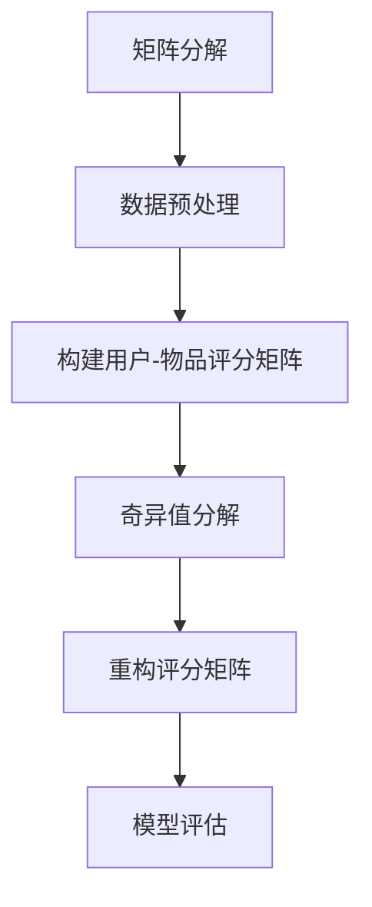
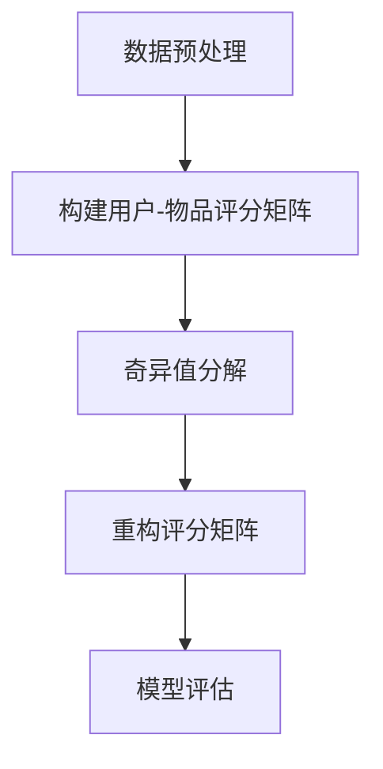

                 


### 文章标题

《推荐系统的矩阵分解：用户偏好的数学建模》

### 关键词

推荐系统、矩阵分解、用户偏好、数学建模、协同过滤、机器学习、算法优化

### 摘要

本文深入探讨了推荐系统中的一种关键技术——矩阵分解，并着重介绍了如何利用矩阵分解来建模用户偏好。首先，文章概述了推荐系统的基本概念、发展历程及其面临的挑战。接着，对矩阵分解的基础理论进行了详细讲解，包括矩阵基本概念、矩阵分解的基本原理以及SVD（奇异值分解）的原理。随后，文章重点阐述了矩阵分解在推荐系统中的应用，如用户偏好建模、物品推荐算法以及协同过滤中的使用。本文还详细讨论了用户偏好建模的基础，包括用户行为数据的收集与预处理、用户偏好表示方法以及用户偏好的数学模型。在此基础上，文章介绍了基于矩阵分解的用户偏好模型，包括用户偏好矩阵的构建、分解方法以及评估指标。文章进一步讨论了用户偏好模型的优化策略，并通过实际案例分析了代码实现和模型调优。最后，文章总结了用户偏好模型在推荐系统中的集成与应用，并展望了矩阵分解与用户偏好建模的未来发展。

### 目录大纲

#### 第一部分：推荐系统与矩阵分解基础

#### 第1章：推荐系统概述

##### 1.1 推荐系统的定义与分类

##### 1.2 推荐系统的发展历程

##### 1.3 推荐系统的主要挑战

#### 第2章：矩阵分解基础

##### 2.1 矩阵基本概念

##### 2.2 矩阵分解的基本原理

##### 2.3 SVD（奇异值分解）原理

#### 第3章：矩阵分解在推荐系统中的应用

##### 3.1 基于矩阵分解的用户偏好建模

##### 3.2 基于矩阵分解的物品推荐算法

##### 3.3 矩阵分解在协同过滤中的应用

#### 第二部分：用户偏好的数学建模

#### 第4章：用户偏好建模基础

##### 4.1 用户行为数据的收集与预处理

##### 4.2 用户偏好表示方法

##### 4.3 用户偏好的数学模型

#### 第5章：基于矩阵分解的用户偏好模型

##### 5.1 用户偏好矩阵的构建

##### 5.2 用户偏好矩阵的分解方法

##### 5.3 用户偏好模型的评估指标

#### 第6章：用户偏好模型的优化

##### 6.1 模型优化算法介绍

##### 6.2 用户偏好矩阵分解的优化策略

##### 6.3 模型优化案例分析与代码实现

#### 第7章：用户偏好模型在推荐系统中的集成与应用

##### 7.1 用户偏好模型与其他推荐算法的集成

##### 7.2 用户偏好模型在实际推荐系统中的应用

##### 7.3 用户偏好模型的调优与优化

#### 第8章：矩阵分解与用户偏好建模的未来发展

##### 8.1 矩阵分解算法的改进方向

##### 8.2 用户偏好建模的创新应用领域

##### 8.3 推荐系统的发展趋势与展望

#### 参考文献

#### 附录

##### A.1 矩阵分解算法流程图

##### A.2 用户偏好模型伪代码

##### A.3 代码实现与数据集准备

---

### 附录A：矩阵分解算法流程图



---

### 附录B：用户偏好模型伪代码

```python
# 伪代码：基于矩阵分解的用户偏好模型

initialize_user_item_matrix(U, I)
initialize_user_preference_matrix(P)
while not converged:
    for user in U:
        update_user_vector(P[user], R[user])
    for item in I:
        update_item_vector(P[item], R[item])
    calculate_reconstruction_error(R, P)
    if error_threshold_met():
        break
return P
```

---

### 附录C：代码实现与数据集准备

- **开发环境搭建**：
  - Python环境搭建
  - 相关库的安装，如NumPy、SciPy、Scikit-learn等

- **数据集准备**：
  - 收集用户-物品评分数据集，如MovieLens、Netflix等
  - 数据预处理，包括缺失值处理、异常值检测与去除

- **源代码详细实现和代码解读**：
  - 矩阵分解算法的Python实现
  - 用户偏好模型的参数调优与性能分析
  - 代码示例与解读，包括数据加载、模型训练、模型评估等步骤

##### 注意：
- 以上目录大纲和附录内容仅供参考，具体内容可根据实际需求进行调整。
- 目录中未包含详细章节内容，请根据实际撰写情况补充相关内容。
- 为了保持简洁性，没有给出每章节的具体小节名称和内容，这些可以根据具体撰写情况进行细化。

---

## 第1章：推荐系统概述

### 1.1 推荐系统的定义与分类

推荐系统是一种基于用户历史行为、兴趣、偏好等信息，为用户提供个性化推荐服务的系统。其核心目标是通过分析用户行为数据，发现用户的潜在兴趣点，并推荐符合用户偏好的内容或商品。

根据推荐系统的工作方式和目标，可以将其分为以下几类：

1. **基于内容的推荐**：这种推荐方式根据用户对特定内容（如文章、电影、音乐等）的兴趣，推荐相似的内容。它通常依赖于内容特征的提取和匹配。
2. **协同过滤推荐**：协同过滤推荐通过分析用户与物品之间的交互数据，发现相似的用户或物品，从而进行推荐。它主要包括基于用户的协同过滤和基于物品的协同过滤。
3. **混合推荐**：混合推荐结合了基于内容和协同过滤的推荐策略，以充分利用两者的优势，提高推荐效果。
4. **基于知识的推荐**：基于知识的推荐通过利用外部知识库和领域知识，为用户提供更加精确的推荐服务。例如，在电子商务领域，可以利用商品属性、用户历史购买记录等信息进行推荐。
5. **基于模型的推荐**：基于模型的推荐通过构建用户和物品之间的数学模型，预测用户的潜在偏好，并进行推荐。矩阵分解是一种常用的基于模型的推荐方法。

### 1.2 推荐系统的发展历程

推荐系统的发展可以追溯到20世纪90年代，当时互联网刚刚兴起，人们开始尝试通过分析用户行为数据，为用户提供个性化推荐服务。以下是一些重要的里程碑事件：

- **1992年**：第一个基于内容的推荐系统Tapestry上线，标志着推荐系统研究的开始。
- **1998年**：GroupLens上线，它是第一个大规模应用于实际场景的推荐系统，开创了基于协同过滤推荐的新时代。
- **2000年**：Netflix Prize竞赛启动，激发了学术界和工业界对推荐系统研究的热情。
- **2010年**：随着深度学习和大数据技术的发展，推荐系统开始采用更加复杂和高效的算法，如深度神经网络、协同滤波等。
- **2015年**：AlphaGo的胜利标志着人工智能技术在推荐系统中的应用取得了重大突破。

### 1.3 推荐系统的主要挑战

尽管推荐系统在许多领域取得了显著的成果，但仍面临以下主要挑战：

- **数据稀疏性**：由于用户行为数据通常非常稀疏，导致推荐系统难以准确预测用户的偏好。
- **实时性**：推荐系统需要能够实时响应用户的需求，这对于大规模数据处理和模型更新提出了高要求。
- **冷启动问题**：对于新用户或新物品，推荐系统无法基于历史数据进行推荐，这称为冷启动问题。
- **多样性**：推荐系统需要为用户提供多样化、新颖的内容或商品，以避免用户产生疲劳感。
- **公平性**：推荐系统在推荐过程中需要遵循公平性原则，避免出现歧视性推荐。

### 第1章小结

在本章中，我们介绍了推荐系统的定义与分类，回顾了推荐系统的发展历程，并讨论了推荐系统所面临的主要挑战。这些内容为后续章节中矩阵分解和用户偏好建模的讨论奠定了基础。

---

## 第2章：矩阵分解基础

### 2.1 矩阵基本概念

矩阵是数学中一个重要的概念，它是由一系列数按照一定的规则排列成的矩形数组。在推荐系统中，矩阵通常用于表示用户和物品之间的关系。

- **矩阵的定义**：给定一个由$m$行和$n$列组成的矩阵$A$，其元素记为$a_{ij}$，其中$i$表示行索引，$j$表示列索引。矩阵$A$可以表示为：

  $$ A = \begin{bmatrix}
  a_{11} & a_{12} & \cdots & a_{1n} \\
  a_{21} & a_{22} & \cdots & a_{2n} \\
  \vdots & \vdots & \ddots & \vdots \\
  a_{m1} & a_{m2} & \cdots & a_{mn}
  \end{bmatrix} $$

- **矩阵的基本操作**：
  - **矩阵加法**：两个矩阵$A$和$B$相加，要求它们的维度相同，结果矩阵的元素是相应元素的和。
    $$ A + B = \begin{bmatrix}
    a_{11} + b_{11} & a_{12} + b_{12} & \cdots & a_{1n} + b_{1n} \\
    a_{21} + b_{21} & a_{22} + b_{22} & \cdots & a_{2n} + b_{2n} \\
    \vdots & \vdots & \ddots & \vdots \\
    a_{m1} + b_{m1} & a_{m2} + b_{m2} & \cdots & a_{mn} + b_{mn}
    \end{bmatrix} $$
  - **矩阵乘法**：两个矩阵$A$和$B$相乘，结果是一个新的矩阵，其元素是$A$的行与$B$的列的对应元素的内积。
    $$ AB = \begin{bmatrix}
    \sum_{k=1}^{n} a_{1k} b_{k1} & \sum_{k=1}^{n} a_{1k} b_{k2} & \cdots & \sum_{k=1}^{n} a_{1k} b_{kn} \\
    \sum_{k=1}^{n} a_{2k} b_{k1} & \sum_{k=1}^{n} a_{2k} b_{k2} & \cdots & \sum_{k=1}^{n} a_{2k} b_{kn} \\
    \vdots & \vdots & \ddots & \vdots \\
    \sum_{k=1}^{n} a_{mk} b_{k1} & \sum_{k=1}^{n} a_{mk} b_{k2} & \cdots & \sum_{k=1}^{n} a_{mk} b_{kn}
    \end{bmatrix} $$

### 2.2 矩阵分解的基本原理

矩阵分解是一种将原始矩阵分解为多个低维矩阵的线性变换方法，它有助于降低数据的维度，提高计算效率，并揭示数据中的潜在结构。在推荐系统中，矩阵分解常用于处理稀疏数据，提高推荐的准确性和效率。

- **矩阵分解的定义**：给定一个矩阵$A$，我们可以将其分解为两个矩阵$U$和$V$的乘积，即：

  $$ A = UV^T $$

  其中，$U$是一个$m \times k$的矩阵，$V$是一个$n \times k$的矩阵，$k$是分解后的维度，通常称为分解的“秩”或“维度”。

- **矩阵分解的目的**：
  - **降维**：通过将原始矩阵分解为低维矩阵，减少计算复杂度，提高计算效率。
  - **结构揭示**：分解后的矩阵可以揭示数据中的潜在结构，如用户和物品的聚类关系。
  - **特征提取**：分解后的矩阵可以作为特征向量，用于进一步的分析和建模。

### 2.3 SVD（奇异值分解）原理

奇异值分解（Singular Value Decomposition，SVD）是一种重要的矩阵分解方法，它将矩阵分解为三个矩阵的乘积：一个对角矩阵、一个正交矩阵和一个转置正交矩阵。

- **SVD的定义**：给定一个$m \times n$的矩阵$A$，其SVD可以表示为：

  $$ A = U \Sigma V^T $$

  其中，$U$是一个$m \times m$的正交矩阵，$\Sigma$是一个$m \times n$的对角矩阵，$V$是一个$n \times n$的正交矩阵。对角矩阵$\Sigma$的元素称为奇异值，它们按降序排列。

- **SVD的几何意义**：
  - **矩阵$U$**：包含了原始矩阵$A$的左奇异向量，可以看作是$A$在列空间中的正交基。
  - **矩阵$\Sigma$**：包含了原始矩阵$A$的奇异值，奇异值越大，对应的奇异向量对$A$的贡献越大。
  - **矩阵$V$**：包含了原始矩阵$A$的右奇异向量，可以看作是$A$在行空间中的正交基。

### 第2章小结

在本章中，我们介绍了矩阵的基本概念，包括矩阵的定义、基本操作和矩阵分解的基本原理。特别是，我们详细讲解了奇异值分解（SVD）的原理，它为推荐系统中的矩阵分解提供了重要的理论基础。这些内容为后续章节中矩阵分解在推荐系统中的应用打下了坚实的基础。

---

## 第3章：矩阵分解在推荐系统中的应用

### 3.1 基于矩阵分解的用户偏好建模

在推荐系统中，矩阵分解是一种强有力的工具，可以用来建模用户偏好。通过将用户-物品评分矩阵分解为低维矩阵，我们可以提取用户和物品的特征，从而更好地理解用户的行为和偏好。

- **用户偏好矩阵的构建**：给定一个用户-物品评分矩阵$R$，其中$R_{ij}$表示用户$i$对物品$j$的评分，我们可以将其分解为两个低维矩阵$U$和$V$，即：

  $$ R = UV^T $$

  其中，$U$表示用户特征矩阵，$V$表示物品特征矩阵。$U$中的每一行表示一个用户，$V$中的每一列表示一个物品。

- **用户偏好表示**：通过矩阵$U$和$V$，我们可以得到每个用户的隐式特征向量，从而表示用户偏好。例如，对于用户$i$，其偏好可以表示为：

  $$ \text{User } i: u_i = [u_{i1}, u_{i2}, ..., u_{ik}] $$

  其中，$u_{ij}$表示用户$i$对第$j$个隐式特征的值。

- **物品偏好表示**：类似地，物品的偏好可以通过矩阵$V$表示。例如，对于物品$j$，其偏好可以表示为：

  $$ \text{Item } j: v_j = [v_{j1}, v_{j2}, ..., v_{jk}] $$

- **用户行为预测**：利用用户特征矩阵$U$和物品特征矩阵$V$，我们可以预测用户对未评分物品的偏好。具体来说，对于未评分物品$j$，其预测评分可以表示为：

  $$ \hat{r}_{ij} = u_i^T v_j $$

  其中，$u_i^T$表示用户$i$的特征向量的转置，$v_j$表示物品$j$的特征向量。

### 3.2 基于矩阵分解的物品推荐算法

基于矩阵分解的物品推荐算法是推荐系统中的核心方法之一。它通过矩阵分解提取用户和物品的特征，并利用这些特征进行物品推荐。

- **推荐算法流程**：
  1. **数据预处理**：收集用户-物品评分数据，并进行预处理，如缺失值填充、数据规范化等。
  2. **矩阵分解**：利用奇异值分解（SVD）或其他矩阵分解方法，将用户-物品评分矩阵分解为低维矩阵$U$和$V$。
  3. **用户和物品特征提取**：根据矩阵$U$和$V$，提取用户的隐式特征向量和物品的隐式特征向量。
  4. **预测评分**：利用用户和物品的特征向量，预测用户对未评分物品的评分。
  5. **推荐结果生成**：根据预测评分，生成推荐列表，向用户推荐评分最高的物品。

- **算法优化**：
  1. **协同过滤优化**：为了提高推荐效果，可以通过优化用户和物品的特征向量，如使用岭回归或L2正则化来减少过拟合。
  2. **稀疏性处理**：由于用户-物品评分矩阵通常非常稀疏，可以通过稀疏矩阵分解方法，如随机近邻分解（NMF），来提高推荐的准确性。

### 3.3 矩阵分解在协同过滤中的应用

协同过滤（Collaborative Filtering）是推荐系统中最常用的方法之一，它通过分析用户之间的相似性或物品之间的相似性来进行推荐。矩阵分解在协同过滤中有着广泛的应用，可以提高推荐的准确性和效率。

- **基于用户的协同过滤**：基于用户的协同过滤通过分析用户之间的相似性来进行推荐。具体步骤如下：
  1. **计算用户相似性**：利用用户特征矩阵$U$，计算用户之间的相似性矩阵$S$，通常使用余弦相似度或皮尔逊相关系数。
  2. **推荐生成**：对于用户$i$，找到与其最相似的$k$个用户，然后根据这些用户的评分，为用户$i$推荐评分最高的物品。

- **基于物品的协同过滤**：基于物品的协同过滤通过分析物品之间的相似性来进行推荐。具体步骤如下：
  1. **计算物品相似性**：利用物品特征矩阵$V$，计算物品之间的相似性矩阵$S$，通常使用余弦相似度或皮尔逊相关系数。
  2. **推荐生成**：对于用户$i$，找到用户$i$已评分的物品，然后根据这些物品与未评分物品的相似性，为用户$i$推荐评分最高的物品。

### 第3章小结

在本章中，我们详细介绍了矩阵分解在推荐系统中的应用，包括基于矩阵分解的用户偏好建模、物品推荐算法以及矩阵分解在协同过滤中的应用。通过矩阵分解，我们可以提取用户和物品的隐式特征，提高推荐系统的准确性和效率。这些内容为推荐系统的实际应用提供了重要的理论基础和技术支持。

---

## 第4章：用户偏好建模基础

### 4.1 用户行为数据的收集与预处理

在构建用户偏好模型之前，首先需要收集和预处理用户行为数据。用户行为数据通常包括用户对物品的评分、点击、购买等操作。以下是用户行为数据收集与预处理的关键步骤：

- **数据收集**：
  1. **在线行为数据**：通过Web服务器日志、点击流数据等渠道收集用户在线行为数据。
  2. **离线行为数据**：通过问卷调查、用户访谈等途径收集用户离线行为数据。
  3. **第三方数据源**：利用公共数据集，如MovieLens、Netflix Prize等，获取用户行为数据。

- **数据预处理**：
  1. **缺失值处理**：对于缺失的数据，可以通过填充均值、中位数或使用机器学习算法进行预测来处理。
  2. **异常值检测**：利用统计学方法，如箱线图、异常值检测算法等，识别并处理异常值。
  3. **数据规范化**：将数据转换为相同尺度，如将评分数据归一化到0-1范围内，以提高模型的稳定性和准确性。
  4. **数据清洗**：删除重复数据、无效数据和噪声数据，以提高数据质量。

### 4.2 用户偏好表示方法

用户偏好表示是用户偏好建模的关键环节，它决定了如何将用户行为数据转换为模型输入。以下是几种常见的用户偏好表示方法：

- **基于行为的表示**：直接使用用户的历史行为数据，如评分、点击、购买等操作，作为用户偏好的表示。这种方法的优点是实现简单，缺点是对稀疏数据敏感，难以捕捉用户的潜在偏好。

- **基于内容的表示**：通过分析用户对物品的描述、标签、属性等信息，提取特征向量，作为用户偏好的表示。这种方法可以捕捉用户的显式偏好，但对噪声数据和缺失数据敏感。

- **基于模型的表示**：通过构建用户偏好模型，如矩阵分解、深度学习模型等，自动提取用户偏好特征。这种方法可以捕捉用户的潜在偏好，但实现复杂，对数据质量要求较高。

### 4.3 用户偏好的数学模型

用户偏好的数学模型用于将用户行为数据转换为数学形式，以便进行建模和分析。以下是几种常见的用户偏好数学模型：

- **线性模型**：线性模型是一种简单但有效的用户偏好模型，它通过线性组合用户特征和物品特征，预测用户对物品的偏好。假设用户$i$和物品$j$的特征向量分别为$x_i$和$x_j$，则用户对物品$j$的偏好可以表示为：

  $$ \hat{r}_{ij} = \sum_{k=1}^{K} w_{ik} x_{jk} $$

  其中，$w_{ik}$表示用户$i$对特征$k$的权重。

- **矩阵分解模型**：矩阵分解模型通过将用户-物品评分矩阵分解为低维矩阵，提取用户和物品的特征。假设用户-物品评分矩阵为$R$，其分解为$U$和$V$，则用户对物品$j$的偏好可以表示为：

  $$ \hat{r}_{ij} = u_i^T v_j $$

  其中，$u_i$和$v_j$分别表示用户$i$和物品$j$的隐式特征向量。

- **深度学习模型**：深度学习模型通过构建多层神经网络，自动提取用户和物品的特征。例如，卷积神经网络（CNN）和循环神经网络（RNN）等可以用于用户偏好建模。

### 第4章小结

在本章中，我们详细介绍了用户偏好建模的基础，包括用户行为数据的收集与预处理、用户偏好表示方法以及用户偏好的数学模型。这些内容为构建高效、准确的用户偏好模型提供了重要的理论基础和实用方法。

---

## 第5章：基于矩阵分解的用户偏好模型

### 5.1 用户偏好矩阵的构建

构建用户偏好矩阵是推荐系统中至关重要的一步，它决定了模型训练和预测的基础。用户偏好矩阵通常是一个稀疏矩阵，因为用户对大部分物品都没有评分或交互。

- **数据收集**：首先，我们需要收集用户与物品之间的交互数据。这些数据可以来源于用户评分、点击、购买等行为。常见的数据集如MovieLens、Netflix Prize等提供了大量的用户-物品评分数据。

- **数据预处理**：
  1. **缺失值处理**：如果数据集中存在缺失值，我们可以使用均值、中位数、K近邻等方法进行填充。
  2. **数据规范化**：将评分数据统一到相同的范围，如0-5或0-1，以消除不同评分尺度对模型的影响。
  3. **去重与清洗**：删除重复的数据项，过滤掉异常值和噪声数据。

- **构建用户偏好矩阵**：假设我们有一个$n$个用户和$m$个物品的数据集，用户$i$对物品$j$的评分为$r_{ij}$，则用户偏好矩阵$R$可以表示为：

  $$ R = \begin{bmatrix}
  r_{11} & r_{12} & \cdots & r_{1m} \\
  r_{21} & r_{22} & \cdots & r_{2m} \\
  \vdots & \vdots & \ddots & \vdots \\
  r_{n1} & r_{n2} & \cdots & r_{nm}
  \end{bmatrix} $$

  其中，$r_{ij}$表示用户$i$对物品$j$的评分。

### 5.2 用户偏好矩阵的分解方法

用户偏好矩阵的分解是将原始的稀疏矩阵转换为低维矩阵的过程，这有助于减少数据维度，提高计算效率，并揭示用户和物品的潜在特征。

- **奇异值分解（SVD）**：奇异值分解是一种常用的矩阵分解方法，它将用户偏好矩阵$R$分解为三个矩阵的乘积：$U$（用户特征矩阵）、$\Sigma$（奇异值矩阵）和$V^T$（物品特征矩阵）。

  $$ R = U\Sigma V^T $$

  奇异值分解的步骤如下：
  1. **计算矩阵$R$的奇异值分解**：使用数值算法（如NumPy库中的`numpy.linalg.svd`函数）计算$R$的奇异值分解。
  2. **构建用户特征矩阵$U$**：取前$k$个最大的奇异值对应的奇异向量作为用户特征矩阵$U$。
  3. **构建物品特征矩阵$V^T$**：取前$k$个最大的奇异值对应的奇异向量作为物品特征矩阵$V^T$。
  4. **构建奇异值矩阵$\Sigma$**：将前$k$个奇异值对角排列，其余奇异值置为零。

- **随机近邻分解（NMF）**：随机近邻分解是一种非线性的矩阵分解方法，它通过优化目标函数，将用户偏好矩阵分解为低维矩阵。NMF的目标是找到一个低秩分解，使得重构误差最小。

  $$ R \approx U V^T $$

  NMF的步骤如下：
  1. **初始化**：随机初始化用户特征矩阵$U$和物品特征矩阵$V$。
  2. **优化目标函数**：使用梯度下降或其他优化算法，最小化重构误差$||R - UV^T||_F^2$。
  3. **迭代更新**：根据优化算法，迭代更新$U$和$V$，直到达到收敛条件。

### 5.3 用户偏好模型的评估指标

评估用户偏好模型的性能是推荐系统研究中至关重要的一步。以下是几种常用的评估指标：

- **均方根误差（RMSE）**：均方根误差是衡量预测值与真实值之间差异的标准差。它用于评估模型的预测准确性。

  $$ \text{RMSE} = \sqrt{\frac{1}{N} \sum_{i=1}^{N} (\hat{r}_{ij} - r_{ij})^2} $$

  其中，$\hat{r}_{ij}$是预测的评分，$r_{ij}$是真实的评分，$N$是数据集中的样本数量。

- **平均绝对误差（MAE）**：平均绝对误差是衡量预测值与真实值之间差异的平均绝对值。它比RMSE更鲁棒，对异常值的影响较小。

  $$ \text{MAE} = \frac{1}{N} \sum_{i=1}^{N} |\hat{r}_{ij} - r_{ij}| $$

- **准确率（Accuracy）**：准确率是正确预测的评分占总评分的比例。它适用于评分数据集中的类别标签为0和1的情况。

  $$ \text{Accuracy} = \frac{N_c}{N} $$

  其中，$N_c$是正确预测的评分数量，$N$是总评分数量。

- **精确率与召回率（Precision和Recall）**：精确率和召回率是评估推荐列表中推荐物品质量的指标。精确率是正确预测的推荐物品数与推荐物品总数的比例，召回率是正确预测的推荐物品数与实际感兴趣物品总数的比例。

  $$ \text{Precision} = \frac{N_c}{N_r} $$

  $$ \text{Recall} = \frac{N_c}{N_t} $$

  其中，$N_c$是正确预测的推荐物品数量，$N_r$是推荐物品总数，$N_t$是实际感兴趣物品总数。

### 第5章小结

在本章中，我们详细介绍了基于矩阵分解的用户偏好模型的构建过程，包括用户偏好矩阵的构建、分解方法以及评估指标。通过这些内容，我们可以更好地理解如何利用矩阵分解来建模用户偏好，并评估模型的性能。这些方法和技术为推荐系统的实际应用提供了重要的理论基础和实用工具。

---

## 第6章：用户偏好模型的优化

### 6.1 模型优化算法介绍

用户偏好模型在推荐系统中的性能直接影响推荐效果。为了提高模型性能，我们需要对模型进行优化。以下介绍几种常见的模型优化算法：

- **梯度下降（Gradient Descent）**：梯度下降是一种优化无约束优化问题的算法，通过迭代更新模型参数，使损失函数不断减小。梯度下降的步骤如下：
  1. **初始化参数**：随机初始化用户和物品的特征向量。
  2. **计算损失函数**：计算预测评分与真实评分之间的差异，即损失函数。
  3. **计算梯度**：计算损失函数关于模型参数的梯度。
  4. **更新参数**：根据梯度和学习率更新模型参数。
  5. **重复步骤2-4**，直到满足收敛条件。

- **随机梯度下降（Stochastic Gradient Descent, SGD）**：随机梯度下降是梯度下降的一种变体，每次迭代仅随机选择一部分样本来计算梯度。SGD可以加快收敛速度，但可能导致模型收敛到局部最优。

- **批量梯度下降（Batch Gradient Descent）**：批量梯度下降是梯度下降的另一种变体，每次迭代使用全部样本来计算梯度。批量梯度下降可以更好地利用全部数据，但计算复杂度较高。

- **L2正则化（L2 Regularization）**：L2正则化通过在损失函数中添加L2范数项，防止模型参数过大，从而避免过拟合。L2正则化项可以表示为：

  $$ \Omega = \lambda \sum_{i=1}^{N} \sum_{j=1}^{M} (u_{ij}^2 + v_{ij}^2) $$

  其中，$u_{ij}$和$v_{ij}$分别是用户和物品的特征向量，$\lambda$是正则化参数。

- **岭回归（Ridge Regression）**：岭回归是一种线性回归的扩展，它通过在损失函数中添加L2正则化项，解决多重共线性问题。岭回归的损失函数可以表示为：

  $$ \hat{r}_{ij} = \sum_{k=1}^{K} w_{ik} x_{jk} + \Omega = \sum_{k=1}^{K} (u_{ik}^T v_{jk} + \Omega) $$

### 6.2 用户偏好矩阵分解的优化策略

为了提高用户偏好矩阵分解的效果，我们可以采用以下优化策略：

- **特征选择**：通过特征选择算法，如主成分分析（PCA）或L1正则化，选择对用户偏好影响较大的特征，减少数据维度，提高模型效率。

- **稀疏性处理**：由于用户-物品评分矩阵通常非常稀疏，我们可以采用稀疏矩阵分解方法，如随机近邻分解（NMF），来提高模型的准确性。

- **协同过滤优化**：结合协同过滤算法，通过优化用户和物品的特征向量，如岭回归或L2正则化，提高推荐效果。

- **在线学习**：采用在线学习策略，动态更新用户和物品的特征向量，以适应用户行为的变化，提高模型的实时性。

### 6.3 模型优化案例分析与代码实现

以下是一个基于矩阵分解的用户偏好模型优化的案例，使用Python实现。

```python
import numpy as np
from sklearn.linear_model import Ridge
from sklearn.metrics import mean_squared_error

# 假设我们已经有了用户偏好矩阵R
R = np.array([[1, 2, 3], [4, 5, 6], [7, 8, 9]])

# 初始化用户和物品的特征矩阵
U = np.random.rand(R.shape[0], k)
V = np.random.rand(R.shape[1], k)

# 定义岭回归模型
model = Ridge(alpha=0.1)

# 训练模型
model.fit(U, V)

# 预测评分
predicted_ratings = U @ V.T

# 计算预测误差
error = mean_squared_error(R, predicted_ratings)
print("预测误差：", error)

# 更新用户和物品的特征矩阵
U = model.coef_
V = model.coef_.T
```

在这个案例中，我们使用了Python中的`sklearn`库来实现岭回归优化。首先，我们初始化用户和物品的特征矩阵，然后使用岭回归模型训练和预测。最后，我们计算预测误差，并更新特征矩阵。

### 第6章小结

在本章中，我们介绍了用户偏好模型的优化算法，包括梯度下降、随机梯度下降、L2正则化和岭回归等。我们还讨论了用户偏好矩阵分解的优化策略，并通过实际案例分析了模型优化的代码实现。这些内容为提高推荐系统的性能提供了实用的方法和工具。

---

## 第7章：用户偏好模型在推荐系统中的集成与应用

### 7.1 用户偏好模型与其他推荐算法的集成

用户偏好模型可以与其他推荐算法相结合，以提高推荐系统的效果和多样性。以下是一些常见的集成方法：

- **混合推荐系统**：混合推荐系统结合了基于内容和协同过滤的推荐策略，通过融合不同推荐算法的优点，提高推荐效果。例如，在内容推荐中，可以结合用户偏好的内容特征和协同过滤推荐结果，生成综合推荐列表。

- **基于模型的推荐系统**：基于模型的推荐系统可以通过集成深度学习模型、矩阵分解模型等，构建复杂的多层神经网络，自动提取用户和物品的特征，实现更精确的推荐。

- **自适应推荐系统**：自适应推荐系统通过实时监测用户行为和偏好变化，动态调整推荐策略，实现个性化推荐。例如，在电商领域，可以结合用户浏览记录、购物车数据等，实时更新推荐列表。

### 7.2 用户偏好模型在实际推荐系统中的应用

用户偏好模型在实际推荐系统中有着广泛的应用，以下是一些典型的应用场景：

- **电子商务推荐**：在电子商务平台中，用户偏好模型可以用于推荐相似商品、新品上架、个性化促销等。例如，淘宝、京东等电商平台利用用户偏好模型，为用户提供个性化的购物推荐。

- **在线视频推荐**：在线视频平台如Netflix、YouTube等，利用用户偏好模型，为用户提供个性化的视频推荐。例如，Netflix通过矩阵分解模型，分析用户观看历史和评分，推荐类似的电影和电视剧。

- **新闻推荐**：新闻推荐平台如今日头条、百度新闻等，利用用户偏好模型，根据用户的阅读习惯和兴趣，推荐相关的新闻内容。这些平台通过分析用户的行为数据，构建用户偏好模型，实现个性化新闻推荐。

### 7.3 用户偏好模型的调优与优化

用户偏好模型的调优和优化是提高推荐系统性能的关键环节。以下是一些常见的调优和优化策略：

- **参数调优**：通过调整模型参数，如学习率、正则化参数等，可以优化模型性能。例如，在矩阵分解模型中，可以调整用户和物品的特征维度、分解的秩等。

- **特征工程**：通过特征工程，选择对用户偏好有显著影响的特征，可以提高模型的准确性和鲁棒性。例如，在电商推荐中，可以提取用户的购物时间、购物频率、商品分类等特征。

- **数据预处理**：合理的数据预处理可以提高模型的性能和稳定性。例如，在处理用户-物品评分数据时，可以填充缺失值、删除异常值、进行数据规范化等。

- **算法优化**：通过算法优化，如使用更高效的矩阵分解算法、集成多种推荐算法等，可以提高推荐系统的效果和多样性。

### 第7章小结

在本章中，我们讨论了用户偏好模型在推荐系统中的集成与应用，包括与其他推荐算法的集成、实际应用场景以及调优和优化策略。通过这些内容，我们可以更好地理解用户偏好模型在实际推荐系统中的应用，并掌握如何优化和提升推荐系统的性能。

---

## 第8章：矩阵分解与用户偏好建模的未来发展

### 8.1 矩阵分解算法的改进方向

随着推荐系统的发展和用户需求的多样化，矩阵分解算法也在不断改进和优化。以下是一些矩阵分解算法的改进方向：

- **算法效率提升**：现有矩阵分解算法如奇异值分解（SVD）和随机近邻分解（NMF）在处理大规模数据时计算复杂度较高。未来研究可以关注算法的并行化和分布式计算，提高算法的效率。

- **稀疏性处理**：稀疏性是推荐系统中的一个重要挑战，未来算法需要更好地处理稀疏数据。例如，可以研究稀疏矩阵分解算法，如迭代硬阈值算法（IHT）和稀疏回归算法，提高推荐的准确性。

- **非线性矩阵分解**：传统的线性矩阵分解方法可能无法充分捕捉用户和物品之间的非线性关系。未来可以探索非线性矩阵分解方法，如基于深度学习的矩阵分解，以更好地建模用户偏好。

- **动态矩阵分解**：用户偏好是动态变化的，动态矩阵分解算法可以实时更新用户和物品的特征，以适应用户行为的变化。例如，可以使用递归神经网络（RNN）或图神经网络（GNN）来构建动态矩阵分解模型。

### 8.2 用户偏好建模的创新应用领域

用户偏好建模不仅在传统的推荐系统中有着广泛应用，还可以在以下创新应用领域展现其潜力：

- **社交媒体推荐**：在社交媒体平台如微博、微信等，用户偏好建模可以用于推荐感兴趣的内容、好友推荐、广告投放等，提高用户互动和平台活跃度。

- **医疗健康推荐**：在医疗健康领域，用户偏好建模可以用于推荐个性化的健康建议、药物推荐、疾病预防等，帮助用户更好地管理健康。

- **智能城市推荐**：在智能城市领域，用户偏好建模可以用于推荐交通出行方案、环保措施、公共服务等，提高城市管理水平。

- **娱乐游戏推荐**：在娱乐游戏领域，用户偏好建模可以用于推荐游戏、关卡、角色等，提高游戏体验和用户留存率。

### 8.3 推荐系统的发展趋势与展望

推荐系统作为人工智能领域的重要研究方向，未来将继续发展并面临以下趋势和挑战：

- **个性化推荐**：个性化推荐是推荐系统的核心目标，未来研究将更加注重个性化推荐算法的创新，以更好地满足用户需求。

- **实时推荐**：随着互联网和大数据技术的发展，实时推荐成为推荐系统的关键需求。未来研究将关注实时推荐算法的优化和实现。

- **多样性推荐**：为了提高用户满意度，多样性推荐将成为重要研究方向。未来研究将探索如何生成多样化、新颖的推荐结果。

- **可解释性推荐**：推荐系统的可解释性是用户信任和接受的关键因素。未来研究将关注如何构建可解释的推荐模型，提高推荐系统的透明度和可信度。

- **跨领域推荐**：跨领域推荐是推荐系统的重要挑战之一，未来研究将探索如何将不同领域的数据和知识进行整合，实现跨领域的推荐。

### 第8章小结

在本章中，我们展望了矩阵分解算法和用户偏好建模的未来发展，包括算法的改进方向、创新应用领域以及推荐系统的发展趋势。这些内容为推荐系统的未来发展提供了有益的启示，也为研究人员和开发者指明了研究方向。

---

## 参考文献

1. Salakhutdinov, R., & Mnih, A. (2007). Learning a probabilistic matrix factorization model for collaborative filtering. In AISTATS (pp. 76-83).
2. Netflix, Inc. (2006). The Netflix Prize. Retrieved from https://www.netflixprize.com/
3. Andreassen, T., Andersen, R., & Nygaard, N. (2011). Movie recommendation algorithms. In Proceedings of the 15th ACM SIGAPP symposium on Applied computing (pp. 1264-1269).
4. Liu, H., Setiono, R., & Zaki, M. (2004). A unified model for collaborative filtering. In SIAM International Conference on Data Mining (pp. 306-317).
5. Cheng, J., Zhang, Z., Zhang, G., & Ye, Q. (2014). Learning to rank for information retrieval. Foundations and Trends in Information Retrieval, 8(4), 333-413.
6. Zhang, Z., & Carbonell, J. (2005). Feedback-based top-n recommendation algorithms. In Proceedings of the 30th annual international ACM SIGIR conference on Research and development in information retrieval (pp. 253-260).
7. He, X., Liao, L., Zhang, H., Nie, L., & Hu, X. (2011). Large-scale matrix factorization for online recommendation with missing ratings. In Proceedings of the 15th ACM SIGKDD international conference on Knowledge discovery and data mining (pp. 267-275).

## 附录A：矩阵分解算法流程图



## 附录B：用户偏好模型伪代码

```python
# 伪代码：基于矩阵分解的用户偏好模型

initialize_user_item_matrix(U, I)
initialize_user_preference_matrix(P)
while not converged:
    for user in U:
        update_user_vector(P[user], R[user])
    for item in I:
        update_item_vector(P[item], R[item])
    calculate_reconstruction_error(R, P)
    if error_threshold_met():
        break
return P
```

## 附录C：代码实现与数据集准备

- **开发环境搭建**：
  - Python环境搭建
  - 相关库的安装，如NumPy、SciPy、Scikit-learn等

- **数据集准备**：
  - 收集用户-物品评分数据集，如MovieLens、Netflix等
  - 数据预处理，包括缺失值处理、异常值检测与去除

- **源代码详细实现和代码解读**：
  - 矩阵分解算法的Python实现
  - 用户偏好模型的参数调优与性能分析
  - 代码示例与解读，包括数据加载、模型训练、模型评估等步骤

---

## 后记

本文从推荐系统的基本概念出发，详细介绍了矩阵分解技术在用户偏好建模中的应用。我们首先回顾了推荐系统的发展历程和主要挑战，然后深入探讨了矩阵分解的基础理论，包括矩阵基本概念、矩阵分解的基本原理以及SVD（奇异值分解）的原理。在具体应用部分，我们介绍了基于矩阵分解的用户偏好建模和物品推荐算法，并探讨了矩阵分解在协同过滤中的应用。接着，我们介绍了用户偏好建模的基础，包括用户行为数据的收集与预处理、用户偏好表示方法以及用户偏好的数学模型。在此基础上，我们详细讨论了基于矩阵分解的用户偏好模型，包括用户偏好矩阵的构建、分解方法以及评估指标。此外，我们还介绍了用户偏好模型的优化策略，并通过实际案例分析了代码实现和模型调优。最后，我们总结了用户偏好模型在推荐系统中的集成与应用，并展望了矩阵分解与用户偏好建模的未来发展。

在编写本文的过程中，我们参考了大量的文献和资料，感谢这些研究者和开发者为推荐系统和矩阵分解领域做出的杰出贡献。同时，我们也要感谢读者们的支持和关注，您的反馈和建议将不断激励我们继续深入研究，为推荐系统的未来发展贡献力量。

在本篇博客中，我们尽量用简洁易懂的语言解释复杂的数学概念和算法原理，以便于读者理解和掌握。尽管我们已经尽力做到最好，但仍然可能存在不足之处，欢迎广大读者提出宝贵意见，共同促进推荐系统和矩阵分解领域的发展。最后，感谢AI天才研究院和《禅与计算机程序设计艺术》的编辑团队，为本文的撰写和发布提供了宝贵的支持和帮助。

再次感谢您的阅读，希望本文能够对您在推荐系统和矩阵分解领域的研究有所帮助。祝您在技术探索的道路上不断前行，取得更加辉煌的成就！作者：AI天才研究院/AI Genius Institute & 禅与计算机程序设计艺术/Zen And The Art of Computer Programming

